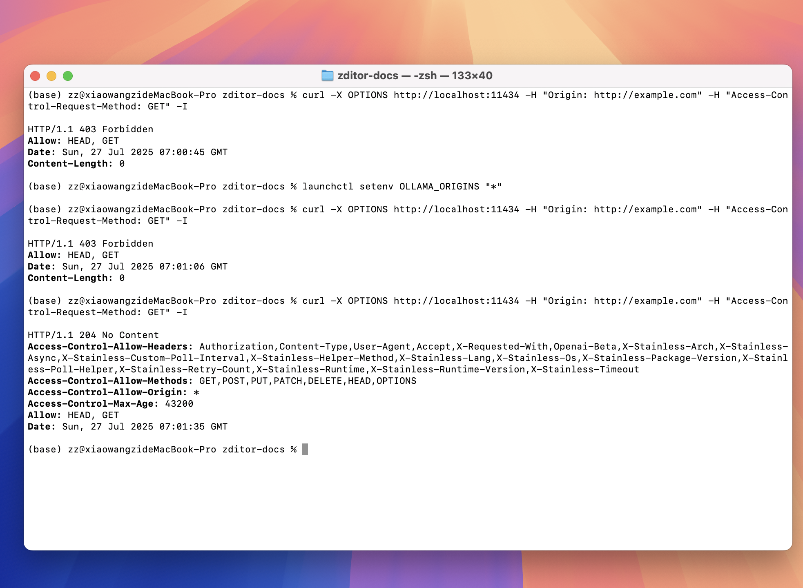

<h1 style="border-bottom: none">
<b></b> 
AI赋能、轻量、高性能、写画一体
 
</h1>
 

轻量、高性能、AI赋能、写画一体、所见即所得 
本地化、基于文件、双链

  

[English Version](README.md)
[日本語版](README_ja.md)

---

欢迎来到 Zditor，一个AI加持的markdown编辑器。

这个仓库不是源代码仓库，仅包含Zditor相关文档。

## 目录

- [入门指南](#入门指南)
- [AI 功能](#AI功能)
- [Agent 智能体系统](#Agent智能体系统)
- [插件系统](#插件系统)
- [快捷键说明](#快捷键说明)

## 反馈

💬 Join [微信群](https://github.com/zditor/zditor-docs/discussions/33)

## 入门指南

Zditor 是一个所见即所得的 markdown 编辑器，支持 markdown 基础语法，并在此基础上扩展。目前支持`Windows`、`Macos`、`Linux`平台，下载请前往 [release 下载界面](https://github.com/zditor/zditor-docs/releases)。

### 演示视频

[zditor 简单演示](https://www.bilibili.com/video/BV1sKZPYBEJA/?share_source=copy_web&vd_source=1974ff0cf0dde44aad6580cca6526a34)

### 签名问题

- `Macos` 目前没有签名，下载之后需要额外两步处理,分别在安装和第一次打开时，`打开设置中隐私与安全，选择仍然打开`

### LLM 模型配置

使用 openai sdk 的流式输出，支持 api 以及本地模型，如下图所示，可以将相关参数填入，其中模型部分，以逗号分隔（英文逗号），`ollama` api key 可以不填

### LLM 使用

支持划词和单独对话标签页，其中划词是单轮会话，标签页是多轮会话，标签页会话支持文件上传、选择文档作为上下文，拖拽上传等。

### 许可证

提供免费许可证，只需要输入邮箱，然后点击发送之后从邮箱获取许可证即可。

!!! warning 未收到许可证
    提示检查邮箱后可能需要等待 1-2 分钟，请先检查垃圾箱，如果仍未有可以等待两分钟重新发送

## AI 功能

AI 功能使用参见[AI 使用指南](./zh_cn/AI使用指南.md)，Ollama 配置参考 [Ollama 配置指南](https://www.bilibili.com/video/BV1Uz8xz2EEQ/)，如果提示连接失败，请先检查：

1. Ollama 是否已经启动
2. 是否开启 vpn（可能需要关闭）
3. 是否配置跨域：[https://objectgraph.com/blog/ollama-cors/](https://objectgraph.com/blog/ollama-cors/)

   

### Ollama 跨域配置

在终端测试`curl -X OPTIONS http://localhost:11434 -H "Origin: http://example.com" -H "Access-Control-Request-Method: GET" -I`如果显示Forbidden说明没有开启跨域，windows系统需要配置系统环境变量：`OLLAMA_ORIGINS`,具体步骤是：

1. 打开系统设置，搜索 `系统变量`
2. 点击弹出对话框，选择 `环境变量`
3. 点击新建，输入`OLLAMA_ORIGINS`以及 `*`
4. 保存，并重启Ollama
5. 测试：`curl -X OPTIONS http://localhost:11434 -H "Origin: http://example.com" -H "Access-Control-Request-Method: GET" -I`，如果显示各种header说明设置成功
6. 打开zditor测试

## Agent 智能体系统

zditor 集成了强大的 Agent 智能体功能，支持 Agent Client Protocol (ACP) 和 Model Context Protocol (MCP)，为您提供更智能的写作和任务执行体验。

- **[Agent 智能体使用指南](./zh_cn/Agent智能体使用指南.md)** - 了解如何配置和使用 Agent 智能体
- **[MCP 服务器配置指南](./zh_cn/MCP服务器配置指南.md)** - 学习如何集成各种 MCP 服务器扩展功能

## 插件系统

zditor支持很多的语法格式，比如表格、公式、[代码块](./zh_cn/插件系统/代码块.md)、[智能文本](./zh_cn/插件系统/智能文本.md)、[元信息](./zh_cn/插件系统/元信息.md)等。

## 快捷键说明

Zditor 提供了丰富的快捷键支持，帮助您更高效地编辑文档。详细的快捷键列表请参见：

**[快捷键说明](./zh_cn/快捷键说明.md)**
