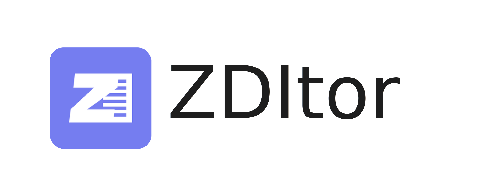

<h1 style="border-bottom: none">
    <b></b> 
    AI赋能、轻量、高性能、写画一体
     
</h1>
 

  轻量、高性能、AI赋能、写画一体、所见即所得 
  本地化、基于文件、双链

  

[English Version](README.md)

---

欢迎来到 Zditor，一个AI加持的markdown编辑器。

这个仓库不是源代码仓库，仅包含Zditor相关文档。

  

## 目录

- [入门指南](#入门指南)
- [规划](#规划)

## 入门指南

Zditor 是一个所见即所得的 markdown 编辑器，支持 markdown 基础语法，并在此基础上扩展。目前支持`Windows`、`Macos`、`Linux`平台，下载请前往 [release 下载界面](https://github.com/zditor/zditor-docs/releases)。

### 演示视频

[zditor 简单演示](https://www.bilibili.com/video/BV1sKZPYBEJA/?share_source=copy_web&vd_source=1974ff0cf0dde44aad6580cca6526a34)

### 签名问题

- `Macos` 目前没有签名，下载之后需要额外两步处理,分别在安装和第一次打开时，`打开设置中隐私与安全，选择仍然打开`

### LLM 模型配置

使用 openai sdk 的流式输出，支持 api 以及本地模型，如下图所示，可以将相关参数填入，其中模型部分，以逗号分隔（英文逗号），`ollama` api key 可以不填

### LLM 使用

支持划词和单独对话标签页，其中划词是单轮会话，标签页是多轮会话，标签页会话支持文件上传、选择文档作为上下文，拖拽上传等。

### 许可证

提供免费许可证，只需要输入邮箱，然后点击发送之后从邮箱获取许可证即可
