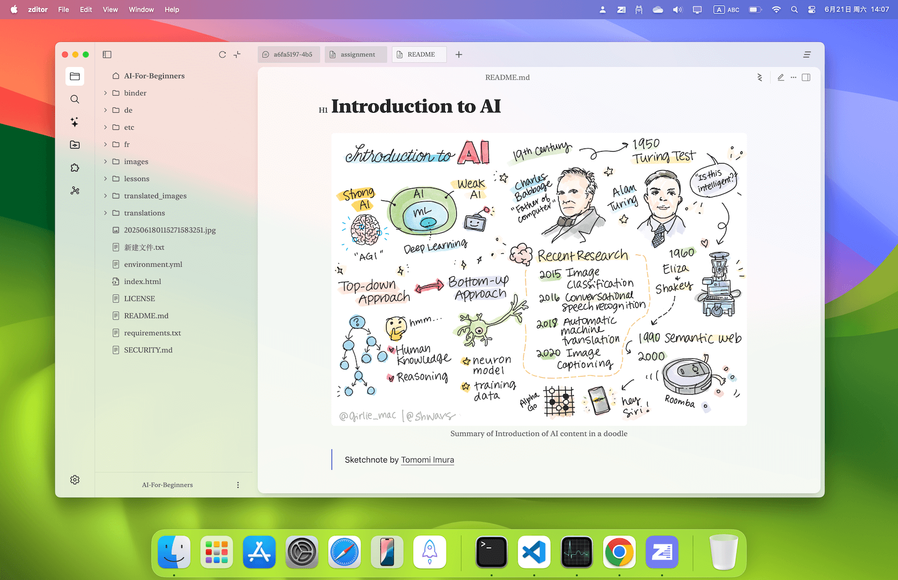

<h1 align="center">Zditor</h1>

  <a href="https://github.com/zditor/zditor-docs">文档</a> - <a href="https://zditor.com">官网</a>

[English Version](README.md)

---

欢迎来到 Zditor，一个AI加持的markdown编辑器。

这个仓库不是源代码仓库，仅包含Zditor相关文档。

  

## 目录

- [入门指南](#入门指南)
- [规划](#规划)

## 反馈

## 入门指南

Zditor 是一个所见即所得的 markdown 编辑器，支持 markdown 基础语法，并在此基础上扩展。目前支持`Windows`、`Macos`、`Linux`平台，下载请前往 [release 下载界面](https://github.com/zditor/zditor-docs/releases)。

### 演示视频

[zditor 简单演示](https://www.bilibili.com/video/BV1sKZPYBEJA/?share_source=copy_web&vd_source=1974ff0cf0dde44aad6580cca6526a34)

### 签名问题

- `Macos` 目前没有签名，下载之后需要额外两步处理,分别在安装和第一次打开是`打开设置中隐私与安全，选择仍然打开`

### LLM 模型配置

使用 openai sdk 的流式输出，支持 api 以及本地模型，如下图所示，可以将相关参数填入，其中模型部分，以逗号分隔（英文逗号），`ollama` api key 可以不填

### LLM 使用

支持划词和单独对话标签页，其中划词是单轮会话，标签页是多轮会话，标签页会话支持文件上传、选择文档作为上下文，拖拽上传等。

### 许可证

提供免费许可证，只需要输出邮箱，然后点击发送之后从邮箱获取许可证即可

## 规划

- 优化 ui，现在 ui 做的还是不协调，尤其是日间模式，考虑使用 claude 优化一下
- 修复 bug，目前一堆 bug，比如 mermaid 有时无法拦截错误，导致下面会出一个默认的横幅，导致页面错乱。先挑一些重要的 bug 改
- 感觉 affine 的无限画布不错，目前 zditor 已经添加了 excalidraw，但是和 markdown 文档并没有结合起来，接下来：
  - 优化性能，现在性能问题很严重，不知道是不是 webview 的问题
  - 首先以 embeding 的形式嵌入到 markdown 文档中
  - 考虑 ai 将 markdonw 文档转换成 excalidraw
  - 考虑 excalidraw 以嵌入的形式插入 markdown 的文档（或者更细粒度的块）
- 优化 git 模块：
  - 之前使用开源的 diff 包性能太差了，自己做了一个，现在可以秒空 100w 级别的文档，但是 ui 还需优化
  - git 相关功能现在只有 commit push pull 等很简陋，需要优化
- 多语言：目前多语言只在部分模块中配置了，后续慢慢添加
- 性能优化：
  - 虽然已经对性能做了优化，比如一些计算密集型任务在 rust 实现，但是还有很大提升空间，很多 prosemirror 插件直接用的开源的，这些开源的有些可能写的太烂了，后续还需优化
  - 打开文件目前性能还是太差，虽然对比 tiptap 等主流的这些基于 prosemirror 的编辑器性能要好了，但是 obsidian 可以秒开大文件，目标还是要向 obsidian 看齐（但是他们没开源，可能用的不是 prosemirror，而性能瓶颈恰恰是 prosemirror，之后再看看怎么搞）。**目标是至少要能做到 100w 字符的文档秒开**。
- 快捷键 很多虽然添加了，但是还需处理。

### 一些思考 🤔

- 之前考虑做知识库来着，但是没法接受大几百 MB 的 app 大小（模型 embedding）或者外挂一个服务。还是希望 app 大小能维持在**20MB 以内**，
- 做全局划词插件，发现这个需要模拟 mod c/v 导致有负效应，或者就要更深入电脑系统的 api（虽然之前做过 swift app 但是 objc 确实不会），感觉豆包做的挺好（估计还是有模拟 mod c/v 😂)
- 打算做一个状态机的插件，就是比思维导图更近一阶，ai 在帮我读完和分析代码之后，其中有些 if else 分支这里可以用思维导图实现（后续打算是让 ai 给我兼容 excalidraw 的手绘思维导图）,然后状态机就是可以像一个 flow 一样，当我选择某个条件之后能指引我下一步是啥，这个还会涉及比如循环，所以思维导图是没法实现好的。
