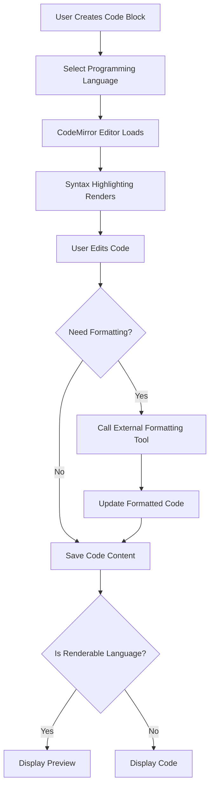
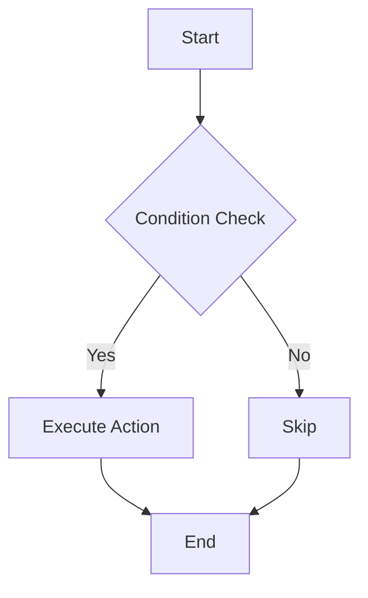

# Zditor Code Plugin Feature Guide

## 1. What is the Code Plugin?

!!! info "Core Concept"
    The Code Plugin is one of the core features of the Zditor Markdown editor, providing users with powerful code editing, syntax highlighting, code formatting, and multi-language support capabilities. By integrating the CodeMirror editor and a custom code formatting system, users can seamlessly write, edit, and format code in various programming languages within Markdown documents.

## 2. How Does the Code Plugin Work?

The Code Plugin is based on CodeMirror, offering a powerful code editing experience. When you create a code block in the editor, the system:

1. **Creates a Code Block**: Creates a CodeFence node via the toolbar or shortcut keys.
2. **Language Recognition**: Provides corresponding syntax highlighting based on the specified language identifier.
3. **Code Editing**: Uses CodeMirror to deliver a professional code editing experience.
4. **Formatting Processing**: Beautifies code structure through external formatting tools.
5. **Rendering Preview**: Provides real-time preview functionality for specific languages.



## 3. Ways to Create Code Blocks

### 3.1. Slash Toolbar Creation

1. Type `/` to bring up the toolbar.
2. Select "Code Block".
3. Start writing code.

### 3.2. Shortcut Keys

| Shortcut | Function | Description |
|:---|:---|:---|
|`Shift+Ctrl+C` | Create Code Block | Windows/Linux |
|`Shift+Cmd+C` | Create Code Block | macOS |
|`Shift+Ctrl+\` | Toggle Code Block | Alternate Shortcut |

### 3.3. Markdown Syntax

Type \`\`\`language to create a code block. For example, type \`\`\`python to create a Python code block.

## 4. Code Editing Features

### 4.1. Basic Editing Operations

| Function | Shortcut | Description |
|:---|:---|:---|
| Indent | `Tab` | Increase Indentation |
| Outdent | `Shift+Tab` | Decrease Indentation |
| New Line | `Enter` | Insert New Line |
| Exit Code Block | `Ctrl+Enter` | Insert Empty Line Below Code Block and Jump |
| Find | `Ctrl+F` / `Cmd+F` | Find and Replace Code Content |
| Select All | `Ctrl+A` / `Cmd+A` | Select All Code |
| Copy Code | `Ctrl+C` / `Cmd+C` | Copy to Clipboard |
| Undo | `Ctrl+Z` / `Cmd+Z` | Undo Edit |
| Redo | `Shift+Ctrl+Z` / `Shift+Cmd+Z` | Redo Edit |
| Move Up/Down | `ArrowUp` / `ArrowDown` | Navigate Up/Down |
| Move Left/Right | `ArrowLeft` / `ArrowRight` | Navigate Left/Right |

### 5. Custom Toolbar

When the cursor is inside a code block, a code block toolbar will appear. You can select the language, copy or delete the code block, and customize AI tools such as explaining code or detecting errors.


## 6. Rendering Preview Functionality

### 6.1. Languages Supporting Preview

Zditor provides real-time preview functionality for specific languages:

#### Mermaid Diagrams



#### HTML Preview

```html
<!DOCTYPE html>
<html>
  <head>
    <title>Sample Page</title>
  </head>
  <body>
    <h1>Hello World</h1>
    <p>This is an HTML preview example.</p>
  </body>
</html>
```

#### Excalidraw Hand-drawn Sketches

- Supports hand-drawn style diagrams and graphics.
- Real-time editing and preview.
- Export as SVG or PNG.

### 6.2. Preview Controls

- **Toggle Preview**: Click the preview button in the upper right corner of the code block.
- **Full-Screen Preview**: Double-click the preview area.
- **Export Image**: Right-click the preview area and select export options.

## 7. Code Formatting Configuration

Zditor uses external tool integration to provide powerful code formatting functionality. The system supports formatting for many mainstream programming languages by calling external formatting tools (such as Black, Prettier, clang-format, etc.) to achieve professional-level code beautification. **To request support for additional language formatting, please submit an issue**.

### 7.1 Supported Formatting Tools

| Language | Formatting Tool | Default Path | Key Features |
|:---|:---|:---|:---|
| **Python** | Black | `/usr/local/bin/black` | Line length control, string normalization |
| **JavaScript/TypeScript** | Prettier | `/usr/local/bin/prettier` | Multiple parsers, unified code style |
| **Java** | Google Java Format | `/usr/local/bin/google-java-format` | Google code style |
| **C/C++** | clang-format | `/usr/local/bin/clang-format` | Multiple code styles (Google, LLVM, etc.) |
| **Rust** | rustfmt | `/usr/local/bin/rustfmt` | Official Rust formatting tool |
| **Go** | gofmt | `/usr/local/go/bin/gofmt` | Built-in Go formatting tool |
| **CSS/SCSS/Less** | Prettier | `/usr/local/bin/prettier` | Stylesheet formatting |
| **HTML** | Prettier | `/usr/local/bin/prettier` | Markup language formatting |
| **JSON/YAML** | Prettier | `/usr/local/bin/prettier` | Data formatting |
| **Markdown** | Prettier | `/usr/local/bin/prettier` | Document formatting |

### 7.2 Configuration Interface Operations

#### Accessing Formatting Settings

1. Click the **Settings** menu in the bottom left corner of the application.
2. Select the **Code Formatting** option.
3. The formatting tool configuration dialog box will pop up.

#### Interface Function Description

- **Formatting Tool List**: Displays all configured formatting tools.
- **Language Identifier**: Shows the names of supported programming languages.
- **Tool Name**: Shows the formatting tool used (e.g., black, prettier).
- **Path Configuration**: Shows the path to the tool's executable file.
- **Edit Button**: Modify existing formatting tool configurations.

Zditor uses a sandbox to execute formatting tools and cannot access environment variables from the terminal, so ensure the executable file path is correct.

### 7.3 Configuration Example


#### Editing Existing Configurations

1. Find the configuration item to modify in the formatting tool list.
2. Click the **Edit** button (pencil icon) to the right of the configuration item.
3. Modify the path or parameters in the pop-up edit box.
4. Press **Enter** or click **Confirm** to save changes.
5. Click **Cancel** to discard changes.

### 7.4 External Tool Installation

#### 7.4.1 Python - Black Code Formatter

```bash
# Global installation
pip install black

# Or install to user directory
pip install --user black

# Install specific version
pip install black==23.12.1
```

```bash
# Check if installation was successful
black --version

# Check installation path
which black
# Example output: /usr/local/bin/black or /opt/homebrew/bin/black

# Test formatting functionality
echo "def test( ):    pass" | black --quiet -
# Should output: def test(): pass
```

#### 7.4.2 JavaScript/TypeScript - Prettier Code Formatter

```bash
# Global installation using npm
npm install -g prettier

# Global installation using yarn
yarn global add prettier

# Global installation using pnpm
pnpm add -g prettier
```

```bash
# Check version
prettier --version

# Check installation path
which prettier
# Global example: /usr/local/bin/prettier
# Local example: ./node_modules/.bin/prettier

# Test formatting functionality
echo 'const x={a:1,b:2}' | prettier --parser babel
# Should output formatted code
```

#### 7.4.3 Java - Google Java Format

```bash
brew install google-java-format
```

```bash
# Check version
google-java-format --version

# Check path
which google-java-format
# Example: /usr/local/bin/google-java-format

# Test formatting
echo 'class Test{public static void main(String[]args){}}' | google-java-format -
```

#### 7.4.4 C/C++ - clang-format

```bash
# macOS (Homebrew)
brew install clang-format

# Ubuntu/Debian
sudo apt update
sudo apt install clang-format

# CentOS/RHEL/Fedora
sudo yum install clang-tools-extra  # CentOS 7
sudo dnf install clang-tools-extra  # Fedora/CentOS 8+

# Arch Linux
sudo pacman -S clang
```

```bash
# Check version
clang-format --version

# Check path
which clang-format
# Example: /usr/local/bin/clang-format or /usr/bin/clang-format

# Test formatting
echo 'int main(){return 0;}' | clang-format --style=Google
```

#### 7.4.5 Rust - rustfmt

```bash
# Add rustfmt component
rustup component add rustfmt

# Or install for specific toolchain
rustup component add rustfmt --toolchain stable
```

```bash
# Check version
rustfmt --version

# Check path
which rustfmt
# Example: ~/.cargo/bin/rustfmt

# Test formatting
echo 'fn main(){println!("hello");}' | rustfmt --emit=stdout
```

#### 7.4.6 Go - gofmt

```bash
# gofmt comes automatically with Go installation, no need to install separately
# Install Go language

# macOS (Homebrew)
brew install go

# Ubuntu/Debian
sudo apt install golang-go

# Direct download (recommended)
# Visit https://golang.org/dl/ to download the installer for your platform
```

```bash
# Check Go version
go version

# Check gofmt
gofmt -h

# Check path
which gofmt
# Example: /usr/local/go/bin/gofmt

# Test formatting
echo 'package main;func main(){println("hello")}' | gofmt
```

---

With Zditor's Code Plugin, you can efficiently write, edit, format, and preview code in various programming languages within a unified environment. Combined with powerful AI features and flexible configuration options, it makes code writing and technical documentation creation easier and more professional! :rocket: