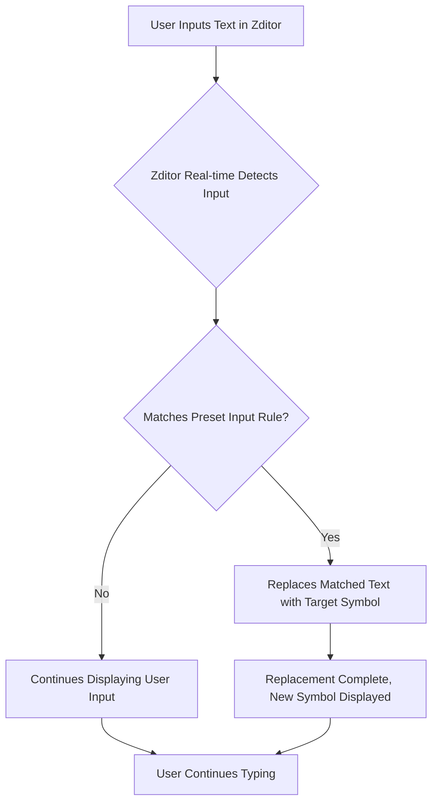

# Zditor SmartText Feature Guide

## 1. What is SmartText?

!!! info "Core Concept"
    SmartText is an innovative feature of the Zditor Markdown editor that allows users to automatically convert specific character combinations or abbreviations into corresponding special symbols, mathematical symbols, Greek letters, fractions, superscripts/subscripts, currency symbols, copyright/trademark indicators, and various common icons.

> This feature aims to simplify the input process for complex symbols, allowing you to easily insert professional and aesthetically pleasing text content without memorizing Unicode encodings or frequently switching input methods.

## 2. How Does SmartText Work?

The implementation principle of SmartText is based on a series of predefined "Input Rules" (`InputRule`). Whenever you type characters in the editor, Zditor real-time detects if your input matches any of the preset regular expression patterns. Once a match is found, Zditor immediately replaces the matched text with the corresponding target symbol.



For example, when you type `->`, Zditor will recognize this pattern and automatically convert it into the right arrow symbol `→`.

```javascript
// Example: Right Arrow Rule
const rightArrow = new InputRule(/->$/, "→");
// When you type "->" and press space or continue typing other characters, it will transform into "→"
```

## 3. Supported SmartText Symbol List

Zditor's SmartText feature covers a wide range of symbol types. Below is a detailed classification with their corresponding input rules:

### 3.1. Basic Arrow Symbols

| Input Pattern | Output Symbol | Example |
| :------------ | :------------ | :------ |
| `->`          | `→`           | `A->B` → `A→B` |
| `<-`          | `←`           | `B<-A` → `B←A` |
| `←>`          | `↔`           | `Bidirectional connection←>` → `Bidirectional connection↔` |
| `(up)`        | `↑`           | `Temperature (up)` → `Temperature ↑` |
| `(down)`      | `↓`           | `Price (down)` → `Price ↓` |
| `=>`          | `⇒`           | `Condition=>Result` → `Condition⇒Result` |
| `=<`          | `⇐`           | `Result=<Condition` → `Result⇐Condition` |
| `<=>`         | `⇔`           | `Equivalence relation<=>` → `Equivalence relation⇔` |

### 3.2. Mathematical Symbols

| Input Pattern     | Output Symbol | Example |
| :---------------- | :------------ | :------ |
| `!=`              | `≠`           | `x!=y` → `x≠y` |
| `<=`              | `≤`           | `a<=b` → `a≤b` |
| `>=`              | `≥`           | `c>=d` → `c≥d` |
| `<<`              | `≪`           | `x<<y` → `x≪y` |
| `>>`              | `≫`           | `z>>w` → `z≫w` |
| `+/-`             | `±`           | `Error +/-0.5` → `Error ±0.5` |
| `-+`              | `∓`           | `Change -+/0.1` → `Change ∓0.1` |
| `(times)`         | `×`           | `3(times)4` → `3×4` |
| `(div)`           | `÷`           | `10(div)2` → `10÷2` |
| `(infinity)`      | `∞`           | `Approaching (infinity)` → `Approaching ∞` |
| `(deg)`           | `°`           | `90(deg)` → `90°` |
| `(sqrt)`          | `√`           | `(sqrt)2` → `√2` |
| `(sum)`           | `∑`           | `(sum)i=1 to n` → `∑i=1 to n` |
| `(pi)`            | `π`           | `Pi (pi)` → `Pi π` |
| `(therefore)`     | `∴`           | `Because A, (therefore) B` → `Because A, ∴ B` |
| `(because)`       | `∵`           | `(because) A, so B` → `∵ A, so B` |

### 3.3. Greek Letters

| Input Pattern | Output Symbol | Example |
| :------------ | :------------ | :------ |
| `(alpha)`     | `α`           | `(alpha) particle` → `α particle` |
| `(beta)`      | `β`           | `(beta) ray` → `β ray` |
| `(gamma)`     | `γ`           | `(gamma) function` → `γ function` |
| `(delta)`     | `δ`           | `(delta) value` → `δ value` |
| `(theta)`     | `θ`           | `(theta) angle` → `θ angle` |
| `(lambda)`    | `λ`           | `(lambda) expression` → `λ expression` |
| `(mu)`        | `μ`           | `(mu)F` → `μF` |
| `(sigma)`     | `σ`           | `(sigma) value` → `σ value` |
| `(omega)`     | `ω`           | `(omega) frequency` → `ω frequency` |

### 3.4. Fractions

!!! note "Important Note"
    Fraction conversion typically requires no other letters or numbers immediately preceding the pattern to ensure accurate recognition. For example, `1/2` will be converted, but `abc1/2` will not.

| Input Pattern | Output Symbol | Example |
| :------------ | :------------ | :------ |
| `1/2`         | `½`           | `½ cup of water` |
| `1/3`         | `⅓`           | `⅓ share` |
| `2/3`         | `⅔`           | `⅔ of the votes` |
| `1/4`         | `¼`           | `¼ mile` |
| `3/4`         | `¾`           | `¾ complete` |
| `1/5`         | `⅕`           | `⅕ probability` |
| `2/5`         | `⅖`           | `⅖ growth` |
| `3/5`         | `⅗`           | `⅗ of the cost` |
| `4/5`         | `⅘`           | `⅘ efficiency` |
| `1/6`         | `⅙`           | `⅙ volume` |
| `5/6`         | `⅚`           | `⅚ yield` |
| `1/8`         | `⅛`           | `⅛ inch` |
| `3/8`         | `⅜`           | `⅜ distance` |
| `5/8`         | `⅝`           | `⅝ weight` |
| `7/8`         | `⅞`           | `⅞ capacity` |

### 3.5. Superscript Numbers

| Input Pattern | Output Symbol | Example |
| :------------ | :------------ | :------ |
| `^0`          | `⁰`           | `x^0` → `x⁰` |
| `^1`          | `¹`           | `y^1` → `y¹` |
| `^2`          | `²`           | `E=mc^2` → `E=mc²` |
| `^3`          | `³`           | `Volume^3` → `Volume³` |
| `^4`          | `⁴`           | `10^4` → `10⁴` |
| `^5`          | `⁵`           | `2^5` → `2⁵` |
| `^6`          | `⁶`           | `n^6` → `n⁶` |
| `^7`          | `⁷`           | `m^7` → `m⁷` |
| `^8`          | `⁸`           | `p^8` → `p⁸` |
| `^9`          | `⁹`           | `q^9` → `q⁹` |

### 3.6. Subscript Numbers

| Input Pattern | Output Symbol | Example |
| :------------ | :------------ | :------ |
| `_0`          | `₀`           | `x_0` → `x₀` |
| `_1`          | `₁`           | `y_1` → `y₁` |
| `_2`          | `₂`           | `H_2O` → `H₂O` |
| `_3`          | `₃`           | `C_3H_8` → `C₃H₈` |
| `_4`          | `₄`           | `N_4` → `N₄` |
| `_5`          | `₅`           | `O_5` → `O₅` |
| `_6`          | `₆`           | `P_6` → `P₆` |
| `_7`          | `₇`           | `S_7` → `S₇` |
| `_8`          | `₈`           | `Cl_8` → `Cl₈` |
| `_9`          | `₉`           | `F_9` → `F₉` |

### 3.7. Currency Symbols

| Input Pattern | Output Symbol | Example |
| :------------ | :------------ | :------ |
| `(eur)`       | `€`           | `100(eur)` → `100€` |
| `(gbp)`       | `£`           | `50(gbp)` → `50£` |
| `(jpy)`       | `¥`           | `1000(jpy)` → `1000¥` |
| `(cent)`      | `¢`           | `50(cent)` → `50¢` |

### 3.8. Copyright and Trademark

| Input Pattern     | Output Symbol | Example |
| :---------------- | :------------ | :------ |
| `(c)`             | `©`           | `Copyright (c) 2023` → `Copyright © 2023` |
| `(r)`             | `®`           | `Product Name(r)` → `Product Name®` |
| `(tm)`            | `™`           | `Brand Name(tm)` → `Brand Name™` |
| `(p)`             | `℗`           | `Music Album(p)` → `Music Album℗` |
| `(sm)`            | `℠`           | `Service Mark(sm)` → `Service Mark℠` |

### 3.9. Common Symbols and Icons

| Input Pattern     | Output Symbol | Example |
| :---------------- | :------------ | :------ |
| `(check)`         | `✓`           | `Task complete (check)` → `Task complete ✓` |
| `(cross)`         | `✗`           | `Error (cross)` → `Error ✗` |
| `(star)`          | `★`           | `Rating (star)` → `Rating ★` |
| `(heart)`         | `♥`           | `Like (heart)` → `Like ♥` |
| `(spade)`         | `♠`           | `Playing card (spade)` → `Playing card ♠` |
| `(club)`          | `♣`           | `Playing card (club)` → `Playing card ♣` |
| `(diamond)`       | `♦`           | `Playing card (diamond)` → `Playing card ♦` |
| `(note)`          | `♪`           | `Music (note)` → `Music ♪` |
| `(notes)`         | `♫`           | `Multiple notes (notes)` → `Multiple notes ♫` |
| `(sun)`           | `☀`           | `Weather (sun)` → `Weather ☀` |
| `(moon)`          | `☽`           | `Night (moon)` → `Night ☽` |
| `(cloud)`         | `☁`           | `Cloudy (cloud)` → `Cloudy ☁` |
| `(rain)`          | `☔`          | `Rain (rain)` → `Rain ☔` |
| `(snow)`          | `❄`           | `Snow (snow)` → `Snow ❄` |
| `(phone)`         | `☎`           | `Contact phone (phone)` → `Contact phone ☎` |
| `(email)`         | `✉`           | `Email address (email)` → `Email address ✉` |
| `(warning)`       | `⚠`           | `Warning (warning)` → `Warning ⚠` |
| `(info)`          | `ℹ`           | `Information (info)` → `Information ℹ` |
| `(question)`      | `❓`           | `Question (question)` → `Question ❓` |
| `(exclamation)`   | `❗`           | `Attention (exclamation)` → `Attention ❗` |

### 3.10. Scientific and Unit Symbols

| Input Pattern  | Output Symbol | Example |
| :------------- | :------------ | :------ |
| `(micro)`      | `µ`           | `10(micro)m` → `10µm` |
| `(ohm)`        | `Ω`           | `Resistance 10(ohm)` → `Resistance 10Ω` |
| `(celsius)`    | `℃`           | `25(celsius)` → `25℃` |
| `(fahrenheit)` | `℉`           | `77(fahrenheit)` → `77℉` |
| `(angstrom)`   | `Å`           | `10(angstrom)` → `10Å` |

## 4. Usage Tips and Recommendations

*   **Instant Conversion**: SmartText conversions happen instantly. Once you complete the full trigger pattern, the symbol will appear immediately.
*   **Context-Awareness**: Some rules (like fractions) have requirements for characters before or after the input pattern to prevent unintended conversions. This usually means you might need a space or newline around the pattern, or it needs to be at the beginning/end of a word.
*   **Combine with Markdown**: SmartText integrates seamlessly with Zditor's other Markdown formatting. For example, you can insert mathematical symbols within bold text: `**E=mc^2**` → `**E=mc²**`.
*   **Explore and Memorize**: Initially, you might need to refer to this guide to remember common input patterns. However, with frequent use, you'll find them becoming very intuitive and efficient.

---

With Zditor's SmartText feature, you can effortlessly insert a variety of professional and aesthetically pleasing symbols into your Markdown documents, significantly enhancing readability and writing efficiency. Enjoy a smarter, more convenient writing experience! :sparkles: