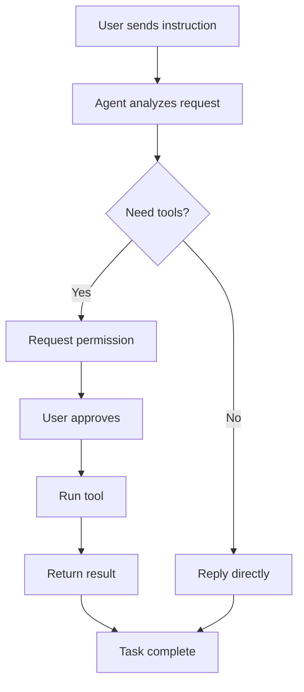

Zditor integrates with CLI tools on your machine through the Agent Client Protocol, or ACP. That allows Agent sessions to do more than plain chat: they can read and write files, call tools, and execute multi-step workflows with permission controls.

<Tip>
  If you want to connect OpenClaw, see the dedicated [OpenClaw Setup](/en/openclaw-guide) page. OpenClaw exposes an `openclaw acp` bridge, so it can be wired into Zditor as an ACP Agent directly.
</Tip>

### Video demo

<Frame>
  <video
    controls
    style={{ width: '100%', height: '500px', borderRadius: '0.5rem' }}
    src="https://download.zditor.com/newweb/agent_config.mov"
  >
    Your browser does not support the video tag.
  </video>
</Frame>

<Warning>
  Agents can access files and perform system operations. Install only official or trusted CLI tools and review permissions carefully.
</Warning>

## Contents

- [Quick start](#quick-start)
- [How Agent differs from normal AI chat](#how-agent-differs-from-normal-ai-chat)
- [Configure an Agent](#configure-an-agent)
- [Use Agent](#use-agent)
- [Permission management](#permission-management)
- [FAQ](#faq)
- [Best practices](#best-practices)
- [Technical reference](#technical-reference)

## Quick start

### Quick Claude Code setup

Claude Code is a good first Agent to try.

**1. Install dependencies**

<Tabs>
<Tab title="mac/linux">
  ```bash
  # Make sure Node.js v18+ is installed
  node --version

  # Install the Claude Agent ACP adapter
  npm install -g claude-agent-acp

  # Verify the install
  claude-agent-acp --version
  ```
</Tab>

<Tab title="windows">
  ```powershell
  node --version
  npm install -g claude-agent-acp
  claude-agent-acp --version
  ```
</Tab>
</Tabs>

**2. Get an API key**

Create an API key from [Anthropic Console](https://console.anthropic.com/).

**3. Configure it in Zditor**

1. Open **Settings -> Agent Configuration -> Add**
2. Fill in:
   - **Agent name**: `claude-code`
   - **Agent path**
     - macOS/Linux: `/Users/zz/.nvm/versions/node/v24.7.0/bin/claude-agent-acp`
     - Windows: `C:\Users\zz\AppData\Roaming\npm\claude-agent-acp.cmd`
   - **Environment variables**
     - macOS/Linux: `ANTHROPIC_API_KEY=your_api_key_here, ANTHROPIC_BASE_URL=https://xaapi.ai, PATH=/usr/local/bin`
     - Windows: `ANTHROPIC_API_KEY=your_api_key_here, ANTHROPIC_BASE_URL=https://xaapi.ai, PATH=C:\Program Files\nodejs`
3. Click **Test Connection**
4. Save the configuration

<Tip>
  If you manage Node.js with `nvm`, include the correct Node binary directory in `PATH`.
</Tip>

**4. Start using it**

Once the connection test passes, the usual workflow is:

1. Choose a model
2. Choose MCP services if needed
3. Use slash commands for structured actions
4. Choose `ask` or `bypass` mode

## How Agent differs from normal AI chat

### Feature comparison

| Capability | Normal AI chat | Agent |
| :--- | :--- | :--- |
| Conversation | Yes | Yes |
| File read and write | No | Yes |
| Tool calls | No | Yes |
| Multi-step task execution | No | Yes |
| Permission control | Not needed | Yes |
| Streaming process feedback | Limited | Yes |
| Terminal operations | In progress | Planned |
| Selection-based actions | No | Yes |

### Typical use cases

**Normal AI chat fits**

- Everyday questions
- Basic text generation
- Translation and summarization

**Agent fits**

- Codebase analysis and modification
- Batch file operations
- Multi-step workflows
- Tasks that require external tools
- Structured document processing and conversion

## Configure an Agent

### Open the configuration screen

1. Launch Zditor
2. Open the settings page
3. Find the **Agent Configuration** section
4. Click **Add**


### Basic fields

#### Agent name

- Used as the unique identifier
- Must be unique
- Should not contain tabs or leading and trailing spaces

Examples: `gemini-cli`, `claude-code`, `custom-agent`

#### Agent path

- Full path to the executable CLI tool
- Must be a valid executable file
- Should not contain tabs or leading and trailing spaces

Examples:

- macOS: `/Users/zz/.nvm/versions/node/v24.7.0/bin/claude-agent-acp`
- Windows: `C:\Users\zz\AppData\Roaming\npm\claude-agent-acp.cmd`

<Tip>
  Use `which` on macOS/Linux and `where` on Windows if you need to locate the executable path.
</Tip>

### Advanced fields

#### Startup arguments

- Optional command line arguments passed to the CLI tool
- Separate multiple values with commas

Examples:

- Gemini CLI: `--experimental-acp, --model, gemini-2.5-flash`
- Claude Code: `--model, claude-3-5-sonnet-20241022`

#### Environment variables

- Optional runtime environment variables for the Agent process
- Use `KEY=value` pairs separated by commas

Examples:

- `ANTHROPIC_API_KEY=your_key, ANTHROPIC_BASE_URL=https://xaapi.ai, PATH=/usr/local/bin`
- `GEMINI_API_KEY=your_key, PATH=/usr/local/bin:/usr/bin:/bin`

<Warning>
  Secrets in the environment variable field are stored in local configuration. Protect the machine accordingly.
</Warning>

#### API key precedence

If the same API key is configured in more than one place, the effective priority is:

1. The Agent client's own config file
2. The environment variables set in Zditor Agent configuration
3. System-level environment variables

<Tip>
  If Zditor still appears to use an old key, check whether the Agent client already has its own key in its native configuration file.
</Tip>

### Connection testing

Click **Test Connection** after saving the configuration details. The test checks:

1. Whether the Agent process can start
2. Whether ACP handshake works
3. Which capabilities the Agent reports

Reported capabilities can include:

- **Audio**
- **Image**
- **Context**
- **MCP STDIO**
- **MCP HTTP**
- **MCP SSE**

<Tip>
  Zditor supports `stdio`, `http`, and `sse` at the MCP layer, but you should always trust the result shown by **Test Connection** for the current Agent.
</Tip>

## Use Agent

### 1. Choose a model

Pick the model that matches the task:

- Use lighter models for quick questions
- Use stronger models for coding and multi-step tasks

### 2. Choose MCP services

Open the MCP selector and enable only the services needed for the current task.

<Warning>
  Follow the least-privilege principle. Do not enable more MCP services than necessary.
</Warning>

<Tip>
  For transport modes, permissions, and troubleshooting, see the [MCP Guide](/en/mcp-guide).
</Tip>

### 3. Use slash commands

Type `/` in the input box to open the command menu. Slash commands help trigger structured actions, switch contexts, or activate preset workflows with less ambiguity.

### 4. Choose `ask` or `bypass`

- `ask` requests confirmation before sensitive operations
- `bypass` reduces intermediate confirmations for controlled environments

<Tip>
  Use `ask` by default. Use `bypass` only when you clearly understand the impact of the task and can recover from mistakes.
</Tip>

### Connection and status

1. Find the mode selector in the main UI
2. Switch to **Agent mode**
3. Choose a configured Agent from the selector
4. Wait for the status to show as connected


### Start execution

Once connected, you can:

- Send plain text instructions
- Drag files into the chat for context
- Run larger tasks that require planning, tools, and file operations



### Agent feedback process

During execution, Agent can stream:

- **Thinking** about the problem and plan
- **Tool calls** being executed
- **Results** and summaries


## Permission management

### Permission request types

Agent may request confirmation for:

#### File system permissions

- Reading files
- Writing files
- Deleting, moving, or renaming files

#### Network permissions

- HTTP requests
- Resource downloads

#### System permissions

- Running commands
- Reading environment information

### Permission decisions

You can usually:

- **Allow**
- **Deny**
- **Cancel**

<Tip>
  Review requests carefully, grant only what is necessary, and stop the run if the requested action does not match the task.
</Tip>

## FAQ

<AccordionGroup>
  <Accordion title="Connection test fails with 'Failed to establish connection'" icon="circle-xmark">
    Check the executable path, executable permission, required dependencies, and environment variables such as API keys and `PATH`.
  </Accordion>

  <Accordion title="The CLI tool starts and exits immediately" icon="circle-xmark">
    This usually means the tool cannot find Node.js, lacks required dependencies, received wrong startup arguments, or is not ACP compatible.
  </Accordion>

  <Accordion title="I see 'command not found'" icon="circle-xmark">
    This is usually a `PATH` issue. Find the real installation prefix and include it in the Zditor Agent environment variables.
  </Accordion>

  <Accordion title="Permission prompts keep blocking the task" icon="shield-halved">
    That means the task needs capabilities you have not granted. Either approve the required steps selectively or break the task into safer smaller parts.
  </Accordion>

  <Accordion title="The Agent performed an unexpected action" icon="triangle-exclamation">
    Stop the session immediately, verify the CLI tool source, and switch back to trusted or official builds only.
  </Accordion>

  <Accordion title="The Agent feels slow" icon="hourglass-half">
    Check network stability, machine resources, CLI tool version, and whether too many tools or MCP services are enabled at once.
  </Accordion>
</AccordionGroup>

## Best practices

### Security

<Steps>
  <Step title="Use trusted sources">
    Install only official or trusted CLI tools.
  </Step>

  <Step title="Grant minimum permissions">
    Start small and approve only what the current task needs.
  </Step>

  <Step title="Keep tools updated">
    Update Zditor and the connected CLI tools regularly.
  </Step>

  <Step title="Watch execution closely">
    Monitor file operations and network activity during important runs.
  </Step>
</Steps>

### CLI tool management

```bash
# Example: manage Node.js with nvm
nvm use 18
npm install -g claude-agent-acp

# Inspect globally installed npm packages
npm list -g --depth=0
```

Update commands:

```bash
npm update -g claude-agent-acp
npm update -g @google/gemini-cli
```

### Efficiency tips

<CardGroup cols={2}>
  <Card title="Be specific" icon="bullseye">
    Give Agent concrete tasks and expected outcomes.
  </Card>

  <Card title="Split large tasks" icon="list-ol">
    Break complex jobs into smaller steps with checkpoints.
  </Card>

  <Card title="Provide context" icon="file-import">
    Attach files or reference the exact workspace area the Agent should inspect.
  </Card>

  <Card title="Intervene when needed" icon="hand">
    Correct direction early instead of waiting for a long run to drift.
  </Card>
</CardGroup>

## Technical reference

### Agent Client Protocol

- Supported ACP version: `0.4.0`
- Communication model: JSON-RPC over standard input and output
- Current capability areas:
  - File system operations
  - Session management
  - Permission control
  - Tool calls
  - Streaming responses
  - Selection-based actions

Planned capability:

- Terminal support

### Compatible CLI tools

#### Claude Code

Install and configure `claude-agent-acp` with the executable path, API key, optional model argument, and a valid `PATH`.

#### Gemini CLI

Typical install path:

```bash
npm install -g @google/gemini-cli
```

Typical setup:

- **Agent name**: `gemini-cli`
- **Agent path**: `gemini`
- **Arguments**: `--experimental-acp, --model, gemini-2.5-flash`
- **Environment variables**: `GEMINI_API_KEY=your_api_key_here, PATH=/usr/local/bin`

#### Other tools

If another CLI tool supports ACP, you can integrate it by supplying the executable path, arguments, and environment variables. If it does not support ACP directly, you can wrap it with your own adapter that translates ACP requests into that tool's native API.
