---
description:
  type: text
  description:
  label: Description
  value: "Flowchart · Sequence Diagram · Gantt Chart · ER Diagram · Mindmap"
author:
  type: text
  description:
  label: Author
  value: "SeeLey & Codex"
cover:
  type: asset
  description:
  label: Cover Image
  value: "../assets/guides/mermaid-guide-cover-nanobanana.jpg"
col:
  type: array
  description:
  label: Col
  value: ["subject","title","description"]
subject:
  type: text
  description:
  label: Subject
  value: "Mermaid"
avatar:
  type: asset
  description:
  label: Avatar
  value: "../assets/nanobanana-avatar.svg"
tags:
  type: text
  description:
  label: Tags
  value: "Mermaid · Diagram · Guide"
title:
  type: text
  description:
  label: Title
  value: "Mermaid Guide"
display:
  type: checkbox
  description: display
  label: Display Properties
  value: false
updated:
  type: date
  description:
  label: Updated
  value: "2026-04-11"
warm:
  type: checkbox
  description: warm
  label: Warm Tone
  value: true
row:
  type: array
  description:
  label: Row
  value: ["avatar","author","updated","tags"]
---
# Mermaid Guide

Mermaid is a text-based diagram syntax. Write a fenced code block with `mermaid`, and you can render flowcharts, sequence diagrams, gantt charts, ER diagrams, git graphs, and more.

This guide is not trying to cover every keyword. The goal is practical: help you write diagrams in Zditor that are clear, useful, and maintainable.

## Quick Start

Minimal example:

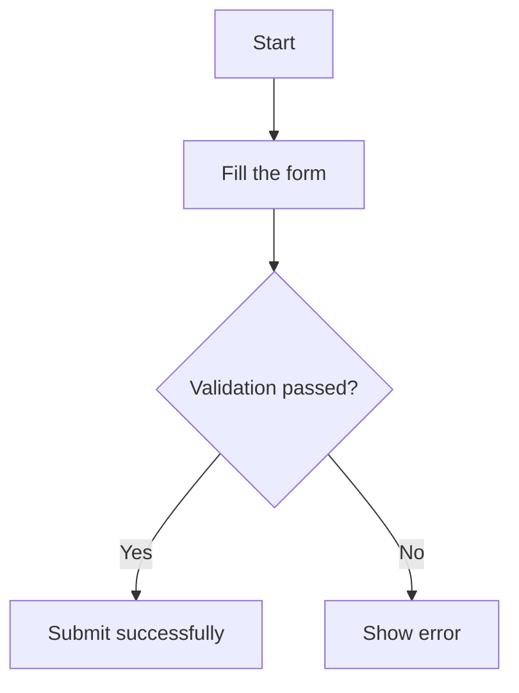

Two things matter most:

- The fenced code block language must be `mermaid`
- Pick the right diagram type before adding details

## Which Diagram to Use

|Scenario |Recommended diagram |
|---|---|
|Business workflow, approval flow, branching logic |Flowchart |
|Frontend/backend/service/database call order |Sequence Diagram |
|Schedule, milestones, task dependencies |Gantt Chart |
|Classes, interfaces, module structure |Class Diagram |
|State changes, lifecycle, state machines |State Diagram |
|Database schema and entity relations |ER Diagram |
|User experience and service touchpoints |User Journey |
|Share or percentage breakdown |Pie Chart |
|Branching and merge history |Git Graph |
|Brainstorming and knowledge structure |Mindmap |

## General Writing Tips

- Keep node text short; put long explanations in the main body.
- One diagram should explain one topic.
- Prefer business terms over internal abbreviations.
- If the diagram gets crowded, split it before adding more.
- `TD` and `LR` are the safest default directions.

## Flowchart

Flowcharts are best for steps, decisions, transitions, and component relationships.

### Minimal example

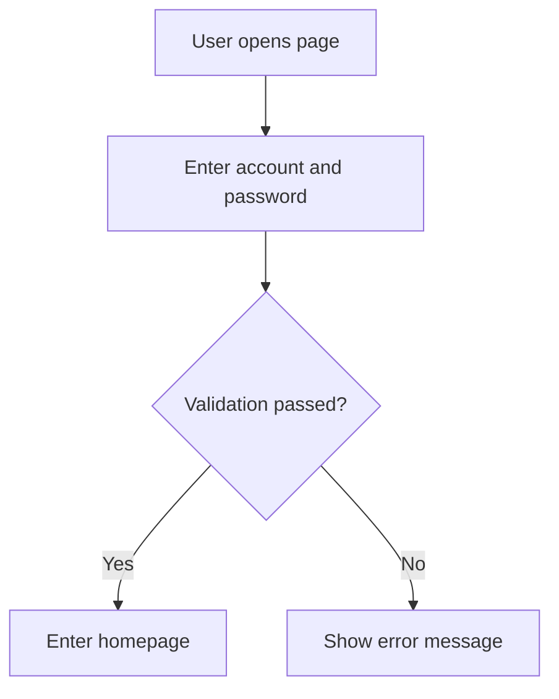

### Common node shapes

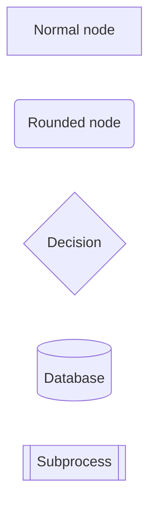

### Common edges

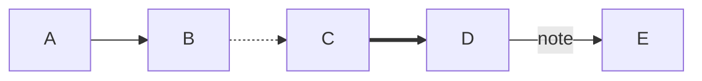

### Subgraphs

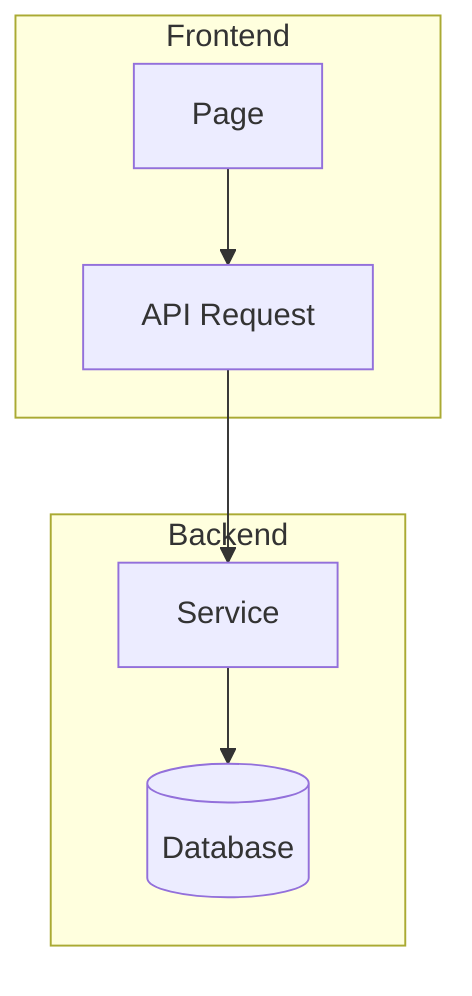

### Practical example: order submission

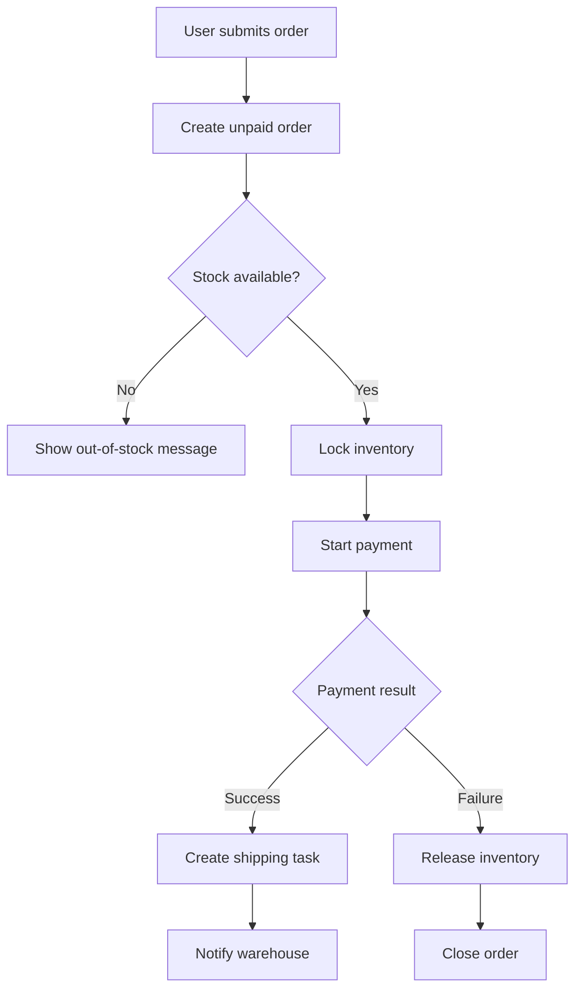

### Practical example: swimlane-style collaboration

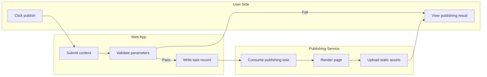

## Sequence Diagram

Sequence diagrams show who calls whom, in what order, and what comes back.

### Minimal example

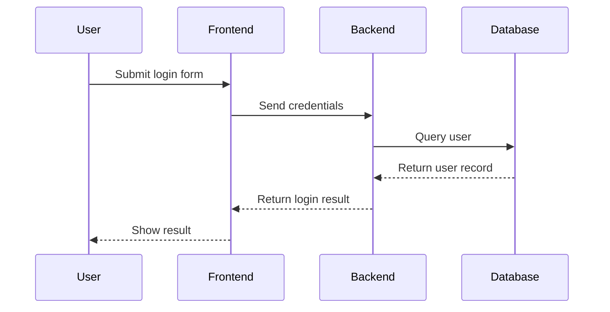

### Conditions, optional blocks, loops

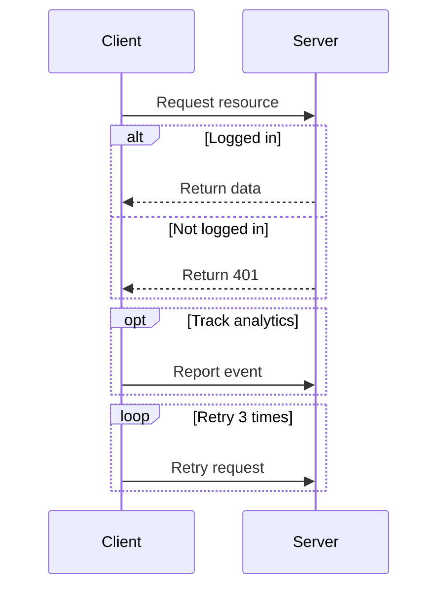

### Practical example: file save flow

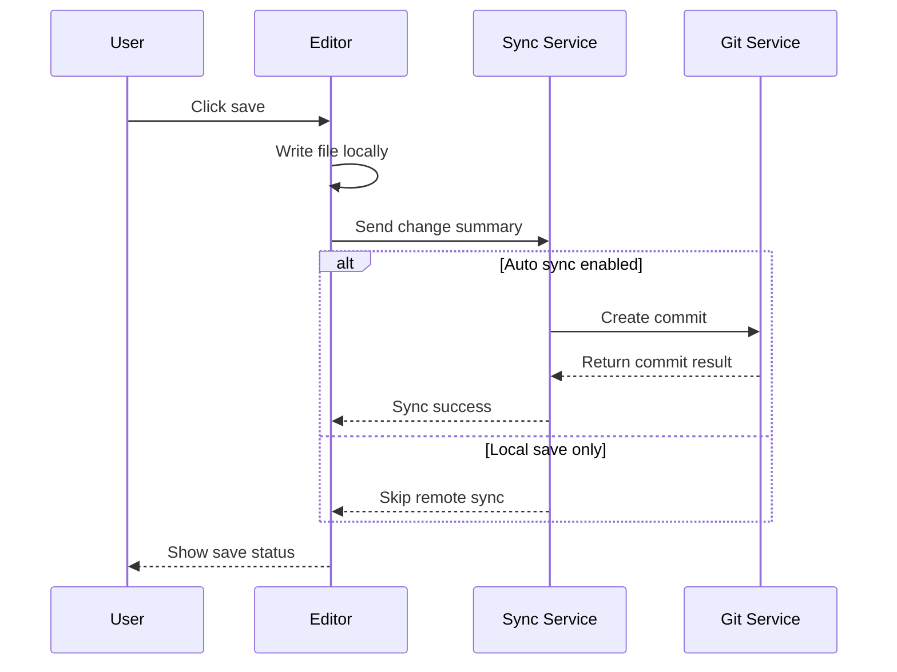

## Gantt Chart

Use gantt charts for schedules, milestones, and phase-based planning.

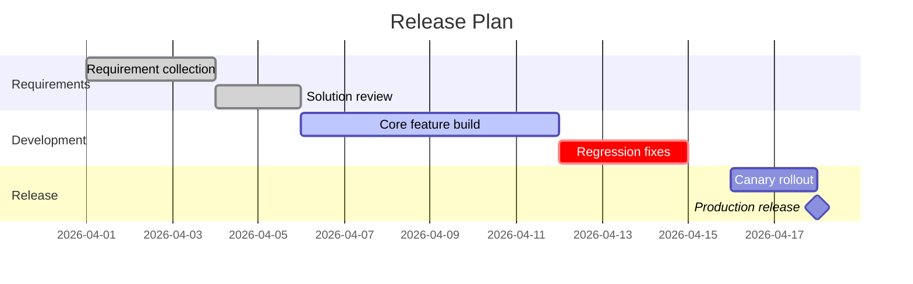

## Class Diagram

Use class diagrams for module relationships, classes, interfaces, fields, and methods.

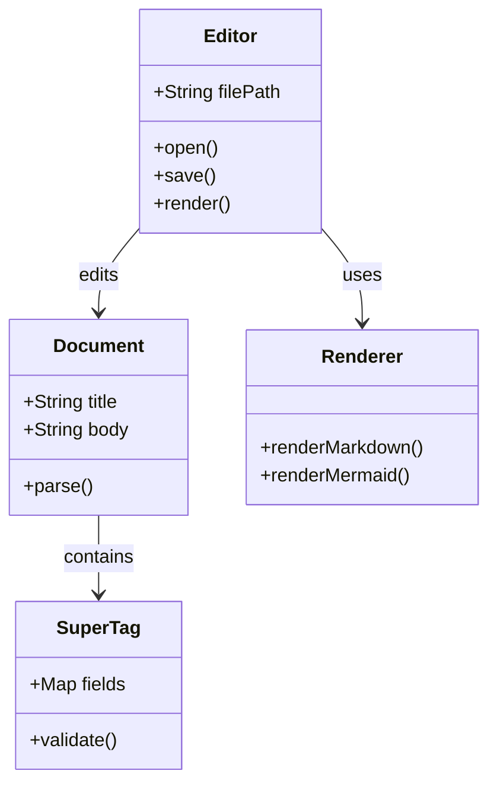

## State Diagram

Use state diagrams to show how an object or process moves across states.

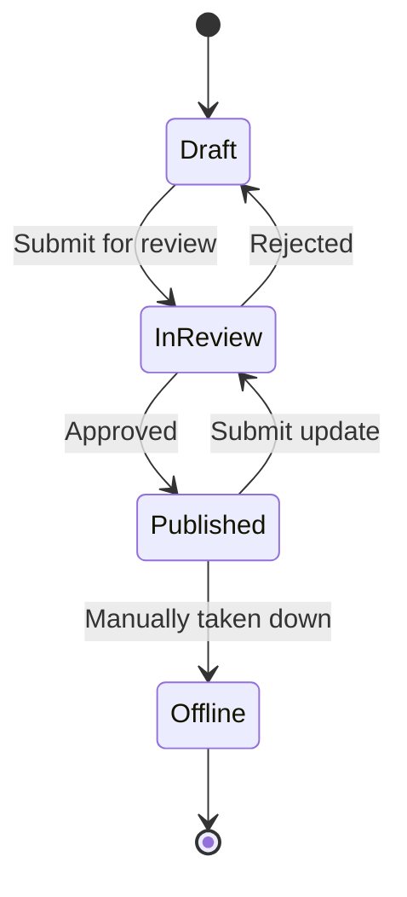

## ER Diagram

Use ER diagrams for data modeling and table relationships.

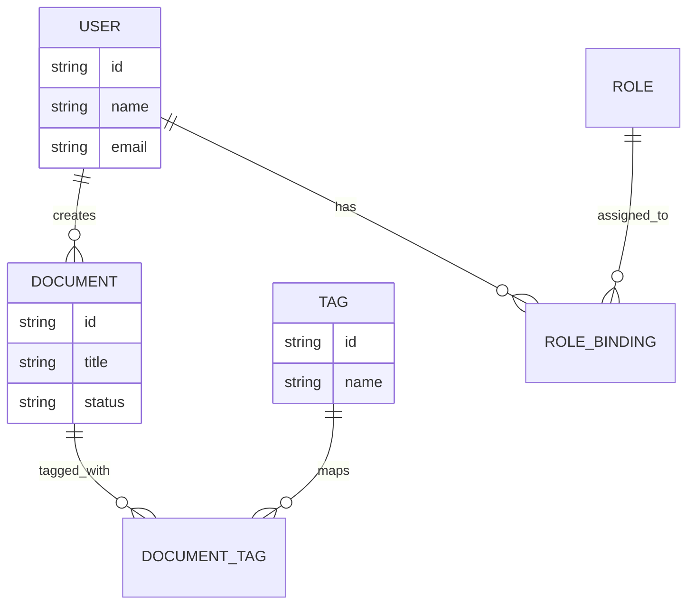

## Pie Chart

Pie charts are good for simple composition, not complex trends.

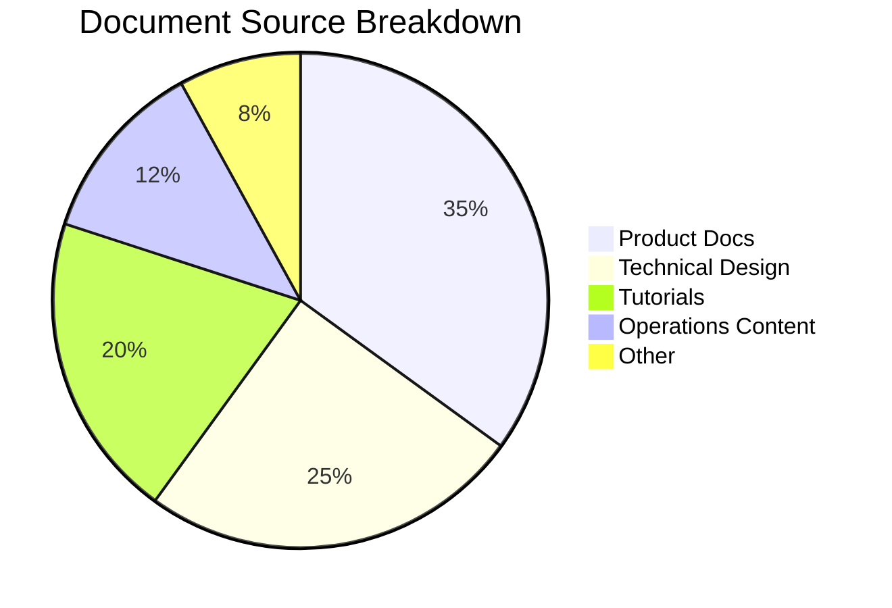

## Git Graph

Use git graphs to show branches, commits, and merges.

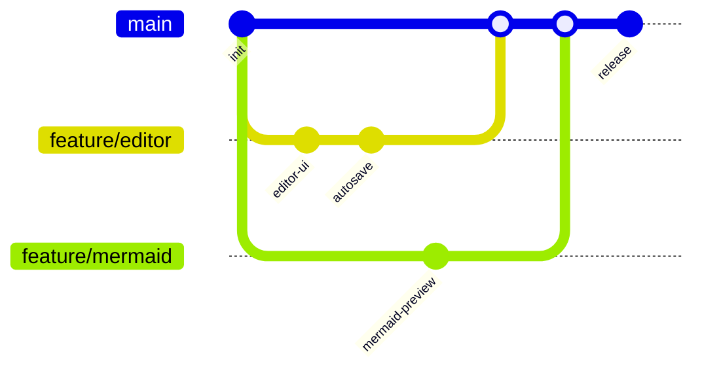

## Mindmap

Mindmaps work well for brainstorming and capability breakdowns.

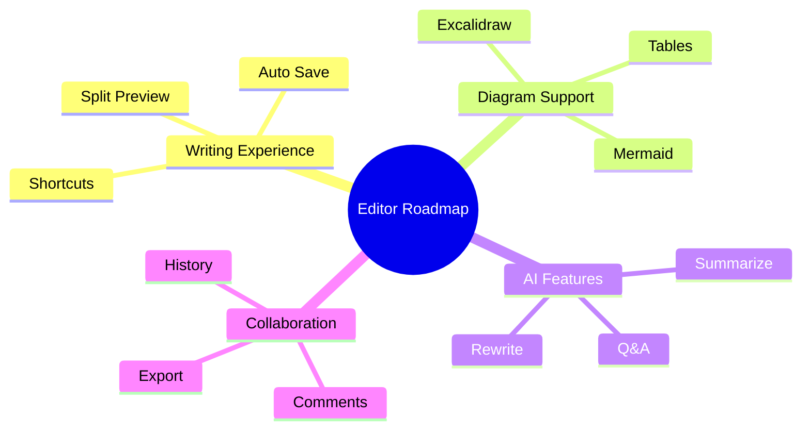

## User Journey

User journey diagrams show actions and touchpoints across a full experience.

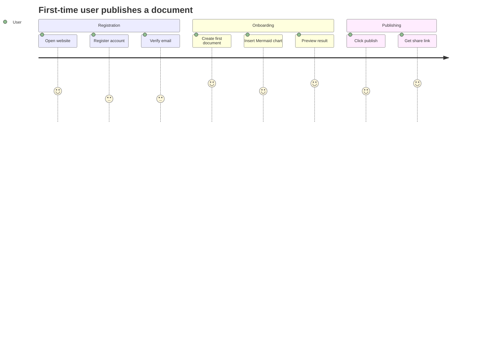

## Common Problems

### Diagram does not render

- Check that the code fence language is `mermaid`
- Check the diagram keyword such as `flowchart` or `sequenceDiagram`
- Start from a minimal example, then add complexity gradually

### Diagram is too large or messy

- Reduce node count
- Shorten node text
- Try `LR` or `TD`
- Split the content into multiple diagrams

## References

- [examples/mermaid-examples/mermaid-examples.md](../examples/mermaid-examples/mermaid-examples.md)
- [guides/mermaid-guide.md](../guides/mermaid-guide.md)

!!! tip Recommended workflow
    Start with the smallest working example. Once the structure is correct, expand it step by step.
