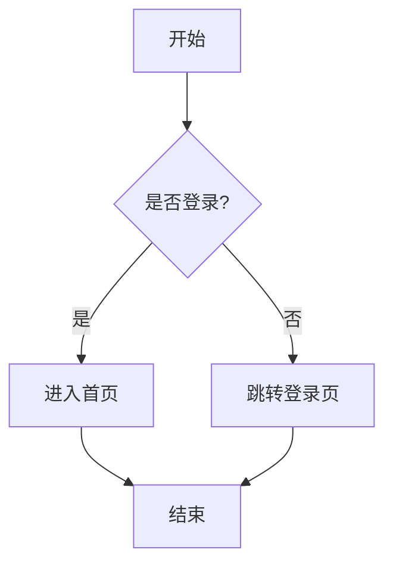
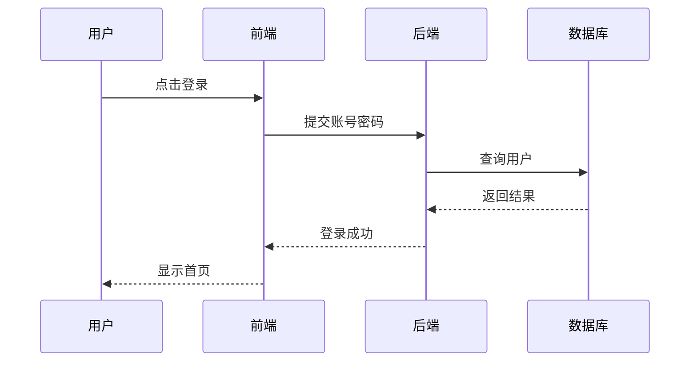
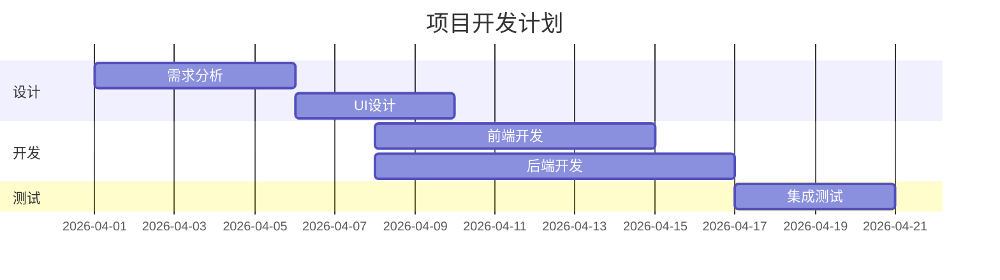
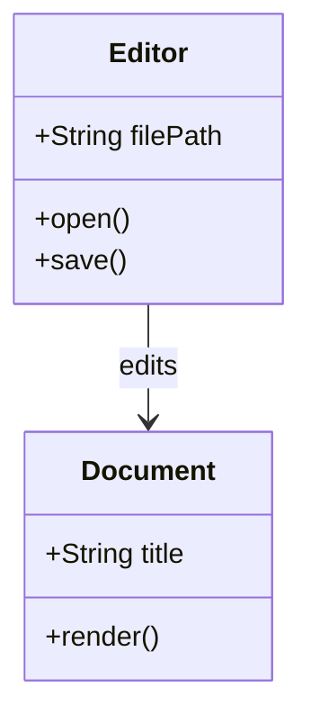
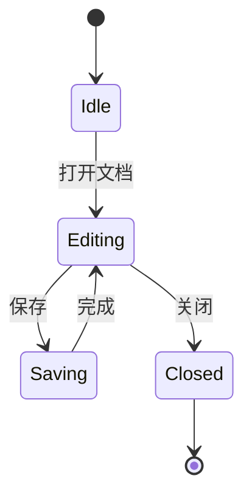
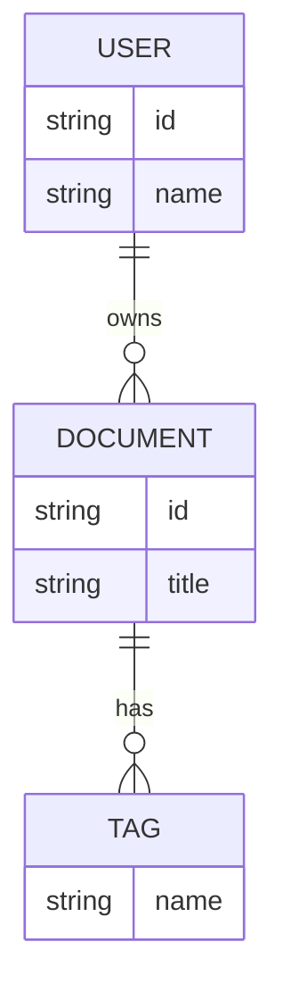

# Mermaid Examples

这个文档用于展示在 Zditor 文档中编写 Mermaid 图表的基本方式。

## Flowchart



## Sequence Diagram



## Gantt Chart



## Class Diagram



## State Diagram



## ER Diagram



## Mindmap

```mermaid
mindmap
  root((Zditor))
    Writing
      Markdown
      Notes
      Docs
    Diagram
      Mermaid
      Flowchart
      Mindmap
    AI
      Agent
      Workflow
```

## Tips

- 使用 fenced code block，并将语言标记为 `mermaid`
- 图表适合和正文混排，用于设计说明、需求文档和知识库
- 若图表较复杂，建议拆成多个小图，便于阅读

## Use Cases

- 编写系统设计文档
- 编写产品流程文档
- 编写项目排期文档
- 编写数据库建模文档
