---
description:
  type: text
  description:
  label: Description
  value: "Flowcharts · Sequenzdiagramme · Gantt-Diagramme · ER-Diagramme · Mindmap"
author:
  type: text
  description:
  label: Author
  value: "SeeLey & Codex"
cover:
  type: asset
  description:
  label: Cover Image
  value: "../assets/guides/mermaid-guide-cover-nanobanana.jpg"
col:
  type: array
  description:
  label: Col
  value: ["subject","title","description"]
subject:
  type: text
  description:
  label: Subject
  value: "Mermaid"
avatar:
  type: asset
  description:
  label: Avatar
  value: "../assets/nanobanana-avatar.svg"
tags:
  type: text
  description:
  label: Tags
  value: "Mermaid · Diagramme · Leitfaden"
title:
  type: text
  description:
  label: Title
  value: "Mermaid Leitfaden"
display:
  type: checkbox
  description: display
  label: Eigenschaften anzeigen
  value: false
updated:
  type: date
  description:
  label: Updated
  value: "2026-04-11"
warm:
  type: checkbox
  description: warm
  label: Warmer Ton
  value: true
row:
  type: array
  description:
  label: Row
  value: ["avatar","author","updated","tags"]
---
# Mermaid Leitfaden

Mermaid ist eine textbasierte Syntax fuer Diagramme. Mit einem `mermaid`-Codeblock in Markdown lassen sich Flowcharts, Sequenzdiagramme, Gantt-Diagramme, ER-Diagramme, Git-Graphs und weitere Diagrammtypen erzeugen.

Dieser Leitfaden soll nicht jede Syntaxvariante erklaeren. Ziel ist ein praktischer Einstieg, damit du in Zditor schnell klare und wartbare Diagramme schreiben kannst.

## Schnellstart

Minimales Beispiel:

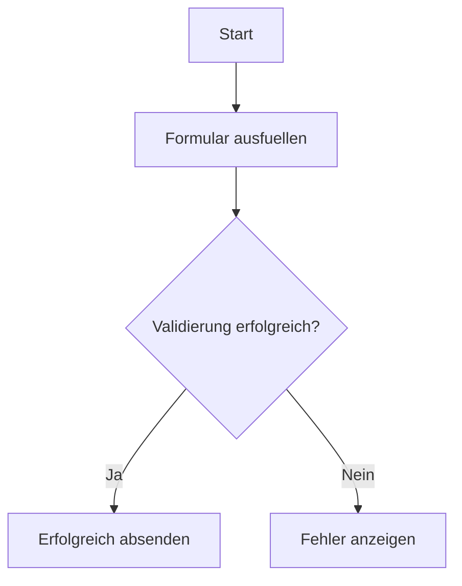

Wichtig sind vor allem zwei Punkte:

- Die Sprachkennung des Codeblocks muss `mermaid` sein
- Zuerst den passenden Diagrammtyp waehlen, dann Details ergaenzen

## Welches Diagramm fuer welchen Zweck

|Szenario |Empfohlenes Diagramm |
|---|---|
|Geschaeftsprozess, Freigabefluss, Verzweigungen |Flowchart |
|Aufrufreihenfolge zwischen Frontend, Backend, Service, Datenbank |Sequenzdiagramm |
|Zeitplan, Meilensteine, Abhaengigkeiten |Gantt-Diagramm |
|Klassen, Interfaces, Modulstruktur |Klassendiagramm |
|Zustandswechsel, Lebenszyklus, State Machine |Zustandsdiagramm |
|Tabellenstruktur und Entitaetsbeziehungen |ER-Diagramm |
|Nutzererlebnis und Touchpoints |User Journey |
|Anteile und einfache Verteilungen |Kreisdiagramm |
|Branches, Commits und Merges |Git Graph |
|Brainstorming und Wissensstruktur |Mindmap |

## Allgemeine Schreibregeln

- Knotentexte kurz halten; laengere Erklaerungen in den Fliesstext.
- Ein Diagramm sollte ein Thema erklaeren.
- Fachbegriffe aus dem Geschaeft bevorzugen, interne Abkuerzungen sparsam nutzen.
- Wenn das Diagramm zu voll wird, lieber aufteilen.
- `TD` und `LR` sind die stabilsten Standardrichtungen.

## Flowchart

Flowcharts eignen sich fuer Schritte, Entscheidungen, Uebergaenge und Modulbeziehungen.

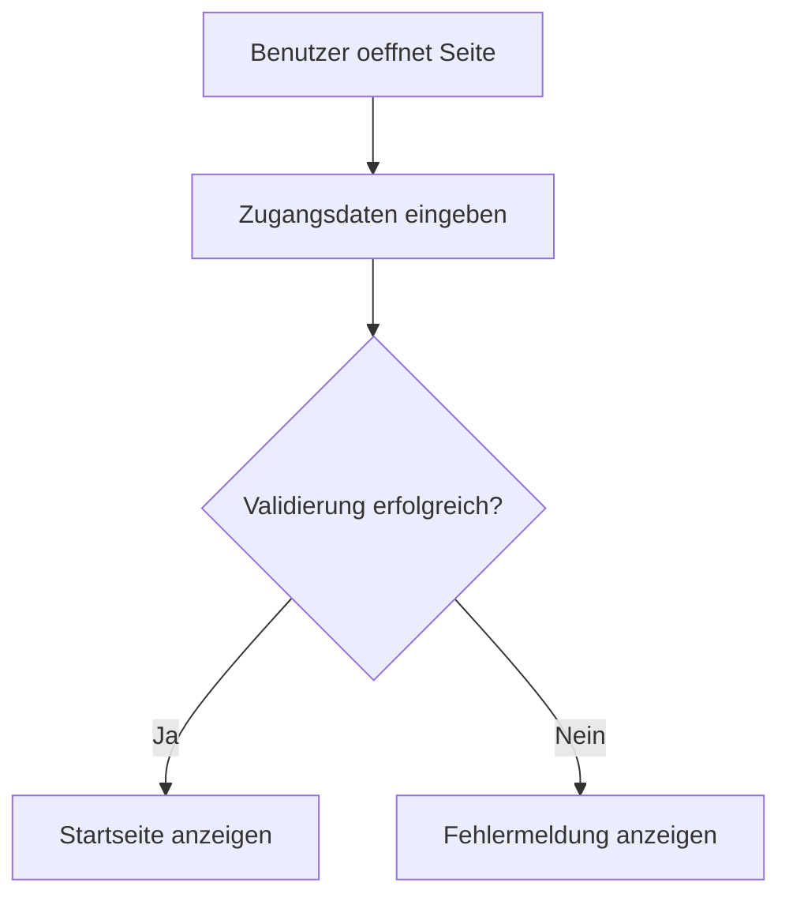

### Praxisbeispiel: Bestellprozess

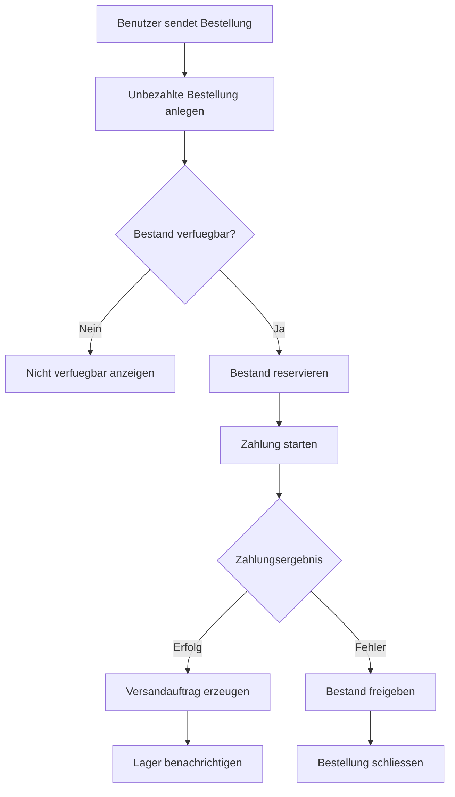

## Sequenzdiagramm

Sequenzdiagramme zeigen, wer wen in welcher Reihenfolge aufruft und was zurueckkommt.

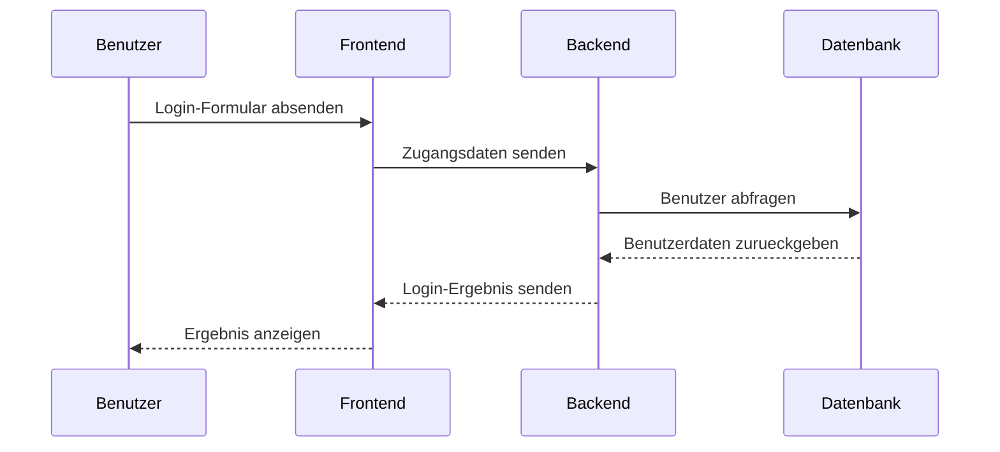

### Praxisbeispiel: Speichern einer Datei

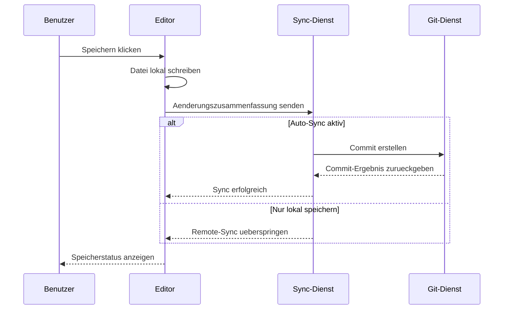

## Gantt-Diagramm

Gantt-Diagramme sind gut fuer Zeitplaene, Phasen und Meilensteine.

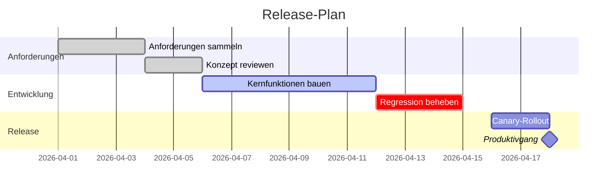

## Klassendiagramm

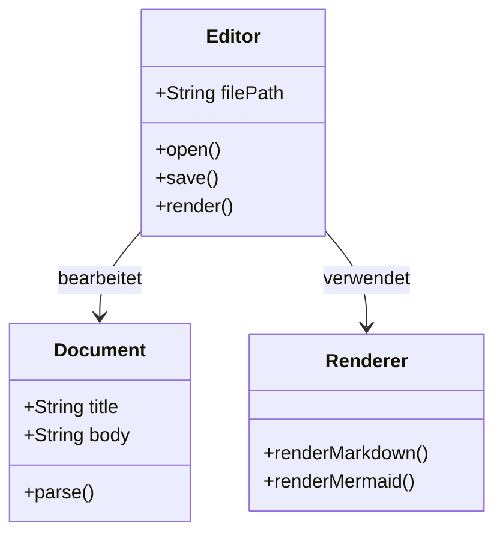

## Zustandsdiagramm

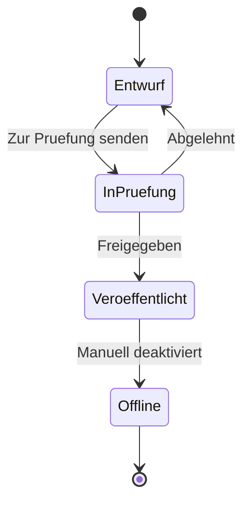

## ER-Diagramm

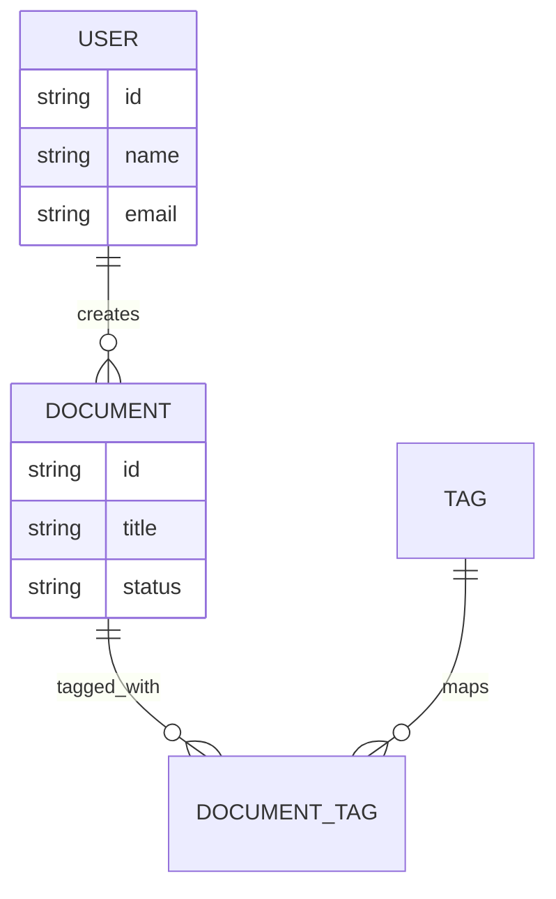

## Weitere nuetzliche Typen

### Kreisdiagramm

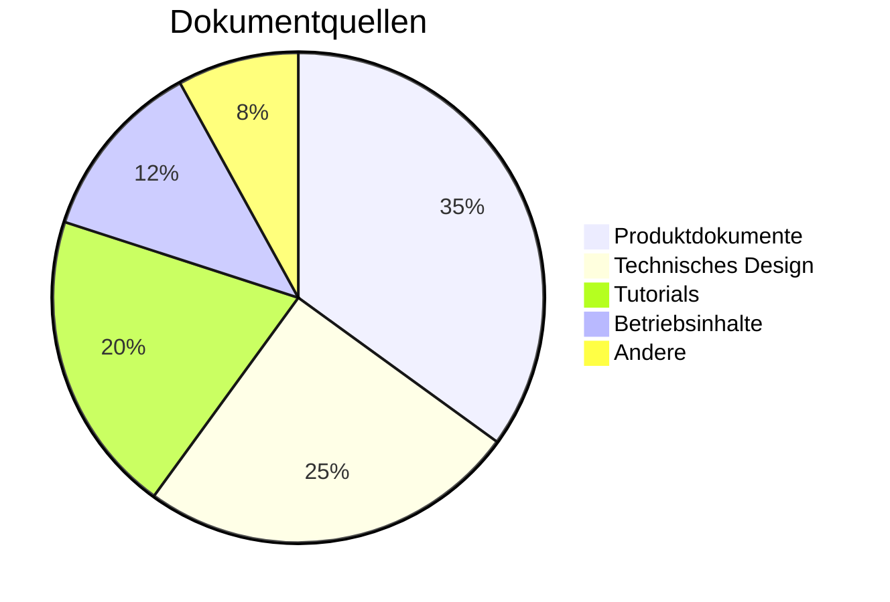

### Git Graph

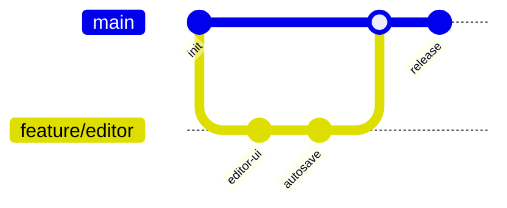

### Mindmap

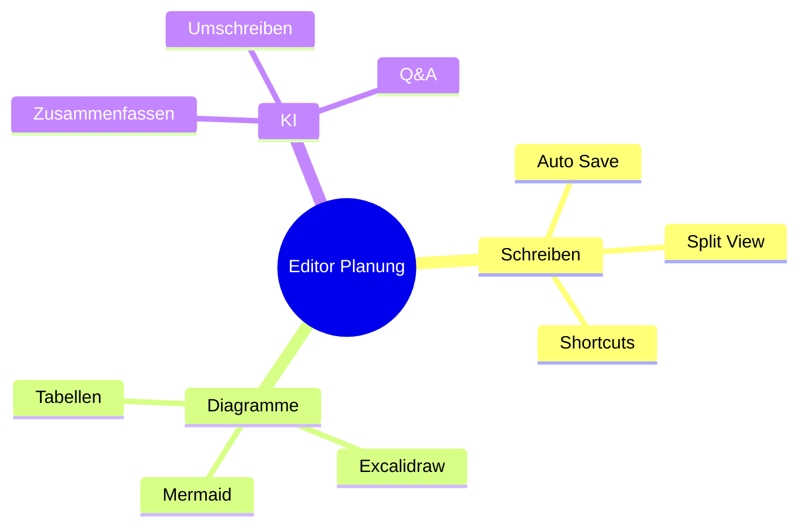

## Haeufige Probleme

### Diagramm wird nicht gerendert

- Pruefen, ob der Codeblock wirklich `mermaid` als Sprachkennung hat
- Diagramm-Schluesselwort wie `flowchart` oder `sequenceDiagram` pruefen
- Erst mit einem Minimalbeispiel testen, dann schrittweise erweitern

### Diagramm ist zu gross oder unuebersichtlich

- Weniger Knoten verwenden
- Knotentexte verkuerzen
- `LR` oder `TD` ausprobieren
- Inhalt auf mehrere Diagramme aufteilen

## Referenzen
