---
title:
  type: text
  description: 
  label: Title
  value: "Mermaid 使用指南"
avatar:
  type: asset
  description: 
  label: Avatar
  value: "../assets/logo.svg"
col:
  type: array
  description: 
  label: Col
  value: ["subject","title","description"]
subject:
  type: text
  description: 
  label: Subject
  value: "Mermaid"
updated:
  type: date
  description: 
  label: Updated
  value: "2026-04-11"
tags:
  type: text
  description: 
  label: Tags
  value: "Mermaid · 图表 · 指南"
cover:
  type: asset
  description: 
  label: Cover Image
  value: "assets/mermaid-guide-cover-nanobanana.jpg"
author:
  type: text
  description: 
  label: Author
  value: "SeeLey & Codex"
description:
  type: text
  description: 
  label: Description
  value: "流程图 · 时序图 · 甘特图 · ER 图 · Mindmap"
warm:
  type: checkbox
  description: warm
  label: 暖色调
  value: false
display:
  type: checkbox
  description: display
  label: 显示属性
  value: false
row:
  type: array
  description: 
  label: Row
  value: ["avatar","author","updated","tags"]
---
# Mermaid 使用指南

Mermaid 是一种用文本描述图表的语法。你只需要在 Markdown 中写一个 `mermaid` 代码块，就可以生成流程图、时序图、甘特图、ER 图等常见图表。

这份指南的目标不是覆盖全部语法，而是帮助你在 Zditor 中快速写出可用、清晰、易维护的 Mermaid 图。

## 快速开始

最小可用示例：

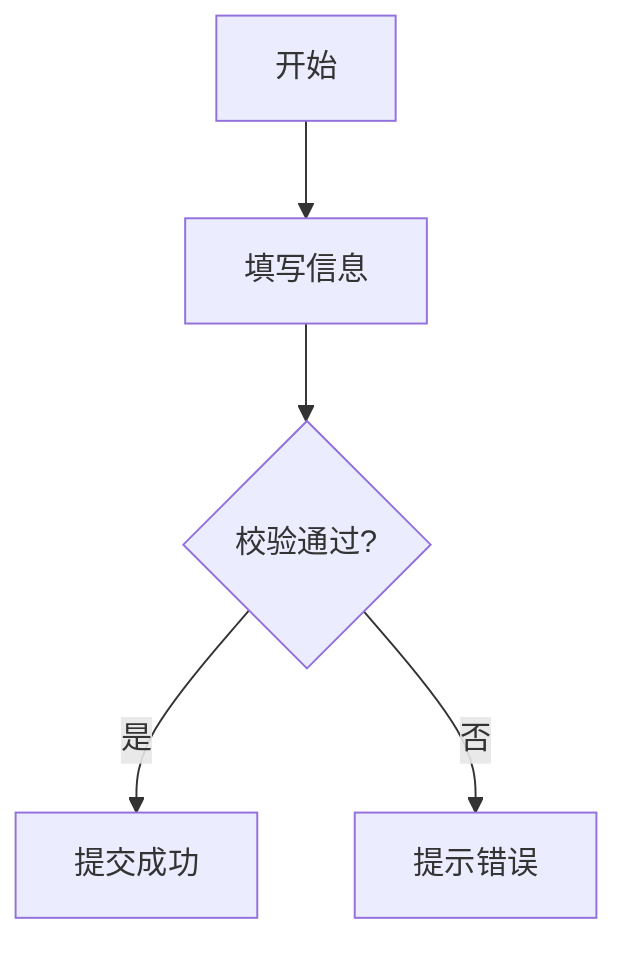

使用时只要记住两点：

- 代码块语言标记必须是 `mermaid`
- 先选对图表类型，再写内容

## 什么时候用哪种图

|场景 |推荐图表 |
|---|---|
|业务流程、审批流、判断分支 |Flowchart |
|前后端、服务、数据库调用顺序 |Sequence Diagram |
|项目排期、里程碑、任务依赖 |Gantt Chart |
|类关系、接口设计、模块结构 |Class Diagram |
|状态切换、生命周期、状态机 |State Diagram |
|数据库表结构、实体关系 |ER Diagram |
|用户体验流程、服务接触点 |User Journey |
|比例分布、占比展示 |Pie Chart |
|分支合并、版本演进 |Git Graph |
|头脑风暴、知识结构 |Mindmap |

## 通用书写建议

- 节点文本尽量短，长句放到正文，不要塞进图里。
- 一张图只表达一个主题，不要把流程、数据结构、排期混在一起。
- 优先使用中文业务词，不要混杂过多内部缩写。
- 节点数量过多时，先拆成两张图，再考虑子图。
- 从上到下 `TD` 和从左到右 `LR` 是最稳妥的默认方向。

## 流程图 Flowchart

适合表达步骤、判断、跳转和模块关系，是最常用的 Mermaid 图。

### 最小示例

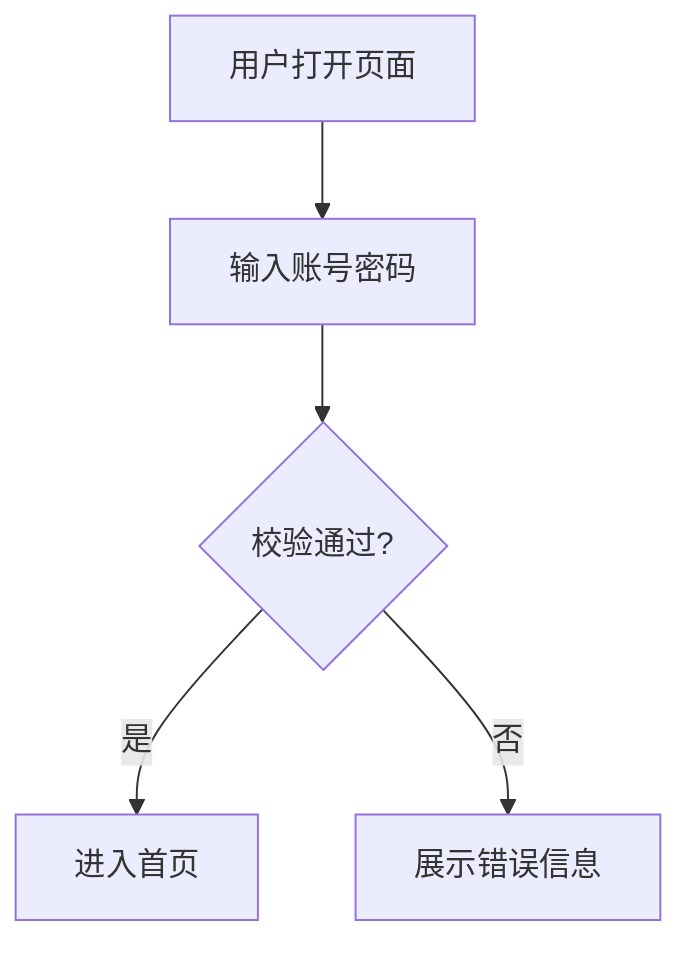

### 常见节点形状

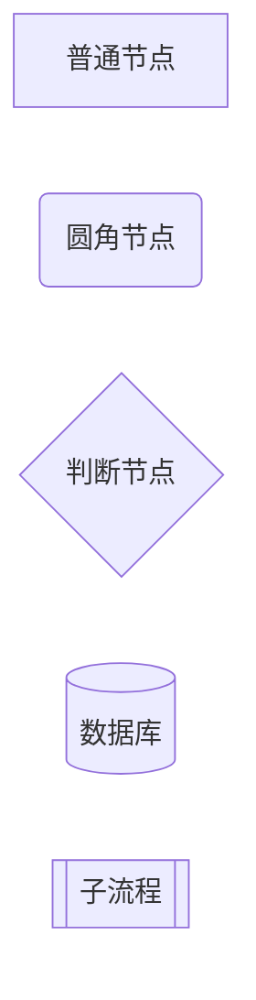

### 常见连接方式

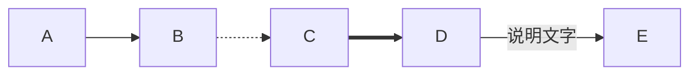

### 子图

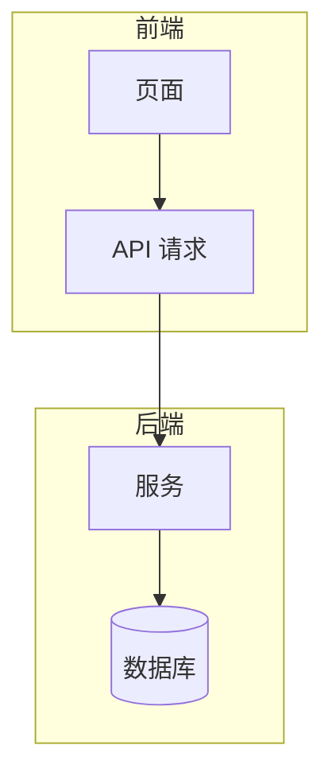

### 适用建议

- 业务流程图优先用 `TD`
- 系统架构图优先用 `LR`
- 判断分支尽量写成 `是 / 否` 或 `成功 / 失败`

## 时序图 Sequence Diagram

适合表达多个参与方之间“谁先调用谁、谁返回什么”。

### 最小示例

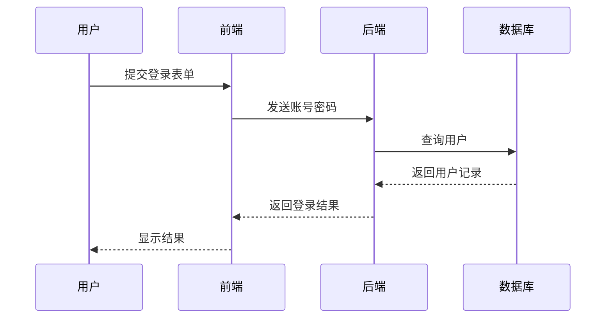

### 条件、可选和循环

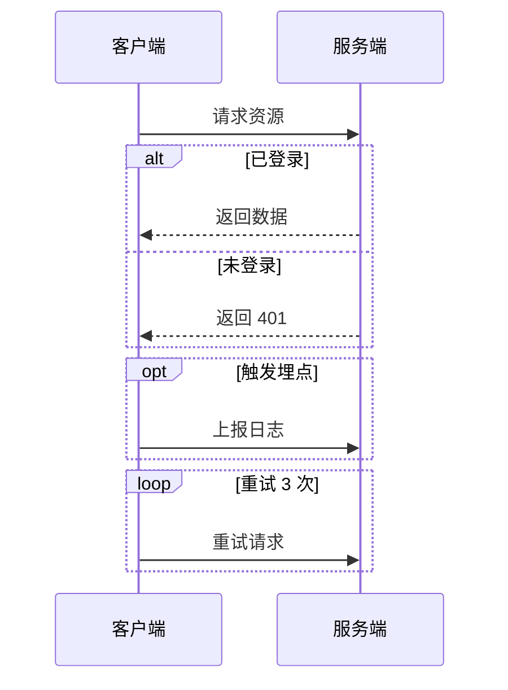

### 激活条

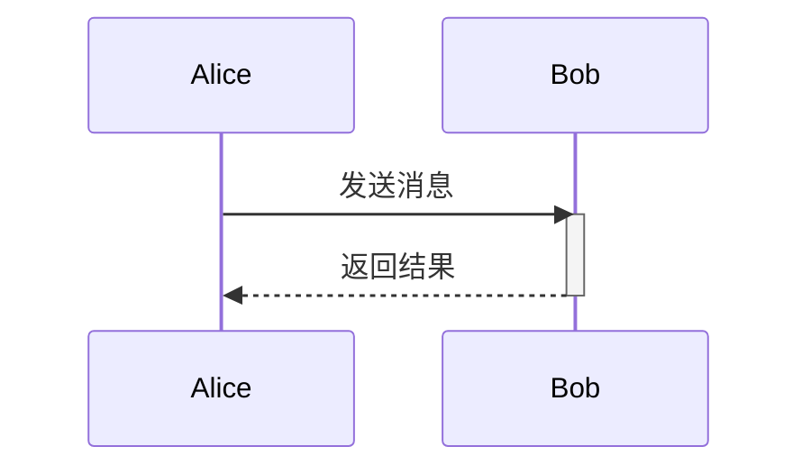

### 适用建议

- 参与者不要超过 6 个，否则可读性会明显下降
- 一条消息写一个动作，不要把“鉴权 + 查询 + 转换 + 返回”塞在同一行

## 甘特图 Gantt Chart

适合项目计划、里程碑、阶段性任务展示。

### 最小示例

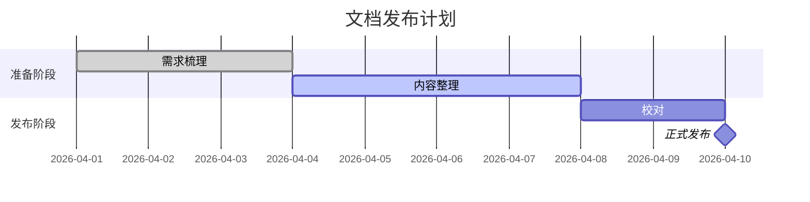

### 常见状态

- `done`：已完成
- `active`：进行中
- `crit`：关键任务
- `milestone`：里程碑

### 适用建议

- 日期格式统一写成 `YYYY-MM-DD`
- 任务命名用“动作 + 对象”，例如“整理素材”“完成评审”
- 不建议把过多细碎任务都放进甘特图，保留阶段级信息即可

## 类图 Class Diagram

适合表达类、接口、属性、方法以及它们之间的关系。

### 最小示例

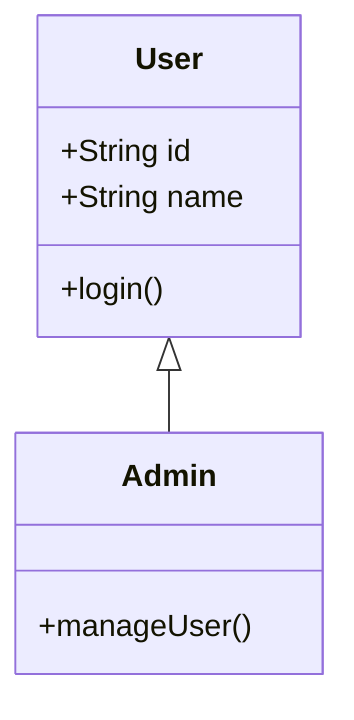

### 常见关系

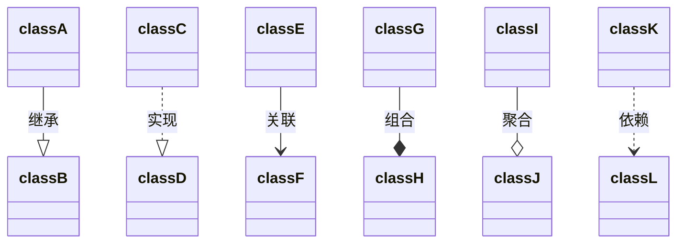

### 可见性

- `+`：public
- `-`：private
- `#`：protected
- `~`：package

### 适用建议

- 面向读者解释设计时，只保留关键属性和方法
- 不要把真实代码完整翻译成类图，那会比源码更难读

## 状态图 State Diagram

适合描述一个对象在不同状态间如何切换。

### 最小示例

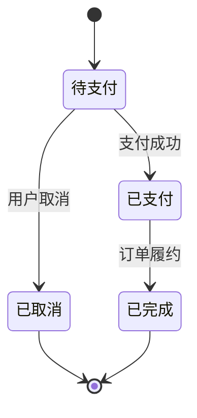

### 复合状态

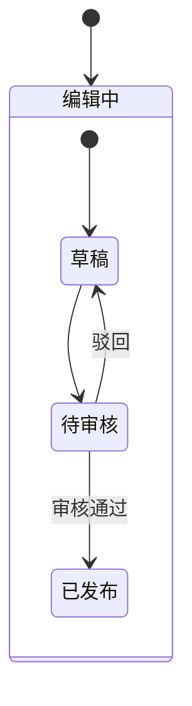

### 适用建议

- 状态名用名词，如“待审核”“已发布”
- 迁移动作用动词，如“提交”“通过”“驳回”

## 实体关系图 ER Diagram

适合数据库设计和业务实体建模。

### 最小示例

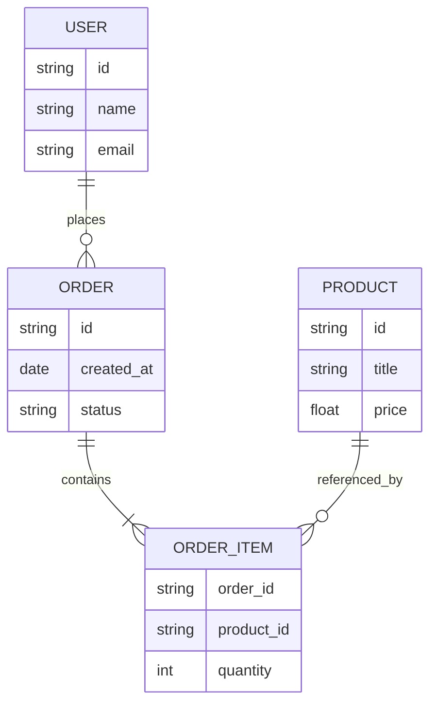

### 常见关系

- `||--||`：一对一
- `||--o{`：一对多
- `}o--o{`：多对多

### 适用建议

- ER 图优先关心实体和关系，不要试图完整表达所有字段细节
- 如果字段太多，只保留主键、外键和核心业务字段

## 用户旅程图 User Journey

适合表达用户在一个场景里的感受和经历。

### 最小示例

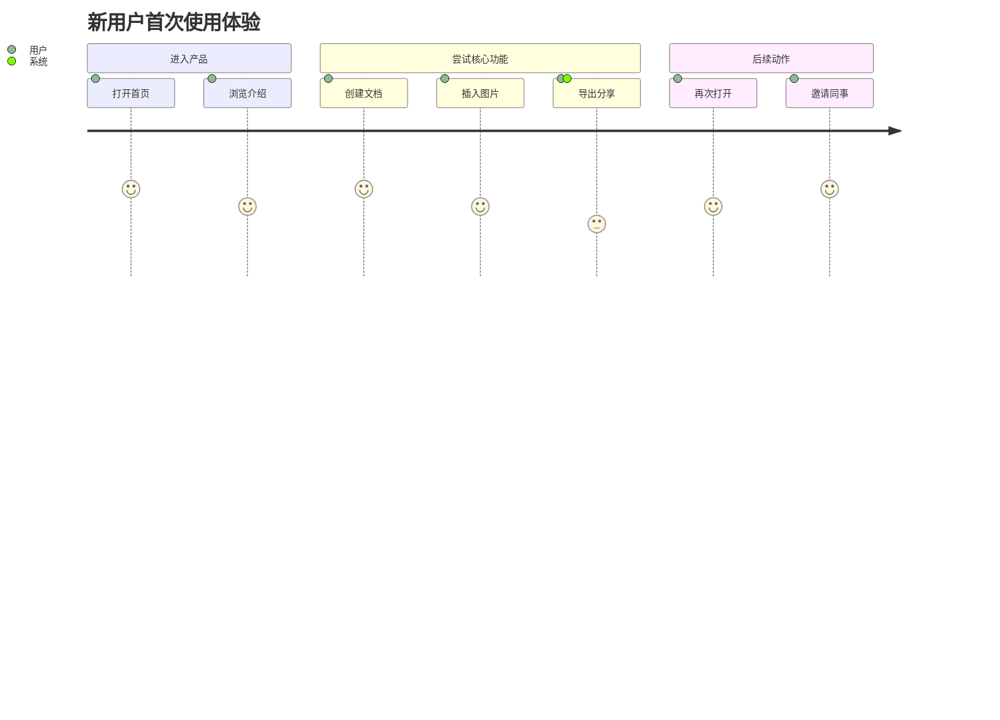

### 适用建议

- 分数通常用 1 到 5
- 每个 section 表示一个阶段
- 很适合做产品体验梳理，不适合做系统技术说明

## 饼图 Pie Chart

适合做简单占比展示。

### 最小示例

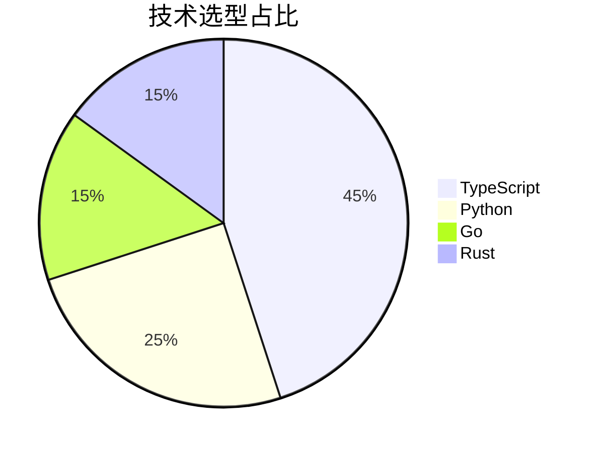

### 适用建议

- 类别不要太多，5 个以内最佳
- 如果要强调趋势变化，优先考虑正文说明或换别的图，不要滥用饼图

## Git 图 Git Graph

适合展示分支创建、合并和发布过程。

### 最小示例

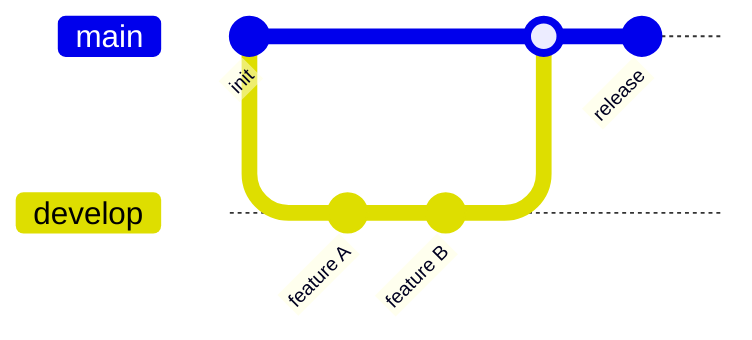

### 适用建议

- 适合培训、分享和流程说明
- 不适合替代真实 Git 历史记录

## 思维导图 Mindmap

适合做知识整理、方案拆解和头脑风暴。

### 最小示例

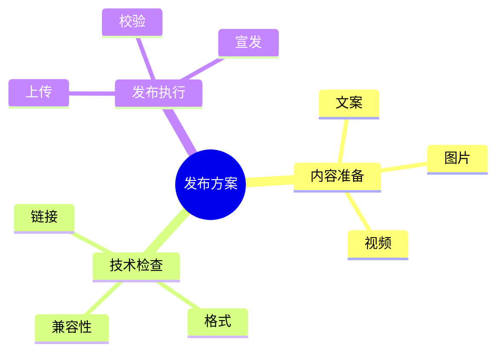

### 适用建议

- 根节点写主题
- 第二层写大类
- 第三层开始写细项

## 常用技巧

### 注释

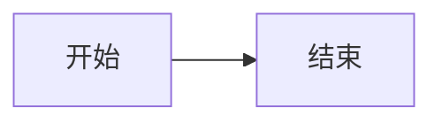

### 样式


### 链接

```mermaid
flowchart LR
    A[查看官网]
    click A "https://mermaid.js.org" "打开 Mermaid 官网"
```

## 常见问题

### 1. 图不显示

优先检查以下问题：

- 代码块语言是否写成了 `mermaid`
- 缩进和语法关键字是否拼错
- 节点文本中是否混入了未闭合的括号或引号

### 2. 图太宽或太乱

- 减少节点文字长度
- 拆成多张图
- 把方向从 `LR` 改成 `TD`，或反过来试一次

### 3. 不知道选什么图

- 有“步骤和判断”就用流程图
- 有“调用顺序”就用时序图
- 有“时间安排”就用甘特图
- 有“实体和关系”就用 ER 图
- 有“状态切换”就用状态图

## 推荐工作流

1. 先用 3 到 6 个节点写最小版本
2. 确认图表类型选对
3. 再补分支、说明和样式
4. 最后检查是否需要拆图

## 在线工具

- [Mermaid Live Editor](https://mermaid.live/)
- [Mermaid 官方文档](https://mermaid.js.org/)

## 总结

Mermaid 最有价值的地方，不是“能画很多图”，而是它让图表和文档一起被文本化、版本化、可维护化。

如果你是在写 Zditor 文档，建议默认从流程图、时序图、甘特图、ER 图这四类开始，它们覆盖了大多数说明场景。
