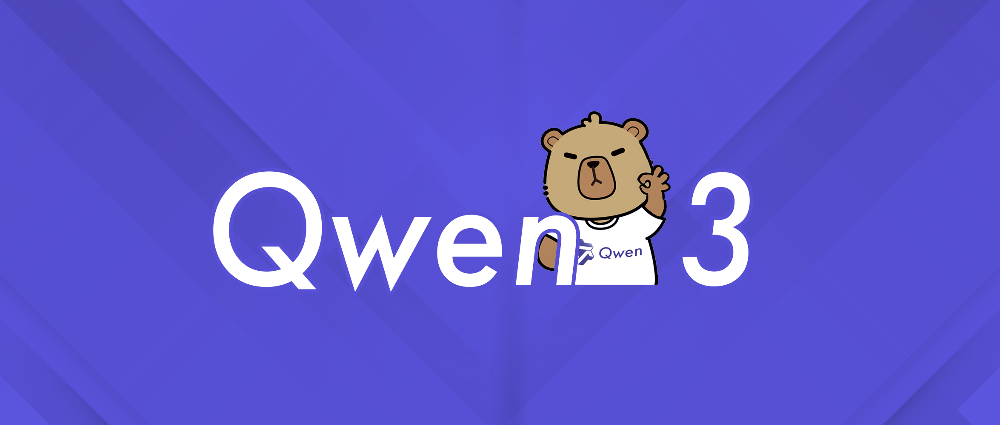
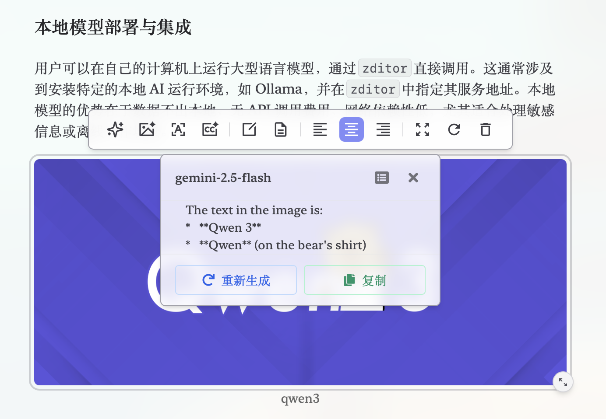
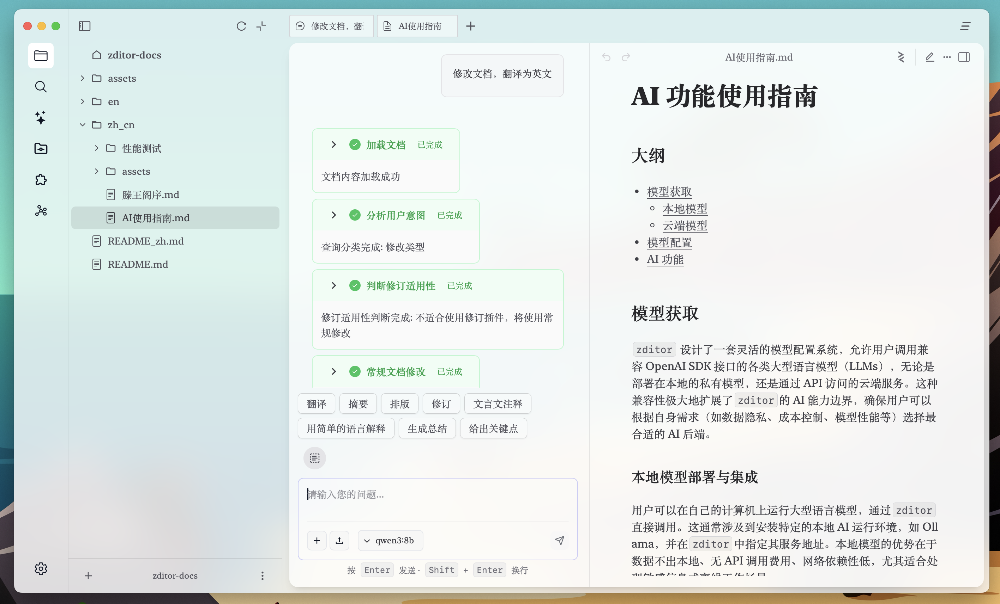

# AI 機能使用ガイド

## 目次

- [モデル取得](#モデル取得)
  - [ローカルモデル](#ローカルモデル展開と統合)
  - [クラウドモデル](#クラウド-api-モデル統合)
- [モデル設定](#モデル設定)
- [AI 機能](#機能)
- [今後の計画](#今後)

## モデル取得

`zditor` は柔軟なモデル設定システムを設計し、ユーザーがOpenAI SDK互換インターフェースを持つ様々な大型言語モデル（LLMs）を呼び出すことを可能にします。ローカルに展開されたプライベートモデルでも、APIを通じてアクセスするクラウドサービスでも利用可能です。この互換性により`zditor`のAI能力の境界が大幅に拡張され、ユーザーは自身のニーズ（データプライバシー、コスト管理、モデル性能など）に基づいて最適なAIバックエンドを選択できます。

### ローカルモデル展開と統合

ユーザーは自分のコンピューター上で大型言語モデルを実行し、`zditor`から直接呼び出すことができます。これは通常、Ollamaなどの特定のローカルAI実行環境をインストールし、`zditor`でそのサービスアドレスを指定することを含みます。ローカルモデルの利点は、データがローカルから出ない、API呼び出し料金がない、ネットワーク依存性が低い点で、特に機密情報の処理やオフライン作業シナリオに適しています。

- [ollama公式サイト](https://www.ollama.com/)からollamaをダウンロード
- モデルをダウンロード、例えばQwen3をダウンロード：`ollama run qwen3:8b`
- モデルリストを確認：`ollama list`

### クラウド API モデル統合

ユーザーはインターネットを通じて各大手AI事業者が提供するモデルサービスにアクセスできます。`zditor`はこれらのサービスのAPIキーとインターフェースアドレスの設定をサポートし、クラウドモデルとのシームレスな接続を実現します。クラウドモデルの利点は、ローカルの高性能ハードウェアが不要、モデルの更新がタイムリー、拡張が容易な点ですが、データ送信とAPI呼び出しコストを考慮する必要があります。

SiliconFlowを例として：

- [SiliconFlow公式サイト](https://cloud.siliconflow.cn/)で登録・ログイン
- モデル広場でモデルを選択し、モデル名をコピー
- APIキーで作成・コピー

## モデル設定

どのクラウドAI事業者（OpenAI、Anthropic、百度文心一言、阿里雲通義千問など）を選択しても、`zditor`のAPIモデル設定プロセスは大同小異です。OpenAI SDKの互換性設計に従っているためです。

- zditorを開き、設定に入り、モデルグループ右側の追加ボタンを選択
- グループ名を設定（カスタマイズ可能、重複不可）、ベースURLを設定。OllamaのモデルURLはデフォルト設定済み。SiliconFlowは[公式ドキュメント](https://docs.siliconflow.cn/cn/faqs/stream-mode)を参照。現在は`https://api.siliconflow.cn/v1`
- APIキーを設定。上記の手順でコピーしたもの。ollamaの場合は空白でも可
- モデルを設定。英語カンマで区切り。上記の手順でコピーしたモデル名
- topp、温度などのパラメータを設定。デフォルトでも可。より良い効果のために対応するモデルの公式ドキュメントを参照

設定ページでモデルを選択し、新しいタブを開いて質問をテストします。下図はollamaでダウンロードしたqwen3の例です。まず設定で対応するモデルを選択し、タブで質問を入力すると、モデルがストリーミング出力で回答するのが確認できます。

## 機能

Zditorは AI テキスト選択と多ラウンド対話の2つの形式をサポートします。markdownドキュメントを開き、テキストを選択するとテキストツールバーが表示され、画像を選択すると画像ツールバーが表示されます。現在5種類のツールバーがあります。ツールバーにはカスタムプロンプトドロップダウンリストとカスタムプロンプトアイコンコンポーネントがあります。

### 多ラウンド対話

新しいタブを開くと、デフォルトで多ラウンド対話モードになります。モデル実行中は、==タブに緑色の丸が点滅==し、モデルが実行中であることを示します。他のタブに切り替えてもタスクは実行され続けます。

### AI excalidraw手描き

現在、一部の先進的なモデルは、プロンプトワードから直接良好な手描き効果を得ることができます。下図を参照し、多ラウンド対話で生成効果を直接プレビューでき、excalidrawにコピーして編集することも可能です。

### マルチモーダル

マルチモーダル入力をサポートし、多ラウンド対話で画像添付ファイルを入力できるほか、画像ツールバーも画像関連の入力をサポートします。

左側ナビゲーションバーでプラグインを選択すると、AIドロップダウンリストのプロンプトワードを追加・削除でき、AIツールバーのショートカットプロンプトワードボタンも追加・削除できます。

### 記事レイアウト

適切なモデルを選択し、修正が必要なmarkdownドキュメントのタブを入力ボックスにドラッグ（この操作はagent workflowをトリガーし、原文での文書修正を実現）、そして質問を入力します。

### 記事修正

適切なモデルを選択し、修正が必要なmarkdownドキュメントのタブを入力ボックスにドラッグ（この操作はagent workflowをトリガーし、原文での文書修正を実現）、そして質問を入力します。これはまだ完全に完成していませんが、今後ワークフローを修正し、段落ごとに修正処理し、検証（AI修正は必ずしも正しくなく、原文を変更する可能性もある）、検証成功後に次の段落に続行、複数回の再試行を行う予定です。修正に適したシナリオ：公式アカウント記事の誤字脱字、作文などの文字作業のシナリオ。

## 今後

今後はまずワークフロー関連部分を完善し、ユーザーの局所的な記事修正ニーズ（例：第2段落の修正、要約段落の修正）を実現します。AI文章修正により誤った修正が発生することがあります。例えば、元々正しかったのにAIが間違って修正した場合、ユーザーが必ずしも気づけるとは限りません。この時、原文修正で厳格に原文を変更してはいけないという要求は非常に必要です。現在は原文と比較し、不正確な場合はユーザーに提示しますが、今後は段落別修正に変更し、提案が不正確だと発見された場合は再修正します。

今後excalidraw関連コードを修正し、excalidrawホワイトボードのAI機能を実現します。同様にagentワークフローを追加し、マインドマップへの変換、整列、AI手描き要素追加などの機能を実現する予定です。

[手描きリンゴ.excalidraw](assets/手绘苹果.excalidraw)