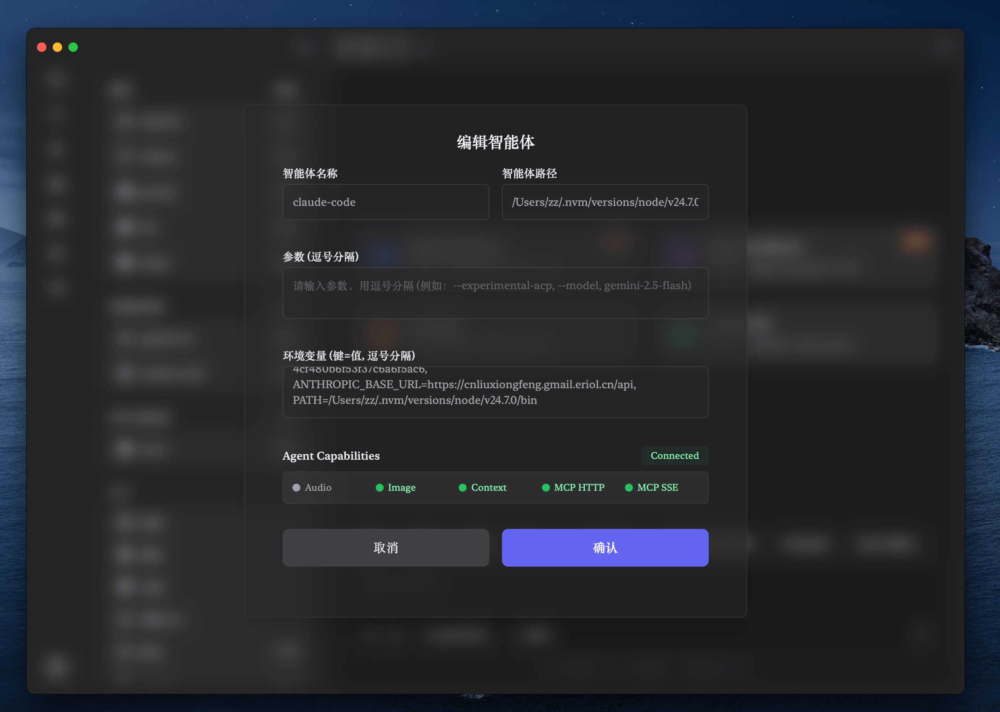
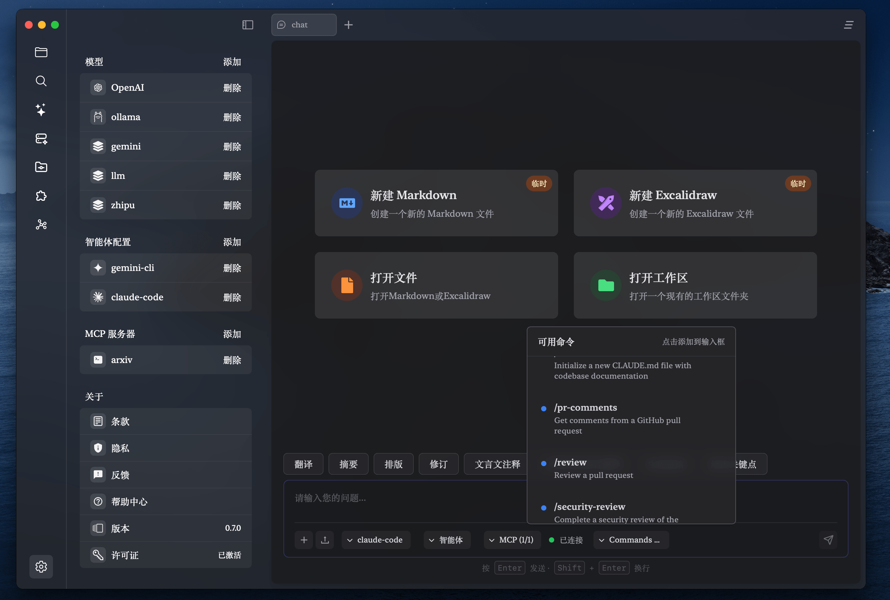
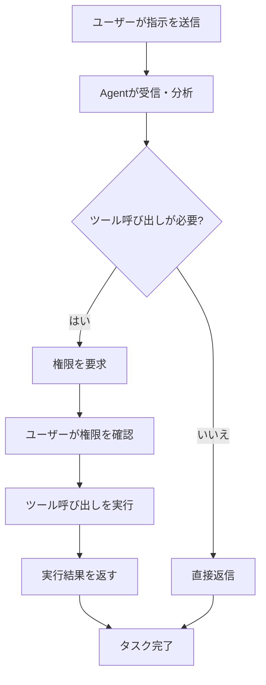

# Agent 智能体使用ガイド

## 1. Agent 智能体とは？

!!! info "核心概念"
    Agent（智能体）機能により、ZditorはAgent Client Protocol (ACP) プロトコルとの互換性を通じて、お使いのコンピューターにインストールされた様々なCLIツール（Gemini CLI、Claude Codeなど）と統合できます。これらのツールは、テキスト生成、ネット検索、MCPツール、ファイル操作、ツール呼び出しなどの高度な機能を含む強力なAIサービスをZditorに提供できます。

> Agent 智能体モードは従来の対話モードと比較して、より強力なタスク実行能力と自主性を持ち、ツールの積極的な呼び出し、ファイル操作、複雑な多段階タスクの実行が可能です。

## 2. クイックスタート

### 2.1. Claude Code クイック設定

Agent機能を素早く体験したい場合は、Claude Codeから始めることをお勧めします：

```bash
# 1. Node.jsをインストール（まだインストールしていない場合）
# https://nodejs.org にアクセスしてダウンロード・インストール

# 2. Claude Code ACP アダプターをインストール
npm install -g @zed-industries/claude-code-acp

# 3. APIキーを取得
# https://console.anthropic.com/ にアクセスしてAPIキーを取得
```

**Zditorでの設定：**
1. 設定 → 智能体設定 → 追加 を開く
2. 設定を入力：
   - 智能体名前：`claude-code`
   - 智能体パス：`claude-code-acp`（または `which claude-code-acp` で完全パスを確認）
   - 環境変数：`ANTHROPIC_API_KEY=your_api_key_here, PATH=/usr/local/bin`
3. "Test Connection"をクリックして接続を確認
4. 設定を保存

!!! note "PATH設定の説明"
    nvmでNode.jsバージョンを管理している場合、PATHにnvm関連のパスを含める必要がある場合があります。例：
    `PATH=/Users/username/.nvm/versions/node/v18.0.0/bin:/usr/local/bin:/usr/bin:/bin`

### 2.2. 使用開始

1. Zditorメインインターフェースで「智能体モード」を選択
2. Agent選択器から `claude-code` を選択
3. 接続の確立を待つ
4. 対話を開始し、Agentの強力な機能を体験！

## 3. Agentと通常のAI対話の違い

### 3.1. 機能比較

| 機能特性 | 通常のAI対話 | Agent 智能体 |
| :------- | :----------- | :----------- |
| 対話インタラクション | ✅ サポート | ✅ サポート |
| ファイル読み書き | ❌ 非サポート | ✅ サポート |
| ツール呼び出し | ❌ 非サポート | ✅ サポート |
| 多段階タスク | ❌ 非サポート | ✅ サポート |
| 権限管理 | ❌ 不要 | ✅ きめ細かい権限制御 |
| リアルタイムフィードバック | ❌ 単発返信 | ✅ ストリーミング思考プロセス |
| ターミナル操作 | ❌ 非サポート | 🚧 開発中 |
| テキスト選択機能 | ❌ 非サポート | 🚧 開発中 |

### 2.2. 使用シナリオ

**通常のAI対話に適用：**
- 日常的な質問相談
- テキストコンテンツ生成
- 簡単な翻訳・要約

**Agent 智能体に適用：**
- コードプロジェクトの分析と修正
- ファイルの一括処理
- 複雑な多段階タスク
- 外部ツール呼び出しが必要なシナリオ

**近日サポート予定のシナリオ：**
- 🚧 **ターミナル操作シナリオ**：システム管理、スクリプト実行、開発環境設定
- 🚧 **テキスト選択操作シナリオ**：ドキュメントの迅速処理、コンテンツのインテリジェント抽出と変換

## 3. Agent設定ガイド

### 3.1. Agent設定を開く

1. Zditorアプリケーションを起動
2. **設定ページ**に入る
3. **智能体設定**部分を見つける
4. **追加**ボタンをクリック



### 3.2. 基本設定項目

#### 智能体名前
- **役割**：Agentを識別するユニークな名前
- **フォーマット要件**：
  - タブ文字を含めない
  - 先頭または末尾の空白なし
  - ユニークで重複不可
- **例**：`gemini-cli`、`claude-desktop`、`custom-agent`

#### 智能体パス
- **役割**：インストール済みCLIツールの実行可能ファイルの完全パス
- **フォーマット要件**：
  - 有効なファイルパスでなければならない
  - ファイルに実行権限が必要
  - タブ文字や前後の空白を含めない
- **例**：
  - macOS: `/usr/local/bin/gemini`（Gemini CLI）
  - Windows: `C:\Users\username\.nvm\versions\node\v20.0.0\bin\claude.cmd`（Claude Code）
  - Linux: `/opt/claude/claude-cli`

### 3.3. 高度設定項目

#### パラメータ設定（オプション）
- **役割**：CLIツール起動時のコマンドライン引数
- **フォーマット**：英語カンマで複数パラメータを区切る
- **例**：
  - Gemini CLI: `--experimental-acp, --model, gemini-2.5-flash`
  - Claude Code: `--help`（利用可能パラメータを確認）

#### 環境変数（オプション）
- **役割**：CLIツール実行時に必要な環境変数
- **フォーマット**：`キー=値` 形式、英語カンマで区切る
- **例**：
  - Gemini CLI: `GEMINI_API_KEY=your_api_key, MODEL_NAME=gemini-pro`
  - Claude Code: `ANTHROPIC_API_KEY=your_key`

!!! warning "セキュリティ注意"
    環境変数のAPIキーなどの機密情報はローカル設定に保存されます。システムのセキュリティを確保してください。

### 3.4. 接続テスト

設定完了後、**Test Connection**ボタンをクリックして接続テストを行います：

1. **接続確認**：Agentプログラムが正常に起動できるかチェック
2. **プロトコルハンドシェイク**：ACP プロトコル通信が正常かどうか検証
3. **能力検出**：Agentがサポートする機能リストを取得

#### 能力インジケーターの説明

テスト成功後、Agentの能力情報が表示されます：

- **Audio** 🎵：音声処理サポートの有無
- **Image** 🖼️：画像処理サポートの有無
- **Context** 📄：埋め込みコンテキストサポートの有無
- **MCP HTTP** 🌐：MCP HTTPプロトコルサポートの有無
- **MCP SSE** ⚡：MCP Server-Sent Eventsサポートの有無

## 4. Agent 智能体の使用

### 4.1. Agentモードの起動

1. Zditorメインインターフェースで、**モード選択器**を見つける
2. **智能体モード**を選択
3. **Agent選択器**から設定したAgentを選択
4. 接続確立を待つ（状態が「接続済み」と表示）



### 4.2. 対話開始

Agent接続成功後、以下が可能です：

- **テキストメッセージ送信**：直接質問や指示を入力
- **ファイルアップロード**：ファイルを対話ボックスにドラッグし、Agentがファイル内容を分析
- **複雑なタスク実行**：Agentが思考プロセスと実行ステップを表示



### 4.3. Agent思考プロセス

Agentがタスクを実行する際、詳細な思考プロセスが表示されます：

- **💭 思考**：Agentが問題を分析し計画を立てる
- **🔧 ツール呼び出し**：Agentが具体的なツールを呼び出して操作を実行
- **📝 結果**：実行結果と要約を返す


## 5. 権限管理

### 5.1. 権限要求タイプ

Agentが機密操作を実行する必要がある場合、権限要求ダイアログが表示されます：

#### ファイルシステム権限
- **ファイル読み取り**：Agentが指定ファイル内容の読み取りを要求
- **ファイル書き込み**：Agentがファイルの作成または修正を要求
- **ファイル操作**：Agentがファイルの削除、移動、または名前変更を要求

#### ネットワークアクセス権限
- **HTTPリクエスト**：AgentがネットワークAPIへのアクセスを要求
- **データダウンロード**：Agentがネットワークリソースのダウンロードを要求

#### システム操作権限
- **コマンド実行**：Agentがシステムコマンドの実行を要求
- **環境アクセス**：Agentがシステム環境情報へのアクセスを要求

### 5.2. 権限決定

権限要求に対して、以下を選択できます：

- **✅ 許可**：権限を付与して操作を続行
- **❌ 拒否**：権限要求を拒否、Agentが代替案を探す
- **⏹️ キャンセル**：現在の操作をキャンセル

!!! tip "権限管理の提案"
    - Agentの権限要求を慎重に審査
    - 必要最小限の権限のみを付与
    - 不慣れな操作については、まず拒否して詳細を理解
    - Agentの動作が期待通りかを定期的にチェック

## 6. よくある問題とトラブルシューティング

### 6.1. 接続問題

**Q: CLIツール接続失敗、「Failed to establish connection」と表示**

可能な原因と解決策：

1. **パスをチェック**：CLIツールパスが正しいか確認
   ```bash
   # ファイルが存在するか検証
   ls -la /usr/local/bin/gemini

   # 実行権限をチェック
   chmod +x /usr/local/bin/gemini
   ```

2. **依存関係をチェック**：CLIツールの依存関係がインストールされているか確認
   ```bash
   # Node.jsをチェック（Gemini CLIとClaude Codeの両方で必要）
   node --version
   npm --version
   ```

3. **インストール確認**：CLIツールが正しくインストールされているか確認
   ```bash
   # Claude Code ACPをテスト
   claude-code-acp --help

   # Gemini CLIをテスト
   gemini --help
   ```

4. **ログを確認**：エラーログの具体的なエラー情報をチェック
5. **環境変数**：必要な環境変数が正しく設定されているか検証
   ```bash
   # APIキーをチェック
   echo $ANTHROPIC_API_KEY
   echo $GEMINI_API_KEY

   # PATHに必要なパスが含まれているかチェック
   echo $PATH
   ```

**Q: CLIツール起動後すぐに終了**

よくある原因と解決策：

1. **PATH設定問題**：CLIツールがNode.jsまたは依存関係を見つけられない
   ```bash
   # Node.jsがPATHにあるかチェック
   which node
   which npm

   # 見つからない場合、環境変数にPATHを追加する必要がある
   # 例：PATH=/usr/local/bin:/usr/bin:/bin
   ```

2. **依存関係不足**：CLIツールがACPプロトコルをサポートしているかチェック
3. **パラメータエラー**：起動パラメータが正しいか確認（`ツール名 --help` で確認可能）
4. **権限問題**：CLIツールに実行権限があるか確認

**Q: 「command not found」エラーが表示**

これは通常PATH設定問題です：

```bash
# 1. CLIツールの実際のインストール場所を見つける
npm config get prefix
ls $(npm config get prefix)/bin

# 2. そのパスをZditorの環境変数に追加
# 例：PATH=/usr/local/bin:/Users/username/.npm-global/bin:/usr/bin:/bin
```

### 6.2. 権限問題

**Q: Agent権限要求が頻繁に拒否される**

- Agentが権限が必要なタスクを完了できない
- 操作を再開始すると再度権限を要求
- 設定で一般的な権限を事前承認することを検討

**Q: Agent動作異常、意図しない操作を実行**

- 現在のセッションを即座に停止
- CLIツールが公式の信頼できるソースからのものかチェック
- 公式版CLIツールを再設定または置き換え

### 6.3. パフォーマンス問題

**Q: Agent応答速度が遅い**

最適化提案：

1. **ネットワークをチェック**：ネットワーク接続が安定しているか確認
2. **システムリソース**：十分なメモリとCPUリソースがあるか確認
3. **ツールバージョン**：CLIツールの最新バージョンを使用
4. **パラメータ調整**：起動パラメータを調整してパフォーマンスを最適化

## 7. ベストプラクティス

### 7.1. セキュリティ設定

1. **信頼できるソース**：公式または信頼できるソースからのCLIツールのみをインストール
2. **権限制御**：最小権限原則を採用し、慎重に権限を付与
3. **定期更新**：CLIツールを最新バージョンに保つ
4. **動作監視**：Agentのファイル操作とネットワークアクセスに注意

### 7.2. CLIツール管理

1. **バージョン管理**：バージョン管理ツールを使用してCLIツールの異なるバージョンを管理
   ```bash
   # nvmを使用してNode.jsバージョンを管理（npm インストールツール用）
   nvm use 18
   npm install -g @zed-industries/claude-code-acp

   # インストール済みグローバルnpmパッケージを確認
   npm list -g --depth=0
   ```

2. **環境変数管理**：Zditor Agent設定でAPIキーとPATHを安全に管理
   ```text
   # Zditor Agent Managerの環境変数フィールドで設定：
   ANTHROPIC_API_KEY=your_key, PATH=/usr/local/bin
   GEMINI_API_KEY=your_key, PATH=/usr/local/bin

   # 注意：これらの変数はAgentプロセス内でのみ有効で、システム全体の環境には影響しない
   ```

3. **ツール更新**：最新機能を得るためにCLIツールを定期的に更新
   ```bash
   # Claude Code ACPを更新
   npm update -g @zed-industries/claude-code-acp

   # Gemini CLIを更新
   npm update -g @google/gemini-cli
   ```

### 7.3. 効率的な使用

1. **明確な指示**：明確で具体的なタスク記述を提供
2. **段階的実行**：複雑なタスクを複数の簡単なステップに分解
3. **コンテキスト活用**：関連ファイルをコンテキスト情報としてアップロード
4. **適時介入**：Agent実行プロセス中に適時フィードバックを提供

### 7.4. 障害予防

1. **重要ファイルのバックアップ**：Agentにファイル操作をさせる前に先にバックアップ
2. **テスト環境**：非本番環境でAgent機能をテスト
3. **段階的承認**：簡単なタスクから始めて、徐々にAgentを信頼
4. **更新維持**：ZditorおよびCLIツールを定期的に更新

## 8. 技術リファレンス

### 8.1. Agent Client Protocol (ACP)

- **プロトコルバージョン**：ACP 0.4.0仕様をサポート
- **通信方式**：JSON-RPC基盤の標準入出力通信
- **サポート機能**：
  - ファイルシステム操作
  - セッション管理
  - 権限制御
  - ツール呼び出し
  - ストリーミング応答

**開発中の機能（TODO）：**
- 🚧 **ターミナルサポート**：ターミナル操作機能をサポートし、Agentにコマンドライン操作を許可する計画
- 🚧 **テキスト選択サポート**：テキスト選択とテキスト選択操作をサポートし、より便利なテキスト処理方法を提供する計画

### 8.2. 互換CLIツール

現在ACPプロトコルと互換性が確認されているCLIツールとそのインストール設定方法：

#### Gemini CLI

**インストール手順：**
```bash
# 公式GitHubリポジトリからインストール
# https://github.com/google-gemini/gemini-cli にアクセス

# 方法1：npmでインストール（推奨）
npm install -g @google/gemini-cli

# 方法2：ソースコードからコンパイルインストール
git clone https://github.com/google-gemini/gemini-cli.git
cd gemini-cli
npm install
npm run build
npm link
```

**設定手順：**
1. Gemini APIキーを取得：[Google AI Studio](https://aistudio.google.com/app/apikey) にアクセス
2. Zditorで設定：
   - **智能体名前**：`gemini-cli`
   - **智能体パス**：`gemini`（または `which gemini` で完全パスを確認）
   - **パラメータ**：`--experimental-acp, --model, gemini-2.5-flash`
   - **環境変数**：`GEMINI_API_KEY=your_api_key_here, PATH=/usr/local/bin`

#### Claude Code

**インストール手順：**
```bash
# まずNode.js（v18以上推奨）がインストールされていることを確認
node --version

# Claude Code ACPアダプターをインストール
npm install -g @zed-industries/claude-code-acp

# インストール確認
claude-code-acp --version
```

**設定手順：**
1. Anthropic APIキーを取得：[Anthropic Console](https://console.anthropic.com/) にアクセス
2. Zditorで設定：
   - **智能体名前**：`claude-code`
   - **智能体パス**：`/usr/local/bin/claude-code-acp`（または `which claude-code-acp` でパスを確認）
   - **パラメータ**：`--model, claude-3-5-sonnet-20241022`
   - **環境変数**：`ANTHROPIC_API_KEY=your_api_key_here, PATH=/usr/local/bin:/usr/bin:/bin`

!!! warning "PATH環境変数設定"
    これらのCLIツールはNode.jsに依存するため、システムレベルではなく、Agent ManagerのKannta **環境変数**フィールドでPATHを設定する必要があります。

    **Zditor Agent設定の環境変数に追加：**
    - macOS/Linux: `PATH=/usr/local/bin` または `PATH=/usr/local/bin:/usr/bin:/bin`
    - Windows: `PATH=C:\Program Files\nodejs;%APPDATA%\npm`

    **設定例：**
    ```
    ANTHROPIC_API_KEY=your_key, PATH=/usr/local/bin
    ```

!!! tip "パス検索とPATH設定"
    CLIツールのインストールパスが不明な場合は、以下のコマンドで検索できます：
    ```bash
    # Gemini CLIパスを検索
    which gemini

    # Claude Code ACPパスを検索
    which claude-code-acp

    # npmグローバルインストールパスを確認
    npm list -g --depth=0
    npm config get prefix

    # 現在のPATH環境変数を確認
    echo $PATH

    # Node.jsとnpmパスを検索
    which node
    which npm
    ```

    **Zditor Agent設定でPATHを設定：**
    - デフォルト設定によると、ほとんどの場合 `PATH=/usr/local/bin` 設定で十分
    - nvmを使用している場合、Node.jsバージョンパスを含める必要：`PATH=/Users/username/.nvm/versions/node/v18.0.0/bin`
    - 複数パスを含めることが可能：`PATH=/usr/local/bin:/usr/bin:/bin`

#### その他のCLIツール統合

**互換CLIツールの検索**

他のAIサービスのCLIツールを統合する必要がある場合：

1. **既存のACP互換ツールを検索**
   ```bash
   # GitHubやnpmで検索
   npm search acp agent
   # または関連プロジェクトのIssuesとドキュメントを確認
   ```

2. **公式CLIツールがACPをサポートしているかチェック**
   - 公式ドキュメントやGitHubリポジトリを確認
   - "ACP"、"Agent Client Protocol" 関連キーワードを検索
   - 実験的ACP機能フラグがあるかチェック

**自作アダプター実装**

既存ツールがACPをサポートしていない場合：

1. **既存CLIツールをラップ**
   - ACPプロトコルをターゲットCLIのAPI呼び出しに変換するアダプタープログラムを作成
   - Node.js、Pythonまたは他の言語で実装

2. **カスタムACPツールを開発**
   - [ACP プロトコル仕様](https://github.com/anthropics/agent-client-protocol) を参照
   - 公式ACP SDKやライブラリを使用して開発
   - ツールが標準入出力通信をサポートしていることを確認

3. **オープンソースコミュニティに貢献**
   - アダプターをオープンソース化し、他のユーザーを支援
   - 元プロジェクトにPRを提出してACPサポートを追加

---

!!! note "ドキュメント更新"
    本ドキュメントはZditorとAgent機能の発展に伴い継続的に更新されます。問題や提案がある場合は、アプリ内フィードバック機能を通じてお問い合わせください。