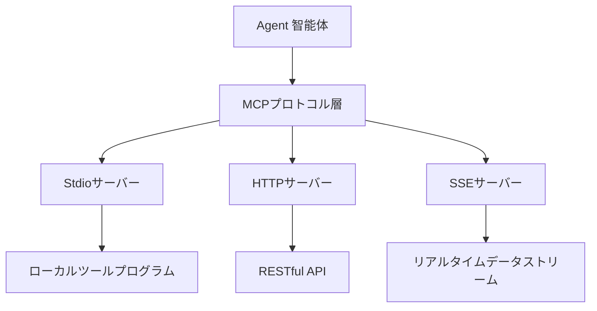
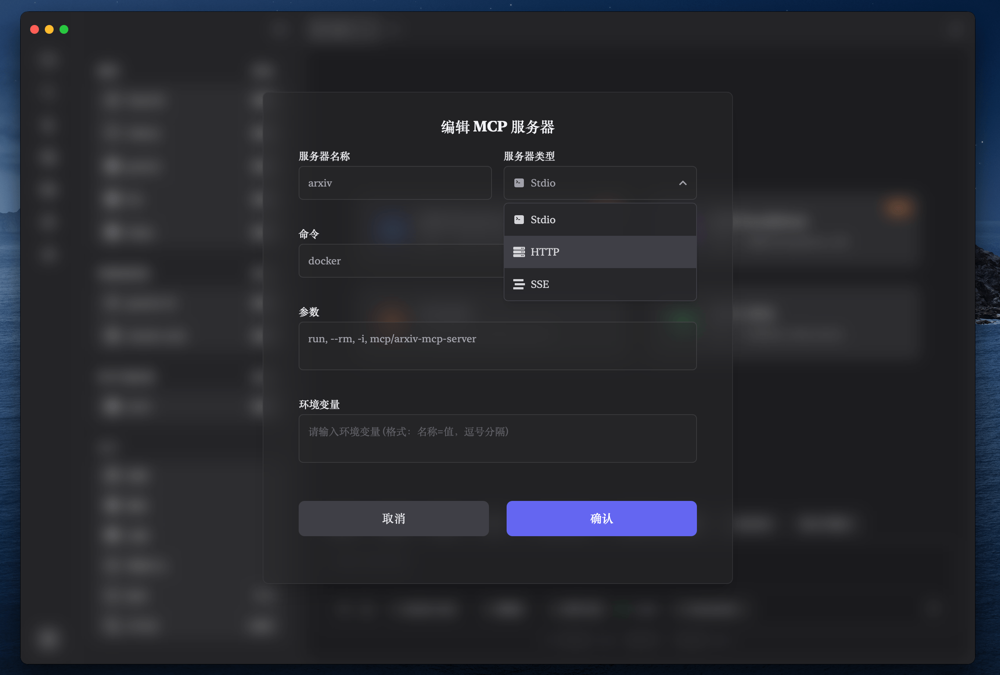

# MCP サーバー設定ガイド

## 1. MCPサーバーとは？

!!! info "核心概念"
    MCP (Model Context Protocol) サーバーは、データベースクエリ、API呼び出し、ファイル処理、データ分析などの特定機能サービスを提供する外部プログラムです。Agent 智能体はMCPプロトコルを通じてこれらのサーバーと通信し、その機能境界を大幅に拡張できます。

> MCPサーバーは、Agentに専門ツールを提供する「ツールボックス」のようなもので、各サーバーは特定領域のタスクに特化し、Agentが様々な専門能力を呼び出せるようにします。

## 2. MCPプロトコルの動作原理

MCPプロトコルは、Agentと外部サービス間の標準化された通信方式を定義し、異なるソースのサービスがZditorのAgentシステムにシームレスに統合できることを保証します。



### 2.1. サポートされる通信プロトコル

Zditorは3種類のMCPサーバータイプをサポートします：

- **Stdio**：標準入出力を通じてローカルプログラムと通信
- **HTTP**：HTTP APIを通じてリモートサービスと通信  
- **SSE**：Server-Sent Eventsを通じてリアルタイムデータストリームを受信

## 3. MCPサーバータイプ詳解

### 3.1. Stdioタイプサーバー

#### 適用シナリオ
- ローカルインストールのMCPサーバープログラム
- コマンドラインツールとスクリプト
- ファイルシステム操作ツール
- ローカルデータベース接続

#### 設定例

**ファイルシステムサーバー**
```yaml
サーバー名: filesystem-server
コマンド: /usr/local/bin/mcp-filesystem
引数: --root, /Users/username/Documents, --readonly
環境変数: LOG_LEVEL=info, MAX_FILE_SIZE=10MB
```

**データベースクエリサーバー**
```yaml
サーバー名: sqlite-server
コマンド: /opt/mcp-tools/sqlite-server
引数: --database, /path/to/database.db
環境変数: SQLITE_TIMEOUT=30000
```

#### 設定要点
- **コマンドパス**：実行可能ファイルの完全パスが必要
- **引数フォーマット**：英語カンマで区切り、自動的に空白を除去
- **環境変数**：`KEY=VALUE`形式、カンマで区切り

### 3.2. HTTPタイプサーバー

#### 適用シナリオ
- クラウドAPIサービス
- マイクロサービスアーキテクチャのバックエンド
- サードパーティSaaSプラットフォーム
- RESTful Webサービス

#### 設定例

**天気API サービス**
```yaml
サーバー名: weather-api
URL: https://api.openweathermap.org/mcp/v1
リクエストヘッダー: Authorization: Bearer your_api_token, Content-Type: application/json
```

**翻訳サービス**
```yaml
サーバー名: translation-service
URL: https://api.translation.com/mcp
リクエストヘッダー: X-API-Key: your_key, Accept: application/json
```

#### 設定要点
- **URLフォーマット**：プロトコル（http/https）を含む完全なURLが必要
- **リクエストヘッダー**：`Name: Value`形式、カンマで区切り
- **認証情報**：リクエストヘッダーを通じてAPIキーまたはトークンを送信

### 3.3. SSEタイプサーバー

#### 適用シナリオ
- リアルタイムデータプッシュサービス
- 株価、為替レートなどの金融データストリーム
- システム監視データ
- チャットと通知サービス

#### 設定例

**リアルタイム株価データ**
```yaml
サーバー名: stock-price-stream
URL: https://api.finance.com/sse/stocks
リクエストヘッダー: Authorization: Bearer token, Accept: text/event-stream
```

**システム監視データ**
```yaml
サーバー名: system-monitor
URL: https://monitor.example.com/sse/metrics
リクエストヘッダー: X-Monitor-Key: your_key
```

#### 設定要点
- **SSE接続**：サーバーはServer-Sent Events仕様をサポートしている必要
- **持続接続**：接続は開いたままリアルタイムデータを受信
- **イベント処理**：標準のSSEイベントフォーマットをサポート

## 4. MCPサーバー設定手順

### 4.1. 設定画面を開く

1. Zditorアプリケーションを起動
2. **設定ページ**に入る
3. **MCPサーバー**部分を見つける
4. **追加**ボタンをクリック



### 4.2. サーバータイプを選択

ポップアップした設定ダイアログで：

1. **サーバー名**を入力（ユニークである必要）
2. **サーバータイプ**ドロップダウンメニューをクリック
3. 対応するタイプを選択：
   - 🖥️ **Stdio** - ローカルプログラム
   - 🌐 **HTTP** - HTTP API
   - ⚡ **SSE** - リアルタイムデータストリーム

### 4.3. 設定情報を入力

選択したサーバータイプに応じて、対応する設定項目を入力：

#### Stdio設定
- **サーバー名**：ユニーク識別子、例：`file-manager`
- **コマンド**：実行可能ファイルの完全パス
- **引数**：コマンドライン引数、カンマで区切り
- **環境変数**：実行時環境変数、フォーマット `KEY=VALUE`

#### HTTP/SSE設定
- **サーバー名**：ユニーク識別子、例：`weather-api`
- **URL**：サーバーの完全アドレス
- **リクエストヘッダー**：HTTPヘッダー情報、フォーマット `Name: Value`

### 4.4. 設定を検証

!!! tip "設定検証"
    - サーバー名が重複していないかチェック
    - URLフォーマットが正しいか確認（http:// または https:// で開始）
    - 認証情報の有効性を検証
    - Stdioタイプの場合、プログラムファイルが存在し実行可能か確認

## 5. MCPサーバー統合使用

### 5.1. 自動登録メカニズム

設定完了したMCPサーバーは以下のタイミングでAgentに自動登録されます：

1. **新規セッション作成**：Agent起動時に全ての設定済みサーバーを自動ロード
2. **動的ロード**：Agent実行中に新しいサーバーを追加
3. **ホットリロード**：サーバー設定修正後の自動更新

### 5.2. AgentによるMCPサービス呼び出し

Agentは以下の方法でMCPサーバーを使用できます：

#### ツール呼び出し
```text
ユーザー: 現在のディレクトリ下の全てのPythonファイルを分析してください

Agent: ファイルシステムサーバーを使用してPythonファイルをスキャン・分析します...
🔧 ツール呼び出し: filesystem-server/list_files
📁 引数: {"path": ".", "pattern": "*.py"}
📝 結果: 15個のPythonファイルが見つかりました...
```

#### データクエリ
```text
ユーザー: 今日の上海の天気を調べてください

Agent: 天気APIを呼び出してリアルタイム天気データを取得します...
🌐 サービス呼び出し: weather-api/current_weather
📍 引数: {"city": "Shanghai", "date": "today"}
🌤️ 結果: 上海は本日曇り、気温18-25°C...
```

### 5.3. サーバー状態監視

Agent対話画面で以下を確認できます：

- **🟢 オンライン**：MCPサーバーが正常接続
- **🟡 接続中**：接続を確立中
- **🔴 オフライン**：サーバーが利用不可
- **⚠️ エラー**：接続または呼び出しエラー

## 6. 推奨MCPサーバー

### 6.1. 公式サーバー

#### ファイルシステムサーバー
```yaml
名前: mcp-filesystem
役割: ファイルとディレクトリ操作
取得: npm install -g @modelcontextprotocol/filesystem
設定: stdioタイプ、コマンド npx @mcp/filesystem
```

#### データベースサーバー
```yaml
名前: mcp-sqlite
役割: SQLiteデータベースクエリ
取得: npm install -g @modelcontextprotocol/sqlite
設定: stdioタイプ、データベースファイルパスの指定が必要
```

#### Web検索サーバー
```yaml
名前: mcp-brave-search
役割: ネット検索機能
取得: npm install -g @modelcontextprotocol/brave-search
設定: stdioタイプ、Brave Search APIキーが必要
```

### 6.2. コミュニティサーバー

#### Git操作サーバー
```yaml
名前: mcp-git
役割: Gitリポジトリ操作
タイプ: stdio
機能: コミット、ブランチ、ログクエリなど
```

#### システム監視サーバー
```yaml
名前: mcp-system-monitor
役割: システムリソース監視
タイプ: sse
機能: CPU、メモリ、ディスク使用率のリアルタイム監視
```

### 6.3. カスタムサーバー開発

既存のサーバーがニーズを満たさない場合：

1. **MCP SDKを使用**：公式SDKベースでカスタムサーバーを開発
2. **既存ツールをラップ**：コマンドラインツールをMCPサーバーとしてラップ
3. **APIプロキシ**：既存API用のMCPプロキシサーバーを作成

参考リソース：
- [MCP公式ドキュメント](https://modelcontextprotocol.io/)
- [MCP SDK開発ガイド](https://github.com/modelcontextprotocol/specification)

## 7. トラブルシューティング

### 7.1. 接続問題

**Q: Stdioサーバーが起動できない**

チェックリスト：
- [ ] コマンドパスが正しいか
- [ ] ファイルに実行権限があるか
- [ ] 依存関係がインストールされているか
- [ ] 引数フォーマットが正しいか

解決策：
```bash
# プログラムの存在を確認
which your-mcp-server

# 権限をチェック
ls -la /path/to/mcp-server

# 手動で起動テスト
/path/to/mcp-server --help
```

**Q: HTTP/SSEサーバー接続タイムアウト**

可能な原因：
- ネットワーク接続問題
- URLアドレスエラー
- サーバーメンテナンス中
- 認証情報期限切れ

解決策：
```bash
# ネットワーク接続をテスト
curl -I https://api.example.com/mcp

# 認証を検証
curl -H "Authorization: Bearer token" https://api.example.com/mcp/status
```

### 7.2. 権限問題

**Q: MCPサーバー権限が拒否される**

- Agent MCPサービス呼び出し時に対応する権限が必要
- サーバー設定の認証情報をチェック
- APIキーまたはトークンが有効か確認

**Q: ローカルファイルアクセス権限不足**

- MCPサーバーに読み書き権限があることを確保
- ファイル所有者と権限設定をチェック
- sudoまたは管理者権限の使用を検討

### 7.3. パフォーマンス問題

**Q: MCPサーバー応答が遅い**

最適化提案：
- ネットワーク遅延をチェック（リモートサーバー）
- タイムアウト時間設定を増加
- ローカルキャッシュを使用して重複呼び出しを削減
- サーバーハードウェアのアップグレードを検討

## 8. セキュリティベストプラクティス

### 8.1. 認証セキュリティ

1. **APIキー管理**
   - APIキーを定期的にローテーション
   - 環境変数を使用して機密情報を保存
   - APIキーのアクセス権限を制限

2. **転送セキュリティ**
   - HTTPSプロトコルを優先使用
   - サーバーSSL証明書を検証
   - ログに機密情報を記録することを避ける

### 8.2. アクセス制御

1. **最小権限原則**
   - 必要なMCPサーバーのみを設定
   - サーバーのアクセス範囲を制限
   - サーバー設定を定期的に審査

2. **ネットワークセキュリティ**
   - ファイアウォールを使用して外部アクセスを制限
   - VPNで内部サービスアクセスを設定
   - 異常なネットワーク活動を監視

### 8.3. データ保護

1. **機密データ処理**
   - MCP呼び出しで機密データの送信を避ける
   - データマスキング技術を使用
   - データ暗号化ストレージを実施

2. **監査ログ**
   - MCPサーバー呼び出しログを記録
   - 異常アクセスパターンを監視
   - サーバー状態を定期的にチェック

## 9. 高度な設定

### 9.1. 負荷分散設定

高い同時実行シナリオでは、同じ機能の複数のMCPサーバーを設定できます：

```yaml
# メインサーバー
サーバー名: database-primary
URL: https://db1.example.com/mcp

# バックアップサーバー
サーバー名: database-backup
URL: https://db2.example.com/mcp
```

### 9.2. 条件ルーティング

異なる条件に基づいて異なるMCPサーバーを選択：

- **地理的位置**：ユーザーの位置に基づいて最寄りのサーバーを選択
- **負荷状況**：サーバー負荷に基づいて自動切り替え
- **機能特性**：タスクタイプに基づいて専用サーバーを選択

### 9.3. キャッシュ戦略

適切なキャッシュ戦略を設定してパフォーマンスを向上：

- **ローカルキャッシュ**：頻繁にアクセスするデータをキャッシュ
- **TTL設定**：合理的なキャッシュ有効期限を設定
- **キャッシュ更新**：定期的な更新またはキャッシュ無効化

---

!!! note "技術サポート"
    MCPは急速に発展しているプロトコルで、新しいサーバーと機能が継続的に出現します。[MCP公式コミュニティ](https://github.com/modelcontextprotocol)をフォローして最新情報とベストプラクティスを取得することをお勧めします。