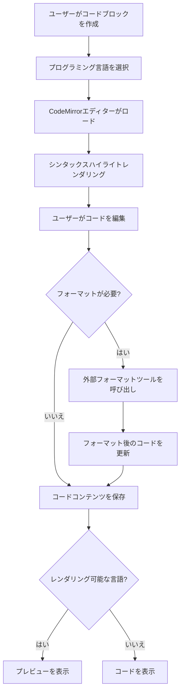
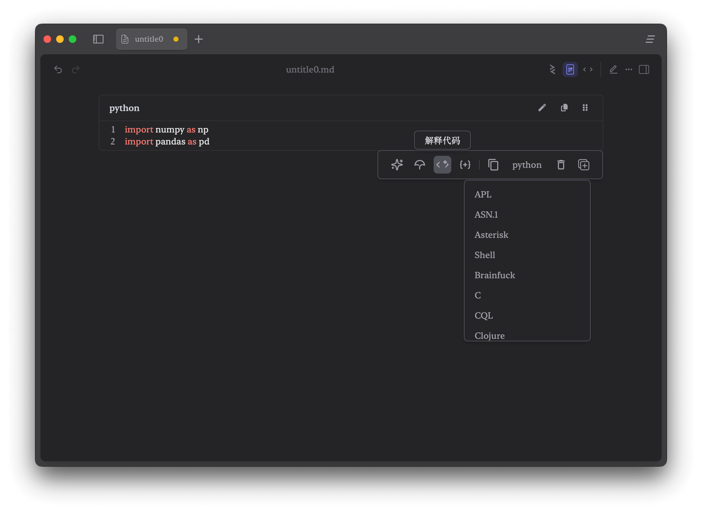
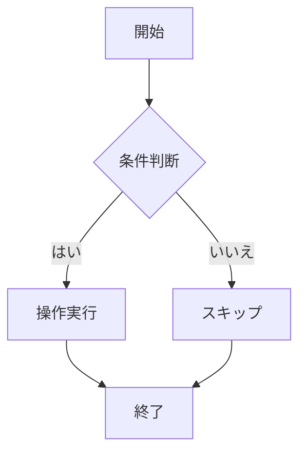

# Zditor コードプラグイン (Code Plugin) 機能ガイド

## 1. コードプラグイン (Code Plugin) とは？

!!! info "核心概念"
    コードプラグイン（Code Plugin）は、Zditor Markdownエディターの中核機能の一つで、ユーザーに強力なコード編集、シンタックスハイライト、コードフォーマット、および多言語サポート機能を提供します。CodeMirrorエディターとカスタムコードフォーマットシステムを統合することで、ユーザーはMarkdownドキュメント内で様々なプログラミング言語のコードをシームレスに書き、編集し、フォーマットできます。

## 2. コードプラグインの動作方式

コードプラグインはCodeMirrorをベースとし、強力なコード編集体験を提供します。エディターでコードブロックを作成すると、システムは以下を実行します：

1. **コードブロック作成**：ツールバーまたはショートカットキーでCodeFenceノードを作成
2. **言語認識**：指定された言語識別子に応じた対応するシンタックスハイライトを提供
3. **コード編集**：CodeMirrorを使用してプロフェッショナルなコード編集体験を提供
4. **フォーマット処理**：外部フォーマットツールを通じてコード構造を美化
5. **レンダリングプレビュー**：特定言語でリアルタイムプレビュー機能を提供



## 3. コードブロック作成方法

### 3.1. slashツールバーで作成

1. `/`を入力し、ツールバーをポップアップ
2. コードブロックを選択
3. コードの記述を開始

### 3.2. ショートカットキーで作成

|ショートカットキー |機能 |説明 |
|:---|:---|:---|
|`Shift+Ctrl+C` |コードブロック作成 |Windows/Linux |
|`Shift+Cmd+C` |コードブロック作成 |macOS |
|`Shift+Ctrl+\` |コードブロック切り替え |代替ショートカットキー |

### 3.3. Markdown シンタックス

\`\`\`language + スペース を入力してコードブロックを作成（例：\`\`\`python+スペースを入力して作成）

## 4. コード編集機能

### 4.1. 基本編集操作

|機能 |ショートカットキー |説明 |
|:---|:---|:---|
|インデント |`Tab` |インデントを増加 |
|逆インデント |`Shift+Tab` |インデントを減少 |
|改行 |`Enter` |新しい行を挿入 |
|コードブロック終了 |`ctrl+Enter` |コードブロック下方に空行を挿入して移動 |
|検索 |`Ctrl+F` / `Cmd+F`  |コードコンテンツの検索置換 |
|全選択 |`Ctrl+A` / `Cmd+A` |全てのコードを選択 |
|コードコピー |`Ctrl+C` / `Cmd+C` |クリップボードにコピー |
|取り消し |`Ctrl+Z` / `Cmd+X` |編集を取り消し |
|復元 |`Shift+Ctrl+Z` / `Shift+Cmd+Z` |編集を復元 |
|上下移動 |`ArrowUp` / `ArrowDown` |上下 |
|左右移動 |`ArrowLeft` / `ArrowRight` |左右 |

### 5. カスタムツールバー

カーソルがコードブロック内部にある時、コードブロックツールバーが表示され、言語選択、コードブロックのコピー削除、AIツールのカスタマイズが可能です。例：コードの説明、エラー検出など。



## 6. レンダリングプレビュー機能

### 6.1. プレビューサポート言語

Zditorは特定言語でリアルタイムプレビュー機能を提供：

#### Mermaid チャート



#### HTML プレビュー

```html
<!DOCTYPE html>
<html>
  <head>
    <title>サンプルページ</title>
  </head>
  <body>
    <h1>Hello World</h1>
    <p>これはHTMLプレビューのサンプルです。</p>
  </body>
</html>
```

#### Excalidraw 手描き図

- 手描きスタイルのチャートとグラフィックをサポート
- リアルタイム編集とプレビュー
- SVGまたはPNGとして書き出し

### 6.2. プレビューコントロール

- **プレビュー切り替え**：コードブロック右上のプレビューボタンをクリック
- **全画面プレビュー**：プレビューエリアをダブルクリック
- **画像書き出し**：プレビューエリアを右クリックして書き出しオプションを選択

## 7. コードフォーマット設定

Zditorは外部ツール統合方式を採用し、強力なコードフォーマット機能を提供します。システムは多くの主流プログラミング言語のフォーマットをサポートし、外部フォーマットツール（Black、Prettier、clang-formatなど）を呼び出すことでプロフェッショナルレベルのコード美化を実現します。**他の言語のコードフォーマットサポートが必要な場合は、issueを提出してください**。

### 7.1 サポートされるフォーマットツール

|言語 |フォーマットツール |デフォルトパス |主な特徴 |
|:---|:---|:---|:---|
|**Python** |Black |`/usr/local/bin/black` |コード行長制御、文字列正規化 |
|**JavaScript/TypeScript** |Prettier |`/usr/local/bin/prettier` |多種パーサー、統一コードスタイル |
|**Java** |Google Java Format |`/usr/local/bin/google-java-format` |Googleコード規範 |
|**C/C++** |clang-format |`/usr/local/bin/clang-format` |多種コードスタイル（Google、LLVMなど） |
|**Rust** |rustfmt |`/usr/local/bin/rustfmt` |Rust公式フォーマットツール |
|**Go** |gofmt |`/usr/local/go/bin/gofmt` |Go内蔵フォーマットツール |
|**CSS/SCSS/Less** |Prettier |`/usr/local/bin/prettier` |スタイルシートフォーマット |
|**HTML** |Prettier |`/usr/local/bin/prettier` |マークアップ言語フォーマット |
|**JSON/YAML** |Prettier |`/usr/local/bin/prettier` |データフォーマット |
|**Markdown** |Prettier |`/usr/local/bin/prettier` |ドキュメントフォーマット |

### 7.2 設定画面操作

#### フォーマット設定にアクセス

1. アプリケーション左下の**設定**メニューをクリック
2. **コードフォーマット**オプションを選択
3. フォーマットツール設定ダイアログがポップアップ

#### インターフェース機能説明

- **フォーマットツールリスト**：全ての設定済みフォーマットツールを表示
- **言語識別子**：サポートされるプログラミング言語名を表示
- **ツール名**：使用するフォーマットツール（black、prettierなど）を表示
- **パス設定**：ツールの実行可能ファイルパスを表示
- **編集ボタン**：既存のフォーマットツール設定を修正

Zditorはサンドボックスでフォーマットツールを実行するため、ターミナルから環境変数を取得できません。そのため、ツール実行可能ファイルパスが正しいことを確認する必要があります。

### 7.3 設定例


#### 既存設定の編集

1. フォーマットツールリストで修正したい設定項目を見つける
2. その設定項目右側の**編集**ボタン（鉛筆アイコン）をクリック
3. ポップアップした編集ボックスでパスまたはパラメータを修正
4. **Enter**を押すか**確認**をクリックして修正を保存
5. **キャンセル**をクリックして修正を破棄可能

### 7.4 外部ツールインストール

#### 7.4.1 Python - Black コードフォーマットツール

```bash
# グローバルインストール
pip install black

# またはユーザーディレクトリにインストール
pip install --user black

# 指定バージョンインストール
pip install black==23.12.1
```

```bash
# インストール成功チェック
black --version

# インストールパス確認
which black
# 出力例：/usr/local/bin/black または /opt/homebrew/bin/black

# フォーマット機能テスト
echo "def test( ):    pass" | black --quiet -
# 出力：def test(): pass
```

#### 7.4.2 JavaScript/TypeScript - Prettier コードフォーマットツール

```bash
# npmでグローバルインストール
npm install -g prettier

# yarnでグローバルインストール
yarn global add prettier

# pnpmでグローバルインストール
pnpm add -g prettier
```

```bash
# バージョンチェック
prettier --version

# インストールパス確認
which prettier
# グローバルインストール例：/usr/local/bin/prettier
# ローカルインストール例：./node_modules/.bin/prettier

# フォーマット機能テスト
echo 'const x={a:1,b:2}' | prettier --parser babel
# フォーマット後のコードが出力される
```

#### 7.4.3 Java - Google Java Format

```bash
brew install google-java-format
```

```bash
# バージョンチェック
google-java-format --version

# パス確認
which google-java-format
# 例：/usr/local/bin/google-java-format

# フォーマットテスト
echo 'class Test{public static void main(String[]args){}}' | google-java-format -
```

#### 7.4.4 C/C++ - clang-format

```bash
# macOS (Homebrew)
brew install clang-format

# Ubuntu/Debian
sudo apt update
sudo apt install clang-format

# CentOS/RHEL/Fedora
sudo yum install clang-tools-extra  # CentOS 7
sudo dnf install clang-tools-extra  # Fedora/CentOS 8+

# Arch Linux
sudo pacman -S clang
```

```bash
# バージョンチェック
clang-format --version

# パス確認
which clang-format
# 例：/usr/local/bin/clang-format または /usr/bin/clang-format

# フォーマットテスト
echo 'int main(){return 0;}' | clang-format --style=Google
```

#### 7.4.5  Rust - rustfmt

```bash
# rustfmtコンポーネント追加
rustup component add rustfmt

# または特定ツールチェーンにインストール
rustup component add rustfmt --toolchain stable
```

```bash
# バージョンチェック
rustfmt --version

# パス確認
which rustfmt
# 例：~/.cargo/bin/rustfmt

# フォーマットテスト
echo 'fn main(){println!("hello");}' | rustfmt --emit=stdout
```

#### 7.4.6 Go - gofmt

```bash
# gofmtはGoインストール時に自動提供されるため、個別インストール不要
# Go言語をインストール

# macOS (Homebrew)
brew install go

# Ubuntu/Debian
sudo apt install golang-go

# 直接ダウンロード（推奨）
# https://golang.org/dl/ で対応プラットフォームのインストールパッケージをダウンロード
```

```bash
# Goバージョンチェック
go version

# gofmtチェック
gofmt -h

# パス確認
which gofmt
# 例：/usr/local/go/bin/gofmt

# フォーマットテスト
echo 'package main;func main(){println("hello")}' | gofmt
```

---

Zditorのコードプラグインを通じて、統一された環境で様々なプログラミング言語のコードを効率的に書き、編集し、フォーマットし、プレビューできます。強力なAI機能と柔軟な設定オプションを組み合わせることで、コード記述と技術文書作成がより簡単でプロフェッショナルになります！:rocket: