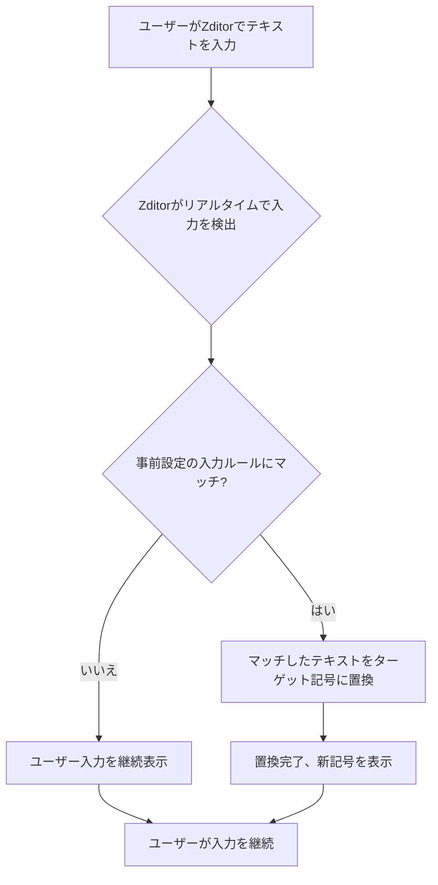

# Zditor スマートテキスト (SmartText) 機能ガイド

## 1. スマートテキスト (SmartText) とは？

!!! info "核心概念"
    スマートテキスト（SmartText）は、Zditor Markdownエディターの革新的な機能で、ユーザーが特定の文字組み合わせや略記を入力することで、対応する特殊記号、数学記号、ギリシャ文字、分数、下付き文字、通貨記号、著作権商標、各種常用アイコンなどに自動変換できます。

> この機能は複雑な記号入力プロセスを簡素化し、Unicodeエンコードを記憶したり、頻繁に入力方法を切り替えたりすることなく、プロフェッショナルで美しいテキストコンテンツを簡単に挿入できるようにすることを目的としています。

## 2. スマートテキストの動作原理

スマートテキストの実装原理は、一連の事前定義された「入力ルール」（`InputRule`）に基づいています。エディターで文字を入力するたびに、Zditorはリアルタイムで入力されたテキストが事前設定された正規表現パターンのいずれかに適合するかを検出します。マッチが成功すると、Zditorは即座にマッチしたテキストを対応するターゲット記号に置き換えます。



例えば、`->`を入力すると、Zditorはこのパターンを認識し、自動的に右矢印記号`→`に置き換えます。

```javascript
// 例：右矢印ルール
const rightArrow = new InputRule(/->$/, "→");
// "->"を入力してスペースを押すか他の文字を入力すると、"→"に変換される
```

## 3. サポートされるスマートテキスト記号リスト

Zditorのスマートテキスト機能は幅広い記号タイプをカバーしています。以下は詳細な分類と対応する入力ルールです：

### 3.1. 基本矢印記号

| 入力パターン | 出力記号 | 例 |
| :------- | :------- | :--- |
| `->`     | `→`      | `A->B` → `A→B` |
| `<-`     | `←`      | `B<-A` → `B←A` |
| `←>`     | `↔`      | `双方向接続←>` → `双方向接続↔` |
| `(up)`   | `↑`      | `温度(up)` → `温度↑` |
| `(down)` | `↓`      | `価格(down)` → `価格↓` |
| `=>`     | `⇒`      | `条件=>結果` → `条件⇒結果` |
| `=<`     | `⇐`      | `結果=<条件` → `結果⇐条件` |
| `<=>`    | `⇔`      | `等価関係<=>` → `等価関係⇔` |

### 3.2. 数学記号

| 入力パターン    | 出力記号 | 例 |
| :---------- | :------- | :--- |
| `!=`        | `≠`      | `x!=y` → `x≠y` |
| `<=`        | `≤`      | `a<=b` → `a≤b` |
| `>=`        | `≥`      | `c>=d` → `c≥d` |
| `<<`        | `≪`      | `x<<y` → `x≪y` |
| `>>`        | `≫`      | `z>>w` → `z≫w` |
| `+/-`       | `±`      | `誤差+/-0.5` → `誤差±0.5` |
| `-+`        | `∓`      | `変化-+/0.1` → `変化∓0.1` |
| `(times)`   | `×`      | `3(times)4` → `3×4` |
| `(div)`     | `÷`      | `10(div)2` → `10÷2` |
| `(infinity)` | `∞`      | `無限大に近づく(infinity)` → `無限大に近づく∞` |
| `(deg)`     | `°`      | `90(deg)` → `90°` |
| `(sqrt)`    | `√`      | `(sqrt)2` → `√2` |
| `(sum)`     | `∑`      | `(sum)i=1 to n` → `∑i=1 to n` |
| `(pi)`      | `π`      | `円周率(pi)` → `円周率π` |
| `(therefore)` | `∴`      | `Aなので、(therefore)B` → `Aなので、∴B` |
| `(because)` | `∵`      | `(because)A、したがってB` → `∵A、したがってB` |

### 3.3. ギリシャ文字

| 入力パターン    | 出力記号 | 例 |
| :---------- | :------- | :--- |
| `(alpha)`   | `α`      | `(alpha)粒子` → `α粒子` |
| `(beta)`    | `β`      | `(beta)線` → `β線` |
| `(gamma)`   | `γ`      | `(gamma)関数` → `γ関数` |
| `(delta)`   | `δ`      | `(delta)値` → `δ値` |
| `(theta)`   | `θ`      | `(theta)角` → `θ角` |
| `(lambda)`  | `λ`      | `(lambda)式` → `λ式` |
| `(mu)`      | `μ`      | `(mu)F` → `μF` |
| `(sigma)`   | `σ`      | `(sigma)値` → `σ値` |
| `(omega)`   | `ω`      | `(omega)周波数` → `ω周波数` |

### 3.4. 分数

!!! note "注意事項"
    分数変換は通常、前に他の文字や数字がないことを要求し、正確な認識を確保します。例えば、`1/2`は変換されますが、`abc1/2`は変換されません。

| 入力パターン  | 出力記号 | 例 |
| :-------- | :------- | :--- |
| `1/2`     | `½`      | `½カップの水` |
| `1/3`     | `⅓`      | `⅓の分け前` |
| `2/3`     | `⅔`      | `⅔の票数` |
| `1/4`     | `¼`      | `¼マイル` |
| `3/4`     | `¾`      | `¾完了` |
| `1/5`     | `⅕`      | `⅕の確率` |
| `2/5`     | `⅖`      | `⅖の成長` |
| `3/5`     | `⅗`      | `⅗のコスト` |
| `4/5`     | `⅘`      | `⅘の効率` |
| `1/6`     | `⅙`      | `⅙の体積` |
| `5/6`     | `⅚`      | `⅚の産出量` |
| `1/8`     | `⅛`      | `⅛インチ` |
| `3/8`     | `⅜`      | `⅜の距離` |
| `5/8`     | `⅝`      | `⅝の重量` |
| `7/8`     | `⅞`      | `⅞の容量` |

### 3.5. 下付き数字

| 入力パターン | 出力記号 | 例 |
| :------- | :------- | :--- |
| `_0`     | `₀`      | `x_0` → `x₀` |
| `_1`     | `₁`      | `y_1` → `y₁` |
| `_2`     | `₂`      | `H_2O` → `H₂O` |
| `_3`     | `₃`      | `C_3H_8` → `C₃H₈` |
| `_4`     | `₄`      | `N_4` → `N₄` |
| `_5`     | `₅`      | `O_5` → `O₅` |
| `_6`     | `₆`      | `P_6` → `P₆` |
| `_7`     | `₇`      | `S_7` → `S₇` |
| `_8`     | `₈`      | `Cl_8` → `Cl₈` |
| `_9`     | `₉`      | `F_9` → `F₉` |

### 3.6. 通貨記号

| 入力パターン  | 出力記号 | 例 |
| :-------- | :------- | :--- |
| `(eur)`   | `€`      | `100(eur)` → `100€` |
| `(gbp)`   | `£`      | `50(gbp)` → `50£` |
| `(jpy)`   | `¥`      | `1000(jpy)` → `1000¥` |
| `(cent)`  | `¢`      | `50(cent)` → `50¢` |

### 3.7. 著作権と商標

| 入力パターン      | 出力記号 | 例 |
| :------------ | :------- | :--- |
| `(c)`         | `©`      | `Copyright (c) 2023` → `Copyright © 2023` |
| `(r)`         | `®`      | `製品名(r)` → `製品名®` |
| `(tm)`        | `™`      | `ブランド名(tm)` → `ブランド名™` |
| `(p)`         | `℗`      | `音楽アルバム(p)` → `音楽アルバム℗` |
| `(sm)`        | `℠`      | `サービスマーク(sm)` → `サービスマーク℠` |

### 3.8. 常用記号とアイコン

| 入力パターン      | 出力記号 | 例 |
| :------------ | :------- | :--- |
| `(check)`     | `✓`      | `タスク完了 (check)` → `タスク完了 ✓` |
| `(cross)`     | `✗`      | `エラー (cross)` → `エラー ✗` |
| `(star)`      | `★`      | `評価 (star)` → `評価 ★` |
| `(heart)`     | `♥`      | `好き (heart)` → `好き ♥` |
| `(spade)`     | `♠`      | `トランプ (spade)` → `トランプ ♠` |
| `(club)`      | `♣`      | `トランプ (club)` → `トランプ ♣` |
| `(diamond)`   | `♦`      | `トランプ (diamond)` → `トランプ ♦` |
| `(note)`      | `♪`      | `音楽 (note)` → `音楽 ♪` |
| `(notes)`     | `♫`      | `複数音符 (notes)` → `複数音符 ♫` |
| `(sun)`       | `☀`      | `天気 (sun)` → `天気 ☀` |
| `(moon)`      | `☽`      | `夜 (moon)` → `夜 ☽` |
| `(cloud)`     | `☁`      | `曇り (cloud)` → `曇り ☁` |
| `(rain)`      | `☔`      | `雨 (rain)` → `雨 ☔` |
| `(snow)`      | `❄`      | `雪 (snow)` → `雪 ❄` |
| `(phone)`     | `☎`      | `連絡先電話 (phone)` → `連絡先電話 ☎` |
| `(email)`     | `✉`      | `メールアドレス (email)` → `メールアドレス ✉` |
| `(warning)`   | `⚠`      | `警告 (warning)` → `警告 ⚠` |
| `(info)`      | `ℹ`      | `情報 (info)` → `情報 ℹ` |
| `(question)`  | `❓`      | `疑問 (question)` → `疑問 ❓` |
| `(exclamation)` | `❗`      | `注意 (exclamation)` → `注意 ❗` |

### 3.9. 科学と単位記号

| 入力パターン     | 出力記号 | 例 |
| :----------- | :------- | :--- |
| `(micro)`    | `µ`      | `10(micro)m` → `10µm` |
| `(ohm)`      | `Ω`      | `抵抗10(ohm)` → `抵抗10Ω` |
| `(celsius)`  | `℃`      | `25(celsius)` → `25℃` |
| `(fahrenheit)` | `℉`      | `77(fahrenheit)` → `77℉` |
| `(angstrom)` | `Å`      | `10(angstrom)` → `10Å` |

## 4. 使用のコツと提案

*   **即時変換**：スマートテキストの変換は即座に発生します。完全なトリガーパターンを入力すると、記号が即座に表示されます。
*   **コンテキスト認識**：特定のルール（分数など）は、誤変換を避けるために入力パターンの前後の文字に要件があります。通常、これは入力パターンの前後にスペースや改行が必要、または単語の始まり/終わりであることを意味します。
*   **Markdownとの組み合わせ**：スマートテキストはZditorの他のMarkdownフォーマットと完璧に組み合わせることができます。例えば、太字テキストに数学記号を挿入できます：`**E=mc^2**` → `**E=mc²**`。
*   **探索と記憶**：最初は一般的な入力パターンを記憶するためにこのガイドを参照する必要があるかもしれませんが、使用頻度が増すにつれて、非常に直感的で効率的になることがわかります。

---

Zditorのスマートテキスト機能を通じて、Markdownドキュメントに様々なプロフェッショナルで美しい記号を簡単に挿入でき、ドキュメントの可読性と記述効率を大幅に向上させることができます。よりスマートで便利な書き込み体験をお楽しみください！:sparkles: