---
description:
  type: text
  description:
  label: Description
  value: "フローチャート · シーケンス図 · ガントチャート · ER図 · Mindmap"
author:
  type: text
  description:
  label: Author
  value: "SeeLey & Codex"
cover:
  type: asset
  description:
  label: Cover Image
  value: "../assets/guides/mermaid-guide-cover-nanobanana.jpg"
col:
  type: array
  description:
  label: Col
  value: ["subject","title","description"]
subject:
  type: text
  description:
  label: Subject
  value: "Mermaid"
avatar:
  type: asset
  description:
  label: Avatar
  value: "../assets/nanobanana-avatar.svg"
tags:
  type: text
  description:
  label: Tags
  value: "Mermaid · 図表 · ガイド"
title:
  type: text
  description:
  label: Title
  value: "Mermaid利用ガイド"
display:
  type: checkbox
  description: display
  label: プロパティを表示
  value: false
updated:
  type: date
  description:
  label: Updated
  value: "2026-04-11"
warm:
  type: checkbox
  description: warm
  label: 暖色
  value: true
row:
  type: array
  description:
  label: Row
  value: ["avatar","author","updated","tags"]
---
# Mermaid利用ガイド

Mermaid は、テキストで図を記述するための記法です。Markdown 内で `mermaid` コードブロックを書くだけで、フローチャート、シーケンス図、ガントチャート、ER 図、Git Graph などを描画できます。

このガイドは、全ての構文を網羅することが目的ではありません。Zditor で実用的で読みやすい Mermaid 図を書くための最短ルートをまとめています。

## クイックスタート

最小例：

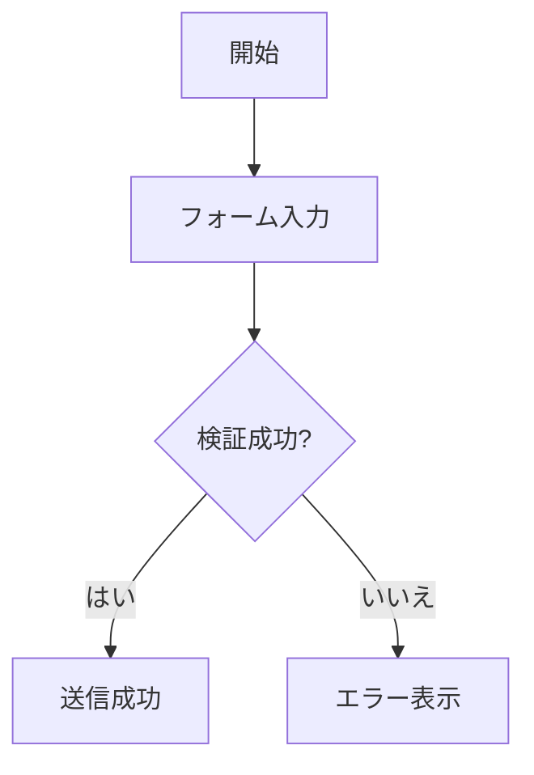

最初に意識すべき点は 2 つです。

- コードブロックの言語指定を必ず `mermaid` にする
- 先に図の種類を決め、その後で内容を足す

## どの図を使うべきか

|場面 |おすすめの図 |
|---|---|
|業務フロー、承認フロー、分岐 |Flowchart |
|フロントエンド、バックエンド、サービス、DB の呼び出し順 |Sequence Diagram |
|日程、マイルストーン、依存関係 |Gantt Chart |
|クラス、インターフェース、モジュール構造 |Class Diagram |
|状態遷移、ライフサイクル、状態機械 |State Diagram |
|テーブル構造、エンティティ関係 |ER Diagram |
|ユーザー体験と接点整理 |User Journey |
|割合の可視化 |Pie Chart |
|ブランチとマージの履歴 |Git Graph |
|発想整理、知識構造 |Mindmap |

## 共通の書き方

- ノードの文言は短くし、長い説明は本文に出す
- 1 枚の図では 1 つのテーマに絞る
- 内部略語よりも業務用語を優先する
- 図が混み合ってきたら分割する
- `TD` と `LR` は最も安定した向き

## フローチャート

フローチャートは手順、分岐、遷移、モジュール関係の表現に向いています。

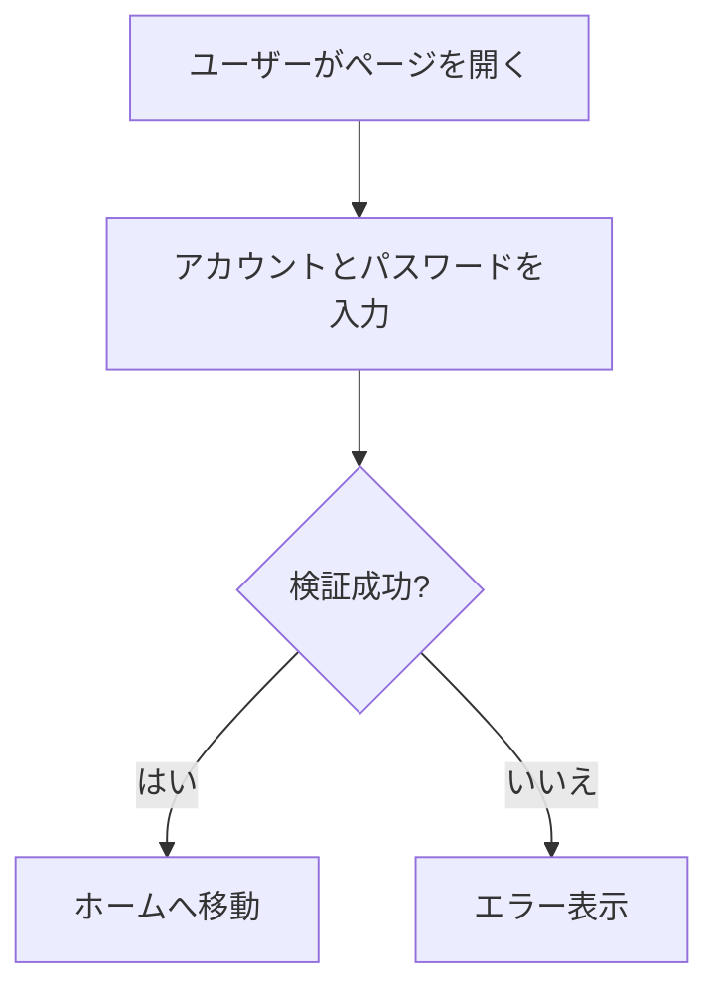

### 実践例：注文送信フロー

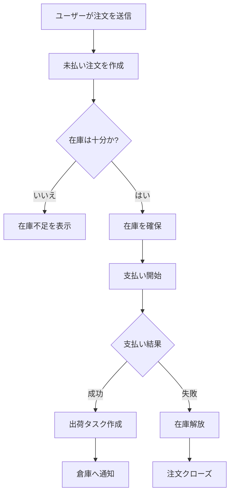

### 実践例：スイムレーン付き協調フロー

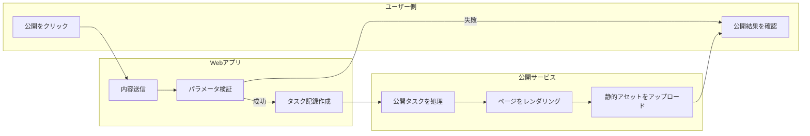

## シーケンス図

シーケンス図は、誰が誰をどの順番で呼び出し、何を返すかを表すのに向いています。

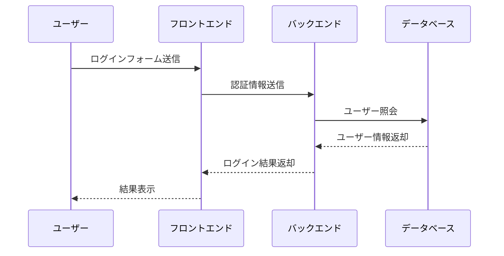

### 実践例：ファイル保存の流れ

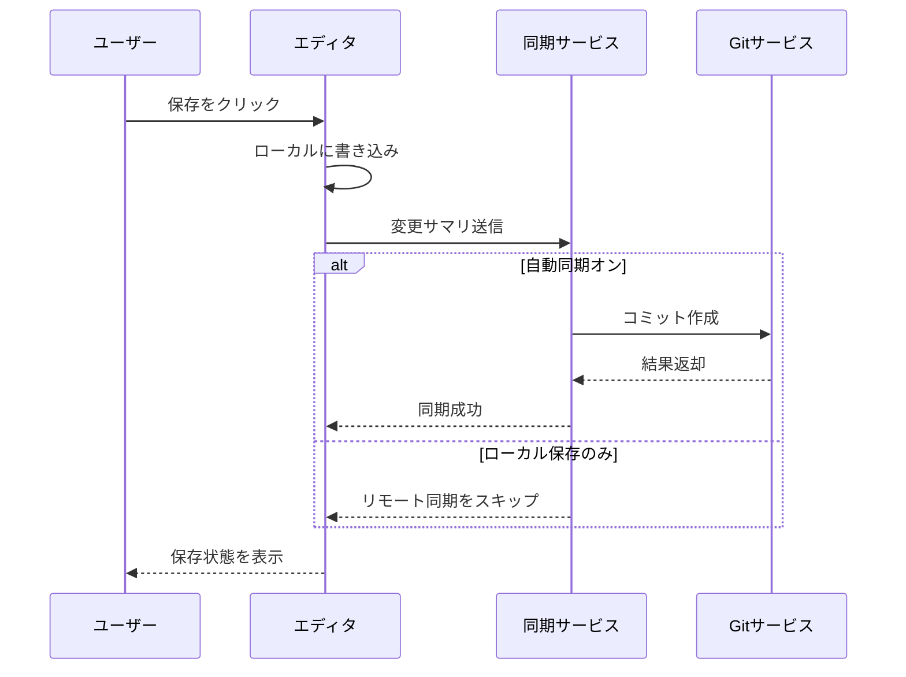

## ガントチャート

ガントチャートは、日程、段階、マイルストーンの表現に向いています。

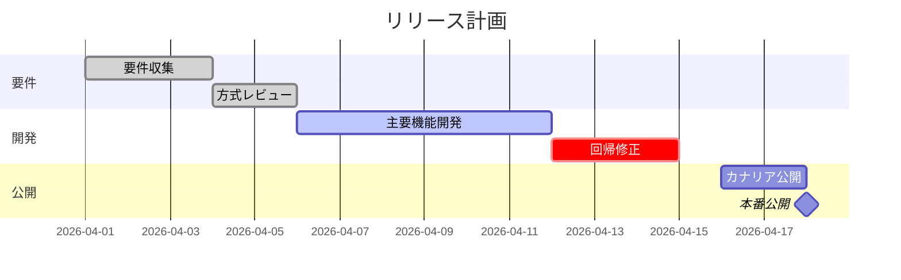

## クラス図

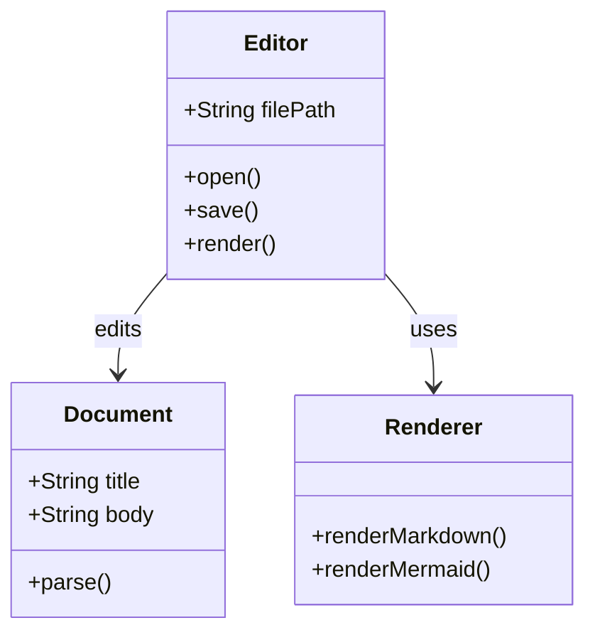

## 状態図

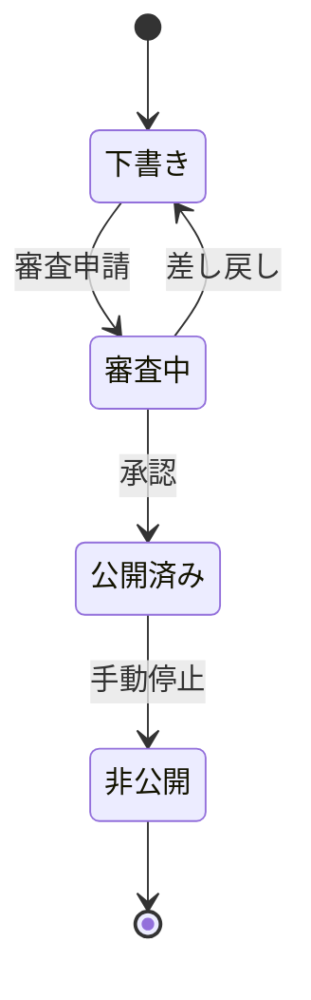

## ER 図

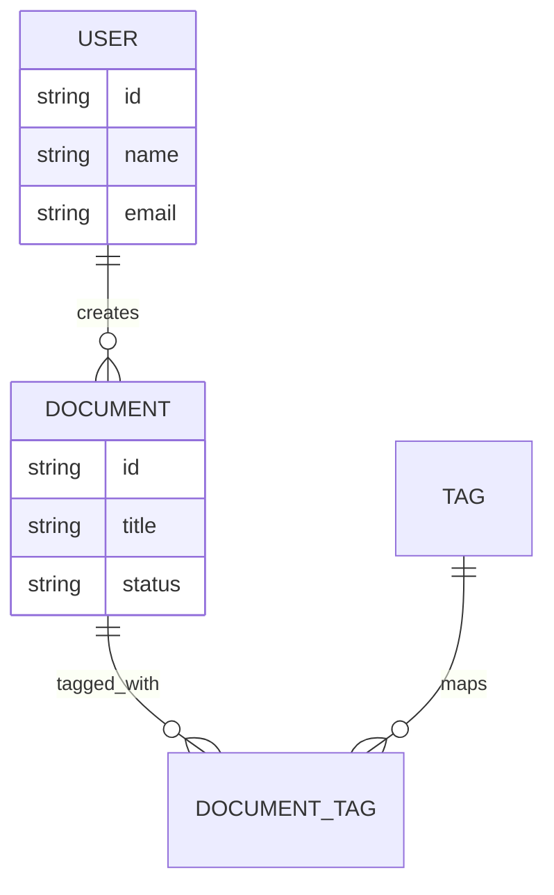

## その他の便利な図

### 円グラフ

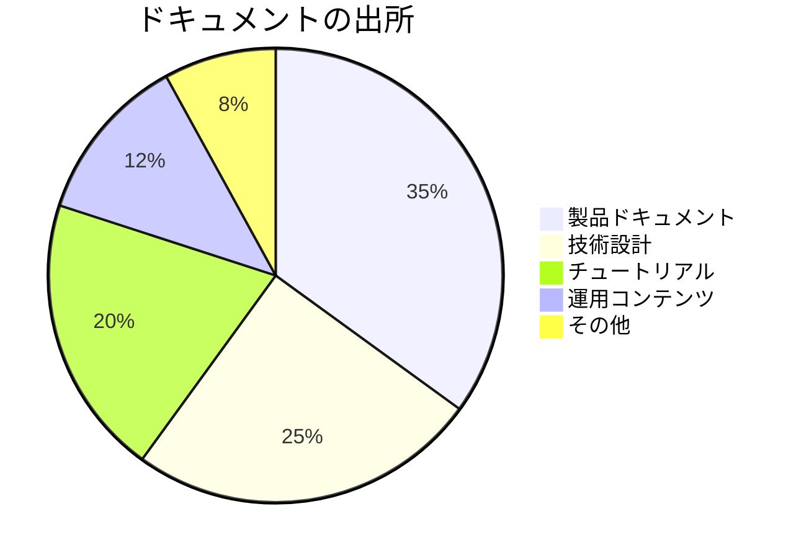

### Git Graph

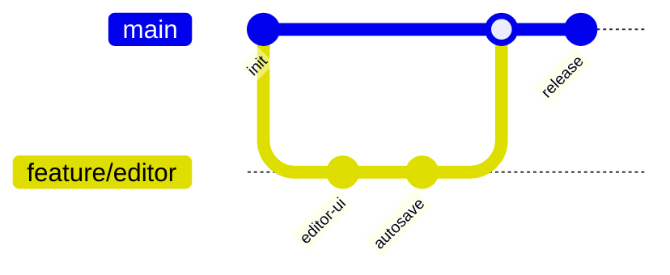

### Mindmap

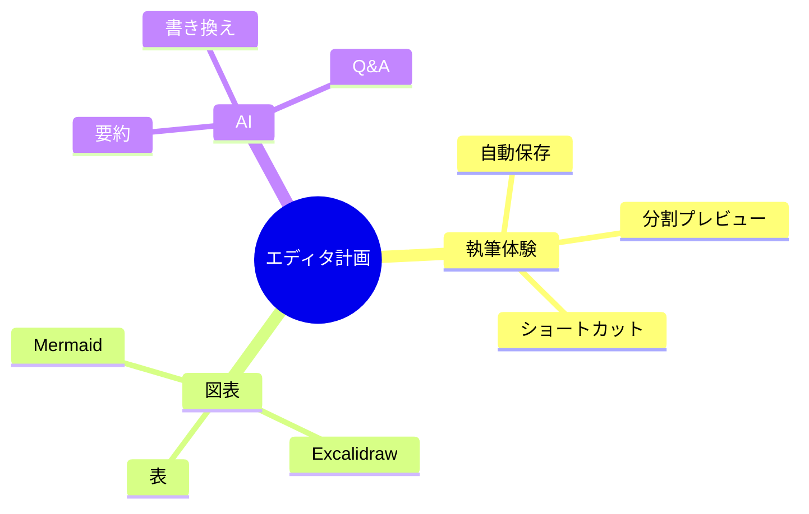

## よくある問題

### 図が表示されない

- コードブロックの言語指定が `mermaid` か確認する
- `flowchart` や `sequenceDiagram` などのキーワードを確認する
- まず最小例で動作確認し、その後で内容を増やす

### 図が大きすぎる、読みにくい

- ノード数を減らす
- ノード文言を短くする
- `LR` または `TD` を試す
- 複数の図に分割する

## 参考資料

- [examples/mermaid-examples/mermaid-examples.md](../examples/mermaid-examples/mermaid-examples.md)
- [guides/mermaid-guide.md](../guides/mermaid-guide.md)
