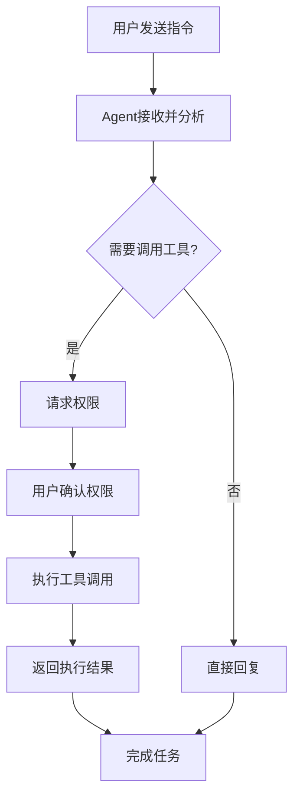

Zditor 通过兼容 Agent Client Protocol (ACP) 协议，与您电脑上的 CLI 工具（如 Claude Code、Gemini CLI,Open Code,Kimi Code）集成，提供强大的 AI 服务，包括文件操作、工具调用、多步骤任务执行等高级功能。

### 📺 视频演示

<Frame>
  <video
    controls
    style={{ width: '100%', height: '500px', borderRadius: '0.5rem' }}
    src="https://download.zditor.com/newweb/agent_config.mov"
  >
    您的浏览器不支持 video 标签。
  </video>
</Frame>

<Warning>
  **安全提醒**：Agent 具有文件读写和系统操作权限，请只安装来自官方或可信来源的 CLI 工具，并谨慎授予权限。
</Warning>

## 目录

- [快速开始](#快速开始)
- [Agent 与普通 AI 对话的区别](#agent-与普通-ai-对话的区别)
- [配置 Agent](#配置-agent)
- [使用 Agent](#使用-agent)
- [权限管理](#权限管理)
- [常见问题](#常见问题)
- [最佳实践](#最佳实践)
- [技术参考](#技术参考)

---

## 快速开始

### Claude Code 快速配置

推荐从 Claude Code 开始体验 Agent 功能：

**1. 安装依赖**

<Tabs>
<Tab title="mac/linux">
  ```bash
  # 确保已安装 Node.js (v18+)
  node --version
  
  # 安装 Claude Agent ACP 适配器
  npm install -g claude-agent-acp
  
  # 验证安装
  claude-agent-acp --version
  ```
</Tab>

<Tab title="windows">
  ```powershell
  # 确保已安装 Node.js (v18+)
  node --version
  
  # 安装 Claude Agent ACP 适配器
  npm install -g claude-agent-acp
  
  # 验证安装
  claude-agent-acp --version
  ```
</Tab>
</Tabs>

**2. 获取 API 密钥**

访问 [Anthropic Console](https://console.anthropic.com/) 获取 API 密钥

**3. 在 Zditor 中配置**

1. 打开 **设置 → 智能体配置 → 添加**
2. 填写配置：
   - **智能体名称**：`claude-code`
   - **智能体路径**：
     - macOS/Linux: `/Users/zz/.nvm/versions/node/v24.7.0/bin/claude-agent-acp`
     - Windows: `C:\Users\zz\AppData\Roaming\npm\claude-agent-acp.cmd`
   - **环境变量**：
     - macOS/Linux: `ANTHROPIC_API_KEY=your_api_key_here, ANTHROPIC_BASE_URL=https://xaapi.ai, PATH=/usr/local/bin`
     - Windows: `ANTHROPIC_API_KEY=your_api_key_here, ANTHROPIC_BASE_URL=https://xaapi.ai, PATH=C:\Program Files\nodejs`
3. 点击 **Test Connection** 验证连接
4. 保存配置

<Tip>
  **PATH 配置说明**：如果使用 nvm 管理 Node.js，PATH 需要包含 nvm 路径，例如：
  `PATH=/Users/username/.nvm/versions/node/v18.0.0/bin:/usr/local/bin`
</Tip>

**4. 安装后开始使用**

完成安装和连接测试后，直接进入使用流程：

1. **选模型**：根据任务复杂度选择合适模型
2. **选 MCP**：选择需要接入的 MCP 服务（可选）
3. **Slash Command**：用斜杠命令快速执行常见操作
4. **Mode**：按场景选择 `ask` 或 `bypass`

---

## Agent 与普通 AI 对话的区别

### 功能对比

| 功能特性 | 普通 AI 对话 | Agent 智能体 |
| :------- | :----------- | :----------- |
| 对话交互 | ✅ 支持 | ✅ 支持 |
| 文件读写 | ❌ 不支持 | ✅ 支持 |
| 工具调用 | ❌ 不支持 | ✅ 支持 |
| 多步骤任务 | ❌ 不支持 | ✅ 支持 |
| 权限管理 | ❌ 无需 | ✅ 精细化权限控制 |
| 实时反馈 | ❌ 单次回复 | ✅ 流式思考过程 |
| 终端操作 | ❌ 不支持 | 🚧 开发中 |
| 划词功能 | ❌ 不支持 | ✅ 支持 |

### 功能演示视频

<Frame>
  <video
    controls
    style={{ width: '100%', height: '500px', borderRadius: '0.5rem' }}
    src="https://download.zditor.com/newweb/agent_ppt.mov"
  >
    您的浏览器不支持 video 标签。
  </video>
</Frame>

本演示包含以下场景：

1. 以一个 GitHub 上的 CUDA 相关仓库为示例，要求 Agent 学习源代码并生成中文 PPT
2. 演示多窗口、多 Agent 同时运行的并行工作流
3. 顶部标签页中的绿色圆圈用于表示对应 Agent 正在执行任务
4. 演示让 Agent 加载其他历史会话信息作为当前任务上下文

### 使用场景

**普通 AI 对话适用于：**
- 日常问答咨询
- 文本内容生成
- 简单的翻译总结

**Agent 智能体适用于：**
- 代码项目分析和修改
- 文件批量处理
- 复杂的多步骤任务
- 需要调用外部工具的场景
- 文档快速处理、内容智能提取和转换（划词操作）

**即将支持的场景：**
- 🚧 **终端操作**：系统管理、脚本执行、开发环境配置

---

## 配置 Agent

### 打开配置界面

1. 启动 Zditor 应用
2. 进入 **设置页面**
3. 找到 **智能体配置** 部分
4. 点击 **添加** 按钮


### 基本配置项

#### 智能体名称

- **作用**：用于标识 Agent 的唯一名称
- **格式要求**：
  - 不能包含制表符
  - 不能有前导或尾随空格
  - 必须唯一，不能重复
- **示例**：`gemini-cli`、`claude-code`、`custom-agent`

#### 智能体路径

- **作用**：CLI 工具的可执行文件完整路径
- **格式要求**：
  - 必须是有效的文件路径
  - 文件必须具有执行权限
  - 不能包含制表符或前后空格
- **示例**：
  - macOS: `/Users/zz/.nvm/versions/node/v24.7.0/bin/claude-agent-acp`
  - Windows: `C:\Users\zz\AppData\Roaming\npm\claude-agent-acp.cmd`

<Tip>
  **查找路径**：macOS/Linux 使用 `which`，Windows 使用 `where`

  <Tabs>
  <Tab title="mac/linux">
    ```bash
    which claude-agent-acp
    which gemini
    ```
  </Tab>

  <Tab title="windows">
    ```powershell
    where claude-agent-acp
    where gemini
    ```
  </Tab>
  </Tabs>
</Tip>

### 高级配置项

#### 参数设置（可选）

- **作用**：启动 CLI 工具时的命令行参数
- **格式**：用英文逗号分隔多个参数
- **示例**：
  - Gemini CLI: `--experimental-acp, --model, gemini-2.5-flash`
  - Claude Code: `--model, claude-3-5-sonnet-20241022`

#### 环境变量（可选）

- **作用**：CLI 工具运行时需要的环境变量
- **格式**：`键=值` 形式，用英文逗号分隔
- **示例**：
  - `ANTHROPIC_API_KEY=your_key, ANTHROPIC_BASE_URL=https://xaapi.ai, PATH=/usr/local/bin`
  - `GEMINI_API_KEY=your_key, PATH=/usr/local/bin:/usr/bin:/bin`

<Warning>
  **安全提醒**：环境变量中的 API 密钥等敏感信息会存储在本地配置中，请确保您的系统安全。
</Warning>

#### API Key 加载顺序

当同一个 `API Key` 在多个位置都配置时，按以下优先级生效（从高到低）：

1. 当前 Agent 客户端自身的配置文件
   - Claude Code：`settings.json`
   - Codex：Codex 的配置文件路径（按 Codex 自身配置为准）
2. Zditor Agent 配置里的环境变量（如 `ANTHROPIC_API_KEY`）
3. 系统级环境变量（终端或系统全局环境）

<Tip>
  **排查建议**：如果你修改了 Zditor 里的环境变量但仍然走旧 Key，先检查当前 Agent 客户端自己的配置文件里是否有旧值。
</Tip>

### 连接测试

配置完成后，点击 **Test Connection** 按钮进行连接测试：

1. **连接验证**：检查 Agent 程序是否能正常启动
2. **协议握手**：验证 ACP 协议通信是否正常
3. **能力检测**：获取 Agent 支持的功能列表

#### 能力指示器说明

测试成功后，会显示 Agent 的能力信息：

- **Audio** 🎵：是否支持音频处理
- **Image** 🖼️：是否支持图像处理
- **Context** 📄：是否支持嵌入式上下文
- **MCP STDIO** 🧩：是否支持 MCP `stdio` 传输
- **MCP HTTP** 🌐：是否支持 MCP HTTP 协议
- **MCP SSE** ⚡：是否支持 MCP Server-Sent Events

<Tip>
  MCP 支持 `stdio`、`http`、`sse` 三种类型，但具体是否可用取决于当前 Agent 的能力。请在 **Agent 配置页面**点击 **Test Connection** 以测试结果为准。
</Tip>

---

## 使用 Agent

安装并完成 Agent 配置后，推荐按以下顺序使用：

### 1. 选模型

1. 在对话界面找到模型选择器
2. 根据任务选择模型（例如速度优先或能力优先）
3. 确认当前模型后再发送指令

<Tip>
  **建议**：简单问答优先轻量模型，代码改造或多步骤任务优先高能力模型。
</Tip>

### 2. 选 MCP

1. 打开 MCP 选择器或 MCP 面板
2. 勾选本次任务需要的 MCP 服务
3. 确认服务状态正常后开始任务

<Warning>
  **最小化启用原则**：只启用当前任务需要的 MCP，减少权限风险和噪音信息。
</Warning>

<Tip>
  想了解 MCP 的接入方式、权限和排障，可查看 [MCP 服务使用指南](/zh/MCP服务使用指南)。
</Tip>

### 3. Slash Command

1. 在输入框输入 `/` 打开命令菜单
2. 选择需要的斜杠命令并补充参数
3. 发送后查看执行反馈，必要时继续追加命令

常见用途：
- 快速切换任务上下文
- 触发特定工具或预设流程
- 执行结构化操作，减少自然语言歧义

### 4. Mode（`ask` / `bypass`）

根据任务风险和效率诉求选择模式：

- `ask`：敏感操作前会请求确认，适合日常和高安全要求场景
- `bypass`：减少中间确认步骤，适合可控环境下的连续执行任务

<Tip>
  **模式选择建议**：默认使用 `ask`；仅在你明确理解任务影响且环境可回滚时使用 `bypass`。
</Tip>

### 连接与状态检查

1. 在 Zditor 主界面，找到 **模式选择器**
2. 选择 **智能体模式**
3. 从 **Agent 选择器** 中选择您配置的 Agent
4. 等待连接建立（状态显示为"已连接"）


### 开始对话与执行

Agent 连接成功后，您可以：

- **发送文本消息**：直接输入问题或指令
- **上传文件**：拖拽文件到对话框，Agent 可以分析文件内容
- **执行复杂任务**：Agent 会显示思考过程和执行步骤



### Agent 反馈过程

Agent 在执行任务时会显示详细的思考过程：

- **💭 思考**：Agent 分析问题和制定计划
- **🔧 工具调用**：Agent 调用具体工具执行操作
- **📝 结果**：返回执行结果和总结


---

## 权限管理

### 权限请求类型

当 Agent 需要执行敏感操作时，会弹出权限请求对话框：

#### 文件系统权限
- **读取文件**：Agent 请求读取指定文件内容
- **写入文件**：Agent 请求创建或修改文件
- **文件操作**：Agent 请求删除、移动或重命名文件

#### 网络访问权限
- **HTTP 请求**：Agent 请求访问网络 API
- **数据下载**：Agent 请求下载网络资源

#### 系统操作权限
- **执行命令**：Agent 请求运行系统命令
- **环境访问**：Agent 请求访问系统环境信息

### 权限决策

面对权限请求时，您可以选择：

- **✅ 允许**：授予权限并继续操作
- **❌ 拒绝**：拒绝权限请求，Agent 会寻找替代方案
- **⏹️ 取消**：取消当前操作

<Tip>
  **权限管理建议**

  - 仔细审查 Agent 的权限请求
  - 只授予必要的最小权限
  - 对于不熟悉的操作，建议先拒绝并了解详情
  - 定期检查 Agent 的行为是否符合预期
</Tip>

---

## 常见问题

<AccordionGroup>
  <Accordion title="CLI 工具连接失败，显示 'Failed to establish connection'" icon="circle-xmark">
    **可能原因和解决方案：**

    1. **检查路径**：确认 CLI 工具路径是否正确
       ```bash
       # 验证文件是否存在
       ls -la /usr/local/bin/gemini

       # 检查执行权限
       chmod +x /usr/local/bin/gemini
       ```

    2. **检查依赖**：确认 CLI 工具的依赖是否安装
       ```bash
       # 检查 Node.js
       node --version
       npm --version
       ```

    3. **验证安装**：确认 CLI 工具正确安装
       ```bash
       # 测试 Claude Agent ACP
       claude-agent-acp --help

       # 测试 Gemini CLI
       gemini --help
       ```

    4. **检查环境变量**：验证必需的环境变量是否正确设置
       ```bash
       # 检查 API 密钥
       echo $ANTHROPIC_API_KEY
       echo $GEMINI_API_KEY

       # 检查 PATH
       echo $PATH
       ```
  </Accordion>

  <Accordion title="CLI 工具启动后立即退出" icon="circle-xmark">
    **常见原因和解决方案：**

    1. **PATH 配置问题**：CLI 工具找不到 Node.js 或其依赖
       ```bash
       # 检查 Node.js 是否在 PATH 中
       which node
       which npm

       # 在环境变量中添加 PATH
       # 示例：PATH=/usr/local/bin:/usr/bin:/bin
       ```

    2. **依赖缺失**：检查 CLI 工具是否支持 ACP 协议
    3. **参数错误**：确认启动参数是否正确（可通过 `工具名 --help` 查看）
    4. **权限问题**：确保 CLI 工具有执行权限
  </Accordion>

  <Accordion title="显示 'command not found' 错误" icon="circle-xmark">
    这通常是 PATH 配置问题：

    ```bash
    # 1. 找到 CLI 工具的实际安装位置
    npm config get prefix
    ls $(npm config get prefix)/bin

    # 2. 将该路径添加到 Zditor 的环境变量中
    # 例如：PATH=/usr/local/bin:/Users/username/.npm-global/bin:/usr/bin:/bin
    ```
  </Accordion>

  <Accordion title="Agent 权限请求被频繁拒绝" icon="shield-halved">
    - Agent 无法完成需要权限的任务
    - 重新发起操作时会再次请求权限
    - 考虑在配置中预授权常用权限
  </Accordion>

  <Accordion title="Agent 行为异常，执行了意外操作" icon="triangle-exclamation">
    - 立即停止当前会话
    - 检查 CLI 工具是否来自官方可信来源
    - 重新配置或更换为官方版本的 CLI 工具
  </Accordion>

  <Accordion title="Agent 响应速度慢" icon="hourglass-half">
    **优化建议：**

    1. **检查网络**：确认网络连接稳定
    2. **系统资源**：确保有足够的内存和 CPU 资源
    3. **工具版本**：使用最新版本的 CLI 工具
    4. **参数调优**：调整启动参数优化性能
  </Accordion>
</AccordionGroup>

---

## 最佳实践

### 安全配置

<Steps>
  <Step title="可信来源">
    只安装来自官方或可信来源的 CLI 工具
  </Step>
  <Step title="权限控制">
    采用最小权限原则，谨慎授权
  </Step>
  <Step title="定期更新">
    保持 CLI 工具为最新版本
  </Step>
  <Step title="监控行为">
    注意 Agent 的文件操作和网络访问
  </Step>
</Steps>

### CLI 工具管理

**版本管理**

```bash
# 使用 nvm 管理 Node.js 版本
nvm use 18
npm install -g claude-agent-acp

# 查看已安装的全局 npm 包
npm list -g --depth=0
```

**环境变量管理**

在 Zditor Agent 配置中安全地管理 API 密钥和 PATH：

```text
# 在环境变量字段中设置：
ANTHROPIC_API_KEY=your_key, ANTHROPIC_BASE_URL=https://xaapi.ai, PATH=/usr/local/bin
GEMINI_API_KEY=your_key, PATH=/usr/local/bin

# 注意：这些变量只在 Agent 进程中生效，不会影响系统全局环境
```

**工具更新**

```bash
# 更新 Claude Agent ACP
npm update -g claude-agent-acp

# 更新 Gemini CLI
npm update -g @google/gemini-cli
```

### 高效使用

<CardGroup cols={2}>
  <Card title="明确指令" icon="bullseye">
    给出清晰、具体的任务描述
  </Card>
  <Card title="分步骤" icon="list-ol">
    将复杂任务分解为多个简单步骤
  </Card>
  <Card title="利用上下文" icon="file-import">
    上传相关文件作为上下文信息
  </Card>
  <Card title="适时干预" icon="hand">
    在 Agent 执行过程中适时提供反馈
  </Card>
</CardGroup>

### 故障预防

1. **备份重要文件**：在让 Agent 操作文件前先备份
2. **测试环境**：在非生产环境中测试 Agent 功能
3. **逐步授权**：从简单任务开始，逐步信任 Agent
4. **保持更新**：定期更新 Zditor 和相关 CLI 工具

---

## 技术参考

### Agent Client Protocol (ACP)

- **协议版本**：支持 ACP 0.4.0 规范
- **通信方式**：基于 JSON-RPC 的标准输入输出通信
- **支持功能**：
  - 文件系统操作
  - 会话管理
  - 权限控制
  - 工具调用
  - 流式响应
  - 划词操作

**开发中的功能：**
- 🚧 **终端支持**：计划支持终端操作功能，允许 Agent 执行命令行操作

### 兼容的 CLI 工具

#### Claude Code

**安装步骤：**

<Tabs>
<Tab title="mac/linux">
  ```bash
  # 确保已安装 Node.js (v18+)
  node --version
  
  # 安装 Claude Agent ACP 适配器
  npm install -g claude-agent-acp
  
  # 验证安装
  claude-agent-acp --version
  ```
</Tab>

<Tab title="windows">
  ```powershell
  # 确保已安装 Node.js (v18+)
  node --version
  
  # 安装 Claude Agent ACP 适配器
  npm install -g claude-agent-acp
  
  # 验证安装
  claude-agent-acp --version
  ```
</Tab>
</Tabs>

**配置步骤：**

1. 获取 API 密钥：访问 [Anthropic Console](https://console.anthropic.com/)
2. 在 Zditor 中配置：
   - **智能体名称**：`claude-code`
   - **智能体路径**：
     - macOS/Linux: `/Users/zz/.nvm/versions/node/v24.7.0/bin/claude-agent-acp`
     - Windows: `C:\Users\zz\AppData\Roaming\npm\claude-agent-acp.cmd`
   - **参数**：`--model, claude-3-5-sonnet-20241022`
   - **环境变量**：
     - macOS/Linux: `ANTHROPIC_API_KEY=your_api_key_here, ANTHROPIC_BASE_URL=https://xaapi.ai, PATH=/usr/local/bin`
     - Windows: `ANTHROPIC_API_KEY=your_api_key_here, ANTHROPIC_BASE_URL=https://xaapi.ai, PATH=C:\Program Files\nodejs`

#### Gemini CLI

**安装步骤：**

```bash
# 方法1：使用 npm 安装（推荐）
npm install -g @google/gemini-cli

# 方法2：从源码编译安装
git clone https://github.com/google-gemini/gemini-cli.git
cd gemini-cli
npm install
npm run build
npm link
```

**配置步骤：**

1. 获取 API 密钥：访问 [Google AI Studio](https://aistudio.google.com/app/apikey)
2. 在 Zditor 中配置：
   - **智能体名称**：`gemini-cli`
   - **智能体路径**：`gemini`（macOS/Linux 使用 `which gemini`，Windows 使用 `where gemini`）
   - **参数**：`--experimental-acp, --model, gemini-2.5-flash`
   - **环境变量**：`GEMINI_API_KEY=your_api_key_here, PATH=/usr/local/bin`

<Tip>
  **路径查找和 PATH 配置**

  如果不确定 CLI 工具的安装路径，可以使用以下命令查找：

  <Tabs>
  <Tab title="mac/linux">
    ```bash
    # 查找 CLI 工具路径
    which gemini
    which claude-agent-acp
    
    # 查看 npm 全局安装路径
    npm list -g --depth=0
    npm config get prefix
    
    # 查看当前 PATH 环境变量
    echo $PATH
    
    # 查找 Node.js 和 npm 路径
    which node
    which npm
    ```
  </Tab>

  <Tab title="windows">
    ```powershell
    # 查找 CLI 工具路径
    where gemini
    where claude-agent-acp
    
    # 查看 npm 全局安装路径
    npm list -g --depth=0
    npm config get prefix
    
    # 查看当前 PATH 环境变量
    $env:Path
    
    # 查找 Node.js 和 npm 路径
    where node
    where npm
    ```
  </Tab>
  </Tabs>

  **在 Zditor Agent 配置中设置 PATH：**
  - 默认情况下设置 `PATH=/usr/local/bin` 即可
  - 如果使用 nvm，需要包含 Node.js 版本路径：`PATH=/Users/username/.nvm/versions/node/v18.0.0/bin`
  - 可以包含多个路径：`PATH=/usr/local/bin:/usr/bin:/bin`
</Tip>

#### 其他 CLI 工具集成

**寻找兼容的 CLI 工具**

如果您需要集成其他 AI 服务的 CLI 工具，可以：

1. **查找现有的 ACP 兼容工具**
   ```bash
   # 在 npm 上搜索
   npm search acp agent
   ```

2. **检查官方 CLI 工具是否支持 ACP**
   - 查看官方文档或 GitHub 仓库
   - 搜索 "ACP"、"Agent Client Protocol" 相关关键词
   - 检查是否有实验性 ACP 功能标志

**自行实现适配器**

如果现有工具不支持 ACP，您可以：

1. **包装现有 CLI 工具**
   - 创建一个适配器程序，将 ACP 协议转换为目标 CLI 的 API 调用
   - 使用 Node.js、Python 或其他语言实现

2. **开发自定义 ACP 工具**
   - 参考 [ACP 协议规范](https://github.com/anthropics/agent-client-protocol)
   - 使用官方 ACP SDK 或库进行开发
   - 确保工具支持标准输入输出通信

3. **贡献到开源社区**
   - 将您的适配器开源，帮助其他用户
   - 向原项目提交 PR 添加 ACP 支持

---

## 反馈与建议

<Note>
  如果您在使用 Agent 功能时遇到问题或有改进建议，欢迎通过以下方式反馈：

  - 在 GitHub 上提交 Issue
  - 加入微信社区讨论
  - 查看更多使用文档

  感谢使用 Zditor！
</Note>
