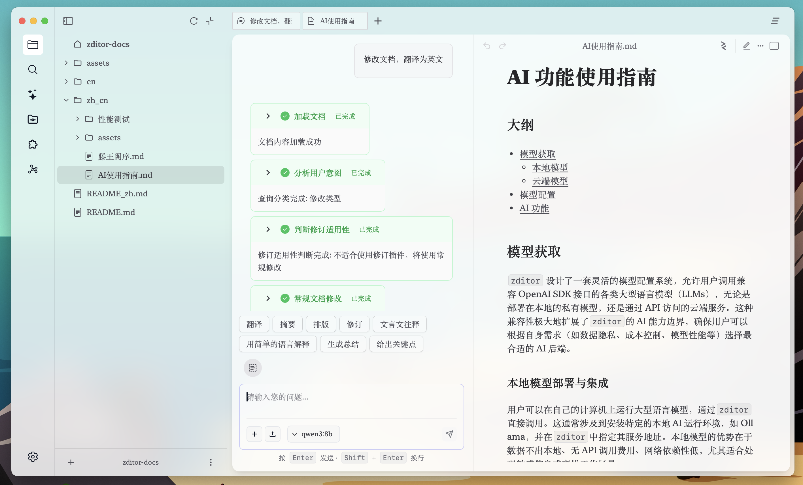

# AI 功能使用指南

## 大纲

- [模型获取](#模型获取)
  - [本地模型](#本地模型部署与集成)
  - [云端模型](#云端-api-模型集成)
- [模型配置](#模型配置)
- [AI 功能](#功能)
- 后续计划

## 模型获取

`zditor` 设计了一套灵活的模型配置系统，允许用户调用兼容 OpenAI SDK 接口的各类大型语言模型（LLMs），无论是部署在本地的私有模型，还是通过 API 访问的云端服务。这种兼容性极大地扩展了`zditor`的 AI 能力边界，确保用户可以根据自身需求（如数据隐私、成本控制、模型性能等）选择最合适的 AI 后端。

### 本地模型部署与集成

用户可以在自己的计算机上运行大型语言模型，通过`zditor`直接调用。这通常涉及到安装特定的本地 AI 运行环境，如 Ollama，并在`zditor`中指定其服务地址。本地模型的优势在于数据不出本地、无 API 调用费用、网络依赖性低，尤其适合处理敏感信息或离线工作场景。

- 前往[ollma 官网](https://www.ollama.com/)下载 ollama
- 下载模型,比如下载千问 3:`ollama run qwen3:8b`
- 查看模型列表: `ollama list`

### 云端 API 模型集成

用户可以通过互联网访问由各大 AI 厂商提供的模型服务。`zditor`支持配置这些服务的 API 密钥和接口地址，实现与云端模型的无缝对接。云端模型的优势在于无需本地高性能硬件、模型更新及时、易于扩展，但需要考虑数据传输和 API 调用成本。

以轨迹流动为例：

- 前往[硅基流动官网](https://cloud.siliconflow.cn/)注册并登陆
- 前往模型广场选择模型，复制模型名称
- 前往 API 密钥创建并复制密钥

## 模型配置

无论您选择哪个云端 AI 厂商（如 OpenAI、Anthropic、百度文心一言、阿里云通义千问等），`zditor`的 API 模型配置流程都大同小异，因为它遵循 OpenAI SDK 的兼容性设计。

- 打开 zditor，进入设置，选择模型组右侧的添加按钮
- 设置分组名称（自定义即可，不能重复），设置基础 URL，Ollama 的模型 URL 已经默认设置，硅基流动参考[官方文档](https://docs.siliconflow.cn/cn/faqs/stream-mode)，目前是`https://api.siliconflow.cn/v1`
- 设置 api 密钥，这里是上面步骤复制的，ollama 的可以不填
- 设置模型，以英文逗号分隔，这里是上面步骤复制的模型名称
- 设置 topp,温度等参数，这里可以默认，为了更好效果可以参考对应模型等官方文档

在设置页面选择模型，打开一个新标签页输入提问测试,下图以 ollama 下载的 qwen3 为例，先进入设置选中对应模型，然后在标签页输入提问，可以看到模型以流式输出回答。

## 功能

Zditor 支持 ai 划词和多轮对话两种形式，打开 markdown 文档，选中一段文本会弹出文本工具栏，选中图片，会弹出图片工具栏，目前有 5 种工具栏。工具栏上有自定义的提示词下拉列表，有自定义的提示词 icon 组件。

左侧导航栏选中插件，可以添加删除 ai 下拉列表中的提示词，也可以添加删除 ai 工具栏中的快捷提示词按钮。

