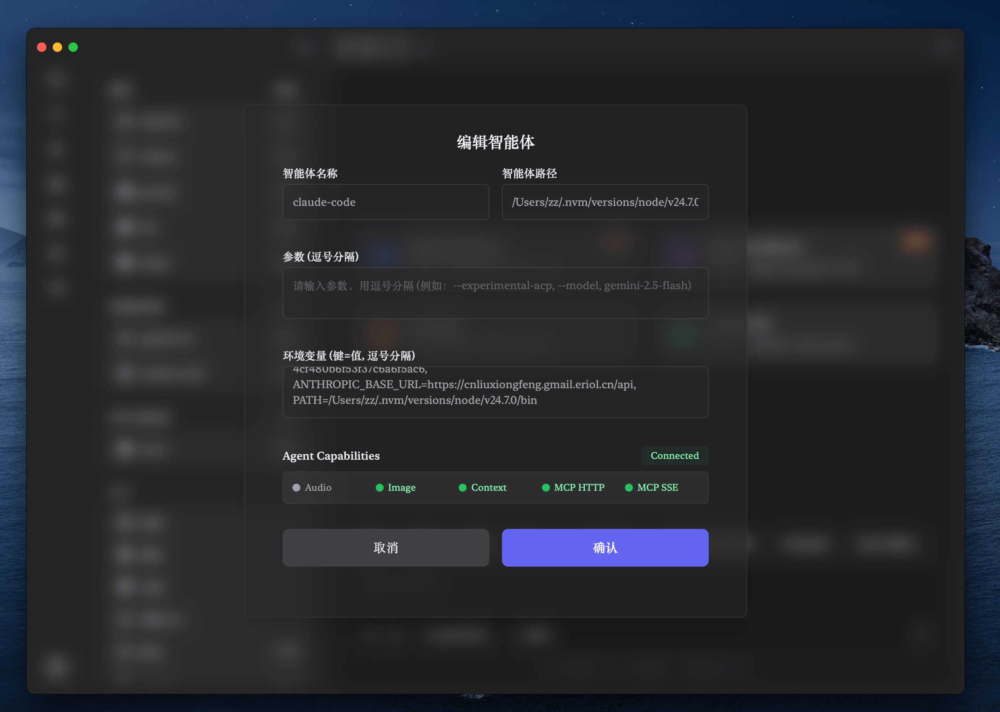
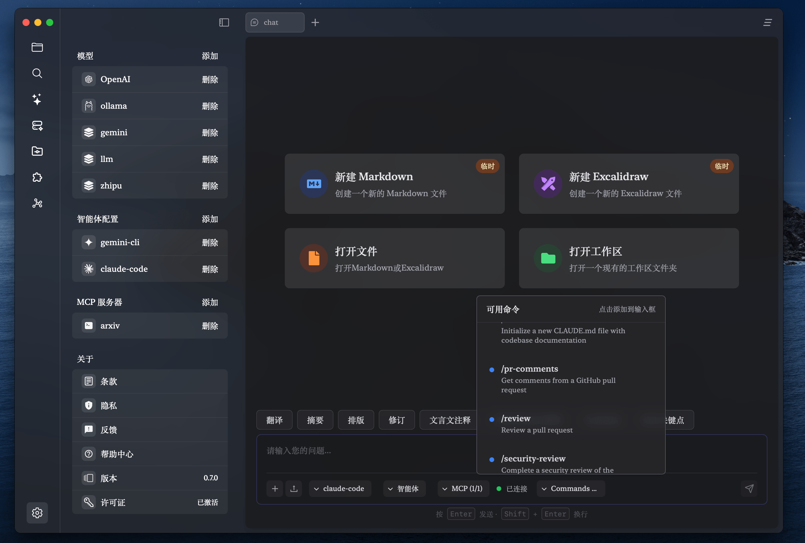
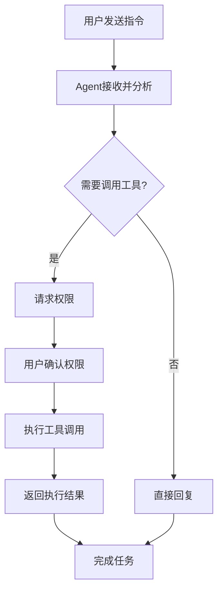

# Agent 智能体使用指南

## 1. 什么是 Agent 智能体？

!!! info "核心概念"
    Agent（智能体）功能让 Zditor 通过兼容 Agent Client Protocol (ACP) 协议，与您电脑上已经安装的各种 CLI 工具进行集成，如 Gemini CLI、Claude Code 等。这些工具可以为 Zditor 提供强大的 AI 服务，包括文本生成、网络搜索、MCP工具、文件操作、工具调用等高级功能。

> Agent 智能体模式相比传统的对话模式，具备更强的任务执行能力和自主性，可以主动调用工具、操作文件、执行复杂的多步骤任务。

## 2. 快速开始

### 2.1. Claude Code 快速配置

如果您想快速体验 Agent 功能，推荐从 Claude Code 开始：

```bash
# 1. 安装 Node.js（如果尚未安装）
# 访问 https://nodejs.org 下载安装

# 2. 安装 Claude Code ACP 适配器
npm install -g @zed-industries/claude-code-acp

# 3. 获取 API 密钥
# 访问 https://console.anthropic.com/ 获取 API 密钥
```

**在 Zditor 中配置：**
1. 打开设置 → 智能体配置 → 添加
2. 填写配置：
   - 智能体名称：`claude-code`
   - 智能体路径：`claude-code-acp`（或使用 `which claude-code-acp` 查找完整路径）
   - 环境变量：`ANTHROPIC_API_KEY=your_api_key_here, PATH=/usr/local/bin`
3. 点击"Test Connection"验证连接
4. 保存配置

!!! note "PATH 配置说明"
    如果您使用 nvm 管理 Node.js 版本，PATH 可能需要包含 nvm 相关路径，例如：
    `PATH=/Users/username/.nvm/versions/node/v18.0.0/bin:/usr/local/bin:/usr/bin:/bin`

### 2.2. 开始使用

1. 在 Zditor 主界面选择"智能体模式"
2. 从 Agent 选择器中选择 `claude-code`
3. 等待连接建立
4. 开始对话，体验 Agent 的强大功能！

## 3. Agent 与普通 AI 对话的区别

### 3.1. 功能对比

| 功能特性 | 普通 AI 对话 | Agent 智能体 |
| :------- | :----------- | :----------- |
| 对话交互 | ✅ 支持 | ✅ 支持 |
| 文件读写 | ❌ 不支持 | ✅ 支持 |
| 工具调用 | ❌ 不支持 | ✅ 支持 |
| 多步骤任务 | ❌ 不支持 | ✅ 支持 |
| 权限管理 | ❌ 无需 | ✅ 精细化权限控制 |
| 实时反馈 | ❌ 单次回复 | ✅ 流式思考过程 |
| 终端操作 | ❌ 不支持 | 🚧 开发中 |
| 划词功能 | ❌ 不支持 | 🚧 开发中 |

### 2.2. 使用场景

**普通 AI 对话适用于：**
- 日常问答咨询
- 文本内容生成
- 简单的翻译总结

**Agent 智能体适用于：**
- 代码项目分析和修改
- 文件批量处理
- 复杂的多步骤任务
- 需要调用外部工具的场景

**即将支持的场景：**
- 🚧 **终端操作场景**：系统管理、脚本执行、开发环境配置
- 🚧 **划词操作场景**：文档快速处理、内容智能提取和转换

## 3. Agent 配置指南

### 3.1. 打开 Agent 配置

1. 启动 Zditor 应用
2. 进入**设置页面**
3. 找到**智能体配置**部分
4. 点击**添加**按钮



### 3.2. 基本配置项

#### 智能体名称
- **作用**：用于标识 Agent 的唯一名称
- **格式要求**：
  - 不能包含制表符
  - 不能有前导或尾随空格
  - 必须唯一，不能重复
- **示例**：`gemini-cli`、`claude-desktop`、`custom-agent`

#### 智能体路径
- **作用**：已安装的 CLI 工具的可执行文件完整路径
- **格式要求**：
  - 必须是有效的文件路径
  - 文件必须具有执行权限
  - 不能包含制表符或前后空格
- **示例**：
  - macOS: `/usr/local/bin/gemini`（Gemini CLI）
  - Windows: `C:\Users\username\.nvm\versions\node\v20.0.0\bin\claude.cmd`（Claude Code）
  - Linux: `/opt/claude/claude-cli`

### 3.3. 高级配置项

#### 参数设置（可选）
- **作用**：启动 CLI 工具时的命令行参数
- **格式**：用英文逗号分隔多个参数
- **示例**：
  - Gemini CLI: `--experimental-acp, --model, gemini-2.5-flash`
  - Claude Code: `--help`（查看可用参数）

#### 环境变量（可选）
- **作用**：CLI 工具运行时需要的环境变量
- **格式**：`键=值` 形式，用英文逗号分隔
- **示例**：
  - Gemini CLI: `GEMINI_API_KEY=your_api_key, MODEL_NAME=gemini-pro`
  - Claude Code: `ANTHROPIC_API_KEY=your_key`

!!! warning "安全提醒"
    环境变量中的 API 密钥等敏感信息会存储在本地配置中，请确保您的系统安全。

### 3.4. 连接测试

配置完成后，点击**Test Connection**按钮进行连接测试：

1. **连接验证**：检查 Agent 程序是否能正常启动
2. **协议握手**：验证 ACP 协议通信是否正常
3. **能力检测**：获取 Agent 支持的功能列表

#### 能力指示器说明

测试成功后，会显示 Agent 的能力信息：

- **Audio** 🎵：是否支持音频处理
- **Image** 🖼️：是否支持图像处理
- **Context** 📄：是否支持嵌入式上下文
- **MCP HTTP** 🌐：是否支持 MCP HTTP 协议
- **MCP SSE** ⚡：是否支持 MCP Server-Sent Events

## 4. 使用 Agent 智能体

### 4.1. 启动 Agent 模式

1. 在 Zditor 主界面，找到**模式选择器**
2. 选择**智能体模式**
3. 从**Agent 选择器**中选择您配置的 Agent
4. 等待连接建立（状态显示为"已连接"）



### 4.2. 开始对话

Agent 连接成功后，您可以：

- **发送文本消息**：直接输入问题或指令
- **上传文件**：拖拽文件到对话框，Agent 可以分析文件内容
- **执行复杂任务**：Agent 会显示思考过程和执行步骤



### 4.3. Agent 思考过程

Agent 在执行任务时会显示详细的思考过程：

- **💭 思考**：Agent 分析问题和制定计划
- **🔧 工具调用**：Agent 调用具体工具执行操作
- **📝 结果**：返回执行结果和总结


## 5. 权限管理

### 5.1. 权限请求类型

当 Agent 需要执行敏感操作时，会弹出权限请求对话框：

#### 文件系统权限
- **读取文件**：Agent 请求读取指定文件内容
- **写入文件**：Agent 请求创建或修改文件
- **文件操作**：Agent 请求删除、移动或重命名文件

#### 网络访问权限
- **HTTP 请求**：Agent 请求访问网络 API
- **数据下载**：Agent 请求下载网络资源

#### 系统操作权限
- **执行命令**：Agent 请求运行系统命令
- **环境访问**：Agent 请求访问系统环境信息

### 5.2. 权限决策

面对权限请求时，您可以选择：

- **✅ 允许**：授予权限并继续操作
- **❌ 拒绝**：拒绝权限请求，Agent 会寻找替代方案
- **⏹️ 取消**：取消当前操作

!!! tip "权限管理建议"
    - 仔细审查 Agent 的权限请求
    - 只授予必要的最小权限
    - 对于不熟悉的操作，建议先拒绝并了解详情
    - 定期检查 Agent 的行为是否符合预期

## 6. 常见问题和故障排除

### 6.1. 连接问题

**Q: CLI 工具连接失败，显示"Failed to establish connection"**

可能原因和解决方案：

1. **检查路径**：确认 CLI 工具路径是否正确
   ```bash
   # 验证文件是否存在
   ls -la /usr/local/bin/gemini

   # 检查执行权限
   chmod +x /usr/local/bin/gemini
   ```

2. **检查依赖**：确认 CLI 工具的依赖是否安装
   ```bash
   # 检查 Node.js（Gemini CLI 和 Claude Code 都需要）
   node --version
   npm --version
   ```

3. **验证安装**：确认 CLI 工具正确安装
   ```bash
   # 测试 Claude Code ACP
   claude-code-acp --help

   # 测试 Gemini CLI
   gemini --help
   ```

4. **查看日志**：检查错误日志中的具体错误信息
5. **环境变量**：验证必需的环境变量是否正确设置
   ```bash
   # 检查 API 密钥
   echo $ANTHROPIC_API_KEY
   echo $GEMINI_API_KEY

   # 检查 PATH 是否包含必要路径
   echo $PATH
   ```

**Q: CLI 工具启动后立即退出**

常见原因和解决方案：

1. **PATH 配置问题**：CLI 工具找不到 Node.js 或其依赖
   ```bash
   # 检查 Node.js 是否在 PATH 中
   which node
   which npm

   # 如果找不到，需要在环境变量中添加 PATH
   # 示例：PATH=/usr/local/bin:/usr/bin:/bin
   ```

2. **依赖缺失**：检查 CLI 工具是否支持 ACP 协议
3. **参数错误**：确认启动参数是否正确（可通过 `工具名 --help` 查看）
4. **权限问题**：确保 CLI 工具有执行权限

**Q: 显示 "command not found" 错误**

这通常是 PATH 配置问题：

```bash
# 1. 找到 CLI 工具的实际安装位置
npm config get prefix
ls $(npm config get prefix)/bin

# 2. 将该路径添加到 Zditor 的环境变量中
# 例如：PATH=/usr/local/bin:/Users/username/.npm-global/bin:/usr/bin:/bin
```

### 6.2. 权限问题

**Q: Agent 权限请求被频繁拒绝**

- Agent 无法完成需要权限的任务
- 重新发起操作时会再次请求权限
- 考虑在配置中预授权常用权限

**Q: Agent 行为异常，执行了意外操作**

- 立即停止当前会话
- 检查 CLI 工具是否来自官方可信来源
- 重新配置或更换为官方版本的 CLI 工具

### 6.3. 性能问题

**Q: Agent 响应速度慢**

优化建议：

1. **检查网络**：确认网络连接稳定
2. **系统资源**：确保有足够的内存和 CPU 资源
3. **工具版本**：使用最新版本的 CLI 工具
4. **参数调优**：调整启动参数优化性能

## 7. 最佳实践

### 7.1. 安全配置

1. **可信来源**：只安装来自官方或可信来源的 CLI 工具
2. **权限控制**：采用最小权限原则，谨慎授权
3. **定期更新**：保持 CLI 工具为最新版本
4. **监控行为**：注意 Agent 的文件操作和网络访问

### 7.2. CLI 工具管理

1. **版本管理**：使用版本管理工具管理不同版本的 CLI 工具
   ```bash
   # 使用 nvm 管理 Node.js 版本（适用于 npm 安装的工具）
   nvm use 18
   npm install -g @zed-industries/claude-code-acp

   # 查看已安装的全局 npm 包
   npm list -g --depth=0
   ```

2. **环境变量管理**：在 Zditor Agent 配置中安全地管理 API 密钥和 PATH
   ```text
   # 在 Zditor Agent Manager 的环境变量字段中设置：
   ANTHROPIC_API_KEY=your_key, PATH=/usr/local/bin
   GEMINI_API_KEY=your_key, PATH=/usr/local/bin

   # 注意：这些变量只在 Agent 进程中生效，不会影响系统全局环境
   ```

3. **工具更新**：定期更新 CLI 工具以获得最新功能
   ```bash
   # 更新 Claude Code ACP
   npm update -g @zed-industries/claude-code-acp

   # 更新 Gemini CLI
   npm update -g @google/gemini-cli
   ```

### 7.3. 高效使用

1. **明确指令**：给出清晰、具体的任务描述
2. **分步骤**：将复杂任务分解为多个简单步骤
3. **利用上下文**：上传相关文件作为上下文信息
4. **适时干预**：在 Agent 执行过程中适时提供反馈

### 7.4. 故障预防

1. **备份重要文件**：在让 Agent 操作文件前先备份
2. **测试环境**：在非生产环境中测试 Agent 功能
3. **逐步授权**：从简单任务开始，逐步信任 Agent
4. **保持更新**：定期更新 Zditor 和相关 CLI 工具

## 8. 技术参考

### 8.1. Agent Client Protocol (ACP)

- **协议版本**：支持 ACP 0.4.0 规范
- **通信方式**：基于 JSON-RPC 的标准输入输出通信
- **支持功能**：
  - 文件系统操作
  - 会话管理
  - 权限控制
  - 工具调用
  - 流式响应

**开发中的功能（TODO）：**
- 🚧 **终端支持**：计划支持终端操作功能，允许 Agent 执行命令行操作
- 🚧 **划词支持**：计划支持文本选择和划词操作，提供更便捷的文本处理方式

### 8.2. 兼容的 CLI 工具

目前已知兼容 ACP 协议的 CLI 工具及其安装配置方法：

#### Gemini CLI

**安装步骤：**
```bash
# 从官方 GitHub 仓库安装
# 访问 https://github.com/google-gemini/gemini-cli

# 方法1：使用 npm 安装（推荐）
npm install -g @google/gemini-cli

# 方法2：从源码编译安装
git clone https://github.com/google-gemini/gemini-cli.git
cd gemini-cli
npm install
npm run build
npm link
```

**配置步骤：**
1. 获取 Gemini API 密钥：访问 [Google AI Studio](https://aistudio.google.com/app/apikey)
2. 在 Zditor 中配置：
   - **智能体名称**：`gemini-cli`
   - **智能体路径**：`gemini`（或通过 `which gemini` 查找完整路径）
   - **参数**：`--experimental-acp, --model, gemini-2.5-flash`
   - **环境变量**：`GEMINI_API_KEY=your_api_key_here, PATH=/usr/local/bin`

#### Claude Code

**安装步骤：**
```bash
# 首先确保已安装 Node.js (建议 v18 或更高版本)
node --version

# 安装 Claude Code ACP 适配器
npm install -g @zed-industries/claude-code-acp

# 验证安装
claude-code-acp --version
```

**配置步骤：**
1. 获取 Anthropic API 密钥：访问 [Anthropic Console](https://console.anthropic.com/)
2. 在 Zditor 中配置：
   - **智能体名称**：`claude-code`
   - **智能体路径**：`/usr/local/bin/claude-code-acp`（或通过 `which claude-code-acp` 查找路径）
   - **参数**：`--model, claude-3-5-sonnet-20241022`
   - **环境变量**：`ANTHROPIC_API_KEY=your_api_key_here, PATH=/usr/local/bin:/usr/bin:/bin`

!!! warning "PATH 环境变量配置"
    由于这些 CLI 工具依赖 Node.js，您需要在 Agent Manager 的**环境变量**字段中设置 PATH，而不是系统级别设置。

    **在 Zditor Agent 配置的环境变量中添加：**
    - macOS/Linux: `PATH=/usr/local/bin` 或 `PATH=/usr/local/bin:/usr/bin:/bin`
    - Windows: `PATH=C:\Program Files\nodejs;%APPDATA%\npm`

    **示例配置：**
    ```
    ANTHROPIC_API_KEY=your_key, PATH=/usr/local/bin
    ```

!!! tip "路径查找和 PATH 配置"
    如果不确定 CLI 工具的安装路径，可以使用以下命令查找：
    ```bash
    # 查找 Gemini CLI 路径
    which gemini

    # 查找 Claude Code ACP 路径
    which claude-code-acp

    # 查看 npm 全局安装路径
    npm list -g --depth=0
    npm config get prefix

    # 查看当前 PATH 环境变量
    echo $PATH

    # 查找 Node.js 和 npm 路径
    which node
    which npm
    ```

    **在 Zditor Agent 配置中设置 PATH：**
    - 根据默认配置，大多数情况下设置 `PATH=/usr/local/bin` 即可
    - 如果使用 nvm，需要包含 Node.js 版本路径：`PATH=/Users/username/.nvm/versions/node/v18.0.0/bin`
    - 可以包含多个路径：`PATH=/usr/local/bin:/usr/bin:/bin`

#### 其他 CLI 工具集成

**寻找兼容的 CLI 工具**

如果您需要集成其他 AI 服务的 CLI 工具，可以：

1. **查找现有的 ACP 兼容工具**
   ```bash
   # 在 GitHub 或 npm 上搜索
   npm search acp agent
   # 或查看相关项目的 Issues 和文档
   ```

2. **检查官方 CLI 工具是否支持 ACP**
   - 查看官方文档或 GitHub 仓库
   - 搜索 "ACP"、"Agent Client Protocol" 相关关键词
   - 检查是否有实验性 ACP 功能标志

**自行实现适配器**

如果现有工具不支持 ACP，您可以：

1. **包装现有 CLI 工具**
   - 创建一个适配器程序，将 ACP 协议转换为目标 CLI 的 API 调用
   - 使用 Node.js、Python 或其他语言实现

2. **开发自定义 ACP 工具**
   - 参考 [ACP 协议规范](https://github.com/anthropics/agent-client-protocol)
   - 使用官方 ACP SDK 或库进行开发
   - 确保工具支持标准输入输出通信

3. **贡献到开源社区**
   - 将您的适配器开源，帮助其他用户
   - 向原项目提交 PR 添加 ACP 支持

---

!!! note "文档更新"
    本文档会随着 Zditor 和 Agent 功能的发展持续更新。如有问题或建议，请通过应用内反馈功能联系我们。