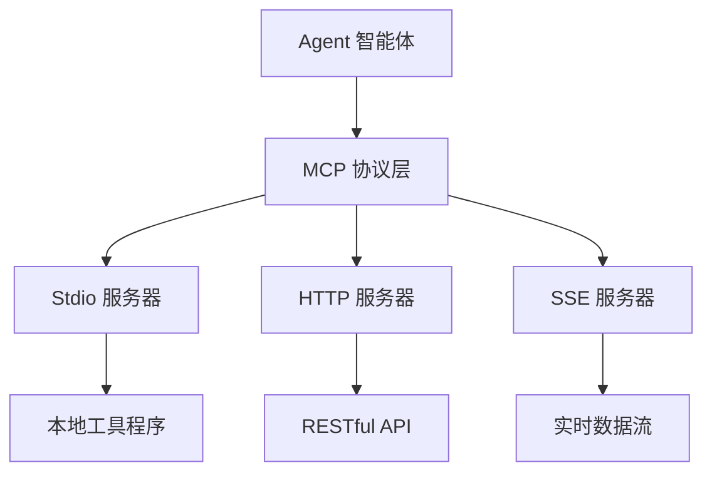
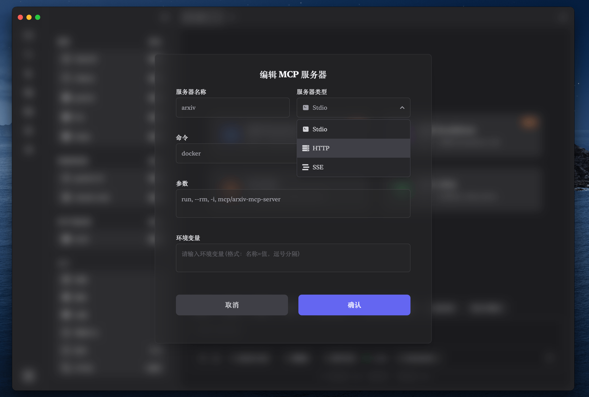

# MCP 服务器配置指南

## 1. 什么是 MCP 服务器？

!!! info "核心概念"
    MCP (Model Context Protocol) 服务器是提供特定功能服务的外部程序，如数据库查询、API 调用、文件处理、数据分析等。Agent 智能体可以通过 MCP 协议与这些服务器通信，大大扩展其功能边界。

> MCP 服务器就像是为 Agent 提供专业工具的"工具箱"，每个服务器都专精于特定领域的任务，让 Agent 能够调用各种专业能力。

## 2. MCP 协议的工作原理

MCP 协议定义了 Agent 与外部服务之间的标准化通信方式，确保不同来源的服务能够无缝集成到 Zditor 的 Agent 系统中。



### 2.1. 支持的通信协议

Zditor 支持三种 MCP 服务器类型：

- **Stdio**：通过标准输入输出与本地程序通信
- **HTTP**：通过 HTTP API 与远程服务通信
- **SSE**：通过 Server-Sent Events 接收实时数据流

## 3. MCP 服务器类型详解

### 3.1. Stdio 类型服务器

#### 适用场景
- 本地安装的 MCP 服务器程序
- 命令行工具和脚本
- 文件系统操作工具
- 本地数据库连接

#### 配置示例

**文件系统服务器**
```yaml
服务器名称: filesystem-server
命令: /usr/local/bin/mcp-filesystem
参数: --root, /Users/username/Documents, --readonly
环境变量: LOG_LEVEL=info, MAX_FILE_SIZE=10MB
```

**数据库查询服务器**
```yaml
服务器名称: sqlite-server
命令: /opt/mcp-tools/sqlite-server
参数: --database, /path/to/database.db
环境变量: SQLITE_TIMEOUT=30000
```

#### 配置要点
- **命令路径**：必须是可执行文件的完整路径
- **参数格式**：用英文逗号分隔，自动去除空格
- **环境变量**：格式为 `KEY=VALUE`，用逗号分隔

### 3.2. HTTP 类型服务器

#### 适用场景
- 云端 API 服务
- 微服务架构的后端
- 第三方 SaaS 平台
- RESTful Web 服务

#### 配置示例

**天气 API 服务**
```yaml
服务器名称: weather-api
URL: https://api.openweathermap.org/mcp/v1
请求头: Authorization: Bearer your_api_token, Content-Type: application/json
```

**翻译服务**
```yaml
服务器名称: translation-service
URL: https://api.translation.com/mcp
请求头: X-API-Key: your_key, Accept: application/json
```

#### 配置要点
- **URL 格式**：必须是完整的 URL，包含协议（http/https）
- **请求头**：格式为 `Name: Value`，用逗号分隔
- **认证信息**：通过请求头传递 API 密钥或令牌

### 3.3. SSE 类型服务器

#### 适用场景
- 实时数据推送服务
- 股价、汇率等金融数据流
- 系统监控数据
- 聊天和通知服务

#### 配置示例

**实时股价数据**
```yaml
服务器名称: stock-price-stream
URL: https://api.finance.com/sse/stocks
请求头: Authorization: Bearer token, Accept: text/event-stream
```

**系统监控数据**
```yaml
服务器名称: system-monitor
URL: https://monitor.example.com/sse/metrics
请求头: X-Monitor-Key: your_key
```

#### 配置要点
- **SSE 连接**：服务器必须支持 Server-Sent Events 规范
- **持久连接**：连接会保持开启状态接收实时数据
- **事件处理**：支持标准的 SSE 事件格式

## 4. MCP 服务器配置步骤

### 4.1. 打开配置界面

1. 启动 Zditor 应用
2. 进入**设置页面**
3. 找到**MCP 服务器**部分
4. 点击**添加**按钮



### 4.2. 选择服务器类型

在弹出的配置对话框中：

1. 输入**服务器名称**（必须唯一）
2. 点击**服务器类型**下拉菜单
3. 选择对应的类型：
   - 🖥️ **Stdio** - 本地程序
   - 🌐 **HTTP** - HTTP API
   - ⚡ **SSE** - 实时数据流

### 4.3. 填写配置信息

根据选择的服务器类型，填写相应的配置项：

#### Stdio 配置
- **服务器名称**：唯一标识符，如 `file-manager`
- **命令**：可执行文件的完整路径
- **参数**：命令行参数，用逗号分隔
- **环境变量**：运行时环境变量，格式 `KEY=VALUE`

#### HTTP/SSE 配置
- **服务器名称**：唯一标识符，如 `weather-api`
- **URL**：服务器的完整地址
- **请求头**：HTTP 头信息，格式 `Name: Value`

### 4.4. 验证配置

!!! tip "配置验证"
    - 检查服务器名称不重复
    - 确认 URL 格式正确（以 http:// 或 https:// 开头）
    - 验证认证信息有效性
    - 对于 Stdio 类型，确认程序文件存在且可执行

## 5. MCP 服务器集成使用

### 5.1. 自动注册机制

配置完成的 MCP 服务器会在以下时机自动注册给 Agent：

1. **创建新会话**：启动 Agent 时自动加载所有配置的服务器
2. **动态加载**：在 Agent 运行过程中添加新服务器
3. **热重载**：修改服务器配置后自动更新

### 5.2. Agent 调用 MCP 服务

Agent 可以通过以下方式使用 MCP 服务器：

#### 工具调用
```text
用户: 请帮我分析当前目录下的所有 Python 文件

Agent: 我来使用文件系统服务器扫描和分析 Python 文件...
🔧 调用工具: filesystem-server/list_files
📁 参数: {"path": ".", "pattern": "*.py"}
📝 结果: 找到 15 个 Python 文件...
```

#### 数据查询
```text
用户: 查询今天上海的天气情况

Agent: 我来调用天气 API 获取实时天气数据...
🌐 调用服务: weather-api/current_weather
📍 参数: {"city": "Shanghai", "date": "today"}
🌤️ 结果: 上海今日多云，气温 18-25°C...
```

### 5.3. 服务器状态监控

在 Agent 对话界面中，您可以看到：

- **🟢 在线**：MCP 服务器正常连接
- **🟡 连接中**：正在建立连接
- **🔴 离线**：服务器不可用
- **⚠️ 错误**：连接或调用出错

## 6. 常用 MCP 服务器推荐

### 6.1. 官方服务器

#### 文件系统服务器
```yaml
名称: mcp-filesystem
作用: 文件和目录操作
获取: npm install -g @modelcontextprotocol/filesystem
配置: stdio 类型，命令 npx @mcp/filesystem
```

#### 数据库服务器
```yaml
名称: mcp-sqlite
作用: SQLite 数据库查询
获取: npm install -g @modelcontextprotocol/sqlite
配置: stdio 类型，需要指定数据库文件路径
```

#### Web 搜索服务器
```yaml
名称: mcp-brave-search
作用: 网络搜索功能
获取: npm install -g @modelcontextprotocol/brave-search
配置: stdio 类型，需要 Brave Search API 密钥
```

### 6.2. 社区服务器

#### Git 操作服务器
```yaml
名称: mcp-git
作用: Git 仓库操作
类型: stdio
功能: 提交、分支、日志查询等
```

#### 系统监控服务器
```yaml
名称: mcp-system-monitor
作用: 系统资源监控
类型: sse
功能: CPU、内存、磁盘使用率实时监控
```

### 6.3. 自定义服务器开发

如果现有服务器不满足需求，您可以：

1. **使用 MCP SDK**：基于官方 SDK 开发自定义服务器
2. **包装现有工具**：将命令行工具包装为 MCP 服务器
3. **API 代理**：为现有 API 创建 MCP 代理服务器

参考资源：
- [MCP 官方文档](https://modelcontextprotocol.io/)
- [MCP SDK 开发指南](https://github.com/modelcontextprotocol/specification)

## 7. 故障排除

### 7.1. 连接问题

**Q: Stdio 服务器无法启动**

检查清单：
- [ ] 命令路径是否正确
- [ ] 文件是否具有执行权限
- [ ] 依赖项是否已安装
- [ ] 参数格式是否正确

解决方案：
```bash
# 验证程序存在
which your-mcp-server

# 检查权限
ls -la /path/to/mcp-server

# 手动测试启动
/path/to/mcp-server --help
```

**Q: HTTP/SSE 服务器连接超时**

可能原因：
- 网络连接问题
- URL 地址错误
- 服务器维护中
- 认证信息过期

解决方案：
```bash
# 测试网络连接
curl -I https://api.example.com/mcp

# 验证认证
curl -H "Authorization: Bearer token" https://api.example.com/mcp/status
```

### 7.2. 权限问题

**Q: MCP 服务器权限被拒绝**

- Agent 调用 MCP 服务时需要相应权限
- 检查服务器配置的认证信息
- 确认 API 密钥或令牌有效

**Q: 本地文件访问权限不足**

- 确保 MCP 服务器有读写权限
- 检查文件所有者和权限设置
- 考虑使用 sudo 或管理员权限

### 7.3. 性能问题

**Q: MCP 服务器响应缓慢**

优化建议：
- 检查网络延迟（远程服务器）
- 增加超时时间配置
- 使用本地缓存减少重复调用
- 考虑升级服务器硬件

## 8. 安全最佳实践

### 8.1. 认证安全

1. **API 密钥管理**
   - 定期轮换 API 密钥
   - 使用环境变量存储敏感信息
   - 限制 API 密钥的访问权限

2. **传输安全**
   - 优先使用 HTTPS 协议
   - 验证服务器 SSL 证书
   - 避免在日志中记录敏感信息

### 8.2. 访问控制

1. **最小权限原则**
   - 只配置必需的 MCP 服务器
   - 限制服务器的访问范围
   - 定期审查服务器配置

2. **网络安全**
   - 使用防火墙限制外部访问
   - 配置 VPN 访问内部服务
   - 监控异常网络活动

### 8.3. 数据保护

1. **敏感数据处理**
   - 避免在 MCP 调用中传输敏感数据
   - 使用数据脱敏技术
   - 实施数据加密存储

2. **审计日志**
   - 记录 MCP 服务器调用日志
   - 监控异常访问模式
   - 定期检查服务器状态

## 9. 高级配置

### 9.1. 负载均衡配置

对于高并发场景，可以配置多个相同功能的 MCP 服务器：

```yaml
# 主服务器
服务器名称: database-primary
URL: https://db1.example.com/mcp

# 备用服务器
服务器名称: database-backup
URL: https://db2.example.com/mcp
```

### 9.2. 条件路由

根据不同条件选择不同的 MCP 服务器：

- **地理位置**：根据用户位置选择最近的服务器
- **负载情况**：根据服务器负载自动切换
- **功能特性**：根据任务类型选择专用服务器

### 9.3. 缓存策略

配置合适的缓存策略提升性能：

- **本地缓存**：缓存频繁访问的数据
- **TTL 设置**：设置合理的缓存过期时间
- **缓存更新**：定期更新或无效化缓存

---

!!! note "技术支持"
    MCP 是一个快速发展的协议，新的服务器和功能会不断涌现。建议关注 [MCP 官方社区](https://github.com/modelcontextprotocol) 获取最新信息和最佳实践。