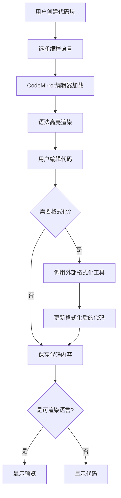
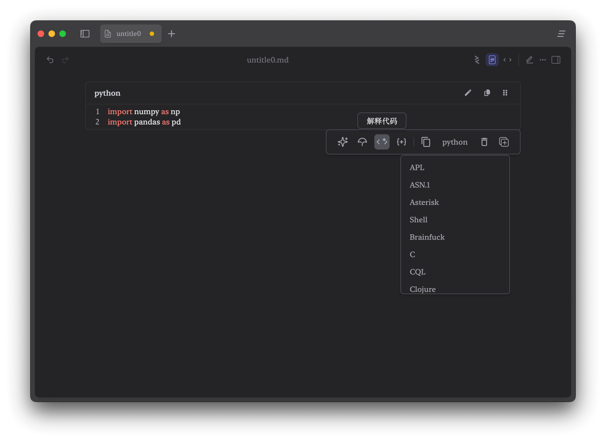

# Zditor 代码插件 (Code Plugin) 功能指南

## 1. 什么是代码插件 (Code Plugin)？

!!! info "核心概念"
    代码插件（Code Plugin）是 Zditor Markdown 编辑器的核心功能之一，它为用户提供了强大的代码编辑、语法高亮、代码格式化以及多语言支持能力。通过集成 CodeMirror 编辑器和自定义的代码格式化系统，用户可以在 Markdown 文档中无缝编写、编辑和格式化各种编程语言的代码。

## 2. 代码插件如何工作？

代码插件基于 CodeMirror， 提供强大的代码编辑体验。当您在编辑器中创建代码块时，系统会：

1. **创建代码块**：通过工具栏或快捷键创建 CodeFence 节点
2. **语言识别**：根据指定的语言标识符提供相应的语法高亮
3. **代码编辑**：使用 CodeMirror 提供专业的代码编辑体验
4. **格式化处理**：通过外部格式化工具美化代码结构
5. **渲染预览**：对特定语言提供实时预览功能



## 3. 代码块创建方式

### 3.1. slash 工具栏创建

1. 输入`/`，弹出工具栏
2. 选择代码块
3. 开始编写代码

### 3.2. 快捷键创建

|快捷键 |功能 |说明 |
|:---|:---|:---|
|`Shift+Ctrl+C` |创建代码块 |Windows/Linux |
|`Shift+Cmd+C` |创建代码块 |macOS |
|`Shift+Ctrl+\` |切换代码块 |备用快捷键 |

### 3.3. Markdown 语法

输入 \`\`\`language + 空格 创建代码块，比如输入\`\`\`python+空格创建

## 4. 代码编辑功能

### 4.1. 基础编辑操作

|功能 |快捷键 |说明 |
|:---|:---|:---|
|缩进 |`Tab` |增加缩进 |
|反缩进 |`Shift+Tab` |减少缩进 |
|换行 |`Enter` |插入新行 |
|退出代码块 |`ctrl+Enter` |代码块下方插入空行并跳转 |
|查找 |`Ctrl+F` / `Cmd+F`  |查找替换代码内容替换 |
|全选 |`Ctrl+A` / `Cmd+A` |选择所有代码 |
|复制代码 |`Ctrl+C` / `Cmd+C` |复制到剪贴板 |
|撤销 |`Ctrl+Z` / `Cmd+X` |撤销编辑 |
|恢复 |`Shift+Ctrl+Z` / `Shift+Cmd+Z` |恢复编辑 |
|上下移动 |`ArrowUp` / `ArrowDown` |上下 |
|左右移动 |`ArrowLeft` / `ArrowRight` |上下 |

### 5. 自定义工具栏

当光标在代码块内部时，会显示代码块工具栏,可以选择语言、复制删除代码块，可以自定义ai工具，比如解释代码，检测错误等。



## 6. 渲染预览功能

### 6.1. 支持预览的语言

Zditor 为特定语言提供实时预览功能：

#### Mermaid 图表


#### HTML 预览

```html
<!DOCTYPE html>
<html>
  <head>
    <title>示例页面</title>
  </head>
  <body>
    <h1>Hello World</h1>
    <p>这是一个HTML预览示例。</p>
  </body>
</html>
```

#### Excalidraw 手绘图

- 支持手绘风格的图表和图形
- 实时编辑和预览
- 导出为 SVG 或 PNG

### 6.2. 预览控制

- **切换预览**：点击代码块右上角的预览按钮
- **全屏预览**：双击预览区域
- **导出图片**：右键预览区域选择导出选项

## 7. 代码格式化配置

Zditor 采用外部工具集成的方式提供强大的代码格式化功能。系统支持多种主流编程语言的格式化，通过调用外部格式化工具（如 Black、Prettier、clang-format 等）来实现专业级别的代码美化。**如需支持其他语言代码格式化，可以提issue**。

### 7.1 支持的格式化工具

|语言 |格式化工具 |默认路径 |主要特性 |
|:---|:---|:---|:---|
|**Python** |Black |`/usr/local/bin/black` |代码行长度控制、字符串规范化 |
|**JavaScript/TypeScript** |Prettier |`/usr/local/bin/prettier` |多种解析器、统一代码风格 |
|**Java** |Google Java Format |`/usr/local/bin/google-java-format` |Google 代码规范 |
|**C/C++** |clang-format |`/usr/local/bin/clang-format` |多种代码风格（Google、LLVM等） |
|**Rust** |rustfmt |`/usr/local/bin/rustfmt` |Rust 官方格式化工具 |
|**Go** |gofmt |`/usr/local/go/bin/gofmt` |Go 内置格式化工具 |
|**CSS/SCSS/Less** |Prettier |`/usr/local/bin/prettier` |样式表格式化 |
|**HTML** |Prettier |`/usr/local/bin/prettier` |标记语言格式化 |
|**JSON/YAML** |Prettier |`/usr/local/bin/prettier` |数据格式化 |
|**Markdown** |Prettier |`/usr/local/bin/prettier` |文档格式化 |

### 7.2 配置界面操作

#### 访问格式化设置

1. 点击应用程序左下角落的 **设置** 菜单
2. 选择 **代码格式化** 选项
3. 弹出格式化工具配置对话框

#### 界面功能说明

- **格式化工具列表**：显示所有已配置的格式化工具
- **语言标识符**：显示支持的编程语言名称
- **工具名称**：显示使用的格式化工具（如 black、prettier）
- **路径配置**：显示工具的可执行文件路径
- **编辑按钮**：修改现有格式化工具配置

Zditor使用沙盒箱执行格式化工具，无法从终端获取环境变量，因此需要确保工具可执行文件路径正确。

### 7.3 配置示例


#### 编辑现有配置

1. 在格式化工具列表中找到要修改的配置项
2. 点击该配置项右侧的 **编辑** 按钮（铅笔图标）
3. 在弹出的编辑框中修改路径或参数
4. 按 **回车** 或点击 **确认** 保存修改
5. 点击 **取消** 可以放弃修改

### 7.4 外部工具安装

#### 7.4.1 Python - Black 代码格式化工具

```bash
# 全局安装
pip install black

# 或者安装到用户目录
pip install --user black

# 指定版本安装
pip install black==23.12.1
```

```bash
# 检查是否安装成功
black --version

# 查看安装路径
which black
# 输出示例：/usr/local/bin/black 或 /opt/homebrew/bin/black

# 测试格式化功能
echo "def test( ):    pass" | black --quiet -
# 应该输出：def test(): pass
```

#### 7.4.2 JavaScript/TypeScript - Prettier 代码格式化工具

```bash
# 使用 npm 全局安装
npm install -g prettier

# 使用 yarn 全局安装
yarn global add prettier

# 使用 pnpm 全局安装
pnpm add -g prettier
```

```bash
# 检查版本
prettier --version

# 查看安装路径
which prettier
# 全局安装示例：/usr/local/bin/prettier
# 本地安装示例：./node_modules/.bin/prettier

# 测试格式化功能
echo 'const x={a:1,b:2}' | prettier --parser babel
# 应该输出格式化后的代码
```

#### 7.4.3 Java - Google Java Format

```bash
brew install google-java-format
```

```bash
# 检查版本
google-java-format --version

# 查看路径
which google-java-format
# 示例：/usr/local/bin/google-java-format

# 测试格式化
echo 'class Test{public static void main(String[]args){}}' | google-java-format -
```

#### 7.4.4 C/C++ - clang-format

```bash
# macOS (Homebrew)
brew install clang-format

# Ubuntu/Debian
sudo apt update
sudo apt install clang-format

# CentOS/RHEL/Fedora
sudo yum install clang-tools-extra  # CentOS 7
sudo dnf install clang-tools-extra  # Fedora/CentOS 8+

# Arch Linux
sudo pacman -S clang
```

```bash
# 检查版本
clang-format --version

# 查看路径
which clang-format
# 示例：/usr/local/bin/clang-format 或 /usr/bin/clang-format

# 测试格式化
echo 'int main(){return 0;}' | clang-format --style=Google
```

#### 7.4.5  Rust - rustfmt

```bash
# 添加 rustfmt 组件
rustup component add rustfmt

# 或者安装到特定工具链
rustup component add rustfmt --toolchain stable
```

```bash
# 检查版本
rustfmt --version

# 查看路径
which rustfmt
# 示例：~/.cargo/bin/rustfmt

# 测试格式化
echo 'fn main(){println!("hello");}' | rustfmt --emit=stdout
```

#### 7.4.6 Go - gofmt

```bash
# gofmt 随 Go 安装自动提供，无需单独安装
# 安装 Go 语言

# macOS (Homebrew)
brew install go

# Ubuntu/Debian
sudo apt install golang-go

# 直接下载（推荐）
# 访问 https://golang.org/dl/ 下载对应平台的安装包
```

```bash
# 检查 Go 版本
go version

# 检查 gofmt
gofmt -h

# 查看路径
which gofmt
# 示例：/usr/local/go/bin/gofmt

# 测试格式化
echo 'package main;func main(){println("hello")}' | gofmt
```

---

通过 Zditor 的代码插件，您可以在一个统一的环境中高效地编写、编辑、格式化和预览各种编程语言的代码。结合强大的 AI 功能和灵活的配置选项，让代码编写和技术文档创作变得更加轻松和专业！:rocket: