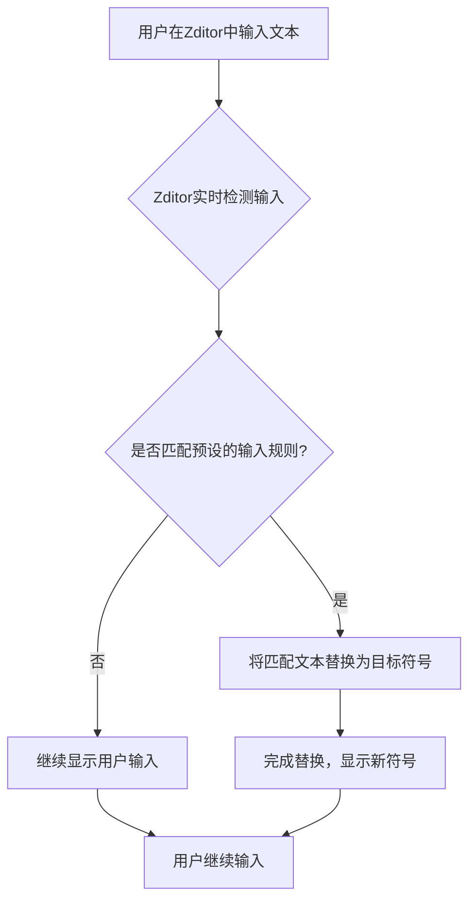

# Zditor 智能文本 (SmartText) 功能指南

## 1. 什么是智能文本 (SmartText)？

!!! info "核心概念"
    智能文本（SmartText）是 Zditor Markdown 编辑器的一项创新功能，它允许用户通过输入特定的字符组合或简写，自动将其转换为对应的特殊符号、数学符号、希腊字母、分数、下标、货币符号、版权商标以及各种常用图标等。

> 这项功能旨在简化复杂符号的输入过程，让您无需记忆 Unicode 编码或频繁切换输入法，即可轻松插入专业且美观的文本内容。

## 2. 智能文本如何工作？

智能文本的实现原理基于一系列预定义的“输入规则”（`InputRule`）。每当您在编辑器中输入字符时，Zditor 会实时检测您输入的文本是否符合任何一条预设的正则表达式模式。一旦匹配成功，Zditor 会立即将匹配到的文本替换为对应的目标符号。



例如，当您输入 `->` 后，Zditor 会识别这个模式，并自动将其替换为右箭头符号 `→`。

```javascript
// 示例：右箭头规则
const rightArrow = new InputRule(/->$/, "→");
// 当您输入 "->" 并按下空格或继续输入其他字符时，它就会变成 "→"
```

## 3. 支持的智能文本符号列表

Zditor 的智能文本功能涵盖了广泛的符号类型，以下是详细的分类和对应的输入规则：

### 3.1. 基础箭头符号

| 输入模式 | 输出符号 | 示例 |
| :------- | :------- | :--- |
| `->`     | `→`      | `A->B` → `A→B` |
| `<-`     | `←`      | `B<-A` → `B←A` |
| `←>`     | `↔`      | `双向连接←>` → `双向连接↔` |
| `(up)`   | `↑`      | `温度(up)` → `温度↑` |
| `(down)` | `↓`      | `价格(down)` → `价格↓` |
| `=>`     | `⇒`      | `条件=>结果` → `条件⇒结果` |
| `=<`     | `⇐`      | `结果=<条件` → `结果⇐条件` |
| `<=>`    | `⇔`      | `等价关系<=>` → `等价关系⇔` |

### 3.2. 数学符号

| 输入模式    | 输出符号 | 示例 |
| :---------- | :------- | :--- |
| `!=`        | `≠`      | `x!=y` → `x≠y` |
| `<=`        | `≤`      | `a<=b` → `a≤b` |
| `>=`        | `≥`      | `c>=d` → `c≥d` |
| `<<`        | `≪`      | `x<<y` → `x≪y` |
| `>>`        | `≫`      | `z>>w` → `z≫w` |
| `+/-`       | `±`      | `误差+/-0.5` → `误差±0.5` |
| `-+`        | `∓`      | `变化-+/0.1` → `变化∓0.1` |
| `(times)`   | `×`      | `3(times)4` → `3×4` |
| `(div)`     | `÷`      | `10(div)2` → `10÷2` |
| `(infinity)` | `∞`      | `趋近于(infinity)` → `趋近于∞` |
| `(deg)`     | `°`      | `90(deg)` → `90°` |
| `(sqrt)`    | `√`      | `(sqrt)2` → `√2` |
| `(sum)`     | `∑`      | `(sum)i=1 to n` → `∑i=1 to n` |
| `(pi)`      | `π`      | `圆周率(pi)` → `圆周率π` |
| `(therefore)` | `∴`      | `因为A，(therefore)B` → `因为A，∴B` |
| `(because)` | `∵`      | `(because)A，所以B` → `∵A，所以B` |

### 3.3. 希腊字母

| 输入模式    | 输出符号 | 示例 |
| :---------- | :------- | :--- |
| `(alpha)`   | `α`      | `(alpha)粒子` → `α粒子` |
| `(beta)`    | `β`      | `(beta)射线` → `β射线` |
| `(gamma)`   | `γ`      | `(gamma)函数` → `γ函数` |
| `(delta)`   | `δ`      | `(delta)值` → `δ值` |
| `(theta)`   | `θ`      | `(theta)角` → `θ角` |
| `(lambda)`  | `λ`      | `(lambda)表达式` → `λ表达式` |
| `(mu)`      | `μ`      | `(mu)F` → `μF` |
| `(sigma)`   | `σ`      | `(sigma)值` → `σ值` |
| `(omega)`   | `ω`      | `(omega)频率` → `ω频率` |

### 3.4. 分数

!!! note "注意事项"
    分数转换通常要求前面没有其他字母或数字，以确保准确识别。例如，`1/2` 会被转换，但 `abc1/2` 则不会。

| 输入模式  | 输出符号 | 示例 |
| :-------- | :------- | :--- |
| `1/2`     | `½`      | `½杯水` |
| `1/3`     | `⅓`      | `⅓的份额` |
| `2/3`     | `⅔`      | `⅔的票数` |
| `1/4`     | `¼`      | `¼英里` |
| `3/4`     | `¾`      | `¾完成` |
| `1/5`     | `⅕`      | `⅕的概率` |
| `2/5`     | `⅖`      | `⅖的增长` |
| `3/5`     | `⅗`      | `⅗的成本` |
| `4/5`     | `⅘`      | `⅘的效率` |
| `1/6`     | `⅙`      | `⅙的体积` |
| `5/6`     | `⅚`      | `⅚的产量` |
| `1/8`     | `⅛`      | `⅛英寸` |
| `3/8`     | `⅜`      | `⅜的距离` |
| `5/8`     | `⅝`      | `⅝的重量` |
| `7/8`     | `⅞`      | `⅞的容量` |

### 3.5. 下标数字

| 输入模式 | 输出符号 | 示例 |
| :------- | :------- | :--- |
| `_0`     | `₀`      | `x_0` → `x₀` |
| `_1`     | `₁`      | `y_1` → `y₁` |
| `_2`     | `₂`      | `H_2O` → `H₂O` |
| `_3`     | `₃`      | `C_3H_8` → `C₃H₈` |
| `_4`     | `₄`      | `N_4` → `N₄` |
| `_5`     | `₅`      | `O_5` → `O₅` |
| `_6`     | `₆`      | `P_6` → `P₆` |
| `_7`     | `₇`      | `S_7` → `S₇` |
| `_8`     | `₈`      | `Cl_8` → `Cl₈` |
| `_9`     | `₉`      | `F_9` → `F₉` |

### 3.6. 货币符号

| 输入模式  | 输出符号 | 示例 |
| :-------- | :------- | :--- |
| `(eur)`   | `€`      | `100(eur)` → `100€` |
| `(gbp)`   | `£`      | `50(gbp)` → `50£` |
| `(jpy)`   | `¥`      | `1000(jpy)` → `1000¥` |
| `(cent)`  | `¢`      | `50(cent)` → `50¢` |

### 3.7. 版权和商标

| 输入模式      | 输出符号 | 示例 |
| :------------ | :------- | :--- |
| `(c)`         | `©`      | `Copyright (c) 2023` → `Copyright © 2023` |
| `(r)`         | `®`      | `产品名称(r)` → `产品名称®` |
| `(tm)`        | `™`      | `品牌名称(tm)` → `品牌名称™` |
| `(p)`         | `℗`      | `音乐专辑(p)` → `音乐专辑℗` |
| `(sm)`        | `℠`      | `服务标记(sm)` → `服务标记℠` |

### 3.8. 常用符号和图标

| 输入模式      | 输出符号 | 示例 |
| :------------ | :------- | :--- |
| `(check)`     | `✓`      | `任务完成 (check)` → `任务完成 ✓` |
| `(cross)`     | `✗`      | `错误 (cross)` → `错误 ✗` |
| `(star)`      | `★`      | `评价 (star)` → `评价 ★` |
| `(heart)`     | `♥`      | `喜欢 (heart)` → `喜欢 ♥` |
| `(spade)`     | `♠`      | `扑克 (spade)` → `扑克 ♠` |
| `(club)`      | `♣`      | `扑克 (club)` → `扑克 ♣` |
| `(diamond)`   | `♦`      | `扑克 (diamond)` → `扑克 ♦` |
| `(note)`      | `♪`      | `音乐 (note)` → `音乐 ♪` |
| `(notes)`     | `♫`      | `多音符 (notes)` → `多音符 ♫` |
| `(sun)`       | `☀`      | `天气 (sun)` → `天气 ☀` |
| `(moon)`      | `☽`      | `夜晚 (moon)` → `夜晚 ☽` |
| `(cloud)`     | `☁`      | `多云 (cloud)` → `多云 ☁` |
| `(rain)`      | `☔`      | `下雨 (rain)` → `下雨 ☔` |
| `(snow)`      | `❄`      | `下雪 (snow)` → `下雪 ❄` |
| `(phone)`     | `☎`      | `联系电话 (phone)` → `联系电话 ☎` |
| `(email)`     | `✉`      | `邮箱地址 (email)` → `邮箱地址 ✉` |
| `(warning)`   | `⚠`      | `警告 (warning)` → `警告 ⚠` |
| `(info)`      | `ℹ`      | `信息 (info)` → `信息 ℹ` |
| `(question)`  | `❓`      | `疑问 (question)` → `疑问 ❓` |
| `(exclamation)` | `❗`      | `注意 (exclamation)` → `注意 ❗` |

### 3.9. 科学和单位符号

| 输入模式     | 输出符号 | 示例 |
| :----------- | :------- | :--- |
| `(micro)`    | `µ`      | `10(micro)m` → `10µm` |
| `(ohm)`      | `Ω`      | `电阻10(ohm)` → `电阻10Ω` |
| `(celsius)`  | `℃`      | `25(celsius)` → `25℃` |
| `(fahrenheit)` | `℉`      | `77(fahrenheit)` → `77℉` |
| `(angstrom)` | `Å`      | `10(angstrom)` → `10Å` |

## 4. 使用技巧与建议

*   **即时转换**：智能文本的转换是即时发生的。当您输入完完整的触发模式后，符号会立即出现。
*   **上下文感知**：某些规则（如分数）对输入模式前后的字符有要求，以避免误转换。通常，这意味着您需要在输入模式前后有空格或换行符，或者它是单词的开头/结尾。
*   **结合 Markdown**：智能文本可以与 Zditor 的其他 Markdown 格式完美结合。例如，您可以在粗体文本中插入数学符号：`**E=mc^2**` → `**E=mc²**`。
*   **探索与记忆**：一开始可能需要查阅此指南来记忆常用的输入模式，但随着使用频率的增加，您会发现它们变得非常直观和高效。

---

通过 Zditor 的智能文本功能，您可以轻松地在 Markdown 文档中插入各种专业、美观的符号，极大地提升文档的可读性和编写效率。尽情享受更智能、更便捷的写作体验吧！:sparkles: