---
description:
  type: text
  description:
  label: Description
  value: "流程图 · 时序图 · 甘特图 · ER 图 · Mindmap"
author:
  type: text
  description:
  label: Author
  value: "SeeLey & Codex"
cover:
  type: asset
  description:
  label: Cover Image
  value: "../assets/guides/mermaid-guide-cover-nanobanana.jpg"
col:
  type: array
  description:
  label: Col
  value: ["subject","title","description"]
subject:
  type: text
  description:
  label: Subject
  value: "Mermaid"
avatar:
  type: asset
  description:
  label: Avatar
  value: "../assets/nanobanana-avatar.svg"
tags:
  type: text
  description:
  label: Tags
  value: "Mermaid · 图表 · 指南"
title:
  type: text
  description:
  label: Title
  value: "Mermaid使用指南"
display:
  type: checkbox
  description: display
  label: 显示属性
  value: false
updated:
  type: date
  description:
  label: Updated
  value: "2026-04-11"
warm:
  type: checkbox
  description: warm
  label: 暖色调
  value: true
row:
  type: array
  description:
  label: Row
  value: ["avatar","author","updated","tags"]
---
# Mermaid使用指南

Mermaid 是一种用文本描述图表的语法。你只需要在 Markdown 中写一个 `mermaid` 代码块，就可以生成流程图、时序图、甘特图、ER 图、Git 图等常见图表。

这份指南的目标不是覆盖全部语法，而是帮助你在 Zditor 中快速写出可用、清晰、易维护的 Mermaid 图。

## 快速开始

最小可用示例：

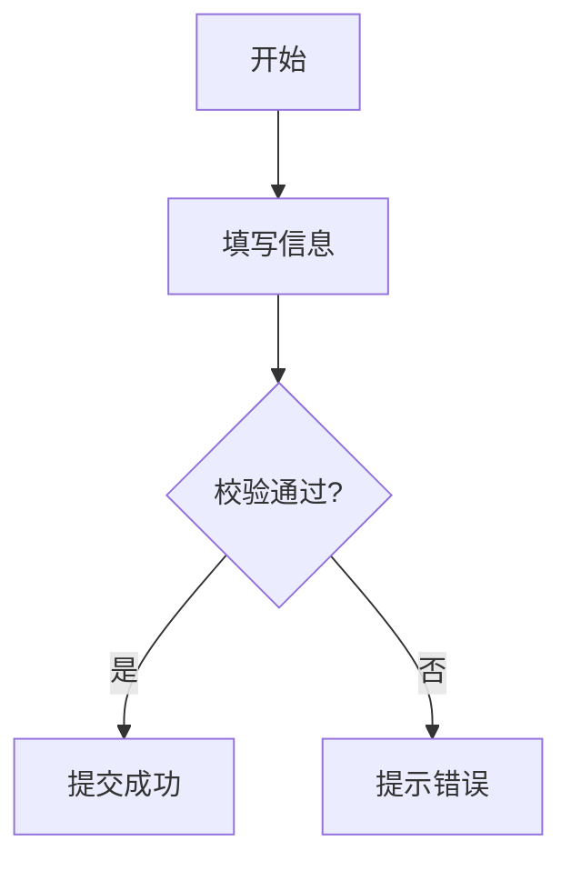

使用时只要记住两点：

- 代码块语言标记必须是 `mermaid`
- 先选对图表类型，再写内容

## 什么时候用哪种图

|场景 |推荐图表 |
|---|---|
|业务流程、审批流、判断分支 |Flowchart |
|前后端、服务、数据库调用顺序 |Sequence Diagram |
|项目排期、里程碑、任务依赖 |Gantt Chart |
|类关系、接口设计、模块结构 |Class Diagram |
|状态切换、生命周期、状态机 |State Diagram |
|数据库表结构、实体关系 |ER Diagram |
|用户体验流程、服务接触点 |User Journey |
|比例分布、占比展示 |Pie Chart |
|分支合并、版本演进 |Git Graph |
|头脑风暴、知识结构 |Mindmap |

## 通用书写建议

- 节点文本尽量短，长句放到正文，不要塞进图里。
- 一张图只表达一个主题，不要把流程、数据结构、排期混在一起。
- 优先使用中文业务词，不要混杂过多内部缩写。
- 节点数量过多时，先拆成两张图，再考虑子图。
- 从上到下 `TD` 和从左到右 `LR` 是最稳妥的默认方向。

## 流程图 Flowchart

适合表达步骤、判断、跳转和模块关系，是最常用的 Mermaid 图。

### 最小示例

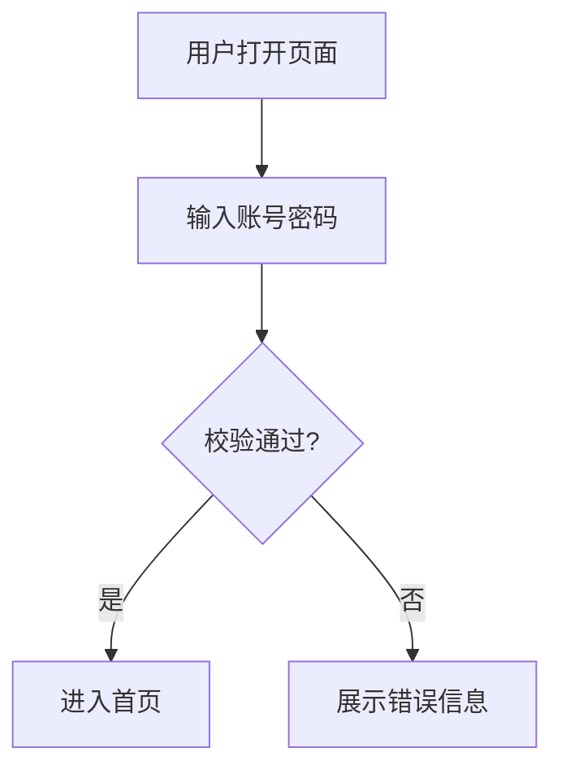

### 常见节点形状

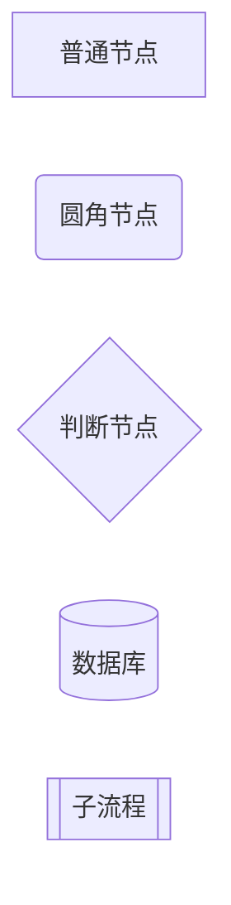

### 常见连接方式

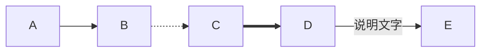

### 子图

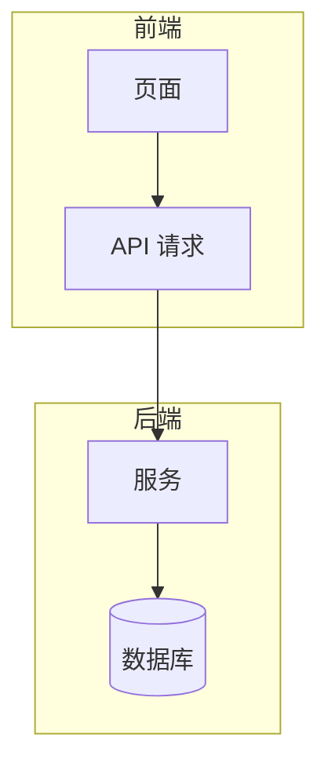

### 适用建议

- 业务流程图优先用 `TD`
- 系统架构图优先用 `LR`
- 判断分支尽量写成 `是 / 否` 或 `成功 / 失败`

### 实战示例：订单提交流程

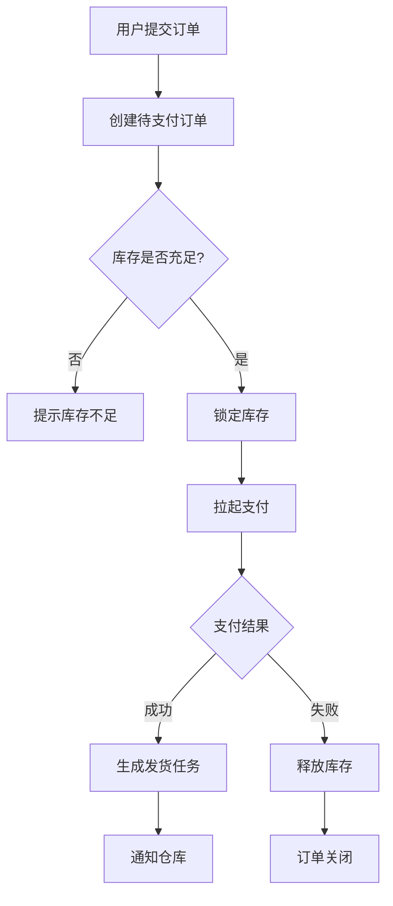

### 实战示例：带泳道的系统协作流程

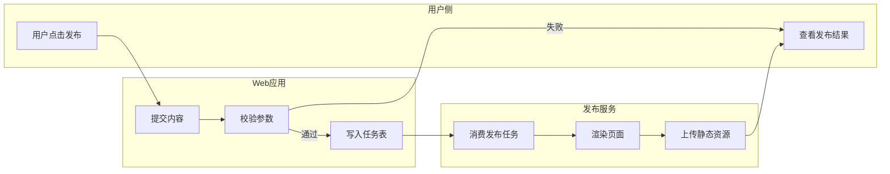

## 时序图 Sequence Diagram

适合表达多个参与方之间“谁先调用谁、谁返回什么”。

### 最小示例

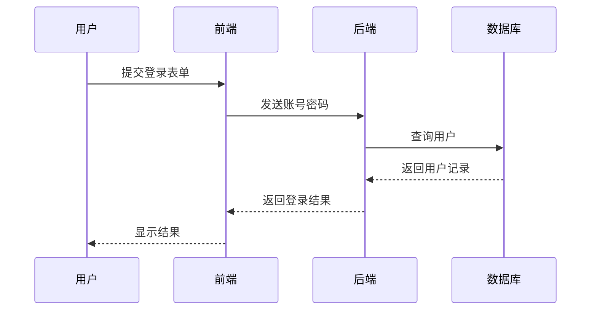

### 条件、可选和循环

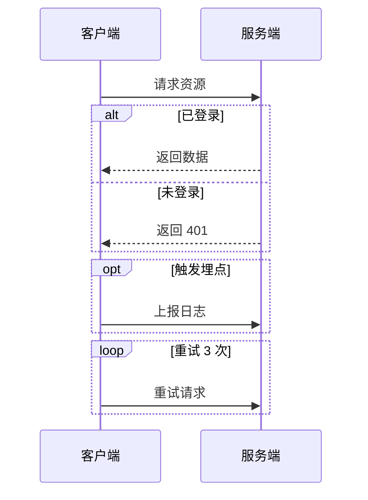

### 适用建议

- 参与者不要超过 6 个，否则可读性会明显下降
- 一条消息写一个动作，不要把“鉴权 + 查询 + 转换 + 返回”塞在同一行

### 实战示例：文件保存时序

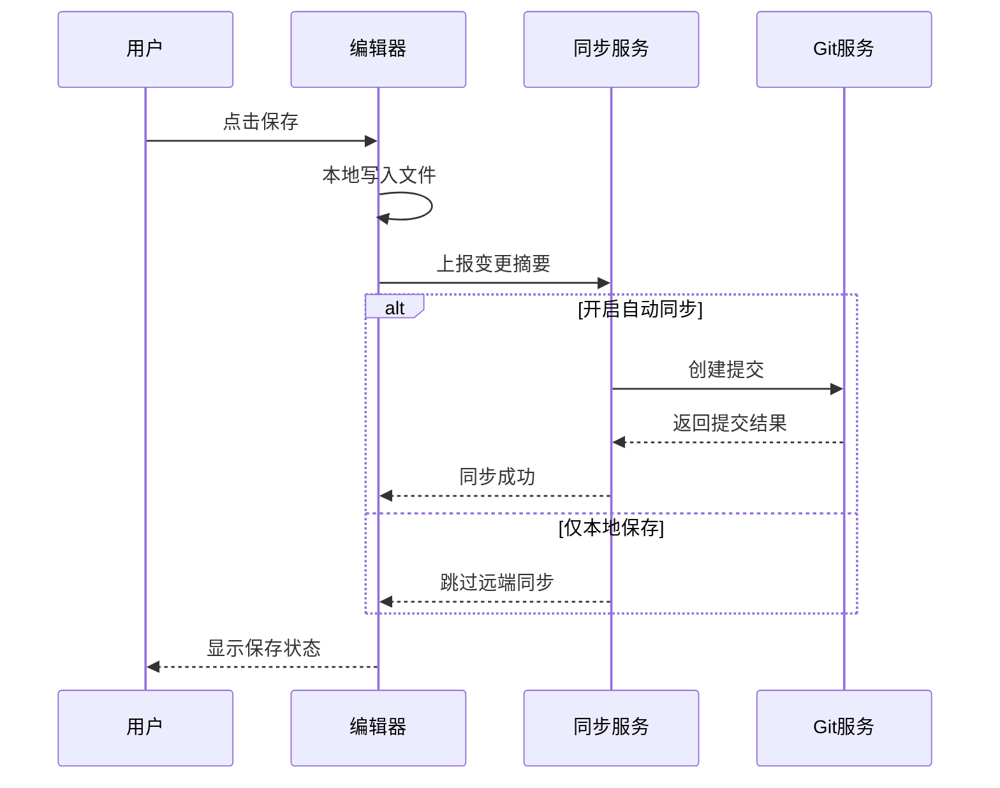

### 实战示例：带重试的 API 调用

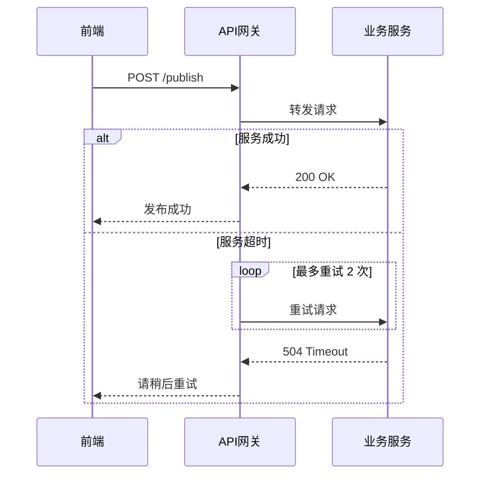

## 甘特图 Gantt Chart

适合项目计划、里程碑、阶段性任务展示。

### 最小示例

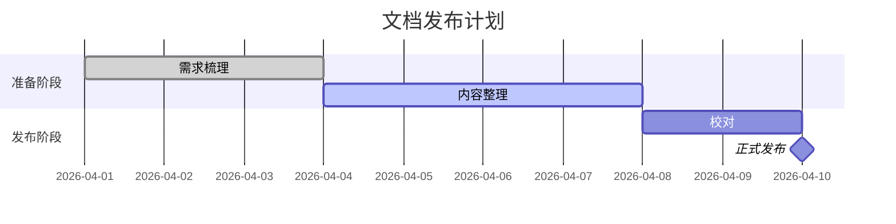

### 常见状态

- `done`：已完成
- `active`：进行中
- `crit`：关键任务
- `milestone`：里程碑

### 实战示例：版本发布计划

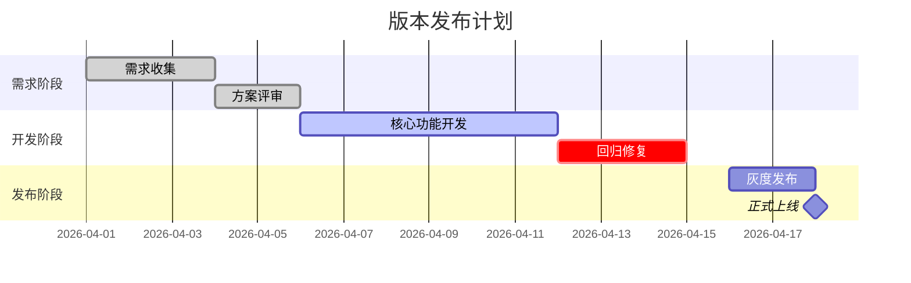

## 类图 Class Diagram

适合表达类、接口、属性、方法以及它们之间的关系。

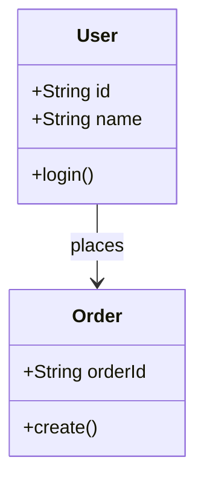

### 实战示例：编辑器与文档模型

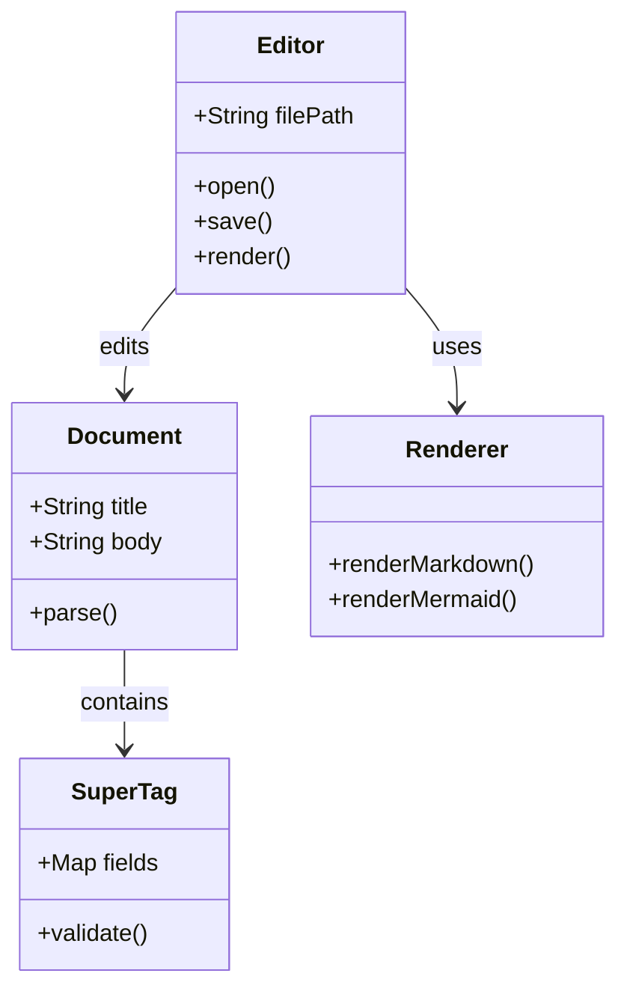

## 状态图 State Diagram

适合表达对象或流程的状态切换。

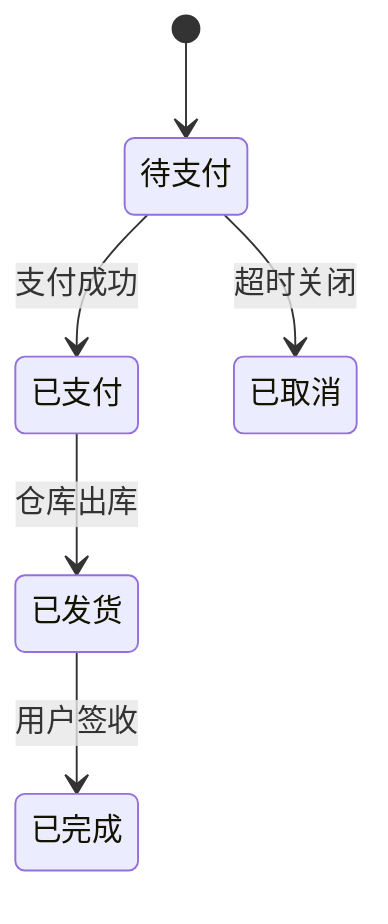

### 实战示例：内容发布状态机

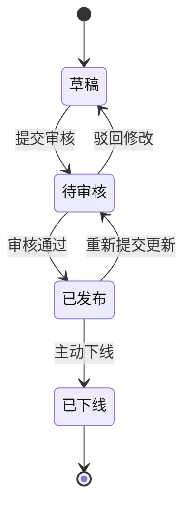

## ER 图 ER Diagram

适合数据库表关系和实体建模。

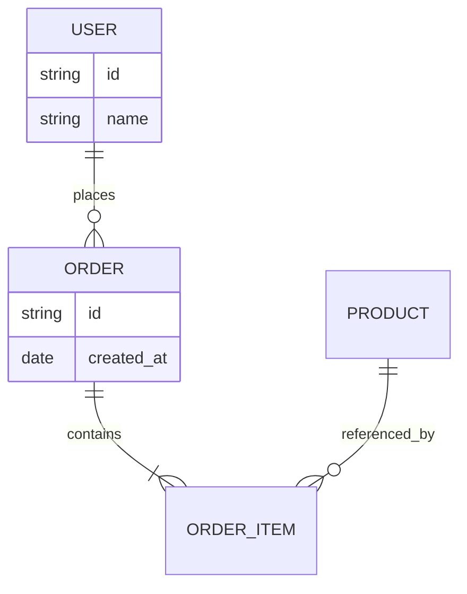

### 实战示例：权限与文档关系

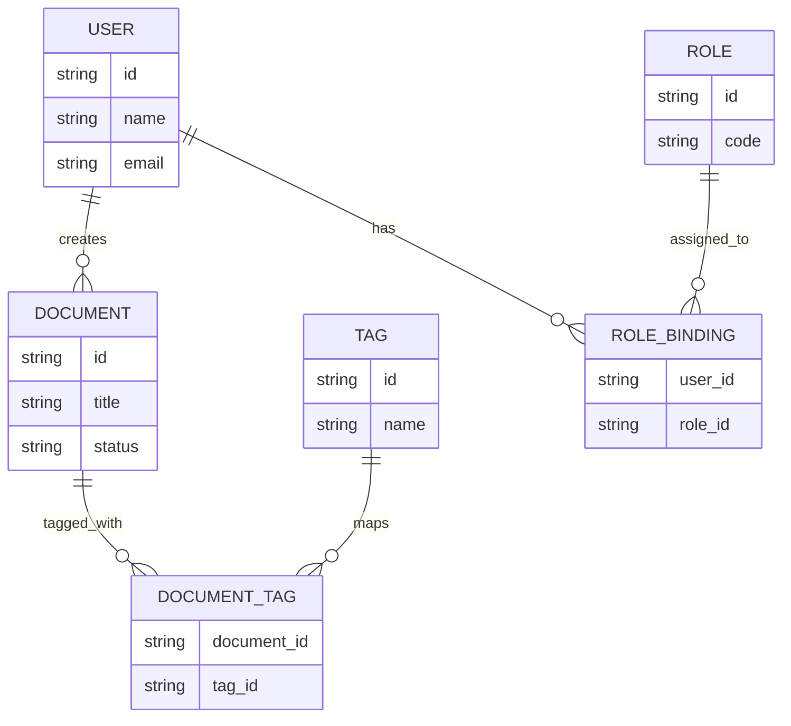

## 饼图 Pie Chart

适合展示简单占比，不适合表达复杂趋势。

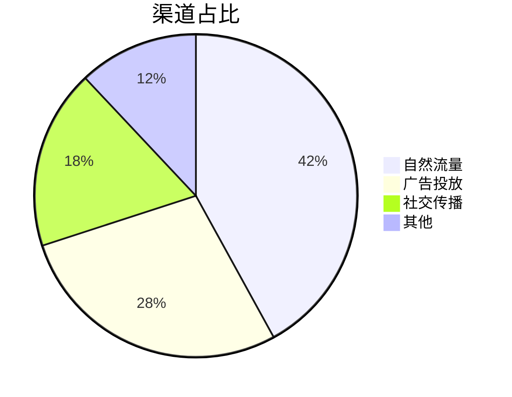

### 实战示例：文档来源分布

```mermaid
pie title 文档来源分布
    "产品文档" : 35
    "技术设计" : 25
    "教程指南" : 20
    "运营内容" : 12
    "其他" : 8
```

## Git 图 Git Graph

适合表达分支、提交和合并关系。

```mermaid
gitGraph
    commit
    branch feature/login
    checkout feature/login
    commit
    commit
    checkout main
    merge feature/login
    commit
```

### 实战示例：功能分支开发

```mermaid
gitGraph
    commit id: "init"
    branch feature/editor
    checkout feature/editor
    commit id: "editor-ui"
    commit id: "autosave"
    checkout main
    branch feature/mermaid
    checkout feature/mermaid
    commit id: "mermaid-preview"
    checkout main
    merge feature/editor
    merge feature/mermaid
    commit id: "release"
```

## Mindmap

适合脑暴、知识结构梳理和主题拆解。

```mermaid
mindmap
  root((Zditor))
    文档
      Markdown
      SuperTag
      双链
    图表
      Mermaid
      Excalidraw
    媒体
      图片
      音频
      视频
```

### 实战示例：功能规划脑图

```mermaid
mindmap
  root((编辑器规划))
    写作体验
      自动保存
      双栏预览
      快捷键
    图表能力
      Mermaid
      Excalidraw
      表格
    AI能力
      摘要
      改写
      问答
    协作能力
      评论
      历史版本
      导出分享
```

## 用户旅程图 User Journey

适合展示用户在一个完整流程中的动作、感受和接触点。

```mermaid
journey
    title 新用户首次发布文档
    section 注册阶段
      打开官网: 4: 用户
      注册账号: 3: 用户
      完成邮箱验证: 3: 用户
    section 上手阶段
      创建第一篇文档: 5: 用户
      插入 Mermaid 图: 4: 用户
      预览效果: 5: 用户
    section 发布阶段
      点击发布: 4: 用户
      获得分享链接: 5: 用户
```

## 组合示例

实际写文档时，经常不是只用一种图，而是组合使用。

### 产品需求文档的常见组合

- 用 Flowchart 讲主流程
- 用 Sequence Diagram 讲接口调用
- 用 ER Diagram 讲数据结构
- 用 Gantt Chart 讲排期

### 系统设计文档的常见组合

- 用 Class Diagram 讲模块关系
- 用 State Diagram 讲状态流转
- 用 Git Graph 讲分支策略
- 用 Mindmap 做方案拆解

## 常见问题

### 图不显示

- 确认代码块语言标记是不是 `mermaid`
- 确认图类型关键字是否正确，例如 `flowchart`、`sequenceDiagram`
- 先用最小示例确认渲染链路正常，再逐步加内容

### 图太大或太乱

- 减少节点数量
- 缩短节点文字
- 改成 `LR` 或 `TD` 试一下布局
- 拆成两张图，不要强行塞进一张

### 中文内容太长

- 节点内只保留关键词
- 详细说明放正文
- 避免一个节点里写整句业务规则

## 参考示例

仓库里已经有可直接打开的 Mermaid 示例：

- [examples/mermaid-examples/mermaid-examples.md](../examples/mermaid-examples/mermaid-examples.md)
- [guides/mermaid-guide.md](../guides/mermaid-guide.md)

!!! tip 建议用法
    先从最小示例开始，确认图表类型和结构正确，再逐步增加节点、注释和分组。Mermaid 图最怕一次写太满。

