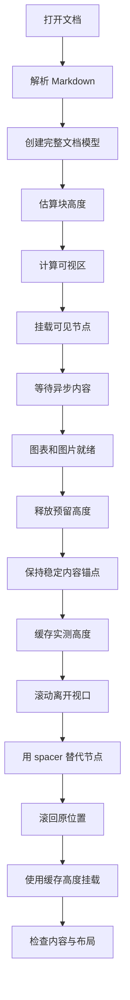
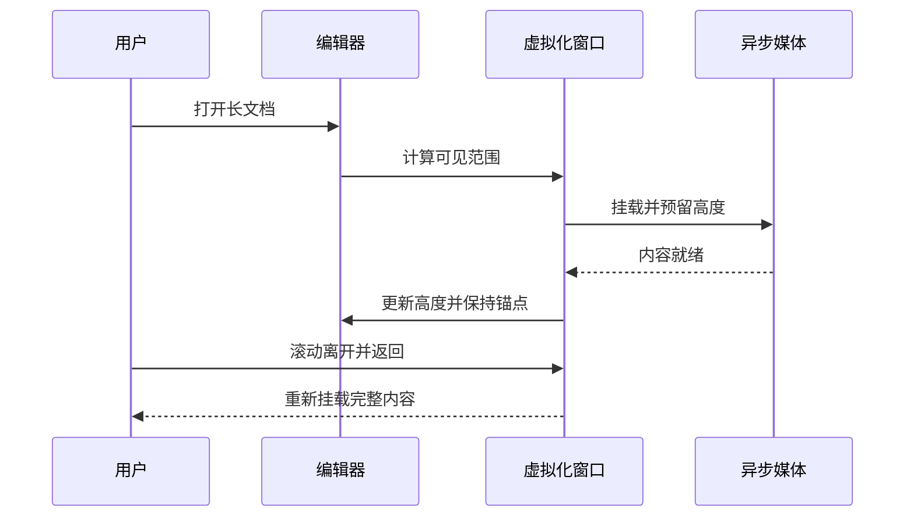
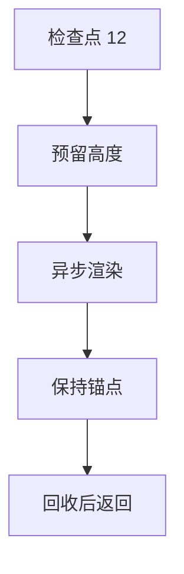
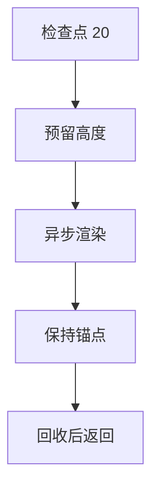
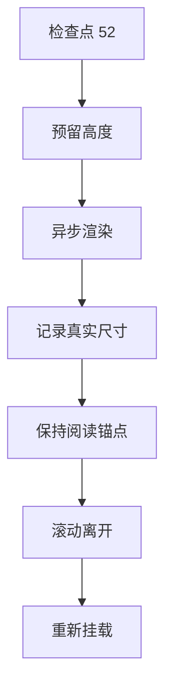
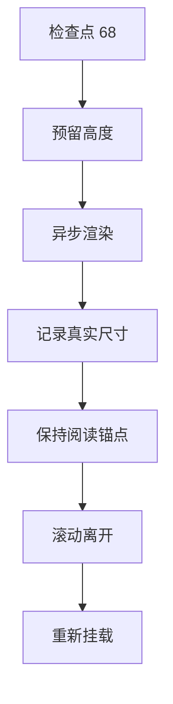

# 全节点虚拟化测试

这是一份用于 Zditor 编辑器的人工回归文档：覆盖完整可编辑预设的节点与文字标记，并把图片、视频、音频、脚注、公式、表格、图表放在不同滚动位置，方便观察 spacer 回收、重新挂载和异步高度变化。

测试素材使用当前工作区的本地文件；请在 Zditor 中直接打开本文件，不要只看普通 Markdown 预览。音视频不会自动播放。长文压力区位于文档后半段。

!!! tip 建议测试顺序
    先从顶部缓慢滚到末尾，再快速来回滚动。播放一次视频和音频；让它们离开视口后返回。最后测试全选、复制、编辑、撤销、切换文档以及调整窗口宽度。

    首次渲染图片或图表时，实际高度可能大于预估高度。重点观察稳定内容是否意外跳动，而不是把所有高度变化都当成故障。

## 1. 节点覆盖清单

|节点类型 |本文中的实际样例 |检查重点 |
|---|---|---|
|doc、paragraph、text |整篇文档及各段正文 |文档完整、编辑后不丢内容 |
|heading |一至六级标题 |跳转、层级、上下间距 |
|hardbreak、softbreak |显式换行和源码软换行 |换行显示、光标移动 |
|emoji、html_inline、math_inline、footnote_ref |行内混排 |异步内容、选择、脚注一致性 |
|blockquote、admonition |多层引用、提示与折叠块 |父子布局和展开收起 |
|bullet_list、ordered_list、list_item |多层无序和有序列表 |缩进与列表转换 |
|checkbox_list、checkbox_item |多层任务列表 |勾选状态、撤销 |
|table、tr、th、td |对齐表格与长文本单元格 |宽度、换行、行高 |
|hr、code_fence、math_display |分隔线、代码、块公式 |边界间距与异步布局 |
|image、audio、video、attachment |本地图片、MP3、MP4、文本附件 |加载、播放、重新挂载 |
|html_block、excalidraw、embed |HTML、画布文件、嵌入链接 |渲染、回收、链接回退 |
|supertag、pdf_card |本地对象引用和 PDF 卡片 |行内显示与打开文件 |

文字标记也包含：粗体、斜体、行内代码、链接、删除线、高亮和修订建议。Mermaid、HTML 预览和 Excalidraw JSON 代码块仍属于 code_fence，不是额外的 schema 节点。spacer 是虚拟化生成的临时 DOM，不应写入 Markdown。

## 2. 标题、文字和行内节点

### 三级标题：中英文混排 Typography

#### 四级标题：符号与数字 0123456789

##### 五级标题：较小标题

###### 六级标题：最小标题

普通正文包含 **粗体**、*斜体*、***粗斜体***、~~删除线~~、==高亮==、`inlineCode()` 和 [文档开头](#全节点虚拟化测试)。这是 [带建议的修订文字](排版检查|mode=revision|style=indigo|advice=检查字体与选区工具栏)。

行内节点混排：:sparkles: :rocket: :warning:，原生 Unicode 表情 😀 🧪，HTML <kbd>Ctrl</kbd> + <kbd>K</kbd>，公式 $E=mc^2$、$\alpha^2+\beta^2=\gamma^2$，以及脚注[^basic]。请拖动选区穿过这些节点。

这是软换行的第一行。
这是同一段落的第二行，用于检查 softbreak。

这是硬换行的第一行。\
这是显式硬换行的第二行，用于检查 hardbreak。

这是重复引用同一个脚注[^basic]，另一个脚注包含较长解释[^long]。再次引用不应生成重复定义，也不应在节点回收后丢失脚注内容。

混合字符：中文标点，English punctuation; Ελληνικά αβγ; 日本語テスト；العربية；é 与 é。长单词用于测试窄窗口换行：virtualization_spacer_async_layout_measurement_scroll_anchor_regression_case_0123456789。

## 3. 引用、列表与提示块

> 第一层引用包含正文、**粗体**、行内公式 $x^2+y^2=1$ 和脚注[^quote]。
>
> > 第二层引用：滚动离开后返回，父块与内部节点的高度都应保留。
>
> - 引用里的无序列表
>   - 第二层列表项目
>   - 包含 `inline code` 的项目
> - 引用后的第二个项目
>
> ```py
> values = [1, 2, 3, 4]
> result = sum(value * value for value in values)
> print(result)
> ```
>
> 引用末尾的稳定正文：观察内部代码块重新挂载时，这一行是否意外跳动。

- 第一层无序列表：正文与 :rocket:。
  - 第二层无序列表：$a+b=c$。
    - 第三层无序列表：脚注[^list]。
  - 第二层列表的后续项目。
- 无序列表中的多段项目。

  这是同一个 list_item 的第二个段落。

  ```js
  const values = [1, 2, 3];
  const total = values.reduce((sum, value) => sum + value, 0);
  console.log(total);
  ```

  代码块后的列表正文。

1. 第一个有序项目。
2. 第二个有序项目。
   1. 嵌套有序项目 A。
   2. 嵌套有序项目 B。
3. 第三个有序项目含脚注[^list]。

- [x] 已完成：确认正文显示正常。
- [ ] 未完成：快速滚动后检查图片与媒体。
  - [x] 嵌套已完成项目。
  - [ ] 嵌套未完成项目。
- [ ] 切换状态后撤销，再离开视口并返回。

!!! note 普通提示块
    提示正文包含 **粗体**、$\sqrt{2}$ 和脚注[^admonition]。

    - 提示里的列表项目 A。
    - 提示里的列表项目 B。

!!! warning 较长提示块
    这里不是编辑器报警，而是 admonition 节点的显示样例。拖动整个块、缩窄窗口，再检查文字换行和上下间距。

    ```ts
    type LayoutSample = { height: number; mounted: boolean };
    const sample: LayoutSample = { height: 320, mounted: true };
    console.log(sample);
    ```

??? tip 默认折叠的提示块
    请展开本块、滚动离开、再返回。折叠状态与后续内容位置应保持一致。

    

    这是图片下面的稳定文字。

## 4. 表格与块公式

|左对齐 |居中 |右对齐 |
|:---|:---:|---:|
|普通文字 |**粗体** 与 *斜体* |123 |
|行内公式 $a^2+b^2=c^2$ |:sparkles: 与 `code` |456.78 |
|脚注[^table] 和 [本地文档](README_zh.md) |==高亮== |-90 |
|很长的中文单元格，用于观察窗口缩窄时的自动换行和整行高度变化，不能遮住下一行。 |长单词 spreadsheet_virtualization_boundary_test |1000000 |

表格前后的正文不应因 table NodeView 回收而突然改变间距。

$$
\int_{-\infty}^{\infty} e^{-x^2}\,dx=\sqrt{\pi}
$$

$$
\begin{aligned}
\mathcal{L}(\theta)&=\frac{1}{N}\sum_{i=1}^{N}(f_\theta(x_i)-y_i)^2\\
\nabla_\theta\mathcal{L}&=\frac{2}{N}\sum_{i=1}^{N}(f_\theta(x_i)-y_i)\nabla_\theta f_\theta(x_i)
\end{aligned}
$$

$$
\begin{bmatrix}1&2&3\\4&5&6\\7&8&9\end{bmatrix}
\begin{bmatrix}x\\y\\z\end{bmatrix}
=\begin{bmatrix}x+2y+3z\\4x+5y+6z\\7x+8y+9z\end{bmatrix}
$$


---

## 5. 普通代码与渲染型代码块

```ts
type BlockState = { id: string; height: number; mounted: boolean };
const blocks: BlockState[] = [
  { id: "paragraph", height: 48, mounted: true },
  { id: "image", height: 320, mounted: false },
];
const mounted = blocks.filter(block => block.mounted);
console.log(mounted);
```

```json
{
  "document": "全节点虚拟化测试",
  "checks": ["spacer", "scroll-anchor", "node-remount"],
  "audio": true,
  "video": true,
  "footnotes": true
}
```

```text
纯文本代码块。
包含中文、English、空格和数字 0123456789。
这是第三行。
```

### 高图表：首次真实高度明显大于预估值



这是高图表下面的稳定正文。首次渲染允许图表变高，但不应把用户正在阅读的后续内容推走。反复回收后，应复用实测高度。



```html
<section style="padding:24px;border:2px solid #4f46e5;border-radius:12px;min-height:180px;background:#eef2ff;color:#1e1b4b">
  <h2>HTML 代码块预览</h2>
  <p>用于测试渲染模式、代码模式切换，以及离开视口后的重新挂载。</p>
  <div style="display:flex;gap:12px"><strong>左侧内容</strong><span>右侧内容</span></div>
</section>
```

```excalidraw
{"type":"excalidraw","version":2,"source":"zditor-local-test","elements":[{"id":"inline-scene-box","type":"rectangle","x":40,"y":40,"width":360,"height":180,"angle":0,"strokeColor":"#1971c2","backgroundColor":"#d0ebff","fillStyle":"solid","strokeWidth":2,"strokeStyle":"solid","roughness":1,"opacity":100,"groupIds":[],"frameId":null,"roundness":{"type":3},"seed":1741,"version":1,"versionNonce":9142,"isDeleted":false,"boundElements":null,"updated":1,"link":null,"locked":false}],"appState":{"viewBackgroundColor":"#ffffff"},"files":{}}
```

## 6. HTML 块和行内 HTML

<div style="padding:20px;border:2px solid #0f766e;border-radius:12px;background:#f0fdfa;color:#134e4a">
  <h3>真正的 html_block 节点</h3>
  <p>这不是 HTML 代码围栏。请检查滚动回收、文字选择以及内部样式隔离。</p>
  <details><summary>展开 HTML 内部内容</summary><p>展开后会改变实际高度。这段内容应完整显示，后续正文应保持合理位置。</p></details>
</div>

行内 HTML：<kbd>Shift</kbd> + <kbd>Enter</kbd>，<span style="color:#c2410c;font-weight:700">彩色行内文字</span>，<sup>上标</sup> 与 <sub>下标</sub>。

## 7. 图片、音频和视频

### 大图与较小图片


大图下面的稳定文字。等待图片加载后改变窗口宽度，再滚动离开并返回。


### 音频：真实本地 MP3

[本地音频：Zditor 开篇](assets/audio/zditor/zh/zh_01_kaipian.mp3|mode=audio)

[同一音频：带测试转录文本](assets/audio/zditor/zh/zh_01_kaipian.mp3|mode=audio|transcript=这是一段用于测试转录区显示的样例文字，并非音频的逐字转录。)

请检查播放、暂停、进度条、转录显示；播放期间滚动离开再返回，记录播放状态的实际行为，不预先假设必须继续播放。

### 视频：本地测试图案和低音量提示音

[本地视频：六秒动态图案](assets/virtualization-test/test-video.mp4|mode=video)

视频不会自动播放。请检查封面区域、时长、播放、暂停、拖动进度、全屏，以及回收后重新挂载。视频下面这段文字是用于观察锚点的稳定正文。

## 8. 附件、画布、对象和 PDF 卡片

[本地文本附件](assets/virtualization-test/attachment.txt|mode=attachment|size=256)

[本地 Excalidraw 画布文件](assets/virtualization-test/scene.excalidraw|mode=excalidraw)

行内对象引用：[测试项目](assets/virtualization-test/object.md|mode=supertag)。后面仍然是同一段正文，用于检查对象前后光标与选区。

行内 PDF 卡片：[本地 PDF 论文](assets/papers/attention.pdf|mode=pdf_card|highlight=)。请点击打开 PDF，再返回本文检查滚动位置。

### embed 节点的离线回退视图

[本地嵌入样例](assets/virtualization-test/embed.html|mode=embed)

这个链接会生成 embed 节点。由于本地 HTML 路径不匹配在线嵌入提供方，预期显示链接回退视图，而不是在线 iframe。该样例用于测试 embed 节点本身、工具栏与回收，不验证第三方网站的网络加载。

## 9. 容器内的异步节点

> 引用内的图片：父 blockquote 被回收时，图片实测尺寸应保留。
>
> 


> 
> [引用内的音频](assets/audio/zditor/zh/zh_01_kaipian.mp3|mode=audio)


> 
> [引用内的视频](assets/virtualization-test/test-video.mp4|mode=video)


> ```mermaid
> flowchart TD
>   A[引用开始] --> B[异步图表]
>   B --> C[父块回收]
>   C --> D[重新挂载]
>   D --> E[引用末尾]
> ```
>
> 这是容器内异步节点之后的稳定正文。

- 列表中的媒体项目。

  

  [列表内的音频](assets/audio/zditor/zh/zh_01_kaipian.mp3|mode=audio)

  列表内媒体之后的文字与脚注[^nested]。
- 下一个列表项目不应覆盖上一个项目。

!!! tip 提示块里的媒体和表格
    
    [提示里的视频](assets/virtualization-test/test-video.mp4|mode=video)


```text
|项目 |预期 |
|---|---|
|父块回收 |内部节点重新显示 |
|子块变高 |后续稳定内容不意外跳动 |

提示块末尾的稳定文字。
```

## 10. 人工回归检查表

- [ ] 慢速滚动到末尾，无持续空白占位。
- [ ] 快速来回滚动，节点出现后内容完整。
- [ ] 图片、图表、公式首次加载后，稳定内容不意外跳动。
- [ ] 顶层与引用、列表、提示块内部的媒体都正常显示。
- [ ] 音视频控件可操作，离开视口后返回不产生重复控件。
- [ ] 点击同一个脚注的多次引用，内容保持一致。
- [ ] 全选与复制不会把整个长文的复杂 NodeView 全部挂载。
- [ ] 修改正文、代码、表格和任务状态后，撤销与重做正常。
- [ ] 收窄窗口，再恢复宽度，内容无覆盖或裁切。
- [ ] 切换到其他文档再返回，内容与滚动位置符合应用行为。
- [ ] 保存、关闭、重新打开后，节点和脚注不丢失。

## 11. 长文压力滚动区

下面的重复样例用于制造足够多的顶层块，交替覆盖普通文本、复杂节点与媒体。可以按标题跳转到不同轮次，再快速滚回顶部。

### 滚动检查点 01

检查点 01：这是一段用于识别滚动位置的稳定正文，包含 **粗体**、==高亮==、:sparkles:、行内公式 $x_{1}^2+y_{1}^2=1$ 和共享脚注[^stress]。请记住这一行，观察附近异步节点完成渲染时它是否意外跳动。

第二段长文本：中文与 English 混排，用于测试窄窗口换行、段落间距以及离开视口后的重新挂载。中文与 English 混排，用于测试窄窗口换行、段落间距以及离开视口后的重新挂载。中文与 English 混排，用于测试窄窗口换行、段落间距以及离开视口后的重新挂载。中文与 English 混排，用于测试窄窗口换行、段落间距以及离开视口后的重新挂载。

> 检查点 01 的引用块。
>
> - 容器内部项目 A，包含公式 $\frac{1}{2}$。
> - 容器内部项目 B，包含脚注[^stress]。
>
> 引用末尾的稳定文字。

- [ ] 检查点 01：勾选后离开视口。
- [x] 检查点 01：返回后检查状态。

|检查点 |内容 |数值 |
|:---|:---:|---:|
|01-A |行内公式 $a+b=1$ |10 |
|01-B |长文本单元格用于观察行高变化，不能覆盖后续内容。 |100 |

```js
const checkpoint = 1;
const samples = Array.from({ length: 5 }, (_, sampleIndex) => checkpoint + sampleIndex);
console.log(samples);
```

$$
\sum_{k=1}^{4} k=\frac{(4)(5)}{2}
$$


检查点 01 的结束标记。媒体、图表、公式或 HTML 变高时，这一段不应发生未补偿的意外跳动。


---

### 滚动检查点 02

检查点 02：这是一段用于识别滚动位置的稳定正文，包含 **粗体**、==高亮==、:sparkles:、行内公式 $x_{2}^2+y_{2}^2=2$ 和共享脚注[^stress]。请记住这一行，观察附近异步节点完成渲染时它是否意外跳动。

第二段长文本：中文与 English 混排，用于测试窄窗口换行、段落间距以及离开视口后的重新挂载。中文与 English 混排，用于测试窄窗口换行、段落间距以及离开视口后的重新挂载。中文与 English 混排，用于测试窄窗口换行、段落间距以及离开视口后的重新挂载。中文与 English 混排，用于测试窄窗口换行、段落间距以及离开视口后的重新挂载。

> 检查点 02 的引用块。
>
> - 容器内部项目 A，包含公式 $\frac{2}{3}$。
> - 容器内部项目 B，包含脚注[^stress]。
>
> 引用末尾的稳定文字。

- [ ] 检查点 02：勾选后离开视口。
- [x] 检查点 02：返回后检查状态。

|检查点 |内容 |数值 |
|:---|:---:|---:|
|02-A |行内公式 $a+b=2$ |20 |
|02-B |长文本单元格用于观察行高变化，不能覆盖后续内容。 |200 |

```js
const checkpoint = 2;
const samples = Array.from({ length: 5 }, (_, sampleIndex) => checkpoint + sampleIndex);
console.log(samples);
```

$$
\sum_{k=1}^{5} k=\frac{(5)(6)}{2}
$$

[检查点 02 的音频](assets/audio/zditor/zh/zh_01_kaipian.mp3|mode=audio)

检查点 02 的结束标记。媒体、图表、公式或 HTML 变高时，这一段不应发生未补偿的意外跳动。


---

### 滚动检查点 03

检查点 03：这是一段用于识别滚动位置的稳定正文，包含 **粗体**、==高亮==、:sparkles:、行内公式 $x_{3}^2+y_{3}^2=3$ 和共享脚注[^stress]。请记住这一行，观察附近异步节点完成渲染时它是否意外跳动。

第二段长文本：中文与 English 混排，用于测试窄窗口换行、段落间距以及离开视口后的重新挂载。中文与 English 混排，用于测试窄窗口换行、段落间距以及离开视口后的重新挂载。中文与 English 混排，用于测试窄窗口换行、段落间距以及离开视口后的重新挂载。中文与 English 混排，用于测试窄窗口换行、段落间距以及离开视口后的重新挂载。

> 检查点 03 的引用块。
>
> - 容器内部项目 A，包含公式 $\frac{3}{4}$。
> - 容器内部项目 B，包含脚注[^stress]。
>
> 引用末尾的稳定文字。

- [ ] 检查点 03：勾选后离开视口。
- [x] 检查点 03：返回后检查状态。

|检查点 |内容 |数值 |
|:---|:---:|---:|
|03-A |行内公式 $a+b=3$ |30 |
|03-B |长文本单元格用于观察行高变化，不能覆盖后续内容。 |300 |

```js
const checkpoint = 3;
const samples = Array.from({ length: 5 }, (_, sampleIndex) => checkpoint + sampleIndex);
console.log(samples);
```

$$
\sum_{k=1}^{6} k=\frac{(6)(7)}{2}
$$

[检查点 03 的视频](assets/virtualization-test/test-video.mp4|mode=video)

检查点 03 的结束标记。媒体、图表、公式或 HTML 变高时，这一段不应发生未补偿的意外跳动。


---

### 滚动检查点 04

检查点 04：这是一段用于识别滚动位置的稳定正文，包含 **粗体**、==高亮==、:sparkles:、行内公式 $x_{4}^2+y_{4}^2=4$ 和共享脚注[^stress]。请记住这一行，观察附近异步节点完成渲染时它是否意外跳动。

第二段长文本：中文与 English 混排，用于测试窄窗口换行、段落间距以及离开视口后的重新挂载。中文与 English 混排，用于测试窄窗口换行、段落间距以及离开视口后的重新挂载。中文与 English 混排，用于测试窄窗口换行、段落间距以及离开视口后的重新挂载。中文与 English 混排，用于测试窄窗口换行、段落间距以及离开视口后的重新挂载。

> 检查点 04 的引用块。
>
> - 容器内部项目 A，包含公式 $\frac{4}{5}$。
> - 容器内部项目 B，包含脚注[^stress]。
>
> 引用末尾的稳定文字。

- [ ] 检查点 04：勾选后离开视口。
- [x] 检查点 04：返回后检查状态。

|检查点 |内容 |数值 |
|:---|:---:|---:|
|04-A |行内公式 $a+b=4$ |40 |
|04-B |长文本单元格用于观察行高变化，不能覆盖后续内容。 |400 |

```js
const checkpoint = 4;
const samples = Array.from({ length: 5 }, (_, sampleIndex) => checkpoint + sampleIndex);
console.log(samples);
```

$$
\sum_{k=1}^{7} k=\frac{(7)(8)}{2}
$$


检查点 04 的结束标记。媒体、图表、公式或 HTML 变高时，这一段不应发生未补偿的意外跳动。


---

### 滚动检查点 05

检查点 05：这是一段用于识别滚动位置的稳定正文，包含 **粗体**、==高亮==、:sparkles:、行内公式 $x_{5}^2+y_{5}^2=5$ 和共享脚注[^stress]。请记住这一行，观察附近异步节点完成渲染时它是否意外跳动。

第二段长文本：中文与 English 混排，用于测试窄窗口换行、段落间距以及离开视口后的重新挂载。中文与 English 混排，用于测试窄窗口换行、段落间距以及离开视口后的重新挂载。中文与 English 混排，用于测试窄窗口换行、段落间距以及离开视口后的重新挂载。中文与 English 混排，用于测试窄窗口换行、段落间距以及离开视口后的重新挂载。

> 检查点 05 的引用块。
>
> - 容器内部项目 A，包含公式 $\frac{5}{6}$。
> - 容器内部项目 B，包含脚注[^stress]。
>
> 引用末尾的稳定文字。

- [ ] 检查点 05：勾选后离开视口。
- [x] 检查点 05：返回后检查状态。

|检查点 |内容 |数值 |
|:---|:---:|---:|
|05-A |行内公式 $a+b=5$ |50 |
|05-B |长文本单元格用于观察行高变化，不能覆盖后续内容。 |500 |

```js
const checkpoint = 5;
const samples = Array.from({ length: 5 }, (_, sampleIndex) => checkpoint + sampleIndex);
console.log(samples);
```

$$
\sum_{k=1}^{8} k=\frac{(8)(9)}{2}
$$

<div style="padding:24px;min-height:175px;border:2px solid #7c3aed;border-radius:12px;background:#f5f3ff;color:#4c1d95"><h3>检查点 05 的 HTML 块</h3><p>回收后应重新显示完整内容。</p></div>

检查点 05 的结束标记。媒体、图表、公式或 HTML 变高时，这一段不应发生未补偿的意外跳动。


---

### 滚动检查点 06

检查点 06：这是一段用于识别滚动位置的稳定正文，包含 **粗体**、==高亮==、:sparkles:、行内公式 $x_{6}^2+y_{6}^2=6$ 和共享脚注[^stress]。请记住这一行，观察附近异步节点完成渲染时它是否意外跳动。

第二段长文本：中文与 English 混排，用于测试窄窗口换行、段落间距以及离开视口后的重新挂载。中文与 English 混排，用于测试窄窗口换行、段落间距以及离开视口后的重新挂载。中文与 English 混排，用于测试窄窗口换行、段落间距以及离开视口后的重新挂载。中文与 English 混排，用于测试窄窗口换行、段落间距以及离开视口后的重新挂载。

> 检查点 06 的引用块。
>
> - 容器内部项目 A，包含公式 $\frac{6}{7}$。
> - 容器内部项目 B，包含脚注[^stress]。
>
> 引用末尾的稳定文字。

- [ ] 检查点 06：勾选后离开视口。
- [x] 检查点 06：返回后检查状态。

|检查点 |内容 |数值 |
|:---|:---:|---:|
|06-A |行内公式 $a+b=6$ |60 |
|06-B |长文本单元格用于观察行高变化，不能覆盖后续内容。 |600 |

```js
const checkpoint = 6;
const samples = Array.from({ length: 5 }, (_, sampleIndex) => checkpoint + sampleIndex);
console.log(samples);
```

$$
\sum_{k=1}^{9} k=\frac{(9)(10)}{2}
$$

[检查点 06 的 Excalidraw](assets/virtualization-test/scene.excalidraw|mode=excalidraw)

检查点 06 的结束标记。媒体、图表、公式或 HTML 变高时，这一段不应发生未补偿的意外跳动。


---

### 滚动检查点 07

检查点 07：这是一段用于识别滚动位置的稳定正文，包含 **粗体**、==高亮==、:sparkles:、行内公式 $x_{7}^2+y_{7}^2=7$ 和共享脚注[^stress]。请记住这一行，观察附近异步节点完成渲染时它是否意外跳动。

第二段长文本：中文与 English 混排，用于测试窄窗口换行、段落间距以及离开视口后的重新挂载。中文与 English 混排，用于测试窄窗口换行、段落间距以及离开视口后的重新挂载。中文与 English 混排，用于测试窄窗口换行、段落间距以及离开视口后的重新挂载。中文与 English 混排，用于测试窄窗口换行、段落间距以及离开视口后的重新挂载。

> 检查点 07 的引用块。
>
> - 容器内部项目 A，包含公式 $\frac{7}{8}$。
> - 容器内部项目 B，包含脚注[^stress]。
>
> 引用末尾的稳定文字。

- [ ] 检查点 07：勾选后离开视口。
- [x] 检查点 07：返回后检查状态。

|检查点 |内容 |数值 |
|:---|:---:|---:|
|07-A |行内公式 $a+b=7$ |70 |
|07-B |长文本单元格用于观察行高变化，不能覆盖后续内容。 |700 |

```js
const checkpoint = 7;
const samples = Array.from({ length: 5 }, (_, sampleIndex) => checkpoint + sampleIndex);
console.log(samples);
```

$$
\sum_{k=1}^{10} k=\frac{(10)(11)}{2}
$$

对象：[测试项目 07](assets/virtualization-test/object.md|mode=supertag)。PDF：[论文 07](assets/papers/attention.pdf|mode=pdf_card|highlight=)。

[检查点 07 的附件](assets/virtualization-test/attachment.txt|mode=attachment|size=256)

检查点 07 的结束标记。媒体、图表、公式或 HTML 变高时，这一段不应发生未补偿的意外跳动。


---

### 滚动检查点 08

检查点 08：这是一段用于识别滚动位置的稳定正文，包含 **粗体**、==高亮==、:sparkles:、行内公式 $x_{8}^2+y_{8}^2=8$ 和共享脚注[^stress]。请记住这一行，观察附近异步节点完成渲染时它是否意外跳动。

第二段长文本：中文与 English 混排，用于测试窄窗口换行、段落间距以及离开视口后的重新挂载。中文与 English 混排，用于测试窄窗口换行、段落间距以及离开视口后的重新挂载。中文与 English 混排，用于测试窄窗口换行、段落间距以及离开视口后的重新挂载。中文与 English 混排，用于测试窄窗口换行、段落间距以及离开视口后的重新挂载。

> 检查点 08 的引用块。
>
> - 容器内部项目 A，包含公式 $\frac{8}{9}$。
> - 容器内部项目 B，包含脚注[^stress]。
>
> 引用末尾的稳定文字。

- [ ] 检查点 08：勾选后离开视口。
- [x] 检查点 08：返回后检查状态。

|检查点 |内容 |数值 |
|:---|:---:|---:|
|08-A |行内公式 $a+b=8$ |80 |
|08-B |长文本单元格用于观察行高变化，不能覆盖后续内容。 |800 |

```js
const checkpoint = 8;
const samples = Array.from({ length: 5 }, (_, sampleIndex) => checkpoint + sampleIndex);
console.log(samples);
```

$$
\sum_{k=1}^{11} k=\frac{(11)(12)}{2}
$$

??? note 检查点 08 的提示块
    提示正文包含公式 $\sqrt{8}$ 和脚注[^stress]。

    

    这是图片下面的稳定文字。

[检查点 08 的 embed 回退](assets/virtualization-test/embed.html|mode=embed)

检查点 08 的结束标记。媒体、图表、公式或 HTML 变高时，这一段不应发生未补偿的意外跳动。


---

### 滚动检查点 09

检查点 09：这是一段用于识别滚动位置的稳定正文，包含 **粗体**、==高亮==、:sparkles:、行内公式 $x_{9}^2+y_{9}^2=9$ 和共享脚注[^stress]。请记住这一行，观察附近异步节点完成渲染时它是否意外跳动。

第二段长文本：中文与 English 混排，用于测试窄窗口换行、段落间距以及离开视口后的重新挂载。中文与 English 混排，用于测试窄窗口换行、段落间距以及离开视口后的重新挂载。中文与 English 混排，用于测试窄窗口换行、段落间距以及离开视口后的重新挂载。中文与 English 混排，用于测试窄窗口换行、段落间距以及离开视口后的重新挂载。

> 检查点 09 的引用块。
>
> - 容器内部项目 A，包含公式 $\frac{9}{10}$。
> - 容器内部项目 B，包含脚注[^stress]。
>
> 引用末尾的稳定文字。

- [ ] 检查点 09：勾选后离开视口。
- [x] 检查点 09：返回后检查状态。

|检查点 |内容 |数值 |
|:---|:---:|---:|
|09-A |行内公式 $a+b=9$ |90 |
|09-B |长文本单元格用于观察行高变化，不能覆盖后续内容。 |900 |

```js
const checkpoint = 9;
const samples = Array.from({ length: 5 }, (_, sampleIndex) => checkpoint + sampleIndex);
console.log(samples);
```

$$
\sum_{k=1}^{12} k=\frac{(12)(13)}{2}
$$


检查点 09 的结束标记。媒体、图表、公式或 HTML 变高时，这一段不应发生未补偿的意外跳动。


---

### 滚动检查点 10

检查点 10：这是一段用于识别滚动位置的稳定正文，包含 **粗体**、==高亮==、:sparkles:、行内公式 $x_{10}^2+y_{10}^2=10$ 和共享脚注[^stress]。请记住这一行，观察附近异步节点完成渲染时它是否意外跳动。

第二段长文本：中文与 English 混排，用于测试窄窗口换行、段落间距以及离开视口后的重新挂载。中文与 English 混排，用于测试窄窗口换行、段落间距以及离开视口后的重新挂载。中文与 English 混排，用于测试窄窗口换行、段落间距以及离开视口后的重新挂载。中文与 English 混排，用于测试窄窗口换行、段落间距以及离开视口后的重新挂载。

> 检查点 10 的引用块。
>
> - 容器内部项目 A，包含公式 $\frac{10}{11}$。
> - 容器内部项目 B，包含脚注[^stress]。
>
> 引用末尾的稳定文字。

- [ ] 检查点 10：勾选后离开视口。
- [x] 检查点 10：返回后检查状态。

|检查点 |内容 |数值 |
|:---|:---:|---:|
|10-A |行内公式 $a+b=10$ |100 |
|10-B |长文本单元格用于观察行高变化，不能覆盖后续内容。 |1000 |

```js
const checkpoint = 10;
const samples = Array.from({ length: 5 }, (_, sampleIndex) => checkpoint + sampleIndex);
console.log(samples);
```

$$
\sum_{k=1}^{13} k=\frac{(13)(14)}{2}
$$

[检查点 10 的音频](assets/audio/zditor/zh/zh_01_kaipian.mp3|mode=audio)

检查点 10 的结束标记。媒体、图表、公式或 HTML 变高时，这一段不应发生未补偿的意外跳动。


---

### 滚动检查点 11

检查点 11：这是一段用于识别滚动位置的稳定正文，包含 **粗体**、==高亮==、:sparkles:、行内公式 $x_{11}^2+y_{11}^2=11$ 和共享脚注[^stress]。请记住这一行，观察附近异步节点完成渲染时它是否意外跳动。

第二段长文本：中文与 English 混排，用于测试窄窗口换行、段落间距以及离开视口后的重新挂载。中文与 English 混排，用于测试窄窗口换行、段落间距以及离开视口后的重新挂载。中文与 English 混排，用于测试窄窗口换行、段落间距以及离开视口后的重新挂载。中文与 English 混排，用于测试窄窗口换行、段落间距以及离开视口后的重新挂载。

> 检查点 11 的引用块。
>
> - 容器内部项目 A，包含公式 $\frac{11}{12}$。
> - 容器内部项目 B，包含脚注[^stress]。
>
> 引用末尾的稳定文字。

- [ ] 检查点 11：勾选后离开视口。
- [x] 检查点 11：返回后检查状态。

|检查点 |内容 |数值 |
|:---|:---:|---:|
|11-A |行内公式 $a+b=11$ |110 |
|11-B |长文本单元格用于观察行高变化，不能覆盖后续内容。 |1100 |

```js
const checkpoint = 11;
const samples = Array.from({ length: 5 }, (_, sampleIndex) => checkpoint + sampleIndex);
console.log(samples);
```

$$
\sum_{k=1}^{14} k=\frac{(14)(15)}{2}
$$

[检查点 11 的视频](assets/virtualization-test/test-video.mp4|mode=video)

检查点 11 的结束标记。媒体、图表、公式或 HTML 变高时，这一段不应发生未补偿的意外跳动。


---

### 滚动检查点 12

检查点 12：这是一段用于识别滚动位置的稳定正文，包含 **粗体**、==高亮==、:sparkles:、行内公式 $x_{12}^2+y_{12}^2=12$ 和共享脚注[^stress]。请记住这一行，观察附近异步节点完成渲染时它是否意外跳动。

第二段长文本：中文与 English 混排，用于测试窄窗口换行、段落间距以及离开视口后的重新挂载。中文与 English 混排，用于测试窄窗口换行、段落间距以及离开视口后的重新挂载。中文与 English 混排，用于测试窄窗口换行、段落间距以及离开视口后的重新挂载。中文与 English 混排，用于测试窄窗口换行、段落间距以及离开视口后的重新挂载。

> 检查点 12 的引用块。
>
> - 容器内部项目 A，包含公式 $\frac{12}{13}$。
> - 容器内部项目 B，包含脚注[^stress]。
>
> 引用末尾的稳定文字。

- [ ] 检查点 12：勾选后离开视口。
- [x] 检查点 12：返回后检查状态。

|检查点 |内容 |数值 |
|:---|:---:|---:|
|12-A |行内公式 $a+b=12$ |120 |
|12-B |长文本单元格用于观察行高变化，不能覆盖后续内容。 |1200 |

```js
const checkpoint = 12;
const samples = Array.from({ length: 5 }, (_, sampleIndex) => checkpoint + sampleIndex);
console.log(samples);
```

$$
\sum_{k=1}^{15} k=\frac{(15)(16)}{2}
$$



检查点 12 的结束标记。媒体、图表、公式或 HTML 变高时，这一段不应发生未补偿的意外跳动。


---

### 滚动检查点 13

检查点 13：这是一段用于识别滚动位置的稳定正文，包含 **粗体**、==高亮==、:sparkles:、行内公式 $x_{13}^2+y_{13}^2=13$ 和共享脚注[^stress]。请记住这一行，观察附近异步节点完成渲染时它是否意外跳动。

第二段长文本：中文与 English 混排，用于测试窄窗口换行、段落间距以及离开视口后的重新挂载。中文与 English 混排，用于测试窄窗口换行、段落间距以及离开视口后的重新挂载。中文与 English 混排，用于测试窄窗口换行、段落间距以及离开视口后的重新挂载。中文与 English 混排，用于测试窄窗口换行、段落间距以及离开视口后的重新挂载。

> 检查点 13 的引用块。
>
> - 容器内部项目 A，包含公式 $\frac{13}{14}$。
> - 容器内部项目 B，包含脚注[^stress]。
>
> 引用末尾的稳定文字。

- [ ] 检查点 13：勾选后离开视口。
- [x] 检查点 13：返回后检查状态。

|检查点 |内容 |数值 |
|:---|:---:|---:|
|13-A |行内公式 $a+b=13$ |130 |
|13-B |长文本单元格用于观察行高变化，不能覆盖后续内容。 |1300 |

```js
const checkpoint = 13;
const samples = Array.from({ length: 5 }, (_, sampleIndex) => checkpoint + sampleIndex);
console.log(samples);
```

$$
\sum_{k=1}^{16} k=\frac{(16)(17)}{2}
$$

<div style="padding:24px;min-height:199px;border:2px solid #7c3aed;border-radius:12px;background:#f5f3ff;color:#4c1d95"><h3>检查点 13 的 HTML 块</h3><p>回收后应重新显示完整内容。</p></div>

检查点 13 的结束标记。媒体、图表、公式或 HTML 变高时，这一段不应发生未补偿的意外跳动。


---

### 滚动检查点 14

检查点 14：这是一段用于识别滚动位置的稳定正文，包含 **粗体**、==高亮==、:sparkles:、行内公式 $x_{14}^2+y_{14}^2=14$ 和共享脚注[^stress]。请记住这一行，观察附近异步节点完成渲染时它是否意外跳动。

第二段长文本：中文与 English 混排，用于测试窄窗口换行、段落间距以及离开视口后的重新挂载。中文与 English 混排，用于测试窄窗口换行、段落间距以及离开视口后的重新挂载。中文与 English 混排，用于测试窄窗口换行、段落间距以及离开视口后的重新挂载。中文与 English 混排，用于测试窄窗口换行、段落间距以及离开视口后的重新挂载。

> 检查点 14 的引用块。
>
> - 容器内部项目 A，包含公式 $\frac{14}{15}$。
> - 容器内部项目 B，包含脚注[^stress]。
>
> 引用末尾的稳定文字。

- [ ] 检查点 14：勾选后离开视口。
- [x] 检查点 14：返回后检查状态。

|检查点 |内容 |数值 |
|:---|:---:|---:|
|14-A |行内公式 $a+b=14$ |140 |
|14-B |长文本单元格用于观察行高变化，不能覆盖后续内容。 |1400 |

```js
const checkpoint = 14;
const samples = Array.from({ length: 5 }, (_, sampleIndex) => checkpoint + sampleIndex);
console.log(samples);
```

$$
\sum_{k=1}^{17} k=\frac{(17)(18)}{2}
$$

[检查点 14 的 Excalidraw](assets/virtualization-test/scene.excalidraw|mode=excalidraw)

检查点 14 的结束标记。媒体、图表、公式或 HTML 变高时，这一段不应发生未补偿的意外跳动。


---

### 滚动检查点 15

检查点 15：这是一段用于识别滚动位置的稳定正文，包含 **粗体**、==高亮==、:sparkles:、行内公式 $x_{15}^2+y_{15}^2=15$ 和共享脚注[^stress]。请记住这一行，观察附近异步节点完成渲染时它是否意外跳动。

第二段长文本：中文与 English 混排，用于测试窄窗口换行、段落间距以及离开视口后的重新挂载。中文与 English 混排，用于测试窄窗口换行、段落间距以及离开视口后的重新挂载。中文与 English 混排，用于测试窄窗口换行、段落间距以及离开视口后的重新挂载。中文与 English 混排，用于测试窄窗口换行、段落间距以及离开视口后的重新挂载。

> 检查点 15 的引用块。
>
> - 容器内部项目 A，包含公式 $\frac{15}{16}$。
> - 容器内部项目 B，包含脚注[^stress]。
>
> 引用末尾的稳定文字。

- [ ] 检查点 15：勾选后离开视口。
- [x] 检查点 15：返回后检查状态。

|检查点 |内容 |数值 |
|:---|:---:|---:|
|15-A |行内公式 $a+b=15$ |150 |
|15-B |长文本单元格用于观察行高变化，不能覆盖后续内容。 |1500 |

```js
const checkpoint = 15;
const samples = Array.from({ length: 5 }, (_, sampleIndex) => checkpoint + sampleIndex);
console.log(samples);
```

$$
\sum_{k=1}^{18} k=\frac{(18)(19)}{2}
$$

对象：[测试项目 15](assets/virtualization-test/object.md|mode=supertag)。PDF：[论文 15](assets/papers/attention.pdf|mode=pdf_card|highlight=)。

[检查点 15 的附件](assets/virtualization-test/attachment.txt|mode=attachment|size=256)

检查点 15 的结束标记。媒体、图表、公式或 HTML 变高时，这一段不应发生未补偿的意外跳动。


---

### 滚动检查点 16

检查点 16：这是一段用于识别滚动位置的稳定正文，包含 **粗体**、==高亮==、:sparkles:、行内公式 $x_{16}^2+y_{16}^2=16$ 和共享脚注[^stress]。请记住这一行，观察附近异步节点完成渲染时它是否意外跳动。

第二段长文本：中文与 English 混排，用于测试窄窗口换行、段落间距以及离开视口后的重新挂载。中文与 English 混排，用于测试窄窗口换行、段落间距以及离开视口后的重新挂载。中文与 English 混排，用于测试窄窗口换行、段落间距以及离开视口后的重新挂载。中文与 English 混排，用于测试窄窗口换行、段落间距以及离开视口后的重新挂载。

> 检查点 16 的引用块。
>
> - 容器内部项目 A，包含公式 $\frac{16}{17}$。
> - 容器内部项目 B，包含脚注[^stress]。
>
> 引用末尾的稳定文字。

- [ ] 检查点 16：勾选后离开视口。
- [x] 检查点 16：返回后检查状态。

|检查点 |内容 |数值 |
|:---|:---:|---:|
|16-A |行内公式 $a+b=16$ |160 |
|16-B |长文本单元格用于观察行高变化，不能覆盖后续内容。 |1600 |

```js
const checkpoint = 16;
const samples = Array.from({ length: 5 }, (_, sampleIndex) => checkpoint + sampleIndex);
console.log(samples);
```

$$
\sum_{k=1}^{19} k=\frac{(19)(20)}{2}
$$

!!! note 检查点 16 的提示块
    提示正文包含公式 $\sqrt{16}$ 和脚注[^stress]。

    

    这是图片下面的稳定文字。

[检查点 16 的 embed 回退](assets/virtualization-test/embed.html|mode=embed)

检查点 16 的结束标记。媒体、图表、公式或 HTML 变高时，这一段不应发生未补偿的意外跳动。


---

### 滚动检查点 17

检查点 17：这是一段用于识别滚动位置的稳定正文，包含 **粗体**、==高亮==、:sparkles:、行内公式 $x_{17}^2+y_{17}^2=17$ 和共享脚注[^stress]。请记住这一行，观察附近异步节点完成渲染时它是否意外跳动。

第二段长文本：中文与 English 混排，用于测试窄窗口换行、段落间距以及离开视口后的重新挂载。中文与 English 混排，用于测试窄窗口换行、段落间距以及离开视口后的重新挂载。中文与 English 混排，用于测试窄窗口换行、段落间距以及离开视口后的重新挂载。中文与 English 混排，用于测试窄窗口换行、段落间距以及离开视口后的重新挂载。

> 检查点 17 的引用块。
>
> - 容器内部项目 A，包含公式 $\frac{17}{18}$。
> - 容器内部项目 B，包含脚注[^stress]。
>
> 引用末尾的稳定文字。

- [ ] 检查点 17：勾选后离开视口。
- [x] 检查点 17：返回后检查状态。

|检查点 |内容 |数值 |
|:---|:---:|---:|
|17-A |行内公式 $a+b=17$ |170 |
|17-B |长文本单元格用于观察行高变化，不能覆盖后续内容。 |1700 |

```js
const checkpoint = 17;
const samples = Array.from({ length: 5 }, (_, sampleIndex) => checkpoint + sampleIndex);
console.log(samples);
```

$$
\sum_{k=1}^{20} k=\frac{(20)(21)}{2}
$$


检查点 17 的结束标记。媒体、图表、公式或 HTML 变高时，这一段不应发生未补偿的意外跳动。


---

### 滚动检查点 18

检查点 18：这是一段用于识别滚动位置的稳定正文，包含 **粗体**、==高亮==、:sparkles:、行内公式 $x_{18}^2+y_{18}^2=18$ 和共享脚注[^stress]。请记住这一行，观察附近异步节点完成渲染时它是否意外跳动。

第二段长文本：中文与 English 混排，用于测试窄窗口换行、段落间距以及离开视口后的重新挂载。中文与 English 混排，用于测试窄窗口换行、段落间距以及离开视口后的重新挂载。中文与 English 混排，用于测试窄窗口换行、段落间距以及离开视口后的重新挂载。中文与 English 混排，用于测试窄窗口换行、段落间距以及离开视口后的重新挂载。

> 检查点 18 的引用块。
>
> - 容器内部项目 A，包含公式 $\frac{18}{19}$。
> - 容器内部项目 B，包含脚注[^stress]。
>
> 引用末尾的稳定文字。

- [ ] 检查点 18：勾选后离开视口。
- [x] 检查点 18：返回后检查状态。

|检查点 |内容 |数值 |
|:---|:---:|---:|
|18-A |行内公式 $a+b=18$ |180 |
|18-B |长文本单元格用于观察行高变化，不能覆盖后续内容。 |1800 |

```js
const checkpoint = 18;
const samples = Array.from({ length: 5 }, (_, sampleIndex) => checkpoint + sampleIndex);
console.log(samples);
```

$$
\sum_{k=1}^{21} k=\frac{(21)(22)}{2}
$$

[检查点 18 的音频](assets/audio/zditor/zh/zh_01_kaipian.mp3|mode=audio)

检查点 18 的结束标记。媒体、图表、公式或 HTML 变高时，这一段不应发生未补偿的意外跳动。


---

### 滚动检查点 19

检查点 19：这是一段用于识别滚动位置的稳定正文，包含 **粗体**、==高亮==、:sparkles:、行内公式 $x_{19}^2+y_{19}^2=19$ 和共享脚注[^stress]。请记住这一行，观察附近异步节点完成渲染时它是否意外跳动。

第二段长文本：中文与 English 混排，用于测试窄窗口换行、段落间距以及离开视口后的重新挂载。中文与 English 混排，用于测试窄窗口换行、段落间距以及离开视口后的重新挂载。中文与 English 混排，用于测试窄窗口换行、段落间距以及离开视口后的重新挂载。中文与 English 混排，用于测试窄窗口换行、段落间距以及离开视口后的重新挂载。

> 检查点 19 的引用块。
>
> - 容器内部项目 A，包含公式 $\frac{19}{20}$。
> - 容器内部项目 B，包含脚注[^stress]。
>
> 引用末尾的稳定文字。

- [ ] 检查点 19：勾选后离开视口。
- [x] 检查点 19：返回后检查状态。

|检查点 |内容 |数值 |
|:---|:---:|---:|
|19-A |行内公式 $a+b=19$ |190 |
|19-B |长文本单元格用于观察行高变化，不能覆盖后续内容。 |1900 |

```js
const checkpoint = 19;
const samples = Array.from({ length: 5 }, (_, sampleIndex) => checkpoint + sampleIndex);
console.log(samples);
```

$$
\sum_{k=1}^{22} k=\frac{(22)(23)}{2}
$$

[检查点 19 的视频](assets/virtualization-test/test-video.mp4|mode=video)

检查点 19 的结束标记。媒体、图表、公式或 HTML 变高时，这一段不应发生未补偿的意外跳动。


---

### 滚动检查点 20

检查点 20：这是一段用于识别滚动位置的稳定正文，包含 **粗体**、==高亮==、:sparkles:、行内公式 $x_{20}^2+y_{20}^2=20$ 和共享脚注[^stress]。请记住这一行，观察附近异步节点完成渲染时它是否意外跳动。

第二段长文本：中文与 English 混排，用于测试窄窗口换行、段落间距以及离开视口后的重新挂载。中文与 English 混排，用于测试窄窗口换行、段落间距以及离开视口后的重新挂载。中文与 English 混排，用于测试窄窗口换行、段落间距以及离开视口后的重新挂载。中文与 English 混排，用于测试窄窗口换行、段落间距以及离开视口后的重新挂载。

> 检查点 20 的引用块。
>
> - 容器内部项目 A，包含公式 $\frac{20}{21}$。
> - 容器内部项目 B，包含脚注[^stress]。
>
> 引用末尾的稳定文字。

- [ ] 检查点 20：勾选后离开视口。
- [x] 检查点 20：返回后检查状态。

|检查点 |内容 |数值 |
|:---|:---:|---:|
|20-A |行内公式 $a+b=20$ |200 |
|20-B |长文本单元格用于观察行高变化，不能覆盖后续内容。 |2000 |

```js
const checkpoint = 20;
const samples = Array.from({ length: 5 }, (_, sampleIndex) => checkpoint + sampleIndex);
console.log(samples);
```

$$
\sum_{k=1}^{23} k=\frac{(23)(24)}{2}
$$



检查点 20 的结束标记。媒体、图表、公式或 HTML 变高时，这一段不应发生未补偿的意外跳动。


---

### 滚动检查点 21

检查点 21：这是一段用于识别滚动位置的稳定正文，包含 **粗体**、==高亮==、:sparkles:、行内公式 $x_{21}^2+y_{21}^2=21$ 和共享脚注[^stress]。请记住这一行，观察附近异步节点完成渲染时它是否意外跳动。

第二段长文本：中文与 English 混排，用于测试窄窗口换行、段落间距以及离开视口后的重新挂载。中文与 English 混排，用于测试窄窗口换行、段落间距以及离开视口后的重新挂载。中文与 English 混排，用于测试窄窗口换行、段落间距以及离开视口后的重新挂载。中文与 English 混排，用于测试窄窗口换行、段落间距以及离开视口后的重新挂载。

> 检查点 21 的引用块。
>
> - 容器内部项目 A，包含公式 $\frac{21}{22}$。
> - 容器内部项目 B，包含脚注[^stress]。
>
> 引用末尾的稳定文字。

- [ ] 检查点 21：勾选后离开视口。
- [x] 检查点 21：返回后检查状态。

|检查点 |内容 |数值 |
|:---|:---:|---:|
|21-A |行内公式 $a+b=21$ |210 |
|21-B |长文本单元格用于观察行高变化，不能覆盖后续内容。 |2100 |

```js
const checkpoint = 21;
const samples = Array.from({ length: 5 }, (_, sampleIndex) => checkpoint + sampleIndex);
console.log(samples);
```

$$
\sum_{k=1}^{24} k=\frac{(24)(25)}{2}
$$

<div style="padding:24px;min-height:223px;border:2px solid #7c3aed;border-radius:12px;background:#f5f3ff;color:#4c1d95"><h3>检查点 21 的 HTML 块</h3><p>回收后应重新显示完整内容。</p></div>

检查点 21 的结束标记。媒体、图表、公式或 HTML 变高时，这一段不应发生未补偿的意外跳动。


---

### 滚动检查点 22

检查点 22：这是一段用于识别滚动位置的稳定正文，包含 **粗体**、==高亮==、:sparkles:、行内公式 $x_{22}^2+y_{22}^2=22$ 和共享脚注[^stress]。请记住这一行，观察附近异步节点完成渲染时它是否意外跳动。

第二段长文本：中文与 English 混排，用于测试窄窗口换行、段落间距以及离开视口后的重新挂载。中文与 English 混排，用于测试窄窗口换行、段落间距以及离开视口后的重新挂载。中文与 English 混排，用于测试窄窗口换行、段落间距以及离开视口后的重新挂载。中文与 English 混排，用于测试窄窗口换行、段落间距以及离开视口后的重新挂载。

> 检查点 22 的引用块。
>
> - 容器内部项目 A，包含公式 $\frac{22}{23}$。
> - 容器内部项目 B，包含脚注[^stress]。
>
> 引用末尾的稳定文字。

- [ ] 检查点 22：勾选后离开视口。
- [x] 检查点 22：返回后检查状态。

|检查点 |内容 |数值 |
|:---|:---:|---:|
|22-A |行内公式 $a+b=22$ |220 |
|22-B |长文本单元格用于观察行高变化，不能覆盖后续内容。 |2200 |

```js
const checkpoint = 22;
const samples = Array.from({ length: 5 }, (_, sampleIndex) => checkpoint + sampleIndex);
console.log(samples);
```

$$
\sum_{k=1}^{25} k=\frac{(25)(26)}{2}
$$

[检查点 22 的 Excalidraw](assets/virtualization-test/scene.excalidraw|mode=excalidraw)

检查点 22 的结束标记。媒体、图表、公式或 HTML 变高时，这一段不应发生未补偿的意外跳动。


---

### 滚动检查点 23

检查点 23：这是一段用于识别滚动位置的稳定正文，包含 **粗体**、==高亮==、:sparkles:、行内公式 $x_{23}^2+y_{23}^2=23$ 和共享脚注[^stress]。请记住这一行，观察附近异步节点完成渲染时它是否意外跳动。

第二段长文本：中文与 English 混排，用于测试窄窗口换行、段落间距以及离开视口后的重新挂载。中文与 English 混排，用于测试窄窗口换行、段落间距以及离开视口后的重新挂载。中文与 English 混排，用于测试窄窗口换行、段落间距以及离开视口后的重新挂载。中文与 English 混排，用于测试窄窗口换行、段落间距以及离开视口后的重新挂载。

> 检查点 23 的引用块。
>
> - 容器内部项目 A，包含公式 $\frac{23}{24}$。
> - 容器内部项目 B，包含脚注[^stress]。
>
> 引用末尾的稳定文字。

- [ ] 检查点 23：勾选后离开视口。
- [x] 检查点 23：返回后检查状态。

|检查点 |内容 |数值 |
|:---|:---:|---:|
|23-A |行内公式 $a+b=23$ |230 |
|23-B |长文本单元格用于观察行高变化，不能覆盖后续内容。 |2300 |

```js
const checkpoint = 23;
const samples = Array.from({ length: 5 }, (_, sampleIndex) => checkpoint + sampleIndex);
console.log(samples);
```

$$
\sum_{k=1}^{26} k=\frac{(26)(27)}{2}
$$

对象：[测试项目 23](assets/virtualization-test/object.md|mode=supertag)。PDF：[论文 23](assets/papers/attention.pdf|mode=pdf_card|highlight=)。

[检查点 23 的附件](assets/virtualization-test/attachment.txt|mode=attachment|size=256)

检查点 23 的结束标记。媒体、图表、公式或 HTML 变高时，这一段不应发生未补偿的意外跳动。


---

### 滚动检查点 24

检查点 24：这是一段用于识别滚动位置的稳定正文，包含 **粗体**、==高亮==、:sparkles:、行内公式 $x_{24}^2+y_{24}^2=24$ 和共享脚注[^stress]。请记住这一行，观察附近异步节点完成渲染时它是否意外跳动。

第二段长文本：中文与 English 混排，用于测试窄窗口换行、段落间距以及离开视口后的重新挂载。中文与 English 混排，用于测试窄窗口换行、段落间距以及离开视口后的重新挂载。中文与 English 混排，用于测试窄窗口换行、段落间距以及离开视口后的重新挂载。中文与 English 混排，用于测试窄窗口换行、段落间距以及离开视口后的重新挂载。

> 检查点 24 的引用块。
>
> - 容器内部项目 A，包含公式 $\frac{24}{25}$。
> - 容器内部项目 B，包含脚注[^stress]。
>
> 引用末尾的稳定文字。

- [ ] 检查点 24：勾选后离开视口。
- [x] 检查点 24：返回后检查状态。

|检查点 |内容 |数值 |
|:---|:---:|---:|
|24-A |行内公式 $a+b=24$ |240 |
|24-B |长文本单元格用于观察行高变化，不能覆盖后续内容。 |2400 |

```js
const checkpoint = 24;
const samples = Array.from({ length: 5 }, (_, sampleIndex) => checkpoint + sampleIndex);
console.log(samples);
```

$$
\sum_{k=1}^{27} k=\frac{(27)(28)}{2}
$$

!!! note 检查点 24 的提示块
    提示正文包含公式 $\sqrt{24}$ 和脚注[^stress]。

    

    这是图片下面的稳定文字。

[检查点 24 的 embed 回退](assets/virtualization-test/embed.html|mode=embed)

检查点 24 的结束标记。媒体、图表、公式或 HTML 变高时，这一段不应发生未补偿的意外跳动。


---

### 滚动检查点 25

检查点 25：这一轮继续覆盖正文、**粗体**、*斜体*、~~删除线~~、==高亮==、:sparkles: 与行内公式 $x_{25}^2+y_{25}^2=25$。共享脚注[^stress] 应在回收与重新挂载之后保持一致。

稳定阅读段：中文与 English 混排，用于测试长文滚动、窄窗口换行、段落间距和滚动锚点。请记住此处的文字位置，再观察附近的异步媒体和公式完成渲染时是否出现意外跳动。中文与 English 混排，用于测试长文滚动、窄窗口换行、段落间距和滚动锚点。请记住此处的文字位置，再观察附近的异步媒体和公式完成渲染时是否出现意外跳动。中文与 English 混排，用于测试长文滚动、窄窗口换行、段落间距和滚动锚点。请记住此处的文字位置，再观察附近的异步媒体和公式完成渲染时是否出现意外跳动。

> 检查点 25 的引用块。
>
> - 容器内的普通项目，包含公式 $\frac{25}{26}$。
> - 容器内的脚注项目[^stress]。
>
> 这是父块重新挂载后应完整出现的稳定正文。

- [ ] 检查点 25：勾选后滚动离开。
- [x] 检查点 25：返回后检查状态。
  - [ ] 嵌套任务项目，测试父子节点回收。

1. 检查点 25 的有序项目 A。
2. 检查点 25 的有序项目 B。
   - 子项目包含行内公式 $\sqrt{25}$。

|检查点 |内容 |数值 |
|:---|:---:|---:|
|25-A |**粗体**、脚注[^stress] 与公式 $a+b=25$ |250 |
|25-B |这是较长的单元格，用于检查窗口宽度变化后的换行和整行高度，不能覆盖下一行。 |2500 |

```ts
const checkpoint = 25;
const samples = Array.from({ length: 6 }, (_value, sampleIndex) => ({
  id: checkpoint + sampleIndex,
  height: 48 + sampleIndex * 24,
  mounted: sampleIndex % 2 === 0,
}));
console.log(samples.filter(sample => sample.mounted));
```

$$
\sum_{k=1}^{28} k=\frac{(28)(29)}{2}
$$


大图下面的稳定正文。图片首次加载与重新挂载时都不应出现持续空白。

检查点 25 的结束标记。请观察媒体、公式和 HTML 变高之后，这一段的位置是否符合正常内容展开与锚点保持行为。


---

### 滚动检查点 26

检查点 26：这一轮继续覆盖正文、**粗体**、*斜体*、~~删除线~~、==高亮==、:sparkles: 与行内公式 $x_{26}^2+y_{26}^2=26$。共享脚注[^stress] 应在回收与重新挂载之后保持一致。

稳定阅读段：中文与 English 混排，用于测试长文滚动、窄窗口换行、段落间距和滚动锚点。请记住此处的文字位置，再观察附近的异步媒体和公式完成渲染时是否出现意外跳动。中文与 English 混排，用于测试长文滚动、窄窗口换行、段落间距和滚动锚点。请记住此处的文字位置，再观察附近的异步媒体和公式完成渲染时是否出现意外跳动。中文与 English 混排，用于测试长文滚动、窄窗口换行、段落间距和滚动锚点。请记住此处的文字位置，再观察附近的异步媒体和公式完成渲染时是否出现意外跳动。

> 检查点 26 的引用块。
>
> - 容器内的普通项目，包含公式 $\frac{26}{27}$。
> - 容器内的脚注项目[^stress]。
>
> 这是父块重新挂载后应完整出现的稳定正文。

- [ ] 检查点 26：勾选后滚动离开。
- [x] 检查点 26：返回后检查状态。
  - [ ] 嵌套任务项目，测试父子节点回收。

1. 检查点 26 的有序项目 A。
2. 检查点 26 的有序项目 B。
   - 子项目包含行内公式 $\sqrt{26}$。

|检查点 |内容 |数值 |
|:---|:---:|---:|
|26-A |**粗体**、脚注[^stress] 与公式 $a+b=26$ |260 |
|26-B |这是较长的单元格，用于检查窗口宽度变化后的换行和整行高度，不能覆盖下一行。 |2600 |

```ts
const checkpoint = 26;
const samples = Array.from({ length: 6 }, (_value, sampleIndex) => ({
  id: checkpoint + sampleIndex,
  height: 48 + sampleIndex * 24,
  mounted: sampleIndex % 2 === 0,
}));
console.log(samples.filter(sample => sample.mounted));
```

$$
\sum_{k=1}^{29} k=\frac{(29)(30)}{2}
$$

[检查点 26 的音频](assets/audio/zditor/zh/zh_01_kaipian.mp3|mode=audio|transcript=这是压力测试用的转录区样例，并非音频逐字转录。)

音频下面的稳定正文。请检查播放控件是否重复出现，以及离开视口后返回的实际播放状态。

检查点 26 的结束标记。请观察媒体、公式和 HTML 变高之后，这一段的位置是否符合正常内容展开与锚点保持行为。


---

### 滚动检查点 27

检查点 27：这一轮继续覆盖正文、**粗体**、*斜体*、~~删除线~~、==高亮==、:sparkles: 与行内公式 $x_{27}^2+y_{27}^2=27$。共享脚注[^stress] 应在回收与重新挂载之后保持一致。

稳定阅读段：中文与 English 混排，用于测试长文滚动、窄窗口换行、段落间距和滚动锚点。请记住此处的文字位置，再观察附近的异步媒体和公式完成渲染时是否出现意外跳动。中文与 English 混排，用于测试长文滚动、窄窗口换行、段落间距和滚动锚点。请记住此处的文字位置，再观察附近的异步媒体和公式完成渲染时是否出现意外跳动。中文与 English 混排，用于测试长文滚动、窄窗口换行、段落间距和滚动锚点。请记住此处的文字位置，再观察附近的异步媒体和公式完成渲染时是否出现意外跳动。

> 检查点 27 的引用块。
>
> - 容器内的普通项目，包含公式 $\frac{27}{28}$。
> - 容器内的脚注项目[^stress]。
>
> 这是父块重新挂载后应完整出现的稳定正文。

- [ ] 检查点 27：勾选后滚动离开。
- [x] 检查点 27：返回后检查状态。
  - [ ] 嵌套任务项目，测试父子节点回收。

1. 检查点 27 的有序项目 A。
2. 检查点 27 的有序项目 B。
   - 子项目包含行内公式 $\sqrt{27}$。

|检查点 |内容 |数值 |
|:---|:---:|---:|
|27-A |**粗体**、脚注[^stress] 与公式 $a+b=27$ |270 |
|27-B |这是较长的单元格，用于检查窗口宽度变化后的换行和整行高度，不能覆盖下一行。 |2700 |

```ts
const checkpoint = 27;
const samples = Array.from({ length: 6 }, (_value, sampleIndex) => ({
  id: checkpoint + sampleIndex,
  height: 48 + sampleIndex * 24,
  mounted: sampleIndex % 2 === 0,
}));
console.log(samples.filter(sample => sample.mounted));
```

$$
\sum_{k=1}^{30} k=\frac{(30)(31)}{2}
$$

[检查点 27 的视频](assets/virtualization-test/test-video.mp4|mode=video)

视频下面的稳定正文。请检查播放器尺寸、时间显示、进度条与重新挂载行为。

检查点 27 的结束标记。请观察媒体、公式和 HTML 变高之后，这一段的位置是否符合正常内容展开与锚点保持行为。


---

### 滚动检查点 28

检查点 28：这一轮继续覆盖正文、**粗体**、*斜体*、~~删除线~~、==高亮==、:sparkles: 与行内公式 $x_{28}^2+y_{28}^2=28$。共享脚注[^stress] 应在回收与重新挂载之后保持一致。

稳定阅读段：中文与 English 混排，用于测试长文滚动、窄窗口换行、段落间距和滚动锚点。请记住此处的文字位置，再观察附近的异步媒体和公式完成渲染时是否出现意外跳动。中文与 English 混排，用于测试长文滚动、窄窗口换行、段落间距和滚动锚点。请记住此处的文字位置，再观察附近的异步媒体和公式完成渲染时是否出现意外跳动。中文与 English 混排，用于测试长文滚动、窄窗口换行、段落间距和滚动锚点。请记住此处的文字位置，再观察附近的异步媒体和公式完成渲染时是否出现意外跳动。

> 检查点 28 的引用块。
>
> - 容器内的普通项目，包含公式 $\frac{28}{29}$。
> - 容器内的脚注项目[^stress]。
>
> 这是父块重新挂载后应完整出现的稳定正文。

- [ ] 检查点 28：勾选后滚动离开。
- [x] 检查点 28：返回后检查状态。
  - [ ] 嵌套任务项目，测试父子节点回收。

1. 检查点 28 的有序项目 A。
2. 检查点 28 的有序项目 B。
   - 子项目包含行内公式 $\sqrt{28}$。

|检查点 |内容 |数值 |
|:---|:---:|---:|
|28-A |**粗体**、脚注[^stress] 与公式 $a+b=28$ |280 |
|28-B |这是较长的单元格，用于检查窗口宽度变化后的换行和整行高度，不能覆盖下一行。 |2800 |

```ts
const checkpoint = 28;
const samples = Array.from({ length: 6 }, (_value, sampleIndex) => ({
  id: checkpoint + sampleIndex,
  height: 48 + sampleIndex * 24,
  mounted: sampleIndex % 2 === 0,
}));
console.log(samples.filter(sample => sample.mounted));
```

$$
\sum_{k=1}^{31} k=\frac{(31)(32)}{2}
$$


图表下面的稳定正文。实际高度与首次估算不同是预期行为，请重点检查阅读锚点。

检查点 28 的结束标记。请观察媒体、公式和 HTML 变高之后，这一段的位置是否符合正常内容展开与锚点保持行为。


---

### 滚动检查点 29

检查点 29：这一轮继续覆盖正文、**粗体**、*斜体*、~~删除线~~、==高亮==、:sparkles: 与行内公式 $x_{29}^2+y_{29}^2=29$。共享脚注[^stress] 应在回收与重新挂载之后保持一致。

稳定阅读段：中文与 English 混排，用于测试长文滚动、窄窗口换行、段落间距和滚动锚点。请记住此处的文字位置，再观察附近的异步媒体和公式完成渲染时是否出现意外跳动。中文与 English 混排，用于测试长文滚动、窄窗口换行、段落间距和滚动锚点。请记住此处的文字位置，再观察附近的异步媒体和公式完成渲染时是否出现意外跳动。中文与 English 混排，用于测试长文滚动、窄窗口换行、段落间距和滚动锚点。请记住此处的文字位置，再观察附近的异步媒体和公式完成渲染时是否出现意外跳动。

> 检查点 29 的引用块。
>
> - 容器内的普通项目，包含公式 $\frac{29}{30}$。
> - 容器内的脚注项目[^stress]。
>
> 这是父块重新挂载后应完整出现的稳定正文。

- [ ] 检查点 29：勾选后滚动离开。
- [x] 检查点 29：返回后检查状态。
  - [ ] 嵌套任务项目，测试父子节点回收。

1. 检查点 29 的有序项目 A。
2. 检查点 29 的有序项目 B。
   - 子项目包含行内公式 $\sqrt{29}$。

|检查点 |内容 |数值 |
|:---|:---:|---:|
|29-A |**粗体**、脚注[^stress] 与公式 $a+b=29$ |290 |
|29-B |这是较长的单元格，用于检查窗口宽度变化后的换行和整行高度，不能覆盖下一行。 |2900 |

```ts
const checkpoint = 29;
const samples = Array.from({ length: 6 }, (_value, sampleIndex) => ({
  id: checkpoint + sampleIndex,
  height: 48 + sampleIndex * 24,
  mounted: sampleIndex % 2 === 0,
}));
console.log(samples.filter(sample => sample.mounted));
```

$$
\sum_{k=1}^{32} k=\frac{(32)(33)}{2}
$$

<div style="padding:24px;min-height:209px;border:2px solid #7c3aed;border-radius:12px;background:#f5f3ff;color:#4c1d95"><h3>检查点 29 的 HTML 块</h3><p>回收后应完整显示内容。</p><details><summary>展开以改变内部高度</summary><p>这是一段用于观察展开与收起的文字。</p></details></div>

行内 HTML 混排：<kbd>Shift</kbd> + <kbd>Enter</kbd>，脚注[^stress] 和公式 $E=mc^2$。

检查点 29 的结束标记。请观察媒体、公式和 HTML 变高之后，这一段的位置是否符合正常内容展开与锚点保持行为。


---

### 滚动检查点 30

检查点 30：这一轮继续覆盖正文、**粗体**、*斜体*、~~删除线~~、==高亮==、:sparkles: 与行内公式 $x_{30}^2+y_{30}^2=30$。共享脚注[^stress] 应在回收与重新挂载之后保持一致。

稳定阅读段：中文与 English 混排，用于测试长文滚动、窄窗口换行、段落间距和滚动锚点。请记住此处的文字位置，再观察附近的异步媒体和公式完成渲染时是否出现意外跳动。中文与 English 混排，用于测试长文滚动、窄窗口换行、段落间距和滚动锚点。请记住此处的文字位置，再观察附近的异步媒体和公式完成渲染时是否出现意外跳动。中文与 English 混排，用于测试长文滚动、窄窗口换行、段落间距和滚动锚点。请记住此处的文字位置，再观察附近的异步媒体和公式完成渲染时是否出现意外跳动。

> 检查点 30 的引用块。
>
> - 容器内的普通项目，包含公式 $\frac{30}{31}$。
> - 容器内的脚注项目[^stress]。
>
> 这是父块重新挂载后应完整出现的稳定正文。

- [ ] 检查点 30：勾选后滚动离开。
- [x] 检查点 30：返回后检查状态。
  - [ ] 嵌套任务项目，测试父子节点回收。

1. 检查点 30 的有序项目 A。
2. 检查点 30 的有序项目 B。
   - 子项目包含行内公式 $\sqrt{30}$。

|检查点 |内容 |数值 |
|:---|:---:|---:|
|30-A |**粗体**、脚注[^stress] 与公式 $a+b=30$ |300 |
|30-B |这是较长的单元格，用于检查窗口宽度变化后的换行和整行高度，不能覆盖下一行。 |3000 |

```ts
const checkpoint = 30;
const samples = Array.from({ length: 6 }, (_value, sampleIndex) => ({
  id: checkpoint + sampleIndex,
  height: 48 + sampleIndex * 24,
  mounted: sampleIndex % 2 === 0,
}));
console.log(samples.filter(sample => sample.mounted));
```

$$
\sum_{k=1}^{33} k=\frac{(33)(34)}{2}
$$

[检查点 30 的 Excalidraw](assets/virtualization-test/scene.excalidraw|mode=excalidraw)

画布下面的稳定正文。请检查离开视口再返回时，图形是否完整，容器是否保持合理尺寸。

检查点 30 的结束标记。请观察媒体、公式和 HTML 变高之后，这一段的位置是否符合正常内容展开与锚点保持行为。


---

### 滚动检查点 31

检查点 31：这一轮继续覆盖正文、**粗体**、*斜体*、~~删除线~~、==高亮==、:sparkles: 与行内公式 $x_{31}^2+y_{31}^2=31$。共享脚注[^stress] 应在回收与重新挂载之后保持一致。

稳定阅读段：中文与 English 混排，用于测试长文滚动、窄窗口换行、段落间距和滚动锚点。请记住此处的文字位置，再观察附近的异步媒体和公式完成渲染时是否出现意外跳动。中文与 English 混排，用于测试长文滚动、窄窗口换行、段落间距和滚动锚点。请记住此处的文字位置，再观察附近的异步媒体和公式完成渲染时是否出现意外跳动。中文与 English 混排，用于测试长文滚动、窄窗口换行、段落间距和滚动锚点。请记住此处的文字位置，再观察附近的异步媒体和公式完成渲染时是否出现意外跳动。

> 检查点 31 的引用块。
>
> - 容器内的普通项目，包含公式 $\frac{31}{32}$。
> - 容器内的脚注项目[^stress]。
>
> 这是父块重新挂载后应完整出现的稳定正文。

- [ ] 检查点 31：勾选后滚动离开。
- [x] 检查点 31：返回后检查状态。
  - [ ] 嵌套任务项目，测试父子节点回收。

1. 检查点 31 的有序项目 A。
2. 检查点 31 的有序项目 B。
   - 子项目包含行内公式 $\sqrt{31}$。

|检查点 |内容 |数值 |
|:---|:---:|---:|
|31-A |**粗体**、脚注[^stress] 与公式 $a+b=31$ |310 |
|31-B |这是较长的单元格，用于检查窗口宽度变化后的换行和整行高度，不能覆盖下一行。 |3100 |

```ts
const checkpoint = 31;
const samples = Array.from({ length: 6 }, (_value, sampleIndex) => ({
  id: checkpoint + sampleIndex,
  height: 48 + sampleIndex * 24,
  mounted: sampleIndex % 2 === 0,
}));
console.log(samples.filter(sample => sample.mounted));
```

$$
\sum_{k=1}^{34} k=\frac{(34)(35)}{2}
$$

行内对象：[测试项目 31](assets/virtualization-test/object.md|mode=supertag)。PDF 卡片：[论文 31](assets/papers/attention.pdf|mode=pdf_card|highlight=)。

[检查点 31 的附件](assets/virtualization-test/attachment.txt|mode=attachment|size=256)

[检查点 31 的 embed 回退](assets/virtualization-test/embed.html|mode=embed)

检查点 31 的结束标记。请观察媒体、公式和 HTML 变高之后，这一段的位置是否符合正常内容展开与锚点保持行为。


---

### 滚动检查点 32

检查点 32：这一轮继续覆盖正文、**粗体**、*斜体*、~~删除线~~、==高亮==、:sparkles: 与行内公式 $x_{32}^2+y_{32}^2=32$。共享脚注[^stress] 应在回收与重新挂载之后保持一致。

稳定阅读段：中文与 English 混排，用于测试长文滚动、窄窗口换行、段落间距和滚动锚点。请记住此处的文字位置，再观察附近的异步媒体和公式完成渲染时是否出现意外跳动。中文与 English 混排，用于测试长文滚动、窄窗口换行、段落间距和滚动锚点。请记住此处的文字位置，再观察附近的异步媒体和公式完成渲染时是否出现意外跳动。中文与 English 混排，用于测试长文滚动、窄窗口换行、段落间距和滚动锚点。请记住此处的文字位置，再观察附近的异步媒体和公式完成渲染时是否出现意外跳动。

> 检查点 32 的引用块。
>
> - 容器内的普通项目，包含公式 $\frac{32}{33}$。
> - 容器内的脚注项目[^stress]。
>
> 这是父块重新挂载后应完整出现的稳定正文。

- [ ] 检查点 32：勾选后滚动离开。
- [x] 检查点 32：返回后检查状态。
  - [ ] 嵌套任务项目，测试父子节点回收。

1. 检查点 32 的有序项目 A。
2. 检查点 32 的有序项目 B。
   - 子项目包含行内公式 $\sqrt{32}$。

|检查点 |内容 |数值 |
|:---|:---:|---:|
|32-A |**粗体**、脚注[^stress] 与公式 $a+b=32$ |320 |
|32-B |这是较长的单元格，用于检查窗口宽度变化后的换行和整行高度，不能覆盖下一行。 |3200 |

```ts
const checkpoint = 32;
const samples = Array.from({ length: 6 }, (_value, sampleIndex) => ({
  id: checkpoint + sampleIndex,
  height: 48 + sampleIndex * 24,
  mounted: sampleIndex % 2 === 0,
}));
console.log(samples.filter(sample => sample.mounted));
```

$$
\sum_{k=1}^{35} k=\frac{(35)(36)}{2}
$$

!!! note 检查点 32 的嵌套异步节点
    提示正文包含公式 $\sqrt{32}$ 和脚注[^stress]。

    

    [提示中的音频](assets/audio/zditor/zh/zh_01_kaipian.mp3|mode=audio)

    这是图片和音频下面的稳定文字。

检查点 32 的结束标记。请观察媒体、公式和 HTML 变高之后，这一段的位置是否符合正常内容展开与锚点保持行为。


---

### 滚动检查点 33

检查点 33：这一轮继续覆盖正文、**粗体**、*斜体*、~~删除线~~、==高亮==、:sparkles: 与行内公式 $x_{33}^2+y_{33}^2=33$。共享脚注[^stress] 应在回收与重新挂载之后保持一致。

稳定阅读段：中文与 English 混排，用于测试长文滚动、窄窗口换行、段落间距和滚动锚点。请记住此处的文字位置，再观察附近的异步媒体和公式完成渲染时是否出现意外跳动。中文与 English 混排，用于测试长文滚动、窄窗口换行、段落间距和滚动锚点。请记住此处的文字位置，再观察附近的异步媒体和公式完成渲染时是否出现意外跳动。中文与 English 混排，用于测试长文滚动、窄窗口换行、段落间距和滚动锚点。请记住此处的文字位置，再观察附近的异步媒体和公式完成渲染时是否出现意外跳动。

> 检查点 33 的引用块。
>
> - 容器内的普通项目，包含公式 $\frac{33}{34}$。
> - 容器内的脚注项目[^stress]。
>
> 这是父块重新挂载后应完整出现的稳定正文。

- [ ] 检查点 33：勾选后滚动离开。
- [x] 检查点 33：返回后检查状态。
  - [ ] 嵌套任务项目，测试父子节点回收。

1. 检查点 33 的有序项目 A。
2. 检查点 33 的有序项目 B。
   - 子项目包含行内公式 $\sqrt{33}$。

|检查点 |内容 |数值 |
|:---|:---:|---:|
|33-A |**粗体**、脚注[^stress] 与公式 $a+b=33$ |330 |
|33-B |这是较长的单元格，用于检查窗口宽度变化后的换行和整行高度，不能覆盖下一行。 |3300 |

```ts
const checkpoint = 33;
const samples = Array.from({ length: 6 }, (_value, sampleIndex) => ({
  id: checkpoint + sampleIndex,
  height: 48 + sampleIndex * 24,
  mounted: sampleIndex % 2 === 0,
}));
console.log(samples.filter(sample => sample.mounted));
```

$$
\sum_{k=1}^{36} k=\frac{(36)(37)}{2}
$$


大图下面的稳定正文。图片首次加载与重新挂载时都不应出现持续空白。

检查点 33 的结束标记。请观察媒体、公式和 HTML 变高之后，这一段的位置是否符合正常内容展开与锚点保持行为。


---

### 滚动检查点 34

检查点 34：这一轮继续覆盖正文、**粗体**、*斜体*、~~删除线~~、==高亮==、:sparkles: 与行内公式 $x_{34}^2+y_{34}^2=34$。共享脚注[^stress] 应在回收与重新挂载之后保持一致。

稳定阅读段：中文与 English 混排，用于测试长文滚动、窄窗口换行、段落间距和滚动锚点。请记住此处的文字位置，再观察附近的异步媒体和公式完成渲染时是否出现意外跳动。中文与 English 混排，用于测试长文滚动、窄窗口换行、段落间距和滚动锚点。请记住此处的文字位置，再观察附近的异步媒体和公式完成渲染时是否出现意外跳动。中文与 English 混排，用于测试长文滚动、窄窗口换行、段落间距和滚动锚点。请记住此处的文字位置，再观察附近的异步媒体和公式完成渲染时是否出现意外跳动。

> 检查点 34 的引用块。
>
> - 容器内的普通项目，包含公式 $\frac{34}{35}$。
> - 容器内的脚注项目[^stress]。
>
> 这是父块重新挂载后应完整出现的稳定正文。

- [ ] 检查点 34：勾选后滚动离开。
- [x] 检查点 34：返回后检查状态。
  - [ ] 嵌套任务项目，测试父子节点回收。

1. 检查点 34 的有序项目 A。
2. 检查点 34 的有序项目 B。
   - 子项目包含行内公式 $\sqrt{34}$。

|检查点 |内容 |数值 |
|:---|:---:|---:|
|34-A |**粗体**、脚注[^stress] 与公式 $a+b=34$ |340 |
|34-B |这是较长的单元格，用于检查窗口宽度变化后的换行和整行高度，不能覆盖下一行。 |3400 |

```ts
const checkpoint = 34;
const samples = Array.from({ length: 6 }, (_value, sampleIndex) => ({
  id: checkpoint + sampleIndex,
  height: 48 + sampleIndex * 24,
  mounted: sampleIndex % 2 === 0,
}));
console.log(samples.filter(sample => sample.mounted));
```

$$
\sum_{k=1}^{37} k=\frac{(37)(38)}{2}
$$

[检查点 34 的音频](assets/audio/zditor/zh/zh_01_kaipian.mp3|mode=audio|transcript=这是压力测试用的转录区样例，并非音频逐字转录。)

音频下面的稳定正文。请检查播放控件是否重复出现，以及离开视口后返回的实际播放状态。

检查点 34 的结束标记。请观察媒体、公式和 HTML 变高之后，这一段的位置是否符合正常内容展开与锚点保持行为。


---

### 滚动检查点 35

检查点 35：这一轮继续覆盖正文、**粗体**、*斜体*、~~删除线~~、==高亮==、:sparkles: 与行内公式 $x_{35}^2+y_{35}^2=35$。共享脚注[^stress] 应在回收与重新挂载之后保持一致。

稳定阅读段：中文与 English 混排，用于测试长文滚动、窄窗口换行、段落间距和滚动锚点。请记住此处的文字位置，再观察附近的异步媒体和公式完成渲染时是否出现意外跳动。中文与 English 混排，用于测试长文滚动、窄窗口换行、段落间距和滚动锚点。请记住此处的文字位置，再观察附近的异步媒体和公式完成渲染时是否出现意外跳动。中文与 English 混排，用于测试长文滚动、窄窗口换行、段落间距和滚动锚点。请记住此处的文字位置，再观察附近的异步媒体和公式完成渲染时是否出现意外跳动。

> 检查点 35 的引用块。
>
> - 容器内的普通项目，包含公式 $\frac{35}{36}$。
> - 容器内的脚注项目[^stress]。
>
> 这是父块重新挂载后应完整出现的稳定正文。

- [ ] 检查点 35：勾选后滚动离开。
- [x] 检查点 35：返回后检查状态。
  - [ ] 嵌套任务项目，测试父子节点回收。

1. 检查点 35 的有序项目 A。
2. 检查点 35 的有序项目 B。
   - 子项目包含行内公式 $\sqrt{35}$。

|检查点 |内容 |数值 |
|:---|:---:|---:|
|35-A |**粗体**、脚注[^stress] 与公式 $a+b=35$ |350 |
|35-B |这是较长的单元格，用于检查窗口宽度变化后的换行和整行高度，不能覆盖下一行。 |3500 |

```ts
const checkpoint = 35;
const samples = Array.from({ length: 6 }, (_value, sampleIndex) => ({
  id: checkpoint + sampleIndex,
  height: 48 + sampleIndex * 24,
  mounted: sampleIndex % 2 === 0,
}));
console.log(samples.filter(sample => sample.mounted));
```

$$
\sum_{k=1}^{38} k=\frac{(38)(39)}{2}
$$

[检查点 35 的视频](assets/virtualization-test/test-video.mp4|mode=video)

视频下面的稳定正文。请检查播放器尺寸、时间显示、进度条与重新挂载行为。

检查点 35 的结束标记。请观察媒体、公式和 HTML 变高之后，这一段的位置是否符合正常内容展开与锚点保持行为。


---

### 滚动检查点 36

检查点 36：这一轮继续覆盖正文、**粗体**、*斜体*、~~删除线~~、==高亮==、:sparkles: 与行内公式 $x_{36}^2+y_{36}^2=36$。共享脚注[^stress] 应在回收与重新挂载之后保持一致。

稳定阅读段：中文与 English 混排，用于测试长文滚动、窄窗口换行、段落间距和滚动锚点。请记住此处的文字位置，再观察附近的异步媒体和公式完成渲染时是否出现意外跳动。中文与 English 混排，用于测试长文滚动、窄窗口换行、段落间距和滚动锚点。请记住此处的文字位置，再观察附近的异步媒体和公式完成渲染时是否出现意外跳动。中文与 English 混排，用于测试长文滚动、窄窗口换行、段落间距和滚动锚点。请记住此处的文字位置，再观察附近的异步媒体和公式完成渲染时是否出现意外跳动。

> 检查点 36 的引用块。
>
> - 容器内的普通项目，包含公式 $\frac{36}{37}$。
> - 容器内的脚注项目[^stress]。
>
> 这是父块重新挂载后应完整出现的稳定正文。

- [ ] 检查点 36：勾选后滚动离开。
- [x] 检查点 36：返回后检查状态。
  - [ ] 嵌套任务项目，测试父子节点回收。

1. 检查点 36 的有序项目 A。
2. 检查点 36 的有序项目 B。
   - 子项目包含行内公式 $\sqrt{36}$。

|检查点 |内容 |数值 |
|:---|:---:|---:|
|36-A |**粗体**、脚注[^stress] 与公式 $a+b=36$ |360 |
|36-B |这是较长的单元格，用于检查窗口宽度变化后的换行和整行高度，不能覆盖下一行。 |3600 |

```ts
const checkpoint = 36;
const samples = Array.from({ length: 6 }, (_value, sampleIndex) => ({
  id: checkpoint + sampleIndex,
  height: 48 + sampleIndex * 24,
  mounted: sampleIndex % 2 === 0,
}));
console.log(samples.filter(sample => sample.mounted));
```

$$
\sum_{k=1}^{39} k=\frac{(39)(40)}{2}
$$


图表下面的稳定正文。实际高度与首次估算不同是预期行为，请重点检查阅读锚点。

检查点 36 的结束标记。请观察媒体、公式和 HTML 变高之后，这一段的位置是否符合正常内容展开与锚点保持行为。


---

### 滚动检查点 37

检查点 37：这一轮继续覆盖正文、**粗体**、*斜体*、~~删除线~~、==高亮==、:sparkles: 与行内公式 $x_{37}^2+y_{37}^2=37$。共享脚注[^stress] 应在回收与重新挂载之后保持一致。

稳定阅读段：中文与 English 混排，用于测试长文滚动、窄窗口换行、段落间距和滚动锚点。请记住此处的文字位置，再观察附近的异步媒体和公式完成渲染时是否出现意外跳动。中文与 English 混排，用于测试长文滚动、窄窗口换行、段落间距和滚动锚点。请记住此处的文字位置，再观察附近的异步媒体和公式完成渲染时是否出现意外跳动。中文与 English 混排，用于测试长文滚动、窄窗口换行、段落间距和滚动锚点。请记住此处的文字位置，再观察附近的异步媒体和公式完成渲染时是否出现意外跳动。

> 检查点 37 的引用块。
>
> - 容器内的普通项目，包含公式 $\frac{37}{38}$。
> - 容器内的脚注项目[^stress]。
>
> 这是父块重新挂载后应完整出现的稳定正文。

- [ ] 检查点 37：勾选后滚动离开。
- [x] 检查点 37：返回后检查状态。
  - [ ] 嵌套任务项目，测试父子节点回收。

1. 检查点 37 的有序项目 A。
2. 检查点 37 的有序项目 B。
   - 子项目包含行内公式 $\sqrt{37}$。

|检查点 |内容 |数值 |
|:---|:---:|---:|
|37-A |**粗体**、脚注[^stress] 与公式 $a+b=37$ |370 |
|37-B |这是较长的单元格，用于检查窗口宽度变化后的换行和整行高度，不能覆盖下一行。 |3700 |

```ts
const checkpoint = 37;
const samples = Array.from({ length: 6 }, (_value, sampleIndex) => ({
  id: checkpoint + sampleIndex,
  height: 48 + sampleIndex * 24,
  mounted: sampleIndex % 2 === 0,
}));
console.log(samples.filter(sample => sample.mounted));
```

$$
\sum_{k=1}^{40} k=\frac{(40)(41)}{2}
$$

<div style="padding:24px;min-height:217px;border:2px solid #7c3aed;border-radius:12px;background:#f5f3ff;color:#4c1d95"><h3>检查点 37 的 HTML 块</h3><p>回收后应完整显示内容。</p><details><summary>展开以改变内部高度</summary><p>这是一段用于观察展开与收起的文字。</p></details></div>

行内 HTML 混排：<kbd>Shift</kbd> + <kbd>Enter</kbd>，脚注[^stress] 和公式 $E=mc^2$。

检查点 37 的结束标记。请观察媒体、公式和 HTML 变高之后，这一段的位置是否符合正常内容展开与锚点保持行为。


---

### 滚动检查点 38

检查点 38：这一轮继续覆盖正文、**粗体**、*斜体*、~~删除线~~、==高亮==、:sparkles: 与行内公式 $x_{38}^2+y_{38}^2=38$。共享脚注[^stress] 应在回收与重新挂载之后保持一致。

稳定阅读段：中文与 English 混排，用于测试长文滚动、窄窗口换行、段落间距和滚动锚点。请记住此处的文字位置，再观察附近的异步媒体和公式完成渲染时是否出现意外跳动。中文与 English 混排，用于测试长文滚动、窄窗口换行、段落间距和滚动锚点。请记住此处的文字位置，再观察附近的异步媒体和公式完成渲染时是否出现意外跳动。中文与 English 混排，用于测试长文滚动、窄窗口换行、段落间距和滚动锚点。请记住此处的文字位置，再观察附近的异步媒体和公式完成渲染时是否出现意外跳动。

> 检查点 38 的引用块。
>
> - 容器内的普通项目，包含公式 $\frac{38}{39}$。
> - 容器内的脚注项目[^stress]。
>
> 这是父块重新挂载后应完整出现的稳定正文。

- [ ] 检查点 38：勾选后滚动离开。
- [x] 检查点 38：返回后检查状态。
  - [ ] 嵌套任务项目，测试父子节点回收。

1. 检查点 38 的有序项目 A。
2. 检查点 38 的有序项目 B。
   - 子项目包含行内公式 $\sqrt{38}$。

|检查点 |内容 |数值 |
|:---|:---:|---:|
|38-A |**粗体**、脚注[^stress] 与公式 $a+b=38$ |380 |
|38-B |这是较长的单元格，用于检查窗口宽度变化后的换行和整行高度，不能覆盖下一行。 |3800 |

```ts
const checkpoint = 38;
const samples = Array.from({ length: 6 }, (_value, sampleIndex) => ({
  id: checkpoint + sampleIndex,
  height: 48 + sampleIndex * 24,
  mounted: sampleIndex % 2 === 0,
}));
console.log(samples.filter(sample => sample.mounted));
```

$$
\sum_{k=1}^{41} k=\frac{(41)(42)}{2}
$$

[检查点 38 的 Excalidraw](assets/virtualization-test/scene.excalidraw|mode=excalidraw)

画布下面的稳定正文。请检查离开视口再返回时，图形是否完整，容器是否保持合理尺寸。

检查点 38 的结束标记。请观察媒体、公式和 HTML 变高之后，这一段的位置是否符合正常内容展开与锚点保持行为。


---

### 滚动检查点 39

检查点 39：这一轮继续覆盖正文、**粗体**、*斜体*、~~删除线~~、==高亮==、:sparkles: 与行内公式 $x_{39}^2+y_{39}^2=39$。共享脚注[^stress] 应在回收与重新挂载之后保持一致。

稳定阅读段：中文与 English 混排，用于测试长文滚动、窄窗口换行、段落间距和滚动锚点。请记住此处的文字位置，再观察附近的异步媒体和公式完成渲染时是否出现意外跳动。中文与 English 混排，用于测试长文滚动、窄窗口换行、段落间距和滚动锚点。请记住此处的文字位置，再观察附近的异步媒体和公式完成渲染时是否出现意外跳动。中文与 English 混排，用于测试长文滚动、窄窗口换行、段落间距和滚动锚点。请记住此处的文字位置，再观察附近的异步媒体和公式完成渲染时是否出现意外跳动。

> 检查点 39 的引用块。
>
> - 容器内的普通项目，包含公式 $\frac{39}{40}$。
> - 容器内的脚注项目[^stress]。
>
> 这是父块重新挂载后应完整出现的稳定正文。

- [ ] 检查点 39：勾选后滚动离开。
- [x] 检查点 39：返回后检查状态。
  - [ ] 嵌套任务项目，测试父子节点回收。

1. 检查点 39 的有序项目 A。
2. 检查点 39 的有序项目 B。
   - 子项目包含行内公式 $\sqrt{39}$。

|检查点 |内容 |数值 |
|:---|:---:|---:|
|39-A |**粗体**、脚注[^stress] 与公式 $a+b=39$ |390 |
|39-B |这是较长的单元格，用于检查窗口宽度变化后的换行和整行高度，不能覆盖下一行。 |3900 |

```ts
const checkpoint = 39;
const samples = Array.from({ length: 6 }, (_value, sampleIndex) => ({
  id: checkpoint + sampleIndex,
  height: 48 + sampleIndex * 24,
  mounted: sampleIndex % 2 === 0,
}));
console.log(samples.filter(sample => sample.mounted));
```

$$
\sum_{k=1}^{42} k=\frac{(42)(43)}{2}
$$

行内对象：[测试项目 39](assets/virtualization-test/object.md|mode=supertag)。PDF 卡片：[论文 39](assets/papers/attention.pdf|mode=pdf_card|highlight=)。

[检查点 39 的附件](assets/virtualization-test/attachment.txt|mode=attachment|size=256)

[检查点 39 的 embed 回退](assets/virtualization-test/embed.html|mode=embed)

检查点 39 的结束标记。请观察媒体、公式和 HTML 变高之后，这一段的位置是否符合正常内容展开与锚点保持行为。


---

### 滚动检查点 40

检查点 40：这一轮继续覆盖正文、**粗体**、*斜体*、~~删除线~~、==高亮==、:sparkles: 与行内公式 $x_{40}^2+y_{40}^2=40$。共享脚注[^stress] 应在回收与重新挂载之后保持一致。

稳定阅读段：中文与 English 混排，用于测试长文滚动、窄窗口换行、段落间距和滚动锚点。请记住此处的文字位置，再观察附近的异步媒体和公式完成渲染时是否出现意外跳动。中文与 English 混排，用于测试长文滚动、窄窗口换行、段落间距和滚动锚点。请记住此处的文字位置，再观察附近的异步媒体和公式完成渲染时是否出现意外跳动。中文与 English 混排，用于测试长文滚动、窄窗口换行、段落间距和滚动锚点。请记住此处的文字位置，再观察附近的异步媒体和公式完成渲染时是否出现意外跳动。

> 检查点 40 的引用块。
>
> - 容器内的普通项目，包含公式 $\frac{40}{41}$。
> - 容器内的脚注项目[^stress]。
>
> 这是父块重新挂载后应完整出现的稳定正文。

- [ ] 检查点 40：勾选后滚动离开。
- [x] 检查点 40：返回后检查状态。
  - [ ] 嵌套任务项目，测试父子节点回收。

1. 检查点 40 的有序项目 A。
2. 检查点 40 的有序项目 B。
   - 子项目包含行内公式 $\sqrt{40}$。

|检查点 |内容 |数值 |
|:---|:---:|---:|
|40-A |**粗体**、脚注[^stress] 与公式 $a+b=40$ |400 |
|40-B |这是较长的单元格，用于检查窗口宽度变化后的换行和整行高度，不能覆盖下一行。 |4000 |

```ts
const checkpoint = 40;
const samples = Array.from({ length: 6 }, (_value, sampleIndex) => ({
  id: checkpoint + sampleIndex,
  height: 48 + sampleIndex * 24,
  mounted: sampleIndex % 2 === 0,
}));
console.log(samples.filter(sample => sample.mounted));
```

$$
\sum_{k=1}^{43} k=\frac{(43)(44)}{2}
$$

!!! note 检查点 40 的嵌套异步节点
    提示正文包含公式 $\sqrt{40}$ 和脚注[^stress]。

    

    [提示中的音频](assets/audio/zditor/zh/zh_01_kaipian.mp3|mode=audio)

    这是图片和音频下面的稳定文字。

检查点 40 的结束标记。请观察媒体、公式和 HTML 变高之后，这一段的位置是否符合正常内容展开与锚点保持行为。


---

### 滚动检查点 41

检查点 41：这一轮继续覆盖正文、**粗体**、*斜体*、~~删除线~~、==高亮==、:sparkles: 与行内公式 $x_{41}^2+y_{41}^2=41$。共享脚注[^stress] 应在回收与重新挂载之后保持一致。

稳定阅读段：中文与 English 混排，用于测试长文滚动、窄窗口换行、段落间距和滚动锚点。请记住此处的文字位置，再观察附近的异步媒体和公式完成渲染时是否出现意外跳动。中文与 English 混排，用于测试长文滚动、窄窗口换行、段落间距和滚动锚点。请记住此处的文字位置，再观察附近的异步媒体和公式完成渲染时是否出现意外跳动。中文与 English 混排，用于测试长文滚动、窄窗口换行、段落间距和滚动锚点。请记住此处的文字位置，再观察附近的异步媒体和公式完成渲染时是否出现意外跳动。

> 检查点 41 的引用块。
>
> - 容器内的普通项目，包含公式 $\frac{41}{42}$。
> - 容器内的脚注项目[^stress]。
>
> 这是父块重新挂载后应完整出现的稳定正文。

- [ ] 检查点 41：勾选后滚动离开。
- [x] 检查点 41：返回后检查状态。
  - [ ] 嵌套任务项目，测试父子节点回收。

1. 检查点 41 的有序项目 A。
2. 检查点 41 的有序项目 B。
   - 子项目包含行内公式 $\sqrt{41}$。

|检查点 |内容 |数值 |
|:---|:---:|---:|
|41-A |**粗体**、脚注[^stress] 与公式 $a+b=41$ |410 |
|41-B |这是较长的单元格，用于检查窗口宽度变化后的换行和整行高度，不能覆盖下一行。 |4100 |

```ts
const checkpoint = 41;
const samples = Array.from({ length: 6 }, (_value, sampleIndex) => ({
  id: checkpoint + sampleIndex,
  height: 48 + sampleIndex * 24,
  mounted: sampleIndex % 2 === 0,
}));
console.log(samples.filter(sample => sample.mounted));
```

$$
\sum_{k=1}^{44} k=\frac{(44)(45)}{2}
$$


大图下面的稳定正文。图片首次加载与重新挂载时都不应出现持续空白。

检查点 41 的结束标记。请观察媒体、公式和 HTML 变高之后，这一段的位置是否符合正常内容展开与锚点保持行为。


---

### 滚动检查点 42

检查点 42：这一轮继续覆盖正文、**粗体**、*斜体*、~~删除线~~、==高亮==、:sparkles: 与行内公式 $x_{42}^2+y_{42}^2=42$。共享脚注[^stress] 应在回收与重新挂载之后保持一致。

稳定阅读段：中文与 English 混排，用于测试长文滚动、窄窗口换行、段落间距和滚动锚点。请记住此处的文字位置，再观察附近的异步媒体和公式完成渲染时是否出现意外跳动。中文与 English 混排，用于测试长文滚动、窄窗口换行、段落间距和滚动锚点。请记住此处的文字位置，再观察附近的异步媒体和公式完成渲染时是否出现意外跳动。中文与 English 混排，用于测试长文滚动、窄窗口换行、段落间距和滚动锚点。请记住此处的文字位置，再观察附近的异步媒体和公式完成渲染时是否出现意外跳动。

> 检查点 42 的引用块。
>
> - 容器内的普通项目，包含公式 $\frac{42}{43}$。
> - 容器内的脚注项目[^stress]。
>
> 这是父块重新挂载后应完整出现的稳定正文。

- [ ] 检查点 42：勾选后滚动离开。
- [x] 检查点 42：返回后检查状态。
  - [ ] 嵌套任务项目，测试父子节点回收。

1. 检查点 42 的有序项目 A。
2. 检查点 42 的有序项目 B。
   - 子项目包含行内公式 $\sqrt{42}$。

|检查点 |内容 |数值 |
|:---|:---:|---:|
|42-A |**粗体**、脚注[^stress] 与公式 $a+b=42$ |420 |
|42-B |这是较长的单元格，用于检查窗口宽度变化后的换行和整行高度，不能覆盖下一行。 |4200 |

```ts
const checkpoint = 42;
const samples = Array.from({ length: 6 }, (_value, sampleIndex) => ({
  id: checkpoint + sampleIndex,
  height: 48 + sampleIndex * 24,
  mounted: sampleIndex % 2 === 0,
}));
console.log(samples.filter(sample => sample.mounted));
```

$$
\sum_{k=1}^{45} k=\frac{(45)(46)}{2}
$$

[检查点 42 的音频](assets/audio/zditor/zh/zh_01_kaipian.mp3|mode=audio|transcript=这是压力测试用的转录区样例，并非音频逐字转录。)

音频下面的稳定正文。请检查播放控件是否重复出现，以及离开视口后返回的实际播放状态。

检查点 42 的结束标记。请观察媒体、公式和 HTML 变高之后，这一段的位置是否符合正常内容展开与锚点保持行为。


---

### 滚动检查点 43

检查点 43：这一轮继续覆盖正文、**粗体**、*斜体*、~~删除线~~、==高亮==、:sparkles: 与行内公式 $x_{43}^2+y_{43}^2=43$。共享脚注[^stress] 应在回收与重新挂载之后保持一致。

稳定阅读段：中文与 English 混排，用于测试长文滚动、窄窗口换行、段落间距和滚动锚点。请记住此处的文字位置，再观察附近的异步媒体和公式完成渲染时是否出现意外跳动。中文与 English 混排，用于测试长文滚动、窄窗口换行、段落间距和滚动锚点。请记住此处的文字位置，再观察附近的异步媒体和公式完成渲染时是否出现意外跳动。中文与 English 混排，用于测试长文滚动、窄窗口换行、段落间距和滚动锚点。请记住此处的文字位置，再观察附近的异步媒体和公式完成渲染时是否出现意外跳动。

> 检查点 43 的引用块。
>
> - 容器内的普通项目，包含公式 $\frac{43}{44}$。
> - 容器内的脚注项目[^stress]。
>
> 这是父块重新挂载后应完整出现的稳定正文。

- [ ] 检查点 43：勾选后滚动离开。
- [x] 检查点 43：返回后检查状态。
  - [ ] 嵌套任务项目，测试父子节点回收。

1. 检查点 43 的有序项目 A。
2. 检查点 43 的有序项目 B。
   - 子项目包含行内公式 $\sqrt{43}$。

|检查点 |内容 |数值 |
|:---|:---:|---:|
|43-A |**粗体**、脚注[^stress] 与公式 $a+b=43$ |430 |
|43-B |这是较长的单元格，用于检查窗口宽度变化后的换行和整行高度，不能覆盖下一行。 |4300 |

```ts
const checkpoint = 43;
const samples = Array.from({ length: 6 }, (_value, sampleIndex) => ({
  id: checkpoint + sampleIndex,
  height: 48 + sampleIndex * 24,
  mounted: sampleIndex % 2 === 0,
}));
console.log(samples.filter(sample => sample.mounted));
```

$$
\sum_{k=1}^{46} k=\frac{(46)(47)}{2}
$$

[检查点 43 的视频](assets/virtualization-test/test-video.mp4|mode=video)

视频下面的稳定正文。请检查播放器尺寸、时间显示、进度条与重新挂载行为。

检查点 43 的结束标记。请观察媒体、公式和 HTML 变高之后，这一段的位置是否符合正常内容展开与锚点保持行为。


---

### 滚动检查点 44

检查点 44：这一轮继续覆盖正文、**粗体**、*斜体*、~~删除线~~、==高亮==、:sparkles: 与行内公式 $x_{44}^2+y_{44}^2=44$。共享脚注[^stress] 应在回收与重新挂载之后保持一致。

稳定阅读段：中文与 English 混排，用于测试长文滚动、窄窗口换行、段落间距和滚动锚点。请记住此处的文字位置，再观察附近的异步媒体和公式完成渲染时是否出现意外跳动。中文与 English 混排，用于测试长文滚动、窄窗口换行、段落间距和滚动锚点。请记住此处的文字位置，再观察附近的异步媒体和公式完成渲染时是否出现意外跳动。中文与 English 混排，用于测试长文滚动、窄窗口换行、段落间距和滚动锚点。请记住此处的文字位置，再观察附近的异步媒体和公式完成渲染时是否出现意外跳动。

> 检查点 44 的引用块。
>
> - 容器内的普通项目，包含公式 $\frac{44}{45}$。
> - 容器内的脚注项目[^stress]。
>
> 这是父块重新挂载后应完整出现的稳定正文。

- [ ] 检查点 44：勾选后滚动离开。
- [x] 检查点 44：返回后检查状态。
  - [ ] 嵌套任务项目，测试父子节点回收。

1. 检查点 44 的有序项目 A。
2. 检查点 44 的有序项目 B。
   - 子项目包含行内公式 $\sqrt{44}$。

|检查点 |内容 |数值 |
|:---|:---:|---:|
|44-A |**粗体**、脚注[^stress] 与公式 $a+b=44$ |440 |
|44-B |这是较长的单元格，用于检查窗口宽度变化后的换行和整行高度，不能覆盖下一行。 |4400 |

```ts
const checkpoint = 44;
const samples = Array.from({ length: 6 }, (_value, sampleIndex) => ({
  id: checkpoint + sampleIndex,
  height: 48 + sampleIndex * 24,
  mounted: sampleIndex % 2 === 0,
}));
console.log(samples.filter(sample => sample.mounted));
```

$$
\sum_{k=1}^{47} k=\frac{(47)(48)}{2}
$$


图表下面的稳定正文。实际高度与首次估算不同是预期行为，请重点检查阅读锚点。

检查点 44 的结束标记。请观察媒体、公式和 HTML 变高之后，这一段的位置是否符合正常内容展开与锚点保持行为。


---

### 滚动检查点 45

检查点 45：这一轮继续覆盖正文、**粗体**、*斜体*、~~删除线~~、==高亮==、:sparkles: 与行内公式 $x_{45}^2+y_{45}^2=45$。共享脚注[^stress] 应在回收与重新挂载之后保持一致。

稳定阅读段：中文与 English 混排，用于测试长文滚动、窄窗口换行、段落间距和滚动锚点。请记住此处的文字位置，再观察附近的异步媒体和公式完成渲染时是否出现意外跳动。中文与 English 混排，用于测试长文滚动、窄窗口换行、段落间距和滚动锚点。请记住此处的文字位置，再观察附近的异步媒体和公式完成渲染时是否出现意外跳动。中文与 English 混排，用于测试长文滚动、窄窗口换行、段落间距和滚动锚点。请记住此处的文字位置，再观察附近的异步媒体和公式完成渲染时是否出现意外跳动。

> 检查点 45 的引用块。
>
> - 容器内的普通项目，包含公式 $\frac{45}{46}$。
> - 容器内的脚注项目[^stress]。
>
> 这是父块重新挂载后应完整出现的稳定正文。

- [ ] 检查点 45：勾选后滚动离开。
- [x] 检查点 45：返回后检查状态。
  - [ ] 嵌套任务项目，测试父子节点回收。

1. 检查点 45 的有序项目 A。
2. 检查点 45 的有序项目 B。
   - 子项目包含行内公式 $\sqrt{45}$。

|检查点 |内容 |数值 |
|:---|:---:|---:|
|45-A |**粗体**、脚注[^stress] 与公式 $a+b=45$ |450 |
|45-B |这是较长的单元格，用于检查窗口宽度变化后的换行和整行高度，不能覆盖下一行。 |4500 |

```ts
const checkpoint = 45;
const samples = Array.from({ length: 6 }, (_value, sampleIndex) => ({
  id: checkpoint + sampleIndex,
  height: 48 + sampleIndex * 24,
  mounted: sampleIndex % 2 === 0,
}));
console.log(samples.filter(sample => sample.mounted));
```

$$
\sum_{k=1}^{48} k=\frac{(48)(49)}{2}
$$

<div style="padding:24px;min-height:225px;border:2px solid #7c3aed;border-radius:12px;background:#f5f3ff;color:#4c1d95"><h3>检查点 45 的 HTML 块</h3><p>回收后应完整显示内容。</p><details><summary>展开以改变内部高度</summary><p>这是一段用于观察展开与收起的文字。</p></details></div>

行内 HTML 混排：<kbd>Shift</kbd> + <kbd>Enter</kbd>，脚注[^stress] 和公式 $E=mc^2$。

检查点 45 的结束标记。请观察媒体、公式和 HTML 变高之后，这一段的位置是否符合正常内容展开与锚点保持行为。


---

### 滚动检查点 46

检查点 46：这一轮继续覆盖正文、**粗体**、*斜体*、~~删除线~~、==高亮==、:sparkles: 与行内公式 $x_{46}^2+y_{46}^2=46$。共享脚注[^stress] 应在回收与重新挂载之后保持一致。

稳定阅读段：中文与 English 混排，用于测试长文滚动、窄窗口换行、段落间距和滚动锚点。请记住此处的文字位置，再观察附近的异步媒体和公式完成渲染时是否出现意外跳动。中文与 English 混排，用于测试长文滚动、窄窗口换行、段落间距和滚动锚点。请记住此处的文字位置，再观察附近的异步媒体和公式完成渲染时是否出现意外跳动。中文与 English 混排，用于测试长文滚动、窄窗口换行、段落间距和滚动锚点。请记住此处的文字位置，再观察附近的异步媒体和公式完成渲染时是否出现意外跳动。

> 检查点 46 的引用块。
>
> - 容器内的普通项目，包含公式 $\frac{46}{47}$。
> - 容器内的脚注项目[^stress]。
>
> 这是父块重新挂载后应完整出现的稳定正文。

- [ ] 检查点 46：勾选后滚动离开。
- [x] 检查点 46：返回后检查状态。
  - [ ] 嵌套任务项目，测试父子节点回收。

1. 检查点 46 的有序项目 A。
2. 检查点 46 的有序项目 B。
   - 子项目包含行内公式 $\sqrt{46}$。

|检查点 |内容 |数值 |
|:---|:---:|---:|
|46-A |**粗体**、脚注[^stress] 与公式 $a+b=46$ |460 |
|46-B |这是较长的单元格，用于检查窗口宽度变化后的换行和整行高度，不能覆盖下一行。 |4600 |

```ts
const checkpoint = 46;
const samples = Array.from({ length: 6 }, (_value, sampleIndex) => ({
  id: checkpoint + sampleIndex,
  height: 48 + sampleIndex * 24,
  mounted: sampleIndex % 2 === 0,
}));
console.log(samples.filter(sample => sample.mounted));
```

$$
\sum_{k=1}^{49} k=\frac{(49)(50)}{2}
$$

[检查点 46 的 Excalidraw](assets/virtualization-test/scene.excalidraw|mode=excalidraw)

画布下面的稳定正文。请检查离开视口再返回时，图形是否完整，容器是否保持合理尺寸。

检查点 46 的结束标记。请观察媒体、公式和 HTML 变高之后，这一段的位置是否符合正常内容展开与锚点保持行为。


---

### 滚动检查点 47

检查点 47：这一轮继续覆盖正文、**粗体**、*斜体*、~~删除线~~、==高亮==、:sparkles: 与行内公式 $x_{47}^2+y_{47}^2=47$。共享脚注[^stress] 应在回收与重新挂载之后保持一致。

稳定阅读段：中文与 English 混排，用于测试长文滚动、窄窗口换行、段落间距和滚动锚点。请记住此处的文字位置，再观察附近的异步媒体和公式完成渲染时是否出现意外跳动。中文与 English 混排，用于测试长文滚动、窄窗口换行、段落间距和滚动锚点。请记住此处的文字位置，再观察附近的异步媒体和公式完成渲染时是否出现意外跳动。中文与 English 混排，用于测试长文滚动、窄窗口换行、段落间距和滚动锚点。请记住此处的文字位置，再观察附近的异步媒体和公式完成渲染时是否出现意外跳动。

> 检查点 47 的引用块。
>
> - 容器内的普通项目，包含公式 $\frac{47}{48}$。
> - 容器内的脚注项目[^stress]。
>
> 这是父块重新挂载后应完整出现的稳定正文。

- [ ] 检查点 47：勾选后滚动离开。
- [x] 检查点 47：返回后检查状态。
  - [ ] 嵌套任务项目，测试父子节点回收。

1. 检查点 47 的有序项目 A。
2. 检查点 47 的有序项目 B。
   - 子项目包含行内公式 $\sqrt{47}$。

|检查点 |内容 |数值 |
|:---|:---:|---:|
|47-A |**粗体**、脚注[^stress] 与公式 $a+b=47$ |470 |
|47-B |这是较长的单元格，用于检查窗口宽度变化后的换行和整行高度，不能覆盖下一行。 |4700 |

```ts
const checkpoint = 47;
const samples = Array.from({ length: 6 }, (_value, sampleIndex) => ({
  id: checkpoint + sampleIndex,
  height: 48 + sampleIndex * 24,
  mounted: sampleIndex % 2 === 0,
}));
console.log(samples.filter(sample => sample.mounted));
```

$$
\sum_{k=1}^{50} k=\frac{(50)(51)}{2}
$$

行内对象：[测试项目 47](assets/virtualization-test/object.md|mode=supertag)。PDF 卡片：[论文 47](assets/papers/attention.pdf|mode=pdf_card|highlight=)。

[检查点 47 的附件](assets/virtualization-test/attachment.txt|mode=attachment|size=256)

[检查点 47 的 embed 回退](assets/virtualization-test/embed.html|mode=embed)

检查点 47 的结束标记。请观察媒体、公式和 HTML 变高之后，这一段的位置是否符合正常内容展开与锚点保持行为。


---

### 滚动检查点 48

检查点 48：这一轮继续覆盖正文、**粗体**、*斜体*、~~删除线~~、==高亮==、:sparkles: 与行内公式 $x_{48}^2+y_{48}^2=48$。共享脚注[^stress] 应在回收与重新挂载之后保持一致。

稳定阅读段：中文与 English 混排，用于测试长文滚动、窄窗口换行、段落间距和滚动锚点。请记住此处的文字位置，再观察附近的异步媒体和公式完成渲染时是否出现意外跳动。中文与 English 混排，用于测试长文滚动、窄窗口换行、段落间距和滚动锚点。请记住此处的文字位置，再观察附近的异步媒体和公式完成渲染时是否出现意外跳动。中文与 English 混排，用于测试长文滚动、窄窗口换行、段落间距和滚动锚点。请记住此处的文字位置，再观察附近的异步媒体和公式完成渲染时是否出现意外跳动。

> 检查点 48 的引用块。
>
> - 容器内的普通项目，包含公式 $\frac{48}{49}$。
> - 容器内的脚注项目[^stress]。
>
> 这是父块重新挂载后应完整出现的稳定正文。

- [ ] 检查点 48：勾选后滚动离开。
- [x] 检查点 48：返回后检查状态。
  - [ ] 嵌套任务项目，测试父子节点回收。

1. 检查点 48 的有序项目 A。
2. 检查点 48 的有序项目 B。
   - 子项目包含行内公式 $\sqrt{48}$。

|检查点 |内容 |数值 |
|:---|:---:|---:|
|48-A |**粗体**、脚注[^stress] 与公式 $a+b=48$ |480 |
|48-B |这是较长的单元格，用于检查窗口宽度变化后的换行和整行高度，不能覆盖下一行。 |4800 |

```ts
const checkpoint = 48;
const samples = Array.from({ length: 6 }, (_value, sampleIndex) => ({
  id: checkpoint + sampleIndex,
  height: 48 + sampleIndex * 24,
  mounted: sampleIndex % 2 === 0,
}));
console.log(samples.filter(sample => sample.mounted));
```

$$
\sum_{k=1}^{51} k=\frac{(51)(52)}{2}
$$

!!! note 检查点 48 的嵌套异步节点
    提示正文包含公式 $\sqrt{48}$ 和脚注[^stress]。

    

    [提示中的音频](assets/audio/zditor/zh/zh_01_kaipian.mp3|mode=audio)

    这是图片和音频下面的稳定文字。

检查点 48 的结束标记。请观察媒体、公式和 HTML 变高之后，这一段的位置是否符合正常内容展开与锚点保持行为。


---

### 滚动检查点 49

检查点 49：这一轮继续覆盖正文、**粗体**、*斜体*、~~删除线~~、==高亮==、:sparkles: 与行内公式 $x_{49}^2+y_{49}^2=49$。共享脚注[^stress] 应在回收与重新挂载之后保持一致。

稳定阅读段：中文与 English 混排，用于测试长文滚动、窄窗口换行、段落间距和滚动锚点。请记住此处的文字位置，再观察附近的异步媒体和公式完成渲染时是否出现意外跳动。中文与 English 混排，用于测试长文滚动、窄窗口换行、段落间距和滚动锚点。请记住此处的文字位置，再观察附近的异步媒体和公式完成渲染时是否出现意外跳动。中文与 English 混排，用于测试长文滚动、窄窗口换行、段落间距和滚动锚点。请记住此处的文字位置，再观察附近的异步媒体和公式完成渲染时是否出现意外跳动。

> 检查点 49 的引用块。
>
> - 容器内的普通项目，包含公式 $\frac{49}{50}$。
> - 容器内的脚注项目[^stress]。
>
> 这是父块重新挂载后应完整出现的稳定正文。

- [ ] 检查点 49：勾选后滚动离开。
- [x] 检查点 49：返回后检查状态。
  - [ ] 嵌套任务项目，测试父子节点回收。

1. 检查点 49 的有序项目 A。
2. 检查点 49 的有序项目 B。
   - 子项目包含行内公式 $\sqrt{49}$。

|检查点 |内容 |数值 |
|:---|:---:|---:|
|49-A |**粗体**、脚注[^stress] 与公式 $a+b=49$ |490 |
|49-B |这是较长的单元格，用于检查窗口宽度变化后的换行和整行高度，不能覆盖下一行。 |4900 |

```ts
const checkpoint = 49;
const samples = Array.from({ length: 6 }, (_value, sampleIndex) => ({
  id: checkpoint + sampleIndex,
  height: 48 + sampleIndex * 24,
  mounted: sampleIndex % 2 === 0,
}));
console.log(samples.filter(sample => sample.mounted));
```

$$
\sum_{k=1}^{52} k=\frac{(52)(53)}{2}
$$


大图下面的稳定正文。图片首次加载与重新挂载时都不应出现持续空白。

检查点 49 的结束标记。请观察媒体、公式和 HTML 变高之后，这一段的位置是否符合正常内容展开与锚点保持行为。


---

### 滚动检查点 50

检查点 50：这一轮继续覆盖正文、**粗体**、*斜体*、~~删除线~~、==高亮==、:sparkles: 与行内公式 $x_{50}^2+y_{50}^2=50$。共享脚注[^stress] 应在回收与重新挂载之后保持一致。

稳定阅读段：中文与 English 混排，用于测试长文滚动、窄窗口换行、段落间距和滚动锚点。请记住此处的文字位置，再观察附近的异步媒体和公式完成渲染时是否出现意外跳动。中文与 English 混排，用于测试长文滚动、窄窗口换行、段落间距和滚动锚点。请记住此处的文字位置，再观察附近的异步媒体和公式完成渲染时是否出现意外跳动。中文与 English 混排，用于测试长文滚动、窄窗口换行、段落间距和滚动锚点。请记住此处的文字位置，再观察附近的异步媒体和公式完成渲染时是否出现意外跳动。

> 检查点 50 的引用块。
>
> - 容器内的普通项目，包含公式 $\frac{50}{51}$。
> - 容器内的脚注项目[^stress]。
>
> 这是父块重新挂载后应完整出现的稳定正文。

- [ ] 检查点 50：勾选后滚动离开。
- [x] 检查点 50：返回后检查状态。
  - [ ] 嵌套任务项目，测试父子节点回收。

1. 检查点 50 的有序项目 A。
2. 检查点 50 的有序项目 B。
   - 子项目包含行内公式 $\sqrt{50}$。

|检查点 |内容 |数值 |
|:---|:---:|---:|
|50-A |**粗体**、脚注[^stress] 与公式 $a+b=50$ |500 |
|50-B |这是较长的单元格，用于检查窗口宽度变化后的换行和整行高度，不能覆盖下一行。 |5000 |

```ts
const checkpoint = 50;
const samples = Array.from({ length: 6 }, (_value, sampleIndex) => ({
  id: checkpoint + sampleIndex,
  height: 48 + sampleIndex * 24,
  mounted: sampleIndex % 2 === 0,
}));
console.log(samples.filter(sample => sample.mounted));
```

$$
\sum_{k=1}^{53} k=\frac{(53)(54)}{2}
$$

[检查点 50 的音频](assets/audio/zditor/zh/zh_01_kaipian.mp3|mode=audio|transcript=这是压力测试用的转录区样例，并非音频逐字转录。)

音频下面的稳定正文。请检查播放控件是否重复出现，以及离开视口后返回的实际播放状态。

检查点 50 的结束标记。请观察媒体、公式和 HTML 变高之后，这一段的位置是否符合正常内容展开与锚点保持行为。


---

### 滚动检查点 51

检查点 51：这一轮继续覆盖正文、**粗体**、*斜体*、~~删除线~~、==高亮==、:sparkles: 与行内公式 $x_{51}^2+y_{51}^2=51$。共享脚注[^stress] 应在回收与重新挂载之后保持一致。

稳定阅读段：中文与 English 混排，用于测试长文滚动、窄窗口换行、段落间距和滚动锚点。请记住此处的文字位置，再观察附近的异步媒体和公式完成渲染时是否出现意外跳动。中文与 English 混排，用于测试长文滚动、窄窗口换行、段落间距和滚动锚点。请记住此处的文字位置，再观察附近的异步媒体和公式完成渲染时是否出现意外跳动。中文与 English 混排，用于测试长文滚动、窄窗口换行、段落间距和滚动锚点。请记住此处的文字位置，再观察附近的异步媒体和公式完成渲染时是否出现意外跳动。

> 检查点 51 的引用块。
>
> - 容器内的普通项目，包含公式 $\frac{51}{52}$。
> - 容器内的脚注项目[^stress]。
>
> 这是父块重新挂载后应完整出现的稳定正文。

- [ ] 检查点 51：勾选后滚动离开。
- [x] 检查点 51：返回后检查状态。
  - [ ] 嵌套任务项目，测试父子节点回收。

1. 检查点 51 的有序项目 A。
2. 检查点 51 的有序项目 B。
   - 子项目包含行内公式 $\sqrt{51}$。

|检查点 |内容 |数值 |
|:---|:---:|---:|
|51-A |**粗体**、脚注[^stress] 与公式 $a+b=51$ |510 |
|51-B |这是较长的单元格，用于检查窗口宽度变化后的换行和整行高度，不能覆盖下一行。 |5100 |

```ts
const checkpoint = 51;
const samples = Array.from({ length: 6 }, (_value, sampleIndex) => ({
  id: checkpoint + sampleIndex,
  height: 48 + sampleIndex * 24,
  mounted: sampleIndex % 2 === 0,
}));
console.log(samples.filter(sample => sample.mounted));
```

$$
\sum_{k=1}^{54} k=\frac{(54)(55)}{2}
$$

[检查点 51 的视频](assets/virtualization-test/test-video.mp4|mode=video)

视频下面的稳定正文。请检查播放器尺寸、时间显示、进度条与重新挂载行为。

检查点 51 的结束标记。请观察媒体、公式和 HTML 变高之后，这一段的位置是否符合正常内容展开与锚点保持行为。


---

### 滚动检查点 52

检查点 52：这一轮继续覆盖正文、**粗体**、*斜体*、~~删除线~~、==高亮==、:sparkles: 与行内公式 $x_{52}^2+y_{52}^2=52$。共享脚注[^stress] 应在回收与重新挂载之后保持一致。

稳定阅读段：中文与 English 混排，用于测试长文滚动、窄窗口换行、段落间距和滚动锚点。请记住此处的文字位置，再观察附近的异步媒体和公式完成渲染时是否出现意外跳动。中文与 English 混排，用于测试长文滚动、窄窗口换行、段落间距和滚动锚点。请记住此处的文字位置，再观察附近的异步媒体和公式完成渲染时是否出现意外跳动。中文与 English 混排，用于测试长文滚动、窄窗口换行、段落间距和滚动锚点。请记住此处的文字位置，再观察附近的异步媒体和公式完成渲染时是否出现意外跳动。

> 检查点 52 的引用块。
>
> - 容器内的普通项目，包含公式 $\frac{52}{53}$。
> - 容器内的脚注项目[^stress]。
>
> 这是父块重新挂载后应完整出现的稳定正文。

- [ ] 检查点 52：勾选后滚动离开。
- [x] 检查点 52：返回后检查状态。
  - [ ] 嵌套任务项目，测试父子节点回收。

1. 检查点 52 的有序项目 A。
2. 检查点 52 的有序项目 B。
   - 子项目包含行内公式 $\sqrt{52}$。

|检查点 |内容 |数值 |
|:---|:---:|---:|
|52-A |**粗体**、脚注[^stress] 与公式 $a+b=52$ |520 |
|52-B |这是较长的单元格，用于检查窗口宽度变化后的换行和整行高度，不能覆盖下一行。 |5200 |

```ts
const checkpoint = 52;
const samples = Array.from({ length: 6 }, (_value, sampleIndex) => ({
  id: checkpoint + sampleIndex,
  height: 48 + sampleIndex * 24,
  mounted: sampleIndex % 2 === 0,
}));
console.log(samples.filter(sample => sample.mounted));
```

$$
\sum_{k=1}^{55} k=\frac{(55)(56)}{2}
$$



图表下面的稳定正文。实际高度与首次估算不同是预期行为，请重点检查阅读锚点。

检查点 52 的结束标记。请观察媒体、公式和 HTML 变高之后，这一段的位置是否符合正常内容展开与锚点保持行为。


---

### 滚动检查点 53

检查点 53：这一轮继续覆盖正文、**粗体**、*斜体*、~~删除线~~、==高亮==、:sparkles: 与行内公式 $x_{53}^2+y_{53}^2=53$。共享脚注[^stress] 应在回收与重新挂载之后保持一致。

稳定阅读段：中文与 English 混排，用于测试长文滚动、窄窗口换行、段落间距和滚动锚点。请记住此处的文字位置，再观察附近的异步媒体和公式完成渲染时是否出现意外跳动。中文与 English 混排，用于测试长文滚动、窄窗口换行、段落间距和滚动锚点。请记住此处的文字位置，再观察附近的异步媒体和公式完成渲染时是否出现意外跳动。中文与 English 混排，用于测试长文滚动、窄窗口换行、段落间距和滚动锚点。请记住此处的文字位置，再观察附近的异步媒体和公式完成渲染时是否出现意外跳动。

> 检查点 53 的引用块。
>
> - 容器内的普通项目，包含公式 $\frac{53}{54}$。
> - 容器内的脚注项目[^stress]。
>
> 这是父块重新挂载后应完整出现的稳定正文。

- [ ] 检查点 53：勾选后滚动离开。
- [x] 检查点 53：返回后检查状态。
  - [ ] 嵌套任务项目，测试父子节点回收。

1. 检查点 53 的有序项目 A。
2. 检查点 53 的有序项目 B。
   - 子项目包含行内公式 $\sqrt{53}$。

|检查点 |内容 |数值 |
|:---|:---:|---:|
|53-A |**粗体**、脚注[^stress] 与公式 $a+b=53$ |530 |
|53-B |这是较长的单元格，用于检查窗口宽度变化后的换行和整行高度，不能覆盖下一行。 |5300 |

```ts
const checkpoint = 53;
const samples = Array.from({ length: 6 }, (_value, sampleIndex) => ({
  id: checkpoint + sampleIndex,
  height: 48 + sampleIndex * 24,
  mounted: sampleIndex % 2 === 0,
}));
console.log(samples.filter(sample => sample.mounted));
```

$$
\sum_{k=1}^{56} k=\frac{(56)(57)}{2}
$$

<div style="padding:24px;min-height:233px;border:2px solid #7c3aed;border-radius:12px;background:#f5f3ff;color:#4c1d95"><h3>检查点 53 的 HTML 块</h3><p>回收后应完整显示内容。</p><details><summary>展开以改变内部高度</summary><p>这是一段用于观察展开与收起的文字。</p></details></div>

行内 HTML 混排：<kbd>Shift</kbd> + <kbd>Enter</kbd>，脚注[^stress] 和公式 $E=mc^2$。

检查点 53 的结束标记。请观察媒体、公式和 HTML 变高之后，这一段的位置是否符合正常内容展开与锚点保持行为。


---

### 滚动检查点 54

检查点 54：这一轮继续覆盖正文、**粗体**、*斜体*、~~删除线~~、==高亮==、:sparkles: 与行内公式 $x_{54}^2+y_{54}^2=54$。共享脚注[^stress] 应在回收与重新挂载之后保持一致。

稳定阅读段：中文与 English 混排，用于测试长文滚动、窄窗口换行、段落间距和滚动锚点。请记住此处的文字位置，再观察附近的异步媒体和公式完成渲染时是否出现意外跳动。中文与 English 混排，用于测试长文滚动、窄窗口换行、段落间距和滚动锚点。请记住此处的文字位置，再观察附近的异步媒体和公式完成渲染时是否出现意外跳动。中文与 English 混排，用于测试长文滚动、窄窗口换行、段落间距和滚动锚点。请记住此处的文字位置，再观察附近的异步媒体和公式完成渲染时是否出现意外跳动。

> 检查点 54 的引用块。
>
> - 容器内的普通项目，包含公式 $\frac{54}{55}$。
> - 容器内的脚注项目[^stress]。
>
> 这是父块重新挂载后应完整出现的稳定正文。

- [ ] 检查点 54：勾选后滚动离开。
- [x] 检查点 54：返回后检查状态。
  - [ ] 嵌套任务项目，测试父子节点回收。

1. 检查点 54 的有序项目 A。
2. 检查点 54 的有序项目 B。
   - 子项目包含行内公式 $\sqrt{54}$。

|检查点 |内容 |数值 |
|:---|:---:|---:|
|54-A |**粗体**、脚注[^stress] 与公式 $a+b=54$ |540 |
|54-B |这是较长的单元格，用于检查窗口宽度变化后的换行和整行高度，不能覆盖下一行。 |5400 |

```ts
const checkpoint = 54;
const samples = Array.from({ length: 6 }, (_value, sampleIndex) => ({
  id: checkpoint + sampleIndex,
  height: 48 + sampleIndex * 24,
  mounted: sampleIndex % 2 === 0,
}));
console.log(samples.filter(sample => sample.mounted));
```

$$
\sum_{k=1}^{57} k=\frac{(57)(58)}{2}
$$

[检查点 54 的 Excalidraw](assets/virtualization-test/scene.excalidraw|mode=excalidraw)

画布下面的稳定正文。请检查离开视口再返回时，图形是否完整，容器是否保持合理尺寸。

检查点 54 的结束标记。请观察媒体、公式和 HTML 变高之后，这一段的位置是否符合正常内容展开与锚点保持行为。


---

### 滚动检查点 55

检查点 55：这一轮继续覆盖正文、**粗体**、*斜体*、~~删除线~~、==高亮==、:sparkles: 与行内公式 $x_{55}^2+y_{55}^2=55$。共享脚注[^stress] 应在回收与重新挂载之后保持一致。

稳定阅读段：中文与 English 混排，用于测试长文滚动、窄窗口换行、段落间距和滚动锚点。请记住此处的文字位置，再观察附近的异步媒体和公式完成渲染时是否出现意外跳动。中文与 English 混排，用于测试长文滚动、窄窗口换行、段落间距和滚动锚点。请记住此处的文字位置，再观察附近的异步媒体和公式完成渲染时是否出现意外跳动。中文与 English 混排，用于测试长文滚动、窄窗口换行、段落间距和滚动锚点。请记住此处的文字位置，再观察附近的异步媒体和公式完成渲染时是否出现意外跳动。

> 检查点 55 的引用块。
>
> - 容器内的普通项目，包含公式 $\frac{55}{56}$。
> - 容器内的脚注项目[^stress]。
>
> 这是父块重新挂载后应完整出现的稳定正文。

- [ ] 检查点 55：勾选后滚动离开。
- [x] 检查点 55：返回后检查状态。
  - [ ] 嵌套任务项目，测试父子节点回收。

1. 检查点 55 的有序项目 A。
2. 检查点 55 的有序项目 B。
   - 子项目包含行内公式 $\sqrt{55}$。

|检查点 |内容 |数值 |
|:---|:---:|---:|
|55-A |**粗体**、脚注[^stress] 与公式 $a+b=55$ |550 |
|55-B |这是较长的单元格，用于检查窗口宽度变化后的换行和整行高度，不能覆盖下一行。 |5500 |

```ts
const checkpoint = 55;
const samples = Array.from({ length: 6 }, (_value, sampleIndex) => ({
  id: checkpoint + sampleIndex,
  height: 48 + sampleIndex * 24,
  mounted: sampleIndex % 2 === 0,
}));
console.log(samples.filter(sample => sample.mounted));
```

$$
\sum_{k=1}^{58} k=\frac{(58)(59)}{2}
$$

行内对象：[测试项目 55](assets/virtualization-test/object.md|mode=supertag)。PDF 卡片：[论文 55](assets/papers/attention.pdf|mode=pdf_card|highlight=)。

[检查点 55 的附件](assets/virtualization-test/attachment.txt|mode=attachment|size=256)

[检查点 55 的 embed 回退](assets/virtualization-test/embed.html|mode=embed)

检查点 55 的结束标记。请观察媒体、公式和 HTML 变高之后，这一段的位置是否符合正常内容展开与锚点保持行为。


---

### 滚动检查点 56

检查点 56：这一轮继续覆盖正文、**粗体**、*斜体*、~~删除线~~、==高亮==、:sparkles: 与行内公式 $x_{56}^2+y_{56}^2=56$。共享脚注[^stress] 应在回收与重新挂载之后保持一致。

稳定阅读段：中文与 English 混排，用于测试长文滚动、窄窗口换行、段落间距和滚动锚点。请记住此处的文字位置，再观察附近的异步媒体和公式完成渲染时是否出现意外跳动。中文与 English 混排，用于测试长文滚动、窄窗口换行、段落间距和滚动锚点。请记住此处的文字位置，再观察附近的异步媒体和公式完成渲染时是否出现意外跳动。中文与 English 混排，用于测试长文滚动、窄窗口换行、段落间距和滚动锚点。请记住此处的文字位置，再观察附近的异步媒体和公式完成渲染时是否出现意外跳动。

> 检查点 56 的引用块。
>
> - 容器内的普通项目，包含公式 $\frac{56}{57}$。
> - 容器内的脚注项目[^stress]。
>
> 这是父块重新挂载后应完整出现的稳定正文。

- [ ] 检查点 56：勾选后滚动离开。
- [x] 检查点 56：返回后检查状态。
  - [ ] 嵌套任务项目，测试父子节点回收。

1. 检查点 56 的有序项目 A。
2. 检查点 56 的有序项目 B。
   - 子项目包含行内公式 $\sqrt{56}$。

|检查点 |内容 |数值 |
|:---|:---:|---:|
|56-A |**粗体**、脚注[^stress] 与公式 $a+b=56$ |560 |
|56-B |这是较长的单元格，用于检查窗口宽度变化后的换行和整行高度，不能覆盖下一行。 |5600 |

```ts
const checkpoint = 56;
const samples = Array.from({ length: 6 }, (_value, sampleIndex) => ({
  id: checkpoint + sampleIndex,
  height: 48 + sampleIndex * 24,
  mounted: sampleIndex % 2 === 0,
}));
console.log(samples.filter(sample => sample.mounted));
```

$$
\sum_{k=1}^{59} k=\frac{(59)(60)}{2}
$$

!!! note 检查点 56 的嵌套异步节点
    提示正文包含公式 $\sqrt{56}$ 和脚注[^stress]。

    

    [提示中的音频](assets/audio/zditor/zh/zh_01_kaipian.mp3|mode=audio)

    这是图片和音频下面的稳定文字。

检查点 56 的结束标记。请观察媒体、公式和 HTML 变高之后，这一段的位置是否符合正常内容展开与锚点保持行为。


---

### 滚动检查点 57

检查点 57：这一轮继续覆盖正文、**粗体**、*斜体*、~~删除线~~、==高亮==、:sparkles: 与行内公式 $x_{57}^2+y_{57}^2=57$。共享脚注[^stress] 应在回收与重新挂载之后保持一致。

稳定阅读段：中文与 English 混排，用于测试长文滚动、窄窗口换行、段落间距和滚动锚点。请记住此处的文字位置，再观察附近的异步媒体和公式完成渲染时是否出现意外跳动。中文与 English 混排，用于测试长文滚动、窄窗口换行、段落间距和滚动锚点。请记住此处的文字位置，再观察附近的异步媒体和公式完成渲染时是否出现意外跳动。中文与 English 混排，用于测试长文滚动、窄窗口换行、段落间距和滚动锚点。请记住此处的文字位置，再观察附近的异步媒体和公式完成渲染时是否出现意外跳动。

> 检查点 57 的引用块。
>
> - 容器内的普通项目，包含公式 $\frac{57}{58}$。
> - 容器内的脚注项目[^stress]。
>
> 这是父块重新挂载后应完整出现的稳定正文。

- [ ] 检查点 57：勾选后滚动离开。
- [x] 检查点 57：返回后检查状态。
  - [ ] 嵌套任务项目，测试父子节点回收。

1. 检查点 57 的有序项目 A。
2. 检查点 57 的有序项目 B。
   - 子项目包含行内公式 $\sqrt{57}$。

|检查点 |内容 |数值 |
|:---|:---:|---:|
|57-A |**粗体**、脚注[^stress] 与公式 $a+b=57$ |570 |
|57-B |这是较长的单元格，用于检查窗口宽度变化后的换行和整行高度，不能覆盖下一行。 |5700 |

```ts
const checkpoint = 57;
const samples = Array.from({ length: 6 }, (_value, sampleIndex) => ({
  id: checkpoint + sampleIndex,
  height: 48 + sampleIndex * 24,
  mounted: sampleIndex % 2 === 0,
}));
console.log(samples.filter(sample => sample.mounted));
```

$$
\sum_{k=1}^{60} k=\frac{(60)(61)}{2}
$$


大图下面的稳定正文。图片首次加载与重新挂载时都不应出现持续空白。

检查点 57 的结束标记。请观察媒体、公式和 HTML 变高之后，这一段的位置是否符合正常内容展开与锚点保持行为。


---

### 滚动检查点 58

检查点 58：这一轮继续覆盖正文、**粗体**、*斜体*、~~删除线~~、==高亮==、:sparkles: 与行内公式 $x_{58}^2+y_{58}^2=58$。共享脚注[^stress] 应在回收与重新挂载之后保持一致。

稳定阅读段：中文与 English 混排，用于测试长文滚动、窄窗口换行、段落间距和滚动锚点。请记住此处的文字位置，再观察附近的异步媒体和公式完成渲染时是否出现意外跳动。中文与 English 混排，用于测试长文滚动、窄窗口换行、段落间距和滚动锚点。请记住此处的文字位置，再观察附近的异步媒体和公式完成渲染时是否出现意外跳动。中文与 English 混排，用于测试长文滚动、窄窗口换行、段落间距和滚动锚点。请记住此处的文字位置，再观察附近的异步媒体和公式完成渲染时是否出现意外跳动。

> 检查点 58 的引用块。
>
> - 容器内的普通项目，包含公式 $\frac{58}{59}$。
> - 容器内的脚注项目[^stress]。
>
> 这是父块重新挂载后应完整出现的稳定正文。

- [ ] 检查点 58：勾选后滚动离开。
- [x] 检查点 58：返回后检查状态。
  - [ ] 嵌套任务项目，测试父子节点回收。

1. 检查点 58 的有序项目 A。
2. 检查点 58 的有序项目 B。
   - 子项目包含行内公式 $\sqrt{58}$。

|检查点 |内容 |数值 |
|:---|:---:|---:|
|58-A |**粗体**、脚注[^stress] 与公式 $a+b=58$ |580 |
|58-B |这是较长的单元格，用于检查窗口宽度变化后的换行和整行高度，不能覆盖下一行。 |5800 |

```ts
const checkpoint = 58;
const samples = Array.from({ length: 6 }, (_value, sampleIndex) => ({
  id: checkpoint + sampleIndex,
  height: 48 + sampleIndex * 24,
  mounted: sampleIndex % 2 === 0,
}));
console.log(samples.filter(sample => sample.mounted));
```

$$
\sum_{k=1}^{61} k=\frac{(61)(62)}{2}
$$

[检查点 58 的音频](assets/audio/zditor/zh/zh_01_kaipian.mp3|mode=audio|transcript=这是压力测试用的转录区样例，并非音频逐字转录。)

音频下面的稳定正文。请检查播放控件是否重复出现，以及离开视口后返回的实际播放状态。

检查点 58 的结束标记。请观察媒体、公式和 HTML 变高之后，这一段的位置是否符合正常内容展开与锚点保持行为。


---

### 滚动检查点 59

检查点 59：这一轮继续覆盖正文、**粗体**、*斜体*、~~删除线~~、==高亮==、:sparkles: 与行内公式 $x_{59}^2+y_{59}^2=59$。共享脚注[^stress] 应在回收与重新挂载之后保持一致。

稳定阅读段：中文与 English 混排，用于测试长文滚动、窄窗口换行、段落间距和滚动锚点。请记住此处的文字位置，再观察附近的异步媒体和公式完成渲染时是否出现意外跳动。中文与 English 混排，用于测试长文滚动、窄窗口换行、段落间距和滚动锚点。请记住此处的文字位置，再观察附近的异步媒体和公式完成渲染时是否出现意外跳动。中文与 English 混排，用于测试长文滚动、窄窗口换行、段落间距和滚动锚点。请记住此处的文字位置，再观察附近的异步媒体和公式完成渲染时是否出现意外跳动。

> 检查点 59 的引用块。
>
> - 容器内的普通项目，包含公式 $\frac{59}{60}$。
> - 容器内的脚注项目[^stress]。
>
> 这是父块重新挂载后应完整出现的稳定正文。

- [ ] 检查点 59：勾选后滚动离开。
- [x] 检查点 59：返回后检查状态。
  - [ ] 嵌套任务项目，测试父子节点回收。

1. 检查点 59 的有序项目 A。
2. 检查点 59 的有序项目 B。
   - 子项目包含行内公式 $\sqrt{59}$。

|检查点 |内容 |数值 |
|:---|:---:|---:|
|59-A |**粗体**、脚注[^stress] 与公式 $a+b=59$ |590 |
|59-B |这是较长的单元格，用于检查窗口宽度变化后的换行和整行高度，不能覆盖下一行。 |5900 |

```ts
const checkpoint = 59;
const samples = Array.from({ length: 6 }, (_value, sampleIndex) => ({
  id: checkpoint + sampleIndex,
  height: 48 + sampleIndex * 24,
  mounted: sampleIndex % 2 === 0,
}));
console.log(samples.filter(sample => sample.mounted));
```

$$
\sum_{k=1}^{62} k=\frac{(62)(63)}{2}
$$

[检查点 59 的视频](assets/virtualization-test/test-video.mp4|mode=video)

视频下面的稳定正文。请检查播放器尺寸、时间显示、进度条与重新挂载行为。

检查点 59 的结束标记。请观察媒体、公式和 HTML 变高之后，这一段的位置是否符合正常内容展开与锚点保持行为。


---

### 滚动检查点 60

检查点 60：这一轮继续覆盖正文、**粗体**、*斜体*、~~删除线~~、==高亮==、:sparkles: 与行内公式 $x_{60}^2+y_{60}^2=60$。共享脚注[^stress] 应在回收与重新挂载之后保持一致。

稳定阅读段：中文与 English 混排，用于测试长文滚动、窄窗口换行、段落间距和滚动锚点。请记住此处的文字位置，再观察附近的异步媒体和公式完成渲染时是否出现意外跳动。中文与 English 混排，用于测试长文滚动、窄窗口换行、段落间距和滚动锚点。请记住此处的文字位置，再观察附近的异步媒体和公式完成渲染时是否出现意外跳动。中文与 English 混排，用于测试长文滚动、窄窗口换行、段落间距和滚动锚点。请记住此处的文字位置，再观察附近的异步媒体和公式完成渲染时是否出现意外跳动。

> 检查点 60 的引用块。
>
> - 容器内的普通项目，包含公式 $\frac{60}{61}$。
> - 容器内的脚注项目[^stress]。
>
> 这是父块重新挂载后应完整出现的稳定正文。

- [ ] 检查点 60：勾选后滚动离开。
- [x] 检查点 60：返回后检查状态。
  - [ ] 嵌套任务项目，测试父子节点回收。

1. 检查点 60 的有序项目 A。
2. 检查点 60 的有序项目 B。
   - 子项目包含行内公式 $\sqrt{60}$。

|检查点 |内容 |数值 |
|:---|:---:|---:|
|60-A |**粗体**、脚注[^stress] 与公式 $a+b=60$ |600 |
|60-B |这是较长的单元格，用于检查窗口宽度变化后的换行和整行高度，不能覆盖下一行。 |6000 |

```ts
const checkpoint = 60;
const samples = Array.from({ length: 6 }, (_value, sampleIndex) => ({
  id: checkpoint + sampleIndex,
  height: 48 + sampleIndex * 24,
  mounted: sampleIndex % 2 === 0,
}));
console.log(samples.filter(sample => sample.mounted));
```

$$
\sum_{k=1}^{63} k=\frac{(63)(64)}{2}
$$


图表下面的稳定正文。实际高度与首次估算不同是预期行为，请重点检查阅读锚点。

检查点 60 的结束标记。请观察媒体、公式和 HTML 变高之后，这一段的位置是否符合正常内容展开与锚点保持行为。


---

### 滚动检查点 61

检查点 61：这一轮继续覆盖正文、**粗体**、*斜体*、~~删除线~~、==高亮==、:sparkles: 与行内公式 $x_{61}^2+y_{61}^2=61$。共享脚注[^stress] 应在回收与重新挂载之后保持一致。

稳定阅读段：中文与 English 混排，用于测试长文滚动、窄窗口换行、段落间距和滚动锚点。请记住此处的文字位置，再观察附近的异步媒体和公式完成渲染时是否出现意外跳动。中文与 English 混排，用于测试长文滚动、窄窗口换行、段落间距和滚动锚点。请记住此处的文字位置，再观察附近的异步媒体和公式完成渲染时是否出现意外跳动。中文与 English 混排，用于测试长文滚动、窄窗口换行、段落间距和滚动锚点。请记住此处的文字位置，再观察附近的异步媒体和公式完成渲染时是否出现意外跳动。

> 检查点 61 的引用块。
>
> - 容器内的普通项目，包含公式 $\frac{61}{62}$。
> - 容器内的脚注项目[^stress]。
>
> 这是父块重新挂载后应完整出现的稳定正文。

- [ ] 检查点 61：勾选后滚动离开。
- [x] 检查点 61：返回后检查状态。
  - [ ] 嵌套任务项目，测试父子节点回收。

1. 检查点 61 的有序项目 A。
2. 检查点 61 的有序项目 B。
   - 子项目包含行内公式 $\sqrt{61}$。

|检查点 |内容 |数值 |
|:---|:---:|---:|
|61-A |**粗体**、脚注[^stress] 与公式 $a+b=61$ |610 |
|61-B |这是较长的单元格，用于检查窗口宽度变化后的换行和整行高度，不能覆盖下一行。 |6100 |

```ts
const checkpoint = 61;
const samples = Array.from({ length: 6 }, (_value, sampleIndex) => ({
  id: checkpoint + sampleIndex,
  height: 48 + sampleIndex * 24,
  mounted: sampleIndex % 2 === 0,
}));
console.log(samples.filter(sample => sample.mounted));
```

$$
\sum_{k=1}^{64} k=\frac{(64)(65)}{2}
$$

<div style="padding:24px;min-height:241px;border:2px solid #7c3aed;border-radius:12px;background:#f5f3ff;color:#4c1d95"><h3>检查点 61 的 HTML 块</h3><p>回收后应完整显示内容。</p><details><summary>展开以改变内部高度</summary><p>这是一段用于观察展开与收起的文字。</p></details></div>

行内 HTML 混排：<kbd>Shift</kbd> + <kbd>Enter</kbd>，脚注[^stress] 和公式 $E=mc^2$。

检查点 61 的结束标记。请观察媒体、公式和 HTML 变高之后，这一段的位置是否符合正常内容展开与锚点保持行为。


---

### 滚动检查点 62

检查点 62：这一轮继续覆盖正文、**粗体**、*斜体*、~~删除线~~、==高亮==、:sparkles: 与行内公式 $x_{62}^2+y_{62}^2=62$。共享脚注[^stress] 应在回收与重新挂载之后保持一致。

稳定阅读段：中文与 English 混排，用于测试长文滚动、窄窗口换行、段落间距和滚动锚点。请记住此处的文字位置，再观察附近的异步媒体和公式完成渲染时是否出现意外跳动。中文与 English 混排，用于测试长文滚动、窄窗口换行、段落间距和滚动锚点。请记住此处的文字位置，再观察附近的异步媒体和公式完成渲染时是否出现意外跳动。中文与 English 混排，用于测试长文滚动、窄窗口换行、段落间距和滚动锚点。请记住此处的文字位置，再观察附近的异步媒体和公式完成渲染时是否出现意外跳动。

> 检查点 62 的引用块。
>
> - 容器内的普通项目，包含公式 $\frac{62}{63}$。
> - 容器内的脚注项目[^stress]。
>
> 这是父块重新挂载后应完整出现的稳定正文。

- [ ] 检查点 62：勾选后滚动离开。
- [x] 检查点 62：返回后检查状态。
  - [ ] 嵌套任务项目，测试父子节点回收。

1. 检查点 62 的有序项目 A。
2. 检查点 62 的有序项目 B。
   - 子项目包含行内公式 $\sqrt{62}$。

|检查点 |内容 |数值 |
|:---|:---:|---:|
|62-A |**粗体**、脚注[^stress] 与公式 $a+b=62$ |620 |
|62-B |这是较长的单元格，用于检查窗口宽度变化后的换行和整行高度，不能覆盖下一行。 |6200 |

```ts
const checkpoint = 62;
const samples = Array.from({ length: 6 }, (_value, sampleIndex) => ({
  id: checkpoint + sampleIndex,
  height: 48 + sampleIndex * 24,
  mounted: sampleIndex % 2 === 0,
}));
console.log(samples.filter(sample => sample.mounted));
```

$$
\sum_{k=1}^{65} k=\frac{(65)(66)}{2}
$$

[检查点 62 的 Excalidraw](assets/virtualization-test/scene.excalidraw|mode=excalidraw)

画布下面的稳定正文。请检查离开视口再返回时，图形是否完整，容器是否保持合理尺寸。

检查点 62 的结束标记。请观察媒体、公式和 HTML 变高之后，这一段的位置是否符合正常内容展开与锚点保持行为。


---

### 滚动检查点 63

检查点 63：这一轮继续覆盖正文、**粗体**、*斜体*、~~删除线~~、==高亮==、:sparkles: 与行内公式 $x_{63}^2+y_{63}^2=63$。共享脚注[^stress] 应在回收与重新挂载之后保持一致。

稳定阅读段：中文与 English 混排，用于测试长文滚动、窄窗口换行、段落间距和滚动锚点。请记住此处的文字位置，再观察附近的异步媒体和公式完成渲染时是否出现意外跳动。中文与 English 混排，用于测试长文滚动、窄窗口换行、段落间距和滚动锚点。请记住此处的文字位置，再观察附近的异步媒体和公式完成渲染时是否出现意外跳动。中文与 English 混排，用于测试长文滚动、窄窗口换行、段落间距和滚动锚点。请记住此处的文字位置，再观察附近的异步媒体和公式完成渲染时是否出现意外跳动。

> 检查点 63 的引用块。
>
> - 容器内的普通项目，包含公式 $\frac{63}{64}$。
> - 容器内的脚注项目[^stress]。
>
> 这是父块重新挂载后应完整出现的稳定正文。

- [ ] 检查点 63：勾选后滚动离开。
- [x] 检查点 63：返回后检查状态。
  - [ ] 嵌套任务项目，测试父子节点回收。

1. 检查点 63 的有序项目 A。
2. 检查点 63 的有序项目 B。
   - 子项目包含行内公式 $\sqrt{63}$。

|检查点 |内容 |数值 |
|:---|:---:|---:|
|63-A |**粗体**、脚注[^stress] 与公式 $a+b=63$ |630 |
|63-B |这是较长的单元格，用于检查窗口宽度变化后的换行和整行高度，不能覆盖下一行。 |6300 |

```ts
const checkpoint = 63;
const samples = Array.from({ length: 6 }, (_value, sampleIndex) => ({
  id: checkpoint + sampleIndex,
  height: 48 + sampleIndex * 24,
  mounted: sampleIndex % 2 === 0,
}));
console.log(samples.filter(sample => sample.mounted));
```

$$
\sum_{k=1}^{66} k=\frac{(66)(67)}{2}
$$

行内对象：[测试项目 63](assets/virtualization-test/object.md|mode=supertag)。PDF 卡片：[论文 63](assets/papers/attention.pdf|mode=pdf_card|highlight=)。

[检查点 63 的附件](assets/virtualization-test/attachment.txt|mode=attachment|size=256)

[检查点 63 的 embed 回退](assets/virtualization-test/embed.html|mode=embed)

检查点 63 的结束标记。请观察媒体、公式和 HTML 变高之后，这一段的位置是否符合正常内容展开与锚点保持行为。


---

### 滚动检查点 64

检查点 64：这一轮继续覆盖正文、**粗体**、*斜体*、~~删除线~~、==高亮==、:sparkles: 与行内公式 $x_{64}^2+y_{64}^2=64$。共享脚注[^stress] 应在回收与重新挂载之后保持一致。

稳定阅读段：中文与 English 混排，用于测试长文滚动、窄窗口换行、段落间距和滚动锚点。请记住此处的文字位置，再观察附近的异步媒体和公式完成渲染时是否出现意外跳动。中文与 English 混排，用于测试长文滚动、窄窗口换行、段落间距和滚动锚点。请记住此处的文字位置，再观察附近的异步媒体和公式完成渲染时是否出现意外跳动。中文与 English 混排，用于测试长文滚动、窄窗口换行、段落间距和滚动锚点。请记住此处的文字位置，再观察附近的异步媒体和公式完成渲染时是否出现意外跳动。

> 检查点 64 的引用块。
>
> - 容器内的普通项目，包含公式 $\frac{64}{65}$。
> - 容器内的脚注项目[^stress]。
>
> 这是父块重新挂载后应完整出现的稳定正文。

- [ ] 检查点 64：勾选后滚动离开。
- [x] 检查点 64：返回后检查状态。
  - [ ] 嵌套任务项目，测试父子节点回收。

1. 检查点 64 的有序项目 A。
2. 检查点 64 的有序项目 B。
   - 子项目包含行内公式 $\sqrt{64}$。

|检查点 |内容 |数值 |
|:---|:---:|---:|
|64-A |**粗体**、脚注[^stress] 与公式 $a+b=64$ |640 |
|64-B |这是较长的单元格，用于检查窗口宽度变化后的换行和整行高度，不能覆盖下一行。 |6400 |

```ts
const checkpoint = 64;
const samples = Array.from({ length: 6 }, (_value, sampleIndex) => ({
  id: checkpoint + sampleIndex,
  height: 48 + sampleIndex * 24,
  mounted: sampleIndex % 2 === 0,
}));
console.log(samples.filter(sample => sample.mounted));
```

$$
\sum_{k=1}^{67} k=\frac{(67)(68)}{2}
$$

!!! note 检查点 64 的嵌套异步节点
    提示正文包含公式 $\sqrt{64}$ 和脚注[^stress]。

    

    [提示中的音频](assets/audio/zditor/zh/zh_01_kaipian.mp3|mode=audio)

    这是图片和音频下面的稳定文字。

检查点 64 的结束标记。请观察媒体、公式和 HTML 变高之后，这一段的位置是否符合正常内容展开与锚点保持行为。


---

### 滚动检查点 65

检查点 65：这一轮继续覆盖正文、**粗体**、*斜体*、~~删除线~~、==高亮==、:sparkles: 与行内公式 $x_{65}^2+y_{65}^2=65$。共享脚注[^stress] 应在回收与重新挂载之后保持一致。

稳定阅读段：中文与 English 混排，用于测试长文滚动、窄窗口换行、段落间距和滚动锚点。请记住此处的文字位置，再观察附近的异步媒体和公式完成渲染时是否出现意外跳动。中文与 English 混排，用于测试长文滚动、窄窗口换行、段落间距和滚动锚点。请记住此处的文字位置，再观察附近的异步媒体和公式完成渲染时是否出现意外跳动。中文与 English 混排，用于测试长文滚动、窄窗口换行、段落间距和滚动锚点。请记住此处的文字位置，再观察附近的异步媒体和公式完成渲染时是否出现意外跳动。

> 检查点 65 的引用块。
>
> - 容器内的普通项目，包含公式 $\frac{65}{66}$。
> - 容器内的脚注项目[^stress]。
>
> 这是父块重新挂载后应完整出现的稳定正文。

- [ ] 检查点 65：勾选后滚动离开。
- [x] 检查点 65：返回后检查状态。
  - [ ] 嵌套任务项目，测试父子节点回收。

1. 检查点 65 的有序项目 A。
2. 检查点 65 的有序项目 B。
   - 子项目包含行内公式 $\sqrt{65}$。

|检查点 |内容 |数值 |
|:---|:---:|---:|
|65-A |**粗体**、脚注[^stress] 与公式 $a+b=65$ |650 |
|65-B |这是较长的单元格，用于检查窗口宽度变化后的换行和整行高度，不能覆盖下一行。 |6500 |

```ts
const checkpoint = 65;
const samples = Array.from({ length: 6 }, (_value, sampleIndex) => ({
  id: checkpoint + sampleIndex,
  height: 48 + sampleIndex * 24,
  mounted: sampleIndex % 2 === 0,
}));
console.log(samples.filter(sample => sample.mounted));
```

$$
\sum_{k=1}^{68} k=\frac{(68)(69)}{2}
$$


大图下面的稳定正文。图片首次加载与重新挂载时都不应出现持续空白。

检查点 65 的结束标记。请观察媒体、公式和 HTML 变高之后，这一段的位置是否符合正常内容展开与锚点保持行为。


---

### 滚动检查点 66

检查点 66：这一轮继续覆盖正文、**粗体**、*斜体*、~~删除线~~、==高亮==、:sparkles: 与行内公式 $x_{66}^2+y_{66}^2=66$。共享脚注[^stress] 应在回收与重新挂载之后保持一致。

稳定阅读段：中文与 English 混排，用于测试长文滚动、窄窗口换行、段落间距和滚动锚点。请记住此处的文字位置，再观察附近的异步媒体和公式完成渲染时是否出现意外跳动。中文与 English 混排，用于测试长文滚动、窄窗口换行、段落间距和滚动锚点。请记住此处的文字位置，再观察附近的异步媒体和公式完成渲染时是否出现意外跳动。中文与 English 混排，用于测试长文滚动、窄窗口换行、段落间距和滚动锚点。请记住此处的文字位置，再观察附近的异步媒体和公式完成渲染时是否出现意外跳动。

> 检查点 66 的引用块。
>
> - 容器内的普通项目，包含公式 $\frac{66}{67}$。
> - 容器内的脚注项目[^stress]。
>
> 这是父块重新挂载后应完整出现的稳定正文。

- [ ] 检查点 66：勾选后滚动离开。
- [x] 检查点 66：返回后检查状态。
  - [ ] 嵌套任务项目，测试父子节点回收。

1. 检查点 66 的有序项目 A。
2. 检查点 66 的有序项目 B。
   - 子项目包含行内公式 $\sqrt{66}$。

|检查点 |内容 |数值 |
|:---|:---:|---:|
|66-A |**粗体**、脚注[^stress] 与公式 $a+b=66$ |660 |
|66-B |这是较长的单元格，用于检查窗口宽度变化后的换行和整行高度，不能覆盖下一行。 |6600 |

```ts
const checkpoint = 66;
const samples = Array.from({ length: 6 }, (_value, sampleIndex) => ({
  id: checkpoint + sampleIndex,
  height: 48 + sampleIndex * 24,
  mounted: sampleIndex % 2 === 0,
}));
console.log(samples.filter(sample => sample.mounted));
```

$$
\sum_{k=1}^{69} k=\frac{(69)(70)}{2}
$$

[检查点 66 的音频](assets/audio/zditor/zh/zh_01_kaipian.mp3|mode=audio|transcript=这是压力测试用的转录区样例，并非音频逐字转录。)

音频下面的稳定正文。请检查播放控件是否重复出现，以及离开视口后返回的实际播放状态。

检查点 66 的结束标记。请观察媒体、公式和 HTML 变高之后，这一段的位置是否符合正常内容展开与锚点保持行为。


---

### 滚动检查点 67

检查点 67：这一轮继续覆盖正文、**粗体**、*斜体*、~~删除线~~、==高亮==、:sparkles: 与行内公式 $x_{67}^2+y_{67}^2=67$。共享脚注[^stress] 应在回收与重新挂载之后保持一致。

稳定阅读段：中文与 English 混排，用于测试长文滚动、窄窗口换行、段落间距和滚动锚点。请记住此处的文字位置，再观察附近的异步媒体和公式完成渲染时是否出现意外跳动。中文与 English 混排，用于测试长文滚动、窄窗口换行、段落间距和滚动锚点。请记住此处的文字位置，再观察附近的异步媒体和公式完成渲染时是否出现意外跳动。中文与 English 混排，用于测试长文滚动、窄窗口换行、段落间距和滚动锚点。请记住此处的文字位置，再观察附近的异步媒体和公式完成渲染时是否出现意外跳动。

> 检查点 67 的引用块。
>
> - 容器内的普通项目，包含公式 $\frac{67}{68}$。
> - 容器内的脚注项目[^stress]。
>
> 这是父块重新挂载后应完整出现的稳定正文。

- [ ] 检查点 67：勾选后滚动离开。
- [x] 检查点 67：返回后检查状态。
  - [ ] 嵌套任务项目，测试父子节点回收。

1. 检查点 67 的有序项目 A。
2. 检查点 67 的有序项目 B。
   - 子项目包含行内公式 $\sqrt{67}$。

|检查点 |内容 |数值 |
|:---|:---:|---:|
|67-A |**粗体**、脚注[^stress] 与公式 $a+b=67$ |670 |
|67-B |这是较长的单元格，用于检查窗口宽度变化后的换行和整行高度，不能覆盖下一行。 |6700 |

```ts
const checkpoint = 67;
const samples = Array.from({ length: 6 }, (_value, sampleIndex) => ({
  id: checkpoint + sampleIndex,
  height: 48 + sampleIndex * 24,
  mounted: sampleIndex % 2 === 0,
}));
console.log(samples.filter(sample => sample.mounted));
```

$$
\sum_{k=1}^{70} k=\frac{(70)(71)}{2}
$$

[检查点 67 的视频](assets/virtualization-test/test-video.mp4|mode=video)

视频下面的稳定正文。请检查播放器尺寸、时间显示、进度条与重新挂载行为。

检查点 67 的结束标记。请观察媒体、公式和 HTML 变高之后，这一段的位置是否符合正常内容展开与锚点保持行为。


---

### 滚动检查点 68

检查点 68：这一轮继续覆盖正文、**粗体**、*斜体*、~~删除线~~、==高亮==、:sparkles: 与行内公式 $x_{68}^2+y_{68}^2=68$。共享脚注[^stress] 应在回收与重新挂载之后保持一致。

稳定阅读段：中文与 English 混排，用于测试长文滚动、窄窗口换行、段落间距和滚动锚点。请记住此处的文字位置，再观察附近的异步媒体和公式完成渲染时是否出现意外跳动。中文与 English 混排，用于测试长文滚动、窄窗口换行、段落间距和滚动锚点。请记住此处的文字位置，再观察附近的异步媒体和公式完成渲染时是否出现意外跳动。中文与 English 混排，用于测试长文滚动、窄窗口换行、段落间距和滚动锚点。请记住此处的文字位置，再观察附近的异步媒体和公式完成渲染时是否出现意外跳动。

> 检查点 68 的引用块。
>
> - 容器内的普通项目，包含公式 $\frac{68}{69}$。
> - 容器内的脚注项目[^stress]。
>
> 这是父块重新挂载后应完整出现的稳定正文。

- [ ] 检查点 68：勾选后滚动离开。
- [x] 检查点 68：返回后检查状态。
  - [ ] 嵌套任务项目，测试父子节点回收。

1. 检查点 68 的有序项目 A。
2. 检查点 68 的有序项目 B。
   - 子项目包含行内公式 $\sqrt{68}$。

|检查点 |内容 |数值 |
|:---|:---:|---:|
|68-A |**粗体**、脚注[^stress] 与公式 $a+b=68$ |680 |
|68-B |这是较长的单元格，用于检查窗口宽度变化后的换行和整行高度，不能覆盖下一行。 |6800 |

```ts
const checkpoint = 68;
const samples = Array.from({ length: 6 }, (_value, sampleIndex) => ({
  id: checkpoint + sampleIndex,
  height: 48 + sampleIndex * 24,
  mounted: sampleIndex % 2 === 0,
}));
console.log(samples.filter(sample => sample.mounted));
```

$$
\sum_{k=1}^{71} k=\frac{(71)(72)}{2}
$$



图表下面的稳定正文。实际高度与首次估算不同是预期行为，请重点检查阅读锚点。

检查点 68 的结束标记。请观察媒体、公式和 HTML 变高之后，这一段的位置是否符合正常内容展开与锚点保持行为。


---

### 滚动检查点 69

检查点 69：这一轮继续覆盖正文、**粗体**、*斜体*、~~删除线~~、==高亮==、:sparkles: 与行内公式 $x_{69}^2+y_{69}^2=69$。共享脚注[^stress] 应在回收与重新挂载之后保持一致。

稳定阅读段：中文与 English 混排，用于测试长文滚动、窄窗口换行、段落间距和滚动锚点。请记住此处的文字位置，再观察附近的异步媒体和公式完成渲染时是否出现意外跳动。中文与 English 混排，用于测试长文滚动、窄窗口换行、段落间距和滚动锚点。请记住此处的文字位置，再观察附近的异步媒体和公式完成渲染时是否出现意外跳动。中文与 English 混排，用于测试长文滚动、窄窗口换行、段落间距和滚动锚点。请记住此处的文字位置，再观察附近的异步媒体和公式完成渲染时是否出现意外跳动。

> 检查点 69 的引用块。
>
> - 容器内的普通项目，包含公式 $\frac{69}{70}$。
> - 容器内的脚注项目[^stress]。
>
> 这是父块重新挂载后应完整出现的稳定正文。

- [ ] 检查点 69：勾选后滚动离开。
- [x] 检查点 69：返回后检查状态。
  - [ ] 嵌套任务项目，测试父子节点回收。

1. 检查点 69 的有序项目 A。
2. 检查点 69 的有序项目 B。
   - 子项目包含行内公式 $\sqrt{69}$。

|检查点 |内容 |数值 |
|:---|:---:|---:|
|69-A |**粗体**、脚注[^stress] 与公式 $a+b=69$ |690 |
|69-B |这是较长的单元格，用于检查窗口宽度变化后的换行和整行高度，不能覆盖下一行。 |6900 |

```ts
const checkpoint = 69;
const samples = Array.from({ length: 6 }, (_value, sampleIndex) => ({
  id: checkpoint + sampleIndex,
  height: 48 + sampleIndex * 24,
  mounted: sampleIndex % 2 === 0,
}));
console.log(samples.filter(sample => sample.mounted));
```

$$
\sum_{k=1}^{72} k=\frac{(72)(73)}{2}
$$

<div style="padding:24px;min-height:249px;border:2px solid #7c3aed;border-radius:12px;background:#f5f3ff;color:#4c1d95"><h3>检查点 69 的 HTML 块</h3><p>回收后应完整显示内容。</p><details><summary>展开以改变内部高度</summary><p>这是一段用于观察展开与收起的文字。</p></details></div>

行内 HTML 混排：<kbd>Shift</kbd> + <kbd>Enter</kbd>，脚注[^stress] 和公式 $E=mc^2$。

检查点 69 的结束标记。请观察媒体、公式和 HTML 变高之后，这一段的位置是否符合正常内容展开与锚点保持行为。


---

### 滚动检查点 70

检查点 70：这一轮继续覆盖正文、**粗体**、*斜体*、~~删除线~~、==高亮==、:sparkles: 与行内公式 $x_{70}^2+y_{70}^2=70$。共享脚注[^stress] 应在回收与重新挂载之后保持一致。

稳定阅读段：中文与 English 混排，用于测试长文滚动、窄窗口换行、段落间距和滚动锚点。请记住此处的文字位置，再观察附近的异步媒体和公式完成渲染时是否出现意外跳动。中文与 English 混排，用于测试长文滚动、窄窗口换行、段落间距和滚动锚点。请记住此处的文字位置，再观察附近的异步媒体和公式完成渲染时是否出现意外跳动。中文与 English 混排，用于测试长文滚动、窄窗口换行、段落间距和滚动锚点。请记住此处的文字位置，再观察附近的异步媒体和公式完成渲染时是否出现意外跳动。

> 检查点 70 的引用块。
>
> - 容器内的普通项目，包含公式 $\frac{70}{71}$。
> - 容器内的脚注项目[^stress]。
>
> 这是父块重新挂载后应完整出现的稳定正文。

- [ ] 检查点 70：勾选后滚动离开。
- [x] 检查点 70：返回后检查状态。
  - [ ] 嵌套任务项目，测试父子节点回收。

1. 检查点 70 的有序项目 A。
2. 检查点 70 的有序项目 B。
   - 子项目包含行内公式 $\sqrt{70}$。

|检查点 |内容 |数值 |
|:---|:---:|---:|
|70-A |**粗体**、脚注[^stress] 与公式 $a+b=70$ |700 |
|70-B |这是较长的单元格，用于检查窗口宽度变化后的换行和整行高度，不能覆盖下一行。 |7000 |

```ts
const checkpoint = 70;
const samples = Array.from({ length: 6 }, (_value, sampleIndex) => ({
  id: checkpoint + sampleIndex,
  height: 48 + sampleIndex * 24,
  mounted: sampleIndex % 2 === 0,
}));
console.log(samples.filter(sample => sample.mounted));
```

$$
\sum_{k=1}^{73} k=\frac{(73)(74)}{2}
$$

[检查点 70 的 Excalidraw](assets/virtualization-test/scene.excalidraw|mode=excalidraw)

画布下面的稳定正文。请检查离开视口再返回时，图形是否完整，容器是否保持合理尺寸。

检查点 70 的结束标记。请观察媒体、公式和 HTML 变高之后，这一段的位置是否符合正常内容展开与锚点保持行为。


---

### 滚动检查点 71

检查点 71：这一轮继续覆盖正文、**粗体**、*斜体*、~~删除线~~、==高亮==、:sparkles: 与行内公式 $x_{71}^2+y_{71}^2=71$。共享脚注[^stress] 应在回收与重新挂载之后保持一致。

稳定阅读段：中文与 English 混排，用于测试长文滚动、窄窗口换行、段落间距和滚动锚点。请记住此处的文字位置，再观察附近的异步媒体和公式完成渲染时是否出现意外跳动。中文与 English 混排，用于测试长文滚动、窄窗口换行、段落间距和滚动锚点。请记住此处的文字位置，再观察附近的异步媒体和公式完成渲染时是否出现意外跳动。中文与 English 混排，用于测试长文滚动、窄窗口换行、段落间距和滚动锚点。请记住此处的文字位置，再观察附近的异步媒体和公式完成渲染时是否出现意外跳动。

> 检查点 71 的引用块。
>
> - 容器内的普通项目，包含公式 $\frac{71}{72}$。
> - 容器内的脚注项目[^stress]。
>
> 这是父块重新挂载后应完整出现的稳定正文。

- [ ] 检查点 71：勾选后滚动离开。
- [x] 检查点 71：返回后检查状态。
  - [ ] 嵌套任务项目，测试父子节点回收。

1. 检查点 71 的有序项目 A。
2. 检查点 71 的有序项目 B。
   - 子项目包含行内公式 $\sqrt{71}$。

|检查点 |内容 |数值 |
|:---|:---:|---:|
|71-A |**粗体**、脚注[^stress] 与公式 $a+b=71$ |710 |
|71-B |这是较长的单元格，用于检查窗口宽度变化后的换行和整行高度，不能覆盖下一行。 |7100 |

```ts
const checkpoint = 71;
const samples = Array.from({ length: 6 }, (_value, sampleIndex) => ({
  id: checkpoint + sampleIndex,
  height: 48 + sampleIndex * 24,
  mounted: sampleIndex % 2 === 0,
}));
console.log(samples.filter(sample => sample.mounted));
```

$$
\sum_{k=1}^{74} k=\frac{(74)(75)}{2}
$$

行内对象：[测试项目 71](assets/virtualization-test/object.md|mode=supertag)。PDF 卡片：[论文 71](assets/papers/attention.pdf|mode=pdf_card|highlight=)。

[检查点 71 的附件](assets/virtualization-test/attachment.txt|mode=attachment|size=256)

[检查点 71 的 embed 回退](assets/virtualization-test/embed.html|mode=embed)

检查点 71 的结束标记。请观察媒体、公式和 HTML 变高之后，这一段的位置是否符合正常内容展开与锚点保持行为。


---

### 滚动检查点 72

检查点 72：这一轮继续覆盖正文、**粗体**、*斜体*、~~删除线~~、==高亮==、:sparkles: 与行内公式 $x_{72}^2+y_{72}^2=72$。共享脚注[^stress] 应在回收与重新挂载之后保持一致。

稳定阅读段：中文与 English 混排，用于测试长文滚动、窄窗口换行、段落间距和滚动锚点。请记住此处的文字位置，再观察附近的异步媒体和公式完成渲染时是否出现意外跳动。中文与 English 混排，用于测试长文滚动、窄窗口换行、段落间距和滚动锚点。请记住此处的文字位置，再观察附近的异步媒体和公式完成渲染时是否出现意外跳动。中文与 English 混排，用于测试长文滚动、窄窗口换行、段落间距和滚动锚点。请记住此处的文字位置，再观察附近的异步媒体和公式完成渲染时是否出现意外跳动。

> 检查点 72 的引用块。
>
> - 容器内的普通项目，包含公式 $\frac{72}{73}$。
> - 容器内的脚注项目[^stress]。
>
> 这是父块重新挂载后应完整出现的稳定正文。

- [ ] 检查点 72：勾选后滚动离开。
- [x] 检查点 72：返回后检查状态。
  - [ ] 嵌套任务项目，测试父子节点回收。

1. 检查点 72 的有序项目 A。
2. 检查点 72 的有序项目 B。
   - 子项目包含行内公式 $\sqrt{72}$。

|检查点 |内容 |数值 |
|:---|:---:|---:|
|72-A |**粗体**、脚注[^stress] 与公式 $a+b=72$ |720 |
|72-B |这是较长的单元格，用于检查窗口宽度变化后的换行和整行高度，不能覆盖下一行。 |7200 |

```ts
const checkpoint = 72;
const samples = Array.from({ length: 6 }, (_value, sampleIndex) => ({
  id: checkpoint + sampleIndex,
  height: 48 + sampleIndex * 24,
  mounted: sampleIndex % 2 === 0,
}));
console.log(samples.filter(sample => sample.mounted));
```

$$
\sum_{k=1}^{75} k=\frac{(75)(76)}{2}
$$

!!! note 检查点 72 的嵌套异步节点
    提示正文包含公式 $\sqrt{72}$ 和脚注[^stress]。

    

    [提示中的音频](assets/audio/zditor/zh/zh_01_kaipian.mp3|mode=audio)

    这是图片和音频下面的稳定文字。

检查点 72 的结束标记。请观察媒体、公式和 HTML 变高之后，这一段的位置是否符合正常内容展开与锚点保持行为。


---

### 滚动检查点 73

检查点 73：这一轮继续覆盖正文、**粗体**、*斜体*、~~删除线~~、==高亮==、:sparkles: 与行内公式 $x_{73}^2+y_{73}^2=73$。共享脚注[^stress] 应在回收与重新挂载之后保持一致。

稳定阅读段：中文与 English 混排，用于测试长文滚动、窄窗口换行、段落间距和滚动锚点。请记住此处的文字位置，再观察附近的异步媒体和公式完成渲染时是否出现意外跳动。中文与 English 混排，用于测试长文滚动、窄窗口换行、段落间距和滚动锚点。请记住此处的文字位置，再观察附近的异步媒体和公式完成渲染时是否出现意外跳动。中文与 English 混排，用于测试长文滚动、窄窗口换行、段落间距和滚动锚点。请记住此处的文字位置，再观察附近的异步媒体和公式完成渲染时是否出现意外跳动。

> 检查点 73 的引用块。
>
> - 容器内的普通项目，包含公式 $\frac{73}{74}$。
> - 容器内的脚注项目[^stress]。
>
> 这是父块重新挂载后应完整出现的稳定正文。

- [ ] 检查点 73：勾选后滚动离开。
- [x] 检查点 73：返回后检查状态。
  - [ ] 嵌套任务项目，测试父子节点回收。

1. 检查点 73 的有序项目 A。
2. 检查点 73 的有序项目 B。
   - 子项目包含行内公式 $\sqrt{73}$。

|检查点 |内容 |数值 |
|:---|:---:|---:|
|73-A |**粗体**、脚注[^stress] 与公式 $a+b=73$ |730 |
|73-B |这是较长的单元格，用于检查窗口宽度变化后的换行和整行高度，不能覆盖下一行。 |7300 |

```ts
const checkpoint = 73;
const samples = Array.from({ length: 6 }, (_value, sampleIndex) => ({
  id: checkpoint + sampleIndex,
  height: 48 + sampleIndex * 24,
  mounted: sampleIndex % 2 === 0,
}));
console.log(samples.filter(sample => sample.mounted));
```

$$
\sum_{k=1}^{76} k=\frac{(76)(77)}{2}
$$


大图下面的稳定正文。图片首次加载与重新挂载时都不应出现持续空白。

检查点 73 的结束标记。请观察媒体、公式和 HTML 变高之后，这一段的位置是否符合正常内容展开与锚点保持行为。


---

### 滚动检查点 74

检查点 74：这一轮继续覆盖正文、**粗体**、*斜体*、~~删除线~~、==高亮==、:sparkles: 与行内公式 $x_{74}^2+y_{74}^2=74$。共享脚注[^stress] 应在回收与重新挂载之后保持一致。

稳定阅读段：中文与 English 混排，用于测试长文滚动、窄窗口换行、段落间距和滚动锚点。请记住此处的文字位置，再观察附近的异步媒体和公式完成渲染时是否出现意外跳动。中文与 English 混排，用于测试长文滚动、窄窗口换行、段落间距和滚动锚点。请记住此处的文字位置，再观察附近的异步媒体和公式完成渲染时是否出现意外跳动。中文与 English 混排，用于测试长文滚动、窄窗口换行、段落间距和滚动锚点。请记住此处的文字位置，再观察附近的异步媒体和公式完成渲染时是否出现意外跳动。

> 检查点 74 的引用块。
>
> - 容器内的普通项目，包含公式 $\frac{74}{75}$。
> - 容器内的脚注项目[^stress]。
>
> 这是父块重新挂载后应完整出现的稳定正文。

- [ ] 检查点 74：勾选后滚动离开。
- [x] 检查点 74：返回后检查状态。
  - [ ] 嵌套任务项目，测试父子节点回收。

1. 检查点 74 的有序项目 A。
2. 检查点 74 的有序项目 B。
   - 子项目包含行内公式 $\sqrt{74}$。

|检查点 |内容 |数值 |
|:---|:---:|---:|
|74-A |**粗体**、脚注[^stress] 与公式 $a+b=74$ |740 |
|74-B |这是较长的单元格，用于检查窗口宽度变化后的换行和整行高度，不能覆盖下一行。 |7400 |

```ts
const checkpoint = 74;
const samples = Array.from({ length: 6 }, (_value, sampleIndex) => ({
  id: checkpoint + sampleIndex,
  height: 48 + sampleIndex * 24,
  mounted: sampleIndex % 2 === 0,
}));
console.log(samples.filter(sample => sample.mounted));
```

$$
\sum_{k=1}^{77} k=\frac{(77)(78)}{2}
$$

[检查点 74 的音频](assets/audio/zditor/zh/zh_01_kaipian.mp3|mode=audio|transcript=这是压力测试用的转录区样例，并非音频逐字转录。)

音频下面的稳定正文。请检查播放控件是否重复出现，以及离开视口后返回的实际播放状态。

检查点 74 的结束标记。请观察媒体、公式和 HTML 变高之后，这一段的位置是否符合正常内容展开与锚点保持行为。


---

### 滚动检查点 75

检查点 75：这一轮继续覆盖正文、**粗体**、*斜体*、~~删除线~~、==高亮==、:sparkles: 与行内公式 $x_{75}^2+y_{75}^2=75$。共享脚注[^stress] 应在回收与重新挂载之后保持一致。

稳定阅读段：中文与 English 混排，用于测试长文滚动、窄窗口换行、段落间距和滚动锚点。请记住此处的文字位置，再观察附近的异步媒体和公式完成渲染时是否出现意外跳动。中文与 English 混排，用于测试长文滚动、窄窗口换行、段落间距和滚动锚点。请记住此处的文字位置，再观察附近的异步媒体和公式完成渲染时是否出现意外跳动。中文与 English 混排，用于测试长文滚动、窄窗口换行、段落间距和滚动锚点。请记住此处的文字位置，再观察附近的异步媒体和公式完成渲染时是否出现意外跳动。

> 检查点 75 的引用块。
>
> - 容器内的普通项目，包含公式 $\frac{75}{76}$。
> - 容器内的脚注项目[^stress]。
>
> 这是父块重新挂载后应完整出现的稳定正文。

- [ ] 检查点 75：勾选后滚动离开。
- [x] 检查点 75：返回后检查状态。
  - [ ] 嵌套任务项目，测试父子节点回收。

1. 检查点 75 的有序项目 A。
2. 检查点 75 的有序项目 B。
   - 子项目包含行内公式 $\sqrt{75}$。

|检查点 |内容 |数值 |
|:---|:---:|---:|
|75-A |**粗体**、脚注[^stress] 与公式 $a+b=75$ |750 |
|75-B |这是较长的单元格，用于检查窗口宽度变化后的换行和整行高度，不能覆盖下一行。 |7500 |

```ts
const checkpoint = 75;
const samples = Array.from({ length: 6 }, (_value, sampleIndex) => ({
  id: checkpoint + sampleIndex,
  height: 48 + sampleIndex * 24,
  mounted: sampleIndex % 2 === 0,
}));
console.log(samples.filter(sample => sample.mounted));
```

$$
\sum_{k=1}^{78} k=\frac{(78)(79)}{2}
$$

[检查点 75 的视频](assets/virtualization-test/test-video.mp4|mode=video)

视频下面的稳定正文。请检查播放器尺寸、时间显示、进度条与重新挂载行为。

检查点 75 的结束标记。请观察媒体、公式和 HTML 变高之后，这一段的位置是否符合正常内容展开与锚点保持行为。


---

### 十万字符规模补充观察段

补充观察文字：请在不同滚动位置检查文本、列表、表格、脚注、图片、音频、视频、公式和图表是否完整，重点记录持续空白、错误覆盖、内容丢失或稳定阅读锚点意外跳动。缩窄窗口再恢复宽度，离开当前文档再返回，最后滚动到真正的文档末尾。补充观察文字：请在不同滚动位置检查文本、列表、表格、脚注、图片、音频、视频、公式和图表是否完整，重点记录持续空白、错误覆盖、内容丢失或稳定阅读锚点意外跳动。缩窄窗口再恢复宽度，离开当前文档再返回，最后滚动到真正的文档末尾。补充观察文字：请在不同滚动位置检查文本、列表、表格、脚注、图片、音频、视频、公式和图表是否完整，重点记录持续空白、错误覆盖、内容丢失或稳定阅读锚点意外跳动。缩窄窗口再恢复宽度，离开当前文档再返回，最后滚动到真正的文档末尾。补充观察文字：请在不同滚动位置检查文本、列表、表格、脚注、图片、音频、视频、公式和图表是否完整，重点记录持续空白、错误覆盖、内容丢失或稳定阅读锚点意外跳动。缩窄窗口再恢复宽度，离开当前文档再返回，最后滚动到真正的文档末尾。补充观察文字：请在不同滚动位置检查文本、列表、表格、脚注、图片、音频、视频、公式和图表是否完整，重点记录持续空白、错误覆盖、内容丢失或稳定阅读锚点意外跳动。缩窄窗口再恢复宽度，离开当前文档再返回，最后滚动到真正的文档末尾。补充观察文字：请在不同滚动位置检查文本、列表、表格、脚注、图片、音频、视频、公式和图表是否完整，重点记录持续空白、错误覆盖、内容丢失或稳定阅读锚点意外跳动。缩窄窗口再恢复宽度，离开当前文档再返回，最后滚动到真正的文档末尾。补充观察文字：请在不同滚动位置检查文本、列表、表格、脚注、图片、音频、视频、公式和图表是否完整，重点记录持续空白、错误覆盖、内容丢失或稳定阅读锚点意外跳动。缩窄窗口再恢复宽度，离开当前文档再返回，最后滚动到真正的文档末尾。补充观察文字：请在不同滚动位置检查文本、列表、表格、脚注、图片、音频、视频、公式和图表是否完整，重点记录持续空白、错误覆盖、内容丢失或稳定阅读锚点意外跳动。缩窄窗口再恢复宽度，离开当前文档再返回，最后滚动到真正的文档末尾。补充观察文字：请在不同滚动位置检查文本、列表、表格、脚注、图片、音频、视频、公式和图表是否完整，重点记录持续空白、错误覆盖、内容丢失或稳定阅读锚点意外跳动。缩窄窗口再恢复宽度，离开当前文档再返回，最后滚动到真正的文档末尾。补充观察文字：请在不同滚动位置检查文本、列表、表格、脚注、图片、音频、视频、公式和图表是否完整，重点记录持续空白、错误覆盖、内容丢失或稳定阅读锚点意外跳动。缩窄窗口再恢复宽度，离开当前文档再返回，最后滚动到真正的文档末尾。补充观察文字：请在不同滚动位置检查文本、列表、表格、脚注、图片、音频、视频、公式和图表是否完整，重点记录持续空白、错误覆盖、内容丢失或稳定阅读锚点意外跳动。缩窄窗口再恢复宽度，离开当前文档再返回，最后滚动到真正的文档末尾。补充观察文字：请在不同滚动位置检查文本、列表、表格、脚注、图片、音频、视频、公式和图表是否完整，重点记录持续空白、错误覆盖、内容丢失或稳定阅读锚点意外跳动。缩窄窗口再恢复宽度，离开当前文档再返回，最后滚动到真正的文档末尾。补充观察文字：请在不同滚动位置检查文本、列表、表格、脚注、图片、音频、视频、公式和图表是否完整，重点记录持续空白、错误覆盖、内容丢失或稳定阅读锚点意外跳动。

## 12. 文档末尾检查点

你已经到达文档末尾。请先停留几秒，确认公式和媒体已就绪，然后快速返回顶部，再回到这里。检查滚动条是否可到达真正末尾，文档是否完整，首尾内容是否被 spacer 遮挡。

末尾再次引用最前面的脚注[^basic]，以及压力区共享脚注[^stress]。

[末尾音频](assets/audio/zditor/zh/zh_01_kaipian.mp3|mode=audio)

[末尾视频](assets/virtualization-test/test-video.mp4|mode=video)


---

# 全节点虚拟化测试

这是一份用于 Zditor 编辑器的人工回归文档：覆盖完整可编辑预设的节点与文字标记，并把图片、视频、音频、脚注、公式、表格、图表放在不同滚动位置，方便观察 spacer 回收、重新挂载和异步高度变化。

测试素材使用当前工作区的本地文件；请在 Zditor 中直接打开本文件，不要只看普通 Markdown 预览。音视频不会自动播放。长文压力区位于文档后半段。

!!! tip 建议测试顺序
    先从顶部缓慢滚到末尾，再快速来回滚动。播放一次视频和音频；让它们离开视口后返回。最后测试全选、复制、编辑、撤销、切换文档以及调整窗口宽度。

    首次渲染图片或图表时，实际高度可能大于预估高度。重点观察稳定内容是否意外跳动，而不是把所有高度变化都当成故障。

## 1. 节点覆盖清单

|节点类型 |本文中的实际样例 |检查重点 |
|---|---|---|
|doc、paragraph、text |整篇文档及各段正文 |文档完整、编辑后不丢内容 |
|heading |一至六级标题 |跳转、层级、上下间距 |
|hardbreak、softbreak |显式换行和源码软换行 |换行显示、光标移动 |
|emoji、html_inline、math_inline、footnote_ref |行内混排 |异步内容、选择、脚注一致性 |
|blockquote、admonition |多层引用、提示与折叠块 |父子布局和展开收起 |
|bullet_list、ordered_list、list_item |多层无序和有序列表 |缩进与列表转换 |
|checkbox_list、checkbox_item |多层任务列表 |勾选状态、撤销 |
|table、tr、th、td |对齐表格与长文本单元格 |宽度、换行、行高 |
|hr、code_fence、math_display |分隔线、代码、块公式 |边界间距与异步布局 |
|image、audio、video、attachment |本地图片、MP3、MP4、文本附件 |加载、播放、重新挂载 |
|html_block、excalidraw、embed |HTML、画布文件、嵌入链接 |渲染、回收、链接回退 |
|supertag、pdf_card |本地对象引用和 PDF 卡片 |行内显示与打开文件 |

文字标记也包含：粗体、斜体、行内代码、链接、删除线、高亮和修订建议。Mermaid、HTML 预览和 Excalidraw JSON 代码块仍属于 code_fence，不是额外的 schema 节点。spacer 是虚拟化生成的临时 DOM，不应写入 Markdown。

## 2. 标题、文字和行内节点

### 三级标题：中英文混排 Typography

#### 四级标题：符号与数字 0123456789

##### 五级标题：较小标题

###### 六级标题：最小标题

普通正文包含 **粗体**、*斜体*、***粗斜体***、~~删除线~~、==高亮==、`inlineCode()` 和 [文档开头](#全节点虚拟化测试)。这是 [带建议的修订文字](排版检查|mode=revision|style=indigo|advice=检查字体与选区工具栏)。

行内节点混排：:sparkles: :rocket: :warning:，原生 Unicode 表情 😀 🧪，HTML <kbd>Ctrl</kbd> + <kbd>K</kbd>，公式 $E=mc^2$、$\alpha^2+\beta^2=\gamma^2$，以及脚注[^basic]。请拖动选区穿过这些节点。

这是软换行的第一行。
这是同一段落的第二行，用于检查 softbreak。

这是硬换行的第一行。\
这是显式硬换行的第二行，用于检查 hardbreak。

这是重复引用同一个脚注[^basic]，另一个脚注包含较长解释[^long]。再次引用不应生成重复定义，也不应在节点回收后丢失脚注内容。

混合字符：中文标点，English punctuation; Ελληνικά αβγ; 日本語テスト；العربية；é 与 é。长单词用于测试窄窗口换行：virtualization_spacer_async_layout_measurement_scroll_anchor_regression_case_0123456789。

## 3. 引用、列表与提示块

> 第一层引用包含正文、**粗体**、行内公式 $x^2+y^2=1$ 和脚注[^quote]。
>
> > 第二层引用：滚动离开后返回，父块与内部节点的高度都应保留。
>
> - 引用里的无序列表
>   - 第二层列表项目
>   - 包含 `inline code` 的项目
> - 引用后的第二个项目
>
> ```py
> values = [1, 2, 3, 4]
> result = sum(value * value for value in values)
> print(result)
> ```
>
> 引用末尾的稳定正文：观察内部代码块重新挂载时，这一行是否意外跳动。

- 第一层无序列表：正文与 :rocket:。
  - 第二层无序列表：$a+b=c$。
    - 第三层无序列表：脚注[^list]。
  - 第二层列表的后续项目。
- 无序列表中的多段项目。

  这是同一个 list_item 的第二个段落。

  ```js
  const values = [1, 2, 3];
  const total = values.reduce((sum, value) => sum + value, 0);
  console.log(total);
  ```

  代码块后的列表正文。

1. 第一个有序项目。
2. 第二个有序项目。
   1. 嵌套有序项目 A。
   2. 嵌套有序项目 B。
3. 第三个有序项目含脚注[^list]。

- [x] 已完成：确认正文显示正常。
- [ ] 未完成：快速滚动后检查图片与媒体。
  - [x] 嵌套已完成项目。
  - [ ] 嵌套未完成项目。
- [ ] 切换状态后撤销，再离开视口并返回。

!!! note 普通提示块
    提示正文包含 **粗体**、$\sqrt{2}$ 和脚注[^admonition]。

    - 提示里的列表项目 A。
    - 提示里的列表项目 B。

!!! warning 较长提示块
    这里不是编辑器报警，而是 admonition 节点的显示样例。拖动整个块、缩窄窗口，再检查文字换行和上下间距。

    ```ts
    type LayoutSample = { height: number; mounted: boolean };
    const sample: LayoutSample = { height: 320, mounted: true };
    console.log(sample);
    ```

??? tip 默认折叠的提示块
    请展开本块、滚动离开、再返回。折叠状态与后续内容位置应保持一致。

    

    这是图片下面的稳定文字。

## 4. 表格与块公式

|左对齐 |居中 |右对齐 |
|:---|:---:|---:|
|普通文字 |**粗体** 与 *斜体* |123 |
|行内公式 $a^2+b^2=c^2$ |:sparkles: 与 `code` |456.78 |
|脚注[^table] 和 [本地文档](README_zh.md) |==高亮== |-90 |
|很长的中文单元格，用于观察窗口缩窄时的自动换行和整行高度变化，不能遮住下一行。 |长单词 spreadsheet_virtualization_boundary_test |1000000 |

表格前后的正文不应因 table NodeView 回收而突然改变间距。

$$
\int_{-\infty}^{\infty} e^{-x^2}\,dx=\sqrt{\pi}
$$

$$
\begin{aligned}
\mathcal{L}(\theta)&=\frac{1}{N}\sum_{i=1}^{N}(f_\theta(x_i)-y_i)^2\\
\nabla_\theta\mathcal{L}&=\frac{2}{N}\sum_{i=1}^{N}(f_\theta(x_i)-y_i)\nabla_\theta f_\theta(x_i)
\end{aligned}
$$

$$
\begin{bmatrix}1&2&3\\4&5&6\\7&8&9\end{bmatrix}
\begin{bmatrix}x\\y\\z\end{bmatrix}
=\begin{bmatrix}x+2y+3z\\4x+5y+6z\\7x+8y+9z\end{bmatrix}
$$


---

## 5. 普通代码与渲染型代码块

```ts
type BlockState = { id: string; height: number; mounted: boolean };
const blocks: BlockState[] = [
  { id: "paragraph", height: 48, mounted: true },
  { id: "image", height: 320, mounted: false },
];
const mounted = blocks.filter(block => block.mounted);
console.log(mounted);
```

```json
{
  "document": "全节点虚拟化测试",
  "checks": ["spacer", "scroll-anchor", "node-remount"],
  "audio": true,
  "video": true,
  "footnotes": true
}
```

```text
纯文本代码块。
包含中文、English、空格和数字 0123456789。
这是第三行。
```

### 高图表：首次真实高度明显大于预估值


这是高图表下面的稳定正文。首次渲染允许图表变高，但不应把用户正在阅读的后续内容推走。反复回收后，应复用实测高度。


```html
<section style="padding:24px;border:2px solid #4f46e5;border-radius:12px;min-height:180px;background:#eef2ff;color:#1e1b4b">
  <h2>HTML 代码块预览</h2>
  <p>用于测试渲染模式、代码模式切换，以及离开视口后的重新挂载。</p>
  <div style="display:flex;gap:12px"><strong>左侧内容</strong><span>右侧内容</span></div>
</section>
```

```excalidraw
{"type":"excalidraw","version":2,"source":"zditor-local-test","elements":[{"id":"inline-scene-box","type":"rectangle","x":40,"y":40,"width":360,"height":180,"angle":0,"strokeColor":"#1971c2","backgroundColor":"#d0ebff","fillStyle":"solid","strokeWidth":2,"strokeStyle":"solid","roughness":1,"opacity":100,"groupIds":[],"frameId":null,"roundness":{"type":3},"seed":1741,"version":1,"versionNonce":9142,"isDeleted":false,"boundElements":null,"updated":1,"link":null,"locked":false}],"appState":{"viewBackgroundColor":"#ffffff"},"files":{}}
```

## 6. HTML 块和行内 HTML

<div style="padding:20px;border:2px solid #0f766e;border-radius:12px;background:#f0fdfa;color:#134e4a">
  <h3>真正的 html_block 节点</h3>
  <p>这不是 HTML 代码围栏。请检查滚动回收、文字选择以及内部样式隔离。</p>
  <details><summary>展开 HTML 内部内容</summary><p>展开后会改变实际高度。这段内容应完整显示，后续正文应保持合理位置。</p></details>
</div>

行内 HTML：<kbd>Shift</kbd> + <kbd>Enter</kbd>，<span style="color:#c2410c;font-weight:700">彩色行内文字</span>，<sup>上标</sup> 与 <sub>下标</sub>。

## 7. 图片、音频和视频

### 大图与较小图片


大图下面的稳定文字。等待图片加载后改变窗口宽度，再滚动离开并返回。


### 音频：真实本地 MP3

[本地音频：Zditor 开篇](assets/audio/zditor/zh/zh_01_kaipian.mp3|mode=audio)

[同一音频：带测试转录文本](assets/audio/zditor/zh/zh_01_kaipian.mp3|mode=audio|transcript=这是一段用于测试转录区显示的样例文字，并非音频的逐字转录。)

请检查播放、暂停、进度条、转录显示；播放期间滚动离开再返回，记录播放状态的实际行为，不预先假设必须继续播放。

### 视频：本地测试图案和低音量提示音

[本地视频：六秒动态图案](assets/virtualization-test/test-video.mp4|mode=video)

视频不会自动播放。请检查封面区域、时长、播放、暂停、拖动进度、全屏，以及回收后重新挂载。视频下面这段文字是用于观察锚点的稳定正文。

## 8. 附件、画布、对象和 PDF 卡片

[本地文本附件](assets/virtualization-test/attachment.txt|mode=attachment|size=256)

[本地 Excalidraw 画布文件](assets/virtualization-test/scene.excalidraw|mode=excalidraw)

行内对象引用：[测试项目](assets/virtualization-test/object.md|mode=supertag)。后面仍然是同一段正文，用于检查对象前后光标与选区。

行内 PDF 卡片：[本地 PDF 论文](assets/papers/attention.pdf|mode=pdf_card|highlight=)。请点击打开 PDF，再返回本文检查滚动位置。

### embed 节点的离线回退视图

[本地嵌入样例](assets/virtualization-test/embed.html|mode=embed)

这个链接会生成 embed 节点。由于本地 HTML 路径不匹配在线嵌入提供方，预期显示链接回退视图，而不是在线 iframe。该样例用于测试 embed 节点本身、工具栏与回收，不验证第三方网站的网络加载。

## 9. 容器内的异步节点

> 引用内的图片：父 blockquote 被回收时，图片实测尺寸应保留。
>
> 


> 
> [引用内的音频](assets/audio/zditor/zh/zh_01_kaipian.mp3|mode=audio)


> 
> [引用内的视频](assets/virtualization-test/test-video.mp4|mode=video)


> ```mermaid
> flowchart TD
>   A[引用开始] --> B[异步图表]
>   B --> C[父块回收]
>   C --> D[重新挂载]
>   D --> E[引用末尾]
> ```
>
> 这是容器内异步节点之后的稳定正文。

- 列表中的媒体项目。

  

  [列表内的音频](assets/audio/zditor/zh/zh_01_kaipian.mp3|mode=audio)

  列表内媒体之后的文字与脚注[^nested]。
- 下一个列表项目不应覆盖上一个项目。

!!! tip 提示块里的媒体和表格
    
    [提示里的视频](assets/virtualization-test/test-video.mp4|mode=video)


```text
|项目 |预期 |
|---|---|
|父块回收 |内部节点重新显示 |
|子块变高 |后续稳定内容不意外跳动 |

提示块末尾的稳定文字。
```

## 10. 人工回归检查表

- [ ] 慢速滚动到末尾，无持续空白占位。
- [ ] 快速来回滚动，节点出现后内容完整。
- [ ] 图片、图表、公式首次加载后，稳定内容不意外跳动。
- [ ] 顶层与引用、列表、提示块内部的媒体都正常显示。
- [ ] 音视频控件可操作，离开视口后返回不产生重复控件。
- [ ] 点击同一个脚注的多次引用，内容保持一致。
- [ ] 全选与复制不会把整个长文的复杂 NodeView 全部挂载。
- [ ] 修改正文、代码、表格和任务状态后，撤销与重做正常。
- [ ] 收窄窗口，再恢复宽度，内容无覆盖或裁切。
- [ ] 切换到其他文档再返回，内容与滚动位置符合应用行为。
- [ ] 保存、关闭、重新打开后，节点和脚注不丢失。

## 11. 长文压力滚动区

下面的重复样例用于制造足够多的顶层块，交替覆盖普通文本、复杂节点与媒体。可以按标题跳转到不同轮次，再快速滚回顶部。

### 滚动检查点 01

检查点 01：这是一段用于识别滚动位置的稳定正文，包含 **粗体**、==高亮==、:sparkles:、行内公式 $x_{1}^2+y_{1}^2=1$ 和共享脚注[^stress]。请记住这一行，观察附近异步节点完成渲染时它是否意外跳动。

第二段长文本：中文与 English 混排，用于测试窄窗口换行、段落间距以及离开视口后的重新挂载。中文与 English 混排，用于测试窄窗口换行、段落间距以及离开视口后的重新挂载。中文与 English 混排，用于测试窄窗口换行、段落间距以及离开视口后的重新挂载。中文与 English 混排，用于测试窄窗口换行、段落间距以及离开视口后的重新挂载。

> 检查点 01 的引用块。
>
> - 容器内部项目 A，包含公式 $\frac{1}{2}$。
> - 容器内部项目 B，包含脚注[^stress]。
>
> 引用末尾的稳定文字。

- [ ] 检查点 01：勾选后离开视口。
- [x] 检查点 01：返回后检查状态。

|检查点 |内容 |数值 |
|:---|:---:|---:|
|01-A |行内公式 $a+b=1$ |10 |
|01-B |长文本单元格用于观察行高变化，不能覆盖后续内容。 |100 |

```js
const checkpoint = 1;
const samples = Array.from({ length: 5 }, (_, sampleIndex) => checkpoint + sampleIndex);
console.log(samples);
```

$$
\sum_{k=1}^{4} k=\frac{(4)(5)}{2}
$$


检查点 01 的结束标记。媒体、图表、公式或 HTML 变高时，这一段不应发生未补偿的意外跳动。


---

### 滚动检查点 02

检查点 02：这是一段用于识别滚动位置的稳定正文，包含 **粗体**、==高亮==、:sparkles:、行内公式 $x_{2}^2+y_{2}^2=2$ 和共享脚注[^stress]。请记住这一行，观察附近异步节点完成渲染时它是否意外跳动。

第二段长文本：中文与 English 混排，用于测试窄窗口换行、段落间距以及离开视口后的重新挂载。中文与 English 混排，用于测试窄窗口换行、段落间距以及离开视口后的重新挂载。中文与 English 混排，用于测试窄窗口换行、段落间距以及离开视口后的重新挂载。中文与 English 混排，用于测试窄窗口换行、段落间距以及离开视口后的重新挂载。

> 检查点 02 的引用块。
>
> - 容器内部项目 A，包含公式 $\frac{2}{3}$。
> - 容器内部项目 B，包含脚注[^stress]。
>
> 引用末尾的稳定文字。

- [ ] 检查点 02：勾选后离开视口。
- [x] 检查点 02：返回后检查状态。

|检查点 |内容 |数值 |
|:---|:---:|---:|
|02-A |行内公式 $a+b=2$ |20 |
|02-B |长文本单元格用于观察行高变化，不能覆盖后续内容。 |200 |

```js
const checkpoint = 2;
const samples = Array.from({ length: 5 }, (_, sampleIndex) => checkpoint + sampleIndex);
console.log(samples);
```

$$
\sum_{k=1}^{5} k=\frac{(5)(6)}{2}
$$

[检查点 02 的音频](assets/audio/zditor/zh/zh_01_kaipian.mp3|mode=audio)

检查点 02 的结束标记。媒体、图表、公式或 HTML 变高时，这一段不应发生未补偿的意外跳动。


---

### 滚动检查点 03

检查点 03：这是一段用于识别滚动位置的稳定正文，包含 **粗体**、==高亮==、:sparkles:、行内公式 $x_{3}^2+y_{3}^2=3$ 和共享脚注[^stress]。请记住这一行，观察附近异步节点完成渲染时它是否意外跳动。

第二段长文本：中文与 English 混排，用于测试窄窗口换行、段落间距以及离开视口后的重新挂载。中文与 English 混排，用于测试窄窗口换行、段落间距以及离开视口后的重新挂载。中文与 English 混排，用于测试窄窗口换行、段落间距以及离开视口后的重新挂载。中文与 English 混排，用于测试窄窗口换行、段落间距以及离开视口后的重新挂载。

> 检查点 03 的引用块。
>
> - 容器内部项目 A，包含公式 $\frac{3}{4}$。
> - 容器内部项目 B，包含脚注[^stress]。
>
> 引用末尾的稳定文字。

- [ ] 检查点 03：勾选后离开视口。
- [x] 检查点 03：返回后检查状态。

|检查点 |内容 |数值 |
|:---|:---:|---:|
|03-A |行内公式 $a+b=3$ |30 |
|03-B |长文本单元格用于观察行高变化，不能覆盖后续内容。 |300 |

```js
const checkpoint = 3;
const samples = Array.from({ length: 5 }, (_, sampleIndex) => checkpoint + sampleIndex);
console.log(samples);
```

$$
\sum_{k=1}^{6} k=\frac{(6)(7)}{2}
$$

[检查点 03 的视频](assets/virtualization-test/test-video.mp4|mode=video)

检查点 03 的结束标记。媒体、图表、公式或 HTML 变高时，这一段不应发生未补偿的意外跳动。


---

### 滚动检查点 04

检查点 04：这是一段用于识别滚动位置的稳定正文，包含 **粗体**、==高亮==、:sparkles:、行内公式 $x_{4}^2+y_{4}^2=4$ 和共享脚注[^stress]。请记住这一行，观察附近异步节点完成渲染时它是否意外跳动。

第二段长文本：中文与 English 混排，用于测试窄窗口换行、段落间距以及离开视口后的重新挂载。中文与 English 混排，用于测试窄窗口换行、段落间距以及离开视口后的重新挂载。中文与 English 混排，用于测试窄窗口换行、段落间距以及离开视口后的重新挂载。中文与 English 混排，用于测试窄窗口换行、段落间距以及离开视口后的重新挂载。

> 检查点 04 的引用块。
>
> - 容器内部项目 A，包含公式 $\frac{4}{5}$。
> - 容器内部项目 B，包含脚注[^stress]。
>
> 引用末尾的稳定文字。

- [ ] 检查点 04：勾选后离开视口。
- [x] 检查点 04：返回后检查状态。

|检查点 |内容 |数值 |
|:---|:---:|---:|
|04-A |行内公式 $a+b=4$ |40 |
|04-B |长文本单元格用于观察行高变化，不能覆盖后续内容。 |400 |

```js
const checkpoint = 4;
const samples = Array.from({ length: 5 }, (_, sampleIndex) => checkpoint + sampleIndex);
console.log(samples);
```

$$
\sum_{k=1}^{7} k=\frac{(7)(8)}{2}
$$


检查点 04 的结束标记。媒体、图表、公式或 HTML 变高时，这一段不应发生未补偿的意外跳动。


---

### 滚动检查点 05

检查点 05：这是一段用于识别滚动位置的稳定正文，包含 **粗体**、==高亮==、:sparkles:、行内公式 $x_{5}^2+y_{5}^2=5$ 和共享脚注[^stress]。请记住这一行，观察附近异步节点完成渲染时它是否意外跳动。

第二段长文本：中文与 English 混排，用于测试窄窗口换行、段落间距以及离开视口后的重新挂载。中文与 English 混排，用于测试窄窗口换行、段落间距以及离开视口后的重新挂载。中文与 English 混排，用于测试窄窗口换行、段落间距以及离开视口后的重新挂载。中文与 English 混排，用于测试窄窗口换行、段落间距以及离开视口后的重新挂载。

> 检查点 05 的引用块。
>
> - 容器内部项目 A，包含公式 $\frac{5}{6}$。
> - 容器内部项目 B，包含脚注[^stress]。
>
> 引用末尾的稳定文字。

- [ ] 检查点 05：勾选后离开视口。
- [x] 检查点 05：返回后检查状态。

|检查点 |内容 |数值 |
|:---|:---:|---:|
|05-A |行内公式 $a+b=5$ |50 |
|05-B |长文本单元格用于观察行高变化，不能覆盖后续内容。 |500 |

```js
const checkpoint = 5;
const samples = Array.from({ length: 5 }, (_, sampleIndex) => checkpoint + sampleIndex);
console.log(samples);
```

$$
\sum_{k=1}^{8} k=\frac{(8)(9)}{2}
$$

<div style="padding:24px;min-height:175px;border:2px solid #7c3aed;border-radius:12px;background:#f5f3ff;color:#4c1d95"><h3>检查点 05 的 HTML 块</h3><p>回收后应重新显示完整内容。</p></div>

检查点 05 的结束标记。媒体、图表、公式或 HTML 变高时，这一段不应发生未补偿的意外跳动。


---

### 滚动检查点 06

检查点 06：这是一段用于识别滚动位置的稳定正文，包含 **粗体**、==高亮==、:sparkles:、行内公式 $x_{6}^2+y_{6}^2=6$ 和共享脚注[^stress]。请记住这一行，观察附近异步节点完成渲染时它是否意外跳动。

第二段长文本：中文与 English 混排，用于测试窄窗口换行、段落间距以及离开视口后的重新挂载。中文与 English 混排，用于测试窄窗口换行、段落间距以及离开视口后的重新挂载。中文与 English 混排，用于测试窄窗口换行、段落间距以及离开视口后的重新挂载。中文与 English 混排，用于测试窄窗口换行、段落间距以及离开视口后的重新挂载。

> 检查点 06 的引用块。
>
> - 容器内部项目 A，包含公式 $\frac{6}{7}$。
> - 容器内部项目 B，包含脚注[^stress]。
>
> 引用末尾的稳定文字。

- [ ] 检查点 06：勾选后离开视口。
- [x] 检查点 06：返回后检查状态。

|检查点 |内容 |数值 |
|:---|:---:|---:|
|06-A |行内公式 $a+b=6$ |60 |
|06-B |长文本单元格用于观察行高变化，不能覆盖后续内容。 |600 |

```js
const checkpoint = 6;
const samples = Array.from({ length: 5 }, (_, sampleIndex) => checkpoint + sampleIndex);
console.log(samples);
```

$$
\sum_{k=1}^{9} k=\frac{(9)(10)}{2}
$$

[检查点 06 的 Excalidraw](assets/virtualization-test/scene.excalidraw|mode=excalidraw)

检查点 06 的结束标记。媒体、图表、公式或 HTML 变高时，这一段不应发生未补偿的意外跳动。


---

### 滚动检查点 07

检查点 07：这是一段用于识别滚动位置的稳定正文，包含 **粗体**、==高亮==、:sparkles:、行内公式 $x_{7}^2+y_{7}^2=7$ 和共享脚注[^stress]。请记住这一行，观察附近异步节点完成渲染时它是否意外跳动。

第二段长文本：中文与 English 混排，用于测试窄窗口换行、段落间距以及离开视口后的重新挂载。中文与 English 混排，用于测试窄窗口换行、段落间距以及离开视口后的重新挂载。中文与 English 混排，用于测试窄窗口换行、段落间距以及离开视口后的重新挂载。中文与 English 混排，用于测试窄窗口换行、段落间距以及离开视口后的重新挂载。

> 检查点 07 的引用块。
>
> - 容器内部项目 A，包含公式 $\frac{7}{8}$。
> - 容器内部项目 B，包含脚注[^stress]。
>
> 引用末尾的稳定文字。

- [ ] 检查点 07：勾选后离开视口。
- [x] 检查点 07：返回后检查状态。

|检查点 |内容 |数值 |
|:---|:---:|---:|
|07-A |行内公式 $a+b=7$ |70 |
|07-B |长文本单元格用于观察行高变化，不能覆盖后续内容。 |700 |

```js
const checkpoint = 7;
const samples = Array.from({ length: 5 }, (_, sampleIndex) => checkpoint + sampleIndex);
console.log(samples);
```

$$
\sum_{k=1}^{10} k=\frac{(10)(11)}{2}
$$

对象：[测试项目 07](assets/virtualization-test/object.md|mode=supertag)。PDF：[论文 07](assets/papers/attention.pdf|mode=pdf_card|highlight=)。

[检查点 07 的附件](assets/virtualization-test/attachment.txt|mode=attachment|size=256)

检查点 07 的结束标记。媒体、图表、公式或 HTML 变高时，这一段不应发生未补偿的意外跳动。


---

### 滚动检查点 08

检查点 08：这是一段用于识别滚动位置的稳定正文，包含 **粗体**、==高亮==、:sparkles:、行内公式 $x_{8}^2+y_{8}^2=8$ 和共享脚注[^stress]。请记住这一行，观察附近异步节点完成渲染时它是否意外跳动。

第二段长文本：中文与 English 混排，用于测试窄窗口换行、段落间距以及离开视口后的重新挂载。中文与 English 混排，用于测试窄窗口换行、段落间距以及离开视口后的重新挂载。中文与 English 混排，用于测试窄窗口换行、段落间距以及离开视口后的重新挂载。中文与 English 混排，用于测试窄窗口换行、段落间距以及离开视口后的重新挂载。

> 检查点 08 的引用块。
>
> - 容器内部项目 A，包含公式 $\frac{8}{9}$。
> - 容器内部项目 B，包含脚注[^stress]。
>
> 引用末尾的稳定文字。

- [ ] 检查点 08：勾选后离开视口。
- [x] 检查点 08：返回后检查状态。

|检查点 |内容 |数值 |
|:---|:---:|---:|
|08-A |行内公式 $a+b=8$ |80 |
|08-B |长文本单元格用于观察行高变化，不能覆盖后续内容。 |800 |

```js
const checkpoint = 8;
const samples = Array.from({ length: 5 }, (_, sampleIndex) => checkpoint + sampleIndex);
console.log(samples);
```

$$
\sum_{k=1}^{11} k=\frac{(11)(12)}{2}
$$

??? note 检查点 08 的提示块
    提示正文包含公式 $\sqrt{8}$ 和脚注[^stress]。

    

    这是图片下面的稳定文字。

[检查点 08 的 embed 回退](assets/virtualization-test/embed.html|mode=embed)

检查点 08 的结束标记。媒体、图表、公式或 HTML 变高时，这一段不应发生未补偿的意外跳动。


---

### 滚动检查点 09

检查点 09：这是一段用于识别滚动位置的稳定正文，包含 **粗体**、==高亮==、:sparkles:、行内公式 $x_{9}^2+y_{9}^2=9$ 和共享脚注[^stress]。请记住这一行，观察附近异步节点完成渲染时它是否意外跳动。

第二段长文本：中文与 English 混排，用于测试窄窗口换行、段落间距以及离开视口后的重新挂载。中文与 English 混排，用于测试窄窗口换行、段落间距以及离开视口后的重新挂载。中文与 English 混排，用于测试窄窗口换行、段落间距以及离开视口后的重新挂载。中文与 English 混排，用于测试窄窗口换行、段落间距以及离开视口后的重新挂载。

> 检查点 09 的引用块。
>
> - 容器内部项目 A，包含公式 $\frac{9}{10}$。
> - 容器内部项目 B，包含脚注[^stress]。
>
> 引用末尾的稳定文字。

- [ ] 检查点 09：勾选后离开视口。
- [x] 检查点 09：返回后检查状态。

|检查点 |内容 |数值 |
|:---|:---:|---:|
|09-A |行内公式 $a+b=9$ |90 |
|09-B |长文本单元格用于观察行高变化，不能覆盖后续内容。 |900 |

```js
const checkpoint = 9;
const samples = Array.from({ length: 5 }, (_, sampleIndex) => checkpoint + sampleIndex);
console.log(samples);
```

$$
\sum_{k=1}^{12} k=\frac{(12)(13)}{2}
$$


检查点 09 的结束标记。媒体、图表、公式或 HTML 变高时，这一段不应发生未补偿的意外跳动。


---

### 滚动检查点 10

检查点 10：这是一段用于识别滚动位置的稳定正文，包含 **粗体**、==高亮==、:sparkles:、行内公式 $x_{10}^2+y_{10}^2=10$ 和共享脚注[^stress]。请记住这一行，观察附近异步节点完成渲染时它是否意外跳动。

第二段长文本：中文与 English 混排，用于测试窄窗口换行、段落间距以及离开视口后的重新挂载。中文与 English 混排，用于测试窄窗口换行、段落间距以及离开视口后的重新挂载。中文与 English 混排，用于测试窄窗口换行、段落间距以及离开视口后的重新挂载。中文与 English 混排，用于测试窄窗口换行、段落间距以及离开视口后的重新挂载。

> 检查点 10 的引用块。
>
> - 容器内部项目 A，包含公式 $\frac{10}{11}$。
> - 容器内部项目 B，包含脚注[^stress]。
>
> 引用末尾的稳定文字。

- [ ] 检查点 10：勾选后离开视口。
- [x] 检查点 10：返回后检查状态。

|检查点 |内容 |数值 |
|:---|:---:|---:|
|10-A |行内公式 $a+b=10$ |100 |
|10-B |长文本单元格用于观察行高变化，不能覆盖后续内容。 |1000 |

```js
const checkpoint = 10;
const samples = Array.from({ length: 5 }, (_, sampleIndex) => checkpoint + sampleIndex);
console.log(samples);
```

$$
\sum_{k=1}^{13} k=\frac{(13)(14)}{2}
$$

[检查点 10 的音频](assets/audio/zditor/zh/zh_01_kaipian.mp3|mode=audio)

检查点 10 的结束标记。媒体、图表、公式或 HTML 变高时，这一段不应发生未补偿的意外跳动。


---

### 滚动检查点 11

检查点 11：这是一段用于识别滚动位置的稳定正文，包含 **粗体**、==高亮==、:sparkles:、行内公式 $x_{11}^2+y_{11}^2=11$ 和共享脚注[^stress]。请记住这一行，观察附近异步节点完成渲染时它是否意外跳动。

第二段长文本：中文与 English 混排，用于测试窄窗口换行、段落间距以及离开视口后的重新挂载。中文与 English 混排，用于测试窄窗口换行、段落间距以及离开视口后的重新挂载。中文与 English 混排，用于测试窄窗口换行、段落间距以及离开视口后的重新挂载。中文与 English 混排，用于测试窄窗口换行、段落间距以及离开视口后的重新挂载。

> 检查点 11 的引用块。
>
> - 容器内部项目 A，包含公式 $\frac{11}{12}$。
> - 容器内部项目 B，包含脚注[^stress]。
>
> 引用末尾的稳定文字。

- [ ] 检查点 11：勾选后离开视口。
- [x] 检查点 11：返回后检查状态。

|检查点 |内容 |数值 |
|:---|:---:|---:|
|11-A |行内公式 $a+b=11$ |110 |
|11-B |长文本单元格用于观察行高变化，不能覆盖后续内容。 |1100 |

```js
const checkpoint = 11;
const samples = Array.from({ length: 5 }, (_, sampleIndex) => checkpoint + sampleIndex);
console.log(samples);
```

$$
\sum_{k=1}^{14} k=\frac{(14)(15)}{2}
$$

[检查点 11 的视频](assets/virtualization-test/test-video.mp4|mode=video)

检查点 11 的结束标记。媒体、图表、公式或 HTML 变高时，这一段不应发生未补偿的意外跳动。


---

### 滚动检查点 12

检查点 12：这是一段用于识别滚动位置的稳定正文，包含 **粗体**、==高亮==、:sparkles:、行内公式 $x_{12}^2+y_{12}^2=12$ 和共享脚注[^stress]。请记住这一行，观察附近异步节点完成渲染时它是否意外跳动。

第二段长文本：中文与 English 混排，用于测试窄窗口换行、段落间距以及离开视口后的重新挂载。中文与 English 混排，用于测试窄窗口换行、段落间距以及离开视口后的重新挂载。中文与 English 混排，用于测试窄窗口换行、段落间距以及离开视口后的重新挂载。中文与 English 混排，用于测试窄窗口换行、段落间距以及离开视口后的重新挂载。

> 检查点 12 的引用块。
>
> - 容器内部项目 A，包含公式 $\frac{12}{13}$。
> - 容器内部项目 B，包含脚注[^stress]。
>
> 引用末尾的稳定文字。

- [ ] 检查点 12：勾选后离开视口。
- [x] 检查点 12：返回后检查状态。

|检查点 |内容 |数值 |
|:---|:---:|---:|
|12-A |行内公式 $a+b=12$ |120 |
|12-B |长文本单元格用于观察行高变化，不能覆盖后续内容。 |1200 |

```js
const checkpoint = 12;
const samples = Array.from({ length: 5 }, (_, sampleIndex) => checkpoint + sampleIndex);
console.log(samples);
```

$$
\sum_{k=1}^{15} k=\frac{(15)(16)}{2}
$$


检查点 12 的结束标记。媒体、图表、公式或 HTML 变高时，这一段不应发生未补偿的意外跳动。


---

### 滚动检查点 13

检查点 13：这是一段用于识别滚动位置的稳定正文，包含 **粗体**、==高亮==、:sparkles:、行内公式 $x_{13}^2+y_{13}^2=13$ 和共享脚注[^stress]。请记住这一行，观察附近异步节点完成渲染时它是否意外跳动。

第二段长文本：中文与 English 混排，用于测试窄窗口换行、段落间距以及离开视口后的重新挂载。中文与 English 混排，用于测试窄窗口换行、段落间距以及离开视口后的重新挂载。中文与 English 混排，用于测试窄窗口换行、段落间距以及离开视口后的重新挂载。中文与 English 混排，用于测试窄窗口换行、段落间距以及离开视口后的重新挂载。

> 检查点 13 的引用块。
>
> - 容器内部项目 A，包含公式 $\frac{13}{14}$。
> - 容器内部项目 B，包含脚注[^stress]。
>
> 引用末尾的稳定文字。

- [ ] 检查点 13：勾选后离开视口。
- [x] 检查点 13：返回后检查状态。

|检查点 |内容 |数值 |
|:---|:---:|---:|
|13-A |行内公式 $a+b=13$ |130 |
|13-B |长文本单元格用于观察行高变化，不能覆盖后续内容。 |1300 |

```js
const checkpoint = 13;
const samples = Array.from({ length: 5 }, (_, sampleIndex) => checkpoint + sampleIndex);
console.log(samples);
```

$$
\sum_{k=1}^{16} k=\frac{(16)(17)}{2}
$$

<div style="padding:24px;min-height:199px;border:2px solid #7c3aed;border-radius:12px;background:#f5f3ff;color:#4c1d95"><h3>检查点 13 的 HTML 块</h3><p>回收后应重新显示完整内容。</p></div>

检查点 13 的结束标记。媒体、图表、公式或 HTML 变高时，这一段不应发生未补偿的意外跳动。


---

### 滚动检查点 14

检查点 14：这是一段用于识别滚动位置的稳定正文，包含 **粗体**、==高亮==、:sparkles:、行内公式 $x_{14}^2+y_{14}^2=14$ 和共享脚注[^stress]。请记住这一行，观察附近异步节点完成渲染时它是否意外跳动。

第二段长文本：中文与 English 混排，用于测试窄窗口换行、段落间距以及离开视口后的重新挂载。中文与 English 混排，用于测试窄窗口换行、段落间距以及离开视口后的重新挂载。中文与 English 混排，用于测试窄窗口换行、段落间距以及离开视口后的重新挂载。中文与 English 混排，用于测试窄窗口换行、段落间距以及离开视口后的重新挂载。

> 检查点 14 的引用块。
>
> - 容器内部项目 A，包含公式 $\frac{14}{15}$。
> - 容器内部项目 B，包含脚注[^stress]。
>
> 引用末尾的稳定文字。

- [ ] 检查点 14：勾选后离开视口。
- [x] 检查点 14：返回后检查状态。

|检查点 |内容 |数值 |
|:---|:---:|---:|
|14-A |行内公式 $a+b=14$ |140 |
|14-B |长文本单元格用于观察行高变化，不能覆盖后续内容。 |1400 |

```js
const checkpoint = 14;
const samples = Array.from({ length: 5 }, (_, sampleIndex) => checkpoint + sampleIndex);
console.log(samples);
```

$$
\sum_{k=1}^{17} k=\frac{(17)(18)}{2}
$$

[检查点 14 的 Excalidraw](assets/virtualization-test/scene.excalidraw|mode=excalidraw)

检查点 14 的结束标记。媒体、图表、公式或 HTML 变高时，这一段不应发生未补偿的意外跳动。


---

### 滚动检查点 15

检查点 15：这是一段用于识别滚动位置的稳定正文，包含 **粗体**、==高亮==、:sparkles:、行内公式 $x_{15}^2+y_{15}^2=15$ 和共享脚注[^stress]。请记住这一行，观察附近异步节点完成渲染时它是否意外跳动。

第二段长文本：中文与 English 混排，用于测试窄窗口换行、段落间距以及离开视口后的重新挂载。中文与 English 混排，用于测试窄窗口换行、段落间距以及离开视口后的重新挂载。中文与 English 混排，用于测试窄窗口换行、段落间距以及离开视口后的重新挂载。中文与 English 混排，用于测试窄窗口换行、段落间距以及离开视口后的重新挂载。

> 检查点 15 的引用块。
>
> - 容器内部项目 A，包含公式 $\frac{15}{16}$。
> - 容器内部项目 B，包含脚注[^stress]。
>
> 引用末尾的稳定文字。

- [ ] 检查点 15：勾选后离开视口。
- [x] 检查点 15：返回后检查状态。

|检查点 |内容 |数值 |
|:---|:---:|---:|
|15-A |行内公式 $a+b=15$ |150 |
|15-B |长文本单元格用于观察行高变化，不能覆盖后续内容。 |1500 |

```js
const checkpoint = 15;
const samples = Array.from({ length: 5 }, (_, sampleIndex) => checkpoint + sampleIndex);
console.log(samples);
```

$$
\sum_{k=1}^{18} k=\frac{(18)(19)}{2}
$$

对象：[测试项目 15](assets/virtualization-test/object.md|mode=supertag)。PDF：[论文 15](assets/papers/attention.pdf|mode=pdf_card|highlight=)。

[检查点 15 的附件](assets/virtualization-test/attachment.txt|mode=attachment|size=256)

检查点 15 的结束标记。媒体、图表、公式或 HTML 变高时，这一段不应发生未补偿的意外跳动。


---

### 滚动检查点 16

检查点 16：这是一段用于识别滚动位置的稳定正文，包含 **粗体**、==高亮==、:sparkles:、行内公式 $x_{16}^2+y_{16}^2=16$ 和共享脚注[^stress]。请记住这一行，观察附近异步节点完成渲染时它是否意外跳动。

第二段长文本：中文与 English 混排，用于测试窄窗口换行、段落间距以及离开视口后的重新挂载。中文与 English 混排，用于测试窄窗口换行、段落间距以及离开视口后的重新挂载。中文与 English 混排，用于测试窄窗口换行、段落间距以及离开视口后的重新挂载。中文与 English 混排，用于测试窄窗口换行、段落间距以及离开视口后的重新挂载。

> 检查点 16 的引用块。
>
> - 容器内部项目 A，包含公式 $\frac{16}{17}$。
> - 容器内部项目 B，包含脚注[^stress]。
>
> 引用末尾的稳定文字。

- [ ] 检查点 16：勾选后离开视口。
- [x] 检查点 16：返回后检查状态。

|检查点 |内容 |数值 |
|:---|:---:|---:|
|16-A |行内公式 $a+b=16$ |160 |
|16-B |长文本单元格用于观察行高变化，不能覆盖后续内容。 |1600 |

```js
const checkpoint = 16;
const samples = Array.from({ length: 5 }, (_, sampleIndex) => checkpoint + sampleIndex);
console.log(samples);
```

$$
\sum_{k=1}^{19} k=\frac{(19)(20)}{2}
$$

!!! note 检查点 16 的提示块
    提示正文包含公式 $\sqrt{16}$ 和脚注[^stress]。

    

    这是图片下面的稳定文字。

[检查点 16 的 embed 回退](assets/virtualization-test/embed.html|mode=embed)

检查点 16 的结束标记。媒体、图表、公式或 HTML 变高时，这一段不应发生未补偿的意外跳动。


---

### 滚动检查点 17

检查点 17：这是一段用于识别滚动位置的稳定正文，包含 **粗体**、==高亮==、:sparkles:、行内公式 $x_{17}^2+y_{17}^2=17$ 和共享脚注[^stress]。请记住这一行，观察附近异步节点完成渲染时它是否意外跳动。

第二段长文本：中文与 English 混排，用于测试窄窗口换行、段落间距以及离开视口后的重新挂载。中文与 English 混排，用于测试窄窗口换行、段落间距以及离开视口后的重新挂载。中文与 English 混排，用于测试窄窗口换行、段落间距以及离开视口后的重新挂载。中文与 English 混排，用于测试窄窗口换行、段落间距以及离开视口后的重新挂载。

> 检查点 17 的引用块。
>
> - 容器内部项目 A，包含公式 $\frac{17}{18}$。
> - 容器内部项目 B，包含脚注[^stress]。
>
> 引用末尾的稳定文字。

- [ ] 检查点 17：勾选后离开视口。
- [x] 检查点 17：返回后检查状态。

|检查点 |内容 |数值 |
|:---|:---:|---:|
|17-A |行内公式 $a+b=17$ |170 |
|17-B |长文本单元格用于观察行高变化，不能覆盖后续内容。 |1700 |

```js
const checkpoint = 17;
const samples = Array.from({ length: 5 }, (_, sampleIndex) => checkpoint + sampleIndex);
console.log(samples);
```

$$
\sum_{k=1}^{20} k=\frac{(20)(21)}{2}
$$


检查点 17 的结束标记。媒体、图表、公式或 HTML 变高时，这一段不应发生未补偿的意外跳动。


---

### 滚动检查点 18

检查点 18：这是一段用于识别滚动位置的稳定正文，包含 **粗体**、==高亮==、:sparkles:、行内公式 $x_{18}^2+y_{18}^2=18$ 和共享脚注[^stress]。请记住这一行，观察附近异步节点完成渲染时它是否意外跳动。

第二段长文本：中文与 English 混排，用于测试窄窗口换行、段落间距以及离开视口后的重新挂载。中文与 English 混排，用于测试窄窗口换行、段落间距以及离开视口后的重新挂载。中文与 English 混排，用于测试窄窗口换行、段落间距以及离开视口后的重新挂载。中文与 English 混排，用于测试窄窗口换行、段落间距以及离开视口后的重新挂载。

> 检查点 18 的引用块。
>
> - 容器内部项目 A，包含公式 $\frac{18}{19}$。
> - 容器内部项目 B，包含脚注[^stress]。
>
> 引用末尾的稳定文字。

- [ ] 检查点 18：勾选后离开视口。
- [x] 检查点 18：返回后检查状态。

|检查点 |内容 |数值 |
|:---|:---:|---:|
|18-A |行内公式 $a+b=18$ |180 |
|18-B |长文本单元格用于观察行高变化，不能覆盖后续内容。 |1800 |

```js
const checkpoint = 18;
const samples = Array.from({ length: 5 }, (_, sampleIndex) => checkpoint + sampleIndex);
console.log(samples);
```

$$
\sum_{k=1}^{21} k=\frac{(21)(22)}{2}
$$

[检查点 18 的音频](assets/audio/zditor/zh/zh_01_kaipian.mp3|mode=audio)

检查点 18 的结束标记。媒体、图表、公式或 HTML 变高时，这一段不应发生未补偿的意外跳动。


---

### 滚动检查点 19

检查点 19：这是一段用于识别滚动位置的稳定正文，包含 **粗体**、==高亮==、:sparkles:、行内公式 $x_{19}^2+y_{19}^2=19$ 和共享脚注[^stress]。请记住这一行，观察附近异步节点完成渲染时它是否意外跳动。

第二段长文本：中文与 English 混排，用于测试窄窗口换行、段落间距以及离开视口后的重新挂载。中文与 English 混排，用于测试窄窗口换行、段落间距以及离开视口后的重新挂载。中文与 English 混排，用于测试窄窗口换行、段落间距以及离开视口后的重新挂载。中文与 English 混排，用于测试窄窗口换行、段落间距以及离开视口后的重新挂载。

> 检查点 19 的引用块。
>
> - 容器内部项目 A，包含公式 $\frac{19}{20}$。
> - 容器内部项目 B，包含脚注[^stress]。
>
> 引用末尾的稳定文字。

- [ ] 检查点 19：勾选后离开视口。
- [x] 检查点 19：返回后检查状态。

|检查点 |内容 |数值 |
|:---|:---:|---:|
|19-A |行内公式 $a+b=19$ |190 |
|19-B |长文本单元格用于观察行高变化，不能覆盖后续内容。 |1900 |

```js
const checkpoint = 19;
const samples = Array.from({ length: 5 }, (_, sampleIndex) => checkpoint + sampleIndex);
console.log(samples);
```

$$
\sum_{k=1}^{22} k=\frac{(22)(23)}{2}
$$

[检查点 19 的视频](assets/virtualization-test/test-video.mp4|mode=video)

检查点 19 的结束标记。媒体、图表、公式或 HTML 变高时，这一段不应发生未补偿的意外跳动。


---

### 滚动检查点 20

检查点 20：这是一段用于识别滚动位置的稳定正文，包含 **粗体**、==高亮==、:sparkles:、行内公式 $x_{20}^2+y_{20}^2=20$ 和共享脚注[^stress]。请记住这一行，观察附近异步节点完成渲染时它是否意外跳动。

第二段长文本：中文与 English 混排，用于测试窄窗口换行、段落间距以及离开视口后的重新挂载。中文与 English 混排，用于测试窄窗口换行、段落间距以及离开视口后的重新挂载。中文与 English 混排，用于测试窄窗口换行、段落间距以及离开视口后的重新挂载。中文与 English 混排，用于测试窄窗口换行、段落间距以及离开视口后的重新挂载。

> 检查点 20 的引用块。
>
> - 容器内部项目 A，包含公式 $\frac{20}{21}$。
> - 容器内部项目 B，包含脚注[^stress]。
>
> 引用末尾的稳定文字。

- [ ] 检查点 20：勾选后离开视口。
- [x] 检查点 20：返回后检查状态。

|检查点 |内容 |数值 |
|:---|:---:|---:|
|20-A |行内公式 $a+b=20$ |200 |
|20-B |长文本单元格用于观察行高变化，不能覆盖后续内容。 |2000 |

```js
const checkpoint = 20;
const samples = Array.from({ length: 5 }, (_, sampleIndex) => checkpoint + sampleIndex);
console.log(samples);
```

$$
\sum_{k=1}^{23} k=\frac{(23)(24)}{2}
$$


检查点 20 的结束标记。媒体、图表、公式或 HTML 变高时，这一段不应发生未补偿的意外跳动。


---

### 滚动检查点 21

检查点 21：这是一段用于识别滚动位置的稳定正文，包含 **粗体**、==高亮==、:sparkles:、行内公式 $x_{21}^2+y_{21}^2=21$ 和共享脚注[^stress]。请记住这一行，观察附近异步节点完成渲染时它是否意外跳动。

第二段长文本：中文与 English 混排，用于测试窄窗口换行、段落间距以及离开视口后的重新挂载。中文与 English 混排，用于测试窄窗口换行、段落间距以及离开视口后的重新挂载。中文与 English 混排，用于测试窄窗口换行、段落间距以及离开视口后的重新挂载。中文与 English 混排，用于测试窄窗口换行、段落间距以及离开视口后的重新挂载。

> 检查点 21 的引用块。
>
> - 容器内部项目 A，包含公式 $\frac{21}{22}$。
> - 容器内部项目 B，包含脚注[^stress]。
>
> 引用末尾的稳定文字。

- [ ] 检查点 21：勾选后离开视口。
- [x] 检查点 21：返回后检查状态。

|检查点 |内容 |数值 |
|:---|:---:|---:|
|21-A |行内公式 $a+b=21$ |210 |
|21-B |长文本单元格用于观察行高变化，不能覆盖后续内容。 |2100 |

```js
const checkpoint = 21;
const samples = Array.from({ length: 5 }, (_, sampleIndex) => checkpoint + sampleIndex);
console.log(samples);
```

$$
\sum_{k=1}^{24} k=\frac{(24)(25)}{2}
$$

<div style="padding:24px;min-height:223px;border:2px solid #7c3aed;border-radius:12px;background:#f5f3ff;color:#4c1d95"><h3>检查点 21 的 HTML 块</h3><p>回收后应重新显示完整内容。</p></div>

检查点 21 的结束标记。媒体、图表、公式或 HTML 变高时，这一段不应发生未补偿的意外跳动。


---

### 滚动检查点 22

检查点 22：这是一段用于识别滚动位置的稳定正文，包含 **粗体**、==高亮==、:sparkles:、行内公式 $x_{22}^2+y_{22}^2=22$ 和共享脚注[^stress]。请记住这一行，观察附近异步节点完成渲染时它是否意外跳动。

第二段长文本：中文与 English 混排，用于测试窄窗口换行、段落间距以及离开视口后的重新挂载。中文与 English 混排，用于测试窄窗口换行、段落间距以及离开视口后的重新挂载。中文与 English 混排，用于测试窄窗口换行、段落间距以及离开视口后的重新挂载。中文与 English 混排，用于测试窄窗口换行、段落间距以及离开视口后的重新挂载。

> 检查点 22 的引用块。
>
> - 容器内部项目 A，包含公式 $\frac{22}{23}$。
> - 容器内部项目 B，包含脚注[^stress]。
>
> 引用末尾的稳定文字。

- [ ] 检查点 22：勾选后离开视口。
- [x] 检查点 22：返回后检查状态。

|检查点 |内容 |数值 |
|:---|:---:|---:|
|22-A |行内公式 $a+b=22$ |220 |
|22-B |长文本单元格用于观察行高变化，不能覆盖后续内容。 |2200 |

```js
const checkpoint = 22;
const samples = Array.from({ length: 5 }, (_, sampleIndex) => checkpoint + sampleIndex);
console.log(samples);
```

$$
\sum_{k=1}^{25} k=\frac{(25)(26)}{2}
$$

[检查点 22 的 Excalidraw](assets/virtualization-test/scene.excalidraw|mode=excalidraw)

检查点 22 的结束标记。媒体、图表、公式或 HTML 变高时，这一段不应发生未补偿的意外跳动。


---

### 滚动检查点 23

检查点 23：这是一段用于识别滚动位置的稳定正文，包含 **粗体**、==高亮==、:sparkles:、行内公式 $x_{23}^2+y_{23}^2=23$ 和共享脚注[^stress]。请记住这一行，观察附近异步节点完成渲染时它是否意外跳动。

第二段长文本：中文与 English 混排，用于测试窄窗口换行、段落间距以及离开视口后的重新挂载。中文与 English 混排，用于测试窄窗口换行、段落间距以及离开视口后的重新挂载。中文与 English 混排，用于测试窄窗口换行、段落间距以及离开视口后的重新挂载。中文与 English 混排，用于测试窄窗口换行、段落间距以及离开视口后的重新挂载。

> 检查点 23 的引用块。
>
> - 容器内部项目 A，包含公式 $\frac{23}{24}$。
> - 容器内部项目 B，包含脚注[^stress]。
>
> 引用末尾的稳定文字。

- [ ] 检查点 23：勾选后离开视口。
- [x] 检查点 23：返回后检查状态。

|检查点 |内容 |数值 |
|:---|:---:|---:|
|23-A |行内公式 $a+b=23$ |230 |
|23-B |长文本单元格用于观察行高变化，不能覆盖后续内容。 |2300 |

```js
const checkpoint = 23;
const samples = Array.from({ length: 5 }, (_, sampleIndex) => checkpoint + sampleIndex);
console.log(samples);
```

$$
\sum_{k=1}^{26} k=\frac{(26)(27)}{2}
$$

对象：[测试项目 23](assets/virtualization-test/object.md|mode=supertag)。PDF：[论文 23](assets/papers/attention.pdf|mode=pdf_card|highlight=)。

[检查点 23 的附件](assets/virtualization-test/attachment.txt|mode=attachment|size=256)

检查点 23 的结束标记。媒体、图表、公式或 HTML 变高时，这一段不应发生未补偿的意外跳动。


---

### 滚动检查点 24

检查点 24：这是一段用于识别滚动位置的稳定正文，包含 **粗体**、==高亮==、:sparkles:、行内公式 $x_{24}^2+y_{24}^2=24$ 和共享脚注[^stress]。请记住这一行，观察附近异步节点完成渲染时它是否意外跳动。

第二段长文本：中文与 English 混排，用于测试窄窗口换行、段落间距以及离开视口后的重新挂载。中文与 English 混排，用于测试窄窗口换行、段落间距以及离开视口后的重新挂载。中文与 English 混排，用于测试窄窗口换行、段落间距以及离开视口后的重新挂载。中文与 English 混排，用于测试窄窗口换行、段落间距以及离开视口后的重新挂载。

> 检查点 24 的引用块。
>
> - 容器内部项目 A，包含公式 $\frac{24}{25}$。
> - 容器内部项目 B，包含脚注[^stress]。
>
> 引用末尾的稳定文字。

- [ ] 检查点 24：勾选后离开视口。
- [x] 检查点 24：返回后检查状态。

|检查点 |内容 |数值 |
|:---|:---:|---:|
|24-A |行内公式 $a+b=24$ |240 |
|24-B |长文本单元格用于观察行高变化，不能覆盖后续内容。 |2400 |

```js
const checkpoint = 24;
const samples = Array.from({ length: 5 }, (_, sampleIndex) => checkpoint + sampleIndex);
console.log(samples);
```

$$
\sum_{k=1}^{27} k=\frac{(27)(28)}{2}
$$

!!! note 检查点 24 的提示块
    提示正文包含公式 $\sqrt{24}$ 和脚注[^stress]。

    

    这是图片下面的稳定文字。

[检查点 24 的 embed 回退](assets/virtualization-test/embed.html|mode=embed)

检查点 24 的结束标记。媒体、图表、公式或 HTML 变高时，这一段不应发生未补偿的意外跳动。


---

### 滚动检查点 25

检查点 25：这一轮继续覆盖正文、**粗体**、*斜体*、~~删除线~~、==高亮==、:sparkles: 与行内公式 $x_{25}^2+y_{25}^2=25$。共享脚注[^stress] 应在回收与重新挂载之后保持一致。

稳定阅读段：中文与 English 混排，用于测试长文滚动、窄窗口换行、段落间距和滚动锚点。请记住此处的文字位置，再观察附近的异步媒体和公式完成渲染时是否出现意外跳动。中文与 English 混排，用于测试长文滚动、窄窗口换行、段落间距和滚动锚点。请记住此处的文字位置，再观察附近的异步媒体和公式完成渲染时是否出现意外跳动。中文与 English 混排，用于测试长文滚动、窄窗口换行、段落间距和滚动锚点。请记住此处的文字位置，再观察附近的异步媒体和公式完成渲染时是否出现意外跳动。

> 检查点 25 的引用块。
>
> - 容器内的普通项目，包含公式 $\frac{25}{26}$。
> - 容器内的脚注项目[^stress]。
>
> 这是父块重新挂载后应完整出现的稳定正文。

- [ ] 检查点 25：勾选后滚动离开。
- [x] 检查点 25：返回后检查状态。
  - [ ] 嵌套任务项目，测试父子节点回收。

1. 检查点 25 的有序项目 A。
2. 检查点 25 的有序项目 B。
   - 子项目包含行内公式 $\sqrt{25}$。

|检查点 |内容 |数值 |
|:---|:---:|---:|
|25-A |**粗体**、脚注[^stress] 与公式 $a+b=25$ |250 |
|25-B |这是较长的单元格，用于检查窗口宽度变化后的换行和整行高度，不能覆盖下一行。 |2500 |

```ts
const checkpoint = 25;
const samples = Array.from({ length: 6 }, (_value, sampleIndex) => ({
  id: checkpoint + sampleIndex,
  height: 48 + sampleIndex * 24,
  mounted: sampleIndex % 2 === 0,
}));
console.log(samples.filter(sample => sample.mounted));
```

$$
\sum_{k=1}^{28} k=\frac{(28)(29)}{2}
$$


大图下面的稳定正文。图片首次加载与重新挂载时都不应出现持续空白。

检查点 25 的结束标记。请观察媒体、公式和 HTML 变高之后，这一段的位置是否符合正常内容展开与锚点保持行为。


---

### 滚动检查点 26

检查点 26：这一轮继续覆盖正文、**粗体**、*斜体*、~~删除线~~、==高亮==、:sparkles: 与行内公式 $x_{26}^2+y_{26}^2=26$。共享脚注[^stress] 应在回收与重新挂载之后保持一致。

稳定阅读段：中文与 English 混排，用于测试长文滚动、窄窗口换行、段落间距和滚动锚点。请记住此处的文字位置，再观察附近的异步媒体和公式完成渲染时是否出现意外跳动。中文与 English 混排，用于测试长文滚动、窄窗口换行、段落间距和滚动锚点。请记住此处的文字位置，再观察附近的异步媒体和公式完成渲染时是否出现意外跳动。中文与 English 混排，用于测试长文滚动、窄窗口换行、段落间距和滚动锚点。请记住此处的文字位置，再观察附近的异步媒体和公式完成渲染时是否出现意外跳动。

> 检查点 26 的引用块。
>
> - 容器内的普通项目，包含公式 $\frac{26}{27}$。
> - 容器内的脚注项目[^stress]。
>
> 这是父块重新挂载后应完整出现的稳定正文。

- [ ] 检查点 26：勾选后滚动离开。
- [x] 检查点 26：返回后检查状态。
  - [ ] 嵌套任务项目，测试父子节点回收。

1. 检查点 26 的有序项目 A。
2. 检查点 26 的有序项目 B。
   - 子项目包含行内公式 $\sqrt{26}$。

|检查点 |内容 |数值 |
|:---|:---:|---:|
|26-A |**粗体**、脚注[^stress] 与公式 $a+b=26$ |260 |
|26-B |这是较长的单元格，用于检查窗口宽度变化后的换行和整行高度，不能覆盖下一行。 |2600 |

```ts
const checkpoint = 26;
const samples = Array.from({ length: 6 }, (_value, sampleIndex) => ({
  id: checkpoint + sampleIndex,
  height: 48 + sampleIndex * 24,
  mounted: sampleIndex % 2 === 0,
}));
console.log(samples.filter(sample => sample.mounted));
```

$$
\sum_{k=1}^{29} k=\frac{(29)(30)}{2}
$$

[检查点 26 的音频](assets/audio/zditor/zh/zh_01_kaipian.mp3|mode=audio|transcript=这是压力测试用的转录区样例，并非音频逐字转录。)

音频下面的稳定正文。请检查播放控件是否重复出现，以及离开视口后返回的实际播放状态。

检查点 26 的结束标记。请观察媒体、公式和 HTML 变高之后，这一段的位置是否符合正常内容展开与锚点保持行为。


---

### 滚动检查点 27

检查点 27：这一轮继续覆盖正文、**粗体**、*斜体*、~~删除线~~、==高亮==、:sparkles: 与行内公式 $x_{27}^2+y_{27}^2=27$。共享脚注[^stress] 应在回收与重新挂载之后保持一致。

稳定阅读段：中文与 English 混排，用于测试长文滚动、窄窗口换行、段落间距和滚动锚点。请记住此处的文字位置，再观察附近的异步媒体和公式完成渲染时是否出现意外跳动。中文与 English 混排，用于测试长文滚动、窄窗口换行、段落间距和滚动锚点。请记住此处的文字位置，再观察附近的异步媒体和公式完成渲染时是否出现意外跳动。中文与 English 混排，用于测试长文滚动、窄窗口换行、段落间距和滚动锚点。请记住此处的文字位置，再观察附近的异步媒体和公式完成渲染时是否出现意外跳动。

> 检查点 27 的引用块。
>
> - 容器内的普通项目，包含公式 $\frac{27}{28}$。
> - 容器内的脚注项目[^stress]。
>
> 这是父块重新挂载后应完整出现的稳定正文。

- [ ] 检查点 27：勾选后滚动离开。
- [x] 检查点 27：返回后检查状态。
  - [ ] 嵌套任务项目，测试父子节点回收。

1. 检查点 27 的有序项目 A。
2. 检查点 27 的有序项目 B。
   - 子项目包含行内公式 $\sqrt{27}$。

|检查点 |内容 |数值 |
|:---|:---:|---:|
|27-A |**粗体**、脚注[^stress] 与公式 $a+b=27$ |270 |
|27-B |这是较长的单元格，用于检查窗口宽度变化后的换行和整行高度，不能覆盖下一行。 |2700 |

```ts
const checkpoint = 27;
const samples = Array.from({ length: 6 }, (_value, sampleIndex) => ({
  id: checkpoint + sampleIndex,
  height: 48 + sampleIndex * 24,
  mounted: sampleIndex % 2 === 0,
}));
console.log(samples.filter(sample => sample.mounted));
```

$$
\sum_{k=1}^{30} k=\frac{(30)(31)}{2}
$$

[检查点 27 的视频](assets/virtualization-test/test-video.mp4|mode=video)

视频下面的稳定正文。请检查播放器尺寸、时间显示、进度条与重新挂载行为。

检查点 27 的结束标记。请观察媒体、公式和 HTML 变高之后，这一段的位置是否符合正常内容展开与锚点保持行为。


---

### 滚动检查点 28

检查点 28：这一轮继续覆盖正文、**粗体**、*斜体*、~~删除线~~、==高亮==、:sparkles: 与行内公式 $x_{28}^2+y_{28}^2=28$。共享脚注[^stress] 应在回收与重新挂载之后保持一致。

稳定阅读段：中文与 English 混排，用于测试长文滚动、窄窗口换行、段落间距和滚动锚点。请记住此处的文字位置，再观察附近的异步媒体和公式完成渲染时是否出现意外跳动。中文与 English 混排，用于测试长文滚动、窄窗口换行、段落间距和滚动锚点。请记住此处的文字位置，再观察附近的异步媒体和公式完成渲染时是否出现意外跳动。中文与 English 混排，用于测试长文滚动、窄窗口换行、段落间距和滚动锚点。请记住此处的文字位置，再观察附近的异步媒体和公式完成渲染时是否出现意外跳动。

> 检查点 28 的引用块。
>
> - 容器内的普通项目，包含公式 $\frac{28}{29}$。
> - 容器内的脚注项目[^stress]。
>
> 这是父块重新挂载后应完整出现的稳定正文。

- [ ] 检查点 28：勾选后滚动离开。
- [x] 检查点 28：返回后检查状态。
  - [ ] 嵌套任务项目，测试父子节点回收。

1. 检查点 28 的有序项目 A。
2. 检查点 28 的有序项目 B。
   - 子项目包含行内公式 $\sqrt{28}$。

|检查点 |内容 |数值 |
|:---|:---:|---:|
|28-A |**粗体**、脚注[^stress] 与公式 $a+b=28$ |280 |
|28-B |这是较长的单元格，用于检查窗口宽度变化后的换行和整行高度，不能覆盖下一行。 |2800 |

```ts
const checkpoint = 28;
const samples = Array.from({ length: 6 }, (_value, sampleIndex) => ({
  id: checkpoint + sampleIndex,
  height: 48 + sampleIndex * 24,
  mounted: sampleIndex % 2 === 0,
}));
console.log(samples.filter(sample => sample.mounted));
```

$$
\sum_{k=1}^{31} k=\frac{(31)(32)}{2}
$$


图表下面的稳定正文。实际高度与首次估算不同是预期行为，请重点检查阅读锚点。

检查点 28 的结束标记。请观察媒体、公式和 HTML 变高之后，这一段的位置是否符合正常内容展开与锚点保持行为。


---

### 滚动检查点 29

检查点 29：这一轮继续覆盖正文、**粗体**、*斜体*、~~删除线~~、==高亮==、:sparkles: 与行内公式 $x_{29}^2+y_{29}^2=29$。共享脚注[^stress] 应在回收与重新挂载之后保持一致。

稳定阅读段：中文与 English 混排，用于测试长文滚动、窄窗口换行、段落间距和滚动锚点。请记住此处的文字位置，再观察附近的异步媒体和公式完成渲染时是否出现意外跳动。中文与 English 混排，用于测试长文滚动、窄窗口换行、段落间距和滚动锚点。请记住此处的文字位置，再观察附近的异步媒体和公式完成渲染时是否出现意外跳动。中文与 English 混排，用于测试长文滚动、窄窗口换行、段落间距和滚动锚点。请记住此处的文字位置，再观察附近的异步媒体和公式完成渲染时是否出现意外跳动。

> 检查点 29 的引用块。
>
> - 容器内的普通项目，包含公式 $\frac{29}{30}$。
> - 容器内的脚注项目[^stress]。
>
> 这是父块重新挂载后应完整出现的稳定正文。

- [ ] 检查点 29：勾选后滚动离开。
- [x] 检查点 29：返回后检查状态。
  - [ ] 嵌套任务项目，测试父子节点回收。

1. 检查点 29 的有序项目 A。
2. 检查点 29 的有序项目 B。
   - 子项目包含行内公式 $\sqrt{29}$。

|检查点 |内容 |数值 |
|:---|:---:|---:|
|29-A |**粗体**、脚注[^stress] 与公式 $a+b=29$ |290 |
|29-B |这是较长的单元格，用于检查窗口宽度变化后的换行和整行高度，不能覆盖下一行。 |2900 |

```ts
const checkpoint = 29;
const samples = Array.from({ length: 6 }, (_value, sampleIndex) => ({
  id: checkpoint + sampleIndex,
  height: 48 + sampleIndex * 24,
  mounted: sampleIndex % 2 === 0,
}));
console.log(samples.filter(sample => sample.mounted));
```

$$
\sum_{k=1}^{32} k=\frac{(32)(33)}{2}
$$

<div style="padding:24px;min-height:209px;border:2px solid #7c3aed;border-radius:12px;background:#f5f3ff;color:#4c1d95"><h3>检查点 29 的 HTML 块</h3><p>回收后应完整显示内容。</p><details><summary>展开以改变内部高度</summary><p>这是一段用于观察展开与收起的文字。</p></details></div>

行内 HTML 混排：<kbd>Shift</kbd> + <kbd>Enter</kbd>，脚注[^stress] 和公式 $E=mc^2$。

检查点 29 的结束标记。请观察媒体、公式和 HTML 变高之后，这一段的位置是否符合正常内容展开与锚点保持行为。


---

### 滚动检查点 30

检查点 30：这一轮继续覆盖正文、**粗体**、*斜体*、~~删除线~~、==高亮==、:sparkles: 与行内公式 $x_{30}^2+y_{30}^2=30$。共享脚注[^stress] 应在回收与重新挂载之后保持一致。

稳定阅读段：中文与 English 混排，用于测试长文滚动、窄窗口换行、段落间距和滚动锚点。请记住此处的文字位置，再观察附近的异步媒体和公式完成渲染时是否出现意外跳动。中文与 English 混排，用于测试长文滚动、窄窗口换行、段落间距和滚动锚点。请记住此处的文字位置，再观察附近的异步媒体和公式完成渲染时是否出现意外跳动。中文与 English 混排，用于测试长文滚动、窄窗口换行、段落间距和滚动锚点。请记住此处的文字位置，再观察附近的异步媒体和公式完成渲染时是否出现意外跳动。

> 检查点 30 的引用块。
>
> - 容器内的普通项目，包含公式 $\frac{30}{31}$。
> - 容器内的脚注项目[^stress]。
>
> 这是父块重新挂载后应完整出现的稳定正文。

- [ ] 检查点 30：勾选后滚动离开。
- [x] 检查点 30：返回后检查状态。
  - [ ] 嵌套任务项目，测试父子节点回收。

1. 检查点 30 的有序项目 A。
2. 检查点 30 的有序项目 B。
   - 子项目包含行内公式 $\sqrt{30}$。

|检查点 |内容 |数值 |
|:---|:---:|---:|
|30-A |**粗体**、脚注[^stress] 与公式 $a+b=30$ |300 |
|30-B |这是较长的单元格，用于检查窗口宽度变化后的换行和整行高度，不能覆盖下一行。 |3000 |

```ts
const checkpoint = 30;
const samples = Array.from({ length: 6 }, (_value, sampleIndex) => ({
  id: checkpoint + sampleIndex,
  height: 48 + sampleIndex * 24,
  mounted: sampleIndex % 2 === 0,
}));
console.log(samples.filter(sample => sample.mounted));
```

$$
\sum_{k=1}^{33} k=\frac{(33)(34)}{2}
$$

[检查点 30 的 Excalidraw](assets/virtualization-test/scene.excalidraw|mode=excalidraw)

画布下面的稳定正文。请检查离开视口再返回时，图形是否完整，容器是否保持合理尺寸。

检查点 30 的结束标记。请观察媒体、公式和 HTML 变高之后，这一段的位置是否符合正常内容展开与锚点保持行为。


---

### 滚动检查点 31

检查点 31：这一轮继续覆盖正文、**粗体**、*斜体*、~~删除线~~、==高亮==、:sparkles: 与行内公式 $x_{31}^2+y_{31}^2=31$。共享脚注[^stress] 应在回收与重新挂载之后保持一致。

稳定阅读段：中文与 English 混排，用于测试长文滚动、窄窗口换行、段落间距和滚动锚点。请记住此处的文字位置，再观察附近的异步媒体和公式完成渲染时是否出现意外跳动。中文与 English 混排，用于测试长文滚动、窄窗口换行、段落间距和滚动锚点。请记住此处的文字位置，再观察附近的异步媒体和公式完成渲染时是否出现意外跳动。中文与 English 混排，用于测试长文滚动、窄窗口换行、段落间距和滚动锚点。请记住此处的文字位置，再观察附近的异步媒体和公式完成渲染时是否出现意外跳动。

> 检查点 31 的引用块。
>
> - 容器内的普通项目，包含公式 $\frac{31}{32}$。
> - 容器内的脚注项目[^stress]。
>
> 这是父块重新挂载后应完整出现的稳定正文。

- [ ] 检查点 31：勾选后滚动离开。
- [x] 检查点 31：返回后检查状态。
  - [ ] 嵌套任务项目，测试父子节点回收。

1. 检查点 31 的有序项目 A。
2. 检查点 31 的有序项目 B。
   - 子项目包含行内公式 $\sqrt{31}$。

|检查点 |内容 |数值 |
|:---|:---:|---:|
|31-A |**粗体**、脚注[^stress] 与公式 $a+b=31$ |310 |
|31-B |这是较长的单元格，用于检查窗口宽度变化后的换行和整行高度，不能覆盖下一行。 |3100 |

```ts
const checkpoint = 31;
const samples = Array.from({ length: 6 }, (_value, sampleIndex) => ({
  id: checkpoint + sampleIndex,
  height: 48 + sampleIndex * 24,
  mounted: sampleIndex % 2 === 0,
}));
console.log(samples.filter(sample => sample.mounted));
```

$$
\sum_{k=1}^{34} k=\frac{(34)(35)}{2}
$$

行内对象：[测试项目 31](assets/virtualization-test/object.md|mode=supertag)。PDF 卡片：[论文 31](assets/papers/attention.pdf|mode=pdf_card|highlight=)。

[检查点 31 的附件](assets/virtualization-test/attachment.txt|mode=attachment|size=256)

[检查点 31 的 embed 回退](assets/virtualization-test/embed.html|mode=embed)

检查点 31 的结束标记。请观察媒体、公式和 HTML 变高之后，这一段的位置是否符合正常内容展开与锚点保持行为。


---

### 滚动检查点 32

检查点 32：这一轮继续覆盖正文、**粗体**、*斜体*、~~删除线~~、==高亮==、:sparkles: 与行内公式 $x_{32}^2+y_{32}^2=32$。共享脚注[^stress] 应在回收与重新挂载之后保持一致。

稳定阅读段：中文与 English 混排，用于测试长文滚动、窄窗口换行、段落间距和滚动锚点。请记住此处的文字位置，再观察附近的异步媒体和公式完成渲染时是否出现意外跳动。中文与 English 混排，用于测试长文滚动、窄窗口换行、段落间距和滚动锚点。请记住此处的文字位置，再观察附近的异步媒体和公式完成渲染时是否出现意外跳动。中文与 English 混排，用于测试长文滚动、窄窗口换行、段落间距和滚动锚点。请记住此处的文字位置，再观察附近的异步媒体和公式完成渲染时是否出现意外跳动。

> 检查点 32 的引用块。
>
> - 容器内的普通项目，包含公式 $\frac{32}{33}$。
> - 容器内的脚注项目[^stress]。
>
> 这是父块重新挂载后应完整出现的稳定正文。

- [ ] 检查点 32：勾选后滚动离开。
- [x] 检查点 32：返回后检查状态。
  - [ ] 嵌套任务项目，测试父子节点回收。

1. 检查点 32 的有序项目 A。
2. 检查点 32 的有序项目 B。
   - 子项目包含行内公式 $\sqrt{32}$。

|检查点 |内容 |数值 |
|:---|:---:|---:|
|32-A |**粗体**、脚注[^stress] 与公式 $a+b=32$ |320 |
|32-B |这是较长的单元格，用于检查窗口宽度变化后的换行和整行高度，不能覆盖下一行。 |3200 |

```ts
const checkpoint = 32;
const samples = Array.from({ length: 6 }, (_value, sampleIndex) => ({
  id: checkpoint + sampleIndex,
  height: 48 + sampleIndex * 24,
  mounted: sampleIndex % 2 === 0,
}));
console.log(samples.filter(sample => sample.mounted));
```

$$
\sum_{k=1}^{35} k=\frac{(35)(36)}{2}
$$

!!! note 检查点 32 的嵌套异步节点
    提示正文包含公式 $\sqrt{32}$ 和脚注[^stress]。

    

    [提示中的音频](assets/audio/zditor/zh/zh_01_kaipian.mp3|mode=audio)

    这是图片和音频下面的稳定文字。

检查点 32 的结束标记。请观察媒体、公式和 HTML 变高之后，这一段的位置是否符合正常内容展开与锚点保持行为。


---

### 滚动检查点 33

检查点 33：这一轮继续覆盖正文、**粗体**、*斜体*、~~删除线~~、==高亮==、:sparkles: 与行内公式 $x_{33}^2+y_{33}^2=33$。共享脚注[^stress] 应在回收与重新挂载之后保持一致。

稳定阅读段：中文与 English 混排，用于测试长文滚动、窄窗口换行、段落间距和滚动锚点。请记住此处的文字位置，再观察附近的异步媒体和公式完成渲染时是否出现意外跳动。中文与 English 混排，用于测试长文滚动、窄窗口换行、段落间距和滚动锚点。请记住此处的文字位置，再观察附近的异步媒体和公式完成渲染时是否出现意外跳动。中文与 English 混排，用于测试长文滚动、窄窗口换行、段落间距和滚动锚点。请记住此处的文字位置，再观察附近的异步媒体和公式完成渲染时是否出现意外跳动。

> 检查点 33 的引用块。
>
> - 容器内的普通项目，包含公式 $\frac{33}{34}$。
> - 容器内的脚注项目[^stress]。
>
> 这是父块重新挂载后应完整出现的稳定正文。

- [ ] 检查点 33：勾选后滚动离开。
- [x] 检查点 33：返回后检查状态。
  - [ ] 嵌套任务项目，测试父子节点回收。

1. 检查点 33 的有序项目 A。
2. 检查点 33 的有序项目 B。
   - 子项目包含行内公式 $\sqrt{33}$。

|检查点 |内容 |数值 |
|:---|:---:|---:|
|33-A |**粗体**、脚注[^stress] 与公式 $a+b=33$ |330 |
|33-B |这是较长的单元格，用于检查窗口宽度变化后的换行和整行高度，不能覆盖下一行。 |3300 |

```ts
const checkpoint = 33;
const samples = Array.from({ length: 6 }, (_value, sampleIndex) => ({
  id: checkpoint + sampleIndex,
  height: 48 + sampleIndex * 24,
  mounted: sampleIndex % 2 === 0,
}));
console.log(samples.filter(sample => sample.mounted));
```

$$
\sum_{k=1}^{36} k=\frac{(36)(37)}{2}
$$


大图下面的稳定正文。图片首次加载与重新挂载时都不应出现持续空白。

检查点 33 的结束标记。请观察媒体、公式和 HTML 变高之后，这一段的位置是否符合正常内容展开与锚点保持行为。


---

### 滚动检查点 34

检查点 34：这一轮继续覆盖正文、**粗体**、*斜体*、~~删除线~~、==高亮==、:sparkles: 与行内公式 $x_{34}^2+y_{34}^2=34$。共享脚注[^stress] 应在回收与重新挂载之后保持一致。

稳定阅读段：中文与 English 混排，用于测试长文滚动、窄窗口换行、段落间距和滚动锚点。请记住此处的文字位置，再观察附近的异步媒体和公式完成渲染时是否出现意外跳动。中文与 English 混排，用于测试长文滚动、窄窗口换行、段落间距和滚动锚点。请记住此处的文字位置，再观察附近的异步媒体和公式完成渲染时是否出现意外跳动。中文与 English 混排，用于测试长文滚动、窄窗口换行、段落间距和滚动锚点。请记住此处的文字位置，再观察附近的异步媒体和公式完成渲染时是否出现意外跳动。

> 检查点 34 的引用块。
>
> - 容器内的普通项目，包含公式 $\frac{34}{35}$。
> - 容器内的脚注项目[^stress]。
>
> 这是父块重新挂载后应完整出现的稳定正文。

- [ ] 检查点 34：勾选后滚动离开。
- [x] 检查点 34：返回后检查状态。
  - [ ] 嵌套任务项目，测试父子节点回收。

1. 检查点 34 的有序项目 A。
2. 检查点 34 的有序项目 B。
   - 子项目包含行内公式 $\sqrt{34}$。

|检查点 |内容 |数值 |
|:---|:---:|---:|
|34-A |**粗体**、脚注[^stress] 与公式 $a+b=34$ |340 |
|34-B |这是较长的单元格，用于检查窗口宽度变化后的换行和整行高度，不能覆盖下一行。 |3400 |

```ts
const checkpoint = 34;
const samples = Array.from({ length: 6 }, (_value, sampleIndex) => ({
  id: checkpoint + sampleIndex,
  height: 48 + sampleIndex * 24,
  mounted: sampleIndex % 2 === 0,
}));
console.log(samples.filter(sample => sample.mounted));
```

$$
\sum_{k=1}^{37} k=\frac{(37)(38)}{2}
$$

[检查点 34 的音频](assets/audio/zditor/zh/zh_01_kaipian.mp3|mode=audio|transcript=这是压力测试用的转录区样例，并非音频逐字转录。)

音频下面的稳定正文。请检查播放控件是否重复出现，以及离开视口后返回的实际播放状态。

检查点 34 的结束标记。请观察媒体、公式和 HTML 变高之后，这一段的位置是否符合正常内容展开与锚点保持行为。


---

### 滚动检查点 35

检查点 35：这一轮继续覆盖正文、**粗体**、*斜体*、~~删除线~~、==高亮==、:sparkles: 与行内公式 $x_{35}^2+y_{35}^2=35$。共享脚注[^stress] 应在回收与重新挂载之后保持一致。

稳定阅读段：中文与 English 混排，用于测试长文滚动、窄窗口换行、段落间距和滚动锚点。请记住此处的文字位置，再观察附近的异步媒体和公式完成渲染时是否出现意外跳动。中文与 English 混排，用于测试长文滚动、窄窗口换行、段落间距和滚动锚点。请记住此处的文字位置，再观察附近的异步媒体和公式完成渲染时是否出现意外跳动。中文与 English 混排，用于测试长文滚动、窄窗口换行、段落间距和滚动锚点。请记住此处的文字位置，再观察附近的异步媒体和公式完成渲染时是否出现意外跳动。

> 检查点 35 的引用块。
>
> - 容器内的普通项目，包含公式 $\frac{35}{36}$。
> - 容器内的脚注项目[^stress]。
>
> 这是父块重新挂载后应完整出现的稳定正文。

- [ ] 检查点 35：勾选后滚动离开。
- [x] 检查点 35：返回后检查状态。
  - [ ] 嵌套任务项目，测试父子节点回收。

1. 检查点 35 的有序项目 A。
2. 检查点 35 的有序项目 B。
   - 子项目包含行内公式 $\sqrt{35}$。

|检查点 |内容 |数值 |
|:---|:---:|---:|
|35-A |**粗体**、脚注[^stress] 与公式 $a+b=35$ |350 |
|35-B |这是较长的单元格，用于检查窗口宽度变化后的换行和整行高度，不能覆盖下一行。 |3500 |

```ts
const checkpoint = 35;
const samples = Array.from({ length: 6 }, (_value, sampleIndex) => ({
  id: checkpoint + sampleIndex,
  height: 48 + sampleIndex * 24,
  mounted: sampleIndex % 2 === 0,
}));
console.log(samples.filter(sample => sample.mounted));
```

$$
\sum_{k=1}^{38} k=\frac{(38)(39)}{2}
$$

[检查点 35 的视频](assets/virtualization-test/test-video.mp4|mode=video)

视频下面的稳定正文。请检查播放器尺寸、时间显示、进度条与重新挂载行为。

检查点 35 的结束标记。请观察媒体、公式和 HTML 变高之后，这一段的位置是否符合正常内容展开与锚点保持行为。


---

### 滚动检查点 36

检查点 36：这一轮继续覆盖正文、**粗体**、*斜体*、~~删除线~~、==高亮==、:sparkles: 与行内公式 $x_{36}^2+y_{36}^2=36$。共享脚注[^stress] 应在回收与重新挂载之后保持一致。

稳定阅读段：中文与 English 混排，用于测试长文滚动、窄窗口换行、段落间距和滚动锚点。请记住此处的文字位置，再观察附近的异步媒体和公式完成渲染时是否出现意外跳动。中文与 English 混排，用于测试长文滚动、窄窗口换行、段落间距和滚动锚点。请记住此处的文字位置，再观察附近的异步媒体和公式完成渲染时是否出现意外跳动。中文与 English 混排，用于测试长文滚动、窄窗口换行、段落间距和滚动锚点。请记住此处的文字位置，再观察附近的异步媒体和公式完成渲染时是否出现意外跳动。

> 检查点 36 的引用块。
>
> - 容器内的普通项目，包含公式 $\frac{36}{37}$。
> - 容器内的脚注项目[^stress]。
>
> 这是父块重新挂载后应完整出现的稳定正文。

- [ ] 检查点 36：勾选后滚动离开。
- [x] 检查点 36：返回后检查状态。
  - [ ] 嵌套任务项目，测试父子节点回收。

1. 检查点 36 的有序项目 A。
2. 检查点 36 的有序项目 B。
   - 子项目包含行内公式 $\sqrt{36}$。

|检查点 |内容 |数值 |
|:---|:---:|---:|
|36-A |**粗体**、脚注[^stress] 与公式 $a+b=36$ |360 |
|36-B |这是较长的单元格，用于检查窗口宽度变化后的换行和整行高度，不能覆盖下一行。 |3600 |

```ts
const checkpoint = 36;
const samples = Array.from({ length: 6 }, (_value, sampleIndex) => ({
  id: checkpoint + sampleIndex,
  height: 48 + sampleIndex * 24,
  mounted: sampleIndex % 2 === 0,
}));
console.log(samples.filter(sample => sample.mounted));
```

$$
\sum_{k=1}^{39} k=\frac{(39)(40)}{2}
$$


图表下面的稳定正文。实际高度与首次估算不同是预期行为，请重点检查阅读锚点。

检查点 36 的结束标记。请观察媒体、公式和 HTML 变高之后，这一段的位置是否符合正常内容展开与锚点保持行为。


---

### 滚动检查点 37

检查点 37：这一轮继续覆盖正文、**粗体**、*斜体*、~~删除线~~、==高亮==、:sparkles: 与行内公式 $x_{37}^2+y_{37}^2=37$。共享脚注[^stress] 应在回收与重新挂载之后保持一致。

稳定阅读段：中文与 English 混排，用于测试长文滚动、窄窗口换行、段落间距和滚动锚点。请记住此处的文字位置，再观察附近的异步媒体和公式完成渲染时是否出现意外跳动。中文与 English 混排，用于测试长文滚动、窄窗口换行、段落间距和滚动锚点。请记住此处的文字位置，再观察附近的异步媒体和公式完成渲染时是否出现意外跳动。中文与 English 混排，用于测试长文滚动、窄窗口换行、段落间距和滚动锚点。请记住此处的文字位置，再观察附近的异步媒体和公式完成渲染时是否出现意外跳动。

> 检查点 37 的引用块。
>
> - 容器内的普通项目，包含公式 $\frac{37}{38}$。
> - 容器内的脚注项目[^stress]。
>
> 这是父块重新挂载后应完整出现的稳定正文。

- [ ] 检查点 37：勾选后滚动离开。
- [x] 检查点 37：返回后检查状态。
  - [ ] 嵌套任务项目，测试父子节点回收。

1. 检查点 37 的有序项目 A。
2. 检查点 37 的有序项目 B。
   - 子项目包含行内公式 $\sqrt{37}$。

|检查点 |内容 |数值 |
|:---|:---:|---:|
|37-A |**粗体**、脚注[^stress] 与公式 $a+b=37$ |370 |
|37-B |这是较长的单元格，用于检查窗口宽度变化后的换行和整行高度，不能覆盖下一行。 |3700 |

```ts
const checkpoint = 37;
const samples = Array.from({ length: 6 }, (_value, sampleIndex) => ({
  id: checkpoint + sampleIndex,
  height: 48 + sampleIndex * 24,
  mounted: sampleIndex % 2 === 0,
}));
console.log(samples.filter(sample => sample.mounted));
```

$$
\sum_{k=1}^{40} k=\frac{(40)(41)}{2}
$$

<div style="padding:24px;min-height:217px;border:2px solid #7c3aed;border-radius:12px;background:#f5f3ff;color:#4c1d95"><h3>检查点 37 的 HTML 块</h3><p>回收后应完整显示内容。</p><details><summary>展开以改变内部高度</summary><p>这是一段用于观察展开与收起的文字。</p></details></div>

行内 HTML 混排：<kbd>Shift</kbd> + <kbd>Enter</kbd>，脚注[^stress] 和公式 $E=mc^2$。

检查点 37 的结束标记。请观察媒体、公式和 HTML 变高之后，这一段的位置是否符合正常内容展开与锚点保持行为。


---

### 滚动检查点 38

检查点 38：这一轮继续覆盖正文、**粗体**、*斜体*、~~删除线~~、==高亮==、:sparkles: 与行内公式 $x_{38}^2+y_{38}^2=38$。共享脚注[^stress] 应在回收与重新挂载之后保持一致。

稳定阅读段：中文与 English 混排，用于测试长文滚动、窄窗口换行、段落间距和滚动锚点。请记住此处的文字位置，再观察附近的异步媒体和公式完成渲染时是否出现意外跳动。中文与 English 混排，用于测试长文滚动、窄窗口换行、段落间距和滚动锚点。请记住此处的文字位置，再观察附近的异步媒体和公式完成渲染时是否出现意外跳动。中文与 English 混排，用于测试长文滚动、窄窗口换行、段落间距和滚动锚点。请记住此处的文字位置，再观察附近的异步媒体和公式完成渲染时是否出现意外跳动。

> 检查点 38 的引用块。
>
> - 容器内的普通项目，包含公式 $\frac{38}{39}$。
> - 容器内的脚注项目[^stress]。
>
> 这是父块重新挂载后应完整出现的稳定正文。

- [ ] 检查点 38：勾选后滚动离开。
- [x] 检查点 38：返回后检查状态。
  - [ ] 嵌套任务项目，测试父子节点回收。

1. 检查点 38 的有序项目 A。
2. 检查点 38 的有序项目 B。
   - 子项目包含行内公式 $\sqrt{38}$。

|检查点 |内容 |数值 |
|:---|:---:|---:|
|38-A |**粗体**、脚注[^stress] 与公式 $a+b=38$ |380 |
|38-B |这是较长的单元格，用于检查窗口宽度变化后的换行和整行高度，不能覆盖下一行。 |3800 |

```ts
const checkpoint = 38;
const samples = Array.from({ length: 6 }, (_value, sampleIndex) => ({
  id: checkpoint + sampleIndex,
  height: 48 + sampleIndex * 24,
  mounted: sampleIndex % 2 === 0,
}));
console.log(samples.filter(sample => sample.mounted));
```

$$
\sum_{k=1}^{41} k=\frac{(41)(42)}{2}
$$

[检查点 38 的 Excalidraw](assets/virtualization-test/scene.excalidraw|mode=excalidraw)

画布下面的稳定正文。请检查离开视口再返回时，图形是否完整，容器是否保持合理尺寸。

检查点 38 的结束标记。请观察媒体、公式和 HTML 变高之后，这一段的位置是否符合正常内容展开与锚点保持行为。


---

### 滚动检查点 39

检查点 39：这一轮继续覆盖正文、**粗体**、*斜体*、~~删除线~~、==高亮==、:sparkles: 与行内公式 $x_{39}^2+y_{39}^2=39$。共享脚注[^stress] 应在回收与重新挂载之后保持一致。

稳定阅读段：中文与 English 混排，用于测试长文滚动、窄窗口换行、段落间距和滚动锚点。请记住此处的文字位置，再观察附近的异步媒体和公式完成渲染时是否出现意外跳动。中文与 English 混排，用于测试长文滚动、窄窗口换行、段落间距和滚动锚点。请记住此处的文字位置，再观察附近的异步媒体和公式完成渲染时是否出现意外跳动。中文与 English 混排，用于测试长文滚动、窄窗口换行、段落间距和滚动锚点。请记住此处的文字位置，再观察附近的异步媒体和公式完成渲染时是否出现意外跳动。

> 检查点 39 的引用块。
>
> - 容器内的普通项目，包含公式 $\frac{39}{40}$。
> - 容器内的脚注项目[^stress]。
>
> 这是父块重新挂载后应完整出现的稳定正文。

- [ ] 检查点 39：勾选后滚动离开。
- [x] 检查点 39：返回后检查状态。
  - [ ] 嵌套任务项目，测试父子节点回收。

1. 检查点 39 的有序项目 A。
2. 检查点 39 的有序项目 B。
   - 子项目包含行内公式 $\sqrt{39}$。

|检查点 |内容 |数值 |
|:---|:---:|---:|
|39-A |**粗体**、脚注[^stress] 与公式 $a+b=39$ |390 |
|39-B |这是较长的单元格，用于检查窗口宽度变化后的换行和整行高度，不能覆盖下一行。 |3900 |

```ts
const checkpoint = 39;
const samples = Array.from({ length: 6 }, (_value, sampleIndex) => ({
  id: checkpoint + sampleIndex,
  height: 48 + sampleIndex * 24,
  mounted: sampleIndex % 2 === 0,
}));
console.log(samples.filter(sample => sample.mounted));
```

$$
\sum_{k=1}^{42} k=\frac{(42)(43)}{2}
$$

行内对象：[测试项目 39](assets/virtualization-test/object.md|mode=supertag)。PDF 卡片：[论文 39](assets/papers/attention.pdf|mode=pdf_card|highlight=)。

[检查点 39 的附件](assets/virtualization-test/attachment.txt|mode=attachment|size=256)

[检查点 39 的 embed 回退](assets/virtualization-test/embed.html|mode=embed)

检查点 39 的结束标记。请观察媒体、公式和 HTML 变高之后，这一段的位置是否符合正常内容展开与锚点保持行为。


---

### 滚动检查点 40

检查点 40：这一轮继续覆盖正文、**粗体**、*斜体*、~~删除线~~、==高亮==、:sparkles: 与行内公式 $x_{40}^2+y_{40}^2=40$。共享脚注[^stress] 应在回收与重新挂载之后保持一致。

稳定阅读段：中文与 English 混排，用于测试长文滚动、窄窗口换行、段落间距和滚动锚点。请记住此处的文字位置，再观察附近的异步媒体和公式完成渲染时是否出现意外跳动。中文与 English 混排，用于测试长文滚动、窄窗口换行、段落间距和滚动锚点。请记住此处的文字位置，再观察附近的异步媒体和公式完成渲染时是否出现意外跳动。中文与 English 混排，用于测试长文滚动、窄窗口换行、段落间距和滚动锚点。请记住此处的文字位置，再观察附近的异步媒体和公式完成渲染时是否出现意外跳动。

> 检查点 40 的引用块。
>
> - 容器内的普通项目，包含公式 $\frac{40}{41}$。
> - 容器内的脚注项目[^stress]。
>
> 这是父块重新挂载后应完整出现的稳定正文。

- [ ] 检查点 40：勾选后滚动离开。
- [x] 检查点 40：返回后检查状态。
  - [ ] 嵌套任务项目，测试父子节点回收。

1. 检查点 40 的有序项目 A。
2. 检查点 40 的有序项目 B。
   - 子项目包含行内公式 $\sqrt{40}$。

|检查点 |内容 |数值 |
|:---|:---:|---:|
|40-A |**粗体**、脚注[^stress] 与公式 $a+b=40$ |400 |
|40-B |这是较长的单元格，用于检查窗口宽度变化后的换行和整行高度，不能覆盖下一行。 |4000 |

```ts
const checkpoint = 40;
const samples = Array.from({ length: 6 }, (_value, sampleIndex) => ({
  id: checkpoint + sampleIndex,
  height: 48 + sampleIndex * 24,
  mounted: sampleIndex % 2 === 0,
}));
console.log(samples.filter(sample => sample.mounted));
```

$$
\sum_{k=1}^{43} k=\frac{(43)(44)}{2}
$$

!!! note 检查点 40 的嵌套异步节点
    提示正文包含公式 $\sqrt{40}$ 和脚注[^stress]。

    

    [提示中的音频](assets/audio/zditor/zh/zh_01_kaipian.mp3|mode=audio)

    这是图片和音频下面的稳定文字。

检查点 40 的结束标记。请观察媒体、公式和 HTML 变高之后，这一段的位置是否符合正常内容展开与锚点保持行为。


---

### 滚动检查点 41

检查点 41：这一轮继续覆盖正文、**粗体**、*斜体*、~~删除线~~、==高亮==、:sparkles: 与行内公式 $x_{41}^2+y_{41}^2=41$。共享脚注[^stress] 应在回收与重新挂载之后保持一致。

稳定阅读段：中文与 English 混排，用于测试长文滚动、窄窗口换行、段落间距和滚动锚点。请记住此处的文字位置，再观察附近的异步媒体和公式完成渲染时是否出现意外跳动。中文与 English 混排，用于测试长文滚动、窄窗口换行、段落间距和滚动锚点。请记住此处的文字位置，再观察附近的异步媒体和公式完成渲染时是否出现意外跳动。中文与 English 混排，用于测试长文滚动、窄窗口换行、段落间距和滚动锚点。请记住此处的文字位置，再观察附近的异步媒体和公式完成渲染时是否出现意外跳动。

> 检查点 41 的引用块。
>
> - 容器内的普通项目，包含公式 $\frac{41}{42}$。
> - 容器内的脚注项目[^stress]。
>
> 这是父块重新挂载后应完整出现的稳定正文。

- [ ] 检查点 41：勾选后滚动离开。
- [x] 检查点 41：返回后检查状态。
  - [ ] 嵌套任务项目，测试父子节点回收。

1. 检查点 41 的有序项目 A。
2. 检查点 41 的有序项目 B。
   - 子项目包含行内公式 $\sqrt{41}$。

|检查点 |内容 |数值 |
|:---|:---:|---:|
|41-A |**粗体**、脚注[^stress] 与公式 $a+b=41$ |410 |
|41-B |这是较长的单元格，用于检查窗口宽度变化后的换行和整行高度，不能覆盖下一行。 |4100 |

```ts
const checkpoint = 41;
const samples = Array.from({ length: 6 }, (_value, sampleIndex) => ({
  id: checkpoint + sampleIndex,
  height: 48 + sampleIndex * 24,
  mounted: sampleIndex % 2 === 0,
}));
console.log(samples.filter(sample => sample.mounted));
```

$$
\sum_{k=1}^{44} k=\frac{(44)(45)}{2}
$$


大图下面的稳定正文。图片首次加载与重新挂载时都不应出现持续空白。

检查点 41 的结束标记。请观察媒体、公式和 HTML 变高之后，这一段的位置是否符合正常内容展开与锚点保持行为。


---

### 滚动检查点 42

检查点 42：这一轮继续覆盖正文、**粗体**、*斜体*、~~删除线~~、==高亮==、:sparkles: 与行内公式 $x_{42}^2+y_{42}^2=42$。共享脚注[^stress] 应在回收与重新挂载之后保持一致。

稳定阅读段：中文与 English 混排，用于测试长文滚动、窄窗口换行、段落间距和滚动锚点。请记住此处的文字位置，再观察附近的异步媒体和公式完成渲染时是否出现意外跳动。中文与 English 混排，用于测试长文滚动、窄窗口换行、段落间距和滚动锚点。请记住此处的文字位置，再观察附近的异步媒体和公式完成渲染时是否出现意外跳动。中文与 English 混排，用于测试长文滚动、窄窗口换行、段落间距和滚动锚点。请记住此处的文字位置，再观察附近的异步媒体和公式完成渲染时是否出现意外跳动。

> 检查点 42 的引用块。
>
> - 容器内的普通项目，包含公式 $\frac{42}{43}$。
> - 容器内的脚注项目[^stress]。
>
> 这是父块重新挂载后应完整出现的稳定正文。

- [ ] 检查点 42：勾选后滚动离开。
- [x] 检查点 42：返回后检查状态。
  - [ ] 嵌套任务项目，测试父子节点回收。

1. 检查点 42 的有序项目 A。
2. 检查点 42 的有序项目 B。
   - 子项目包含行内公式 $\sqrt{42}$。

|检查点 |内容 |数值 |
|:---|:---:|---:|
|42-A |**粗体**、脚注[^stress] 与公式 $a+b=42$ |420 |
|42-B |这是较长的单元格，用于检查窗口宽度变化后的换行和整行高度，不能覆盖下一行。 |4200 |

```ts
const checkpoint = 42;
const samples = Array.from({ length: 6 }, (_value, sampleIndex) => ({
  id: checkpoint + sampleIndex,
  height: 48 + sampleIndex * 24,
  mounted: sampleIndex % 2 === 0,
}));
console.log(samples.filter(sample => sample.mounted));
```

$$
\sum_{k=1}^{45} k=\frac{(45)(46)}{2}
$$

[检查点 42 的音频](assets/audio/zditor/zh/zh_01_kaipian.mp3|mode=audio|transcript=这是压力测试用的转录区样例，并非音频逐字转录。)

音频下面的稳定正文。请检查播放控件是否重复出现，以及离开视口后返回的实际播放状态。

检查点 42 的结束标记。请观察媒体、公式和 HTML 变高之后，这一段的位置是否符合正常内容展开与锚点保持行为。


---

### 滚动检查点 43

检查点 43：这一轮继续覆盖正文、**粗体**、*斜体*、~~删除线~~、==高亮==、:sparkles: 与行内公式 $x_{43}^2+y_{43}^2=43$。共享脚注[^stress] 应在回收与重新挂载之后保持一致。

稳定阅读段：中文与 English 混排，用于测试长文滚动、窄窗口换行、段落间距和滚动锚点。请记住此处的文字位置，再观察附近的异步媒体和公式完成渲染时是否出现意外跳动。中文与 English 混排，用于测试长文滚动、窄窗口换行、段落间距和滚动锚点。请记住此处的文字位置，再观察附近的异步媒体和公式完成渲染时是否出现意外跳动。中文与 English 混排，用于测试长文滚动、窄窗口换行、段落间距和滚动锚点。请记住此处的文字位置，再观察附近的异步媒体和公式完成渲染时是否出现意外跳动。

> 检查点 43 的引用块。
>
> - 容器内的普通项目，包含公式 $\frac{43}{44}$。
> - 容器内的脚注项目[^stress]。
>
> 这是父块重新挂载后应完整出现的稳定正文。

- [ ] 检查点 43：勾选后滚动离开。
- [x] 检查点 43：返回后检查状态。
  - [ ] 嵌套任务项目，测试父子节点回收。

1. 检查点 43 的有序项目 A。
2. 检查点 43 的有序项目 B。
   - 子项目包含行内公式 $\sqrt{43}$。

|检查点 |内容 |数值 |
|:---|:---:|---:|
|43-A |**粗体**、脚注[^stress] 与公式 $a+b=43$ |430 |
|43-B |这是较长的单元格，用于检查窗口宽度变化后的换行和整行高度，不能覆盖下一行。 |4300 |

```ts
const checkpoint = 43;
const samples = Array.from({ length: 6 }, (_value, sampleIndex) => ({
  id: checkpoint + sampleIndex,
  height: 48 + sampleIndex * 24,
  mounted: sampleIndex % 2 === 0,
}));
console.log(samples.filter(sample => sample.mounted));
```

$$
\sum_{k=1}^{46} k=\frac{(46)(47)}{2}
$$

[检查点 43 的视频](assets/virtualization-test/test-video.mp4|mode=video)

视频下面的稳定正文。请检查播放器尺寸、时间显示、进度条与重新挂载行为。

检查点 43 的结束标记。请观察媒体、公式和 HTML 变高之后，这一段的位置是否符合正常内容展开与锚点保持行为。


---

### 滚动检查点 44

检查点 44：这一轮继续覆盖正文、**粗体**、*斜体*、~~删除线~~、==高亮==、:sparkles: 与行内公式 $x_{44}^2+y_{44}^2=44$。共享脚注[^stress] 应在回收与重新挂载之后保持一致。

稳定阅读段：中文与 English 混排，用于测试长文滚动、窄窗口换行、段落间距和滚动锚点。请记住此处的文字位置，再观察附近的异步媒体和公式完成渲染时是否出现意外跳动。中文与 English 混排，用于测试长文滚动、窄窗口换行、段落间距和滚动锚点。请记住此处的文字位置，再观察附近的异步媒体和公式完成渲染时是否出现意外跳动。中文与 English 混排，用于测试长文滚动、窄窗口换行、段落间距和滚动锚点。请记住此处的文字位置，再观察附近的异步媒体和公式完成渲染时是否出现意外跳动。

> 检查点 44 的引用块。
>
> - 容器内的普通项目，包含公式 $\frac{44}{45}$。
> - 容器内的脚注项目[^stress]。
>
> 这是父块重新挂载后应完整出现的稳定正文。

- [ ] 检查点 44：勾选后滚动离开。
- [x] 检查点 44：返回后检查状态。
  - [ ] 嵌套任务项目，测试父子节点回收。

1. 检查点 44 的有序项目 A。
2. 检查点 44 的有序项目 B。
   - 子项目包含行内公式 $\sqrt{44}$。

|检查点 |内容 |数值 |
|:---|:---:|---:|
|44-A |**粗体**、脚注[^stress] 与公式 $a+b=44$ |440 |
|44-B |这是较长的单元格，用于检查窗口宽度变化后的换行和整行高度，不能覆盖下一行。 |4400 |

```ts
const checkpoint = 44;
const samples = Array.from({ length: 6 }, (_value, sampleIndex) => ({
  id: checkpoint + sampleIndex,
  height: 48 + sampleIndex * 24,
  mounted: sampleIndex % 2 === 0,
}));
console.log(samples.filter(sample => sample.mounted));
```

$$
\sum_{k=1}^{47} k=\frac{(47)(48)}{2}
$$


图表下面的稳定正文。实际高度与首次估算不同是预期行为，请重点检查阅读锚点。

检查点 44 的结束标记。请观察媒体、公式和 HTML 变高之后，这一段的位置是否符合正常内容展开与锚点保持行为。


---

### 滚动检查点 45

检查点 45：这一轮继续覆盖正文、**粗体**、*斜体*、~~删除线~~、==高亮==、:sparkles: 与行内公式 $x_{45}^2+y_{45}^2=45$。共享脚注[^stress] 应在回收与重新挂载之后保持一致。

稳定阅读段：中文与 English 混排，用于测试长文滚动、窄窗口换行、段落间距和滚动锚点。请记住此处的文字位置，再观察附近的异步媒体和公式完成渲染时是否出现意外跳动。中文与 English 混排，用于测试长文滚动、窄窗口换行、段落间距和滚动锚点。请记住此处的文字位置，再观察附近的异步媒体和公式完成渲染时是否出现意外跳动。中文与 English 混排，用于测试长文滚动、窄窗口换行、段落间距和滚动锚点。请记住此处的文字位置，再观察附近的异步媒体和公式完成渲染时是否出现意外跳动。

> 检查点 45 的引用块。
>
> - 容器内的普通项目，包含公式 $\frac{45}{46}$。
> - 容器内的脚注项目[^stress]。
>
> 这是父块重新挂载后应完整出现的稳定正文。

- [ ] 检查点 45：勾选后滚动离开。
- [x] 检查点 45：返回后检查状态。
  - [ ] 嵌套任务项目，测试父子节点回收。

1. 检查点 45 的有序项目 A。
2. 检查点 45 的有序项目 B。
   - 子项目包含行内公式 $\sqrt{45}$。

|检查点 |内容 |数值 |
|:---|:---:|---:|
|45-A |**粗体**、脚注[^stress] 与公式 $a+b=45$ |450 |
|45-B |这是较长的单元格，用于检查窗口宽度变化后的换行和整行高度，不能覆盖下一行。 |4500 |

```ts
const checkpoint = 45;
const samples = Array.from({ length: 6 }, (_value, sampleIndex) => ({
  id: checkpoint + sampleIndex,
  height: 48 + sampleIndex * 24,
  mounted: sampleIndex % 2 === 0,
}));
console.log(samples.filter(sample => sample.mounted));
```

$$
\sum_{k=1}^{48} k=\frac{(48)(49)}{2}
$$

<div style="padding:24px;min-height:225px;border:2px solid #7c3aed;border-radius:12px;background:#f5f3ff;color:#4c1d95"><h3>检查点 45 的 HTML 块</h3><p>回收后应完整显示内容。</p><details><summary>展开以改变内部高度</summary><p>这是一段用于观察展开与收起的文字。</p></details></div>

行内 HTML 混排：<kbd>Shift</kbd> + <kbd>Enter</kbd>，脚注[^stress] 和公式 $E=mc^2$。

检查点 45 的结束标记。请观察媒体、公式和 HTML 变高之后，这一段的位置是否符合正常内容展开与锚点保持行为。


---

### 滚动检查点 46

检查点 46：这一轮继续覆盖正文、**粗体**、*斜体*、~~删除线~~、==高亮==、:sparkles: 与行内公式 $x_{46}^2+y_{46}^2=46$。共享脚注[^stress] 应在回收与重新挂载之后保持一致。

稳定阅读段：中文与 English 混排，用于测试长文滚动、窄窗口换行、段落间距和滚动锚点。请记住此处的文字位置，再观察附近的异步媒体和公式完成渲染时是否出现意外跳动。中文与 English 混排，用于测试长文滚动、窄窗口换行、段落间距和滚动锚点。请记住此处的文字位置，再观察附近的异步媒体和公式完成渲染时是否出现意外跳动。中文与 English 混排，用于测试长文滚动、窄窗口换行、段落间距和滚动锚点。请记住此处的文字位置，再观察附近的异步媒体和公式完成渲染时是否出现意外跳动。

> 检查点 46 的引用块。
>
> - 容器内的普通项目，包含公式 $\frac{46}{47}$。
> - 容器内的脚注项目[^stress]。
>
> 这是父块重新挂载后应完整出现的稳定正文。

- [ ] 检查点 46：勾选后滚动离开。
- [x] 检查点 46：返回后检查状态。
  - [ ] 嵌套任务项目，测试父子节点回收。

1. 检查点 46 的有序项目 A。
2. 检查点 46 的有序项目 B。
   - 子项目包含行内公式 $\sqrt{46}$。

|检查点 |内容 |数值 |
|:---|:---:|---:|
|46-A |**粗体**、脚注[^stress] 与公式 $a+b=46$ |460 |
|46-B |这是较长的单元格，用于检查窗口宽度变化后的换行和整行高度，不能覆盖下一行。 |4600 |

```ts
const checkpoint = 46;
const samples = Array.from({ length: 6 }, (_value, sampleIndex) => ({
  id: checkpoint + sampleIndex,
  height: 48 + sampleIndex * 24,
  mounted: sampleIndex % 2 === 0,
}));
console.log(samples.filter(sample => sample.mounted));
```

$$
\sum_{k=1}^{49} k=\frac{(49)(50)}{2}
$$

[检查点 46 的 Excalidraw](assets/virtualization-test/scene.excalidraw|mode=excalidraw)

画布下面的稳定正文。请检查离开视口再返回时，图形是否完整，容器是否保持合理尺寸。

检查点 46 的结束标记。请观察媒体、公式和 HTML 变高之后，这一段的位置是否符合正常内容展开与锚点保持行为。


---

### 滚动检查点 47

检查点 47：这一轮继续覆盖正文、**粗体**、*斜体*、~~删除线~~、==高亮==、:sparkles: 与行内公式 $x_{47}^2+y_{47}^2=47$。共享脚注[^stress] 应在回收与重新挂载之后保持一致。

稳定阅读段：中文与 English 混排，用于测试长文滚动、窄窗口换行、段落间距和滚动锚点。请记住此处的文字位置，再观察附近的异步媒体和公式完成渲染时是否出现意外跳动。中文与 English 混排，用于测试长文滚动、窄窗口换行、段落间距和滚动锚点。请记住此处的文字位置，再观察附近的异步媒体和公式完成渲染时是否出现意外跳动。中文与 English 混排，用于测试长文滚动、窄窗口换行、段落间距和滚动锚点。请记住此处的文字位置，再观察附近的异步媒体和公式完成渲染时是否出现意外跳动。

> 检查点 47 的引用块。
>
> - 容器内的普通项目，包含公式 $\frac{47}{48}$。
> - 容器内的脚注项目[^stress]。
>
> 这是父块重新挂载后应完整出现的稳定正文。

- [ ] 检查点 47：勾选后滚动离开。
- [x] 检查点 47：返回后检查状态。
  - [ ] 嵌套任务项目，测试父子节点回收。

1. 检查点 47 的有序项目 A。
2. 检查点 47 的有序项目 B。
   - 子项目包含行内公式 $\sqrt{47}$。

|检查点 |内容 |数值 |
|:---|:---:|---:|
|47-A |**粗体**、脚注[^stress] 与公式 $a+b=47$ |470 |
|47-B |这是较长的单元格，用于检查窗口宽度变化后的换行和整行高度，不能覆盖下一行。 |4700 |

```ts
const checkpoint = 47;
const samples = Array.from({ length: 6 }, (_value, sampleIndex) => ({
  id: checkpoint + sampleIndex,
  height: 48 + sampleIndex * 24,
  mounted: sampleIndex % 2 === 0,
}));
console.log(samples.filter(sample => sample.mounted));
```

$$
\sum_{k=1}^{50} k=\frac{(50)(51)}{2}
$$

行内对象：[测试项目 47](assets/virtualization-test/object.md|mode=supertag)。PDF 卡片：[论文 47](assets/papers/attention.pdf|mode=pdf_card|highlight=)。

[检查点 47 的附件](assets/virtualization-test/attachment.txt|mode=attachment|size=256)

[检查点 47 的 embed 回退](assets/virtualization-test/embed.html|mode=embed)

检查点 47 的结束标记。请观察媒体、公式和 HTML 变高之后，这一段的位置是否符合正常内容展开与锚点保持行为。


---

### 滚动检查点 48

检查点 48：这一轮继续覆盖正文、**粗体**、*斜体*、~~删除线~~、==高亮==、:sparkles: 与行内公式 $x_{48}^2+y_{48}^2=48$。共享脚注[^stress] 应在回收与重新挂载之后保持一致。

稳定阅读段：中文与 English 混排，用于测试长文滚动、窄窗口换行、段落间距和滚动锚点。请记住此处的文字位置，再观察附近的异步媒体和公式完成渲染时是否出现意外跳动。中文与 English 混排，用于测试长文滚动、窄窗口换行、段落间距和滚动锚点。请记住此处的文字位置，再观察附近的异步媒体和公式完成渲染时是否出现意外跳动。中文与 English 混排，用于测试长文滚动、窄窗口换行、段落间距和滚动锚点。请记住此处的文字位置，再观察附近的异步媒体和公式完成渲染时是否出现意外跳动。

> 检查点 48 的引用块。
>
> - 容器内的普通项目，包含公式 $\frac{48}{49}$。
> - 容器内的脚注项目[^stress]。
>
> 这是父块重新挂载后应完整出现的稳定正文。

- [ ] 检查点 48：勾选后滚动离开。
- [x] 检查点 48：返回后检查状态。
  - [ ] 嵌套任务项目，测试父子节点回收。

1. 检查点 48 的有序项目 A。
2. 检查点 48 的有序项目 B。
   - 子项目包含行内公式 $\sqrt{48}$。

|检查点 |内容 |数值 |
|:---|:---:|---:|
|48-A |**粗体**、脚注[^stress] 与公式 $a+b=48$ |480 |
|48-B |这是较长的单元格，用于检查窗口宽度变化后的换行和整行高度，不能覆盖下一行。 |4800 |

```ts
const checkpoint = 48;
const samples = Array.from({ length: 6 }, (_value, sampleIndex) => ({
  id: checkpoint + sampleIndex,
  height: 48 + sampleIndex * 24,
  mounted: sampleIndex % 2 === 0,
}));
console.log(samples.filter(sample => sample.mounted));
```

$$
\sum_{k=1}^{51} k=\frac{(51)(52)}{2}
$$

!!! note 检查点 48 的嵌套异步节点
    提示正文包含公式 $\sqrt{48}$ 和脚注[^stress]。

    

    [提示中的音频](assets/audio/zditor/zh/zh_01_kaipian.mp3|mode=audio)

    这是图片和音频下面的稳定文字。

检查点 48 的结束标记。请观察媒体、公式和 HTML 变高之后，这一段的位置是否符合正常内容展开与锚点保持行为。


---

### 滚动检查点 49

检查点 49：这一轮继续覆盖正文、**粗体**、*斜体*、~~删除线~~、==高亮==、:sparkles: 与行内公式 $x_{49}^2+y_{49}^2=49$。共享脚注[^stress] 应在回收与重新挂载之后保持一致。

稳定阅读段：中文与 English 混排，用于测试长文滚动、窄窗口换行、段落间距和滚动锚点。请记住此处的文字位置，再观察附近的异步媒体和公式完成渲染时是否出现意外跳动。中文与 English 混排，用于测试长文滚动、窄窗口换行、段落间距和滚动锚点。请记住此处的文字位置，再观察附近的异步媒体和公式完成渲染时是否出现意外跳动。中文与 English 混排，用于测试长文滚动、窄窗口换行、段落间距和滚动锚点。请记住此处的文字位置，再观察附近的异步媒体和公式完成渲染时是否出现意外跳动。

> 检查点 49 的引用块。
>
> - 容器内的普通项目，包含公式 $\frac{49}{50}$。
> - 容器内的脚注项目[^stress]。
>
> 这是父块重新挂载后应完整出现的稳定正文。

- [ ] 检查点 49：勾选后滚动离开。
- [x] 检查点 49：返回后检查状态。
  - [ ] 嵌套任务项目，测试父子节点回收。

1. 检查点 49 的有序项目 A。
2. 检查点 49 的有序项目 B。
   - 子项目包含行内公式 $\sqrt{49}$。

|检查点 |内容 |数值 |
|:---|:---:|---:|
|49-A |**粗体**、脚注[^stress] 与公式 $a+b=49$ |490 |
|49-B |这是较长的单元格，用于检查窗口宽度变化后的换行和整行高度，不能覆盖下一行。 |4900 |

```ts
const checkpoint = 49;
const samples = Array.from({ length: 6 }, (_value, sampleIndex) => ({
  id: checkpoint + sampleIndex,
  height: 48 + sampleIndex * 24,
  mounted: sampleIndex % 2 === 0,
}));
console.log(samples.filter(sample => sample.mounted));
```

$$
\sum_{k=1}^{52} k=\frac{(52)(53)}{2}
$$


大图下面的稳定正文。图片首次加载与重新挂载时都不应出现持续空白。

检查点 49 的结束标记。请观察媒体、公式和 HTML 变高之后，这一段的位置是否符合正常内容展开与锚点保持行为。


---

### 滚动检查点 50

检查点 50：这一轮继续覆盖正文、**粗体**、*斜体*、~~删除线~~、==高亮==、:sparkles: 与行内公式 $x_{50}^2+y_{50}^2=50$。共享脚注[^stress] 应在回收与重新挂载之后保持一致。

稳定阅读段：中文与 English 混排，用于测试长文滚动、窄窗口换行、段落间距和滚动锚点。请记住此处的文字位置，再观察附近的异步媒体和公式完成渲染时是否出现意外跳动。中文与 English 混排，用于测试长文滚动、窄窗口换行、段落间距和滚动锚点。请记住此处的文字位置，再观察附近的异步媒体和公式完成渲染时是否出现意外跳动。中文与 English 混排，用于测试长文滚动、窄窗口换行、段落间距和滚动锚点。请记住此处的文字位置，再观察附近的异步媒体和公式完成渲染时是否出现意外跳动。

> 检查点 50 的引用块。
>
> - 容器内的普通项目，包含公式 $\frac{50}{51}$。
> - 容器内的脚注项目[^stress]。
>
> 这是父块重新挂载后应完整出现的稳定正文。

- [ ] 检查点 50：勾选后滚动离开。
- [x] 检查点 50：返回后检查状态。
  - [ ] 嵌套任务项目，测试父子节点回收。

1. 检查点 50 的有序项目 A。
2. 检查点 50 的有序项目 B。
   - 子项目包含行内公式 $\sqrt{50}$。

|检查点 |内容 |数值 |
|:---|:---:|---:|
|50-A |**粗体**、脚注[^stress] 与公式 $a+b=50$ |500 |
|50-B |这是较长的单元格，用于检查窗口宽度变化后的换行和整行高度，不能覆盖下一行。 |5000 |

```ts
const checkpoint = 50;
const samples = Array.from({ length: 6 }, (_value, sampleIndex) => ({
  id: checkpoint + sampleIndex,
  height: 48 + sampleIndex * 24,
  mounted: sampleIndex % 2 === 0,
}));
console.log(samples.filter(sample => sample.mounted));
```

$$
\sum_{k=1}^{53} k=\frac{(53)(54)}{2}
$$

[检查点 50 的音频](assets/audio/zditor/zh/zh_01_kaipian.mp3|mode=audio|transcript=这是压力测试用的转录区样例，并非音频逐字转录。)

音频下面的稳定正文。请检查播放控件是否重复出现，以及离开视口后返回的实际播放状态。

检查点 50 的结束标记。请观察媒体、公式和 HTML 变高之后，这一段的位置是否符合正常内容展开与锚点保持行为。


---

### 滚动检查点 51

检查点 51：这一轮继续覆盖正文、**粗体**、*斜体*、~~删除线~~、==高亮==、:sparkles: 与行内公式 $x_{51}^2+y_{51}^2=51$。共享脚注[^stress] 应在回收与重新挂载之后保持一致。

稳定阅读段：中文与 English 混排，用于测试长文滚动、窄窗口换行、段落间距和滚动锚点。请记住此处的文字位置，再观察附近的异步媒体和公式完成渲染时是否出现意外跳动。中文与 English 混排，用于测试长文滚动、窄窗口换行、段落间距和滚动锚点。请记住此处的文字位置，再观察附近的异步媒体和公式完成渲染时是否出现意外跳动。中文与 English 混排，用于测试长文滚动、窄窗口换行、段落间距和滚动锚点。请记住此处的文字位置，再观察附近的异步媒体和公式完成渲染时是否出现意外跳动。

> 检查点 51 的引用块。
>
> - 容器内的普通项目，包含公式 $\frac{51}{52}$。
> - 容器内的脚注项目[^stress]。
>
> 这是父块重新挂载后应完整出现的稳定正文。

- [ ] 检查点 51：勾选后滚动离开。
- [x] 检查点 51：返回后检查状态。
  - [ ] 嵌套任务项目，测试父子节点回收。

1. 检查点 51 的有序项目 A。
2. 检查点 51 的有序项目 B。
   - 子项目包含行内公式 $\sqrt{51}$。

|检查点 |内容 |数值 |
|:---|:---:|---:|
|51-A |**粗体**、脚注[^stress] 与公式 $a+b=51$ |510 |
|51-B |这是较长的单元格，用于检查窗口宽度变化后的换行和整行高度，不能覆盖下一行。 |5100 |

```ts
const checkpoint = 51;
const samples = Array.from({ length: 6 }, (_value, sampleIndex) => ({
  id: checkpoint + sampleIndex,
  height: 48 + sampleIndex * 24,
  mounted: sampleIndex % 2 === 0,
}));
console.log(samples.filter(sample => sample.mounted));
```

$$
\sum_{k=1}^{54} k=\frac{(54)(55)}{2}
$$

[检查点 51 的视频](assets/virtualization-test/test-video.mp4|mode=video)

视频下面的稳定正文。请检查播放器尺寸、时间显示、进度条与重新挂载行为。

检查点 51 的结束标记。请观察媒体、公式和 HTML 变高之后，这一段的位置是否符合正常内容展开与锚点保持行为。


---

### 滚动检查点 52

检查点 52：这一轮继续覆盖正文、**粗体**、*斜体*、~~删除线~~、==高亮==、:sparkles: 与行内公式 $x_{52}^2+y_{52}^2=52$。共享脚注[^stress] 应在回收与重新挂载之后保持一致。

稳定阅读段：中文与 English 混排，用于测试长文滚动、窄窗口换行、段落间距和滚动锚点。请记住此处的文字位置，再观察附近的异步媒体和公式完成渲染时是否出现意外跳动。中文与 English 混排，用于测试长文滚动、窄窗口换行、段落间距和滚动锚点。请记住此处的文字位置，再观察附近的异步媒体和公式完成渲染时是否出现意外跳动。中文与 English 混排，用于测试长文滚动、窄窗口换行、段落间距和滚动锚点。请记住此处的文字位置，再观察附近的异步媒体和公式完成渲染时是否出现意外跳动。

> 检查点 52 的引用块。
>
> - 容器内的普通项目，包含公式 $\frac{52}{53}$。
> - 容器内的脚注项目[^stress]。
>
> 这是父块重新挂载后应完整出现的稳定正文。

- [ ] 检查点 52：勾选后滚动离开。
- [x] 检查点 52：返回后检查状态。
  - [ ] 嵌套任务项目，测试父子节点回收。

1. 检查点 52 的有序项目 A。
2. 检查点 52 的有序项目 B。
   - 子项目包含行内公式 $\sqrt{52}$。

|检查点 |内容 |数值 |
|:---|:---:|---:|
|52-A |**粗体**、脚注[^stress] 与公式 $a+b=52$ |520 |
|52-B |这是较长的单元格，用于检查窗口宽度变化后的换行和整行高度，不能覆盖下一行。 |5200 |

```ts
const checkpoint = 52;
const samples = Array.from({ length: 6 }, (_value, sampleIndex) => ({
  id: checkpoint + sampleIndex,
  height: 48 + sampleIndex * 24,
  mounted: sampleIndex % 2 === 0,
}));
console.log(samples.filter(sample => sample.mounted));
```

$$
\sum_{k=1}^{55} k=\frac{(55)(56)}{2}
$$


图表下面的稳定正文。实际高度与首次估算不同是预期行为，请重点检查阅读锚点。

检查点 52 的结束标记。请观察媒体、公式和 HTML 变高之后，这一段的位置是否符合正常内容展开与锚点保持行为。


---

### 滚动检查点 53

检查点 53：这一轮继续覆盖正文、**粗体**、*斜体*、~~删除线~~、==高亮==、:sparkles: 与行内公式 $x_{53}^2+y_{53}^2=53$。共享脚注[^stress] 应在回收与重新挂载之后保持一致。

稳定阅读段：中文与 English 混排，用于测试长文滚动、窄窗口换行、段落间距和滚动锚点。请记住此处的文字位置，再观察附近的异步媒体和公式完成渲染时是否出现意外跳动。中文与 English 混排，用于测试长文滚动、窄窗口换行、段落间距和滚动锚点。请记住此处的文字位置，再观察附近的异步媒体和公式完成渲染时是否出现意外跳动。中文与 English 混排，用于测试长文滚动、窄窗口换行、段落间距和滚动锚点。请记住此处的文字位置，再观察附近的异步媒体和公式完成渲染时是否出现意外跳动。

> 检查点 53 的引用块。
>
> - 容器内的普通项目，包含公式 $\frac{53}{54}$。
> - 容器内的脚注项目[^stress]。
>
> 这是父块重新挂载后应完整出现的稳定正文。

- [ ] 检查点 53：勾选后滚动离开。
- [x] 检查点 53：返回后检查状态。
  - [ ] 嵌套任务项目，测试父子节点回收。

1. 检查点 53 的有序项目 A。
2. 检查点 53 的有序项目 B。
   - 子项目包含行内公式 $\sqrt{53}$。

|检查点 |内容 |数值 |
|:---|:---:|---:|
|53-A |**粗体**、脚注[^stress] 与公式 $a+b=53$ |530 |
|53-B |这是较长的单元格，用于检查窗口宽度变化后的换行和整行高度，不能覆盖下一行。 |5300 |

```ts
const checkpoint = 53;
const samples = Array.from({ length: 6 }, (_value, sampleIndex) => ({
  id: checkpoint + sampleIndex,
  height: 48 + sampleIndex * 24,
  mounted: sampleIndex % 2 === 0,
}));
console.log(samples.filter(sample => sample.mounted));
```

$$
\sum_{k=1}^{56} k=\frac{(56)(57)}{2}
$$

<div style="padding:24px;min-height:233px;border:2px solid #7c3aed;border-radius:12px;background:#f5f3ff;color:#4c1d95"><h3>检查点 53 的 HTML 块</h3><p>回收后应完整显示内容。</p><details><summary>展开以改变内部高度</summary><p>这是一段用于观察展开与收起的文字。</p></details></div>

行内 HTML 混排：<kbd>Shift</kbd> + <kbd>Enter</kbd>，脚注[^stress] 和公式 $E=mc^2$。

检查点 53 的结束标记。请观察媒体、公式和 HTML 变高之后，这一段的位置是否符合正常内容展开与锚点保持行为。


---

### 滚动检查点 54

检查点 54：这一轮继续覆盖正文、**粗体**、*斜体*、~~删除线~~、==高亮==、:sparkles: 与行内公式 $x_{54}^2+y_{54}^2=54$。共享脚注[^stress] 应在回收与重新挂载之后保持一致。

稳定阅读段：中文与 English 混排，用于测试长文滚动、窄窗口换行、段落间距和滚动锚点。请记住此处的文字位置，再观察附近的异步媒体和公式完成渲染时是否出现意外跳动。中文与 English 混排，用于测试长文滚动、窄窗口换行、段落间距和滚动锚点。请记住此处的文字位置，再观察附近的异步媒体和公式完成渲染时是否出现意外跳动。中文与 English 混排，用于测试长文滚动、窄窗口换行、段落间距和滚动锚点。请记住此处的文字位置，再观察附近的异步媒体和公式完成渲染时是否出现意外跳动。

> 检查点 54 的引用块。
>
> - 容器内的普通项目，包含公式 $\frac{54}{55}$。
> - 容器内的脚注项目[^stress]。
>
> 这是父块重新挂载后应完整出现的稳定正文。

- [ ] 检查点 54：勾选后滚动离开。
- [x] 检查点 54：返回后检查状态。
  - [ ] 嵌套任务项目，测试父子节点回收。

1. 检查点 54 的有序项目 A。
2. 检查点 54 的有序项目 B。
   - 子项目包含行内公式 $\sqrt{54}$。

|检查点 |内容 |数值 |
|:---|:---:|---:|
|54-A |**粗体**、脚注[^stress] 与公式 $a+b=54$ |540 |
|54-B |这是较长的单元格，用于检查窗口宽度变化后的换行和整行高度，不能覆盖下一行。 |5400 |

```ts
const checkpoint = 54;
const samples = Array.from({ length: 6 }, (_value, sampleIndex) => ({
  id: checkpoint + sampleIndex,
  height: 48 + sampleIndex * 24,
  mounted: sampleIndex % 2 === 0,
}));
console.log(samples.filter(sample => sample.mounted));
```

$$
\sum_{k=1}^{57} k=\frac{(57)(58)}{2}
$$

[检查点 54 的 Excalidraw](assets/virtualization-test/scene.excalidraw|mode=excalidraw)

画布下面的稳定正文。请检查离开视口再返回时，图形是否完整，容器是否保持合理尺寸。

检查点 54 的结束标记。请观察媒体、公式和 HTML 变高之后，这一段的位置是否符合正常内容展开与锚点保持行为。


---

### 滚动检查点 55

检查点 55：这一轮继续覆盖正文、**粗体**、*斜体*、~~删除线~~、==高亮==、:sparkles: 与行内公式 $x_{55}^2+y_{55}^2=55$。共享脚注[^stress] 应在回收与重新挂载之后保持一致。

稳定阅读段：中文与 English 混排，用于测试长文滚动、窄窗口换行、段落间距和滚动锚点。请记住此处的文字位置，再观察附近的异步媒体和公式完成渲染时是否出现意外跳动。中文与 English 混排，用于测试长文滚动、窄窗口换行、段落间距和滚动锚点。请记住此处的文字位置，再观察附近的异步媒体和公式完成渲染时是否出现意外跳动。中文与 English 混排，用于测试长文滚动、窄窗口换行、段落间距和滚动锚点。请记住此处的文字位置，再观察附近的异步媒体和公式完成渲染时是否出现意外跳动。

> 检查点 55 的引用块。
>
> - 容器内的普通项目，包含公式 $\frac{55}{56}$。
> - 容器内的脚注项目[^stress]。
>
> 这是父块重新挂载后应完整出现的稳定正文。

- [ ] 检查点 55：勾选后滚动离开。
- [x] 检查点 55：返回后检查状态。
  - [ ] 嵌套任务项目，测试父子节点回收。

1. 检查点 55 的有序项目 A。
2. 检查点 55 的有序项目 B。
   - 子项目包含行内公式 $\sqrt{55}$。

|检查点 |内容 |数值 |
|:---|:---:|---:|
|55-A |**粗体**、脚注[^stress] 与公式 $a+b=55$ |550 |
|55-B |这是较长的单元格，用于检查窗口宽度变化后的换行和整行高度，不能覆盖下一行。 |5500 |

```ts
const checkpoint = 55;
const samples = Array.from({ length: 6 }, (_value, sampleIndex) => ({
  id: checkpoint + sampleIndex,
  height: 48 + sampleIndex * 24,
  mounted: sampleIndex % 2 === 0,
}));
console.log(samples.filter(sample => sample.mounted));
```

$$
\sum_{k=1}^{58} k=\frac{(58)(59)}{2}
$$

行内对象：[测试项目 55](assets/virtualization-test/object.md|mode=supertag)。PDF 卡片：[论文 55](assets/papers/attention.pdf|mode=pdf_card|highlight=)。

[检查点 55 的附件](assets/virtualization-test/attachment.txt|mode=attachment|size=256)

[检查点 55 的 embed 回退](assets/virtualization-test/embed.html|mode=embed)

检查点 55 的结束标记。请观察媒体、公式和 HTML 变高之后，这一段的位置是否符合正常内容展开与锚点保持行为。


---

### 滚动检查点 56

检查点 56：这一轮继续覆盖正文、**粗体**、*斜体*、~~删除线~~、==高亮==、:sparkles: 与行内公式 $x_{56}^2+y_{56}^2=56$。共享脚注[^stress] 应在回收与重新挂载之后保持一致。

稳定阅读段：中文与 English 混排，用于测试长文滚动、窄窗口换行、段落间距和滚动锚点。请记住此处的文字位置，再观察附近的异步媒体和公式完成渲染时是否出现意外跳动。中文与 English 混排，用于测试长文滚动、窄窗口换行、段落间距和滚动锚点。请记住此处的文字位置，再观察附近的异步媒体和公式完成渲染时是否出现意外跳动。中文与 English 混排，用于测试长文滚动、窄窗口换行、段落间距和滚动锚点。请记住此处的文字位置，再观察附近的异步媒体和公式完成渲染时是否出现意外跳动。

> 检查点 56 的引用块。
>
> - 容器内的普通项目，包含公式 $\frac{56}{57}$。
> - 容器内的脚注项目[^stress]。
>
> 这是父块重新挂载后应完整出现的稳定正文。

- [ ] 检查点 56：勾选后滚动离开。
- [x] 检查点 56：返回后检查状态。
  - [ ] 嵌套任务项目，测试父子节点回收。

1. 检查点 56 的有序项目 A。
2. 检查点 56 的有序项目 B。
   - 子项目包含行内公式 $\sqrt{56}$。

|检查点 |内容 |数值 |
|:---|:---:|---:|
|56-A |**粗体**、脚注[^stress] 与公式 $a+b=56$ |560 |
|56-B |这是较长的单元格，用于检查窗口宽度变化后的换行和整行高度，不能覆盖下一行。 |5600 |

```ts
const checkpoint = 56;
const samples = Array.from({ length: 6 }, (_value, sampleIndex) => ({
  id: checkpoint + sampleIndex,
  height: 48 + sampleIndex * 24,
  mounted: sampleIndex % 2 === 0,
}));
console.log(samples.filter(sample => sample.mounted));
```

$$
\sum_{k=1}^{59} k=\frac{(59)(60)}{2}
$$

!!! note 检查点 56 的嵌套异步节点
    提示正文包含公式 $\sqrt{56}$ 和脚注[^stress]。

    

    [提示中的音频](assets/audio/zditor/zh/zh_01_kaipian.mp3|mode=audio)

    这是图片和音频下面的稳定文字。

检查点 56 的结束标记。请观察媒体、公式和 HTML 变高之后，这一段的位置是否符合正常内容展开与锚点保持行为。


---

### 滚动检查点 57

检查点 57：这一轮继续覆盖正文、**粗体**、*斜体*、~~删除线~~、==高亮==、:sparkles: 与行内公式 $x_{57}^2+y_{57}^2=57$。共享脚注[^stress] 应在回收与重新挂载之后保持一致。

稳定阅读段：中文与 English 混排，用于测试长文滚动、窄窗口换行、段落间距和滚动锚点。请记住此处的文字位置，再观察附近的异步媒体和公式完成渲染时是否出现意外跳动。中文与 English 混排，用于测试长文滚动、窄窗口换行、段落间距和滚动锚点。请记住此处的文字位置，再观察附近的异步媒体和公式完成渲染时是否出现意外跳动。中文与 English 混排，用于测试长文滚动、窄窗口换行、段落间距和滚动锚点。请记住此处的文字位置，再观察附近的异步媒体和公式完成渲染时是否出现意外跳动。

> 检查点 57 的引用块。
>
> - 容器内的普通项目，包含公式 $\frac{57}{58}$。
> - 容器内的脚注项目[^stress]。
>
> 这是父块重新挂载后应完整出现的稳定正文。

- [ ] 检查点 57：勾选后滚动离开。
- [x] 检查点 57：返回后检查状态。
  - [ ] 嵌套任务项目，测试父子节点回收。

1. 检查点 57 的有序项目 A。
2. 检查点 57 的有序项目 B。
   - 子项目包含行内公式 $\sqrt{57}$。

|检查点 |内容 |数值 |
|:---|:---:|---:|
|57-A |**粗体**、脚注[^stress] 与公式 $a+b=57$ |570 |
|57-B |这是较长的单元格，用于检查窗口宽度变化后的换行和整行高度，不能覆盖下一行。 |5700 |

```ts
const checkpoint = 57;
const samples = Array.from({ length: 6 }, (_value, sampleIndex) => ({
  id: checkpoint + sampleIndex,
  height: 48 + sampleIndex * 24,
  mounted: sampleIndex % 2 === 0,
}));
console.log(samples.filter(sample => sample.mounted));
```

$$
\sum_{k=1}^{60} k=\frac{(60)(61)}{2}
$$


大图下面的稳定正文。图片首次加载与重新挂载时都不应出现持续空白。

检查点 57 的结束标记。请观察媒体、公式和 HTML 变高之后，这一段的位置是否符合正常内容展开与锚点保持行为。


---

### 滚动检查点 58

检查点 58：这一轮继续覆盖正文、**粗体**、*斜体*、~~删除线~~、==高亮==、:sparkles: 与行内公式 $x_{58}^2+y_{58}^2=58$。共享脚注[^stress] 应在回收与重新挂载之后保持一致。

稳定阅读段：中文与 English 混排，用于测试长文滚动、窄窗口换行、段落间距和滚动锚点。请记住此处的文字位置，再观察附近的异步媒体和公式完成渲染时是否出现意外跳动。中文与 English 混排，用于测试长文滚动、窄窗口换行、段落间距和滚动锚点。请记住此处的文字位置，再观察附近的异步媒体和公式完成渲染时是否出现意外跳动。中文与 English 混排，用于测试长文滚动、窄窗口换行、段落间距和滚动锚点。请记住此处的文字位置，再观察附近的异步媒体和公式完成渲染时是否出现意外跳动。

> 检查点 58 的引用块。
>
> - 容器内的普通项目，包含公式 $\frac{58}{59}$。
> - 容器内的脚注项目[^stress]。
>
> 这是父块重新挂载后应完整出现的稳定正文。

- [ ] 检查点 58：勾选后滚动离开。
- [x] 检查点 58：返回后检查状态。
  - [ ] 嵌套任务项目，测试父子节点回收。

1. 检查点 58 的有序项目 A。
2. 检查点 58 的有序项目 B。
   - 子项目包含行内公式 $\sqrt{58}$。

|检查点 |内容 |数值 |
|:---|:---:|---:|
|58-A |**粗体**、脚注[^stress] 与公式 $a+b=58$ |580 |
|58-B |这是较长的单元格，用于检查窗口宽度变化后的换行和整行高度，不能覆盖下一行。 |5800 |

```ts
const checkpoint = 58;
const samples = Array.from({ length: 6 }, (_value, sampleIndex) => ({
  id: checkpoint + sampleIndex,
  height: 48 + sampleIndex * 24,
  mounted: sampleIndex % 2 === 0,
}));
console.log(samples.filter(sample => sample.mounted));
```

$$
\sum_{k=1}^{61} k=\frac{(61)(62)}{2}
$$

[检查点 58 的音频](assets/audio/zditor/zh/zh_01_kaipian.mp3|mode=audio|transcript=这是压力测试用的转录区样例，并非音频逐字转录。)

音频下面的稳定正文。请检查播放控件是否重复出现，以及离开视口后返回的实际播放状态。

检查点 58 的结束标记。请观察媒体、公式和 HTML 变高之后，这一段的位置是否符合正常内容展开与锚点保持行为。


---

### 滚动检查点 59

检查点 59：这一轮继续覆盖正文、**粗体**、*斜体*、~~删除线~~、==高亮==、:sparkles: 与行内公式 $x_{59}^2+y_{59}^2=59$。共享脚注[^stress] 应在回收与重新挂载之后保持一致。

稳定阅读段：中文与 English 混排，用于测试长文滚动、窄窗口换行、段落间距和滚动锚点。请记住此处的文字位置，再观察附近的异步媒体和公式完成渲染时是否出现意外跳动。中文与 English 混排，用于测试长文滚动、窄窗口换行、段落间距和滚动锚点。请记住此处的文字位置，再观察附近的异步媒体和公式完成渲染时是否出现意外跳动。中文与 English 混排，用于测试长文滚动、窄窗口换行、段落间距和滚动锚点。请记住此处的文字位置，再观察附近的异步媒体和公式完成渲染时是否出现意外跳动。

> 检查点 59 的引用块。
>
> - 容器内的普通项目，包含公式 $\frac{59}{60}$。
> - 容器内的脚注项目[^stress]。
>
> 这是父块重新挂载后应完整出现的稳定正文。

- [ ] 检查点 59：勾选后滚动离开。
- [x] 检查点 59：返回后检查状态。
  - [ ] 嵌套任务项目，测试父子节点回收。

1. 检查点 59 的有序项目 A。
2. 检查点 59 的有序项目 B。
   - 子项目包含行内公式 $\sqrt{59}$。

|检查点 |内容 |数值 |
|:---|:---:|---:|
|59-A |**粗体**、脚注[^stress] 与公式 $a+b=59$ |590 |
|59-B |这是较长的单元格，用于检查窗口宽度变化后的换行和整行高度，不能覆盖下一行。 |5900 |

```ts
const checkpoint = 59;
const samples = Array.from({ length: 6 }, (_value, sampleIndex) => ({
  id: checkpoint + sampleIndex,
  height: 48 + sampleIndex * 24,
  mounted: sampleIndex % 2 === 0,
}));
console.log(samples.filter(sample => sample.mounted));
```

$$
\sum_{k=1}^{62} k=\frac{(62)(63)}{2}
$$

[检查点 59 的视频](assets/virtualization-test/test-video.mp4|mode=video)

视频下面的稳定正文。请检查播放器尺寸、时间显示、进度条与重新挂载行为。

检查点 59 的结束标记。请观察媒体、公式和 HTML 变高之后，这一段的位置是否符合正常内容展开与锚点保持行为。


---

### 滚动检查点 60

检查点 60：这一轮继续覆盖正文、**粗体**、*斜体*、~~删除线~~、==高亮==、:sparkles: 与行内公式 $x_{60}^2+y_{60}^2=60$。共享脚注[^stress] 应在回收与重新挂载之后保持一致。

稳定阅读段：中文与 English 混排，用于测试长文滚动、窄窗口换行、段落间距和滚动锚点。请记住此处的文字位置，再观察附近的异步媒体和公式完成渲染时是否出现意外跳动。中文与 English 混排，用于测试长文滚动、窄窗口换行、段落间距和滚动锚点。请记住此处的文字位置，再观察附近的异步媒体和公式完成渲染时是否出现意外跳动。中文与 English 混排，用于测试长文滚动、窄窗口换行、段落间距和滚动锚点。请记住此处的文字位置，再观察附近的异步媒体和公式完成渲染时是否出现意外跳动。

> 检查点 60 的引用块。
>
> - 容器内的普通项目，包含公式 $\frac{60}{61}$。
> - 容器内的脚注项目[^stress]。
>
> 这是父块重新挂载后应完整出现的稳定正文。

- [ ] 检查点 60：勾选后滚动离开。
- [x] 检查点 60：返回后检查状态。
  - [ ] 嵌套任务项目，测试父子节点回收。

1. 检查点 60 的有序项目 A。
2. 检查点 60 的有序项目 B。
   - 子项目包含行内公式 $\sqrt{60}$。

|检查点 |内容 |数值 |
|:---|:---:|---:|
|60-A |**粗体**、脚注[^stress] 与公式 $a+b=60$ |600 |
|60-B |这是较长的单元格，用于检查窗口宽度变化后的换行和整行高度，不能覆盖下一行。 |6000 |

```ts
const checkpoint = 60;
const samples = Array.from({ length: 6 }, (_value, sampleIndex) => ({
  id: checkpoint + sampleIndex,
  height: 48 + sampleIndex * 24,
  mounted: sampleIndex % 2 === 0,
}));
console.log(samples.filter(sample => sample.mounted));
```

$$
\sum_{k=1}^{63} k=\frac{(63)(64)}{2}
$$

```mermaid
flowchart TD
  A60[检查点 60] --> B60[预留高度]
  B60 --> C60[异步渲染]
  C60 --> D60[记录真实尺寸]
  D60 --> E60[保持阅读锚点]
  E60 --> F60[滚动离开]
  F60 --> G60[重新挂载]
```

图表下面的稳定正文。实际高度与首次估算不同是预期行为，请重点检查阅读锚点。

检查点 60 的结束标记。请观察媒体、公式和 HTML 变高之后，这一段的位置是否符合正常内容展开与锚点保持行为。


---

### 滚动检查点 61

检查点 61：这一轮继续覆盖正文、**粗体**、*斜体*、~~删除线~~、==高亮==、:sparkles: 与行内公式 $x_{61}^2+y_{61}^2=61$。共享脚注[^stress] 应在回收与重新挂载之后保持一致。

稳定阅读段：中文与 English 混排，用于测试长文滚动、窄窗口换行、段落间距和滚动锚点。请记住此处的文字位置，再观察附近的异步媒体和公式完成渲染时是否出现意外跳动。中文与 English 混排，用于测试长文滚动、窄窗口换行、段落间距和滚动锚点。请记住此处的文字位置，再观察附近的异步媒体和公式完成渲染时是否出现意外跳动。中文与 English 混排，用于测试长文滚动、窄窗口换行、段落间距和滚动锚点。请记住此处的文字位置，再观察附近的异步媒体和公式完成渲染时是否出现意外跳动。

> 检查点 61 的引用块。
>
> - 容器内的普通项目，包含公式 $\frac{61}{62}$。
> - 容器内的脚注项目[^stress]。
>
> 这是父块重新挂载后应完整出现的稳定正文。

- [ ] 检查点 61：勾选后滚动离开。
- [x] 检查点 61：返回后检查状态。
  - [ ] 嵌套任务项目，测试父子节点回收。

1. 检查点 61 的有序项目 A。
2. 检查点 61 的有序项目 B。
   - 子项目包含行内公式 $\sqrt{61}$。

|检查点 |内容 |数值 |
|:---|:---:|---:|
|61-A |**粗体**、脚注[^stress] 与公式 $a+b=61$ |610 |
|61-B |这是较长的单元格，用于检查窗口宽度变化后的换行和整行高度，不能覆盖下一行。 |6100 |

```ts
const checkpoint = 61;
const samples = Array.from({ length: 6 }, (_value, sampleIndex) => ({
  id: checkpoint + sampleIndex,
  height: 48 + sampleIndex * 24,
  mounted: sampleIndex % 2 === 0,
}));
console.log(samples.filter(sample => sample.mounted));
```

$$
\sum_{k=1}^{64} k=\frac{(64)(65)}{2}
$$

<div style="padding:24px;min-height:241px;border:2px solid #7c3aed;border-radius:12px;background:#f5f3ff;color:#4c1d95"><h3>检查点 61 的 HTML 块</h3><p>回收后应完整显示内容。</p><details><summary>展开以改变内部高度</summary><p>这是一段用于观察展开与收起的文字。</p></details></div>

行内 HTML 混排：<kbd>Shift</kbd> + <kbd>Enter</kbd>，脚注[^stress] 和公式 $E=mc^2$。

检查点 61 的结束标记。请观察媒体、公式和 HTML 变高之后，这一段的位置是否符合正常内容展开与锚点保持行为。


---

### 滚动检查点 62

检查点 62：这一轮继续覆盖正文、**粗体**、*斜体*、~~删除线~~、==高亮==、:sparkles: 与行内公式 $x_{62}^2+y_{62}^2=62$。共享脚注[^stress] 应在回收与重新挂载之后保持一致。

稳定阅读段：中文与 English 混排，用于测试长文滚动、窄窗口换行、段落间距和滚动锚点。请记住此处的文字位置，再观察附近的异步媒体和公式完成渲染时是否出现意外跳动。中文与 English 混排，用于测试长文滚动、窄窗口换行、段落间距和滚动锚点。请记住此处的文字位置，再观察附近的异步媒体和公式完成渲染时是否出现意外跳动。中文与 English 混排，用于测试长文滚动、窄窗口换行、段落间距和滚动锚点。请记住此处的文字位置，再观察附近的异步媒体和公式完成渲染时是否出现意外跳动。

> 检查点 62 的引用块。
>
> - 容器内的普通项目，包含公式 $\frac{62}{63}$。
> - 容器内的脚注项目[^stress]。
>
> 这是父块重新挂载后应完整出现的稳定正文。

- [ ] 检查点 62：勾选后滚动离开。
- [x] 检查点 62：返回后检查状态。
  - [ ] 嵌套任务项目，测试父子节点回收。

1. 检查点 62 的有序项目 A。
2. 检查点 62 的有序项目 B。
   - 子项目包含行内公式 $\sqrt{62}$。

|检查点 |内容 |数值 |
|:---|:---:|---:|
|62-A |**粗体**、脚注[^stress] 与公式 $a+b=62$ |620 |
|62-B |这是较长的单元格，用于检查窗口宽度变化后的换行和整行高度，不能覆盖下一行。 |6200 |

```ts
const checkpoint = 62;
const samples = Array.from({ length: 6 }, (_value, sampleIndex) => ({
  id: checkpoint + sampleIndex,
  height: 48 + sampleIndex * 24,
  mounted: sampleIndex % 2 === 0,
}));
console.log(samples.filter(sample => sample.mounted));
```

$$
\sum_{k=1}^{65} k=\frac{(65)(66)}{2}
$$

[检查点 62 的 Excalidraw](assets/virtualization-test/scene.excalidraw|mode=excalidraw)

画布下面的稳定正文。请检查离开视口再返回时，图形是否完整，容器是否保持合理尺寸。

检查点 62 的结束标记。请观察媒体、公式和 HTML 变高之后，这一段的位置是否符合正常内容展开与锚点保持行为。


---

### 滚动检查点 63

检查点 63：这一轮继续覆盖正文、**粗体**、*斜体*、~~删除线~~、==高亮==、:sparkles: 与行内公式 $x_{63}^2+y_{63}^2=63$。共享脚注[^stress] 应在回收与重新挂载之后保持一致。

稳定阅读段：中文与 English 混排，用于测试长文滚动、窄窗口换行、段落间距和滚动锚点。请记住此处的文字位置，再观察附近的异步媒体和公式完成渲染时是否出现意外跳动。中文与 English 混排，用于测试长文滚动、窄窗口换行、段落间距和滚动锚点。请记住此处的文字位置，再观察附近的异步媒体和公式完成渲染时是否出现意外跳动。中文与 English 混排，用于测试长文滚动、窄窗口换行、段落间距和滚动锚点。请记住此处的文字位置，再观察附近的异步媒体和公式完成渲染时是否出现意外跳动。

> 检查点 63 的引用块。
>
> - 容器内的普通项目，包含公式 $\frac{63}{64}$。
> - 容器内的脚注项目[^stress]。
>
> 这是父块重新挂载后应完整出现的稳定正文。

- [ ] 检查点 63：勾选后滚动离开。
- [x] 检查点 63：返回后检查状态。
  - [ ] 嵌套任务项目，测试父子节点回收。

1. 检查点 63 的有序项目 A。
2. 检查点 63 的有序项目 B。
   - 子项目包含行内公式 $\sqrt{63}$。

|检查点 |内容 |数值 |
|:---|:---:|---:|
|63-A |**粗体**、脚注[^stress] 与公式 $a+b=63$ |630 |
|63-B |这是较长的单元格，用于检查窗口宽度变化后的换行和整行高度，不能覆盖下一行。 |6300 |

```ts
const checkpoint = 63;
const samples = Array.from({ length: 6 }, (_value, sampleIndex) => ({
  id: checkpoint + sampleIndex,
  height: 48 + sampleIndex * 24,
  mounted: sampleIndex % 2 === 0,
}));
console.log(samples.filter(sample => sample.mounted));
```

$$
\sum_{k=1}^{66} k=\frac{(66)(67)}{2}
$$

行内对象：[测试项目 63](assets/virtualization-test/object.md|mode=supertag)。PDF 卡片：[论文 63](assets/papers/attention.pdf|mode=pdf_card|highlight=)。

[检查点 63 的附件](assets/virtualization-test/attachment.txt|mode=attachment|size=256)

[检查点 63 的 embed 回退](assets/virtualization-test/embed.html|mode=embed)

检查点 63 的结束标记。请观察媒体、公式和 HTML 变高之后，这一段的位置是否符合正常内容展开与锚点保持行为。


---

### 滚动检查点 64

检查点 64：这一轮继续覆盖正文、**粗体**、*斜体*、~~删除线~~、==高亮==、:sparkles: 与行内公式 $x_{64}^2+y_{64}^2=64$。共享脚注[^stress] 应在回收与重新挂载之后保持一致。

稳定阅读段：中文与 English 混排，用于测试长文滚动、窄窗口换行、段落间距和滚动锚点。请记住此处的文字位置，再观察附近的异步媒体和公式完成渲染时是否出现意外跳动。中文与 English 混排，用于测试长文滚动、窄窗口换行、段落间距和滚动锚点。请记住此处的文字位置，再观察附近的异步媒体和公式完成渲染时是否出现意外跳动。中文与 English 混排，用于测试长文滚动、窄窗口换行、段落间距和滚动锚点。请记住此处的文字位置，再观察附近的异步媒体和公式完成渲染时是否出现意外跳动。

> 检查点 64 的引用块。
>
> - 容器内的普通项目，包含公式 $\frac{64}{65}$。
> - 容器内的脚注项目[^stress]。
>
> 这是父块重新挂载后应完整出现的稳定正文。

- [ ] 检查点 64：勾选后滚动离开。
- [x] 检查点 64：返回后检查状态。
  - [ ] 嵌套任务项目，测试父子节点回收。

1. 检查点 64 的有序项目 A。
2. 检查点 64 的有序项目 B。
   - 子项目包含行内公式 $\sqrt{64}$。

|检查点 |内容 |数值 |
|:---|:---:|---:|
|64-A |**粗体**、脚注[^stress] 与公式 $a+b=64$ |640 |
|64-B |这是较长的单元格，用于检查窗口宽度变化后的换行和整行高度，不能覆盖下一行。 |6400 |

```ts
const checkpoint = 64;
const samples = Array.from({ length: 6 }, (_value, sampleIndex) => ({
  id: checkpoint + sampleIndex,
  height: 48 + sampleIndex * 24,
  mounted: sampleIndex % 2 === 0,
}));
console.log(samples.filter(sample => sample.mounted));
```

$$
\sum_{k=1}^{67} k=\frac{(67)(68)}{2}
$$

!!! note 检查点 64 的嵌套异步节点
    提示正文包含公式 $\sqrt{64}$ 和脚注[^stress]。

    

    [提示中的音频](assets/audio/zditor/zh/zh_01_kaipian.mp3|mode=audio)

    这是图片和音频下面的稳定文字。

检查点 64 的结束标记。请观察媒体、公式和 HTML 变高之后，这一段的位置是否符合正常内容展开与锚点保持行为。


---

### 滚动检查点 65

检查点 65：这一轮继续覆盖正文、**粗体**、*斜体*、~~删除线~~、==高亮==、:sparkles: 与行内公式 $x_{65}^2+y_{65}^2=65$。共享脚注[^stress] 应在回收与重新挂载之后保持一致。

稳定阅读段：中文与 English 混排，用于测试长文滚动、窄窗口换行、段落间距和滚动锚点。请记住此处的文字位置，再观察附近的异步媒体和公式完成渲染时是否出现意外跳动。中文与 English 混排，用于测试长文滚动、窄窗口换行、段落间距和滚动锚点。请记住此处的文字位置，再观察附近的异步媒体和公式完成渲染时是否出现意外跳动。中文与 English 混排，用于测试长文滚动、窄窗口换行、段落间距和滚动锚点。请记住此处的文字位置，再观察附近的异步媒体和公式完成渲染时是否出现意外跳动。

> 检查点 65 的引用块。
>
> - 容器内的普通项目，包含公式 $\frac{65}{66}$。
> - 容器内的脚注项目[^stress]。
>
> 这是父块重新挂载后应完整出现的稳定正文。

- [ ] 检查点 65：勾选后滚动离开。
- [x] 检查点 65：返回后检查状态。
  - [ ] 嵌套任务项目，测试父子节点回收。

1. 检查点 65 的有序项目 A。
2. 检查点 65 的有序项目 B。
   - 子项目包含行内公式 $\sqrt{65}$。

|检查点 |内容 |数值 |
|:---|:---:|---:|
|65-A |**粗体**、脚注[^stress] 与公式 $a+b=65$ |650 |
|65-B |这是较长的单元格，用于检查窗口宽度变化后的换行和整行高度，不能覆盖下一行。 |6500 |

```ts
const checkpoint = 65;
const samples = Array.from({ length: 6 }, (_value, sampleIndex) => ({
  id: checkpoint + sampleIndex,
  height: 48 + sampleIndex * 24,
  mounted: sampleIndex % 2 === 0,
}));
console.log(samples.filter(sample => sample.mounted));
```

$$
\sum_{k=1}^{68} k=\frac{(68)(69)}{2}
$$


大图下面的稳定正文。图片首次加载与重新挂载时都不应出现持续空白。

检查点 65 的结束标记。请观察媒体、公式和 HTML 变高之后，这一段的位置是否符合正常内容展开与锚点保持行为。


---

### 滚动检查点 66

检查点 66：这一轮继续覆盖正文、**粗体**、*斜体*、~~删除线~~、==高亮==、:sparkles: 与行内公式 $x_{66}^2+y_{66}^2=66$。共享脚注[^stress] 应在回收与重新挂载之后保持一致。

稳定阅读段：中文与 English 混排，用于测试长文滚动、窄窗口换行、段落间距和滚动锚点。请记住此处的文字位置，再观察附近的异步媒体和公式完成渲染时是否出现意外跳动。中文与 English 混排，用于测试长文滚动、窄窗口换行、段落间距和滚动锚点。请记住此处的文字位置，再观察附近的异步媒体和公式完成渲染时是否出现意外跳动。中文与 English 混排，用于测试长文滚动、窄窗口换行、段落间距和滚动锚点。请记住此处的文字位置，再观察附近的异步媒体和公式完成渲染时是否出现意外跳动。

> 检查点 66 的引用块。
>
> - 容器内的普通项目，包含公式 $\frac{66}{67}$。
> - 容器内的脚注项目[^stress]。
>
> 这是父块重新挂载后应完整出现的稳定正文。

- [ ] 检查点 66：勾选后滚动离开。
- [x] 检查点 66：返回后检查状态。
  - [ ] 嵌套任务项目，测试父子节点回收。

1. 检查点 66 的有序项目 A。
2. 检查点 66 的有序项目 B。
   - 子项目包含行内公式 $\sqrt{66}$。

|检查点 |内容 |数值 |
|:---|:---:|---:|
|66-A |**粗体**、脚注[^stress] 与公式 $a+b=66$ |660 |
|66-B |这是较长的单元格，用于检查窗口宽度变化后的换行和整行高度，不能覆盖下一行。 |6600 |

```ts
const checkpoint = 66;
const samples = Array.from({ length: 6 }, (_value, sampleIndex) => ({
  id: checkpoint + sampleIndex,
  height: 48 + sampleIndex * 24,
  mounted: sampleIndex % 2 === 0,
}));
console.log(samples.filter(sample => sample.mounted));
```

$$
\sum_{k=1}^{69} k=\frac{(69)(70)}{2}
$$

[检查点 66 的音频](assets/audio/zditor/zh/zh_01_kaipian.mp3|mode=audio|transcript=这是压力测试用的转录区样例，并非音频逐字转录。)

音频下面的稳定正文。请检查播放控件是否重复出现，以及离开视口后返回的实际播放状态。

检查点 66 的结束标记。请观察媒体、公式和 HTML 变高之后，这一段的位置是否符合正常内容展开与锚点保持行为。


---

### 滚动检查点 67

检查点 67：这一轮继续覆盖正文、**粗体**、*斜体*、~~删除线~~、==高亮==、:sparkles: 与行内公式 $x_{67}^2+y_{67}^2=67$。共享脚注[^stress] 应在回收与重新挂载之后保持一致。

稳定阅读段：中文与 English 混排，用于测试长文滚动、窄窗口换行、段落间距和滚动锚点。请记住此处的文字位置，再观察附近的异步媒体和公式完成渲染时是否出现意外跳动。中文与 English 混排，用于测试长文滚动、窄窗口换行、段落间距和滚动锚点。请记住此处的文字位置，再观察附近的异步媒体和公式完成渲染时是否出现意外跳动。中文与 English 混排，用于测试长文滚动、窄窗口换行、段落间距和滚动锚点。请记住此处的文字位置，再观察附近的异步媒体和公式完成渲染时是否出现意外跳动。

> 检查点 67 的引用块。
>
> - 容器内的普通项目，包含公式 $\frac{67}{68}$。
> - 容器内的脚注项目[^stress]。
>
> 这是父块重新挂载后应完整出现的稳定正文。

- [ ] 检查点 67：勾选后滚动离开。
- [x] 检查点 67：返回后检查状态。
  - [ ] 嵌套任务项目，测试父子节点回收。

1. 检查点 67 的有序项目 A。
2. 检查点 67 的有序项目 B。
   - 子项目包含行内公式 $\sqrt{67}$。

|检查点 |内容 |数值 |
|:---|:---:|---:|
|67-A |**粗体**、脚注[^stress] 与公式 $a+b=67$ |670 |
|67-B |这是较长的单元格，用于检查窗口宽度变化后的换行和整行高度，不能覆盖下一行。 |6700 |

```ts
const checkpoint = 67;
const samples = Array.from({ length: 6 }, (_value, sampleIndex) => ({
  id: checkpoint + sampleIndex,
  height: 48 + sampleIndex * 24,
  mounted: sampleIndex % 2 === 0,
}));
console.log(samples.filter(sample => sample.mounted));
```

$$
\sum_{k=1}^{70} k=\frac{(70)(71)}{2}
$$

[检查点 67 的视频](assets/virtualization-test/test-video.mp4|mode=video)

视频下面的稳定正文。请检查播放器尺寸、时间显示、进度条与重新挂载行为。

检查点 67 的结束标记。请观察媒体、公式和 HTML 变高之后，这一段的位置是否符合正常内容展开与锚点保持行为。


---

### 滚动检查点 68

检查点 68：这一轮继续覆盖正文、**粗体**、*斜体*、~~删除线~~、==高亮==、:sparkles: 与行内公式 $x_{68}^2+y_{68}^2=68$。共享脚注[^stress] 应在回收与重新挂载之后保持一致。

稳定阅读段：中文与 English 混排，用于测试长文滚动、窄窗口换行、段落间距和滚动锚点。请记住此处的文字位置，再观察附近的异步媒体和公式完成渲染时是否出现意外跳动。中文与 English 混排，用于测试长文滚动、窄窗口换行、段落间距和滚动锚点。请记住此处的文字位置，再观察附近的异步媒体和公式完成渲染时是否出现意外跳动。中文与 English 混排，用于测试长文滚动、窄窗口换行、段落间距和滚动锚点。请记住此处的文字位置，再观察附近的异步媒体和公式完成渲染时是否出现意外跳动。

> 检查点 68 的引用块。
>
> - 容器内的普通项目，包含公式 $\frac{68}{69}$。
> - 容器内的脚注项目[^stress]。
>
> 这是父块重新挂载后应完整出现的稳定正文。

- [ ] 检查点 68：勾选后滚动离开。
- [x] 检查点 68：返回后检查状态。
  - [ ] 嵌套任务项目，测试父子节点回收。

1. 检查点 68 的有序项目 A。
2. 检查点 68 的有序项目 B。
   - 子项目包含行内公式 $\sqrt{68}$。

|检查点 |内容 |数值 |
|:---|:---:|---:|
|68-A |**粗体**、脚注[^stress] 与公式 $a+b=68$ |680 |
|68-B |这是较长的单元格，用于检查窗口宽度变化后的换行和整行高度，不能覆盖下一行。 |6800 |

```ts
const checkpoint = 68;
const samples = Array.from({ length: 6 }, (_value, sampleIndex) => ({
  id: checkpoint + sampleIndex,
  height: 48 + sampleIndex * 24,
  mounted: sampleIndex % 2 === 0,
}));
console.log(samples.filter(sample => sample.mounted));
```

$$
\sum_{k=1}^{71} k=\frac{(71)(72)}{2}
$$

```mermaid
flowchart TD
  A68[检查点 68] --> B68[预留高度]
  B68 --> C68[异步渲染]
  C68 --> D68[记录真实尺寸]
  D68 --> E68[保持阅读锚点]
  E68 --> F68[滚动离开]
  F68 --> G68[重新挂载]
```

图表下面的稳定正文。实际高度与首次估算不同是预期行为，请重点检查阅读锚点。

检查点 68 的结束标记。请观察媒体、公式和 HTML 变高之后，这一段的位置是否符合正常内容展开与锚点保持行为。


---

### 滚动检查点 69

检查点 69：这一轮继续覆盖正文、**粗体**、*斜体*、~~删除线~~、==高亮==、:sparkles: 与行内公式 $x_{69}^2+y_{69}^2=69$。共享脚注[^stress] 应在回收与重新挂载之后保持一致。

稳定阅读段：中文与 English 混排，用于测试长文滚动、窄窗口换行、段落间距和滚动锚点。请记住此处的文字位置，再观察附近的异步媒体和公式完成渲染时是否出现意外跳动。中文与 English 混排，用于测试长文滚动、窄窗口换行、段落间距和滚动锚点。请记住此处的文字位置，再观察附近的异步媒体和公式完成渲染时是否出现意外跳动。中文与 English 混排，用于测试长文滚动、窄窗口换行、段落间距和滚动锚点。请记住此处的文字位置，再观察附近的异步媒体和公式完成渲染时是否出现意外跳动。

> 检查点 69 的引用块。
>
> - 容器内的普通项目，包含公式 $\frac{69}{70}$。
> - 容器内的脚注项目[^stress]。
>
> 这是父块重新挂载后应完整出现的稳定正文。

- [ ] 检查点 69：勾选后滚动离开。
- [x] 检查点 69：返回后检查状态。
  - [ ] 嵌套任务项目，测试父子节点回收。

1. 检查点 69 的有序项目 A。
2. 检查点 69 的有序项目 B。
   - 子项目包含行内公式 $\sqrt{69}$。

|检查点 |内容 |数值 |
|:---|:---:|---:|
|69-A |**粗体**、脚注[^stress] 与公式 $a+b=69$ |690 |
|69-B |这是较长的单元格，用于检查窗口宽度变化后的换行和整行高度，不能覆盖下一行。 |6900 |

```ts
const checkpoint = 69;
const samples = Array.from({ length: 6 }, (_value, sampleIndex) => ({
  id: checkpoint + sampleIndex,
  height: 48 + sampleIndex * 24,
  mounted: sampleIndex % 2 === 0,
}));
console.log(samples.filter(sample => sample.mounted));
```

$$
\sum_{k=1}^{72} k=\frac{(72)(73)}{2}
$$

<div style="padding:24px;min-height:249px;border:2px solid #7c3aed;border-radius:12px;background:#f5f3ff;color:#4c1d95"><h3>检查点 69 的 HTML 块</h3><p>回收后应完整显示内容。</p><details><summary>展开以改变内部高度</summary><p>这是一段用于观察展开与收起的文字。</p></details></div>

行内 HTML 混排：<kbd>Shift</kbd> + <kbd>Enter</kbd>，脚注[^stress] 和公式 $E=mc^2$。

检查点 69 的结束标记。请观察媒体、公式和 HTML 变高之后，这一段的位置是否符合正常内容展开与锚点保持行为。


---

### 滚动检查点 70

检查点 70：这一轮继续覆盖正文、**粗体**、*斜体*、~~删除线~~、==高亮==、:sparkles: 与行内公式 $x_{70}^2+y_{70}^2=70$。共享脚注[^stress] 应在回收与重新挂载之后保持一致。

稳定阅读段：中文与 English 混排，用于测试长文滚动、窄窗口换行、段落间距和滚动锚点。请记住此处的文字位置，再观察附近的异步媒体和公式完成渲染时是否出现意外跳动。中文与 English 混排，用于测试长文滚动、窄窗口换行、段落间距和滚动锚点。请记住此处的文字位置，再观察附近的异步媒体和公式完成渲染时是否出现意外跳动。中文与 English 混排，用于测试长文滚动、窄窗口换行、段落间距和滚动锚点。请记住此处的文字位置，再观察附近的异步媒体和公式完成渲染时是否出现意外跳动。

> 检查点 70 的引用块。
>
> - 容器内的普通项目，包含公式 $\frac{70}{71}$。
> - 容器内的脚注项目[^stress]。
>
> 这是父块重新挂载后应完整出现的稳定正文。

- [ ] 检查点 70：勾选后滚动离开。
- [x] 检查点 70：返回后检查状态。
  - [ ] 嵌套任务项目，测试父子节点回收。

1. 检查点 70 的有序项目 A。
2. 检查点 70 的有序项目 B。
   - 子项目包含行内公式 $\sqrt{70}$。

|检查点 |内容 |数值 |
|:---|:---:|---:|
|70-A |**粗体**、脚注[^stress] 与公式 $a+b=70$ |700 |
|70-B |这是较长的单元格，用于检查窗口宽度变化后的换行和整行高度，不能覆盖下一行。 |7000 |

```ts
const checkpoint = 70;
const samples = Array.from({ length: 6 }, (_value, sampleIndex) => ({
  id: checkpoint + sampleIndex,
  height: 48 + sampleIndex * 24,
  mounted: sampleIndex % 2 === 0,
}));
console.log(samples.filter(sample => sample.mounted));
```

$$
\sum_{k=1}^{73} k=\frac{(73)(74)}{2}
$$

[检查点 70 的 Excalidraw](assets/virtualization-test/scene.excalidraw|mode=excalidraw)

画布下面的稳定正文。请检查离开视口再返回时，图形是否完整，容器是否保持合理尺寸。

检查点 70 的结束标记。请观察媒体、公式和 HTML 变高之后，这一段的位置是否符合正常内容展开与锚点保持行为。


---

### 滚动检查点 71

检查点 71：这一轮继续覆盖正文、**粗体**、*斜体*、~~删除线~~、==高亮==、:sparkles: 与行内公式 $x_{71}^2+y_{71}^2=71$。共享脚注[^stress] 应在回收与重新挂载之后保持一致。

稳定阅读段：中文与 English 混排，用于测试长文滚动、窄窗口换行、段落间距和滚动锚点。请记住此处的文字位置，再观察附近的异步媒体和公式完成渲染时是否出现意外跳动。中文与 English 混排，用于测试长文滚动、窄窗口换行、段落间距和滚动锚点。请记住此处的文字位置，再观察附近的异步媒体和公式完成渲染时是否出现意外跳动。中文与 English 混排，用于测试长文滚动、窄窗口换行、段落间距和滚动锚点。请记住此处的文字位置，再观察附近的异步媒体和公式完成渲染时是否出现意外跳动。

> 检查点 71 的引用块。
>
> - 容器内的普通项目，包含公式 $\frac{71}{72}$。
> - 容器内的脚注项目[^stress]。
>
> 这是父块重新挂载后应完整出现的稳定正文。

- [ ] 检查点 71：勾选后滚动离开。
- [x] 检查点 71：返回后检查状态。
  - [ ] 嵌套任务项目，测试父子节点回收。

1. 检查点 71 的有序项目 A。
2. 检查点 71 的有序项目 B。
   - 子项目包含行内公式 $\sqrt{71}$。

|检查点 |内容 |数值 |
|:---|:---:|---:|
|71-A |**粗体**、脚注[^stress] 与公式 $a+b=71$ |710 |
|71-B |这是较长的单元格，用于检查窗口宽度变化后的换行和整行高度，不能覆盖下一行。 |7100 |

```ts
const checkpoint = 71;
const samples = Array.from({ length: 6 }, (_value, sampleIndex) => ({
  id: checkpoint + sampleIndex,
  height: 48 + sampleIndex * 24,
  mounted: sampleIndex % 2 === 0,
}));
console.log(samples.filter(sample => sample.mounted));
```

$$
\sum_{k=1}^{74} k=\frac{(74)(75)}{2}
$$

行内对象：[测试项目 71](assets/virtualization-test/object.md|mode=supertag)。PDF 卡片：[论文 71](assets/papers/attention.pdf|mode=pdf_card|highlight=)。

[检查点 71 的附件](assets/virtualization-test/attachment.txt|mode=attachment|size=256)

[检查点 71 的 embed 回退](assets/virtualization-test/embed.html|mode=embed)

检查点 71 的结束标记。请观察媒体、公式和 HTML 变高之后，这一段的位置是否符合正常内容展开与锚点保持行为。


---

### 滚动检查点 72

检查点 72：这一轮继续覆盖正文、**粗体**、*斜体*、~~删除线~~、==高亮==、:sparkles: 与行内公式 $x_{72}^2+y_{72}^2=72$。共享脚注[^stress] 应在回收与重新挂载之后保持一致。

稳定阅读段：中文与 English 混排，用于测试长文滚动、窄窗口换行、段落间距和滚动锚点。请记住此处的文字位置，再观察附近的异步媒体和公式完成渲染时是否出现意外跳动。中文与 English 混排，用于测试长文滚动、窄窗口换行、段落间距和滚动锚点。请记住此处的文字位置，再观察附近的异步媒体和公式完成渲染时是否出现意外跳动。中文与 English 混排，用于测试长文滚动、窄窗口换行、段落间距和滚动锚点。请记住此处的文字位置，再观察附近的异步媒体和公式完成渲染时是否出现意外跳动。

> 检查点 72 的引用块。
>
> - 容器内的普通项目，包含公式 $\frac{72}{73}$。
> - 容器内的脚注项目[^stress]。
>
> 这是父块重新挂载后应完整出现的稳定正文。

- [ ] 检查点 72：勾选后滚动离开。
- [x] 检查点 72：返回后检查状态。
  - [ ] 嵌套任务项目，测试父子节点回收。

1. 检查点 72 的有序项目 A。
2. 检查点 72 的有序项目 B。
   - 子项目包含行内公式 $\sqrt{72}$。

|检查点 |内容 |数值 |
|:---|:---:|---:|
|72-A |**粗体**、脚注[^stress] 与公式 $a+b=72$ |720 |
|72-B |这是较长的单元格，用于检查窗口宽度变化后的换行和整行高度，不能覆盖下一行。 |7200 |

```ts
const checkpoint = 72;
const samples = Array.from({ length: 6 }, (_value, sampleIndex) => ({
  id: checkpoint + sampleIndex,
  height: 48 + sampleIndex * 24,
  mounted: sampleIndex % 2 === 0,
}));
console.log(samples.filter(sample => sample.mounted));
```

$$
\sum_{k=1}^{75} k=\frac{(75)(76)}{2}
$$

!!! note 检查点 72 的嵌套异步节点
    提示正文包含公式 $\sqrt{72}$ 和脚注[^stress]。

    

    [提示中的音频](assets/audio/zditor/zh/zh_01_kaipian.mp3|mode=audio)

    这是图片和音频下面的稳定文字。

检查点 72 的结束标记。请观察媒体、公式和 HTML 变高之后，这一段的位置是否符合正常内容展开与锚点保持行为。


---

### 滚动检查点 73

检查点 73：这一轮继续覆盖正文、**粗体**、*斜体*、~~删除线~~、==高亮==、:sparkles: 与行内公式 $x_{73}^2+y_{73}^2=73$。共享脚注[^stress] 应在回收与重新挂载之后保持一致。

稳定阅读段：中文与 English 混排，用于测试长文滚动、窄窗口换行、段落间距和滚动锚点。请记住此处的文字位置，再观察附近的异步媒体和公式完成渲染时是否出现意外跳动。中文与 English 混排，用于测试长文滚动、窄窗口换行、段落间距和滚动锚点。请记住此处的文字位置，再观察附近的异步媒体和公式完成渲染时是否出现意外跳动。中文与 English 混排，用于测试长文滚动、窄窗口换行、段落间距和滚动锚点。请记住此处的文字位置，再观察附近的异步媒体和公式完成渲染时是否出现意外跳动。

> 检查点 73 的引用块。
>
> - 容器内的普通项目，包含公式 $\frac{73}{74}$。
> - 容器内的脚注项目[^stress]。
>
> 这是父块重新挂载后应完整出现的稳定正文。

- [ ] 检查点 73：勾选后滚动离开。
- [x] 检查点 73：返回后检查状态。
  - [ ] 嵌套任务项目，测试父子节点回收。

1. 检查点 73 的有序项目 A。
2. 检查点 73 的有序项目 B。
   - 子项目包含行内公式 $\sqrt{73}$。

|检查点 |内容 |数值 |
|:---|:---:|---:|
|73-A |**粗体**、脚注[^stress] 与公式 $a+b=73$ |730 |
|73-B |这是较长的单元格，用于检查窗口宽度变化后的换行和整行高度，不能覆盖下一行。 |7300 |

```ts
const checkpoint = 73;
const samples = Array.from({ length: 6 }, (_value, sampleIndex) => ({
  id: checkpoint + sampleIndex,
  height: 48 + sampleIndex * 24,
  mounted: sampleIndex % 2 === 0,
}));
console.log(samples.filter(sample => sample.mounted));
```

$$
\sum_{k=1}^{76} k=\frac{(76)(77)}{2}
$$


大图下面的稳定正文。图片首次加载与重新挂载时都不应出现持续空白。

检查点 73 的结束标记。请观察媒体、公式和 HTML 变高之后，这一段的位置是否符合正常内容展开与锚点保持行为。


---

### 滚动检查点 74

检查点 74：这一轮继续覆盖正文、**粗体**、*斜体*、~~删除线~~、==高亮==、:sparkles: 与行内公式 $x_{74}^2+y_{74}^2=74$。共享脚注[^stress] 应在回收与重新挂载之后保持一致。

稳定阅读段：中文与 English 混排，用于测试长文滚动、窄窗口换行、段落间距和滚动锚点。请记住此处的文字位置，再观察附近的异步媒体和公式完成渲染时是否出现意外跳动。中文与 English 混排，用于测试长文滚动、窄窗口换行、段落间距和滚动锚点。请记住此处的文字位置，再观察附近的异步媒体和公式完成渲染时是否出现意外跳动。中文与 English 混排，用于测试长文滚动、窄窗口换行、段落间距和滚动锚点。请记住此处的文字位置，再观察附近的异步媒体和公式完成渲染时是否出现意外跳动。

> 检查点 74 的引用块。
>
> - 容器内的普通项目，包含公式 $\frac{74}{75}$。
> - 容器内的脚注项目[^stress]。
>
> 这是父块重新挂载后应完整出现的稳定正文。

- [ ] 检查点 74：勾选后滚动离开。
- [x] 检查点 74：返回后检查状态。
  - [ ] 嵌套任务项目，测试父子节点回收。

1. 检查点 74 的有序项目 A。
2. 检查点 74 的有序项目 B。
   - 子项目包含行内公式 $\sqrt{74}$。

|检查点 |内容 |数值 |
|:---|:---:|---:|
|74-A |**粗体**、脚注[^stress] 与公式 $a+b=74$ |740 |
|74-B |这是较长的单元格，用于检查窗口宽度变化后的换行和整行高度，不能覆盖下一行。 |7400 |

```ts
const checkpoint = 74;
const samples = Array.from({ length: 6 }, (_value, sampleIndex) => ({
  id: checkpoint + sampleIndex,
  height: 48 + sampleIndex * 24,
  mounted: sampleIndex % 2 === 0,
}));
console.log(samples.filter(sample => sample.mounted));
```

$$
\sum_{k=1}^{77} k=\frac{(77)(78)}{2}
$$

[检查点 74 的音频](assets/audio/zditor/zh/zh_01_kaipian.mp3|mode=audio|transcript=这是压力测试用的转录区样例，并非音频逐字转录。)

音频下面的稳定正文。请检查播放控件是否重复出现，以及离开视口后返回的实际播放状态。

检查点 74 的结束标记。请观察媒体、公式和 HTML 变高之后，这一段的位置是否符合正常内容展开与锚点保持行为。


---

### 滚动检查点 75

检查点 75：这一轮继续覆盖正文、**粗体**、*斜体*、~~删除线~~、==高亮==、:sparkles: 与行内公式 $x_{75}^2+y_{75}^2=75$。共享脚注[^stress] 应在回收与重新挂载之后保持一致。

稳定阅读段：中文与 English 混排，用于测试长文滚动、窄窗口换行、段落间距和滚动锚点。请记住此处的文字位置，再观察附近的异步媒体和公式完成渲染时是否出现意外跳动。中文与 English 混排，用于测试长文滚动、窄窗口换行、段落间距和滚动锚点。请记住此处的文字位置，再观察附近的异步媒体和公式完成渲染时是否出现意外跳动。中文与 English 混排，用于测试长文滚动、窄窗口换行、段落间距和滚动锚点。请记住此处的文字位置，再观察附近的异步媒体和公式完成渲染时是否出现意外跳动。

> 检查点 75 的引用块。
>
> - 容器内的普通项目，包含公式 $\frac{75}{76}$。
> - 容器内的脚注项目[^stress]。
>
> 这是父块重新挂载后应完整出现的稳定正文。

- [ ] 检查点 75：勾选后滚动离开。
- [x] 检查点 75：返回后检查状态。
  - [ ] 嵌套任务项目，测试父子节点回收。

1. 检查点 75 的有序项目 A。
2. 检查点 75 的有序项目 B。
   - 子项目包含行内公式 $\sqrt{75}$。

|检查点 |内容 |数值 |
|:---|:---:|---:|
|75-A |**粗体**、脚注[^stress] 与公式 $a+b=75$ |750 |
|75-B |这是较长的单元格，用于检查窗口宽度变化后的换行和整行高度，不能覆盖下一行。 |7500 |

```ts
const checkpoint = 75;
const samples = Array.from({ length: 6 }, (_value, sampleIndex) => ({
  id: checkpoint + sampleIndex,
  height: 48 + sampleIndex * 24,
  mounted: sampleIndex % 2 === 0,
}));
console.log(samples.filter(sample => sample.mounted));
```

$$
\sum_{k=1}^{78} k=\frac{(78)(79)}{2}
$$

[检查点 75 的视频](assets/virtualization-test/test-video.mp4|mode=video)

视频下面的稳定正文。请检查播放器尺寸、时间显示、进度条与重新挂载行为。

检查点 75 的结束标记。请观察媒体、公式和 HTML 变高之后，这一段的位置是否符合正常内容展开与锚点保持行为。


---

### 十万字符规模补充观察段

补充观察文字：请在不同滚动位置检查文本、列表、表格、脚注、图片、音频、视频、公式和图表是否完整，重点记录持续空白、错误覆盖、内容丢失或稳定阅读锚点意外跳动。缩窄窗口再恢复宽度，离开当前文档再返回，最后滚动到真正的文档末尾。补充观察文字：请在不同滚动位置检查文本、列表、表格、脚注、图片、音频、视频、公式和图表是否完整，重点记录持续空白、错误覆盖、内容丢失或稳定阅读锚点意外跳动。缩窄窗口再恢复宽度，离开当前文档再返回，最后滚动到真正的文档末尾。补充观察文字：请在不同滚动位置检查文本、列表、表格、脚注、图片、音频、视频、公式和图表是否完整，重点记录持续空白、错误覆盖、内容丢失或稳定阅读锚点意外跳动。缩窄窗口再恢复宽度，离开当前文档再返回，最后滚动到真正的文档末尾。补充观察文字：请在不同滚动位置检查文本、列表、表格、脚注、图片、音频、视频、公式和图表是否完整，重点记录持续空白、错误覆盖、内容丢失或稳定阅读锚点意外跳动。缩窄窗口再恢复宽度，离开当前文档再返回，最后滚动到真正的文档末尾。补充观察文字：请在不同滚动位置检查文本、列表、表格、脚注、图片、音频、视频、公式和图表是否完整，重点记录持续空白、错误覆盖、内容丢失或稳定阅读锚点意外跳动。缩窄窗口再恢复宽度，离开当前文档再返回，最后滚动到真正的文档末尾。补充观察文字：请在不同滚动位置检查文本、列表、表格、脚注、图片、音频、视频、公式和图表是否完整，重点记录持续空白、错误覆盖、内容丢失或稳定阅读锚点意外跳动。缩窄窗口再恢复宽度，离开当前文档再返回，最后滚动到真正的文档末尾。补充观察文字：请在不同滚动位置检查文本、列表、表格、脚注、图片、音频、视频、公式和图表是否完整，重点记录持续空白、错误覆盖、内容丢失或稳定阅读锚点意外跳动。缩窄窗口再恢复宽度，离开当前文档再返回，最后滚动到真正的文档末尾。补充观察文字：请在不同滚动位置检查文本、列表、表格、脚注、图片、音频、视频、公式和图表是否完整，重点记录持续空白、错误覆盖、内容丢失或稳定阅读锚点意外跳动。缩窄窗口再恢复宽度，离开当前文档再返回，最后滚动到真正的文档末尾。补充观察文字：请在不同滚动位置检查文本、列表、表格、脚注、图片、音频、视频、公式和图表是否完整，重点记录持续空白、错误覆盖、内容丢失或稳定阅读锚点意外跳动。缩窄窗口再恢复宽度，离开当前文档再返回，最后滚动到真正的文档末尾。补充观察文字：请在不同滚动位置检查文本、列表、表格、脚注、图片、音频、视频、公式和图表是否完整，重点记录持续空白、错误覆盖、内容丢失或稳定阅读锚点意外跳动。缩窄窗口再恢复宽度，离开当前文档再返回，最后滚动到真正的文档末尾。补充观察文字：请在不同滚动位置检查文本、列表、表格、脚注、图片、音频、视频、公式和图表是否完整，重点记录持续空白、错误覆盖、内容丢失或稳定阅读锚点意外跳动。缩窄窗口再恢复宽度，离开当前文档再返回，最后滚动到真正的文档末尾。补充观察文字：请在不同滚动位置检查文本、列表、表格、脚注、图片、音频、视频、公式和图表是否完整，重点记录持续空白、错误覆盖、内容丢失或稳定阅读锚点意外跳动。缩窄窗口再恢复宽度，离开当前文档再返回，最后滚动到真正的文档末尾。补充观察文字：请在不同滚动位置检查文本、列表、表格、脚注、图片、音频、视频、公式和图表是否完整，重点记录持续空白、错误覆盖、内容丢失或稳定阅读锚点意外跳动。

## 12. 文档末尾检查点

你已经到达文档末尾。请先停留几秒，确认公式和媒体已就绪，然后快速返回顶部，再回到这里。检查滚动条是否可到达真正末尾，文档是否完整，首尾内容是否被 spacer 遮挡。

末尾再次引用最前面的脚注[^basic]，以及压力区共享脚注[^stress]。

[末尾音频](assets/audio/zditor/zh/zh_01_kaipian.mp3|mode=audio)

[末尾视频](assets/virtualization-test/test-video.mp4|mode=video)


---

# 全节点虚拟化测试

这是一份用于 Zditor 编辑器的人工回归文档：覆盖完整可编辑预设的节点与文字标记，并把图片、视频、音频、脚注、公式、表格、图表放在不同滚动位置，方便观察 spacer 回收、重新挂载和异步高度变化。

测试素材使用当前工作区的本地文件；请在 Zditor 中直接打开本文件，不要只看普通 Markdown 预览。音视频不会自动播放。长文压力区位于文档后半段。

!!! tip 建议测试顺序
    先从顶部缓慢滚到末尾，再快速来回滚动。播放一次视频和音频；让它们离开视口后返回。最后测试全选、复制、编辑、撤销、切换文档以及调整窗口宽度。

    首次渲染图片或图表时，实际高度可能大于预估高度。重点观察稳定内容是否意外跳动，而不是把所有高度变化都当成故障。

## 1. 节点覆盖清单

|节点类型 |本文中的实际样例 |检查重点 |
|---|---|---|
|doc、paragraph、text |整篇文档及各段正文 |文档完整、编辑后不丢内容 |
|heading |一至六级标题 |跳转、层级、上下间距 |
|hardbreak、softbreak |显式换行和源码软换行 |换行显示、光标移动 |
|emoji、html_inline、math_inline、footnote_ref |行内混排 |异步内容、选择、脚注一致性 |
|blockquote、admonition |多层引用、提示与折叠块 |父子布局和展开收起 |
|bullet_list、ordered_list、list_item |多层无序和有序列表 |缩进与列表转换 |
|checkbox_list、checkbox_item |多层任务列表 |勾选状态、撤销 |
|table、tr、th、td |对齐表格与长文本单元格 |宽度、换行、行高 |
|hr、code_fence、math_display |分隔线、代码、块公式 |边界间距与异步布局 |
|image、audio、video、attachment |本地图片、MP3、MP4、文本附件 |加载、播放、重新挂载 |
|html_block、excalidraw、embed |HTML、画布文件、嵌入链接 |渲染、回收、链接回退 |
|supertag、pdf_card |本地对象引用和 PDF 卡片 |行内显示与打开文件 |

文字标记也包含：粗体、斜体、行内代码、链接、删除线、高亮和修订建议。Mermaid、HTML 预览和 Excalidraw JSON 代码块仍属于 code_fence，不是额外的 schema 节点。spacer 是虚拟化生成的临时 DOM，不应写入 Markdown。

## 2. 标题、文字和行内节点

### 三级标题：中英文混排 Typography

#### 四级标题：符号与数字 0123456789

##### 五级标题：较小标题

###### 六级标题：最小标题

普通正文包含 **粗体**、*斜体*、***粗斜体***、~~删除线~~、==高亮==、`inlineCode()` 和 [文档开头](#全节点虚拟化测试)。这是 [带建议的修订文字](排版检查|mode=revision|style=indigo|advice=检查字体与选区工具栏)。

行内节点混排：:sparkles: :rocket: :warning:，原生 Unicode 表情 😀 🧪，HTML <kbd>Ctrl</kbd> + <kbd>K</kbd>，公式 $E=mc^2$、$\alpha^2+\beta^2=\gamma^2$，以及脚注[^basic]。请拖动选区穿过这些节点。

这是软换行的第一行。
这是同一段落的第二行，用于检查 softbreak。

这是硬换行的第一行。\
这是显式硬换行的第二行，用于检查 hardbreak。

这是重复引用同一个脚注[^basic]，另一个脚注包含较长解释[^long]。再次引用不应生成重复定义，也不应在节点回收后丢失脚注内容。

混合字符：中文标点，English punctuation; Ελληνικά αβγ; 日本語テスト；العربية；é 与 é。长单词用于测试窄窗口换行：virtualization_spacer_async_layout_measurement_scroll_anchor_regression_case_0123456789。

## 3. 引用、列表与提示块

> 第一层引用包含正文、**粗体**、行内公式 $x^2+y^2=1$ 和脚注[^quote]。
>
> > 第二层引用：滚动离开后返回，父块与内部节点的高度都应保留。
>
> - 引用里的无序列表
>   - 第二层列表项目
>   - 包含 `inline code` 的项目
> - 引用后的第二个项目
>
> ```py
> values = [1, 2, 3, 4]
> result = sum(value * value for value in values)
> print(result)
> ```
>
> 引用末尾的稳定正文：观察内部代码块重新挂载时，这一行是否意外跳动。

- 第一层无序列表：正文与 :rocket:。
  - 第二层无序列表：$a+b=c$。
    - 第三层无序列表：脚注[^list]。
  - 第二层列表的后续项目。
- 无序列表中的多段项目。

  这是同一个 list_item 的第二个段落。

  ```js
  const values = [1, 2, 3];
  const total = values.reduce((sum, value) => sum + value, 0);
  console.log(total);
  ```

  代码块后的列表正文。

1. 第一个有序项目。
2. 第二个有序项目。
   1. 嵌套有序项目 A。
   2. 嵌套有序项目 B。
3. 第三个有序项目含脚注[^list]。

- [x] 已完成：确认正文显示正常。
- [ ] 未完成：快速滚动后检查图片与媒体。
  - [x] 嵌套已完成项目。
  - [ ] 嵌套未完成项目。
- [ ] 切换状态后撤销，再离开视口并返回。

!!! note 普通提示块
    提示正文包含 **粗体**、$\sqrt{2}$ 和脚注[^admonition]。

    - 提示里的列表项目 A。
    - 提示里的列表项目 B。

!!! warning 较长提示块
    这里不是编辑器报警，而是 admonition 节点的显示样例。拖动整个块、缩窄窗口，再检查文字换行和上下间距。

    ```ts
    type LayoutSample = { height: number; mounted: boolean };
    const sample: LayoutSample = { height: 320, mounted: true };
    console.log(sample);
    ```

??? tip 默认折叠的提示块
    请展开本块、滚动离开、再返回。折叠状态与后续内容位置应保持一致。

    

    这是图片下面的稳定文字。

## 4. 表格与块公式

|左对齐 |居中 |右对齐 |
|:---|:---:|---:|
|普通文字 |**粗体** 与 *斜体* |123 |
|行内公式 $a^2+b^2=c^2$ |:sparkles: 与 `code` |456.78 |
|脚注[^table] 和 [本地文档](README_zh.md) |==高亮== |-90 |
|很长的中文单元格，用于观察窗口缩窄时的自动换行和整行高度变化，不能遮住下一行。 |长单词 spreadsheet_virtualization_boundary_test |1000000 |

表格前后的正文不应因 table NodeView 回收而突然改变间距。

$$
\int_{-\infty}^{\infty} e^{-x^2}\,dx=\sqrt{\pi}
$$

$$
\begin{aligned}
\mathcal{L}(\theta)&=\frac{1}{N}\sum_{i=1}^{N}(f_\theta(x_i)-y_i)^2\\
\nabla_\theta\mathcal{L}&=\frac{2}{N}\sum_{i=1}^{N}(f_\theta(x_i)-y_i)\nabla_\theta f_\theta(x_i)
\end{aligned}
$$

$$
\begin{bmatrix}1&2&3\\4&5&6\\7&8&9\end{bmatrix}
\begin{bmatrix}x\\y\\z\end{bmatrix}
=\begin{bmatrix}x+2y+3z\\4x+5y+6z\\7x+8y+9z\end{bmatrix}
$$


---

## 5. 普通代码与渲染型代码块

```ts
type BlockState = { id: string; height: number; mounted: boolean };
const blocks: BlockState[] = [
  { id: "paragraph", height: 48, mounted: true },
  { id: "image", height: 320, mounted: false },
];
const mounted = blocks.filter(block => block.mounted);
console.log(mounted);
```

```json
{
  "document": "全节点虚拟化测试",
  "checks": ["spacer", "scroll-anchor", "node-remount"],
  "audio": true,
  "video": true,
  "footnotes": true
}
```

```text
纯文本代码块。
包含中文、English、空格和数字 0123456789。
这是第三行。
```

### 高图表：首次真实高度明显大于预估值

```mermaid
flowchart TD
  A[打开文档] --> B[解析 Markdown]
  B --> C[创建完整文档模型]
  C --> D[估算块高度]
  D --> E[计算可视区]
  E --> F[挂载可见节点]
  F --> G[等待异步内容]
  G --> H[图表和图片就绪]
  H --> I[释放预留高度]
  I --> J[保持稳定内容锚点]
  J --> K[缓存实测高度]
  K --> L[滚动离开视口]
  L --> M[用 spacer 替代节点]
  M --> N[滚回原位置]
  N --> O[使用缓存高度挂载]
  O --> P[检查内容与布局]
```

这是高图表下面的稳定正文。首次渲染允许图表变高，但不应把用户正在阅读的后续内容推走。反复回收后，应复用实测高度。

```mermaid
sequenceDiagram
  participant User as 用户
  participant Editor as 编辑器
  participant Viewport as 虚拟化窗口
  participant Media as 异步媒体
  User->>Editor: 打开长文档
  Editor->>Viewport: 计算可见范围
  Viewport->>Media: 挂载并预留高度
  Media-->>Viewport: 内容就绪
  Viewport->>Editor: 更新高度并保持锚点
  User->>Viewport: 滚动离开并返回
  Viewport-->>User: 重新挂载完整内容
```

```html
<section style="padding:24px;border:2px solid #4f46e5;border-radius:12px;min-height:180px;background:#eef2ff;color:#1e1b4b">
  <h2>HTML 代码块预览</h2>
  <p>用于测试渲染模式、代码模式切换，以及离开视口后的重新挂载。</p>
  <div style="display:flex;gap:12px"><strong>左侧内容</strong><span>右侧内容</span></div>
</section>
```

```excalidraw
{"type":"excalidraw","version":2,"source":"zditor-local-test","elements":[{"id":"inline-scene-box","type":"rectangle","x":40,"y":40,"width":360,"height":180,"angle":0,"strokeColor":"#1971c2","backgroundColor":"#d0ebff","fillStyle":"solid","strokeWidth":2,"strokeStyle":"solid","roughness":1,"opacity":100,"groupIds":[],"frameId":null,"roundness":{"type":3},"seed":1741,"version":1,"versionNonce":9142,"isDeleted":false,"boundElements":null,"updated":1,"link":null,"locked":false}],"appState":{"viewBackgroundColor":"#ffffff"},"files":{}}
```

## 6. HTML 块和行内 HTML

<div style="padding:20px;border:2px solid #0f766e;border-radius:12px;background:#f0fdfa;color:#134e4a">
  <h3>真正的 html_block 节点</h3>
  <p>这不是 HTML 代码围栏。请检查滚动回收、文字选择以及内部样式隔离。</p>
  <details><summary>展开 HTML 内部内容</summary><p>展开后会改变实际高度。这段内容应完整显示，后续正文应保持合理位置。</p></details>
</div>

行内 HTML：<kbd>Shift</kbd> + <kbd>Enter</kbd>，<span style="color:#c2410c;font-weight:700">彩色行内文字</span>，<sup>上标</sup> 与 <sub>下标</sub>。

## 7. 图片、音频和视频

### 大图与较小图片


大图下面的稳定文字。等待图片加载后改变窗口宽度，再滚动离开并返回。


### 音频：真实本地 MP3

[本地音频：Zditor 开篇](assets/audio/zditor/zh/zh_01_kaipian.mp3|mode=audio)

[同一音频：带测试转录文本](assets/audio/zditor/zh/zh_01_kaipian.mp3|mode=audio|transcript=这是一段用于测试转录区显示的样例文字，并非音频的逐字转录。)

请检查播放、暂停、进度条、转录显示；播放期间滚动离开再返回，记录播放状态的实际行为，不预先假设必须继续播放。

### 视频：本地测试图案和低音量提示音

[本地视频：六秒动态图案](assets/virtualization-test/test-video.mp4|mode=video)

视频不会自动播放。请检查封面区域、时长、播放、暂停、拖动进度、全屏，以及回收后重新挂载。视频下面这段文字是用于观察锚点的稳定正文。

## 8. 附件、画布、对象和 PDF 卡片

[本地文本附件](assets/virtualization-test/attachment.txt|mode=attachment|size=256)

[本地 Excalidraw 画布文件](assets/virtualization-test/scene.excalidraw|mode=excalidraw)

行内对象引用：[测试项目](assets/virtualization-test/object.md|mode=supertag)。后面仍然是同一段正文，用于检查对象前后光标与选区。

行内 PDF 卡片：[本地 PDF 论文](assets/papers/attention.pdf|mode=pdf_card|highlight=)。请点击打开 PDF，再返回本文检查滚动位置。

### embed 节点的离线回退视图

[本地嵌入样例](assets/virtualization-test/embed.html|mode=embed)

这个链接会生成 embed 节点。由于本地 HTML 路径不匹配在线嵌入提供方，预期显示链接回退视图，而不是在线 iframe。该样例用于测试 embed 节点本身、工具栏与回收，不验证第三方网站的网络加载。

## 9. 容器内的异步节点

> 引用内的图片：父 blockquote 被回收时，图片实测尺寸应保留。
>
> 


> 
> [引用内的音频](assets/audio/zditor/zh/zh_01_kaipian.mp3|mode=audio)


> 
> [引用内的视频](assets/virtualization-test/test-video.mp4|mode=video)


> ```mermaid
> flowchart TD
>   A[引用开始] --> B[异步图表]
>   B --> C[父块回收]
>   C --> D[重新挂载]
>   D --> E[引用末尾]
> ```
>
> 这是容器内异步节点之后的稳定正文。

- 列表中的媒体项目。

  

  [列表内的音频](assets/audio/zditor/zh/zh_01_kaipian.mp3|mode=audio)

  列表内媒体之后的文字与脚注[^nested]。
- 下一个列表项目不应覆盖上一个项目。

!!! tip 提示块里的媒体和表格
    
    [提示里的视频](assets/virtualization-test/test-video.mp4|mode=video)


```text
|项目 |预期 |
|---|---|
|父块回收 |内部节点重新显示 |
|子块变高 |后续稳定内容不意外跳动 |

提示块末尾的稳定文字。
```

## 10. 人工回归检查表

- [ ] 慢速滚动到末尾，无持续空白占位。
- [ ] 快速来回滚动，节点出现后内容完整。
- [ ] 图片、图表、公式首次加载后，稳定内容不意外跳动。
- [ ] 顶层与引用、列表、提示块内部的媒体都正常显示。
- [ ] 音视频控件可操作，离开视口后返回不产生重复控件。
- [ ] 点击同一个脚注的多次引用，内容保持一致。
- [ ] 全选与复制不会把整个长文的复杂 NodeView 全部挂载。
- [ ] 修改正文、代码、表格和任务状态后，撤销与重做正常。
- [ ] 收窄窗口，再恢复宽度，内容无覆盖或裁切。
- [ ] 切换到其他文档再返回，内容与滚动位置符合应用行为。
- [ ] 保存、关闭、重新打开后，节点和脚注不丢失。

## 11. 长文压力滚动区

下面的重复样例用于制造足够多的顶层块，交替覆盖普通文本、复杂节点与媒体。可以按标题跳转到不同轮次，再快速滚回顶部。

### 滚动检查点 01

检查点 01：这是一段用于识别滚动位置的稳定正文，包含 **粗体**、==高亮==、:sparkles:、行内公式 $x_{1}^2+y_{1}^2=1$ 和共享脚注[^stress]。请记住这一行，观察附近异步节点完成渲染时它是否意外跳动。

第二段长文本：中文与 English 混排，用于测试窄窗口换行、段落间距以及离开视口后的重新挂载。中文与 English 混排，用于测试窄窗口换行、段落间距以及离开视口后的重新挂载。中文与 English 混排，用于测试窄窗口换行、段落间距以及离开视口后的重新挂载。中文与 English 混排，用于测试窄窗口换行、段落间距以及离开视口后的重新挂载。

> 检查点 01 的引用块。
>
> - 容器内部项目 A，包含公式 $\frac{1}{2}$。
> - 容器内部项目 B，包含脚注[^stress]。
>
> 引用末尾的稳定文字。

- [ ] 检查点 01：勾选后离开视口。
- [x] 检查点 01：返回后检查状态。

|检查点 |内容 |数值 |
|:---|:---:|---:|
|01-A |行内公式 $a+b=1$ |10 |
|01-B |长文本单元格用于观察行高变化，不能覆盖后续内容。 |100 |

```js
const checkpoint = 1;
const samples = Array.from({ length: 5 }, (_, sampleIndex) => checkpoint + sampleIndex);
console.log(samples);
```

$$
\sum_{k=1}^{4} k=\frac{(4)(5)}{2}
$$


检查点 01 的结束标记。媒体、图表、公式或 HTML 变高时，这一段不应发生未补偿的意外跳动。


---

### 滚动检查点 02

检查点 02：这是一段用于识别滚动位置的稳定正文，包含 **粗体**、==高亮==、:sparkles:、行内公式 $x_{2}^2+y_{2}^2=2$ 和共享脚注[^stress]。请记住这一行，观察附近异步节点完成渲染时它是否意外跳动。

第二段长文本：中文与 English 混排，用于测试窄窗口换行、段落间距以及离开视口后的重新挂载。中文与 English 混排，用于测试窄窗口换行、段落间距以及离开视口后的重新挂载。中文与 English 混排，用于测试窄窗口换行、段落间距以及离开视口后的重新挂载。中文与 English 混排，用于测试窄窗口换行、段落间距以及离开视口后的重新挂载。

> 检查点 02 的引用块。
>
> - 容器内部项目 A，包含公式 $\frac{2}{3}$。
> - 容器内部项目 B，包含脚注[^stress]。
>
> 引用末尾的稳定文字。

- [ ] 检查点 02：勾选后离开视口。
- [x] 检查点 02：返回后检查状态。

|检查点 |内容 |数值 |
|:---|:---:|---:|
|02-A |行内公式 $a+b=2$ |20 |
|02-B |长文本单元格用于观察行高变化，不能覆盖后续内容。 |200 |

```js
const checkpoint = 2;
const samples = Array.from({ length: 5 }, (_, sampleIndex) => checkpoint + sampleIndex);
console.log(samples);
```

$$
\sum_{k=1}^{5} k=\frac{(5)(6)}{2}
$$

[检查点 02 的音频](assets/audio/zditor/zh/zh_01_kaipian.mp3|mode=audio)

检查点 02 的结束标记。媒体、图表、公式或 HTML 变高时，这一段不应发生未补偿的意外跳动。


---

### 滚动检查点 03

检查点 03：这是一段用于识别滚动位置的稳定正文，包含 **粗体**、==高亮==、:sparkles:、行内公式 $x_{3}^2+y_{3}^2=3$ 和共享脚注[^stress]。请记住这一行，观察附近异步节点完成渲染时它是否意外跳动。

第二段长文本：中文与 English 混排，用于测试窄窗口换行、段落间距以及离开视口后的重新挂载。中文与 English 混排，用于测试窄窗口换行、段落间距以及离开视口后的重新挂载。中文与 English 混排，用于测试窄窗口换行、段落间距以及离开视口后的重新挂载。中文与 English 混排，用于测试窄窗口换行、段落间距以及离开视口后的重新挂载。

> 检查点 03 的引用块。
>
> - 容器内部项目 A，包含公式 $\frac{3}{4}$。
> - 容器内部项目 B，包含脚注[^stress]。
>
> 引用末尾的稳定文字。

- [ ] 检查点 03：勾选后离开视口。
- [x] 检查点 03：返回后检查状态。

|检查点 |内容 |数值 |
|:---|:---:|---:|
|03-A |行内公式 $a+b=3$ |30 |
|03-B |长文本单元格用于观察行高变化，不能覆盖后续内容。 |300 |

```js
const checkpoint = 3;
const samples = Array.from({ length: 5 }, (_, sampleIndex) => checkpoint + sampleIndex);
console.log(samples);
```

$$
\sum_{k=1}^{6} k=\frac{(6)(7)}{2}
$$

[检查点 03 的视频](assets/virtualization-test/test-video.mp4|mode=video)

检查点 03 的结束标记。媒体、图表、公式或 HTML 变高时，这一段不应发生未补偿的意外跳动。


---

### 滚动检查点 04

检查点 04：这是一段用于识别滚动位置的稳定正文，包含 **粗体**、==高亮==、:sparkles:、行内公式 $x_{4}^2+y_{4}^2=4$ 和共享脚注[^stress]。请记住这一行，观察附近异步节点完成渲染时它是否意外跳动。

第二段长文本：中文与 English 混排，用于测试窄窗口换行、段落间距以及离开视口后的重新挂载。中文与 English 混排，用于测试窄窗口换行、段落间距以及离开视口后的重新挂载。中文与 English 混排，用于测试窄窗口换行、段落间距以及离开视口后的重新挂载。中文与 English 混排，用于测试窄窗口换行、段落间距以及离开视口后的重新挂载。

> 检查点 04 的引用块。
>
> - 容器内部项目 A，包含公式 $\frac{4}{5}$。
> - 容器内部项目 B，包含脚注[^stress]。
>
> 引用末尾的稳定文字。

- [ ] 检查点 04：勾选后离开视口。
- [x] 检查点 04：返回后检查状态。

|检查点 |内容 |数值 |
|:---|:---:|---:|
|04-A |行内公式 $a+b=4$ |40 |
|04-B |长文本单元格用于观察行高变化，不能覆盖后续内容。 |400 |

```js
const checkpoint = 4;
const samples = Array.from({ length: 5 }, (_, sampleIndex) => checkpoint + sampleIndex);
console.log(samples);
```

$$
\sum_{k=1}^{7} k=\frac{(7)(8)}{2}
$$

```mermaid
flowchart TD
  A4[检查点 04] --> B4[预留高度]
  B4 --> C4[异步渲染]
  C4 --> D4[保持锚点]
  D4 --> E4[回收后返回]
```

检查点 04 的结束标记。媒体、图表、公式或 HTML 变高时，这一段不应发生未补偿的意外跳动。


---

### 滚动检查点 05

检查点 05：这是一段用于识别滚动位置的稳定正文，包含 **粗体**、==高亮==、:sparkles:、行内公式 $x_{5}^2+y_{5}^2=5$ 和共享脚注[^stress]。请记住这一行，观察附近异步节点完成渲染时它是否意外跳动。

第二段长文本：中文与 English 混排，用于测试窄窗口换行、段落间距以及离开视口后的重新挂载。中文与 English 混排，用于测试窄窗口换行、段落间距以及离开视口后的重新挂载。中文与 English 混排，用于测试窄窗口换行、段落间距以及离开视口后的重新挂载。中文与 English 混排，用于测试窄窗口换行、段落间距以及离开视口后的重新挂载。

> 检查点 05 的引用块。
>
> - 容器内部项目 A，包含公式 $\frac{5}{6}$。
> - 容器内部项目 B，包含脚注[^stress]。
>
> 引用末尾的稳定文字。

- [ ] 检查点 05：勾选后离开视口。
- [x] 检查点 05：返回后检查状态。

|检查点 |内容 |数值 |
|:---|:---:|---:|
|05-A |行内公式 $a+b=5$ |50 |
|05-B |长文本单元格用于观察行高变化，不能覆盖后续内容。 |500 |

```js
const checkpoint = 5;
const samples = Array.from({ length: 5 }, (_, sampleIndex) => checkpoint + sampleIndex);
console.log(samples);
```

$$
\sum_{k=1}^{8} k=\frac{(8)(9)}{2}
$$

<div style="padding:24px;min-height:175px;border:2px solid #7c3aed;border-radius:12px;background:#f5f3ff;color:#4c1d95"><h3>检查点 05 的 HTML 块</h3><p>回收后应重新显示完整内容。</p></div>

检查点 05 的结束标记。媒体、图表、公式或 HTML 变高时，这一段不应发生未补偿的意外跳动。


---

### 滚动检查点 06

检查点 06：这是一段用于识别滚动位置的稳定正文，包含 **粗体**、==高亮==、:sparkles:、行内公式 $x_{6}^2+y_{6}^2=6$ 和共享脚注[^stress]。请记住这一行，观察附近异步节点完成渲染时它是否意外跳动。

第二段长文本：中文与 English 混排，用于测试窄窗口换行、段落间距以及离开视口后的重新挂载。中文与 English 混排，用于测试窄窗口换行、段落间距以及离开视口后的重新挂载。中文与 English 混排，用于测试窄窗口换行、段落间距以及离开视口后的重新挂载。中文与 English 混排，用于测试窄窗口换行、段落间距以及离开视口后的重新挂载。

> 检查点 06 的引用块。
>
> - 容器内部项目 A，包含公式 $\frac{6}{7}$。
> - 容器内部项目 B，包含脚注[^stress]。
>
> 引用末尾的稳定文字。

- [ ] 检查点 06：勾选后离开视口。
- [x] 检查点 06：返回后检查状态。

|检查点 |内容 |数值 |
|:---|:---:|---:|
|06-A |行内公式 $a+b=6$ |60 |
|06-B |长文本单元格用于观察行高变化，不能覆盖后续内容。 |600 |

```js
const checkpoint = 6;
const samples = Array.from({ length: 5 }, (_, sampleIndex) => checkpoint + sampleIndex);
console.log(samples);
```

$$
\sum_{k=1}^{9} k=\frac{(9)(10)}{2}
$$

[检查点 06 的 Excalidraw](assets/virtualization-test/scene.excalidraw|mode=excalidraw)

检查点 06 的结束标记。媒体、图表、公式或 HTML 变高时，这一段不应发生未补偿的意外跳动。


---

### 滚动检查点 07

检查点 07：这是一段用于识别滚动位置的稳定正文，包含 **粗体**、==高亮==、:sparkles:、行内公式 $x_{7}^2+y_{7}^2=7$ 和共享脚注[^stress]。请记住这一行，观察附近异步节点完成渲染时它是否意外跳动。

第二段长文本：中文与 English 混排，用于测试窄窗口换行、段落间距以及离开视口后的重新挂载。中文与 English 混排，用于测试窄窗口换行、段落间距以及离开视口后的重新挂载。中文与 English 混排，用于测试窄窗口换行、段落间距以及离开视口后的重新挂载。中文与 English 混排，用于测试窄窗口换行、段落间距以及离开视口后的重新挂载。

> 检查点 07 的引用块。
>
> - 容器内部项目 A，包含公式 $\frac{7}{8}$。
> - 容器内部项目 B，包含脚注[^stress]。
>
> 引用末尾的稳定文字。

- [ ] 检查点 07：勾选后离开视口。
- [x] 检查点 07：返回后检查状态。

|检查点 |内容 |数值 |
|:---|:---:|---:|
|07-A |行内公式 $a+b=7$ |70 |
|07-B |长文本单元格用于观察行高变化，不能覆盖后续内容。 |700 |

```js
const checkpoint = 7;
const samples = Array.from({ length: 5 }, (_, sampleIndex) => checkpoint + sampleIndex);
console.log(samples);
```

$$
\sum_{k=1}^{10} k=\frac{(10)(11)}{2}
$$

对象：[测试项目 07](assets/virtualization-test/object.md|mode=supertag)。PDF：[论文 07](assets/papers/attention.pdf|mode=pdf_card|highlight=)。

[检查点 07 的附件](assets/virtualization-test/attachment.txt|mode=attachment|size=256)

检查点 07 的结束标记。媒体、图表、公式或 HTML 变高时，这一段不应发生未补偿的意外跳动。


---

### 滚动检查点 08

检查点 08：这是一段用于识别滚动位置的稳定正文，包含 **粗体**、==高亮==、:sparkles:、行内公式 $x_{8}^2+y_{8}^2=8$ 和共享脚注[^stress]。请记住这一行，观察附近异步节点完成渲染时它是否意外跳动。

第二段长文本：中文与 English 混排，用于测试窄窗口换行、段落间距以及离开视口后的重新挂载。中文与 English 混排，用于测试窄窗口换行、段落间距以及离开视口后的重新挂载。中文与 English 混排，用于测试窄窗口换行、段落间距以及离开视口后的重新挂载。中文与 English 混排，用于测试窄窗口换行、段落间距以及离开视口后的重新挂载。

> 检查点 08 的引用块。
>
> - 容器内部项目 A，包含公式 $\frac{8}{9}$。
> - 容器内部项目 B，包含脚注[^stress]。
>
> 引用末尾的稳定文字。

- [ ] 检查点 08：勾选后离开视口。
- [x] 检查点 08：返回后检查状态。

|检查点 |内容 |数值 |
|:---|:---:|---:|
|08-A |行内公式 $a+b=8$ |80 |
|08-B |长文本单元格用于观察行高变化，不能覆盖后续内容。 |800 |

```js
const checkpoint = 8;
const samples = Array.from({ length: 5 }, (_, sampleIndex) => checkpoint + sampleIndex);
console.log(samples);
```

$$
\sum_{k=1}^{11} k=\frac{(11)(12)}{2}
$$

??? note 检查点 08 的提示块
    提示正文包含公式 $\sqrt{8}$ 和脚注[^stress]。

    

    这是图片下面的稳定文字。

[检查点 08 的 embed 回退](assets/virtualization-test/embed.html|mode=embed)

检查点 08 的结束标记。媒体、图表、公式或 HTML 变高时，这一段不应发生未补偿的意外跳动。


---

### 滚动检查点 09

检查点 09：这是一段用于识别滚动位置的稳定正文，包含 **粗体**、==高亮==、:sparkles:、行内公式 $x_{9}^2+y_{9}^2=9$ 和共享脚注[^stress]。请记住这一行，观察附近异步节点完成渲染时它是否意外跳动。

第二段长文本：中文与 English 混排，用于测试窄窗口换行、段落间距以及离开视口后的重新挂载。中文与 English 混排，用于测试窄窗口换行、段落间距以及离开视口后的重新挂载。中文与 English 混排，用于测试窄窗口换行、段落间距以及离开视口后的重新挂载。中文与 English 混排，用于测试窄窗口换行、段落间距以及离开视口后的重新挂载。

> 检查点 09 的引用块。
>
> - 容器内部项目 A，包含公式 $\frac{9}{10}$。
> - 容器内部项目 B，包含脚注[^stress]。
>
> 引用末尾的稳定文字。

- [ ] 检查点 09：勾选后离开视口。
- [x] 检查点 09：返回后检查状态。

|检查点 |内容 |数值 |
|:---|:---:|---:|
|09-A |行内公式 $a+b=9$ |90 |
|09-B |长文本单元格用于观察行高变化，不能覆盖后续内容。 |900 |

```js
const checkpoint = 9;
const samples = Array.from({ length: 5 }, (_, sampleIndex) => checkpoint + sampleIndex);
console.log(samples);
```

$$
\sum_{k=1}^{12} k=\frac{(12)(13)}{2}
$$


检查点 09 的结束标记。媒体、图表、公式或 HTML 变高时，这一段不应发生未补偿的意外跳动。


---

### 滚动检查点 10

检查点 10：这是一段用于识别滚动位置的稳定正文，包含 **粗体**、==高亮==、:sparkles:、行内公式 $x_{10}^2+y_{10}^2=10$ 和共享脚注[^stress]。请记住这一行，观察附近异步节点完成渲染时它是否意外跳动。

第二段长文本：中文与 English 混排，用于测试窄窗口换行、段落间距以及离开视口后的重新挂载。中文与 English 混排，用于测试窄窗口换行、段落间距以及离开视口后的重新挂载。中文与 English 混排，用于测试窄窗口换行、段落间距以及离开视口后的重新挂载。中文与 English 混排，用于测试窄窗口换行、段落间距以及离开视口后的重新挂载。

> 检查点 10 的引用块。
>
> - 容器内部项目 A，包含公式 $\frac{10}{11}$。
> - 容器内部项目 B，包含脚注[^stress]。
>
> 引用末尾的稳定文字。

- [ ] 检查点 10：勾选后离开视口。
- [x] 检查点 10：返回后检查状态。

|检查点 |内容 |数值 |
|:---|:---:|---:|
|10-A |行内公式 $a+b=10$ |100 |
|10-B |长文本单元格用于观察行高变化，不能覆盖后续内容。 |1000 |

```js
const checkpoint = 10;
const samples = Array.from({ length: 5 }, (_, sampleIndex) => checkpoint + sampleIndex);
console.log(samples);
```

$$
\sum_{k=1}^{13} k=\frac{(13)(14)}{2}
$$

[检查点 10 的音频](assets/audio/zditor/zh/zh_01_kaipian.mp3|mode=audio)

检查点 10 的结束标记。媒体、图表、公式或 HTML 变高时，这一段不应发生未补偿的意外跳动。


---

### 滚动检查点 11

检查点 11：这是一段用于识别滚动位置的稳定正文，包含 **粗体**、==高亮==、:sparkles:、行内公式 $x_{11}^2+y_{11}^2=11$ 和共享脚注[^stress]。请记住这一行，观察附近异步节点完成渲染时它是否意外跳动。

第二段长文本：中文与 English 混排，用于测试窄窗口换行、段落间距以及离开视口后的重新挂载。中文与 English 混排，用于测试窄窗口换行、段落间距以及离开视口后的重新挂载。中文与 English 混排，用于测试窄窗口换行、段落间距以及离开视口后的重新挂载。中文与 English 混排，用于测试窄窗口换行、段落间距以及离开视口后的重新挂载。

> 检查点 11 的引用块。
>
> - 容器内部项目 A，包含公式 $\frac{11}{12}$。
> - 容器内部项目 B，包含脚注[^stress]。
>
> 引用末尾的稳定文字。

- [ ] 检查点 11：勾选后离开视口。
- [x] 检查点 11：返回后检查状态。

|检查点 |内容 |数值 |
|:---|:---:|---:|
|11-A |行内公式 $a+b=11$ |110 |
|11-B |长文本单元格用于观察行高变化，不能覆盖后续内容。 |1100 |

```js
const checkpoint = 11;
const samples = Array.from({ length: 5 }, (_, sampleIndex) => checkpoint + sampleIndex);
console.log(samples);
```

$$
\sum_{k=1}^{14} k=\frac{(14)(15)}{2}
$$

[检查点 11 的视频](assets/virtualization-test/test-video.mp4|mode=video)

检查点 11 的结束标记。媒体、图表、公式或 HTML 变高时，这一段不应发生未补偿的意外跳动。


---

### 滚动检查点 12

检查点 12：这是一段用于识别滚动位置的稳定正文，包含 **粗体**、==高亮==、:sparkles:、行内公式 $x_{12}^2+y_{12}^2=12$ 和共享脚注[^stress]。请记住这一行，观察附近异步节点完成渲染时它是否意外跳动。

第二段长文本：中文与 English 混排，用于测试窄窗口换行、段落间距以及离开视口后的重新挂载。中文与 English 混排，用于测试窄窗口换行、段落间距以及离开视口后的重新挂载。中文与 English 混排，用于测试窄窗口换行、段落间距以及离开视口后的重新挂载。中文与 English 混排，用于测试窄窗口换行、段落间距以及离开视口后的重新挂载。

> 检查点 12 的引用块。
>
> - 容器内部项目 A，包含公式 $\frac{12}{13}$。
> - 容器内部项目 B，包含脚注[^stress]。
>
> 引用末尾的稳定文字。

- [ ] 检查点 12：勾选后离开视口。
- [x] 检查点 12：返回后检查状态。

|检查点 |内容 |数值 |
|:---|:---:|---:|
|12-A |行内公式 $a+b=12$ |120 |
|12-B |长文本单元格用于观察行高变化，不能覆盖后续内容。 |1200 |

```js
const checkpoint = 12;
const samples = Array.from({ length: 5 }, (_, sampleIndex) => checkpoint + sampleIndex);
console.log(samples);
```

$$
\sum_{k=1}^{15} k=\frac{(15)(16)}{2}
$$

```mermaid
flowchart TD
  A12[检查点 12] --> B12[预留高度]
  B12 --> C12[异步渲染]
  C12 --> D12[保持锚点]
  D12 --> E12[回收后返回]
```

检查点 12 的结束标记。媒体、图表、公式或 HTML 变高时，这一段不应发生未补偿的意外跳动。


---

### 滚动检查点 13

检查点 13：这是一段用于识别滚动位置的稳定正文，包含 **粗体**、==高亮==、:sparkles:、行内公式 $x_{13}^2+y_{13}^2=13$ 和共享脚注[^stress]。请记住这一行，观察附近异步节点完成渲染时它是否意外跳动。

第二段长文本：中文与 English 混排，用于测试窄窗口换行、段落间距以及离开视口后的重新挂载。中文与 English 混排，用于测试窄窗口换行、段落间距以及离开视口后的重新挂载。中文与 English 混排，用于测试窄窗口换行、段落间距以及离开视口后的重新挂载。中文与 English 混排，用于测试窄窗口换行、段落间距以及离开视口后的重新挂载。

> 检查点 13 的引用块。
>
> - 容器内部项目 A，包含公式 $\frac{13}{14}$。
> - 容器内部项目 B，包含脚注[^stress]。
>
> 引用末尾的稳定文字。

- [ ] 检查点 13：勾选后离开视口。
- [x] 检查点 13：返回后检查状态。

|检查点 |内容 |数值 |
|:---|:---:|---:|
|13-A |行内公式 $a+b=13$ |130 |
|13-B |长文本单元格用于观察行高变化，不能覆盖后续内容。 |1300 |

```js
const checkpoint = 13;
const samples = Array.from({ length: 5 }, (_, sampleIndex) => checkpoint + sampleIndex);
console.log(samples);
```

$$
\sum_{k=1}^{16} k=\frac{(16)(17)}{2}
$$

<div style="padding:24px;min-height:199px;border:2px solid #7c3aed;border-radius:12px;background:#f5f3ff;color:#4c1d95"><h3>检查点 13 的 HTML 块</h3><p>回收后应重新显示完整内容。</p></div>

检查点 13 的结束标记。媒体、图表、公式或 HTML 变高时，这一段不应发生未补偿的意外跳动。


---

### 滚动检查点 14

检查点 14：这是一段用于识别滚动位置的稳定正文，包含 **粗体**、==高亮==、:sparkles:、行内公式 $x_{14}^2+y_{14}^2=14$ 和共享脚注[^stress]。请记住这一行，观察附近异步节点完成渲染时它是否意外跳动。

第二段长文本：中文与 English 混排，用于测试窄窗口换行、段落间距以及离开视口后的重新挂载。中文与 English 混排，用于测试窄窗口换行、段落间距以及离开视口后的重新挂载。中文与 English 混排，用于测试窄窗口换行、段落间距以及离开视口后的重新挂载。中文与 English 混排，用于测试窄窗口换行、段落间距以及离开视口后的重新挂载。

> 检查点 14 的引用块。
>
> - 容器内部项目 A，包含公式 $\frac{14}{15}$。
> - 容器内部项目 B，包含脚注[^stress]。
>
> 引用末尾的稳定文字。

- [ ] 检查点 14：勾选后离开视口。
- [x] 检查点 14：返回后检查状态。

|检查点 |内容 |数值 |
|:---|:---:|---:|
|14-A |行内公式 $a+b=14$ |140 |
|14-B |长文本单元格用于观察行高变化，不能覆盖后续内容。 |1400 |

```js
const checkpoint = 14;
const samples = Array.from({ length: 5 }, (_, sampleIndex) => checkpoint + sampleIndex);
console.log(samples);
```

$$
\sum_{k=1}^{17} k=\frac{(17)(18)}{2}
$$

[检查点 14 的 Excalidraw](assets/virtualization-test/scene.excalidraw|mode=excalidraw)

检查点 14 的结束标记。媒体、图表、公式或 HTML 变高时，这一段不应发生未补偿的意外跳动。


---

### 滚动检查点 15

检查点 15：这是一段用于识别滚动位置的稳定正文，包含 **粗体**、==高亮==、:sparkles:、行内公式 $x_{15}^2+y_{15}^2=15$ 和共享脚注[^stress]。请记住这一行，观察附近异步节点完成渲染时它是否意外跳动。

第二段长文本：中文与 English 混排，用于测试窄窗口换行、段落间距以及离开视口后的重新挂载。中文与 English 混排，用于测试窄窗口换行、段落间距以及离开视口后的重新挂载。中文与 English 混排，用于测试窄窗口换行、段落间距以及离开视口后的重新挂载。中文与 English 混排，用于测试窄窗口换行、段落间距以及离开视口后的重新挂载。

> 检查点 15 的引用块。
>
> - 容器内部项目 A，包含公式 $\frac{15}{16}$。
> - 容器内部项目 B，包含脚注[^stress]。
>
> 引用末尾的稳定文字。

- [ ] 检查点 15：勾选后离开视口。
- [x] 检查点 15：返回后检查状态。

|检查点 |内容 |数值 |
|:---|:---:|---:|
|15-A |行内公式 $a+b=15$ |150 |
|15-B |长文本单元格用于观察行高变化，不能覆盖后续内容。 |1500 |

```js
const checkpoint = 15;
const samples = Array.from({ length: 5 }, (_, sampleIndex) => checkpoint + sampleIndex);
console.log(samples);
```

$$
\sum_{k=1}^{18} k=\frac{(18)(19)}{2}
$$

对象：[测试项目 15](assets/virtualization-test/object.md|mode=supertag)。PDF：[论文 15](assets/papers/attention.pdf|mode=pdf_card|highlight=)。

[检查点 15 的附件](assets/virtualization-test/attachment.txt|mode=attachment|size=256)

检查点 15 的结束标记。媒体、图表、公式或 HTML 变高时，这一段不应发生未补偿的意外跳动。


---

### 滚动检查点 16

检查点 16：这是一段用于识别滚动位置的稳定正文，包含 **粗体**、==高亮==、:sparkles:、行内公式 $x_{16}^2+y_{16}^2=16$ 和共享脚注[^stress]。请记住这一行，观察附近异步节点完成渲染时它是否意外跳动。

第二段长文本：中文与 English 混排，用于测试窄窗口换行、段落间距以及离开视口后的重新挂载。中文与 English 混排，用于测试窄窗口换行、段落间距以及离开视口后的重新挂载。中文与 English 混排，用于测试窄窗口换行、段落间距以及离开视口后的重新挂载。中文与 English 混排，用于测试窄窗口换行、段落间距以及离开视口后的重新挂载。

> 检查点 16 的引用块。
>
> - 容器内部项目 A，包含公式 $\frac{16}{17}$。
> - 容器内部项目 B，包含脚注[^stress]。
>
> 引用末尾的稳定文字。

- [ ] 检查点 16：勾选后离开视口。
- [x] 检查点 16：返回后检查状态。

|检查点 |内容 |数值 |
|:---|:---:|---:|
|16-A |行内公式 $a+b=16$ |160 |
|16-B |长文本单元格用于观察行高变化，不能覆盖后续内容。 |1600 |

```js
const checkpoint = 16;
const samples = Array.from({ length: 5 }, (_, sampleIndex) => checkpoint + sampleIndex);
console.log(samples);
```

$$
\sum_{k=1}^{19} k=\frac{(19)(20)}{2}
$$

!!! note 检查点 16 的提示块
    提示正文包含公式 $\sqrt{16}$ 和脚注[^stress]。

    

    这是图片下面的稳定文字。

[检查点 16 的 embed 回退](assets/virtualization-test/embed.html|mode=embed)

检查点 16 的结束标记。媒体、图表、公式或 HTML 变高时，这一段不应发生未补偿的意外跳动。


---

### 滚动检查点 17

检查点 17：这是一段用于识别滚动位置的稳定正文，包含 **粗体**、==高亮==、:sparkles:、行内公式 $x_{17}^2+y_{17}^2=17$ 和共享脚注[^stress]。请记住这一行，观察附近异步节点完成渲染时它是否意外跳动。

第二段长文本：中文与 English 混排，用于测试窄窗口换行、段落间距以及离开视口后的重新挂载。中文与 English 混排，用于测试窄窗口换行、段落间距以及离开视口后的重新挂载。中文与 English 混排，用于测试窄窗口换行、段落间距以及离开视口后的重新挂载。中文与 English 混排，用于测试窄窗口换行、段落间距以及离开视口后的重新挂载。

> 检查点 17 的引用块。
>
> - 容器内部项目 A，包含公式 $\frac{17}{18}$。
> - 容器内部项目 B，包含脚注[^stress]。
>
> 引用末尾的稳定文字。

- [ ] 检查点 17：勾选后离开视口。
- [x] 检查点 17：返回后检查状态。

|检查点 |内容 |数值 |
|:---|:---:|---:|
|17-A |行内公式 $a+b=17$ |170 |
|17-B |长文本单元格用于观察行高变化，不能覆盖后续内容。 |1700 |

```js
const checkpoint = 17;
const samples = Array.from({ length: 5 }, (_, sampleIndex) => checkpoint + sampleIndex);
console.log(samples);
```

$$
\sum_{k=1}^{20} k=\frac{(20)(21)}{2}
$$


检查点 17 的结束标记。媒体、图表、公式或 HTML 变高时，这一段不应发生未补偿的意外跳动。


---

### 滚动检查点 18

检查点 18：这是一段用于识别滚动位置的稳定正文，包含 **粗体**、==高亮==、:sparkles:、行内公式 $x_{18}^2+y_{18}^2=18$ 和共享脚注[^stress]。请记住这一行，观察附近异步节点完成渲染时它是否意外跳动。

第二段长文本：中文与 English 混排，用于测试窄窗口换行、段落间距以及离开视口后的重新挂载。中文与 English 混排，用于测试窄窗口换行、段落间距以及离开视口后的重新挂载。中文与 English 混排，用于测试窄窗口换行、段落间距以及离开视口后的重新挂载。中文与 English 混排，用于测试窄窗口换行、段落间距以及离开视口后的重新挂载。

> 检查点 18 的引用块。
>
> - 容器内部项目 A，包含公式 $\frac{18}{19}$。
> - 容器内部项目 B，包含脚注[^stress]。
>
> 引用末尾的稳定文字。

- [ ] 检查点 18：勾选后离开视口。
- [x] 检查点 18：返回后检查状态。

|检查点 |内容 |数值 |
|:---|:---:|---:|
|18-A |行内公式 $a+b=18$ |180 |
|18-B |长文本单元格用于观察行高变化，不能覆盖后续内容。 |1800 |

```js
const checkpoint = 18;
const samples = Array.from({ length: 5 }, (_, sampleIndex) => checkpoint + sampleIndex);
console.log(samples);
```

$$
\sum_{k=1}^{21} k=\frac{(21)(22)}{2}
$$

[检查点 18 的音频](assets/audio/zditor/zh/zh_01_kaipian.mp3|mode=audio)

检查点 18 的结束标记。媒体、图表、公式或 HTML 变高时，这一段不应发生未补偿的意外跳动。


---

### 滚动检查点 19

检查点 19：这是一段用于识别滚动位置的稳定正文，包含 **粗体**、==高亮==、:sparkles:、行内公式 $x_{19}^2+y_{19}^2=19$ 和共享脚注[^stress]。请记住这一行，观察附近异步节点完成渲染时它是否意外跳动。

第二段长文本：中文与 English 混排，用于测试窄窗口换行、段落间距以及离开视口后的重新挂载。中文与 English 混排，用于测试窄窗口换行、段落间距以及离开视口后的重新挂载。中文与 English 混排，用于测试窄窗口换行、段落间距以及离开视口后的重新挂载。中文与 English 混排，用于测试窄窗口换行、段落间距以及离开视口后的重新挂载。

> 检查点 19 的引用块。
>
> - 容器内部项目 A，包含公式 $\frac{19}{20}$。
> - 容器内部项目 B，包含脚注[^stress]。
>
> 引用末尾的稳定文字。

- [ ] 检查点 19：勾选后离开视口。
- [x] 检查点 19：返回后检查状态。

|检查点 |内容 |数值 |
|:---|:---:|---:|
|19-A |行内公式 $a+b=19$ |190 |
|19-B |长文本单元格用于观察行高变化，不能覆盖后续内容。 |1900 |

```js
const checkpoint = 19;
const samples = Array.from({ length: 5 }, (_, sampleIndex) => checkpoint + sampleIndex);
console.log(samples);
```

$$
\sum_{k=1}^{22} k=\frac{(22)(23)}{2}
$$

[检查点 19 的视频](assets/virtualization-test/test-video.mp4|mode=video)

检查点 19 的结束标记。媒体、图表、公式或 HTML 变高时，这一段不应发生未补偿的意外跳动。


---

### 滚动检查点 20

检查点 20：这是一段用于识别滚动位置的稳定正文，包含 **粗体**、==高亮==、:sparkles:、行内公式 $x_{20}^2+y_{20}^2=20$ 和共享脚注[^stress]。请记住这一行，观察附近异步节点完成渲染时它是否意外跳动。

第二段长文本：中文与 English 混排，用于测试窄窗口换行、段落间距以及离开视口后的重新挂载。中文与 English 混排，用于测试窄窗口换行、段落间距以及离开视口后的重新挂载。中文与 English 混排，用于测试窄窗口换行、段落间距以及离开视口后的重新挂载。中文与 English 混排，用于测试窄窗口换行、段落间距以及离开视口后的重新挂载。

> 检查点 20 的引用块。
>
> - 容器内部项目 A，包含公式 $\frac{20}{21}$。
> - 容器内部项目 B，包含脚注[^stress]。
>
> 引用末尾的稳定文字。

- [ ] 检查点 20：勾选后离开视口。
- [x] 检查点 20：返回后检查状态。

|检查点 |内容 |数值 |
|:---|:---:|---:|
|20-A |行内公式 $a+b=20$ |200 |
|20-B |长文本单元格用于观察行高变化，不能覆盖后续内容。 |2000 |

```js
const checkpoint = 20;
const samples = Array.from({ length: 5 }, (_, sampleIndex) => checkpoint + sampleIndex);
console.log(samples);
```

$$
\sum_{k=1}^{23} k=\frac{(23)(24)}{2}
$$

```mermaid
flowchart TD
  A20[检查点 20] --> B20[预留高度]
  B20 --> C20[异步渲染]
  C20 --> D20[保持锚点]
  D20 --> E20[回收后返回]
```

检查点 20 的结束标记。媒体、图表、公式或 HTML 变高时，这一段不应发生未补偿的意外跳动。


---

### 滚动检查点 21

检查点 21：这是一段用于识别滚动位置的稳定正文，包含 **粗体**、==高亮==、:sparkles:、行内公式 $x_{21}^2+y_{21}^2=21$ 和共享脚注[^stress]。请记住这一行，观察附近异步节点完成渲染时它是否意外跳动。

第二段长文本：中文与 English 混排，用于测试窄窗口换行、段落间距以及离开视口后的重新挂载。中文与 English 混排，用于测试窄窗口换行、段落间距以及离开视口后的重新挂载。中文与 English 混排，用于测试窄窗口换行、段落间距以及离开视口后的重新挂载。中文与 English 混排，用于测试窄窗口换行、段落间距以及离开视口后的重新挂载。

> 检查点 21 的引用块。
>
> - 容器内部项目 A，包含公式 $\frac{21}{22}$。
> - 容器内部项目 B，包含脚注[^stress]。
>
> 引用末尾的稳定文字。

- [ ] 检查点 21：勾选后离开视口。
- [x] 检查点 21：返回后检查状态。

|检查点 |内容 |数值 |
|:---|:---:|---:|
|21-A |行内公式 $a+b=21$ |210 |
|21-B |长文本单元格用于观察行高变化，不能覆盖后续内容。 |2100 |

```js
const checkpoint = 21;
const samples = Array.from({ length: 5 }, (_, sampleIndex) => checkpoint + sampleIndex);
console.log(samples);
```

$$
\sum_{k=1}^{24} k=\frac{(24)(25)}{2}
$$

<div style="padding:24px;min-height:223px;border:2px solid #7c3aed;border-radius:12px;background:#f5f3ff;color:#4c1d95"><h3>检查点 21 的 HTML 块</h3><p>回收后应重新显示完整内容。</p></div>

检查点 21 的结束标记。媒体、图表、公式或 HTML 变高时，这一段不应发生未补偿的意外跳动。


---

### 滚动检查点 22

检查点 22：这是一段用于识别滚动位置的稳定正文，包含 **粗体**、==高亮==、:sparkles:、行内公式 $x_{22}^2+y_{22}^2=22$ 和共享脚注[^stress]。请记住这一行，观察附近异步节点完成渲染时它是否意外跳动。

第二段长文本：中文与 English 混排，用于测试窄窗口换行、段落间距以及离开视口后的重新挂载。中文与 English 混排，用于测试窄窗口换行、段落间距以及离开视口后的重新挂载。中文与 English 混排，用于测试窄窗口换行、段落间距以及离开视口后的重新挂载。中文与 English 混排，用于测试窄窗口换行、段落间距以及离开视口后的重新挂载。

> 检查点 22 的引用块。
>
> - 容器内部项目 A，包含公式 $\frac{22}{23}$。
> - 容器内部项目 B，包含脚注[^stress]。
>
> 引用末尾的稳定文字。

- [ ] 检查点 22：勾选后离开视口。
- [x] 检查点 22：返回后检查状态。

|检查点 |内容 |数值 |
|:---|:---:|---:|
|22-A |行内公式 $a+b=22$ |220 |
|22-B |长文本单元格用于观察行高变化，不能覆盖后续内容。 |2200 |

```js
const checkpoint = 22;
const samples = Array.from({ length: 5 }, (_, sampleIndex) => checkpoint + sampleIndex);
console.log(samples);
```

$$
\sum_{k=1}^{25} k=\frac{(25)(26)}{2}
$$

[检查点 22 的 Excalidraw](assets/virtualization-test/scene.excalidraw|mode=excalidraw)

检查点 22 的结束标记。媒体、图表、公式或 HTML 变高时，这一段不应发生未补偿的意外跳动。


---

### 滚动检查点 23

检查点 23：这是一段用于识别滚动位置的稳定正文，包含 **粗体**、==高亮==、:sparkles:、行内公式 $x_{23}^2+y_{23}^2=23$ 和共享脚注[^stress]。请记住这一行，观察附近异步节点完成渲染时它是否意外跳动。

第二段长文本：中文与 English 混排，用于测试窄窗口换行、段落间距以及离开视口后的重新挂载。中文与 English 混排，用于测试窄窗口换行、段落间距以及离开视口后的重新挂载。中文与 English 混排，用于测试窄窗口换行、段落间距以及离开视口后的重新挂载。中文与 English 混排，用于测试窄窗口换行、段落间距以及离开视口后的重新挂载。

> 检查点 23 的引用块。
>
> - 容器内部项目 A，包含公式 $\frac{23}{24}$。
> - 容器内部项目 B，包含脚注[^stress]。
>
> 引用末尾的稳定文字。

- [ ] 检查点 23：勾选后离开视口。
- [x] 检查点 23：返回后检查状态。

|检查点 |内容 |数值 |
|:---|:---:|---:|
|23-A |行内公式 $a+b=23$ |230 |
|23-B |长文本单元格用于观察行高变化，不能覆盖后续内容。 |2300 |

```js
const checkpoint = 23;
const samples = Array.from({ length: 5 }, (_, sampleIndex) => checkpoint + sampleIndex);
console.log(samples);
```

$$
\sum_{k=1}^{26} k=\frac{(26)(27)}{2}
$$

对象：[测试项目 23](assets/virtualization-test/object.md|mode=supertag)。PDF：[论文 23](assets/papers/attention.pdf|mode=pdf_card|highlight=)。

[检查点 23 的附件](assets/virtualization-test/attachment.txt|mode=attachment|size=256)

检查点 23 的结束标记。媒体、图表、公式或 HTML 变高时，这一段不应发生未补偿的意外跳动。


---

### 滚动检查点 24

检查点 24：这是一段用于识别滚动位置的稳定正文，包含 **粗体**、==高亮==、:sparkles:、行内公式 $x_{24}^2+y_{24}^2=24$ 和共享脚注[^stress]。请记住这一行，观察附近异步节点完成渲染时它是否意外跳动。

第二段长文本：中文与 English 混排，用于测试窄窗口换行、段落间距以及离开视口后的重新挂载。中文与 English 混排，用于测试窄窗口换行、段落间距以及离开视口后的重新挂载。中文与 English 混排，用于测试窄窗口换行、段落间距以及离开视口后的重新挂载。中文与 English 混排，用于测试窄窗口换行、段落间距以及离开视口后的重新挂载。

> 检查点 24 的引用块。
>
> - 容器内部项目 A，包含公式 $\frac{24}{25}$。
> - 容器内部项目 B，包含脚注[^stress]。
>
> 引用末尾的稳定文字。

- [ ] 检查点 24：勾选后离开视口。
- [x] 检查点 24：返回后检查状态。

|检查点 |内容 |数值 |
|:---|:---:|---:|
|24-A |行内公式 $a+b=24$ |240 |
|24-B |长文本单元格用于观察行高变化，不能覆盖后续内容。 |2400 |

```js
const checkpoint = 24;
const samples = Array.from({ length: 5 }, (_, sampleIndex) => checkpoint + sampleIndex);
console.log(samples);
```

$$
\sum_{k=1}^{27} k=\frac{(27)(28)}{2}
$$

!!! note 检查点 24 的提示块
    提示正文包含公式 $\sqrt{24}$ 和脚注[^stress]。

    

    这是图片下面的稳定文字。

[检查点 24 的 embed 回退](assets/virtualization-test/embed.html|mode=embed)

检查点 24 的结束标记。媒体、图表、公式或 HTML 变高时，这一段不应发生未补偿的意外跳动。


---

### 滚动检查点 25

检查点 25：这一轮继续覆盖正文、**粗体**、*斜体*、~~删除线~~、==高亮==、:sparkles: 与行内公式 $x_{25}^2+y_{25}^2=25$。共享脚注[^stress] 应在回收与重新挂载之后保持一致。

稳定阅读段：中文与 English 混排，用于测试长文滚动、窄窗口换行、段落间距和滚动锚点。请记住此处的文字位置，再观察附近的异步媒体和公式完成渲染时是否出现意外跳动。中文与 English 混排，用于测试长文滚动、窄窗口换行、段落间距和滚动锚点。请记住此处的文字位置，再观察附近的异步媒体和公式完成渲染时是否出现意外跳动。中文与 English 混排，用于测试长文滚动、窄窗口换行、段落间距和滚动锚点。请记住此处的文字位置，再观察附近的异步媒体和公式完成渲染时是否出现意外跳动。

> 检查点 25 的引用块。
>
> - 容器内的普通项目，包含公式 $\frac{25}{26}$。
> - 容器内的脚注项目[^stress]。
>
> 这是父块重新挂载后应完整出现的稳定正文。

- [ ] 检查点 25：勾选后滚动离开。
- [x] 检查点 25：返回后检查状态。
  - [ ] 嵌套任务项目，测试父子节点回收。

1. 检查点 25 的有序项目 A。
2. 检查点 25 的有序项目 B。
   - 子项目包含行内公式 $\sqrt{25}$。

|检查点 |内容 |数值 |
|:---|:---:|---:|
|25-A |**粗体**、脚注[^stress] 与公式 $a+b=25$ |250 |
|25-B |这是较长的单元格，用于检查窗口宽度变化后的换行和整行高度，不能覆盖下一行。 |2500 |

```ts
const checkpoint = 25;
const samples = Array.from({ length: 6 }, (_value, sampleIndex) => ({
  id: checkpoint + sampleIndex,
  height: 48 + sampleIndex * 24,
  mounted: sampleIndex % 2 === 0,
}));
console.log(samples.filter(sample => sample.mounted));
```

$$
\sum_{k=1}^{28} k=\frac{(28)(29)}{2}
$$


大图下面的稳定正文。图片首次加载与重新挂载时都不应出现持续空白。

检查点 25 的结束标记。请观察媒体、公式和 HTML 变高之后，这一段的位置是否符合正常内容展开与锚点保持行为。


---

### 滚动检查点 26

检查点 26：这一轮继续覆盖正文、**粗体**、*斜体*、~~删除线~~、==高亮==、:sparkles: 与行内公式 $x_{26}^2+y_{26}^2=26$。共享脚注[^stress] 应在回收与重新挂载之后保持一致。

稳定阅读段：中文与 English 混排，用于测试长文滚动、窄窗口换行、段落间距和滚动锚点。请记住此处的文字位置，再观察附近的异步媒体和公式完成渲染时是否出现意外跳动。中文与 English 混排，用于测试长文滚动、窄窗口换行、段落间距和滚动锚点。请记住此处的文字位置，再观察附近的异步媒体和公式完成渲染时是否出现意外跳动。中文与 English 混排，用于测试长文滚动、窄窗口换行、段落间距和滚动锚点。请记住此处的文字位置，再观察附近的异步媒体和公式完成渲染时是否出现意外跳动。

> 检查点 26 的引用块。
>
> - 容器内的普通项目，包含公式 $\frac{26}{27}$。
> - 容器内的脚注项目[^stress]。
>
> 这是父块重新挂载后应完整出现的稳定正文。

- [ ] 检查点 26：勾选后滚动离开。
- [x] 检查点 26：返回后检查状态。
  - [ ] 嵌套任务项目，测试父子节点回收。

1. 检查点 26 的有序项目 A。
2. 检查点 26 的有序项目 B。
   - 子项目包含行内公式 $\sqrt{26}$。

|检查点 |内容 |数值 |
|:---|:---:|---:|
|26-A |**粗体**、脚注[^stress] 与公式 $a+b=26$ |260 |
|26-B |这是较长的单元格，用于检查窗口宽度变化后的换行和整行高度，不能覆盖下一行。 |2600 |

```ts
const checkpoint = 26;
const samples = Array.from({ length: 6 }, (_value, sampleIndex) => ({
  id: checkpoint + sampleIndex,
  height: 48 + sampleIndex * 24,
  mounted: sampleIndex % 2 === 0,
}));
console.log(samples.filter(sample => sample.mounted));
```

$$
\sum_{k=1}^{29} k=\frac{(29)(30)}{2}
$$

[检查点 26 的音频](assets/audio/zditor/zh/zh_01_kaipian.mp3|mode=audio|transcript=这是压力测试用的转录区样例，并非音频逐字转录。)

音频下面的稳定正文。请检查播放控件是否重复出现，以及离开视口后返回的实际播放状态。

检查点 26 的结束标记。请观察媒体、公式和 HTML 变高之后，这一段的位置是否符合正常内容展开与锚点保持行为。


---

### 滚动检查点 27

检查点 27：这一轮继续覆盖正文、**粗体**、*斜体*、~~删除线~~、==高亮==、:sparkles: 与行内公式 $x_{27}^2+y_{27}^2=27$。共享脚注[^stress] 应在回收与重新挂载之后保持一致。

稳定阅读段：中文与 English 混排，用于测试长文滚动、窄窗口换行、段落间距和滚动锚点。请记住此处的文字位置，再观察附近的异步媒体和公式完成渲染时是否出现意外跳动。中文与 English 混排，用于测试长文滚动、窄窗口换行、段落间距和滚动锚点。请记住此处的文字位置，再观察附近的异步媒体和公式完成渲染时是否出现意外跳动。中文与 English 混排，用于测试长文滚动、窄窗口换行、段落间距和滚动锚点。请记住此处的文字位置，再观察附近的异步媒体和公式完成渲染时是否出现意外跳动。

> 检查点 27 的引用块。
>
> - 容器内的普通项目，包含公式 $\frac{27}{28}$。
> - 容器内的脚注项目[^stress]。
>
> 这是父块重新挂载后应完整出现的稳定正文。

- [ ] 检查点 27：勾选后滚动离开。
- [x] 检查点 27：返回后检查状态。
  - [ ] 嵌套任务项目，测试父子节点回收。

1. 检查点 27 的有序项目 A。
2. 检查点 27 的有序项目 B。
   - 子项目包含行内公式 $\sqrt{27}$。

|检查点 |内容 |数值 |
|:---|:---:|---:|
|27-A |**粗体**、脚注[^stress] 与公式 $a+b=27$ |270 |
|27-B |这是较长的单元格，用于检查窗口宽度变化后的换行和整行高度，不能覆盖下一行。 |2700 |

```ts
const checkpoint = 27;
const samples = Array.from({ length: 6 }, (_value, sampleIndex) => ({
  id: checkpoint + sampleIndex,
  height: 48 + sampleIndex * 24,
  mounted: sampleIndex % 2 === 0,
}));
console.log(samples.filter(sample => sample.mounted));
```

$$
\sum_{k=1}^{30} k=\frac{(30)(31)}{2}
$$

[检查点 27 的视频](assets/virtualization-test/test-video.mp4|mode=video)

视频下面的稳定正文。请检查播放器尺寸、时间显示、进度条与重新挂载行为。

检查点 27 的结束标记。请观察媒体、公式和 HTML 变高之后，这一段的位置是否符合正常内容展开与锚点保持行为。


---

### 滚动检查点 28

检查点 28：这一轮继续覆盖正文、**粗体**、*斜体*、~~删除线~~、==高亮==、:sparkles: 与行内公式 $x_{28}^2+y_{28}^2=28$。共享脚注[^stress] 应在回收与重新挂载之后保持一致。

稳定阅读段：中文与 English 混排，用于测试长文滚动、窄窗口换行、段落间距和滚动锚点。请记住此处的文字位置，再观察附近的异步媒体和公式完成渲染时是否出现意外跳动。中文与 English 混排，用于测试长文滚动、窄窗口换行、段落间距和滚动锚点。请记住此处的文字位置，再观察附近的异步媒体和公式完成渲染时是否出现意外跳动。中文与 English 混排，用于测试长文滚动、窄窗口换行、段落间距和滚动锚点。请记住此处的文字位置，再观察附近的异步媒体和公式完成渲染时是否出现意外跳动。

> 检查点 28 的引用块。
>
> - 容器内的普通项目，包含公式 $\frac{28}{29}$。
> - 容器内的脚注项目[^stress]。
>
> 这是父块重新挂载后应完整出现的稳定正文。

- [ ] 检查点 28：勾选后滚动离开。
- [x] 检查点 28：返回后检查状态。
  - [ ] 嵌套任务项目，测试父子节点回收。

1. 检查点 28 的有序项目 A。
2. 检查点 28 的有序项目 B。
   - 子项目包含行内公式 $\sqrt{28}$。

|检查点 |内容 |数值 |
|:---|:---:|---:|
|28-A |**粗体**、脚注[^stress] 与公式 $a+b=28$ |280 |
|28-B |这是较长的单元格，用于检查窗口宽度变化后的换行和整行高度，不能覆盖下一行。 |2800 |

```ts
const checkpoint = 28;
const samples = Array.from({ length: 6 }, (_value, sampleIndex) => ({
  id: checkpoint + sampleIndex,
  height: 48 + sampleIndex * 24,
  mounted: sampleIndex % 2 === 0,
}));
console.log(samples.filter(sample => sample.mounted));
```

$$
\sum_{k=1}^{31} k=\frac{(31)(32)}{2}
$$

```mermaid
flowchart TD
  A28[检查点 28] --> B28[预留高度]
  B28 --> C28[异步渲染]
  C28 --> D28[记录真实尺寸]
  D28 --> E28[保持阅读锚点]
  E28 --> F28[滚动离开]
  F28 --> G28[重新挂载]
```

图表下面的稳定正文。实际高度与首次估算不同是预期行为，请重点检查阅读锚点。

检查点 28 的结束标记。请观察媒体、公式和 HTML 变高之后，这一段的位置是否符合正常内容展开与锚点保持行为。


---

### 滚动检查点 29

检查点 29：这一轮继续覆盖正文、**粗体**、*斜体*、~~删除线~~、==高亮==、:sparkles: 与行内公式 $x_{29}^2+y_{29}^2=29$。共享脚注[^stress] 应在回收与重新挂载之后保持一致。

稳定阅读段：中文与 English 混排，用于测试长文滚动、窄窗口换行、段落间距和滚动锚点。请记住此处的文字位置，再观察附近的异步媒体和公式完成渲染时是否出现意外跳动。中文与 English 混排，用于测试长文滚动、窄窗口换行、段落间距和滚动锚点。请记住此处的文字位置，再观察附近的异步媒体和公式完成渲染时是否出现意外跳动。中文与 English 混排，用于测试长文滚动、窄窗口换行、段落间距和滚动锚点。请记住此处的文字位置，再观察附近的异步媒体和公式完成渲染时是否出现意外跳动。

> 检查点 29 的引用块。
>
> - 容器内的普通项目，包含公式 $\frac{29}{30}$。
> - 容器内的脚注项目[^stress]。
>
> 这是父块重新挂载后应完整出现的稳定正文。

- [ ] 检查点 29：勾选后滚动离开。
- [x] 检查点 29：返回后检查状态。
  - [ ] 嵌套任务项目，测试父子节点回收。

1. 检查点 29 的有序项目 A。
2. 检查点 29 的有序项目 B。
   - 子项目包含行内公式 $\sqrt{29}$。

|检查点 |内容 |数值 |
|:---|:---:|---:|
|29-A |**粗体**、脚注[^stress] 与公式 $a+b=29$ |290 |
|29-B |这是较长的单元格，用于检查窗口宽度变化后的换行和整行高度，不能覆盖下一行。 |2900 |

```ts
const checkpoint = 29;
const samples = Array.from({ length: 6 }, (_value, sampleIndex) => ({
  id: checkpoint + sampleIndex,
  height: 48 + sampleIndex * 24,
  mounted: sampleIndex % 2 === 0,
}));
console.log(samples.filter(sample => sample.mounted));
```

$$
\sum_{k=1}^{32} k=\frac{(32)(33)}{2}
$$

<div style="padding:24px;min-height:209px;border:2px solid #7c3aed;border-radius:12px;background:#f5f3ff;color:#4c1d95"><h3>检查点 29 的 HTML 块</h3><p>回收后应完整显示内容。</p><details><summary>展开以改变内部高度</summary><p>这是一段用于观察展开与收起的文字。</p></details></div>

行内 HTML 混排：<kbd>Shift</kbd> + <kbd>Enter</kbd>，脚注[^stress] 和公式 $E=mc^2$。

检查点 29 的结束标记。请观察媒体、公式和 HTML 变高之后，这一段的位置是否符合正常内容展开与锚点保持行为。


---

### 滚动检查点 30

检查点 30：这一轮继续覆盖正文、**粗体**、*斜体*、~~删除线~~、==高亮==、:sparkles: 与行内公式 $x_{30}^2+y_{30}^2=30$。共享脚注[^stress] 应在回收与重新挂载之后保持一致。

稳定阅读段：中文与 English 混排，用于测试长文滚动、窄窗口换行、段落间距和滚动锚点。请记住此处的文字位置，再观察附近的异步媒体和公式完成渲染时是否出现意外跳动。中文与 English 混排，用于测试长文滚动、窄窗口换行、段落间距和滚动锚点。请记住此处的文字位置，再观察附近的异步媒体和公式完成渲染时是否出现意外跳动。中文与 English 混排，用于测试长文滚动、窄窗口换行、段落间距和滚动锚点。请记住此处的文字位置，再观察附近的异步媒体和公式完成渲染时是否出现意外跳动。

> 检查点 30 的引用块。
>
> - 容器内的普通项目，包含公式 $\frac{30}{31}$。
> - 容器内的脚注项目[^stress]。
>
> 这是父块重新挂载后应完整出现的稳定正文。

- [ ] 检查点 30：勾选后滚动离开。
- [x] 检查点 30：返回后检查状态。
  - [ ] 嵌套任务项目，测试父子节点回收。

1. 检查点 30 的有序项目 A。
2. 检查点 30 的有序项目 B。
   - 子项目包含行内公式 $\sqrt{30}$。

|检查点 |内容 |数值 |
|:---|:---:|---:|
|30-A |**粗体**、脚注[^stress] 与公式 $a+b=30$ |300 |
|30-B |这是较长的单元格，用于检查窗口宽度变化后的换行和整行高度，不能覆盖下一行。 |3000 |

```ts
const checkpoint = 30;
const samples = Array.from({ length: 6 }, (_value, sampleIndex) => ({
  id: checkpoint + sampleIndex,
  height: 48 + sampleIndex * 24,
  mounted: sampleIndex % 2 === 0,
}));
console.log(samples.filter(sample => sample.mounted));
```

$$
\sum_{k=1}^{33} k=\frac{(33)(34)}{2}
$$

[检查点 30 的 Excalidraw](assets/virtualization-test/scene.excalidraw|mode=excalidraw)

画布下面的稳定正文。请检查离开视口再返回时，图形是否完整，容器是否保持合理尺寸。

检查点 30 的结束标记。请观察媒体、公式和 HTML 变高之后，这一段的位置是否符合正常内容展开与锚点保持行为。


---

### 滚动检查点 31

检查点 31：这一轮继续覆盖正文、**粗体**、*斜体*、~~删除线~~、==高亮==、:sparkles: 与行内公式 $x_{31}^2+y_{31}^2=31$。共享脚注[^stress] 应在回收与重新挂载之后保持一致。

稳定阅读段：中文与 English 混排，用于测试长文滚动、窄窗口换行、段落间距和滚动锚点。请记住此处的文字位置，再观察附近的异步媒体和公式完成渲染时是否出现意外跳动。中文与 English 混排，用于测试长文滚动、窄窗口换行、段落间距和滚动锚点。请记住此处的文字位置，再观察附近的异步媒体和公式完成渲染时是否出现意外跳动。中文与 English 混排，用于测试长文滚动、窄窗口换行、段落间距和滚动锚点。请记住此处的文字位置，再观察附近的异步媒体和公式完成渲染时是否出现意外跳动。

> 检查点 31 的引用块。
>
> - 容器内的普通项目，包含公式 $\frac{31}{32}$。
> - 容器内的脚注项目[^stress]。
>
> 这是父块重新挂载后应完整出现的稳定正文。

- [ ] 检查点 31：勾选后滚动离开。
- [x] 检查点 31：返回后检查状态。
  - [ ] 嵌套任务项目，测试父子节点回收。

1. 检查点 31 的有序项目 A。
2. 检查点 31 的有序项目 B。
   - 子项目包含行内公式 $\sqrt{31}$。

|检查点 |内容 |数值 |
|:---|:---:|---:|
|31-A |**粗体**、脚注[^stress] 与公式 $a+b=31$ |310 |
|31-B |这是较长的单元格，用于检查窗口宽度变化后的换行和整行高度，不能覆盖下一行。 |3100 |

```ts
const checkpoint = 31;
const samples = Array.from({ length: 6 }, (_value, sampleIndex) => ({
  id: checkpoint + sampleIndex,
  height: 48 + sampleIndex * 24,
  mounted: sampleIndex % 2 === 0,
}));
console.log(samples.filter(sample => sample.mounted));
```

$$
\sum_{k=1}^{34} k=\frac{(34)(35)}{2}
$$

行内对象：[测试项目 31](assets/virtualization-test/object.md|mode=supertag)。PDF 卡片：[论文 31](assets/papers/attention.pdf|mode=pdf_card|highlight=)。

[检查点 31 的附件](assets/virtualization-test/attachment.txt|mode=attachment|size=256)

[检查点 31 的 embed 回退](assets/virtualization-test/embed.html|mode=embed)

检查点 31 的结束标记。请观察媒体、公式和 HTML 变高之后，这一段的位置是否符合正常内容展开与锚点保持行为。


---

### 滚动检查点 32

检查点 32：这一轮继续覆盖正文、**粗体**、*斜体*、~~删除线~~、==高亮==、:sparkles: 与行内公式 $x_{32}^2+y_{32}^2=32$。共享脚注[^stress] 应在回收与重新挂载之后保持一致。

稳定阅读段：中文与 English 混排，用于测试长文滚动、窄窗口换行、段落间距和滚动锚点。请记住此处的文字位置，再观察附近的异步媒体和公式完成渲染时是否出现意外跳动。中文与 English 混排，用于测试长文滚动、窄窗口换行、段落间距和滚动锚点。请记住此处的文字位置，再观察附近的异步媒体和公式完成渲染时是否出现意外跳动。中文与 English 混排，用于测试长文滚动、窄窗口换行、段落间距和滚动锚点。请记住此处的文字位置，再观察附近的异步媒体和公式完成渲染时是否出现意外跳动。

> 检查点 32 的引用块。
>
> - 容器内的普通项目，包含公式 $\frac{32}{33}$。
> - 容器内的脚注项目[^stress]。
>
> 这是父块重新挂载后应完整出现的稳定正文。

- [ ] 检查点 32：勾选后滚动离开。
- [x] 检查点 32：返回后检查状态。
  - [ ] 嵌套任务项目，测试父子节点回收。

1. 检查点 32 的有序项目 A。
2. 检查点 32 的有序项目 B。
   - 子项目包含行内公式 $\sqrt{32}$。

|检查点 |内容 |数值 |
|:---|:---:|---:|
|32-A |**粗体**、脚注[^stress] 与公式 $a+b=32$ |320 |
|32-B |这是较长的单元格，用于检查窗口宽度变化后的换行和整行高度，不能覆盖下一行。 |3200 |

```ts
const checkpoint = 32;
const samples = Array.from({ length: 6 }, (_value, sampleIndex) => ({
  id: checkpoint + sampleIndex,
  height: 48 + sampleIndex * 24,
  mounted: sampleIndex % 2 === 0,
}));
console.log(samples.filter(sample => sample.mounted));
```

$$
\sum_{k=1}^{35} k=\frac{(35)(36)}{2}
$$

!!! note 检查点 32 的嵌套异步节点
    提示正文包含公式 $\sqrt{32}$ 和脚注[^stress]。

    

    [提示中的音频](assets/audio/zditor/zh/zh_01_kaipian.mp3|mode=audio)

    这是图片和音频下面的稳定文字。

检查点 32 的结束标记。请观察媒体、公式和 HTML 变高之后，这一段的位置是否符合正常内容展开与锚点保持行为。


---

### 滚动检查点 33

检查点 33：这一轮继续覆盖正文、**粗体**、*斜体*、~~删除线~~、==高亮==、:sparkles: 与行内公式 $x_{33}^2+y_{33}^2=33$。共享脚注[^stress] 应在回收与重新挂载之后保持一致。

稳定阅读段：中文与 English 混排，用于测试长文滚动、窄窗口换行、段落间距和滚动锚点。请记住此处的文字位置，再观察附近的异步媒体和公式完成渲染时是否出现意外跳动。中文与 English 混排，用于测试长文滚动、窄窗口换行、段落间距和滚动锚点。请记住此处的文字位置，再观察附近的异步媒体和公式完成渲染时是否出现意外跳动。中文与 English 混排，用于测试长文滚动、窄窗口换行、段落间距和滚动锚点。请记住此处的文字位置，再观察附近的异步媒体和公式完成渲染时是否出现意外跳动。

> 检查点 33 的引用块。
>
> - 容器内的普通项目，包含公式 $\frac{33}{34}$。
> - 容器内的脚注项目[^stress]。
>
> 这是父块重新挂载后应完整出现的稳定正文。

- [ ] 检查点 33：勾选后滚动离开。
- [x] 检查点 33：返回后检查状态。
  - [ ] 嵌套任务项目，测试父子节点回收。

1. 检查点 33 的有序项目 A。
2. 检查点 33 的有序项目 B。
   - 子项目包含行内公式 $\sqrt{33}$。

|检查点 |内容 |数值 |
|:---|:---:|---:|
|33-A |**粗体**、脚注[^stress] 与公式 $a+b=33$ |330 |
|33-B |这是较长的单元格，用于检查窗口宽度变化后的换行和整行高度，不能覆盖下一行。 |3300 |

```ts
const checkpoint = 33;
const samples = Array.from({ length: 6 }, (_value, sampleIndex) => ({
  id: checkpoint + sampleIndex,
  height: 48 + sampleIndex * 24,
  mounted: sampleIndex % 2 === 0,
}));
console.log(samples.filter(sample => sample.mounted));
```

$$
\sum_{k=1}^{36} k=\frac{(36)(37)}{2}
$$


大图下面的稳定正文。图片首次加载与重新挂载时都不应出现持续空白。

检查点 33 的结束标记。请观察媒体、公式和 HTML 变高之后，这一段的位置是否符合正常内容展开与锚点保持行为。


---

### 滚动检查点 34

检查点 34：这一轮继续覆盖正文、**粗体**、*斜体*、~~删除线~~、==高亮==、:sparkles: 与行内公式 $x_{34}^2+y_{34}^2=34$。共享脚注[^stress] 应在回收与重新挂载之后保持一致。

稳定阅读段：中文与 English 混排，用于测试长文滚动、窄窗口换行、段落间距和滚动锚点。请记住此处的文字位置，再观察附近的异步媒体和公式完成渲染时是否出现意外跳动。中文与 English 混排，用于测试长文滚动、窄窗口换行、段落间距和滚动锚点。请记住此处的文字位置，再观察附近的异步媒体和公式完成渲染时是否出现意外跳动。中文与 English 混排，用于测试长文滚动、窄窗口换行、段落间距和滚动锚点。请记住此处的文字位置，再观察附近的异步媒体和公式完成渲染时是否出现意外跳动。

> 检查点 34 的引用块。
>
> - 容器内的普通项目，包含公式 $\frac{34}{35}$。
> - 容器内的脚注项目[^stress]。
>
> 这是父块重新挂载后应完整出现的稳定正文。

- [ ] 检查点 34：勾选后滚动离开。
- [x] 检查点 34：返回后检查状态。
  - [ ] 嵌套任务项目，测试父子节点回收。

1. 检查点 34 的有序项目 A。
2. 检查点 34 的有序项目 B。
   - 子项目包含行内公式 $\sqrt{34}$。

|检查点 |内容 |数值 |
|:---|:---:|---:|
|34-A |**粗体**、脚注[^stress] 与公式 $a+b=34$ |340 |
|34-B |这是较长的单元格，用于检查窗口宽度变化后的换行和整行高度，不能覆盖下一行。 |3400 |

```ts
const checkpoint = 34;
const samples = Array.from({ length: 6 }, (_value, sampleIndex) => ({
  id: checkpoint + sampleIndex,
  height: 48 + sampleIndex * 24,
  mounted: sampleIndex % 2 === 0,
}));
console.log(samples.filter(sample => sample.mounted));
```

$$
\sum_{k=1}^{37} k=\frac{(37)(38)}{2}
$$

[检查点 34 的音频](assets/audio/zditor/zh/zh_01_kaipian.mp3|mode=audio|transcript=这是压力测试用的转录区样例，并非音频逐字转录。)

音频下面的稳定正文。请检查播放控件是否重复出现，以及离开视口后返回的实际播放状态。

检查点 34 的结束标记。请观察媒体、公式和 HTML 变高之后，这一段的位置是否符合正常内容展开与锚点保持行为。


---

### 滚动检查点 35

检查点 35：这一轮继续覆盖正文、**粗体**、*斜体*、~~删除线~~、==高亮==、:sparkles: 与行内公式 $x_{35}^2+y_{35}^2=35$。共享脚注[^stress] 应在回收与重新挂载之后保持一致。

稳定阅读段：中文与 English 混排，用于测试长文滚动、窄窗口换行、段落间距和滚动锚点。请记住此处的文字位置，再观察附近的异步媒体和公式完成渲染时是否出现意外跳动。中文与 English 混排，用于测试长文滚动、窄窗口换行、段落间距和滚动锚点。请记住此处的文字位置，再观察附近的异步媒体和公式完成渲染时是否出现意外跳动。中文与 English 混排，用于测试长文滚动、窄窗口换行、段落间距和滚动锚点。请记住此处的文字位置，再观察附近的异步媒体和公式完成渲染时是否出现意外跳动。

> 检查点 35 的引用块。
>
> - 容器内的普通项目，包含公式 $\frac{35}{36}$。
> - 容器内的脚注项目[^stress]。
>
> 这是父块重新挂载后应完整出现的稳定正文。

- [ ] 检查点 35：勾选后滚动离开。
- [x] 检查点 35：返回后检查状态。
  - [ ] 嵌套任务项目，测试父子节点回收。

1. 检查点 35 的有序项目 A。
2. 检查点 35 的有序项目 B。
   - 子项目包含行内公式 $\sqrt{35}$。

|检查点 |内容 |数值 |
|:---|:---:|---:|
|35-A |**粗体**、脚注[^stress] 与公式 $a+b=35$ |350 |
|35-B |这是较长的单元格，用于检查窗口宽度变化后的换行和整行高度，不能覆盖下一行。 |3500 |

```ts
const checkpoint = 35;
const samples = Array.from({ length: 6 }, (_value, sampleIndex) => ({
  id: checkpoint + sampleIndex,
  height: 48 + sampleIndex * 24,
  mounted: sampleIndex % 2 === 0,
}));
console.log(samples.filter(sample => sample.mounted));
```

$$
\sum_{k=1}^{38} k=\frac{(38)(39)}{2}
$$

[检查点 35 的视频](assets/virtualization-test/test-video.mp4|mode=video)

视频下面的稳定正文。请检查播放器尺寸、时间显示、进度条与重新挂载行为。

检查点 35 的结束标记。请观察媒体、公式和 HTML 变高之后，这一段的位置是否符合正常内容展开与锚点保持行为。


---

### 滚动检查点 36

检查点 36：这一轮继续覆盖正文、**粗体**、*斜体*、~~删除线~~、==高亮==、:sparkles: 与行内公式 $x_{36}^2+y_{36}^2=36$。共享脚注[^stress] 应在回收与重新挂载之后保持一致。

稳定阅读段：中文与 English 混排，用于测试长文滚动、窄窗口换行、段落间距和滚动锚点。请记住此处的文字位置，再观察附近的异步媒体和公式完成渲染时是否出现意外跳动。中文与 English 混排，用于测试长文滚动、窄窗口换行、段落间距和滚动锚点。请记住此处的文字位置，再观察附近的异步媒体和公式完成渲染时是否出现意外跳动。中文与 English 混排，用于测试长文滚动、窄窗口换行、段落间距和滚动锚点。请记住此处的文字位置，再观察附近的异步媒体和公式完成渲染时是否出现意外跳动。

> 检查点 36 的引用块。
>
> - 容器内的普通项目，包含公式 $\frac{36}{37}$。
> - 容器内的脚注项目[^stress]。
>
> 这是父块重新挂载后应完整出现的稳定正文。

- [ ] 检查点 36：勾选后滚动离开。
- [x] 检查点 36：返回后检查状态。
  - [ ] 嵌套任务项目，测试父子节点回收。

1. 检查点 36 的有序项目 A。
2. 检查点 36 的有序项目 B。
   - 子项目包含行内公式 $\sqrt{36}$。

|检查点 |内容 |数值 |
|:---|:---:|---:|
|36-A |**粗体**、脚注[^stress] 与公式 $a+b=36$ |360 |
|36-B |这是较长的单元格，用于检查窗口宽度变化后的换行和整行高度，不能覆盖下一行。 |3600 |

```ts
const checkpoint = 36;
const samples = Array.from({ length: 6 }, (_value, sampleIndex) => ({
  id: checkpoint + sampleIndex,
  height: 48 + sampleIndex * 24,
  mounted: sampleIndex % 2 === 0,
}));
console.log(samples.filter(sample => sample.mounted));
```

$$
\sum_{k=1}^{39} k=\frac{(39)(40)}{2}
$$

```mermaid
flowchart TD
  A36[检查点 36] --> B36[预留高度]
  B36 --> C36[异步渲染]
  C36 --> D36[记录真实尺寸]
  D36 --> E36[保持阅读锚点]
  E36 --> F36[滚动离开]
  F36 --> G36[重新挂载]
```

图表下面的稳定正文。实际高度与首次估算不同是预期行为，请重点检查阅读锚点。

检查点 36 的结束标记。请观察媒体、公式和 HTML 变高之后，这一段的位置是否符合正常内容展开与锚点保持行为。


---

### 滚动检查点 37

检查点 37：这一轮继续覆盖正文、**粗体**、*斜体*、~~删除线~~、==高亮==、:sparkles: 与行内公式 $x_{37}^2+y_{37}^2=37$。共享脚注[^stress] 应在回收与重新挂载之后保持一致。

稳定阅读段：中文与 English 混排，用于测试长文滚动、窄窗口换行、段落间距和滚动锚点。请记住此处的文字位置，再观察附近的异步媒体和公式完成渲染时是否出现意外跳动。中文与 English 混排，用于测试长文滚动、窄窗口换行、段落间距和滚动锚点。请记住此处的文字位置，再观察附近的异步媒体和公式完成渲染时是否出现意外跳动。中文与 English 混排，用于测试长文滚动、窄窗口换行、段落间距和滚动锚点。请记住此处的文字位置，再观察附近的异步媒体和公式完成渲染时是否出现意外跳动。

> 检查点 37 的引用块。
>
> - 容器内的普通项目，包含公式 $\frac{37}{38}$。
> - 容器内的脚注项目[^stress]。
>
> 这是父块重新挂载后应完整出现的稳定正文。

- [ ] 检查点 37：勾选后滚动离开。
- [x] 检查点 37：返回后检查状态。
  - [ ] 嵌套任务项目，测试父子节点回收。

1. 检查点 37 的有序项目 A。
2. 检查点 37 的有序项目 B。
   - 子项目包含行内公式 $\sqrt{37}$。

|检查点 |内容 |数值 |
|:---|:---:|---:|
|37-A |**粗体**、脚注[^stress] 与公式 $a+b=37$ |370 |
|37-B |这是较长的单元格，用于检查窗口宽度变化后的换行和整行高度，不能覆盖下一行。 |3700 |

```ts
const checkpoint = 37;
const samples = Array.from({ length: 6 }, (_value, sampleIndex) => ({
  id: checkpoint + sampleIndex,
  height: 48 + sampleIndex * 24,
  mounted: sampleIndex % 2 === 0,
}));
console.log(samples.filter(sample => sample.mounted));
```

$$
\sum_{k=1}^{40} k=\frac{(40)(41)}{2}
$$

<div style="padding:24px;min-height:217px;border:2px solid #7c3aed;border-radius:12px;background:#f5f3ff;color:#4c1d95"><h3>检查点 37 的 HTML 块</h3><p>回收后应完整显示内容。</p><details><summary>展开以改变内部高度</summary><p>这是一段用于观察展开与收起的文字。</p></details></div>

行内 HTML 混排：<kbd>Shift</kbd> + <kbd>Enter</kbd>，脚注[^stress] 和公式 $E=mc^2$。

检查点 37 的结束标记。请观察媒体、公式和 HTML 变高之后，这一段的位置是否符合正常内容展开与锚点保持行为。


---

### 滚动检查点 38

检查点 38：这一轮继续覆盖正文、**粗体**、*斜体*、~~删除线~~、==高亮==、:sparkles: 与行内公式 $x_{38}^2+y_{38}^2=38$。共享脚注[^stress] 应在回收与重新挂载之后保持一致。

稳定阅读段：中文与 English 混排，用于测试长文滚动、窄窗口换行、段落间距和滚动锚点。请记住此处的文字位置，再观察附近的异步媒体和公式完成渲染时是否出现意外跳动。中文与 English 混排，用于测试长文滚动、窄窗口换行、段落间距和滚动锚点。请记住此处的文字位置，再观察附近的异步媒体和公式完成渲染时是否出现意外跳动。中文与 English 混排，用于测试长文滚动、窄窗口换行、段落间距和滚动锚点。请记住此处的文字位置，再观察附近的异步媒体和公式完成渲染时是否出现意外跳动。

> 检查点 38 的引用块。
>
> - 容器内的普通项目，包含公式 $\frac{38}{39}$。
> - 容器内的脚注项目[^stress]。
>
> 这是父块重新挂载后应完整出现的稳定正文。

- [ ] 检查点 38：勾选后滚动离开。
- [x] 检查点 38：返回后检查状态。
  - [ ] 嵌套任务项目，测试父子节点回收。

1. 检查点 38 的有序项目 A。
2. 检查点 38 的有序项目 B。
   - 子项目包含行内公式 $\sqrt{38}$。

|检查点 |内容 |数值 |
|:---|:---:|---:|
|38-A |**粗体**、脚注[^stress] 与公式 $a+b=38$ |380 |
|38-B |这是较长的单元格，用于检查窗口宽度变化后的换行和整行高度，不能覆盖下一行。 |3800 |

```ts
const checkpoint = 38;
const samples = Array.from({ length: 6 }, (_value, sampleIndex) => ({
  id: checkpoint + sampleIndex,
  height: 48 + sampleIndex * 24,
  mounted: sampleIndex % 2 === 0,
}));
console.log(samples.filter(sample => sample.mounted));
```

$$
\sum_{k=1}^{41} k=\frac{(41)(42)}{2}
$$

[检查点 38 的 Excalidraw](assets/virtualization-test/scene.excalidraw|mode=excalidraw)

画布下面的稳定正文。请检查离开视口再返回时，图形是否完整，容器是否保持合理尺寸。

检查点 38 的结束标记。请观察媒体、公式和 HTML 变高之后，这一段的位置是否符合正常内容展开与锚点保持行为。


---

### 滚动检查点 39

检查点 39：这一轮继续覆盖正文、**粗体**、*斜体*、~~删除线~~、==高亮==、:sparkles: 与行内公式 $x_{39}^2+y_{39}^2=39$。共享脚注[^stress] 应在回收与重新挂载之后保持一致。

稳定阅读段：中文与 English 混排，用于测试长文滚动、窄窗口换行、段落间距和滚动锚点。请记住此处的文字位置，再观察附近的异步媒体和公式完成渲染时是否出现意外跳动。中文与 English 混排，用于测试长文滚动、窄窗口换行、段落间距和滚动锚点。请记住此处的文字位置，再观察附近的异步媒体和公式完成渲染时是否出现意外跳动。中文与 English 混排，用于测试长文滚动、窄窗口换行、段落间距和滚动锚点。请记住此处的文字位置，再观察附近的异步媒体和公式完成渲染时是否出现意外跳动。

> 检查点 39 的引用块。
>
> - 容器内的普通项目，包含公式 $\frac{39}{40}$。
> - 容器内的脚注项目[^stress]。
>
> 这是父块重新挂载后应完整出现的稳定正文。

- [ ] 检查点 39：勾选后滚动离开。
- [x] 检查点 39：返回后检查状态。
  - [ ] 嵌套任务项目，测试父子节点回收。

1. 检查点 39 的有序项目 A。
2. 检查点 39 的有序项目 B。
   - 子项目包含行内公式 $\sqrt{39}$。

|检查点 |内容 |数值 |
|:---|:---:|---:|
|39-A |**粗体**、脚注[^stress] 与公式 $a+b=39$ |390 |
|39-B |这是较长的单元格，用于检查窗口宽度变化后的换行和整行高度，不能覆盖下一行。 |3900 |

```ts
const checkpoint = 39;
const samples = Array.from({ length: 6 }, (_value, sampleIndex) => ({
  id: checkpoint + sampleIndex,
  height: 48 + sampleIndex * 24,
  mounted: sampleIndex % 2 === 0,
}));
console.log(samples.filter(sample => sample.mounted));
```

$$
\sum_{k=1}^{42} k=\frac{(42)(43)}{2}
$$

行内对象：[测试项目 39](assets/virtualization-test/object.md|mode=supertag)。PDF 卡片：[论文 39](assets/papers/attention.pdf|mode=pdf_card|highlight=)。

[检查点 39 的附件](assets/virtualization-test/attachment.txt|mode=attachment|size=256)

[检查点 39 的 embed 回退](assets/virtualization-test/embed.html|mode=embed)

检查点 39 的结束标记。请观察媒体、公式和 HTML 变高之后，这一段的位置是否符合正常内容展开与锚点保持行为。


---

### 滚动检查点 40

检查点 40：这一轮继续覆盖正文、**粗体**、*斜体*、~~删除线~~、==高亮==、:sparkles: 与行内公式 $x_{40}^2+y_{40}^2=40$。共享脚注[^stress] 应在回收与重新挂载之后保持一致。

稳定阅读段：中文与 English 混排，用于测试长文滚动、窄窗口换行、段落间距和滚动锚点。请记住此处的文字位置，再观察附近的异步媒体和公式完成渲染时是否出现意外跳动。中文与 English 混排，用于测试长文滚动、窄窗口换行、段落间距和滚动锚点。请记住此处的文字位置，再观察附近的异步媒体和公式完成渲染时是否出现意外跳动。中文与 English 混排，用于测试长文滚动、窄窗口换行、段落间距和滚动锚点。请记住此处的文字位置，再观察附近的异步媒体和公式完成渲染时是否出现意外跳动。

> 检查点 40 的引用块。
>
> - 容器内的普通项目，包含公式 $\frac{40}{41}$。
> - 容器内的脚注项目[^stress]。
>
> 这是父块重新挂载后应完整出现的稳定正文。

- [ ] 检查点 40：勾选后滚动离开。
- [x] 检查点 40：返回后检查状态。
  - [ ] 嵌套任务项目，测试父子节点回收。

1. 检查点 40 的有序项目 A。
2. 检查点 40 的有序项目 B。
   - 子项目包含行内公式 $\sqrt{40}$。

|检查点 |内容 |数值 |
|:---|:---:|---:|
|40-A |**粗体**、脚注[^stress] 与公式 $a+b=40$ |400 |
|40-B |这是较长的单元格，用于检查窗口宽度变化后的换行和整行高度，不能覆盖下一行。 |4000 |

```ts
const checkpoint = 40;
const samples = Array.from({ length: 6 }, (_value, sampleIndex) => ({
  id: checkpoint + sampleIndex,
  height: 48 + sampleIndex * 24,
  mounted: sampleIndex % 2 === 0,
}));
console.log(samples.filter(sample => sample.mounted));
```

$$
\sum_{k=1}^{43} k=\frac{(43)(44)}{2}
$$

!!! note 检查点 40 的嵌套异步节点
    提示正文包含公式 $\sqrt{40}$ 和脚注[^stress]。

    

    [提示中的音频](assets/audio/zditor/zh/zh_01_kaipian.mp3|mode=audio)

    这是图片和音频下面的稳定文字。

检查点 40 的结束标记。请观察媒体、公式和 HTML 变高之后，这一段的位置是否符合正常内容展开与锚点保持行为。


---

### 滚动检查点 41

检查点 41：这一轮继续覆盖正文、**粗体**、*斜体*、~~删除线~~、==高亮==、:sparkles: 与行内公式 $x_{41}^2+y_{41}^2=41$。共享脚注[^stress] 应在回收与重新挂载之后保持一致。

稳定阅读段：中文与 English 混排，用于测试长文滚动、窄窗口换行、段落间距和滚动锚点。请记住此处的文字位置，再观察附近的异步媒体和公式完成渲染时是否出现意外跳动。中文与 English 混排，用于测试长文滚动、窄窗口换行、段落间距和滚动锚点。请记住此处的文字位置，再观察附近的异步媒体和公式完成渲染时是否出现意外跳动。中文与 English 混排，用于测试长文滚动、窄窗口换行、段落间距和滚动锚点。请记住此处的文字位置，再观察附近的异步媒体和公式完成渲染时是否出现意外跳动。

> 检查点 41 的引用块。
>
> - 容器内的普通项目，包含公式 $\frac{41}{42}$。
> - 容器内的脚注项目[^stress]。
>
> 这是父块重新挂载后应完整出现的稳定正文。

- [ ] 检查点 41：勾选后滚动离开。
- [x] 检查点 41：返回后检查状态。
  - [ ] 嵌套任务项目，测试父子节点回收。

1. 检查点 41 的有序项目 A。
2. 检查点 41 的有序项目 B。
   - 子项目包含行内公式 $\sqrt{41}$。

|检查点 |内容 |数值 |
|:---|:---:|---:|
|41-A |**粗体**、脚注[^stress] 与公式 $a+b=41$ |410 |
|41-B |这是较长的单元格，用于检查窗口宽度变化后的换行和整行高度，不能覆盖下一行。 |4100 |

```ts
const checkpoint = 41;
const samples = Array.from({ length: 6 }, (_value, sampleIndex) => ({
  id: checkpoint + sampleIndex,
  height: 48 + sampleIndex * 24,
  mounted: sampleIndex % 2 === 0,
}));
console.log(samples.filter(sample => sample.mounted));
```

$$
\sum_{k=1}^{44} k=\frac{(44)(45)}{2}
$$


大图下面的稳定正文。图片首次加载与重新挂载时都不应出现持续空白。

检查点 41 的结束标记。请观察媒体、公式和 HTML 变高之后，这一段的位置是否符合正常内容展开与锚点保持行为。


---

### 滚动检查点 42

检查点 42：这一轮继续覆盖正文、**粗体**、*斜体*、~~删除线~~、==高亮==、:sparkles: 与行内公式 $x_{42}^2+y_{42}^2=42$。共享脚注[^stress] 应在回收与重新挂载之后保持一致。

稳定阅读段：中文与 English 混排，用于测试长文滚动、窄窗口换行、段落间距和滚动锚点。请记住此处的文字位置，再观察附近的异步媒体和公式完成渲染时是否出现意外跳动。中文与 English 混排，用于测试长文滚动、窄窗口换行、段落间距和滚动锚点。请记住此处的文字位置，再观察附近的异步媒体和公式完成渲染时是否出现意外跳动。中文与 English 混排，用于测试长文滚动、窄窗口换行、段落间距和滚动锚点。请记住此处的文字位置，再观察附近的异步媒体和公式完成渲染时是否出现意外跳动。

> 检查点 42 的引用块。
>
> - 容器内的普通项目，包含公式 $\frac{42}{43}$。
> - 容器内的脚注项目[^stress]。
>
> 这是父块重新挂载后应完整出现的稳定正文。

- [ ] 检查点 42：勾选后滚动离开。
- [x] 检查点 42：返回后检查状态。
  - [ ] 嵌套任务项目，测试父子节点回收。

1. 检查点 42 的有序项目 A。
2. 检查点 42 的有序项目 B。
   - 子项目包含行内公式 $\sqrt{42}$。

|检查点 |内容 |数值 |
|:---|:---:|---:|
|42-A |**粗体**、脚注[^stress] 与公式 $a+b=42$ |420 |
|42-B |这是较长的单元格，用于检查窗口宽度变化后的换行和整行高度，不能覆盖下一行。 |4200 |

```ts
const checkpoint = 42;
const samples = Array.from({ length: 6 }, (_value, sampleIndex) => ({
  id: checkpoint + sampleIndex,
  height: 48 + sampleIndex * 24,
  mounted: sampleIndex % 2 === 0,
}));
console.log(samples.filter(sample => sample.mounted));
```

$$
\sum_{k=1}^{45} k=\frac{(45)(46)}{2}
$$

[检查点 42 的音频](assets/audio/zditor/zh/zh_01_kaipian.mp3|mode=audio|transcript=这是压力测试用的转录区样例，并非音频逐字转录。)

音频下面的稳定正文。请检查播放控件是否重复出现，以及离开视口后返回的实际播放状态。

检查点 42 的结束标记。请观察媒体、公式和 HTML 变高之后，这一段的位置是否符合正常内容展开与锚点保持行为。


---

### 滚动检查点 43

检查点 43：这一轮继续覆盖正文、**粗体**、*斜体*、~~删除线~~、==高亮==、:sparkles: 与行内公式 $x_{43}^2+y_{43}^2=43$。共享脚注[^stress] 应在回收与重新挂载之后保持一致。

稳定阅读段：中文与 English 混排，用于测试长文滚动、窄窗口换行、段落间距和滚动锚点。请记住此处的文字位置，再观察附近的异步媒体和公式完成渲染时是否出现意外跳动。中文与 English 混排，用于测试长文滚动、窄窗口换行、段落间距和滚动锚点。请记住此处的文字位置，再观察附近的异步媒体和公式完成渲染时是否出现意外跳动。中文与 English 混排，用于测试长文滚动、窄窗口换行、段落间距和滚动锚点。请记住此处的文字位置，再观察附近的异步媒体和公式完成渲染时是否出现意外跳动。

> 检查点 43 的引用块。
>
> - 容器内的普通项目，包含公式 $\frac{43}{44}$。
> - 容器内的脚注项目[^stress]。
>
> 这是父块重新挂载后应完整出现的稳定正文。

- [ ] 检查点 43：勾选后滚动离开。
- [x] 检查点 43：返回后检查状态。
  - [ ] 嵌套任务项目，测试父子节点回收。

1. 检查点 43 的有序项目 A。
2. 检查点 43 的有序项目 B。
   - 子项目包含行内公式 $\sqrt{43}$。

|检查点 |内容 |数值 |
|:---|:---:|---:|
|43-A |**粗体**、脚注[^stress] 与公式 $a+b=43$ |430 |
|43-B |这是较长的单元格，用于检查窗口宽度变化后的换行和整行高度，不能覆盖下一行。 |4300 |

```ts
const checkpoint = 43;
const samples = Array.from({ length: 6 }, (_value, sampleIndex) => ({
  id: checkpoint + sampleIndex,
  height: 48 + sampleIndex * 24,
  mounted: sampleIndex % 2 === 0,
}));
console.log(samples.filter(sample => sample.mounted));
```

$$
\sum_{k=1}^{46} k=\frac{(46)(47)}{2}
$$

[检查点 43 的视频](assets/virtualization-test/test-video.mp4|mode=video)

视频下面的稳定正文。请检查播放器尺寸、时间显示、进度条与重新挂载行为。

检查点 43 的结束标记。请观察媒体、公式和 HTML 变高之后，这一段的位置是否符合正常内容展开与锚点保持行为。


---

### 滚动检查点 44

检查点 44：这一轮继续覆盖正文、**粗体**、*斜体*、~~删除线~~、==高亮==、:sparkles: 与行内公式 $x_{44}^2+y_{44}^2=44$。共享脚注[^stress] 应在回收与重新挂载之后保持一致。

稳定阅读段：中文与 English 混排，用于测试长文滚动、窄窗口换行、段落间距和滚动锚点。请记住此处的文字位置，再观察附近的异步媒体和公式完成渲染时是否出现意外跳动。中文与 English 混排，用于测试长文滚动、窄窗口换行、段落间距和滚动锚点。请记住此处的文字位置，再观察附近的异步媒体和公式完成渲染时是否出现意外跳动。中文与 English 混排，用于测试长文滚动、窄窗口换行、段落间距和滚动锚点。请记住此处的文字位置，再观察附近的异步媒体和公式完成渲染时是否出现意外跳动。

> 检查点 44 的引用块。
>
> - 容器内的普通项目，包含公式 $\frac{44}{45}$。
> - 容器内的脚注项目[^stress]。
>
> 这是父块重新挂载后应完整出现的稳定正文。

- [ ] 检查点 44：勾选后滚动离开。
- [x] 检查点 44：返回后检查状态。
  - [ ] 嵌套任务项目，测试父子节点回收。

1. 检查点 44 的有序项目 A。
2. 检查点 44 的有序项目 B。
   - 子项目包含行内公式 $\sqrt{44}$。

|检查点 |内容 |数值 |
|:---|:---:|---:|
|44-A |**粗体**、脚注[^stress] 与公式 $a+b=44$ |440 |
|44-B |这是较长的单元格，用于检查窗口宽度变化后的换行和整行高度，不能覆盖下一行。 |4400 |

```ts
const checkpoint = 44;
const samples = Array.from({ length: 6 }, (_value, sampleIndex) => ({
  id: checkpoint + sampleIndex,
  height: 48 + sampleIndex * 24,
  mounted: sampleIndex % 2 === 0,
}));
console.log(samples.filter(sample => sample.mounted));
```

$$
\sum_{k=1}^{47} k=\frac{(47)(48)}{2}
$$

```mermaid
flowchart TD
  A44[检查点 44] --> B44[预留高度]
  B44 --> C44[异步渲染]
  C44 --> D44[记录真实尺寸]
  D44 --> E44[保持阅读锚点]
  E44 --> F44[滚动离开]
  F44 --> G44[重新挂载]
```

图表下面的稳定正文。实际高度与首次估算不同是预期行为，请重点检查阅读锚点。

检查点 44 的结束标记。请观察媒体、公式和 HTML 变高之后，这一段的位置是否符合正常内容展开与锚点保持行为。


---

### 滚动检查点 45

检查点 45：这一轮继续覆盖正文、**粗体**、*斜体*、~~删除线~~、==高亮==、:sparkles: 与行内公式 $x_{45}^2+y_{45}^2=45$。共享脚注[^stress] 应在回收与重新挂载之后保持一致。

稳定阅读段：中文与 English 混排，用于测试长文滚动、窄窗口换行、段落间距和滚动锚点。请记住此处的文字位置，再观察附近的异步媒体和公式完成渲染时是否出现意外跳动。中文与 English 混排，用于测试长文滚动、窄窗口换行、段落间距和滚动锚点。请记住此处的文字位置，再观察附近的异步媒体和公式完成渲染时是否出现意外跳动。中文与 English 混排，用于测试长文滚动、窄窗口换行、段落间距和滚动锚点。请记住此处的文字位置，再观察附近的异步媒体和公式完成渲染时是否出现意外跳动。

> 检查点 45 的引用块。
>
> - 容器内的普通项目，包含公式 $\frac{45}{46}$。
> - 容器内的脚注项目[^stress]。
>
> 这是父块重新挂载后应完整出现的稳定正文。

- [ ] 检查点 45：勾选后滚动离开。
- [x] 检查点 45：返回后检查状态。
  - [ ] 嵌套任务项目，测试父子节点回收。

1. 检查点 45 的有序项目 A。
2. 检查点 45 的有序项目 B。
   - 子项目包含行内公式 $\sqrt{45}$。

|检查点 |内容 |数值 |
|:---|:---:|---:|
|45-A |**粗体**、脚注[^stress] 与公式 $a+b=45$ |450 |
|45-B |这是较长的单元格，用于检查窗口宽度变化后的换行和整行高度，不能覆盖下一行。 |4500 |

```ts
const checkpoint = 45;
const samples = Array.from({ length: 6 }, (_value, sampleIndex) => ({
  id: checkpoint + sampleIndex,
  height: 48 + sampleIndex * 24,
  mounted: sampleIndex % 2 === 0,
}));
console.log(samples.filter(sample => sample.mounted));
```

$$
\sum_{k=1}^{48} k=\frac{(48)(49)}{2}
$$

<div style="padding:24px;min-height:225px;border:2px solid #7c3aed;border-radius:12px;background:#f5f3ff;color:#4c1d95"><h3>检查点 45 的 HTML 块</h3><p>回收后应完整显示内容。</p><details><summary>展开以改变内部高度</summary><p>这是一段用于观察展开与收起的文字。</p></details></div>

行内 HTML 混排：<kbd>Shift</kbd> + <kbd>Enter</kbd>，脚注[^stress] 和公式 $E=mc^2$。

检查点 45 的结束标记。请观察媒体、公式和 HTML 变高之后，这一段的位置是否符合正常内容展开与锚点保持行为。


---

### 滚动检查点 46

检查点 46：这一轮继续覆盖正文、**粗体**、*斜体*、~~删除线~~、==高亮==、:sparkles: 与行内公式 $x_{46}^2+y_{46}^2=46$。共享脚注[^stress] 应在回收与重新挂载之后保持一致。

稳定阅读段：中文与 English 混排，用于测试长文滚动、窄窗口换行、段落间距和滚动锚点。请记住此处的文字位置，再观察附近的异步媒体和公式完成渲染时是否出现意外跳动。中文与 English 混排，用于测试长文滚动、窄窗口换行、段落间距和滚动锚点。请记住此处的文字位置，再观察附近的异步媒体和公式完成渲染时是否出现意外跳动。中文与 English 混排，用于测试长文滚动、窄窗口换行、段落间距和滚动锚点。请记住此处的文字位置，再观察附近的异步媒体和公式完成渲染时是否出现意外跳动。

> 检查点 46 的引用块。
>
> - 容器内的普通项目，包含公式 $\frac{46}{47}$。
> - 容器内的脚注项目[^stress]。
>
> 这是父块重新挂载后应完整出现的稳定正文。

- [ ] 检查点 46：勾选后滚动离开。
- [x] 检查点 46：返回后检查状态。
  - [ ] 嵌套任务项目，测试父子节点回收。

1. 检查点 46 的有序项目 A。
2. 检查点 46 的有序项目 B。
   - 子项目包含行内公式 $\sqrt{46}$。

|检查点 |内容 |数值 |
|:---|:---:|---:|
|46-A |**粗体**、脚注[^stress] 与公式 $a+b=46$ |460 |
|46-B |这是较长的单元格，用于检查窗口宽度变化后的换行和整行高度，不能覆盖下一行。 |4600 |

```ts
const checkpoint = 46;
const samples = Array.from({ length: 6 }, (_value, sampleIndex) => ({
  id: checkpoint + sampleIndex,
  height: 48 + sampleIndex * 24,
  mounted: sampleIndex % 2 === 0,
}));
console.log(samples.filter(sample => sample.mounted));
```

$$
\sum_{k=1}^{49} k=\frac{(49)(50)}{2}
$$

[检查点 46 的 Excalidraw](assets/virtualization-test/scene.excalidraw|mode=excalidraw)

画布下面的稳定正文。请检查离开视口再返回时，图形是否完整，容器是否保持合理尺寸。

检查点 46 的结束标记。请观察媒体、公式和 HTML 变高之后，这一段的位置是否符合正常内容展开与锚点保持行为。


---

### 滚动检查点 47

检查点 47：这一轮继续覆盖正文、**粗体**、*斜体*、~~删除线~~、==高亮==、:sparkles: 与行内公式 $x_{47}^2+y_{47}^2=47$。共享脚注[^stress] 应在回收与重新挂载之后保持一致。

稳定阅读段：中文与 English 混排，用于测试长文滚动、窄窗口换行、段落间距和滚动锚点。请记住此处的文字位置，再观察附近的异步媒体和公式完成渲染时是否出现意外跳动。中文与 English 混排，用于测试长文滚动、窄窗口换行、段落间距和滚动锚点。请记住此处的文字位置，再观察附近的异步媒体和公式完成渲染时是否出现意外跳动。中文与 English 混排，用于测试长文滚动、窄窗口换行、段落间距和滚动锚点。请记住此处的文字位置，再观察附近的异步媒体和公式完成渲染时是否出现意外跳动。

> 检查点 47 的引用块。
>
> - 容器内的普通项目，包含公式 $\frac{47}{48}$。
> - 容器内的脚注项目[^stress]。
>
> 这是父块重新挂载后应完整出现的稳定正文。

- [ ] 检查点 47：勾选后滚动离开。
- [x] 检查点 47：返回后检查状态。
  - [ ] 嵌套任务项目，测试父子节点回收。

1. 检查点 47 的有序项目 A。
2. 检查点 47 的有序项目 B。
   - 子项目包含行内公式 $\sqrt{47}$。

|检查点 |内容 |数值 |
|:---|:---:|---:|
|47-A |**粗体**、脚注[^stress] 与公式 $a+b=47$ |470 |
|47-B |这是较长的单元格，用于检查窗口宽度变化后的换行和整行高度，不能覆盖下一行。 |4700 |

```ts
const checkpoint = 47;
const samples = Array.from({ length: 6 }, (_value, sampleIndex) => ({
  id: checkpoint + sampleIndex,
  height: 48 + sampleIndex * 24,
  mounted: sampleIndex % 2 === 0,
}));
console.log(samples.filter(sample => sample.mounted));
```

$$
\sum_{k=1}^{50} k=\frac{(50)(51)}{2}
$$

行内对象：[测试项目 47](assets/virtualization-test/object.md|mode=supertag)。PDF 卡片：[论文 47](assets/papers/attention.pdf|mode=pdf_card|highlight=)。

[检查点 47 的附件](assets/virtualization-test/attachment.txt|mode=attachment|size=256)

[检查点 47 的 embed 回退](assets/virtualization-test/embed.html|mode=embed)

检查点 47 的结束标记。请观察媒体、公式和 HTML 变高之后，这一段的位置是否符合正常内容展开与锚点保持行为。


---

### 滚动检查点 48

检查点 48：这一轮继续覆盖正文、**粗体**、*斜体*、~~删除线~~、==高亮==、:sparkles: 与行内公式 $x_{48}^2+y_{48}^2=48$。共享脚注[^stress] 应在回收与重新挂载之后保持一致。

稳定阅读段：中文与 English 混排，用于测试长文滚动、窄窗口换行、段落间距和滚动锚点。请记住此处的文字位置，再观察附近的异步媒体和公式完成渲染时是否出现意外跳动。中文与 English 混排，用于测试长文滚动、窄窗口换行、段落间距和滚动锚点。请记住此处的文字位置，再观察附近的异步媒体和公式完成渲染时是否出现意外跳动。中文与 English 混排，用于测试长文滚动、窄窗口换行、段落间距和滚动锚点。请记住此处的文字位置，再观察附近的异步媒体和公式完成渲染时是否出现意外跳动。

> 检查点 48 的引用块。
>
> - 容器内的普通项目，包含公式 $\frac{48}{49}$。
> - 容器内的脚注项目[^stress]。
>
> 这是父块重新挂载后应完整出现的稳定正文。

- [ ] 检查点 48：勾选后滚动离开。
- [x] 检查点 48：返回后检查状态。
  - [ ] 嵌套任务项目，测试父子节点回收。

1. 检查点 48 的有序项目 A。
2. 检查点 48 的有序项目 B。
   - 子项目包含行内公式 $\sqrt{48}$。

|检查点 |内容 |数值 |
|:---|:---:|---:|
|48-A |**粗体**、脚注[^stress] 与公式 $a+b=48$ |480 |
|48-B |这是较长的单元格，用于检查窗口宽度变化后的换行和整行高度，不能覆盖下一行。 |4800 |

```ts
const checkpoint = 48;
const samples = Array.from({ length: 6 }, (_value, sampleIndex) => ({
  id: checkpoint + sampleIndex,
  height: 48 + sampleIndex * 24,
  mounted: sampleIndex % 2 === 0,
}));
console.log(samples.filter(sample => sample.mounted));
```

$$
\sum_{k=1}^{51} k=\frac{(51)(52)}{2}
$$

!!! note 检查点 48 的嵌套异步节点
    提示正文包含公式 $\sqrt{48}$ 和脚注[^stress]。

    

    [提示中的音频](assets/audio/zditor/zh/zh_01_kaipian.mp3|mode=audio)

    这是图片和音频下面的稳定文字。

检查点 48 的结束标记。请观察媒体、公式和 HTML 变高之后，这一段的位置是否符合正常内容展开与锚点保持行为。


---

### 滚动检查点 49

检查点 49：这一轮继续覆盖正文、**粗体**、*斜体*、~~删除线~~、==高亮==、:sparkles: 与行内公式 $x_{49}^2+y_{49}^2=49$。共享脚注[^stress] 应在回收与重新挂载之后保持一致。

稳定阅读段：中文与 English 混排，用于测试长文滚动、窄窗口换行、段落间距和滚动锚点。请记住此处的文字位置，再观察附近的异步媒体和公式完成渲染时是否出现意外跳动。中文与 English 混排，用于测试长文滚动、窄窗口换行、段落间距和滚动锚点。请记住此处的文字位置，再观察附近的异步媒体和公式完成渲染时是否出现意外跳动。中文与 English 混排，用于测试长文滚动、窄窗口换行、段落间距和滚动锚点。请记住此处的文字位置，再观察附近的异步媒体和公式完成渲染时是否出现意外跳动。

> 检查点 49 的引用块。
>
> - 容器内的普通项目，包含公式 $\frac{49}{50}$。
> - 容器内的脚注项目[^stress]。
>
> 这是父块重新挂载后应完整出现的稳定正文。

- [ ] 检查点 49：勾选后滚动离开。
- [x] 检查点 49：返回后检查状态。
  - [ ] 嵌套任务项目，测试父子节点回收。

1. 检查点 49 的有序项目 A。
2. 检查点 49 的有序项目 B。
   - 子项目包含行内公式 $\sqrt{49}$。

|检查点 |内容 |数值 |
|:---|:---:|---:|
|49-A |**粗体**、脚注[^stress] 与公式 $a+b=49$ |490 |
|49-B |这是较长的单元格，用于检查窗口宽度变化后的换行和整行高度，不能覆盖下一行。 |4900 |

```ts
const checkpoint = 49;
const samples = Array.from({ length: 6 }, (_value, sampleIndex) => ({
  id: checkpoint + sampleIndex,
  height: 48 + sampleIndex * 24,
  mounted: sampleIndex % 2 === 0,
}));
console.log(samples.filter(sample => sample.mounted));
```

$$
\sum_{k=1}^{52} k=\frac{(52)(53)}{2}
$$


大图下面的稳定正文。图片首次加载与重新挂载时都不应出现持续空白。

检查点 49 的结束标记。请观察媒体、公式和 HTML 变高之后，这一段的位置是否符合正常内容展开与锚点保持行为。


---

### 滚动检查点 50

检查点 50：这一轮继续覆盖正文、**粗体**、*斜体*、~~删除线~~、==高亮==、:sparkles: 与行内公式 $x_{50}^2+y_{50}^2=50$。共享脚注[^stress] 应在回收与重新挂载之后保持一致。

稳定阅读段：中文与 English 混排，用于测试长文滚动、窄窗口换行、段落间距和滚动锚点。请记住此处的文字位置，再观察附近的异步媒体和公式完成渲染时是否出现意外跳动。中文与 English 混排，用于测试长文滚动、窄窗口换行、段落间距和滚动锚点。请记住此处的文字位置，再观察附近的异步媒体和公式完成渲染时是否出现意外跳动。中文与 English 混排，用于测试长文滚动、窄窗口换行、段落间距和滚动锚点。请记住此处的文字位置，再观察附近的异步媒体和公式完成渲染时是否出现意外跳动。

> 检查点 50 的引用块。
>
> - 容器内的普通项目，包含公式 $\frac{50}{51}$。
> - 容器内的脚注项目[^stress]。
>
> 这是父块重新挂载后应完整出现的稳定正文。

- [ ] 检查点 50：勾选后滚动离开。
- [x] 检查点 50：返回后检查状态。
  - [ ] 嵌套任务项目，测试父子节点回收。

1. 检查点 50 的有序项目 A。
2. 检查点 50 的有序项目 B。
   - 子项目包含行内公式 $\sqrt{50}$。

|检查点 |内容 |数值 |
|:---|:---:|---:|
|50-A |**粗体**、脚注[^stress] 与公式 $a+b=50$ |500 |
|50-B |这是较长的单元格，用于检查窗口宽度变化后的换行和整行高度，不能覆盖下一行。 |5000 |

```ts
const checkpoint = 50;
const samples = Array.from({ length: 6 }, (_value, sampleIndex) => ({
  id: checkpoint + sampleIndex,
  height: 48 + sampleIndex * 24,
  mounted: sampleIndex % 2 === 0,
}));
console.log(samples.filter(sample => sample.mounted));
```

$$
\sum_{k=1}^{53} k=\frac{(53)(54)}{2}
$$

[检查点 50 的音频](assets/audio/zditor/zh/zh_01_kaipian.mp3|mode=audio|transcript=这是压力测试用的转录区样例，并非音频逐字转录。)

音频下面的稳定正文。请检查播放控件是否重复出现，以及离开视口后返回的实际播放状态。

检查点 50 的结束标记。请观察媒体、公式和 HTML 变高之后，这一段的位置是否符合正常内容展开与锚点保持行为。


---

### 滚动检查点 51

检查点 51：这一轮继续覆盖正文、**粗体**、*斜体*、~~删除线~~、==高亮==、:sparkles: 与行内公式 $x_{51}^2+y_{51}^2=51$。共享脚注[^stress] 应在回收与重新挂载之后保持一致。

稳定阅读段：中文与 English 混排，用于测试长文滚动、窄窗口换行、段落间距和滚动锚点。请记住此处的文字位置，再观察附近的异步媒体和公式完成渲染时是否出现意外跳动。中文与 English 混排，用于测试长文滚动、窄窗口换行、段落间距和滚动锚点。请记住此处的文字位置，再观察附近的异步媒体和公式完成渲染时是否出现意外跳动。中文与 English 混排，用于测试长文滚动、窄窗口换行、段落间距和滚动锚点。请记住此处的文字位置，再观察附近的异步媒体和公式完成渲染时是否出现意外跳动。

> 检查点 51 的引用块。
>
> - 容器内的普通项目，包含公式 $\frac{51}{52}$。
> - 容器内的脚注项目[^stress]。
>
> 这是父块重新挂载后应完整出现的稳定正文。

- [ ] 检查点 51：勾选后滚动离开。
- [x] 检查点 51：返回后检查状态。
  - [ ] 嵌套任务项目，测试父子节点回收。

1. 检查点 51 的有序项目 A。
2. 检查点 51 的有序项目 B。
   - 子项目包含行内公式 $\sqrt{51}$。

|检查点 |内容 |数值 |
|:---|:---:|---:|
|51-A |**粗体**、脚注[^stress] 与公式 $a+b=51$ |510 |
|51-B |这是较长的单元格，用于检查窗口宽度变化后的换行和整行高度，不能覆盖下一行。 |5100 |

```ts
const checkpoint = 51;
const samples = Array.from({ length: 6 }, (_value, sampleIndex) => ({
  id: checkpoint + sampleIndex,
  height: 48 + sampleIndex * 24,
  mounted: sampleIndex % 2 === 0,
}));
console.log(samples.filter(sample => sample.mounted));
```

$$
\sum_{k=1}^{54} k=\frac{(54)(55)}{2}
$$

[检查点 51 的视频](assets/virtualization-test/test-video.mp4|mode=video)

视频下面的稳定正文。请检查播放器尺寸、时间显示、进度条与重新挂载行为。

检查点 51 的结束标记。请观察媒体、公式和 HTML 变高之后，这一段的位置是否符合正常内容展开与锚点保持行为。


---

### 滚动检查点 52

检查点 52：这一轮继续覆盖正文、**粗体**、*斜体*、~~删除线~~、==高亮==、:sparkles: 与行内公式 $x_{52}^2+y_{52}^2=52$。共享脚注[^stress] 应在回收与重新挂载之后保持一致。

稳定阅读段：中文与 English 混排，用于测试长文滚动、窄窗口换行、段落间距和滚动锚点。请记住此处的文字位置，再观察附近的异步媒体和公式完成渲染时是否出现意外跳动。中文与 English 混排，用于测试长文滚动、窄窗口换行、段落间距和滚动锚点。请记住此处的文字位置，再观察附近的异步媒体和公式完成渲染时是否出现意外跳动。中文与 English 混排，用于测试长文滚动、窄窗口换行、段落间距和滚动锚点。请记住此处的文字位置，再观察附近的异步媒体和公式完成渲染时是否出现意外跳动。

> 检查点 52 的引用块。
>
> - 容器内的普通项目，包含公式 $\frac{52}{53}$。
> - 容器内的脚注项目[^stress]。
>
> 这是父块重新挂载后应完整出现的稳定正文。

- [ ] 检查点 52：勾选后滚动离开。
- [x] 检查点 52：返回后检查状态。
  - [ ] 嵌套任务项目，测试父子节点回收。

1. 检查点 52 的有序项目 A。
2. 检查点 52 的有序项目 B。
   - 子项目包含行内公式 $\sqrt{52}$。

|检查点 |内容 |数值 |
|:---|:---:|---:|
|52-A |**粗体**、脚注[^stress] 与公式 $a+b=52$ |520 |
|52-B |这是较长的单元格，用于检查窗口宽度变化后的换行和整行高度，不能覆盖下一行。 |5200 |

```ts
const checkpoint = 52;
const samples = Array.from({ length: 6 }, (_value, sampleIndex) => ({
  id: checkpoint + sampleIndex,
  height: 48 + sampleIndex * 24,
  mounted: sampleIndex % 2 === 0,
}));
console.log(samples.filter(sample => sample.mounted));
```

$$
\sum_{k=1}^{55} k=\frac{(55)(56)}{2}
$$

```mermaid
flowchart TD
  A52[检查点 52] --> B52[预留高度]
  B52 --> C52[异步渲染]
  C52 --> D52[记录真实尺寸]
  D52 --> E52[保持阅读锚点]
  E52 --> F52[滚动离开]
  F52 --> G52[重新挂载]
```

图表下面的稳定正文。实际高度与首次估算不同是预期行为，请重点检查阅读锚点。

检查点 52 的结束标记。请观察媒体、公式和 HTML 变高之后，这一段的位置是否符合正常内容展开与锚点保持行为。


---

### 滚动检查点 53

检查点 53：这一轮继续覆盖正文、**粗体**、*斜体*、~~删除线~~、==高亮==、:sparkles: 与行内公式 $x_{53}^2+y_{53}^2=53$。共享脚注[^stress] 应在回收与重新挂载之后保持一致。

稳定阅读段：中文与 English 混排，用于测试长文滚动、窄窗口换行、段落间距和滚动锚点。请记住此处的文字位置，再观察附近的异步媒体和公式完成渲染时是否出现意外跳动。中文与 English 混排，用于测试长文滚动、窄窗口换行、段落间距和滚动锚点。请记住此处的文字位置，再观察附近的异步媒体和公式完成渲染时是否出现意外跳动。中文与 English 混排，用于测试长文滚动、窄窗口换行、段落间距和滚动锚点。请记住此处的文字位置，再观察附近的异步媒体和公式完成渲染时是否出现意外跳动。

> 检查点 53 的引用块。
>
> - 容器内的普通项目，包含公式 $\frac{53}{54}$。
> - 容器内的脚注项目[^stress]。
>
> 这是父块重新挂载后应完整出现的稳定正文。

- [ ] 检查点 53：勾选后滚动离开。
- [x] 检查点 53：返回后检查状态。
  - [ ] 嵌套任务项目，测试父子节点回收。

1. 检查点 53 的有序项目 A。
2. 检查点 53 的有序项目 B。
   - 子项目包含行内公式 $\sqrt{53}$。

|检查点 |内容 |数值 |
|:---|:---:|---:|
|53-A |**粗体**、脚注[^stress] 与公式 $a+b=53$ |530 |
|53-B |这是较长的单元格，用于检查窗口宽度变化后的换行和整行高度，不能覆盖下一行。 |5300 |

```ts
const checkpoint = 53;
const samples = Array.from({ length: 6 }, (_value, sampleIndex) => ({
  id: checkpoint + sampleIndex,
  height: 48 + sampleIndex * 24,
  mounted: sampleIndex % 2 === 0,
}));
console.log(samples.filter(sample => sample.mounted));
```

$$
\sum_{k=1}^{56} k=\frac{(56)(57)}{2}
$$

<div style="padding:24px;min-height:233px;border:2px solid #7c3aed;border-radius:12px;background:#f5f3ff;color:#4c1d95"><h3>检查点 53 的 HTML 块</h3><p>回收后应完整显示内容。</p><details><summary>展开以改变内部高度</summary><p>这是一段用于观察展开与收起的文字。</p></details></div>

行内 HTML 混排：<kbd>Shift</kbd> + <kbd>Enter</kbd>，脚注[^stress] 和公式 $E=mc^2$。

检查点 53 的结束标记。请观察媒体、公式和 HTML 变高之后，这一段的位置是否符合正常内容展开与锚点保持行为。


---

### 滚动检查点 54

检查点 54：这一轮继续覆盖正文、**粗体**、*斜体*、~~删除线~~、==高亮==、:sparkles: 与行内公式 $x_{54}^2+y_{54}^2=54$。共享脚注[^stress] 应在回收与重新挂载之后保持一致。

稳定阅读段：中文与 English 混排，用于测试长文滚动、窄窗口换行、段落间距和滚动锚点。请记住此处的文字位置，再观察附近的异步媒体和公式完成渲染时是否出现意外跳动。中文与 English 混排，用于测试长文滚动、窄窗口换行、段落间距和滚动锚点。请记住此处的文字位置，再观察附近的异步媒体和公式完成渲染时是否出现意外跳动。中文与 English 混排，用于测试长文滚动、窄窗口换行、段落间距和滚动锚点。请记住此处的文字位置，再观察附近的异步媒体和公式完成渲染时是否出现意外跳动。

> 检查点 54 的引用块。
>
> - 容器内的普通项目，包含公式 $\frac{54}{55}$。
> - 容器内的脚注项目[^stress]。
>
> 这是父块重新挂载后应完整出现的稳定正文。

- [ ] 检查点 54：勾选后滚动离开。
- [x] 检查点 54：返回后检查状态。
  - [ ] 嵌套任务项目，测试父子节点回收。

1. 检查点 54 的有序项目 A。
2. 检查点 54 的有序项目 B。
   - 子项目包含行内公式 $\sqrt{54}$。

|检查点 |内容 |数值 |
|:---|:---:|---:|
|54-A |**粗体**、脚注[^stress] 与公式 $a+b=54$ |540 |
|54-B |这是较长的单元格，用于检查窗口宽度变化后的换行和整行高度，不能覆盖下一行。 |5400 |

```ts
const checkpoint = 54;
const samples = Array.from({ length: 6 }, (_value, sampleIndex) => ({
  id: checkpoint + sampleIndex,
  height: 48 + sampleIndex * 24,
  mounted: sampleIndex % 2 === 0,
}));
console.log(samples.filter(sample => sample.mounted));
```

$$
\sum_{k=1}^{57} k=\frac{(57)(58)}{2}
$$

[检查点 54 的 Excalidraw](assets/virtualization-test/scene.excalidraw|mode=excalidraw)

画布下面的稳定正文。请检查离开视口再返回时，图形是否完整，容器是否保持合理尺寸。

检查点 54 的结束标记。请观察媒体、公式和 HTML 变高之后，这一段的位置是否符合正常内容展开与锚点保持行为。


---

### 滚动检查点 55

检查点 55：这一轮继续覆盖正文、**粗体**、*斜体*、~~删除线~~、==高亮==、:sparkles: 与行内公式 $x_{55}^2+y_{55}^2=55$。共享脚注[^stress] 应在回收与重新挂载之后保持一致。

稳定阅读段：中文与 English 混排，用于测试长文滚动、窄窗口换行、段落间距和滚动锚点。请记住此处的文字位置，再观察附近的异步媒体和公式完成渲染时是否出现意外跳动。中文与 English 混排，用于测试长文滚动、窄窗口换行、段落间距和滚动锚点。请记住此处的文字位置，再观察附近的异步媒体和公式完成渲染时是否出现意外跳动。中文与 English 混排，用于测试长文滚动、窄窗口换行、段落间距和滚动锚点。请记住此处的文字位置，再观察附近的异步媒体和公式完成渲染时是否出现意外跳动。

> 检查点 55 的引用块。
>
> - 容器内的普通项目，包含公式 $\frac{55}{56}$。
> - 容器内的脚注项目[^stress]。
>
> 这是父块重新挂载后应完整出现的稳定正文。

- [ ] 检查点 55：勾选后滚动离开。
- [x] 检查点 55：返回后检查状态。
  - [ ] 嵌套任务项目，测试父子节点回收。

1. 检查点 55 的有序项目 A。
2. 检查点 55 的有序项目 B。
   - 子项目包含行内公式 $\sqrt{55}$。

|检查点 |内容 |数值 |
|:---|:---:|---:|
|55-A |**粗体**、脚注[^stress] 与公式 $a+b=55$ |550 |
|55-B |这是较长的单元格，用于检查窗口宽度变化后的换行和整行高度，不能覆盖下一行。 |5500 |

```ts
const checkpoint = 55;
const samples = Array.from({ length: 6 }, (_value, sampleIndex) => ({
  id: checkpoint + sampleIndex,
  height: 48 + sampleIndex * 24,
  mounted: sampleIndex % 2 === 0,
}));
console.log(samples.filter(sample => sample.mounted));
```

$$
\sum_{k=1}^{58} k=\frac{(58)(59)}{2}
$$

行内对象：[测试项目 55](assets/virtualization-test/object.md|mode=supertag)。PDF 卡片：[论文 55](assets/papers/attention.pdf|mode=pdf_card|highlight=)。

[检查点 55 的附件](assets/virtualization-test/attachment.txt|mode=attachment|size=256)

[检查点 55 的 embed 回退](assets/virtualization-test/embed.html|mode=embed)

检查点 55 的结束标记。请观察媒体、公式和 HTML 变高之后，这一段的位置是否符合正常内容展开与锚点保持行为。


---

### 滚动检查点 56

检查点 56：这一轮继续覆盖正文、**粗体**、*斜体*、~~删除线~~、==高亮==、:sparkles: 与行内公式 $x_{56}^2+y_{56}^2=56$。共享脚注[^stress] 应在回收与重新挂载之后保持一致。

稳定阅读段：中文与 English 混排，用于测试长文滚动、窄窗口换行、段落间距和滚动锚点。请记住此处的文字位置，再观察附近的异步媒体和公式完成渲染时是否出现意外跳动。中文与 English 混排，用于测试长文滚动、窄窗口换行、段落间距和滚动锚点。请记住此处的文字位置，再观察附近的异步媒体和公式完成渲染时是否出现意外跳动。中文与 English 混排，用于测试长文滚动、窄窗口换行、段落间距和滚动锚点。请记住此处的文字位置，再观察附近的异步媒体和公式完成渲染时是否出现意外跳动。

> 检查点 56 的引用块。
>
> - 容器内的普通项目，包含公式 $\frac{56}{57}$。
> - 容器内的脚注项目[^stress]。
>
> 这是父块重新挂载后应完整出现的稳定正文。

- [ ] 检查点 56：勾选后滚动离开。
- [x] 检查点 56：返回后检查状态。
  - [ ] 嵌套任务项目，测试父子节点回收。

1. 检查点 56 的有序项目 A。
2. 检查点 56 的有序项目 B。
   - 子项目包含行内公式 $\sqrt{56}$。

|检查点 |内容 |数值 |
|:---|:---:|---:|
|56-A |**粗体**、脚注[^stress] 与公式 $a+b=56$ |560 |
|56-B |这是较长的单元格，用于检查窗口宽度变化后的换行和整行高度，不能覆盖下一行。 |5600 |

```ts
const checkpoint = 56;
const samples = Array.from({ length: 6 }, (_value, sampleIndex) => ({
  id: checkpoint + sampleIndex,
  height: 48 + sampleIndex * 24,
  mounted: sampleIndex % 2 === 0,
}));
console.log(samples.filter(sample => sample.mounted));
```

$$
\sum_{k=1}^{59} k=\frac{(59)(60)}{2}
$$

!!! note 检查点 56 的嵌套异步节点
    提示正文包含公式 $\sqrt{56}$ 和脚注[^stress]。

    

    [提示中的音频](assets/audio/zditor/zh/zh_01_kaipian.mp3|mode=audio)

    这是图片和音频下面的稳定文字。

检查点 56 的结束标记。请观察媒体、公式和 HTML 变高之后，这一段的位置是否符合正常内容展开与锚点保持行为。


---

### 滚动检查点 57

检查点 57：这一轮继续覆盖正文、**粗体**、*斜体*、~~删除线~~、==高亮==、:sparkles: 与行内公式 $x_{57}^2+y_{57}^2=57$。共享脚注[^stress] 应在回收与重新挂载之后保持一致。

稳定阅读段：中文与 English 混排，用于测试长文滚动、窄窗口换行、段落间距和滚动锚点。请记住此处的文字位置，再观察附近的异步媒体和公式完成渲染时是否出现意外跳动。中文与 English 混排，用于测试长文滚动、窄窗口换行、段落间距和滚动锚点。请记住此处的文字位置，再观察附近的异步媒体和公式完成渲染时是否出现意外跳动。中文与 English 混排，用于测试长文滚动、窄窗口换行、段落间距和滚动锚点。请记住此处的文字位置，再观察附近的异步媒体和公式完成渲染时是否出现意外跳动。

> 检查点 57 的引用块。
>
> - 容器内的普通项目，包含公式 $\frac{57}{58}$。
> - 容器内的脚注项目[^stress]。
>
> 这是父块重新挂载后应完整出现的稳定正文。

- [ ] 检查点 57：勾选后滚动离开。
- [x] 检查点 57：返回后检查状态。
  - [ ] 嵌套任务项目，测试父子节点回收。

1. 检查点 57 的有序项目 A。
2. 检查点 57 的有序项目 B。
   - 子项目包含行内公式 $\sqrt{57}$。

|检查点 |内容 |数值 |
|:---|:---:|---:|
|57-A |**粗体**、脚注[^stress] 与公式 $a+b=57$ |570 |
|57-B |这是较长的单元格，用于检查窗口宽度变化后的换行和整行高度，不能覆盖下一行。 |5700 |

```ts
const checkpoint = 57;
const samples = Array.from({ length: 6 }, (_value, sampleIndex) => ({
  id: checkpoint + sampleIndex,
  height: 48 + sampleIndex * 24,
  mounted: sampleIndex % 2 === 0,
}));
console.log(samples.filter(sample => sample.mounted));
```

$$
\sum_{k=1}^{60} k=\frac{(60)(61)}{2}
$$


大图下面的稳定正文。图片首次加载与重新挂载时都不应出现持续空白。

检查点 57 的结束标记。请观察媒体、公式和 HTML 变高之后，这一段的位置是否符合正常内容展开与锚点保持行为。


---

### 滚动检查点 58

检查点 58：这一轮继续覆盖正文、**粗体**、*斜体*、~~删除线~~、==高亮==、:sparkles: 与行内公式 $x_{58}^2+y_{58}^2=58$。共享脚注[^stress] 应在回收与重新挂载之后保持一致。

稳定阅读段：中文与 English 混排，用于测试长文滚动、窄窗口换行、段落间距和滚动锚点。请记住此处的文字位置，再观察附近的异步媒体和公式完成渲染时是否出现意外跳动。中文与 English 混排，用于测试长文滚动、窄窗口换行、段落间距和滚动锚点。请记住此处的文字位置，再观察附近的异步媒体和公式完成渲染时是否出现意外跳动。中文与 English 混排，用于测试长文滚动、窄窗口换行、段落间距和滚动锚点。请记住此处的文字位置，再观察附近的异步媒体和公式完成渲染时是否出现意外跳动。

> 检查点 58 的引用块。
>
> - 容器内的普通项目，包含公式 $\frac{58}{59}$。
> - 容器内的脚注项目[^stress]。
>
> 这是父块重新挂载后应完整出现的稳定正文。

- [ ] 检查点 58：勾选后滚动离开。
- [x] 检查点 58：返回后检查状态。
  - [ ] 嵌套任务项目，测试父子节点回收。

1. 检查点 58 的有序项目 A。
2. 检查点 58 的有序项目 B。
   - 子项目包含行内公式 $\sqrt{58}$。

|检查点 |内容 |数值 |
|:---|:---:|---:|
|58-A |**粗体**、脚注[^stress] 与公式 $a+b=58$ |580 |
|58-B |这是较长的单元格，用于检查窗口宽度变化后的换行和整行高度，不能覆盖下一行。 |5800 |

```ts
const checkpoint = 58;
const samples = Array.from({ length: 6 }, (_value, sampleIndex) => ({
  id: checkpoint + sampleIndex,
  height: 48 + sampleIndex * 24,
  mounted: sampleIndex % 2 === 0,
}));
console.log(samples.filter(sample => sample.mounted));
```

$$
\sum_{k=1}^{61} k=\frac{(61)(62)}{2}
$$

[检查点 58 的音频](assets/audio/zditor/zh/zh_01_kaipian.mp3|mode=audio|transcript=这是压力测试用的转录区样例，并非音频逐字转录。)

音频下面的稳定正文。请检查播放控件是否重复出现，以及离开视口后返回的实际播放状态。

检查点 58 的结束标记。请观察媒体、公式和 HTML 变高之后，这一段的位置是否符合正常内容展开与锚点保持行为。


---

### 滚动检查点 59

检查点 59：这一轮继续覆盖正文、**粗体**、*斜体*、~~删除线~~、==高亮==、:sparkles: 与行内公式 $x_{59}^2+y_{59}^2=59$。共享脚注[^stress] 应在回收与重新挂载之后保持一致。

稳定阅读段：中文与 English 混排，用于测试长文滚动、窄窗口换行、段落间距和滚动锚点。请记住此处的文字位置，再观察附近的异步媒体和公式完成渲染时是否出现意外跳动。中文与 English 混排，用于测试长文滚动、窄窗口换行、段落间距和滚动锚点。请记住此处的文字位置，再观察附近的异步媒体和公式完成渲染时是否出现意外跳动。中文与 English 混排，用于测试长文滚动、窄窗口换行、段落间距和滚动锚点。请记住此处的文字位置，再观察附近的异步媒体和公式完成渲染时是否出现意外跳动。

> 检查点 59 的引用块。
>
> - 容器内的普通项目，包含公式 $\frac{59}{60}$。
> - 容器内的脚注项目[^stress]。
>
> 这是父块重新挂载后应完整出现的稳定正文。

- [ ] 检查点 59：勾选后滚动离开。
- [x] 检查点 59：返回后检查状态。
  - [ ] 嵌套任务项目，测试父子节点回收。

1. 检查点 59 的有序项目 A。
2. 检查点 59 的有序项目 B。
   - 子项目包含行内公式 $\sqrt{59}$。

|检查点 |内容 |数值 |
|:---|:---:|---:|
|59-A |**粗体**、脚注[^stress] 与公式 $a+b=59$ |590 |
|59-B |这是较长的单元格，用于检查窗口宽度变化后的换行和整行高度，不能覆盖下一行。 |5900 |

```ts
const checkpoint = 59;
const samples = Array.from({ length: 6 }, (_value, sampleIndex) => ({
  id: checkpoint + sampleIndex,
  height: 48 + sampleIndex * 24,
  mounted: sampleIndex % 2 === 0,
}));
console.log(samples.filter(sample => sample.mounted));
```

$$
\sum_{k=1}^{62} k=\frac{(62)(63)}{2}
$$

[检查点 59 的视频](assets/virtualization-test/test-video.mp4|mode=video)

视频下面的稳定正文。请检查播放器尺寸、时间显示、进度条与重新挂载行为。

检查点 59 的结束标记。请观察媒体、公式和 HTML 变高之后，这一段的位置是否符合正常内容展开与锚点保持行为。


---

### 滚动检查点 60

检查点 60：这一轮继续覆盖正文、**粗体**、*斜体*、~~删除线~~、==高亮==、:sparkles: 与行内公式 $x_{60}^2+y_{60}^2=60$。共享脚注[^stress] 应在回收与重新挂载之后保持一致。

稳定阅读段：中文与 English 混排，用于测试长文滚动、窄窗口换行、段落间距和滚动锚点。请记住此处的文字位置，再观察附近的异步媒体和公式完成渲染时是否出现意外跳动。中文与 English 混排，用于测试长文滚动、窄窗口换行、段落间距和滚动锚点。请记住此处的文字位置，再观察附近的异步媒体和公式完成渲染时是否出现意外跳动。中文与 English 混排，用于测试长文滚动、窄窗口换行、段落间距和滚动锚点。请记住此处的文字位置，再观察附近的异步媒体和公式完成渲染时是否出现意外跳动。

> 检查点 60 的引用块。
>
> - 容器内的普通项目，包含公式 $\frac{60}{61}$。
> - 容器内的脚注项目[^stress]。
>
> 这是父块重新挂载后应完整出现的稳定正文。

- [ ] 检查点 60：勾选后滚动离开。
- [x] 检查点 60：返回后检查状态。
  - [ ] 嵌套任务项目，测试父子节点回收。

1. 检查点 60 的有序项目 A。
2. 检查点 60 的有序项目 B。
   - 子项目包含行内公式 $\sqrt{60}$。

|检查点 |内容 |数值 |
|:---|:---:|---:|
|60-A |**粗体**、脚注[^stress] 与公式 $a+b=60$ |600 |
|60-B |这是较长的单元格，用于检查窗口宽度变化后的换行和整行高度，不能覆盖下一行。 |6000 |

```ts
const checkpoint = 60;
const samples = Array.from({ length: 6 }, (_value, sampleIndex) => ({
  id: checkpoint + sampleIndex,
  height: 48 + sampleIndex * 24,
  mounted: sampleIndex % 2 === 0,
}));
console.log(samples.filter(sample => sample.mounted));
```

$$
\sum_{k=1}^{63} k=\frac{(63)(64)}{2}
$$

```mermaid
flowchart TD
  A60[检查点 60] --> B60[预留高度]
  B60 --> C60[异步渲染]
  C60 --> D60[记录真实尺寸]
  D60 --> E60[保持阅读锚点]
  E60 --> F60[滚动离开]
  F60 --> G60[重新挂载]
```

图表下面的稳定正文。实际高度与首次估算不同是预期行为，请重点检查阅读锚点。

检查点 60 的结束标记。请观察媒体、公式和 HTML 变高之后，这一段的位置是否符合正常内容展开与锚点保持行为。


---

### 滚动检查点 61

检查点 61：这一轮继续覆盖正文、**粗体**、*斜体*、~~删除线~~、==高亮==、:sparkles: 与行内公式 $x_{61}^2+y_{61}^2=61$。共享脚注[^stress] 应在回收与重新挂载之后保持一致。

稳定阅读段：中文与 English 混排，用于测试长文滚动、窄窗口换行、段落间距和滚动锚点。请记住此处的文字位置，再观察附近的异步媒体和公式完成渲染时是否出现意外跳动。中文与 English 混排，用于测试长文滚动、窄窗口换行、段落间距和滚动锚点。请记住此处的文字位置，再观察附近的异步媒体和公式完成渲染时是否出现意外跳动。中文与 English 混排，用于测试长文滚动、窄窗口换行、段落间距和滚动锚点。请记住此处的文字位置，再观察附近的异步媒体和公式完成渲染时是否出现意外跳动。

> 检查点 61 的引用块。
>
> - 容器内的普通项目，包含公式 $\frac{61}{62}$。
> - 容器内的脚注项目[^stress]。
>
> 这是父块重新挂载后应完整出现的稳定正文。

- [ ] 检查点 61：勾选后滚动离开。
- [x] 检查点 61：返回后检查状态。
  - [ ] 嵌套任务项目，测试父子节点回收。

1. 检查点 61 的有序项目 A。
2. 检查点 61 的有序项目 B。
   - 子项目包含行内公式 $\sqrt{61}$。

|检查点 |内容 |数值 |
|:---|:---:|---:|
|61-A |**粗体**、脚注[^stress] 与公式 $a+b=61$ |610 |
|61-B |这是较长的单元格，用于检查窗口宽度变化后的换行和整行高度，不能覆盖下一行。 |6100 |

```ts
const checkpoint = 61;
const samples = Array.from({ length: 6 }, (_value, sampleIndex) => ({
  id: checkpoint + sampleIndex,
  height: 48 + sampleIndex * 24,
  mounted: sampleIndex % 2 === 0,
}));
console.log(samples.filter(sample => sample.mounted));
```

$$
\sum_{k=1}^{64} k=\frac{(64)(65)}{2}
$$

<div style="padding:24px;min-height:241px;border:2px solid #7c3aed;border-radius:12px;background:#f5f3ff;color:#4c1d95"><h3>检查点 61 的 HTML 块</h3><p>回收后应完整显示内容。</p><details><summary>展开以改变内部高度</summary><p>这是一段用于观察展开与收起的文字。</p></details></div>

行内 HTML 混排：<kbd>Shift</kbd> + <kbd>Enter</kbd>，脚注[^stress] 和公式 $E=mc^2$。

检查点 61 的结束标记。请观察媒体、公式和 HTML 变高之后，这一段的位置是否符合正常内容展开与锚点保持行为。


---

### 滚动检查点 62

检查点 62：这一轮继续覆盖正文、**粗体**、*斜体*、~~删除线~~、==高亮==、:sparkles: 与行内公式 $x_{62}^2+y_{62}^2=62$。共享脚注[^stress] 应在回收与重新挂载之后保持一致。

稳定阅读段：中文与 English 混排，用于测试长文滚动、窄窗口换行、段落间距和滚动锚点。请记住此处的文字位置，再观察附近的异步媒体和公式完成渲染时是否出现意外跳动。中文与 English 混排，用于测试长文滚动、窄窗口换行、段落间距和滚动锚点。请记住此处的文字位置，再观察附近的异步媒体和公式完成渲染时是否出现意外跳动。中文与 English 混排，用于测试长文滚动、窄窗口换行、段落间距和滚动锚点。请记住此处的文字位置，再观察附近的异步媒体和公式完成渲染时是否出现意外跳动。

> 检查点 62 的引用块。
>
> - 容器内的普通项目，包含公式 $\frac{62}{63}$。
> - 容器内的脚注项目[^stress]。
>
> 这是父块重新挂载后应完整出现的稳定正文。

- [ ] 检查点 62：勾选后滚动离开。
- [x] 检查点 62：返回后检查状态。
  - [ ] 嵌套任务项目，测试父子节点回收。

1. 检查点 62 的有序项目 A。
2. 检查点 62 的有序项目 B。
   - 子项目包含行内公式 $\sqrt{62}$。

|检查点 |内容 |数值 |
|:---|:---:|---:|
|62-A |**粗体**、脚注[^stress] 与公式 $a+b=62$ |620 |
|62-B |这是较长的单元格，用于检查窗口宽度变化后的换行和整行高度，不能覆盖下一行。 |6200 |

```ts
const checkpoint = 62;
const samples = Array.from({ length: 6 }, (_value, sampleIndex) => ({
  id: checkpoint + sampleIndex,
  height: 48 + sampleIndex * 24,
  mounted: sampleIndex % 2 === 0,
}));
console.log(samples.filter(sample => sample.mounted));
```

$$
\sum_{k=1}^{65} k=\frac{(65)(66)}{2}
$$

[检查点 62 的 Excalidraw](assets/virtualization-test/scene.excalidraw|mode=excalidraw)

画布下面的稳定正文。请检查离开视口再返回时，图形是否完整，容器是否保持合理尺寸。

检查点 62 的结束标记。请观察媒体、公式和 HTML 变高之后，这一段的位置是否符合正常内容展开与锚点保持行为。


---

### 滚动检查点 63

检查点 63：这一轮继续覆盖正文、**粗体**、*斜体*、~~删除线~~、==高亮==、:sparkles: 与行内公式 $x_{63}^2+y_{63}^2=63$。共享脚注[^stress] 应在回收与重新挂载之后保持一致。

稳定阅读段：中文与 English 混排，用于测试长文滚动、窄窗口换行、段落间距和滚动锚点。请记住此处的文字位置，再观察附近的异步媒体和公式完成渲染时是否出现意外跳动。中文与 English 混排，用于测试长文滚动、窄窗口换行、段落间距和滚动锚点。请记住此处的文字位置，再观察附近的异步媒体和公式完成渲染时是否出现意外跳动。中文与 English 混排，用于测试长文滚动、窄窗口换行、段落间距和滚动锚点。请记住此处的文字位置，再观察附近的异步媒体和公式完成渲染时是否出现意外跳动。

> 检查点 63 的引用块。
>
> - 容器内的普通项目，包含公式 $\frac{63}{64}$。
> - 容器内的脚注项目[^stress]。
>
> 这是父块重新挂载后应完整出现的稳定正文。

- [ ] 检查点 63：勾选后滚动离开。
- [x] 检查点 63：返回后检查状态。
  - [ ] 嵌套任务项目，测试父子节点回收。

1. 检查点 63 的有序项目 A。
2. 检查点 63 的有序项目 B。
   - 子项目包含行内公式 $\sqrt{63}$。

|检查点 |内容 |数值 |
|:---|:---:|---:|
|63-A |**粗体**、脚注[^stress] 与公式 $a+b=63$ |630 |
|63-B |这是较长的单元格，用于检查窗口宽度变化后的换行和整行高度，不能覆盖下一行。 |6300 |

```ts
const checkpoint = 63;
const samples = Array.from({ length: 6 }, (_value, sampleIndex) => ({
  id: checkpoint + sampleIndex,
  height: 48 + sampleIndex * 24,
  mounted: sampleIndex % 2 === 0,
}));
console.log(samples.filter(sample => sample.mounted));
```

$$
\sum_{k=1}^{66} k=\frac{(66)(67)}{2}
$$

行内对象：[测试项目 63](assets/virtualization-test/object.md|mode=supertag)。PDF 卡片：[论文 63](assets/papers/attention.pdf|mode=pdf_card|highlight=)。

[检查点 63 的附件](assets/virtualization-test/attachment.txt|mode=attachment|size=256)

[检查点 63 的 embed 回退](assets/virtualization-test/embed.html|mode=embed)

检查点 63 的结束标记。请观察媒体、公式和 HTML 变高之后，这一段的位置是否符合正常内容展开与锚点保持行为。


---

### 滚动检查点 64

检查点 64：这一轮继续覆盖正文、**粗体**、*斜体*、~~删除线~~、==高亮==、:sparkles: 与行内公式 $x_{64}^2+y_{64}^2=64$。共享脚注[^stress] 应在回收与重新挂载之后保持一致。

稳定阅读段：中文与 English 混排，用于测试长文滚动、窄窗口换行、段落间距和滚动锚点。请记住此处的文字位置，再观察附近的异步媒体和公式完成渲染时是否出现意外跳动。中文与 English 混排，用于测试长文滚动、窄窗口换行、段落间距和滚动锚点。请记住此处的文字位置，再观察附近的异步媒体和公式完成渲染时是否出现意外跳动。中文与 English 混排，用于测试长文滚动、窄窗口换行、段落间距和滚动锚点。请记住此处的文字位置，再观察附近的异步媒体和公式完成渲染时是否出现意外跳动。

> 检查点 64 的引用块。
>
> - 容器内的普通项目，包含公式 $\frac{64}{65}$。
> - 容器内的脚注项目[^stress]。
>
> 这是父块重新挂载后应完整出现的稳定正文。

- [ ] 检查点 64：勾选后滚动离开。
- [x] 检查点 64：返回后检查状态。
  - [ ] 嵌套任务项目，测试父子节点回收。

1. 检查点 64 的有序项目 A。
2. 检查点 64 的有序项目 B。
   - 子项目包含行内公式 $\sqrt{64}$。

|检查点 |内容 |数值 |
|:---|:---:|---:|
|64-A |**粗体**、脚注[^stress] 与公式 $a+b=64$ |640 |
|64-B |这是较长的单元格，用于检查窗口宽度变化后的换行和整行高度，不能覆盖下一行。 |6400 |

```ts
const checkpoint = 64;
const samples = Array.from({ length: 6 }, (_value, sampleIndex) => ({
  id: checkpoint + sampleIndex,
  height: 48 + sampleIndex * 24,
  mounted: sampleIndex % 2 === 0,
}));
console.log(samples.filter(sample => sample.mounted));
```

$$
\sum_{k=1}^{67} k=\frac{(67)(68)}{2}
$$

!!! note 检查点 64 的嵌套异步节点
    提示正文包含公式 $\sqrt{64}$ 和脚注[^stress]。

    

    [提示中的音频](assets/audio/zditor/zh/zh_01_kaipian.mp3|mode=audio)

    这是图片和音频下面的稳定文字。

检查点 64 的结束标记。请观察媒体、公式和 HTML 变高之后，这一段的位置是否符合正常内容展开与锚点保持行为。


---

### 滚动检查点 65

检查点 65：这一轮继续覆盖正文、**粗体**、*斜体*、~~删除线~~、==高亮==、:sparkles: 与行内公式 $x_{65}^2+y_{65}^2=65$。共享脚注[^stress] 应在回收与重新挂载之后保持一致。

稳定阅读段：中文与 English 混排，用于测试长文滚动、窄窗口换行、段落间距和滚动锚点。请记住此处的文字位置，再观察附近的异步媒体和公式完成渲染时是否出现意外跳动。中文与 English 混排，用于测试长文滚动、窄窗口换行、段落间距和滚动锚点。请记住此处的文字位置，再观察附近的异步媒体和公式完成渲染时是否出现意外跳动。中文与 English 混排，用于测试长文滚动、窄窗口换行、段落间距和滚动锚点。请记住此处的文字位置，再观察附近的异步媒体和公式完成渲染时是否出现意外跳动。

> 检查点 65 的引用块。
>
> - 容器内的普通项目，包含公式 $\frac{65}{66}$。
> - 容器内的脚注项目[^stress]。
>
> 这是父块重新挂载后应完整出现的稳定正文。

- [ ] 检查点 65：勾选后滚动离开。
- [x] 检查点 65：返回后检查状态。
  - [ ] 嵌套任务项目，测试父子节点回收。

1. 检查点 65 的有序项目 A。
2. 检查点 65 的有序项目 B。
   - 子项目包含行内公式 $\sqrt{65}$。

|检查点 |内容 |数值 |
|:---|:---:|---:|
|65-A |**粗体**、脚注[^stress] 与公式 $a+b=65$ |650 |
|65-B |这是较长的单元格，用于检查窗口宽度变化后的换行和整行高度，不能覆盖下一行。 |6500 |

```ts
const checkpoint = 65;
const samples = Array.from({ length: 6 }, (_value, sampleIndex) => ({
  id: checkpoint + sampleIndex,
  height: 48 + sampleIndex * 24,
  mounted: sampleIndex % 2 === 0,
}));
console.log(samples.filter(sample => sample.mounted));
```

$$
\sum_{k=1}^{68} k=\frac{(68)(69)}{2}
$$


大图下面的稳定正文。图片首次加载与重新挂载时都不应出现持续空白。

检查点 65 的结束标记。请观察媒体、公式和 HTML 变高之后，这一段的位置是否符合正常内容展开与锚点保持行为。


---

### 滚动检查点 66

检查点 66：这一轮继续覆盖正文、**粗体**、*斜体*、~~删除线~~、==高亮==、:sparkles: 与行内公式 $x_{66}^2+y_{66}^2=66$。共享脚注[^stress] 应在回收与重新挂载之后保持一致。

稳定阅读段：中文与 English 混排，用于测试长文滚动、窄窗口换行、段落间距和滚动锚点。请记住此处的文字位置，再观察附近的异步媒体和公式完成渲染时是否出现意外跳动。中文与 English 混排，用于测试长文滚动、窄窗口换行、段落间距和滚动锚点。请记住此处的文字位置，再观察附近的异步媒体和公式完成渲染时是否出现意外跳动。中文与 English 混排，用于测试长文滚动、窄窗口换行、段落间距和滚动锚点。请记住此处的文字位置，再观察附近的异步媒体和公式完成渲染时是否出现意外跳动。

> 检查点 66 的引用块。
>
> - 容器内的普通项目，包含公式 $\frac{66}{67}$。
> - 容器内的脚注项目[^stress]。
>
> 这是父块重新挂载后应完整出现的稳定正文。

- [ ] 检查点 66：勾选后滚动离开。
- [x] 检查点 66：返回后检查状态。
  - [ ] 嵌套任务项目，测试父子节点回收。

1. 检查点 66 的有序项目 A。
2. 检查点 66 的有序项目 B。
   - 子项目包含行内公式 $\sqrt{66}$。

|检查点 |内容 |数值 |
|:---|:---:|---:|
|66-A |**粗体**、脚注[^stress] 与公式 $a+b=66$ |660 |
|66-B |这是较长的单元格，用于检查窗口宽度变化后的换行和整行高度，不能覆盖下一行。 |6600 |

```ts
const checkpoint = 66;
const samples = Array.from({ length: 6 }, (_value, sampleIndex) => ({
  id: checkpoint + sampleIndex,
  height: 48 + sampleIndex * 24,
  mounted: sampleIndex % 2 === 0,
}));
console.log(samples.filter(sample => sample.mounted));
```

$$
\sum_{k=1}^{69} k=\frac{(69)(70)}{2}
$$

[检查点 66 的音频](assets/audio/zditor/zh/zh_01_kaipian.mp3|mode=audio|transcript=这是压力测试用的转录区样例，并非音频逐字转录。)

音频下面的稳定正文。请检查播放控件是否重复出现，以及离开视口后返回的实际播放状态。

检查点 66 的结束标记。请观察媒体、公式和 HTML 变高之后，这一段的位置是否符合正常内容展开与锚点保持行为。


---

### 滚动检查点 67

检查点 67：这一轮继续覆盖正文、**粗体**、*斜体*、~~删除线~~、==高亮==、:sparkles: 与行内公式 $x_{67}^2+y_{67}^2=67$。共享脚注[^stress] 应在回收与重新挂载之后保持一致。

稳定阅读段：中文与 English 混排，用于测试长文滚动、窄窗口换行、段落间距和滚动锚点。请记住此处的文字位置，再观察附近的异步媒体和公式完成渲染时是否出现意外跳动。中文与 English 混排，用于测试长文滚动、窄窗口换行、段落间距和滚动锚点。请记住此处的文字位置，再观察附近的异步媒体和公式完成渲染时是否出现意外跳动。中文与 English 混排，用于测试长文滚动、窄窗口换行、段落间距和滚动锚点。请记住此处的文字位置，再观察附近的异步媒体和公式完成渲染时是否出现意外跳动。

> 检查点 67 的引用块。
>
> - 容器内的普通项目，包含公式 $\frac{67}{68}$。
> - 容器内的脚注项目[^stress]。
>
> 这是父块重新挂载后应完整出现的稳定正文。

- [ ] 检查点 67：勾选后滚动离开。
- [x] 检查点 67：返回后检查状态。
  - [ ] 嵌套任务项目，测试父子节点回收。

1. 检查点 67 的有序项目 A。
2. 检查点 67 的有序项目 B。
   - 子项目包含行内公式 $\sqrt{67}$。

|检查点 |内容 |数值 |
|:---|:---:|---:|
|67-A |**粗体**、脚注[^stress] 与公式 $a+b=67$ |670 |
|67-B |这是较长的单元格，用于检查窗口宽度变化后的换行和整行高度，不能覆盖下一行。 |6700 |

```ts
const checkpoint = 67;
const samples = Array.from({ length: 6 }, (_value, sampleIndex) => ({
  id: checkpoint + sampleIndex,
  height: 48 + sampleIndex * 24,
  mounted: sampleIndex % 2 === 0,
}));
console.log(samples.filter(sample => sample.mounted));
```

$$
\sum_{k=1}^{70} k=\frac{(70)(71)}{2}
$$

[检查点 67 的视频](assets/virtualization-test/test-video.mp4|mode=video)

视频下面的稳定正文。请检查播放器尺寸、时间显示、进度条与重新挂载行为。

检查点 67 的结束标记。请观察媒体、公式和 HTML 变高之后，这一段的位置是否符合正常内容展开与锚点保持行为。


---

### 滚动检查点 68

检查点 68：这一轮继续覆盖正文、**粗体**、*斜体*、~~删除线~~、==高亮==、:sparkles: 与行内公式 $x_{68}^2+y_{68}^2=68$。共享脚注[^stress] 应在回收与重新挂载之后保持一致。

稳定阅读段：中文与 English 混排，用于测试长文滚动、窄窗口换行、段落间距和滚动锚点。请记住此处的文字位置，再观察附近的异步媒体和公式完成渲染时是否出现意外跳动。中文与 English 混排，用于测试长文滚动、窄窗口换行、段落间距和滚动锚点。请记住此处的文字位置，再观察附近的异步媒体和公式完成渲染时是否出现意外跳动。中文与 English 混排，用于测试长文滚动、窄窗口换行、段落间距和滚动锚点。请记住此处的文字位置，再观察附近的异步媒体和公式完成渲染时是否出现意外跳动。

> 检查点 68 的引用块。
>
> - 容器内的普通项目，包含公式 $\frac{68}{69}$。
> - 容器内的脚注项目[^stress]。
>
> 这是父块重新挂载后应完整出现的稳定正文。

- [ ] 检查点 68：勾选后滚动离开。
- [x] 检查点 68：返回后检查状态。
  - [ ] 嵌套任务项目，测试父子节点回收。

1. 检查点 68 的有序项目 A。
2. 检查点 68 的有序项目 B。
   - 子项目包含行内公式 $\sqrt{68}$。

|检查点 |内容 |数值 |
|:---|:---:|---:|
|68-A |**粗体**、脚注[^stress] 与公式 $a+b=68$ |680 |
|68-B |这是较长的单元格，用于检查窗口宽度变化后的换行和整行高度，不能覆盖下一行。 |6800 |

```ts
const checkpoint = 68;
const samples = Array.from({ length: 6 }, (_value, sampleIndex) => ({
  id: checkpoint + sampleIndex,
  height: 48 + sampleIndex * 24,
  mounted: sampleIndex % 2 === 0,
}));
console.log(samples.filter(sample => sample.mounted));
```

$$
\sum_{k=1}^{71} k=\frac{(71)(72)}{2}
$$

```mermaid
flowchart TD
  A68[检查点 68] --> B68[预留高度]
  B68 --> C68[异步渲染]
  C68 --> D68[记录真实尺寸]
  D68 --> E68[保持阅读锚点]
  E68 --> F68[滚动离开]
  F68 --> G68[重新挂载]
```

图表下面的稳定正文。实际高度与首次估算不同是预期行为，请重点检查阅读锚点。

检查点 68 的结束标记。请观察媒体、公式和 HTML 变高之后，这一段的位置是否符合正常内容展开与锚点保持行为。


---

### 滚动检查点 69

检查点 69：这一轮继续覆盖正文、**粗体**、*斜体*、~~删除线~~、==高亮==、:sparkles: 与行内公式 $x_{69}^2+y_{69}^2=69$。共享脚注[^stress] 应在回收与重新挂载之后保持一致。

稳定阅读段：中文与 English 混排，用于测试长文滚动、窄窗口换行、段落间距和滚动锚点。请记住此处的文字位置，再观察附近的异步媒体和公式完成渲染时是否出现意外跳动。中文与 English 混排，用于测试长文滚动、窄窗口换行、段落间距和滚动锚点。请记住此处的文字位置，再观察附近的异步媒体和公式完成渲染时是否出现意外跳动。中文与 English 混排，用于测试长文滚动、窄窗口换行、段落间距和滚动锚点。请记住此处的文字位置，再观察附近的异步媒体和公式完成渲染时是否出现意外跳动。

> 检查点 69 的引用块。
>
> - 容器内的普通项目，包含公式 $\frac{69}{70}$。
> - 容器内的脚注项目[^stress]。
>
> 这是父块重新挂载后应完整出现的稳定正文。

- [ ] 检查点 69：勾选后滚动离开。
- [x] 检查点 69：返回后检查状态。
  - [ ] 嵌套任务项目，测试父子节点回收。

1. 检查点 69 的有序项目 A。
2. 检查点 69 的有序项目 B。
   - 子项目包含行内公式 $\sqrt{69}$。

|检查点 |内容 |数值 |
|:---|:---:|---:|
|69-A |**粗体**、脚注[^stress] 与公式 $a+b=69$ |690 |
|69-B |这是较长的单元格，用于检查窗口宽度变化后的换行和整行高度，不能覆盖下一行。 |6900 |

```ts
const checkpoint = 69;
const samples = Array.from({ length: 6 }, (_value, sampleIndex) => ({
  id: checkpoint + sampleIndex,
  height: 48 + sampleIndex * 24,
  mounted: sampleIndex % 2 === 0,
}));
console.log(samples.filter(sample => sample.mounted));
```

$$
\sum_{k=1}^{72} k=\frac{(72)(73)}{2}
$$

<div style="padding:24px;min-height:249px;border:2px solid #7c3aed;border-radius:12px;background:#f5f3ff;color:#4c1d95"><h3>检查点 69 的 HTML 块</h3><p>回收后应完整显示内容。</p><details><summary>展开以改变内部高度</summary><p>这是一段用于观察展开与收起的文字。</p></details></div>

行内 HTML 混排：<kbd>Shift</kbd> + <kbd>Enter</kbd>，脚注[^stress] 和公式 $E=mc^2$。

检查点 69 的结束标记。请观察媒体、公式和 HTML 变高之后，这一段的位置是否符合正常内容展开与锚点保持行为。


---

### 滚动检查点 70

检查点 70：这一轮继续覆盖正文、**粗体**、*斜体*、~~删除线~~、==高亮==、:sparkles: 与行内公式 $x_{70}^2+y_{70}^2=70$。共享脚注[^stress] 应在回收与重新挂载之后保持一致。

稳定阅读段：中文与 English 混排，用于测试长文滚动、窄窗口换行、段落间距和滚动锚点。请记住此处的文字位置，再观察附近的异步媒体和公式完成渲染时是否出现意外跳动。中文与 English 混排，用于测试长文滚动、窄窗口换行、段落间距和滚动锚点。请记住此处的文字位置，再观察附近的异步媒体和公式完成渲染时是否出现意外跳动。中文与 English 混排，用于测试长文滚动、窄窗口换行、段落间距和滚动锚点。请记住此处的文字位置，再观察附近的异步媒体和公式完成渲染时是否出现意外跳动。

> 检查点 70 的引用块。
>
> - 容器内的普通项目，包含公式 $\frac{70}{71}$。
> - 容器内的脚注项目[^stress]。
>
> 这是父块重新挂载后应完整出现的稳定正文。

- [ ] 检查点 70：勾选后滚动离开。
- [x] 检查点 70：返回后检查状态。
  - [ ] 嵌套任务项目，测试父子节点回收。

1. 检查点 70 的有序项目 A。
2. 检查点 70 的有序项目 B。
   - 子项目包含行内公式 $\sqrt{70}$。

|检查点 |内容 |数值 |
|:---|:---:|---:|
|70-A |**粗体**、脚注[^stress] 与公式 $a+b=70$ |700 |
|70-B |这是较长的单元格，用于检查窗口宽度变化后的换行和整行高度，不能覆盖下一行。 |7000 |

```ts
const checkpoint = 70;
const samples = Array.from({ length: 6 }, (_value, sampleIndex) => ({
  id: checkpoint + sampleIndex,
  height: 48 + sampleIndex * 24,
  mounted: sampleIndex % 2 === 0,
}));
console.log(samples.filter(sample => sample.mounted));
```

$$
\sum_{k=1}^{73} k=\frac{(73)(74)}{2}
$$

[检查点 70 的 Excalidraw](assets/virtualization-test/scene.excalidraw|mode=excalidraw)

画布下面的稳定正文。请检查离开视口再返回时，图形是否完整，容器是否保持合理尺寸。

检查点 70 的结束标记。请观察媒体、公式和 HTML 变高之后，这一段的位置是否符合正常内容展开与锚点保持行为。


---

### 滚动检查点 71

检查点 71：这一轮继续覆盖正文、**粗体**、*斜体*、~~删除线~~、==高亮==、:sparkles: 与行内公式 $x_{71}^2+y_{71}^2=71$。共享脚注[^stress] 应在回收与重新挂载之后保持一致。

稳定阅读段：中文与 English 混排，用于测试长文滚动、窄窗口换行、段落间距和滚动锚点。请记住此处的文字位置，再观察附近的异步媒体和公式完成渲染时是否出现意外跳动。中文与 English 混排，用于测试长文滚动、窄窗口换行、段落间距和滚动锚点。请记住此处的文字位置，再观察附近的异步媒体和公式完成渲染时是否出现意外跳动。中文与 English 混排，用于测试长文滚动、窄窗口换行、段落间距和滚动锚点。请记住此处的文字位置，再观察附近的异步媒体和公式完成渲染时是否出现意外跳动。

> 检查点 71 的引用块。
>
> - 容器内的普通项目，包含公式 $\frac{71}{72}$。
> - 容器内的脚注项目[^stress]。
>
> 这是父块重新挂载后应完整出现的稳定正文。

- [ ] 检查点 71：勾选后滚动离开。
- [x] 检查点 71：返回后检查状态。
  - [ ] 嵌套任务项目，测试父子节点回收。

1. 检查点 71 的有序项目 A。
2. 检查点 71 的有序项目 B。
   - 子项目包含行内公式 $\sqrt{71}$。

|检查点 |内容 |数值 |
|:---|:---:|---:|
|71-A |**粗体**、脚注[^stress] 与公式 $a+b=71$ |710 |
|71-B |这是较长的单元格，用于检查窗口宽度变化后的换行和整行高度，不能覆盖下一行。 |7100 |

```ts
const checkpoint = 71;
const samples = Array.from({ length: 6 }, (_value, sampleIndex) => ({
  id: checkpoint + sampleIndex,
  height: 48 + sampleIndex * 24,
  mounted: sampleIndex % 2 === 0,
}));
console.log(samples.filter(sample => sample.mounted));
```

$$
\sum_{k=1}^{74} k=\frac{(74)(75)}{2}
$$

行内对象：[测试项目 71](assets/virtualization-test/object.md|mode=supertag)。PDF 卡片：[论文 71](assets/papers/attention.pdf|mode=pdf_card|highlight=)。

[检查点 71 的附件](assets/virtualization-test/attachment.txt|mode=attachment|size=256)

[检查点 71 的 embed 回退](assets/virtualization-test/embed.html|mode=embed)

检查点 71 的结束标记。请观察媒体、公式和 HTML 变高之后，这一段的位置是否符合正常内容展开与锚点保持行为。


---

### 滚动检查点 72

检查点 72：这一轮继续覆盖正文、**粗体**、*斜体*、~~删除线~~、==高亮==、:sparkles: 与行内公式 $x_{72}^2+y_{72}^2=72$。共享脚注[^stress] 应在回收与重新挂载之后保持一致。

稳定阅读段：中文与 English 混排，用于测试长文滚动、窄窗口换行、段落间距和滚动锚点。请记住此处的文字位置，再观察附近的异步媒体和公式完成渲染时是否出现意外跳动。中文与 English 混排，用于测试长文滚动、窄窗口换行、段落间距和滚动锚点。请记住此处的文字位置，再观察附近的异步媒体和公式完成渲染时是否出现意外跳动。中文与 English 混排，用于测试长文滚动、窄窗口换行、段落间距和滚动锚点。请记住此处的文字位置，再观察附近的异步媒体和公式完成渲染时是否出现意外跳动。

> 检查点 72 的引用块。
>
> - 容器内的普通项目，包含公式 $\frac{72}{73}$。
> - 容器内的脚注项目[^stress]。
>
> 这是父块重新挂载后应完整出现的稳定正文。

- [ ] 检查点 72：勾选后滚动离开。
- [x] 检查点 72：返回后检查状态。
  - [ ] 嵌套任务项目，测试父子节点回收。

1. 检查点 72 的有序项目 A。
2. 检查点 72 的有序项目 B。
   - 子项目包含行内公式 $\sqrt{72}$。

|检查点 |内容 |数值 |
|:---|:---:|---:|
|72-A |**粗体**、脚注[^stress] 与公式 $a+b=72$ |720 |
|72-B |这是较长的单元格，用于检查窗口宽度变化后的换行和整行高度，不能覆盖下一行。 |7200 |

```ts
const checkpoint = 72;
const samples = Array.from({ length: 6 }, (_value, sampleIndex) => ({
  id: checkpoint + sampleIndex,
  height: 48 + sampleIndex * 24,
  mounted: sampleIndex % 2 === 0,
}));
console.log(samples.filter(sample => sample.mounted));
```

$$
\sum_{k=1}^{75} k=\frac{(75)(76)}{2}
$$

!!! note 检查点 72 的嵌套异步节点
    提示正文包含公式 $\sqrt{72}$ 和脚注[^stress]。

    

    [提示中的音频](assets/audio/zditor/zh/zh_01_kaipian.mp3|mode=audio)

    这是图片和音频下面的稳定文字。

检查点 72 的结束标记。请观察媒体、公式和 HTML 变高之后，这一段的位置是否符合正常内容展开与锚点保持行为。


---

### 滚动检查点 73

检查点 73：这一轮继续覆盖正文、**粗体**、*斜体*、~~删除线~~、==高亮==、:sparkles: 与行内公式 $x_{73}^2+y_{73}^2=73$。共享脚注[^stress] 应在回收与重新挂载之后保持一致。

稳定阅读段：中文与 English 混排，用于测试长文滚动、窄窗口换行、段落间距和滚动锚点。请记住此处的文字位置，再观察附近的异步媒体和公式完成渲染时是否出现意外跳动。中文与 English 混排，用于测试长文滚动、窄窗口换行、段落间距和滚动锚点。请记住此处的文字位置，再观察附近的异步媒体和公式完成渲染时是否出现意外跳动。中文与 English 混排，用于测试长文滚动、窄窗口换行、段落间距和滚动锚点。请记住此处的文字位置，再观察附近的异步媒体和公式完成渲染时是否出现意外跳动。

> 检查点 73 的引用块。
>
> - 容器内的普通项目，包含公式 $\frac{73}{74}$。
> - 容器内的脚注项目[^stress]。
>
> 这是父块重新挂载后应完整出现的稳定正文。

- [ ] 检查点 73：勾选后滚动离开。
- [x] 检查点 73：返回后检查状态。
  - [ ] 嵌套任务项目，测试父子节点回收。

1. 检查点 73 的有序项目 A。
2. 检查点 73 的有序项目 B。
   - 子项目包含行内公式 $\sqrt{73}$。

|检查点 |内容 |数值 |
|:---|:---:|---:|
|73-A |**粗体**、脚注[^stress] 与公式 $a+b=73$ |730 |
|73-B |这是较长的单元格，用于检查窗口宽度变化后的换行和整行高度，不能覆盖下一行。 |7300 |

```ts
const checkpoint = 73;
const samples = Array.from({ length: 6 }, (_value, sampleIndex) => ({
  id: checkpoint + sampleIndex,
  height: 48 + sampleIndex * 24,
  mounted: sampleIndex % 2 === 0,
}));
console.log(samples.filter(sample => sample.mounted));
```

$$
\sum_{k=1}^{76} k=\frac{(76)(77)}{2}
$$


大图下面的稳定正文。图片首次加载与重新挂载时都不应出现持续空白。

检查点 73 的结束标记。请观察媒体、公式和 HTML 变高之后，这一段的位置是否符合正常内容展开与锚点保持行为。


---

### 滚动检查点 74

检查点 74：这一轮继续覆盖正文、**粗体**、*斜体*、~~删除线~~、==高亮==、:sparkles: 与行内公式 $x_{74}^2+y_{74}^2=74$。共享脚注[^stress] 应在回收与重新挂载之后保持一致。

稳定阅读段：中文与 English 混排，用于测试长文滚动、窄窗口换行、段落间距和滚动锚点。请记住此处的文字位置，再观察附近的异步媒体和公式完成渲染时是否出现意外跳动。中文与 English 混排，用于测试长文滚动、窄窗口换行、段落间距和滚动锚点。请记住此处的文字位置，再观察附近的异步媒体和公式完成渲染时是否出现意外跳动。中文与 English 混排，用于测试长文滚动、窄窗口换行、段落间距和滚动锚点。请记住此处的文字位置，再观察附近的异步媒体和公式完成渲染时是否出现意外跳动。

> 检查点 74 的引用块。
>
> - 容器内的普通项目，包含公式 $\frac{74}{75}$。
> - 容器内的脚注项目[^stress]。
>
> 这是父块重新挂载后应完整出现的稳定正文。

- [ ] 检查点 74：勾选后滚动离开。
- [x] 检查点 74：返回后检查状态。
  - [ ] 嵌套任务项目，测试父子节点回收。

1. 检查点 74 的有序项目 A。
2. 检查点 74 的有序项目 B。
   - 子项目包含行内公式 $\sqrt{74}$。

|检查点 |内容 |数值 |
|:---|:---:|---:|
|74-A |**粗体**、脚注[^stress] 与公式 $a+b=74$ |740 |
|74-B |这是较长的单元格，用于检查窗口宽度变化后的换行和整行高度，不能覆盖下一行。 |7400 |

```ts
const checkpoint = 74;
const samples = Array.from({ length: 6 }, (_value, sampleIndex) => ({
  id: checkpoint + sampleIndex,
  height: 48 + sampleIndex * 24,
  mounted: sampleIndex % 2 === 0,
}));
console.log(samples.filter(sample => sample.mounted));
```

$$
\sum_{k=1}^{77} k=\frac{(77)(78)}{2}
$$

[检查点 74 的音频](assets/audio/zditor/zh/zh_01_kaipian.mp3|mode=audio|transcript=这是压力测试用的转录区样例，并非音频逐字转录。)

音频下面的稳定正文。请检查播放控件是否重复出现，以及离开视口后返回的实际播放状态。

检查点 74 的结束标记。请观察媒体、公式和 HTML 变高之后，这一段的位置是否符合正常内容展开与锚点保持行为。


---

### 滚动检查点 75

检查点 75：这一轮继续覆盖正文、**粗体**、*斜体*、~~删除线~~、==高亮==、:sparkles: 与行内公式 $x_{75}^2+y_{75}^2=75$。共享脚注[^stress] 应在回收与重新挂载之后保持一致。

稳定阅读段：中文与 English 混排，用于测试长文滚动、窄窗口换行、段落间距和滚动锚点。请记住此处的文字位置，再观察附近的异步媒体和公式完成渲染时是否出现意外跳动。中文与 English 混排，用于测试长文滚动、窄窗口换行、段落间距和滚动锚点。请记住此处的文字位置，再观察附近的异步媒体和公式完成渲染时是否出现意外跳动。中文与 English 混排，用于测试长文滚动、窄窗口换行、段落间距和滚动锚点。请记住此处的文字位置，再观察附近的异步媒体和公式完成渲染时是否出现意外跳动。

> 检查点 75 的引用块。
>
> - 容器内的普通项目，包含公式 $\frac{75}{76}$。
> - 容器内的脚注项目[^stress]。
>
> 这是父块重新挂载后应完整出现的稳定正文。

- [ ] 检查点 75：勾选后滚动离开。
- [x] 检查点 75：返回后检查状态。
  - [ ] 嵌套任务项目，测试父子节点回收。

1. 检查点 75 的有序项目 A。
2. 检查点 75 的有序项目 B。
   - 子项目包含行内公式 $\sqrt{75}$。

|检查点 |内容 |数值 |
|:---|:---:|---:|
|75-A |**粗体**、脚注[^stress] 与公式 $a+b=75$ |750 |
|75-B |这是较长的单元格，用于检查窗口宽度变化后的换行和整行高度，不能覆盖下一行。 |7500 |

```ts
const checkpoint = 75;
const samples = Array.from({ length: 6 }, (_value, sampleIndex) => ({
  id: checkpoint + sampleIndex,
  height: 48 + sampleIndex * 24,
  mounted: sampleIndex % 2 === 0,
}));
console.log(samples.filter(sample => sample.mounted));
```

$$
\sum_{k=1}^{78} k=\frac{(78)(79)}{2}
$$

[检查点 75 的视频](assets/virtualization-test/test-video.mp4|mode=video)

视频下面的稳定正文。请检查播放器尺寸、时间显示、进度条与重新挂载行为。

检查点 75 的结束标记。请观察媒体、公式和 HTML 变高之后，这一段的位置是否符合正常内容展开与锚点保持行为。


---

### 十万字符规模补充观察段

补充观察文字：请在不同滚动位置检查文本、列表、表格、脚注、图片、音频、视频、公式和图表是否完整，重点记录持续空白、错误覆盖、内容丢失或稳定阅读锚点意外跳动。缩窄窗口再恢复宽度，离开当前文档再返回，最后滚动到真正的文档末尾。补充观察文字：请在不同滚动位置检查文本、列表、表格、脚注、图片、音频、视频、公式和图表是否完整，重点记录持续空白、错误覆盖、内容丢失或稳定阅读锚点意外跳动。缩窄窗口再恢复宽度，离开当前文档再返回，最后滚动到真正的文档末尾。补充观察文字：请在不同滚动位置检查文本、列表、表格、脚注、图片、音频、视频、公式和图表是否完整，重点记录持续空白、错误覆盖、内容丢失或稳定阅读锚点意外跳动。缩窄窗口再恢复宽度，离开当前文档再返回，最后滚动到真正的文档末尾。补充观察文字：请在不同滚动位置检查文本、列表、表格、脚注、图片、音频、视频、公式和图表是否完整，重点记录持续空白、错误覆盖、内容丢失或稳定阅读锚点意外跳动。缩窄窗口再恢复宽度，离开当前文档再返回，最后滚动到真正的文档末尾。补充观察文字：请在不同滚动位置检查文本、列表、表格、脚注、图片、音频、视频、公式和图表是否完整，重点记录持续空白、错误覆盖、内容丢失或稳定阅读锚点意外跳动。缩窄窗口再恢复宽度，离开当前文档再返回，最后滚动到真正的文档末尾。补充观察文字：请在不同滚动位置检查文本、列表、表格、脚注、图片、音频、视频、公式和图表是否完整，重点记录持续空白、错误覆盖、内容丢失或稳定阅读锚点意外跳动。缩窄窗口再恢复宽度，离开当前文档再返回，最后滚动到真正的文档末尾。补充观察文字：请在不同滚动位置检查文本、列表、表格、脚注、图片、音频、视频、公式和图表是否完整，重点记录持续空白、错误覆盖、内容丢失或稳定阅读锚点意外跳动。缩窄窗口再恢复宽度，离开当前文档再返回，最后滚动到真正的文档末尾。补充观察文字：请在不同滚动位置检查文本、列表、表格、脚注、图片、音频、视频、公式和图表是否完整，重点记录持续空白、错误覆盖、内容丢失或稳定阅读锚点意外跳动。缩窄窗口再恢复宽度，离开当前文档再返回，最后滚动到真正的文档末尾。补充观察文字：请在不同滚动位置检查文本、列表、表格、脚注、图片、音频、视频、公式和图表是否完整，重点记录持续空白、错误覆盖、内容丢失或稳定阅读锚点意外跳动。缩窄窗口再恢复宽度，离开当前文档再返回，最后滚动到真正的文档末尾。补充观察文字：请在不同滚动位置检查文本、列表、表格、脚注、图片、音频、视频、公式和图表是否完整，重点记录持续空白、错误覆盖、内容丢失或稳定阅读锚点意外跳动。缩窄窗口再恢复宽度，离开当前文档再返回，最后滚动到真正的文档末尾。补充观察文字：请在不同滚动位置检查文本、列表、表格、脚注、图片、音频、视频、公式和图表是否完整，重点记录持续空白、错误覆盖、内容丢失或稳定阅读锚点意外跳动。缩窄窗口再恢复宽度，离开当前文档再返回，最后滚动到真正的文档末尾。补充观察文字：请在不同滚动位置检查文本、列表、表格、脚注、图片、音频、视频、公式和图表是否完整，重点记录持续空白、错误覆盖、内容丢失或稳定阅读锚点意外跳动。缩窄窗口再恢复宽度，离开当前文档再返回，最后滚动到真正的文档末尾。补充观察文字：请在不同滚动位置检查文本、列表、表格、脚注、图片、音频、视频、公式和图表是否完整，重点记录持续空白、错误覆盖、内容丢失或稳定阅读锚点意外跳动。

## 12. 文档末尾检查点

你已经到达文档末尾。请先停留几秒，确认公式和媒体已就绪，然后快速返回顶部，再回到这里。检查滚动条是否可到达真正末尾，文档是否完整，首尾内容是否被 spacer 遮挡。

末尾再次引用最前面的脚注[^basic]，以及压力区共享脚注[^stress]。

[末尾音频](assets/audio/zditor/zh/zh_01_kaipian.mp3|mode=audio)

[末尾视频](assets/virtualization-test/test-video.mp4|mode=video)


---

# 全节点虚拟化测试

这是一份用于 Zditor 编辑器的人工回归文档：覆盖完整可编辑预设的节点与文字标记，并把图片、视频、音频、脚注、公式、表格、图表放在不同滚动位置，方便观察 spacer 回收、重新挂载和异步高度变化。

测试素材使用当前工作区的本地文件；请在 Zditor 中直接打开本文件，不要只看普通 Markdown 预览。音视频不会自动播放。长文压力区位于文档后半段。

!!! tip 建议测试顺序
    先从顶部缓慢滚到末尾，再快速来回滚动。播放一次视频和音频；让它们离开视口后返回。最后测试全选、复制、编辑、撤销、切换文档以及调整窗口宽度。

    首次渲染图片或图表时，实际高度可能大于预估高度。重点观察稳定内容是否意外跳动，而不是把所有高度变化都当成故障。

## 1. 节点覆盖清单

|节点类型 |本文中的实际样例 |检查重点 |
|---|---|---|
|doc、paragraph、text |整篇文档及各段正文 |文档完整、编辑后不丢内容 |
|heading |一至六级标题 |跳转、层级、上下间距 |
|hardbreak、softbreak |显式换行和源码软换行 |换行显示、光标移动 |
|emoji、html_inline、math_inline、footnote_ref |行内混排 |异步内容、选择、脚注一致性 |
|blockquote、admonition |多层引用、提示与折叠块 |父子布局和展开收起 |
|bullet_list、ordered_list、list_item |多层无序和有序列表 |缩进与列表转换 |
|checkbox_list、checkbox_item |多层任务列表 |勾选状态、撤销 |
|table、tr、th、td |对齐表格与长文本单元格 |宽度、换行、行高 |
|hr、code_fence、math_display |分隔线、代码、块公式 |边界间距与异步布局 |
|image、audio、video、attachment |本地图片、MP3、MP4、文本附件 |加载、播放、重新挂载 |
|html_block、excalidraw、embed |HTML、画布文件、嵌入链接 |渲染、回收、链接回退 |
|supertag、pdf_card |本地对象引用和 PDF 卡片 |行内显示与打开文件 |

文字标记也包含：粗体、斜体、行内代码、链接、删除线、高亮和修订建议。Mermaid、HTML 预览和 Excalidraw JSON 代码块仍属于 code_fence，不是额外的 schema 节点。spacer 是虚拟化生成的临时 DOM，不应写入 Markdown。

## 2. 标题、文字和行内节点

### 三级标题：中英文混排 Typography

#### 四级标题：符号与数字 0123456789

##### 五级标题：较小标题

###### 六级标题：最小标题

普通正文包含 **粗体**、*斜体*、***粗斜体***、~~删除线~~、==高亮==、`inlineCode()` 和 [文档开头](#全节点虚拟化测试)。这是 [带建议的修订文字](排版检查|mode=revision|style=indigo|advice=检查字体与选区工具栏)。

行内节点混排：:sparkles: :rocket: :warning:，原生 Unicode 表情 😀 🧪，HTML <kbd>Ctrl</kbd> + <kbd>K</kbd>，公式 $E=mc^2$、$\alpha^2+\beta^2=\gamma^2$，以及脚注[^basic]。请拖动选区穿过这些节点。

这是软换行的第一行。
这是同一段落的第二行，用于检查 softbreak。

这是硬换行的第一行。\
这是显式硬换行的第二行，用于检查 hardbreak。

这是重复引用同一个脚注[^basic]，另一个脚注包含较长解释[^long]。再次引用不应生成重复定义，也不应在节点回收后丢失脚注内容。

混合字符：中文标点，English punctuation; Ελληνικά αβγ; 日本語テスト；العربية；é 与 é。长单词用于测试窄窗口换行：virtualization_spacer_async_layout_measurement_scroll_anchor_regression_case_0123456789。

## 3. 引用、列表与提示块

> 第一层引用包含正文、**粗体**、行内公式 $x^2+y^2=1$ 和脚注[^quote]。
>
> > 第二层引用：滚动离开后返回，父块与内部节点的高度都应保留。
>
> - 引用里的无序列表
>   - 第二层列表项目
>   - 包含 `inline code` 的项目
> - 引用后的第二个项目
>
> ```py
> values = [1, 2, 3, 4]
> result = sum(value * value for value in values)
> print(result)
> ```
>
> 引用末尾的稳定正文：观察内部代码块重新挂载时，这一行是否意外跳动。

- 第一层无序列表：正文与 :rocket:。
  - 第二层无序列表：$a+b=c$。
    - 第三层无序列表：脚注[^list]。
  - 第二层列表的后续项目。
- 无序列表中的多段项目。

  这是同一个 list_item 的第二个段落。

  ```js
  const values = [1, 2, 3];
  const total = values.reduce((sum, value) => sum + value, 0);
  console.log(total);
  ```

  代码块后的列表正文。

1. 第一个有序项目。
2. 第二个有序项目。
   1. 嵌套有序项目 A。
   2. 嵌套有序项目 B。
3. 第三个有序项目含脚注[^list]。

- [x] 已完成：确认正文显示正常。
- [ ] 未完成：快速滚动后检查图片与媒体。
  - [x] 嵌套已完成项目。
  - [ ] 嵌套未完成项目。
- [ ] 切换状态后撤销，再离开视口并返回。

!!! note 普通提示块
    提示正文包含 **粗体**、$\sqrt{2}$ 和脚注[^admonition]。

    - 提示里的列表项目 A。
    - 提示里的列表项目 B。

!!! warning 较长提示块
    这里不是编辑器报警，而是 admonition 节点的显示样例。拖动整个块、缩窄窗口，再检查文字换行和上下间距。

    ```ts
    type LayoutSample = { height: number; mounted: boolean };
    const sample: LayoutSample = { height: 320, mounted: true };
    console.log(sample);
    ```

??? tip 默认折叠的提示块
    请展开本块、滚动离开、再返回。折叠状态与后续内容位置应保持一致。

    

    这是图片下面的稳定文字。

## 4. 表格与块公式

|左对齐 |居中 |右对齐 |
|:---|:---:|---:|
|普通文字 |**粗体** 与 *斜体* |123 |
|行内公式 $a^2+b^2=c^2$ |:sparkles: 与 `code` |456.78 |
|脚注[^table] 和 [本地文档](README_zh.md) |==高亮== |-90 |
|很长的中文单元格，用于观察窗口缩窄时的自动换行和整行高度变化，不能遮住下一行。 |长单词 spreadsheet_virtualization_boundary_test |1000000 |

表格前后的正文不应因 table NodeView 回收而突然改变间距。

$$
\int_{-\infty}^{\infty} e^{-x^2}\,dx=\sqrt{\pi}
$$

$$
\begin{aligned}
\mathcal{L}(\theta)&=\frac{1}{N}\sum_{i=1}^{N}(f_\theta(x_i)-y_i)^2\\
\nabla_\theta\mathcal{L}&=\frac{2}{N}\sum_{i=1}^{N}(f_\theta(x_i)-y_i)\nabla_\theta f_\theta(x_i)
\end{aligned}
$$

$$
\begin{bmatrix}1&2&3\\4&5&6\\7&8&9\end{bmatrix}
\begin{bmatrix}x\\y\\z\end{bmatrix}
=\begin{bmatrix}x+2y+3z\\4x+5y+6z\\7x+8y+9z\end{bmatrix}
$$


---

## 5. 普通代码与渲染型代码块

```ts
type BlockState = { id: string; height: number; mounted: boolean };
const blocks: BlockState[] = [
  { id: "paragraph", height: 48, mounted: true },
  { id: "image", height: 320, mounted: false },
];
const mounted = blocks.filter(block => block.mounted);
console.log(mounted);
```

```json
{
  "document": "全节点虚拟化测试",
  "checks": ["spacer", "scroll-anchor", "node-remount"],
  "audio": true,
  "video": true,
  "footnotes": true
}
```

```text
纯文本代码块。
包含中文、English、空格和数字 0123456789。
这是第三行。
```

### 高图表：首次真实高度明显大于预估值

```mermaid
flowchart TD
  A[打开文档] --> B[解析 Markdown]
  B --> C[创建完整文档模型]
  C --> D[估算块高度]
  D --> E[计算可视区]
  E --> F[挂载可见节点]
  F --> G[等待异步内容]
  G --> H[图表和图片就绪]
  H --> I[释放预留高度]
  I --> J[保持稳定内容锚点]
  J --> K[缓存实测高度]
  K --> L[滚动离开视口]
  L --> M[用 spacer 替代节点]
  M --> N[滚回原位置]
  N --> O[使用缓存高度挂载]
  O --> P[检查内容与布局]
```

这是高图表下面的稳定正文。首次渲染允许图表变高，但不应把用户正在阅读的后续内容推走。反复回收后，应复用实测高度。

```mermaid
sequenceDiagram
  participant User as 用户
  participant Editor as 编辑器
  participant Viewport as 虚拟化窗口
  participant Media as 异步媒体
  User->>Editor: 打开长文档
  Editor->>Viewport: 计算可见范围
  Viewport->>Media: 挂载并预留高度
  Media-->>Viewport: 内容就绪
  Viewport->>Editor: 更新高度并保持锚点
  User->>Viewport: 滚动离开并返回
  Viewport-->>User: 重新挂载完整内容
```

```html
<section style="padding:24px;border:2px solid #4f46e5;border-radius:12px;min-height:180px;background:#eef2ff;color:#1e1b4b">
  <h2>HTML 代码块预览</h2>
  <p>用于测试渲染模式、代码模式切换，以及离开视口后的重新挂载。</p>
  <div style="display:flex;gap:12px"><strong>左侧内容</strong><span>右侧内容</span></div>
</section>
```

```excalidraw
{"type":"excalidraw","version":2,"source":"zditor-local-test","elements":[{"id":"inline-scene-box","type":"rectangle","x":40,"y":40,"width":360,"height":180,"angle":0,"strokeColor":"#1971c2","backgroundColor":"#d0ebff","fillStyle":"solid","strokeWidth":2,"strokeStyle":"solid","roughness":1,"opacity":100,"groupIds":[],"frameId":null,"roundness":{"type":3},"seed":1741,"version":1,"versionNonce":9142,"isDeleted":false,"boundElements":null,"updated":1,"link":null,"locked":false}],"appState":{"viewBackgroundColor":"#ffffff"},"files":{}}
```

## 6. HTML 块和行内 HTML

<div style="padding:20px;border:2px solid #0f766e;border-radius:12px;background:#f0fdfa;color:#134e4a">
  <h3>真正的 html_block 节点</h3>
  <p>这不是 HTML 代码围栏。请检查滚动回收、文字选择以及内部样式隔离。</p>
  <details><summary>展开 HTML 内部内容</summary><p>展开后会改变实际高度。这段内容应完整显示，后续正文应保持合理位置。</p></details>
</div>

行内 HTML：<kbd>Shift</kbd> + <kbd>Enter</kbd>，<span style="color:#c2410c;font-weight:700">彩色行内文字</span>，<sup>上标</sup> 与 <sub>下标</sub>。

## 7. 图片、音频和视频

### 大图与较小图片


大图下面的稳定文字。等待图片加载后改变窗口宽度，再滚动离开并返回。


### 音频：真实本地 MP3

[本地音频：Zditor 开篇](assets/audio/zditor/zh/zh_01_kaipian.mp3|mode=audio)

[同一音频：带测试转录文本](assets/audio/zditor/zh/zh_01_kaipian.mp3|mode=audio|transcript=这是一段用于测试转录区显示的样例文字，并非音频的逐字转录。)

请检查播放、暂停、进度条、转录显示；播放期间滚动离开再返回，记录播放状态的实际行为，不预先假设必须继续播放。

### 视频：本地测试图案和低音量提示音

[本地视频：六秒动态图案](assets/virtualization-test/test-video.mp4|mode=video)

视频不会自动播放。请检查封面区域、时长、播放、暂停、拖动进度、全屏，以及回收后重新挂载。视频下面这段文字是用于观察锚点的稳定正文。

## 8. 附件、画布、对象和 PDF 卡片

[本地文本附件](assets/virtualization-test/attachment.txt|mode=attachment|size=256)

[本地 Excalidraw 画布文件](assets/virtualization-test/scene.excalidraw|mode=excalidraw)

行内对象引用：[测试项目](assets/virtualization-test/object.md|mode=supertag)。后面仍然是同一段正文，用于检查对象前后光标与选区。

行内 PDF 卡片：[本地 PDF 论文](assets/papers/attention.pdf|mode=pdf_card|highlight=)。请点击打开 PDF，再返回本文检查滚动位置。

### embed 节点的离线回退视图

[本地嵌入样例](assets/virtualization-test/embed.html|mode=embed)

这个链接会生成 embed 节点。由于本地 HTML 路径不匹配在线嵌入提供方，预期显示链接回退视图，而不是在线 iframe。该样例用于测试 embed 节点本身、工具栏与回收，不验证第三方网站的网络加载。

## 9. 容器内的异步节点

> 引用内的图片：父 blockquote 被回收时，图片实测尺寸应保留。
>
> 


> 
> [引用内的音频](assets/audio/zditor/zh/zh_01_kaipian.mp3|mode=audio)


> 
> [引用内的视频](assets/virtualization-test/test-video.mp4|mode=video)


> ```mermaid
> flowchart TD
>   A[引用开始] --> B[异步图表]
>   B --> C[父块回收]
>   C --> D[重新挂载]
>   D --> E[引用末尾]
> ```
>
> 这是容器内异步节点之后的稳定正文。

- 列表中的媒体项目。

  

  [列表内的音频](assets/audio/zditor/zh/zh_01_kaipian.mp3|mode=audio)

  列表内媒体之后的文字与脚注[^nested]。
- 下一个列表项目不应覆盖上一个项目。

!!! tip 提示块里的媒体和表格
    
    [提示里的视频](assets/virtualization-test/test-video.mp4|mode=video)


```text
|项目 |预期 |
|---|---|
|父块回收 |内部节点重新显示 |
|子块变高 |后续稳定内容不意外跳动 |

提示块末尾的稳定文字。
```

## 10. 人工回归检查表

- [ ] 慢速滚动到末尾，无持续空白占位。
- [ ] 快速来回滚动，节点出现后内容完整。
- [ ] 图片、图表、公式首次加载后，稳定内容不意外跳动。
- [ ] 顶层与引用、列表、提示块内部的媒体都正常显示。
- [ ] 音视频控件可操作，离开视口后返回不产生重复控件。
- [ ] 点击同一个脚注的多次引用，内容保持一致。
- [ ] 全选与复制不会把整个长文的复杂 NodeView 全部挂载。
- [ ] 修改正文、代码、表格和任务状态后，撤销与重做正常。
- [ ] 收窄窗口，再恢复宽度，内容无覆盖或裁切。
- [ ] 切换到其他文档再返回，内容与滚动位置符合应用行为。
- [ ] 保存、关闭、重新打开后，节点和脚注不丢失。

## 11. 长文压力滚动区

下面的重复样例用于制造足够多的顶层块，交替覆盖普通文本、复杂节点与媒体。可以按标题跳转到不同轮次，再快速滚回顶部。

### 滚动检查点 01

检查点 01：这是一段用于识别滚动位置的稳定正文，包含 **粗体**、==高亮==、:sparkles:、行内公式 $x_{1}^2+y_{1}^2=1$ 和共享脚注[^stress]。请记住这一行，观察附近异步节点完成渲染时它是否意外跳动。

第二段长文本：中文与 English 混排，用于测试窄窗口换行、段落间距以及离开视口后的重新挂载。中文与 English 混排，用于测试窄窗口换行、段落间距以及离开视口后的重新挂载。中文与 English 混排，用于测试窄窗口换行、段落间距以及离开视口后的重新挂载。中文与 English 混排，用于测试窄窗口换行、段落间距以及离开视口后的重新挂载。

> 检查点 01 的引用块。
>
> - 容器内部项目 A，包含公式 $\frac{1}{2}$。
> - 容器内部项目 B，包含脚注[^stress]。
>
> 引用末尾的稳定文字。

- [ ] 检查点 01：勾选后离开视口。
- [x] 检查点 01：返回后检查状态。

|检查点 |内容 |数值 |
|:---|:---:|---:|
|01-A |行内公式 $a+b=1$ |10 |
|01-B |长文本单元格用于观察行高变化，不能覆盖后续内容。 |100 |

```js
const checkpoint = 1;
const samples = Array.from({ length: 5 }, (_, sampleIndex) => checkpoint + sampleIndex);
console.log(samples);
```

$$
\sum_{k=1}^{4} k=\frac{(4)(5)}{2}
$$


检查点 01 的结束标记。媒体、图表、公式或 HTML 变高时，这一段不应发生未补偿的意外跳动。


---

### 滚动检查点 02

检查点 02：这是一段用于识别滚动位置的稳定正文，包含 **粗体**、==高亮==、:sparkles:、行内公式 $x_{2}^2+y_{2}^2=2$ 和共享脚注[^stress]。请记住这一行，观察附近异步节点完成渲染时它是否意外跳动。

第二段长文本：中文与 English 混排，用于测试窄窗口换行、段落间距以及离开视口后的重新挂载。中文与 English 混排，用于测试窄窗口换行、段落间距以及离开视口后的重新挂载。中文与 English 混排，用于测试窄窗口换行、段落间距以及离开视口后的重新挂载。中文与 English 混排，用于测试窄窗口换行、段落间距以及离开视口后的重新挂载。

> 检查点 02 的引用块。
>
> - 容器内部项目 A，包含公式 $\frac{2}{3}$。
> - 容器内部项目 B，包含脚注[^stress]。
>
> 引用末尾的稳定文字。

- [ ] 检查点 02：勾选后离开视口。
- [x] 检查点 02：返回后检查状态。

|检查点 |内容 |数值 |
|:---|:---:|---:|
|02-A |行内公式 $a+b=2$ |20 |
|02-B |长文本单元格用于观察行高变化，不能覆盖后续内容。 |200 |

```js
const checkpoint = 2;
const samples = Array.from({ length: 5 }, (_, sampleIndex) => checkpoint + sampleIndex);
console.log(samples);
```

$$
\sum_{k=1}^{5} k=\frac{(5)(6)}{2}
$$

[检查点 02 的音频](assets/audio/zditor/zh/zh_01_kaipian.mp3|mode=audio)

检查点 02 的结束标记。媒体、图表、公式或 HTML 变高时，这一段不应发生未补偿的意外跳动。


---

### 滚动检查点 03

检查点 03：这是一段用于识别滚动位置的稳定正文，包含 **粗体**、==高亮==、:sparkles:、行内公式 $x_{3}^2+y_{3}^2=3$ 和共享脚注[^stress]。请记住这一行，观察附近异步节点完成渲染时它是否意外跳动。

第二段长文本：中文与 English 混排，用于测试窄窗口换行、段落间距以及离开视口后的重新挂载。中文与 English 混排，用于测试窄窗口换行、段落间距以及离开视口后的重新挂载。中文与 English 混排，用于测试窄窗口换行、段落间距以及离开视口后的重新挂载。中文与 English 混排，用于测试窄窗口换行、段落间距以及离开视口后的重新挂载。

> 检查点 03 的引用块。
>
> - 容器内部项目 A，包含公式 $\frac{3}{4}$。
> - 容器内部项目 B，包含脚注[^stress]。
>
> 引用末尾的稳定文字。

- [ ] 检查点 03：勾选后离开视口。
- [x] 检查点 03：返回后检查状态。

|检查点 |内容 |数值 |
|:---|:---:|---:|
|03-A |行内公式 $a+b=3$ |30 |
|03-B |长文本单元格用于观察行高变化，不能覆盖后续内容。 |300 |

```js
const checkpoint = 3;
const samples = Array.from({ length: 5 }, (_, sampleIndex) => checkpoint + sampleIndex);
console.log(samples);
```

$$
\sum_{k=1}^{6} k=\frac{(6)(7)}{2}
$$

[检查点 03 的视频](assets/virtualization-test/test-video.mp4|mode=video)

检查点 03 的结束标记。媒体、图表、公式或 HTML 变高时，这一段不应发生未补偿的意外跳动。


---

### 滚动检查点 04

检查点 04：这是一段用于识别滚动位置的稳定正文，包含 **粗体**、==高亮==、:sparkles:、行内公式 $x_{4}^2+y_{4}^2=4$ 和共享脚注[^stress]。请记住这一行，观察附近异步节点完成渲染时它是否意外跳动。

第二段长文本：中文与 English 混排，用于测试窄窗口换行、段落间距以及离开视口后的重新挂载。中文与 English 混排，用于测试窄窗口换行、段落间距以及离开视口后的重新挂载。中文与 English 混排，用于测试窄窗口换行、段落间距以及离开视口后的重新挂载。中文与 English 混排，用于测试窄窗口换行、段落间距以及离开视口后的重新挂载。

> 检查点 04 的引用块。
>
> - 容器内部项目 A，包含公式 $\frac{4}{5}$。
> - 容器内部项目 B，包含脚注[^stress]。
>
> 引用末尾的稳定文字。

- [ ] 检查点 04：勾选后离开视口。
- [x] 检查点 04：返回后检查状态。

|检查点 |内容 |数值 |
|:---|:---:|---:|
|04-A |行内公式 $a+b=4$ |40 |
|04-B |长文本单元格用于观察行高变化，不能覆盖后续内容。 |400 |

```js
const checkpoint = 4;
const samples = Array.from({ length: 5 }, (_, sampleIndex) => checkpoint + sampleIndex);
console.log(samples);
```

$$
\sum_{k=1}^{7} k=\frac{(7)(8)}{2}
$$

```mermaid
flowchart TD
  A4[检查点 04] --> B4[预留高度]
  B4 --> C4[异步渲染]
  C4 --> D4[保持锚点]
  D4 --> E4[回收后返回]
```

检查点 04 的结束标记。媒体、图表、公式或 HTML 变高时，这一段不应发生未补偿的意外跳动。


---

### 滚动检查点 05

检查点 05：这是一段用于识别滚动位置的稳定正文，包含 **粗体**、==高亮==、:sparkles:、行内公式 $x_{5}^2+y_{5}^2=5$ 和共享脚注[^stress]。请记住这一行，观察附近异步节点完成渲染时它是否意外跳动。

第二段长文本：中文与 English 混排，用于测试窄窗口换行、段落间距以及离开视口后的重新挂载。中文与 English 混排，用于测试窄窗口换行、段落间距以及离开视口后的重新挂载。中文与 English 混排，用于测试窄窗口换行、段落间距以及离开视口后的重新挂载。中文与 English 混排，用于测试窄窗口换行、段落间距以及离开视口后的重新挂载。

> 检查点 05 的引用块。
>
> - 容器内部项目 A，包含公式 $\frac{5}{6}$。
> - 容器内部项目 B，包含脚注[^stress]。
>
> 引用末尾的稳定文字。

- [ ] 检查点 05：勾选后离开视口。
- [x] 检查点 05：返回后检查状态。

|检查点 |内容 |数值 |
|:---|:---:|---:|
|05-A |行内公式 $a+b=5$ |50 |
|05-B |长文本单元格用于观察行高变化，不能覆盖后续内容。 |500 |

```js
const checkpoint = 5;
const samples = Array.from({ length: 5 }, (_, sampleIndex) => checkpoint + sampleIndex);
console.log(samples);
```

$$
\sum_{k=1}^{8} k=\frac{(8)(9)}{2}
$$

<div style="padding:24px;min-height:175px;border:2px solid #7c3aed;border-radius:12px;background:#f5f3ff;color:#4c1d95"><h3>检查点 05 的 HTML 块</h3><p>回收后应重新显示完整内容。</p></div>

检查点 05 的结束标记。媒体、图表、公式或 HTML 变高时，这一段不应发生未补偿的意外跳动。


---

### 滚动检查点 06

检查点 06：这是一段用于识别滚动位置的稳定正文，包含 **粗体**、==高亮==、:sparkles:、行内公式 $x_{6}^2+y_{6}^2=6$ 和共享脚注[^stress]。请记住这一行，观察附近异步节点完成渲染时它是否意外跳动。

第二段长文本：中文与 English 混排，用于测试窄窗口换行、段落间距以及离开视口后的重新挂载。中文与 English 混排，用于测试窄窗口换行、段落间距以及离开视口后的重新挂载。中文与 English 混排，用于测试窄窗口换行、段落间距以及离开视口后的重新挂载。中文与 English 混排，用于测试窄窗口换行、段落间距以及离开视口后的重新挂载。

> 检查点 06 的引用块。
>
> - 容器内部项目 A，包含公式 $\frac{6}{7}$。
> - 容器内部项目 B，包含脚注[^stress]。
>
> 引用末尾的稳定文字。

- [ ] 检查点 06：勾选后离开视口。
- [x] 检查点 06：返回后检查状态。

|检查点 |内容 |数值 |
|:---|:---:|---:|
|06-A |行内公式 $a+b=6$ |60 |
|06-B |长文本单元格用于观察行高变化，不能覆盖后续内容。 |600 |

```js
const checkpoint = 6;
const samples = Array.from({ length: 5 }, (_, sampleIndex) => checkpoint + sampleIndex);
console.log(samples);
```

$$
\sum_{k=1}^{9} k=\frac{(9)(10)}{2}
$$

[检查点 06 的 Excalidraw](assets/virtualization-test/scene.excalidraw|mode=excalidraw)

检查点 06 的结束标记。媒体、图表、公式或 HTML 变高时，这一段不应发生未补偿的意外跳动。


---

### 滚动检查点 07

检查点 07：这是一段用于识别滚动位置的稳定正文，包含 **粗体**、==高亮==、:sparkles:、行内公式 $x_{7}^2+y_{7}^2=7$ 和共享脚注[^stress]。请记住这一行，观察附近异步节点完成渲染时它是否意外跳动。

第二段长文本：中文与 English 混排，用于测试窄窗口换行、段落间距以及离开视口后的重新挂载。中文与 English 混排，用于测试窄窗口换行、段落间距以及离开视口后的重新挂载。中文与 English 混排，用于测试窄窗口换行、段落间距以及离开视口后的重新挂载。中文与 English 混排，用于测试窄窗口换行、段落间距以及离开视口后的重新挂载。

> 检查点 07 的引用块。
>
> - 容器内部项目 A，包含公式 $\frac{7}{8}$。
> - 容器内部项目 B，包含脚注[^stress]。
>
> 引用末尾的稳定文字。

- [ ] 检查点 07：勾选后离开视口。
- [x] 检查点 07：返回后检查状态。

|检查点 |内容 |数值 |
|:---|:---:|---:|
|07-A |行内公式 $a+b=7$ |70 |
|07-B |长文本单元格用于观察行高变化，不能覆盖后续内容。 |700 |

```js
const checkpoint = 7;
const samples = Array.from({ length: 5 }, (_, sampleIndex) => checkpoint + sampleIndex);
console.log(samples);
```

$$
\sum_{k=1}^{10} k=\frac{(10)(11)}{2}
$$

对象：[测试项目 07](assets/virtualization-test/object.md|mode=supertag)。PDF：[论文 07](assets/papers/attention.pdf|mode=pdf_card|highlight=)。

[检查点 07 的附件](assets/virtualization-test/attachment.txt|mode=attachment|size=256)

检查点 07 的结束标记。媒体、图表、公式或 HTML 变高时，这一段不应发生未补偿的意外跳动。


---

### 滚动检查点 08

检查点 08：这是一段用于识别滚动位置的稳定正文，包含 **粗体**、==高亮==、:sparkles:、行内公式 $x_{8}^2+y_{8}^2=8$ 和共享脚注[^stress]。请记住这一行，观察附近异步节点完成渲染时它是否意外跳动。

第二段长文本：中文与 English 混排，用于测试窄窗口换行、段落间距以及离开视口后的重新挂载。中文与 English 混排，用于测试窄窗口换行、段落间距以及离开视口后的重新挂载。中文与 English 混排，用于测试窄窗口换行、段落间距以及离开视口后的重新挂载。中文与 English 混排，用于测试窄窗口换行、段落间距以及离开视口后的重新挂载。

> 检查点 08 的引用块。
>
> - 容器内部项目 A，包含公式 $\frac{8}{9}$。
> - 容器内部项目 B，包含脚注[^stress]。
>
> 引用末尾的稳定文字。

- [ ] 检查点 08：勾选后离开视口。
- [x] 检查点 08：返回后检查状态。

|检查点 |内容 |数值 |
|:---|:---:|---:|
|08-A |行内公式 $a+b=8$ |80 |
|08-B |长文本单元格用于观察行高变化，不能覆盖后续内容。 |800 |

```js
const checkpoint = 8;
const samples = Array.from({ length: 5 }, (_, sampleIndex) => checkpoint + sampleIndex);
console.log(samples);
```

$$
\sum_{k=1}^{11} k=\frac{(11)(12)}{2}
$$

??? note 检查点 08 的提示块
    提示正文包含公式 $\sqrt{8}$ 和脚注[^stress]。

    

    这是图片下面的稳定文字。

[检查点 08 的 embed 回退](assets/virtualization-test/embed.html|mode=embed)

检查点 08 的结束标记。媒体、图表、公式或 HTML 变高时，这一段不应发生未补偿的意外跳动。


---

### 滚动检查点 09

检查点 09：这是一段用于识别滚动位置的稳定正文，包含 **粗体**、==高亮==、:sparkles:、行内公式 $x_{9}^2+y_{9}^2=9$ 和共享脚注[^stress]。请记住这一行，观察附近异步节点完成渲染时它是否意外跳动。

第二段长文本：中文与 English 混排，用于测试窄窗口换行、段落间距以及离开视口后的重新挂载。中文与 English 混排，用于测试窄窗口换行、段落间距以及离开视口后的重新挂载。中文与 English 混排，用于测试窄窗口换行、段落间距以及离开视口后的重新挂载。中文与 English 混排，用于测试窄窗口换行、段落间距以及离开视口后的重新挂载。

> 检查点 09 的引用块。
>
> - 容器内部项目 A，包含公式 $\frac{9}{10}$。
> - 容器内部项目 B，包含脚注[^stress]。
>
> 引用末尾的稳定文字。

- [ ] 检查点 09：勾选后离开视口。
- [x] 检查点 09：返回后检查状态。

|检查点 |内容 |数值 |
|:---|:---:|---:|
|09-A |行内公式 $a+b=9$ |90 |
|09-B |长文本单元格用于观察行高变化，不能覆盖后续内容。 |900 |

```js
const checkpoint = 9;
const samples = Array.from({ length: 5 }, (_, sampleIndex) => checkpoint + sampleIndex);
console.log(samples);
```

$$
\sum_{k=1}^{12} k=\frac{(12)(13)}{2}
$$


检查点 09 的结束标记。媒体、图表、公式或 HTML 变高时，这一段不应发生未补偿的意外跳动。


---

### 滚动检查点 10

检查点 10：这是一段用于识别滚动位置的稳定正文，包含 **粗体**、==高亮==、:sparkles:、行内公式 $x_{10}^2+y_{10}^2=10$ 和共享脚注[^stress]。请记住这一行，观察附近异步节点完成渲染时它是否意外跳动。

第二段长文本：中文与 English 混排，用于测试窄窗口换行、段落间距以及离开视口后的重新挂载。中文与 English 混排，用于测试窄窗口换行、段落间距以及离开视口后的重新挂载。中文与 English 混排，用于测试窄窗口换行、段落间距以及离开视口后的重新挂载。中文与 English 混排，用于测试窄窗口换行、段落间距以及离开视口后的重新挂载。

> 检查点 10 的引用块。
>
> - 容器内部项目 A，包含公式 $\frac{10}{11}$。
> - 容器内部项目 B，包含脚注[^stress]。
>
> 引用末尾的稳定文字。

- [ ] 检查点 10：勾选后离开视口。
- [x] 检查点 10：返回后检查状态。

|检查点 |内容 |数值 |
|:---|:---:|---:|
|10-A |行内公式 $a+b=10$ |100 |
|10-B |长文本单元格用于观察行高变化，不能覆盖后续内容。 |1000 |

```js
const checkpoint = 10;
const samples = Array.from({ length: 5 }, (_, sampleIndex) => checkpoint + sampleIndex);
console.log(samples);
```

$$
\sum_{k=1}^{13} k=\frac{(13)(14)}{2}
$$

[检查点 10 的音频](assets/audio/zditor/zh/zh_01_kaipian.mp3|mode=audio)

检查点 10 的结束标记。媒体、图表、公式或 HTML 变高时，这一段不应发生未补偿的意外跳动。


---

### 滚动检查点 11

检查点 11：这是一段用于识别滚动位置的稳定正文，包含 **粗体**、==高亮==、:sparkles:、行内公式 $x_{11}^2+y_{11}^2=11$ 和共享脚注[^stress]。请记住这一行，观察附近异步节点完成渲染时它是否意外跳动。

第二段长文本：中文与 English 混排，用于测试窄窗口换行、段落间距以及离开视口后的重新挂载。中文与 English 混排，用于测试窄窗口换行、段落间距以及离开视口后的重新挂载。中文与 English 混排，用于测试窄窗口换行、段落间距以及离开视口后的重新挂载。中文与 English 混排，用于测试窄窗口换行、段落间距以及离开视口后的重新挂载。

> 检查点 11 的引用块。
>
> - 容器内部项目 A，包含公式 $\frac{11}{12}$。
> - 容器内部项目 B，包含脚注[^stress]。
>
> 引用末尾的稳定文字。

- [ ] 检查点 11：勾选后离开视口。
- [x] 检查点 11：返回后检查状态。

|检查点 |内容 |数值 |
|:---|:---:|---:|
|11-A |行内公式 $a+b=11$ |110 |
|11-B |长文本单元格用于观察行高变化，不能覆盖后续内容。 |1100 |

```js
const checkpoint = 11;
const samples = Array.from({ length: 5 }, (_, sampleIndex) => checkpoint + sampleIndex);
console.log(samples);
```

$$
\sum_{k=1}^{14} k=\frac{(14)(15)}{2}
$$

[检查点 11 的视频](assets/virtualization-test/test-video.mp4|mode=video)

检查点 11 的结束标记。媒体、图表、公式或 HTML 变高时，这一段不应发生未补偿的意外跳动。


---

### 滚动检查点 12

检查点 12：这是一段用于识别滚动位置的稳定正文，包含 **粗体**、==高亮==、:sparkles:、行内公式 $x_{12}^2+y_{12}^2=12$ 和共享脚注[^stress]。请记住这一行，观察附近异步节点完成渲染时它是否意外跳动。

第二段长文本：中文与 English 混排，用于测试窄窗口换行、段落间距以及离开视口后的重新挂载。中文与 English 混排，用于测试窄窗口换行、段落间距以及离开视口后的重新挂载。中文与 English 混排，用于测试窄窗口换行、段落间距以及离开视口后的重新挂载。中文与 English 混排，用于测试窄窗口换行、段落间距以及离开视口后的重新挂载。

> 检查点 12 的引用块。
>
> - 容器内部项目 A，包含公式 $\frac{12}{13}$。
> - 容器内部项目 B，包含脚注[^stress]。
>
> 引用末尾的稳定文字。

- [ ] 检查点 12：勾选后离开视口。
- [x] 检查点 12：返回后检查状态。

|检查点 |内容 |数值 |
|:---|:---:|---:|
|12-A |行内公式 $a+b=12$ |120 |
|12-B |长文本单元格用于观察行高变化，不能覆盖后续内容。 |1200 |

```js
const checkpoint = 12;
const samples = Array.from({ length: 5 }, (_, sampleIndex) => checkpoint + sampleIndex);
console.log(samples);
```

$$
\sum_{k=1}^{15} k=\frac{(15)(16)}{2}
$$

```mermaid
flowchart TD
  A12[检查点 12] --> B12[预留高度]
  B12 --> C12[异步渲染]
  C12 --> D12[保持锚点]
  D12 --> E12[回收后返回]
```

检查点 12 的结束标记。媒体、图表、公式或 HTML 变高时，这一段不应发生未补偿的意外跳动。


---

### 滚动检查点 13

检查点 13：这是一段用于识别滚动位置的稳定正文，包含 **粗体**、==高亮==、:sparkles:、行内公式 $x_{13}^2+y_{13}^2=13$ 和共享脚注[^stress]。请记住这一行，观察附近异步节点完成渲染时它是否意外跳动。

第二段长文本：中文与 English 混排，用于测试窄窗口换行、段落间距以及离开视口后的重新挂载。中文与 English 混排，用于测试窄窗口换行、段落间距以及离开视口后的重新挂载。中文与 English 混排，用于测试窄窗口换行、段落间距以及离开视口后的重新挂载。中文与 English 混排，用于测试窄窗口换行、段落间距以及离开视口后的重新挂载。

> 检查点 13 的引用块。
>
> - 容器内部项目 A，包含公式 $\frac{13}{14}$。
> - 容器内部项目 B，包含脚注[^stress]。
>
> 引用末尾的稳定文字。

- [ ] 检查点 13：勾选后离开视口。
- [x] 检查点 13：返回后检查状态。

|检查点 |内容 |数值 |
|:---|:---:|---:|
|13-A |行内公式 $a+b=13$ |130 |
|13-B |长文本单元格用于观察行高变化，不能覆盖后续内容。 |1300 |

```js
const checkpoint = 13;
const samples = Array.from({ length: 5 }, (_, sampleIndex) => checkpoint + sampleIndex);
console.log(samples);
```

$$
\sum_{k=1}^{16} k=\frac{(16)(17)}{2}
$$

<div style="padding:24px;min-height:199px;border:2px solid #7c3aed;border-radius:12px;background:#f5f3ff;color:#4c1d95"><h3>检查点 13 的 HTML 块</h3><p>回收后应重新显示完整内容。</p></div>

检查点 13 的结束标记。媒体、图表、公式或 HTML 变高时，这一段不应发生未补偿的意外跳动。


---

### 滚动检查点 14

检查点 14：这是一段用于识别滚动位置的稳定正文，包含 **粗体**、==高亮==、:sparkles:、行内公式 $x_{14}^2+y_{14}^2=14$ 和共享脚注[^stress]。请记住这一行，观察附近异步节点完成渲染时它是否意外跳动。

第二段长文本：中文与 English 混排，用于测试窄窗口换行、段落间距以及离开视口后的重新挂载。中文与 English 混排，用于测试窄窗口换行、段落间距以及离开视口后的重新挂载。中文与 English 混排，用于测试窄窗口换行、段落间距以及离开视口后的重新挂载。中文与 English 混排，用于测试窄窗口换行、段落间距以及离开视口后的重新挂载。

> 检查点 14 的引用块。
>
> - 容器内部项目 A，包含公式 $\frac{14}{15}$。
> - 容器内部项目 B，包含脚注[^stress]。
>
> 引用末尾的稳定文字。

- [ ] 检查点 14：勾选后离开视口。
- [x] 检查点 14：返回后检查状态。

|检查点 |内容 |数值 |
|:---|:---:|---:|
|14-A |行内公式 $a+b=14$ |140 |
|14-B |长文本单元格用于观察行高变化，不能覆盖后续内容。 |1400 |

```js
const checkpoint = 14;
const samples = Array.from({ length: 5 }, (_, sampleIndex) => checkpoint + sampleIndex);
console.log(samples);
```

$$
\sum_{k=1}^{17} k=\frac{(17)(18)}{2}
$$

[检查点 14 的 Excalidraw](assets/virtualization-test/scene.excalidraw|mode=excalidraw)

检查点 14 的结束标记。媒体、图表、公式或 HTML 变高时，这一段不应发生未补偿的意外跳动。


---

### 滚动检查点 15

检查点 15：这是一段用于识别滚动位置的稳定正文，包含 **粗体**、==高亮==、:sparkles:、行内公式 $x_{15}^2+y_{15}^2=15$ 和共享脚注[^stress]。请记住这一行，观察附近异步节点完成渲染时它是否意外跳动。

第二段长文本：中文与 English 混排，用于测试窄窗口换行、段落间距以及离开视口后的重新挂载。中文与 English 混排，用于测试窄窗口换行、段落间距以及离开视口后的重新挂载。中文与 English 混排，用于测试窄窗口换行、段落间距以及离开视口后的重新挂载。中文与 English 混排，用于测试窄窗口换行、段落间距以及离开视口后的重新挂载。

> 检查点 15 的引用块。
>
> - 容器内部项目 A，包含公式 $\frac{15}{16}$。
> - 容器内部项目 B，包含脚注[^stress]。
>
> 引用末尾的稳定文字。

- [ ] 检查点 15：勾选后离开视口。
- [x] 检查点 15：返回后检查状态。

|检查点 |内容 |数值 |
|:---|:---:|---:|
|15-A |行内公式 $a+b=15$ |150 |
|15-B |长文本单元格用于观察行高变化，不能覆盖后续内容。 |1500 |

```js
const checkpoint = 15;
const samples = Array.from({ length: 5 }, (_, sampleIndex) => checkpoint + sampleIndex);
console.log(samples);
```

$$
\sum_{k=1}^{18} k=\frac{(18)(19)}{2}
$$

对象：[测试项目 15](assets/virtualization-test/object.md|mode=supertag)。PDF：[论文 15](assets/papers/attention.pdf|mode=pdf_card|highlight=)。

[检查点 15 的附件](assets/virtualization-test/attachment.txt|mode=attachment|size=256)

检查点 15 的结束标记。媒体、图表、公式或 HTML 变高时，这一段不应发生未补偿的意外跳动。


---

### 滚动检查点 16

检查点 16：这是一段用于识别滚动位置的稳定正文，包含 **粗体**、==高亮==、:sparkles:、行内公式 $x_{16}^2+y_{16}^2=16$ 和共享脚注[^stress]。请记住这一行，观察附近异步节点完成渲染时它是否意外跳动。

第二段长文本：中文与 English 混排，用于测试窄窗口换行、段落间距以及离开视口后的重新挂载。中文与 English 混排，用于测试窄窗口换行、段落间距以及离开视口后的重新挂载。中文与 English 混排，用于测试窄窗口换行、段落间距以及离开视口后的重新挂载。中文与 English 混排，用于测试窄窗口换行、段落间距以及离开视口后的重新挂载。

> 检查点 16 的引用块。
>
> - 容器内部项目 A，包含公式 $\frac{16}{17}$。
> - 容器内部项目 B，包含脚注[^stress]。
>
> 引用末尾的稳定文字。

- [ ] 检查点 16：勾选后离开视口。
- [x] 检查点 16：返回后检查状态。

|检查点 |内容 |数值 |
|:---|:---:|---:|
|16-A |行内公式 $a+b=16$ |160 |
|16-B |长文本单元格用于观察行高变化，不能覆盖后续内容。 |1600 |

```js
const checkpoint = 16;
const samples = Array.from({ length: 5 }, (_, sampleIndex) => checkpoint + sampleIndex);
console.log(samples);
```

$$
\sum_{k=1}^{19} k=\frac{(19)(20)}{2}
$$

!!! note 检查点 16 的提示块
    提示正文包含公式 $\sqrt{16}$ 和脚注[^stress]。

    

    这是图片下面的稳定文字。

[检查点 16 的 embed 回退](assets/virtualization-test/embed.html|mode=embed)

检查点 16 的结束标记。媒体、图表、公式或 HTML 变高时，这一段不应发生未补偿的意外跳动。


---

### 滚动检查点 17

检查点 17：这是一段用于识别滚动位置的稳定正文，包含 **粗体**、==高亮==、:sparkles:、行内公式 $x_{17}^2+y_{17}^2=17$ 和共享脚注[^stress]。请记住这一行，观察附近异步节点完成渲染时它是否意外跳动。

第二段长文本：中文与 English 混排，用于测试窄窗口换行、段落间距以及离开视口后的重新挂载。中文与 English 混排，用于测试窄窗口换行、段落间距以及离开视口后的重新挂载。中文与 English 混排，用于测试窄窗口换行、段落间距以及离开视口后的重新挂载。中文与 English 混排，用于测试窄窗口换行、段落间距以及离开视口后的重新挂载。

> 检查点 17 的引用块。
>
> - 容器内部项目 A，包含公式 $\frac{17}{18}$。
> - 容器内部项目 B，包含脚注[^stress]。
>
> 引用末尾的稳定文字。

- [ ] 检查点 17：勾选后离开视口。
- [x] 检查点 17：返回后检查状态。

|检查点 |内容 |数值 |
|:---|:---:|---:|
|17-A |行内公式 $a+b=17$ |170 |
|17-B |长文本单元格用于观察行高变化，不能覆盖后续内容。 |1700 |

```js
const checkpoint = 17;
const samples = Array.from({ length: 5 }, (_, sampleIndex) => checkpoint + sampleIndex);
console.log(samples);
```

$$
\sum_{k=1}^{20} k=\frac{(20)(21)}{2}
$$


检查点 17 的结束标记。媒体、图表、公式或 HTML 变高时，这一段不应发生未补偿的意外跳动。


---

### 滚动检查点 18

检查点 18：这是一段用于识别滚动位置的稳定正文，包含 **粗体**、==高亮==、:sparkles:、行内公式 $x_{18}^2+y_{18}^2=18$ 和共享脚注[^stress]。请记住这一行，观察附近异步节点完成渲染时它是否意外跳动。

第二段长文本：中文与 English 混排，用于测试窄窗口换行、段落间距以及离开视口后的重新挂载。中文与 English 混排，用于测试窄窗口换行、段落间距以及离开视口后的重新挂载。中文与 English 混排，用于测试窄窗口换行、段落间距以及离开视口后的重新挂载。中文与 English 混排，用于测试窄窗口换行、段落间距以及离开视口后的重新挂载。

> 检查点 18 的引用块。
>
> - 容器内部项目 A，包含公式 $\frac{18}{19}$。
> - 容器内部项目 B，包含脚注[^stress]。
>
> 引用末尾的稳定文字。

- [ ] 检查点 18：勾选后离开视口。
- [x] 检查点 18：返回后检查状态。

|检查点 |内容 |数值 |
|:---|:---:|---:|
|18-A |行内公式 $a+b=18$ |180 |
|18-B |长文本单元格用于观察行高变化，不能覆盖后续内容。 |1800 |

```js
const checkpoint = 18;
const samples = Array.from({ length: 5 }, (_, sampleIndex) => checkpoint + sampleIndex);
console.log(samples);
```

$$
\sum_{k=1}^{21} k=\frac{(21)(22)}{2}
$$

[检查点 18 的音频](assets/audio/zditor/zh/zh_01_kaipian.mp3|mode=audio)

检查点 18 的结束标记。媒体、图表、公式或 HTML 变高时，这一段不应发生未补偿的意外跳动。


---

### 滚动检查点 19

检查点 19：这是一段用于识别滚动位置的稳定正文，包含 **粗体**、==高亮==、:sparkles:、行内公式 $x_{19}^2+y_{19}^2=19$ 和共享脚注[^stress]。请记住这一行，观察附近异步节点完成渲染时它是否意外跳动。

第二段长文本：中文与 English 混排，用于测试窄窗口换行、段落间距以及离开视口后的重新挂载。中文与 English 混排，用于测试窄窗口换行、段落间距以及离开视口后的重新挂载。中文与 English 混排，用于测试窄窗口换行、段落间距以及离开视口后的重新挂载。中文与 English 混排，用于测试窄窗口换行、段落间距以及离开视口后的重新挂载。

> 检查点 19 的引用块。
>
> - 容器内部项目 A，包含公式 $\frac{19}{20}$。
> - 容器内部项目 B，包含脚注[^stress]。
>
> 引用末尾的稳定文字。

- [ ] 检查点 19：勾选后离开视口。
- [x] 检查点 19：返回后检查状态。

|检查点 |内容 |数值 |
|:---|:---:|---:|
|19-A |行内公式 $a+b=19$ |190 |
|19-B |长文本单元格用于观察行高变化，不能覆盖后续内容。 |1900 |

```js
const checkpoint = 19;
const samples = Array.from({ length: 5 }, (_, sampleIndex) => checkpoint + sampleIndex);
console.log(samples);
```

$$
\sum_{k=1}^{22} k=\frac{(22)(23)}{2}
$$

[检查点 19 的视频](assets/virtualization-test/test-video.mp4|mode=video)

检查点 19 的结束标记。媒体、图表、公式或 HTML 变高时，这一段不应发生未补偿的意外跳动。


---

### 滚动检查点 20

检查点 20：这是一段用于识别滚动位置的稳定正文，包含 **粗体**、==高亮==、:sparkles:、行内公式 $x_{20}^2+y_{20}^2=20$ 和共享脚注[^stress]。请记住这一行，观察附近异步节点完成渲染时它是否意外跳动。

第二段长文本：中文与 English 混排，用于测试窄窗口换行、段落间距以及离开视口后的重新挂载。中文与 English 混排，用于测试窄窗口换行、段落间距以及离开视口后的重新挂载。中文与 English 混排，用于测试窄窗口换行、段落间距以及离开视口后的重新挂载。中文与 English 混排，用于测试窄窗口换行、段落间距以及离开视口后的重新挂载。

> 检查点 20 的引用块。
>
> - 容器内部项目 A，包含公式 $\frac{20}{21}$。
> - 容器内部项目 B，包含脚注[^stress]。
>
> 引用末尾的稳定文字。

- [ ] 检查点 20：勾选后离开视口。
- [x] 检查点 20：返回后检查状态。

|检查点 |内容 |数值 |
|:---|:---:|---:|
|20-A |行内公式 $a+b=20$ |200 |
|20-B |长文本单元格用于观察行高变化，不能覆盖后续内容。 |2000 |

```js
const checkpoint = 20;
const samples = Array.from({ length: 5 }, (_, sampleIndex) => checkpoint + sampleIndex);
console.log(samples);
```

$$
\sum_{k=1}^{23} k=\frac{(23)(24)}{2}
$$

```mermaid
flowchart TD
  A20[检查点 20] --> B20[预留高度]
  B20 --> C20[异步渲染]
  C20 --> D20[保持锚点]
  D20 --> E20[回收后返回]
```

检查点 20 的结束标记。媒体、图表、公式或 HTML 变高时，这一段不应发生未补偿的意外跳动。


---

### 滚动检查点 21

检查点 21：这是一段用于识别滚动位置的稳定正文，包含 **粗体**、==高亮==、:sparkles:、行内公式 $x_{21}^2+y_{21}^2=21$ 和共享脚注[^stress]。请记住这一行，观察附近异步节点完成渲染时它是否意外跳动。

第二段长文本：中文与 English 混排，用于测试窄窗口换行、段落间距以及离开视口后的重新挂载。中文与 English 混排，用于测试窄窗口换行、段落间距以及离开视口后的重新挂载。中文与 English 混排，用于测试窄窗口换行、段落间距以及离开视口后的重新挂载。中文与 English 混排，用于测试窄窗口换行、段落间距以及离开视口后的重新挂载。

> 检查点 21 的引用块。
>
> - 容器内部项目 A，包含公式 $\frac{21}{22}$。
> - 容器内部项目 B，包含脚注[^stress]。
>
> 引用末尾的稳定文字。

- [ ] 检查点 21：勾选后离开视口。
- [x] 检查点 21：返回后检查状态。

|检查点 |内容 |数值 |
|:---|:---:|---:|
|21-A |行内公式 $a+b=21$ |210 |
|21-B |长文本单元格用于观察行高变化，不能覆盖后续内容。 |2100 |

```js
const checkpoint = 21;
const samples = Array.from({ length: 5 }, (_, sampleIndex) => checkpoint + sampleIndex);
console.log(samples);
```

$$
\sum_{k=1}^{24} k=\frac{(24)(25)}{2}
$$

<div style="padding:24px;min-height:223px;border:2px solid #7c3aed;border-radius:12px;background:#f5f3ff;color:#4c1d95"><h3>检查点 21 的 HTML 块</h3><p>回收后应重新显示完整内容。</p></div>

检查点 21 的结束标记。媒体、图表、公式或 HTML 变高时，这一段不应发生未补偿的意外跳动。


---

### 滚动检查点 22

检查点 22：这是一段用于识别滚动位置的稳定正文，包含 **粗体**、==高亮==、:sparkles:、行内公式 $x_{22}^2+y_{22}^2=22$ 和共享脚注[^stress]。请记住这一行，观察附近异步节点完成渲染时它是否意外跳动。

第二段长文本：中文与 English 混排，用于测试窄窗口换行、段落间距以及离开视口后的重新挂载。中文与 English 混排，用于测试窄窗口换行、段落间距以及离开视口后的重新挂载。中文与 English 混排，用于测试窄窗口换行、段落间距以及离开视口后的重新挂载。中文与 English 混排，用于测试窄窗口换行、段落间距以及离开视口后的重新挂载。

> 检查点 22 的引用块。
>
> - 容器内部项目 A，包含公式 $\frac{22}{23}$。
> - 容器内部项目 B，包含脚注[^stress]。
>
> 引用末尾的稳定文字。

- [ ] 检查点 22：勾选后离开视口。
- [x] 检查点 22：返回后检查状态。

|检查点 |内容 |数值 |
|:---|:---:|---:|
|22-A |行内公式 $a+b=22$ |220 |
|22-B |长文本单元格用于观察行高变化，不能覆盖后续内容。 |2200 |

```js
const checkpoint = 22;
const samples = Array.from({ length: 5 }, (_, sampleIndex) => checkpoint + sampleIndex);
console.log(samples);
```

$$
\sum_{k=1}^{25} k=\frac{(25)(26)}{2}
$$

[检查点 22 的 Excalidraw](assets/virtualization-test/scene.excalidraw|mode=excalidraw)

检查点 22 的结束标记。媒体、图表、公式或 HTML 变高时，这一段不应发生未补偿的意外跳动。


---

### 滚动检查点 23

检查点 23：这是一段用于识别滚动位置的稳定正文，包含 **粗体**、==高亮==、:sparkles:、行内公式 $x_{23}^2+y_{23}^2=23$ 和共享脚注[^stress]。请记住这一行，观察附近异步节点完成渲染时它是否意外跳动。

第二段长文本：中文与 English 混排，用于测试窄窗口换行、段落间距以及离开视口后的重新挂载。中文与 English 混排，用于测试窄窗口换行、段落间距以及离开视口后的重新挂载。中文与 English 混排，用于测试窄窗口换行、段落间距以及离开视口后的重新挂载。中文与 English 混排，用于测试窄窗口换行、段落间距以及离开视口后的重新挂载。

> 检查点 23 的引用块。
>
> - 容器内部项目 A，包含公式 $\frac{23}{24}$。
> - 容器内部项目 B，包含脚注[^stress]。
>
> 引用末尾的稳定文字。

- [ ] 检查点 23：勾选后离开视口。
- [x] 检查点 23：返回后检查状态。

|检查点 |内容 |数值 |
|:---|:---:|---:|
|23-A |行内公式 $a+b=23$ |230 |
|23-B |长文本单元格用于观察行高变化，不能覆盖后续内容。 |2300 |

```js
const checkpoint = 23;
const samples = Array.from({ length: 5 }, (_, sampleIndex) => checkpoint + sampleIndex);
console.log(samples);
```

$$
\sum_{k=1}^{26} k=\frac{(26)(27)}{2}
$$

对象：[测试项目 23](assets/virtualization-test/object.md|mode=supertag)。PDF：[论文 23](assets/papers/attention.pdf|mode=pdf_card|highlight=)。

[检查点 23 的附件](assets/virtualization-test/attachment.txt|mode=attachment|size=256)

检查点 23 的结束标记。媒体、图表、公式或 HTML 变高时，这一段不应发生未补偿的意外跳动。


---

### 滚动检查点 24

检查点 24：这是一段用于识别滚动位置的稳定正文，包含 **粗体**、==高亮==、:sparkles:、行内公式 $x_{24}^2+y_{24}^2=24$ 和共享脚注[^stress]。请记住这一行，观察附近异步节点完成渲染时它是否意外跳动。

第二段长文本：中文与 English 混排，用于测试窄窗口换行、段落间距以及离开视口后的重新挂载。中文与 English 混排，用于测试窄窗口换行、段落间距以及离开视口后的重新挂载。中文与 English 混排，用于测试窄窗口换行、段落间距以及离开视口后的重新挂载。中文与 English 混排，用于测试窄窗口换行、段落间距以及离开视口后的重新挂载。

> 检查点 24 的引用块。
>
> - 容器内部项目 A，包含公式 $\frac{24}{25}$。
> - 容器内部项目 B，包含脚注[^stress]。
>
> 引用末尾的稳定文字。

- [ ] 检查点 24：勾选后离开视口。
- [x] 检查点 24：返回后检查状态。

|检查点 |内容 |数值 |
|:---|:---:|---:|
|24-A |行内公式 $a+b=24$ |240 |
|24-B |长文本单元格用于观察行高变化，不能覆盖后续内容。 |2400 |

```js
const checkpoint = 24;
const samples = Array.from({ length: 5 }, (_, sampleIndex) => checkpoint + sampleIndex);
console.log(samples);
```

$$
\sum_{k=1}^{27} k=\frac{(27)(28)}{2}
$$

!!! note 检查点 24 的提示块
    提示正文包含公式 $\sqrt{24}$ 和脚注[^stress]。

    

    这是图片下面的稳定文字。

[检查点 24 的 embed 回退](assets/virtualization-test/embed.html|mode=embed)

检查点 24 的结束标记。媒体、图表、公式或 HTML 变高时，这一段不应发生未补偿的意外跳动。


---

### 滚动检查点 25

检查点 25：这一轮继续覆盖正文、**粗体**、*斜体*、~~删除线~~、==高亮==、:sparkles: 与行内公式 $x_{25}^2+y_{25}^2=25$。共享脚注[^stress] 应在回收与重新挂载之后保持一致。

稳定阅读段：中文与 English 混排，用于测试长文滚动、窄窗口换行、段落间距和滚动锚点。请记住此处的文字位置，再观察附近的异步媒体和公式完成渲染时是否出现意外跳动。中文与 English 混排，用于测试长文滚动、窄窗口换行、段落间距和滚动锚点。请记住此处的文字位置，再观察附近的异步媒体和公式完成渲染时是否出现意外跳动。中文与 English 混排，用于测试长文滚动、窄窗口换行、段落间距和滚动锚点。请记住此处的文字位置，再观察附近的异步媒体和公式完成渲染时是否出现意外跳动。

> 检查点 25 的引用块。
>
> - 容器内的普通项目，包含公式 $\frac{25}{26}$。
> - 容器内的脚注项目[^stress]。
>
> 这是父块重新挂载后应完整出现的稳定正文。

- [ ] 检查点 25：勾选后滚动离开。
- [x] 检查点 25：返回后检查状态。
  - [ ] 嵌套任务项目，测试父子节点回收。

1. 检查点 25 的有序项目 A。
2. 检查点 25 的有序项目 B。
   - 子项目包含行内公式 $\sqrt{25}$。

|检查点 |内容 |数值 |
|:---|:---:|---:|
|25-A |**粗体**、脚注[^stress] 与公式 $a+b=25$ |250 |
|25-B |这是较长的单元格，用于检查窗口宽度变化后的换行和整行高度，不能覆盖下一行。 |2500 |

```ts
const checkpoint = 25;
const samples = Array.from({ length: 6 }, (_value, sampleIndex) => ({
  id: checkpoint + sampleIndex,
  height: 48 + sampleIndex * 24,
  mounted: sampleIndex % 2 === 0,
}));
console.log(samples.filter(sample => sample.mounted));
```

$$
\sum_{k=1}^{28} k=\frac{(28)(29)}{2}
$$


大图下面的稳定正文。图片首次加载与重新挂载时都不应出现持续空白。

检查点 25 的结束标记。请观察媒体、公式和 HTML 变高之后，这一段的位置是否符合正常内容展开与锚点保持行为。


---

### 滚动检查点 26

检查点 26：这一轮继续覆盖正文、**粗体**、*斜体*、~~删除线~~、==高亮==、:sparkles: 与行内公式 $x_{26}^2+y_{26}^2=26$。共享脚注[^stress] 应在回收与重新挂载之后保持一致。

稳定阅读段：中文与 English 混排，用于测试长文滚动、窄窗口换行、段落间距和滚动锚点。请记住此处的文字位置，再观察附近的异步媒体和公式完成渲染时是否出现意外跳动。中文与 English 混排，用于测试长文滚动、窄窗口换行、段落间距和滚动锚点。请记住此处的文字位置，再观察附近的异步媒体和公式完成渲染时是否出现意外跳动。中文与 English 混排，用于测试长文滚动、窄窗口换行、段落间距和滚动锚点。请记住此处的文字位置，再观察附近的异步媒体和公式完成渲染时是否出现意外跳动。

> 检查点 26 的引用块。
>
> - 容器内的普通项目，包含公式 $\frac{26}{27}$。
> - 容器内的脚注项目[^stress]。
>
> 这是父块重新挂载后应完整出现的稳定正文。

- [ ] 检查点 26：勾选后滚动离开。
- [x] 检查点 26：返回后检查状态。
  - [ ] 嵌套任务项目，测试父子节点回收。

1. 检查点 26 的有序项目 A。
2. 检查点 26 的有序项目 B。
   - 子项目包含行内公式 $\sqrt{26}$。

|检查点 |内容 |数值 |
|:---|:---:|---:|
|26-A |**粗体**、脚注[^stress] 与公式 $a+b=26$ |260 |
|26-B |这是较长的单元格，用于检查窗口宽度变化后的换行和整行高度，不能覆盖下一行。 |2600 |

```ts
const checkpoint = 26;
const samples = Array.from({ length: 6 }, (_value, sampleIndex) => ({
  id: checkpoint + sampleIndex,
  height: 48 + sampleIndex * 24,
  mounted: sampleIndex % 2 === 0,
}));
console.log(samples.filter(sample => sample.mounted));
```

$$
\sum_{k=1}^{29} k=\frac{(29)(30)}{2}
$$

[检查点 26 的音频](assets/audio/zditor/zh/zh_01_kaipian.mp3|mode=audio|transcript=这是压力测试用的转录区样例，并非音频逐字转录。)

音频下面的稳定正文。请检查播放控件是否重复出现，以及离开视口后返回的实际播放状态。

检查点 26 的结束标记。请观察媒体、公式和 HTML 变高之后，这一段的位置是否符合正常内容展开与锚点保持行为。


---

### 滚动检查点 27

检查点 27：这一轮继续覆盖正文、**粗体**、*斜体*、~~删除线~~、==高亮==、:sparkles: 与行内公式 $x_{27}^2+y_{27}^2=27$。共享脚注[^stress] 应在回收与重新挂载之后保持一致。

稳定阅读段：中文与 English 混排，用于测试长文滚动、窄窗口换行、段落间距和滚动锚点。请记住此处的文字位置，再观察附近的异步媒体和公式完成渲染时是否出现意外跳动。中文与 English 混排，用于测试长文滚动、窄窗口换行、段落间距和滚动锚点。请记住此处的文字位置，再观察附近的异步媒体和公式完成渲染时是否出现意外跳动。中文与 English 混排，用于测试长文滚动、窄窗口换行、段落间距和滚动锚点。请记住此处的文字位置，再观察附近的异步媒体和公式完成渲染时是否出现意外跳动。

> 检查点 27 的引用块。
>
> - 容器内的普通项目，包含公式 $\frac{27}{28}$。
> - 容器内的脚注项目[^stress]。
>
> 这是父块重新挂载后应完整出现的稳定正文。

- [ ] 检查点 27：勾选后滚动离开。
- [x] 检查点 27：返回后检查状态。
  - [ ] 嵌套任务项目，测试父子节点回收。

1. 检查点 27 的有序项目 A。
2. 检查点 27 的有序项目 B。
   - 子项目包含行内公式 $\sqrt{27}$。

|检查点 |内容 |数值 |
|:---|:---:|---:|
|27-A |**粗体**、脚注[^stress] 与公式 $a+b=27$ |270 |
|27-B |这是较长的单元格，用于检查窗口宽度变化后的换行和整行高度，不能覆盖下一行。 |2700 |

```ts
const checkpoint = 27;
const samples = Array.from({ length: 6 }, (_value, sampleIndex) => ({
  id: checkpoint + sampleIndex,
  height: 48 + sampleIndex * 24,
  mounted: sampleIndex % 2 === 0,
}));
console.log(samples.filter(sample => sample.mounted));
```

$$
\sum_{k=1}^{30} k=\frac{(30)(31)}{2}
$$

[检查点 27 的视频](assets/virtualization-test/test-video.mp4|mode=video)

视频下面的稳定正文。请检查播放器尺寸、时间显示、进度条与重新挂载行为。

检查点 27 的结束标记。请观察媒体、公式和 HTML 变高之后，这一段的位置是否符合正常内容展开与锚点保持行为。


---

### 滚动检查点 28

检查点 28：这一轮继续覆盖正文、**粗体**、*斜体*、~~删除线~~、==高亮==、:sparkles: 与行内公式 $x_{28}^2+y_{28}^2=28$。共享脚注[^stress] 应在回收与重新挂载之后保持一致。

稳定阅读段：中文与 English 混排，用于测试长文滚动、窄窗口换行、段落间距和滚动锚点。请记住此处的文字位置，再观察附近的异步媒体和公式完成渲染时是否出现意外跳动。中文与 English 混排，用于测试长文滚动、窄窗口换行、段落间距和滚动锚点。请记住此处的文字位置，再观察附近的异步媒体和公式完成渲染时是否出现意外跳动。中文与 English 混排，用于测试长文滚动、窄窗口换行、段落间距和滚动锚点。请记住此处的文字位置，再观察附近的异步媒体和公式完成渲染时是否出现意外跳动。

> 检查点 28 的引用块。
>
> - 容器内的普通项目，包含公式 $\frac{28}{29}$。
> - 容器内的脚注项目[^stress]。
>
> 这是父块重新挂载后应完整出现的稳定正文。

- [ ] 检查点 28：勾选后滚动离开。
- [x] 检查点 28：返回后检查状态。
  - [ ] 嵌套任务项目，测试父子节点回收。

1. 检查点 28 的有序项目 A。
2. 检查点 28 的有序项目 B。
   - 子项目包含行内公式 $\sqrt{28}$。

|检查点 |内容 |数值 |
|:---|:---:|---:|
|28-A |**粗体**、脚注[^stress] 与公式 $a+b=28$ |280 |
|28-B |这是较长的单元格，用于检查窗口宽度变化后的换行和整行高度，不能覆盖下一行。 |2800 |

```ts
const checkpoint = 28;
const samples = Array.from({ length: 6 }, (_value, sampleIndex) => ({
  id: checkpoint + sampleIndex,
  height: 48 + sampleIndex * 24,
  mounted: sampleIndex % 2 === 0,
}));
console.log(samples.filter(sample => sample.mounted));
```

$$
\sum_{k=1}^{31} k=\frac{(31)(32)}{2}
$$

```mermaid
flowchart TD
  A28[检查点 28] --> B28[预留高度]
  B28 --> C28[异步渲染]
  C28 --> D28[记录真实尺寸]
  D28 --> E28[保持阅读锚点]
  E28 --> F28[滚动离开]
  F28 --> G28[重新挂载]
```

图表下面的稳定正文。实际高度与首次估算不同是预期行为，请重点检查阅读锚点。

检查点 28 的结束标记。请观察媒体、公式和 HTML 变高之后，这一段的位置是否符合正常内容展开与锚点保持行为。


---

### 滚动检查点 29

检查点 29：这一轮继续覆盖正文、**粗体**、*斜体*、~~删除线~~、==高亮==、:sparkles: 与行内公式 $x_{29}^2+y_{29}^2=29$。共享脚注[^stress] 应在回收与重新挂载之后保持一致。

稳定阅读段：中文与 English 混排，用于测试长文滚动、窄窗口换行、段落间距和滚动锚点。请记住此处的文字位置，再观察附近的异步媒体和公式完成渲染时是否出现意外跳动。中文与 English 混排，用于测试长文滚动、窄窗口换行、段落间距和滚动锚点。请记住此处的文字位置，再观察附近的异步媒体和公式完成渲染时是否出现意外跳动。中文与 English 混排，用于测试长文滚动、窄窗口换行、段落间距和滚动锚点。请记住此处的文字位置，再观察附近的异步媒体和公式完成渲染时是否出现意外跳动。

> 检查点 29 的引用块。
>
> - 容器内的普通项目，包含公式 $\frac{29}{30}$。
> - 容器内的脚注项目[^stress]。
>
> 这是父块重新挂载后应完整出现的稳定正文。

- [ ] 检查点 29：勾选后滚动离开。
- [x] 检查点 29：返回后检查状态。
  - [ ] 嵌套任务项目，测试父子节点回收。

1. 检查点 29 的有序项目 A。
2. 检查点 29 的有序项目 B。
   - 子项目包含行内公式 $\sqrt{29}$。

|检查点 |内容 |数值 |
|:---|:---:|---:|
|29-A |**粗体**、脚注[^stress] 与公式 $a+b=29$ |290 |
|29-B |这是较长的单元格，用于检查窗口宽度变化后的换行和整行高度，不能覆盖下一行。 |2900 |

```ts
const checkpoint = 29;
const samples = Array.from({ length: 6 }, (_value, sampleIndex) => ({
  id: checkpoint + sampleIndex,
  height: 48 + sampleIndex * 24,
  mounted: sampleIndex % 2 === 0,
}));
console.log(samples.filter(sample => sample.mounted));
```

$$
\sum_{k=1}^{32} k=\frac{(32)(33)}{2}
$$

<div style="padding:24px;min-height:209px;border:2px solid #7c3aed;border-radius:12px;background:#f5f3ff;color:#4c1d95"><h3>检查点 29 的 HTML 块</h3><p>回收后应完整显示内容。</p><details><summary>展开以改变内部高度</summary><p>这是一段用于观察展开与收起的文字。</p></details></div>

行内 HTML 混排：<kbd>Shift</kbd> + <kbd>Enter</kbd>，脚注[^stress] 和公式 $E=mc^2$。

检查点 29 的结束标记。请观察媒体、公式和 HTML 变高之后，这一段的位置是否符合正常内容展开与锚点保持行为。


---

### 滚动检查点 30

检查点 30：这一轮继续覆盖正文、**粗体**、*斜体*、~~删除线~~、==高亮==、:sparkles: 与行内公式 $x_{30}^2+y_{30}^2=30$。共享脚注[^stress] 应在回收与重新挂载之后保持一致。

稳定阅读段：中文与 English 混排，用于测试长文滚动、窄窗口换行、段落间距和滚动锚点。请记住此处的文字位置，再观察附近的异步媒体和公式完成渲染时是否出现意外跳动。中文与 English 混排，用于测试长文滚动、窄窗口换行、段落间距和滚动锚点。请记住此处的文字位置，再观察附近的异步媒体和公式完成渲染时是否出现意外跳动。中文与 English 混排，用于测试长文滚动、窄窗口换行、段落间距和滚动锚点。请记住此处的文字位置，再观察附近的异步媒体和公式完成渲染时是否出现意外跳动。

> 检查点 30 的引用块。
>
> - 容器内的普通项目，包含公式 $\frac{30}{31}$。
> - 容器内的脚注项目[^stress]。
>
> 这是父块重新挂载后应完整出现的稳定正文。

- [ ] 检查点 30：勾选后滚动离开。
- [x] 检查点 30：返回后检查状态。
  - [ ] 嵌套任务项目，测试父子节点回收。

1. 检查点 30 的有序项目 A。
2. 检查点 30 的有序项目 B。
   - 子项目包含行内公式 $\sqrt{30}$。

|检查点 |内容 |数值 |
|:---|:---:|---:|
|30-A |**粗体**、脚注[^stress] 与公式 $a+b=30$ |300 |
|30-B |这是较长的单元格，用于检查窗口宽度变化后的换行和整行高度，不能覆盖下一行。 |3000 |

```ts
const checkpoint = 30;
const samples = Array.from({ length: 6 }, (_value, sampleIndex) => ({
  id: checkpoint + sampleIndex,
  height: 48 + sampleIndex * 24,
  mounted: sampleIndex % 2 === 0,
}));
console.log(samples.filter(sample => sample.mounted));
```

$$
\sum_{k=1}^{33} k=\frac{(33)(34)}{2}
$$

[检查点 30 的 Excalidraw](assets/virtualization-test/scene.excalidraw|mode=excalidraw)

画布下面的稳定正文。请检查离开视口再返回时，图形是否完整，容器是否保持合理尺寸。

检查点 30 的结束标记。请观察媒体、公式和 HTML 变高之后，这一段的位置是否符合正常内容展开与锚点保持行为。


---

### 滚动检查点 31

检查点 31：这一轮继续覆盖正文、**粗体**、*斜体*、~~删除线~~、==高亮==、:sparkles: 与行内公式 $x_{31}^2+y_{31}^2=31$。共享脚注[^stress] 应在回收与重新挂载之后保持一致。

稳定阅读段：中文与 English 混排，用于测试长文滚动、窄窗口换行、段落间距和滚动锚点。请记住此处的文字位置，再观察附近的异步媒体和公式完成渲染时是否出现意外跳动。中文与 English 混排，用于测试长文滚动、窄窗口换行、段落间距和滚动锚点。请记住此处的文字位置，再观察附近的异步媒体和公式完成渲染时是否出现意外跳动。中文与 English 混排，用于测试长文滚动、窄窗口换行、段落间距和滚动锚点。请记住此处的文字位置，再观察附近的异步媒体和公式完成渲染时是否出现意外跳动。

> 检查点 31 的引用块。
>
> - 容器内的普通项目，包含公式 $\frac{31}{32}$。
> - 容器内的脚注项目[^stress]。
>
> 这是父块重新挂载后应完整出现的稳定正文。

- [ ] 检查点 31：勾选后滚动离开。
- [x] 检查点 31：返回后检查状态。
  - [ ] 嵌套任务项目，测试父子节点回收。

1. 检查点 31 的有序项目 A。
2. 检查点 31 的有序项目 B。
   - 子项目包含行内公式 $\sqrt{31}$。

|检查点 |内容 |数值 |
|:---|:---:|---:|
|31-A |**粗体**、脚注[^stress] 与公式 $a+b=31$ |310 |
|31-B |这是较长的单元格，用于检查窗口宽度变化后的换行和整行高度，不能覆盖下一行。 |3100 |

```ts
const checkpoint = 31;
const samples = Array.from({ length: 6 }, (_value, sampleIndex) => ({
  id: checkpoint + sampleIndex,
  height: 48 + sampleIndex * 24,
  mounted: sampleIndex % 2 === 0,
}));
console.log(samples.filter(sample => sample.mounted));
```

$$
\sum_{k=1}^{34} k=\frac{(34)(35)}{2}
$$

行内对象：[测试项目 31](assets/virtualization-test/object.md|mode=supertag)。PDF 卡片：[论文 31](assets/papers/attention.pdf|mode=pdf_card|highlight=)。

[检查点 31 的附件](assets/virtualization-test/attachment.txt|mode=attachment|size=256)

[检查点 31 的 embed 回退](assets/virtualization-test/embed.html|mode=embed)

检查点 31 的结束标记。请观察媒体、公式和 HTML 变高之后，这一段的位置是否符合正常内容展开与锚点保持行为。


---

### 滚动检查点 32

检查点 32：这一轮继续覆盖正文、**粗体**、*斜体*、~~删除线~~、==高亮==、:sparkles: 与行内公式 $x_{32}^2+y_{32}^2=32$。共享脚注[^stress] 应在回收与重新挂载之后保持一致。

稳定阅读段：中文与 English 混排，用于测试长文滚动、窄窗口换行、段落间距和滚动锚点。请记住此处的文字位置，再观察附近的异步媒体和公式完成渲染时是否出现意外跳动。中文与 English 混排，用于测试长文滚动、窄窗口换行、段落间距和滚动锚点。请记住此处的文字位置，再观察附近的异步媒体和公式完成渲染时是否出现意外跳动。中文与 English 混排，用于测试长文滚动、窄窗口换行、段落间距和滚动锚点。请记住此处的文字位置，再观察附近的异步媒体和公式完成渲染时是否出现意外跳动。

> 检查点 32 的引用块。
>
> - 容器内的普通项目，包含公式 $\frac{32}{33}$。
> - 容器内的脚注项目[^stress]。
>
> 这是父块重新挂载后应完整出现的稳定正文。

- [ ] 检查点 32：勾选后滚动离开。
- [x] 检查点 32：返回后检查状态。
  - [ ] 嵌套任务项目，测试父子节点回收。

1. 检查点 32 的有序项目 A。
2. 检查点 32 的有序项目 B。
   - 子项目包含行内公式 $\sqrt{32}$。

|检查点 |内容 |数值 |
|:---|:---:|---:|
|32-A |**粗体**、脚注[^stress] 与公式 $a+b=32$ |320 |
|32-B |这是较长的单元格，用于检查窗口宽度变化后的换行和整行高度，不能覆盖下一行。 |3200 |

```ts
const checkpoint = 32;
const samples = Array.from({ length: 6 }, (_value, sampleIndex) => ({
  id: checkpoint + sampleIndex,
  height: 48 + sampleIndex * 24,
  mounted: sampleIndex % 2 === 0,
}));
console.log(samples.filter(sample => sample.mounted));
```

$$
\sum_{k=1}^{35} k=\frac{(35)(36)}{2}
$$

!!! note 检查点 32 的嵌套异步节点
    提示正文包含公式 $\sqrt{32}$ 和脚注[^stress]。

    

    [提示中的音频](assets/audio/zditor/zh/zh_01_kaipian.mp3|mode=audio)

    这是图片和音频下面的稳定文字。

检查点 32 的结束标记。请观察媒体、公式和 HTML 变高之后，这一段的位置是否符合正常内容展开与锚点保持行为。


---

### 滚动检查点 33

检查点 33：这一轮继续覆盖正文、**粗体**、*斜体*、~~删除线~~、==高亮==、:sparkles: 与行内公式 $x_{33}^2+y_{33}^2=33$。共享脚注[^stress] 应在回收与重新挂载之后保持一致。

稳定阅读段：中文与 English 混排，用于测试长文滚动、窄窗口换行、段落间距和滚动锚点。请记住此处的文字位置，再观察附近的异步媒体和公式完成渲染时是否出现意外跳动。中文与 English 混排，用于测试长文滚动、窄窗口换行、段落间距和滚动锚点。请记住此处的文字位置，再观察附近的异步媒体和公式完成渲染时是否出现意外跳动。中文与 English 混排，用于测试长文滚动、窄窗口换行、段落间距和滚动锚点。请记住此处的文字位置，再观察附近的异步媒体和公式完成渲染时是否出现意外跳动。

> 检查点 33 的引用块。
>
> - 容器内的普通项目，包含公式 $\frac{33}{34}$。
> - 容器内的脚注项目[^stress]。
>
> 这是父块重新挂载后应完整出现的稳定正文。

- [ ] 检查点 33：勾选后滚动离开。
- [x] 检查点 33：返回后检查状态。
  - [ ] 嵌套任务项目，测试父子节点回收。

1. 检查点 33 的有序项目 A。
2. 检查点 33 的有序项目 B。
   - 子项目包含行内公式 $\sqrt{33}$。

|检查点 |内容 |数值 |
|:---|:---:|---:|
|33-A |**粗体**、脚注[^stress] 与公式 $a+b=33$ |330 |
|33-B |这是较长的单元格，用于检查窗口宽度变化后的换行和整行高度，不能覆盖下一行。 |3300 |

```ts
const checkpoint = 33;
const samples = Array.from({ length: 6 }, (_value, sampleIndex) => ({
  id: checkpoint + sampleIndex,
  height: 48 + sampleIndex * 24,
  mounted: sampleIndex % 2 === 0,
}));
console.log(samples.filter(sample => sample.mounted));
```

$$
\sum_{k=1}^{36} k=\frac{(36)(37)}{2}
$$


大图下面的稳定正文。图片首次加载与重新挂载时都不应出现持续空白。

检查点 33 的结束标记。请观察媒体、公式和 HTML 变高之后，这一段的位置是否符合正常内容展开与锚点保持行为。


---

### 滚动检查点 34

检查点 34：这一轮继续覆盖正文、**粗体**、*斜体*、~~删除线~~、==高亮==、:sparkles: 与行内公式 $x_{34}^2+y_{34}^2=34$。共享脚注[^stress] 应在回收与重新挂载之后保持一致。

稳定阅读段：中文与 English 混排，用于测试长文滚动、窄窗口换行、段落间距和滚动锚点。请记住此处的文字位置，再观察附近的异步媒体和公式完成渲染时是否出现意外跳动。中文与 English 混排，用于测试长文滚动、窄窗口换行、段落间距和滚动锚点。请记住此处的文字位置，再观察附近的异步媒体和公式完成渲染时是否出现意外跳动。中文与 English 混排，用于测试长文滚动、窄窗口换行、段落间距和滚动锚点。请记住此处的文字位置，再观察附近的异步媒体和公式完成渲染时是否出现意外跳动。

> 检查点 34 的引用块。
>
> - 容器内的普通项目，包含公式 $\frac{34}{35}$。
> - 容器内的脚注项目[^stress]。
>
> 这是父块重新挂载后应完整出现的稳定正文。

- [ ] 检查点 34：勾选后滚动离开。
- [x] 检查点 34：返回后检查状态。
  - [ ] 嵌套任务项目，测试父子节点回收。

1. 检查点 34 的有序项目 A。
2. 检查点 34 的有序项目 B。
   - 子项目包含行内公式 $\sqrt{34}$。

|检查点 |内容 |数值 |
|:---|:---:|---:|
|34-A |**粗体**、脚注[^stress] 与公式 $a+b=34$ |340 |
|34-B |这是较长的单元格，用于检查窗口宽度变化后的换行和整行高度，不能覆盖下一行。 |3400 |

```ts
const checkpoint = 34;
const samples = Array.from({ length: 6 }, (_value, sampleIndex) => ({
  id: checkpoint + sampleIndex,
  height: 48 + sampleIndex * 24,
  mounted: sampleIndex % 2 === 0,
}));
console.log(samples.filter(sample => sample.mounted));
```

$$
\sum_{k=1}^{37} k=\frac{(37)(38)}{2}
$$

[检查点 34 的音频](assets/audio/zditor/zh/zh_01_kaipian.mp3|mode=audio|transcript=这是压力测试用的转录区样例，并非音频逐字转录。)

音频下面的稳定正文。请检查播放控件是否重复出现，以及离开视口后返回的实际播放状态。

检查点 34 的结束标记。请观察媒体、公式和 HTML 变高之后，这一段的位置是否符合正常内容展开与锚点保持行为。


---

### 滚动检查点 35

检查点 35：这一轮继续覆盖正文、**粗体**、*斜体*、~~删除线~~、==高亮==、:sparkles: 与行内公式 $x_{35}^2+y_{35}^2=35$。共享脚注[^stress] 应在回收与重新挂载之后保持一致。

稳定阅读段：中文与 English 混排，用于测试长文滚动、窄窗口换行、段落间距和滚动锚点。请记住此处的文字位置，再观察附近的异步媒体和公式完成渲染时是否出现意外跳动。中文与 English 混排，用于测试长文滚动、窄窗口换行、段落间距和滚动锚点。请记住此处的文字位置，再观察附近的异步媒体和公式完成渲染时是否出现意外跳动。中文与 English 混排，用于测试长文滚动、窄窗口换行、段落间距和滚动锚点。请记住此处的文字位置，再观察附近的异步媒体和公式完成渲染时是否出现意外跳动。

> 检查点 35 的引用块。
>
> - 容器内的普通项目，包含公式 $\frac{35}{36}$。
> - 容器内的脚注项目[^stress]。
>
> 这是父块重新挂载后应完整出现的稳定正文。

- [ ] 检查点 35：勾选后滚动离开。
- [x] 检查点 35：返回后检查状态。
  - [ ] 嵌套任务项目，测试父子节点回收。

1. 检查点 35 的有序项目 A。
2. 检查点 35 的有序项目 B。
   - 子项目包含行内公式 $\sqrt{35}$。

|检查点 |内容 |数值 |
|:---|:---:|---:|
|35-A |**粗体**、脚注[^stress] 与公式 $a+b=35$ |350 |
|35-B |这是较长的单元格，用于检查窗口宽度变化后的换行和整行高度，不能覆盖下一行。 |3500 |

```ts
const checkpoint = 35;
const samples = Array.from({ length: 6 }, (_value, sampleIndex) => ({
  id: checkpoint + sampleIndex,
  height: 48 + sampleIndex * 24,
  mounted: sampleIndex % 2 === 0,
}));
console.log(samples.filter(sample => sample.mounted));
```

$$
\sum_{k=1}^{38} k=\frac{(38)(39)}{2}
$$

[检查点 35 的视频](assets/virtualization-test/test-video.mp4|mode=video)

视频下面的稳定正文。请检查播放器尺寸、时间显示、进度条与重新挂载行为。

检查点 35 的结束标记。请观察媒体、公式和 HTML 变高之后，这一段的位置是否符合正常内容展开与锚点保持行为。


---

### 滚动检查点 36

检查点 36：这一轮继续覆盖正文、**粗体**、*斜体*、~~删除线~~、==高亮==、:sparkles: 与行内公式 $x_{36}^2+y_{36}^2=36$。共享脚注[^stress] 应在回收与重新挂载之后保持一致。

稳定阅读段：中文与 English 混排，用于测试长文滚动、窄窗口换行、段落间距和滚动锚点。请记住此处的文字位置，再观察附近的异步媒体和公式完成渲染时是否出现意外跳动。中文与 English 混排，用于测试长文滚动、窄窗口换行、段落间距和滚动锚点。请记住此处的文字位置，再观察附近的异步媒体和公式完成渲染时是否出现意外跳动。中文与 English 混排，用于测试长文滚动、窄窗口换行、段落间距和滚动锚点。请记住此处的文字位置，再观察附近的异步媒体和公式完成渲染时是否出现意外跳动。

> 检查点 36 的引用块。
>
> - 容器内的普通项目，包含公式 $\frac{36}{37}$。
> - 容器内的脚注项目[^stress]。
>
> 这是父块重新挂载后应完整出现的稳定正文。

- [ ] 检查点 36：勾选后滚动离开。
- [x] 检查点 36：返回后检查状态。
  - [ ] 嵌套任务项目，测试父子节点回收。

1. 检查点 36 的有序项目 A。
2. 检查点 36 的有序项目 B。
   - 子项目包含行内公式 $\sqrt{36}$。

|检查点 |内容 |数值 |
|:---|:---:|---:|
|36-A |**粗体**、脚注[^stress] 与公式 $a+b=36$ |360 |
|36-B |这是较长的单元格，用于检查窗口宽度变化后的换行和整行高度，不能覆盖下一行。 |3600 |

```ts
const checkpoint = 36;
const samples = Array.from({ length: 6 }, (_value, sampleIndex) => ({
  id: checkpoint + sampleIndex,
  height: 48 + sampleIndex * 24,
  mounted: sampleIndex % 2 === 0,
}));
console.log(samples.filter(sample => sample.mounted));
```

$$
\sum_{k=1}^{39} k=\frac{(39)(40)}{2}
$$

```mermaid
flowchart TD
  A36[检查点 36] --> B36[预留高度]
  B36 --> C36[异步渲染]
  C36 --> D36[记录真实尺寸]
  D36 --> E36[保持阅读锚点]
  E36 --> F36[滚动离开]
  F36 --> G36[重新挂载]
```

图表下面的稳定正文。实际高度与首次估算不同是预期行为，请重点检查阅读锚点。

检查点 36 的结束标记。请观察媒体、公式和 HTML 变高之后，这一段的位置是否符合正常内容展开与锚点保持行为。


---

### 滚动检查点 37

检查点 37：这一轮继续覆盖正文、**粗体**、*斜体*、~~删除线~~、==高亮==、:sparkles: 与行内公式 $x_{37}^2+y_{37}^2=37$。共享脚注[^stress] 应在回收与重新挂载之后保持一致。

稳定阅读段：中文与 English 混排，用于测试长文滚动、窄窗口换行、段落间距和滚动锚点。请记住此处的文字位置，再观察附近的异步媒体和公式完成渲染时是否出现意外跳动。中文与 English 混排，用于测试长文滚动、窄窗口换行、段落间距和滚动锚点。请记住此处的文字位置，再观察附近的异步媒体和公式完成渲染时是否出现意外跳动。中文与 English 混排，用于测试长文滚动、窄窗口换行、段落间距和滚动锚点。请记住此处的文字位置，再观察附近的异步媒体和公式完成渲染时是否出现意外跳动。

> 检查点 37 的引用块。
>
> - 容器内的普通项目，包含公式 $\frac{37}{38}$。
> - 容器内的脚注项目[^stress]。
>
> 这是父块重新挂载后应完整出现的稳定正文。

- [ ] 检查点 37：勾选后滚动离开。
- [x] 检查点 37：返回后检查状态。
  - [ ] 嵌套任务项目，测试父子节点回收。

1. 检查点 37 的有序项目 A。
2. 检查点 37 的有序项目 B。
   - 子项目包含行内公式 $\sqrt{37}$。

|检查点 |内容 |数值 |
|:---|:---:|---:|
|37-A |**粗体**、脚注[^stress] 与公式 $a+b=37$ |370 |
|37-B |这是较长的单元格，用于检查窗口宽度变化后的换行和整行高度，不能覆盖下一行。 |3700 |

```ts
const checkpoint = 37;
const samples = Array.from({ length: 6 }, (_value, sampleIndex) => ({
  id: checkpoint + sampleIndex,
  height: 48 + sampleIndex * 24,
  mounted: sampleIndex % 2 === 0,
}));
console.log(samples.filter(sample => sample.mounted));
```

$$
\sum_{k=1}^{40} k=\frac{(40)(41)}{2}
$$

<div style="padding:24px;min-height:217px;border:2px solid #7c3aed;border-radius:12px;background:#f5f3ff;color:#4c1d95"><h3>检查点 37 的 HTML 块</h3><p>回收后应完整显示内容。</p><details><summary>展开以改变内部高度</summary><p>这是一段用于观察展开与收起的文字。</p></details></div>

行内 HTML 混排：<kbd>Shift</kbd> + <kbd>Enter</kbd>，脚注[^stress] 和公式 $E=mc^2$。

检查点 37 的结束标记。请观察媒体、公式和 HTML 变高之后，这一段的位置是否符合正常内容展开与锚点保持行为。


---

### 滚动检查点 38

检查点 38：这一轮继续覆盖正文、**粗体**、*斜体*、~~删除线~~、==高亮==、:sparkles: 与行内公式 $x_{38}^2+y_{38}^2=38$。共享脚注[^stress] 应在回收与重新挂载之后保持一致。

稳定阅读段：中文与 English 混排，用于测试长文滚动、窄窗口换行、段落间距和滚动锚点。请记住此处的文字位置，再观察附近的异步媒体和公式完成渲染时是否出现意外跳动。中文与 English 混排，用于测试长文滚动、窄窗口换行、段落间距和滚动锚点。请记住此处的文字位置，再观察附近的异步媒体和公式完成渲染时是否出现意外跳动。中文与 English 混排，用于测试长文滚动、窄窗口换行、段落间距和滚动锚点。请记住此处的文字位置，再观察附近的异步媒体和公式完成渲染时是否出现意外跳动。

> 检查点 38 的引用块。
>
> - 容器内的普通项目，包含公式 $\frac{38}{39}$。
> - 容器内的脚注项目[^stress]。
>
> 这是父块重新挂载后应完整出现的稳定正文。

- [ ] 检查点 38：勾选后滚动离开。
- [x] 检查点 38：返回后检查状态。
  - [ ] 嵌套任务项目，测试父子节点回收。

1. 检查点 38 的有序项目 A。
2. 检查点 38 的有序项目 B。
   - 子项目包含行内公式 $\sqrt{38}$。

|检查点 |内容 |数值 |
|:---|:---:|---:|
|38-A |**粗体**、脚注[^stress] 与公式 $a+b=38$ |380 |
|38-B |这是较长的单元格，用于检查窗口宽度变化后的换行和整行高度，不能覆盖下一行。 |3800 |

```ts
const checkpoint = 38;
const samples = Array.from({ length: 6 }, (_value, sampleIndex) => ({
  id: checkpoint + sampleIndex,
  height: 48 + sampleIndex * 24,
  mounted: sampleIndex % 2 === 0,
}));
console.log(samples.filter(sample => sample.mounted));
```

$$
\sum_{k=1}^{41} k=\frac{(41)(42)}{2}
$$

[检查点 38 的 Excalidraw](assets/virtualization-test/scene.excalidraw|mode=excalidraw)

画布下面的稳定正文。请检查离开视口再返回时，图形是否完整，容器是否保持合理尺寸。

检查点 38 的结束标记。请观察媒体、公式和 HTML 变高之后，这一段的位置是否符合正常内容展开与锚点保持行为。


---

### 滚动检查点 39

检查点 39：这一轮继续覆盖正文、**粗体**、*斜体*、~~删除线~~、==高亮==、:sparkles: 与行内公式 $x_{39}^2+y_{39}^2=39$。共享脚注[^stress] 应在回收与重新挂载之后保持一致。

稳定阅读段：中文与 English 混排，用于测试长文滚动、窄窗口换行、段落间距和滚动锚点。请记住此处的文字位置，再观察附近的异步媒体和公式完成渲染时是否出现意外跳动。中文与 English 混排，用于测试长文滚动、窄窗口换行、段落间距和滚动锚点。请记住此处的文字位置，再观察附近的异步媒体和公式完成渲染时是否出现意外跳动。中文与 English 混排，用于测试长文滚动、窄窗口换行、段落间距和滚动锚点。请记住此处的文字位置，再观察附近的异步媒体和公式完成渲染时是否出现意外跳动。

> 检查点 39 的引用块。
>
> - 容器内的普通项目，包含公式 $\frac{39}{40}$。
> - 容器内的脚注项目[^stress]。
>
> 这是父块重新挂载后应完整出现的稳定正文。

- [ ] 检查点 39：勾选后滚动离开。
- [x] 检查点 39：返回后检查状态。
  - [ ] 嵌套任务项目，测试父子节点回收。

1. 检查点 39 的有序项目 A。
2. 检查点 39 的有序项目 B。
   - 子项目包含行内公式 $\sqrt{39}$。

|检查点 |内容 |数值 |
|:---|:---:|---:|
|39-A |**粗体**、脚注[^stress] 与公式 $a+b=39$ |390 |
|39-B |这是较长的单元格，用于检查窗口宽度变化后的换行和整行高度，不能覆盖下一行。 |3900 |

```ts
const checkpoint = 39;
const samples = Array.from({ length: 6 }, (_value, sampleIndex) => ({
  id: checkpoint + sampleIndex,
  height: 48 + sampleIndex * 24,
  mounted: sampleIndex % 2 === 0,
}));
console.log(samples.filter(sample => sample.mounted));
```

$$
\sum_{k=1}^{42} k=\frac{(42)(43)}{2}
$$

行内对象：[测试项目 39](assets/virtualization-test/object.md|mode=supertag)。PDF 卡片：[论文 39](assets/papers/attention.pdf|mode=pdf_card|highlight=)。

[检查点 39 的附件](assets/virtualization-test/attachment.txt|mode=attachment|size=256)

[检查点 39 的 embed 回退](assets/virtualization-test/embed.html|mode=embed)

检查点 39 的结束标记。请观察媒体、公式和 HTML 变高之后，这一段的位置是否符合正常内容展开与锚点保持行为。


---

### 滚动检查点 40

检查点 40：这一轮继续覆盖正文、**粗体**、*斜体*、~~删除线~~、==高亮==、:sparkles: 与行内公式 $x_{40}^2+y_{40}^2=40$。共享脚注[^stress] 应在回收与重新挂载之后保持一致。

稳定阅读段：中文与 English 混排，用于测试长文滚动、窄窗口换行、段落间距和滚动锚点。请记住此处的文字位置，再观察附近的异步媒体和公式完成渲染时是否出现意外跳动。中文与 English 混排，用于测试长文滚动、窄窗口换行、段落间距和滚动锚点。请记住此处的文字位置，再观察附近的异步媒体和公式完成渲染时是否出现意外跳动。中文与 English 混排，用于测试长文滚动、窄窗口换行、段落间距和滚动锚点。请记住此处的文字位置，再观察附近的异步媒体和公式完成渲染时是否出现意外跳动。

> 检查点 40 的引用块。
>
> - 容器内的普通项目，包含公式 $\frac{40}{41}$。
> - 容器内的脚注项目[^stress]。
>
> 这是父块重新挂载后应完整出现的稳定正文。

- [ ] 检查点 40：勾选后滚动离开。
- [x] 检查点 40：返回后检查状态。
  - [ ] 嵌套任务项目，测试父子节点回收。

1. 检查点 40 的有序项目 A。
2. 检查点 40 的有序项目 B。
   - 子项目包含行内公式 $\sqrt{40}$。

|检查点 |内容 |数值 |
|:---|:---:|---:|
|40-A |**粗体**、脚注[^stress] 与公式 $a+b=40$ |400 |
|40-B |这是较长的单元格，用于检查窗口宽度变化后的换行和整行高度，不能覆盖下一行。 |4000 |

```ts
const checkpoint = 40;
const samples = Array.from({ length: 6 }, (_value, sampleIndex) => ({
  id: checkpoint + sampleIndex,
  height: 48 + sampleIndex * 24,
  mounted: sampleIndex % 2 === 0,
}));
console.log(samples.filter(sample => sample.mounted));
```

$$
\sum_{k=1}^{43} k=\frac{(43)(44)}{2}
$$

!!! note 检查点 40 的嵌套异步节点
    提示正文包含公式 $\sqrt{40}$ 和脚注[^stress]。

    

    [提示中的音频](assets/audio/zditor/zh/zh_01_kaipian.mp3|mode=audio)

    这是图片和音频下面的稳定文字。

检查点 40 的结束标记。请观察媒体、公式和 HTML 变高之后，这一段的位置是否符合正常内容展开与锚点保持行为。


---

### 滚动检查点 41

检查点 41：这一轮继续覆盖正文、**粗体**、*斜体*、~~删除线~~、==高亮==、:sparkles: 与行内公式 $x_{41}^2+y_{41}^2=41$。共享脚注[^stress] 应在回收与重新挂载之后保持一致。

稳定阅读段：中文与 English 混排，用于测试长文滚动、窄窗口换行、段落间距和滚动锚点。请记住此处的文字位置，再观察附近的异步媒体和公式完成渲染时是否出现意外跳动。中文与 English 混排，用于测试长文滚动、窄窗口换行、段落间距和滚动锚点。请记住此处的文字位置，再观察附近的异步媒体和公式完成渲染时是否出现意外跳动。中文与 English 混排，用于测试长文滚动、窄窗口换行、段落间距和滚动锚点。请记住此处的文字位置，再观察附近的异步媒体和公式完成渲染时是否出现意外跳动。

> 检查点 41 的引用块。
>
> - 容器内的普通项目，包含公式 $\frac{41}{42}$。
> - 容器内的脚注项目[^stress]。
>
> 这是父块重新挂载后应完整出现的稳定正文。

- [ ] 检查点 41：勾选后滚动离开。
- [x] 检查点 41：返回后检查状态。
  - [ ] 嵌套任务项目，测试父子节点回收。

1. 检查点 41 的有序项目 A。
2. 检查点 41 的有序项目 B。
   - 子项目包含行内公式 $\sqrt{41}$。

|检查点 |内容 |数值 |
|:---|:---:|---:|
|41-A |**粗体**、脚注[^stress] 与公式 $a+b=41$ |410 |
|41-B |这是较长的单元格，用于检查窗口宽度变化后的换行和整行高度，不能覆盖下一行。 |4100 |

```ts
const checkpoint = 41;
const samples = Array.from({ length: 6 }, (_value, sampleIndex) => ({
  id: checkpoint + sampleIndex,
  height: 48 + sampleIndex * 24,
  mounted: sampleIndex % 2 === 0,
}));
console.log(samples.filter(sample => sample.mounted));
```

$$
\sum_{k=1}^{44} k=\frac{(44)(45)}{2}
$$


大图下面的稳定正文。图片首次加载与重新挂载时都不应出现持续空白。

检查点 41 的结束标记。请观察媒体、公式和 HTML 变高之后，这一段的位置是否符合正常内容展开与锚点保持行为。


---

### 滚动检查点 42

检查点 42：这一轮继续覆盖正文、**粗体**、*斜体*、~~删除线~~、==高亮==、:sparkles: 与行内公式 $x_{42}^2+y_{42}^2=42$。共享脚注[^stress] 应在回收与重新挂载之后保持一致。

稳定阅读段：中文与 English 混排，用于测试长文滚动、窄窗口换行、段落间距和滚动锚点。请记住此处的文字位置，再观察附近的异步媒体和公式完成渲染时是否出现意外跳动。中文与 English 混排，用于测试长文滚动、窄窗口换行、段落间距和滚动锚点。请记住此处的文字位置，再观察附近的异步媒体和公式完成渲染时是否出现意外跳动。中文与 English 混排，用于测试长文滚动、窄窗口换行、段落间距和滚动锚点。请记住此处的文字位置，再观察附近的异步媒体和公式完成渲染时是否出现意外跳动。

> 检查点 42 的引用块。
>
> - 容器内的普通项目，包含公式 $\frac{42}{43}$。
> - 容器内的脚注项目[^stress]。
>
> 这是父块重新挂载后应完整出现的稳定正文。

- [ ] 检查点 42：勾选后滚动离开。
- [x] 检查点 42：返回后检查状态。
  - [ ] 嵌套任务项目，测试父子节点回收。

1. 检查点 42 的有序项目 A。
2. 检查点 42 的有序项目 B。
   - 子项目包含行内公式 $\sqrt{42}$。

|检查点 |内容 |数值 |
|:---|:---:|---:|
|42-A |**粗体**、脚注[^stress] 与公式 $a+b=42$ |420 |
|42-B |这是较长的单元格，用于检查窗口宽度变化后的换行和整行高度，不能覆盖下一行。 |4200 |

```ts
const checkpoint = 42;
const samples = Array.from({ length: 6 }, (_value, sampleIndex) => ({
  id: checkpoint + sampleIndex,
  height: 48 + sampleIndex * 24,
  mounted: sampleIndex % 2 === 0,
}));
console.log(samples.filter(sample => sample.mounted));
```

$$
\sum_{k=1}^{45} k=\frac{(45)(46)}{2}
$$

[检查点 42 的音频](assets/audio/zditor/zh/zh_01_kaipian.mp3|mode=audio|transcript=这是压力测试用的转录区样例，并非音频逐字转录。)

音频下面的稳定正文。请检查播放控件是否重复出现，以及离开视口后返回的实际播放状态。

检查点 42 的结束标记。请观察媒体、公式和 HTML 变高之后，这一段的位置是否符合正常内容展开与锚点保持行为。


---

### 滚动检查点 43

检查点 43：这一轮继续覆盖正文、**粗体**、*斜体*、~~删除线~~、==高亮==、:sparkles: 与行内公式 $x_{43}^2+y_{43}^2=43$。共享脚注[^stress] 应在回收与重新挂载之后保持一致。

稳定阅读段：中文与 English 混排，用于测试长文滚动、窄窗口换行、段落间距和滚动锚点。请记住此处的文字位置，再观察附近的异步媒体和公式完成渲染时是否出现意外跳动。中文与 English 混排，用于测试长文滚动、窄窗口换行、段落间距和滚动锚点。请记住此处的文字位置，再观察附近的异步媒体和公式完成渲染时是否出现意外跳动。中文与 English 混排，用于测试长文滚动、窄窗口换行、段落间距和滚动锚点。请记住此处的文字位置，再观察附近的异步媒体和公式完成渲染时是否出现意外跳动。

> 检查点 43 的引用块。
>
> - 容器内的普通项目，包含公式 $\frac{43}{44}$。
> - 容器内的脚注项目[^stress]。
>
> 这是父块重新挂载后应完整出现的稳定正文。

- [ ] 检查点 43：勾选后滚动离开。
- [x] 检查点 43：返回后检查状态。
  - [ ] 嵌套任务项目，测试父子节点回收。

1. 检查点 43 的有序项目 A。
2. 检查点 43 的有序项目 B。
   - 子项目包含行内公式 $\sqrt{43}$。

|检查点 |内容 |数值 |
|:---|:---:|---:|
|43-A |**粗体**、脚注[^stress] 与公式 $a+b=43$ |430 |
|43-B |这是较长的单元格，用于检查窗口宽度变化后的换行和整行高度，不能覆盖下一行。 |4300 |

```ts
const checkpoint = 43;
const samples = Array.from({ length: 6 }, (_value, sampleIndex) => ({
  id: checkpoint + sampleIndex,
  height: 48 + sampleIndex * 24,
  mounted: sampleIndex % 2 === 0,
}));
console.log(samples.filter(sample => sample.mounted));
```

$$
\sum_{k=1}^{46} k=\frac{(46)(47)}{2}
$$

[检查点 43 的视频](assets/virtualization-test/test-video.mp4|mode=video)

视频下面的稳定正文。请检查播放器尺寸、时间显示、进度条与重新挂载行为。

检查点 43 的结束标记。请观察媒体、公式和 HTML 变高之后，这一段的位置是否符合正常内容展开与锚点保持行为。


---

### 滚动检查点 44

检查点 44：这一轮继续覆盖正文、**粗体**、*斜体*、~~删除线~~、==高亮==、:sparkles: 与行内公式 $x_{44}^2+y_{44}^2=44$。共享脚注[^stress] 应在回收与重新挂载之后保持一致。

稳定阅读段：中文与 English 混排，用于测试长文滚动、窄窗口换行、段落间距和滚动锚点。请记住此处的文字位置，再观察附近的异步媒体和公式完成渲染时是否出现意外跳动。中文与 English 混排，用于测试长文滚动、窄窗口换行、段落间距和滚动锚点。请记住此处的文字位置，再观察附近的异步媒体和公式完成渲染时是否出现意外跳动。中文与 English 混排，用于测试长文滚动、窄窗口换行、段落间距和滚动锚点。请记住此处的文字位置，再观察附近的异步媒体和公式完成渲染时是否出现意外跳动。

> 检查点 44 的引用块。
>
> - 容器内的普通项目，包含公式 $\frac{44}{45}$。
> - 容器内的脚注项目[^stress]。
>
> 这是父块重新挂载后应完整出现的稳定正文。

- [ ] 检查点 44：勾选后滚动离开。
- [x] 检查点 44：返回后检查状态。
  - [ ] 嵌套任务项目，测试父子节点回收。

1. 检查点 44 的有序项目 A。
2. 检查点 44 的有序项目 B。
   - 子项目包含行内公式 $\sqrt{44}$。

|检查点 |内容 |数值 |
|:---|:---:|---:|
|44-A |**粗体**、脚注[^stress] 与公式 $a+b=44$ |440 |
|44-B |这是较长的单元格，用于检查窗口宽度变化后的换行和整行高度，不能覆盖下一行。 |4400 |

```ts
const checkpoint = 44;
const samples = Array.from({ length: 6 }, (_value, sampleIndex) => ({
  id: checkpoint + sampleIndex,
  height: 48 + sampleIndex * 24,
  mounted: sampleIndex % 2 === 0,
}));
console.log(samples.filter(sample => sample.mounted));
```

$$
\sum_{k=1}^{47} k=\frac{(47)(48)}{2}
$$

```mermaid
flowchart TD
  A44[检查点 44] --> B44[预留高度]
  B44 --> C44[异步渲染]
  C44 --> D44[记录真实尺寸]
  D44 --> E44[保持阅读锚点]
  E44 --> F44[滚动离开]
  F44 --> G44[重新挂载]
```

图表下面的稳定正文。实际高度与首次估算不同是预期行为，请重点检查阅读锚点。

检查点 44 的结束标记。请观察媒体、公式和 HTML 变高之后，这一段的位置是否符合正常内容展开与锚点保持行为。


---

### 滚动检查点 45

检查点 45：这一轮继续覆盖正文、**粗体**、*斜体*、~~删除线~~、==高亮==、:sparkles: 与行内公式 $x_{45}^2+y_{45}^2=45$。共享脚注[^stress] 应在回收与重新挂载之后保持一致。

稳定阅读段：中文与 English 混排，用于测试长文滚动、窄窗口换行、段落间距和滚动锚点。请记住此处的文字位置，再观察附近的异步媒体和公式完成渲染时是否出现意外跳动。中文与 English 混排，用于测试长文滚动、窄窗口换行、段落间距和滚动锚点。请记住此处的文字位置，再观察附近的异步媒体和公式完成渲染时是否出现意外跳动。中文与 English 混排，用于测试长文滚动、窄窗口换行、段落间距和滚动锚点。请记住此处的文字位置，再观察附近的异步媒体和公式完成渲染时是否出现意外跳动。

> 检查点 45 的引用块。
>
> - 容器内的普通项目，包含公式 $\frac{45}{46}$。
> - 容器内的脚注项目[^stress]。
>
> 这是父块重新挂载后应完整出现的稳定正文。

- [ ] 检查点 45：勾选后滚动离开。
- [x] 检查点 45：返回后检查状态。
  - [ ] 嵌套任务项目，测试父子节点回收。

1. 检查点 45 的有序项目 A。
2. 检查点 45 的有序项目 B。
   - 子项目包含行内公式 $\sqrt{45}$。

|检查点 |内容 |数值 |
|:---|:---:|---:|
|45-A |**粗体**、脚注[^stress] 与公式 $a+b=45$ |450 |
|45-B |这是较长的单元格，用于检查窗口宽度变化后的换行和整行高度，不能覆盖下一行。 |4500 |

```ts
const checkpoint = 45;
const samples = Array.from({ length: 6 }, (_value, sampleIndex) => ({
  id: checkpoint + sampleIndex,
  height: 48 + sampleIndex * 24,
  mounted: sampleIndex % 2 === 0,
}));
console.log(samples.filter(sample => sample.mounted));
```

$$
\sum_{k=1}^{48} k=\frac{(48)(49)}{2}
$$

<div style="padding:24px;min-height:225px;border:2px solid #7c3aed;border-radius:12px;background:#f5f3ff;color:#4c1d95"><h3>检查点 45 的 HTML 块</h3><p>回收后应完整显示内容。</p><details><summary>展开以改变内部高度</summary><p>这是一段用于观察展开与收起的文字。</p></details></div>

行内 HTML 混排：<kbd>Shift</kbd> + <kbd>Enter</kbd>，脚注[^stress] 和公式 $E=mc^2$。

检查点 45 的结束标记。请观察媒体、公式和 HTML 变高之后，这一段的位置是否符合正常内容展开与锚点保持行为。


---

### 滚动检查点 46

检查点 46：这一轮继续覆盖正文、**粗体**、*斜体*、~~删除线~~、==高亮==、:sparkles: 与行内公式 $x_{46}^2+y_{46}^2=46$。共享脚注[^stress] 应在回收与重新挂载之后保持一致。

稳定阅读段：中文与 English 混排，用于测试长文滚动、窄窗口换行、段落间距和滚动锚点。请记住此处的文字位置，再观察附近的异步媒体和公式完成渲染时是否出现意外跳动。中文与 English 混排，用于测试长文滚动、窄窗口换行、段落间距和滚动锚点。请记住此处的文字位置，再观察附近的异步媒体和公式完成渲染时是否出现意外跳动。中文与 English 混排，用于测试长文滚动、窄窗口换行、段落间距和滚动锚点。请记住此处的文字位置，再观察附近的异步媒体和公式完成渲染时是否出现意外跳动。

> 检查点 46 的引用块。
>
> - 容器内的普通项目，包含公式 $\frac{46}{47}$。
> - 容器内的脚注项目[^stress]。
>
> 这是父块重新挂载后应完整出现的稳定正文。

- [ ] 检查点 46：勾选后滚动离开。
- [x] 检查点 46：返回后检查状态。
  - [ ] 嵌套任务项目，测试父子节点回收。

1. 检查点 46 的有序项目 A。
2. 检查点 46 的有序项目 B。
   - 子项目包含行内公式 $\sqrt{46}$。

|检查点 |内容 |数值 |
|:---|:---:|---:|
|46-A |**粗体**、脚注[^stress] 与公式 $a+b=46$ |460 |
|46-B |这是较长的单元格，用于检查窗口宽度变化后的换行和整行高度，不能覆盖下一行。 |4600 |

```ts
const checkpoint = 46;
const samples = Array.from({ length: 6 }, (_value, sampleIndex) => ({
  id: checkpoint + sampleIndex,
  height: 48 + sampleIndex * 24,
  mounted: sampleIndex % 2 === 0,
}));
console.log(samples.filter(sample => sample.mounted));
```

$$
\sum_{k=1}^{49} k=\frac{(49)(50)}{2}
$$

[检查点 46 的 Excalidraw](assets/virtualization-test/scene.excalidraw|mode=excalidraw)

画布下面的稳定正文。请检查离开视口再返回时，图形是否完整，容器是否保持合理尺寸。

检查点 46 的结束标记。请观察媒体、公式和 HTML 变高之后，这一段的位置是否符合正常内容展开与锚点保持行为。


---

### 滚动检查点 47

检查点 47：这一轮继续覆盖正文、**粗体**、*斜体*、~~删除线~~、==高亮==、:sparkles: 与行内公式 $x_{47}^2+y_{47}^2=47$。共享脚注[^stress] 应在回收与重新挂载之后保持一致。

稳定阅读段：中文与 English 混排，用于测试长文滚动、窄窗口换行、段落间距和滚动锚点。请记住此处的文字位置，再观察附近的异步媒体和公式完成渲染时是否出现意外跳动。中文与 English 混排，用于测试长文滚动、窄窗口换行、段落间距和滚动锚点。请记住此处的文字位置，再观察附近的异步媒体和公式完成渲染时是否出现意外跳动。中文与 English 混排，用于测试长文滚动、窄窗口换行、段落间距和滚动锚点。请记住此处的文字位置，再观察附近的异步媒体和公式完成渲染时是否出现意外跳动。

> 检查点 47 的引用块。
>
> - 容器内的普通项目，包含公式 $\frac{47}{48}$。
> - 容器内的脚注项目[^stress]。
>
> 这是父块重新挂载后应完整出现的稳定正文。

- [ ] 检查点 47：勾选后滚动离开。
- [x] 检查点 47：返回后检查状态。
  - [ ] 嵌套任务项目，测试父子节点回收。

1. 检查点 47 的有序项目 A。
2. 检查点 47 的有序项目 B。
   - 子项目包含行内公式 $\sqrt{47}$。

|检查点 |内容 |数值 |
|:---|:---:|---:|
|47-A |**粗体**、脚注[^stress] 与公式 $a+b=47$ |470 |
|47-B |这是较长的单元格，用于检查窗口宽度变化后的换行和整行高度，不能覆盖下一行。 |4700 |

```ts
const checkpoint = 47;
const samples = Array.from({ length: 6 }, (_value, sampleIndex) => ({
  id: checkpoint + sampleIndex,
  height: 48 + sampleIndex * 24,
  mounted: sampleIndex % 2 === 0,
}));
console.log(samples.filter(sample => sample.mounted));
```

$$
\sum_{k=1}^{50} k=\frac{(50)(51)}{2}
$$

行内对象：[测试项目 47](assets/virtualization-test/object.md|mode=supertag)。PDF 卡片：[论文 47](assets/papers/attention.pdf|mode=pdf_card|highlight=)。

[检查点 47 的附件](assets/virtualization-test/attachment.txt|mode=attachment|size=256)

[检查点 47 的 embed 回退](assets/virtualization-test/embed.html|mode=embed)

检查点 47 的结束标记。请观察媒体、公式和 HTML 变高之后，这一段的位置是否符合正常内容展开与锚点保持行为。


---

### 滚动检查点 48

检查点 48：这一轮继续覆盖正文、**粗体**、*斜体*、~~删除线~~、==高亮==、:sparkles: 与行内公式 $x_{48}^2+y_{48}^2=48$。共享脚注[^stress] 应在回收与重新挂载之后保持一致。

稳定阅读段：中文与 English 混排，用于测试长文滚动、窄窗口换行、段落间距和滚动锚点。请记住此处的文字位置，再观察附近的异步媒体和公式完成渲染时是否出现意外跳动。中文与 English 混排，用于测试长文滚动、窄窗口换行、段落间距和滚动锚点。请记住此处的文字位置，再观察附近的异步媒体和公式完成渲染时是否出现意外跳动。中文与 English 混排，用于测试长文滚动、窄窗口换行、段落间距和滚动锚点。请记住此处的文字位置，再观察附近的异步媒体和公式完成渲染时是否出现意外跳动。

> 检查点 48 的引用块。
>
> - 容器内的普通项目，包含公式 $\frac{48}{49}$。
> - 容器内的脚注项目[^stress]。
>
> 这是父块重新挂载后应完整出现的稳定正文。

- [ ] 检查点 48：勾选后滚动离开。
- [x] 检查点 48：返回后检查状态。
  - [ ] 嵌套任务项目，测试父子节点回收。

1. 检查点 48 的有序项目 A。
2. 检查点 48 的有序项目 B。
   - 子项目包含行内公式 $\sqrt{48}$。

|检查点 |内容 |数值 |
|:---|:---:|---:|
|48-A |**粗体**、脚注[^stress] 与公式 $a+b=48$ |480 |
|48-B |这是较长的单元格，用于检查窗口宽度变化后的换行和整行高度，不能覆盖下一行。 |4800 |

```ts
const checkpoint = 48;
const samples = Array.from({ length: 6 }, (_value, sampleIndex) => ({
  id: checkpoint + sampleIndex,
  height: 48 + sampleIndex * 24,
  mounted: sampleIndex % 2 === 0,
}));
console.log(samples.filter(sample => sample.mounted));
```

$$
\sum_{k=1}^{51} k=\frac{(51)(52)}{2}
$$

!!! note 检查点 48 的嵌套异步节点
    提示正文包含公式 $\sqrt{48}$ 和脚注[^stress]。

    

    [提示中的音频](assets/audio/zditor/zh/zh_01_kaipian.mp3|mode=audio)

    这是图片和音频下面的稳定文字。

检查点 48 的结束标记。请观察媒体、公式和 HTML 变高之后，这一段的位置是否符合正常内容展开与锚点保持行为。


---

### 滚动检查点 49

检查点 49：这一轮继续覆盖正文、**粗体**、*斜体*、~~删除线~~、==高亮==、:sparkles: 与行内公式 $x_{49}^2+y_{49}^2=49$。共享脚注[^stress] 应在回收与重新挂载之后保持一致。

稳定阅读段：中文与 English 混排，用于测试长文滚动、窄窗口换行、段落间距和滚动锚点。请记住此处的文字位置，再观察附近的异步媒体和公式完成渲染时是否出现意外跳动。中文与 English 混排，用于测试长文滚动、窄窗口换行、段落间距和滚动锚点。请记住此处的文字位置，再观察附近的异步媒体和公式完成渲染时是否出现意外跳动。中文与 English 混排，用于测试长文滚动、窄窗口换行、段落间距和滚动锚点。请记住此处的文字位置，再观察附近的异步媒体和公式完成渲染时是否出现意外跳动。

> 检查点 49 的引用块。
>
> - 容器内的普通项目，包含公式 $\frac{49}{50}$。
> - 容器内的脚注项目[^stress]。
>
> 这是父块重新挂载后应完整出现的稳定正文。

- [ ] 检查点 49：勾选后滚动离开。
- [x] 检查点 49：返回后检查状态。
  - [ ] 嵌套任务项目，测试父子节点回收。

1. 检查点 49 的有序项目 A。
2. 检查点 49 的有序项目 B。
   - 子项目包含行内公式 $\sqrt{49}$。

|检查点 |内容 |数值 |
|:---|:---:|---:|
|49-A |**粗体**、脚注[^stress] 与公式 $a+b=49$ |490 |
|49-B |这是较长的单元格，用于检查窗口宽度变化后的换行和整行高度，不能覆盖下一行。 |4900 |

```ts
const checkpoint = 49;
const samples = Array.from({ length: 6 }, (_value, sampleIndex) => ({
  id: checkpoint + sampleIndex,
  height: 48 + sampleIndex * 24,
  mounted: sampleIndex % 2 === 0,
}));
console.log(samples.filter(sample => sample.mounted));
```

$$
\sum_{k=1}^{52} k=\frac{(52)(53)}{2}
$$


大图下面的稳定正文。图片首次加载与重新挂载时都不应出现持续空白。

检查点 49 的结束标记。请观察媒体、公式和 HTML 变高之后，这一段的位置是否符合正常内容展开与锚点保持行为。


---

### 滚动检查点 50

检查点 50：这一轮继续覆盖正文、**粗体**、*斜体*、~~删除线~~、==高亮==、:sparkles: 与行内公式 $x_{50}^2+y_{50}^2=50$。共享脚注[^stress] 应在回收与重新挂载之后保持一致。

稳定阅读段：中文与 English 混排，用于测试长文滚动、窄窗口换行、段落间距和滚动锚点。请记住此处的文字位置，再观察附近的异步媒体和公式完成渲染时是否出现意外跳动。中文与 English 混排，用于测试长文滚动、窄窗口换行、段落间距和滚动锚点。请记住此处的文字位置，再观察附近的异步媒体和公式完成渲染时是否出现意外跳动。中文与 English 混排，用于测试长文滚动、窄窗口换行、段落间距和滚动锚点。请记住此处的文字位置，再观察附近的异步媒体和公式完成渲染时是否出现意外跳动。

> 检查点 50 的引用块。
>
> - 容器内的普通项目，包含公式 $\frac{50}{51}$。
> - 容器内的脚注项目[^stress]。
>
> 这是父块重新挂载后应完整出现的稳定正文。

- [ ] 检查点 50：勾选后滚动离开。
- [x] 检查点 50：返回后检查状态。
  - [ ] 嵌套任务项目，测试父子节点回收。

1. 检查点 50 的有序项目 A。
2. 检查点 50 的有序项目 B。
   - 子项目包含行内公式 $\sqrt{50}$。

|检查点 |内容 |数值 |
|:---|:---:|---:|
|50-A |**粗体**、脚注[^stress] 与公式 $a+b=50$ |500 |
|50-B |这是较长的单元格，用于检查窗口宽度变化后的换行和整行高度，不能覆盖下一行。 |5000 |

```ts
const checkpoint = 50;
const samples = Array.from({ length: 6 }, (_value, sampleIndex) => ({
  id: checkpoint + sampleIndex,
  height: 48 + sampleIndex * 24,
  mounted: sampleIndex % 2 === 0,
}));
console.log(samples.filter(sample => sample.mounted));
```

$$
\sum_{k=1}^{53} k=\frac{(53)(54)}{2}
$$

[检查点 50 的音频](assets/audio/zditor/zh/zh_01_kaipian.mp3|mode=audio|transcript=这是压力测试用的转录区样例，并非音频逐字转录。)

音频下面的稳定正文。请检查播放控件是否重复出现，以及离开视口后返回的实际播放状态。

检查点 50 的结束标记。请观察媒体、公式和 HTML 变高之后，这一段的位置是否符合正常内容展开与锚点保持行为。


---

### 滚动检查点 51

检查点 51：这一轮继续覆盖正文、**粗体**、*斜体*、~~删除线~~、==高亮==、:sparkles: 与行内公式 $x_{51}^2+y_{51}^2=51$。共享脚注[^stress] 应在回收与重新挂载之后保持一致。

稳定阅读段：中文与 English 混排，用于测试长文滚动、窄窗口换行、段落间距和滚动锚点。请记住此处的文字位置，再观察附近的异步媒体和公式完成渲染时是否出现意外跳动。中文与 English 混排，用于测试长文滚动、窄窗口换行、段落间距和滚动锚点。请记住此处的文字位置，再观察附近的异步媒体和公式完成渲染时是否出现意外跳动。中文与 English 混排，用于测试长文滚动、窄窗口换行、段落间距和滚动锚点。请记住此处的文字位置，再观察附近的异步媒体和公式完成渲染时是否出现意外跳动。

> 检查点 51 的引用块。
>
> - 容器内的普通项目，包含公式 $\frac{51}{52}$。
> - 容器内的脚注项目[^stress]。
>
> 这是父块重新挂载后应完整出现的稳定正文。

- [ ] 检查点 51：勾选后滚动离开。
- [x] 检查点 51：返回后检查状态。
  - [ ] 嵌套任务项目，测试父子节点回收。

1. 检查点 51 的有序项目 A。
2. 检查点 51 的有序项目 B。
   - 子项目包含行内公式 $\sqrt{51}$。

|检查点 |内容 |数值 |
|:---|:---:|---:|
|51-A |**粗体**、脚注[^stress] 与公式 $a+b=51$ |510 |
|51-B |这是较长的单元格，用于检查窗口宽度变化后的换行和整行高度，不能覆盖下一行。 |5100 |

```ts
const checkpoint = 51;
const samples = Array.from({ length: 6 }, (_value, sampleIndex) => ({
  id: checkpoint + sampleIndex,
  height: 48 + sampleIndex * 24,
  mounted: sampleIndex % 2 === 0,
}));
console.log(samples.filter(sample => sample.mounted));
```

$$
\sum_{k=1}^{54} k=\frac{(54)(55)}{2}
$$

[检查点 51 的视频](assets/virtualization-test/test-video.mp4|mode=video)

视频下面的稳定正文。请检查播放器尺寸、时间显示、进度条与重新挂载行为。

检查点 51 的结束标记。请观察媒体、公式和 HTML 变高之后，这一段的位置是否符合正常内容展开与锚点保持行为。


---

### 滚动检查点 52

检查点 52：这一轮继续覆盖正文、**粗体**、*斜体*、~~删除线~~、==高亮==、:sparkles: 与行内公式 $x_{52}^2+y_{52}^2=52$。共享脚注[^stress] 应在回收与重新挂载之后保持一致。

稳定阅读段：中文与 English 混排，用于测试长文滚动、窄窗口换行、段落间距和滚动锚点。请记住此处的文字位置，再观察附近的异步媒体和公式完成渲染时是否出现意外跳动。中文与 English 混排，用于测试长文滚动、窄窗口换行、段落间距和滚动锚点。请记住此处的文字位置，再观察附近的异步媒体和公式完成渲染时是否出现意外跳动。中文与 English 混排，用于测试长文滚动、窄窗口换行、段落间距和滚动锚点。请记住此处的文字位置，再观察附近的异步媒体和公式完成渲染时是否出现意外跳动。

> 检查点 52 的引用块。
>
> - 容器内的普通项目，包含公式 $\frac{52}{53}$。
> - 容器内的脚注项目[^stress]。
>
> 这是父块重新挂载后应完整出现的稳定正文。

- [ ] 检查点 52：勾选后滚动离开。
- [x] 检查点 52：返回后检查状态。
  - [ ] 嵌套任务项目，测试父子节点回收。

1. 检查点 52 的有序项目 A。
2. 检查点 52 的有序项目 B。
   - 子项目包含行内公式 $\sqrt{52}$。

|检查点 |内容 |数值 |
|:---|:---:|---:|
|52-A |**粗体**、脚注[^stress] 与公式 $a+b=52$ |520 |
|52-B |这是较长的单元格，用于检查窗口宽度变化后的换行和整行高度，不能覆盖下一行。 |5200 |

```ts
const checkpoint = 52;
const samples = Array.from({ length: 6 }, (_value, sampleIndex) => ({
  id: checkpoint + sampleIndex,
  height: 48 + sampleIndex * 24,
  mounted: sampleIndex % 2 === 0,
}));
console.log(samples.filter(sample => sample.mounted));
```

$$
\sum_{k=1}^{55} k=\frac{(55)(56)}{2}
$$

```mermaid
flowchart TD
  A52[检查点 52] --> B52[预留高度]
  B52 --> C52[异步渲染]
  C52 --> D52[记录真实尺寸]
  D52 --> E52[保持阅读锚点]
  E52 --> F52[滚动离开]
  F52 --> G52[重新挂载]
```

图表下面的稳定正文。实际高度与首次估算不同是预期行为，请重点检查阅读锚点。

检查点 52 的结束标记。请观察媒体、公式和 HTML 变高之后，这一段的位置是否符合正常内容展开与锚点保持行为。


---

### 滚动检查点 53

检查点 53：这一轮继续覆盖正文、**粗体**、*斜体*、~~删除线~~、==高亮==、:sparkles: 与行内公式 $x_{53}^2+y_{53}^2=53$。共享脚注[^stress] 应在回收与重新挂载之后保持一致。

稳定阅读段：中文与 English 混排，用于测试长文滚动、窄窗口换行、段落间距和滚动锚点。请记住此处的文字位置，再观察附近的异步媒体和公式完成渲染时是否出现意外跳动。中文与 English 混排，用于测试长文滚动、窄窗口换行、段落间距和滚动锚点。请记住此处的文字位置，再观察附近的异步媒体和公式完成渲染时是否出现意外跳动。中文与 English 混排，用于测试长文滚动、窄窗口换行、段落间距和滚动锚点。请记住此处的文字位置，再观察附近的异步媒体和公式完成渲染时是否出现意外跳动。

> 检查点 53 的引用块。
>
> - 容器内的普通项目，包含公式 $\frac{53}{54}$。
> - 容器内的脚注项目[^stress]。
>
> 这是父块重新挂载后应完整出现的稳定正文。

- [ ] 检查点 53：勾选后滚动离开。
- [x] 检查点 53：返回后检查状态。
  - [ ] 嵌套任务项目，测试父子节点回收。

1. 检查点 53 的有序项目 A。
2. 检查点 53 的有序项目 B。
   - 子项目包含行内公式 $\sqrt{53}$。

|检查点 |内容 |数值 |
|:---|:---:|---:|
|53-A |**粗体**、脚注[^stress] 与公式 $a+b=53$ |530 |
|53-B |这是较长的单元格，用于检查窗口宽度变化后的换行和整行高度，不能覆盖下一行。 |5300 |

```ts
const checkpoint = 53;
const samples = Array.from({ length: 6 }, (_value, sampleIndex) => ({
  id: checkpoint + sampleIndex,
  height: 48 + sampleIndex * 24,
  mounted: sampleIndex % 2 === 0,
}));
console.log(samples.filter(sample => sample.mounted));
```

$$
\sum_{k=1}^{56} k=\frac{(56)(57)}{2}
$$

<div style="padding:24px;min-height:233px;border:2px solid #7c3aed;border-radius:12px;background:#f5f3ff;color:#4c1d95"><h3>检查点 53 的 HTML 块</h3><p>回收后应完整显示内容。</p><details><summary>展开以改变内部高度</summary><p>这是一段用于观察展开与收起的文字。</p></details></div>

行内 HTML 混排：<kbd>Shift</kbd> + <kbd>Enter</kbd>，脚注[^stress] 和公式 $E=mc^2$。

检查点 53 的结束标记。请观察媒体、公式和 HTML 变高之后，这一段的位置是否符合正常内容展开与锚点保持行为。


---

### 滚动检查点 54

检查点 54：这一轮继续覆盖正文、**粗体**、*斜体*、~~删除线~~、==高亮==、:sparkles: 与行内公式 $x_{54}^2+y_{54}^2=54$。共享脚注[^stress] 应在回收与重新挂载之后保持一致。

稳定阅读段：中文与 English 混排，用于测试长文滚动、窄窗口换行、段落间距和滚动锚点。请记住此处的文字位置，再观察附近的异步媒体和公式完成渲染时是否出现意外跳动。中文与 English 混排，用于测试长文滚动、窄窗口换行、段落间距和滚动锚点。请记住此处的文字位置，再观察附近的异步媒体和公式完成渲染时是否出现意外跳动。中文与 English 混排，用于测试长文滚动、窄窗口换行、段落间距和滚动锚点。请记住此处的文字位置，再观察附近的异步媒体和公式完成渲染时是否出现意外跳动。

> 检查点 54 的引用块。
>
> - 容器内的普通项目，包含公式 $\frac{54}{55}$。
> - 容器内的脚注项目[^stress]。
>
> 这是父块重新挂载后应完整出现的稳定正文。

- [ ] 检查点 54：勾选后滚动离开。
- [x] 检查点 54：返回后检查状态。
  - [ ] 嵌套任务项目，测试父子节点回收。

1. 检查点 54 的有序项目 A。
2. 检查点 54 的有序项目 B。
   - 子项目包含行内公式 $\sqrt{54}$。

|检查点 |内容 |数值 |
|:---|:---:|---:|
|54-A |**粗体**、脚注[^stress] 与公式 $a+b=54$ |540 |
|54-B |这是较长的单元格，用于检查窗口宽度变化后的换行和整行高度，不能覆盖下一行。 |5400 |

```ts
const checkpoint = 54;
const samples = Array.from({ length: 6 }, (_value, sampleIndex) => ({
  id: checkpoint + sampleIndex,
  height: 48 + sampleIndex * 24,
  mounted: sampleIndex % 2 === 0,
}));
console.log(samples.filter(sample => sample.mounted));
```

$$
\sum_{k=1}^{57} k=\frac{(57)(58)}{2}
$$

[检查点 54 的 Excalidraw](assets/virtualization-test/scene.excalidraw|mode=excalidraw)

画布下面的稳定正文。请检查离开视口再返回时，图形是否完整，容器是否保持合理尺寸。

检查点 54 的结束标记。请观察媒体、公式和 HTML 变高之后，这一段的位置是否符合正常内容展开与锚点保持行为。


---

### 滚动检查点 55

检查点 55：这一轮继续覆盖正文、**粗体**、*斜体*、~~删除线~~、==高亮==、:sparkles: 与行内公式 $x_{55}^2+y_{55}^2=55$。共享脚注[^stress] 应在回收与重新挂载之后保持一致。

稳定阅读段：中文与 English 混排，用于测试长文滚动、窄窗口换行、段落间距和滚动锚点。请记住此处的文字位置，再观察附近的异步媒体和公式完成渲染时是否出现意外跳动。中文与 English 混排，用于测试长文滚动、窄窗口换行、段落间距和滚动锚点。请记住此处的文字位置，再观察附近的异步媒体和公式完成渲染时是否出现意外跳动。中文与 English 混排，用于测试长文滚动、窄窗口换行、段落间距和滚动锚点。请记住此处的文字位置，再观察附近的异步媒体和公式完成渲染时是否出现意外跳动。

> 检查点 55 的引用块。
>
> - 容器内的普通项目，包含公式 $\frac{55}{56}$。
> - 容器内的脚注项目[^stress]。
>
> 这是父块重新挂载后应完整出现的稳定正文。

- [ ] 检查点 55：勾选后滚动离开。
- [x] 检查点 55：返回后检查状态。
  - [ ] 嵌套任务项目，测试父子节点回收。

1. 检查点 55 的有序项目 A。
2. 检查点 55 的有序项目 B。
   - 子项目包含行内公式 $\sqrt{55}$。

|检查点 |内容 |数值 |
|:---|:---:|---:|
|55-A |**粗体**、脚注[^stress] 与公式 $a+b=55$ |550 |
|55-B |这是较长的单元格，用于检查窗口宽度变化后的换行和整行高度，不能覆盖下一行。 |5500 |

```ts
const checkpoint = 55;
const samples = Array.from({ length: 6 }, (_value, sampleIndex) => ({
  id: checkpoint + sampleIndex,
  height: 48 + sampleIndex * 24,
  mounted: sampleIndex % 2 === 0,
}));
console.log(samples.filter(sample => sample.mounted));
```

$$
\sum_{k=1}^{58} k=\frac{(58)(59)}{2}
$$

行内对象：[测试项目 55](assets/virtualization-test/object.md|mode=supertag)。PDF 卡片：[论文 55](assets/papers/attention.pdf|mode=pdf_card|highlight=)。

[检查点 55 的附件](assets/virtualization-test/attachment.txt|mode=attachment|size=256)

[检查点 55 的 embed 回退](assets/virtualization-test/embed.html|mode=embed)

检查点 55 的结束标记。请观察媒体、公式和 HTML 变高之后，这一段的位置是否符合正常内容展开与锚点保持行为。


---

### 滚动检查点 56

检查点 56：这一轮继续覆盖正文、**粗体**、*斜体*、~~删除线~~、==高亮==、:sparkles: 与行内公式 $x_{56}^2+y_{56}^2=56$。共享脚注[^stress] 应在回收与重新挂载之后保持一致。

稳定阅读段：中文与 English 混排，用于测试长文滚动、窄窗口换行、段落间距和滚动锚点。请记住此处的文字位置，再观察附近的异步媒体和公式完成渲染时是否出现意外跳动。中文与 English 混排，用于测试长文滚动、窄窗口换行、段落间距和滚动锚点。请记住此处的文字位置，再观察附近的异步媒体和公式完成渲染时是否出现意外跳动。中文与 English 混排，用于测试长文滚动、窄窗口换行、段落间距和滚动锚点。请记住此处的文字位置，再观察附近的异步媒体和公式完成渲染时是否出现意外跳动。

> 检查点 56 的引用块。
>
> - 容器内的普通项目，包含公式 $\frac{56}{57}$。
> - 容器内的脚注项目[^stress]。
>
> 这是父块重新挂载后应完整出现的稳定正文。

- [ ] 检查点 56：勾选后滚动离开。
- [x] 检查点 56：返回后检查状态。
  - [ ] 嵌套任务项目，测试父子节点回收。

1. 检查点 56 的有序项目 A。
2. 检查点 56 的有序项目 B。
   - 子项目包含行内公式 $\sqrt{56}$。

|检查点 |内容 |数值 |
|:---|:---:|---:|
|56-A |**粗体**、脚注[^stress] 与公式 $a+b=56$ |560 |
|56-B |这是较长的单元格，用于检查窗口宽度变化后的换行和整行高度，不能覆盖下一行。 |5600 |

```ts
const checkpoint = 56;
const samples = Array.from({ length: 6 }, (_value, sampleIndex) => ({
  id: checkpoint + sampleIndex,
  height: 48 + sampleIndex * 24,
  mounted: sampleIndex % 2 === 0,
}));
console.log(samples.filter(sample => sample.mounted));
```

$$
\sum_{k=1}^{59} k=\frac{(59)(60)}{2}
$$

!!! note 检查点 56 的嵌套异步节点
    提示正文包含公式 $\sqrt{56}$ 和脚注[^stress]。

    

    [提示中的音频](assets/audio/zditor/zh/zh_01_kaipian.mp3|mode=audio)

    这是图片和音频下面的稳定文字。

检查点 56 的结束标记。请观察媒体、公式和 HTML 变高之后，这一段的位置是否符合正常内容展开与锚点保持行为。


---

### 滚动检查点 57

检查点 57：这一轮继续覆盖正文、**粗体**、*斜体*、~~删除线~~、==高亮==、:sparkles: 与行内公式 $x_{57}^2+y_{57}^2=57$。共享脚注[^stress] 应在回收与重新挂载之后保持一致。

稳定阅读段：中文与 English 混排，用于测试长文滚动、窄窗口换行、段落间距和滚动锚点。请记住此处的文字位置，再观察附近的异步媒体和公式完成渲染时是否出现意外跳动。中文与 English 混排，用于测试长文滚动、窄窗口换行、段落间距和滚动锚点。请记住此处的文字位置，再观察附近的异步媒体和公式完成渲染时是否出现意外跳动。中文与 English 混排，用于测试长文滚动、窄窗口换行、段落间距和滚动锚点。请记住此处的文字位置，再观察附近的异步媒体和公式完成渲染时是否出现意外跳动。

> 检查点 57 的引用块。
>
> - 容器内的普通项目，包含公式 $\frac{57}{58}$。
> - 容器内的脚注项目[^stress]。
>
> 这是父块重新挂载后应完整出现的稳定正文。

- [ ] 检查点 57：勾选后滚动离开。
- [x] 检查点 57：返回后检查状态。
  - [ ] 嵌套任务项目，测试父子节点回收。

1. 检查点 57 的有序项目 A。
2. 检查点 57 的有序项目 B。
   - 子项目包含行内公式 $\sqrt{57}$。

|检查点 |内容 |数值 |
|:---|:---:|---:|
|57-A |**粗体**、脚注[^stress] 与公式 $a+b=57$ |570 |
|57-B |这是较长的单元格，用于检查窗口宽度变化后的换行和整行高度，不能覆盖下一行。 |5700 |

```ts
const checkpoint = 57;
const samples = Array.from({ length: 6 }, (_value, sampleIndex) => ({
  id: checkpoint + sampleIndex,
  height: 48 + sampleIndex * 24,
  mounted: sampleIndex % 2 === 0,
}));
console.log(samples.filter(sample => sample.mounted));
```

$$
\sum_{k=1}^{60} k=\frac{(60)(61)}{2}
$$


大图下面的稳定正文。图片首次加载与重新挂载时都不应出现持续空白。

检查点 57 的结束标记。请观察媒体、公式和 HTML 变高之后，这一段的位置是否符合正常内容展开与锚点保持行为。


---

### 滚动检查点 58

检查点 58：这一轮继续覆盖正文、**粗体**、*斜体*、~~删除线~~、==高亮==、:sparkles: 与行内公式 $x_{58}^2+y_{58}^2=58$。共享脚注[^stress] 应在回收与重新挂载之后保持一致。

稳定阅读段：中文与 English 混排，用于测试长文滚动、窄窗口换行、段落间距和滚动锚点。请记住此处的文字位置，再观察附近的异步媒体和公式完成渲染时是否出现意外跳动。中文与 English 混排，用于测试长文滚动、窄窗口换行、段落间距和滚动锚点。请记住此处的文字位置，再观察附近的异步媒体和公式完成渲染时是否出现意外跳动。中文与 English 混排，用于测试长文滚动、窄窗口换行、段落间距和滚动锚点。请记住此处的文字位置，再观察附近的异步媒体和公式完成渲染时是否出现意外跳动。

> 检查点 58 的引用块。
>
> - 容器内的普通项目，包含公式 $\frac{58}{59}$。
> - 容器内的脚注项目[^stress]。
>
> 这是父块重新挂载后应完整出现的稳定正文。

- [ ] 检查点 58：勾选后滚动离开。
- [x] 检查点 58：返回后检查状态。
  - [ ] 嵌套任务项目，测试父子节点回收。

1. 检查点 58 的有序项目 A。
2. 检查点 58 的有序项目 B。
   - 子项目包含行内公式 $\sqrt{58}$。

|检查点 |内容 |数值 |
|:---|:---:|---:|
|58-A |**粗体**、脚注[^stress] 与公式 $a+b=58$ |580 |
|58-B |这是较长的单元格，用于检查窗口宽度变化后的换行和整行高度，不能覆盖下一行。 |5800 |

```ts
const checkpoint = 58;
const samples = Array.from({ length: 6 }, (_value, sampleIndex) => ({
  id: checkpoint + sampleIndex,
  height: 48 + sampleIndex * 24,
  mounted: sampleIndex % 2 === 0,
}));
console.log(samples.filter(sample => sample.mounted));
```

$$
\sum_{k=1}^{61} k=\frac{(61)(62)}{2}
$$

[检查点 58 的音频](assets/audio/zditor/zh/zh_01_kaipian.mp3|mode=audio|transcript=这是压力测试用的转录区样例，并非音频逐字转录。)

音频下面的稳定正文。请检查播放控件是否重复出现，以及离开视口后返回的实际播放状态。

检查点 58 的结束标记。请观察媒体、公式和 HTML 变高之后，这一段的位置是否符合正常内容展开与锚点保持行为。


---

### 滚动检查点 59

检查点 59：这一轮继续覆盖正文、**粗体**、*斜体*、~~删除线~~、==高亮==、:sparkles: 与行内公式 $x_{59}^2+y_{59}^2=59$。共享脚注[^stress] 应在回收与重新挂载之后保持一致。

稳定阅读段：中文与 English 混排，用于测试长文滚动、窄窗口换行、段落间距和滚动锚点。请记住此处的文字位置，再观察附近的异步媒体和公式完成渲染时是否出现意外跳动。中文与 English 混排，用于测试长文滚动、窄窗口换行、段落间距和滚动锚点。请记住此处的文字位置，再观察附近的异步媒体和公式完成渲染时是否出现意外跳动。中文与 English 混排，用于测试长文滚动、窄窗口换行、段落间距和滚动锚点。请记住此处的文字位置，再观察附近的异步媒体和公式完成渲染时是否出现意外跳动。

> 检查点 59 的引用块。
>
> - 容器内的普通项目，包含公式 $\frac{59}{60}$。
> - 容器内的脚注项目[^stress]。
>
> 这是父块重新挂载后应完整出现的稳定正文。

- [ ] 检查点 59：勾选后滚动离开。
- [x] 检查点 59：返回后检查状态。
  - [ ] 嵌套任务项目，测试父子节点回收。

1. 检查点 59 的有序项目 A。
2. 检查点 59 的有序项目 B。
   - 子项目包含行内公式 $\sqrt{59}$。

|检查点 |内容 |数值 |
|:---|:---:|---:|
|59-A |**粗体**、脚注[^stress] 与公式 $a+b=59$ |590 |
|59-B |这是较长的单元格，用于检查窗口宽度变化后的换行和整行高度，不能覆盖下一行。 |5900 |

```ts
const checkpoint = 59;
const samples = Array.from({ length: 6 }, (_value, sampleIndex) => ({
  id: checkpoint + sampleIndex,
  height: 48 + sampleIndex * 24,
  mounted: sampleIndex % 2 === 0,
}));
console.log(samples.filter(sample => sample.mounted));
```

$$
\sum_{k=1}^{62} k=\frac{(62)(63)}{2}
$$

[检查点 59 的视频](assets/virtualization-test/test-video.mp4|mode=video)

视频下面的稳定正文。请检查播放器尺寸、时间显示、进度条与重新挂载行为。

检查点 59 的结束标记。请观察媒体、公式和 HTML 变高之后，这一段的位置是否符合正常内容展开与锚点保持行为。


---

### 滚动检查点 60

检查点 60：这一轮继续覆盖正文、**粗体**、*斜体*、~~删除线~~、==高亮==、:sparkles: 与行内公式 $x_{60}^2+y_{60}^2=60$。共享脚注[^stress] 应在回收与重新挂载之后保持一致。

稳定阅读段：中文与 English 混排，用于测试长文滚动、窄窗口换行、段落间距和滚动锚点。请记住此处的文字位置，再观察附近的异步媒体和公式完成渲染时是否出现意外跳动。中文与 English 混排，用于测试长文滚动、窄窗口换行、段落间距和滚动锚点。请记住此处的文字位置，再观察附近的异步媒体和公式完成渲染时是否出现意外跳动。中文与 English 混排，用于测试长文滚动、窄窗口换行、段落间距和滚动锚点。请记住此处的文字位置，再观察附近的异步媒体和公式完成渲染时是否出现意外跳动。

> 检查点 60 的引用块。
>
> - 容器内的普通项目，包含公式 $\frac{60}{61}$。
> - 容器内的脚注项目[^stress]。
>
> 这是父块重新挂载后应完整出现的稳定正文。

- [ ] 检查点 60：勾选后滚动离开。
- [x] 检查点 60：返回后检查状态。
  - [ ] 嵌套任务项目，测试父子节点回收。

1. 检查点 60 的有序项目 A。
2. 检查点 60 的有序项目 B。
   - 子项目包含行内公式 $\sqrt{60}$。

|检查点 |内容 |数值 |
|:---|:---:|---:|
|60-A |**粗体**、脚注[^stress] 与公式 $a+b=60$ |600 |
|60-B |这是较长的单元格，用于检查窗口宽度变化后的换行和整行高度，不能覆盖下一行。 |6000 |

```ts
const checkpoint = 60;
const samples = Array.from({ length: 6 }, (_value, sampleIndex) => ({
  id: checkpoint + sampleIndex,
  height: 48 + sampleIndex * 24,
  mounted: sampleIndex % 2 === 0,
}));
console.log(samples.filter(sample => sample.mounted));
```

$$
\sum_{k=1}^{63} k=\frac{(63)(64)}{2}
$$

```mermaid
flowchart TD
  A60[检查点 60] --> B60[预留高度]
  B60 --> C60[异步渲染]
  C60 --> D60[记录真实尺寸]
  D60 --> E60[保持阅读锚点]
  E60 --> F60[滚动离开]
  F60 --> G60[重新挂载]
```

图表下面的稳定正文。实际高度与首次估算不同是预期行为，请重点检查阅读锚点。

检查点 60 的结束标记。请观察媒体、公式和 HTML 变高之后，这一段的位置是否符合正常内容展开与锚点保持行为。


---

### 滚动检查点 61

检查点 61：这一轮继续覆盖正文、**粗体**、*斜体*、~~删除线~~、==高亮==、:sparkles: 与行内公式 $x_{61}^2+y_{61}^2=61$。共享脚注[^stress] 应在回收与重新挂载之后保持一致。

稳定阅读段：中文与 English 混排，用于测试长文滚动、窄窗口换行、段落间距和滚动锚点。请记住此处的文字位置，再观察附近的异步媒体和公式完成渲染时是否出现意外跳动。中文与 English 混排，用于测试长文滚动、窄窗口换行、段落间距和滚动锚点。请记住此处的文字位置，再观察附近的异步媒体和公式完成渲染时是否出现意外跳动。中文与 English 混排，用于测试长文滚动、窄窗口换行、段落间距和滚动锚点。请记住此处的文字位置，再观察附近的异步媒体和公式完成渲染时是否出现意外跳动。

> 检查点 61 的引用块。
>
> - 容器内的普通项目，包含公式 $\frac{61}{62}$。
> - 容器内的脚注项目[^stress]。
>
> 这是父块重新挂载后应完整出现的稳定正文。

- [ ] 检查点 61：勾选后滚动离开。
- [x] 检查点 61：返回后检查状态。
  - [ ] 嵌套任务项目，测试父子节点回收。

1. 检查点 61 的有序项目 A。
2. 检查点 61 的有序项目 B。
   - 子项目包含行内公式 $\sqrt{61}$。

|检查点 |内容 |数值 |
|:---|:---:|---:|
|61-A |**粗体**、脚注[^stress] 与公式 $a+b=61$ |610 |
|61-B |这是较长的单元格，用于检查窗口宽度变化后的换行和整行高度，不能覆盖下一行。 |6100 |

```ts
const checkpoint = 61;
const samples = Array.from({ length: 6 }, (_value, sampleIndex) => ({
  id: checkpoint + sampleIndex,
  height: 48 + sampleIndex * 24,
  mounted: sampleIndex % 2 === 0,
}));
console.log(samples.filter(sample => sample.mounted));
```

$$
\sum_{k=1}^{64} k=\frac{(64)(65)}{2}
$$

<div style="padding:24px;min-height:241px;border:2px solid #7c3aed;border-radius:12px;background:#f5f3ff;color:#4c1d95"><h3>检查点 61 的 HTML 块</h3><p>回收后应完整显示内容。</p><details><summary>展开以改变内部高度</summary><p>这是一段用于观察展开与收起的文字。</p></details></div>

行内 HTML 混排：<kbd>Shift</kbd> + <kbd>Enter</kbd>，脚注[^stress] 和公式 $E=mc^2$。

检查点 61 的结束标记。请观察媒体、公式和 HTML 变高之后，这一段的位置是否符合正常内容展开与锚点保持行为。


---

### 滚动检查点 62

检查点 62：这一轮继续覆盖正文、**粗体**、*斜体*、~~删除线~~、==高亮==、:sparkles: 与行内公式 $x_{62}^2+y_{62}^2=62$。共享脚注[^stress] 应在回收与重新挂载之后保持一致。

稳定阅读段：中文与 English 混排，用于测试长文滚动、窄窗口换行、段落间距和滚动锚点。请记住此处的文字位置，再观察附近的异步媒体和公式完成渲染时是否出现意外跳动。中文与 English 混排，用于测试长文滚动、窄窗口换行、段落间距和滚动锚点。请记住此处的文字位置，再观察附近的异步媒体和公式完成渲染时是否出现意外跳动。中文与 English 混排，用于测试长文滚动、窄窗口换行、段落间距和滚动锚点。请记住此处的文字位置，再观察附近的异步媒体和公式完成渲染时是否出现意外跳动。

> 检查点 62 的引用块。
>
> - 容器内的普通项目，包含公式 $\frac{62}{63}$。
> - 容器内的脚注项目[^stress]。
>
> 这是父块重新挂载后应完整出现的稳定正文。

- [ ] 检查点 62：勾选后滚动离开。
- [x] 检查点 62：返回后检查状态。
  - [ ] 嵌套任务项目，测试父子节点回收。

1. 检查点 62 的有序项目 A。
2. 检查点 62 的有序项目 B。
   - 子项目包含行内公式 $\sqrt{62}$。

|检查点 |内容 |数值 |
|:---|:---:|---:|
|62-A |**粗体**、脚注[^stress] 与公式 $a+b=62$ |620 |
|62-B |这是较长的单元格，用于检查窗口宽度变化后的换行和整行高度，不能覆盖下一行。 |6200 |

```ts
const checkpoint = 62;
const samples = Array.from({ length: 6 }, (_value, sampleIndex) => ({
  id: checkpoint + sampleIndex,
  height: 48 + sampleIndex * 24,
  mounted: sampleIndex % 2 === 0,
}));
console.log(samples.filter(sample => sample.mounted));
```

$$
\sum_{k=1}^{65} k=\frac{(65)(66)}{2}
$$

[检查点 62 的 Excalidraw](assets/virtualization-test/scene.excalidraw|mode=excalidraw)

画布下面的稳定正文。请检查离开视口再返回时，图形是否完整，容器是否保持合理尺寸。

检查点 62 的结束标记。请观察媒体、公式和 HTML 变高之后，这一段的位置是否符合正常内容展开与锚点保持行为。


---

### 滚动检查点 63

检查点 63：这一轮继续覆盖正文、**粗体**、*斜体*、~~删除线~~、==高亮==、:sparkles: 与行内公式 $x_{63}^2+y_{63}^2=63$。共享脚注[^stress] 应在回收与重新挂载之后保持一致。

稳定阅读段：中文与 English 混排，用于测试长文滚动、窄窗口换行、段落间距和滚动锚点。请记住此处的文字位置，再观察附近的异步媒体和公式完成渲染时是否出现意外跳动。中文与 English 混排，用于测试长文滚动、窄窗口换行、段落间距和滚动锚点。请记住此处的文字位置，再观察附近的异步媒体和公式完成渲染时是否出现意外跳动。中文与 English 混排，用于测试长文滚动、窄窗口换行、段落间距和滚动锚点。请记住此处的文字位置，再观察附近的异步媒体和公式完成渲染时是否出现意外跳动。

> 检查点 63 的引用块。
>
> - 容器内的普通项目，包含公式 $\frac{63}{64}$。
> - 容器内的脚注项目[^stress]。
>
> 这是父块重新挂载后应完整出现的稳定正文。

- [ ] 检查点 63：勾选后滚动离开。
- [x] 检查点 63：返回后检查状态。
  - [ ] 嵌套任务项目，测试父子节点回收。

1. 检查点 63 的有序项目 A。
2. 检查点 63 的有序项目 B。
   - 子项目包含行内公式 $\sqrt{63}$。

|检查点 |内容 |数值 |
|:---|:---:|---:|
|63-A |**粗体**、脚注[^stress] 与公式 $a+b=63$ |630 |
|63-B |这是较长的单元格，用于检查窗口宽度变化后的换行和整行高度，不能覆盖下一行。 |6300 |

```ts
const checkpoint = 63;
const samples = Array.from({ length: 6 }, (_value, sampleIndex) => ({
  id: checkpoint + sampleIndex,
  height: 48 + sampleIndex * 24,
  mounted: sampleIndex % 2 === 0,
}));
console.log(samples.filter(sample => sample.mounted));
```

$$
\sum_{k=1}^{66} k=\frac{(66)(67)}{2}
$$

行内对象：[测试项目 63](assets/virtualization-test/object.md|mode=supertag)。PDF 卡片：[论文 63](assets/papers/attention.pdf|mode=pdf_card|highlight=)。

[检查点 63 的附件](assets/virtualization-test/attachment.txt|mode=attachment|size=256)

[检查点 63 的 embed 回退](assets/virtualization-test/embed.html|mode=embed)

检查点 63 的结束标记。请观察媒体、公式和 HTML 变高之后，这一段的位置是否符合正常内容展开与锚点保持行为。


---

### 滚动检查点 64

检查点 64：这一轮继续覆盖正文、**粗体**、*斜体*、~~删除线~~、==高亮==、:sparkles: 与行内公式 $x_{64}^2+y_{64}^2=64$。共享脚注[^stress] 应在回收与重新挂载之后保持一致。

稳定阅读段：中文与 English 混排，用于测试长文滚动、窄窗口换行、段落间距和滚动锚点。请记住此处的文字位置，再观察附近的异步媒体和公式完成渲染时是否出现意外跳动。中文与 English 混排，用于测试长文滚动、窄窗口换行、段落间距和滚动锚点。请记住此处的文字位置，再观察附近的异步媒体和公式完成渲染时是否出现意外跳动。中文与 English 混排，用于测试长文滚动、窄窗口换行、段落间距和滚动锚点。请记住此处的文字位置，再观察附近的异步媒体和公式完成渲染时是否出现意外跳动。

> 检查点 64 的引用块。
>
> - 容器内的普通项目，包含公式 $\frac{64}{65}$。
> - 容器内的脚注项目[^stress]。
>
> 这是父块重新挂载后应完整出现的稳定正文。

- [ ] 检查点 64：勾选后滚动离开。
- [x] 检查点 64：返回后检查状态。
  - [ ] 嵌套任务项目，测试父子节点回收。

1. 检查点 64 的有序项目 A。
2. 检查点 64 的有序项目 B。
   - 子项目包含行内公式 $\sqrt{64}$。

|检查点 |内容 |数值 |
|:---|:---:|---:|
|64-A |**粗体**、脚注[^stress] 与公式 $a+b=64$ |640 |
|64-B |这是较长的单元格，用于检查窗口宽度变化后的换行和整行高度，不能覆盖下一行。 |6400 |

```ts
const checkpoint = 64;
const samples = Array.from({ length: 6 }, (_value, sampleIndex) => ({
  id: checkpoint + sampleIndex,
  height: 48 + sampleIndex * 24,
  mounted: sampleIndex % 2 === 0,
}));
console.log(samples.filter(sample => sample.mounted));
```

$$
\sum_{k=1}^{67} k=\frac{(67)(68)}{2}
$$

!!! note 检查点 64 的嵌套异步节点
    提示正文包含公式 $\sqrt{64}$ 和脚注[^stress]。

    

    [提示中的音频](assets/audio/zditor/zh/zh_01_kaipian.mp3|mode=audio)

    这是图片和音频下面的稳定文字。

检查点 64 的结束标记。请观察媒体、公式和 HTML 变高之后，这一段的位置是否符合正常内容展开与锚点保持行为。


---

### 滚动检查点 65

检查点 65：这一轮继续覆盖正文、**粗体**、*斜体*、~~删除线~~、==高亮==、:sparkles: 与行内公式 $x_{65}^2+y_{65}^2=65$。共享脚注[^stress] 应在回收与重新挂载之后保持一致。

稳定阅读段：中文与 English 混排，用于测试长文滚动、窄窗口换行、段落间距和滚动锚点。请记住此处的文字位置，再观察附近的异步媒体和公式完成渲染时是否出现意外跳动。中文与 English 混排，用于测试长文滚动、窄窗口换行、段落间距和滚动锚点。请记住此处的文字位置，再观察附近的异步媒体和公式完成渲染时是否出现意外跳动。中文与 English 混排，用于测试长文滚动、窄窗口换行、段落间距和滚动锚点。请记住此处的文字位置，再观察附近的异步媒体和公式完成渲染时是否出现意外跳动。

> 检查点 65 的引用块。
>
> - 容器内的普通项目，包含公式 $\frac{65}{66}$。
> - 容器内的脚注项目[^stress]。
>
> 这是父块重新挂载后应完整出现的稳定正文。

- [ ] 检查点 65：勾选后滚动离开。
- [x] 检查点 65：返回后检查状态。
  - [ ] 嵌套任务项目，测试父子节点回收。

1. 检查点 65 的有序项目 A。
2. 检查点 65 的有序项目 B。
   - 子项目包含行内公式 $\sqrt{65}$。

|检查点 |内容 |数值 |
|:---|:---:|---:|
|65-A |**粗体**、脚注[^stress] 与公式 $a+b=65$ |650 |
|65-B |这是较长的单元格，用于检查窗口宽度变化后的换行和整行高度，不能覆盖下一行。 |6500 |

```ts
const checkpoint = 65;
const samples = Array.from({ length: 6 }, (_value, sampleIndex) => ({
  id: checkpoint + sampleIndex,
  height: 48 + sampleIndex * 24,
  mounted: sampleIndex % 2 === 0,
}));
console.log(samples.filter(sample => sample.mounted));
```

$$
\sum_{k=1}^{68} k=\frac{(68)(69)}{2}
$$


大图下面的稳定正文。图片首次加载与重新挂载时都不应出现持续空白。

检查点 65 的结束标记。请观察媒体、公式和 HTML 变高之后，这一段的位置是否符合正常内容展开与锚点保持行为。


---

### 滚动检查点 66

检查点 66：这一轮继续覆盖正文、**粗体**、*斜体*、~~删除线~~、==高亮==、:sparkles: 与行内公式 $x_{66}^2+y_{66}^2=66$。共享脚注[^stress] 应在回收与重新挂载之后保持一致。

稳定阅读段：中文与 English 混排，用于测试长文滚动、窄窗口换行、段落间距和滚动锚点。请记住此处的文字位置，再观察附近的异步媒体和公式完成渲染时是否出现意外跳动。中文与 English 混排，用于测试长文滚动、窄窗口换行、段落间距和滚动锚点。请记住此处的文字位置，再观察附近的异步媒体和公式完成渲染时是否出现意外跳动。中文与 English 混排，用于测试长文滚动、窄窗口换行、段落间距和滚动锚点。请记住此处的文字位置，再观察附近的异步媒体和公式完成渲染时是否出现意外跳动。

> 检查点 66 的引用块。
>
> - 容器内的普通项目，包含公式 $\frac{66}{67}$。
> - 容器内的脚注项目[^stress]。
>
> 这是父块重新挂载后应完整出现的稳定正文。

- [ ] 检查点 66：勾选后滚动离开。
- [x] 检查点 66：返回后检查状态。
  - [ ] 嵌套任务项目，测试父子节点回收。

1. 检查点 66 的有序项目 A。
2. 检查点 66 的有序项目 B。
   - 子项目包含行内公式 $\sqrt{66}$。

|检查点 |内容 |数值 |
|:---|:---:|---:|
|66-A |**粗体**、脚注[^stress] 与公式 $a+b=66$ |660 |
|66-B |这是较长的单元格，用于检查窗口宽度变化后的换行和整行高度，不能覆盖下一行。 |6600 |

```ts
const checkpoint = 66;
const samples = Array.from({ length: 6 }, (_value, sampleIndex) => ({
  id: checkpoint + sampleIndex,
  height: 48 + sampleIndex * 24,
  mounted: sampleIndex % 2 === 0,
}));
console.log(samples.filter(sample => sample.mounted));
```

$$
\sum_{k=1}^{69} k=\frac{(69)(70)}{2}
$$

[检查点 66 的音频](assets/audio/zditor/zh/zh_01_kaipian.mp3|mode=audio|transcript=这是压力测试用的转录区样例，并非音频逐字转录。)

音频下面的稳定正文。请检查播放控件是否重复出现，以及离开视口后返回的实际播放状态。

检查点 66 的结束标记。请观察媒体、公式和 HTML 变高之后，这一段的位置是否符合正常内容展开与锚点保持行为。


---

### 滚动检查点 67

检查点 67：这一轮继续覆盖正文、**粗体**、*斜体*、~~删除线~~、==高亮==、:sparkles: 与行内公式 $x_{67}^2+y_{67}^2=67$。共享脚注[^stress] 应在回收与重新挂载之后保持一致。

稳定阅读段：中文与 English 混排，用于测试长文滚动、窄窗口换行、段落间距和滚动锚点。请记住此处的文字位置，再观察附近的异步媒体和公式完成渲染时是否出现意外跳动。中文与 English 混排，用于测试长文滚动、窄窗口换行、段落间距和滚动锚点。请记住此处的文字位置，再观察附近的异步媒体和公式完成渲染时是否出现意外跳动。中文与 English 混排，用于测试长文滚动、窄窗口换行、段落间距和滚动锚点。请记住此处的文字位置，再观察附近的异步媒体和公式完成渲染时是否出现意外跳动。

> 检查点 67 的引用块。
>
> - 容器内的普通项目，包含公式 $\frac{67}{68}$。
> - 容器内的脚注项目[^stress]。
>
> 这是父块重新挂载后应完整出现的稳定正文。

- [ ] 检查点 67：勾选后滚动离开。
- [x] 检查点 67：返回后检查状态。
  - [ ] 嵌套任务项目，测试父子节点回收。

1. 检查点 67 的有序项目 A。
2. 检查点 67 的有序项目 B。
   - 子项目包含行内公式 $\sqrt{67}$。

|检查点 |内容 |数值 |
|:---|:---:|---:|
|67-A |**粗体**、脚注[^stress] 与公式 $a+b=67$ |670 |
|67-B |这是较长的单元格，用于检查窗口宽度变化后的换行和整行高度，不能覆盖下一行。 |6700 |

```ts
const checkpoint = 67;
const samples = Array.from({ length: 6 }, (_value, sampleIndex) => ({
  id: checkpoint + sampleIndex,
  height: 48 + sampleIndex * 24,
  mounted: sampleIndex % 2 === 0,
}));
console.log(samples.filter(sample => sample.mounted));
```

$$
\sum_{k=1}^{70} k=\frac{(70)(71)}{2}
$$

[检查点 67 的视频](assets/virtualization-test/test-video.mp4|mode=video)

视频下面的稳定正文。请检查播放器尺寸、时间显示、进度条与重新挂载行为。

检查点 67 的结束标记。请观察媒体、公式和 HTML 变高之后，这一段的位置是否符合正常内容展开与锚点保持行为。


---

### 滚动检查点 68

检查点 68：这一轮继续覆盖正文、**粗体**、*斜体*、~~删除线~~、==高亮==、:sparkles: 与行内公式 $x_{68}^2+y_{68}^2=68$。共享脚注[^stress] 应在回收与重新挂载之后保持一致。

稳定阅读段：中文与 English 混排，用于测试长文滚动、窄窗口换行、段落间距和滚动锚点。请记住此处的文字位置，再观察附近的异步媒体和公式完成渲染时是否出现意外跳动。中文与 English 混排，用于测试长文滚动、窄窗口换行、段落间距和滚动锚点。请记住此处的文字位置，再观察附近的异步媒体和公式完成渲染时是否出现意外跳动。中文与 English 混排，用于测试长文滚动、窄窗口换行、段落间距和滚动锚点。请记住此处的文字位置，再观察附近的异步媒体和公式完成渲染时是否出现意外跳动。

> 检查点 68 的引用块。
>
> - 容器内的普通项目，包含公式 $\frac{68}{69}$。
> - 容器内的脚注项目[^stress]。
>
> 这是父块重新挂载后应完整出现的稳定正文。

- [ ] 检查点 68：勾选后滚动离开。
- [x] 检查点 68：返回后检查状态。
  - [ ] 嵌套任务项目，测试父子节点回收。

1. 检查点 68 的有序项目 A。
2. 检查点 68 的有序项目 B。
   - 子项目包含行内公式 $\sqrt{68}$。

|检查点 |内容 |数值 |
|:---|:---:|---:|
|68-A |**粗体**、脚注[^stress] 与公式 $a+b=68$ |680 |
|68-B |这是较长的单元格，用于检查窗口宽度变化后的换行和整行高度，不能覆盖下一行。 |6800 |

```ts
const checkpoint = 68;
const samples = Array.from({ length: 6 }, (_value, sampleIndex) => ({
  id: checkpoint + sampleIndex,
  height: 48 + sampleIndex * 24,
  mounted: sampleIndex % 2 === 0,
}));
console.log(samples.filter(sample => sample.mounted));
```

$$
\sum_{k=1}^{71} k=\frac{(71)(72)}{2}
$$

```mermaid
flowchart TD
  A68[检查点 68] --> B68[预留高度]
  B68 --> C68[异步渲染]
  C68 --> D68[记录真实尺寸]
  D68 --> E68[保持阅读锚点]
  E68 --> F68[滚动离开]
  F68 --> G68[重新挂载]
```

图表下面的稳定正文。实际高度与首次估算不同是预期行为，请重点检查阅读锚点。

检查点 68 的结束标记。请观察媒体、公式和 HTML 变高之后，这一段的位置是否符合正常内容展开与锚点保持行为。


---

### 滚动检查点 69

检查点 69：这一轮继续覆盖正文、**粗体**、*斜体*、~~删除线~~、==高亮==、:sparkles: 与行内公式 $x_{69}^2+y_{69}^2=69$。共享脚注[^stress] 应在回收与重新挂载之后保持一致。

稳定阅读段：中文与 English 混排，用于测试长文滚动、窄窗口换行、段落间距和滚动锚点。请记住此处的文字位置，再观察附近的异步媒体和公式完成渲染时是否出现意外跳动。中文与 English 混排，用于测试长文滚动、窄窗口换行、段落间距和滚动锚点。请记住此处的文字位置，再观察附近的异步媒体和公式完成渲染时是否出现意外跳动。中文与 English 混排，用于测试长文滚动、窄窗口换行、段落间距和滚动锚点。请记住此处的文字位置，再观察附近的异步媒体和公式完成渲染时是否出现意外跳动。

> 检查点 69 的引用块。
>
> - 容器内的普通项目，包含公式 $\frac{69}{70}$。
> - 容器内的脚注项目[^stress]。
>
> 这是父块重新挂载后应完整出现的稳定正文。

- [ ] 检查点 69：勾选后滚动离开。
- [x] 检查点 69：返回后检查状态。
  - [ ] 嵌套任务项目，测试父子节点回收。

1. 检查点 69 的有序项目 A。
2. 检查点 69 的有序项目 B。
   - 子项目包含行内公式 $\sqrt{69}$。

|检查点 |内容 |数值 |
|:---|:---:|---:|
|69-A |**粗体**、脚注[^stress] 与公式 $a+b=69$ |690 |
|69-B |这是较长的单元格，用于检查窗口宽度变化后的换行和整行高度，不能覆盖下一行。 |6900 |

```ts
const checkpoint = 69;
const samples = Array.from({ length: 6 }, (_value, sampleIndex) => ({
  id: checkpoint + sampleIndex,
  height: 48 + sampleIndex * 24,
  mounted: sampleIndex % 2 === 0,
}));
console.log(samples.filter(sample => sample.mounted));
```

$$
\sum_{k=1}^{72} k=\frac{(72)(73)}{2}
$$

<div style="padding:24px;min-height:249px;border:2px solid #7c3aed;border-radius:12px;background:#f5f3ff;color:#4c1d95"><h3>检查点 69 的 HTML 块</h3><p>回收后应完整显示内容。</p><details><summary>展开以改变内部高度</summary><p>这是一段用于观察展开与收起的文字。</p></details></div>

行内 HTML 混排：<kbd>Shift</kbd> + <kbd>Enter</kbd>，脚注[^stress] 和公式 $E=mc^2$。

检查点 69 的结束标记。请观察媒体、公式和 HTML 变高之后，这一段的位置是否符合正常内容展开与锚点保持行为。


---

### 滚动检查点 70

检查点 70：这一轮继续覆盖正文、**粗体**、*斜体*、~~删除线~~、==高亮==、:sparkles: 与行内公式 $x_{70}^2+y_{70}^2=70$。共享脚注[^stress] 应在回收与重新挂载之后保持一致。

稳定阅读段：中文与 English 混排，用于测试长文滚动、窄窗口换行、段落间距和滚动锚点。请记住此处的文字位置，再观察附近的异步媒体和公式完成渲染时是否出现意外跳动。中文与 English 混排，用于测试长文滚动、窄窗口换行、段落间距和滚动锚点。请记住此处的文字位置，再观察附近的异步媒体和公式完成渲染时是否出现意外跳动。中文与 English 混排，用于测试长文滚动、窄窗口换行、段落间距和滚动锚点。请记住此处的文字位置，再观察附近的异步媒体和公式完成渲染时是否出现意外跳动。

> 检查点 70 的引用块。
>
> - 容器内的普通项目，包含公式 $\frac{70}{71}$。
> - 容器内的脚注项目[^stress]。
>
> 这是父块重新挂载后应完整出现的稳定正文。

- [ ] 检查点 70：勾选后滚动离开。
- [x] 检查点 70：返回后检查状态。
  - [ ] 嵌套任务项目，测试父子节点回收。

1. 检查点 70 的有序项目 A。
2. 检查点 70 的有序项目 B。
   - 子项目包含行内公式 $\sqrt{70}$。

|检查点 |内容 |数值 |
|:---|:---:|---:|
|70-A |**粗体**、脚注[^stress] 与公式 $a+b=70$ |700 |
|70-B |这是较长的单元格，用于检查窗口宽度变化后的换行和整行高度，不能覆盖下一行。 |7000 |

```ts
const checkpoint = 70;
const samples = Array.from({ length: 6 }, (_value, sampleIndex) => ({
  id: checkpoint + sampleIndex,
  height: 48 + sampleIndex * 24,
  mounted: sampleIndex % 2 === 0,
}));
console.log(samples.filter(sample => sample.mounted));
```

$$
\sum_{k=1}^{73} k=\frac{(73)(74)}{2}
$$

[检查点 70 的 Excalidraw](assets/virtualization-test/scene.excalidraw|mode=excalidraw)

画布下面的稳定正文。请检查离开视口再返回时，图形是否完整，容器是否保持合理尺寸。

检查点 70 的结束标记。请观察媒体、公式和 HTML 变高之后，这一段的位置是否符合正常内容展开与锚点保持行为。


---

### 滚动检查点 71

检查点 71：这一轮继续覆盖正文、**粗体**、*斜体*、~~删除线~~、==高亮==、:sparkles: 与行内公式 $x_{71}^2+y_{71}^2=71$。共享脚注[^stress] 应在回收与重新挂载之后保持一致。

稳定阅读段：中文与 English 混排，用于测试长文滚动、窄窗口换行、段落间距和滚动锚点。请记住此处的文字位置，再观察附近的异步媒体和公式完成渲染时是否出现意外跳动。中文与 English 混排，用于测试长文滚动、窄窗口换行、段落间距和滚动锚点。请记住此处的文字位置，再观察附近的异步媒体和公式完成渲染时是否出现意外跳动。中文与 English 混排，用于测试长文滚动、窄窗口换行、段落间距和滚动锚点。请记住此处的文字位置，再观察附近的异步媒体和公式完成渲染时是否出现意外跳动。

> 检查点 71 的引用块。
>
> - 容器内的普通项目，包含公式 $\frac{71}{72}$。
> - 容器内的脚注项目[^stress]。
>
> 这是父块重新挂载后应完整出现的稳定正文。

- [ ] 检查点 71：勾选后滚动离开。
- [x] 检查点 71：返回后检查状态。
  - [ ] 嵌套任务项目，测试父子节点回收。

1. 检查点 71 的有序项目 A。
2. 检查点 71 的有序项目 B。
   - 子项目包含行内公式 $\sqrt{71}$。

|检查点 |内容 |数值 |
|:---|:---:|---:|
|71-A |**粗体**、脚注[^stress] 与公式 $a+b=71$ |710 |
|71-B |这是较长的单元格，用于检查窗口宽度变化后的换行和整行高度，不能覆盖下一行。 |7100 |

```ts
const checkpoint = 71;
const samples = Array.from({ length: 6 }, (_value, sampleIndex) => ({
  id: checkpoint + sampleIndex,
  height: 48 + sampleIndex * 24,
  mounted: sampleIndex % 2 === 0,
}));
console.log(samples.filter(sample => sample.mounted));
```

$$
\sum_{k=1}^{74} k=\frac{(74)(75)}{2}
$$

行内对象：[测试项目 71](assets/virtualization-test/object.md|mode=supertag)。PDF 卡片：[论文 71](assets/papers/attention.pdf|mode=pdf_card|highlight=)。

[检查点 71 的附件](assets/virtualization-test/attachment.txt|mode=attachment|size=256)

[检查点 71 的 embed 回退](assets/virtualization-test/embed.html|mode=embed)

检查点 71 的结束标记。请观察媒体、公式和 HTML 变高之后，这一段的位置是否符合正常内容展开与锚点保持行为。


---

### 滚动检查点 72

检查点 72：这一轮继续覆盖正文、**粗体**、*斜体*、~~删除线~~、==高亮==、:sparkles: 与行内公式 $x_{72}^2+y_{72}^2=72$。共享脚注[^stress] 应在回收与重新挂载之后保持一致。

稳定阅读段：中文与 English 混排，用于测试长文滚动、窄窗口换行、段落间距和滚动锚点。请记住此处的文字位置，再观察附近的异步媒体和公式完成渲染时是否出现意外跳动。中文与 English 混排，用于测试长文滚动、窄窗口换行、段落间距和滚动锚点。请记住此处的文字位置，再观察附近的异步媒体和公式完成渲染时是否出现意外跳动。中文与 English 混排，用于测试长文滚动、窄窗口换行、段落间距和滚动锚点。请记住此处的文字位置，再观察附近的异步媒体和公式完成渲染时是否出现意外跳动。

> 检查点 72 的引用块。
>
> - 容器内的普通项目，包含公式 $\frac{72}{73}$。
> - 容器内的脚注项目[^stress]。
>
> 这是父块重新挂载后应完整出现的稳定正文。

- [ ] 检查点 72：勾选后滚动离开。
- [x] 检查点 72：返回后检查状态。
  - [ ] 嵌套任务项目，测试父子节点回收。

1. 检查点 72 的有序项目 A。
2. 检查点 72 的有序项目 B。
   - 子项目包含行内公式 $\sqrt{72}$。

|检查点 |内容 |数值 |
|:---|:---:|---:|
|72-A |**粗体**、脚注[^stress] 与公式 $a+b=72$ |720 |
|72-B |这是较长的单元格，用于检查窗口宽度变化后的换行和整行高度，不能覆盖下一行。 |7200 |

```ts
const checkpoint = 72;
const samples = Array.from({ length: 6 }, (_value, sampleIndex) => ({
  id: checkpoint + sampleIndex,
  height: 48 + sampleIndex * 24,
  mounted: sampleIndex % 2 === 0,
}));
console.log(samples.filter(sample => sample.mounted));
```

$$
\sum_{k=1}^{75} k=\frac{(75)(76)}{2}
$$

!!! note 检查点 72 的嵌套异步节点
    提示正文包含公式 $\sqrt{72}$ 和脚注[^stress]。

    

    [提示中的音频](assets/audio/zditor/zh/zh_01_kaipian.mp3|mode=audio)

    这是图片和音频下面的稳定文字。

检查点 72 的结束标记。请观察媒体、公式和 HTML 变高之后，这一段的位置是否符合正常内容展开与锚点保持行为。


---

### 滚动检查点 73

检查点 73：这一轮继续覆盖正文、**粗体**、*斜体*、~~删除线~~、==高亮==、:sparkles: 与行内公式 $x_{73}^2+y_{73}^2=73$。共享脚注[^stress] 应在回收与重新挂载之后保持一致。

稳定阅读段：中文与 English 混排，用于测试长文滚动、窄窗口换行、段落间距和滚动锚点。请记住此处的文字位置，再观察附近的异步媒体和公式完成渲染时是否出现意外跳动。中文与 English 混排，用于测试长文滚动、窄窗口换行、段落间距和滚动锚点。请记住此处的文字位置，再观察附近的异步媒体和公式完成渲染时是否出现意外跳动。中文与 English 混排，用于测试长文滚动、窄窗口换行、段落间距和滚动锚点。请记住此处的文字位置，再观察附近的异步媒体和公式完成渲染时是否出现意外跳动。

> 检查点 73 的引用块。
>
> - 容器内的普通项目，包含公式 $\frac{73}{74}$。
> - 容器内的脚注项目[^stress]。
>
> 这是父块重新挂载后应完整出现的稳定正文。

- [ ] 检查点 73：勾选后滚动离开。
- [x] 检查点 73：返回后检查状态。
  - [ ] 嵌套任务项目，测试父子节点回收。

1. 检查点 73 的有序项目 A。
2. 检查点 73 的有序项目 B。
   - 子项目包含行内公式 $\sqrt{73}$。

|检查点 |内容 |数值 |
|:---|:---:|---:|
|73-A |**粗体**、脚注[^stress] 与公式 $a+b=73$ |730 |
|73-B |这是较长的单元格，用于检查窗口宽度变化后的换行和整行高度，不能覆盖下一行。 |7300 |

```ts
const checkpoint = 73;
const samples = Array.from({ length: 6 }, (_value, sampleIndex) => ({
  id: checkpoint + sampleIndex,
  height: 48 + sampleIndex * 24,
  mounted: sampleIndex % 2 === 0,
}));
console.log(samples.filter(sample => sample.mounted));
```

$$
\sum_{k=1}^{76} k=\frac{(76)(77)}{2}
$$


大图下面的稳定正文。图片首次加载与重新挂载时都不应出现持续空白。

检查点 73 的结束标记。请观察媒体、公式和 HTML 变高之后，这一段的位置是否符合正常内容展开与锚点保持行为。


---

### 滚动检查点 74

检查点 74：这一轮继续覆盖正文、**粗体**、*斜体*、~~删除线~~、==高亮==、:sparkles: 与行内公式 $x_{74}^2+y_{74}^2=74$。共享脚注[^stress] 应在回收与重新挂载之后保持一致。

稳定阅读段：中文与 English 混排，用于测试长文滚动、窄窗口换行、段落间距和滚动锚点。请记住此处的文字位置，再观察附近的异步媒体和公式完成渲染时是否出现意外跳动。中文与 English 混排，用于测试长文滚动、窄窗口换行、段落间距和滚动锚点。请记住此处的文字位置，再观察附近的异步媒体和公式完成渲染时是否出现意外跳动。中文与 English 混排，用于测试长文滚动、窄窗口换行、段落间距和滚动锚点。请记住此处的文字位置，再观察附近的异步媒体和公式完成渲染时是否出现意外跳动。

> 检查点 74 的引用块。
>
> - 容器内的普通项目，包含公式 $\frac{74}{75}$。
> - 容器内的脚注项目[^stress]。
>
> 这是父块重新挂载后应完整出现的稳定正文。

- [ ] 检查点 74：勾选后滚动离开。
- [x] 检查点 74：返回后检查状态。
  - [ ] 嵌套任务项目，测试父子节点回收。

1. 检查点 74 的有序项目 A。
2. 检查点 74 的有序项目 B。
   - 子项目包含行内公式 $\sqrt{74}$。

|检查点 |内容 |数值 |
|:---|:---:|---:|
|74-A |**粗体**、脚注[^stress] 与公式 $a+b=74$ |740 |
|74-B |这是较长的单元格，用于检查窗口宽度变化后的换行和整行高度，不能覆盖下一行。 |7400 |

```ts
const checkpoint = 74;
const samples = Array.from({ length: 6 }, (_value, sampleIndex) => ({
  id: checkpoint + sampleIndex,
  height: 48 + sampleIndex * 24,
  mounted: sampleIndex % 2 === 0,
}));
console.log(samples.filter(sample => sample.mounted));
```

$$
\sum_{k=1}^{77} k=\frac{(77)(78)}{2}
$$

[检查点 74 的音频](assets/audio/zditor/zh/zh_01_kaipian.mp3|mode=audio|transcript=这是压力测试用的转录区样例，并非音频逐字转录。)

音频下面的稳定正文。请检查播放控件是否重复出现，以及离开视口后返回的实际播放状态。

检查点 74 的结束标记。请观察媒体、公式和 HTML 变高之后，这一段的位置是否符合正常内容展开与锚点保持行为。


---

### 滚动检查点 75

检查点 75：这一轮继续覆盖正文、**粗体**、*斜体*、~~删除线~~、==高亮==、:sparkles: 与行内公式 $x_{75}^2+y_{75}^2=75$。共享脚注[^stress] 应在回收与重新挂载之后保持一致。

稳定阅读段：中文与 English 混排，用于测试长文滚动、窄窗口换行、段落间距和滚动锚点。请记住此处的文字位置，再观察附近的异步媒体和公式完成渲染时是否出现意外跳动。中文与 English 混排，用于测试长文滚动、窄窗口换行、段落间距和滚动锚点。请记住此处的文字位置，再观察附近的异步媒体和公式完成渲染时是否出现意外跳动。中文与 English 混排，用于测试长文滚动、窄窗口换行、段落间距和滚动锚点。请记住此处的文字位置，再观察附近的异步媒体和公式完成渲染时是否出现意外跳动。

> 检查点 75 的引用块。
>
> - 容器内的普通项目，包含公式 $\frac{75}{76}$。
> - 容器内的脚注项目[^stress]。
>
> 这是父块重新挂载后应完整出现的稳定正文。

- [ ] 检查点 75：勾选后滚动离开。
- [x] 检查点 75：返回后检查状态。
  - [ ] 嵌套任务项目，测试父子节点回收。

1. 检查点 75 的有序项目 A。
2. 检查点 75 的有序项目 B。
   - 子项目包含行内公式 $\sqrt{75}$。

|检查点 |内容 |数值 |
|:---|:---:|---:|
|75-A |**粗体**、脚注[^stress] 与公式 $a+b=75$ |750 |
|75-B |这是较长的单元格，用于检查窗口宽度变化后的换行和整行高度，不能覆盖下一行。 |7500 |

```ts
const checkpoint = 75;
const samples = Array.from({ length: 6 }, (_value, sampleIndex) => ({
  id: checkpoint + sampleIndex,
  height: 48 + sampleIndex * 24,
  mounted: sampleIndex % 2 === 0,
}));
console.log(samples.filter(sample => sample.mounted));
```

$$
\sum_{k=1}^{78} k=\frac{(78)(79)}{2}
$$

[检查点 75 的视频](assets/virtualization-test/test-video.mp4|mode=video)

视频下面的稳定正文。请检查播放器尺寸、时间显示、进度条与重新挂载行为。

检查点 75 的结束标记。请观察媒体、公式和 HTML 变高之后，这一段的位置是否符合正常内容展开与锚点保持行为。


---

### 十万字符规模补充观察段

补充观察文字：请在不同滚动位置检查文本、列表、表格、脚注、图片、音频、视频、公式和图表是否完整，重点记录持续空白、错误覆盖、内容丢失或稳定阅读锚点意外跳动。缩窄窗口再恢复宽度，离开当前文档再返回，最后滚动到真正的文档末尾。补充观察文字：请在不同滚动位置检查文本、列表、表格、脚注、图片、音频、视频、公式和图表是否完整，重点记录持续空白、错误覆盖、内容丢失或稳定阅读锚点意外跳动。缩窄窗口再恢复宽度，离开当前文档再返回，最后滚动到真正的文档末尾。补充观察文字：请在不同滚动位置检查文本、列表、表格、脚注、图片、音频、视频、公式和图表是否完整，重点记录持续空白、错误覆盖、内容丢失或稳定阅读锚点意外跳动。缩窄窗口再恢复宽度，离开当前文档再返回，最后滚动到真正的文档末尾。补充观察文字：请在不同滚动位置检查文本、列表、表格、脚注、图片、音频、视频、公式和图表是否完整，重点记录持续空白、错误覆盖、内容丢失或稳定阅读锚点意外跳动。缩窄窗口再恢复宽度，离开当前文档再返回，最后滚动到真正的文档末尾。补充观察文字：请在不同滚动位置检查文本、列表、表格、脚注、图片、音频、视频、公式和图表是否完整，重点记录持续空白、错误覆盖、内容丢失或稳定阅读锚点意外跳动。缩窄窗口再恢复宽度，离开当前文档再返回，最后滚动到真正的文档末尾。补充观察文字：请在不同滚动位置检查文本、列表、表格、脚注、图片、音频、视频、公式和图表是否完整，重点记录持续空白、错误覆盖、内容丢失或稳定阅读锚点意外跳动。缩窄窗口再恢复宽度，离开当前文档再返回，最后滚动到真正的文档末尾。补充观察文字：请在不同滚动位置检查文本、列表、表格、脚注、图片、音频、视频、公式和图表是否完整，重点记录持续空白、错误覆盖、内容丢失或稳定阅读锚点意外跳动。缩窄窗口再恢复宽度，离开当前文档再返回，最后滚动到真正的文档末尾。补充观察文字：请在不同滚动位置检查文本、列表、表格、脚注、图片、音频、视频、公式和图表是否完整，重点记录持续空白、错误覆盖、内容丢失或稳定阅读锚点意外跳动。缩窄窗口再恢复宽度，离开当前文档再返回，最后滚动到真正的文档末尾。补充观察文字：请在不同滚动位置检查文本、列表、表格、脚注、图片、音频、视频、公式和图表是否完整，重点记录持续空白、错误覆盖、内容丢失或稳定阅读锚点意外跳动。缩窄窗口再恢复宽度，离开当前文档再返回，最后滚动到真正的文档末尾。补充观察文字：请在不同滚动位置检查文本、列表、表格、脚注、图片、音频、视频、公式和图表是否完整，重点记录持续空白、错误覆盖、内容丢失或稳定阅读锚点意外跳动。缩窄窗口再恢复宽度，离开当前文档再返回，最后滚动到真正的文档末尾。补充观察文字：请在不同滚动位置检查文本、列表、表格、脚注、图片、音频、视频、公式和图表是否完整，重点记录持续空白、错误覆盖、内容丢失或稳定阅读锚点意外跳动。缩窄窗口再恢复宽度，离开当前文档再返回，最后滚动到真正的文档末尾。补充观察文字：请在不同滚动位置检查文本、列表、表格、脚注、图片、音频、视频、公式和图表是否完整，重点记录持续空白、错误覆盖、内容丢失或稳定阅读锚点意外跳动。缩窄窗口再恢复宽度，离开当前文档再返回，最后滚动到真正的文档末尾。补充观察文字：请在不同滚动位置检查文本、列表、表格、脚注、图片、音频、视频、公式和图表是否完整，重点记录持续空白、错误覆盖、内容丢失或稳定阅读锚点意外跳动。

## 12. 文档末尾检查点

你已经到达文档末尾。请先停留几秒，确认公式和媒体已就绪，然后快速返回顶部，再回到这里。检查滚动条是否可到达真正末尾，文档是否完整，首尾内容是否被 spacer 遮挡。

末尾再次引用最前面的脚注[^basic]，以及压力区共享脚注[^stress]。

[末尾音频](assets/audio/zditor/zh/zh_01_kaipian.mp3|mode=audio)

[末尾视频](assets/virtualization-test/test-video.mp4|mode=video)


---

# 全节点虚拟化测试

这是一份用于 Zditor 编辑器的人工回归文档：覆盖完整可编辑预设的节点与文字标记，并把图片、视频、音频、脚注、公式、表格、图表放在不同滚动位置，方便观察 spacer 回收、重新挂载和异步高度变化。

测试素材使用当前工作区的本地文件；请在 Zditor 中直接打开本文件，不要只看普通 Markdown 预览。音视频不会自动播放。长文压力区位于文档后半段。

!!! tip 建议测试顺序
    先从顶部缓慢滚到末尾，再快速来回滚动。播放一次视频和音频；让它们离开视口后返回。最后测试全选、复制、编辑、撤销、切换文档以及调整窗口宽度。

    首次渲染图片或图表时，实际高度可能大于预估高度。重点观察稳定内容是否意外跳动，而不是把所有高度变化都当成故障。

## 1. 节点覆盖清单

|节点类型 |本文中的实际样例 |检查重点 |
|---|---|---|
|doc、paragraph、text |整篇文档及各段正文 |文档完整、编辑后不丢内容 |
|heading |一至六级标题 |跳转、层级、上下间距 |
|hardbreak、softbreak |显式换行和源码软换行 |换行显示、光标移动 |
|emoji、html_inline、math_inline、footnote_ref |行内混排 |异步内容、选择、脚注一致性 |
|blockquote、admonition |多层引用、提示与折叠块 |父子布局和展开收起 |
|bullet_list、ordered_list、list_item |多层无序和有序列表 |缩进与列表转换 |
|checkbox_list、checkbox_item |多层任务列表 |勾选状态、撤销 |
|table、tr、th、td |对齐表格与长文本单元格 |宽度、换行、行高 |
|hr、code_fence、math_display |分隔线、代码、块公式 |边界间距与异步布局 |
|image、audio、video、attachment |本地图片、MP3、MP4、文本附件 |加载、播放、重新挂载 |
|html_block、excalidraw、embed |HTML、画布文件、嵌入链接 |渲染、回收、链接回退 |
|supertag、pdf_card |本地对象引用和 PDF 卡片 |行内显示与打开文件 |

文字标记也包含：粗体、斜体、行内代码、链接、删除线、高亮和修订建议。Mermaid、HTML 预览和 Excalidraw JSON 代码块仍属于 code_fence，不是额外的 schema 节点。spacer 是虚拟化生成的临时 DOM，不应写入 Markdown。

## 2. 标题、文字和行内节点

### 三级标题：中英文混排 Typography

#### 四级标题：符号与数字 0123456789

##### 五级标题：较小标题

###### 六级标题：最小标题

普通正文包含 **粗体**、*斜体*、***粗斜体***、~~删除线~~、==高亮==、`inlineCode()` 和 [文档开头](#全节点虚拟化测试)。这是 [带建议的修订文字](排版检查|mode=revision|style=indigo|advice=检查字体与选区工具栏)。

行内节点混排：:sparkles: :rocket: :warning:，原生 Unicode 表情 😀 🧪，HTML <kbd>Ctrl</kbd> + <kbd>K</kbd>，公式 $E=mc^2$、$\alpha^2+\beta^2=\gamma^2$，以及脚注[^basic]。请拖动选区穿过这些节点。

这是软换行的第一行。
这是同一段落的第二行，用于检查 softbreak。

这是硬换行的第一行。\
这是显式硬换行的第二行，用于检查 hardbreak。

这是重复引用同一个脚注[^basic]，另一个脚注包含较长解释[^long]。再次引用不应生成重复定义，也不应在节点回收后丢失脚注内容。

混合字符：中文标点，English punctuation; Ελληνικά αβγ; 日本語テスト；العربية；é 与 é。长单词用于测试窄窗口换行：virtualization_spacer_async_layout_measurement_scroll_anchor_regression_case_0123456789。

## 3. 引用、列表与提示块

> 第一层引用包含正文、**粗体**、行内公式 $x^2+y^2=1$ 和脚注[^quote]。
>
> > 第二层引用：滚动离开后返回，父块与内部节点的高度都应保留。
>
> - 引用里的无序列表
>   - 第二层列表项目
>   - 包含 `inline code` 的项目
> - 引用后的第二个项目
>
> ```py
> values = [1, 2, 3, 4]
> result = sum(value * value for value in values)
> print(result)
> ```
>
> 引用末尾的稳定正文：观察内部代码块重新挂载时，这一行是否意外跳动。

- 第一层无序列表：正文与 :rocket:。
  - 第二层无序列表：$a+b=c$。
    - 第三层无序列表：脚注[^list]。
  - 第二层列表的后续项目。
- 无序列表中的多段项目。

  这是同一个 list_item 的第二个段落。

  ```js
  const values = [1, 2, 3];
  const total = values.reduce((sum, value) => sum + value, 0);
  console.log(total);
  ```

  代码块后的列表正文。

1. 第一个有序项目。
2. 第二个有序项目。
   1. 嵌套有序项目 A。
   2. 嵌套有序项目 B。
3. 第三个有序项目含脚注[^list]。

- [x] 已完成：确认正文显示正常。
- [ ] 未完成：快速滚动后检查图片与媒体。
  - [x] 嵌套已完成项目。
  - [ ] 嵌套未完成项目。
- [ ] 切换状态后撤销，再离开视口并返回。

!!! note 普通提示块
    提示正文包含 **粗体**、$\sqrt{2}$ 和脚注[^admonition]。

    - 提示里的列表项目 A。
    - 提示里的列表项目 B。

!!! warning 较长提示块
    这里不是编辑器报警，而是 admonition 节点的显示样例。拖动整个块、缩窄窗口，再检查文字换行和上下间距。

    ```ts
    type LayoutSample = { height: number; mounted: boolean };
    const sample: LayoutSample = { height: 320, mounted: true };
    console.log(sample);
    ```

??? tip 默认折叠的提示块
    请展开本块、滚动离开、再返回。折叠状态与后续内容位置应保持一致。

    

    这是图片下面的稳定文字。

## 4. 表格与块公式

|左对齐 |居中 |右对齐 |
|:---|:---:|---:|
|普通文字 |**粗体** 与 *斜体* |123 |
|行内公式 $a^2+b^2=c^2$ |:sparkles: 与 `code` |456.78 |
|脚注[^table] 和 [本地文档](README_zh.md) |==高亮== |-90 |
|很长的中文单元格，用于观察窗口缩窄时的自动换行和整行高度变化，不能遮住下一行。 |长单词 spreadsheet_virtualization_boundary_test |1000000 |

表格前后的正文不应因 table NodeView 回收而突然改变间距。

$$
\int_{-\infty}^{\infty} e^{-x^2}\,dx=\sqrt{\pi}
$$

$$
\begin{aligned}
\mathcal{L}(\theta)&=\frac{1}{N}\sum_{i=1}^{N}(f_\theta(x_i)-y_i)^2\\
\nabla_\theta\mathcal{L}&=\frac{2}{N}\sum_{i=1}^{N}(f_\theta(x_i)-y_i)\nabla_\theta f_\theta(x_i)
\end{aligned}
$$

$$
\begin{bmatrix}1&2&3\\4&5&6\\7&8&9\end{bmatrix}
\begin{bmatrix}x\\y\\z\end{bmatrix}
=\begin{bmatrix}x+2y+3z\\4x+5y+6z\\7x+8y+9z\end{bmatrix}
$$


---

## 5. 普通代码与渲染型代码块

```ts
type BlockState = { id: string; height: number; mounted: boolean };
const blocks: BlockState[] = [
  { id: "paragraph", height: 48, mounted: true },
  { id: "image", height: 320, mounted: false },
];
const mounted = blocks.filter(block => block.mounted);
console.log(mounted);
```

```json
{
  "document": "全节点虚拟化测试",
  "checks": ["spacer", "scroll-anchor", "node-remount"],
  "audio": true,
  "video": true,
  "footnotes": true
}
```

```text
纯文本代码块。
包含中文、English、空格和数字 0123456789。
这是第三行。
```

### 高图表：首次真实高度明显大于预估值

```mermaid
flowchart TD
  A[打开文档] --> B[解析 Markdown]
  B --> C[创建完整文档模型]
  C --> D[估算块高度]
  D --> E[计算可视区]
  E --> F[挂载可见节点]
  F --> G[等待异步内容]
  G --> H[图表和图片就绪]
  H --> I[释放预留高度]
  I --> J[保持稳定内容锚点]
  J --> K[缓存实测高度]
  K --> L[滚动离开视口]
  L --> M[用 spacer 替代节点]
  M --> N[滚回原位置]
  N --> O[使用缓存高度挂载]
  O --> P[检查内容与布局]
```

这是高图表下面的稳定正文。首次渲染允许图表变高，但不应把用户正在阅读的后续内容推走。反复回收后，应复用实测高度。

```mermaid
sequenceDiagram
  participant User as 用户
  participant Editor as 编辑器
  participant Viewport as 虚拟化窗口
  participant Media as 异步媒体
  User->>Editor: 打开长文档
  Editor->>Viewport: 计算可见范围
  Viewport->>Media: 挂载并预留高度
  Media-->>Viewport: 内容就绪
  Viewport->>Editor: 更新高度并保持锚点
  User->>Viewport: 滚动离开并返回
  Viewport-->>User: 重新挂载完整内容
```

```html
<section style="padding:24px;border:2px solid #4f46e5;border-radius:12px;min-height:180px;background:#eef2ff;color:#1e1b4b">
  <h2>HTML 代码块预览</h2>
  <p>用于测试渲染模式、代码模式切换，以及离开视口后的重新挂载。</p>
  <div style="display:flex;gap:12px"><strong>左侧内容</strong><span>右侧内容</span></div>
</section>
```

```excalidraw
{"type":"excalidraw","version":2,"source":"zditor-local-test","elements":[{"id":"inline-scene-box","type":"rectangle","x":40,"y":40,"width":360,"height":180,"angle":0,"strokeColor":"#1971c2","backgroundColor":"#d0ebff","fillStyle":"solid","strokeWidth":2,"strokeStyle":"solid","roughness":1,"opacity":100,"groupIds":[],"frameId":null,"roundness":{"type":3},"seed":1741,"version":1,"versionNonce":9142,"isDeleted":false,"boundElements":null,"updated":1,"link":null,"locked":false}],"appState":{"viewBackgroundColor":"#ffffff"},"files":{}}
```

## 6. HTML 块和行内 HTML

<div style="padding:20px;border:2px solid #0f766e;border-radius:12px;background:#f0fdfa;color:#134e4a">
  <h3>真正的 html_block 节点</h3>
  <p>这不是 HTML 代码围栏。请检查滚动回收、文字选择以及内部样式隔离。</p>
  <details><summary>展开 HTML 内部内容</summary><p>展开后会改变实际高度。这段内容应完整显示，后续正文应保持合理位置。</p></details>
</div>

行内 HTML：<kbd>Shift</kbd> + <kbd>Enter</kbd>，<span style="color:#c2410c;font-weight:700">彩色行内文字</span>，<sup>上标</sup> 与 <sub>下标</sub>。

## 7. 图片、音频和视频

### 大图与较小图片


大图下面的稳定文字。等待图片加载后改变窗口宽度，再滚动离开并返回。


### 音频：真实本地 MP3

[本地音频：Zditor 开篇](assets/audio/zditor/zh/zh_01_kaipian.mp3|mode=audio)

[同一音频：带测试转录文本](assets/audio/zditor/zh/zh_01_kaipian.mp3|mode=audio|transcript=这是一段用于测试转录区显示的样例文字，并非音频的逐字转录。)

请检查播放、暂停、进度条、转录显示；播放期间滚动离开再返回，记录播放状态的实际行为，不预先假设必须继续播放。

### 视频：本地测试图案和低音量提示音

[本地视频：六秒动态图案](assets/virtualization-test/test-video.mp4|mode=video)

视频不会自动播放。请检查封面区域、时长、播放、暂停、拖动进度、全屏，以及回收后重新挂载。视频下面这段文字是用于观察锚点的稳定正文。

## 8. 附件、画布、对象和 PDF 卡片

[本地文本附件](assets/virtualization-test/attachment.txt|mode=attachment|size=256)

[本地 Excalidraw 画布文件](assets/virtualization-test/scene.excalidraw|mode=excalidraw)

行内对象引用：[测试项目](assets/virtualization-test/object.md|mode=supertag)。后面仍然是同一段正文，用于检查对象前后光标与选区。

行内 PDF 卡片：[本地 PDF 论文](assets/papers/attention.pdf|mode=pdf_card|highlight=)。请点击打开 PDF，再返回本文检查滚动位置。

### embed 节点的离线回退视图

[本地嵌入样例](assets/virtualization-test/embed.html|mode=embed)

这个链接会生成 embed 节点。由于本地 HTML 路径不匹配在线嵌入提供方，预期显示链接回退视图，而不是在线 iframe。该样例用于测试 embed 节点本身、工具栏与回收，不验证第三方网站的网络加载。

## 9. 容器内的异步节点

> 引用内的图片：父 blockquote 被回收时，图片实测尺寸应保留。
>
> 


> 
> [引用内的音频](assets/audio/zditor/zh/zh_01_kaipian.mp3|mode=audio)


> 
> [引用内的视频](assets/virtualization-test/test-video.mp4|mode=video)


> ```mermaid
> flowchart TD
>   A[引用开始] --> B[异步图表]
>   B --> C[父块回收]
>   C --> D[重新挂载]
>   D --> E[引用末尾]
> ```
>
> 这是容器内异步节点之后的稳定正文。

- 列表中的媒体项目。

  

  [列表内的音频](assets/audio/zditor/zh/zh_01_kaipian.mp3|mode=audio)

  列表内媒体之后的文字与脚注[^nested]。
- 下一个列表项目不应覆盖上一个项目。

!!! tip 提示块里的媒体和表格
    
    [提示里的视频](assets/virtualization-test/test-video.mp4|mode=video)


```text
|项目 |预期 |
|---|---|
|父块回收 |内部节点重新显示 |
|子块变高 |后续稳定内容不意外跳动 |

提示块末尾的稳定文字。
```

## 10. 人工回归检查表

- [ ] 慢速滚动到末尾，无持续空白占位。
- [ ] 快速来回滚动，节点出现后内容完整。
- [ ] 图片、图表、公式首次加载后，稳定内容不意外跳动。
- [ ] 顶层与引用、列表、提示块内部的媒体都正常显示。
- [ ] 音视频控件可操作，离开视口后返回不产生重复控件。
- [ ] 点击同一个脚注的多次引用，内容保持一致。
- [ ] 全选与复制不会把整个长文的复杂 NodeView 全部挂载。
- [ ] 修改正文、代码、表格和任务状态后，撤销与重做正常。
- [ ] 收窄窗口，再恢复宽度，内容无覆盖或裁切。
- [ ] 切换到其他文档再返回，内容与滚动位置符合应用行为。
- [ ] 保存、关闭、重新打开后，节点和脚注不丢失。

## 11. 长文压力滚动区

下面的重复样例用于制造足够多的顶层块，交替覆盖普通文本、复杂节点与媒体。可以按标题跳转到不同轮次，再快速滚回顶部。

### 滚动检查点 01

检查点 01：这是一段用于识别滚动位置的稳定正文，包含 **粗体**、==高亮==、:sparkles:、行内公式 $x_{1}^2+y_{1}^2=1$ 和共享脚注[^stress]。请记住这一行，观察附近异步节点完成渲染时它是否意外跳动。

第二段长文本：中文与 English 混排，用于测试窄窗口换行、段落间距以及离开视口后的重新挂载。中文与 English 混排，用于测试窄窗口换行、段落间距以及离开视口后的重新挂载。中文与 English 混排，用于测试窄窗口换行、段落间距以及离开视口后的重新挂载。中文与 English 混排，用于测试窄窗口换行、段落间距以及离开视口后的重新挂载。

> 检查点 01 的引用块。
>
> - 容器内部项目 A，包含公式 $\frac{1}{2}$。
> - 容器内部项目 B，包含脚注[^stress]。
>
> 引用末尾的稳定文字。

- [ ] 检查点 01：勾选后离开视口。
- [x] 检查点 01：返回后检查状态。

|检查点 |内容 |数值 |
|:---|:---:|---:|
|01-A |行内公式 $a+b=1$ |10 |
|01-B |长文本单元格用于观察行高变化，不能覆盖后续内容。 |100 |

```js
const checkpoint = 1;
const samples = Array.from({ length: 5 }, (_, sampleIndex) => checkpoint + sampleIndex);
console.log(samples);
```

$$
\sum_{k=1}^{4} k=\frac{(4)(5)}{2}
$$


检查点 01 的结束标记。媒体、图表、公式或 HTML 变高时，这一段不应发生未补偿的意外跳动。


---

### 滚动检查点 02

检查点 02：这是一段用于识别滚动位置的稳定正文，包含 **粗体**、==高亮==、:sparkles:、行内公式 $x_{2}^2+y_{2}^2=2$ 和共享脚注[^stress]。请记住这一行，观察附近异步节点完成渲染时它是否意外跳动。

第二段长文本：中文与 English 混排，用于测试窄窗口换行、段落间距以及离开视口后的重新挂载。中文与 English 混排，用于测试窄窗口换行、段落间距以及离开视口后的重新挂载。中文与 English 混排，用于测试窄窗口换行、段落间距以及离开视口后的重新挂载。中文与 English 混排，用于测试窄窗口换行、段落间距以及离开视口后的重新挂载。

> 检查点 02 的引用块。
>
> - 容器内部项目 A，包含公式 $\frac{2}{3}$。
> - 容器内部项目 B，包含脚注[^stress]。
>
> 引用末尾的稳定文字。

- [ ] 检查点 02：勾选后离开视口。
- [x] 检查点 02：返回后检查状态。

|检查点 |内容 |数值 |
|:---|:---:|---:|
|02-A |行内公式 $a+b=2$ |20 |
|02-B |长文本单元格用于观察行高变化，不能覆盖后续内容。 |200 |

```js
const checkpoint = 2;
const samples = Array.from({ length: 5 }, (_, sampleIndex) => checkpoint + sampleIndex);
console.log(samples);
```

$$
\sum_{k=1}^{5} k=\frac{(5)(6)}{2}
$$

[检查点 02 的音频](assets/audio/zditor/zh/zh_01_kaipian.mp3|mode=audio)

检查点 02 的结束标记。媒体、图表、公式或 HTML 变高时，这一段不应发生未补偿的意外跳动。


---

### 滚动检查点 03

检查点 03：这是一段用于识别滚动位置的稳定正文，包含 **粗体**、==高亮==、:sparkles:、行内公式 $x_{3}^2+y_{3}^2=3$ 和共享脚注[^stress]。请记住这一行，观察附近异步节点完成渲染时它是否意外跳动。

第二段长文本：中文与 English 混排，用于测试窄窗口换行、段落间距以及离开视口后的重新挂载。中文与 English 混排，用于测试窄窗口换行、段落间距以及离开视口后的重新挂载。中文与 English 混排，用于测试窄窗口换行、段落间距以及离开视口后的重新挂载。中文与 English 混排，用于测试窄窗口换行、段落间距以及离开视口后的重新挂载。

> 检查点 03 的引用块。
>
> - 容器内部项目 A，包含公式 $\frac{3}{4}$。
> - 容器内部项目 B，包含脚注[^stress]。
>
> 引用末尾的稳定文字。

- [ ] 检查点 03：勾选后离开视口。
- [x] 检查点 03：返回后检查状态。

|检查点 |内容 |数值 |
|:---|:---:|---:|
|03-A |行内公式 $a+b=3$ |30 |
|03-B |长文本单元格用于观察行高变化，不能覆盖后续内容。 |300 |

```js
const checkpoint = 3;
const samples = Array.from({ length: 5 }, (_, sampleIndex) => checkpoint + sampleIndex);
console.log(samples);
```

$$
\sum_{k=1}^{6} k=\frac{(6)(7)}{2}
$$

[检查点 03 的视频](assets/virtualization-test/test-video.mp4|mode=video)

检查点 03 的结束标记。媒体、图表、公式或 HTML 变高时，这一段不应发生未补偿的意外跳动。


---

### 滚动检查点 04

检查点 04：这是一段用于识别滚动位置的稳定正文，包含 **粗体**、==高亮==、:sparkles:、行内公式 $x_{4}^2+y_{4}^2=4$ 和共享脚注[^stress]。请记住这一行，观察附近异步节点完成渲染时它是否意外跳动。

第二段长文本：中文与 English 混排，用于测试窄窗口换行、段落间距以及离开视口后的重新挂载。中文与 English 混排，用于测试窄窗口换行、段落间距以及离开视口后的重新挂载。中文与 English 混排，用于测试窄窗口换行、段落间距以及离开视口后的重新挂载。中文与 English 混排，用于测试窄窗口换行、段落间距以及离开视口后的重新挂载。

> 检查点 04 的引用块。
>
> - 容器内部项目 A，包含公式 $\frac{4}{5}$。
> - 容器内部项目 B，包含脚注[^stress]。
>
> 引用末尾的稳定文字。

- [ ] 检查点 04：勾选后离开视口。
- [x] 检查点 04：返回后检查状态。

|检查点 |内容 |数值 |
|:---|:---:|---:|
|04-A |行内公式 $a+b=4$ |40 |
|04-B |长文本单元格用于观察行高变化，不能覆盖后续内容。 |400 |

```js
const checkpoint = 4;
const samples = Array.from({ length: 5 }, (_, sampleIndex) => checkpoint + sampleIndex);
console.log(samples);
```

$$
\sum_{k=1}^{7} k=\frac{(7)(8)}{2}
$$

```mermaid
flowchart TD
  A4[检查点 04] --> B4[预留高度]
  B4 --> C4[异步渲染]
  C4 --> D4[保持锚点]
  D4 --> E4[回收后返回]
```

检查点 04 的结束标记。媒体、图表、公式或 HTML 变高时，这一段不应发生未补偿的意外跳动。


---

### 滚动检查点 05

检查点 05：这是一段用于识别滚动位置的稳定正文，包含 **粗体**、==高亮==、:sparkles:、行内公式 $x_{5}^2+y_{5}^2=5$ 和共享脚注[^stress]。请记住这一行，观察附近异步节点完成渲染时它是否意外跳动。

第二段长文本：中文与 English 混排，用于测试窄窗口换行、段落间距以及离开视口后的重新挂载。中文与 English 混排，用于测试窄窗口换行、段落间距以及离开视口后的重新挂载。中文与 English 混排，用于测试窄窗口换行、段落间距以及离开视口后的重新挂载。中文与 English 混排，用于测试窄窗口换行、段落间距以及离开视口后的重新挂载。

> 检查点 05 的引用块。
>
> - 容器内部项目 A，包含公式 $\frac{5}{6}$。
> - 容器内部项目 B，包含脚注[^stress]。
>
> 引用末尾的稳定文字。

- [ ] 检查点 05：勾选后离开视口。
- [x] 检查点 05：返回后检查状态。

|检查点 |内容 |数值 |
|:---|:---:|---:|
|05-A |行内公式 $a+b=5$ |50 |
|05-B |长文本单元格用于观察行高变化，不能覆盖后续内容。 |500 |

```js
const checkpoint = 5;
const samples = Array.from({ length: 5 }, (_, sampleIndex) => checkpoint + sampleIndex);
console.log(samples);
```

$$
\sum_{k=1}^{8} k=\frac{(8)(9)}{2}
$$

<div style="padding:24px;min-height:175px;border:2px solid #7c3aed;border-radius:12px;background:#f5f3ff;color:#4c1d95"><h3>检查点 05 的 HTML 块</h3><p>回收后应重新显示完整内容。</p></div>

检查点 05 的结束标记。媒体、图表、公式或 HTML 变高时，这一段不应发生未补偿的意外跳动。


---

### 滚动检查点 06

检查点 06：这是一段用于识别滚动位置的稳定正文，包含 **粗体**、==高亮==、:sparkles:、行内公式 $x_{6}^2+y_{6}^2=6$ 和共享脚注[^stress]。请记住这一行，观察附近异步节点完成渲染时它是否意外跳动。

第二段长文本：中文与 English 混排，用于测试窄窗口换行、段落间距以及离开视口后的重新挂载。中文与 English 混排，用于测试窄窗口换行、段落间距以及离开视口后的重新挂载。中文与 English 混排，用于测试窄窗口换行、段落间距以及离开视口后的重新挂载。中文与 English 混排，用于测试窄窗口换行、段落间距以及离开视口后的重新挂载。

> 检查点 06 的引用块。
>
> - 容器内部项目 A，包含公式 $\frac{6}{7}$。
> - 容器内部项目 B，包含脚注[^stress]。
>
> 引用末尾的稳定文字。

- [ ] 检查点 06：勾选后离开视口。
- [x] 检查点 06：返回后检查状态。

|检查点 |内容 |数值 |
|:---|:---:|---:|
|06-A |行内公式 $a+b=6$ |60 |
|06-B |长文本单元格用于观察行高变化，不能覆盖后续内容。 |600 |

```js
const checkpoint = 6;
const samples = Array.from({ length: 5 }, (_, sampleIndex) => checkpoint + sampleIndex);
console.log(samples);
```

$$
\sum_{k=1}^{9} k=\frac{(9)(10)}{2}
$$

[检查点 06 的 Excalidraw](assets/virtualization-test/scene.excalidraw|mode=excalidraw)

检查点 06 的结束标记。媒体、图表、公式或 HTML 变高时，这一段不应发生未补偿的意外跳动。


---

### 滚动检查点 07

检查点 07：这是一段用于识别滚动位置的稳定正文，包含 **粗体**、==高亮==、:sparkles:、行内公式 $x_{7}^2+y_{7}^2=7$ 和共享脚注[^stress]。请记住这一行，观察附近异步节点完成渲染时它是否意外跳动。

第二段长文本：中文与 English 混排，用于测试窄窗口换行、段落间距以及离开视口后的重新挂载。中文与 English 混排，用于测试窄窗口换行、段落间距以及离开视口后的重新挂载。中文与 English 混排，用于测试窄窗口换行、段落间距以及离开视口后的重新挂载。中文与 English 混排，用于测试窄窗口换行、段落间距以及离开视口后的重新挂载。

> 检查点 07 的引用块。
>
> - 容器内部项目 A，包含公式 $\frac{7}{8}$。
> - 容器内部项目 B，包含脚注[^stress]。
>
> 引用末尾的稳定文字。

- [ ] 检查点 07：勾选后离开视口。
- [x] 检查点 07：返回后检查状态。

|检查点 |内容 |数值 |
|:---|:---:|---:|
|07-A |行内公式 $a+b=7$ |70 |
|07-B |长文本单元格用于观察行高变化，不能覆盖后续内容。 |700 |

```js
const checkpoint = 7;
const samples = Array.from({ length: 5 }, (_, sampleIndex) => checkpoint + sampleIndex);
console.log(samples);
```

$$
\sum_{k=1}^{10} k=\frac{(10)(11)}{2}
$$

对象：[测试项目 07](assets/virtualization-test/object.md|mode=supertag)。PDF：[论文 07](assets/papers/attention.pdf|mode=pdf_card|highlight=)。

[检查点 07 的附件](assets/virtualization-test/attachment.txt|mode=attachment|size=256)

检查点 07 的结束标记。媒体、图表、公式或 HTML 变高时，这一段不应发生未补偿的意外跳动。


---

### 滚动检查点 08

检查点 08：这是一段用于识别滚动位置的稳定正文，包含 **粗体**、==高亮==、:sparkles:、行内公式 $x_{8}^2+y_{8}^2=8$ 和共享脚注[^stress]。请记住这一行，观察附近异步节点完成渲染时它是否意外跳动。

第二段长文本：中文与 English 混排，用于测试窄窗口换行、段落间距以及离开视口后的重新挂载。中文与 English 混排，用于测试窄窗口换行、段落间距以及离开视口后的重新挂载。中文与 English 混排，用于测试窄窗口换行、段落间距以及离开视口后的重新挂载。中文与 English 混排，用于测试窄窗口换行、段落间距以及离开视口后的重新挂载。

> 检查点 08 的引用块。
>
> - 容器内部项目 A，包含公式 $\frac{8}{9}$。
> - 容器内部项目 B，包含脚注[^stress]。
>
> 引用末尾的稳定文字。

- [ ] 检查点 08：勾选后离开视口。
- [x] 检查点 08：返回后检查状态。

|检查点 |内容 |数值 |
|:---|:---:|---:|
|08-A |行内公式 $a+b=8$ |80 |
|08-B |长文本单元格用于观察行高变化，不能覆盖后续内容。 |800 |

```js
const checkpoint = 8;
const samples = Array.from({ length: 5 }, (_, sampleIndex) => checkpoint + sampleIndex);
console.log(samples);
```

$$
\sum_{k=1}^{11} k=\frac{(11)(12)}{2}
$$

??? note 检查点 08 的提示块
    提示正文包含公式 $\sqrt{8}$ 和脚注[^stress]。

    

    这是图片下面的稳定文字。

[检查点 08 的 embed 回退](assets/virtualization-test/embed.html|mode=embed)

检查点 08 的结束标记。媒体、图表、公式或 HTML 变高时，这一段不应发生未补偿的意外跳动。


---

### 滚动检查点 09

检查点 09：这是一段用于识别滚动位置的稳定正文，包含 **粗体**、==高亮==、:sparkles:、行内公式 $x_{9}^2+y_{9}^2=9$ 和共享脚注[^stress]。请记住这一行，观察附近异步节点完成渲染时它是否意外跳动。

第二段长文本：中文与 English 混排，用于测试窄窗口换行、段落间距以及离开视口后的重新挂载。中文与 English 混排，用于测试窄窗口换行、段落间距以及离开视口后的重新挂载。中文与 English 混排，用于测试窄窗口换行、段落间距以及离开视口后的重新挂载。中文与 English 混排，用于测试窄窗口换行、段落间距以及离开视口后的重新挂载。

> 检查点 09 的引用块。
>
> - 容器内部项目 A，包含公式 $\frac{9}{10}$。
> - 容器内部项目 B，包含脚注[^stress]。
>
> 引用末尾的稳定文字。

- [ ] 检查点 09：勾选后离开视口。
- [x] 检查点 09：返回后检查状态。

|检查点 |内容 |数值 |
|:---|:---:|---:|
|09-A |行内公式 $a+b=9$ |90 |
|09-B |长文本单元格用于观察行高变化，不能覆盖后续内容。 |900 |

```js
const checkpoint = 9;
const samples = Array.from({ length: 5 }, (_, sampleIndex) => checkpoint + sampleIndex);
console.log(samples);
```

$$
\sum_{k=1}^{12} k=\frac{(12)(13)}{2}
$$


检查点 09 的结束标记。媒体、图表、公式或 HTML 变高时，这一段不应发生未补偿的意外跳动。


---

### 滚动检查点 10

检查点 10：这是一段用于识别滚动位置的稳定正文，包含 **粗体**、==高亮==、:sparkles:、行内公式 $x_{10}^2+y_{10}^2=10$ 和共享脚注[^stress]。请记住这一行，观察附近异步节点完成渲染时它是否意外跳动。

第二段长文本：中文与 English 混排，用于测试窄窗口换行、段落间距以及离开视口后的重新挂载。中文与 English 混排，用于测试窄窗口换行、段落间距以及离开视口后的重新挂载。中文与 English 混排，用于测试窄窗口换行、段落间距以及离开视口后的重新挂载。中文与 English 混排，用于测试窄窗口换行、段落间距以及离开视口后的重新挂载。

> 检查点 10 的引用块。
>
> - 容器内部项目 A，包含公式 $\frac{10}{11}$。
> - 容器内部项目 B，包含脚注[^stress]。
>
> 引用末尾的稳定文字。

- [ ] 检查点 10：勾选后离开视口。
- [x] 检查点 10：返回后检查状态。

|检查点 |内容 |数值 |
|:---|:---:|---:|
|10-A |行内公式 $a+b=10$ |100 |
|10-B |长文本单元格用于观察行高变化，不能覆盖后续内容。 |1000 |

```js
const checkpoint = 10;
const samples = Array.from({ length: 5 }, (_, sampleIndex) => checkpoint + sampleIndex);
console.log(samples);
```

$$
\sum_{k=1}^{13} k=\frac{(13)(14)}{2}
$$

[检查点 10 的音频](assets/audio/zditor/zh/zh_01_kaipian.mp3|mode=audio)

检查点 10 的结束标记。媒体、图表、公式或 HTML 变高时，这一段不应发生未补偿的意外跳动。


---

### 滚动检查点 11

检查点 11：这是一段用于识别滚动位置的稳定正文，包含 **粗体**、==高亮==、:sparkles:、行内公式 $x_{11}^2+y_{11}^2=11$ 和共享脚注[^stress]。请记住这一行，观察附近异步节点完成渲染时它是否意外跳动。

第二段长文本：中文与 English 混排，用于测试窄窗口换行、段落间距以及离开视口后的重新挂载。中文与 English 混排，用于测试窄窗口换行、段落间距以及离开视口后的重新挂载。中文与 English 混排，用于测试窄窗口换行、段落间距以及离开视口后的重新挂载。中文与 English 混排，用于测试窄窗口换行、段落间距以及离开视口后的重新挂载。

> 检查点 11 的引用块。
>
> - 容器内部项目 A，包含公式 $\frac{11}{12}$。
> - 容器内部项目 B，包含脚注[^stress]。
>
> 引用末尾的稳定文字。

- [ ] 检查点 11：勾选后离开视口。
- [x] 检查点 11：返回后检查状态。

|检查点 |内容 |数值 |
|:---|:---:|---:|
|11-A |行内公式 $a+b=11$ |110 |
|11-B |长文本单元格用于观察行高变化，不能覆盖后续内容。 |1100 |

```js
const checkpoint = 11;
const samples = Array.from({ length: 5 }, (_, sampleIndex) => checkpoint + sampleIndex);
console.log(samples);
```

$$
\sum_{k=1}^{14} k=\frac{(14)(15)}{2}
$$

[检查点 11 的视频](assets/virtualization-test/test-video.mp4|mode=video)

检查点 11 的结束标记。媒体、图表、公式或 HTML 变高时，这一段不应发生未补偿的意外跳动。


---

### 滚动检查点 12

检查点 12：这是一段用于识别滚动位置的稳定正文，包含 **粗体**、==高亮==、:sparkles:、行内公式 $x_{12}^2+y_{12}^2=12$ 和共享脚注[^stress]。请记住这一行，观察附近异步节点完成渲染时它是否意外跳动。

第二段长文本：中文与 English 混排，用于测试窄窗口换行、段落间距以及离开视口后的重新挂载。中文与 English 混排，用于测试窄窗口换行、段落间距以及离开视口后的重新挂载。中文与 English 混排，用于测试窄窗口换行、段落间距以及离开视口后的重新挂载。中文与 English 混排，用于测试窄窗口换行、段落间距以及离开视口后的重新挂载。

> 检查点 12 的引用块。
>
> - 容器内部项目 A，包含公式 $\frac{12}{13}$。
> - 容器内部项目 B，包含脚注[^stress]。
>
> 引用末尾的稳定文字。

- [ ] 检查点 12：勾选后离开视口。
- [x] 检查点 12：返回后检查状态。

|检查点 |内容 |数值 |
|:---|:---:|---:|
|12-A |行内公式 $a+b=12$ |120 |
|12-B |长文本单元格用于观察行高变化，不能覆盖后续内容。 |1200 |

```js
const checkpoint = 12;
const samples = Array.from({ length: 5 }, (_, sampleIndex) => checkpoint + sampleIndex);
console.log(samples);
```

$$
\sum_{k=1}^{15} k=\frac{(15)(16)}{2}
$$

```mermaid
flowchart TD
  A12[检查点 12] --> B12[预留高度]
  B12 --> C12[异步渲染]
  C12 --> D12[保持锚点]
  D12 --> E12[回收后返回]
```

检查点 12 的结束标记。媒体、图表、公式或 HTML 变高时，这一段不应发生未补偿的意外跳动。


---

### 滚动检查点 13

检查点 13：这是一段用于识别滚动位置的稳定正文，包含 **粗体**、==高亮==、:sparkles:、行内公式 $x_{13}^2+y_{13}^2=13$ 和共享脚注[^stress]。请记住这一行，观察附近异步节点完成渲染时它是否意外跳动。

第二段长文本：中文与 English 混排，用于测试窄窗口换行、段落间距以及离开视口后的重新挂载。中文与 English 混排，用于测试窄窗口换行、段落间距以及离开视口后的重新挂载。中文与 English 混排，用于测试窄窗口换行、段落间距以及离开视口后的重新挂载。中文与 English 混排，用于测试窄窗口换行、段落间距以及离开视口后的重新挂载。

> 检查点 13 的引用块。
>
> - 容器内部项目 A，包含公式 $\frac{13}{14}$。
> - 容器内部项目 B，包含脚注[^stress]。
>
> 引用末尾的稳定文字。

- [ ] 检查点 13：勾选后离开视口。
- [x] 检查点 13：返回后检查状态。

|检查点 |内容 |数值 |
|:---|:---:|---:|
|13-A |行内公式 $a+b=13$ |130 |
|13-B |长文本单元格用于观察行高变化，不能覆盖后续内容。 |1300 |

```js
const checkpoint = 13;
const samples = Array.from({ length: 5 }, (_, sampleIndex) => checkpoint + sampleIndex);
console.log(samples);
```

$$
\sum_{k=1}^{16} k=\frac{(16)(17)}{2}
$$

<div style="padding:24px;min-height:199px;border:2px solid #7c3aed;border-radius:12px;background:#f5f3ff;color:#4c1d95"><h3>检查点 13 的 HTML 块</h3><p>回收后应重新显示完整内容。</p></div>

检查点 13 的结束标记。媒体、图表、公式或 HTML 变高时，这一段不应发生未补偿的意外跳动。


---

### 滚动检查点 14

检查点 14：这是一段用于识别滚动位置的稳定正文，包含 **粗体**、==高亮==、:sparkles:、行内公式 $x_{14}^2+y_{14}^2=14$ 和共享脚注[^stress]。请记住这一行，观察附近异步节点完成渲染时它是否意外跳动。

第二段长文本：中文与 English 混排，用于测试窄窗口换行、段落间距以及离开视口后的重新挂载。中文与 English 混排，用于测试窄窗口换行、段落间距以及离开视口后的重新挂载。中文与 English 混排，用于测试窄窗口换行、段落间距以及离开视口后的重新挂载。中文与 English 混排，用于测试窄窗口换行、段落间距以及离开视口后的重新挂载。

> 检查点 14 的引用块。
>
> - 容器内部项目 A，包含公式 $\frac{14}{15}$。
> - 容器内部项目 B，包含脚注[^stress]。
>
> 引用末尾的稳定文字。

- [ ] 检查点 14：勾选后离开视口。
- [x] 检查点 14：返回后检查状态。

|检查点 |内容 |数值 |
|:---|:---:|---:|
|14-A |行内公式 $a+b=14$ |140 |
|14-B |长文本单元格用于观察行高变化，不能覆盖后续内容。 |1400 |

```js
const checkpoint = 14;
const samples = Array.from({ length: 5 }, (_, sampleIndex) => checkpoint + sampleIndex);
console.log(samples);
```

$$
\sum_{k=1}^{17} k=\frac{(17)(18)}{2}
$$

[检查点 14 的 Excalidraw](assets/virtualization-test/scene.excalidraw|mode=excalidraw)

检查点 14 的结束标记。媒体、图表、公式或 HTML 变高时，这一段不应发生未补偿的意外跳动。


---

### 滚动检查点 15

检查点 15：这是一段用于识别滚动位置的稳定正文，包含 **粗体**、==高亮==、:sparkles:、行内公式 $x_{15}^2+y_{15}^2=15$ 和共享脚注[^stress]。请记住这一行，观察附近异步节点完成渲染时它是否意外跳动。

第二段长文本：中文与 English 混排，用于测试窄窗口换行、段落间距以及离开视口后的重新挂载。中文与 English 混排，用于测试窄窗口换行、段落间距以及离开视口后的重新挂载。中文与 English 混排，用于测试窄窗口换行、段落间距以及离开视口后的重新挂载。中文与 English 混排，用于测试窄窗口换行、段落间距以及离开视口后的重新挂载。

> 检查点 15 的引用块。
>
> - 容器内部项目 A，包含公式 $\frac{15}{16}$。
> - 容器内部项目 B，包含脚注[^stress]。
>
> 引用末尾的稳定文字。

- [ ] 检查点 15：勾选后离开视口。
- [x] 检查点 15：返回后检查状态。

|检查点 |内容 |数值 |
|:---|:---:|---:|
|15-A |行内公式 $a+b=15$ |150 |
|15-B |长文本单元格用于观察行高变化，不能覆盖后续内容。 |1500 |

```js
const checkpoint = 15;
const samples = Array.from({ length: 5 }, (_, sampleIndex) => checkpoint + sampleIndex);
console.log(samples);
```

$$
\sum_{k=1}^{18} k=\frac{(18)(19)}{2}
$$

对象：[测试项目 15](assets/virtualization-test/object.md|mode=supertag)。PDF：[论文 15](assets/papers/attention.pdf|mode=pdf_card|highlight=)。

[检查点 15 的附件](assets/virtualization-test/attachment.txt|mode=attachment|size=256)

检查点 15 的结束标记。媒体、图表、公式或 HTML 变高时，这一段不应发生未补偿的意外跳动。


---

### 滚动检查点 16

检查点 16：这是一段用于识别滚动位置的稳定正文，包含 **粗体**、==高亮==、:sparkles:、行内公式 $x_{16}^2+y_{16}^2=16$ 和共享脚注[^stress]。请记住这一行，观察附近异步节点完成渲染时它是否意外跳动。

第二段长文本：中文与 English 混排，用于测试窄窗口换行、段落间距以及离开视口后的重新挂载。中文与 English 混排，用于测试窄窗口换行、段落间距以及离开视口后的重新挂载。中文与 English 混排，用于测试窄窗口换行、段落间距以及离开视口后的重新挂载。中文与 English 混排，用于测试窄窗口换行、段落间距以及离开视口后的重新挂载。

> 检查点 16 的引用块。
>
> - 容器内部项目 A，包含公式 $\frac{16}{17}$。
> - 容器内部项目 B，包含脚注[^stress]。
>
> 引用末尾的稳定文字。

- [ ] 检查点 16：勾选后离开视口。
- [x] 检查点 16：返回后检查状态。

|检查点 |内容 |数值 |
|:---|:---:|---:|
|16-A |行内公式 $a+b=16$ |160 |
|16-B |长文本单元格用于观察行高变化，不能覆盖后续内容。 |1600 |

```js
const checkpoint = 16;
const samples = Array.from({ length: 5 }, (_, sampleIndex) => checkpoint + sampleIndex);
console.log(samples);
```

$$
\sum_{k=1}^{19} k=\frac{(19)(20)}{2}
$$

!!! note 检查点 16 的提示块
    提示正文包含公式 $\sqrt{16}$ 和脚注[^stress]。

    

    这是图片下面的稳定文字。

[检查点 16 的 embed 回退](assets/virtualization-test/embed.html|mode=embed)

检查点 16 的结束标记。媒体、图表、公式或 HTML 变高时，这一段不应发生未补偿的意外跳动。


---

### 滚动检查点 17

检查点 17：这是一段用于识别滚动位置的稳定正文，包含 **粗体**、==高亮==、:sparkles:、行内公式 $x_{17}^2+y_{17}^2=17$ 和共享脚注[^stress]。请记住这一行，观察附近异步节点完成渲染时它是否意外跳动。

第二段长文本：中文与 English 混排，用于测试窄窗口换行、段落间距以及离开视口后的重新挂载。中文与 English 混排，用于测试窄窗口换行、段落间距以及离开视口后的重新挂载。中文与 English 混排，用于测试窄窗口换行、段落间距以及离开视口后的重新挂载。中文与 English 混排，用于测试窄窗口换行、段落间距以及离开视口后的重新挂载。

> 检查点 17 的引用块。
>
> - 容器内部项目 A，包含公式 $\frac{17}{18}$。
> - 容器内部项目 B，包含脚注[^stress]。
>
> 引用末尾的稳定文字。

- [ ] 检查点 17：勾选后离开视口。
- [x] 检查点 17：返回后检查状态。

|检查点 |内容 |数值 |
|:---|:---:|---:|
|17-A |行内公式 $a+b=17$ |170 |
|17-B |长文本单元格用于观察行高变化，不能覆盖后续内容。 |1700 |

```js
const checkpoint = 17;
const samples = Array.from({ length: 5 }, (_, sampleIndex) => checkpoint + sampleIndex);
console.log(samples);
```

$$
\sum_{k=1}^{20} k=\frac{(20)(21)}{2}
$$


检查点 17 的结束标记。媒体、图表、公式或 HTML 变高时，这一段不应发生未补偿的意外跳动。


---

### 滚动检查点 18

检查点 18：这是一段用于识别滚动位置的稳定正文，包含 **粗体**、==高亮==、:sparkles:、行内公式 $x_{18}^2+y_{18}^2=18$ 和共享脚注[^stress]。请记住这一行，观察附近异步节点完成渲染时它是否意外跳动。

第二段长文本：中文与 English 混排，用于测试窄窗口换行、段落间距以及离开视口后的重新挂载。中文与 English 混排，用于测试窄窗口换行、段落间距以及离开视口后的重新挂载。中文与 English 混排，用于测试窄窗口换行、段落间距以及离开视口后的重新挂载。中文与 English 混排，用于测试窄窗口换行、段落间距以及离开视口后的重新挂载。

> 检查点 18 的引用块。
>
> - 容器内部项目 A，包含公式 $\frac{18}{19}$。
> - 容器内部项目 B，包含脚注[^stress]。
>
> 引用末尾的稳定文字。

- [ ] 检查点 18：勾选后离开视口。
- [x] 检查点 18：返回后检查状态。

|检查点 |内容 |数值 |
|:---|:---:|---:|
|18-A |行内公式 $a+b=18$ |180 |
|18-B |长文本单元格用于观察行高变化，不能覆盖后续内容。 |1800 |

```js
const checkpoint = 18;
const samples = Array.from({ length: 5 }, (_, sampleIndex) => checkpoint + sampleIndex);
console.log(samples);
```

$$
\sum_{k=1}^{21} k=\frac{(21)(22)}{2}
$$

[检查点 18 的音频](assets/audio/zditor/zh/zh_01_kaipian.mp3|mode=audio)

检查点 18 的结束标记。媒体、图表、公式或 HTML 变高时，这一段不应发生未补偿的意外跳动。


---

### 滚动检查点 19

检查点 19：这是一段用于识别滚动位置的稳定正文，包含 **粗体**、==高亮==、:sparkles:、行内公式 $x_{19}^2+y_{19}^2=19$ 和共享脚注[^stress]。请记住这一行，观察附近异步节点完成渲染时它是否意外跳动。

第二段长文本：中文与 English 混排，用于测试窄窗口换行、段落间距以及离开视口后的重新挂载。中文与 English 混排，用于测试窄窗口换行、段落间距以及离开视口后的重新挂载。中文与 English 混排，用于测试窄窗口换行、段落间距以及离开视口后的重新挂载。中文与 English 混排，用于测试窄窗口换行、段落间距以及离开视口后的重新挂载。

> 检查点 19 的引用块。
>
> - 容器内部项目 A，包含公式 $\frac{19}{20}$。
> - 容器内部项目 B，包含脚注[^stress]。
>
> 引用末尾的稳定文字。

- [ ] 检查点 19：勾选后离开视口。
- [x] 检查点 19：返回后检查状态。

|检查点 |内容 |数值 |
|:---|:---:|---:|
|19-A |行内公式 $a+b=19$ |190 |
|19-B |长文本单元格用于观察行高变化，不能覆盖后续内容。 |1900 |

```js
const checkpoint = 19;
const samples = Array.from({ length: 5 }, (_, sampleIndex) => checkpoint + sampleIndex);
console.log(samples);
```

$$
\sum_{k=1}^{22} k=\frac{(22)(23)}{2}
$$

[检查点 19 的视频](assets/virtualization-test/test-video.mp4|mode=video)

检查点 19 的结束标记。媒体、图表、公式或 HTML 变高时，这一段不应发生未补偿的意外跳动。


---

### 滚动检查点 20

检查点 20：这是一段用于识别滚动位置的稳定正文，包含 **粗体**、==高亮==、:sparkles:、行内公式 $x_{20}^2+y_{20}^2=20$ 和共享脚注[^stress]。请记住这一行，观察附近异步节点完成渲染时它是否意外跳动。

第二段长文本：中文与 English 混排，用于测试窄窗口换行、段落间距以及离开视口后的重新挂载。中文与 English 混排，用于测试窄窗口换行、段落间距以及离开视口后的重新挂载。中文与 English 混排，用于测试窄窗口换行、段落间距以及离开视口后的重新挂载。中文与 English 混排，用于测试窄窗口换行、段落间距以及离开视口后的重新挂载。

> 检查点 20 的引用块。
>
> - 容器内部项目 A，包含公式 $\frac{20}{21}$。
> - 容器内部项目 B，包含脚注[^stress]。
>
> 引用末尾的稳定文字。

- [ ] 检查点 20：勾选后离开视口。
- [x] 检查点 20：返回后检查状态。

|检查点 |内容 |数值 |
|:---|:---:|---:|
|20-A |行内公式 $a+b=20$ |200 |
|20-B |长文本单元格用于观察行高变化，不能覆盖后续内容。 |2000 |

```js
const checkpoint = 20;
const samples = Array.from({ length: 5 }, (_, sampleIndex) => checkpoint + sampleIndex);
console.log(samples);
```

$$
\sum_{k=1}^{23} k=\frac{(23)(24)}{2}
$$

```mermaid
flowchart TD
  A20[检查点 20] --> B20[预留高度]
  B20 --> C20[异步渲染]
  C20 --> D20[保持锚点]
  D20 --> E20[回收后返回]
```

检查点 20 的结束标记。媒体、图表、公式或 HTML 变高时，这一段不应发生未补偿的意外跳动。


---

### 滚动检查点 21

检查点 21：这是一段用于识别滚动位置的稳定正文，包含 **粗体**、==高亮==、:sparkles:、行内公式 $x_{21}^2+y_{21}^2=21$ 和共享脚注[^stress]。请记住这一行，观察附近异步节点完成渲染时它是否意外跳动。

第二段长文本：中文与 English 混排，用于测试窄窗口换行、段落间距以及离开视口后的重新挂载。中文与 English 混排，用于测试窄窗口换行、段落间距以及离开视口后的重新挂载。中文与 English 混排，用于测试窄窗口换行、段落间距以及离开视口后的重新挂载。中文与 English 混排，用于测试窄窗口换行、段落间距以及离开视口后的重新挂载。

> 检查点 21 的引用块。
>
> - 容器内部项目 A，包含公式 $\frac{21}{22}$。
> - 容器内部项目 B，包含脚注[^stress]。
>
> 引用末尾的稳定文字。

- [ ] 检查点 21：勾选后离开视口。
- [x] 检查点 21：返回后检查状态。

|检查点 |内容 |数值 |
|:---|:---:|---:|
|21-A |行内公式 $a+b=21$ |210 |
|21-B |长文本单元格用于观察行高变化，不能覆盖后续内容。 |2100 |

```js
const checkpoint = 21;
const samples = Array.from({ length: 5 }, (_, sampleIndex) => checkpoint + sampleIndex);
console.log(samples);
```

$$
\sum_{k=1}^{24} k=\frac{(24)(25)}{2}
$$

<div style="padding:24px;min-height:223px;border:2px solid #7c3aed;border-radius:12px;background:#f5f3ff;color:#4c1d95"><h3>检查点 21 的 HTML 块</h3><p>回收后应重新显示完整内容。</p></div>

检查点 21 的结束标记。媒体、图表、公式或 HTML 变高时，这一段不应发生未补偿的意外跳动。


---

### 滚动检查点 22

检查点 22：这是一段用于识别滚动位置的稳定正文，包含 **粗体**、==高亮==、:sparkles:、行内公式 $x_{22}^2+y_{22}^2=22$ 和共享脚注[^stress]。请记住这一行，观察附近异步节点完成渲染时它是否意外跳动。

第二段长文本：中文与 English 混排，用于测试窄窗口换行、段落间距以及离开视口后的重新挂载。中文与 English 混排，用于测试窄窗口换行、段落间距以及离开视口后的重新挂载。中文与 English 混排，用于测试窄窗口换行、段落间距以及离开视口后的重新挂载。中文与 English 混排，用于测试窄窗口换行、段落间距以及离开视口后的重新挂载。

> 检查点 22 的引用块。
>
> - 容器内部项目 A，包含公式 $\frac{22}{23}$。
> - 容器内部项目 B，包含脚注[^stress]。
>
> 引用末尾的稳定文字。

- [ ] 检查点 22：勾选后离开视口。
- [x] 检查点 22：返回后检查状态。

|检查点 |内容 |数值 |
|:---|:---:|---:|
|22-A |行内公式 $a+b=22$ |220 |
|22-B |长文本单元格用于观察行高变化，不能覆盖后续内容。 |2200 |

```js
const checkpoint = 22;
const samples = Array.from({ length: 5 }, (_, sampleIndex) => checkpoint + sampleIndex);
console.log(samples);
```

$$
\sum_{k=1}^{25} k=\frac{(25)(26)}{2}
$$

[检查点 22 的 Excalidraw](assets/virtualization-test/scene.excalidraw|mode=excalidraw)

检查点 22 的结束标记。媒体、图表、公式或 HTML 变高时，这一段不应发生未补偿的意外跳动。


---

### 滚动检查点 23

检查点 23：这是一段用于识别滚动位置的稳定正文，包含 **粗体**、==高亮==、:sparkles:、行内公式 $x_{23}^2+y_{23}^2=23$ 和共享脚注[^stress]。请记住这一行，观察附近异步节点完成渲染时它是否意外跳动。

第二段长文本：中文与 English 混排，用于测试窄窗口换行、段落间距以及离开视口后的重新挂载。中文与 English 混排，用于测试窄窗口换行、段落间距以及离开视口后的重新挂载。中文与 English 混排，用于测试窄窗口换行、段落间距以及离开视口后的重新挂载。中文与 English 混排，用于测试窄窗口换行、段落间距以及离开视口后的重新挂载。

> 检查点 23 的引用块。
>
> - 容器内部项目 A，包含公式 $\frac{23}{24}$。
> - 容器内部项目 B，包含脚注[^stress]。
>
> 引用末尾的稳定文字。

- [ ] 检查点 23：勾选后离开视口。
- [x] 检查点 23：返回后检查状态。

|检查点 |内容 |数值 |
|:---|:---:|---:|
|23-A |行内公式 $a+b=23$ |230 |
|23-B |长文本单元格用于观察行高变化，不能覆盖后续内容。 |2300 |

```js
const checkpoint = 23;
const samples = Array.from({ length: 5 }, (_, sampleIndex) => checkpoint + sampleIndex);
console.log(samples);
```

$$
\sum_{k=1}^{26} k=\frac{(26)(27)}{2}
$$

对象：[测试项目 23](assets/virtualization-test/object.md|mode=supertag)。PDF：[论文 23](assets/papers/attention.pdf|mode=pdf_card|highlight=)。

[检查点 23 的附件](assets/virtualization-test/attachment.txt|mode=attachment|size=256)

检查点 23 的结束标记。媒体、图表、公式或 HTML 变高时，这一段不应发生未补偿的意外跳动。


---

### 滚动检查点 24

检查点 24：这是一段用于识别滚动位置的稳定正文，包含 **粗体**、==高亮==、:sparkles:、行内公式 $x_{24}^2+y_{24}^2=24$ 和共享脚注[^stress]。请记住这一行，观察附近异步节点完成渲染时它是否意外跳动。

第二段长文本：中文与 English 混排，用于测试窄窗口换行、段落间距以及离开视口后的重新挂载。中文与 English 混排，用于测试窄窗口换行、段落间距以及离开视口后的重新挂载。中文与 English 混排，用于测试窄窗口换行、段落间距以及离开视口后的重新挂载。中文与 English 混排，用于测试窄窗口换行、段落间距以及离开视口后的重新挂载。

> 检查点 24 的引用块。
>
> - 容器内部项目 A，包含公式 $\frac{24}{25}$。
> - 容器内部项目 B，包含脚注[^stress]。
>
> 引用末尾的稳定文字。

- [ ] 检查点 24：勾选后离开视口。
- [x] 检查点 24：返回后检查状态。

|检查点 |内容 |数值 |
|:---|:---:|---:|
|24-A |行内公式 $a+b=24$ |240 |
|24-B |长文本单元格用于观察行高变化，不能覆盖后续内容。 |2400 |

```js
const checkpoint = 24;
const samples = Array.from({ length: 5 }, (_, sampleIndex) => checkpoint + sampleIndex);
console.log(samples);
```

$$
\sum_{k=1}^{27} k=\frac{(27)(28)}{2}
$$

!!! note 检查点 24 的提示块
    提示正文包含公式 $\sqrt{24}$ 和脚注[^stress]。

    

    这是图片下面的稳定文字。

[检查点 24 的 embed 回退](assets/virtualization-test/embed.html|mode=embed)

检查点 24 的结束标记。媒体、图表、公式或 HTML 变高时，这一段不应发生未补偿的意外跳动。


---

### 滚动检查点 25

检查点 25：这一轮继续覆盖正文、**粗体**、*斜体*、~~删除线~~、==高亮==、:sparkles: 与行内公式 $x_{25}^2+y_{25}^2=25$。共享脚注[^stress] 应在回收与重新挂载之后保持一致。

稳定阅读段：中文与 English 混排，用于测试长文滚动、窄窗口换行、段落间距和滚动锚点。请记住此处的文字位置，再观察附近的异步媒体和公式完成渲染时是否出现意外跳动。中文与 English 混排，用于测试长文滚动、窄窗口换行、段落间距和滚动锚点。请记住此处的文字位置，再观察附近的异步媒体和公式完成渲染时是否出现意外跳动。中文与 English 混排，用于测试长文滚动、窄窗口换行、段落间距和滚动锚点。请记住此处的文字位置，再观察附近的异步媒体和公式完成渲染时是否出现意外跳动。

> 检查点 25 的引用块。
>
> - 容器内的普通项目，包含公式 $\frac{25}{26}$。
> - 容器内的脚注项目[^stress]。
>
> 这是父块重新挂载后应完整出现的稳定正文。

- [ ] 检查点 25：勾选后滚动离开。
- [x] 检查点 25：返回后检查状态。
  - [ ] 嵌套任务项目，测试父子节点回收。

1. 检查点 25 的有序项目 A。
2. 检查点 25 的有序项目 B。
   - 子项目包含行内公式 $\sqrt{25}$。

|检查点 |内容 |数值 |
|:---|:---:|---:|
|25-A |**粗体**、脚注[^stress] 与公式 $a+b=25$ |250 |
|25-B |这是较长的单元格，用于检查窗口宽度变化后的换行和整行高度，不能覆盖下一行。 |2500 |

```ts
const checkpoint = 25;
const samples = Array.from({ length: 6 }, (_value, sampleIndex) => ({
  id: checkpoint + sampleIndex,
  height: 48 + sampleIndex * 24,
  mounted: sampleIndex % 2 === 0,
}));
console.log(samples.filter(sample => sample.mounted));
```

$$
\sum_{k=1}^{28} k=\frac{(28)(29)}{2}
$$


大图下面的稳定正文。图片首次加载与重新挂载时都不应出现持续空白。

检查点 25 的结束标记。请观察媒体、公式和 HTML 变高之后，这一段的位置是否符合正常内容展开与锚点保持行为。


---

### 滚动检查点 26

检查点 26：这一轮继续覆盖正文、**粗体**、*斜体*、~~删除线~~、==高亮==、:sparkles: 与行内公式 $x_{26}^2+y_{26}^2=26$。共享脚注[^stress] 应在回收与重新挂载之后保持一致。

稳定阅读段：中文与 English 混排，用于测试长文滚动、窄窗口换行、段落间距和滚动锚点。请记住此处的文字位置，再观察附近的异步媒体和公式完成渲染时是否出现意外跳动。中文与 English 混排，用于测试长文滚动、窄窗口换行、段落间距和滚动锚点。请记住此处的文字位置，再观察附近的异步媒体和公式完成渲染时是否出现意外跳动。中文与 English 混排，用于测试长文滚动、窄窗口换行、段落间距和滚动锚点。请记住此处的文字位置，再观察附近的异步媒体和公式完成渲染时是否出现意外跳动。

> 检查点 26 的引用块。
>
> - 容器内的普通项目，包含公式 $\frac{26}{27}$。
> - 容器内的脚注项目[^stress]。
>
> 这是父块重新挂载后应完整出现的稳定正文。

- [ ] 检查点 26：勾选后滚动离开。
- [x] 检查点 26：返回后检查状态。
  - [ ] 嵌套任务项目，测试父子节点回收。

1. 检查点 26 的有序项目 A。
2. 检查点 26 的有序项目 B。
   - 子项目包含行内公式 $\sqrt{26}$。

|检查点 |内容 |数值 |
|:---|:---:|---:|
|26-A |**粗体**、脚注[^stress] 与公式 $a+b=26$ |260 |
|26-B |这是较长的单元格，用于检查窗口宽度变化后的换行和整行高度，不能覆盖下一行。 |2600 |

```ts
const checkpoint = 26;
const samples = Array.from({ length: 6 }, (_value, sampleIndex) => ({
  id: checkpoint + sampleIndex,
  height: 48 + sampleIndex * 24,
  mounted: sampleIndex % 2 === 0,
}));
console.log(samples.filter(sample => sample.mounted));
```

$$
\sum_{k=1}^{29} k=\frac{(29)(30)}{2}
$$

[检查点 26 的音频](assets/audio/zditor/zh/zh_01_kaipian.mp3|mode=audio|transcript=这是压力测试用的转录区样例，并非音频逐字转录。)

音频下面的稳定正文。请检查播放控件是否重复出现，以及离开视口后返回的实际播放状态。

检查点 26 的结束标记。请观察媒体、公式和 HTML 变高之后，这一段的位置是否符合正常内容展开与锚点保持行为。


---

### 滚动检查点 27

检查点 27：这一轮继续覆盖正文、**粗体**、*斜体*、~~删除线~~、==高亮==、:sparkles: 与行内公式 $x_{27}^2+y_{27}^2=27$。共享脚注[^stress] 应在回收与重新挂载之后保持一致。

稳定阅读段：中文与 English 混排，用于测试长文滚动、窄窗口换行、段落间距和滚动锚点。请记住此处的文字位置，再观察附近的异步媒体和公式完成渲染时是否出现意外跳动。中文与 English 混排，用于测试长文滚动、窄窗口换行、段落间距和滚动锚点。请记住此处的文字位置，再观察附近的异步媒体和公式完成渲染时是否出现意外跳动。中文与 English 混排，用于测试长文滚动、窄窗口换行、段落间距和滚动锚点。请记住此处的文字位置，再观察附近的异步媒体和公式完成渲染时是否出现意外跳动。

> 检查点 27 的引用块。
>
> - 容器内的普通项目，包含公式 $\frac{27}{28}$。
> - 容器内的脚注项目[^stress]。
>
> 这是父块重新挂载后应完整出现的稳定正文。

- [ ] 检查点 27：勾选后滚动离开。
- [x] 检查点 27：返回后检查状态。
  - [ ] 嵌套任务项目，测试父子节点回收。

1. 检查点 27 的有序项目 A。
2. 检查点 27 的有序项目 B。
   - 子项目包含行内公式 $\sqrt{27}$。

|检查点 |内容 |数值 |
|:---|:---:|---:|
|27-A |**粗体**、脚注[^stress] 与公式 $a+b=27$ |270 |
|27-B |这是较长的单元格，用于检查窗口宽度变化后的换行和整行高度，不能覆盖下一行。 |2700 |

```ts
const checkpoint = 27;
const samples = Array.from({ length: 6 }, (_value, sampleIndex) => ({
  id: checkpoint + sampleIndex,
  height: 48 + sampleIndex * 24,
  mounted: sampleIndex % 2 === 0,
}));
console.log(samples.filter(sample => sample.mounted));
```

$$
\sum_{k=1}^{30} k=\frac{(30)(31)}{2}
$$

[检查点 27 的视频](assets/virtualization-test/test-video.mp4|mode=video)

视频下面的稳定正文。请检查播放器尺寸、时间显示、进度条与重新挂载行为。

检查点 27 的结束标记。请观察媒体、公式和 HTML 变高之后，这一段的位置是否符合正常内容展开与锚点保持行为。


---

### 滚动检查点 28

检查点 28：这一轮继续覆盖正文、**粗体**、*斜体*、~~删除线~~、==高亮==、:sparkles: 与行内公式 $x_{28}^2+y_{28}^2=28$。共享脚注[^stress] 应在回收与重新挂载之后保持一致。

稳定阅读段：中文与 English 混排，用于测试长文滚动、窄窗口换行、段落间距和滚动锚点。请记住此处的文字位置，再观察附近的异步媒体和公式完成渲染时是否出现意外跳动。中文与 English 混排，用于测试长文滚动、窄窗口换行、段落间距和滚动锚点。请记住此处的文字位置，再观察附近的异步媒体和公式完成渲染时是否出现意外跳动。中文与 English 混排，用于测试长文滚动、窄窗口换行、段落间距和滚动锚点。请记住此处的文字位置，再观察附近的异步媒体和公式完成渲染时是否出现意外跳动。

> 检查点 28 的引用块。
>
> - 容器内的普通项目，包含公式 $\frac{28}{29}$。
> - 容器内的脚注项目[^stress]。
>
> 这是父块重新挂载后应完整出现的稳定正文。

- [ ] 检查点 28：勾选后滚动离开。
- [x] 检查点 28：返回后检查状态。
  - [ ] 嵌套任务项目，测试父子节点回收。

1. 检查点 28 的有序项目 A。
2. 检查点 28 的有序项目 B。
   - 子项目包含行内公式 $\sqrt{28}$。

|检查点 |内容 |数值 |
|:---|:---:|---:|
|28-A |**粗体**、脚注[^stress] 与公式 $a+b=28$ |280 |
|28-B |这是较长的单元格，用于检查窗口宽度变化后的换行和整行高度，不能覆盖下一行。 |2800 |

```ts
const checkpoint = 28;
const samples = Array.from({ length: 6 }, (_value, sampleIndex) => ({
  id: checkpoint + sampleIndex,
  height: 48 + sampleIndex * 24,
  mounted: sampleIndex % 2 === 0,
}));
console.log(samples.filter(sample => sample.mounted));
```

$$
\sum_{k=1}^{31} k=\frac{(31)(32)}{2}
$$

```mermaid
flowchart TD
  A28[检查点 28] --> B28[预留高度]
  B28 --> C28[异步渲染]
  C28 --> D28[记录真实尺寸]
  D28 --> E28[保持阅读锚点]
  E28 --> F28[滚动离开]
  F28 --> G28[重新挂载]
```

图表下面的稳定正文。实际高度与首次估算不同是预期行为，请重点检查阅读锚点。

检查点 28 的结束标记。请观察媒体、公式和 HTML 变高之后，这一段的位置是否符合正常内容展开与锚点保持行为。


---

### 滚动检查点 29

检查点 29：这一轮继续覆盖正文、**粗体**、*斜体*、~~删除线~~、==高亮==、:sparkles: 与行内公式 $x_{29}^2+y_{29}^2=29$。共享脚注[^stress] 应在回收与重新挂载之后保持一致。

稳定阅读段：中文与 English 混排，用于测试长文滚动、窄窗口换行、段落间距和滚动锚点。请记住此处的文字位置，再观察附近的异步媒体和公式完成渲染时是否出现意外跳动。中文与 English 混排，用于测试长文滚动、窄窗口换行、段落间距和滚动锚点。请记住此处的文字位置，再观察附近的异步媒体和公式完成渲染时是否出现意外跳动。中文与 English 混排，用于测试长文滚动、窄窗口换行、段落间距和滚动锚点。请记住此处的文字位置，再观察附近的异步媒体和公式完成渲染时是否出现意外跳动。

> 检查点 29 的引用块。
>
> - 容器内的普通项目，包含公式 $\frac{29}{30}$。
> - 容器内的脚注项目[^stress]。
>
> 这是父块重新挂载后应完整出现的稳定正文。

- [ ] 检查点 29：勾选后滚动离开。
- [x] 检查点 29：返回后检查状态。
  - [ ] 嵌套任务项目，测试父子节点回收。

1. 检查点 29 的有序项目 A。
2. 检查点 29 的有序项目 B。
   - 子项目包含行内公式 $\sqrt{29}$。

|检查点 |内容 |数值 |
|:---|:---:|---:|
|29-A |**粗体**、脚注[^stress] 与公式 $a+b=29$ |290 |
|29-B |这是较长的单元格，用于检查窗口宽度变化后的换行和整行高度，不能覆盖下一行。 |2900 |

```ts
const checkpoint = 29;
const samples = Array.from({ length: 6 }, (_value, sampleIndex) => ({
  id: checkpoint + sampleIndex,
  height: 48 + sampleIndex * 24,
  mounted: sampleIndex % 2 === 0,
}));
console.log(samples.filter(sample => sample.mounted));
```

$$
\sum_{k=1}^{32} k=\frac{(32)(33)}{2}
$$

<div style="padding:24px;min-height:209px;border:2px solid #7c3aed;border-radius:12px;background:#f5f3ff;color:#4c1d95"><h3>检查点 29 的 HTML 块</h3><p>回收后应完整显示内容。</p><details><summary>展开以改变内部高度</summary><p>这是一段用于观察展开与收起的文字。</p></details></div>

行内 HTML 混排：<kbd>Shift</kbd> + <kbd>Enter</kbd>，脚注[^stress] 和公式 $E=mc^2$。

检查点 29 的结束标记。请观察媒体、公式和 HTML 变高之后，这一段的位置是否符合正常内容展开与锚点保持行为。


---

### 滚动检查点 30

检查点 30：这一轮继续覆盖正文、**粗体**、*斜体*、~~删除线~~、==高亮==、:sparkles: 与行内公式 $x_{30}^2+y_{30}^2=30$。共享脚注[^stress] 应在回收与重新挂载之后保持一致。

稳定阅读段：中文与 English 混排，用于测试长文滚动、窄窗口换行、段落间距和滚动锚点。请记住此处的文字位置，再观察附近的异步媒体和公式完成渲染时是否出现意外跳动。中文与 English 混排，用于测试长文滚动、窄窗口换行、段落间距和滚动锚点。请记住此处的文字位置，再观察附近的异步媒体和公式完成渲染时是否出现意外跳动。中文与 English 混排，用于测试长文滚动、窄窗口换行、段落间距和滚动锚点。请记住此处的文字位置，再观察附近的异步媒体和公式完成渲染时是否出现意外跳动。

> 检查点 30 的引用块。
>
> - 容器内的普通项目，包含公式 $\frac{30}{31}$。
> - 容器内的脚注项目[^stress]。
>
> 这是父块重新挂载后应完整出现的稳定正文。

- [ ] 检查点 30：勾选后滚动离开。
- [x] 检查点 30：返回后检查状态。
  - [ ] 嵌套任务项目，测试父子节点回收。

1. 检查点 30 的有序项目 A。
2. 检查点 30 的有序项目 B。
   - 子项目包含行内公式 $\sqrt{30}$。

|检查点 |内容 |数值 |
|:---|:---:|---:|
|30-A |**粗体**、脚注[^stress] 与公式 $a+b=30$ |300 |
|30-B |这是较长的单元格，用于检查窗口宽度变化后的换行和整行高度，不能覆盖下一行。 |3000 |

```ts
const checkpoint = 30;
const samples = Array.from({ length: 6 }, (_value, sampleIndex) => ({
  id: checkpoint + sampleIndex,
  height: 48 + sampleIndex * 24,
  mounted: sampleIndex % 2 === 0,
}));
console.log(samples.filter(sample => sample.mounted));
```

$$
\sum_{k=1}^{33} k=\frac{(33)(34)}{2}
$$

[检查点 30 的 Excalidraw](assets/virtualization-test/scene.excalidraw|mode=excalidraw)

画布下面的稳定正文。请检查离开视口再返回时，图形是否完整，容器是否保持合理尺寸。

检查点 30 的结束标记。请观察媒体、公式和 HTML 变高之后，这一段的位置是否符合正常内容展开与锚点保持行为。


---

### 滚动检查点 31

检查点 31：这一轮继续覆盖正文、**粗体**、*斜体*、~~删除线~~、==高亮==、:sparkles: 与行内公式 $x_{31}^2+y_{31}^2=31$。共享脚注[^stress] 应在回收与重新挂载之后保持一致。

稳定阅读段：中文与 English 混排，用于测试长文滚动、窄窗口换行、段落间距和滚动锚点。请记住此处的文字位置，再观察附近的异步媒体和公式完成渲染时是否出现意外跳动。中文与 English 混排，用于测试长文滚动、窄窗口换行、段落间距和滚动锚点。请记住此处的文字位置，再观察附近的异步媒体和公式完成渲染时是否出现意外跳动。中文与 English 混排，用于测试长文滚动、窄窗口换行、段落间距和滚动锚点。请记住此处的文字位置，再观察附近的异步媒体和公式完成渲染时是否出现意外跳动。

> 检查点 31 的引用块。
>
> - 容器内的普通项目，包含公式 $\frac{31}{32}$。
> - 容器内的脚注项目[^stress]。
>
> 这是父块重新挂载后应完整出现的稳定正文。

- [ ] 检查点 31：勾选后滚动离开。
- [x] 检查点 31：返回后检查状态。
  - [ ] 嵌套任务项目，测试父子节点回收。

1. 检查点 31 的有序项目 A。
2. 检查点 31 的有序项目 B。
   - 子项目包含行内公式 $\sqrt{31}$。

|检查点 |内容 |数值 |
|:---|:---:|---:|
|31-A |**粗体**、脚注[^stress] 与公式 $a+b=31$ |310 |
|31-B |这是较长的单元格，用于检查窗口宽度变化后的换行和整行高度，不能覆盖下一行。 |3100 |

```ts
const checkpoint = 31;
const samples = Array.from({ length: 6 }, (_value, sampleIndex) => ({
  id: checkpoint + sampleIndex,
  height: 48 + sampleIndex * 24,
  mounted: sampleIndex % 2 === 0,
}));
console.log(samples.filter(sample => sample.mounted));
```

$$
\sum_{k=1}^{34} k=\frac{(34)(35)}{2}
$$

行内对象：[测试项目 31](assets/virtualization-test/object.md|mode=supertag)。PDF 卡片：[论文 31](assets/papers/attention.pdf|mode=pdf_card|highlight=)。

[检查点 31 的附件](assets/virtualization-test/attachment.txt|mode=attachment|size=256)

[检查点 31 的 embed 回退](assets/virtualization-test/embed.html|mode=embed)

检查点 31 的结束标记。请观察媒体、公式和 HTML 变高之后，这一段的位置是否符合正常内容展开与锚点保持行为。


---

### 滚动检查点 32

检查点 32：这一轮继续覆盖正文、**粗体**、*斜体*、~~删除线~~、==高亮==、:sparkles: 与行内公式 $x_{32}^2+y_{32}^2=32$。共享脚注[^stress] 应在回收与重新挂载之后保持一致。

稳定阅读段：中文与 English 混排，用于测试长文滚动、窄窗口换行、段落间距和滚动锚点。请记住此处的文字位置，再观察附近的异步媒体和公式完成渲染时是否出现意外跳动。中文与 English 混排，用于测试长文滚动、窄窗口换行、段落间距和滚动锚点。请记住此处的文字位置，再观察附近的异步媒体和公式完成渲染时是否出现意外跳动。中文与 English 混排，用于测试长文滚动、窄窗口换行、段落间距和滚动锚点。请记住此处的文字位置，再观察附近的异步媒体和公式完成渲染时是否出现意外跳动。

> 检查点 32 的引用块。
>
> - 容器内的普通项目，包含公式 $\frac{32}{33}$。
> - 容器内的脚注项目[^stress]。
>
> 这是父块重新挂载后应完整出现的稳定正文。

- [ ] 检查点 32：勾选后滚动离开。
- [x] 检查点 32：返回后检查状态。
  - [ ] 嵌套任务项目，测试父子节点回收。

1. 检查点 32 的有序项目 A。
2. 检查点 32 的有序项目 B。
   - 子项目包含行内公式 $\sqrt{32}$。

|检查点 |内容 |数值 |
|:---|:---:|---:|
|32-A |**粗体**、脚注[^stress] 与公式 $a+b=32$ |320 |
|32-B |这是较长的单元格，用于检查窗口宽度变化后的换行和整行高度，不能覆盖下一行。 |3200 |

```ts
const checkpoint = 32;
const samples = Array.from({ length: 6 }, (_value, sampleIndex) => ({
  id: checkpoint + sampleIndex,
  height: 48 + sampleIndex * 24,
  mounted: sampleIndex % 2 === 0,
}));
console.log(samples.filter(sample => sample.mounted));
```

$$
\sum_{k=1}^{35} k=\frac{(35)(36)}{2}
$$

!!! note 检查点 32 的嵌套异步节点
    提示正文包含公式 $\sqrt{32}$ 和脚注[^stress]。

    

    [提示中的音频](assets/audio/zditor/zh/zh_01_kaipian.mp3|mode=audio)

    这是图片和音频下面的稳定文字。

检查点 32 的结束标记。请观察媒体、公式和 HTML 变高之后，这一段的位置是否符合正常内容展开与锚点保持行为。


---

### 滚动检查点 33

检查点 33：这一轮继续覆盖正文、**粗体**、*斜体*、~~删除线~~、==高亮==、:sparkles: 与行内公式 $x_{33}^2+y_{33}^2=33$。共享脚注[^stress] 应在回收与重新挂载之后保持一致。

稳定阅读段：中文与 English 混排，用于测试长文滚动、窄窗口换行、段落间距和滚动锚点。请记住此处的文字位置，再观察附近的异步媒体和公式完成渲染时是否出现意外跳动。中文与 English 混排，用于测试长文滚动、窄窗口换行、段落间距和滚动锚点。请记住此处的文字位置，再观察附近的异步媒体和公式完成渲染时是否出现意外跳动。中文与 English 混排，用于测试长文滚动、窄窗口换行、段落间距和滚动锚点。请记住此处的文字位置，再观察附近的异步媒体和公式完成渲染时是否出现意外跳动。

> 检查点 33 的引用块。
>
> - 容器内的普通项目，包含公式 $\frac{33}{34}$。
> - 容器内的脚注项目[^stress]。
>
> 这是父块重新挂载后应完整出现的稳定正文。

- [ ] 检查点 33：勾选后滚动离开。
- [x] 检查点 33：返回后检查状态。
  - [ ] 嵌套任务项目，测试父子节点回收。

1. 检查点 33 的有序项目 A。
2. 检查点 33 的有序项目 B。
   - 子项目包含行内公式 $\sqrt{33}$。

|检查点 |内容 |数值 |
|:---|:---:|---:|
|33-A |**粗体**、脚注[^stress] 与公式 $a+b=33$ |330 |
|33-B |这是较长的单元格，用于检查窗口宽度变化后的换行和整行高度，不能覆盖下一行。 |3300 |

```ts
const checkpoint = 33;
const samples = Array.from({ length: 6 }, (_value, sampleIndex) => ({
  id: checkpoint + sampleIndex,
  height: 48 + sampleIndex * 24,
  mounted: sampleIndex % 2 === 0,
}));
console.log(samples.filter(sample => sample.mounted));
```

$$
\sum_{k=1}^{36} k=\frac{(36)(37)}{2}
$$


大图下面的稳定正文。图片首次加载与重新挂载时都不应出现持续空白。

检查点 33 的结束标记。请观察媒体、公式和 HTML 变高之后，这一段的位置是否符合正常内容展开与锚点保持行为。


---

### 滚动检查点 34

检查点 34：这一轮继续覆盖正文、**粗体**、*斜体*、~~删除线~~、==高亮==、:sparkles: 与行内公式 $x_{34}^2+y_{34}^2=34$。共享脚注[^stress] 应在回收与重新挂载之后保持一致。

稳定阅读段：中文与 English 混排，用于测试长文滚动、窄窗口换行、段落间距和滚动锚点。请记住此处的文字位置，再观察附近的异步媒体和公式完成渲染时是否出现意外跳动。中文与 English 混排，用于测试长文滚动、窄窗口换行、段落间距和滚动锚点。请记住此处的文字位置，再观察附近的异步媒体和公式完成渲染时是否出现意外跳动。中文与 English 混排，用于测试长文滚动、窄窗口换行、段落间距和滚动锚点。请记住此处的文字位置，再观察附近的异步媒体和公式完成渲染时是否出现意外跳动。

> 检查点 34 的引用块。
>
> - 容器内的普通项目，包含公式 $\frac{34}{35}$。
> - 容器内的脚注项目[^stress]。
>
> 这是父块重新挂载后应完整出现的稳定正文。

- [ ] 检查点 34：勾选后滚动离开。
- [x] 检查点 34：返回后检查状态。
  - [ ] 嵌套任务项目，测试父子节点回收。

1. 检查点 34 的有序项目 A。
2. 检查点 34 的有序项目 B。
   - 子项目包含行内公式 $\sqrt{34}$。

|检查点 |内容 |数值 |
|:---|:---:|---:|
|34-A |**粗体**、脚注[^stress] 与公式 $a+b=34$ |340 |
|34-B |这是较长的单元格，用于检查窗口宽度变化后的换行和整行高度，不能覆盖下一行。 |3400 |

```ts
const checkpoint = 34;
const samples = Array.from({ length: 6 }, (_value, sampleIndex) => ({
  id: checkpoint + sampleIndex,
  height: 48 + sampleIndex * 24,
  mounted: sampleIndex % 2 === 0,
}));
console.log(samples.filter(sample => sample.mounted));
```

$$
\sum_{k=1}^{37} k=\frac{(37)(38)}{2}
$$

[检查点 34 的音频](assets/audio/zditor/zh/zh_01_kaipian.mp3|mode=audio|transcript=这是压力测试用的转录区样例，并非音频逐字转录。)

音频下面的稳定正文。请检查播放控件是否重复出现，以及离开视口后返回的实际播放状态。

检查点 34 的结束标记。请观察媒体、公式和 HTML 变高之后，这一段的位置是否符合正常内容展开与锚点保持行为。


---

### 滚动检查点 35

检查点 35：这一轮继续覆盖正文、**粗体**、*斜体*、~~删除线~~、==高亮==、:sparkles: 与行内公式 $x_{35}^2+y_{35}^2=35$。共享脚注[^stress] 应在回收与重新挂载之后保持一致。

稳定阅读段：中文与 English 混排，用于测试长文滚动、窄窗口换行、段落间距和滚动锚点。请记住此处的文字位置，再观察附近的异步媒体和公式完成渲染时是否出现意外跳动。中文与 English 混排，用于测试长文滚动、窄窗口换行、段落间距和滚动锚点。请记住此处的文字位置，再观察附近的异步媒体和公式完成渲染时是否出现意外跳动。中文与 English 混排，用于测试长文滚动、窄窗口换行、段落间距和滚动锚点。请记住此处的文字位置，再观察附近的异步媒体和公式完成渲染时是否出现意外跳动。

> 检查点 35 的引用块。
>
> - 容器内的普通项目，包含公式 $\frac{35}{36}$。
> - 容器内的脚注项目[^stress]。
>
> 这是父块重新挂载后应完整出现的稳定正文。

- [ ] 检查点 35：勾选后滚动离开。
- [x] 检查点 35：返回后检查状态。
  - [ ] 嵌套任务项目，测试父子节点回收。

1. 检查点 35 的有序项目 A。
2. 检查点 35 的有序项目 B。
   - 子项目包含行内公式 $\sqrt{35}$。

|检查点 |内容 |数值 |
|:---|:---:|---:|
|35-A |**粗体**、脚注[^stress] 与公式 $a+b=35$ |350 |
|35-B |这是较长的单元格，用于检查窗口宽度变化后的换行和整行高度，不能覆盖下一行。 |3500 |

```ts
const checkpoint = 35;
const samples = Array.from({ length: 6 }, (_value, sampleIndex) => ({
  id: checkpoint + sampleIndex,
  height: 48 + sampleIndex * 24,
  mounted: sampleIndex % 2 === 0,
}));
console.log(samples.filter(sample => sample.mounted));
```

$$
\sum_{k=1}^{38} k=\frac{(38)(39)}{2}
$$

[检查点 35 的视频](assets/virtualization-test/test-video.mp4|mode=video)

视频下面的稳定正文。请检查播放器尺寸、时间显示、进度条与重新挂载行为。

检查点 35 的结束标记。请观察媒体、公式和 HTML 变高之后，这一段的位置是否符合正常内容展开与锚点保持行为。


---

### 滚动检查点 36

检查点 36：这一轮继续覆盖正文、**粗体**、*斜体*、~~删除线~~、==高亮==、:sparkles: 与行内公式 $x_{36}^2+y_{36}^2=36$。共享脚注[^stress] 应在回收与重新挂载之后保持一致。

稳定阅读段：中文与 English 混排，用于测试长文滚动、窄窗口换行、段落间距和滚动锚点。请记住此处的文字位置，再观察附近的异步媒体和公式完成渲染时是否出现意外跳动。中文与 English 混排，用于测试长文滚动、窄窗口换行、段落间距和滚动锚点。请记住此处的文字位置，再观察附近的异步媒体和公式完成渲染时是否出现意外跳动。中文与 English 混排，用于测试长文滚动、窄窗口换行、段落间距和滚动锚点。请记住此处的文字位置，再观察附近的异步媒体和公式完成渲染时是否出现意外跳动。

> 检查点 36 的引用块。
>
> - 容器内的普通项目，包含公式 $\frac{36}{37}$。
> - 容器内的脚注项目[^stress]。
>
> 这是父块重新挂载后应完整出现的稳定正文。

- [ ] 检查点 36：勾选后滚动离开。
- [x] 检查点 36：返回后检查状态。
  - [ ] 嵌套任务项目，测试父子节点回收。

1. 检查点 36 的有序项目 A。
2. 检查点 36 的有序项目 B。
   - 子项目包含行内公式 $\sqrt{36}$。

|检查点 |内容 |数值 |
|:---|:---:|---:|
|36-A |**粗体**、脚注[^stress] 与公式 $a+b=36$ |360 |
|36-B |这是较长的单元格，用于检查窗口宽度变化后的换行和整行高度，不能覆盖下一行。 |3600 |

```ts
const checkpoint = 36;
const samples = Array.from({ length: 6 }, (_value, sampleIndex) => ({
  id: checkpoint + sampleIndex,
  height: 48 + sampleIndex * 24,
  mounted: sampleIndex % 2 === 0,
}));
console.log(samples.filter(sample => sample.mounted));
```

$$
\sum_{k=1}^{39} k=\frac{(39)(40)}{2}
$$

```mermaid
flowchart TD
  A36[检查点 36] --> B36[预留高度]
  B36 --> C36[异步渲染]
  C36 --> D36[记录真实尺寸]
  D36 --> E36[保持阅读锚点]
  E36 --> F36[滚动离开]
  F36 --> G36[重新挂载]
```

图表下面的稳定正文。实际高度与首次估算不同是预期行为，请重点检查阅读锚点。

检查点 36 的结束标记。请观察媒体、公式和 HTML 变高之后，这一段的位置是否符合正常内容展开与锚点保持行为。


---

### 滚动检查点 37

检查点 37：这一轮继续覆盖正文、**粗体**、*斜体*、~~删除线~~、==高亮==、:sparkles: 与行内公式 $x_{37}^2+y_{37}^2=37$。共享脚注[^stress] 应在回收与重新挂载之后保持一致。

稳定阅读段：中文与 English 混排，用于测试长文滚动、窄窗口换行、段落间距和滚动锚点。请记住此处的文字位置，再观察附近的异步媒体和公式完成渲染时是否出现意外跳动。中文与 English 混排，用于测试长文滚动、窄窗口换行、段落间距和滚动锚点。请记住此处的文字位置，再观察附近的异步媒体和公式完成渲染时是否出现意外跳动。中文与 English 混排，用于测试长文滚动、窄窗口换行、段落间距和滚动锚点。请记住此处的文字位置，再观察附近的异步媒体和公式完成渲染时是否出现意外跳动。

> 检查点 37 的引用块。
>
> - 容器内的普通项目，包含公式 $\frac{37}{38}$。
> - 容器内的脚注项目[^stress]。
>
> 这是父块重新挂载后应完整出现的稳定正文。

- [ ] 检查点 37：勾选后滚动离开。
- [x] 检查点 37：返回后检查状态。
  - [ ] 嵌套任务项目，测试父子节点回收。

1. 检查点 37 的有序项目 A。
2. 检查点 37 的有序项目 B。
   - 子项目包含行内公式 $\sqrt{37}$。

|检查点 |内容 |数值 |
|:---|:---:|---:|
|37-A |**粗体**、脚注[^stress] 与公式 $a+b=37$ |370 |
|37-B |这是较长的单元格，用于检查窗口宽度变化后的换行和整行高度，不能覆盖下一行。 |3700 |

```ts
const checkpoint = 37;
const samples = Array.from({ length: 6 }, (_value, sampleIndex) => ({
  id: checkpoint + sampleIndex,
  height: 48 + sampleIndex * 24,
  mounted: sampleIndex % 2 === 0,
}));
console.log(samples.filter(sample => sample.mounted));
```

$$
\sum_{k=1}^{40} k=\frac{(40)(41)}{2}
$$

<div style="padding:24px;min-height:217px;border:2px solid #7c3aed;border-radius:12px;background:#f5f3ff;color:#4c1d95"><h3>检查点 37 的 HTML 块</h3><p>回收后应完整显示内容。</p><details><summary>展开以改变内部高度</summary><p>这是一段用于观察展开与收起的文字。</p></details></div>

行内 HTML 混排：<kbd>Shift</kbd> + <kbd>Enter</kbd>，脚注[^stress] 和公式 $E=mc^2$。

检查点 37 的结束标记。请观察媒体、公式和 HTML 变高之后，这一段的位置是否符合正常内容展开与锚点保持行为。


---

### 滚动检查点 38

检查点 38：这一轮继续覆盖正文、**粗体**、*斜体*、~~删除线~~、==高亮==、:sparkles: 与行内公式 $x_{38}^2+y_{38}^2=38$。共享脚注[^stress] 应在回收与重新挂载之后保持一致。

稳定阅读段：中文与 English 混排，用于测试长文滚动、窄窗口换行、段落间距和滚动锚点。请记住此处的文字位置，再观察附近的异步媒体和公式完成渲染时是否出现意外跳动。中文与 English 混排，用于测试长文滚动、窄窗口换行、段落间距和滚动锚点。请记住此处的文字位置，再观察附近的异步媒体和公式完成渲染时是否出现意外跳动。中文与 English 混排，用于测试长文滚动、窄窗口换行、段落间距和滚动锚点。请记住此处的文字位置，再观察附近的异步媒体和公式完成渲染时是否出现意外跳动。

> 检查点 38 的引用块。
>
> - 容器内的普通项目，包含公式 $\frac{38}{39}$。
> - 容器内的脚注项目[^stress]。
>
> 这是父块重新挂载后应完整出现的稳定正文。

- [ ] 检查点 38：勾选后滚动离开。
- [x] 检查点 38：返回后检查状态。
  - [ ] 嵌套任务项目，测试父子节点回收。

1. 检查点 38 的有序项目 A。
2. 检查点 38 的有序项目 B。
   - 子项目包含行内公式 $\sqrt{38}$。

|检查点 |内容 |数值 |
|:---|:---:|---:|
|38-A |**粗体**、脚注[^stress] 与公式 $a+b=38$ |380 |
|38-B |这是较长的单元格，用于检查窗口宽度变化后的换行和整行高度，不能覆盖下一行。 |3800 |

```ts
const checkpoint = 38;
const samples = Array.from({ length: 6 }, (_value, sampleIndex) => ({
  id: checkpoint + sampleIndex,
  height: 48 + sampleIndex * 24,
  mounted: sampleIndex % 2 === 0,
}));
console.log(samples.filter(sample => sample.mounted));
```

$$
\sum_{k=1}^{41} k=\frac{(41)(42)}{2}
$$

[检查点 38 的 Excalidraw](assets/virtualization-test/scene.excalidraw|mode=excalidraw)

画布下面的稳定正文。请检查离开视口再返回时，图形是否完整，容器是否保持合理尺寸。

检查点 38 的结束标记。请观察媒体、公式和 HTML 变高之后，这一段的位置是否符合正常内容展开与锚点保持行为。


---

### 滚动检查点 39

检查点 39：这一轮继续覆盖正文、**粗体**、*斜体*、~~删除线~~、==高亮==、:sparkles: 与行内公式 $x_{39}^2+y_{39}^2=39$。共享脚注[^stress] 应在回收与重新挂载之后保持一致。

稳定阅读段：中文与 English 混排，用于测试长文滚动、窄窗口换行、段落间距和滚动锚点。请记住此处的文字位置，再观察附近的异步媒体和公式完成渲染时是否出现意外跳动。中文与 English 混排，用于测试长文滚动、窄窗口换行、段落间距和滚动锚点。请记住此处的文字位置，再观察附近的异步媒体和公式完成渲染时是否出现意外跳动。中文与 English 混排，用于测试长文滚动、窄窗口换行、段落间距和滚动锚点。请记住此处的文字位置，再观察附近的异步媒体和公式完成渲染时是否出现意外跳动。

> 检查点 39 的引用块。
>
> - 容器内的普通项目，包含公式 $\frac{39}{40}$。
> - 容器内的脚注项目[^stress]。
>
> 这是父块重新挂载后应完整出现的稳定正文。

- [ ] 检查点 39：勾选后滚动离开。
- [x] 检查点 39：返回后检查状态。
  - [ ] 嵌套任务项目，测试父子节点回收。

1. 检查点 39 的有序项目 A。
2. 检查点 39 的有序项目 B。
   - 子项目包含行内公式 $\sqrt{39}$。

|检查点 |内容 |数值 |
|:---|:---:|---:|
|39-A |**粗体**、脚注[^stress] 与公式 $a+b=39$ |390 |
|39-B |这是较长的单元格，用于检查窗口宽度变化后的换行和整行高度，不能覆盖下一行。 |3900 |

```ts
const checkpoint = 39;
const samples = Array.from({ length: 6 }, (_value, sampleIndex) => ({
  id: checkpoint + sampleIndex,
  height: 48 + sampleIndex * 24,
  mounted: sampleIndex % 2 === 0,
}));
console.log(samples.filter(sample => sample.mounted));
```

$$
\sum_{k=1}^{42} k=\frac{(42)(43)}{2}
$$

行内对象：[测试项目 39](assets/virtualization-test/object.md|mode=supertag)。PDF 卡片：[论文 39](assets/papers/attention.pdf|mode=pdf_card|highlight=)。

[检查点 39 的附件](assets/virtualization-test/attachment.txt|mode=attachment|size=256)

[检查点 39 的 embed 回退](assets/virtualization-test/embed.html|mode=embed)

检查点 39 的结束标记。请观察媒体、公式和 HTML 变高之后，这一段的位置是否符合正常内容展开与锚点保持行为。


---

### 滚动检查点 40

检查点 40：这一轮继续覆盖正文、**粗体**、*斜体*、~~删除线~~、==高亮==、:sparkles: 与行内公式 $x_{40}^2+y_{40}^2=40$。共享脚注[^stress] 应在回收与重新挂载之后保持一致。

稳定阅读段：中文与 English 混排，用于测试长文滚动、窄窗口换行、段落间距和滚动锚点。请记住此处的文字位置，再观察附近的异步媒体和公式完成渲染时是否出现意外跳动。中文与 English 混排，用于测试长文滚动、窄窗口换行、段落间距和滚动锚点。请记住此处的文字位置，再观察附近的异步媒体和公式完成渲染时是否出现意外跳动。中文与 English 混排，用于测试长文滚动、窄窗口换行、段落间距和滚动锚点。请记住此处的文字位置，再观察附近的异步媒体和公式完成渲染时是否出现意外跳动。

> 检查点 40 的引用块。
>
> - 容器内的普通项目，包含公式 $\frac{40}{41}$。
> - 容器内的脚注项目[^stress]。
>
> 这是父块重新挂载后应完整出现的稳定正文。

- [ ] 检查点 40：勾选后滚动离开。
- [x] 检查点 40：返回后检查状态。
  - [ ] 嵌套任务项目，测试父子节点回收。

1. 检查点 40 的有序项目 A。
2. 检查点 40 的有序项目 B。
   - 子项目包含行内公式 $\sqrt{40}$。

|检查点 |内容 |数值 |
|:---|:---:|---:|
|40-A |**粗体**、脚注[^stress] 与公式 $a+b=40$ |400 |
|40-B |这是较长的单元格，用于检查窗口宽度变化后的换行和整行高度，不能覆盖下一行。 |4000 |

```ts
const checkpoint = 40;
const samples = Array.from({ length: 6 }, (_value, sampleIndex) => ({
  id: checkpoint + sampleIndex,
  height: 48 + sampleIndex * 24,
  mounted: sampleIndex % 2 === 0,
}));
console.log(samples.filter(sample => sample.mounted));
```

$$
\sum_{k=1}^{43} k=\frac{(43)(44)}{2}
$$

!!! note 检查点 40 的嵌套异步节点
    提示正文包含公式 $\sqrt{40}$ 和脚注[^stress]。

    

    [提示中的音频](assets/audio/zditor/zh/zh_01_kaipian.mp3|mode=audio)

    这是图片和音频下面的稳定文字。

检查点 40 的结束标记。请观察媒体、公式和 HTML 变高之后，这一段的位置是否符合正常内容展开与锚点保持行为。


---

### 滚动检查点 41

检查点 41：这一轮继续覆盖正文、**粗体**、*斜体*、~~删除线~~、==高亮==、:sparkles: 与行内公式 $x_{41}^2+y_{41}^2=41$。共享脚注[^stress] 应在回收与重新挂载之后保持一致。

稳定阅读段：中文与 English 混排，用于测试长文滚动、窄窗口换行、段落间距和滚动锚点。请记住此处的文字位置，再观察附近的异步媒体和公式完成渲染时是否出现意外跳动。中文与 English 混排，用于测试长文滚动、窄窗口换行、段落间距和滚动锚点。请记住此处的文字位置，再观察附近的异步媒体和公式完成渲染时是否出现意外跳动。中文与 English 混排，用于测试长文滚动、窄窗口换行、段落间距和滚动锚点。请记住此处的文字位置，再观察附近的异步媒体和公式完成渲染时是否出现意外跳动。

> 检查点 41 的引用块。
>
> - 容器内的普通项目，包含公式 $\frac{41}{42}$。
> - 容器内的脚注项目[^stress]。
>
> 这是父块重新挂载后应完整出现的稳定正文。

- [ ] 检查点 41：勾选后滚动离开。
- [x] 检查点 41：返回后检查状态。
  - [ ] 嵌套任务项目，测试父子节点回收。

1. 检查点 41 的有序项目 A。
2. 检查点 41 的有序项目 B。
   - 子项目包含行内公式 $\sqrt{41}$。

|检查点 |内容 |数值 |
|:---|:---:|---:|
|41-A |**粗体**、脚注[^stress] 与公式 $a+b=41$ |410 |
|41-B |这是较长的单元格，用于检查窗口宽度变化后的换行和整行高度，不能覆盖下一行。 |4100 |

```ts
const checkpoint = 41;
const samples = Array.from({ length: 6 }, (_value, sampleIndex) => ({
  id: checkpoint + sampleIndex,
  height: 48 + sampleIndex * 24,
  mounted: sampleIndex % 2 === 0,
}));
console.log(samples.filter(sample => sample.mounted));
```

$$
\sum_{k=1}^{44} k=\frac{(44)(45)}{2}
$$


大图下面的稳定正文。图片首次加载与重新挂载时都不应出现持续空白。

检查点 41 的结束标记。请观察媒体、公式和 HTML 变高之后，这一段的位置是否符合正常内容展开与锚点保持行为。


---

### 滚动检查点 42

检查点 42：这一轮继续覆盖正文、**粗体**、*斜体*、~~删除线~~、==高亮==、:sparkles: 与行内公式 $x_{42}^2+y_{42}^2=42$。共享脚注[^stress] 应在回收与重新挂载之后保持一致。

稳定阅读段：中文与 English 混排，用于测试长文滚动、窄窗口换行、段落间距和滚动锚点。请记住此处的文字位置，再观察附近的异步媒体和公式完成渲染时是否出现意外跳动。中文与 English 混排，用于测试长文滚动、窄窗口换行、段落间距和滚动锚点。请记住此处的文字位置，再观察附近的异步媒体和公式完成渲染时是否出现意外跳动。中文与 English 混排，用于测试长文滚动、窄窗口换行、段落间距和滚动锚点。请记住此处的文字位置，再观察附近的异步媒体和公式完成渲染时是否出现意外跳动。

> 检查点 42 的引用块。
>
> - 容器内的普通项目，包含公式 $\frac{42}{43}$。
> - 容器内的脚注项目[^stress]。
>
> 这是父块重新挂载后应完整出现的稳定正文。

- [ ] 检查点 42：勾选后滚动离开。
- [x] 检查点 42：返回后检查状态。
  - [ ] 嵌套任务项目，测试父子节点回收。

1. 检查点 42 的有序项目 A。
2. 检查点 42 的有序项目 B。
   - 子项目包含行内公式 $\sqrt{42}$。

|检查点 |内容 |数值 |
|:---|:---:|---:|
|42-A |**粗体**、脚注[^stress] 与公式 $a+b=42$ |420 |
|42-B |这是较长的单元格，用于检查窗口宽度变化后的换行和整行高度，不能覆盖下一行。 |4200 |

```ts
const checkpoint = 42;
const samples = Array.from({ length: 6 }, (_value, sampleIndex) => ({
  id: checkpoint + sampleIndex,
  height: 48 + sampleIndex * 24,
  mounted: sampleIndex % 2 === 0,
}));
console.log(samples.filter(sample => sample.mounted));
```

$$
\sum_{k=1}^{45} k=\frac{(45)(46)}{2}
$$

[检查点 42 的音频](assets/audio/zditor/zh/zh_01_kaipian.mp3|mode=audio|transcript=这是压力测试用的转录区样例，并非音频逐字转录。)

音频下面的稳定正文。请检查播放控件是否重复出现，以及离开视口后返回的实际播放状态。

检查点 42 的结束标记。请观察媒体、公式和 HTML 变高之后，这一段的位置是否符合正常内容展开与锚点保持行为。


---

### 滚动检查点 43

检查点 43：这一轮继续覆盖正文、**粗体**、*斜体*、~~删除线~~、==高亮==、:sparkles: 与行内公式 $x_{43}^2+y_{43}^2=43$。共享脚注[^stress] 应在回收与重新挂载之后保持一致。

稳定阅读段：中文与 English 混排，用于测试长文滚动、窄窗口换行、段落间距和滚动锚点。请记住此处的文字位置，再观察附近的异步媒体和公式完成渲染时是否出现意外跳动。中文与 English 混排，用于测试长文滚动、窄窗口换行、段落间距和滚动锚点。请记住此处的文字位置，再观察附近的异步媒体和公式完成渲染时是否出现意外跳动。中文与 English 混排，用于测试长文滚动、窄窗口换行、段落间距和滚动锚点。请记住此处的文字位置，再观察附近的异步媒体和公式完成渲染时是否出现意外跳动。

> 检查点 43 的引用块。
>
> - 容器内的普通项目，包含公式 $\frac{43}{44}$。
> - 容器内的脚注项目[^stress]。
>
> 这是父块重新挂载后应完整出现的稳定正文。

- [ ] 检查点 43：勾选后滚动离开。
- [x] 检查点 43：返回后检查状态。
  - [ ] 嵌套任务项目，测试父子节点回收。

1. 检查点 43 的有序项目 A。
2. 检查点 43 的有序项目 B。
   - 子项目包含行内公式 $\sqrt{43}$。

|检查点 |内容 |数值 |
|:---|:---:|---:|
|43-A |**粗体**、脚注[^stress] 与公式 $a+b=43$ |430 |
|43-B |这是较长的单元格，用于检查窗口宽度变化后的换行和整行高度，不能覆盖下一行。 |4300 |

```ts
const checkpoint = 43;
const samples = Array.from({ length: 6 }, (_value, sampleIndex) => ({
  id: checkpoint + sampleIndex,
  height: 48 + sampleIndex * 24,
  mounted: sampleIndex % 2 === 0,
}));
console.log(samples.filter(sample => sample.mounted));
```

$$
\sum_{k=1}^{46} k=\frac{(46)(47)}{2}
$$

[检查点 43 的视频](assets/virtualization-test/test-video.mp4|mode=video)

视频下面的稳定正文。请检查播放器尺寸、时间显示、进度条与重新挂载行为。

检查点 43 的结束标记。请观察媒体、公式和 HTML 变高之后，这一段的位置是否符合正常内容展开与锚点保持行为。


---

### 滚动检查点 44

检查点 44：这一轮继续覆盖正文、**粗体**、*斜体*、~~删除线~~、==高亮==、:sparkles: 与行内公式 $x_{44}^2+y_{44}^2=44$。共享脚注[^stress] 应在回收与重新挂载之后保持一致。

稳定阅读段：中文与 English 混排，用于测试长文滚动、窄窗口换行、段落间距和滚动锚点。请记住此处的文字位置，再观察附近的异步媒体和公式完成渲染时是否出现意外跳动。中文与 English 混排，用于测试长文滚动、窄窗口换行、段落间距和滚动锚点。请记住此处的文字位置，再观察附近的异步媒体和公式完成渲染时是否出现意外跳动。中文与 English 混排，用于测试长文滚动、窄窗口换行、段落间距和滚动锚点。请记住此处的文字位置，再观察附近的异步媒体和公式完成渲染时是否出现意外跳动。

> 检查点 44 的引用块。
>
> - 容器内的普通项目，包含公式 $\frac{44}{45}$。
> - 容器内的脚注项目[^stress]。
>
> 这是父块重新挂载后应完整出现的稳定正文。

- [ ] 检查点 44：勾选后滚动离开。
- [x] 检查点 44：返回后检查状态。
  - [ ] 嵌套任务项目，测试父子节点回收。

1. 检查点 44 的有序项目 A。
2. 检查点 44 的有序项目 B。
   - 子项目包含行内公式 $\sqrt{44}$。

|检查点 |内容 |数值 |
|:---|:---:|---:|
|44-A |**粗体**、脚注[^stress] 与公式 $a+b=44$ |440 |
|44-B |这是较长的单元格，用于检查窗口宽度变化后的换行和整行高度，不能覆盖下一行。 |4400 |

```ts
const checkpoint = 44;
const samples = Array.from({ length: 6 }, (_value, sampleIndex) => ({
  id: checkpoint + sampleIndex,
  height: 48 + sampleIndex * 24,
  mounted: sampleIndex % 2 === 0,
}));
console.log(samples.filter(sample => sample.mounted));
```

$$
\sum_{k=1}^{47} k=\frac{(47)(48)}{2}
$$

```mermaid
flowchart TD
  A44[检查点 44] --> B44[预留高度]
  B44 --> C44[异步渲染]
  C44 --> D44[记录真实尺寸]
  D44 --> E44[保持阅读锚点]
  E44 --> F44[滚动离开]
  F44 --> G44[重新挂载]
```

图表下面的稳定正文。实际高度与首次估算不同是预期行为，请重点检查阅读锚点。

检查点 44 的结束标记。请观察媒体、公式和 HTML 变高之后，这一段的位置是否符合正常内容展开与锚点保持行为。


---

### 滚动检查点 45

检查点 45：这一轮继续覆盖正文、**粗体**、*斜体*、~~删除线~~、==高亮==、:sparkles: 与行内公式 $x_{45}^2+y_{45}^2=45$。共享脚注[^stress] 应在回收与重新挂载之后保持一致。

稳定阅读段：中文与 English 混排，用于测试长文滚动、窄窗口换行、段落间距和滚动锚点。请记住此处的文字位置，再观察附近的异步媒体和公式完成渲染时是否出现意外跳动。中文与 English 混排，用于测试长文滚动、窄窗口换行、段落间距和滚动锚点。请记住此处的文字位置，再观察附近的异步媒体和公式完成渲染时是否出现意外跳动。中文与 English 混排，用于测试长文滚动、窄窗口换行、段落间距和滚动锚点。请记住此处的文字位置，再观察附近的异步媒体和公式完成渲染时是否出现意外跳动。

> 检查点 45 的引用块。
>
> - 容器内的普通项目，包含公式 $\frac{45}{46}$。
> - 容器内的脚注项目[^stress]。
>
> 这是父块重新挂载后应完整出现的稳定正文。

- [ ] 检查点 45：勾选后滚动离开。
- [x] 检查点 45：返回后检查状态。
  - [ ] 嵌套任务项目，测试父子节点回收。

1. 检查点 45 的有序项目 A。
2. 检查点 45 的有序项目 B。
   - 子项目包含行内公式 $\sqrt{45}$。

|检查点 |内容 |数值 |
|:---|:---:|---:|
|45-A |**粗体**、脚注[^stress] 与公式 $a+b=45$ |450 |
|45-B |这是较长的单元格，用于检查窗口宽度变化后的换行和整行高度，不能覆盖下一行。 |4500 |

```ts
const checkpoint = 45;
const samples = Array.from({ length: 6 }, (_value, sampleIndex) => ({
  id: checkpoint + sampleIndex,
  height: 48 + sampleIndex * 24,
  mounted: sampleIndex % 2 === 0,
}));
console.log(samples.filter(sample => sample.mounted));
```

$$
\sum_{k=1}^{48} k=\frac{(48)(49)}{2}
$$

<div style="padding:24px;min-height:225px;border:2px solid #7c3aed;border-radius:12px;background:#f5f3ff;color:#4c1d95"><h3>检查点 45 的 HTML 块</h3><p>回收后应完整显示内容。</p><details><summary>展开以改变内部高度</summary><p>这是一段用于观察展开与收起的文字。</p></details></div>

行内 HTML 混排：<kbd>Shift</kbd> + <kbd>Enter</kbd>，脚注[^stress] 和公式 $E=mc^2$。

检查点 45 的结束标记。请观察媒体、公式和 HTML 变高之后，这一段的位置是否符合正常内容展开与锚点保持行为。


---

### 滚动检查点 46

检查点 46：这一轮继续覆盖正文、**粗体**、*斜体*、~~删除线~~、==高亮==、:sparkles: 与行内公式 $x_{46}^2+y_{46}^2=46$。共享脚注[^stress] 应在回收与重新挂载之后保持一致。

稳定阅读段：中文与 English 混排，用于测试长文滚动、窄窗口换行、段落间距和滚动锚点。请记住此处的文字位置，再观察附近的异步媒体和公式完成渲染时是否出现意外跳动。中文与 English 混排，用于测试长文滚动、窄窗口换行、段落间距和滚动锚点。请记住此处的文字位置，再观察附近的异步媒体和公式完成渲染时是否出现意外跳动。中文与 English 混排，用于测试长文滚动、窄窗口换行、段落间距和滚动锚点。请记住此处的文字位置，再观察附近的异步媒体和公式完成渲染时是否出现意外跳动。

> 检查点 46 的引用块。
>
> - 容器内的普通项目，包含公式 $\frac{46}{47}$。
> - 容器内的脚注项目[^stress]。
>
> 这是父块重新挂载后应完整出现的稳定正文。

- [ ] 检查点 46：勾选后滚动离开。
- [x] 检查点 46：返回后检查状态。
  - [ ] 嵌套任务项目，测试父子节点回收。

1. 检查点 46 的有序项目 A。
2. 检查点 46 的有序项目 B。
   - 子项目包含行内公式 $\sqrt{46}$。

|检查点 |内容 |数值 |
|:---|:---:|---:|
|46-A |**粗体**、脚注[^stress] 与公式 $a+b=46$ |460 |
|46-B |这是较长的单元格，用于检查窗口宽度变化后的换行和整行高度，不能覆盖下一行。 |4600 |

```ts
const checkpoint = 46;
const samples = Array.from({ length: 6 }, (_value, sampleIndex) => ({
  id: checkpoint + sampleIndex,
  height: 48 + sampleIndex * 24,
  mounted: sampleIndex % 2 === 0,
}));
console.log(samples.filter(sample => sample.mounted));
```

$$
\sum_{k=1}^{49} k=\frac{(49)(50)}{2}
$$

[检查点 46 的 Excalidraw](assets/virtualization-test/scene.excalidraw|mode=excalidraw)

画布下面的稳定正文。请检查离开视口再返回时，图形是否完整，容器是否保持合理尺寸。

检查点 46 的结束标记。请观察媒体、公式和 HTML 变高之后，这一段的位置是否符合正常内容展开与锚点保持行为。


---

### 滚动检查点 47

检查点 47：这一轮继续覆盖正文、**粗体**、*斜体*、~~删除线~~、==高亮==、:sparkles: 与行内公式 $x_{47}^2+y_{47}^2=47$。共享脚注[^stress] 应在回收与重新挂载之后保持一致。

稳定阅读段：中文与 English 混排，用于测试长文滚动、窄窗口换行、段落间距和滚动锚点。请记住此处的文字位置，再观察附近的异步媒体和公式完成渲染时是否出现意外跳动。中文与 English 混排，用于测试长文滚动、窄窗口换行、段落间距和滚动锚点。请记住此处的文字位置，再观察附近的异步媒体和公式完成渲染时是否出现意外跳动。中文与 English 混排，用于测试长文滚动、窄窗口换行、段落间距和滚动锚点。请记住此处的文字位置，再观察附近的异步媒体和公式完成渲染时是否出现意外跳动。

> 检查点 47 的引用块。
>
> - 容器内的普通项目，包含公式 $\frac{47}{48}$。
> - 容器内的脚注项目[^stress]。
>
> 这是父块重新挂载后应完整出现的稳定正文。

- [ ] 检查点 47：勾选后滚动离开。
- [x] 检查点 47：返回后检查状态。
  - [ ] 嵌套任务项目，测试父子节点回收。

1. 检查点 47 的有序项目 A。
2. 检查点 47 的有序项目 B。
   - 子项目包含行内公式 $\sqrt{47}$。

|检查点 |内容 |数值 |
|:---|:---:|---:|
|47-A |**粗体**、脚注[^stress] 与公式 $a+b=47$ |470 |
|47-B |这是较长的单元格，用于检查窗口宽度变化后的换行和整行高度，不能覆盖下一行。 |4700 |

```ts
const checkpoint = 47;
const samples = Array.from({ length: 6 }, (_value, sampleIndex) => ({
  id: checkpoint + sampleIndex,
  height: 48 + sampleIndex * 24,
  mounted: sampleIndex % 2 === 0,
}));
console.log(samples.filter(sample => sample.mounted));
```

$$
\sum_{k=1}^{50} k=\frac{(50)(51)}{2}
$$

行内对象：[测试项目 47](assets/virtualization-test/object.md|mode=supertag)。PDF 卡片：[论文 47](assets/papers/attention.pdf|mode=pdf_card|highlight=)。

[检查点 47 的附件](assets/virtualization-test/attachment.txt|mode=attachment|size=256)

[检查点 47 的 embed 回退](assets/virtualization-test/embed.html|mode=embed)

检查点 47 的结束标记。请观察媒体、公式和 HTML 变高之后，这一段的位置是否符合正常内容展开与锚点保持行为。


---

### 滚动检查点 48

检查点 48：这一轮继续覆盖正文、**粗体**、*斜体*、~~删除线~~、==高亮==、:sparkles: 与行内公式 $x_{48}^2+y_{48}^2=48$。共享脚注[^stress] 应在回收与重新挂载之后保持一致。

稳定阅读段：中文与 English 混排，用于测试长文滚动、窄窗口换行、段落间距和滚动锚点。请记住此处的文字位置，再观察附近的异步媒体和公式完成渲染时是否出现意外跳动。中文与 English 混排，用于测试长文滚动、窄窗口换行、段落间距和滚动锚点。请记住此处的文字位置，再观察附近的异步媒体和公式完成渲染时是否出现意外跳动。中文与 English 混排，用于测试长文滚动、窄窗口换行、段落间距和滚动锚点。请记住此处的文字位置，再观察附近的异步媒体和公式完成渲染时是否出现意外跳动。

> 检查点 48 的引用块。
>
> - 容器内的普通项目，包含公式 $\frac{48}{49}$。
> - 容器内的脚注项目[^stress]。
>
> 这是父块重新挂载后应完整出现的稳定正文。

- [ ] 检查点 48：勾选后滚动离开。
- [x] 检查点 48：返回后检查状态。
  - [ ] 嵌套任务项目，测试父子节点回收。

1. 检查点 48 的有序项目 A。
2. 检查点 48 的有序项目 B。
   - 子项目包含行内公式 $\sqrt{48}$。

|检查点 |内容 |数值 |
|:---|:---:|---:|
|48-A |**粗体**、脚注[^stress] 与公式 $a+b=48$ |480 |
|48-B |这是较长的单元格，用于检查窗口宽度变化后的换行和整行高度，不能覆盖下一行。 |4800 |

```ts
const checkpoint = 48;
const samples = Array.from({ length: 6 }, (_value, sampleIndex) => ({
  id: checkpoint + sampleIndex,
  height: 48 + sampleIndex * 24,
  mounted: sampleIndex % 2 === 0,
}));
console.log(samples.filter(sample => sample.mounted));
```

$$
\sum_{k=1}^{51} k=\frac{(51)(52)}{2}
$$

!!! note 检查点 48 的嵌套异步节点
    提示正文包含公式 $\sqrt{48}$ 和脚注[^stress]。

    

    [提示中的音频](assets/audio/zditor/zh/zh_01_kaipian.mp3|mode=audio)

    这是图片和音频下面的稳定文字。

检查点 48 的结束标记。请观察媒体、公式和 HTML 变高之后，这一段的位置是否符合正常内容展开与锚点保持行为。


---

### 滚动检查点 49

检查点 49：这一轮继续覆盖正文、**粗体**、*斜体*、~~删除线~~、==高亮==、:sparkles: 与行内公式 $x_{49}^2+y_{49}^2=49$。共享脚注[^stress] 应在回收与重新挂载之后保持一致。

稳定阅读段：中文与 English 混排，用于测试长文滚动、窄窗口换行、段落间距和滚动锚点。请记住此处的文字位置，再观察附近的异步媒体和公式完成渲染时是否出现意外跳动。中文与 English 混排，用于测试长文滚动、窄窗口换行、段落间距和滚动锚点。请记住此处的文字位置，再观察附近的异步媒体和公式完成渲染时是否出现意外跳动。中文与 English 混排，用于测试长文滚动、窄窗口换行、段落间距和滚动锚点。请记住此处的文字位置，再观察附近的异步媒体和公式完成渲染时是否出现意外跳动。

> 检查点 49 的引用块。
>
> - 容器内的普通项目，包含公式 $\frac{49}{50}$。
> - 容器内的脚注项目[^stress]。
>
> 这是父块重新挂载后应完整出现的稳定正文。

- [ ] 检查点 49：勾选后滚动离开。
- [x] 检查点 49：返回后检查状态。
  - [ ] 嵌套任务项目，测试父子节点回收。

1. 检查点 49 的有序项目 A。
2. 检查点 49 的有序项目 B。
   - 子项目包含行内公式 $\sqrt{49}$。

|检查点 |内容 |数值 |
|:---|:---:|---:|
|49-A |**粗体**、脚注[^stress] 与公式 $a+b=49$ |490 |
|49-B |这是较长的单元格，用于检查窗口宽度变化后的换行和整行高度，不能覆盖下一行。 |4900 |

```ts
const checkpoint = 49;
const samples = Array.from({ length: 6 }, (_value, sampleIndex) => ({
  id: checkpoint + sampleIndex,
  height: 48 + sampleIndex * 24,
  mounted: sampleIndex % 2 === 0,
}));
console.log(samples.filter(sample => sample.mounted));
```

$$
\sum_{k=1}^{52} k=\frac{(52)(53)}{2}
$$


大图下面的稳定正文。图片首次加载与重新挂载时都不应出现持续空白。

检查点 49 的结束标记。请观察媒体、公式和 HTML 变高之后，这一段的位置是否符合正常内容展开与锚点保持行为。


---

### 滚动检查点 50

检查点 50：这一轮继续覆盖正文、**粗体**、*斜体*、~~删除线~~、==高亮==、:sparkles: 与行内公式 $x_{50}^2+y_{50}^2=50$。共享脚注[^stress] 应在回收与重新挂载之后保持一致。

稳定阅读段：中文与 English 混排，用于测试长文滚动、窄窗口换行、段落间距和滚动锚点。请记住此处的文字位置，再观察附近的异步媒体和公式完成渲染时是否出现意外跳动。中文与 English 混排，用于测试长文滚动、窄窗口换行、段落间距和滚动锚点。请记住此处的文字位置，再观察附近的异步媒体和公式完成渲染时是否出现意外跳动。中文与 English 混排，用于测试长文滚动、窄窗口换行、段落间距和滚动锚点。请记住此处的文字位置，再观察附近的异步媒体和公式完成渲染时是否出现意外跳动。

> 检查点 50 的引用块。
>
> - 容器内的普通项目，包含公式 $\frac{50}{51}$。
> - 容器内的脚注项目[^stress]。
>
> 这是父块重新挂载后应完整出现的稳定正文。

- [ ] 检查点 50：勾选后滚动离开。
- [x] 检查点 50：返回后检查状态。
  - [ ] 嵌套任务项目，测试父子节点回收。

1. 检查点 50 的有序项目 A。
2. 检查点 50 的有序项目 B。
   - 子项目包含行内公式 $\sqrt{50}$。

|检查点 |内容 |数值 |
|:---|:---:|---:|
|50-A |**粗体**、脚注[^stress] 与公式 $a+b=50$ |500 |
|50-B |这是较长的单元格，用于检查窗口宽度变化后的换行和整行高度，不能覆盖下一行。 |5000 |

```ts
const checkpoint = 50;
const samples = Array.from({ length: 6 }, (_value, sampleIndex) => ({
  id: checkpoint + sampleIndex,
  height: 48 + sampleIndex * 24,
  mounted: sampleIndex % 2 === 0,
}));
console.log(samples.filter(sample => sample.mounted));
```

$$
\sum_{k=1}^{53} k=\frac{(53)(54)}{2}
$$

[检查点 50 的音频](assets/audio/zditor/zh/zh_01_kaipian.mp3|mode=audio|transcript=这是压力测试用的转录区样例，并非音频逐字转录。)

音频下面的稳定正文。请检查播放控件是否重复出现，以及离开视口后返回的实际播放状态。

检查点 50 的结束标记。请观察媒体、公式和 HTML 变高之后，这一段的位置是否符合正常内容展开与锚点保持行为。


---

### 滚动检查点 51

检查点 51：这一轮继续覆盖正文、**粗体**、*斜体*、~~删除线~~、==高亮==、:sparkles: 与行内公式 $x_{51}^2+y_{51}^2=51$。共享脚注[^stress] 应在回收与重新挂载之后保持一致。

稳定阅读段：中文与 English 混排，用于测试长文滚动、窄窗口换行、段落间距和滚动锚点。请记住此处的文字位置，再观察附近的异步媒体和公式完成渲染时是否出现意外跳动。中文与 English 混排，用于测试长文滚动、窄窗口换行、段落间距和滚动锚点。请记住此处的文字位置，再观察附近的异步媒体和公式完成渲染时是否出现意外跳动。中文与 English 混排，用于测试长文滚动、窄窗口换行、段落间距和滚动锚点。请记住此处的文字位置，再观察附近的异步媒体和公式完成渲染时是否出现意外跳动。

> 检查点 51 的引用块。
>
> - 容器内的普通项目，包含公式 $\frac{51}{52}$。
> - 容器内的脚注项目[^stress]。
>
> 这是父块重新挂载后应完整出现的稳定正文。

- [ ] 检查点 51：勾选后滚动离开。
- [x] 检查点 51：返回后检查状态。
  - [ ] 嵌套任务项目，测试父子节点回收。

1. 检查点 51 的有序项目 A。
2. 检查点 51 的有序项目 B。
   - 子项目包含行内公式 $\sqrt{51}$。

|检查点 |内容 |数值 |
|:---|:---:|---:|
|51-A |**粗体**、脚注[^stress] 与公式 $a+b=51$ |510 |
|51-B |这是较长的单元格，用于检查窗口宽度变化后的换行和整行高度，不能覆盖下一行。 |5100 |

```ts
const checkpoint = 51;
const samples = Array.from({ length: 6 }, (_value, sampleIndex) => ({
  id: checkpoint + sampleIndex,
  height: 48 + sampleIndex * 24,
  mounted: sampleIndex % 2 === 0,
}));
console.log(samples.filter(sample => sample.mounted));
```

$$
\sum_{k=1}^{54} k=\frac{(54)(55)}{2}
$$

[检查点 51 的视频](assets/virtualization-test/test-video.mp4|mode=video)

视频下面的稳定正文。请检查播放器尺寸、时间显示、进度条与重新挂载行为。

检查点 51 的结束标记。请观察媒体、公式和 HTML 变高之后，这一段的位置是否符合正常内容展开与锚点保持行为。


---

### 滚动检查点 52

检查点 52：这一轮继续覆盖正文、**粗体**、*斜体*、~~删除线~~、==高亮==、:sparkles: 与行内公式 $x_{52}^2+y_{52}^2=52$。共享脚注[^stress] 应在回收与重新挂载之后保持一致。

稳定阅读段：中文与 English 混排，用于测试长文滚动、窄窗口换行、段落间距和滚动锚点。请记住此处的文字位置，再观察附近的异步媒体和公式完成渲染时是否出现意外跳动。中文与 English 混排，用于测试长文滚动、窄窗口换行、段落间距和滚动锚点。请记住此处的文字位置，再观察附近的异步媒体和公式完成渲染时是否出现意外跳动。中文与 English 混排，用于测试长文滚动、窄窗口换行、段落间距和滚动锚点。请记住此处的文字位置，再观察附近的异步媒体和公式完成渲染时是否出现意外跳动。

> 检查点 52 的引用块。
>
> - 容器内的普通项目，包含公式 $\frac{52}{53}$。
> - 容器内的脚注项目[^stress]。
>
> 这是父块重新挂载后应完整出现的稳定正文。

- [ ] 检查点 52：勾选后滚动离开。
- [x] 检查点 52：返回后检查状态。
  - [ ] 嵌套任务项目，测试父子节点回收。

1. 检查点 52 的有序项目 A。
2. 检查点 52 的有序项目 B。
   - 子项目包含行内公式 $\sqrt{52}$。

|检查点 |内容 |数值 |
|:---|:---:|---:|
|52-A |**粗体**、脚注[^stress] 与公式 $a+b=52$ |520 |
|52-B |这是较长的单元格，用于检查窗口宽度变化后的换行和整行高度，不能覆盖下一行。 |5200 |

```ts
const checkpoint = 52;
const samples = Array.from({ length: 6 }, (_value, sampleIndex) => ({
  id: checkpoint + sampleIndex,
  height: 48 + sampleIndex * 24,
  mounted: sampleIndex % 2 === 0,
}));
console.log(samples.filter(sample => sample.mounted));
```

$$
\sum_{k=1}^{55} k=\frac{(55)(56)}{2}
$$

```mermaid
flowchart TD
  A52[检查点 52] --> B52[预留高度]
  B52 --> C52[异步渲染]
  C52 --> D52[记录真实尺寸]
  D52 --> E52[保持阅读锚点]
  E52 --> F52[滚动离开]
  F52 --> G52[重新挂载]
```

图表下面的稳定正文。实际高度与首次估算不同是预期行为，请重点检查阅读锚点。

检查点 52 的结束标记。请观察媒体、公式和 HTML 变高之后，这一段的位置是否符合正常内容展开与锚点保持行为。


---

### 滚动检查点 53

检查点 53：这一轮继续覆盖正文、**粗体**、*斜体*、~~删除线~~、==高亮==、:sparkles: 与行内公式 $x_{53}^2+y_{53}^2=53$。共享脚注[^stress] 应在回收与重新挂载之后保持一致。

稳定阅读段：中文与 English 混排，用于测试长文滚动、窄窗口换行、段落间距和滚动锚点。请记住此处的文字位置，再观察附近的异步媒体和公式完成渲染时是否出现意外跳动。中文与 English 混排，用于测试长文滚动、窄窗口换行、段落间距和滚动锚点。请记住此处的文字位置，再观察附近的异步媒体和公式完成渲染时是否出现意外跳动。中文与 English 混排，用于测试长文滚动、窄窗口换行、段落间距和滚动锚点。请记住此处的文字位置，再观察附近的异步媒体和公式完成渲染时是否出现意外跳动。

> 检查点 53 的引用块。
>
> - 容器内的普通项目，包含公式 $\frac{53}{54}$。
> - 容器内的脚注项目[^stress]。
>
> 这是父块重新挂载后应完整出现的稳定正文。

- [ ] 检查点 53：勾选后滚动离开。
- [x] 检查点 53：返回后检查状态。
  - [ ] 嵌套任务项目，测试父子节点回收。

1. 检查点 53 的有序项目 A。
2. 检查点 53 的有序项目 B。
   - 子项目包含行内公式 $\sqrt{53}$。

|检查点 |内容 |数值 |
|:---|:---:|---:|
|53-A |**粗体**、脚注[^stress] 与公式 $a+b=53$ |530 |
|53-B |这是较长的单元格，用于检查窗口宽度变化后的换行和整行高度，不能覆盖下一行。 |5300 |

```ts
const checkpoint = 53;
const samples = Array.from({ length: 6 }, (_value, sampleIndex) => ({
  id: checkpoint + sampleIndex,
  height: 48 + sampleIndex * 24,
  mounted: sampleIndex % 2 === 0,
}));
console.log(samples.filter(sample => sample.mounted));
```

$$
\sum_{k=1}^{56} k=\frac{(56)(57)}{2}
$$

<div style="padding:24px;min-height:233px;border:2px solid #7c3aed;border-radius:12px;background:#f5f3ff;color:#4c1d95"><h3>检查点 53 的 HTML 块</h3><p>回收后应完整显示内容。</p><details><summary>展开以改变内部高度</summary><p>这是一段用于观察展开与收起的文字。</p></details></div>

行内 HTML 混排：<kbd>Shift</kbd> + <kbd>Enter</kbd>，脚注[^stress] 和公式 $E=mc^2$。

检查点 53 的结束标记。请观察媒体、公式和 HTML 变高之后，这一段的位置是否符合正常内容展开与锚点保持行为。


---

### 滚动检查点 54

检查点 54：这一轮继续覆盖正文、**粗体**、*斜体*、~~删除线~~、==高亮==、:sparkles: 与行内公式 $x_{54}^2+y_{54}^2=54$。共享脚注[^stress] 应在回收与重新挂载之后保持一致。

稳定阅读段：中文与 English 混排，用于测试长文滚动、窄窗口换行、段落间距和滚动锚点。请记住此处的文字位置，再观察附近的异步媒体和公式完成渲染时是否出现意外跳动。中文与 English 混排，用于测试长文滚动、窄窗口换行、段落间距和滚动锚点。请记住此处的文字位置，再观察附近的异步媒体和公式完成渲染时是否出现意外跳动。中文与 English 混排，用于测试长文滚动、窄窗口换行、段落间距和滚动锚点。请记住此处的文字位置，再观察附近的异步媒体和公式完成渲染时是否出现意外跳动。

> 检查点 54 的引用块。
>
> - 容器内的普通项目，包含公式 $\frac{54}{55}$。
> - 容器内的脚注项目[^stress]。
>
> 这是父块重新挂载后应完整出现的稳定正文。

- [ ] 检查点 54：勾选后滚动离开。
- [x] 检查点 54：返回后检查状态。
  - [ ] 嵌套任务项目，测试父子节点回收。

1. 检查点 54 的有序项目 A。
2. 检查点 54 的有序项目 B。
   - 子项目包含行内公式 $\sqrt{54}$。

|检查点 |内容 |数值 |
|:---|:---:|---:|
|54-A |**粗体**、脚注[^stress] 与公式 $a+b=54$ |540 |
|54-B |这是较长的单元格，用于检查窗口宽度变化后的换行和整行高度，不能覆盖下一行。 |5400 |

```ts
const checkpoint = 54;
const samples = Array.from({ length: 6 }, (_value, sampleIndex) => ({
  id: checkpoint + sampleIndex,
  height: 48 + sampleIndex * 24,
  mounted: sampleIndex % 2 === 0,
}));
console.log(samples.filter(sample => sample.mounted));
```

$$
\sum_{k=1}^{57} k=\frac{(57)(58)}{2}
$$

[检查点 54 的 Excalidraw](assets/virtualization-test/scene.excalidraw|mode=excalidraw)

画布下面的稳定正文。请检查离开视口再返回时，图形是否完整，容器是否保持合理尺寸。

检查点 54 的结束标记。请观察媒体、公式和 HTML 变高之后，这一段的位置是否符合正常内容展开与锚点保持行为。


---

### 滚动检查点 55

检查点 55：这一轮继续覆盖正文、**粗体**、*斜体*、~~删除线~~、==高亮==、:sparkles: 与行内公式 $x_{55}^2+y_{55}^2=55$。共享脚注[^stress] 应在回收与重新挂载之后保持一致。

稳定阅读段：中文与 English 混排，用于测试长文滚动、窄窗口换行、段落间距和滚动锚点。请记住此处的文字位置，再观察附近的异步媒体和公式完成渲染时是否出现意外跳动。中文与 English 混排，用于测试长文滚动、窄窗口换行、段落间距和滚动锚点。请记住此处的文字位置，再观察附近的异步媒体和公式完成渲染时是否出现意外跳动。中文与 English 混排，用于测试长文滚动、窄窗口换行、段落间距和滚动锚点。请记住此处的文字位置，再观察附近的异步媒体和公式完成渲染时是否出现意外跳动。

> 检查点 55 的引用块。
>
> - 容器内的普通项目，包含公式 $\frac{55}{56}$。
> - 容器内的脚注项目[^stress]。
>
> 这是父块重新挂载后应完整出现的稳定正文。

- [ ] 检查点 55：勾选后滚动离开。
- [x] 检查点 55：返回后检查状态。
  - [ ] 嵌套任务项目，测试父子节点回收。

1. 检查点 55 的有序项目 A。
2. 检查点 55 的有序项目 B。
   - 子项目包含行内公式 $\sqrt{55}$。

|检查点 |内容 |数值 |
|:---|:---:|---:|
|55-A |**粗体**、脚注[^stress] 与公式 $a+b=55$ |550 |
|55-B |这是较长的单元格，用于检查窗口宽度变化后的换行和整行高度，不能覆盖下一行。 |5500 |

```ts
const checkpoint = 55;
const samples = Array.from({ length: 6 }, (_value, sampleIndex) => ({
  id: checkpoint + sampleIndex,
  height: 48 + sampleIndex * 24,
  mounted: sampleIndex % 2 === 0,
}));
console.log(samples.filter(sample => sample.mounted));
```

$$
\sum_{k=1}^{58} k=\frac{(58)(59)}{2}
$$

行内对象：[测试项目 55](assets/virtualization-test/object.md|mode=supertag)。PDF 卡片：[论文 55](assets/papers/attention.pdf|mode=pdf_card|highlight=)。

[检查点 55 的附件](assets/virtualization-test/attachment.txt|mode=attachment|size=256)

[检查点 55 的 embed 回退](assets/virtualization-test/embed.html|mode=embed)

检查点 55 的结束标记。请观察媒体、公式和 HTML 变高之后，这一段的位置是否符合正常内容展开与锚点保持行为。


---

### 滚动检查点 56

检查点 56：这一轮继续覆盖正文、**粗体**、*斜体*、~~删除线~~、==高亮==、:sparkles: 与行内公式 $x_{56}^2+y_{56}^2=56$。共享脚注[^stress] 应在回收与重新挂载之后保持一致。

稳定阅读段：中文与 English 混排，用于测试长文滚动、窄窗口换行、段落间距和滚动锚点。请记住此处的文字位置，再观察附近的异步媒体和公式完成渲染时是否出现意外跳动。中文与 English 混排，用于测试长文滚动、窄窗口换行、段落间距和滚动锚点。请记住此处的文字位置，再观察附近的异步媒体和公式完成渲染时是否出现意外跳动。中文与 English 混排，用于测试长文滚动、窄窗口换行、段落间距和滚动锚点。请记住此处的文字位置，再观察附近的异步媒体和公式完成渲染时是否出现意外跳动。

> 检查点 56 的引用块。
>
> - 容器内的普通项目，包含公式 $\frac{56}{57}$。
> - 容器内的脚注项目[^stress]。
>
> 这是父块重新挂载后应完整出现的稳定正文。

- [ ] 检查点 56：勾选后滚动离开。
- [x] 检查点 56：返回后检查状态。
  - [ ] 嵌套任务项目，测试父子节点回收。

1. 检查点 56 的有序项目 A。
2. 检查点 56 的有序项目 B。
   - 子项目包含行内公式 $\sqrt{56}$。

|检查点 |内容 |数值 |
|:---|:---:|---:|
|56-A |**粗体**、脚注[^stress] 与公式 $a+b=56$ |560 |
|56-B |这是较长的单元格，用于检查窗口宽度变化后的换行和整行高度，不能覆盖下一行。 |5600 |

```ts
const checkpoint = 56;
const samples = Array.from({ length: 6 }, (_value, sampleIndex) => ({
  id: checkpoint + sampleIndex,
  height: 48 + sampleIndex * 24,
  mounted: sampleIndex % 2 === 0,
}));
console.log(samples.filter(sample => sample.mounted));
```

$$
\sum_{k=1}^{59} k=\frac{(59)(60)}{2}
$$

!!! note 检查点 56 的嵌套异步节点
    提示正文包含公式 $\sqrt{56}$ 和脚注[^stress]。

    

    [提示中的音频](assets/audio/zditor/zh/zh_01_kaipian.mp3|mode=audio)

    这是图片和音频下面的稳定文字。

检查点 56 的结束标记。请观察媒体、公式和 HTML 变高之后，这一段的位置是否符合正常内容展开与锚点保持行为。


---

### 滚动检查点 57

检查点 57：这一轮继续覆盖正文、**粗体**、*斜体*、~~删除线~~、==高亮==、:sparkles: 与行内公式 $x_{57}^2+y_{57}^2=57$。共享脚注[^stress] 应在回收与重新挂载之后保持一致。

稳定阅读段：中文与 English 混排，用于测试长文滚动、窄窗口换行、段落间距和滚动锚点。请记住此处的文字位置，再观察附近的异步媒体和公式完成渲染时是否出现意外跳动。中文与 English 混排，用于测试长文滚动、窄窗口换行、段落间距和滚动锚点。请记住此处的文字位置，再观察附近的异步媒体和公式完成渲染时是否出现意外跳动。中文与 English 混排，用于测试长文滚动、窄窗口换行、段落间距和滚动锚点。请记住此处的文字位置，再观察附近的异步媒体和公式完成渲染时是否出现意外跳动。

> 检查点 57 的引用块。
>
> - 容器内的普通项目，包含公式 $\frac{57}{58}$。
> - 容器内的脚注项目[^stress]。
>
> 这是父块重新挂载后应完整出现的稳定正文。

- [ ] 检查点 57：勾选后滚动离开。
- [x] 检查点 57：返回后检查状态。
  - [ ] 嵌套任务项目，测试父子节点回收。

1. 检查点 57 的有序项目 A。
2. 检查点 57 的有序项目 B。
   - 子项目包含行内公式 $\sqrt{57}$。

|检查点 |内容 |数值 |
|:---|:---:|---:|
|57-A |**粗体**、脚注[^stress] 与公式 $a+b=57$ |570 |
|57-B |这是较长的单元格，用于检查窗口宽度变化后的换行和整行高度，不能覆盖下一行。 |5700 |

```ts
const checkpoint = 57;
const samples = Array.from({ length: 6 }, (_value, sampleIndex) => ({
  id: checkpoint + sampleIndex,
  height: 48 + sampleIndex * 24,
  mounted: sampleIndex % 2 === 0,
}));
console.log(samples.filter(sample => sample.mounted));
```

$$
\sum_{k=1}^{60} k=\frac{(60)(61)}{2}
$$


大图下面的稳定正文。图片首次加载与重新挂载时都不应出现持续空白。

检查点 57 的结束标记。请观察媒体、公式和 HTML 变高之后，这一段的位置是否符合正常内容展开与锚点保持行为。


---

### 滚动检查点 58

检查点 58：这一轮继续覆盖正文、**粗体**、*斜体*、~~删除线~~、==高亮==、:sparkles: 与行内公式 $x_{58}^2+y_{58}^2=58$。共享脚注[^stress] 应在回收与重新挂载之后保持一致。

稳定阅读段：中文与 English 混排，用于测试长文滚动、窄窗口换行、段落间距和滚动锚点。请记住此处的文字位置，再观察附近的异步媒体和公式完成渲染时是否出现意外跳动。中文与 English 混排，用于测试长文滚动、窄窗口换行、段落间距和滚动锚点。请记住此处的文字位置，再观察附近的异步媒体和公式完成渲染时是否出现意外跳动。中文与 English 混排，用于测试长文滚动、窄窗口换行、段落间距和滚动锚点。请记住此处的文字位置，再观察附近的异步媒体和公式完成渲染时是否出现意外跳动。

> 检查点 58 的引用块。
>
> - 容器内的普通项目，包含公式 $\frac{58}{59}$。
> - 容器内的脚注项目[^stress]。
>
> 这是父块重新挂载后应完整出现的稳定正文。

- [ ] 检查点 58：勾选后滚动离开。
- [x] 检查点 58：返回后检查状态。
  - [ ] 嵌套任务项目，测试父子节点回收。

1. 检查点 58 的有序项目 A。
2. 检查点 58 的有序项目 B。
   - 子项目包含行内公式 $\sqrt{58}$。

|检查点 |内容 |数值 |
|:---|:---:|---:|
|58-A |**粗体**、脚注[^stress] 与公式 $a+b=58$ |580 |
|58-B |这是较长的单元格，用于检查窗口宽度变化后的换行和整行高度，不能覆盖下一行。 |5800 |

```ts
const checkpoint = 58;
const samples = Array.from({ length: 6 }, (_value, sampleIndex) => ({
  id: checkpoint + sampleIndex,
  height: 48 + sampleIndex * 24,
  mounted: sampleIndex % 2 === 0,
}));
console.log(samples.filter(sample => sample.mounted));
```

$$
\sum_{k=1}^{61} k=\frac{(61)(62)}{2}
$$

[检查点 58 的音频](assets/audio/zditor/zh/zh_01_kaipian.mp3|mode=audio|transcript=这是压力测试用的转录区样例，并非音频逐字转录。)

音频下面的稳定正文。请检查播放控件是否重复出现，以及离开视口后返回的实际播放状态。

检查点 58 的结束标记。请观察媒体、公式和 HTML 变高之后，这一段的位置是否符合正常内容展开与锚点保持行为。


---

### 滚动检查点 59

检查点 59：这一轮继续覆盖正文、**粗体**、*斜体*、~~删除线~~、==高亮==、:sparkles: 与行内公式 $x_{59}^2+y_{59}^2=59$。共享脚注[^stress] 应在回收与重新挂载之后保持一致。

稳定阅读段：中文与 English 混排，用于测试长文滚动、窄窗口换行、段落间距和滚动锚点。请记住此处的文字位置，再观察附近的异步媒体和公式完成渲染时是否出现意外跳动。中文与 English 混排，用于测试长文滚动、窄窗口换行、段落间距和滚动锚点。请记住此处的文字位置，再观察附近的异步媒体和公式完成渲染时是否出现意外跳动。中文与 English 混排，用于测试长文滚动、窄窗口换行、段落间距和滚动锚点。请记住此处的文字位置，再观察附近的异步媒体和公式完成渲染时是否出现意外跳动。

> 检查点 59 的引用块。
>
> - 容器内的普通项目，包含公式 $\frac{59}{60}$。
> - 容器内的脚注项目[^stress]。
>
> 这是父块重新挂载后应完整出现的稳定正文。

- [ ] 检查点 59：勾选后滚动离开。
- [x] 检查点 59：返回后检查状态。
  - [ ] 嵌套任务项目，测试父子节点回收。

1. 检查点 59 的有序项目 A。
2. 检查点 59 的有序项目 B。
   - 子项目包含行内公式 $\sqrt{59}$。

|检查点 |内容 |数值 |
|:---|:---:|---:|
|59-A |**粗体**、脚注[^stress] 与公式 $a+b=59$ |590 |
|59-B |这是较长的单元格，用于检查窗口宽度变化后的换行和整行高度，不能覆盖下一行。 |5900 |

```ts
const checkpoint = 59;
const samples = Array.from({ length: 6 }, (_value, sampleIndex) => ({
  id: checkpoint + sampleIndex,
  height: 48 + sampleIndex * 24,
  mounted: sampleIndex % 2 === 0,
}));
console.log(samples.filter(sample => sample.mounted));
```

$$
\sum_{k=1}^{62} k=\frac{(62)(63)}{2}
$$

[检查点 59 的视频](assets/virtualization-test/test-video.mp4|mode=video)

视频下面的稳定正文。请检查播放器尺寸、时间显示、进度条与重新挂载行为。

检查点 59 的结束标记。请观察媒体、公式和 HTML 变高之后，这一段的位置是否符合正常内容展开与锚点保持行为。


---

### 滚动检查点 60

检查点 60：这一轮继续覆盖正文、**粗体**、*斜体*、~~删除线~~、==高亮==、:sparkles: 与行内公式 $x_{60}^2+y_{60}^2=60$。共享脚注[^stress] 应在回收与重新挂载之后保持一致。

稳定阅读段：中文与 English 混排，用于测试长文滚动、窄窗口换行、段落间距和滚动锚点。请记住此处的文字位置，再观察附近的异步媒体和公式完成渲染时是否出现意外跳动。中文与 English 混排，用于测试长文滚动、窄窗口换行、段落间距和滚动锚点。请记住此处的文字位置，再观察附近的异步媒体和公式完成渲染时是否出现意外跳动。中文与 English 混排，用于测试长文滚动、窄窗口换行、段落间距和滚动锚点。请记住此处的文字位置，再观察附近的异步媒体和公式完成渲染时是否出现意外跳动。

> 检查点 60 的引用块。
>
> - 容器内的普通项目，包含公式 $\frac{60}{61}$。
> - 容器内的脚注项目[^stress]。
>
> 这是父块重新挂载后应完整出现的稳定正文。

- [ ] 检查点 60：勾选后滚动离开。
- [x] 检查点 60：返回后检查状态。
  - [ ] 嵌套任务项目，测试父子节点回收。

1. 检查点 60 的有序项目 A。
2. 检查点 60 的有序项目 B。
   - 子项目包含行内公式 $\sqrt{60}$。

|检查点 |内容 |数值 |
|:---|:---:|---:|
|60-A |**粗体**、脚注[^stress] 与公式 $a+b=60$ |600 |
|60-B |这是较长的单元格，用于检查窗口宽度变化后的换行和整行高度，不能覆盖下一行。 |6000 |

```ts
const checkpoint = 60;
const samples = Array.from({ length: 6 }, (_value, sampleIndex) => ({
  id: checkpoint + sampleIndex,
  height: 48 + sampleIndex * 24,
  mounted: sampleIndex % 2 === 0,
}));
console.log(samples.filter(sample => sample.mounted));
```

$$
\sum_{k=1}^{63} k=\frac{(63)(64)}{2}
$$

```mermaid
flowchart TD
  A60[检查点 60] --> B60[预留高度]
  B60 --> C60[异步渲染]
  C60 --> D60[记录真实尺寸]
  D60 --> E60[保持阅读锚点]
  E60 --> F60[滚动离开]
  F60 --> G60[重新挂载]
```

图表下面的稳定正文。实际高度与首次估算不同是预期行为，请重点检查阅读锚点。

检查点 60 的结束标记。请观察媒体、公式和 HTML 变高之后，这一段的位置是否符合正常内容展开与锚点保持行为。


---

### 滚动检查点 61

检查点 61：这一轮继续覆盖正文、**粗体**、*斜体*、~~删除线~~、==高亮==、:sparkles: 与行内公式 $x_{61}^2+y_{61}^2=61$。共享脚注[^stress] 应在回收与重新挂载之后保持一致。

稳定阅读段：中文与 English 混排，用于测试长文滚动、窄窗口换行、段落间距和滚动锚点。请记住此处的文字位置，再观察附近的异步媒体和公式完成渲染时是否出现意外跳动。中文与 English 混排，用于测试长文滚动、窄窗口换行、段落间距和滚动锚点。请记住此处的文字位置，再观察附近的异步媒体和公式完成渲染时是否出现意外跳动。中文与 English 混排，用于测试长文滚动、窄窗口换行、段落间距和滚动锚点。请记住此处的文字位置，再观察附近的异步媒体和公式完成渲染时是否出现意外跳动。

> 检查点 61 的引用块。
>
> - 容器内的普通项目，包含公式 $\frac{61}{62}$。
> - 容器内的脚注项目[^stress]。
>
> 这是父块重新挂载后应完整出现的稳定正文。

- [ ] 检查点 61：勾选后滚动离开。
- [x] 检查点 61：返回后检查状态。
  - [ ] 嵌套任务项目，测试父子节点回收。

1. 检查点 61 的有序项目 A。
2. 检查点 61 的有序项目 B。
   - 子项目包含行内公式 $\sqrt{61}$。

|检查点 |内容 |数值 |
|:---|:---:|---:|
|61-A |**粗体**、脚注[^stress] 与公式 $a+b=61$ |610 |
|61-B |这是较长的单元格，用于检查窗口宽度变化后的换行和整行高度，不能覆盖下一行。 |6100 |

```ts
const checkpoint = 61;
const samples = Array.from({ length: 6 }, (_value, sampleIndex) => ({
  id: checkpoint + sampleIndex,
  height: 48 + sampleIndex * 24,
  mounted: sampleIndex % 2 === 0,
}));
console.log(samples.filter(sample => sample.mounted));
```

$$
\sum_{k=1}^{64} k=\frac{(64)(65)}{2}
$$

<div style="padding:24px;min-height:241px;border:2px solid #7c3aed;border-radius:12px;background:#f5f3ff;color:#4c1d95"><h3>检查点 61 的 HTML 块</h3><p>回收后应完整显示内容。</p><details><summary>展开以改变内部高度</summary><p>这是一段用于观察展开与收起的文字。</p></details></div>

行内 HTML 混排：<kbd>Shift</kbd> + <kbd>Enter</kbd>，脚注[^stress] 和公式 $E=mc^2$。

检查点 61 的结束标记。请观察媒体、公式和 HTML 变高之后，这一段的位置是否符合正常内容展开与锚点保持行为。


---

### 滚动检查点 62

检查点 62：这一轮继续覆盖正文、**粗体**、*斜体*、~~删除线~~、==高亮==、:sparkles: 与行内公式 $x_{62}^2+y_{62}^2=62$。共享脚注[^stress] 应在回收与重新挂载之后保持一致。

稳定阅读段：中文与 English 混排，用于测试长文滚动、窄窗口换行、段落间距和滚动锚点。请记住此处的文字位置，再观察附近的异步媒体和公式完成渲染时是否出现意外跳动。中文与 English 混排，用于测试长文滚动、窄窗口换行、段落间距和滚动锚点。请记住此处的文字位置，再观察附近的异步媒体和公式完成渲染时是否出现意外跳动。中文与 English 混排，用于测试长文滚动、窄窗口换行、段落间距和滚动锚点。请记住此处的文字位置，再观察附近的异步媒体和公式完成渲染时是否出现意外跳动。

> 检查点 62 的引用块。
>
> - 容器内的普通项目，包含公式 $\frac{62}{63}$。
> - 容器内的脚注项目[^stress]。
>
> 这是父块重新挂载后应完整出现的稳定正文。

- [ ] 检查点 62：勾选后滚动离开。
- [x] 检查点 62：返回后检查状态。
  - [ ] 嵌套任务项目，测试父子节点回收。

1. 检查点 62 的有序项目 A。
2. 检查点 62 的有序项目 B。
   - 子项目包含行内公式 $\sqrt{62}$。

|检查点 |内容 |数值 |
|:---|:---:|---:|
|62-A |**粗体**、脚注[^stress] 与公式 $a+b=62$ |620 |
|62-B |这是较长的单元格，用于检查窗口宽度变化后的换行和整行高度，不能覆盖下一行。 |6200 |

```ts
const checkpoint = 62;
const samples = Array.from({ length: 6 }, (_value, sampleIndex) => ({
  id: checkpoint + sampleIndex,
  height: 48 + sampleIndex * 24,
  mounted: sampleIndex % 2 === 0,
}));
console.log(samples.filter(sample => sample.mounted));
```

$$
\sum_{k=1}^{65} k=\frac{(65)(66)}{2}
$$

[检查点 62 的 Excalidraw](assets/virtualization-test/scene.excalidraw|mode=excalidraw)

画布下面的稳定正文。请检查离开视口再返回时，图形是否完整，容器是否保持合理尺寸。

检查点 62 的结束标记。请观察媒体、公式和 HTML 变高之后，这一段的位置是否符合正常内容展开与锚点保持行为。


---

### 滚动检查点 63

检查点 63：这一轮继续覆盖正文、**粗体**、*斜体*、~~删除线~~、==高亮==、:sparkles: 与行内公式 $x_{63}^2+y_{63}^2=63$。共享脚注[^stress] 应在回收与重新挂载之后保持一致。

稳定阅读段：中文与 English 混排，用于测试长文滚动、窄窗口换行、段落间距和滚动锚点。请记住此处的文字位置，再观察附近的异步媒体和公式完成渲染时是否出现意外跳动。中文与 English 混排，用于测试长文滚动、窄窗口换行、段落间距和滚动锚点。请记住此处的文字位置，再观察附近的异步媒体和公式完成渲染时是否出现意外跳动。中文与 English 混排，用于测试长文滚动、窄窗口换行、段落间距和滚动锚点。请记住此处的文字位置，再观察附近的异步媒体和公式完成渲染时是否出现意外跳动。

> 检查点 63 的引用块。
>
> - 容器内的普通项目，包含公式 $\frac{63}{64}$。
> - 容器内的脚注项目[^stress]。
>
> 这是父块重新挂载后应完整出现的稳定正文。

- [ ] 检查点 63：勾选后滚动离开。
- [x] 检查点 63：返回后检查状态。
  - [ ] 嵌套任务项目，测试父子节点回收。

1. 检查点 63 的有序项目 A。
2. 检查点 63 的有序项目 B。
   - 子项目包含行内公式 $\sqrt{63}$。

|检查点 |内容 |数值 |
|:---|:---:|---:|
|63-A |**粗体**、脚注[^stress] 与公式 $a+b=63$ |630 |
|63-B |这是较长的单元格，用于检查窗口宽度变化后的换行和整行高度，不能覆盖下一行。 |6300 |

```ts
const checkpoint = 63;
const samples = Array.from({ length: 6 }, (_value, sampleIndex) => ({
  id: checkpoint + sampleIndex,
  height: 48 + sampleIndex * 24,
  mounted: sampleIndex % 2 === 0,
}));
console.log(samples.filter(sample => sample.mounted));
```

$$
\sum_{k=1}^{66} k=\frac{(66)(67)}{2}
$$

行内对象：[测试项目 63](assets/virtualization-test/object.md|mode=supertag)。PDF 卡片：[论文 63](assets/papers/attention.pdf|mode=pdf_card|highlight=)。

[检查点 63 的附件](assets/virtualization-test/attachment.txt|mode=attachment|size=256)

[检查点 63 的 embed 回退](assets/virtualization-test/embed.html|mode=embed)

检查点 63 的结束标记。请观察媒体、公式和 HTML 变高之后，这一段的位置是否符合正常内容展开与锚点保持行为。


---

### 滚动检查点 64

检查点 64：这一轮继续覆盖正文、**粗体**、*斜体*、~~删除线~~、==高亮==、:sparkles: 与行内公式 $x_{64}^2+y_{64}^2=64$。共享脚注[^stress] 应在回收与重新挂载之后保持一致。

稳定阅读段：中文与 English 混排，用于测试长文滚动、窄窗口换行、段落间距和滚动锚点。请记住此处的文字位置，再观察附近的异步媒体和公式完成渲染时是否出现意外跳动。中文与 English 混排，用于测试长文滚动、窄窗口换行、段落间距和滚动锚点。请记住此处的文字位置，再观察附近的异步媒体和公式完成渲染时是否出现意外跳动。中文与 English 混排，用于测试长文滚动、窄窗口换行、段落间距和滚动锚点。请记住此处的文字位置，再观察附近的异步媒体和公式完成渲染时是否出现意外跳动。

> 检查点 64 的引用块。
>
> - 容器内的普通项目，包含公式 $\frac{64}{65}$。
> - 容器内的脚注项目[^stress]。
>
> 这是父块重新挂载后应完整出现的稳定正文。

- [ ] 检查点 64：勾选后滚动离开。
- [x] 检查点 64：返回后检查状态。
  - [ ] 嵌套任务项目，测试父子节点回收。

1. 检查点 64 的有序项目 A。
2. 检查点 64 的有序项目 B。
   - 子项目包含行内公式 $\sqrt{64}$。

|检查点 |内容 |数值 |
|:---|:---:|---:|
|64-A |**粗体**、脚注[^stress] 与公式 $a+b=64$ |640 |
|64-B |这是较长的单元格，用于检查窗口宽度变化后的换行和整行高度，不能覆盖下一行。 |6400 |

```ts
const checkpoint = 64;
const samples = Array.from({ length: 6 }, (_value, sampleIndex) => ({
  id: checkpoint + sampleIndex,
  height: 48 + sampleIndex * 24,
  mounted: sampleIndex % 2 === 0,
}));
console.log(samples.filter(sample => sample.mounted));
```

$$
\sum_{k=1}^{67} k=\frac{(67)(68)}{2}
$$

!!! note 检查点 64 的嵌套异步节点
    提示正文包含公式 $\sqrt{64}$ 和脚注[^stress]。

    

    [提示中的音频](assets/audio/zditor/zh/zh_01_kaipian.mp3|mode=audio)

    这是图片和音频下面的稳定文字。

检查点 64 的结束标记。请观察媒体、公式和 HTML 变高之后，这一段的位置是否符合正常内容展开与锚点保持行为。


---

### 滚动检查点 65

检查点 65：这一轮继续覆盖正文、**粗体**、*斜体*、~~删除线~~、==高亮==、:sparkles: 与行内公式 $x_{65}^2+y_{65}^2=65$。共享脚注[^stress] 应在回收与重新挂载之后保持一致。

稳定阅读段：中文与 English 混排，用于测试长文滚动、窄窗口换行、段落间距和滚动锚点。请记住此处的文字位置，再观察附近的异步媒体和公式完成渲染时是否出现意外跳动。中文与 English 混排，用于测试长文滚动、窄窗口换行、段落间距和滚动锚点。请记住此处的文字位置，再观察附近的异步媒体和公式完成渲染时是否出现意外跳动。中文与 English 混排，用于测试长文滚动、窄窗口换行、段落间距和滚动锚点。请记住此处的文字位置，再观察附近的异步媒体和公式完成渲染时是否出现意外跳动。

> 检查点 65 的引用块。
>
> - 容器内的普通项目，包含公式 $\frac{65}{66}$。
> - 容器内的脚注项目[^stress]。
>
> 这是父块重新挂载后应完整出现的稳定正文。

- [ ] 检查点 65：勾选后滚动离开。
- [x] 检查点 65：返回后检查状态。
  - [ ] 嵌套任务项目，测试父子节点回收。

1. 检查点 65 的有序项目 A。
2. 检查点 65 的有序项目 B。
   - 子项目包含行内公式 $\sqrt{65}$。

|检查点 |内容 |数值 |
|:---|:---:|---:|
|65-A |**粗体**、脚注[^stress] 与公式 $a+b=65$ |650 |
|65-B |这是较长的单元格，用于检查窗口宽度变化后的换行和整行高度，不能覆盖下一行。 |6500 |

```ts
const checkpoint = 65;
const samples = Array.from({ length: 6 }, (_value, sampleIndex) => ({
  id: checkpoint + sampleIndex,
  height: 48 + sampleIndex * 24,
  mounted: sampleIndex % 2 === 0,
}));
console.log(samples.filter(sample => sample.mounted));
```

$$
\sum_{k=1}^{68} k=\frac{(68)(69)}{2}
$$


大图下面的稳定正文。图片首次加载与重新挂载时都不应出现持续空白。

检查点 65 的结束标记。请观察媒体、公式和 HTML 变高之后，这一段的位置是否符合正常内容展开与锚点保持行为。


---

### 滚动检查点 66

检查点 66：这一轮继续覆盖正文、**粗体**、*斜体*、~~删除线~~、==高亮==、:sparkles: 与行内公式 $x_{66}^2+y_{66}^2=66$。共享脚注[^stress] 应在回收与重新挂载之后保持一致。

稳定阅读段：中文与 English 混排，用于测试长文滚动、窄窗口换行、段落间距和滚动锚点。请记住此处的文字位置，再观察附近的异步媒体和公式完成渲染时是否出现意外跳动。中文与 English 混排，用于测试长文滚动、窄窗口换行、段落间距和滚动锚点。请记住此处的文字位置，再观察附近的异步媒体和公式完成渲染时是否出现意外跳动。中文与 English 混排，用于测试长文滚动、窄窗口换行、段落间距和滚动锚点。请记住此处的文字位置，再观察附近的异步媒体和公式完成渲染时是否出现意外跳动。

> 检查点 66 的引用块。
>
> - 容器内的普通项目，包含公式 $\frac{66}{67}$。
> - 容器内的脚注项目[^stress]。
>
> 这是父块重新挂载后应完整出现的稳定正文。

- [ ] 检查点 66：勾选后滚动离开。
- [x] 检查点 66：返回后检查状态。
  - [ ] 嵌套任务项目，测试父子节点回收。

1. 检查点 66 的有序项目 A。
2. 检查点 66 的有序项目 B。
   - 子项目包含行内公式 $\sqrt{66}$。

|检查点 |内容 |数值 |
|:---|:---:|---:|
|66-A |**粗体**、脚注[^stress] 与公式 $a+b=66$ |660 |
|66-B |这是较长的单元格，用于检查窗口宽度变化后的换行和整行高度，不能覆盖下一行。 |6600 |

```ts
const checkpoint = 66;
const samples = Array.from({ length: 6 }, (_value, sampleIndex) => ({
  id: checkpoint + sampleIndex,
  height: 48 + sampleIndex * 24,
  mounted: sampleIndex % 2 === 0,
}));
console.log(samples.filter(sample => sample.mounted));
```

$$
\sum_{k=1}^{69} k=\frac{(69)(70)}{2}
$$

[检查点 66 的音频](assets/audio/zditor/zh/zh_01_kaipian.mp3|mode=audio|transcript=这是压力测试用的转录区样例，并非音频逐字转录。)

音频下面的稳定正文。请检查播放控件是否重复出现，以及离开视口后返回的实际播放状态。

检查点 66 的结束标记。请观察媒体、公式和 HTML 变高之后，这一段的位置是否符合正常内容展开与锚点保持行为。


---

### 滚动检查点 67

检查点 67：这一轮继续覆盖正文、**粗体**、*斜体*、~~删除线~~、==高亮==、:sparkles: 与行内公式 $x_{67}^2+y_{67}^2=67$。共享脚注[^stress] 应在回收与重新挂载之后保持一致。

稳定阅读段：中文与 English 混排，用于测试长文滚动、窄窗口换行、段落间距和滚动锚点。请记住此处的文字位置，再观察附近的异步媒体和公式完成渲染时是否出现意外跳动。中文与 English 混排，用于测试长文滚动、窄窗口换行、段落间距和滚动锚点。请记住此处的文字位置，再观察附近的异步媒体和公式完成渲染时是否出现意外跳动。中文与 English 混排，用于测试长文滚动、窄窗口换行、段落间距和滚动锚点。请记住此处的文字位置，再观察附近的异步媒体和公式完成渲染时是否出现意外跳动。

> 检查点 67 的引用块。
>
> - 容器内的普通项目，包含公式 $\frac{67}{68}$。
> - 容器内的脚注项目[^stress]。
>
> 这是父块重新挂载后应完整出现的稳定正文。

- [ ] 检查点 67：勾选后滚动离开。
- [x] 检查点 67：返回后检查状态。
  - [ ] 嵌套任务项目，测试父子节点回收。

1. 检查点 67 的有序项目 A。
2. 检查点 67 的有序项目 B。
   - 子项目包含行内公式 $\sqrt{67}$。

|检查点 |内容 |数值 |
|:---|:---:|---:|
|67-A |**粗体**、脚注[^stress] 与公式 $a+b=67$ |670 |
|67-B |这是较长的单元格，用于检查窗口宽度变化后的换行和整行高度，不能覆盖下一行。 |6700 |

```ts
const checkpoint = 67;
const samples = Array.from({ length: 6 }, (_value, sampleIndex) => ({
  id: checkpoint + sampleIndex,
  height: 48 + sampleIndex * 24,
  mounted: sampleIndex % 2 === 0,
}));
console.log(samples.filter(sample => sample.mounted));
```

$$
\sum_{k=1}^{70} k=\frac{(70)(71)}{2}
$$

[检查点 67 的视频](assets/virtualization-test/test-video.mp4|mode=video)

视频下面的稳定正文。请检查播放器尺寸、时间显示、进度条与重新挂载行为。

检查点 67 的结束标记。请观察媒体、公式和 HTML 变高之后，这一段的位置是否符合正常内容展开与锚点保持行为。


---

### 滚动检查点 68

检查点 68：这一轮继续覆盖正文、**粗体**、*斜体*、~~删除线~~、==高亮==、:sparkles: 与行内公式 $x_{68}^2+y_{68}^2=68$。共享脚注[^stress] 应在回收与重新挂载之后保持一致。

稳定阅读段：中文与 English 混排，用于测试长文滚动、窄窗口换行、段落间距和滚动锚点。请记住此处的文字位置，再观察附近的异步媒体和公式完成渲染时是否出现意外跳动。中文与 English 混排，用于测试长文滚动、窄窗口换行、段落间距和滚动锚点。请记住此处的文字位置，再观察附近的异步媒体和公式完成渲染时是否出现意外跳动。中文与 English 混排，用于测试长文滚动、窄窗口换行、段落间距和滚动锚点。请记住此处的文字位置，再观察附近的异步媒体和公式完成渲染时是否出现意外跳动。

> 检查点 68 的引用块。
>
> - 容器内的普通项目，包含公式 $\frac{68}{69}$。
> - 容器内的脚注项目[^stress]。
>
> 这是父块重新挂载后应完整出现的稳定正文。

- [ ] 检查点 68：勾选后滚动离开。
- [x] 检查点 68：返回后检查状态。
  - [ ] 嵌套任务项目，测试父子节点回收。

1. 检查点 68 的有序项目 A。
2. 检查点 68 的有序项目 B。
   - 子项目包含行内公式 $\sqrt{68}$。

|检查点 |内容 |数值 |
|:---|:---:|---:|
|68-A |**粗体**、脚注[^stress] 与公式 $a+b=68$ |680 |
|68-B |这是较长的单元格，用于检查窗口宽度变化后的换行和整行高度，不能覆盖下一行。 |6800 |

```ts
const checkpoint = 68;
const samples = Array.from({ length: 6 }, (_value, sampleIndex) => ({
  id: checkpoint + sampleIndex,
  height: 48 + sampleIndex * 24,
  mounted: sampleIndex % 2 === 0,
}));
console.log(samples.filter(sample => sample.mounted));
```

$$
\sum_{k=1}^{71} k=\frac{(71)(72)}{2}
$$

```mermaid
flowchart TD
  A68[检查点 68] --> B68[预留高度]
  B68 --> C68[异步渲染]
  C68 --> D68[记录真实尺寸]
  D68 --> E68[保持阅读锚点]
  E68 --> F68[滚动离开]
  F68 --> G68[重新挂载]
```

图表下面的稳定正文。实际高度与首次估算不同是预期行为，请重点检查阅读锚点。

检查点 68 的结束标记。请观察媒体、公式和 HTML 变高之后，这一段的位置是否符合正常内容展开与锚点保持行为。


---

### 滚动检查点 69

检查点 69：这一轮继续覆盖正文、**粗体**、*斜体*、~~删除线~~、==高亮==、:sparkles: 与行内公式 $x_{69}^2+y_{69}^2=69$。共享脚注[^stress] 应在回收与重新挂载之后保持一致。

稳定阅读段：中文与 English 混排，用于测试长文滚动、窄窗口换行、段落间距和滚动锚点。请记住此处的文字位置，再观察附近的异步媒体和公式完成渲染时是否出现意外跳动。中文与 English 混排，用于测试长文滚动、窄窗口换行、段落间距和滚动锚点。请记住此处的文字位置，再观察附近的异步媒体和公式完成渲染时是否出现意外跳动。中文与 English 混排，用于测试长文滚动、窄窗口换行、段落间距和滚动锚点。请记住此处的文字位置，再观察附近的异步媒体和公式完成渲染时是否出现意外跳动。

> 检查点 69 的引用块。
>
> - 容器内的普通项目，包含公式 $\frac{69}{70}$。
> - 容器内的脚注项目[^stress]。
>
> 这是父块重新挂载后应完整出现的稳定正文。

- [ ] 检查点 69：勾选后滚动离开。
- [x] 检查点 69：返回后检查状态。
  - [ ] 嵌套任务项目，测试父子节点回收。

1. 检查点 69 的有序项目 A。
2. 检查点 69 的有序项目 B。
   - 子项目包含行内公式 $\sqrt{69}$。

|检查点 |内容 |数值 |
|:---|:---:|---:|
|69-A |**粗体**、脚注[^stress] 与公式 $a+b=69$ |690 |
|69-B |这是较长的单元格，用于检查窗口宽度变化后的换行和整行高度，不能覆盖下一行。 |6900 |

```ts
const checkpoint = 69;
const samples = Array.from({ length: 6 }, (_value, sampleIndex) => ({
  id: checkpoint + sampleIndex,
  height: 48 + sampleIndex * 24,
  mounted: sampleIndex % 2 === 0,
}));
console.log(samples.filter(sample => sample.mounted));
```

$$
\sum_{k=1}^{72} k=\frac{(72)(73)}{2}
$$

<div style="padding:24px;min-height:249px;border:2px solid #7c3aed;border-radius:12px;background:#f5f3ff;color:#4c1d95"><h3>检查点 69 的 HTML 块</h3><p>回收后应完整显示内容。</p><details><summary>展开以改变内部高度</summary><p>这是一段用于观察展开与收起的文字。</p></details></div>

行内 HTML 混排：<kbd>Shift</kbd> + <kbd>Enter</kbd>，脚注[^stress] 和公式 $E=mc^2$。

检查点 69 的结束标记。请观察媒体、公式和 HTML 变高之后，这一段的位置是否符合正常内容展开与锚点保持行为。


---

### 滚动检查点 70

检查点 70：这一轮继续覆盖正文、**粗体**、*斜体*、~~删除线~~、==高亮==、:sparkles: 与行内公式 $x_{70}^2+y_{70}^2=70$。共享脚注[^stress] 应在回收与重新挂载之后保持一致。

稳定阅读段：中文与 English 混排，用于测试长文滚动、窄窗口换行、段落间距和滚动锚点。请记住此处的文字位置，再观察附近的异步媒体和公式完成渲染时是否出现意外跳动。中文与 English 混排，用于测试长文滚动、窄窗口换行、段落间距和滚动锚点。请记住此处的文字位置，再观察附近的异步媒体和公式完成渲染时是否出现意外跳动。中文与 English 混排，用于测试长文滚动、窄窗口换行、段落间距和滚动锚点。请记住此处的文字位置，再观察附近的异步媒体和公式完成渲染时是否出现意外跳动。

> 检查点 70 的引用块。
>
> - 容器内的普通项目，包含公式 $\frac{70}{71}$。
> - 容器内的脚注项目[^stress]。
>
> 这是父块重新挂载后应完整出现的稳定正文。

- [ ] 检查点 70：勾选后滚动离开。
- [x] 检查点 70：返回后检查状态。
  - [ ] 嵌套任务项目，测试父子节点回收。

1. 检查点 70 的有序项目 A。
2. 检查点 70 的有序项目 B。
   - 子项目包含行内公式 $\sqrt{70}$。

|检查点 |内容 |数值 |
|:---|:---:|---:|
|70-A |**粗体**、脚注[^stress] 与公式 $a+b=70$ |700 |
|70-B |这是较长的单元格，用于检查窗口宽度变化后的换行和整行高度，不能覆盖下一行。 |7000 |

```ts
const checkpoint = 70;
const samples = Array.from({ length: 6 }, (_value, sampleIndex) => ({
  id: checkpoint + sampleIndex,
  height: 48 + sampleIndex * 24,
  mounted: sampleIndex % 2 === 0,
}));
console.log(samples.filter(sample => sample.mounted));
```

$$
\sum_{k=1}^{73} k=\frac{(73)(74)}{2}
$$

[检查点 70 的 Excalidraw](assets/virtualization-test/scene.excalidraw|mode=excalidraw)

画布下面的稳定正文。请检查离开视口再返回时，图形是否完整，容器是否保持合理尺寸。

检查点 70 的结束标记。请观察媒体、公式和 HTML 变高之后，这一段的位置是否符合正常内容展开与锚点保持行为。


---

### 滚动检查点 71

检查点 71：这一轮继续覆盖正文、**粗体**、*斜体*、~~删除线~~、==高亮==、:sparkles: 与行内公式 $x_{71}^2+y_{71}^2=71$。共享脚注[^stress] 应在回收与重新挂载之后保持一致。

稳定阅读段：中文与 English 混排，用于测试长文滚动、窄窗口换行、段落间距和滚动锚点。请记住此处的文字位置，再观察附近的异步媒体和公式完成渲染时是否出现意外跳动。中文与 English 混排，用于测试长文滚动、窄窗口换行、段落间距和滚动锚点。请记住此处的文字位置，再观察附近的异步媒体和公式完成渲染时是否出现意外跳动。中文与 English 混排，用于测试长文滚动、窄窗口换行、段落间距和滚动锚点。请记住此处的文字位置，再观察附近的异步媒体和公式完成渲染时是否出现意外跳动。

> 检查点 71 的引用块。
>
> - 容器内的普通项目，包含公式 $\frac{71}{72}$。
> - 容器内的脚注项目[^stress]。
>
> 这是父块重新挂载后应完整出现的稳定正文。

- [ ] 检查点 71：勾选后滚动离开。
- [x] 检查点 71：返回后检查状态。
  - [ ] 嵌套任务项目，测试父子节点回收。

1. 检查点 71 的有序项目 A。
2. 检查点 71 的有序项目 B。
   - 子项目包含行内公式 $\sqrt{71}$。

|检查点 |内容 |数值 |
|:---|:---:|---:|
|71-A |**粗体**、脚注[^stress] 与公式 $a+b=71$ |710 |
|71-B |这是较长的单元格，用于检查窗口宽度变化后的换行和整行高度，不能覆盖下一行。 |7100 |

```ts
const checkpoint = 71;
const samples = Array.from({ length: 6 }, (_value, sampleIndex) => ({
  id: checkpoint + sampleIndex,
  height: 48 + sampleIndex * 24,
  mounted: sampleIndex % 2 === 0,
}));
console.log(samples.filter(sample => sample.mounted));
```

$$
\sum_{k=1}^{74} k=\frac{(74)(75)}{2}
$$

行内对象：[测试项目 71](assets/virtualization-test/object.md|mode=supertag)。PDF 卡片：[论文 71](assets/papers/attention.pdf|mode=pdf_card|highlight=)。

[检查点 71 的附件](assets/virtualization-test/attachment.txt|mode=attachment|size=256)

[检查点 71 的 embed 回退](assets/virtualization-test/embed.html|mode=embed)

检查点 71 的结束标记。请观察媒体、公式和 HTML 变高之后，这一段的位置是否符合正常内容展开与锚点保持行为。


---

### 滚动检查点 72

检查点 72：这一轮继续覆盖正文、**粗体**、*斜体*、~~删除线~~、==高亮==、:sparkles: 与行内公式 $x_{72}^2+y_{72}^2=72$。共享脚注[^stress] 应在回收与重新挂载之后保持一致。

稳定阅读段：中文与 English 混排，用于测试长文滚动、窄窗口换行、段落间距和滚动锚点。请记住此处的文字位置，再观察附近的异步媒体和公式完成渲染时是否出现意外跳动。中文与 English 混排，用于测试长文滚动、窄窗口换行、段落间距和滚动锚点。请记住此处的文字位置，再观察附近的异步媒体和公式完成渲染时是否出现意外跳动。中文与 English 混排，用于测试长文滚动、窄窗口换行、段落间距和滚动锚点。请记住此处的文字位置，再观察附近的异步媒体和公式完成渲染时是否出现意外跳动。

> 检查点 72 的引用块。
>
> - 容器内的普通项目，包含公式 $\frac{72}{73}$。
> - 容器内的脚注项目[^stress]。
>
> 这是父块重新挂载后应完整出现的稳定正文。

- [ ] 检查点 72：勾选后滚动离开。
- [x] 检查点 72：返回后检查状态。
  - [ ] 嵌套任务项目，测试父子节点回收。

1. 检查点 72 的有序项目 A。
2. 检查点 72 的有序项目 B。
   - 子项目包含行内公式 $\sqrt{72}$。

|检查点 |内容 |数值 |
|:---|:---:|---:|
|72-A |**粗体**、脚注[^stress] 与公式 $a+b=72$ |720 |
|72-B |这是较长的单元格，用于检查窗口宽度变化后的换行和整行高度，不能覆盖下一行。 |7200 |

```ts
const checkpoint = 72;
const samples = Array.from({ length: 6 }, (_value, sampleIndex) => ({
  id: checkpoint + sampleIndex,
  height: 48 + sampleIndex * 24,
  mounted: sampleIndex % 2 === 0,
}));
console.log(samples.filter(sample => sample.mounted));
```

$$
\sum_{k=1}^{75} k=\frac{(75)(76)}{2}
$$

!!! note 检查点 72 的嵌套异步节点
    提示正文包含公式 $\sqrt{72}$ 和脚注[^stress]。

    

    [提示中的音频](assets/audio/zditor/zh/zh_01_kaipian.mp3|mode=audio)

    这是图片和音频下面的稳定文字。

检查点 72 的结束标记。请观察媒体、公式和 HTML 变高之后，这一段的位置是否符合正常内容展开与锚点保持行为。


---

### 滚动检查点 73

检查点 73：这一轮继续覆盖正文、**粗体**、*斜体*、~~删除线~~、==高亮==、:sparkles: 与行内公式 $x_{73}^2+y_{73}^2=73$。共享脚注[^stress] 应在回收与重新挂载之后保持一致。

稳定阅读段：中文与 English 混排，用于测试长文滚动、窄窗口换行、段落间距和滚动锚点。请记住此处的文字位置，再观察附近的异步媒体和公式完成渲染时是否出现意外跳动。中文与 English 混排，用于测试长文滚动、窄窗口换行、段落间距和滚动锚点。请记住此处的文字位置，再观察附近的异步媒体和公式完成渲染时是否出现意外跳动。中文与 English 混排，用于测试长文滚动、窄窗口换行、段落间距和滚动锚点。请记住此处的文字位置，再观察附近的异步媒体和公式完成渲染时是否出现意外跳动。

> 检查点 73 的引用块。
>
> - 容器内的普通项目，包含公式 $\frac{73}{74}$。
> - 容器内的脚注项目[^stress]。
>
> 这是父块重新挂载后应完整出现的稳定正文。

- [ ] 检查点 73：勾选后滚动离开。
- [x] 检查点 73：返回后检查状态。
  - [ ] 嵌套任务项目，测试父子节点回收。

1. 检查点 73 的有序项目 A。
2. 检查点 73 的有序项目 B。
   - 子项目包含行内公式 $\sqrt{73}$。

|检查点 |内容 |数值 |
|:---|:---:|---:|
|73-A |**粗体**、脚注[^stress] 与公式 $a+b=73$ |730 |
|73-B |这是较长的单元格，用于检查窗口宽度变化后的换行和整行高度，不能覆盖下一行。 |7300 |

```ts
const checkpoint = 73;
const samples = Array.from({ length: 6 }, (_value, sampleIndex) => ({
  id: checkpoint + sampleIndex,
  height: 48 + sampleIndex * 24,
  mounted: sampleIndex % 2 === 0,
}));
console.log(samples.filter(sample => sample.mounted));
```

$$
\sum_{k=1}^{76} k=\frac{(76)(77)}{2}
$$


大图下面的稳定正文。图片首次加载与重新挂载时都不应出现持续空白。

检查点 73 的结束标记。请观察媒体、公式和 HTML 变高之后，这一段的位置是否符合正常内容展开与锚点保持行为。


---

### 滚动检查点 74

检查点 74：这一轮继续覆盖正文、**粗体**、*斜体*、~~删除线~~、==高亮==、:sparkles: 与行内公式 $x_{74}^2+y_{74}^2=74$。共享脚注[^stress] 应在回收与重新挂载之后保持一致。

稳定阅读段：中文与 English 混排，用于测试长文滚动、窄窗口换行、段落间距和滚动锚点。请记住此处的文字位置，再观察附近的异步媒体和公式完成渲染时是否出现意外跳动。中文与 English 混排，用于测试长文滚动、窄窗口换行、段落间距和滚动锚点。请记住此处的文字位置，再观察附近的异步媒体和公式完成渲染时是否出现意外跳动。中文与 English 混排，用于测试长文滚动、窄窗口换行、段落间距和滚动锚点。请记住此处的文字位置，再观察附近的异步媒体和公式完成渲染时是否出现意外跳动。

> 检查点 74 的引用块。
>
> - 容器内的普通项目，包含公式 $\frac{74}{75}$。
> - 容器内的脚注项目[^stress]。
>
> 这是父块重新挂载后应完整出现的稳定正文。

- [ ] 检查点 74：勾选后滚动离开。
- [x] 检查点 74：返回后检查状态。
  - [ ] 嵌套任务项目，测试父子节点回收。

1. 检查点 74 的有序项目 A。
2. 检查点 74 的有序项目 B。
   - 子项目包含行内公式 $\sqrt{74}$。

|检查点 |内容 |数值 |
|:---|:---:|---:|
|74-A |**粗体**、脚注[^stress] 与公式 $a+b=74$ |740 |
|74-B |这是较长的单元格，用于检查窗口宽度变化后的换行和整行高度，不能覆盖下一行。 |7400 |

```ts
const checkpoint = 74;
const samples = Array.from({ length: 6 }, (_value, sampleIndex) => ({
  id: checkpoint + sampleIndex,
  height: 48 + sampleIndex * 24,
  mounted: sampleIndex % 2 === 0,
}));
console.log(samples.filter(sample => sample.mounted));
```

$$
\sum_{k=1}^{77} k=\frac{(77)(78)}{2}
$$

[检查点 74 的音频](assets/audio/zditor/zh/zh_01_kaipian.mp3|mode=audio|transcript=这是压力测试用的转录区样例，并非音频逐字转录。)

音频下面的稳定正文。请检查播放控件是否重复出现，以及离开视口后返回的实际播放状态。

检查点 74 的结束标记。请观察媒体、公式和 HTML 变高之后，这一段的位置是否符合正常内容展开与锚点保持行为。


---

### 滚动检查点 75

检查点 75：这一轮继续覆盖正文、**粗体**、*斜体*、~~删除线~~、==高亮==、:sparkles: 与行内公式 $x_{75}^2+y_{75}^2=75$。共享脚注[^stress] 应在回收与重新挂载之后保持一致。

稳定阅读段：中文与 English 混排，用于测试长文滚动、窄窗口换行、段落间距和滚动锚点。请记住此处的文字位置，再观察附近的异步媒体和公式完成渲染时是否出现意外跳动。中文与 English 混排，用于测试长文滚动、窄窗口换行、段落间距和滚动锚点。请记住此处的文字位置，再观察附近的异步媒体和公式完成渲染时是否出现意外跳动。中文与 English 混排，用于测试长文滚动、窄窗口换行、段落间距和滚动锚点。请记住此处的文字位置，再观察附近的异步媒体和公式完成渲染时是否出现意外跳动。

> 检查点 75 的引用块。
>
> - 容器内的普通项目，包含公式 $\frac{75}{76}$。
> - 容器内的脚注项目[^stress]。
>
> 这是父块重新挂载后应完整出现的稳定正文。

- [ ] 检查点 75：勾选后滚动离开。
- [x] 检查点 75：返回后检查状态。
  - [ ] 嵌套任务项目，测试父子节点回收。

1. 检查点 75 的有序项目 A。
2. 检查点 75 的有序项目 B。
   - 子项目包含行内公式 $\sqrt{75}$。

|检查点 |内容 |数值 |
|:---|:---:|---:|
|75-A |**粗体**、脚注[^stress] 与公式 $a+b=75$ |750 |
|75-B |这是较长的单元格，用于检查窗口宽度变化后的换行和整行高度，不能覆盖下一行。 |7500 |

```ts
const checkpoint = 75;
const samples = Array.from({ length: 6 }, (_value, sampleIndex) => ({
  id: checkpoint + sampleIndex,
  height: 48 + sampleIndex * 24,
  mounted: sampleIndex % 2 === 0,
}));
console.log(samples.filter(sample => sample.mounted));
```

$$
\sum_{k=1}^{78} k=\frac{(78)(79)}{2}
$$

[检查点 75 的视频](assets/virtualization-test/test-video.mp4|mode=video)

视频下面的稳定正文。请检查播放器尺寸、时间显示、进度条与重新挂载行为。

检查点 75 的结束标记。请观察媒体、公式和 HTML 变高之后，这一段的位置是否符合正常内容展开与锚点保持行为。


---

### 十万字符规模补充观察段

补充观察文字：请在不同滚动位置检查文本、列表、表格、脚注、图片、音频、视频、公式和图表是否完整，重点记录持续空白、错误覆盖、内容丢失或稳定阅读锚点意外跳动。缩窄窗口再恢复宽度，离开当前文档再返回，最后滚动到真正的文档末尾。补充观察文字：请在不同滚动位置检查文本、列表、表格、脚注、图片、音频、视频、公式和图表是否完整，重点记录持续空白、错误覆盖、内容丢失或稳定阅读锚点意外跳动。缩窄窗口再恢复宽度，离开当前文档再返回，最后滚动到真正的文档末尾。补充观察文字：请在不同滚动位置检查文本、列表、表格、脚注、图片、音频、视频、公式和图表是否完整，重点记录持续空白、错误覆盖、内容丢失或稳定阅读锚点意外跳动。缩窄窗口再恢复宽度，离开当前文档再返回，最后滚动到真正的文档末尾。补充观察文字：请在不同滚动位置检查文本、列表、表格、脚注、图片、音频、视频、公式和图表是否完整，重点记录持续空白、错误覆盖、内容丢失或稳定阅读锚点意外跳动。缩窄窗口再恢复宽度，离开当前文档再返回，最后滚动到真正的文档末尾。补充观察文字：请在不同滚动位置检查文本、列表、表格、脚注、图片、音频、视频、公式和图表是否完整，重点记录持续空白、错误覆盖、内容丢失或稳定阅读锚点意外跳动。缩窄窗口再恢复宽度，离开当前文档再返回，最后滚动到真正的文档末尾。补充观察文字：请在不同滚动位置检查文本、列表、表格、脚注、图片、音频、视频、公式和图表是否完整，重点记录持续空白、错误覆盖、内容丢失或稳定阅读锚点意外跳动。缩窄窗口再恢复宽度，离开当前文档再返回，最后滚动到真正的文档末尾。补充观察文字：请在不同滚动位置检查文本、列表、表格、脚注、图片、音频、视频、公式和图表是否完整，重点记录持续空白、错误覆盖、内容丢失或稳定阅读锚点意外跳动。缩窄窗口再恢复宽度，离开当前文档再返回，最后滚动到真正的文档末尾。补充观察文字：请在不同滚动位置检查文本、列表、表格、脚注、图片、音频、视频、公式和图表是否完整，重点记录持续空白、错误覆盖、内容丢失或稳定阅读锚点意外跳动。缩窄窗口再恢复宽度，离开当前文档再返回，最后滚动到真正的文档末尾。补充观察文字：请在不同滚动位置检查文本、列表、表格、脚注、图片、音频、视频、公式和图表是否完整，重点记录持续空白、错误覆盖、内容丢失或稳定阅读锚点意外跳动。缩窄窗口再恢复宽度，离开当前文档再返回，最后滚动到真正的文档末尾。补充观察文字：请在不同滚动位置检查文本、列表、表格、脚注、图片、音频、视频、公式和图表是否完整，重点记录持续空白、错误覆盖、内容丢失或稳定阅读锚点意外跳动。缩窄窗口再恢复宽度，离开当前文档再返回，最后滚动到真正的文档末尾。补充观察文字：请在不同滚动位置检查文本、列表、表格、脚注、图片、音频、视频、公式和图表是否完整，重点记录持续空白、错误覆盖、内容丢失或稳定阅读锚点意外跳动。缩窄窗口再恢复宽度，离开当前文档再返回，最后滚动到真正的文档末尾。补充观察文字：请在不同滚动位置检查文本、列表、表格、脚注、图片、音频、视频、公式和图表是否完整，重点记录持续空白、错误覆盖、内容丢失或稳定阅读锚点意外跳动。缩窄窗口再恢复宽度，离开当前文档再返回，最后滚动到真正的文档末尾。补充观察文字：请在不同滚动位置检查文本、列表、表格、脚注、图片、音频、视频、公式和图表是否完整，重点记录持续空白、错误覆盖、内容丢失或稳定阅读锚点意外跳动。

## 12. 文档末尾检查点

你已经到达文档末尾。请先停留几秒，确认公式和媒体已就绪，然后快速返回顶部，再回到这里。检查滚动条是否可到达真正末尾，文档是否完整，首尾内容是否被 spacer 遮挡。

末尾再次引用最前面的脚注[^basic]，以及压力区共享脚注[^stress]。

[末尾音频](assets/audio/zditor/zh/zh_01_kaipian.mp3|mode=audio)

[末尾视频](assets/virtualization-test/test-video.mp4|mode=video)


---

# 全节点虚拟化测试

这是一份用于 Zditor 编辑器的人工回归文档：覆盖完整可编辑预设的节点与文字标记，并把图片、视频、音频、脚注、公式、表格、图表放在不同滚动位置，方便观察 spacer 回收、重新挂载和异步高度变化。

测试素材使用当前工作区的本地文件；请在 Zditor 中直接打开本文件，不要只看普通 Markdown 预览。音视频不会自动播放。长文压力区位于文档后半段。

!!! tip 建议测试顺序
    先从顶部缓慢滚到末尾，再快速来回滚动。播放一次视频和音频；让它们离开视口后返回。最后测试全选、复制、编辑、撤销、切换文档以及调整窗口宽度。

    首次渲染图片或图表时，实际高度可能大于预估高度。重点观察稳定内容是否意外跳动，而不是把所有高度变化都当成故障。

## 1. 节点覆盖清单

|节点类型 |本文中的实际样例 |检查重点 |
|---|---|---|
|doc、paragraph、text |整篇文档及各段正文 |文档完整、编辑后不丢内容 |
|heading |一至六级标题 |跳转、层级、上下间距 |
|hardbreak、softbreak |显式换行和源码软换行 |换行显示、光标移动 |
|emoji、html_inline、math_inline、footnote_ref |行内混排 |异步内容、选择、脚注一致性 |
|blockquote、admonition |多层引用、提示与折叠块 |父子布局和展开收起 |
|bullet_list、ordered_list、list_item |多层无序和有序列表 |缩进与列表转换 |
|checkbox_list、checkbox_item |多层任务列表 |勾选状态、撤销 |
|table、tr、th、td |对齐表格与长文本单元格 |宽度、换行、行高 |
|hr、code_fence、math_display |分隔线、代码、块公式 |边界间距与异步布局 |
|image、audio、video、attachment |本地图片、MP3、MP4、文本附件 |加载、播放、重新挂载 |
|html_block、excalidraw、embed |HTML、画布文件、嵌入链接 |渲染、回收、链接回退 |
|supertag、pdf_card |本地对象引用和 PDF 卡片 |行内显示与打开文件 |

文字标记也包含：粗体、斜体、行内代码、链接、删除线、高亮和修订建议。Mermaid、HTML 预览和 Excalidraw JSON 代码块仍属于 code_fence，不是额外的 schema 节点。spacer 是虚拟化生成的临时 DOM，不应写入 Markdown。

## 2. 标题、文字和行内节点

### 三级标题：中英文混排 Typography

#### 四级标题：符号与数字 0123456789

##### 五级标题：较小标题

###### 六级标题：最小标题

普通正文包含 **粗体**、*斜体*、***粗斜体***、~~删除线~~、==高亮==、`inlineCode()` 和 [文档开头](#全节点虚拟化测试)。这是 [带建议的修订文字](排版检查|mode=revision|style=indigo|advice=检查字体与选区工具栏)。

行内节点混排：:sparkles: :rocket: :warning:，原生 Unicode 表情 😀 🧪，HTML <kbd>Ctrl</kbd> + <kbd>K</kbd>，公式 $E=mc^2$、$\alpha^2+\beta^2=\gamma^2$，以及脚注[^basic]。请拖动选区穿过这些节点。

这是软换行的第一行。
这是同一段落的第二行，用于检查 softbreak。

这是硬换行的第一行。\
这是显式硬换行的第二行，用于检查 hardbreak。

这是重复引用同一个脚注[^basic]，另一个脚注包含较长解释[^long]。再次引用不应生成重复定义，也不应在节点回收后丢失脚注内容。

混合字符：中文标点，English punctuation; Ελληνικά αβγ; 日本語テスト；العربية；é 与 é。长单词用于测试窄窗口换行：virtualization_spacer_async_layout_measurement_scroll_anchor_regression_case_0123456789。

## 3. 引用、列表与提示块

> 第一层引用包含正文、**粗体**、行内公式 $x^2+y^2=1$ 和脚注[^quote]。
>
> > 第二层引用：滚动离开后返回，父块与内部节点的高度都应保留。
>
> - 引用里的无序列表
>   - 第二层列表项目
>   - 包含 `inline code` 的项目
> - 引用后的第二个项目
>
> ```py
> values = [1, 2, 3, 4]
> result = sum(value * value for value in values)
> print(result)
> ```
>
> 引用末尾的稳定正文：观察内部代码块重新挂载时，这一行是否意外跳动。

- 第一层无序列表：正文与 :rocket:。
  - 第二层无序列表：$a+b=c$。
    - 第三层无序列表：脚注[^list]。
  - 第二层列表的后续项目。
- 无序列表中的多段项目。

  这是同一个 list_item 的第二个段落。

  ```js
  const values = [1, 2, 3];
  const total = values.reduce((sum, value) => sum + value, 0);
  console.log(total);
  ```

  代码块后的列表正文。

1. 第一个有序项目。
2. 第二个有序项目。
   1. 嵌套有序项目 A。
   2. 嵌套有序项目 B。
3. 第三个有序项目含脚注[^list]。

- [x] 已完成：确认正文显示正常。
- [ ] 未完成：快速滚动后检查图片与媒体。
  - [x] 嵌套已完成项目。
  - [ ] 嵌套未完成项目。
- [ ] 切换状态后撤销，再离开视口并返回。

!!! note 普通提示块
    提示正文包含 **粗体**、$\sqrt{2}$ 和脚注[^admonition]。

    - 提示里的列表项目 A。
    - 提示里的列表项目 B。

!!! warning 较长提示块
    这里不是编辑器报警，而是 admonition 节点的显示样例。拖动整个块、缩窄窗口，再检查文字换行和上下间距。

    ```ts
    type LayoutSample = { height: number; mounted: boolean };
    const sample: LayoutSample = { height: 320, mounted: true };
    console.log(sample);
    ```

??? tip 默认折叠的提示块
    请展开本块、滚动离开、再返回。折叠状态与后续内容位置应保持一致。

    

    这是图片下面的稳定文字。

## 4. 表格与块公式

|左对齐 |居中 |右对齐 |
|:---|:---:|---:|
|普通文字 |**粗体** 与 *斜体* |123 |
|行内公式 $a^2+b^2=c^2$ |:sparkles: 与 `code` |456.78 |
|脚注[^table] 和 [本地文档](README_zh.md) |==高亮== |-90 |
|很长的中文单元格，用于观察窗口缩窄时的自动换行和整行高度变化，不能遮住下一行。 |长单词 spreadsheet_virtualization_boundary_test |1000000 |

表格前后的正文不应因 table NodeView 回收而突然改变间距。

$$
\int_{-\infty}^{\infty} e^{-x^2}\,dx=\sqrt{\pi}
$$

$$
\begin{aligned}
\mathcal{L}(\theta)&=\frac{1}{N}\sum_{i=1}^{N}(f_\theta(x_i)-y_i)^2\\
\nabla_\theta\mathcal{L}&=\frac{2}{N}\sum_{i=1}^{N}(f_\theta(x_i)-y_i)\nabla_\theta f_\theta(x_i)
\end{aligned}
$$

$$
\begin{bmatrix}1&2&3\\4&5&6\\7&8&9\end{bmatrix}
\begin{bmatrix}x\\y\\z\end{bmatrix}
=\begin{bmatrix}x+2y+3z\\4x+5y+6z\\7x+8y+9z\end{bmatrix}
$$


---

## 5. 普通代码与渲染型代码块

```ts
type BlockState = { id: string; height: number; mounted: boolean };
const blocks: BlockState[] = [
  { id: "paragraph", height: 48, mounted: true },
  { id: "image", height: 320, mounted: false },
];
const mounted = blocks.filter(block => block.mounted);
console.log(mounted);
```

```json
{
  "document": "全节点虚拟化测试",
  "checks": ["spacer", "scroll-anchor", "node-remount"],
  "audio": true,
  "video": true,
  "footnotes": true
}
```

```text
纯文本代码块。
包含中文、English、空格和数字 0123456789。
这是第三行。
```

### 高图表：首次真实高度明显大于预估值

```mermaid
flowchart TD
  A[打开文档] --> B[解析 Markdown]
  B --> C[创建完整文档模型]
  C --> D[估算块高度]
  D --> E[计算可视区]
  E --> F[挂载可见节点]
  F --> G[等待异步内容]
  G --> H[图表和图片就绪]
  H --> I[释放预留高度]
  I --> J[保持稳定内容锚点]
  J --> K[缓存实测高度]
  K --> L[滚动离开视口]
  L --> M[用 spacer 替代节点]
  M --> N[滚回原位置]
  N --> O[使用缓存高度挂载]
  O --> P[检查内容与布局]
```

这是高图表下面的稳定正文。首次渲染允许图表变高，但不应把用户正在阅读的后续内容推走。反复回收后，应复用实测高度。

```mermaid
sequenceDiagram
  participant User as 用户
  participant Editor as 编辑器
  participant Viewport as 虚拟化窗口
  participant Media as 异步媒体
  User->>Editor: 打开长文档
  Editor->>Viewport: 计算可见范围
  Viewport->>Media: 挂载并预留高度
  Media-->>Viewport: 内容就绪
  Viewport->>Editor: 更新高度并保持锚点
  User->>Viewport: 滚动离开并返回
  Viewport-->>User: 重新挂载完整内容
```

```html
<section style="padding:24px;border:2px solid #4f46e5;border-radius:12px;min-height:180px;background:#eef2ff;color:#1e1b4b">
  <h2>HTML 代码块预览</h2>
  <p>用于测试渲染模式、代码模式切换，以及离开视口后的重新挂载。</p>
  <div style="display:flex;gap:12px"><strong>左侧内容</strong><span>右侧内容</span></div>
</section>
```

```excalidraw
{"type":"excalidraw","version":2,"source":"zditor-local-test","elements":[{"id":"inline-scene-box","type":"rectangle","x":40,"y":40,"width":360,"height":180,"angle":0,"strokeColor":"#1971c2","backgroundColor":"#d0ebff","fillStyle":"solid","strokeWidth":2,"strokeStyle":"solid","roughness":1,"opacity":100,"groupIds":[],"frameId":null,"roundness":{"type":3},"seed":1741,"version":1,"versionNonce":9142,"isDeleted":false,"boundElements":null,"updated":1,"link":null,"locked":false}],"appState":{"viewBackgroundColor":"#ffffff"},"files":{}}
```

## 6. HTML 块和行内 HTML

<div style="padding:20px;border:2px solid #0f766e;border-radius:12px;background:#f0fdfa;color:#134e4a">
  <h3>真正的 html_block 节点</h3>
  <p>这不是 HTML 代码围栏。请检查滚动回收、文字选择以及内部样式隔离。</p>
  <details><summary>展开 HTML 内部内容</summary><p>展开后会改变实际高度。这段内容应完整显示，后续正文应保持合理位置。</p></details>
</div>

行内 HTML：<kbd>Shift</kbd> + <kbd>Enter</kbd>，<span style="color:#c2410c;font-weight:700">彩色行内文字</span>，<sup>上标</sup> 与 <sub>下标</sub>。

## 7. 图片、音频和视频

### 大图与较小图片


大图下面的稳定文字。等待图片加载后改变窗口宽度，再滚动离开并返回。


### 音频：真实本地 MP3

[本地音频：Zditor 开篇](assets/audio/zditor/zh/zh_01_kaipian.mp3|mode=audio)

[同一音频：带测试转录文本](assets/audio/zditor/zh/zh_01_kaipian.mp3|mode=audio|transcript=这是一段用于测试转录区显示的样例文字，并非音频的逐字转录。)

请检查播放、暂停、进度条、转录显示；播放期间滚动离开再返回，记录播放状态的实际行为，不预先假设必须继续播放。

### 视频：本地测试图案和低音量提示音

[本地视频：六秒动态图案](assets/virtualization-test/test-video.mp4|mode=video)

视频不会自动播放。请检查封面区域、时长、播放、暂停、拖动进度、全屏，以及回收后重新挂载。视频下面这段文字是用于观察锚点的稳定正文。

## 8. 附件、画布、对象和 PDF 卡片

[本地文本附件](assets/virtualization-test/attachment.txt|mode=attachment|size=256)

[本地 Excalidraw 画布文件](assets/virtualization-test/scene.excalidraw|mode=excalidraw)

行内对象引用：[测试项目](assets/virtualization-test/object.md|mode=supertag)。后面仍然是同一段正文，用于检查对象前后光标与选区。

行内 PDF 卡片：[本地 PDF 论文](assets/papers/attention.pdf|mode=pdf_card|highlight=)。请点击打开 PDF，再返回本文检查滚动位置。

### embed 节点的离线回退视图

[本地嵌入样例](assets/virtualization-test/embed.html|mode=embed)

这个链接会生成 embed 节点。由于本地 HTML 路径不匹配在线嵌入提供方，预期显示链接回退视图，而不是在线 iframe。该样例用于测试 embed 节点本身、工具栏与回收，不验证第三方网站的网络加载。

## 9. 容器内的异步节点

> 引用内的图片：父 blockquote 被回收时，图片实测尺寸应保留。
>
> 


> 
> [引用内的音频](assets/audio/zditor/zh/zh_01_kaipian.mp3|mode=audio)


> 
> [引用内的视频](assets/virtualization-test/test-video.mp4|mode=video)


> ```mermaid
> flowchart TD
>   A[引用开始] --> B[异步图表]
>   B --> C[父块回收]
>   C --> D[重新挂载]
>   D --> E[引用末尾]
> ```
>
> 这是容器内异步节点之后的稳定正文。

- 列表中的媒体项目。

  

  [列表内的音频](assets/audio/zditor/zh/zh_01_kaipian.mp3|mode=audio)

  列表内媒体之后的文字与脚注[^nested]。
- 下一个列表项目不应覆盖上一个项目。

!!! tip 提示块里的媒体和表格
    
    [提示里的视频](assets/virtualization-test/test-video.mp4|mode=video)


```text
|项目 |预期 |
|---|---|
|父块回收 |内部节点重新显示 |
|子块变高 |后续稳定内容不意外跳动 |

提示块末尾的稳定文字。
```

## 10. 人工回归检查表

- [ ] 慢速滚动到末尾，无持续空白占位。
- [ ] 快速来回滚动，节点出现后内容完整。
- [ ] 图片、图表、公式首次加载后，稳定内容不意外跳动。
- [ ] 顶层与引用、列表、提示块内部的媒体都正常显示。
- [ ] 音视频控件可操作，离开视口后返回不产生重复控件。
- [ ] 点击同一个脚注的多次引用，内容保持一致。
- [ ] 全选与复制不会把整个长文的复杂 NodeView 全部挂载。
- [ ] 修改正文、代码、表格和任务状态后，撤销与重做正常。
- [ ] 收窄窗口，再恢复宽度，内容无覆盖或裁切。
- [ ] 切换到其他文档再返回，内容与滚动位置符合应用行为。
- [ ] 保存、关闭、重新打开后，节点和脚注不丢失。

## 11. 长文压力滚动区

下面的重复样例用于制造足够多的顶层块，交替覆盖普通文本、复杂节点与媒体。可以按标题跳转到不同轮次，再快速滚回顶部。

### 滚动检查点 01

检查点 01：这是一段用于识别滚动位置的稳定正文，包含 **粗体**、==高亮==、:sparkles:、行内公式 $x_{1}^2+y_{1}^2=1$ 和共享脚注[^stress]。请记住这一行，观察附近异步节点完成渲染时它是否意外跳动。

第二段长文本：中文与 English 混排，用于测试窄窗口换行、段落间距以及离开视口后的重新挂载。中文与 English 混排，用于测试窄窗口换行、段落间距以及离开视口后的重新挂载。中文与 English 混排，用于测试窄窗口换行、段落间距以及离开视口后的重新挂载。中文与 English 混排，用于测试窄窗口换行、段落间距以及离开视口后的重新挂载。

> 检查点 01 的引用块。
>
> - 容器内部项目 A，包含公式 $\frac{1}{2}$。
> - 容器内部项目 B，包含脚注[^stress]。
>
> 引用末尾的稳定文字。

- [ ] 检查点 01：勾选后离开视口。
- [x] 检查点 01：返回后检查状态。

|检查点 |内容 |数值 |
|:---|:---:|---:|
|01-A |行内公式 $a+b=1$ |10 |
|01-B |长文本单元格用于观察行高变化，不能覆盖后续内容。 |100 |

```js
const checkpoint = 1;
const samples = Array.from({ length: 5 }, (_, sampleIndex) => checkpoint + sampleIndex);
console.log(samples);
```

$$
\sum_{k=1}^{4} k=\frac{(4)(5)}{2}
$$


检查点 01 的结束标记。媒体、图表、公式或 HTML 变高时，这一段不应发生未补偿的意外跳动。


---

### 滚动检查点 02

检查点 02：这是一段用于识别滚动位置的稳定正文，包含 **粗体**、==高亮==、:sparkles:、行内公式 $x_{2}^2+y_{2}^2=2$ 和共享脚注[^stress]。请记住这一行，观察附近异步节点完成渲染时它是否意外跳动。

第二段长文本：中文与 English 混排，用于测试窄窗口换行、段落间距以及离开视口后的重新挂载。中文与 English 混排，用于测试窄窗口换行、段落间距以及离开视口后的重新挂载。中文与 English 混排，用于测试窄窗口换行、段落间距以及离开视口后的重新挂载。中文与 English 混排，用于测试窄窗口换行、段落间距以及离开视口后的重新挂载。

> 检查点 02 的引用块。
>
> - 容器内部项目 A，包含公式 $\frac{2}{3}$。
> - 容器内部项目 B，包含脚注[^stress]。
>
> 引用末尾的稳定文字。

- [ ] 检查点 02：勾选后离开视口。
- [x] 检查点 02：返回后检查状态。

|检查点 |内容 |数值 |
|:---|:---:|---:|
|02-A |行内公式 $a+b=2$ |20 |
|02-B |长文本单元格用于观察行高变化，不能覆盖后续内容。 |200 |

```js
const checkpoint = 2;
const samples = Array.from({ length: 5 }, (_, sampleIndex) => checkpoint + sampleIndex);
console.log(samples);
```

$$
\sum_{k=1}^{5} k=\frac{(5)(6)}{2}
$$

[检查点 02 的音频](assets/audio/zditor/zh/zh_01_kaipian.mp3|mode=audio)

检查点 02 的结束标记。媒体、图表、公式或 HTML 变高时，这一段不应发生未补偿的意外跳动。


---

### 滚动检查点 03

检查点 03：这是一段用于识别滚动位置的稳定正文，包含 **粗体**、==高亮==、:sparkles:、行内公式 $x_{3}^2+y_{3}^2=3$ 和共享脚注[^stress]。请记住这一行，观察附近异步节点完成渲染时它是否意外跳动。

第二段长文本：中文与 English 混排，用于测试窄窗口换行、段落间距以及离开视口后的重新挂载。中文与 English 混排，用于测试窄窗口换行、段落间距以及离开视口后的重新挂载。中文与 English 混排，用于测试窄窗口换行、段落间距以及离开视口后的重新挂载。中文与 English 混排，用于测试窄窗口换行、段落间距以及离开视口后的重新挂载。

> 检查点 03 的引用块。
>
> - 容器内部项目 A，包含公式 $\frac{3}{4}$。
> - 容器内部项目 B，包含脚注[^stress]。
>
> 引用末尾的稳定文字。

- [ ] 检查点 03：勾选后离开视口。
- [x] 检查点 03：返回后检查状态。

|检查点 |内容 |数值 |
|:---|:---:|---:|
|03-A |行内公式 $a+b=3$ |30 |
|03-B |长文本单元格用于观察行高变化，不能覆盖后续内容。 |300 |

```js
const checkpoint = 3;
const samples = Array.from({ length: 5 }, (_, sampleIndex) => checkpoint + sampleIndex);
console.log(samples);
```

$$
\sum_{k=1}^{6} k=\frac{(6)(7)}{2}
$$

[检查点 03 的视频](assets/virtualization-test/test-video.mp4|mode=video)

检查点 03 的结束标记。媒体、图表、公式或 HTML 变高时，这一段不应发生未补偿的意外跳动。


---

### 滚动检查点 04

检查点 04：这是一段用于识别滚动位置的稳定正文，包含 **粗体**、==高亮==、:sparkles:、行内公式 $x_{4}^2+y_{4}^2=4$ 和共享脚注[^stress]。请记住这一行，观察附近异步节点完成渲染时它是否意外跳动。

第二段长文本：中文与 English 混排，用于测试窄窗口换行、段落间距以及离开视口后的重新挂载。中文与 English 混排，用于测试窄窗口换行、段落间距以及离开视口后的重新挂载。中文与 English 混排，用于测试窄窗口换行、段落间距以及离开视口后的重新挂载。中文与 English 混排，用于测试窄窗口换行、段落间距以及离开视口后的重新挂载。

> 检查点 04 的引用块。
>
> - 容器内部项目 A，包含公式 $\frac{4}{5}$。
> - 容器内部项目 B，包含脚注[^stress]。
>
> 引用末尾的稳定文字。

- [ ] 检查点 04：勾选后离开视口。
- [x] 检查点 04：返回后检查状态。

|检查点 |内容 |数值 |
|:---|:---:|---:|
|04-A |行内公式 $a+b=4$ |40 |
|04-B |长文本单元格用于观察行高变化，不能覆盖后续内容。 |400 |

```js
const checkpoint = 4;
const samples = Array.from({ length: 5 }, (_, sampleIndex) => checkpoint + sampleIndex);
console.log(samples);
```

$$
\sum_{k=1}^{7} k=\frac{(7)(8)}{2}
$$

```mermaid
flowchart TD
  A4[检查点 04] --> B4[预留高度]
  B4 --> C4[异步渲染]
  C4 --> D4[保持锚点]
  D4 --> E4[回收后返回]
```

检查点 04 的结束标记。媒体、图表、公式或 HTML 变高时，这一段不应发生未补偿的意外跳动。


---

### 滚动检查点 05

检查点 05：这是一段用于识别滚动位置的稳定正文，包含 **粗体**、==高亮==、:sparkles:、行内公式 $x_{5}^2+y_{5}^2=5$ 和共享脚注[^stress]。请记住这一行，观察附近异步节点完成渲染时它是否意外跳动。

第二段长文本：中文与 English 混排，用于测试窄窗口换行、段落间距以及离开视口后的重新挂载。中文与 English 混排，用于测试窄窗口换行、段落间距以及离开视口后的重新挂载。中文与 English 混排，用于测试窄窗口换行、段落间距以及离开视口后的重新挂载。中文与 English 混排，用于测试窄窗口换行、段落间距以及离开视口后的重新挂载。

> 检查点 05 的引用块。
>
> - 容器内部项目 A，包含公式 $\frac{5}{6}$。
> - 容器内部项目 B，包含脚注[^stress]。
>
> 引用末尾的稳定文字。

- [ ] 检查点 05：勾选后离开视口。
- [x] 检查点 05：返回后检查状态。

|检查点 |内容 |数值 |
|:---|:---:|---:|
|05-A |行内公式 $a+b=5$ |50 |
|05-B |长文本单元格用于观察行高变化，不能覆盖后续内容。 |500 |

```js
const checkpoint = 5;
const samples = Array.from({ length: 5 }, (_, sampleIndex) => checkpoint + sampleIndex);
console.log(samples);
```

$$
\sum_{k=1}^{8} k=\frac{(8)(9)}{2}
$$

<div style="padding:24px;min-height:175px;border:2px solid #7c3aed;border-radius:12px;background:#f5f3ff;color:#4c1d95"><h3>检查点 05 的 HTML 块</h3><p>回收后应重新显示完整内容。</p></div>

检查点 05 的结束标记。媒体、图表、公式或 HTML 变高时，这一段不应发生未补偿的意外跳动。


---

### 滚动检查点 06

检查点 06：这是一段用于识别滚动位置的稳定正文，包含 **粗体**、==高亮==、:sparkles:、行内公式 $x_{6}^2+y_{6}^2=6$ 和共享脚注[^stress]。请记住这一行，观察附近异步节点完成渲染时它是否意外跳动。

第二段长文本：中文与 English 混排，用于测试窄窗口换行、段落间距以及离开视口后的重新挂载。中文与 English 混排，用于测试窄窗口换行、段落间距以及离开视口后的重新挂载。中文与 English 混排，用于测试窄窗口换行、段落间距以及离开视口后的重新挂载。中文与 English 混排，用于测试窄窗口换行、段落间距以及离开视口后的重新挂载。

> 检查点 06 的引用块。
>
> - 容器内部项目 A，包含公式 $\frac{6}{7}$。
> - 容器内部项目 B，包含脚注[^stress]。
>
> 引用末尾的稳定文字。

- [ ] 检查点 06：勾选后离开视口。
- [x] 检查点 06：返回后检查状态。

|检查点 |内容 |数值 |
|:---|:---:|---:|
|06-A |行内公式 $a+b=6$ |60 |
|06-B |长文本单元格用于观察行高变化，不能覆盖后续内容。 |600 |

```js
const checkpoint = 6;
const samples = Array.from({ length: 5 }, (_, sampleIndex) => checkpoint + sampleIndex);
console.log(samples);
```

$$
\sum_{k=1}^{9} k=\frac{(9)(10)}{2}
$$

[检查点 06 的 Excalidraw](assets/virtualization-test/scene.excalidraw|mode=excalidraw)

检查点 06 的结束标记。媒体、图表、公式或 HTML 变高时，这一段不应发生未补偿的意外跳动。


---

### 滚动检查点 07

检查点 07：这是一段用于识别滚动位置的稳定正文，包含 **粗体**、==高亮==、:sparkles:、行内公式 $x_{7}^2+y_{7}^2=7$ 和共享脚注[^stress]。请记住这一行，观察附近异步节点完成渲染时它是否意外跳动。

第二段长文本：中文与 English 混排，用于测试窄窗口换行、段落间距以及离开视口后的重新挂载。中文与 English 混排，用于测试窄窗口换行、段落间距以及离开视口后的重新挂载。中文与 English 混排，用于测试窄窗口换行、段落间距以及离开视口后的重新挂载。中文与 English 混排，用于测试窄窗口换行、段落间距以及离开视口后的重新挂载。

> 检查点 07 的引用块。
>
> - 容器内部项目 A，包含公式 $\frac{7}{8}$。
> - 容器内部项目 B，包含脚注[^stress]。
>
> 引用末尾的稳定文字。

- [ ] 检查点 07：勾选后离开视口。
- [x] 检查点 07：返回后检查状态。

|检查点 |内容 |数值 |
|:---|:---:|---:|
|07-A |行内公式 $a+b=7$ |70 |
|07-B |长文本单元格用于观察行高变化，不能覆盖后续内容。 |700 |

```js
const checkpoint = 7;
const samples = Array.from({ length: 5 }, (_, sampleIndex) => checkpoint + sampleIndex);
console.log(samples);
```

$$
\sum_{k=1}^{10} k=\frac{(10)(11)}{2}
$$

对象：[测试项目 07](assets/virtualization-test/object.md|mode=supertag)。PDF：[论文 07](assets/papers/attention.pdf|mode=pdf_card|highlight=)。

[检查点 07 的附件](assets/virtualization-test/attachment.txt|mode=attachment|size=256)

检查点 07 的结束标记。媒体、图表、公式或 HTML 变高时，这一段不应发生未补偿的意外跳动。


---

### 滚动检查点 08

检查点 08：这是一段用于识别滚动位置的稳定正文，包含 **粗体**、==高亮==、:sparkles:、行内公式 $x_{8}^2+y_{8}^2=8$ 和共享脚注[^stress]。请记住这一行，观察附近异步节点完成渲染时它是否意外跳动。

第二段长文本：中文与 English 混排，用于测试窄窗口换行、段落间距以及离开视口后的重新挂载。中文与 English 混排，用于测试窄窗口换行、段落间距以及离开视口后的重新挂载。中文与 English 混排，用于测试窄窗口换行、段落间距以及离开视口后的重新挂载。中文与 English 混排，用于测试窄窗口换行、段落间距以及离开视口后的重新挂载。

> 检查点 08 的引用块。
>
> - 容器内部项目 A，包含公式 $\frac{8}{9}$。
> - 容器内部项目 B，包含脚注[^stress]。
>
> 引用末尾的稳定文字。

- [ ] 检查点 08：勾选后离开视口。
- [x] 检查点 08：返回后检查状态。

|检查点 |内容 |数值 |
|:---|:---:|---:|
|08-A |行内公式 $a+b=8$ |80 |
|08-B |长文本单元格用于观察行高变化，不能覆盖后续内容。 |800 |

```js
const checkpoint = 8;
const samples = Array.from({ length: 5 }, (_, sampleIndex) => checkpoint + sampleIndex);
console.log(samples);
```

$$
\sum_{k=1}^{11} k=\frac{(11)(12)}{2}
$$

??? note 检查点 08 的提示块
    提示正文包含公式 $\sqrt{8}$ 和脚注[^stress]。

    

    这是图片下面的稳定文字。

[检查点 08 的 embed 回退](assets/virtualization-test/embed.html|mode=embed)

检查点 08 的结束标记。媒体、图表、公式或 HTML 变高时，这一段不应发生未补偿的意外跳动。


---

### 滚动检查点 09

检查点 09：这是一段用于识别滚动位置的稳定正文，包含 **粗体**、==高亮==、:sparkles:、行内公式 $x_{9}^2+y_{9}^2=9$ 和共享脚注[^stress]。请记住这一行，观察附近异步节点完成渲染时它是否意外跳动。

第二段长文本：中文与 English 混排，用于测试窄窗口换行、段落间距以及离开视口后的重新挂载。中文与 English 混排，用于测试窄窗口换行、段落间距以及离开视口后的重新挂载。中文与 English 混排，用于测试窄窗口换行、段落间距以及离开视口后的重新挂载。中文与 English 混排，用于测试窄窗口换行、段落间距以及离开视口后的重新挂载。

> 检查点 09 的引用块。
>
> - 容器内部项目 A，包含公式 $\frac{9}{10}$。
> - 容器内部项目 B，包含脚注[^stress]。
>
> 引用末尾的稳定文字。

- [ ] 检查点 09：勾选后离开视口。
- [x] 检查点 09：返回后检查状态。

|检查点 |内容 |数值 |
|:---|:---:|---:|
|09-A |行内公式 $a+b=9$ |90 |
|09-B |长文本单元格用于观察行高变化，不能覆盖后续内容。 |900 |

```js
const checkpoint = 9;
const samples = Array.from({ length: 5 }, (_, sampleIndex) => checkpoint + sampleIndex);
console.log(samples);
```

$$
\sum_{k=1}^{12} k=\frac{(12)(13)}{2}
$$


检查点 09 的结束标记。媒体、图表、公式或 HTML 变高时，这一段不应发生未补偿的意外跳动。


---

### 滚动检查点 10

检查点 10：这是一段用于识别滚动位置的稳定正文，包含 **粗体**、==高亮==、:sparkles:、行内公式 $x_{10}^2+y_{10}^2=10$ 和共享脚注[^stress]。请记住这一行，观察附近异步节点完成渲染时它是否意外跳动。

第二段长文本：中文与 English 混排，用于测试窄窗口换行、段落间距以及离开视口后的重新挂载。中文与 English 混排，用于测试窄窗口换行、段落间距以及离开视口后的重新挂载。中文与 English 混排，用于测试窄窗口换行、段落间距以及离开视口后的重新挂载。中文与 English 混排，用于测试窄窗口换行、段落间距以及离开视口后的重新挂载。

> 检查点 10 的引用块。
>
> - 容器内部项目 A，包含公式 $\frac{10}{11}$。
> - 容器内部项目 B，包含脚注[^stress]。
>
> 引用末尾的稳定文字。

- [ ] 检查点 10：勾选后离开视口。
- [x] 检查点 10：返回后检查状态。

|检查点 |内容 |数值 |
|:---|:---:|---:|
|10-A |行内公式 $a+b=10$ |100 |
|10-B |长文本单元格用于观察行高变化，不能覆盖后续内容。 |1000 |

```js
const checkpoint = 10;
const samples = Array.from({ length: 5 }, (_, sampleIndex) => checkpoint + sampleIndex);
console.log(samples);
```

$$
\sum_{k=1}^{13} k=\frac{(13)(14)}{2}
$$

[检查点 10 的音频](assets/audio/zditor/zh/zh_01_kaipian.mp3|mode=audio)

检查点 10 的结束标记。媒体、图表、公式或 HTML 变高时，这一段不应发生未补偿的意外跳动。


---

### 滚动检查点 11

检查点 11：这是一段用于识别滚动位置的稳定正文，包含 **粗体**、==高亮==、:sparkles:、行内公式 $x_{11}^2+y_{11}^2=11$ 和共享脚注[^stress]。请记住这一行，观察附近异步节点完成渲染时它是否意外跳动。

第二段长文本：中文与 English 混排，用于测试窄窗口换行、段落间距以及离开视口后的重新挂载。中文与 English 混排，用于测试窄窗口换行、段落间距以及离开视口后的重新挂载。中文与 English 混排，用于测试窄窗口换行、段落间距以及离开视口后的重新挂载。中文与 English 混排，用于测试窄窗口换行、段落间距以及离开视口后的重新挂载。

> 检查点 11 的引用块。
>
> - 容器内部项目 A，包含公式 $\frac{11}{12}$。
> - 容器内部项目 B，包含脚注[^stress]。
>
> 引用末尾的稳定文字。

- [ ] 检查点 11：勾选后离开视口。
- [x] 检查点 11：返回后检查状态。

|检查点 |内容 |数值 |
|:---|:---:|---:|
|11-A |行内公式 $a+b=11$ |110 |
|11-B |长文本单元格用于观察行高变化，不能覆盖后续内容。 |1100 |

```js
const checkpoint = 11;
const samples = Array.from({ length: 5 }, (_, sampleIndex) => checkpoint + sampleIndex);
console.log(samples);
```

$$
\sum_{k=1}^{14} k=\frac{(14)(15)}{2}
$$

[检查点 11 的视频](assets/virtualization-test/test-video.mp4|mode=video)

检查点 11 的结束标记。媒体、图表、公式或 HTML 变高时，这一段不应发生未补偿的意外跳动。


---

### 滚动检查点 12

检查点 12：这是一段用于识别滚动位置的稳定正文，包含 **粗体**、==高亮==、:sparkles:、行内公式 $x_{12}^2+y_{12}^2=12$ 和共享脚注[^stress]。请记住这一行，观察附近异步节点完成渲染时它是否意外跳动。

第二段长文本：中文与 English 混排，用于测试窄窗口换行、段落间距以及离开视口后的重新挂载。中文与 English 混排，用于测试窄窗口换行、段落间距以及离开视口后的重新挂载。中文与 English 混排，用于测试窄窗口换行、段落间距以及离开视口后的重新挂载。中文与 English 混排，用于测试窄窗口换行、段落间距以及离开视口后的重新挂载。

> 检查点 12 的引用块。
>
> - 容器内部项目 A，包含公式 $\frac{12}{13}$。
> - 容器内部项目 B，包含脚注[^stress]。
>
> 引用末尾的稳定文字。

- [ ] 检查点 12：勾选后离开视口。
- [x] 检查点 12：返回后检查状态。

|检查点 |内容 |数值 |
|:---|:---:|---:|
|12-A |行内公式 $a+b=12$ |120 |
|12-B |长文本单元格用于观察行高变化，不能覆盖后续内容。 |1200 |

```js
const checkpoint = 12;
const samples = Array.from({ length: 5 }, (_, sampleIndex) => checkpoint + sampleIndex);
console.log(samples);
```

$$
\sum_{k=1}^{15} k=\frac{(15)(16)}{2}
$$

```mermaid
flowchart TD
  A12[检查点 12] --> B12[预留高度]
  B12 --> C12[异步渲染]
  C12 --> D12[保持锚点]
  D12 --> E12[回收后返回]
```

检查点 12 的结束标记。媒体、图表、公式或 HTML 变高时，这一段不应发生未补偿的意外跳动。


---

### 滚动检查点 13

检查点 13：这是一段用于识别滚动位置的稳定正文，包含 **粗体**、==高亮==、:sparkles:、行内公式 $x_{13}^2+y_{13}^2=13$ 和共享脚注[^stress]。请记住这一行，观察附近异步节点完成渲染时它是否意外跳动。

第二段长文本：中文与 English 混排，用于测试窄窗口换行、段落间距以及离开视口后的重新挂载。中文与 English 混排，用于测试窄窗口换行、段落间距以及离开视口后的重新挂载。中文与 English 混排，用于测试窄窗口换行、段落间距以及离开视口后的重新挂载。中文与 English 混排，用于测试窄窗口换行、段落间距以及离开视口后的重新挂载。

> 检查点 13 的引用块。
>
> - 容器内部项目 A，包含公式 $\frac{13}{14}$。
> - 容器内部项目 B，包含脚注[^stress]。
>
> 引用末尾的稳定文字。

- [ ] 检查点 13：勾选后离开视口。
- [x] 检查点 13：返回后检查状态。

|检查点 |内容 |数值 |
|:---|:---:|---:|
|13-A |行内公式 $a+b=13$ |130 |
|13-B |长文本单元格用于观察行高变化，不能覆盖后续内容。 |1300 |

```js
const checkpoint = 13;
const samples = Array.from({ length: 5 }, (_, sampleIndex) => checkpoint + sampleIndex);
console.log(samples);
```

$$
\sum_{k=1}^{16} k=\frac{(16)(17)}{2}
$$

<div style="padding:24px;min-height:199px;border:2px solid #7c3aed;border-radius:12px;background:#f5f3ff;color:#4c1d95"><h3>检查点 13 的 HTML 块</h3><p>回收后应重新显示完整内容。</p></div>

检查点 13 的结束标记。媒体、图表、公式或 HTML 变高时，这一段不应发生未补偿的意外跳动。


---

### 滚动检查点 14

检查点 14：这是一段用于识别滚动位置的稳定正文，包含 **粗体**、==高亮==、:sparkles:、行内公式 $x_{14}^2+y_{14}^2=14$ 和共享脚注[^stress]。请记住这一行，观察附近异步节点完成渲染时它是否意外跳动。

第二段长文本：中文与 English 混排，用于测试窄窗口换行、段落间距以及离开视口后的重新挂载。中文与 English 混排，用于测试窄窗口换行、段落间距以及离开视口后的重新挂载。中文与 English 混排，用于测试窄窗口换行、段落间距以及离开视口后的重新挂载。中文与 English 混排，用于测试窄窗口换行、段落间距以及离开视口后的重新挂载。

> 检查点 14 的引用块。
>
> - 容器内部项目 A，包含公式 $\frac{14}{15}$。
> - 容器内部项目 B，包含脚注[^stress]。
>
> 引用末尾的稳定文字。

- [ ] 检查点 14：勾选后离开视口。
- [x] 检查点 14：返回后检查状态。

|检查点 |内容 |数值 |
|:---|:---:|---:|
|14-A |行内公式 $a+b=14$ |140 |
|14-B |长文本单元格用于观察行高变化，不能覆盖后续内容。 |1400 |

```js
const checkpoint = 14;
const samples = Array.from({ length: 5 }, (_, sampleIndex) => checkpoint + sampleIndex);
console.log(samples);
```

$$
\sum_{k=1}^{17} k=\frac{(17)(18)}{2}
$$

[检查点 14 的 Excalidraw](assets/virtualization-test/scene.excalidraw|mode=excalidraw)

检查点 14 的结束标记。媒体、图表、公式或 HTML 变高时，这一段不应发生未补偿的意外跳动。


---

### 滚动检查点 15

检查点 15：这是一段用于识别滚动位置的稳定正文，包含 **粗体**、==高亮==、:sparkles:、行内公式 $x_{15}^2+y_{15}^2=15$ 和共享脚注[^stress]。请记住这一行，观察附近异步节点完成渲染时它是否意外跳动。

第二段长文本：中文与 English 混排，用于测试窄窗口换行、段落间距以及离开视口后的重新挂载。中文与 English 混排，用于测试窄窗口换行、段落间距以及离开视口后的重新挂载。中文与 English 混排，用于测试窄窗口换行、段落间距以及离开视口后的重新挂载。中文与 English 混排，用于测试窄窗口换行、段落间距以及离开视口后的重新挂载。

> 检查点 15 的引用块。
>
> - 容器内部项目 A，包含公式 $\frac{15}{16}$。
> - 容器内部项目 B，包含脚注[^stress]。
>
> 引用末尾的稳定文字。

- [ ] 检查点 15：勾选后离开视口。
- [x] 检查点 15：返回后检查状态。

|检查点 |内容 |数值 |
|:---|:---:|---:|
|15-A |行内公式 $a+b=15$ |150 |
|15-B |长文本单元格用于观察行高变化，不能覆盖后续内容。 |1500 |

```js
const checkpoint = 15;
const samples = Array.from({ length: 5 }, (_, sampleIndex) => checkpoint + sampleIndex);
console.log(samples);
```

$$
\sum_{k=1}^{18} k=\frac{(18)(19)}{2}
$$

对象：[测试项目 15](assets/virtualization-test/object.md|mode=supertag)。PDF：[论文 15](assets/papers/attention.pdf|mode=pdf_card|highlight=)。

[检查点 15 的附件](assets/virtualization-test/attachment.txt|mode=attachment|size=256)

检查点 15 的结束标记。媒体、图表、公式或 HTML 变高时，这一段不应发生未补偿的意外跳动。


---

### 滚动检查点 16

检查点 16：这是一段用于识别滚动位置的稳定正文，包含 **粗体**、==高亮==、:sparkles:、行内公式 $x_{16}^2+y_{16}^2=16$ 和共享脚注[^stress]。请记住这一行，观察附近异步节点完成渲染时它是否意外跳动。

第二段长文本：中文与 English 混排，用于测试窄窗口换行、段落间距以及离开视口后的重新挂载。中文与 English 混排，用于测试窄窗口换行、段落间距以及离开视口后的重新挂载。中文与 English 混排，用于测试窄窗口换行、段落间距以及离开视口后的重新挂载。中文与 English 混排，用于测试窄窗口换行、段落间距以及离开视口后的重新挂载。

> 检查点 16 的引用块。
>
> - 容器内部项目 A，包含公式 $\frac{16}{17}$。
> - 容器内部项目 B，包含脚注[^stress]。
>
> 引用末尾的稳定文字。

- [ ] 检查点 16：勾选后离开视口。
- [x] 检查点 16：返回后检查状态。

|检查点 |内容 |数值 |
|:---|:---:|---:|
|16-A |行内公式 $a+b=16$ |160 |
|16-B |长文本单元格用于观察行高变化，不能覆盖后续内容。 |1600 |

```js
const checkpoint = 16;
const samples = Array.from({ length: 5 }, (_, sampleIndex) => checkpoint + sampleIndex);
console.log(samples);
```

$$
\sum_{k=1}^{19} k=\frac{(19)(20)}{2}
$$

!!! note 检查点 16 的提示块
    提示正文包含公式 $\sqrt{16}$ 和脚注[^stress]。

    

    这是图片下面的稳定文字。

[检查点 16 的 embed 回退](assets/virtualization-test/embed.html|mode=embed)

检查点 16 的结束标记。媒体、图表、公式或 HTML 变高时，这一段不应发生未补偿的意外跳动。


---

### 滚动检查点 17

检查点 17：这是一段用于识别滚动位置的稳定正文，包含 **粗体**、==高亮==、:sparkles:、行内公式 $x_{17}^2+y_{17}^2=17$ 和共享脚注[^stress]。请记住这一行，观察附近异步节点完成渲染时它是否意外跳动。

第二段长文本：中文与 English 混排，用于测试窄窗口换行、段落间距以及离开视口后的重新挂载。中文与 English 混排，用于测试窄窗口换行、段落间距以及离开视口后的重新挂载。中文与 English 混排，用于测试窄窗口换行、段落间距以及离开视口后的重新挂载。中文与 English 混排，用于测试窄窗口换行、段落间距以及离开视口后的重新挂载。

> 检查点 17 的引用块。
>
> - 容器内部项目 A，包含公式 $\frac{17}{18}$。
> - 容器内部项目 B，包含脚注[^stress]。
>
> 引用末尾的稳定文字。

- [ ] 检查点 17：勾选后离开视口。
- [x] 检查点 17：返回后检查状态。

|检查点 |内容 |数值 |
|:---|:---:|---:|
|17-A |行内公式 $a+b=17$ |170 |
|17-B |长文本单元格用于观察行高变化，不能覆盖后续内容。 |1700 |

```js
const checkpoint = 17;
const samples = Array.from({ length: 5 }, (_, sampleIndex) => checkpoint + sampleIndex);
console.log(samples);
```

$$
\sum_{k=1}^{20} k=\frac{(20)(21)}{2}
$$


检查点 17 的结束标记。媒体、图表、公式或 HTML 变高时，这一段不应发生未补偿的意外跳动。


---

### 滚动检查点 18

检查点 18：这是一段用于识别滚动位置的稳定正文，包含 **粗体**、==高亮==、:sparkles:、行内公式 $x_{18}^2+y_{18}^2=18$ 和共享脚注[^stress]。请记住这一行，观察附近异步节点完成渲染时它是否意外跳动。

第二段长文本：中文与 English 混排，用于测试窄窗口换行、段落间距以及离开视口后的重新挂载。中文与 English 混排，用于测试窄窗口换行、段落间距以及离开视口后的重新挂载。中文与 English 混排，用于测试窄窗口换行、段落间距以及离开视口后的重新挂载。中文与 English 混排，用于测试窄窗口换行、段落间距以及离开视口后的重新挂载。

> 检查点 18 的引用块。
>
> - 容器内部项目 A，包含公式 $\frac{18}{19}$。
> - 容器内部项目 B，包含脚注[^stress]。
>
> 引用末尾的稳定文字。

- [ ] 检查点 18：勾选后离开视口。
- [x] 检查点 18：返回后检查状态。

|检查点 |内容 |数值 |
|:---|:---:|---:|
|18-A |行内公式 $a+b=18$ |180 |
|18-B |长文本单元格用于观察行高变化，不能覆盖后续内容。 |1800 |

```js
const checkpoint = 18;
const samples = Array.from({ length: 5 }, (_, sampleIndex) => checkpoint + sampleIndex);
console.log(samples);
```

$$
\sum_{k=1}^{21} k=\frac{(21)(22)}{2}
$$

[检查点 18 的音频](assets/audio/zditor/zh/zh_01_kaipian.mp3|mode=audio)

检查点 18 的结束标记。媒体、图表、公式或 HTML 变高时，这一段不应发生未补偿的意外跳动。


---

### 滚动检查点 19

检查点 19：这是一段用于识别滚动位置的稳定正文，包含 **粗体**、==高亮==、:sparkles:、行内公式 $x_{19}^2+y_{19}^2=19$ 和共享脚注[^stress]。请记住这一行，观察附近异步节点完成渲染时它是否意外跳动。

第二段长文本：中文与 English 混排，用于测试窄窗口换行、段落间距以及离开视口后的重新挂载。中文与 English 混排，用于测试窄窗口换行、段落间距以及离开视口后的重新挂载。中文与 English 混排，用于测试窄窗口换行、段落间距以及离开视口后的重新挂载。中文与 English 混排，用于测试窄窗口换行、段落间距以及离开视口后的重新挂载。

> 检查点 19 的引用块。
>
> - 容器内部项目 A，包含公式 $\frac{19}{20}$。
> - 容器内部项目 B，包含脚注[^stress]。
>
> 引用末尾的稳定文字。

- [ ] 检查点 19：勾选后离开视口。
- [x] 检查点 19：返回后检查状态。

|检查点 |内容 |数值 |
|:---|:---:|---:|
|19-A |行内公式 $a+b=19$ |190 |
|19-B |长文本单元格用于观察行高变化，不能覆盖后续内容。 |1900 |

```js
const checkpoint = 19;
const samples = Array.from({ length: 5 }, (_, sampleIndex) => checkpoint + sampleIndex);
console.log(samples);
```

$$
\sum_{k=1}^{22} k=\frac{(22)(23)}{2}
$$

[检查点 19 的视频](assets/virtualization-test/test-video.mp4|mode=video)

检查点 19 的结束标记。媒体、图表、公式或 HTML 变高时，这一段不应发生未补偿的意外跳动。


---

### 滚动检查点 20

检查点 20：这是一段用于识别滚动位置的稳定正文，包含 **粗体**、==高亮==、:sparkles:、行内公式 $x_{20}^2+y_{20}^2=20$ 和共享脚注[^stress]。请记住这一行，观察附近异步节点完成渲染时它是否意外跳动。

第二段长文本：中文与 English 混排，用于测试窄窗口换行、段落间距以及离开视口后的重新挂载。中文与 English 混排，用于测试窄窗口换行、段落间距以及离开视口后的重新挂载。中文与 English 混排，用于测试窄窗口换行、段落间距以及离开视口后的重新挂载。中文与 English 混排，用于测试窄窗口换行、段落间距以及离开视口后的重新挂载。

> 检查点 20 的引用块。
>
> - 容器内部项目 A，包含公式 $\frac{20}{21}$。
> - 容器内部项目 B，包含脚注[^stress]。
>
> 引用末尾的稳定文字。

- [ ] 检查点 20：勾选后离开视口。
- [x] 检查点 20：返回后检查状态。

|检查点 |内容 |数值 |
|:---|:---:|---:|
|20-A |行内公式 $a+b=20$ |200 |
|20-B |长文本单元格用于观察行高变化，不能覆盖后续内容。 |2000 |

```js
const checkpoint = 20;
const samples = Array.from({ length: 5 }, (_, sampleIndex) => checkpoint + sampleIndex);
console.log(samples);
```

$$
\sum_{k=1}^{23} k=\frac{(23)(24)}{2}
$$

```mermaid
flowchart TD
  A20[检查点 20] --> B20[预留高度]
  B20 --> C20[异步渲染]
  C20 --> D20[保持锚点]
  D20 --> E20[回收后返回]
```

检查点 20 的结束标记。媒体、图表、公式或 HTML 变高时，这一段不应发生未补偿的意外跳动。


---

### 滚动检查点 21

检查点 21：这是一段用于识别滚动位置的稳定正文，包含 **粗体**、==高亮==、:sparkles:、行内公式 $x_{21}^2+y_{21}^2=21$ 和共享脚注[^stress]。请记住这一行，观察附近异步节点完成渲染时它是否意外跳动。

第二段长文本：中文与 English 混排，用于测试窄窗口换行、段落间距以及离开视口后的重新挂载。中文与 English 混排，用于测试窄窗口换行、段落间距以及离开视口后的重新挂载。中文与 English 混排，用于测试窄窗口换行、段落间距以及离开视口后的重新挂载。中文与 English 混排，用于测试窄窗口换行、段落间距以及离开视口后的重新挂载。

> 检查点 21 的引用块。
>
> - 容器内部项目 A，包含公式 $\frac{21}{22}$。
> - 容器内部项目 B，包含脚注[^stress]。
>
> 引用末尾的稳定文字。

- [ ] 检查点 21：勾选后离开视口。
- [x] 检查点 21：返回后检查状态。

|检查点 |内容 |数值 |
|:---|:---:|---:|
|21-A |行内公式 $a+b=21$ |210 |
|21-B |长文本单元格用于观察行高变化，不能覆盖后续内容。 |2100 |

```js
const checkpoint = 21;
const samples = Array.from({ length: 5 }, (_, sampleIndex) => checkpoint + sampleIndex);
console.log(samples);
```

$$
\sum_{k=1}^{24} k=\frac{(24)(25)}{2}
$$

<div style="padding:24px;min-height:223px;border:2px solid #7c3aed;border-radius:12px;background:#f5f3ff;color:#4c1d95"><h3>检查点 21 的 HTML 块</h3><p>回收后应重新显示完整内容。</p></div>

检查点 21 的结束标记。媒体、图表、公式或 HTML 变高时，这一段不应发生未补偿的意外跳动。


---

### 滚动检查点 22

检查点 22：这是一段用于识别滚动位置的稳定正文，包含 **粗体**、==高亮==、:sparkles:、行内公式 $x_{22}^2+y_{22}^2=22$ 和共享脚注[^stress]。请记住这一行，观察附近异步节点完成渲染时它是否意外跳动。

第二段长文本：中文与 English 混排，用于测试窄窗口换行、段落间距以及离开视口后的重新挂载。中文与 English 混排，用于测试窄窗口换行、段落间距以及离开视口后的重新挂载。中文与 English 混排，用于测试窄窗口换行、段落间距以及离开视口后的重新挂载。中文与 English 混排，用于测试窄窗口换行、段落间距以及离开视口后的重新挂载。

> 检查点 22 的引用块。
>
> - 容器内部项目 A，包含公式 $\frac{22}{23}$。
> - 容器内部项目 B，包含脚注[^stress]。
>
> 引用末尾的稳定文字。

- [ ] 检查点 22：勾选后离开视口。
- [x] 检查点 22：返回后检查状态。

|检查点 |内容 |数值 |
|:---|:---:|---:|
|22-A |行内公式 $a+b=22$ |220 |
|22-B |长文本单元格用于观察行高变化，不能覆盖后续内容。 |2200 |

```js
const checkpoint = 22;
const samples = Array.from({ length: 5 }, (_, sampleIndex) => checkpoint + sampleIndex);
console.log(samples);
```

$$
\sum_{k=1}^{25} k=\frac{(25)(26)}{2}
$$

[检查点 22 的 Excalidraw](assets/virtualization-test/scene.excalidraw|mode=excalidraw)

检查点 22 的结束标记。媒体、图表、公式或 HTML 变高时，这一段不应发生未补偿的意外跳动。


---

### 滚动检查点 23

检查点 23：这是一段用于识别滚动位置的稳定正文，包含 **粗体**、==高亮==、:sparkles:、行内公式 $x_{23}^2+y_{23}^2=23$ 和共享脚注[^stress]。请记住这一行，观察附近异步节点完成渲染时它是否意外跳动。

第二段长文本：中文与 English 混排，用于测试窄窗口换行、段落间距以及离开视口后的重新挂载。中文与 English 混排，用于测试窄窗口换行、段落间距以及离开视口后的重新挂载。中文与 English 混排，用于测试窄窗口换行、段落间距以及离开视口后的重新挂载。中文与 English 混排，用于测试窄窗口换行、段落间距以及离开视口后的重新挂载。

> 检查点 23 的引用块。
>
> - 容器内部项目 A，包含公式 $\frac{23}{24}$。
> - 容器内部项目 B，包含脚注[^stress]。
>
> 引用末尾的稳定文字。

- [ ] 检查点 23：勾选后离开视口。
- [x] 检查点 23：返回后检查状态。

|检查点 |内容 |数值 |
|:---|:---:|---:|
|23-A |行内公式 $a+b=23$ |230 |
|23-B |长文本单元格用于观察行高变化，不能覆盖后续内容。 |2300 |

```js
const checkpoint = 23;
const samples = Array.from({ length: 5 }, (_, sampleIndex) => checkpoint + sampleIndex);
console.log(samples);
```

$$
\sum_{k=1}^{26} k=\frac{(26)(27)}{2}
$$

对象：[测试项目 23](assets/virtualization-test/object.md|mode=supertag)。PDF：[论文 23](assets/papers/attention.pdf|mode=pdf_card|highlight=)。

[检查点 23 的附件](assets/virtualization-test/attachment.txt|mode=attachment|size=256)

检查点 23 的结束标记。媒体、图表、公式或 HTML 变高时，这一段不应发生未补偿的意外跳动。


---

### 滚动检查点 24

检查点 24：这是一段用于识别滚动位置的稳定正文，包含 **粗体**、==高亮==、:sparkles:、行内公式 $x_{24}^2+y_{24}^2=24$ 和共享脚注[^stress]。请记住这一行，观察附近异步节点完成渲染时它是否意外跳动。

第二段长文本：中文与 English 混排，用于测试窄窗口换行、段落间距以及离开视口后的重新挂载。中文与 English 混排，用于测试窄窗口换行、段落间距以及离开视口后的重新挂载。中文与 English 混排，用于测试窄窗口换行、段落间距以及离开视口后的重新挂载。中文与 English 混排，用于测试窄窗口换行、段落间距以及离开视口后的重新挂载。

> 检查点 24 的引用块。
>
> - 容器内部项目 A，包含公式 $\frac{24}{25}$。
> - 容器内部项目 B，包含脚注[^stress]。
>
> 引用末尾的稳定文字。

- [ ] 检查点 24：勾选后离开视口。
- [x] 检查点 24：返回后检查状态。

|检查点 |内容 |数值 |
|:---|:---:|---:|
|24-A |行内公式 $a+b=24$ |240 |
|24-B |长文本单元格用于观察行高变化，不能覆盖后续内容。 |2400 |

```js
const checkpoint = 24;
const samples = Array.from({ length: 5 }, (_, sampleIndex) => checkpoint + sampleIndex);
console.log(samples);
```

$$
\sum_{k=1}^{27} k=\frac{(27)(28)}{2}
$$

!!! note 检查点 24 的提示块
    提示正文包含公式 $\sqrt{24}$ 和脚注[^stress]。

    

    这是图片下面的稳定文字。

[检查点 24 的 embed 回退](assets/virtualization-test/embed.html|mode=embed)

检查点 24 的结束标记。媒体、图表、公式或 HTML 变高时，这一段不应发生未补偿的意外跳动。


---

### 滚动检查点 25

检查点 25：这一轮继续覆盖正文、**粗体**、*斜体*、~~删除线~~、==高亮==、:sparkles: 与行内公式 $x_{25}^2+y_{25}^2=25$。共享脚注[^stress] 应在回收与重新挂载之后保持一致。

稳定阅读段：中文与 English 混排，用于测试长文滚动、窄窗口换行、段落间距和滚动锚点。请记住此处的文字位置，再观察附近的异步媒体和公式完成渲染时是否出现意外跳动。中文与 English 混排，用于测试长文滚动、窄窗口换行、段落间距和滚动锚点。请记住此处的文字位置，再观察附近的异步媒体和公式完成渲染时是否出现意外跳动。中文与 English 混排，用于测试长文滚动、窄窗口换行、段落间距和滚动锚点。请记住此处的文字位置，再观察附近的异步媒体和公式完成渲染时是否出现意外跳动。

> 检查点 25 的引用块。
>
> - 容器内的普通项目，包含公式 $\frac{25}{26}$。
> - 容器内的脚注项目[^stress]。
>
> 这是父块重新挂载后应完整出现的稳定正文。

- [ ] 检查点 25：勾选后滚动离开。
- [x] 检查点 25：返回后检查状态。
  - [ ] 嵌套任务项目，测试父子节点回收。

1. 检查点 25 的有序项目 A。
2. 检查点 25 的有序项目 B。
   - 子项目包含行内公式 $\sqrt{25}$。

|检查点 |内容 |数值 |
|:---|:---:|---:|
|25-A |**粗体**、脚注[^stress] 与公式 $a+b=25$ |250 |
|25-B |这是较长的单元格，用于检查窗口宽度变化后的换行和整行高度，不能覆盖下一行。 |2500 |

```ts
const checkpoint = 25;
const samples = Array.from({ length: 6 }, (_value, sampleIndex) => ({
  id: checkpoint + sampleIndex,
  height: 48 + sampleIndex * 24,
  mounted: sampleIndex % 2 === 0,
}));
console.log(samples.filter(sample => sample.mounted));
```

$$
\sum_{k=1}^{28} k=\frac{(28)(29)}{2}
$$


大图下面的稳定正文。图片首次加载与重新挂载时都不应出现持续空白。

检查点 25 的结束标记。请观察媒体、公式和 HTML 变高之后，这一段的位置是否符合正常内容展开与锚点保持行为。


---

### 滚动检查点 26

检查点 26：这一轮继续覆盖正文、**粗体**、*斜体*、~~删除线~~、==高亮==、:sparkles: 与行内公式 $x_{26}^2+y_{26}^2=26$。共享脚注[^stress] 应在回收与重新挂载之后保持一致。

稳定阅读段：中文与 English 混排，用于测试长文滚动、窄窗口换行、段落间距和滚动锚点。请记住此处的文字位置，再观察附近的异步媒体和公式完成渲染时是否出现意外跳动。中文与 English 混排，用于测试长文滚动、窄窗口换行、段落间距和滚动锚点。请记住此处的文字位置，再观察附近的异步媒体和公式完成渲染时是否出现意外跳动。中文与 English 混排，用于测试长文滚动、窄窗口换行、段落间距和滚动锚点。请记住此处的文字位置，再观察附近的异步媒体和公式完成渲染时是否出现意外跳动。

> 检查点 26 的引用块。
>
> - 容器内的普通项目，包含公式 $\frac{26}{27}$。
> - 容器内的脚注项目[^stress]。
>
> 这是父块重新挂载后应完整出现的稳定正文。

- [ ] 检查点 26：勾选后滚动离开。
- [x] 检查点 26：返回后检查状态。
  - [ ] 嵌套任务项目，测试父子节点回收。

1. 检查点 26 的有序项目 A。
2. 检查点 26 的有序项目 B。
   - 子项目包含行内公式 $\sqrt{26}$。

|检查点 |内容 |数值 |
|:---|:---:|---:|
|26-A |**粗体**、脚注[^stress] 与公式 $a+b=26$ |260 |
|26-B |这是较长的单元格，用于检查窗口宽度变化后的换行和整行高度，不能覆盖下一行。 |2600 |

```ts
const checkpoint = 26;
const samples = Array.from({ length: 6 }, (_value, sampleIndex) => ({
  id: checkpoint + sampleIndex,
  height: 48 + sampleIndex * 24,
  mounted: sampleIndex % 2 === 0,
}));
console.log(samples.filter(sample => sample.mounted));
```

$$
\sum_{k=1}^{29} k=\frac{(29)(30)}{2}
$$

[检查点 26 的音频](assets/audio/zditor/zh/zh_01_kaipian.mp3|mode=audio|transcript=这是压力测试用的转录区样例，并非音频逐字转录。)

音频下面的稳定正文。请检查播放控件是否重复出现，以及离开视口后返回的实际播放状态。

检查点 26 的结束标记。请观察媒体、公式和 HTML 变高之后，这一段的位置是否符合正常内容展开与锚点保持行为。


---

### 滚动检查点 27

检查点 27：这一轮继续覆盖正文、**粗体**、*斜体*、~~删除线~~、==高亮==、:sparkles: 与行内公式 $x_{27}^2+y_{27}^2=27$。共享脚注[^stress] 应在回收与重新挂载之后保持一致。

稳定阅读段：中文与 English 混排，用于测试长文滚动、窄窗口换行、段落间距和滚动锚点。请记住此处的文字位置，再观察附近的异步媒体和公式完成渲染时是否出现意外跳动。中文与 English 混排，用于测试长文滚动、窄窗口换行、段落间距和滚动锚点。请记住此处的文字位置，再观察附近的异步媒体和公式完成渲染时是否出现意外跳动。中文与 English 混排，用于测试长文滚动、窄窗口换行、段落间距和滚动锚点。请记住此处的文字位置，再观察附近的异步媒体和公式完成渲染时是否出现意外跳动。

> 检查点 27 的引用块。
>
> - 容器内的普通项目，包含公式 $\frac{27}{28}$。
> - 容器内的脚注项目[^stress]。
>
> 这是父块重新挂载后应完整出现的稳定正文。

- [ ] 检查点 27：勾选后滚动离开。
- [x] 检查点 27：返回后检查状态。
  - [ ] 嵌套任务项目，测试父子节点回收。

1. 检查点 27 的有序项目 A。
2. 检查点 27 的有序项目 B。
   - 子项目包含行内公式 $\sqrt{27}$。

|检查点 |内容 |数值 |
|:---|:---:|---:|
|27-A |**粗体**、脚注[^stress] 与公式 $a+b=27$ |270 |
|27-B |这是较长的单元格，用于检查窗口宽度变化后的换行和整行高度，不能覆盖下一行。 |2700 |

```ts
const checkpoint = 27;
const samples = Array.from({ length: 6 }, (_value, sampleIndex) => ({
  id: checkpoint + sampleIndex,
  height: 48 + sampleIndex * 24,
  mounted: sampleIndex % 2 === 0,
}));
console.log(samples.filter(sample => sample.mounted));
```

$$
\sum_{k=1}^{30} k=\frac{(30)(31)}{2}
$$

[检查点 27 的视频](assets/virtualization-test/test-video.mp4|mode=video)

视频下面的稳定正文。请检查播放器尺寸、时间显示、进度条与重新挂载行为。

检查点 27 的结束标记。请观察媒体、公式和 HTML 变高之后，这一段的位置是否符合正常内容展开与锚点保持行为。


---

### 滚动检查点 28

检查点 28：这一轮继续覆盖正文、**粗体**、*斜体*、~~删除线~~、==高亮==、:sparkles: 与行内公式 $x_{28}^2+y_{28}^2=28$。共享脚注[^stress] 应在回收与重新挂载之后保持一致。

稳定阅读段：中文与 English 混排，用于测试长文滚动、窄窗口换行、段落间距和滚动锚点。请记住此处的文字位置，再观察附近的异步媒体和公式完成渲染时是否出现意外跳动。中文与 English 混排，用于测试长文滚动、窄窗口换行、段落间距和滚动锚点。请记住此处的文字位置，再观察附近的异步媒体和公式完成渲染时是否出现意外跳动。中文与 English 混排，用于测试长文滚动、窄窗口换行、段落间距和滚动锚点。请记住此处的文字位置，再观察附近的异步媒体和公式完成渲染时是否出现意外跳动。

> 检查点 28 的引用块。
>
> - 容器内的普通项目，包含公式 $\frac{28}{29}$。
> - 容器内的脚注项目[^stress]。
>
> 这是父块重新挂载后应完整出现的稳定正文。

- [ ] 检查点 28：勾选后滚动离开。
- [x] 检查点 28：返回后检查状态。
  - [ ] 嵌套任务项目，测试父子节点回收。

1. 检查点 28 的有序项目 A。
2. 检查点 28 的有序项目 B。
   - 子项目包含行内公式 $\sqrt{28}$。

|检查点 |内容 |数值 |
|:---|:---:|---:|
|28-A |**粗体**、脚注[^stress] 与公式 $a+b=28$ |280 |
|28-B |这是较长的单元格，用于检查窗口宽度变化后的换行和整行高度，不能覆盖下一行。 |2800 |

```ts
const checkpoint = 28;
const samples = Array.from({ length: 6 }, (_value, sampleIndex) => ({
  id: checkpoint + sampleIndex,
  height: 48 + sampleIndex * 24,
  mounted: sampleIndex % 2 === 0,
}));
console.log(samples.filter(sample => sample.mounted));
```

$$
\sum_{k=1}^{31} k=\frac{(31)(32)}{2}
$$

```mermaid
flowchart TD
  A28[检查点 28] --> B28[预留高度]
  B28 --> C28[异步渲染]
  C28 --> D28[记录真实尺寸]
  D28 --> E28[保持阅读锚点]
  E28 --> F28[滚动离开]
  F28 --> G28[重新挂载]
```

图表下面的稳定正文。实际高度与首次估算不同是预期行为，请重点检查阅读锚点。

检查点 28 的结束标记。请观察媒体、公式和 HTML 变高之后，这一段的位置是否符合正常内容展开与锚点保持行为。


---

### 滚动检查点 29

检查点 29：这一轮继续覆盖正文、**粗体**、*斜体*、~~删除线~~、==高亮==、:sparkles: 与行内公式 $x_{29}^2+y_{29}^2=29$。共享脚注[^stress] 应在回收与重新挂载之后保持一致。

稳定阅读段：中文与 English 混排，用于测试长文滚动、窄窗口换行、段落间距和滚动锚点。请记住此处的文字位置，再观察附近的异步媒体和公式完成渲染时是否出现意外跳动。中文与 English 混排，用于测试长文滚动、窄窗口换行、段落间距和滚动锚点。请记住此处的文字位置，再观察附近的异步媒体和公式完成渲染时是否出现意外跳动。中文与 English 混排，用于测试长文滚动、窄窗口换行、段落间距和滚动锚点。请记住此处的文字位置，再观察附近的异步媒体和公式完成渲染时是否出现意外跳动。

> 检查点 29 的引用块。
>
> - 容器内的普通项目，包含公式 $\frac{29}{30}$。
> - 容器内的脚注项目[^stress]。
>
> 这是父块重新挂载后应完整出现的稳定正文。

- [ ] 检查点 29：勾选后滚动离开。
- [x] 检查点 29：返回后检查状态。
  - [ ] 嵌套任务项目，测试父子节点回收。

1. 检查点 29 的有序项目 A。
2. 检查点 29 的有序项目 B。
   - 子项目包含行内公式 $\sqrt{29}$。

|检查点 |内容 |数值 |
|:---|:---:|---:|
|29-A |**粗体**、脚注[^stress] 与公式 $a+b=29$ |290 |
|29-B |这是较长的单元格，用于检查窗口宽度变化后的换行和整行高度，不能覆盖下一行。 |2900 |

```ts
const checkpoint = 29;
const samples = Array.from({ length: 6 }, (_value, sampleIndex) => ({
  id: checkpoint + sampleIndex,
  height: 48 + sampleIndex * 24,
  mounted: sampleIndex % 2 === 0,
}));
console.log(samples.filter(sample => sample.mounted));
```

$$
\sum_{k=1}^{32} k=\frac{(32)(33)}{2}
$$

<div style="padding:24px;min-height:209px;border:2px solid #7c3aed;border-radius:12px;background:#f5f3ff;color:#4c1d95"><h3>检查点 29 的 HTML 块</h3><p>回收后应完整显示内容。</p><details><summary>展开以改变内部高度</summary><p>这是一段用于观察展开与收起的文字。</p></details></div>

行内 HTML 混排：<kbd>Shift</kbd> + <kbd>Enter</kbd>，脚注[^stress] 和公式 $E=mc^2$。

检查点 29 的结束标记。请观察媒体、公式和 HTML 变高之后，这一段的位置是否符合正常内容展开与锚点保持行为。


---

### 滚动检查点 30

检查点 30：这一轮继续覆盖正文、**粗体**、*斜体*、~~删除线~~、==高亮==、:sparkles: 与行内公式 $x_{30}^2+y_{30}^2=30$。共享脚注[^stress] 应在回收与重新挂载之后保持一致。

稳定阅读段：中文与 English 混排，用于测试长文滚动、窄窗口换行、段落间距和滚动锚点。请记住此处的文字位置，再观察附近的异步媒体和公式完成渲染时是否出现意外跳动。中文与 English 混排，用于测试长文滚动、窄窗口换行、段落间距和滚动锚点。请记住此处的文字位置，再观察附近的异步媒体和公式完成渲染时是否出现意外跳动。中文与 English 混排，用于测试长文滚动、窄窗口换行、段落间距和滚动锚点。请记住此处的文字位置，再观察附近的异步媒体和公式完成渲染时是否出现意外跳动。

> 检查点 30 的引用块。
>
> - 容器内的普通项目，包含公式 $\frac{30}{31}$。
> - 容器内的脚注项目[^stress]。
>
> 这是父块重新挂载后应完整出现的稳定正文。

- [ ] 检查点 30：勾选后滚动离开。
- [x] 检查点 30：返回后检查状态。
  - [ ] 嵌套任务项目，测试父子节点回收。

1. 检查点 30 的有序项目 A。
2. 检查点 30 的有序项目 B。
   - 子项目包含行内公式 $\sqrt{30}$。

|检查点 |内容 |数值 |
|:---|:---:|---:|
|30-A |**粗体**、脚注[^stress] 与公式 $a+b=30$ |300 |
|30-B |这是较长的单元格，用于检查窗口宽度变化后的换行和整行高度，不能覆盖下一行。 |3000 |

```ts
const checkpoint = 30;
const samples = Array.from({ length: 6 }, (_value, sampleIndex) => ({
  id: checkpoint + sampleIndex,
  height: 48 + sampleIndex * 24,
  mounted: sampleIndex % 2 === 0,
}));
console.log(samples.filter(sample => sample.mounted));
```

$$
\sum_{k=1}^{33} k=\frac{(33)(34)}{2}
$$

[检查点 30 的 Excalidraw](assets/virtualization-test/scene.excalidraw|mode=excalidraw)

画布下面的稳定正文。请检查离开视口再返回时，图形是否完整，容器是否保持合理尺寸。

检查点 30 的结束标记。请观察媒体、公式和 HTML 变高之后，这一段的位置是否符合正常内容展开与锚点保持行为。


---

### 滚动检查点 31

检查点 31：这一轮继续覆盖正文、**粗体**、*斜体*、~~删除线~~、==高亮==、:sparkles: 与行内公式 $x_{31}^2+y_{31}^2=31$。共享脚注[^stress] 应在回收与重新挂载之后保持一致。

稳定阅读段：中文与 English 混排，用于测试长文滚动、窄窗口换行、段落间距和滚动锚点。请记住此处的文字位置，再观察附近的异步媒体和公式完成渲染时是否出现意外跳动。中文与 English 混排，用于测试长文滚动、窄窗口换行、段落间距和滚动锚点。请记住此处的文字位置，再观察附近的异步媒体和公式完成渲染时是否出现意外跳动。中文与 English 混排，用于测试长文滚动、窄窗口换行、段落间距和滚动锚点。请记住此处的文字位置，再观察附近的异步媒体和公式完成渲染时是否出现意外跳动。

> 检查点 31 的引用块。
>
> - 容器内的普通项目，包含公式 $\frac{31}{32}$。
> - 容器内的脚注项目[^stress]。
>
> 这是父块重新挂载后应完整出现的稳定正文。

- [ ] 检查点 31：勾选后滚动离开。
- [x] 检查点 31：返回后检查状态。
  - [ ] 嵌套任务项目，测试父子节点回收。

1. 检查点 31 的有序项目 A。
2. 检查点 31 的有序项目 B。
   - 子项目包含行内公式 $\sqrt{31}$。

|检查点 |内容 |数值 |
|:---|:---:|---:|
|31-A |**粗体**、脚注[^stress] 与公式 $a+b=31$ |310 |
|31-B |这是较长的单元格，用于检查窗口宽度变化后的换行和整行高度，不能覆盖下一行。 |3100 |

```ts
const checkpoint = 31;
const samples = Array.from({ length: 6 }, (_value, sampleIndex) => ({
  id: checkpoint + sampleIndex,
  height: 48 + sampleIndex * 24,
  mounted: sampleIndex % 2 === 0,
}));
console.log(samples.filter(sample => sample.mounted));
```

$$
\sum_{k=1}^{34} k=\frac{(34)(35)}{2}
$$

行内对象：[测试项目 31](assets/virtualization-test/object.md|mode=supertag)。PDF 卡片：[论文 31](assets/papers/attention.pdf|mode=pdf_card|highlight=)。

[检查点 31 的附件](assets/virtualization-test/attachment.txt|mode=attachment|size=256)

[检查点 31 的 embed 回退](assets/virtualization-test/embed.html|mode=embed)

检查点 31 的结束标记。请观察媒体、公式和 HTML 变高之后，这一段的位置是否符合正常内容展开与锚点保持行为。


---

### 滚动检查点 32

检查点 32：这一轮继续覆盖正文、**粗体**、*斜体*、~~删除线~~、==高亮==、:sparkles: 与行内公式 $x_{32}^2+y_{32}^2=32$。共享脚注[^stress] 应在回收与重新挂载之后保持一致。

稳定阅读段：中文与 English 混排，用于测试长文滚动、窄窗口换行、段落间距和滚动锚点。请记住此处的文字位置，再观察附近的异步媒体和公式完成渲染时是否出现意外跳动。中文与 English 混排，用于测试长文滚动、窄窗口换行、段落间距和滚动锚点。请记住此处的文字位置，再观察附近的异步媒体和公式完成渲染时是否出现意外跳动。中文与 English 混排，用于测试长文滚动、窄窗口换行、段落间距和滚动锚点。请记住此处的文字位置，再观察附近的异步媒体和公式完成渲染时是否出现意外跳动。

> 检查点 32 的引用块。
>
> - 容器内的普通项目，包含公式 $\frac{32}{33}$。
> - 容器内的脚注项目[^stress]。
>
> 这是父块重新挂载后应完整出现的稳定正文。

- [ ] 检查点 32：勾选后滚动离开。
- [x] 检查点 32：返回后检查状态。
  - [ ] 嵌套任务项目，测试父子节点回收。

1. 检查点 32 的有序项目 A。
2. 检查点 32 的有序项目 B。
   - 子项目包含行内公式 $\sqrt{32}$。

|检查点 |内容 |数值 |
|:---|:---:|---:|
|32-A |**粗体**、脚注[^stress] 与公式 $a+b=32$ |320 |
|32-B |这是较长的单元格，用于检查窗口宽度变化后的换行和整行高度，不能覆盖下一行。 |3200 |

```ts
const checkpoint = 32;
const samples = Array.from({ length: 6 }, (_value, sampleIndex) => ({
  id: checkpoint + sampleIndex,
  height: 48 + sampleIndex * 24,
  mounted: sampleIndex % 2 === 0,
}));
console.log(samples.filter(sample => sample.mounted));
```

$$
\sum_{k=1}^{35} k=\frac{(35)(36)}{2}
$$

!!! note 检查点 32 的嵌套异步节点
    提示正文包含公式 $\sqrt{32}$ 和脚注[^stress]。

    

    [提示中的音频](assets/audio/zditor/zh/zh_01_kaipian.mp3|mode=audio)

    这是图片和音频下面的稳定文字。

检查点 32 的结束标记。请观察媒体、公式和 HTML 变高之后，这一段的位置是否符合正常内容展开与锚点保持行为。


---

### 滚动检查点 33

检查点 33：这一轮继续覆盖正文、**粗体**、*斜体*、~~删除线~~、==高亮==、:sparkles: 与行内公式 $x_{33}^2+y_{33}^2=33$。共享脚注[^stress] 应在回收与重新挂载之后保持一致。

稳定阅读段：中文与 English 混排，用于测试长文滚动、窄窗口换行、段落间距和滚动锚点。请记住此处的文字位置，再观察附近的异步媒体和公式完成渲染时是否出现意外跳动。中文与 English 混排，用于测试长文滚动、窄窗口换行、段落间距和滚动锚点。请记住此处的文字位置，再观察附近的异步媒体和公式完成渲染时是否出现意外跳动。中文与 English 混排，用于测试长文滚动、窄窗口换行、段落间距和滚动锚点。请记住此处的文字位置，再观察附近的异步媒体和公式完成渲染时是否出现意外跳动。

> 检查点 33 的引用块。
>
> - 容器内的普通项目，包含公式 $\frac{33}{34}$。
> - 容器内的脚注项目[^stress]。
>
> 这是父块重新挂载后应完整出现的稳定正文。

- [ ] 检查点 33：勾选后滚动离开。
- [x] 检查点 33：返回后检查状态。
  - [ ] 嵌套任务项目，测试父子节点回收。

1. 检查点 33 的有序项目 A。
2. 检查点 33 的有序项目 B。
   - 子项目包含行内公式 $\sqrt{33}$。

|检查点 |内容 |数值 |
|:---|:---:|---:|
|33-A |**粗体**、脚注[^stress] 与公式 $a+b=33$ |330 |
|33-B |这是较长的单元格，用于检查窗口宽度变化后的换行和整行高度，不能覆盖下一行。 |3300 |

```ts
const checkpoint = 33;
const samples = Array.from({ length: 6 }, (_value, sampleIndex) => ({
  id: checkpoint + sampleIndex,
  height: 48 + sampleIndex * 24,
  mounted: sampleIndex % 2 === 0,
}));
console.log(samples.filter(sample => sample.mounted));
```

$$
\sum_{k=1}^{36} k=\frac{(36)(37)}{2}
$$


大图下面的稳定正文。图片首次加载与重新挂载时都不应出现持续空白。

检查点 33 的结束标记。请观察媒体、公式和 HTML 变高之后，这一段的位置是否符合正常内容展开与锚点保持行为。


---

### 滚动检查点 34

检查点 34：这一轮继续覆盖正文、**粗体**、*斜体*、~~删除线~~、==高亮==、:sparkles: 与行内公式 $x_{34}^2+y_{34}^2=34$。共享脚注[^stress] 应在回收与重新挂载之后保持一致。

稳定阅读段：中文与 English 混排，用于测试长文滚动、窄窗口换行、段落间距和滚动锚点。请记住此处的文字位置，再观察附近的异步媒体和公式完成渲染时是否出现意外跳动。中文与 English 混排，用于测试长文滚动、窄窗口换行、段落间距和滚动锚点。请记住此处的文字位置，再观察附近的异步媒体和公式完成渲染时是否出现意外跳动。中文与 English 混排，用于测试长文滚动、窄窗口换行、段落间距和滚动锚点。请记住此处的文字位置，再观察附近的异步媒体和公式完成渲染时是否出现意外跳动。

> 检查点 34 的引用块。
>
> - 容器内的普通项目，包含公式 $\frac{34}{35}$。
> - 容器内的脚注项目[^stress]。
>
> 这是父块重新挂载后应完整出现的稳定正文。

- [ ] 检查点 34：勾选后滚动离开。
- [x] 检查点 34：返回后检查状态。
  - [ ] 嵌套任务项目，测试父子节点回收。

1. 检查点 34 的有序项目 A。
2. 检查点 34 的有序项目 B。
   - 子项目包含行内公式 $\sqrt{34}$。

|检查点 |内容 |数值 |
|:---|:---:|---:|
|34-A |**粗体**、脚注[^stress] 与公式 $a+b=34$ |340 |
|34-B |这是较长的单元格，用于检查窗口宽度变化后的换行和整行高度，不能覆盖下一行。 |3400 |

```ts
const checkpoint = 34;
const samples = Array.from({ length: 6 }, (_value, sampleIndex) => ({
  id: checkpoint + sampleIndex,
  height: 48 + sampleIndex * 24,
  mounted: sampleIndex % 2 === 0,
}));
console.log(samples.filter(sample => sample.mounted));
```

$$
\sum_{k=1}^{37} k=\frac{(37)(38)}{2}
$$

[检查点 34 的音频](assets/audio/zditor/zh/zh_01_kaipian.mp3|mode=audio|transcript=这是压力测试用的转录区样例，并非音频逐字转录。)

音频下面的稳定正文。请检查播放控件是否重复出现，以及离开视口后返回的实际播放状态。

检查点 34 的结束标记。请观察媒体、公式和 HTML 变高之后，这一段的位置是否符合正常内容展开与锚点保持行为。


---

### 滚动检查点 35

检查点 35：这一轮继续覆盖正文、**粗体**、*斜体*、~~删除线~~、==高亮==、:sparkles: 与行内公式 $x_{35}^2+y_{35}^2=35$。共享脚注[^stress] 应在回收与重新挂载之后保持一致。

稳定阅读段：中文与 English 混排，用于测试长文滚动、窄窗口换行、段落间距和滚动锚点。请记住此处的文字位置，再观察附近的异步媒体和公式完成渲染时是否出现意外跳动。中文与 English 混排，用于测试长文滚动、窄窗口换行、段落间距和滚动锚点。请记住此处的文字位置，再观察附近的异步媒体和公式完成渲染时是否出现意外跳动。中文与 English 混排，用于测试长文滚动、窄窗口换行、段落间距和滚动锚点。请记住此处的文字位置，再观察附近的异步媒体和公式完成渲染时是否出现意外跳动。

> 检查点 35 的引用块。
>
> - 容器内的普通项目，包含公式 $\frac{35}{36}$。
> - 容器内的脚注项目[^stress]。
>
> 这是父块重新挂载后应完整出现的稳定正文。

- [ ] 检查点 35：勾选后滚动离开。
- [x] 检查点 35：返回后检查状态。
  - [ ] 嵌套任务项目，测试父子节点回收。

1. 检查点 35 的有序项目 A。
2. 检查点 35 的有序项目 B。
   - 子项目包含行内公式 $\sqrt{35}$。

|检查点 |内容 |数值 |
|:---|:---:|---:|
|35-A |**粗体**、脚注[^stress] 与公式 $a+b=35$ |350 |
|35-B |这是较长的单元格，用于检查窗口宽度变化后的换行和整行高度，不能覆盖下一行。 |3500 |

```ts
const checkpoint = 35;
const samples = Array.from({ length: 6 }, (_value, sampleIndex) => ({
  id: checkpoint + sampleIndex,
  height: 48 + sampleIndex * 24,
  mounted: sampleIndex % 2 === 0,
}));
console.log(samples.filter(sample => sample.mounted));
```

$$
\sum_{k=1}^{38} k=\frac{(38)(39)}{2}
$$

[检查点 35 的视频](assets/virtualization-test/test-video.mp4|mode=video)

视频下面的稳定正文。请检查播放器尺寸、时间显示、进度条与重新挂载行为。

检查点 35 的结束标记。请观察媒体、公式和 HTML 变高之后，这一段的位置是否符合正常内容展开与锚点保持行为。


---

### 滚动检查点 36

检查点 36：这一轮继续覆盖正文、**粗体**、*斜体*、~~删除线~~、==高亮==、:sparkles: 与行内公式 $x_{36}^2+y_{36}^2=36$。共享脚注[^stress] 应在回收与重新挂载之后保持一致。

稳定阅读段：中文与 English 混排，用于测试长文滚动、窄窗口换行、段落间距和滚动锚点。请记住此处的文字位置，再观察附近的异步媒体和公式完成渲染时是否出现意外跳动。中文与 English 混排，用于测试长文滚动、窄窗口换行、段落间距和滚动锚点。请记住此处的文字位置，再观察附近的异步媒体和公式完成渲染时是否出现意外跳动。中文与 English 混排，用于测试长文滚动、窄窗口换行、段落间距和滚动锚点。请记住此处的文字位置，再观察附近的异步媒体和公式完成渲染时是否出现意外跳动。

> 检查点 36 的引用块。
>
> - 容器内的普通项目，包含公式 $\frac{36}{37}$。
> - 容器内的脚注项目[^stress]。
>
> 这是父块重新挂载后应完整出现的稳定正文。

- [ ] 检查点 36：勾选后滚动离开。
- [x] 检查点 36：返回后检查状态。
  - [ ] 嵌套任务项目，测试父子节点回收。

1. 检查点 36 的有序项目 A。
2. 检查点 36 的有序项目 B。
   - 子项目包含行内公式 $\sqrt{36}$。

|检查点 |内容 |数值 |
|:---|:---:|---:|
|36-A |**粗体**、脚注[^stress] 与公式 $a+b=36$ |360 |
|36-B |这是较长的单元格，用于检查窗口宽度变化后的换行和整行高度，不能覆盖下一行。 |3600 |

```ts
const checkpoint = 36;
const samples = Array.from({ length: 6 }, (_value, sampleIndex) => ({
  id: checkpoint + sampleIndex,
  height: 48 + sampleIndex * 24,
  mounted: sampleIndex % 2 === 0,
}));
console.log(samples.filter(sample => sample.mounted));
```

$$
\sum_{k=1}^{39} k=\frac{(39)(40)}{2}
$$

```mermaid
flowchart TD
  A36[检查点 36] --> B36[预留高度]
  B36 --> C36[异步渲染]
  C36 --> D36[记录真实尺寸]
  D36 --> E36[保持阅读锚点]
  E36 --> F36[滚动离开]
  F36 --> G36[重新挂载]
```

图表下面的稳定正文。实际高度与首次估算不同是预期行为，请重点检查阅读锚点。

检查点 36 的结束标记。请观察媒体、公式和 HTML 变高之后，这一段的位置是否符合正常内容展开与锚点保持行为。


---

### 滚动检查点 37

检查点 37：这一轮继续覆盖正文、**粗体**、*斜体*、~~删除线~~、==高亮==、:sparkles: 与行内公式 $x_{37}^2+y_{37}^2=37$。共享脚注[^stress] 应在回收与重新挂载之后保持一致。

稳定阅读段：中文与 English 混排，用于测试长文滚动、窄窗口换行、段落间距和滚动锚点。请记住此处的文字位置，再观察附近的异步媒体和公式完成渲染时是否出现意外跳动。中文与 English 混排，用于测试长文滚动、窄窗口换行、段落间距和滚动锚点。请记住此处的文字位置，再观察附近的异步媒体和公式完成渲染时是否出现意外跳动。中文与 English 混排，用于测试长文滚动、窄窗口换行、段落间距和滚动锚点。请记住此处的文字位置，再观察附近的异步媒体和公式完成渲染时是否出现意外跳动。

> 检查点 37 的引用块。
>
> - 容器内的普通项目，包含公式 $\frac{37}{38}$。
> - 容器内的脚注项目[^stress]。
>
> 这是父块重新挂载后应完整出现的稳定正文。

- [ ] 检查点 37：勾选后滚动离开。
- [x] 检查点 37：返回后检查状态。
  - [ ] 嵌套任务项目，测试父子节点回收。

1. 检查点 37 的有序项目 A。
2. 检查点 37 的有序项目 B。
   - 子项目包含行内公式 $\sqrt{37}$。

|检查点 |内容 |数值 |
|:---|:---:|---:|
|37-A |**粗体**、脚注[^stress] 与公式 $a+b=37$ |370 |
|37-B |这是较长的单元格，用于检查窗口宽度变化后的换行和整行高度，不能覆盖下一行。 |3700 |

```ts
const checkpoint = 37;
const samples = Array.from({ length: 6 }, (_value, sampleIndex) => ({
  id: checkpoint + sampleIndex,
  height: 48 + sampleIndex * 24,
  mounted: sampleIndex % 2 === 0,
}));
console.log(samples.filter(sample => sample.mounted));
```

$$
\sum_{k=1}^{40} k=\frac{(40)(41)}{2}
$$

<div style="padding:24px;min-height:217px;border:2px solid #7c3aed;border-radius:12px;background:#f5f3ff;color:#4c1d95"><h3>检查点 37 的 HTML 块</h3><p>回收后应完整显示内容。</p><details><summary>展开以改变内部高度</summary><p>这是一段用于观察展开与收起的文字。</p></details></div>

行内 HTML 混排：<kbd>Shift</kbd> + <kbd>Enter</kbd>，脚注[^stress] 和公式 $E=mc^2$。

检查点 37 的结束标记。请观察媒体、公式和 HTML 变高之后，这一段的位置是否符合正常内容展开与锚点保持行为。


---

### 滚动检查点 38

检查点 38：这一轮继续覆盖正文、**粗体**、*斜体*、~~删除线~~、==高亮==、:sparkles: 与行内公式 $x_{38}^2+y_{38}^2=38$。共享脚注[^stress] 应在回收与重新挂载之后保持一致。

稳定阅读段：中文与 English 混排，用于测试长文滚动、窄窗口换行、段落间距和滚动锚点。请记住此处的文字位置，再观察附近的异步媒体和公式完成渲染时是否出现意外跳动。中文与 English 混排，用于测试长文滚动、窄窗口换行、段落间距和滚动锚点。请记住此处的文字位置，再观察附近的异步媒体和公式完成渲染时是否出现意外跳动。中文与 English 混排，用于测试长文滚动、窄窗口换行、段落间距和滚动锚点。请记住此处的文字位置，再观察附近的异步媒体和公式完成渲染时是否出现意外跳动。

> 检查点 38 的引用块。
>
> - 容器内的普通项目，包含公式 $\frac{38}{39}$。
> - 容器内的脚注项目[^stress]。
>
> 这是父块重新挂载后应完整出现的稳定正文。

- [ ] 检查点 38：勾选后滚动离开。
- [x] 检查点 38：返回后检查状态。
  - [ ] 嵌套任务项目，测试父子节点回收。

1. 检查点 38 的有序项目 A。
2. 检查点 38 的有序项目 B。
   - 子项目包含行内公式 $\sqrt{38}$。

|检查点 |内容 |数值 |
|:---|:---:|---:|
|38-A |**粗体**、脚注[^stress] 与公式 $a+b=38$ |380 |
|38-B |这是较长的单元格，用于检查窗口宽度变化后的换行和整行高度，不能覆盖下一行。 |3800 |

```ts
const checkpoint = 38;
const samples = Array.from({ length: 6 }, (_value, sampleIndex) => ({
  id: checkpoint + sampleIndex,
  height: 48 + sampleIndex * 24,
  mounted: sampleIndex % 2 === 0,
}));
console.log(samples.filter(sample => sample.mounted));
```

$$
\sum_{k=1}^{41} k=\frac{(41)(42)}{2}
$$

[检查点 38 的 Excalidraw](assets/virtualization-test/scene.excalidraw|mode=excalidraw)

画布下面的稳定正文。请检查离开视口再返回时，图形是否完整，容器是否保持合理尺寸。

检查点 38 的结束标记。请观察媒体、公式和 HTML 变高之后，这一段的位置是否符合正常内容展开与锚点保持行为。


---

### 滚动检查点 39

检查点 39：这一轮继续覆盖正文、**粗体**、*斜体*、~~删除线~~、==高亮==、:sparkles: 与行内公式 $x_{39}^2+y_{39}^2=39$。共享脚注[^stress] 应在回收与重新挂载之后保持一致。

稳定阅读段：中文与 English 混排，用于测试长文滚动、窄窗口换行、段落间距和滚动锚点。请记住此处的文字位置，再观察附近的异步媒体和公式完成渲染时是否出现意外跳动。中文与 English 混排，用于测试长文滚动、窄窗口换行、段落间距和滚动锚点。请记住此处的文字位置，再观察附近的异步媒体和公式完成渲染时是否出现意外跳动。中文与 English 混排，用于测试长文滚动、窄窗口换行、段落间距和滚动锚点。请记住此处的文字位置，再观察附近的异步媒体和公式完成渲染时是否出现意外跳动。

> 检查点 39 的引用块。
>
> - 容器内的普通项目，包含公式 $\frac{39}{40}$。
> - 容器内的脚注项目[^stress]。
>
> 这是父块重新挂载后应完整出现的稳定正文。

- [ ] 检查点 39：勾选后滚动离开。
- [x] 检查点 39：返回后检查状态。
  - [ ] 嵌套任务项目，测试父子节点回收。

1. 检查点 39 的有序项目 A。
2. 检查点 39 的有序项目 B。
   - 子项目包含行内公式 $\sqrt{39}$。

|检查点 |内容 |数值 |
|:---|:---:|---:|
|39-A |**粗体**、脚注[^stress] 与公式 $a+b=39$ |390 |
|39-B |这是较长的单元格，用于检查窗口宽度变化后的换行和整行高度，不能覆盖下一行。 |3900 |

```ts
const checkpoint = 39;
const samples = Array.from({ length: 6 }, (_value, sampleIndex) => ({
  id: checkpoint + sampleIndex,
  height: 48 + sampleIndex * 24,
  mounted: sampleIndex % 2 === 0,
}));
console.log(samples.filter(sample => sample.mounted));
```

$$
\sum_{k=1}^{42} k=\frac{(42)(43)}{2}
$$

行内对象：[测试项目 39](assets/virtualization-test/object.md|mode=supertag)。PDF 卡片：[论文 39](assets/papers/attention.pdf|mode=pdf_card|highlight=)。

[检查点 39 的附件](assets/virtualization-test/attachment.txt|mode=attachment|size=256)

[检查点 39 的 embed 回退](assets/virtualization-test/embed.html|mode=embed)

检查点 39 的结束标记。请观察媒体、公式和 HTML 变高之后，这一段的位置是否符合正常内容展开与锚点保持行为。


---

### 滚动检查点 40

检查点 40：这一轮继续覆盖正文、**粗体**、*斜体*、~~删除线~~、==高亮==、:sparkles: 与行内公式 $x_{40}^2+y_{40}^2=40$。共享脚注[^stress] 应在回收与重新挂载之后保持一致。

稳定阅读段：中文与 English 混排，用于测试长文滚动、窄窗口换行、段落间距和滚动锚点。请记住此处的文字位置，再观察附近的异步媒体和公式完成渲染时是否出现意外跳动。中文与 English 混排，用于测试长文滚动、窄窗口换行、段落间距和滚动锚点。请记住此处的文字位置，再观察附近的异步媒体和公式完成渲染时是否出现意外跳动。中文与 English 混排，用于测试长文滚动、窄窗口换行、段落间距和滚动锚点。请记住此处的文字位置，再观察附近的异步媒体和公式完成渲染时是否出现意外跳动。

> 检查点 40 的引用块。
>
> - 容器内的普通项目，包含公式 $\frac{40}{41}$。
> - 容器内的脚注项目[^stress]。
>
> 这是父块重新挂载后应完整出现的稳定正文。

- [ ] 检查点 40：勾选后滚动离开。
- [x] 检查点 40：返回后检查状态。
  - [ ] 嵌套任务项目，测试父子节点回收。

1. 检查点 40 的有序项目 A。
2. 检查点 40 的有序项目 B。
   - 子项目包含行内公式 $\sqrt{40}$。

|检查点 |内容 |数值 |
|:---|:---:|---:|
|40-A |**粗体**、脚注[^stress] 与公式 $a+b=40$ |400 |
|40-B |这是较长的单元格，用于检查窗口宽度变化后的换行和整行高度，不能覆盖下一行。 |4000 |

```ts
const checkpoint = 40;
const samples = Array.from({ length: 6 }, (_value, sampleIndex) => ({
  id: checkpoint + sampleIndex,
  height: 48 + sampleIndex * 24,
  mounted: sampleIndex % 2 === 0,
}));
console.log(samples.filter(sample => sample.mounted));
```

$$
\sum_{k=1}^{43} k=\frac{(43)(44)}{2}
$$

!!! note 检查点 40 的嵌套异步节点
    提示正文包含公式 $\sqrt{40}$ 和脚注[^stress]。

    

    [提示中的音频](assets/audio/zditor/zh/zh_01_kaipian.mp3|mode=audio)

    这是图片和音频下面的稳定文字。

检查点 40 的结束标记。请观察媒体、公式和 HTML 变高之后，这一段的位置是否符合正常内容展开与锚点保持行为。


---

### 滚动检查点 41

检查点 41：这一轮继续覆盖正文、**粗体**、*斜体*、~~删除线~~、==高亮==、:sparkles: 与行内公式 $x_{41}^2+y_{41}^2=41$。共享脚注[^stress] 应在回收与重新挂载之后保持一致。

稳定阅读段：中文与 English 混排，用于测试长文滚动、窄窗口换行、段落间距和滚动锚点。请记住此处的文字位置，再观察附近的异步媒体和公式完成渲染时是否出现意外跳动。中文与 English 混排，用于测试长文滚动、窄窗口换行、段落间距和滚动锚点。请记住此处的文字位置，再观察附近的异步媒体和公式完成渲染时是否出现意外跳动。中文与 English 混排，用于测试长文滚动、窄窗口换行、段落间距和滚动锚点。请记住此处的文字位置，再观察附近的异步媒体和公式完成渲染时是否出现意外跳动。

> 检查点 41 的引用块。
>
> - 容器内的普通项目，包含公式 $\frac{41}{42}$。
> - 容器内的脚注项目[^stress]。
>
> 这是父块重新挂载后应完整出现的稳定正文。

- [ ] 检查点 41：勾选后滚动离开。
- [x] 检查点 41：返回后检查状态。
  - [ ] 嵌套任务项目，测试父子节点回收。

1. 检查点 41 的有序项目 A。
2. 检查点 41 的有序项目 B。
   - 子项目包含行内公式 $\sqrt{41}$。

|检查点 |内容 |数值 |
|:---|:---:|---:|
|41-A |**粗体**、脚注[^stress] 与公式 $a+b=41$ |410 |
|41-B |这是较长的单元格，用于检查窗口宽度变化后的换行和整行高度，不能覆盖下一行。 |4100 |

```ts
const checkpoint = 41;
const samples = Array.from({ length: 6 }, (_value, sampleIndex) => ({
  id: checkpoint + sampleIndex,
  height: 48 + sampleIndex * 24,
  mounted: sampleIndex % 2 === 0,
}));
console.log(samples.filter(sample => sample.mounted));
```

$$
\sum_{k=1}^{44} k=\frac{(44)(45)}{2}
$$


大图下面的稳定正文。图片首次加载与重新挂载时都不应出现持续空白。

检查点 41 的结束标记。请观察媒体、公式和 HTML 变高之后，这一段的位置是否符合正常内容展开与锚点保持行为。


---

### 滚动检查点 42

检查点 42：这一轮继续覆盖正文、**粗体**、*斜体*、~~删除线~~、==高亮==、:sparkles: 与行内公式 $x_{42}^2+y_{42}^2=42$。共享脚注[^stress] 应在回收与重新挂载之后保持一致。

稳定阅读段：中文与 English 混排，用于测试长文滚动、窄窗口换行、段落间距和滚动锚点。请记住此处的文字位置，再观察附近的异步媒体和公式完成渲染时是否出现意外跳动。中文与 English 混排，用于测试长文滚动、窄窗口换行、段落间距和滚动锚点。请记住此处的文字位置，再观察附近的异步媒体和公式完成渲染时是否出现意外跳动。中文与 English 混排，用于测试长文滚动、窄窗口换行、段落间距和滚动锚点。请记住此处的文字位置，再观察附近的异步媒体和公式完成渲染时是否出现意外跳动。

> 检查点 42 的引用块。
>
> - 容器内的普通项目，包含公式 $\frac{42}{43}$。
> - 容器内的脚注项目[^stress]。
>
> 这是父块重新挂载后应完整出现的稳定正文。

- [ ] 检查点 42：勾选后滚动离开。
- [x] 检查点 42：返回后检查状态。
  - [ ] 嵌套任务项目，测试父子节点回收。

1. 检查点 42 的有序项目 A。
2. 检查点 42 的有序项目 B。
   - 子项目包含行内公式 $\sqrt{42}$。

|检查点 |内容 |数值 |
|:---|:---:|---:|
|42-A |**粗体**、脚注[^stress] 与公式 $a+b=42$ |420 |
|42-B |这是较长的单元格，用于检查窗口宽度变化后的换行和整行高度，不能覆盖下一行。 |4200 |

```ts
const checkpoint = 42;
const samples = Array.from({ length: 6 }, (_value, sampleIndex) => ({
  id: checkpoint + sampleIndex,
  height: 48 + sampleIndex * 24,
  mounted: sampleIndex % 2 === 0,
}));
console.log(samples.filter(sample => sample.mounted));
```

$$
\sum_{k=1}^{45} k=\frac{(45)(46)}{2}
$$

[检查点 42 的音频](assets/audio/zditor/zh/zh_01_kaipian.mp3|mode=audio|transcript=这是压力测试用的转录区样例，并非音频逐字转录。)

音频下面的稳定正文。请检查播放控件是否重复出现，以及离开视口后返回的实际播放状态。

检查点 42 的结束标记。请观察媒体、公式和 HTML 变高之后，这一段的位置是否符合正常内容展开与锚点保持行为。


---

### 滚动检查点 43

检查点 43：这一轮继续覆盖正文、**粗体**、*斜体*、~~删除线~~、==高亮==、:sparkles: 与行内公式 $x_{43}^2+y_{43}^2=43$。共享脚注[^stress] 应在回收与重新挂载之后保持一致。

稳定阅读段：中文与 English 混排，用于测试长文滚动、窄窗口换行、段落间距和滚动锚点。请记住此处的文字位置，再观察附近的异步媒体和公式完成渲染时是否出现意外跳动。中文与 English 混排，用于测试长文滚动、窄窗口换行、段落间距和滚动锚点。请记住此处的文字位置，再观察附近的异步媒体和公式完成渲染时是否出现意外跳动。中文与 English 混排，用于测试长文滚动、窄窗口换行、段落间距和滚动锚点。请记住此处的文字位置，再观察附近的异步媒体和公式完成渲染时是否出现意外跳动。

> 检查点 43 的引用块。
>
> - 容器内的普通项目，包含公式 $\frac{43}{44}$。
> - 容器内的脚注项目[^stress]。
>
> 这是父块重新挂载后应完整出现的稳定正文。

- [ ] 检查点 43：勾选后滚动离开。
- [x] 检查点 43：返回后检查状态。
  - [ ] 嵌套任务项目，测试父子节点回收。

1. 检查点 43 的有序项目 A。
2. 检查点 43 的有序项目 B。
   - 子项目包含行内公式 $\sqrt{43}$。

|检查点 |内容 |数值 |
|:---|:---:|---:|
|43-A |**粗体**、脚注[^stress] 与公式 $a+b=43$ |430 |
|43-B |这是较长的单元格，用于检查窗口宽度变化后的换行和整行高度，不能覆盖下一行。 |4300 |

```ts
const checkpoint = 43;
const samples = Array.from({ length: 6 }, (_value, sampleIndex) => ({
  id: checkpoint + sampleIndex,
  height: 48 + sampleIndex * 24,
  mounted: sampleIndex % 2 === 0,
}));
console.log(samples.filter(sample => sample.mounted));
```

$$
\sum_{k=1}^{46} k=\frac{(46)(47)}{2}
$$

[检查点 43 的视频](assets/virtualization-test/test-video.mp4|mode=video)

视频下面的稳定正文。请检查播放器尺寸、时间显示、进度条与重新挂载行为。

检查点 43 的结束标记。请观察媒体、公式和 HTML 变高之后，这一段的位置是否符合正常内容展开与锚点保持行为。


---

### 滚动检查点 44

检查点 44：这一轮继续覆盖正文、**粗体**、*斜体*、~~删除线~~、==高亮==、:sparkles: 与行内公式 $x_{44}^2+y_{44}^2=44$。共享脚注[^stress] 应在回收与重新挂载之后保持一致。

稳定阅读段：中文与 English 混排，用于测试长文滚动、窄窗口换行、段落间距和滚动锚点。请记住此处的文字位置，再观察附近的异步媒体和公式完成渲染时是否出现意外跳动。中文与 English 混排，用于测试长文滚动、窄窗口换行、段落间距和滚动锚点。请记住此处的文字位置，再观察附近的异步媒体和公式完成渲染时是否出现意外跳动。中文与 English 混排，用于测试长文滚动、窄窗口换行、段落间距和滚动锚点。请记住此处的文字位置，再观察附近的异步媒体和公式完成渲染时是否出现意外跳动。

> 检查点 44 的引用块。
>
> - 容器内的普通项目，包含公式 $\frac{44}{45}$。
> - 容器内的脚注项目[^stress]。
>
> 这是父块重新挂载后应完整出现的稳定正文。

- [ ] 检查点 44：勾选后滚动离开。
- [x] 检查点 44：返回后检查状态。
  - [ ] 嵌套任务项目，测试父子节点回收。

1. 检查点 44 的有序项目 A。
2. 检查点 44 的有序项目 B。
   - 子项目包含行内公式 $\sqrt{44}$。

|检查点 |内容 |数值 |
|:---|:---:|---:|
|44-A |**粗体**、脚注[^stress] 与公式 $a+b=44$ |440 |
|44-B |这是较长的单元格，用于检查窗口宽度变化后的换行和整行高度，不能覆盖下一行。 |4400 |

```ts
const checkpoint = 44;
const samples = Array.from({ length: 6 }, (_value, sampleIndex) => ({
  id: checkpoint + sampleIndex,
  height: 48 + sampleIndex * 24,
  mounted: sampleIndex % 2 === 0,
}));
console.log(samples.filter(sample => sample.mounted));
```

$$
\sum_{k=1}^{47} k=\frac{(47)(48)}{2}
$$

```mermaid
flowchart TD
  A44[检查点 44] --> B44[预留高度]
  B44 --> C44[异步渲染]
  C44 --> D44[记录真实尺寸]
  D44 --> E44[保持阅读锚点]
  E44 --> F44[滚动离开]
  F44 --> G44[重新挂载]
```

图表下面的稳定正文。实际高度与首次估算不同是预期行为，请重点检查阅读锚点。

检查点 44 的结束标记。请观察媒体、公式和 HTML 变高之后，这一段的位置是否符合正常内容展开与锚点保持行为。


---

### 滚动检查点 45

检查点 45：这一轮继续覆盖正文、**粗体**、*斜体*、~~删除线~~、==高亮==、:sparkles: 与行内公式 $x_{45}^2+y_{45}^2=45$。共享脚注[^stress] 应在回收与重新挂载之后保持一致。

稳定阅读段：中文与 English 混排，用于测试长文滚动、窄窗口换行、段落间距和滚动锚点。请记住此处的文字位置，再观察附近的异步媒体和公式完成渲染时是否出现意外跳动。中文与 English 混排，用于测试长文滚动、窄窗口换行、段落间距和滚动锚点。请记住此处的文字位置，再观察附近的异步媒体和公式完成渲染时是否出现意外跳动。中文与 English 混排，用于测试长文滚动、窄窗口换行、段落间距和滚动锚点。请记住此处的文字位置，再观察附近的异步媒体和公式完成渲染时是否出现意外跳动。

> 检查点 45 的引用块。
>
> - 容器内的普通项目，包含公式 $\frac{45}{46}$。
> - 容器内的脚注项目[^stress]。
>
> 这是父块重新挂载后应完整出现的稳定正文。

- [ ] 检查点 45：勾选后滚动离开。
- [x] 检查点 45：返回后检查状态。
  - [ ] 嵌套任务项目，测试父子节点回收。

1. 检查点 45 的有序项目 A。
2. 检查点 45 的有序项目 B。
   - 子项目包含行内公式 $\sqrt{45}$。

|检查点 |内容 |数值 |
|:---|:---:|---:|
|45-A |**粗体**、脚注[^stress] 与公式 $a+b=45$ |450 |
|45-B |这是较长的单元格，用于检查窗口宽度变化后的换行和整行高度，不能覆盖下一行。 |4500 |

```ts
const checkpoint = 45;
const samples = Array.from({ length: 6 }, (_value, sampleIndex) => ({
  id: checkpoint + sampleIndex,
  height: 48 + sampleIndex * 24,
  mounted: sampleIndex % 2 === 0,
}));
console.log(samples.filter(sample => sample.mounted));
```

$$
\sum_{k=1}^{48} k=\frac{(48)(49)}{2}
$$

<div style="padding:24px;min-height:225px;border:2px solid #7c3aed;border-radius:12px;background:#f5f3ff;color:#4c1d95"><h3>检查点 45 的 HTML 块</h3><p>回收后应完整显示内容。</p><details><summary>展开以改变内部高度</summary><p>这是一段用于观察展开与收起的文字。</p></details></div>

行内 HTML 混排：<kbd>Shift</kbd> + <kbd>Enter</kbd>，脚注[^stress] 和公式 $E=mc^2$。

检查点 45 的结束标记。请观察媒体、公式和 HTML 变高之后，这一段的位置是否符合正常内容展开与锚点保持行为。


---

### 滚动检查点 46

检查点 46：这一轮继续覆盖正文、**粗体**、*斜体*、~~删除线~~、==高亮==、:sparkles: 与行内公式 $x_{46}^2+y_{46}^2=46$。共享脚注[^stress] 应在回收与重新挂载之后保持一致。

稳定阅读段：中文与 English 混排，用于测试长文滚动、窄窗口换行、段落间距和滚动锚点。请记住此处的文字位置，再观察附近的异步媒体和公式完成渲染时是否出现意外跳动。中文与 English 混排，用于测试长文滚动、窄窗口换行、段落间距和滚动锚点。请记住此处的文字位置，再观察附近的异步媒体和公式完成渲染时是否出现意外跳动。中文与 English 混排，用于测试长文滚动、窄窗口换行、段落间距和滚动锚点。请记住此处的文字位置，再观察附近的异步媒体和公式完成渲染时是否出现意外跳动。

> 检查点 46 的引用块。
>
> - 容器内的普通项目，包含公式 $\frac{46}{47}$。
> - 容器内的脚注项目[^stress]。
>
> 这是父块重新挂载后应完整出现的稳定正文。

- [ ] 检查点 46：勾选后滚动离开。
- [x] 检查点 46：返回后检查状态。
  - [ ] 嵌套任务项目，测试父子节点回收。

1. 检查点 46 的有序项目 A。
2. 检查点 46 的有序项目 B。
   - 子项目包含行内公式 $\sqrt{46}$。

|检查点 |内容 |数值 |
|:---|:---:|---:|
|46-A |**粗体**、脚注[^stress] 与公式 $a+b=46$ |460 |
|46-B |这是较长的单元格，用于检查窗口宽度变化后的换行和整行高度，不能覆盖下一行。 |4600 |

```ts
const checkpoint = 46;
const samples = Array.from({ length: 6 }, (_value, sampleIndex) => ({
  id: checkpoint + sampleIndex,
  height: 48 + sampleIndex * 24,
  mounted: sampleIndex % 2 === 0,
}));
console.log(samples.filter(sample => sample.mounted));
```

$$
\sum_{k=1}^{49} k=\frac{(49)(50)}{2}
$$

[检查点 46 的 Excalidraw](assets/virtualization-test/scene.excalidraw|mode=excalidraw)

画布下面的稳定正文。请检查离开视口再返回时，图形是否完整，容器是否保持合理尺寸。

检查点 46 的结束标记。请观察媒体、公式和 HTML 变高之后，这一段的位置是否符合正常内容展开与锚点保持行为。


---

### 滚动检查点 47

检查点 47：这一轮继续覆盖正文、**粗体**、*斜体*、~~删除线~~、==高亮==、:sparkles: 与行内公式 $x_{47}^2+y_{47}^2=47$。共享脚注[^stress] 应在回收与重新挂载之后保持一致。

稳定阅读段：中文与 English 混排，用于测试长文滚动、窄窗口换行、段落间距和滚动锚点。请记住此处的文字位置，再观察附近的异步媒体和公式完成渲染时是否出现意外跳动。中文与 English 混排，用于测试长文滚动、窄窗口换行、段落间距和滚动锚点。请记住此处的文字位置，再观察附近的异步媒体和公式完成渲染时是否出现意外跳动。中文与 English 混排，用于测试长文滚动、窄窗口换行、段落间距和滚动锚点。请记住此处的文字位置，再观察附近的异步媒体和公式完成渲染时是否出现意外跳动。

> 检查点 47 的引用块。
>
> - 容器内的普通项目，包含公式 $\frac{47}{48}$。
> - 容器内的脚注项目[^stress]。
>
> 这是父块重新挂载后应完整出现的稳定正文。

- [ ] 检查点 47：勾选后滚动离开。
- [x] 检查点 47：返回后检查状态。
  - [ ] 嵌套任务项目，测试父子节点回收。

1. 检查点 47 的有序项目 A。
2. 检查点 47 的有序项目 B。
   - 子项目包含行内公式 $\sqrt{47}$。

|检查点 |内容 |数值 |
|:---|:---:|---:|
|47-A |**粗体**、脚注[^stress] 与公式 $a+b=47$ |470 |
|47-B |这是较长的单元格，用于检查窗口宽度变化后的换行和整行高度，不能覆盖下一行。 |4700 |

```ts
const checkpoint = 47;
const samples = Array.from({ length: 6 }, (_value, sampleIndex) => ({
  id: checkpoint + sampleIndex,
  height: 48 + sampleIndex * 24,
  mounted: sampleIndex % 2 === 0,
}));
console.log(samples.filter(sample => sample.mounted));
```

$$
\sum_{k=1}^{50} k=\frac{(50)(51)}{2}
$$

行内对象：[测试项目 47](assets/virtualization-test/object.md|mode=supertag)。PDF 卡片：[论文 47](assets/papers/attention.pdf|mode=pdf_card|highlight=)。

[检查点 47 的附件](assets/virtualization-test/attachment.txt|mode=attachment|size=256)

[检查点 47 的 embed 回退](assets/virtualization-test/embed.html|mode=embed)

检查点 47 的结束标记。请观察媒体、公式和 HTML 变高之后，这一段的位置是否符合正常内容展开与锚点保持行为。


---

### 滚动检查点 48

检查点 48：这一轮继续覆盖正文、**粗体**、*斜体*、~~删除线~~、==高亮==、:sparkles: 与行内公式 $x_{48}^2+y_{48}^2=48$。共享脚注[^stress] 应在回收与重新挂载之后保持一致。

稳定阅读段：中文与 English 混排，用于测试长文滚动、窄窗口换行、段落间距和滚动锚点。请记住此处的文字位置，再观察附近的异步媒体和公式完成渲染时是否出现意外跳动。中文与 English 混排，用于测试长文滚动、窄窗口换行、段落间距和滚动锚点。请记住此处的文字位置，再观察附近的异步媒体和公式完成渲染时是否出现意外跳动。中文与 English 混排，用于测试长文滚动、窄窗口换行、段落间距和滚动锚点。请记住此处的文字位置，再观察附近的异步媒体和公式完成渲染时是否出现意外跳动。

> 检查点 48 的引用块。
>
> - 容器内的普通项目，包含公式 $\frac{48}{49}$。
> - 容器内的脚注项目[^stress]。
>
> 这是父块重新挂载后应完整出现的稳定正文。

- [ ] 检查点 48：勾选后滚动离开。
- [x] 检查点 48：返回后检查状态。
  - [ ] 嵌套任务项目，测试父子节点回收。

1. 检查点 48 的有序项目 A。
2. 检查点 48 的有序项目 B。
   - 子项目包含行内公式 $\sqrt{48}$。

|检查点 |内容 |数值 |
|:---|:---:|---:|
|48-A |**粗体**、脚注[^stress] 与公式 $a+b=48$ |480 |
|48-B |这是较长的单元格，用于检查窗口宽度变化后的换行和整行高度，不能覆盖下一行。 |4800 |

```ts
const checkpoint = 48;
const samples = Array.from({ length: 6 }, (_value, sampleIndex) => ({
  id: checkpoint + sampleIndex,
  height: 48 + sampleIndex * 24,
  mounted: sampleIndex % 2 === 0,
}));
console.log(samples.filter(sample => sample.mounted));
```

$$
\sum_{k=1}^{51} k=\frac{(51)(52)}{2}
$$

!!! note 检查点 48 的嵌套异步节点
    提示正文包含公式 $\sqrt{48}$ 和脚注[^stress]。

    

    [提示中的音频](assets/audio/zditor/zh/zh_01_kaipian.mp3|mode=audio)

    这是图片和音频下面的稳定文字。

检查点 48 的结束标记。请观察媒体、公式和 HTML 变高之后，这一段的位置是否符合正常内容展开与锚点保持行为。


---

### 滚动检查点 49

检查点 49：这一轮继续覆盖正文、**粗体**、*斜体*、~~删除线~~、==高亮==、:sparkles: 与行内公式 $x_{49}^2+y_{49}^2=49$。共享脚注[^stress] 应在回收与重新挂载之后保持一致。

稳定阅读段：中文与 English 混排，用于测试长文滚动、窄窗口换行、段落间距和滚动锚点。请记住此处的文字位置，再观察附近的异步媒体和公式完成渲染时是否出现意外跳动。中文与 English 混排，用于测试长文滚动、窄窗口换行、段落间距和滚动锚点。请记住此处的文字位置，再观察附近的异步媒体和公式完成渲染时是否出现意外跳动。中文与 English 混排，用于测试长文滚动、窄窗口换行、段落间距和滚动锚点。请记住此处的文字位置，再观察附近的异步媒体和公式完成渲染时是否出现意外跳动。

> 检查点 49 的引用块。
>
> - 容器内的普通项目，包含公式 $\frac{49}{50}$。
> - 容器内的脚注项目[^stress]。
>
> 这是父块重新挂载后应完整出现的稳定正文。

- [ ] 检查点 49：勾选后滚动离开。
- [x] 检查点 49：返回后检查状态。
  - [ ] 嵌套任务项目，测试父子节点回收。

1. 检查点 49 的有序项目 A。
2. 检查点 49 的有序项目 B。
   - 子项目包含行内公式 $\sqrt{49}$。

|检查点 |内容 |数值 |
|:---|:---:|---:|
|49-A |**粗体**、脚注[^stress] 与公式 $a+b=49$ |490 |
|49-B |这是较长的单元格，用于检查窗口宽度变化后的换行和整行高度，不能覆盖下一行。 |4900 |

```ts
const checkpoint = 49;
const samples = Array.from({ length: 6 }, (_value, sampleIndex) => ({
  id: checkpoint + sampleIndex,
  height: 48 + sampleIndex * 24,
  mounted: sampleIndex % 2 === 0,
}));
console.log(samples.filter(sample => sample.mounted));
```

$$
\sum_{k=1}^{52} k=\frac{(52)(53)}{2}
$$


大图下面的稳定正文。图片首次加载与重新挂载时都不应出现持续空白。

检查点 49 的结束标记。请观察媒体、公式和 HTML 变高之后，这一段的位置是否符合正常内容展开与锚点保持行为。


---

### 滚动检查点 50

检查点 50：这一轮继续覆盖正文、**粗体**、*斜体*、~~删除线~~、==高亮==、:sparkles: 与行内公式 $x_{50}^2+y_{50}^2=50$。共享脚注[^stress] 应在回收与重新挂载之后保持一致。

稳定阅读段：中文与 English 混排，用于测试长文滚动、窄窗口换行、段落间距和滚动锚点。请记住此处的文字位置，再观察附近的异步媒体和公式完成渲染时是否出现意外跳动。中文与 English 混排，用于测试长文滚动、窄窗口换行、段落间距和滚动锚点。请记住此处的文字位置，再观察附近的异步媒体和公式完成渲染时是否出现意外跳动。中文与 English 混排，用于测试长文滚动、窄窗口换行、段落间距和滚动锚点。请记住此处的文字位置，再观察附近的异步媒体和公式完成渲染时是否出现意外跳动。

> 检查点 50 的引用块。
>
> - 容器内的普通项目，包含公式 $\frac{50}{51}$。
> - 容器内的脚注项目[^stress]。
>
> 这是父块重新挂载后应完整出现的稳定正文。

- [ ] 检查点 50：勾选后滚动离开。
- [x] 检查点 50：返回后检查状态。
  - [ ] 嵌套任务项目，测试父子节点回收。

1. 检查点 50 的有序项目 A。
2. 检查点 50 的有序项目 B。
   - 子项目包含行内公式 $\sqrt{50}$。

|检查点 |内容 |数值 |
|:---|:---:|---:|
|50-A |**粗体**、脚注[^stress] 与公式 $a+b=50$ |500 |
|50-B |这是较长的单元格，用于检查窗口宽度变化后的换行和整行高度，不能覆盖下一行。 |5000 |

```ts
const checkpoint = 50;
const samples = Array.from({ length: 6 }, (_value, sampleIndex) => ({
  id: checkpoint + sampleIndex,
  height: 48 + sampleIndex * 24,
  mounted: sampleIndex % 2 === 0,
}));
console.log(samples.filter(sample => sample.mounted));
```

$$
\sum_{k=1}^{53} k=\frac{(53)(54)}{2}
$$

[检查点 50 的音频](assets/audio/zditor/zh/zh_01_kaipian.mp3|mode=audio|transcript=这是压力测试用的转录区样例，并非音频逐字转录。)

音频下面的稳定正文。请检查播放控件是否重复出现，以及离开视口后返回的实际播放状态。

检查点 50 的结束标记。请观察媒体、公式和 HTML 变高之后，这一段的位置是否符合正常内容展开与锚点保持行为。


---

### 滚动检查点 51

检查点 51：这一轮继续覆盖正文、**粗体**、*斜体*、~~删除线~~、==高亮==、:sparkles: 与行内公式 $x_{51}^2+y_{51}^2=51$。共享脚注[^stress] 应在回收与重新挂载之后保持一致。

稳定阅读段：中文与 English 混排，用于测试长文滚动、窄窗口换行、段落间距和滚动锚点。请记住此处的文字位置，再观察附近的异步媒体和公式完成渲染时是否出现意外跳动。中文与 English 混排，用于测试长文滚动、窄窗口换行、段落间距和滚动锚点。请记住此处的文字位置，再观察附近的异步媒体和公式完成渲染时是否出现意外跳动。中文与 English 混排，用于测试长文滚动、窄窗口换行、段落间距和滚动锚点。请记住此处的文字位置，再观察附近的异步媒体和公式完成渲染时是否出现意外跳动。

> 检查点 51 的引用块。
>
> - 容器内的普通项目，包含公式 $\frac{51}{52}$。
> - 容器内的脚注项目[^stress]。
>
> 这是父块重新挂载后应完整出现的稳定正文。

- [ ] 检查点 51：勾选后滚动离开。
- [x] 检查点 51：返回后检查状态。
  - [ ] 嵌套任务项目，测试父子节点回收。

1. 检查点 51 的有序项目 A。
2. 检查点 51 的有序项目 B。
   - 子项目包含行内公式 $\sqrt{51}$。

|检查点 |内容 |数值 |
|:---|:---:|---:|
|51-A |**粗体**、脚注[^stress] 与公式 $a+b=51$ |510 |
|51-B |这是较长的单元格，用于检查窗口宽度变化后的换行和整行高度，不能覆盖下一行。 |5100 |

```ts
const checkpoint = 51;
const samples = Array.from({ length: 6 }, (_value, sampleIndex) => ({
  id: checkpoint + sampleIndex,
  height: 48 + sampleIndex * 24,
  mounted: sampleIndex % 2 === 0,
}));
console.log(samples.filter(sample => sample.mounted));
```

$$
\sum_{k=1}^{54} k=\frac{(54)(55)}{2}
$$

[检查点 51 的视频](assets/virtualization-test/test-video.mp4|mode=video)

视频下面的稳定正文。请检查播放器尺寸、时间显示、进度条与重新挂载行为。

检查点 51 的结束标记。请观察媒体、公式和 HTML 变高之后，这一段的位置是否符合正常内容展开与锚点保持行为。


---

### 滚动检查点 52

检查点 52：这一轮继续覆盖正文、**粗体**、*斜体*、~~删除线~~、==高亮==、:sparkles: 与行内公式 $x_{52}^2+y_{52}^2=52$。共享脚注[^stress] 应在回收与重新挂载之后保持一致。

稳定阅读段：中文与 English 混排，用于测试长文滚动、窄窗口换行、段落间距和滚动锚点。请记住此处的文字位置，再观察附近的异步媒体和公式完成渲染时是否出现意外跳动。中文与 English 混排，用于测试长文滚动、窄窗口换行、段落间距和滚动锚点。请记住此处的文字位置，再观察附近的异步媒体和公式完成渲染时是否出现意外跳动。中文与 English 混排，用于测试长文滚动、窄窗口换行、段落间距和滚动锚点。请记住此处的文字位置，再观察附近的异步媒体和公式完成渲染时是否出现意外跳动。

> 检查点 52 的引用块。
>
> - 容器内的普通项目，包含公式 $\frac{52}{53}$。
> - 容器内的脚注项目[^stress]。
>
> 这是父块重新挂载后应完整出现的稳定正文。

- [ ] 检查点 52：勾选后滚动离开。
- [x] 检查点 52：返回后检查状态。
  - [ ] 嵌套任务项目，测试父子节点回收。

1. 检查点 52 的有序项目 A。
2. 检查点 52 的有序项目 B。
   - 子项目包含行内公式 $\sqrt{52}$。

|检查点 |内容 |数值 |
|:---|:---:|---:|
|52-A |**粗体**、脚注[^stress] 与公式 $a+b=52$ |520 |
|52-B |这是较长的单元格，用于检查窗口宽度变化后的换行和整行高度，不能覆盖下一行。 |5200 |

```ts
const checkpoint = 52;
const samples = Array.from({ length: 6 }, (_value, sampleIndex) => ({
  id: checkpoint + sampleIndex,
  height: 48 + sampleIndex * 24,
  mounted: sampleIndex % 2 === 0,
}));
console.log(samples.filter(sample => sample.mounted));
```

$$
\sum_{k=1}^{55} k=\frac{(55)(56)}{2}
$$

```mermaid
flowchart TD
  A52[检查点 52] --> B52[预留高度]
  B52 --> C52[异步渲染]
  C52 --> D52[记录真实尺寸]
  D52 --> E52[保持阅读锚点]
  E52 --> F52[滚动离开]
  F52 --> G52[重新挂载]
```

图表下面的稳定正文。实际高度与首次估算不同是预期行为，请重点检查阅读锚点。

检查点 52 的结束标记。请观察媒体、公式和 HTML 变高之后，这一段的位置是否符合正常内容展开与锚点保持行为。


---

### 滚动检查点 53

检查点 53：这一轮继续覆盖正文、**粗体**、*斜体*、~~删除线~~、==高亮==、:sparkles: 与行内公式 $x_{53}^2+y_{53}^2=53$。共享脚注[^stress] 应在回收与重新挂载之后保持一致。

稳定阅读段：中文与 English 混排，用于测试长文滚动、窄窗口换行、段落间距和滚动锚点。请记住此处的文字位置，再观察附近的异步媒体和公式完成渲染时是否出现意外跳动。中文与 English 混排，用于测试长文滚动、窄窗口换行、段落间距和滚动锚点。请记住此处的文字位置，再观察附近的异步媒体和公式完成渲染时是否出现意外跳动。中文与 English 混排，用于测试长文滚动、窄窗口换行、段落间距和滚动锚点。请记住此处的文字位置，再观察附近的异步媒体和公式完成渲染时是否出现意外跳动。

> 检查点 53 的引用块。
>
> - 容器内的普通项目，包含公式 $\frac{53}{54}$。
> - 容器内的脚注项目[^stress]。
>
> 这是父块重新挂载后应完整出现的稳定正文。

- [ ] 检查点 53：勾选后滚动离开。
- [x] 检查点 53：返回后检查状态。
  - [ ] 嵌套任务项目，测试父子节点回收。

1. 检查点 53 的有序项目 A。
2. 检查点 53 的有序项目 B。
   - 子项目包含行内公式 $\sqrt{53}$。

|检查点 |内容 |数值 |
|:---|:---:|---:|
|53-A |**粗体**、脚注[^stress] 与公式 $a+b=53$ |530 |
|53-B |这是较长的单元格，用于检查窗口宽度变化后的换行和整行高度，不能覆盖下一行。 |5300 |

```ts
const checkpoint = 53;
const samples = Array.from({ length: 6 }, (_value, sampleIndex) => ({
  id: checkpoint + sampleIndex,
  height: 48 + sampleIndex * 24,
  mounted: sampleIndex % 2 === 0,
}));
console.log(samples.filter(sample => sample.mounted));
```

$$
\sum_{k=1}^{56} k=\frac{(56)(57)}{2}
$$

<div style="padding:24px;min-height:233px;border:2px solid #7c3aed;border-radius:12px;background:#f5f3ff;color:#4c1d95"><h3>检查点 53 的 HTML 块</h3><p>回收后应完整显示内容。</p><details><summary>展开以改变内部高度</summary><p>这是一段用于观察展开与收起的文字。</p></details></div>

行内 HTML 混排：<kbd>Shift</kbd> + <kbd>Enter</kbd>，脚注[^stress] 和公式 $E=mc^2$。

检查点 53 的结束标记。请观察媒体、公式和 HTML 变高之后，这一段的位置是否符合正常内容展开与锚点保持行为。


---

### 滚动检查点 54

检查点 54：这一轮继续覆盖正文、**粗体**、*斜体*、~~删除线~~、==高亮==、:sparkles: 与行内公式 $x_{54}^2+y_{54}^2=54$。共享脚注[^stress] 应在回收与重新挂载之后保持一致。

稳定阅读段：中文与 English 混排，用于测试长文滚动、窄窗口换行、段落间距和滚动锚点。请记住此处的文字位置，再观察附近的异步媒体和公式完成渲染时是否出现意外跳动。中文与 English 混排，用于测试长文滚动、窄窗口换行、段落间距和滚动锚点。请记住此处的文字位置，再观察附近的异步媒体和公式完成渲染时是否出现意外跳动。中文与 English 混排，用于测试长文滚动、窄窗口换行、段落间距和滚动锚点。请记住此处的文字位置，再观察附近的异步媒体和公式完成渲染时是否出现意外跳动。

> 检查点 54 的引用块。
>
> - 容器内的普通项目，包含公式 $\frac{54}{55}$。
> - 容器内的脚注项目[^stress]。
>
> 这是父块重新挂载后应完整出现的稳定正文。

- [ ] 检查点 54：勾选后滚动离开。
- [x] 检查点 54：返回后检查状态。
  - [ ] 嵌套任务项目，测试父子节点回收。

1. 检查点 54 的有序项目 A。
2. 检查点 54 的有序项目 B。
   - 子项目包含行内公式 $\sqrt{54}$。

|检查点 |内容 |数值 |
|:---|:---:|---:|
|54-A |**粗体**、脚注[^stress] 与公式 $a+b=54$ |540 |
|54-B |这是较长的单元格，用于检查窗口宽度变化后的换行和整行高度，不能覆盖下一行。 |5400 |

```ts
const checkpoint = 54;
const samples = Array.from({ length: 6 }, (_value, sampleIndex) => ({
  id: checkpoint + sampleIndex,
  height: 48 + sampleIndex * 24,
  mounted: sampleIndex % 2 === 0,
}));
console.log(samples.filter(sample => sample.mounted));
```

$$
\sum_{k=1}^{57} k=\frac{(57)(58)}{2}
$$

[检查点 54 的 Excalidraw](assets/virtualization-test/scene.excalidraw|mode=excalidraw)

画布下面的稳定正文。请检查离开视口再返回时，图形是否完整，容器是否保持合理尺寸。

检查点 54 的结束标记。请观察媒体、公式和 HTML 变高之后，这一段的位置是否符合正常内容展开与锚点保持行为。


---

### 滚动检查点 55

检查点 55：这一轮继续覆盖正文、**粗体**、*斜体*、~~删除线~~、==高亮==、:sparkles: 与行内公式 $x_{55}^2+y_{55}^2=55$。共享脚注[^stress] 应在回收与重新挂载之后保持一致。

稳定阅读段：中文与 English 混排，用于测试长文滚动、窄窗口换行、段落间距和滚动锚点。请记住此处的文字位置，再观察附近的异步媒体和公式完成渲染时是否出现意外跳动。中文与 English 混排，用于测试长文滚动、窄窗口换行、段落间距和滚动锚点。请记住此处的文字位置，再观察附近的异步媒体和公式完成渲染时是否出现意外跳动。中文与 English 混排，用于测试长文滚动、窄窗口换行、段落间距和滚动锚点。请记住此处的文字位置，再观察附近的异步媒体和公式完成渲染时是否出现意外跳动。

> 检查点 55 的引用块。
>
> - 容器内的普通项目，包含公式 $\frac{55}{56}$。
> - 容器内的脚注项目[^stress]。
>
> 这是父块重新挂载后应完整出现的稳定正文。

- [ ] 检查点 55：勾选后滚动离开。
- [x] 检查点 55：返回后检查状态。
  - [ ] 嵌套任务项目，测试父子节点回收。

1. 检查点 55 的有序项目 A。
2. 检查点 55 的有序项目 B。
   - 子项目包含行内公式 $\sqrt{55}$。

|检查点 |内容 |数值 |
|:---|:---:|---:|
|55-A |**粗体**、脚注[^stress] 与公式 $a+b=55$ |550 |
|55-B |这是较长的单元格，用于检查窗口宽度变化后的换行和整行高度，不能覆盖下一行。 |5500 |

```ts
const checkpoint = 55;
const samples = Array.from({ length: 6 }, (_value, sampleIndex) => ({
  id: checkpoint + sampleIndex,
  height: 48 + sampleIndex * 24,
  mounted: sampleIndex % 2 === 0,
}));
console.log(samples.filter(sample => sample.mounted));
```

$$
\sum_{k=1}^{58} k=\frac{(58)(59)}{2}
$$

行内对象：[测试项目 55](assets/virtualization-test/object.md|mode=supertag)。PDF 卡片：[论文 55](assets/papers/attention.pdf|mode=pdf_card|highlight=)。

[检查点 55 的附件](assets/virtualization-test/attachment.txt|mode=attachment|size=256)

[检查点 55 的 embed 回退](assets/virtualization-test/embed.html|mode=embed)

检查点 55 的结束标记。请观察媒体、公式和 HTML 变高之后，这一段的位置是否符合正常内容展开与锚点保持行为。


---

### 滚动检查点 56

检查点 56：这一轮继续覆盖正文、**粗体**、*斜体*、~~删除线~~、==高亮==、:sparkles: 与行内公式 $x_{56}^2+y_{56}^2=56$。共享脚注[^stress] 应在回收与重新挂载之后保持一致。

稳定阅读段：中文与 English 混排，用于测试长文滚动、窄窗口换行、段落间距和滚动锚点。请记住此处的文字位置，再观察附近的异步媒体和公式完成渲染时是否出现意外跳动。中文与 English 混排，用于测试长文滚动、窄窗口换行、段落间距和滚动锚点。请记住此处的文字位置，再观察附近的异步媒体和公式完成渲染时是否出现意外跳动。中文与 English 混排，用于测试长文滚动、窄窗口换行、段落间距和滚动锚点。请记住此处的文字位置，再观察附近的异步媒体和公式完成渲染时是否出现意外跳动。

> 检查点 56 的引用块。
>
> - 容器内的普通项目，包含公式 $\frac{56}{57}$。
> - 容器内的脚注项目[^stress]。
>
> 这是父块重新挂载后应完整出现的稳定正文。

- [ ] 检查点 56：勾选后滚动离开。
- [x] 检查点 56：返回后检查状态。
  - [ ] 嵌套任务项目，测试父子节点回收。

1. 检查点 56 的有序项目 A。
2. 检查点 56 的有序项目 B。
   - 子项目包含行内公式 $\sqrt{56}$。

|检查点 |内容 |数值 |
|:---|:---:|---:|
|56-A |**粗体**、脚注[^stress] 与公式 $a+b=56$ |560 |
|56-B |这是较长的单元格，用于检查窗口宽度变化后的换行和整行高度，不能覆盖下一行。 |5600 |

```ts
const checkpoint = 56;
const samples = Array.from({ length: 6 }, (_value, sampleIndex) => ({
  id: checkpoint + sampleIndex,
  height: 48 + sampleIndex * 24,
  mounted: sampleIndex % 2 === 0,
}));
console.log(samples.filter(sample => sample.mounted));
```

$$
\sum_{k=1}^{59} k=\frac{(59)(60)}{2}
$$

!!! note 检查点 56 的嵌套异步节点
    提示正文包含公式 $\sqrt{56}$ 和脚注[^stress]。

    

    [提示中的音频](assets/audio/zditor/zh/zh_01_kaipian.mp3|mode=audio)

    这是图片和音频下面的稳定文字。

检查点 56 的结束标记。请观察媒体、公式和 HTML 变高之后，这一段的位置是否符合正常内容展开与锚点保持行为。


---

### 滚动检查点 57

检查点 57：这一轮继续覆盖正文、**粗体**、*斜体*、~~删除线~~、==高亮==、:sparkles: 与行内公式 $x_{57}^2+y_{57}^2=57$。共享脚注[^stress] 应在回收与重新挂载之后保持一致。

稳定阅读段：中文与 English 混排，用于测试长文滚动、窄窗口换行、段落间距和滚动锚点。请记住此处的文字位置，再观察附近的异步媒体和公式完成渲染时是否出现意外跳动。中文与 English 混排，用于测试长文滚动、窄窗口换行、段落间距和滚动锚点。请记住此处的文字位置，再观察附近的异步媒体和公式完成渲染时是否出现意外跳动。中文与 English 混排，用于测试长文滚动、窄窗口换行、段落间距和滚动锚点。请记住此处的文字位置，再观察附近的异步媒体和公式完成渲染时是否出现意外跳动。

> 检查点 57 的引用块。
>
> - 容器内的普通项目，包含公式 $\frac{57}{58}$。
> - 容器内的脚注项目[^stress]。
>
> 这是父块重新挂载后应完整出现的稳定正文。

- [ ] 检查点 57：勾选后滚动离开。
- [x] 检查点 57：返回后检查状态。
  - [ ] 嵌套任务项目，测试父子节点回收。

1. 检查点 57 的有序项目 A。
2. 检查点 57 的有序项目 B。
   - 子项目包含行内公式 $\sqrt{57}$。

|检查点 |内容 |数值 |
|:---|:---:|---:|
|57-A |**粗体**、脚注[^stress] 与公式 $a+b=57$ |570 |
|57-B |这是较长的单元格，用于检查窗口宽度变化后的换行和整行高度，不能覆盖下一行。 |5700 |

```ts
const checkpoint = 57;
const samples = Array.from({ length: 6 }, (_value, sampleIndex) => ({
  id: checkpoint + sampleIndex,
  height: 48 + sampleIndex * 24,
  mounted: sampleIndex % 2 === 0,
}));
console.log(samples.filter(sample => sample.mounted));
```

$$
\sum_{k=1}^{60} k=\frac{(60)(61)}{2}
$$


大图下面的稳定正文。图片首次加载与重新挂载时都不应出现持续空白。

检查点 57 的结束标记。请观察媒体、公式和 HTML 变高之后，这一段的位置是否符合正常内容展开与锚点保持行为。


---

### 滚动检查点 58

检查点 58：这一轮继续覆盖正文、**粗体**、*斜体*、~~删除线~~、==高亮==、:sparkles: 与行内公式 $x_{58}^2+y_{58}^2=58$。共享脚注[^stress] 应在回收与重新挂载之后保持一致。

稳定阅读段：中文与 English 混排，用于测试长文滚动、窄窗口换行、段落间距和滚动锚点。请记住此处的文字位置，再观察附近的异步媒体和公式完成渲染时是否出现意外跳动。中文与 English 混排，用于测试长文滚动、窄窗口换行、段落间距和滚动锚点。请记住此处的文字位置，再观察附近的异步媒体和公式完成渲染时是否出现意外跳动。中文与 English 混排，用于测试长文滚动、窄窗口换行、段落间距和滚动锚点。请记住此处的文字位置，再观察附近的异步媒体和公式完成渲染时是否出现意外跳动。

> 检查点 58 的引用块。
>
> - 容器内的普通项目，包含公式 $\frac{58}{59}$。
> - 容器内的脚注项目[^stress]。
>
> 这是父块重新挂载后应完整出现的稳定正文。

- [ ] 检查点 58：勾选后滚动离开。
- [x] 检查点 58：返回后检查状态。
  - [ ] 嵌套任务项目，测试父子节点回收。

1. 检查点 58 的有序项目 A。
2. 检查点 58 的有序项目 B。
   - 子项目包含行内公式 $\sqrt{58}$。

|检查点 |内容 |数值 |
|:---|:---:|---:|
|58-A |**粗体**、脚注[^stress] 与公式 $a+b=58$ |580 |
|58-B |这是较长的单元格，用于检查窗口宽度变化后的换行和整行高度，不能覆盖下一行。 |5800 |

```ts
const checkpoint = 58;
const samples = Array.from({ length: 6 }, (_value, sampleIndex) => ({
  id: checkpoint + sampleIndex,
  height: 48 + sampleIndex * 24,
  mounted: sampleIndex % 2 === 0,
}));
console.log(samples.filter(sample => sample.mounted));
```

$$
\sum_{k=1}^{61} k=\frac{(61)(62)}{2}
$$

[检查点 58 的音频](assets/audio/zditor/zh/zh_01_kaipian.mp3|mode=audio|transcript=这是压力测试用的转录区样例，并非音频逐字转录。)

音频下面的稳定正文。请检查播放控件是否重复出现，以及离开视口后返回的实际播放状态。

检查点 58 的结束标记。请观察媒体、公式和 HTML 变高之后，这一段的位置是否符合正常内容展开与锚点保持行为。


---

### 滚动检查点 59

检查点 59：这一轮继续覆盖正文、**粗体**、*斜体*、~~删除线~~、==高亮==、:sparkles: 与行内公式 $x_{59}^2+y_{59}^2=59$。共享脚注[^stress] 应在回收与重新挂载之后保持一致。

稳定阅读段：中文与 English 混排，用于测试长文滚动、窄窗口换行、段落间距和滚动锚点。请记住此处的文字位置，再观察附近的异步媒体和公式完成渲染时是否出现意外跳动。中文与 English 混排，用于测试长文滚动、窄窗口换行、段落间距和滚动锚点。请记住此处的文字位置，再观察附近的异步媒体和公式完成渲染时是否出现意外跳动。中文与 English 混排，用于测试长文滚动、窄窗口换行、段落间距和滚动锚点。请记住此处的文字位置，再观察附近的异步媒体和公式完成渲染时是否出现意外跳动。

> 检查点 59 的引用块。
>
> - 容器内的普通项目，包含公式 $\frac{59}{60}$。
> - 容器内的脚注项目[^stress]。
>
> 这是父块重新挂载后应完整出现的稳定正文。

- [ ] 检查点 59：勾选后滚动离开。
- [x] 检查点 59：返回后检查状态。
  - [ ] 嵌套任务项目，测试父子节点回收。

1. 检查点 59 的有序项目 A。
2. 检查点 59 的有序项目 B。
   - 子项目包含行内公式 $\sqrt{59}$。

|检查点 |内容 |数值 |
|:---|:---:|---:|
|59-A |**粗体**、脚注[^stress] 与公式 $a+b=59$ |590 |
|59-B |这是较长的单元格，用于检查窗口宽度变化后的换行和整行高度，不能覆盖下一行。 |5900 |

```ts
const checkpoint = 59;
const samples = Array.from({ length: 6 }, (_value, sampleIndex) => ({
  id: checkpoint + sampleIndex,
  height: 48 + sampleIndex * 24,
  mounted: sampleIndex % 2 === 0,
}));
console.log(samples.filter(sample => sample.mounted));
```

$$
\sum_{k=1}^{62} k=\frac{(62)(63)}{2}
$$

[检查点 59 的视频](assets/virtualization-test/test-video.mp4|mode=video)

视频下面的稳定正文。请检查播放器尺寸、时间显示、进度条与重新挂载行为。

检查点 59 的结束标记。请观察媒体、公式和 HTML 变高之后，这一段的位置是否符合正常内容展开与锚点保持行为。


---

### 滚动检查点 60

检查点 60：这一轮继续覆盖正文、**粗体**、*斜体*、~~删除线~~、==高亮==、:sparkles: 与行内公式 $x_{60}^2+y_{60}^2=60$。共享脚注[^stress] 应在回收与重新挂载之后保持一致。

稳定阅读段：中文与 English 混排，用于测试长文滚动、窄窗口换行、段落间距和滚动锚点。请记住此处的文字位置，再观察附近的异步媒体和公式完成渲染时是否出现意外跳动。中文与 English 混排，用于测试长文滚动、窄窗口换行、段落间距和滚动锚点。请记住此处的文字位置，再观察附近的异步媒体和公式完成渲染时是否出现意外跳动。中文与 English 混排，用于测试长文滚动、窄窗口换行、段落间距和滚动锚点。请记住此处的文字位置，再观察附近的异步媒体和公式完成渲染时是否出现意外跳动。

> 检查点 60 的引用块。
>
> - 容器内的普通项目，包含公式 $\frac{60}{61}$。
> - 容器内的脚注项目[^stress]。
>
> 这是父块重新挂载后应完整出现的稳定正文。

- [ ] 检查点 60：勾选后滚动离开。
- [x] 检查点 60：返回后检查状态。
  - [ ] 嵌套任务项目，测试父子节点回收。

1. 检查点 60 的有序项目 A。
2. 检查点 60 的有序项目 B。
   - 子项目包含行内公式 $\sqrt{60}$。

|检查点 |内容 |数值 |
|:---|:---:|---:|
|60-A |**粗体**、脚注[^stress] 与公式 $a+b=60$ |600 |
|60-B |这是较长的单元格，用于检查窗口宽度变化后的换行和整行高度，不能覆盖下一行。 |6000 |

```ts
const checkpoint = 60;
const samples = Array.from({ length: 6 }, (_value, sampleIndex) => ({
  id: checkpoint + sampleIndex,
  height: 48 + sampleIndex * 24,
  mounted: sampleIndex % 2 === 0,
}));
console.log(samples.filter(sample => sample.mounted));
```

$$
\sum_{k=1}^{63} k=\frac{(63)(64)}{2}
$$

```mermaid
flowchart TD
  A60[检查点 60] --> B60[预留高度]
  B60 --> C60[异步渲染]
  C60 --> D60[记录真实尺寸]
  D60 --> E60[保持阅读锚点]
  E60 --> F60[滚动离开]
  F60 --> G60[重新挂载]
```

图表下面的稳定正文。实际高度与首次估算不同是预期行为，请重点检查阅读锚点。

检查点 60 的结束标记。请观察媒体、公式和 HTML 变高之后，这一段的位置是否符合正常内容展开与锚点保持行为。


---

### 滚动检查点 61

检查点 61：这一轮继续覆盖正文、**粗体**、*斜体*、~~删除线~~、==高亮==、:sparkles: 与行内公式 $x_{61}^2+y_{61}^2=61$。共享脚注[^stress] 应在回收与重新挂载之后保持一致。

稳定阅读段：中文与 English 混排，用于测试长文滚动、窄窗口换行、段落间距和滚动锚点。请记住此处的文字位置，再观察附近的异步媒体和公式完成渲染时是否出现意外跳动。中文与 English 混排，用于测试长文滚动、窄窗口换行、段落间距和滚动锚点。请记住此处的文字位置，再观察附近的异步媒体和公式完成渲染时是否出现意外跳动。中文与 English 混排，用于测试长文滚动、窄窗口换行、段落间距和滚动锚点。请记住此处的文字位置，再观察附近的异步媒体和公式完成渲染时是否出现意外跳动。

> 检查点 61 的引用块。
>
> - 容器内的普通项目，包含公式 $\frac{61}{62}$。
> - 容器内的脚注项目[^stress]。
>
> 这是父块重新挂载后应完整出现的稳定正文。

- [ ] 检查点 61：勾选后滚动离开。
- [x] 检查点 61：返回后检查状态。
  - [ ] 嵌套任务项目，测试父子节点回收。

1. 检查点 61 的有序项目 A。
2. 检查点 61 的有序项目 B。
   - 子项目包含行内公式 $\sqrt{61}$。

|检查点 |内容 |数值 |
|:---|:---:|---:|
|61-A |**粗体**、脚注[^stress] 与公式 $a+b=61$ |610 |
|61-B |这是较长的单元格，用于检查窗口宽度变化后的换行和整行高度，不能覆盖下一行。 |6100 |

```ts
const checkpoint = 61;
const samples = Array.from({ length: 6 }, (_value, sampleIndex) => ({
  id: checkpoint + sampleIndex,
  height: 48 + sampleIndex * 24,
  mounted: sampleIndex % 2 === 0,
}));
console.log(samples.filter(sample => sample.mounted));
```

$$
\sum_{k=1}^{64} k=\frac{(64)(65)}{2}
$$

<div style="padding:24px;min-height:241px;border:2px solid #7c3aed;border-radius:12px;background:#f5f3ff;color:#4c1d95"><h3>检查点 61 的 HTML 块</h3><p>回收后应完整显示内容。</p><details><summary>展开以改变内部高度</summary><p>这是一段用于观察展开与收起的文字。</p></details></div>

行内 HTML 混排：<kbd>Shift</kbd> + <kbd>Enter</kbd>，脚注[^stress] 和公式 $E=mc^2$。

检查点 61 的结束标记。请观察媒体、公式和 HTML 变高之后，这一段的位置是否符合正常内容展开与锚点保持行为。


---

### 滚动检查点 62

检查点 62：这一轮继续覆盖正文、**粗体**、*斜体*、~~删除线~~、==高亮==、:sparkles: 与行内公式 $x_{62}^2+y_{62}^2=62$。共享脚注[^stress] 应在回收与重新挂载之后保持一致。

稳定阅读段：中文与 English 混排，用于测试长文滚动、窄窗口换行、段落间距和滚动锚点。请记住此处的文字位置，再观察附近的异步媒体和公式完成渲染时是否出现意外跳动。中文与 English 混排，用于测试长文滚动、窄窗口换行、段落间距和滚动锚点。请记住此处的文字位置，再观察附近的异步媒体和公式完成渲染时是否出现意外跳动。中文与 English 混排，用于测试长文滚动、窄窗口换行、段落间距和滚动锚点。请记住此处的文字位置，再观察附近的异步媒体和公式完成渲染时是否出现意外跳动。

> 检查点 62 的引用块。
>
> - 容器内的普通项目，包含公式 $\frac{62}{63}$。
> - 容器内的脚注项目[^stress]。
>
> 这是父块重新挂载后应完整出现的稳定正文。

- [ ] 检查点 62：勾选后滚动离开。
- [x] 检查点 62：返回后检查状态。
  - [ ] 嵌套任务项目，测试父子节点回收。

1. 检查点 62 的有序项目 A。
2. 检查点 62 的有序项目 B。
   - 子项目包含行内公式 $\sqrt{62}$。

|检查点 |内容 |数值 |
|:---|:---:|---:|
|62-A |**粗体**、脚注[^stress] 与公式 $a+b=62$ |620 |
|62-B |这是较长的单元格，用于检查窗口宽度变化后的换行和整行高度，不能覆盖下一行。 |6200 |

```ts
const checkpoint = 62;
const samples = Array.from({ length: 6 }, (_value, sampleIndex) => ({
  id: checkpoint + sampleIndex,
  height: 48 + sampleIndex * 24,
  mounted: sampleIndex % 2 === 0,
}));
console.log(samples.filter(sample => sample.mounted));
```

$$
\sum_{k=1}^{65} k=\frac{(65)(66)}{2}
$$

[检查点 62 的 Excalidraw](assets/virtualization-test/scene.excalidraw|mode=excalidraw)

画布下面的稳定正文。请检查离开视口再返回时，图形是否完整，容器是否保持合理尺寸。

检查点 62 的结束标记。请观察媒体、公式和 HTML 变高之后，这一段的位置是否符合正常内容展开与锚点保持行为。


---

### 滚动检查点 63

检查点 63：这一轮继续覆盖正文、**粗体**、*斜体*、~~删除线~~、==高亮==、:sparkles: 与行内公式 $x_{63}^2+y_{63}^2=63$。共享脚注[^stress] 应在回收与重新挂载之后保持一致。

稳定阅读段：中文与 English 混排，用于测试长文滚动、窄窗口换行、段落间距和滚动锚点。请记住此处的文字位置，再观察附近的异步媒体和公式完成渲染时是否出现意外跳动。中文与 English 混排，用于测试长文滚动、窄窗口换行、段落间距和滚动锚点。请记住此处的文字位置，再观察附近的异步媒体和公式完成渲染时是否出现意外跳动。中文与 English 混排，用于测试长文滚动、窄窗口换行、段落间距和滚动锚点。请记住此处的文字位置，再观察附近的异步媒体和公式完成渲染时是否出现意外跳动。

> 检查点 63 的引用块。
>
> - 容器内的普通项目，包含公式 $\frac{63}{64}$。
> - 容器内的脚注项目[^stress]。
>
> 这是父块重新挂载后应完整出现的稳定正文。

- [ ] 检查点 63：勾选后滚动离开。
- [x] 检查点 63：返回后检查状态。
  - [ ] 嵌套任务项目，测试父子节点回收。

1. 检查点 63 的有序项目 A。
2. 检查点 63 的有序项目 B。
   - 子项目包含行内公式 $\sqrt{63}$。

|检查点 |内容 |数值 |
|:---|:---:|---:|
|63-A |**粗体**、脚注[^stress] 与公式 $a+b=63$ |630 |
|63-B |这是较长的单元格，用于检查窗口宽度变化后的换行和整行高度，不能覆盖下一行。 |6300 |

```ts
const checkpoint = 63;
const samples = Array.from({ length: 6 }, (_value, sampleIndex) => ({
  id: checkpoint + sampleIndex,
  height: 48 + sampleIndex * 24,
  mounted: sampleIndex % 2 === 0,
}));
console.log(samples.filter(sample => sample.mounted));
```

$$
\sum_{k=1}^{66} k=\frac{(66)(67)}{2}
$$

行内对象：[测试项目 63](assets/virtualization-test/object.md|mode=supertag)。PDF 卡片：[论文 63](assets/papers/attention.pdf|mode=pdf_card|highlight=)。

[检查点 63 的附件](assets/virtualization-test/attachment.txt|mode=attachment|size=256)

[检查点 63 的 embed 回退](assets/virtualization-test/embed.html|mode=embed)

检查点 63 的结束标记。请观察媒体、公式和 HTML 变高之后，这一段的位置是否符合正常内容展开与锚点保持行为。


---

### 滚动检查点 64

检查点 64：这一轮继续覆盖正文、**粗体**、*斜体*、~~删除线~~、==高亮==、:sparkles: 与行内公式 $x_{64}^2+y_{64}^2=64$。共享脚注[^stress] 应在回收与重新挂载之后保持一致。

稳定阅读段：中文与 English 混排，用于测试长文滚动、窄窗口换行、段落间距和滚动锚点。请记住此处的文字位置，再观察附近的异步媒体和公式完成渲染时是否出现意外跳动。中文与 English 混排，用于测试长文滚动、窄窗口换行、段落间距和滚动锚点。请记住此处的文字位置，再观察附近的异步媒体和公式完成渲染时是否出现意外跳动。中文与 English 混排，用于测试长文滚动、窄窗口换行、段落间距和滚动锚点。请记住此处的文字位置，再观察附近的异步媒体和公式完成渲染时是否出现意外跳动。

> 检查点 64 的引用块。
>
> - 容器内的普通项目，包含公式 $\frac{64}{65}$。
> - 容器内的脚注项目[^stress]。
>
> 这是父块重新挂载后应完整出现的稳定正文。

- [ ] 检查点 64：勾选后滚动离开。
- [x] 检查点 64：返回后检查状态。
  - [ ] 嵌套任务项目，测试父子节点回收。

1. 检查点 64 的有序项目 A。
2. 检查点 64 的有序项目 B。
   - 子项目包含行内公式 $\sqrt{64}$。

|检查点 |内容 |数值 |
|:---|:---:|---:|
|64-A |**粗体**、脚注[^stress] 与公式 $a+b=64$ |640 |
|64-B |这是较长的单元格，用于检查窗口宽度变化后的换行和整行高度，不能覆盖下一行。 |6400 |

```ts
const checkpoint = 64;
const samples = Array.from({ length: 6 }, (_value, sampleIndex) => ({
  id: checkpoint + sampleIndex,
  height: 48 + sampleIndex * 24,
  mounted: sampleIndex % 2 === 0,
}));
console.log(samples.filter(sample => sample.mounted));
```

$$
\sum_{k=1}^{67} k=\frac{(67)(68)}{2}
$$

!!! note 检查点 64 的嵌套异步节点
    提示正文包含公式 $\sqrt{64}$ 和脚注[^stress]。

    

    [提示中的音频](assets/audio/zditor/zh/zh_01_kaipian.mp3|mode=audio)

    这是图片和音频下面的稳定文字。

检查点 64 的结束标记。请观察媒体、公式和 HTML 变高之后，这一段的位置是否符合正常内容展开与锚点保持行为。


---

### 滚动检查点 65

检查点 65：这一轮继续覆盖正文、**粗体**、*斜体*、~~删除线~~、==高亮==、:sparkles: 与行内公式 $x_{65}^2+y_{65}^2=65$。共享脚注[^stress] 应在回收与重新挂载之后保持一致。

稳定阅读段：中文与 English 混排，用于测试长文滚动、窄窗口换行、段落间距和滚动锚点。请记住此处的文字位置，再观察附近的异步媒体和公式完成渲染时是否出现意外跳动。中文与 English 混排，用于测试长文滚动、窄窗口换行、段落间距和滚动锚点。请记住此处的文字位置，再观察附近的异步媒体和公式完成渲染时是否出现意外跳动。中文与 English 混排，用于测试长文滚动、窄窗口换行、段落间距和滚动锚点。请记住此处的文字位置，再观察附近的异步媒体和公式完成渲染时是否出现意外跳动。

> 检查点 65 的引用块。
>
> - 容器内的普通项目，包含公式 $\frac{65}{66}$。
> - 容器内的脚注项目[^stress]。
>
> 这是父块重新挂载后应完整出现的稳定正文。

- [ ] 检查点 65：勾选后滚动离开。
- [x] 检查点 65：返回后检查状态。
  - [ ] 嵌套任务项目，测试父子节点回收。

1. 检查点 65 的有序项目 A。
2. 检查点 65 的有序项目 B。
   - 子项目包含行内公式 $\sqrt{65}$。

|检查点 |内容 |数值 |
|:---|:---:|---:|
|65-A |**粗体**、脚注[^stress] 与公式 $a+b=65$ |650 |
|65-B |这是较长的单元格，用于检查窗口宽度变化后的换行和整行高度，不能覆盖下一行。 |6500 |

```ts
const checkpoint = 65;
const samples = Array.from({ length: 6 }, (_value, sampleIndex) => ({
  id: checkpoint + sampleIndex,
  height: 48 + sampleIndex * 24,
  mounted: sampleIndex % 2 === 0,
}));
console.log(samples.filter(sample => sample.mounted));
```

$$
\sum_{k=1}^{68} k=\frac{(68)(69)}{2}
$$


大图下面的稳定正文。图片首次加载与重新挂载时都不应出现持续空白。

检查点 65 的结束标记。请观察媒体、公式和 HTML 变高之后，这一段的位置是否符合正常内容展开与锚点保持行为。


---

### 滚动检查点 66

检查点 66：这一轮继续覆盖正文、**粗体**、*斜体*、~~删除线~~、==高亮==、:sparkles: 与行内公式 $x_{66}^2+y_{66}^2=66$。共享脚注[^stress] 应在回收与重新挂载之后保持一致。

稳定阅读段：中文与 English 混排，用于测试长文滚动、窄窗口换行、段落间距和滚动锚点。请记住此处的文字位置，再观察附近的异步媒体和公式完成渲染时是否出现意外跳动。中文与 English 混排，用于测试长文滚动、窄窗口换行、段落间距和滚动锚点。请记住此处的文字位置，再观察附近的异步媒体和公式完成渲染时是否出现意外跳动。中文与 English 混排，用于测试长文滚动、窄窗口换行、段落间距和滚动锚点。请记住此处的文字位置，再观察附近的异步媒体和公式完成渲染时是否出现意外跳动。

> 检查点 66 的引用块。
>
> - 容器内的普通项目，包含公式 $\frac{66}{67}$。
> - 容器内的脚注项目[^stress]。
>
> 这是父块重新挂载后应完整出现的稳定正文。

- [ ] 检查点 66：勾选后滚动离开。
- [x] 检查点 66：返回后检查状态。
  - [ ] 嵌套任务项目，测试父子节点回收。

1. 检查点 66 的有序项目 A。
2. 检查点 66 的有序项目 B。
   - 子项目包含行内公式 $\sqrt{66}$。

|检查点 |内容 |数值 |
|:---|:---:|---:|
|66-A |**粗体**、脚注[^stress] 与公式 $a+b=66$ |660 |
|66-B |这是较长的单元格，用于检查窗口宽度变化后的换行和整行高度，不能覆盖下一行。 |6600 |

```ts
const checkpoint = 66;
const samples = Array.from({ length: 6 }, (_value, sampleIndex) => ({
  id: checkpoint + sampleIndex,
  height: 48 + sampleIndex * 24,
  mounted: sampleIndex % 2 === 0,
}));
console.log(samples.filter(sample => sample.mounted));
```

$$
\sum_{k=1}^{69} k=\frac{(69)(70)}{2}
$$

[检查点 66 的音频](assets/audio/zditor/zh/zh_01_kaipian.mp3|mode=audio|transcript=这是压力测试用的转录区样例，并非音频逐字转录。)

音频下面的稳定正文。请检查播放控件是否重复出现，以及离开视口后返回的实际播放状态。

检查点 66 的结束标记。请观察媒体、公式和 HTML 变高之后，这一段的位置是否符合正常内容展开与锚点保持行为。


---

### 滚动检查点 67

检查点 67：这一轮继续覆盖正文、**粗体**、*斜体*、~~删除线~~、==高亮==、:sparkles: 与行内公式 $x_{67}^2+y_{67}^2=67$。共享脚注[^stress] 应在回收与重新挂载之后保持一致。

稳定阅读段：中文与 English 混排，用于测试长文滚动、窄窗口换行、段落间距和滚动锚点。请记住此处的文字位置，再观察附近的异步媒体和公式完成渲染时是否出现意外跳动。中文与 English 混排，用于测试长文滚动、窄窗口换行、段落间距和滚动锚点。请记住此处的文字位置，再观察附近的异步媒体和公式完成渲染时是否出现意外跳动。中文与 English 混排，用于测试长文滚动、窄窗口换行、段落间距和滚动锚点。请记住此处的文字位置，再观察附近的异步媒体和公式完成渲染时是否出现意外跳动。

> 检查点 67 的引用块。
>
> - 容器内的普通项目，包含公式 $\frac{67}{68}$。
> - 容器内的脚注项目[^stress]。
>
> 这是父块重新挂载后应完整出现的稳定正文。

- [ ] 检查点 67：勾选后滚动离开。
- [x] 检查点 67：返回后检查状态。
  - [ ] 嵌套任务项目，测试父子节点回收。

1. 检查点 67 的有序项目 A。
2. 检查点 67 的有序项目 B。
   - 子项目包含行内公式 $\sqrt{67}$。

|检查点 |内容 |数值 |
|:---|:---:|---:|
|67-A |**粗体**、脚注[^stress] 与公式 $a+b=67$ |670 |
|67-B |这是较长的单元格，用于检查窗口宽度变化后的换行和整行高度，不能覆盖下一行。 |6700 |

```ts
const checkpoint = 67;
const samples = Array.from({ length: 6 }, (_value, sampleIndex) => ({
  id: checkpoint + sampleIndex,
  height: 48 + sampleIndex * 24,
  mounted: sampleIndex % 2 === 0,
}));
console.log(samples.filter(sample => sample.mounted));
```

$$
\sum_{k=1}^{70} k=\frac{(70)(71)}{2}
$$

[检查点 67 的视频](assets/virtualization-test/test-video.mp4|mode=video)

视频下面的稳定正文。请检查播放器尺寸、时间显示、进度条与重新挂载行为。

检查点 67 的结束标记。请观察媒体、公式和 HTML 变高之后，这一段的位置是否符合正常内容展开与锚点保持行为。


---

### 滚动检查点 68

检查点 68：这一轮继续覆盖正文、**粗体**、*斜体*、~~删除线~~、==高亮==、:sparkles: 与行内公式 $x_{68}^2+y_{68}^2=68$。共享脚注[^stress] 应在回收与重新挂载之后保持一致。

稳定阅读段：中文与 English 混排，用于测试长文滚动、窄窗口换行、段落间距和滚动锚点。请记住此处的文字位置，再观察附近的异步媒体和公式完成渲染时是否出现意外跳动。中文与 English 混排，用于测试长文滚动、窄窗口换行、段落间距和滚动锚点。请记住此处的文字位置，再观察附近的异步媒体和公式完成渲染时是否出现意外跳动。中文与 English 混排，用于测试长文滚动、窄窗口换行、段落间距和滚动锚点。请记住此处的文字位置，再观察附近的异步媒体和公式完成渲染时是否出现意外跳动。

> 检查点 68 的引用块。
>
> - 容器内的普通项目，包含公式 $\frac{68}{69}$。
> - 容器内的脚注项目[^stress]。
>
> 这是父块重新挂载后应完整出现的稳定正文。

- [ ] 检查点 68：勾选后滚动离开。
- [x] 检查点 68：返回后检查状态。
  - [ ] 嵌套任务项目，测试父子节点回收。

1. 检查点 68 的有序项目 A。
2. 检查点 68 的有序项目 B。
   - 子项目包含行内公式 $\sqrt{68}$。

|检查点 |内容 |数值 |
|:---|:---:|---:|
|68-A |**粗体**、脚注[^stress] 与公式 $a+b=68$ |680 |
|68-B |这是较长的单元格，用于检查窗口宽度变化后的换行和整行高度，不能覆盖下一行。 |6800 |

```ts
const checkpoint = 68;
const samples = Array.from({ length: 6 }, (_value, sampleIndex) => ({
  id: checkpoint + sampleIndex,
  height: 48 + sampleIndex * 24,
  mounted: sampleIndex % 2 === 0,
}));
console.log(samples.filter(sample => sample.mounted));
```

$$
\sum_{k=1}^{71} k=\frac{(71)(72)}{2}
$$

```mermaid
flowchart TD
  A68[检查点 68] --> B68[预留高度]
  B68 --> C68[异步渲染]
  C68 --> D68[记录真实尺寸]
  D68 --> E68[保持阅读锚点]
  E68 --> F68[滚动离开]
  F68 --> G68[重新挂载]
```

图表下面的稳定正文。实际高度与首次估算不同是预期行为，请重点检查阅读锚点。

检查点 68 的结束标记。请观察媒体、公式和 HTML 变高之后，这一段的位置是否符合正常内容展开与锚点保持行为。


---

### 滚动检查点 69

检查点 69：这一轮继续覆盖正文、**粗体**、*斜体*、~~删除线~~、==高亮==、:sparkles: 与行内公式 $x_{69}^2+y_{69}^2=69$。共享脚注[^stress] 应在回收与重新挂载之后保持一致。

稳定阅读段：中文与 English 混排，用于测试长文滚动、窄窗口换行、段落间距和滚动锚点。请记住此处的文字位置，再观察附近的异步媒体和公式完成渲染时是否出现意外跳动。中文与 English 混排，用于测试长文滚动、窄窗口换行、段落间距和滚动锚点。请记住此处的文字位置，再观察附近的异步媒体和公式完成渲染时是否出现意外跳动。中文与 English 混排，用于测试长文滚动、窄窗口换行、段落间距和滚动锚点。请记住此处的文字位置，再观察附近的异步媒体和公式完成渲染时是否出现意外跳动。

> 检查点 69 的引用块。
>
> - 容器内的普通项目，包含公式 $\frac{69}{70}$。
> - 容器内的脚注项目[^stress]。
>
> 这是父块重新挂载后应完整出现的稳定正文。

- [ ] 检查点 69：勾选后滚动离开。
- [x] 检查点 69：返回后检查状态。
  - [ ] 嵌套任务项目，测试父子节点回收。

1. 检查点 69 的有序项目 A。
2. 检查点 69 的有序项目 B。
   - 子项目包含行内公式 $\sqrt{69}$。

|检查点 |内容 |数值 |
|:---|:---:|---:|
|69-A |**粗体**、脚注[^stress] 与公式 $a+b=69$ |690 |
|69-B |这是较长的单元格，用于检查窗口宽度变化后的换行和整行高度，不能覆盖下一行。 |6900 |

```ts
const checkpoint = 69;
const samples = Array.from({ length: 6 }, (_value, sampleIndex) => ({
  id: checkpoint + sampleIndex,
  height: 48 + sampleIndex * 24,
  mounted: sampleIndex % 2 === 0,
}));
console.log(samples.filter(sample => sample.mounted));
```

$$
\sum_{k=1}^{72} k=\frac{(72)(73)}{2}
$$

<div style="padding:24px;min-height:249px;border:2px solid #7c3aed;border-radius:12px;background:#f5f3ff;color:#4c1d95"><h3>检查点 69 的 HTML 块</h3><p>回收后应完整显示内容。</p><details><summary>展开以改变内部高度</summary><p>这是一段用于观察展开与收起的文字。</p></details></div>

行内 HTML 混排：<kbd>Shift</kbd> + <kbd>Enter</kbd>，脚注[^stress] 和公式 $E=mc^2$。

检查点 69 的结束标记。请观察媒体、公式和 HTML 变高之后，这一段的位置是否符合正常内容展开与锚点保持行为。


---

### 滚动检查点 70

检查点 70：这一轮继续覆盖正文、**粗体**、*斜体*、~~删除线~~、==高亮==、:sparkles: 与行内公式 $x_{70}^2+y_{70}^2=70$。共享脚注[^stress] 应在回收与重新挂载之后保持一致。

稳定阅读段：中文与 English 混排，用于测试长文滚动、窄窗口换行、段落间距和滚动锚点。请记住此处的文字位置，再观察附近的异步媒体和公式完成渲染时是否出现意外跳动。中文与 English 混排，用于测试长文滚动、窄窗口换行、段落间距和滚动锚点。请记住此处的文字位置，再观察附近的异步媒体和公式完成渲染时是否出现意外跳动。中文与 English 混排，用于测试长文滚动、窄窗口换行、段落间距和滚动锚点。请记住此处的文字位置，再观察附近的异步媒体和公式完成渲染时是否出现意外跳动。

> 检查点 70 的引用块。
>
> - 容器内的普通项目，包含公式 $\frac{70}{71}$。
> - 容器内的脚注项目[^stress]。
>
> 这是父块重新挂载后应完整出现的稳定正文。

- [ ] 检查点 70：勾选后滚动离开。
- [x] 检查点 70：返回后检查状态。
  - [ ] 嵌套任务项目，测试父子节点回收。

1. 检查点 70 的有序项目 A。
2. 检查点 70 的有序项目 B。
   - 子项目包含行内公式 $\sqrt{70}$。

|检查点 |内容 |数值 |
|:---|:---:|---:|
|70-A |**粗体**、脚注[^stress] 与公式 $a+b=70$ |700 |
|70-B |这是较长的单元格，用于检查窗口宽度变化后的换行和整行高度，不能覆盖下一行。 |7000 |

```ts
const checkpoint = 70;
const samples = Array.from({ length: 6 }, (_value, sampleIndex) => ({
  id: checkpoint + sampleIndex,
  height: 48 + sampleIndex * 24,
  mounted: sampleIndex % 2 === 0,
}));
console.log(samples.filter(sample => sample.mounted));
```

$$
\sum_{k=1}^{73} k=\frac{(73)(74)}{2}
$$

[检查点 70 的 Excalidraw](assets/virtualization-test/scene.excalidraw|mode=excalidraw)

画布下面的稳定正文。请检查离开视口再返回时，图形是否完整，容器是否保持合理尺寸。

检查点 70 的结束标记。请观察媒体、公式和 HTML 变高之后，这一段的位置是否符合正常内容展开与锚点保持行为。


---

### 滚动检查点 71

检查点 71：这一轮继续覆盖正文、**粗体**、*斜体*、~~删除线~~、==高亮==、:sparkles: 与行内公式 $x_{71}^2+y_{71}^2=71$。共享脚注[^stress] 应在回收与重新挂载之后保持一致。

稳定阅读段：中文与 English 混排，用于测试长文滚动、窄窗口换行、段落间距和滚动锚点。请记住此处的文字位置，再观察附近的异步媒体和公式完成渲染时是否出现意外跳动。中文与 English 混排，用于测试长文滚动、窄窗口换行、段落间距和滚动锚点。请记住此处的文字位置，再观察附近的异步媒体和公式完成渲染时是否出现意外跳动。中文与 English 混排，用于测试长文滚动、窄窗口换行、段落间距和滚动锚点。请记住此处的文字位置，再观察附近的异步媒体和公式完成渲染时是否出现意外跳动。

> 检查点 71 的引用块。
>
> - 容器内的普通项目，包含公式 $\frac{71}{72}$。
> - 容器内的脚注项目[^stress]。
>
> 这是父块重新挂载后应完整出现的稳定正文。

- [ ] 检查点 71：勾选后滚动离开。
- [x] 检查点 71：返回后检查状态。
  - [ ] 嵌套任务项目，测试父子节点回收。

1. 检查点 71 的有序项目 A。
2. 检查点 71 的有序项目 B。
   - 子项目包含行内公式 $\sqrt{71}$。

|检查点 |内容 |数值 |
|:---|:---:|---:|
|71-A |**粗体**、脚注[^stress] 与公式 $a+b=71$ |710 |
|71-B |这是较长的单元格，用于检查窗口宽度变化后的换行和整行高度，不能覆盖下一行。 |7100 |

```ts
const checkpoint = 71;
const samples = Array.from({ length: 6 }, (_value, sampleIndex) => ({
  id: checkpoint + sampleIndex,
  height: 48 + sampleIndex * 24,
  mounted: sampleIndex % 2 === 0,
}));
console.log(samples.filter(sample => sample.mounted));
```

$$
\sum_{k=1}^{74} k=\frac{(74)(75)}{2}
$$

行内对象：[测试项目 71](assets/virtualization-test/object.md|mode=supertag)。PDF 卡片：[论文 71](assets/papers/attention.pdf|mode=pdf_card|highlight=)。

[检查点 71 的附件](assets/virtualization-test/attachment.txt|mode=attachment|size=256)

[检查点 71 的 embed 回退](assets/virtualization-test/embed.html|mode=embed)

检查点 71 的结束标记。请观察媒体、公式和 HTML 变高之后，这一段的位置是否符合正常内容展开与锚点保持行为。


---

### 滚动检查点 72

检查点 72：这一轮继续覆盖正文、**粗体**、*斜体*、~~删除线~~、==高亮==、:sparkles: 与行内公式 $x_{72}^2+y_{72}^2=72$。共享脚注[^stress] 应在回收与重新挂载之后保持一致。

稳定阅读段：中文与 English 混排，用于测试长文滚动、窄窗口换行、段落间距和滚动锚点。请记住此处的文字位置，再观察附近的异步媒体和公式完成渲染时是否出现意外跳动。中文与 English 混排，用于测试长文滚动、窄窗口换行、段落间距和滚动锚点。请记住此处的文字位置，再观察附近的异步媒体和公式完成渲染时是否出现意外跳动。中文与 English 混排，用于测试长文滚动、窄窗口换行、段落间距和滚动锚点。请记住此处的文字位置，再观察附近的异步媒体和公式完成渲染时是否出现意外跳动。

> 检查点 72 的引用块。
>
> - 容器内的普通项目，包含公式 $\frac{72}{73}$。
> - 容器内的脚注项目[^stress]。
>
> 这是父块重新挂载后应完整出现的稳定正文。

- [ ] 检查点 72：勾选后滚动离开。
- [x] 检查点 72：返回后检查状态。
  - [ ] 嵌套任务项目，测试父子节点回收。

1. 检查点 72 的有序项目 A。
2. 检查点 72 的有序项目 B。
   - 子项目包含行内公式 $\sqrt{72}$。

|检查点 |内容 |数值 |
|:---|:---:|---:|
|72-A |**粗体**、脚注[^stress] 与公式 $a+b=72$ |720 |
|72-B |这是较长的单元格，用于检查窗口宽度变化后的换行和整行高度，不能覆盖下一行。 |7200 |

```ts
const checkpoint = 72;
const samples = Array.from({ length: 6 }, (_value, sampleIndex) => ({
  id: checkpoint + sampleIndex,
  height: 48 + sampleIndex * 24,
  mounted: sampleIndex % 2 === 0,
}));
console.log(samples.filter(sample => sample.mounted));
```

$$
\sum_{k=1}^{75} k=\frac{(75)(76)}{2}
$$

!!! note 检查点 72 的嵌套异步节点
    提示正文包含公式 $\sqrt{72}$ 和脚注[^stress]。

    

    [提示中的音频](assets/audio/zditor/zh/zh_01_kaipian.mp3|mode=audio)

    这是图片和音频下面的稳定文字。

检查点 72 的结束标记。请观察媒体、公式和 HTML 变高之后，这一段的位置是否符合正常内容展开与锚点保持行为。


---

### 滚动检查点 73

检查点 73：这一轮继续覆盖正文、**粗体**、*斜体*、~~删除线~~、==高亮==、:sparkles: 与行内公式 $x_{73}^2+y_{73}^2=73$。共享脚注[^stress] 应在回收与重新挂载之后保持一致。

稳定阅读段：中文与 English 混排，用于测试长文滚动、窄窗口换行、段落间距和滚动锚点。请记住此处的文字位置，再观察附近的异步媒体和公式完成渲染时是否出现意外跳动。中文与 English 混排，用于测试长文滚动、窄窗口换行、段落间距和滚动锚点。请记住此处的文字位置，再观察附近的异步媒体和公式完成渲染时是否出现意外跳动。中文与 English 混排，用于测试长文滚动、窄窗口换行、段落间距和滚动锚点。请记住此处的文字位置，再观察附近的异步媒体和公式完成渲染时是否出现意外跳动。

> 检查点 73 的引用块。
>
> - 容器内的普通项目，包含公式 $\frac{73}{74}$。
> - 容器内的脚注项目[^stress]。
>
> 这是父块重新挂载后应完整出现的稳定正文。

- [ ] 检查点 73：勾选后滚动离开。
- [x] 检查点 73：返回后检查状态。
  - [ ] 嵌套任务项目，测试父子节点回收。

1. 检查点 73 的有序项目 A。
2. 检查点 73 的有序项目 B。
   - 子项目包含行内公式 $\sqrt{73}$。

|检查点 |内容 |数值 |
|:---|:---:|---:|
|73-A |**粗体**、脚注[^stress] 与公式 $a+b=73$ |730 |
|73-B |这是较长的单元格，用于检查窗口宽度变化后的换行和整行高度，不能覆盖下一行。 |7300 |

```ts
const checkpoint = 73;
const samples = Array.from({ length: 6 }, (_value, sampleIndex) => ({
  id: checkpoint + sampleIndex,
  height: 48 + sampleIndex * 24,
  mounted: sampleIndex % 2 === 0,
}));
console.log(samples.filter(sample => sample.mounted));
```

$$
\sum_{k=1}^{76} k=\frac{(76)(77)}{2}
$$


大图下面的稳定正文。图片首次加载与重新挂载时都不应出现持续空白。

检查点 73 的结束标记。请观察媒体、公式和 HTML 变高之后，这一段的位置是否符合正常内容展开与锚点保持行为。


---

### 滚动检查点 74

检查点 74：这一轮继续覆盖正文、**粗体**、*斜体*、~~删除线~~、==高亮==、:sparkles: 与行内公式 $x_{74}^2+y_{74}^2=74$。共享脚注[^stress] 应在回收与重新挂载之后保持一致。

稳定阅读段：中文与 English 混排，用于测试长文滚动、窄窗口换行、段落间距和滚动锚点。请记住此处的文字位置，再观察附近的异步媒体和公式完成渲染时是否出现意外跳动。中文与 English 混排，用于测试长文滚动、窄窗口换行、段落间距和滚动锚点。请记住此处的文字位置，再观察附近的异步媒体和公式完成渲染时是否出现意外跳动。中文与 English 混排，用于测试长文滚动、窄窗口换行、段落间距和滚动锚点。请记住此处的文字位置，再观察附近的异步媒体和公式完成渲染时是否出现意外跳动。

> 检查点 74 的引用块。
>
> - 容器内的普通项目，包含公式 $\frac{74}{75}$。
> - 容器内的脚注项目[^stress]。
>
> 这是父块重新挂载后应完整出现的稳定正文。

- [ ] 检查点 74：勾选后滚动离开。
- [x] 检查点 74：返回后检查状态。
  - [ ] 嵌套任务项目，测试父子节点回收。

1. 检查点 74 的有序项目 A。
2. 检查点 74 的有序项目 B。
   - 子项目包含行内公式 $\sqrt{74}$。

|检查点 |内容 |数值 |
|:---|:---:|---:|
|74-A |**粗体**、脚注[^stress] 与公式 $a+b=74$ |740 |
|74-B |这是较长的单元格，用于检查窗口宽度变化后的换行和整行高度，不能覆盖下一行。 |7400 |

```ts
const checkpoint = 74;
const samples = Array.from({ length: 6 }, (_value, sampleIndex) => ({
  id: checkpoint + sampleIndex,
  height: 48 + sampleIndex * 24,
  mounted: sampleIndex % 2 === 0,
}));
console.log(samples.filter(sample => sample.mounted));
```

$$
\sum_{k=1}^{77} k=\frac{(77)(78)}{2}
$$

[检查点 74 的音频](assets/audio/zditor/zh/zh_01_kaipian.mp3|mode=audio|transcript=这是压力测试用的转录区样例，并非音频逐字转录。)

音频下面的稳定正文。请检查播放控件是否重复出现，以及离开视口后返回的实际播放状态。

检查点 74 的结束标记。请观察媒体、公式和 HTML 变高之后，这一段的位置是否符合正常内容展开与锚点保持行为。


---

### 滚动检查点 75

检查点 75：这一轮继续覆盖正文、**粗体**、*斜体*、~~删除线~~、==高亮==、:sparkles: 与行内公式 $x_{75}^2+y_{75}^2=75$。共享脚注[^stress] 应在回收与重新挂载之后保持一致。

稳定阅读段：中文与 English 混排，用于测试长文滚动、窄窗口换行、段落间距和滚动锚点。请记住此处的文字位置，再观察附近的异步媒体和公式完成渲染时是否出现意外跳动。中文与 English 混排，用于测试长文滚动、窄窗口换行、段落间距和滚动锚点。请记住此处的文字位置，再观察附近的异步媒体和公式完成渲染时是否出现意外跳动。中文与 English 混排，用于测试长文滚动、窄窗口换行、段落间距和滚动锚点。请记住此处的文字位置，再观察附近的异步媒体和公式完成渲染时是否出现意外跳动。

> 检查点 75 的引用块。
>
> - 容器内的普通项目，包含公式 $\frac{75}{76}$。
> - 容器内的脚注项目[^stress]。
>
> 这是父块重新挂载后应完整出现的稳定正文。

- [ ] 检查点 75：勾选后滚动离开。
- [x] 检查点 75：返回后检查状态。
  - [ ] 嵌套任务项目，测试父子节点回收。

1. 检查点 75 的有序项目 A。
2. 检查点 75 的有序项目 B。
   - 子项目包含行内公式 $\sqrt{75}$。

|检查点 |内容 |数值 |
|:---|:---:|---:|
|75-A |**粗体**、脚注[^stress] 与公式 $a+b=75$ |750 |
|75-B |这是较长的单元格，用于检查窗口宽度变化后的换行和整行高度，不能覆盖下一行。 |7500 |

```ts
const checkpoint = 75;
const samples = Array.from({ length: 6 }, (_value, sampleIndex) => ({
  id: checkpoint + sampleIndex,
  height: 48 + sampleIndex * 24,
  mounted: sampleIndex % 2 === 0,
}));
console.log(samples.filter(sample => sample.mounted));
```

$$
\sum_{k=1}^{78} k=\frac{(78)(79)}{2}
$$

[检查点 75 的视频](assets/virtualization-test/test-video.mp4|mode=video)

视频下面的稳定正文。请检查播放器尺寸、时间显示、进度条与重新挂载行为。

检查点 75 的结束标记。请观察媒体、公式和 HTML 变高之后，这一段的位置是否符合正常内容展开与锚点保持行为。


---

### 十万字符规模补充观察段

补充观察文字：请在不同滚动位置检查文本、列表、表格、脚注、图片、音频、视频、公式和图表是否完整，重点记录持续空白、错误覆盖、内容丢失或稳定阅读锚点意外跳动。缩窄窗口再恢复宽度，离开当前文档再返回，最后滚动到真正的文档末尾。补充观察文字：请在不同滚动位置检查文本、列表、表格、脚注、图片、音频、视频、公式和图表是否完整，重点记录持续空白、错误覆盖、内容丢失或稳定阅读锚点意外跳动。缩窄窗口再恢复宽度，离开当前文档再返回，最后滚动到真正的文档末尾。补充观察文字：请在不同滚动位置检查文本、列表、表格、脚注、图片、音频、视频、公式和图表是否完整，重点记录持续空白、错误覆盖、内容丢失或稳定阅读锚点意外跳动。缩窄窗口再恢复宽度，离开当前文档再返回，最后滚动到真正的文档末尾。补充观察文字：请在不同滚动位置检查文本、列表、表格、脚注、图片、音频、视频、公式和图表是否完整，重点记录持续空白、错误覆盖、内容丢失或稳定阅读锚点意外跳动。缩窄窗口再恢复宽度，离开当前文档再返回，最后滚动到真正的文档末尾。补充观察文字：请在不同滚动位置检查文本、列表、表格、脚注、图片、音频、视频、公式和图表是否完整，重点记录持续空白、错误覆盖、内容丢失或稳定阅读锚点意外跳动。缩窄窗口再恢复宽度，离开当前文档再返回，最后滚动到真正的文档末尾。补充观察文字：请在不同滚动位置检查文本、列表、表格、脚注、图片、音频、视频、公式和图表是否完整，重点记录持续空白、错误覆盖、内容丢失或稳定阅读锚点意外跳动。缩窄窗口再恢复宽度，离开当前文档再返回，最后滚动到真正的文档末尾。补充观察文字：请在不同滚动位置检查文本、列表、表格、脚注、图片、音频、视频、公式和图表是否完整，重点记录持续空白、错误覆盖、内容丢失或稳定阅读锚点意外跳动。缩窄窗口再恢复宽度，离开当前文档再返回，最后滚动到真正的文档末尾。补充观察文字：请在不同滚动位置检查文本、列表、表格、脚注、图片、音频、视频、公式和图表是否完整，重点记录持续空白、错误覆盖、内容丢失或稳定阅读锚点意外跳动。缩窄窗口再恢复宽度，离开当前文档再返回，最后滚动到真正的文档末尾。补充观察文字：请在不同滚动位置检查文本、列表、表格、脚注、图片、音频、视频、公式和图表是否完整，重点记录持续空白、错误覆盖、内容丢失或稳定阅读锚点意外跳动。缩窄窗口再恢复宽度，离开当前文档再返回，最后滚动到真正的文档末尾。补充观察文字：请在不同滚动位置检查文本、列表、表格、脚注、图片、音频、视频、公式和图表是否完整，重点记录持续空白、错误覆盖、内容丢失或稳定阅读锚点意外跳动。缩窄窗口再恢复宽度，离开当前文档再返回，最后滚动到真正的文档末尾。补充观察文字：请在不同滚动位置检查文本、列表、表格、脚注、图片、音频、视频、公式和图表是否完整，重点记录持续空白、错误覆盖、内容丢失或稳定阅读锚点意外跳动。缩窄窗口再恢复宽度，离开当前文档再返回，最后滚动到真正的文档末尾。补充观察文字：请在不同滚动位置检查文本、列表、表格、脚注、图片、音频、视频、公式和图表是否完整，重点记录持续空白、错误覆盖、内容丢失或稳定阅读锚点意外跳动。缩窄窗口再恢复宽度，离开当前文档再返回，最后滚动到真正的文档末尾。补充观察文字：请在不同滚动位置检查文本、列表、表格、脚注、图片、音频、视频、公式和图表是否完整，重点记录持续空白、错误覆盖、内容丢失或稳定阅读锚点意外跳动。

## 12. 文档末尾检查点

你已经到达文档末尾。请先停留几秒，确认公式和媒体已就绪，然后快速返回顶部，再回到这里。检查滚动条是否可到达真正末尾，文档是否完整，首尾内容是否被 spacer 遮挡。

末尾再次引用最前面的脚注[^basic]，以及压力区共享脚注[^stress]。

[末尾音频](assets/audio/zditor/zh/zh_01_kaipian.mp3|mode=audio)

[末尾视频](assets/virtualization-test/test-video.mp4|mode=video)


---

# 全节点虚拟化测试

这是一份用于 Zditor 编辑器的人工回归文档：覆盖完整可编辑预设的节点与文字标记，并把图片、视频、音频、脚注、公式、表格、图表放在不同滚动位置，方便观察 spacer 回收、重新挂载和异步高度变化。

测试素材使用当前工作区的本地文件；请在 Zditor 中直接打开本文件，不要只看普通 Markdown 预览。音视频不会自动播放。长文压力区位于文档后半段。

!!! tip 建议测试顺序
    先从顶部缓慢滚到末尾，再快速来回滚动。播放一次视频和音频；让它们离开视口后返回。最后测试全选、复制、编辑、撤销、切换文档以及调整窗口宽度。

    首次渲染图片或图表时，实际高度可能大于预估高度。重点观察稳定内容是否意外跳动，而不是把所有高度变化都当成故障。

## 1. 节点覆盖清单

|节点类型 |本文中的实际样例 |检查重点 |
|---|---|---|
|doc、paragraph、text |整篇文档及各段正文 |文档完整、编辑后不丢内容 |
|heading |一至六级标题 |跳转、层级、上下间距 |
|hardbreak、softbreak |显式换行和源码软换行 |换行显示、光标移动 |
|emoji、html_inline、math_inline、footnote_ref |行内混排 |异步内容、选择、脚注一致性 |
|blockquote、admonition |多层引用、提示与折叠块 |父子布局和展开收起 |
|bullet_list、ordered_list、list_item |多层无序和有序列表 |缩进与列表转换 |
|checkbox_list、checkbox_item |多层任务列表 |勾选状态、撤销 |
|table、tr、th、td |对齐表格与长文本单元格 |宽度、换行、行高 |
|hr、code_fence、math_display |分隔线、代码、块公式 |边界间距与异步布局 |
|image、audio、video、attachment |本地图片、MP3、MP4、文本附件 |加载、播放、重新挂载 |
|html_block、excalidraw、embed |HTML、画布文件、嵌入链接 |渲染、回收、链接回退 |
|supertag、pdf_card |本地对象引用和 PDF 卡片 |行内显示与打开文件 |

文字标记也包含：粗体、斜体、行内代码、链接、删除线、高亮和修订建议。Mermaid、HTML 预览和 Excalidraw JSON 代码块仍属于 code_fence，不是额外的 schema 节点。spacer 是虚拟化生成的临时 DOM，不应写入 Markdown。

## 2. 标题、文字和行内节点

### 三级标题：中英文混排 Typography

#### 四级标题：符号与数字 0123456789

##### 五级标题：较小标题

###### 六级标题：最小标题

普通正文包含 **粗体**、*斜体*、***粗斜体***、~~删除线~~、==高亮==、`inlineCode()` 和 [文档开头](#全节点虚拟化测试)。这是 [带建议的修订文字](排版检查|mode=revision|style=indigo|advice=检查字体与选区工具栏)。

行内节点混排：:sparkles: :rocket: :warning:，原生 Unicode 表情 😀 🧪，HTML <kbd>Ctrl</kbd> + <kbd>K</kbd>，公式 $E=mc^2$、$\alpha^2+\beta^2=\gamma^2$，以及脚注[^basic]。请拖动选区穿过这些节点。

这是软换行的第一行。
这是同一段落的第二行，用于检查 softbreak。

这是硬换行的第一行。\
这是显式硬换行的第二行，用于检查 hardbreak。

这是重复引用同一个脚注[^basic]，另一个脚注包含较长解释[^long]。再次引用不应生成重复定义，也不应在节点回收后丢失脚注内容。

混合字符：中文标点，English punctuation; Ελληνικά αβγ; 日本語テスト；العربية；é 与 é。长单词用于测试窄窗口换行：virtualization_spacer_async_layout_measurement_scroll_anchor_regression_case_0123456789。

## 3. 引用、列表与提示块

> 第一层引用包含正文、**粗体**、行内公式 $x^2+y^2=1$ 和脚注[^quote]。
>
> > 第二层引用：滚动离开后返回，父块与内部节点的高度都应保留。
>
> - 引用里的无序列表
>   - 第二层列表项目
>   - 包含 `inline code` 的项目
> - 引用后的第二个项目
>
> ```py
> values = [1, 2, 3, 4]
> result = sum(value * value for value in values)
> print(result)
> ```
>
> 引用末尾的稳定正文：观察内部代码块重新挂载时，这一行是否意外跳动。

- 第一层无序列表：正文与 :rocket:。
  - 第二层无序列表：$a+b=c$。
    - 第三层无序列表：脚注[^list]。
  - 第二层列表的后续项目。
- 无序列表中的多段项目。

  这是同一个 list_item 的第二个段落。

  ```js
  const values = [1, 2, 3];
  const total = values.reduce((sum, value) => sum + value, 0);
  console.log(total);
  ```

  代码块后的列表正文。

1. 第一个有序项目。
2. 第二个有序项目。
   1. 嵌套有序项目 A。
   2. 嵌套有序项目 B。
3. 第三个有序项目含脚注[^list]。

- [x] 已完成：确认正文显示正常。
- [ ] 未完成：快速滚动后检查图片与媒体。
  - [x] 嵌套已完成项目。
  - [ ] 嵌套未完成项目。
- [ ] 切换状态后撤销，再离开视口并返回。

!!! note 普通提示块
    提示正文包含 **粗体**、$\sqrt{2}$ 和脚注[^admonition]。

    - 提示里的列表项目 A。
    - 提示里的列表项目 B。

!!! warning 较长提示块
    这里不是编辑器报警，而是 admonition 节点的显示样例。拖动整个块、缩窄窗口，再检查文字换行和上下间距。

    ```ts
    type LayoutSample = { height: number; mounted: boolean };
    const sample: LayoutSample = { height: 320, mounted: true };
    console.log(sample);
    ```

??? tip 默认折叠的提示块
    请展开本块、滚动离开、再返回。折叠状态与后续内容位置应保持一致。

    

    这是图片下面的稳定文字。

## 4. 表格与块公式

|左对齐 |居中 |右对齐 |
|:---|:---:|---:|
|普通文字 |**粗体** 与 *斜体* |123 |
|行内公式 $a^2+b^2=c^2$ |:sparkles: 与 `code` |456.78 |
|脚注[^table] 和 [本地文档](README_zh.md) |==高亮== |-90 |
|很长的中文单元格，用于观察窗口缩窄时的自动换行和整行高度变化，不能遮住下一行。 |长单词 spreadsheet_virtualization_boundary_test |1000000 |

表格前后的正文不应因 table NodeView 回收而突然改变间距。

$$
\int_{-\infty}^{\infty} e^{-x^2}\,dx=\sqrt{\pi}
$$

$$
\begin{aligned}
\mathcal{L}(\theta)&=\frac{1}{N}\sum_{i=1}^{N}(f_\theta(x_i)-y_i)^2\\
\nabla_\theta\mathcal{L}&=\frac{2}{N}\sum_{i=1}^{N}(f_\theta(x_i)-y_i)\nabla_\theta f_\theta(x_i)
\end{aligned}
$$

$$
\begin{bmatrix}1&2&3\\4&5&6\\7&8&9\end{bmatrix}
\begin{bmatrix}x\\y\\z\end{bmatrix}
=\begin{bmatrix}x+2y+3z\\4x+5y+6z\\7x+8y+9z\end{bmatrix}
$$


---

## 5. 普通代码与渲染型代码块

```ts
type BlockState = { id: string; height: number; mounted: boolean };
const blocks: BlockState[] = [
  { id: "paragraph", height: 48, mounted: true },
  { id: "image", height: 320, mounted: false },
];
const mounted = blocks.filter(block => block.mounted);
console.log(mounted);
```

```json
{
  "document": "全节点虚拟化测试",
  "checks": ["spacer", "scroll-anchor", "node-remount"],
  "audio": true,
  "video": true,
  "footnotes": true
}
```

```text
纯文本代码块。
包含中文、English、空格和数字 0123456789。
这是第三行。
```

### 高图表：首次真实高度明显大于预估值

```mermaid
flowchart TD
  A[打开文档] --> B[解析 Markdown]
  B --> C[创建完整文档模型]
  C --> D[估算块高度]
  D --> E[计算可视区]
  E --> F[挂载可见节点]
  F --> G[等待异步内容]
  G --> H[图表和图片就绪]
  H --> I[释放预留高度]
  I --> J[保持稳定内容锚点]
  J --> K[缓存实测高度]
  K --> L[滚动离开视口]
  L --> M[用 spacer 替代节点]
  M --> N[滚回原位置]
  N --> O[使用缓存高度挂载]
  O --> P[检查内容与布局]
```

这是高图表下面的稳定正文。首次渲染允许图表变高，但不应把用户正在阅读的后续内容推走。反复回收后，应复用实测高度。

```mermaid
sequenceDiagram
  participant User as 用户
  participant Editor as 编辑器
  participant Viewport as 虚拟化窗口
  participant Media as 异步媒体
  User->>Editor: 打开长文档
  Editor->>Viewport: 计算可见范围
  Viewport->>Media: 挂载并预留高度
  Media-->>Viewport: 内容就绪
  Viewport->>Editor: 更新高度并保持锚点
  User->>Viewport: 滚动离开并返回
  Viewport-->>User: 重新挂载完整内容
```

```html
<section style="padding:24px;border:2px solid #4f46e5;border-radius:12px;min-height:180px;background:#eef2ff;color:#1e1b4b">
  <h2>HTML 代码块预览</h2>
  <p>用于测试渲染模式、代码模式切换，以及离开视口后的重新挂载。</p>
  <div style="display:flex;gap:12px"><strong>左侧内容</strong><span>右侧内容</span></div>
</section>
```

```excalidraw
{"type":"excalidraw","version":2,"source":"zditor-local-test","elements":[{"id":"inline-scene-box","type":"rectangle","x":40,"y":40,"width":360,"height":180,"angle":0,"strokeColor":"#1971c2","backgroundColor":"#d0ebff","fillStyle":"solid","strokeWidth":2,"strokeStyle":"solid","roughness":1,"opacity":100,"groupIds":[],"frameId":null,"roundness":{"type":3},"seed":1741,"version":1,"versionNonce":9142,"isDeleted":false,"boundElements":null,"updated":1,"link":null,"locked":false}],"appState":{"viewBackgroundColor":"#ffffff"},"files":{}}
```

## 6. HTML 块和行内 HTML

<div style="padding:20px;border:2px solid #0f766e;border-radius:12px;background:#f0fdfa;color:#134e4a">
  <h3>真正的 html_block 节点</h3>
  <p>这不是 HTML 代码围栏。请检查滚动回收、文字选择以及内部样式隔离。</p>
  <details><summary>展开 HTML 内部内容</summary><p>展开后会改变实际高度。这段内容应完整显示，后续正文应保持合理位置。</p></details>
</div>

行内 HTML：<kbd>Shift</kbd> + <kbd>Enter</kbd>，<span style="color:#c2410c;font-weight:700">彩色行内文字</span>，<sup>上标</sup> 与 <sub>下标</sub>。

## 7. 图片、音频和视频

### 大图与较小图片


大图下面的稳定文字。等待图片加载后改变窗口宽度，再滚动离开并返回。


### 音频：真实本地 MP3

[本地音频：Zditor 开篇](assets/audio/zditor/zh/zh_01_kaipian.mp3|mode=audio)

[同一音频：带测试转录文本](assets/audio/zditor/zh/zh_01_kaipian.mp3|mode=audio|transcript=这是一段用于测试转录区显示的样例文字，并非音频的逐字转录。)

请检查播放、暂停、进度条、转录显示；播放期间滚动离开再返回，记录播放状态的实际行为，不预先假设必须继续播放。

### 视频：本地测试图案和低音量提示音

[本地视频：六秒动态图案](assets/virtualization-test/test-video.mp4|mode=video)

视频不会自动播放。请检查封面区域、时长、播放、暂停、拖动进度、全屏，以及回收后重新挂载。视频下面这段文字是用于观察锚点的稳定正文。

## 8. 附件、画布、对象和 PDF 卡片

[本地文本附件](assets/virtualization-test/attachment.txt|mode=attachment|size=256)

[本地 Excalidraw 画布文件](assets/virtualization-test/scene.excalidraw|mode=excalidraw)

行内对象引用：[测试项目](assets/virtualization-test/object.md|mode=supertag)。后面仍然是同一段正文，用于检查对象前后光标与选区。

行内 PDF 卡片：[本地 PDF 论文](assets/papers/attention.pdf|mode=pdf_card|highlight=)。请点击打开 PDF，再返回本文检查滚动位置。

### embed 节点的离线回退视图

[本地嵌入样例](assets/virtualization-test/embed.html|mode=embed)

这个链接会生成 embed 节点。由于本地 HTML 路径不匹配在线嵌入提供方，预期显示链接回退视图，而不是在线 iframe。该样例用于测试 embed 节点本身、工具栏与回收，不验证第三方网站的网络加载。

## 9. 容器内的异步节点

> 引用内的图片：父 blockquote 被回收时，图片实测尺寸应保留。
>
> 


> 
> [引用内的音频](assets/audio/zditor/zh/zh_01_kaipian.mp3|mode=audio)


> 
> [引用内的视频](assets/virtualization-test/test-video.mp4|mode=video)


> ```mermaid
> flowchart TD
>   A[引用开始] --> B[异步图表]
>   B --> C[父块回收]
>   C --> D[重新挂载]
>   D --> E[引用末尾]
> ```
>
> 这是容器内异步节点之后的稳定正文。

- 列表中的媒体项目。

  

  [列表内的音频](assets/audio/zditor/zh/zh_01_kaipian.mp3|mode=audio)

  列表内媒体之后的文字与脚注[^nested]。
- 下一个列表项目不应覆盖上一个项目。

!!! tip 提示块里的媒体和表格
    
    [提示里的视频](assets/virtualization-test/test-video.mp4|mode=video)


```text
|项目 |预期 |
|---|---|
|父块回收 |内部节点重新显示 |
|子块变高 |后续稳定内容不意外跳动 |

提示块末尾的稳定文字。
```

## 10. 人工回归检查表

- [ ] 慢速滚动到末尾，无持续空白占位。
- [ ] 快速来回滚动，节点出现后内容完整。
- [ ] 图片、图表、公式首次加载后，稳定内容不意外跳动。
- [ ] 顶层与引用、列表、提示块内部的媒体都正常显示。
- [ ] 音视频控件可操作，离开视口后返回不产生重复控件。
- [ ] 点击同一个脚注的多次引用，内容保持一致。
- [ ] 全选与复制不会把整个长文的复杂 NodeView 全部挂载。
- [ ] 修改正文、代码、表格和任务状态后，撤销与重做正常。
- [ ] 收窄窗口，再恢复宽度，内容无覆盖或裁切。
- [ ] 切换到其他文档再返回，内容与滚动位置符合应用行为。
- [ ] 保存、关闭、重新打开后，节点和脚注不丢失。

## 11. 长文压力滚动区

下面的重复样例用于制造足够多的顶层块，交替覆盖普通文本、复杂节点与媒体。可以按标题跳转到不同轮次，再快速滚回顶部。

### 滚动检查点 01

检查点 01：这是一段用于识别滚动位置的稳定正文，包含 **粗体**、==高亮==、:sparkles:、行内公式 $x_{1}^2+y_{1}^2=1$ 和共享脚注[^stress]。请记住这一行，观察附近异步节点完成渲染时它是否意外跳动。

第二段长文本：中文与 English 混排，用于测试窄窗口换行、段落间距以及离开视口后的重新挂载。中文与 English 混排，用于测试窄窗口换行、段落间距以及离开视口后的重新挂载。中文与 English 混排，用于测试窄窗口换行、段落间距以及离开视口后的重新挂载。中文与 English 混排，用于测试窄窗口换行、段落间距以及离开视口后的重新挂载。

> 检查点 01 的引用块。
>
> - 容器内部项目 A，包含公式 $\frac{1}{2}$。
> - 容器内部项目 B，包含脚注[^stress]。
>
> 引用末尾的稳定文字。

- [ ] 检查点 01：勾选后离开视口。
- [x] 检查点 01：返回后检查状态。

|检查点 |内容 |数值 |
|:---|:---:|---:|
|01-A |行内公式 $a+b=1$ |10 |
|01-B |长文本单元格用于观察行高变化，不能覆盖后续内容。 |100 |

```js
const checkpoint = 1;
const samples = Array.from({ length: 5 }, (_, sampleIndex) => checkpoint + sampleIndex);
console.log(samples);
```

$$
\sum_{k=1}^{4} k=\frac{(4)(5)}{2}
$$


检查点 01 的结束标记。媒体、图表、公式或 HTML 变高时，这一段不应发生未补偿的意外跳动。


---

### 滚动检查点 02

检查点 02：这是一段用于识别滚动位置的稳定正文，包含 **粗体**、==高亮==、:sparkles:、行内公式 $x_{2}^2+y_{2}^2=2$ 和共享脚注[^stress]。请记住这一行，观察附近异步节点完成渲染时它是否意外跳动。

第二段长文本：中文与 English 混排，用于测试窄窗口换行、段落间距以及离开视口后的重新挂载。中文与 English 混排，用于测试窄窗口换行、段落间距以及离开视口后的重新挂载。中文与 English 混排，用于测试窄窗口换行、段落间距以及离开视口后的重新挂载。中文与 English 混排，用于测试窄窗口换行、段落间距以及离开视口后的重新挂载。

> 检查点 02 的引用块。
>
> - 容器内部项目 A，包含公式 $\frac{2}{3}$。
> - 容器内部项目 B，包含脚注[^stress]。
>
> 引用末尾的稳定文字。

- [ ] 检查点 02：勾选后离开视口。
- [x] 检查点 02：返回后检查状态。

|检查点 |内容 |数值 |
|:---|:---:|---:|
|02-A |行内公式 $a+b=2$ |20 |
|02-B |长文本单元格用于观察行高变化，不能覆盖后续内容。 |200 |

```js
const checkpoint = 2;
const samples = Array.from({ length: 5 }, (_, sampleIndex) => checkpoint + sampleIndex);
console.log(samples);
```

$$
\sum_{k=1}^{5} k=\frac{(5)(6)}{2}
$$

[检查点 02 的音频](assets/audio/zditor/zh/zh_01_kaipian.mp3|mode=audio)

检查点 02 的结束标记。媒体、图表、公式或 HTML 变高时，这一段不应发生未补偿的意外跳动。


---

### 滚动检查点 03

检查点 03：这是一段用于识别滚动位置的稳定正文，包含 **粗体**、==高亮==、:sparkles:、行内公式 $x_{3}^2+y_{3}^2=3$ 和共享脚注[^stress]。请记住这一行，观察附近异步节点完成渲染时它是否意外跳动。

第二段长文本：中文与 English 混排，用于测试窄窗口换行、段落间距以及离开视口后的重新挂载。中文与 English 混排，用于测试窄窗口换行、段落间距以及离开视口后的重新挂载。中文与 English 混排，用于测试窄窗口换行、段落间距以及离开视口后的重新挂载。中文与 English 混排，用于测试窄窗口换行、段落间距以及离开视口后的重新挂载。

> 检查点 03 的引用块。
>
> - 容器内部项目 A，包含公式 $\frac{3}{4}$。
> - 容器内部项目 B，包含脚注[^stress]。
>
> 引用末尾的稳定文字。

- [ ] 检查点 03：勾选后离开视口。
- [x] 检查点 03：返回后检查状态。

|检查点 |内容 |数值 |
|:---|:---:|---:|
|03-A |行内公式 $a+b=3$ |30 |
|03-B |长文本单元格用于观察行高变化，不能覆盖后续内容。 |300 |

```js
const checkpoint = 3;
const samples = Array.from({ length: 5 }, (_, sampleIndex) => checkpoint + sampleIndex);
console.log(samples);
```

$$
\sum_{k=1}^{6} k=\frac{(6)(7)}{2}
$$

[检查点 03 的视频](assets/virtualization-test/test-video.mp4|mode=video)

检查点 03 的结束标记。媒体、图表、公式或 HTML 变高时，这一段不应发生未补偿的意外跳动。


---

### 滚动检查点 04

检查点 04：这是一段用于识别滚动位置的稳定正文，包含 **粗体**、==高亮==、:sparkles:、行内公式 $x_{4}^2+y_{4}^2=4$ 和共享脚注[^stress]。请记住这一行，观察附近异步节点完成渲染时它是否意外跳动。

第二段长文本：中文与 English 混排，用于测试窄窗口换行、段落间距以及离开视口后的重新挂载。中文与 English 混排，用于测试窄窗口换行、段落间距以及离开视口后的重新挂载。中文与 English 混排，用于测试窄窗口换行、段落间距以及离开视口后的重新挂载。中文与 English 混排，用于测试窄窗口换行、段落间距以及离开视口后的重新挂载。

> 检查点 04 的引用块。
>
> - 容器内部项目 A，包含公式 $\frac{4}{5}$。
> - 容器内部项目 B，包含脚注[^stress]。
>
> 引用末尾的稳定文字。

- [ ] 检查点 04：勾选后离开视口。
- [x] 检查点 04：返回后检查状态。

|检查点 |内容 |数值 |
|:---|:---:|---:|
|04-A |行内公式 $a+b=4$ |40 |
|04-B |长文本单元格用于观察行高变化，不能覆盖后续内容。 |400 |

```js
const checkpoint = 4;
const samples = Array.from({ length: 5 }, (_, sampleIndex) => checkpoint + sampleIndex);
console.log(samples);
```

$$
\sum_{k=1}^{7} k=\frac{(7)(8)}{2}
$$

```mermaid
flowchart TD
  A4[检查点 04] --> B4[预留高度]
  B4 --> C4[异步渲染]
  C4 --> D4[保持锚点]
  D4 --> E4[回收后返回]
```

检查点 04 的结束标记。媒体、图表、公式或 HTML 变高时，这一段不应发生未补偿的意外跳动。


---

### 滚动检查点 05

检查点 05：这是一段用于识别滚动位置的稳定正文，包含 **粗体**、==高亮==、:sparkles:、行内公式 $x_{5}^2+y_{5}^2=5$ 和共享脚注[^stress]。请记住这一行，观察附近异步节点完成渲染时它是否意外跳动。

第二段长文本：中文与 English 混排，用于测试窄窗口换行、段落间距以及离开视口后的重新挂载。中文与 English 混排，用于测试窄窗口换行、段落间距以及离开视口后的重新挂载。中文与 English 混排，用于测试窄窗口换行、段落间距以及离开视口后的重新挂载。中文与 English 混排，用于测试窄窗口换行、段落间距以及离开视口后的重新挂载。

> 检查点 05 的引用块。
>
> - 容器内部项目 A，包含公式 $\frac{5}{6}$。
> - 容器内部项目 B，包含脚注[^stress]。
>
> 引用末尾的稳定文字。

- [ ] 检查点 05：勾选后离开视口。
- [x] 检查点 05：返回后检查状态。

|检查点 |内容 |数值 |
|:---|:---:|---:|
|05-A |行内公式 $a+b=5$ |50 |
|05-B |长文本单元格用于观察行高变化，不能覆盖后续内容。 |500 |

```js
const checkpoint = 5;
const samples = Array.from({ length: 5 }, (_, sampleIndex) => checkpoint + sampleIndex);
console.log(samples);
```

$$
\sum_{k=1}^{8} k=\frac{(8)(9)}{2}
$$

<div style="padding:24px;min-height:175px;border:2px solid #7c3aed;border-radius:12px;background:#f5f3ff;color:#4c1d95"><h3>检查点 05 的 HTML 块</h3><p>回收后应重新显示完整内容。</p></div>

检查点 05 的结束标记。媒体、图表、公式或 HTML 变高时，这一段不应发生未补偿的意外跳动。


---

### 滚动检查点 06

检查点 06：这是一段用于识别滚动位置的稳定正文，包含 **粗体**、==高亮==、:sparkles:、行内公式 $x_{6}^2+y_{6}^2=6$ 和共享脚注[^stress]。请记住这一行，观察附近异步节点完成渲染时它是否意外跳动。

第二段长文本：中文与 English 混排，用于测试窄窗口换行、段落间距以及离开视口后的重新挂载。中文与 English 混排，用于测试窄窗口换行、段落间距以及离开视口后的重新挂载。中文与 English 混排，用于测试窄窗口换行、段落间距以及离开视口后的重新挂载。中文与 English 混排，用于测试窄窗口换行、段落间距以及离开视口后的重新挂载。

> 检查点 06 的引用块。
>
> - 容器内部项目 A，包含公式 $\frac{6}{7}$。
> - 容器内部项目 B，包含脚注[^stress]。
>
> 引用末尾的稳定文字。

- [ ] 检查点 06：勾选后离开视口。
- [x] 检查点 06：返回后检查状态。

|检查点 |内容 |数值 |
|:---|:---:|---:|
|06-A |行内公式 $a+b=6$ |60 |
|06-B |长文本单元格用于观察行高变化，不能覆盖后续内容。 |600 |

```js
const checkpoint = 6;
const samples = Array.from({ length: 5 }, (_, sampleIndex) => checkpoint + sampleIndex);
console.log(samples);
```

$$
\sum_{k=1}^{9} k=\frac{(9)(10)}{2}
$$

[检查点 06 的 Excalidraw](assets/virtualization-test/scene.excalidraw|mode=excalidraw)

检查点 06 的结束标记。媒体、图表、公式或 HTML 变高时，这一段不应发生未补偿的意外跳动。


---

### 滚动检查点 07

检查点 07：这是一段用于识别滚动位置的稳定正文，包含 **粗体**、==高亮==、:sparkles:、行内公式 $x_{7}^2+y_{7}^2=7$ 和共享脚注[^stress]。请记住这一行，观察附近异步节点完成渲染时它是否意外跳动。

第二段长文本：中文与 English 混排，用于测试窄窗口换行、段落间距以及离开视口后的重新挂载。中文与 English 混排，用于测试窄窗口换行、段落间距以及离开视口后的重新挂载。中文与 English 混排，用于测试窄窗口换行、段落间距以及离开视口后的重新挂载。中文与 English 混排，用于测试窄窗口换行、段落间距以及离开视口后的重新挂载。

> 检查点 07 的引用块。
>
> - 容器内部项目 A，包含公式 $\frac{7}{8}$。
> - 容器内部项目 B，包含脚注[^stress]。
>
> 引用末尾的稳定文字。

- [ ] 检查点 07：勾选后离开视口。
- [x] 检查点 07：返回后检查状态。

|检查点 |内容 |数值 |
|:---|:---:|---:|
|07-A |行内公式 $a+b=7$ |70 |
|07-B |长文本单元格用于观察行高变化，不能覆盖后续内容。 |700 |

```js
const checkpoint = 7;
const samples = Array.from({ length: 5 }, (_, sampleIndex) => checkpoint + sampleIndex);
console.log(samples);
```

$$
\sum_{k=1}^{10} k=\frac{(10)(11)}{2}
$$

对象：[测试项目 07](assets/virtualization-test/object.md|mode=supertag)。PDF：[论文 07](assets/papers/attention.pdf|mode=pdf_card|highlight=)。

[检查点 07 的附件](assets/virtualization-test/attachment.txt|mode=attachment|size=256)

检查点 07 的结束标记。媒体、图表、公式或 HTML 变高时，这一段不应发生未补偿的意外跳动。


---

### 滚动检查点 08

检查点 08：这是一段用于识别滚动位置的稳定正文，包含 **粗体**、==高亮==、:sparkles:、行内公式 $x_{8}^2+y_{8}^2=8$ 和共享脚注[^stress]。请记住这一行，观察附近异步节点完成渲染时它是否意外跳动。

第二段长文本：中文与 English 混排，用于测试窄窗口换行、段落间距以及离开视口后的重新挂载。中文与 English 混排，用于测试窄窗口换行、段落间距以及离开视口后的重新挂载。中文与 English 混排，用于测试窄窗口换行、段落间距以及离开视口后的重新挂载。中文与 English 混排，用于测试窄窗口换行、段落间距以及离开视口后的重新挂载。

> 检查点 08 的引用块。
>
> - 容器内部项目 A，包含公式 $\frac{8}{9}$。
> - 容器内部项目 B，包含脚注[^stress]。
>
> 引用末尾的稳定文字。

- [ ] 检查点 08：勾选后离开视口。
- [x] 检查点 08：返回后检查状态。

|检查点 |内容 |数值 |
|:---|:---:|---:|
|08-A |行内公式 $a+b=8$ |80 |
|08-B |长文本单元格用于观察行高变化，不能覆盖后续内容。 |800 |

```js
const checkpoint = 8;
const samples = Array.from({ length: 5 }, (_, sampleIndex) => checkpoint + sampleIndex);
console.log(samples);
```

$$
\sum_{k=1}^{11} k=\frac{(11)(12)}{2}
$$

??? note 检查点 08 的提示块
    提示正文包含公式 $\sqrt{8}$ 和脚注[^stress]。

    

    这是图片下面的稳定文字。

[检查点 08 的 embed 回退](assets/virtualization-test/embed.html|mode=embed)

检查点 08 的结束标记。媒体、图表、公式或 HTML 变高时，这一段不应发生未补偿的意外跳动。


---

### 滚动检查点 09

检查点 09：这是一段用于识别滚动位置的稳定正文，包含 **粗体**、==高亮==、:sparkles:、行内公式 $x_{9}^2+y_{9}^2=9$ 和共享脚注[^stress]。请记住这一行，观察附近异步节点完成渲染时它是否意外跳动。

第二段长文本：中文与 English 混排，用于测试窄窗口换行、段落间距以及离开视口后的重新挂载。中文与 English 混排，用于测试窄窗口换行、段落间距以及离开视口后的重新挂载。中文与 English 混排，用于测试窄窗口换行、段落间距以及离开视口后的重新挂载。中文与 English 混排，用于测试窄窗口换行、段落间距以及离开视口后的重新挂载。

> 检查点 09 的引用块。
>
> - 容器内部项目 A，包含公式 $\frac{9}{10}$。
> - 容器内部项目 B，包含脚注[^stress]。
>
> 引用末尾的稳定文字。

- [ ] 检查点 09：勾选后离开视口。
- [x] 检查点 09：返回后检查状态。

|检查点 |内容 |数值 |
|:---|:---:|---:|
|09-A |行内公式 $a+b=9$ |90 |
|09-B |长文本单元格用于观察行高变化，不能覆盖后续内容。 |900 |

```js
const checkpoint = 9;
const samples = Array.from({ length: 5 }, (_, sampleIndex) => checkpoint + sampleIndex);
console.log(samples);
```

$$
\sum_{k=1}^{12} k=\frac{(12)(13)}{2}
$$


检查点 09 的结束标记。媒体、图表、公式或 HTML 变高时，这一段不应发生未补偿的意外跳动。


---

### 滚动检查点 10

检查点 10：这是一段用于识别滚动位置的稳定正文，包含 **粗体**、==高亮==、:sparkles:、行内公式 $x_{10}^2+y_{10}^2=10$ 和共享脚注[^stress]。请记住这一行，观察附近异步节点完成渲染时它是否意外跳动。

第二段长文本：中文与 English 混排，用于测试窄窗口换行、段落间距以及离开视口后的重新挂载。中文与 English 混排，用于测试窄窗口换行、段落间距以及离开视口后的重新挂载。中文与 English 混排，用于测试窄窗口换行、段落间距以及离开视口后的重新挂载。中文与 English 混排，用于测试窄窗口换行、段落间距以及离开视口后的重新挂载。

> 检查点 10 的引用块。
>
> - 容器内部项目 A，包含公式 $\frac{10}{11}$。
> - 容器内部项目 B，包含脚注[^stress]。
>
> 引用末尾的稳定文字。

- [ ] 检查点 10：勾选后离开视口。
- [x] 检查点 10：返回后检查状态。

|检查点 |内容 |数值 |
|:---|:---:|---:|
|10-A |行内公式 $a+b=10$ |100 |
|10-B |长文本单元格用于观察行高变化，不能覆盖后续内容。 |1000 |

```js
const checkpoint = 10;
const samples = Array.from({ length: 5 }, (_, sampleIndex) => checkpoint + sampleIndex);
console.log(samples);
```

$$
\sum_{k=1}^{13} k=\frac{(13)(14)}{2}
$$

[检查点 10 的音频](assets/audio/zditor/zh/zh_01_kaipian.mp3|mode=audio)

检查点 10 的结束标记。媒体、图表、公式或 HTML 变高时，这一段不应发生未补偿的意外跳动。


---

### 滚动检查点 11

检查点 11：这是一段用于识别滚动位置的稳定正文，包含 **粗体**、==高亮==、:sparkles:、行内公式 $x_{11}^2+y_{11}^2=11$ 和共享脚注[^stress]。请记住这一行，观察附近异步节点完成渲染时它是否意外跳动。

第二段长文本：中文与 English 混排，用于测试窄窗口换行、段落间距以及离开视口后的重新挂载。中文与 English 混排，用于测试窄窗口换行、段落间距以及离开视口后的重新挂载。中文与 English 混排，用于测试窄窗口换行、段落间距以及离开视口后的重新挂载。中文与 English 混排，用于测试窄窗口换行、段落间距以及离开视口后的重新挂载。

> 检查点 11 的引用块。
>
> - 容器内部项目 A，包含公式 $\frac{11}{12}$。
> - 容器内部项目 B，包含脚注[^stress]。
>
> 引用末尾的稳定文字。

- [ ] 检查点 11：勾选后离开视口。
- [x] 检查点 11：返回后检查状态。

|检查点 |内容 |数值 |
|:---|:---:|---:|
|11-A |行内公式 $a+b=11$ |110 |
|11-B |长文本单元格用于观察行高变化，不能覆盖后续内容。 |1100 |

```js
const checkpoint = 11;
const samples = Array.from({ length: 5 }, (_, sampleIndex) => checkpoint + sampleIndex);
console.log(samples);
```

$$
\sum_{k=1}^{14} k=\frac{(14)(15)}{2}
$$

[检查点 11 的视频](assets/virtualization-test/test-video.mp4|mode=video)

检查点 11 的结束标记。媒体、图表、公式或 HTML 变高时，这一段不应发生未补偿的意外跳动。


---

### 滚动检查点 12

检查点 12：这是一段用于识别滚动位置的稳定正文，包含 **粗体**、==高亮==、:sparkles:、行内公式 $x_{12}^2+y_{12}^2=12$ 和共享脚注[^stress]。请记住这一行，观察附近异步节点完成渲染时它是否意外跳动。

第二段长文本：中文与 English 混排，用于测试窄窗口换行、段落间距以及离开视口后的重新挂载。中文与 English 混排，用于测试窄窗口换行、段落间距以及离开视口后的重新挂载。中文与 English 混排，用于测试窄窗口换行、段落间距以及离开视口后的重新挂载。中文与 English 混排，用于测试窄窗口换行、段落间距以及离开视口后的重新挂载。

> 检查点 12 的引用块。
>
> - 容器内部项目 A，包含公式 $\frac{12}{13}$。
> - 容器内部项目 B，包含脚注[^stress]。
>
> 引用末尾的稳定文字。

- [ ] 检查点 12：勾选后离开视口。
- [x] 检查点 12：返回后检查状态。

|检查点 |内容 |数值 |
|:---|:---:|---:|
|12-A |行内公式 $a+b=12$ |120 |
|12-B |长文本单元格用于观察行高变化，不能覆盖后续内容。 |1200 |

```js
const checkpoint = 12;
const samples = Array.from({ length: 5 }, (_, sampleIndex) => checkpoint + sampleIndex);
console.log(samples);
```

$$
\sum_{k=1}^{15} k=\frac{(15)(16)}{2}
$$

```mermaid
flowchart TD
  A12[检查点 12] --> B12[预留高度]
  B12 --> C12[异步渲染]
  C12 --> D12[保持锚点]
  D12 --> E12[回收后返回]
```

检查点 12 的结束标记。媒体、图表、公式或 HTML 变高时，这一段不应发生未补偿的意外跳动。


---

### 滚动检查点 13

检查点 13：这是一段用于识别滚动位置的稳定正文，包含 **粗体**、==高亮==、:sparkles:、行内公式 $x_{13}^2+y_{13}^2=13$ 和共享脚注[^stress]。请记住这一行，观察附近异步节点完成渲染时它是否意外跳动。

第二段长文本：中文与 English 混排，用于测试窄窗口换行、段落间距以及离开视口后的重新挂载。中文与 English 混排，用于测试窄窗口换行、段落间距以及离开视口后的重新挂载。中文与 English 混排，用于测试窄窗口换行、段落间距以及离开视口后的重新挂载。中文与 English 混排，用于测试窄窗口换行、段落间距以及离开视口后的重新挂载。

> 检查点 13 的引用块。
>
> - 容器内部项目 A，包含公式 $\frac{13}{14}$。
> - 容器内部项目 B，包含脚注[^stress]。
>
> 引用末尾的稳定文字。

- [ ] 检查点 13：勾选后离开视口。
- [x] 检查点 13：返回后检查状态。

|检查点 |内容 |数值 |
|:---|:---:|---:|
|13-A |行内公式 $a+b=13$ |130 |
|13-B |长文本单元格用于观察行高变化，不能覆盖后续内容。 |1300 |

```js
const checkpoint = 13;
const samples = Array.from({ length: 5 }, (_, sampleIndex) => checkpoint + sampleIndex);
console.log(samples);
```

$$
\sum_{k=1}^{16} k=\frac{(16)(17)}{2}
$$

<div style="padding:24px;min-height:199px;border:2px solid #7c3aed;border-radius:12px;background:#f5f3ff;color:#4c1d95"><h3>检查点 13 的 HTML 块</h3><p>回收后应重新显示完整内容。</p></div>

检查点 13 的结束标记。媒体、图表、公式或 HTML 变高时，这一段不应发生未补偿的意外跳动。


---

### 滚动检查点 14

检查点 14：这是一段用于识别滚动位置的稳定正文，包含 **粗体**、==高亮==、:sparkles:、行内公式 $x_{14}^2+y_{14}^2=14$ 和共享脚注[^stress]。请记住这一行，观察附近异步节点完成渲染时它是否意外跳动。

第二段长文本：中文与 English 混排，用于测试窄窗口换行、段落间距以及离开视口后的重新挂载。中文与 English 混排，用于测试窄窗口换行、段落间距以及离开视口后的重新挂载。中文与 English 混排，用于测试窄窗口换行、段落间距以及离开视口后的重新挂载。中文与 English 混排，用于测试窄窗口换行、段落间距以及离开视口后的重新挂载。

> 检查点 14 的引用块。
>
> - 容器内部项目 A，包含公式 $\frac{14}{15}$。
> - 容器内部项目 B，包含脚注[^stress]。
>
> 引用末尾的稳定文字。

- [ ] 检查点 14：勾选后离开视口。
- [x] 检查点 14：返回后检查状态。

|检查点 |内容 |数值 |
|:---|:---:|---:|
|14-A |行内公式 $a+b=14$ |140 |
|14-B |长文本单元格用于观察行高变化，不能覆盖后续内容。 |1400 |

```js
const checkpoint = 14;
const samples = Array.from({ length: 5 }, (_, sampleIndex) => checkpoint + sampleIndex);
console.log(samples);
```

$$
\sum_{k=1}^{17} k=\frac{(17)(18)}{2}
$$

[检查点 14 的 Excalidraw](assets/virtualization-test/scene.excalidraw|mode=excalidraw)

检查点 14 的结束标记。媒体、图表、公式或 HTML 变高时，这一段不应发生未补偿的意外跳动。


---

### 滚动检查点 15

检查点 15：这是一段用于识别滚动位置的稳定正文，包含 **粗体**、==高亮==、:sparkles:、行内公式 $x_{15}^2+y_{15}^2=15$ 和共享脚注[^stress]。请记住这一行，观察附近异步节点完成渲染时它是否意外跳动。

第二段长文本：中文与 English 混排，用于测试窄窗口换行、段落间距以及离开视口后的重新挂载。中文与 English 混排，用于测试窄窗口换行、段落间距以及离开视口后的重新挂载。中文与 English 混排，用于测试窄窗口换行、段落间距以及离开视口后的重新挂载。中文与 English 混排，用于测试窄窗口换行、段落间距以及离开视口后的重新挂载。

> 检查点 15 的引用块。
>
> - 容器内部项目 A，包含公式 $\frac{15}{16}$。
> - 容器内部项目 B，包含脚注[^stress]。
>
> 引用末尾的稳定文字。

- [ ] 检查点 15：勾选后离开视口。
- [x] 检查点 15：返回后检查状态。

|检查点 |内容 |数值 |
|:---|:---:|---:|
|15-A |行内公式 $a+b=15$ |150 |
|15-B |长文本单元格用于观察行高变化，不能覆盖后续内容。 |1500 |

```js
const checkpoint = 15;
const samples = Array.from({ length: 5 }, (_, sampleIndex) => checkpoint + sampleIndex);
console.log(samples);
```

$$
\sum_{k=1}^{18} k=\frac{(18)(19)}{2}
$$

对象：[测试项目 15](assets/virtualization-test/object.md|mode=supertag)。PDF：[论文 15](assets/papers/attention.pdf|mode=pdf_card|highlight=)。

[检查点 15 的附件](assets/virtualization-test/attachment.txt|mode=attachment|size=256)

检查点 15 的结束标记。媒体、图表、公式或 HTML 变高时，这一段不应发生未补偿的意外跳动。


---

### 滚动检查点 16

检查点 16：这是一段用于识别滚动位置的稳定正文，包含 **粗体**、==高亮==、:sparkles:、行内公式 $x_{16}^2+y_{16}^2=16$ 和共享脚注[^stress]。请记住这一行，观察附近异步节点完成渲染时它是否意外跳动。

第二段长文本：中文与 English 混排，用于测试窄窗口换行、段落间距以及离开视口后的重新挂载。中文与 English 混排，用于测试窄窗口换行、段落间距以及离开视口后的重新挂载。中文与 English 混排，用于测试窄窗口换行、段落间距以及离开视口后的重新挂载。中文与 English 混排，用于测试窄窗口换行、段落间距以及离开视口后的重新挂载。

> 检查点 16 的引用块。
>
> - 容器内部项目 A，包含公式 $\frac{16}{17}$。
> - 容器内部项目 B，包含脚注[^stress]。
>
> 引用末尾的稳定文字。

- [ ] 检查点 16：勾选后离开视口。
- [x] 检查点 16：返回后检查状态。

|检查点 |内容 |数值 |
|:---|:---:|---:|
|16-A |行内公式 $a+b=16$ |160 |
|16-B |长文本单元格用于观察行高变化，不能覆盖后续内容。 |1600 |

```js
const checkpoint = 16;
const samples = Array.from({ length: 5 }, (_, sampleIndex) => checkpoint + sampleIndex);
console.log(samples);
```

$$
\sum_{k=1}^{19} k=\frac{(19)(20)}{2}
$$

!!! note 检查点 16 的提示块
    提示正文包含公式 $\sqrt{16}$ 和脚注[^stress]。

    

    这是图片下面的稳定文字。

[检查点 16 的 embed 回退](assets/virtualization-test/embed.html|mode=embed)

检查点 16 的结束标记。媒体、图表、公式或 HTML 变高时，这一段不应发生未补偿的意外跳动。


---

### 滚动检查点 17

检查点 17：这是一段用于识别滚动位置的稳定正文，包含 **粗体**、==高亮==、:sparkles:、行内公式 $x_{17}^2+y_{17}^2=17$ 和共享脚注[^stress]。请记住这一行，观察附近异步节点完成渲染时它是否意外跳动。

第二段长文本：中文与 English 混排，用于测试窄窗口换行、段落间距以及离开视口后的重新挂载。中文与 English 混排，用于测试窄窗口换行、段落间距以及离开视口后的重新挂载。中文与 English 混排，用于测试窄窗口换行、段落间距以及离开视口后的重新挂载。中文与 English 混排，用于测试窄窗口换行、段落间距以及离开视口后的重新挂载。

> 检查点 17 的引用块。
>
> - 容器内部项目 A，包含公式 $\frac{17}{18}$。
> - 容器内部项目 B，包含脚注[^stress]。
>
> 引用末尾的稳定文字。

- [ ] 检查点 17：勾选后离开视口。
- [x] 检查点 17：返回后检查状态。

|检查点 |内容 |数值 |
|:---|:---:|---:|
|17-A |行内公式 $a+b=17$ |170 |
|17-B |长文本单元格用于观察行高变化，不能覆盖后续内容。 |1700 |

```js
const checkpoint = 17;
const samples = Array.from({ length: 5 }, (_, sampleIndex) => checkpoint + sampleIndex);
console.log(samples);
```

$$
\sum_{k=1}^{20} k=\frac{(20)(21)}{2}
$$


检查点 17 的结束标记。媒体、图表、公式或 HTML 变高时，这一段不应发生未补偿的意外跳动。


---

### 滚动检查点 18

检查点 18：这是一段用于识别滚动位置的稳定正文，包含 **粗体**、==高亮==、:sparkles:、行内公式 $x_{18}^2+y_{18}^2=18$ 和共享脚注[^stress]。请记住这一行，观察附近异步节点完成渲染时它是否意外跳动。

第二段长文本：中文与 English 混排，用于测试窄窗口换行、段落间距以及离开视口后的重新挂载。中文与 English 混排，用于测试窄窗口换行、段落间距以及离开视口后的重新挂载。中文与 English 混排，用于测试窄窗口换行、段落间距以及离开视口后的重新挂载。中文与 English 混排，用于测试窄窗口换行、段落间距以及离开视口后的重新挂载。

> 检查点 18 的引用块。
>
> - 容器内部项目 A，包含公式 $\frac{18}{19}$。
> - 容器内部项目 B，包含脚注[^stress]。
>
> 引用末尾的稳定文字。

- [ ] 检查点 18：勾选后离开视口。
- [x] 检查点 18：返回后检查状态。

|检查点 |内容 |数值 |
|:---|:---:|---:|
|18-A |行内公式 $a+b=18$ |180 |
|18-B |长文本单元格用于观察行高变化，不能覆盖后续内容。 |1800 |

```js
const checkpoint = 18;
const samples = Array.from({ length: 5 }, (_, sampleIndex) => checkpoint + sampleIndex);
console.log(samples);
```

$$
\sum_{k=1}^{21} k=\frac{(21)(22)}{2}
$$

[检查点 18 的音频](assets/audio/zditor/zh/zh_01_kaipian.mp3|mode=audio)

检查点 18 的结束标记。媒体、图表、公式或 HTML 变高时，这一段不应发生未补偿的意外跳动。


---

### 滚动检查点 19

检查点 19：这是一段用于识别滚动位置的稳定正文，包含 **粗体**、==高亮==、:sparkles:、行内公式 $x_{19}^2+y_{19}^2=19$ 和共享脚注[^stress]。请记住这一行，观察附近异步节点完成渲染时它是否意外跳动。

第二段长文本：中文与 English 混排，用于测试窄窗口换行、段落间距以及离开视口后的重新挂载。中文与 English 混排，用于测试窄窗口换行、段落间距以及离开视口后的重新挂载。中文与 English 混排，用于测试窄窗口换行、段落间距以及离开视口后的重新挂载。中文与 English 混排，用于测试窄窗口换行、段落间距以及离开视口后的重新挂载。

> 检查点 19 的引用块。
>
> - 容器内部项目 A，包含公式 $\frac{19}{20}$。
> - 容器内部项目 B，包含脚注[^stress]。
>
> 引用末尾的稳定文字。

- [ ] 检查点 19：勾选后离开视口。
- [x] 检查点 19：返回后检查状态。

|检查点 |内容 |数值 |
|:---|:---:|---:|
|19-A |行内公式 $a+b=19$ |190 |
|19-B |长文本单元格用于观察行高变化，不能覆盖后续内容。 |1900 |

```js
const checkpoint = 19;
const samples = Array.from({ length: 5 }, (_, sampleIndex) => checkpoint + sampleIndex);
console.log(samples);
```

$$
\sum_{k=1}^{22} k=\frac{(22)(23)}{2}
$$

[检查点 19 的视频](assets/virtualization-test/test-video.mp4|mode=video)

检查点 19 的结束标记。媒体、图表、公式或 HTML 变高时，这一段不应发生未补偿的意外跳动。


---

### 滚动检查点 20

检查点 20：这是一段用于识别滚动位置的稳定正文，包含 **粗体**、==高亮==、:sparkles:、行内公式 $x_{20}^2+y_{20}^2=20$ 和共享脚注[^stress]。请记住这一行，观察附近异步节点完成渲染时它是否意外跳动。

第二段长文本：中文与 English 混排，用于测试窄窗口换行、段落间距以及离开视口后的重新挂载。中文与 English 混排，用于测试窄窗口换行、段落间距以及离开视口后的重新挂载。中文与 English 混排，用于测试窄窗口换行、段落间距以及离开视口后的重新挂载。中文与 English 混排，用于测试窄窗口换行、段落间距以及离开视口后的重新挂载。

> 检查点 20 的引用块。
>
> - 容器内部项目 A，包含公式 $\frac{20}{21}$。
> - 容器内部项目 B，包含脚注[^stress]。
>
> 引用末尾的稳定文字。

- [ ] 检查点 20：勾选后离开视口。
- [x] 检查点 20：返回后检查状态。

|检查点 |内容 |数值 |
|:---|:---:|---:|
|20-A |行内公式 $a+b=20$ |200 |
|20-B |长文本单元格用于观察行高变化，不能覆盖后续内容。 |2000 |

```js
const checkpoint = 20;
const samples = Array.from({ length: 5 }, (_, sampleIndex) => checkpoint + sampleIndex);
console.log(samples);
```

$$
\sum_{k=1}^{23} k=\frac{(23)(24)}{2}
$$

```mermaid
flowchart TD
  A20[检查点 20] --> B20[预留高度]
  B20 --> C20[异步渲染]
  C20 --> D20[保持锚点]
  D20 --> E20[回收后返回]
```

检查点 20 的结束标记。媒体、图表、公式或 HTML 变高时，这一段不应发生未补偿的意外跳动。


---

### 滚动检查点 21

检查点 21：这是一段用于识别滚动位置的稳定正文，包含 **粗体**、==高亮==、:sparkles:、行内公式 $x_{21}^2+y_{21}^2=21$ 和共享脚注[^stress]。请记住这一行，观察附近异步节点完成渲染时它是否意外跳动。

第二段长文本：中文与 English 混排，用于测试窄窗口换行、段落间距以及离开视口后的重新挂载。中文与 English 混排，用于测试窄窗口换行、段落间距以及离开视口后的重新挂载。中文与 English 混排，用于测试窄窗口换行、段落间距以及离开视口后的重新挂载。中文与 English 混排，用于测试窄窗口换行、段落间距以及离开视口后的重新挂载。

> 检查点 21 的引用块。
>
> - 容器内部项目 A，包含公式 $\frac{21}{22}$。
> - 容器内部项目 B，包含脚注[^stress]。
>
> 引用末尾的稳定文字。

- [ ] 检查点 21：勾选后离开视口。
- [x] 检查点 21：返回后检查状态。

|检查点 |内容 |数值 |
|:---|:---:|---:|
|21-A |行内公式 $a+b=21$ |210 |
|21-B |长文本单元格用于观察行高变化，不能覆盖后续内容。 |2100 |

```js
const checkpoint = 21;
const samples = Array.from({ length: 5 }, (_, sampleIndex) => checkpoint + sampleIndex);
console.log(samples);
```

$$
\sum_{k=1}^{24} k=\frac{(24)(25)}{2}
$$

<div style="padding:24px;min-height:223px;border:2px solid #7c3aed;border-radius:12px;background:#f5f3ff;color:#4c1d95"><h3>检查点 21 的 HTML 块</h3><p>回收后应重新显示完整内容。</p></div>

检查点 21 的结束标记。媒体、图表、公式或 HTML 变高时，这一段不应发生未补偿的意外跳动。


---

### 滚动检查点 22

检查点 22：这是一段用于识别滚动位置的稳定正文，包含 **粗体**、==高亮==、:sparkles:、行内公式 $x_{22}^2+y_{22}^2=22$ 和共享脚注[^stress]。请记住这一行，观察附近异步节点完成渲染时它是否意外跳动。

第二段长文本：中文与 English 混排，用于测试窄窗口换行、段落间距以及离开视口后的重新挂载。中文与 English 混排，用于测试窄窗口换行、段落间距以及离开视口后的重新挂载。中文与 English 混排，用于测试窄窗口换行、段落间距以及离开视口后的重新挂载。中文与 English 混排，用于测试窄窗口换行、段落间距以及离开视口后的重新挂载。

> 检查点 22 的引用块。
>
> - 容器内部项目 A，包含公式 $\frac{22}{23}$。
> - 容器内部项目 B，包含脚注[^stress]。
>
> 引用末尾的稳定文字。

- [ ] 检查点 22：勾选后离开视口。
- [x] 检查点 22：返回后检查状态。

|检查点 |内容 |数值 |
|:---|:---:|---:|
|22-A |行内公式 $a+b=22$ |220 |
|22-B |长文本单元格用于观察行高变化，不能覆盖后续内容。 |2200 |

```js
const checkpoint = 22;
const samples = Array.from({ length: 5 }, (_, sampleIndex) => checkpoint + sampleIndex);
console.log(samples);
```

$$
\sum_{k=1}^{25} k=\frac{(25)(26)}{2}
$$

[检查点 22 的 Excalidraw](assets/virtualization-test/scene.excalidraw|mode=excalidraw)

检查点 22 的结束标记。媒体、图表、公式或 HTML 变高时，这一段不应发生未补偿的意外跳动。


---

### 滚动检查点 23

检查点 23：这是一段用于识别滚动位置的稳定正文，包含 **粗体**、==高亮==、:sparkles:、行内公式 $x_{23}^2+y_{23}^2=23$ 和共享脚注[^stress]。请记住这一行，观察附近异步节点完成渲染时它是否意外跳动。

第二段长文本：中文与 English 混排，用于测试窄窗口换行、段落间距以及离开视口后的重新挂载。中文与 English 混排，用于测试窄窗口换行、段落间距以及离开视口后的重新挂载。中文与 English 混排，用于测试窄窗口换行、段落间距以及离开视口后的重新挂载。中文与 English 混排，用于测试窄窗口换行、段落间距以及离开视口后的重新挂载。

> 检查点 23 的引用块。
>
> - 容器内部项目 A，包含公式 $\frac{23}{24}$。
> - 容器内部项目 B，包含脚注[^stress]。
>
> 引用末尾的稳定文字。

- [ ] 检查点 23：勾选后离开视口。
- [x] 检查点 23：返回后检查状态。

|检查点 |内容 |数值 |
|:---|:---:|---:|
|23-A |行内公式 $a+b=23$ |230 |
|23-B |长文本单元格用于观察行高变化，不能覆盖后续内容。 |2300 |

```js
const checkpoint = 23;
const samples = Array.from({ length: 5 }, (_, sampleIndex) => checkpoint + sampleIndex);
console.log(samples);
```

$$
\sum_{k=1}^{26} k=\frac{(26)(27)}{2}
$$

对象：[测试项目 23](assets/virtualization-test/object.md|mode=supertag)。PDF：[论文 23](assets/papers/attention.pdf|mode=pdf_card|highlight=)。

[检查点 23 的附件](assets/virtualization-test/attachment.txt|mode=attachment|size=256)

检查点 23 的结束标记。媒体、图表、公式或 HTML 变高时，这一段不应发生未补偿的意外跳动。


---

### 滚动检查点 24

检查点 24：这是一段用于识别滚动位置的稳定正文，包含 **粗体**、==高亮==、:sparkles:、行内公式 $x_{24}^2+y_{24}^2=24$ 和共享脚注[^stress]。请记住这一行，观察附近异步节点完成渲染时它是否意外跳动。

第二段长文本：中文与 English 混排，用于测试窄窗口换行、段落间距以及离开视口后的重新挂载。中文与 English 混排，用于测试窄窗口换行、段落间距以及离开视口后的重新挂载。中文与 English 混排，用于测试窄窗口换行、段落间距以及离开视口后的重新挂载。中文与 English 混排，用于测试窄窗口换行、段落间距以及离开视口后的重新挂载。

> 检查点 24 的引用块。
>
> - 容器内部项目 A，包含公式 $\frac{24}{25}$。
> - 容器内部项目 B，包含脚注[^stress]。
>
> 引用末尾的稳定文字。

- [ ] 检查点 24：勾选后离开视口。
- [x] 检查点 24：返回后检查状态。

|检查点 |内容 |数值 |
|:---|:---:|---:|
|24-A |行内公式 $a+b=24$ |240 |
|24-B |长文本单元格用于观察行高变化，不能覆盖后续内容。 |2400 |

```js
const checkpoint = 24;
const samples = Array.from({ length: 5 }, (_, sampleIndex) => checkpoint + sampleIndex);
console.log(samples);
```

$$
\sum_{k=1}^{27} k=\frac{(27)(28)}{2}
$$

!!! note 检查点 24 的提示块
    提示正文包含公式 $\sqrt{24}$ 和脚注[^stress]。

    

    这是图片下面的稳定文字。

[检查点 24 的 embed 回退](assets/virtualization-test/embed.html|mode=embed)

检查点 24 的结束标记。媒体、图表、公式或 HTML 变高时，这一段不应发生未补偿的意外跳动。


---

### 滚动检查点 25

检查点 25：这一轮继续覆盖正文、**粗体**、*斜体*、~~删除线~~、==高亮==、:sparkles: 与行内公式 $x_{25}^2+y_{25}^2=25$。共享脚注[^stress] 应在回收与重新挂载之后保持一致。

稳定阅读段：中文与 English 混排，用于测试长文滚动、窄窗口换行、段落间距和滚动锚点。请记住此处的文字位置，再观察附近的异步媒体和公式完成渲染时是否出现意外跳动。中文与 English 混排，用于测试长文滚动、窄窗口换行、段落间距和滚动锚点。请记住此处的文字位置，再观察附近的异步媒体和公式完成渲染时是否出现意外跳动。中文与 English 混排，用于测试长文滚动、窄窗口换行、段落间距和滚动锚点。请记住此处的文字位置，再观察附近的异步媒体和公式完成渲染时是否出现意外跳动。

> 检查点 25 的引用块。
>
> - 容器内的普通项目，包含公式 $\frac{25}{26}$。
> - 容器内的脚注项目[^stress]。
>
> 这是父块重新挂载后应完整出现的稳定正文。

- [ ] 检查点 25：勾选后滚动离开。
- [x] 检查点 25：返回后检查状态。
  - [ ] 嵌套任务项目，测试父子节点回收。

1. 检查点 25 的有序项目 A。
2. 检查点 25 的有序项目 B。
   - 子项目包含行内公式 $\sqrt{25}$。

|检查点 |内容 |数值 |
|:---|:---:|---:|
|25-A |**粗体**、脚注[^stress] 与公式 $a+b=25$ |250 |
|25-B |这是较长的单元格，用于检查窗口宽度变化后的换行和整行高度，不能覆盖下一行。 |2500 |

```ts
const checkpoint = 25;
const samples = Array.from({ length: 6 }, (_value, sampleIndex) => ({
  id: checkpoint + sampleIndex,
  height: 48 + sampleIndex * 24,
  mounted: sampleIndex % 2 === 0,
}));
console.log(samples.filter(sample => sample.mounted));
```

$$
\sum_{k=1}^{28} k=\frac{(28)(29)}{2}
$$


大图下面的稳定正文。图片首次加载与重新挂载时都不应出现持续空白。

检查点 25 的结束标记。请观察媒体、公式和 HTML 变高之后，这一段的位置是否符合正常内容展开与锚点保持行为。


---

### 滚动检查点 26

检查点 26：这一轮继续覆盖正文、**粗体**、*斜体*、~~删除线~~、==高亮==、:sparkles: 与行内公式 $x_{26}^2+y_{26}^2=26$。共享脚注[^stress] 应在回收与重新挂载之后保持一致。

稳定阅读段：中文与 English 混排，用于测试长文滚动、窄窗口换行、段落间距和滚动锚点。请记住此处的文字位置，再观察附近的异步媒体和公式完成渲染时是否出现意外跳动。中文与 English 混排，用于测试长文滚动、窄窗口换行、段落间距和滚动锚点。请记住此处的文字位置，再观察附近的异步媒体和公式完成渲染时是否出现意外跳动。中文与 English 混排，用于测试长文滚动、窄窗口换行、段落间距和滚动锚点。请记住此处的文字位置，再观察附近的异步媒体和公式完成渲染时是否出现意外跳动。

> 检查点 26 的引用块。
>
> - 容器内的普通项目，包含公式 $\frac{26}{27}$。
> - 容器内的脚注项目[^stress]。
>
> 这是父块重新挂载后应完整出现的稳定正文。

- [ ] 检查点 26：勾选后滚动离开。
- [x] 检查点 26：返回后检查状态。
  - [ ] 嵌套任务项目，测试父子节点回收。

1. 检查点 26 的有序项目 A。
2. 检查点 26 的有序项目 B。
   - 子项目包含行内公式 $\sqrt{26}$。

|检查点 |内容 |数值 |
|:---|:---:|---:|
|26-A |**粗体**、脚注[^stress] 与公式 $a+b=26$ |260 |
|26-B |这是较长的单元格，用于检查窗口宽度变化后的换行和整行高度，不能覆盖下一行。 |2600 |

```ts
const checkpoint = 26;
const samples = Array.from({ length: 6 }, (_value, sampleIndex) => ({
  id: checkpoint + sampleIndex,
  height: 48 + sampleIndex * 24,
  mounted: sampleIndex % 2 === 0,
}));
console.log(samples.filter(sample => sample.mounted));
```

$$
\sum_{k=1}^{29} k=\frac{(29)(30)}{2}
$$

[检查点 26 的音频](assets/audio/zditor/zh/zh_01_kaipian.mp3|mode=audio|transcript=这是压力测试用的转录区样例，并非音频逐字转录。)

音频下面的稳定正文。请检查播放控件是否重复出现，以及离开视口后返回的实际播放状态。

检查点 26 的结束标记。请观察媒体、公式和 HTML 变高之后，这一段的位置是否符合正常内容展开与锚点保持行为。


---

### 滚动检查点 27

检查点 27：这一轮继续覆盖正文、**粗体**、*斜体*、~~删除线~~、==高亮==、:sparkles: 与行内公式 $x_{27}^2+y_{27}^2=27$。共享脚注[^stress] 应在回收与重新挂载之后保持一致。

稳定阅读段：中文与 English 混排，用于测试长文滚动、窄窗口换行、段落间距和滚动锚点。请记住此处的文字位置，再观察附近的异步媒体和公式完成渲染时是否出现意外跳动。中文与 English 混排，用于测试长文滚动、窄窗口换行、段落间距和滚动锚点。请记住此处的文字位置，再观察附近的异步媒体和公式完成渲染时是否出现意外跳动。中文与 English 混排，用于测试长文滚动、窄窗口换行、段落间距和滚动锚点。请记住此处的文字位置，再观察附近的异步媒体和公式完成渲染时是否出现意外跳动。

> 检查点 27 的引用块。
>
> - 容器内的普通项目，包含公式 $\frac{27}{28}$。
> - 容器内的脚注项目[^stress]。
>
> 这是父块重新挂载后应完整出现的稳定正文。

- [ ] 检查点 27：勾选后滚动离开。
- [x] 检查点 27：返回后检查状态。
  - [ ] 嵌套任务项目，测试父子节点回收。

1. 检查点 27 的有序项目 A。
2. 检查点 27 的有序项目 B。
   - 子项目包含行内公式 $\sqrt{27}$。

|检查点 |内容 |数值 |
|:---|:---:|---:|
|27-A |**粗体**、脚注[^stress] 与公式 $a+b=27$ |270 |
|27-B |这是较长的单元格，用于检查窗口宽度变化后的换行和整行高度，不能覆盖下一行。 |2700 |

```ts
const checkpoint = 27;
const samples = Array.from({ length: 6 }, (_value, sampleIndex) => ({
  id: checkpoint + sampleIndex,
  height: 48 + sampleIndex * 24,
  mounted: sampleIndex % 2 === 0,
}));
console.log(samples.filter(sample => sample.mounted));
```

$$
\sum_{k=1}^{30} k=\frac{(30)(31)}{2}
$$

[检查点 27 的视频](assets/virtualization-test/test-video.mp4|mode=video)

视频下面的稳定正文。请检查播放器尺寸、时间显示、进度条与重新挂载行为。

检查点 27 的结束标记。请观察媒体、公式和 HTML 变高之后，这一段的位置是否符合正常内容展开与锚点保持行为。


---

### 滚动检查点 28

检查点 28：这一轮继续覆盖正文、**粗体**、*斜体*、~~删除线~~、==高亮==、:sparkles: 与行内公式 $x_{28}^2+y_{28}^2=28$。共享脚注[^stress] 应在回收与重新挂载之后保持一致。

稳定阅读段：中文与 English 混排，用于测试长文滚动、窄窗口换行、段落间距和滚动锚点。请记住此处的文字位置，再观察附近的异步媒体和公式完成渲染时是否出现意外跳动。中文与 English 混排，用于测试长文滚动、窄窗口换行、段落间距和滚动锚点。请记住此处的文字位置，再观察附近的异步媒体和公式完成渲染时是否出现意外跳动。中文与 English 混排，用于测试长文滚动、窄窗口换行、段落间距和滚动锚点。请记住此处的文字位置，再观察附近的异步媒体和公式完成渲染时是否出现意外跳动。

> 检查点 28 的引用块。
>
> - 容器内的普通项目，包含公式 $\frac{28}{29}$。
> - 容器内的脚注项目[^stress]。
>
> 这是父块重新挂载后应完整出现的稳定正文。

- [ ] 检查点 28：勾选后滚动离开。
- [x] 检查点 28：返回后检查状态。
  - [ ] 嵌套任务项目，测试父子节点回收。

1. 检查点 28 的有序项目 A。
2. 检查点 28 的有序项目 B。
   - 子项目包含行内公式 $\sqrt{28}$。

|检查点 |内容 |数值 |
|:---|:---:|---:|
|28-A |**粗体**、脚注[^stress] 与公式 $a+b=28$ |280 |
|28-B |这是较长的单元格，用于检查窗口宽度变化后的换行和整行高度，不能覆盖下一行。 |2800 |

```ts
const checkpoint = 28;
const samples = Array.from({ length: 6 }, (_value, sampleIndex) => ({
  id: checkpoint + sampleIndex,
  height: 48 + sampleIndex * 24,
  mounted: sampleIndex % 2 === 0,
}));
console.log(samples.filter(sample => sample.mounted));
```

$$
\sum_{k=1}^{31} k=\frac{(31)(32)}{2}
$$

```mermaid
flowchart TD
  A28[检查点 28] --> B28[预留高度]
  B28 --> C28[异步渲染]
  C28 --> D28[记录真实尺寸]
  D28 --> E28[保持阅读锚点]
  E28 --> F28[滚动离开]
  F28 --> G28[重新挂载]
```

图表下面的稳定正文。实际高度与首次估算不同是预期行为，请重点检查阅读锚点。

检查点 28 的结束标记。请观察媒体、公式和 HTML 变高之后，这一段的位置是否符合正常内容展开与锚点保持行为。


---

### 滚动检查点 29

检查点 29：这一轮继续覆盖正文、**粗体**、*斜体*、~~删除线~~、==高亮==、:sparkles: 与行内公式 $x_{29}^2+y_{29}^2=29$。共享脚注[^stress] 应在回收与重新挂载之后保持一致。

稳定阅读段：中文与 English 混排，用于测试长文滚动、窄窗口换行、段落间距和滚动锚点。请记住此处的文字位置，再观察附近的异步媒体和公式完成渲染时是否出现意外跳动。中文与 English 混排，用于测试长文滚动、窄窗口换行、段落间距和滚动锚点。请记住此处的文字位置，再观察附近的异步媒体和公式完成渲染时是否出现意外跳动。中文与 English 混排，用于测试长文滚动、窄窗口换行、段落间距和滚动锚点。请记住此处的文字位置，再观察附近的异步媒体和公式完成渲染时是否出现意外跳动。

> 检查点 29 的引用块。
>
> - 容器内的普通项目，包含公式 $\frac{29}{30}$。
> - 容器内的脚注项目[^stress]。
>
> 这是父块重新挂载后应完整出现的稳定正文。

- [ ] 检查点 29：勾选后滚动离开。
- [x] 检查点 29：返回后检查状态。
  - [ ] 嵌套任务项目，测试父子节点回收。

1. 检查点 29 的有序项目 A。
2. 检查点 29 的有序项目 B。
   - 子项目包含行内公式 $\sqrt{29}$。

|检查点 |内容 |数值 |
|:---|:---:|---:|
|29-A |**粗体**、脚注[^stress] 与公式 $a+b=29$ |290 |
|29-B |这是较长的单元格，用于检查窗口宽度变化后的换行和整行高度，不能覆盖下一行。 |2900 |

```ts
const checkpoint = 29;
const samples = Array.from({ length: 6 }, (_value, sampleIndex) => ({
  id: checkpoint + sampleIndex,
  height: 48 + sampleIndex * 24,
  mounted: sampleIndex % 2 === 0,
}));
console.log(samples.filter(sample => sample.mounted));
```

$$
\sum_{k=1}^{32} k=\frac{(32)(33)}{2}
$$

<div style="padding:24px;min-height:209px;border:2px solid #7c3aed;border-radius:12px;background:#f5f3ff;color:#4c1d95"><h3>检查点 29 的 HTML 块</h3><p>回收后应完整显示内容。</p><details><summary>展开以改变内部高度</summary><p>这是一段用于观察展开与收起的文字。</p></details></div>

行内 HTML 混排：<kbd>Shift</kbd> + <kbd>Enter</kbd>，脚注[^stress] 和公式 $E=mc^2$。

检查点 29 的结束标记。请观察媒体、公式和 HTML 变高之后，这一段的位置是否符合正常内容展开与锚点保持行为。


---

### 滚动检查点 30

检查点 30：这一轮继续覆盖正文、**粗体**、*斜体*、~~删除线~~、==高亮==、:sparkles: 与行内公式 $x_{30}^2+y_{30}^2=30$。共享脚注[^stress] 应在回收与重新挂载之后保持一致。

稳定阅读段：中文与 English 混排，用于测试长文滚动、窄窗口换行、段落间距和滚动锚点。请记住此处的文字位置，再观察附近的异步媒体和公式完成渲染时是否出现意外跳动。中文与 English 混排，用于测试长文滚动、窄窗口换行、段落间距和滚动锚点。请记住此处的文字位置，再观察附近的异步媒体和公式完成渲染时是否出现意外跳动。中文与 English 混排，用于测试长文滚动、窄窗口换行、段落间距和滚动锚点。请记住此处的文字位置，再观察附近的异步媒体和公式完成渲染时是否出现意外跳动。

> 检查点 30 的引用块。
>
> - 容器内的普通项目，包含公式 $\frac{30}{31}$。
> - 容器内的脚注项目[^stress]。
>
> 这是父块重新挂载后应完整出现的稳定正文。

- [ ] 检查点 30：勾选后滚动离开。
- [x] 检查点 30：返回后检查状态。
  - [ ] 嵌套任务项目，测试父子节点回收。

1. 检查点 30 的有序项目 A。
2. 检查点 30 的有序项目 B。
   - 子项目包含行内公式 $\sqrt{30}$。

|检查点 |内容 |数值 |
|:---|:---:|---:|
|30-A |**粗体**、脚注[^stress] 与公式 $a+b=30$ |300 |
|30-B |这是较长的单元格，用于检查窗口宽度变化后的换行和整行高度，不能覆盖下一行。 |3000 |

```ts
const checkpoint = 30;
const samples = Array.from({ length: 6 }, (_value, sampleIndex) => ({
  id: checkpoint + sampleIndex,
  height: 48 + sampleIndex * 24,
  mounted: sampleIndex % 2 === 0,
}));
console.log(samples.filter(sample => sample.mounted));
```

$$
\sum_{k=1}^{33} k=\frac{(33)(34)}{2}
$$

[检查点 30 的 Excalidraw](assets/virtualization-test/scene.excalidraw|mode=excalidraw)

画布下面的稳定正文。请检查离开视口再返回时，图形是否完整，容器是否保持合理尺寸。

检查点 30 的结束标记。请观察媒体、公式和 HTML 变高之后，这一段的位置是否符合正常内容展开与锚点保持行为。


---

### 滚动检查点 31

检查点 31：这一轮继续覆盖正文、**粗体**、*斜体*、~~删除线~~、==高亮==、:sparkles: 与行内公式 $x_{31}^2+y_{31}^2=31$。共享脚注[^stress] 应在回收与重新挂载之后保持一致。

稳定阅读段：中文与 English 混排，用于测试长文滚动、窄窗口换行、段落间距和滚动锚点。请记住此处的文字位置，再观察附近的异步媒体和公式完成渲染时是否出现意外跳动。中文与 English 混排，用于测试长文滚动、窄窗口换行、段落间距和滚动锚点。请记住此处的文字位置，再观察附近的异步媒体和公式完成渲染时是否出现意外跳动。中文与 English 混排，用于测试长文滚动、窄窗口换行、段落间距和滚动锚点。请记住此处的文字位置，再观察附近的异步媒体和公式完成渲染时是否出现意外跳动。

> 检查点 31 的引用块。
>
> - 容器内的普通项目，包含公式 $\frac{31}{32}$。
> - 容器内的脚注项目[^stress]。
>
> 这是父块重新挂载后应完整出现的稳定正文。

- [ ] 检查点 31：勾选后滚动离开。
- [x] 检查点 31：返回后检查状态。
  - [ ] 嵌套任务项目，测试父子节点回收。

1. 检查点 31 的有序项目 A。
2. 检查点 31 的有序项目 B。
   - 子项目包含行内公式 $\sqrt{31}$。

|检查点 |内容 |数值 |
|:---|:---:|---:|
|31-A |**粗体**、脚注[^stress] 与公式 $a+b=31$ |310 |
|31-B |这是较长的单元格，用于检查窗口宽度变化后的换行和整行高度，不能覆盖下一行。 |3100 |

```ts
const checkpoint = 31;
const samples = Array.from({ length: 6 }, (_value, sampleIndex) => ({
  id: checkpoint + sampleIndex,
  height: 48 + sampleIndex * 24,
  mounted: sampleIndex % 2 === 0,
}));
console.log(samples.filter(sample => sample.mounted));
```

$$
\sum_{k=1}^{34} k=\frac{(34)(35)}{2}
$$

行内对象：[测试项目 31](assets/virtualization-test/object.md|mode=supertag)。PDF 卡片：[论文 31](assets/papers/attention.pdf|mode=pdf_card|highlight=)。

[检查点 31 的附件](assets/virtualization-test/attachment.txt|mode=attachment|size=256)

[检查点 31 的 embed 回退](assets/virtualization-test/embed.html|mode=embed)

检查点 31 的结束标记。请观察媒体、公式和 HTML 变高之后，这一段的位置是否符合正常内容展开与锚点保持行为。


---

### 滚动检查点 32

检查点 32：这一轮继续覆盖正文、**粗体**、*斜体*、~~删除线~~、==高亮==、:sparkles: 与行内公式 $x_{32}^2+y_{32}^2=32$。共享脚注[^stress] 应在回收与重新挂载之后保持一致。

稳定阅读段：中文与 English 混排，用于测试长文滚动、窄窗口换行、段落间距和滚动锚点。请记住此处的文字位置，再观察附近的异步媒体和公式完成渲染时是否出现意外跳动。中文与 English 混排，用于测试长文滚动、窄窗口换行、段落间距和滚动锚点。请记住此处的文字位置，再观察附近的异步媒体和公式完成渲染时是否出现意外跳动。中文与 English 混排，用于测试长文滚动、窄窗口换行、段落间距和滚动锚点。请记住此处的文字位置，再观察附近的异步媒体和公式完成渲染时是否出现意外跳动。

> 检查点 32 的引用块。
>
> - 容器内的普通项目，包含公式 $\frac{32}{33}$。
> - 容器内的脚注项目[^stress]。
>
> 这是父块重新挂载后应完整出现的稳定正文。

- [ ] 检查点 32：勾选后滚动离开。
- [x] 检查点 32：返回后检查状态。
  - [ ] 嵌套任务项目，测试父子节点回收。

1. 检查点 32 的有序项目 A。
2. 检查点 32 的有序项目 B。
   - 子项目包含行内公式 $\sqrt{32}$。

|检查点 |内容 |数值 |
|:---|:---:|---:|
|32-A |**粗体**、脚注[^stress] 与公式 $a+b=32$ |320 |
|32-B |这是较长的单元格，用于检查窗口宽度变化后的换行和整行高度，不能覆盖下一行。 |3200 |

```ts
const checkpoint = 32;
const samples = Array.from({ length: 6 }, (_value, sampleIndex) => ({
  id: checkpoint + sampleIndex,
  height: 48 + sampleIndex * 24,
  mounted: sampleIndex % 2 === 0,
}));
console.log(samples.filter(sample => sample.mounted));
```

$$
\sum_{k=1}^{35} k=\frac{(35)(36)}{2}
$$

!!! note 检查点 32 的嵌套异步节点
    提示正文包含公式 $\sqrt{32}$ 和脚注[^stress]。

    

    [提示中的音频](assets/audio/zditor/zh/zh_01_kaipian.mp3|mode=audio)

    这是图片和音频下面的稳定文字。

检查点 32 的结束标记。请观察媒体、公式和 HTML 变高之后，这一段的位置是否符合正常内容展开与锚点保持行为。


---

### 滚动检查点 33

检查点 33：这一轮继续覆盖正文、**粗体**、*斜体*、~~删除线~~、==高亮==、:sparkles: 与行内公式 $x_{33}^2+y_{33}^2=33$。共享脚注[^stress] 应在回收与重新挂载之后保持一致。

稳定阅读段：中文与 English 混排，用于测试长文滚动、窄窗口换行、段落间距和滚动锚点。请记住此处的文字位置，再观察附近的异步媒体和公式完成渲染时是否出现意外跳动。中文与 English 混排，用于测试长文滚动、窄窗口换行、段落间距和滚动锚点。请记住此处的文字位置，再观察附近的异步媒体和公式完成渲染时是否出现意外跳动。中文与 English 混排，用于测试长文滚动、窄窗口换行、段落间距和滚动锚点。请记住此处的文字位置，再观察附近的异步媒体和公式完成渲染时是否出现意外跳动。

> 检查点 33 的引用块。
>
> - 容器内的普通项目，包含公式 $\frac{33}{34}$。
> - 容器内的脚注项目[^stress]。
>
> 这是父块重新挂载后应完整出现的稳定正文。

- [ ] 检查点 33：勾选后滚动离开。
- [x] 检查点 33：返回后检查状态。
  - [ ] 嵌套任务项目，测试父子节点回收。

1. 检查点 33 的有序项目 A。
2. 检查点 33 的有序项目 B。
   - 子项目包含行内公式 $\sqrt{33}$。

|检查点 |内容 |数值 |
|:---|:---:|---:|
|33-A |**粗体**、脚注[^stress] 与公式 $a+b=33$ |330 |
|33-B |这是较长的单元格，用于检查窗口宽度变化后的换行和整行高度，不能覆盖下一行。 |3300 |

```ts
const checkpoint = 33;
const samples = Array.from({ length: 6 }, (_value, sampleIndex) => ({
  id: checkpoint + sampleIndex,
  height: 48 + sampleIndex * 24,
  mounted: sampleIndex % 2 === 0,
}));
console.log(samples.filter(sample => sample.mounted));
```

$$
\sum_{k=1}^{36} k=\frac{(36)(37)}{2}
$$


大图下面的稳定正文。图片首次加载与重新挂载时都不应出现持续空白。

检查点 33 的结束标记。请观察媒体、公式和 HTML 变高之后，这一段的位置是否符合正常内容展开与锚点保持行为。


---

### 滚动检查点 34

检查点 34：这一轮继续覆盖正文、**粗体**、*斜体*、~~删除线~~、==高亮==、:sparkles: 与行内公式 $x_{34}^2+y_{34}^2=34$。共享脚注[^stress] 应在回收与重新挂载之后保持一致。

稳定阅读段：中文与 English 混排，用于测试长文滚动、窄窗口换行、段落间距和滚动锚点。请记住此处的文字位置，再观察附近的异步媒体和公式完成渲染时是否出现意外跳动。中文与 English 混排，用于测试长文滚动、窄窗口换行、段落间距和滚动锚点。请记住此处的文字位置，再观察附近的异步媒体和公式完成渲染时是否出现意外跳动。中文与 English 混排，用于测试长文滚动、窄窗口换行、段落间距和滚动锚点。请记住此处的文字位置，再观察附近的异步媒体和公式完成渲染时是否出现意外跳动。

> 检查点 34 的引用块。
>
> - 容器内的普通项目，包含公式 $\frac{34}{35}$。
> - 容器内的脚注项目[^stress]。
>
> 这是父块重新挂载后应完整出现的稳定正文。

- [ ] 检查点 34：勾选后滚动离开。
- [x] 检查点 34：返回后检查状态。
  - [ ] 嵌套任务项目，测试父子节点回收。

1. 检查点 34 的有序项目 A。
2. 检查点 34 的有序项目 B。
   - 子项目包含行内公式 $\sqrt{34}$。

|检查点 |内容 |数值 |
|:---|:---:|---:|
|34-A |**粗体**、脚注[^stress] 与公式 $a+b=34$ |340 |
|34-B |这是较长的单元格，用于检查窗口宽度变化后的换行和整行高度，不能覆盖下一行。 |3400 |

```ts
const checkpoint = 34;
const samples = Array.from({ length: 6 }, (_value, sampleIndex) => ({
  id: checkpoint + sampleIndex,
  height: 48 + sampleIndex * 24,
  mounted: sampleIndex % 2 === 0,
}));
console.log(samples.filter(sample => sample.mounted));
```

$$
\sum_{k=1}^{37} k=\frac{(37)(38)}{2}
$$

[检查点 34 的音频](assets/audio/zditor/zh/zh_01_kaipian.mp3|mode=audio|transcript=这是压力测试用的转录区样例，并非音频逐字转录。)

音频下面的稳定正文。请检查播放控件是否重复出现，以及离开视口后返回的实际播放状态。

检查点 34 的结束标记。请观察媒体、公式和 HTML 变高之后，这一段的位置是否符合正常内容展开与锚点保持行为。


---

### 滚动检查点 35

检查点 35：这一轮继续覆盖正文、**粗体**、*斜体*、~~删除线~~、==高亮==、:sparkles: 与行内公式 $x_{35}^2+y_{35}^2=35$。共享脚注[^stress] 应在回收与重新挂载之后保持一致。

稳定阅读段：中文与 English 混排，用于测试长文滚动、窄窗口换行、段落间距和滚动锚点。请记住此处的文字位置，再观察附近的异步媒体和公式完成渲染时是否出现意外跳动。中文与 English 混排，用于测试长文滚动、窄窗口换行、段落间距和滚动锚点。请记住此处的文字位置，再观察附近的异步媒体和公式完成渲染时是否出现意外跳动。中文与 English 混排，用于测试长文滚动、窄窗口换行、段落间距和滚动锚点。请记住此处的文字位置，再观察附近的异步媒体和公式完成渲染时是否出现意外跳动。

> 检查点 35 的引用块。
>
> - 容器内的普通项目，包含公式 $\frac{35}{36}$。
> - 容器内的脚注项目[^stress]。
>
> 这是父块重新挂载后应完整出现的稳定正文。

- [ ] 检查点 35：勾选后滚动离开。
- [x] 检查点 35：返回后检查状态。
  - [ ] 嵌套任务项目，测试父子节点回收。

1. 检查点 35 的有序项目 A。
2. 检查点 35 的有序项目 B。
   - 子项目包含行内公式 $\sqrt{35}$。

|检查点 |内容 |数值 |
|:---|:---:|---:|
|35-A |**粗体**、脚注[^stress] 与公式 $a+b=35$ |350 |
|35-B |这是较长的单元格，用于检查窗口宽度变化后的换行和整行高度，不能覆盖下一行。 |3500 |

```ts
const checkpoint = 35;
const samples = Array.from({ length: 6 }, (_value, sampleIndex) => ({
  id: checkpoint + sampleIndex,
  height: 48 + sampleIndex * 24,
  mounted: sampleIndex % 2 === 0,
}));
console.log(samples.filter(sample => sample.mounted));
```

$$
\sum_{k=1}^{38} k=\frac{(38)(39)}{2}
$$

[检查点 35 的视频](assets/virtualization-test/test-video.mp4|mode=video)

视频下面的稳定正文。请检查播放器尺寸、时间显示、进度条与重新挂载行为。

检查点 35 的结束标记。请观察媒体、公式和 HTML 变高之后，这一段的位置是否符合正常内容展开与锚点保持行为。


---

### 滚动检查点 36

检查点 36：这一轮继续覆盖正文、**粗体**、*斜体*、~~删除线~~、==高亮==、:sparkles: 与行内公式 $x_{36}^2+y_{36}^2=36$。共享脚注[^stress] 应在回收与重新挂载之后保持一致。

稳定阅读段：中文与 English 混排，用于测试长文滚动、窄窗口换行、段落间距和滚动锚点。请记住此处的文字位置，再观察附近的异步媒体和公式完成渲染时是否出现意外跳动。中文与 English 混排，用于测试长文滚动、窄窗口换行、段落间距和滚动锚点。请记住此处的文字位置，再观察附近的异步媒体和公式完成渲染时是否出现意外跳动。中文与 English 混排，用于测试长文滚动、窄窗口换行、段落间距和滚动锚点。请记住此处的文字位置，再观察附近的异步媒体和公式完成渲染时是否出现意外跳动。

> 检查点 36 的引用块。
>
> - 容器内的普通项目，包含公式 $\frac{36}{37}$。
> - 容器内的脚注项目[^stress]。
>
> 这是父块重新挂载后应完整出现的稳定正文。

- [ ] 检查点 36：勾选后滚动离开。
- [x] 检查点 36：返回后检查状态。
  - [ ] 嵌套任务项目，测试父子节点回收。

1. 检查点 36 的有序项目 A。
2. 检查点 36 的有序项目 B。
   - 子项目包含行内公式 $\sqrt{36}$。

|检查点 |内容 |数值 |
|:---|:---:|---:|
|36-A |**粗体**、脚注[^stress] 与公式 $a+b=36$ |360 |
|36-B |这是较长的单元格，用于检查窗口宽度变化后的换行和整行高度，不能覆盖下一行。 |3600 |

```ts
const checkpoint = 36;
const samples = Array.from({ length: 6 }, (_value, sampleIndex) => ({
  id: checkpoint + sampleIndex,
  height: 48 + sampleIndex * 24,
  mounted: sampleIndex % 2 === 0,
}));
console.log(samples.filter(sample => sample.mounted));
```

$$
\sum_{k=1}^{39} k=\frac{(39)(40)}{2}
$$

```mermaid
flowchart TD
  A36[检查点 36] --> B36[预留高度]
  B36 --> C36[异步渲染]
  C36 --> D36[记录真实尺寸]
  D36 --> E36[保持阅读锚点]
  E36 --> F36[滚动离开]
  F36 --> G36[重新挂载]
```

图表下面的稳定正文。实际高度与首次估算不同是预期行为，请重点检查阅读锚点。

检查点 36 的结束标记。请观察媒体、公式和 HTML 变高之后，这一段的位置是否符合正常内容展开与锚点保持行为。


---

### 滚动检查点 37

检查点 37：这一轮继续覆盖正文、**粗体**、*斜体*、~~删除线~~、==高亮==、:sparkles: 与行内公式 $x_{37}^2+y_{37}^2=37$。共享脚注[^stress] 应在回收与重新挂载之后保持一致。

稳定阅读段：中文与 English 混排，用于测试长文滚动、窄窗口换行、段落间距和滚动锚点。请记住此处的文字位置，再观察附近的异步媒体和公式完成渲染时是否出现意外跳动。中文与 English 混排，用于测试长文滚动、窄窗口换行、段落间距和滚动锚点。请记住此处的文字位置，再观察附近的异步媒体和公式完成渲染时是否出现意外跳动。中文与 English 混排，用于测试长文滚动、窄窗口换行、段落间距和滚动锚点。请记住此处的文字位置，再观察附近的异步媒体和公式完成渲染时是否出现意外跳动。

> 检查点 37 的引用块。
>
> - 容器内的普通项目，包含公式 $\frac{37}{38}$。
> - 容器内的脚注项目[^stress]。
>
> 这是父块重新挂载后应完整出现的稳定正文。

- [ ] 检查点 37：勾选后滚动离开。
- [x] 检查点 37：返回后检查状态。
  - [ ] 嵌套任务项目，测试父子节点回收。

1. 检查点 37 的有序项目 A。
2. 检查点 37 的有序项目 B。
   - 子项目包含行内公式 $\sqrt{37}$。

|检查点 |内容 |数值 |
|:---|:---:|---:|
|37-A |**粗体**、脚注[^stress] 与公式 $a+b=37$ |370 |
|37-B |这是较长的单元格，用于检查窗口宽度变化后的换行和整行高度，不能覆盖下一行。 |3700 |

```ts
const checkpoint = 37;
const samples = Array.from({ length: 6 }, (_value, sampleIndex) => ({
  id: checkpoint + sampleIndex,
  height: 48 + sampleIndex * 24,
  mounted: sampleIndex % 2 === 0,
}));
console.log(samples.filter(sample => sample.mounted));
```

$$
\sum_{k=1}^{40} k=\frac{(40)(41)}{2}
$$

<div style="padding:24px;min-height:217px;border:2px solid #7c3aed;border-radius:12px;background:#f5f3ff;color:#4c1d95"><h3>检查点 37 的 HTML 块</h3><p>回收后应完整显示内容。</p><details><summary>展开以改变内部高度</summary><p>这是一段用于观察展开与收起的文字。</p></details></div>

行内 HTML 混排：<kbd>Shift</kbd> + <kbd>Enter</kbd>，脚注[^stress] 和公式 $E=mc^2$。

检查点 37 的结束标记。请观察媒体、公式和 HTML 变高之后，这一段的位置是否符合正常内容展开与锚点保持行为。


---

### 滚动检查点 38

检查点 38：这一轮继续覆盖正文、**粗体**、*斜体*、~~删除线~~、==高亮==、:sparkles: 与行内公式 $x_{38}^2+y_{38}^2=38$。共享脚注[^stress] 应在回收与重新挂载之后保持一致。

稳定阅读段：中文与 English 混排，用于测试长文滚动、窄窗口换行、段落间距和滚动锚点。请记住此处的文字位置，再观察附近的异步媒体和公式完成渲染时是否出现意外跳动。中文与 English 混排，用于测试长文滚动、窄窗口换行、段落间距和滚动锚点。请记住此处的文字位置，再观察附近的异步媒体和公式完成渲染时是否出现意外跳动。中文与 English 混排，用于测试长文滚动、窄窗口换行、段落间距和滚动锚点。请记住此处的文字位置，再观察附近的异步媒体和公式完成渲染时是否出现意外跳动。

> 检查点 38 的引用块。
>
> - 容器内的普通项目，包含公式 $\frac{38}{39}$。
> - 容器内的脚注项目[^stress]。
>
> 这是父块重新挂载后应完整出现的稳定正文。

- [ ] 检查点 38：勾选后滚动离开。
- [x] 检查点 38：返回后检查状态。
  - [ ] 嵌套任务项目，测试父子节点回收。

1. 检查点 38 的有序项目 A。
2. 检查点 38 的有序项目 B。
   - 子项目包含行内公式 $\sqrt{38}$。

|检查点 |内容 |数值 |
|:---|:---:|---:|
|38-A |**粗体**、脚注[^stress] 与公式 $a+b=38$ |380 |
|38-B |这是较长的单元格，用于检查窗口宽度变化后的换行和整行高度，不能覆盖下一行。 |3800 |

```ts
const checkpoint = 38;
const samples = Array.from({ length: 6 }, (_value, sampleIndex) => ({
  id: checkpoint + sampleIndex,
  height: 48 + sampleIndex * 24,
  mounted: sampleIndex % 2 === 0,
}));
console.log(samples.filter(sample => sample.mounted));
```

$$
\sum_{k=1}^{41} k=\frac{(41)(42)}{2}
$$

[检查点 38 的 Excalidraw](assets/virtualization-test/scene.excalidraw|mode=excalidraw)

画布下面的稳定正文。请检查离开视口再返回时，图形是否完整，容器是否保持合理尺寸。

检查点 38 的结束标记。请观察媒体、公式和 HTML 变高之后，这一段的位置是否符合正常内容展开与锚点保持行为。


---

### 滚动检查点 39

检查点 39：这一轮继续覆盖正文、**粗体**、*斜体*、~~删除线~~、==高亮==、:sparkles: 与行内公式 $x_{39}^2+y_{39}^2=39$。共享脚注[^stress] 应在回收与重新挂载之后保持一致。

稳定阅读段：中文与 English 混排，用于测试长文滚动、窄窗口换行、段落间距和滚动锚点。请记住此处的文字位置，再观察附近的异步媒体和公式完成渲染时是否出现意外跳动。中文与 English 混排，用于测试长文滚动、窄窗口换行、段落间距和滚动锚点。请记住此处的文字位置，再观察附近的异步媒体和公式完成渲染时是否出现意外跳动。中文与 English 混排，用于测试长文滚动、窄窗口换行、段落间距和滚动锚点。请记住此处的文字位置，再观察附近的异步媒体和公式完成渲染时是否出现意外跳动。

> 检查点 39 的引用块。
>
> - 容器内的普通项目，包含公式 $\frac{39}{40}$。
> - 容器内的脚注项目[^stress]。
>
> 这是父块重新挂载后应完整出现的稳定正文。

- [ ] 检查点 39：勾选后滚动离开。
- [x] 检查点 39：返回后检查状态。
  - [ ] 嵌套任务项目，测试父子节点回收。

1. 检查点 39 的有序项目 A。
2. 检查点 39 的有序项目 B。
   - 子项目包含行内公式 $\sqrt{39}$。

|检查点 |内容 |数值 |
|:---|:---:|---:|
|39-A |**粗体**、脚注[^stress] 与公式 $a+b=39$ |390 |
|39-B |这是较长的单元格，用于检查窗口宽度变化后的换行和整行高度，不能覆盖下一行。 |3900 |

```ts
const checkpoint = 39;
const samples = Array.from({ length: 6 }, (_value, sampleIndex) => ({
  id: checkpoint + sampleIndex,
  height: 48 + sampleIndex * 24,
  mounted: sampleIndex % 2 === 0,
}));
console.log(samples.filter(sample => sample.mounted));
```

$$
\sum_{k=1}^{42} k=\frac{(42)(43)}{2}
$$

行内对象：[测试项目 39](assets/virtualization-test/object.md|mode=supertag)。PDF 卡片：[论文 39](assets/papers/attention.pdf|mode=pdf_card|highlight=)。

[检查点 39 的附件](assets/virtualization-test/attachment.txt|mode=attachment|size=256)

[检查点 39 的 embed 回退](assets/virtualization-test/embed.html|mode=embed)

检查点 39 的结束标记。请观察媒体、公式和 HTML 变高之后，这一段的位置是否符合正常内容展开与锚点保持行为。


---

### 滚动检查点 40

检查点 40：这一轮继续覆盖正文、**粗体**、*斜体*、~~删除线~~、==高亮==、:sparkles: 与行内公式 $x_{40}^2+y_{40}^2=40$。共享脚注[^stress] 应在回收与重新挂载之后保持一致。

稳定阅读段：中文与 English 混排，用于测试长文滚动、窄窗口换行、段落间距和滚动锚点。请记住此处的文字位置，再观察附近的异步媒体和公式完成渲染时是否出现意外跳动。中文与 English 混排，用于测试长文滚动、窄窗口换行、段落间距和滚动锚点。请记住此处的文字位置，再观察附近的异步媒体和公式完成渲染时是否出现意外跳动。中文与 English 混排，用于测试长文滚动、窄窗口换行、段落间距和滚动锚点。请记住此处的文字位置，再观察附近的异步媒体和公式完成渲染时是否出现意外跳动。

> 检查点 40 的引用块。
>
> - 容器内的普通项目，包含公式 $\frac{40}{41}$。
> - 容器内的脚注项目[^stress]。
>
> 这是父块重新挂载后应完整出现的稳定正文。

- [ ] 检查点 40：勾选后滚动离开。
- [x] 检查点 40：返回后检查状态。
  - [ ] 嵌套任务项目，测试父子节点回收。

1. 检查点 40 的有序项目 A。
2. 检查点 40 的有序项目 B。
   - 子项目包含行内公式 $\sqrt{40}$。

|检查点 |内容 |数值 |
|:---|:---:|---:|
|40-A |**粗体**、脚注[^stress] 与公式 $a+b=40$ |400 |
|40-B |这是较长的单元格，用于检查窗口宽度变化后的换行和整行高度，不能覆盖下一行。 |4000 |

```ts
const checkpoint = 40;
const samples = Array.from({ length: 6 }, (_value, sampleIndex) => ({
  id: checkpoint + sampleIndex,
  height: 48 + sampleIndex * 24,
  mounted: sampleIndex % 2 === 0,
}));
console.log(samples.filter(sample => sample.mounted));
```

$$
\sum_{k=1}^{43} k=\frac{(43)(44)}{2}
$$

!!! note 检查点 40 的嵌套异步节点
    提示正文包含公式 $\sqrt{40}$ 和脚注[^stress]。

    

    [提示中的音频](assets/audio/zditor/zh/zh_01_kaipian.mp3|mode=audio)

    这是图片和音频下面的稳定文字。

检查点 40 的结束标记。请观察媒体、公式和 HTML 变高之后，这一段的位置是否符合正常内容展开与锚点保持行为。


---

### 滚动检查点 41

检查点 41：这一轮继续覆盖正文、**粗体**、*斜体*、~~删除线~~、==高亮==、:sparkles: 与行内公式 $x_{41}^2+y_{41}^2=41$。共享脚注[^stress] 应在回收与重新挂载之后保持一致。

稳定阅读段：中文与 English 混排，用于测试长文滚动、窄窗口换行、段落间距和滚动锚点。请记住此处的文字位置，再观察附近的异步媒体和公式完成渲染时是否出现意外跳动。中文与 English 混排，用于测试长文滚动、窄窗口换行、段落间距和滚动锚点。请记住此处的文字位置，再观察附近的异步媒体和公式完成渲染时是否出现意外跳动。中文与 English 混排，用于测试长文滚动、窄窗口换行、段落间距和滚动锚点。请记住此处的文字位置，再观察附近的异步媒体和公式完成渲染时是否出现意外跳动。

> 检查点 41 的引用块。
>
> - 容器内的普通项目，包含公式 $\frac{41}{42}$。
> - 容器内的脚注项目[^stress]。
>
> 这是父块重新挂载后应完整出现的稳定正文。

- [ ] 检查点 41：勾选后滚动离开。
- [x] 检查点 41：返回后检查状态。
  - [ ] 嵌套任务项目，测试父子节点回收。

1. 检查点 41 的有序项目 A。
2. 检查点 41 的有序项目 B。
   - 子项目包含行内公式 $\sqrt{41}$。

|检查点 |内容 |数值 |
|:---|:---:|---:|
|41-A |**粗体**、脚注[^stress] 与公式 $a+b=41$ |410 |
|41-B |这是较长的单元格，用于检查窗口宽度变化后的换行和整行高度，不能覆盖下一行。 |4100 |

```ts
const checkpoint = 41;
const samples = Array.from({ length: 6 }, (_value, sampleIndex) => ({
  id: checkpoint + sampleIndex,
  height: 48 + sampleIndex * 24,
  mounted: sampleIndex % 2 === 0,
}));
console.log(samples.filter(sample => sample.mounted));
```

$$
\sum_{k=1}^{44} k=\frac{(44)(45)}{2}
$$


大图下面的稳定正文。图片首次加载与重新挂载时都不应出现持续空白。

检查点 41 的结束标记。请观察媒体、公式和 HTML 变高之后，这一段的位置是否符合正常内容展开与锚点保持行为。


---

### 滚动检查点 42

检查点 42：这一轮继续覆盖正文、**粗体**、*斜体*、~~删除线~~、==高亮==、:sparkles: 与行内公式 $x_{42}^2+y_{42}^2=42$。共享脚注[^stress] 应在回收与重新挂载之后保持一致。

稳定阅读段：中文与 English 混排，用于测试长文滚动、窄窗口换行、段落间距和滚动锚点。请记住此处的文字位置，再观察附近的异步媒体和公式完成渲染时是否出现意外跳动。中文与 English 混排，用于测试长文滚动、窄窗口换行、段落间距和滚动锚点。请记住此处的文字位置，再观察附近的异步媒体和公式完成渲染时是否出现意外跳动。中文与 English 混排，用于测试长文滚动、窄窗口换行、段落间距和滚动锚点。请记住此处的文字位置，再观察附近的异步媒体和公式完成渲染时是否出现意外跳动。

> 检查点 42 的引用块。
>
> - 容器内的普通项目，包含公式 $\frac{42}{43}$。
> - 容器内的脚注项目[^stress]。
>
> 这是父块重新挂载后应完整出现的稳定正文。

- [ ] 检查点 42：勾选后滚动离开。
- [x] 检查点 42：返回后检查状态。
  - [ ] 嵌套任务项目，测试父子节点回收。

1. 检查点 42 的有序项目 A。
2. 检查点 42 的有序项目 B。
   - 子项目包含行内公式 $\sqrt{42}$。

|检查点 |内容 |数值 |
|:---|:---:|---:|
|42-A |**粗体**、脚注[^stress] 与公式 $a+b=42$ |420 |
|42-B |这是较长的单元格，用于检查窗口宽度变化后的换行和整行高度，不能覆盖下一行。 |4200 |

```ts
const checkpoint = 42;
const samples = Array.from({ length: 6 }, (_value, sampleIndex) => ({
  id: checkpoint + sampleIndex,
  height: 48 + sampleIndex * 24,
  mounted: sampleIndex % 2 === 0,
}));
console.log(samples.filter(sample => sample.mounted));
```

$$
\sum_{k=1}^{45} k=\frac{(45)(46)}{2}
$$

[检查点 42 的音频](assets/audio/zditor/zh/zh_01_kaipian.mp3|mode=audio|transcript=这是压力测试用的转录区样例，并非音频逐字转录。)

音频下面的稳定正文。请检查播放控件是否重复出现，以及离开视口后返回的实际播放状态。

检查点 42 的结束标记。请观察媒体、公式和 HTML 变高之后，这一段的位置是否符合正常内容展开与锚点保持行为。


---

### 滚动检查点 43

检查点 43：这一轮继续覆盖正文、**粗体**、*斜体*、~~删除线~~、==高亮==、:sparkles: 与行内公式 $x_{43}^2+y_{43}^2=43$。共享脚注[^stress] 应在回收与重新挂载之后保持一致。

稳定阅读段：中文与 English 混排，用于测试长文滚动、窄窗口换行、段落间距和滚动锚点。请记住此处的文字位置，再观察附近的异步媒体和公式完成渲染时是否出现意外跳动。中文与 English 混排，用于测试长文滚动、窄窗口换行、段落间距和滚动锚点。请记住此处的文字位置，再观察附近的异步媒体和公式完成渲染时是否出现意外跳动。中文与 English 混排，用于测试长文滚动、窄窗口换行、段落间距和滚动锚点。请记住此处的文字位置，再观察附近的异步媒体和公式完成渲染时是否出现意外跳动。

> 检查点 43 的引用块。
>
> - 容器内的普通项目，包含公式 $\frac{43}{44}$。
> - 容器内的脚注项目[^stress]。
>
> 这是父块重新挂载后应完整出现的稳定正文。

- [ ] 检查点 43：勾选后滚动离开。
- [x] 检查点 43：返回后检查状态。
  - [ ] 嵌套任务项目，测试父子节点回收。

1. 检查点 43 的有序项目 A。
2. 检查点 43 的有序项目 B。
   - 子项目包含行内公式 $\sqrt{43}$。

|检查点 |内容 |数值 |
|:---|:---:|---:|
|43-A |**粗体**、脚注[^stress] 与公式 $a+b=43$ |430 |
|43-B |这是较长的单元格，用于检查窗口宽度变化后的换行和整行高度，不能覆盖下一行。 |4300 |

```ts
const checkpoint = 43;
const samples = Array.from({ length: 6 }, (_value, sampleIndex) => ({
  id: checkpoint + sampleIndex,
  height: 48 + sampleIndex * 24,
  mounted: sampleIndex % 2 === 0,
}));
console.log(samples.filter(sample => sample.mounted));
```

$$
\sum_{k=1}^{46} k=\frac{(46)(47)}{2}
$$

[检查点 43 的视频](assets/virtualization-test/test-video.mp4|mode=video)

视频下面的稳定正文。请检查播放器尺寸、时间显示、进度条与重新挂载行为。

检查点 43 的结束标记。请观察媒体、公式和 HTML 变高之后，这一段的位置是否符合正常内容展开与锚点保持行为。


---

### 滚动检查点 44

检查点 44：这一轮继续覆盖正文、**粗体**、*斜体*、~~删除线~~、==高亮==、:sparkles: 与行内公式 $x_{44}^2+y_{44}^2=44$。共享脚注[^stress] 应在回收与重新挂载之后保持一致。

稳定阅读段：中文与 English 混排，用于测试长文滚动、窄窗口换行、段落间距和滚动锚点。请记住此处的文字位置，再观察附近的异步媒体和公式完成渲染时是否出现意外跳动。中文与 English 混排，用于测试长文滚动、窄窗口换行、段落间距和滚动锚点。请记住此处的文字位置，再观察附近的异步媒体和公式完成渲染时是否出现意外跳动。中文与 English 混排，用于测试长文滚动、窄窗口换行、段落间距和滚动锚点。请记住此处的文字位置，再观察附近的异步媒体和公式完成渲染时是否出现意外跳动。

> 检查点 44 的引用块。
>
> - 容器内的普通项目，包含公式 $\frac{44}{45}$。
> - 容器内的脚注项目[^stress]。
>
> 这是父块重新挂载后应完整出现的稳定正文。

- [ ] 检查点 44：勾选后滚动离开。
- [x] 检查点 44：返回后检查状态。
  - [ ] 嵌套任务项目，测试父子节点回收。

1. 检查点 44 的有序项目 A。
2. 检查点 44 的有序项目 B。
   - 子项目包含行内公式 $\sqrt{44}$。

|检查点 |内容 |数值 |
|:---|:---:|---:|
|44-A |**粗体**、脚注[^stress] 与公式 $a+b=44$ |440 |
|44-B |这是较长的单元格，用于检查窗口宽度变化后的换行和整行高度，不能覆盖下一行。 |4400 |

```ts
const checkpoint = 44;
const samples = Array.from({ length: 6 }, (_value, sampleIndex) => ({
  id: checkpoint + sampleIndex,
  height: 48 + sampleIndex * 24,
  mounted: sampleIndex % 2 === 0,
}));
console.log(samples.filter(sample => sample.mounted));
```

$$
\sum_{k=1}^{47} k=\frac{(47)(48)}{2}
$$

```mermaid
flowchart TD
  A44[检查点 44] --> B44[预留高度]
  B44 --> C44[异步渲染]
  C44 --> D44[记录真实尺寸]
  D44 --> E44[保持阅读锚点]
  E44 --> F44[滚动离开]
  F44 --> G44[重新挂载]
```

图表下面的稳定正文。实际高度与首次估算不同是预期行为，请重点检查阅读锚点。

检查点 44 的结束标记。请观察媒体、公式和 HTML 变高之后，这一段的位置是否符合正常内容展开与锚点保持行为。


---

### 滚动检查点 45

检查点 45：这一轮继续覆盖正文、**粗体**、*斜体*、~~删除线~~、==高亮==、:sparkles: 与行内公式 $x_{45}^2+y_{45}^2=45$。共享脚注[^stress] 应在回收与重新挂载之后保持一致。

稳定阅读段：中文与 English 混排，用于测试长文滚动、窄窗口换行、段落间距和滚动锚点。请记住此处的文字位置，再观察附近的异步媒体和公式完成渲染时是否出现意外跳动。中文与 English 混排，用于测试长文滚动、窄窗口换行、段落间距和滚动锚点。请记住此处的文字位置，再观察附近的异步媒体和公式完成渲染时是否出现意外跳动。中文与 English 混排，用于测试长文滚动、窄窗口换行、段落间距和滚动锚点。请记住此处的文字位置，再观察附近的异步媒体和公式完成渲染时是否出现意外跳动。

> 检查点 45 的引用块。
>
> - 容器内的普通项目，包含公式 $\frac{45}{46}$。
> - 容器内的脚注项目[^stress]。
>
> 这是父块重新挂载后应完整出现的稳定正文。

- [ ] 检查点 45：勾选后滚动离开。
- [x] 检查点 45：返回后检查状态。
  - [ ] 嵌套任务项目，测试父子节点回收。

1. 检查点 45 的有序项目 A。
2. 检查点 45 的有序项目 B。
   - 子项目包含行内公式 $\sqrt{45}$。

|检查点 |内容 |数值 |
|:---|:---:|---:|
|45-A |**粗体**、脚注[^stress] 与公式 $a+b=45$ |450 |
|45-B |这是较长的单元格，用于检查窗口宽度变化后的换行和整行高度，不能覆盖下一行。 |4500 |

```ts
const checkpoint = 45;
const samples = Array.from({ length: 6 }, (_value, sampleIndex) => ({
  id: checkpoint + sampleIndex,
  height: 48 + sampleIndex * 24,
  mounted: sampleIndex % 2 === 0,
}));
console.log(samples.filter(sample => sample.mounted));
```

$$
\sum_{k=1}^{48} k=\frac{(48)(49)}{2}
$$

<div style="padding:24px;min-height:225px;border:2px solid #7c3aed;border-radius:12px;background:#f5f3ff;color:#4c1d95"><h3>检查点 45 的 HTML 块</h3><p>回收后应完整显示内容。</p><details><summary>展开以改变内部高度</summary><p>这是一段用于观察展开与收起的文字。</p></details></div>

行内 HTML 混排：<kbd>Shift</kbd> + <kbd>Enter</kbd>，脚注[^stress] 和公式 $E=mc^2$。

检查点 45 的结束标记。请观察媒体、公式和 HTML 变高之后，这一段的位置是否符合正常内容展开与锚点保持行为。


---

### 滚动检查点 46

检查点 46：这一轮继续覆盖正文、**粗体**、*斜体*、~~删除线~~、==高亮==、:sparkles: 与行内公式 $x_{46}^2+y_{46}^2=46$。共享脚注[^stress] 应在回收与重新挂载之后保持一致。

稳定阅读段：中文与 English 混排，用于测试长文滚动、窄窗口换行、段落间距和滚动锚点。请记住此处的文字位置，再观察附近的异步媒体和公式完成渲染时是否出现意外跳动。中文与 English 混排，用于测试长文滚动、窄窗口换行、段落间距和滚动锚点。请记住此处的文字位置，再观察附近的异步媒体和公式完成渲染时是否出现意外跳动。中文与 English 混排，用于测试长文滚动、窄窗口换行、段落间距和滚动锚点。请记住此处的文字位置，再观察附近的异步媒体和公式完成渲染时是否出现意外跳动。

> 检查点 46 的引用块。
>
> - 容器内的普通项目，包含公式 $\frac{46}{47}$。
> - 容器内的脚注项目[^stress]。
>
> 这是父块重新挂载后应完整出现的稳定正文。

- [ ] 检查点 46：勾选后滚动离开。
- [x] 检查点 46：返回后检查状态。
  - [ ] 嵌套任务项目，测试父子节点回收。

1. 检查点 46 的有序项目 A。
2. 检查点 46 的有序项目 B。
   - 子项目包含行内公式 $\sqrt{46}$。

|检查点 |内容 |数值 |
|:---|:---:|---:|
|46-A |**粗体**、脚注[^stress] 与公式 $a+b=46$ |460 |
|46-B |这是较长的单元格，用于检查窗口宽度变化后的换行和整行高度，不能覆盖下一行。 |4600 |

```ts
const checkpoint = 46;
const samples = Array.from({ length: 6 }, (_value, sampleIndex) => ({
  id: checkpoint + sampleIndex,
  height: 48 + sampleIndex * 24,
  mounted: sampleIndex % 2 === 0,
}));
console.log(samples.filter(sample => sample.mounted));
```

$$
\sum_{k=1}^{49} k=\frac{(49)(50)}{2}
$$

[检查点 46 的 Excalidraw](assets/virtualization-test/scene.excalidraw|mode=excalidraw)

画布下面的稳定正文。请检查离开视口再返回时，图形是否完整，容器是否保持合理尺寸。

检查点 46 的结束标记。请观察媒体、公式和 HTML 变高之后，这一段的位置是否符合正常内容展开与锚点保持行为。


---

### 滚动检查点 47

检查点 47：这一轮继续覆盖正文、**粗体**、*斜体*、~~删除线~~、==高亮==、:sparkles: 与行内公式 $x_{47}^2+y_{47}^2=47$。共享脚注[^stress] 应在回收与重新挂载之后保持一致。

稳定阅读段：中文与 English 混排，用于测试长文滚动、窄窗口换行、段落间距和滚动锚点。请记住此处的文字位置，再观察附近的异步媒体和公式完成渲染时是否出现意外跳动。中文与 English 混排，用于测试长文滚动、窄窗口换行、段落间距和滚动锚点。请记住此处的文字位置，再观察附近的异步媒体和公式完成渲染时是否出现意外跳动。中文与 English 混排，用于测试长文滚动、窄窗口换行、段落间距和滚动锚点。请记住此处的文字位置，再观察附近的异步媒体和公式完成渲染时是否出现意外跳动。

> 检查点 47 的引用块。
>
> - 容器内的普通项目，包含公式 $\frac{47}{48}$。
> - 容器内的脚注项目[^stress]。
>
> 这是父块重新挂载后应完整出现的稳定正文。

- [ ] 检查点 47：勾选后滚动离开。
- [x] 检查点 47：返回后检查状态。
  - [ ] 嵌套任务项目，测试父子节点回收。

1. 检查点 47 的有序项目 A。
2. 检查点 47 的有序项目 B。
   - 子项目包含行内公式 $\sqrt{47}$。

|检查点 |内容 |数值 |
|:---|:---:|---:|
|47-A |**粗体**、脚注[^stress] 与公式 $a+b=47$ |470 |
|47-B |这是较长的单元格，用于检查窗口宽度变化后的换行和整行高度，不能覆盖下一行。 |4700 |

```ts
const checkpoint = 47;
const samples = Array.from({ length: 6 }, (_value, sampleIndex) => ({
  id: checkpoint + sampleIndex,
  height: 48 + sampleIndex * 24,
  mounted: sampleIndex % 2 === 0,
}));
console.log(samples.filter(sample => sample.mounted));
```

$$
\sum_{k=1}^{50} k=\frac{(50)(51)}{2}
$$

行内对象：[测试项目 47](assets/virtualization-test/object.md|mode=supertag)。PDF 卡片：[论文 47](assets/papers/attention.pdf|mode=pdf_card|highlight=)。

[检查点 47 的附件](assets/virtualization-test/attachment.txt|mode=attachment|size=256)

[检查点 47 的 embed 回退](assets/virtualization-test/embed.html|mode=embed)

检查点 47 的结束标记。请观察媒体、公式和 HTML 变高之后，这一段的位置是否符合正常内容展开与锚点保持行为。


---

### 滚动检查点 48

检查点 48：这一轮继续覆盖正文、**粗体**、*斜体*、~~删除线~~、==高亮==、:sparkles: 与行内公式 $x_{48}^2+y_{48}^2=48$。共享脚注[^stress] 应在回收与重新挂载之后保持一致。

稳定阅读段：中文与 English 混排，用于测试长文滚动、窄窗口换行、段落间距和滚动锚点。请记住此处的文字位置，再观察附近的异步媒体和公式完成渲染时是否出现意外跳动。中文与 English 混排，用于测试长文滚动、窄窗口换行、段落间距和滚动锚点。请记住此处的文字位置，再观察附近的异步媒体和公式完成渲染时是否出现意外跳动。中文与 English 混排，用于测试长文滚动、窄窗口换行、段落间距和滚动锚点。请记住此处的文字位置，再观察附近的异步媒体和公式完成渲染时是否出现意外跳动。

> 检查点 48 的引用块。
>
> - 容器内的普通项目，包含公式 $\frac{48}{49}$。
> - 容器内的脚注项目[^stress]。
>
> 这是父块重新挂载后应完整出现的稳定正文。

- [ ] 检查点 48：勾选后滚动离开。
- [x] 检查点 48：返回后检查状态。
  - [ ] 嵌套任务项目，测试父子节点回收。

1. 检查点 48 的有序项目 A。
2. 检查点 48 的有序项目 B。
   - 子项目包含行内公式 $\sqrt{48}$。

|检查点 |内容 |数值 |
|:---|:---:|---:|
|48-A |**粗体**、脚注[^stress] 与公式 $a+b=48$ |480 |
|48-B |这是较长的单元格，用于检查窗口宽度变化后的换行和整行高度，不能覆盖下一行。 |4800 |

```ts
const checkpoint = 48;
const samples = Array.from({ length: 6 }, (_value, sampleIndex) => ({
  id: checkpoint + sampleIndex,
  height: 48 + sampleIndex * 24,
  mounted: sampleIndex % 2 === 0,
}));
console.log(samples.filter(sample => sample.mounted));
```

$$
\sum_{k=1}^{51} k=\frac{(51)(52)}{2}
$$

!!! note 检查点 48 的嵌套异步节点
    提示正文包含公式 $\sqrt{48}$ 和脚注[^stress]。

    

    [提示中的音频](assets/audio/zditor/zh/zh_01_kaipian.mp3|mode=audio)

    这是图片和音频下面的稳定文字。

检查点 48 的结束标记。请观察媒体、公式和 HTML 变高之后，这一段的位置是否符合正常内容展开与锚点保持行为。


---

### 滚动检查点 49

检查点 49：这一轮继续覆盖正文、**粗体**、*斜体*、~~删除线~~、==高亮==、:sparkles: 与行内公式 $x_{49}^2+y_{49}^2=49$。共享脚注[^stress] 应在回收与重新挂载之后保持一致。

稳定阅读段：中文与 English 混排，用于测试长文滚动、窄窗口换行、段落间距和滚动锚点。请记住此处的文字位置，再观察附近的异步媒体和公式完成渲染时是否出现意外跳动。中文与 English 混排，用于测试长文滚动、窄窗口换行、段落间距和滚动锚点。请记住此处的文字位置，再观察附近的异步媒体和公式完成渲染时是否出现意外跳动。中文与 English 混排，用于测试长文滚动、窄窗口换行、段落间距和滚动锚点。请记住此处的文字位置，再观察附近的异步媒体和公式完成渲染时是否出现意外跳动。

> 检查点 49 的引用块。
>
> - 容器内的普通项目，包含公式 $\frac{49}{50}$。
> - 容器内的脚注项目[^stress]。
>
> 这是父块重新挂载后应完整出现的稳定正文。

- [ ] 检查点 49：勾选后滚动离开。
- [x] 检查点 49：返回后检查状态。
  - [ ] 嵌套任务项目，测试父子节点回收。

1. 检查点 49 的有序项目 A。
2. 检查点 49 的有序项目 B。
   - 子项目包含行内公式 $\sqrt{49}$。

|检查点 |内容 |数值 |
|:---|:---:|---:|
|49-A |**粗体**、脚注[^stress] 与公式 $a+b=49$ |490 |
|49-B |这是较长的单元格，用于检查窗口宽度变化后的换行和整行高度，不能覆盖下一行。 |4900 |

```ts
const checkpoint = 49;
const samples = Array.from({ length: 6 }, (_value, sampleIndex) => ({
  id: checkpoint + sampleIndex,
  height: 48 + sampleIndex * 24,
  mounted: sampleIndex % 2 === 0,
}));
console.log(samples.filter(sample => sample.mounted));
```

$$
\sum_{k=1}^{52} k=\frac{(52)(53)}{2}
$$


大图下面的稳定正文。图片首次加载与重新挂载时都不应出现持续空白。

检查点 49 的结束标记。请观察媒体、公式和 HTML 变高之后，这一段的位置是否符合正常内容展开与锚点保持行为。


---

### 滚动检查点 50

检查点 50：这一轮继续覆盖正文、**粗体**、*斜体*、~~删除线~~、==高亮==、:sparkles: 与行内公式 $x_{50}^2+y_{50}^2=50$。共享脚注[^stress] 应在回收与重新挂载之后保持一致。

稳定阅读段：中文与 English 混排，用于测试长文滚动、窄窗口换行、段落间距和滚动锚点。请记住此处的文字位置，再观察附近的异步媒体和公式完成渲染时是否出现意外跳动。中文与 English 混排，用于测试长文滚动、窄窗口换行、段落间距和滚动锚点。请记住此处的文字位置，再观察附近的异步媒体和公式完成渲染时是否出现意外跳动。中文与 English 混排，用于测试长文滚动、窄窗口换行、段落间距和滚动锚点。请记住此处的文字位置，再观察附近的异步媒体和公式完成渲染时是否出现意外跳动。

> 检查点 50 的引用块。
>
> - 容器内的普通项目，包含公式 $\frac{50}{51}$。
> - 容器内的脚注项目[^stress]。
>
> 这是父块重新挂载后应完整出现的稳定正文。

- [ ] 检查点 50：勾选后滚动离开。
- [x] 检查点 50：返回后检查状态。
  - [ ] 嵌套任务项目，测试父子节点回收。

1. 检查点 50 的有序项目 A。
2. 检查点 50 的有序项目 B。
   - 子项目包含行内公式 $\sqrt{50}$。

|检查点 |内容 |数值 |
|:---|:---:|---:|
|50-A |**粗体**、脚注[^stress] 与公式 $a+b=50$ |500 |
|50-B |这是较长的单元格，用于检查窗口宽度变化后的换行和整行高度，不能覆盖下一行。 |5000 |

```ts
const checkpoint = 50;
const samples = Array.from({ length: 6 }, (_value, sampleIndex) => ({
  id: checkpoint + sampleIndex,
  height: 48 + sampleIndex * 24,
  mounted: sampleIndex % 2 === 0,
}));
console.log(samples.filter(sample => sample.mounted));
```

$$
\sum_{k=1}^{53} k=\frac{(53)(54)}{2}
$$

[检查点 50 的音频](assets/audio/zditor/zh/zh_01_kaipian.mp3|mode=audio|transcript=这是压力测试用的转录区样例，并非音频逐字转录。)

音频下面的稳定正文。请检查播放控件是否重复出现，以及离开视口后返回的实际播放状态。

检查点 50 的结束标记。请观察媒体、公式和 HTML 变高之后，这一段的位置是否符合正常内容展开与锚点保持行为。


---

### 滚动检查点 51

检查点 51：这一轮继续覆盖正文、**粗体**、*斜体*、~~删除线~~、==高亮==、:sparkles: 与行内公式 $x_{51}^2+y_{51}^2=51$。共享脚注[^stress] 应在回收与重新挂载之后保持一致。

稳定阅读段：中文与 English 混排，用于测试长文滚动、窄窗口换行、段落间距和滚动锚点。请记住此处的文字位置，再观察附近的异步媒体和公式完成渲染时是否出现意外跳动。中文与 English 混排，用于测试长文滚动、窄窗口换行、段落间距和滚动锚点。请记住此处的文字位置，再观察附近的异步媒体和公式完成渲染时是否出现意外跳动。中文与 English 混排，用于测试长文滚动、窄窗口换行、段落间距和滚动锚点。请记住此处的文字位置，再观察附近的异步媒体和公式完成渲染时是否出现意外跳动。

> 检查点 51 的引用块。
>
> - 容器内的普通项目，包含公式 $\frac{51}{52}$。
> - 容器内的脚注项目[^stress]。
>
> 这是父块重新挂载后应完整出现的稳定正文。

- [ ] 检查点 51：勾选后滚动离开。
- [x] 检查点 51：返回后检查状态。
  - [ ] 嵌套任务项目，测试父子节点回收。

1. 检查点 51 的有序项目 A。
2. 检查点 51 的有序项目 B。
   - 子项目包含行内公式 $\sqrt{51}$。

|检查点 |内容 |数值 |
|:---|:---:|---:|
|51-A |**粗体**、脚注[^stress] 与公式 $a+b=51$ |510 |
|51-B |这是较长的单元格，用于检查窗口宽度变化后的换行和整行高度，不能覆盖下一行。 |5100 |

```ts
const checkpoint = 51;
const samples = Array.from({ length: 6 }, (_value, sampleIndex) => ({
  id: checkpoint + sampleIndex,
  height: 48 + sampleIndex * 24,
  mounted: sampleIndex % 2 === 0,
}));
console.log(samples.filter(sample => sample.mounted));
```

$$
\sum_{k=1}^{54} k=\frac{(54)(55)}{2}
$$

[检查点 51 的视频](assets/virtualization-test/test-video.mp4|mode=video)

视频下面的稳定正文。请检查播放器尺寸、时间显示、进度条与重新挂载行为。

检查点 51 的结束标记。请观察媒体、公式和 HTML 变高之后，这一段的位置是否符合正常内容展开与锚点保持行为。


---

### 滚动检查点 52

检查点 52：这一轮继续覆盖正文、**粗体**、*斜体*、~~删除线~~、==高亮==、:sparkles: 与行内公式 $x_{52}^2+y_{52}^2=52$。共享脚注[^stress] 应在回收与重新挂载之后保持一致。

稳定阅读段：中文与 English 混排，用于测试长文滚动、窄窗口换行、段落间距和滚动锚点。请记住此处的文字位置，再观察附近的异步媒体和公式完成渲染时是否出现意外跳动。中文与 English 混排，用于测试长文滚动、窄窗口换行、段落间距和滚动锚点。请记住此处的文字位置，再观察附近的异步媒体和公式完成渲染时是否出现意外跳动。中文与 English 混排，用于测试长文滚动、窄窗口换行、段落间距和滚动锚点。请记住此处的文字位置，再观察附近的异步媒体和公式完成渲染时是否出现意外跳动。

> 检查点 52 的引用块。
>
> - 容器内的普通项目，包含公式 $\frac{52}{53}$。
> - 容器内的脚注项目[^stress]。
>
> 这是父块重新挂载后应完整出现的稳定正文。

- [ ] 检查点 52：勾选后滚动离开。
- [x] 检查点 52：返回后检查状态。
  - [ ] 嵌套任务项目，测试父子节点回收。

1. 检查点 52 的有序项目 A。
2. 检查点 52 的有序项目 B。
   - 子项目包含行内公式 $\sqrt{52}$。

|检查点 |内容 |数值 |
|:---|:---:|---:|
|52-A |**粗体**、脚注[^stress] 与公式 $a+b=52$ |520 |
|52-B |这是较长的单元格，用于检查窗口宽度变化后的换行和整行高度，不能覆盖下一行。 |5200 |

```ts
const checkpoint = 52;
const samples = Array.from({ length: 6 }, (_value, sampleIndex) => ({
  id: checkpoint + sampleIndex,
  height: 48 + sampleIndex * 24,
  mounted: sampleIndex % 2 === 0,
}));
console.log(samples.filter(sample => sample.mounted));
```

$$
\sum_{k=1}^{55} k=\frac{(55)(56)}{2}
$$

```mermaid
flowchart TD
  A52[检查点 52] --> B52[预留高度]
  B52 --> C52[异步渲染]
  C52 --> D52[记录真实尺寸]
  D52 --> E52[保持阅读锚点]
  E52 --> F52[滚动离开]
  F52 --> G52[重新挂载]
```

图表下面的稳定正文。实际高度与首次估算不同是预期行为，请重点检查阅读锚点。

检查点 52 的结束标记。请观察媒体、公式和 HTML 变高之后，这一段的位置是否符合正常内容展开与锚点保持行为。


---

### 滚动检查点 53

检查点 53：这一轮继续覆盖正文、**粗体**、*斜体*、~~删除线~~、==高亮==、:sparkles: 与行内公式 $x_{53}^2+y_{53}^2=53$。共享脚注[^stress] 应在回收与重新挂载之后保持一致。

稳定阅读段：中文与 English 混排，用于测试长文滚动、窄窗口换行、段落间距和滚动锚点。请记住此处的文字位置，再观察附近的异步媒体和公式完成渲染时是否出现意外跳动。中文与 English 混排，用于测试长文滚动、窄窗口换行、段落间距和滚动锚点。请记住此处的文字位置，再观察附近的异步媒体和公式完成渲染时是否出现意外跳动。中文与 English 混排，用于测试长文滚动、窄窗口换行、段落间距和滚动锚点。请记住此处的文字位置，再观察附近的异步媒体和公式完成渲染时是否出现意外跳动。

> 检查点 53 的引用块。
>
> - 容器内的普通项目，包含公式 $\frac{53}{54}$。
> - 容器内的脚注项目[^stress]。
>
> 这是父块重新挂载后应完整出现的稳定正文。

- [ ] 检查点 53：勾选后滚动离开。
- [x] 检查点 53：返回后检查状态。
  - [ ] 嵌套任务项目，测试父子节点回收。

1. 检查点 53 的有序项目 A。
2. 检查点 53 的有序项目 B。
   - 子项目包含行内公式 $\sqrt{53}$。

|检查点 |内容 |数值 |
|:---|:---:|---:|
|53-A |**粗体**、脚注[^stress] 与公式 $a+b=53$ |530 |
|53-B |这是较长的单元格，用于检查窗口宽度变化后的换行和整行高度，不能覆盖下一行。 |5300 |

```ts
const checkpoint = 53;
const samples = Array.from({ length: 6 }, (_value, sampleIndex) => ({
  id: checkpoint + sampleIndex,
  height: 48 + sampleIndex * 24,
  mounted: sampleIndex % 2 === 0,
}));
console.log(samples.filter(sample => sample.mounted));
```

$$
\sum_{k=1}^{56} k=\frac{(56)(57)}{2}
$$

<div style="padding:24px;min-height:233px;border:2px solid #7c3aed;border-radius:12px;background:#f5f3ff;color:#4c1d95"><h3>检查点 53 的 HTML 块</h3><p>回收后应完整显示内容。</p><details><summary>展开以改变内部高度</summary><p>这是一段用于观察展开与收起的文字。</p></details></div>

行内 HTML 混排：<kbd>Shift</kbd> + <kbd>Enter</kbd>，脚注[^stress] 和公式 $E=mc^2$。

检查点 53 的结束标记。请观察媒体、公式和 HTML 变高之后，这一段的位置是否符合正常内容展开与锚点保持行为。


---

### 滚动检查点 54

检查点 54：这一轮继续覆盖正文、**粗体**、*斜体*、~~删除线~~、==高亮==、:sparkles: 与行内公式 $x_{54}^2+y_{54}^2=54$。共享脚注[^stress] 应在回收与重新挂载之后保持一致。

稳定阅读段：中文与 English 混排，用于测试长文滚动、窄窗口换行、段落间距和滚动锚点。请记住此处的文字位置，再观察附近的异步媒体和公式完成渲染时是否出现意外跳动。中文与 English 混排，用于测试长文滚动、窄窗口换行、段落间距和滚动锚点。请记住此处的文字位置，再观察附近的异步媒体和公式完成渲染时是否出现意外跳动。中文与 English 混排，用于测试长文滚动、窄窗口换行、段落间距和滚动锚点。请记住此处的文字位置，再观察附近的异步媒体和公式完成渲染时是否出现意外跳动。

> 检查点 54 的引用块。
>
> - 容器内的普通项目，包含公式 $\frac{54}{55}$。
> - 容器内的脚注项目[^stress]。
>
> 这是父块重新挂载后应完整出现的稳定正文。

- [ ] 检查点 54：勾选后滚动离开。
- [x] 检查点 54：返回后检查状态。
  - [ ] 嵌套任务项目，测试父子节点回收。

1. 检查点 54 的有序项目 A。
2. 检查点 54 的有序项目 B。
   - 子项目包含行内公式 $\sqrt{54}$。

|检查点 |内容 |数值 |
|:---|:---:|---:|
|54-A |**粗体**、脚注[^stress] 与公式 $a+b=54$ |540 |
|54-B |这是较长的单元格，用于检查窗口宽度变化后的换行和整行高度，不能覆盖下一行。 |5400 |

```ts
const checkpoint = 54;
const samples = Array.from({ length: 6 }, (_value, sampleIndex) => ({
  id: checkpoint + sampleIndex,
  height: 48 + sampleIndex * 24,
  mounted: sampleIndex % 2 === 0,
}));
console.log(samples.filter(sample => sample.mounted));
```

$$
\sum_{k=1}^{57} k=\frac{(57)(58)}{2}
$$

[检查点 54 的 Excalidraw](assets/virtualization-test/scene.excalidraw|mode=excalidraw)

画布下面的稳定正文。请检查离开视口再返回时，图形是否完整，容器是否保持合理尺寸。

检查点 54 的结束标记。请观察媒体、公式和 HTML 变高之后，这一段的位置是否符合正常内容展开与锚点保持行为。


---

### 滚动检查点 55

检查点 55：这一轮继续覆盖正文、**粗体**、*斜体*、~~删除线~~、==高亮==、:sparkles: 与行内公式 $x_{55}^2+y_{55}^2=55$。共享脚注[^stress] 应在回收与重新挂载之后保持一致。

稳定阅读段：中文与 English 混排，用于测试长文滚动、窄窗口换行、段落间距和滚动锚点。请记住此处的文字位置，再观察附近的异步媒体和公式完成渲染时是否出现意外跳动。中文与 English 混排，用于测试长文滚动、窄窗口换行、段落间距和滚动锚点。请记住此处的文字位置，再观察附近的异步媒体和公式完成渲染时是否出现意外跳动。中文与 English 混排，用于测试长文滚动、窄窗口换行、段落间距和滚动锚点。请记住此处的文字位置，再观察附近的异步媒体和公式完成渲染时是否出现意外跳动。

> 检查点 55 的引用块。
>
> - 容器内的普通项目，包含公式 $\frac{55}{56}$。
> - 容器内的脚注项目[^stress]。
>
> 这是父块重新挂载后应完整出现的稳定正文。

- [ ] 检查点 55：勾选后滚动离开。
- [x] 检查点 55：返回后检查状态。
  - [ ] 嵌套任务项目，测试父子节点回收。

1. 检查点 55 的有序项目 A。
2. 检查点 55 的有序项目 B。
   - 子项目包含行内公式 $\sqrt{55}$。

|检查点 |内容 |数值 |
|:---|:---:|---:|
|55-A |**粗体**、脚注[^stress] 与公式 $a+b=55$ |550 |
|55-B |这是较长的单元格，用于检查窗口宽度变化后的换行和整行高度，不能覆盖下一行。 |5500 |

```ts
const checkpoint = 55;
const samples = Array.from({ length: 6 }, (_value, sampleIndex) => ({
  id: checkpoint + sampleIndex,
  height: 48 + sampleIndex * 24,
  mounted: sampleIndex % 2 === 0,
}));
console.log(samples.filter(sample => sample.mounted));
```

$$
\sum_{k=1}^{58} k=\frac{(58)(59)}{2}
$$

行内对象：[测试项目 55](assets/virtualization-test/object.md|mode=supertag)。PDF 卡片：[论文 55](assets/papers/attention.pdf|mode=pdf_card|highlight=)。

[检查点 55 的附件](assets/virtualization-test/attachment.txt|mode=attachment|size=256)

[检查点 55 的 embed 回退](assets/virtualization-test/embed.html|mode=embed)

检查点 55 的结束标记。请观察媒体、公式和 HTML 变高之后，这一段的位置是否符合正常内容展开与锚点保持行为。


---

### 滚动检查点 56

检查点 56：这一轮继续覆盖正文、**粗体**、*斜体*、~~删除线~~、==高亮==、:sparkles: 与行内公式 $x_{56}^2+y_{56}^2=56$。共享脚注[^stress] 应在回收与重新挂载之后保持一致。

稳定阅读段：中文与 English 混排，用于测试长文滚动、窄窗口换行、段落间距和滚动锚点。请记住此处的文字位置，再观察附近的异步媒体和公式完成渲染时是否出现意外跳动。中文与 English 混排，用于测试长文滚动、窄窗口换行、段落间距和滚动锚点。请记住此处的文字位置，再观察附近的异步媒体和公式完成渲染时是否出现意外跳动。中文与 English 混排，用于测试长文滚动、窄窗口换行、段落间距和滚动锚点。请记住此处的文字位置，再观察附近的异步媒体和公式完成渲染时是否出现意外跳动。

> 检查点 56 的引用块。
>
> - 容器内的普通项目，包含公式 $\frac{56}{57}$。
> - 容器内的脚注项目[^stress]。
>
> 这是父块重新挂载后应完整出现的稳定正文。

- [ ] 检查点 56：勾选后滚动离开。
- [x] 检查点 56：返回后检查状态。
  - [ ] 嵌套任务项目，测试父子节点回收。

1. 检查点 56 的有序项目 A。
2. 检查点 56 的有序项目 B。
   - 子项目包含行内公式 $\sqrt{56}$。

|检查点 |内容 |数值 |
|:---|:---:|---:|
|56-A |**粗体**、脚注[^stress] 与公式 $a+b=56$ |560 |
|56-B |这是较长的单元格，用于检查窗口宽度变化后的换行和整行高度，不能覆盖下一行。 |5600 |

```ts
const checkpoint = 56;
const samples = Array.from({ length: 6 }, (_value, sampleIndex) => ({
  id: checkpoint + sampleIndex,
  height: 48 + sampleIndex * 24,
  mounted: sampleIndex % 2 === 0,
}));
console.log(samples.filter(sample => sample.mounted));
```

$$
\sum_{k=1}^{59} k=\frac{(59)(60)}{2}
$$

!!! note 检查点 56 的嵌套异步节点
    提示正文包含公式 $\sqrt{56}$ 和脚注[^stress]。

    

    [提示中的音频](assets/audio/zditor/zh/zh_01_kaipian.mp3|mode=audio)

    这是图片和音频下面的稳定文字。

检查点 56 的结束标记。请观察媒体、公式和 HTML 变高之后，这一段的位置是否符合正常内容展开与锚点保持行为。


---

### 滚动检查点 57

检查点 57：这一轮继续覆盖正文、**粗体**、*斜体*、~~删除线~~、==高亮==、:sparkles: 与行内公式 $x_{57}^2+y_{57}^2=57$。共享脚注[^stress] 应在回收与重新挂载之后保持一致。

稳定阅读段：中文与 English 混排，用于测试长文滚动、窄窗口换行、段落间距和滚动锚点。请记住此处的文字位置，再观察附近的异步媒体和公式完成渲染时是否出现意外跳动。中文与 English 混排，用于测试长文滚动、窄窗口换行、段落间距和滚动锚点。请记住此处的文字位置，再观察附近的异步媒体和公式完成渲染时是否出现意外跳动。中文与 English 混排，用于测试长文滚动、窄窗口换行、段落间距和滚动锚点。请记住此处的文字位置，再观察附近的异步媒体和公式完成渲染时是否出现意外跳动。

> 检查点 57 的引用块。
>
> - 容器内的普通项目，包含公式 $\frac{57}{58}$。
> - 容器内的脚注项目[^stress]。
>
> 这是父块重新挂载后应完整出现的稳定正文。

- [ ] 检查点 57：勾选后滚动离开。
- [x] 检查点 57：返回后检查状态。
  - [ ] 嵌套任务项目，测试父子节点回收。

1. 检查点 57 的有序项目 A。
2. 检查点 57 的有序项目 B。
   - 子项目包含行内公式 $\sqrt{57}$。

|检查点 |内容 |数值 |
|:---|:---:|---:|
|57-A |**粗体**、脚注[^stress] 与公式 $a+b=57$ |570 |
|57-B |这是较长的单元格，用于检查窗口宽度变化后的换行和整行高度，不能覆盖下一行。 |5700 |

```ts
const checkpoint = 57;
const samples = Array.from({ length: 6 }, (_value, sampleIndex) => ({
  id: checkpoint + sampleIndex,
  height: 48 + sampleIndex * 24,
  mounted: sampleIndex % 2 === 0,
}));
console.log(samples.filter(sample => sample.mounted));
```

$$
\sum_{k=1}^{60} k=\frac{(60)(61)}{2}
$$


大图下面的稳定正文。图片首次加载与重新挂载时都不应出现持续空白。

检查点 57 的结束标记。请观察媒体、公式和 HTML 变高之后，这一段的位置是否符合正常内容展开与锚点保持行为。


---

### 滚动检查点 58

检查点 58：这一轮继续覆盖正文、**粗体**、*斜体*、~~删除线~~、==高亮==、:sparkles: 与行内公式 $x_{58}^2+y_{58}^2=58$。共享脚注[^stress] 应在回收与重新挂载之后保持一致。

稳定阅读段：中文与 English 混排，用于测试长文滚动、窄窗口换行、段落间距和滚动锚点。请记住此处的文字位置，再观察附近的异步媒体和公式完成渲染时是否出现意外跳动。中文与 English 混排，用于测试长文滚动、窄窗口换行、段落间距和滚动锚点。请记住此处的文字位置，再观察附近的异步媒体和公式完成渲染时是否出现意外跳动。中文与 English 混排，用于测试长文滚动、窄窗口换行、段落间距和滚动锚点。请记住此处的文字位置，再观察附近的异步媒体和公式完成渲染时是否出现意外跳动。

> 检查点 58 的引用块。
>
> - 容器内的普通项目，包含公式 $\frac{58}{59}$。
> - 容器内的脚注项目[^stress]。
>
> 这是父块重新挂载后应完整出现的稳定正文。

- [ ] 检查点 58：勾选后滚动离开。
- [x] 检查点 58：返回后检查状态。
  - [ ] 嵌套任务项目，测试父子节点回收。

1. 检查点 58 的有序项目 A。
2. 检查点 58 的有序项目 B。
   - 子项目包含行内公式 $\sqrt{58}$。

|检查点 |内容 |数值 |
|:---|:---:|---:|
|58-A |**粗体**、脚注[^stress] 与公式 $a+b=58$ |580 |
|58-B |这是较长的单元格，用于检查窗口宽度变化后的换行和整行高度，不能覆盖下一行。 |5800 |

```ts
const checkpoint = 58;
const samples = Array.from({ length: 6 }, (_value, sampleIndex) => ({
  id: checkpoint + sampleIndex,
  height: 48 + sampleIndex * 24,
  mounted: sampleIndex % 2 === 0,
}));
console.log(samples.filter(sample => sample.mounted));
```

$$
\sum_{k=1}^{61} k=\frac{(61)(62)}{2}
$$

[检查点 58 的音频](assets/audio/zditor/zh/zh_01_kaipian.mp3|mode=audio|transcript=这是压力测试用的转录区样例，并非音频逐字转录。)

音频下面的稳定正文。请检查播放控件是否重复出现，以及离开视口后返回的实际播放状态。

检查点 58 的结束标记。请观察媒体、公式和 HTML 变高之后，这一段的位置是否符合正常内容展开与锚点保持行为。


---

### 滚动检查点 59

检查点 59：这一轮继续覆盖正文、**粗体**、*斜体*、~~删除线~~、==高亮==、:sparkles: 与行内公式 $x_{59}^2+y_{59}^2=59$。共享脚注[^stress] 应在回收与重新挂载之后保持一致。

稳定阅读段：中文与 English 混排，用于测试长文滚动、窄窗口换行、段落间距和滚动锚点。请记住此处的文字位置，再观察附近的异步媒体和公式完成渲染时是否出现意外跳动。中文与 English 混排，用于测试长文滚动、窄窗口换行、段落间距和滚动锚点。请记住此处的文字位置，再观察附近的异步媒体和公式完成渲染时是否出现意外跳动。中文与 English 混排，用于测试长文滚动、窄窗口换行、段落间距和滚动锚点。请记住此处的文字位置，再观察附近的异步媒体和公式完成渲染时是否出现意外跳动。

> 检查点 59 的引用块。
>
> - 容器内的普通项目，包含公式 $\frac{59}{60}$。
> - 容器内的脚注项目[^stress]。
>
> 这是父块重新挂载后应完整出现的稳定正文。

- [ ] 检查点 59：勾选后滚动离开。
- [x] 检查点 59：返回后检查状态。
  - [ ] 嵌套任务项目，测试父子节点回收。

1. 检查点 59 的有序项目 A。
2. 检查点 59 的有序项目 B。
   - 子项目包含行内公式 $\sqrt{59}$。

|检查点 |内容 |数值 |
|:---|:---:|---:|
|59-A |**粗体**、脚注[^stress] 与公式 $a+b=59$ |590 |
|59-B |这是较长的单元格，用于检查窗口宽度变化后的换行和整行高度，不能覆盖下一行。 |5900 |

```ts
const checkpoint = 59;
const samples = Array.from({ length: 6 }, (_value, sampleIndex) => ({
  id: checkpoint + sampleIndex,
  height: 48 + sampleIndex * 24,
  mounted: sampleIndex % 2 === 0,
}));
console.log(samples.filter(sample => sample.mounted));
```

$$
\sum_{k=1}^{62} k=\frac{(62)(63)}{2}
$$

[检查点 59 的视频](assets/virtualization-test/test-video.mp4|mode=video)

视频下面的稳定正文。请检查播放器尺寸、时间显示、进度条与重新挂载行为。

检查点 59 的结束标记。请观察媒体、公式和 HTML 变高之后，这一段的位置是否符合正常内容展开与锚点保持行为。


---

### 滚动检查点 60

检查点 60：这一轮继续覆盖正文、**粗体**、*斜体*、~~删除线~~、==高亮==、:sparkles: 与行内公式 $x_{60}^2+y_{60}^2=60$。共享脚注[^stress] 应在回收与重新挂载之后保持一致。

稳定阅读段：中文与 English 混排，用于测试长文滚动、窄窗口换行、段落间距和滚动锚点。请记住此处的文字位置，再观察附近的异步媒体和公式完成渲染时是否出现意外跳动。中文与 English 混排，用于测试长文滚动、窄窗口换行、段落间距和滚动锚点。请记住此处的文字位置，再观察附近的异步媒体和公式完成渲染时是否出现意外跳动。中文与 English 混排，用于测试长文滚动、窄窗口换行、段落间距和滚动锚点。请记住此处的文字位置，再观察附近的异步媒体和公式完成渲染时是否出现意外跳动。

> 检查点 60 的引用块。
>
> - 容器内的普通项目，包含公式 $\frac{60}{61}$。
> - 容器内的脚注项目[^stress]。
>
> 这是父块重新挂载后应完整出现的稳定正文。

- [ ] 检查点 60：勾选后滚动离开。
- [x] 检查点 60：返回后检查状态。
  - [ ] 嵌套任务项目，测试父子节点回收。

1. 检查点 60 的有序项目 A。
2. 检查点 60 的有序项目 B。
   - 子项目包含行内公式 $\sqrt{60}$。

|检查点 |内容 |数值 |
|:---|:---:|---:|
|60-A |**粗体**、脚注[^stress] 与公式 $a+b=60$ |600 |
|60-B |这是较长的单元格，用于检查窗口宽度变化后的换行和整行高度，不能覆盖下一行。 |6000 |

```ts
const checkpoint = 60;
const samples = Array.from({ length: 6 }, (_value, sampleIndex) => ({
  id: checkpoint + sampleIndex,
  height: 48 + sampleIndex * 24,
  mounted: sampleIndex % 2 === 0,
}));
console.log(samples.filter(sample => sample.mounted));
```

$$
\sum_{k=1}^{63} k=\frac{(63)(64)}{2}
$$

```mermaid
flowchart TD
  A60[检查点 60] --> B60[预留高度]
  B60 --> C60[异步渲染]
  C60 --> D60[记录真实尺寸]
  D60 --> E60[保持阅读锚点]
  E60 --> F60[滚动离开]
  F60 --> G60[重新挂载]
```

图表下面的稳定正文。实际高度与首次估算不同是预期行为，请重点检查阅读锚点。

检查点 60 的结束标记。请观察媒体、公式和 HTML 变高之后，这一段的位置是否符合正常内容展开与锚点保持行为。


---

### 滚动检查点 61

检查点 61：这一轮继续覆盖正文、**粗体**、*斜体*、~~删除线~~、==高亮==、:sparkles: 与行内公式 $x_{61}^2+y_{61}^2=61$。共享脚注[^stress] 应在回收与重新挂载之后保持一致。

稳定阅读段：中文与 English 混排，用于测试长文滚动、窄窗口换行、段落间距和滚动锚点。请记住此处的文字位置，再观察附近的异步媒体和公式完成渲染时是否出现意外跳动。中文与 English 混排，用于测试长文滚动、窄窗口换行、段落间距和滚动锚点。请记住此处的文字位置，再观察附近的异步媒体和公式完成渲染时是否出现意外跳动。中文与 English 混排，用于测试长文滚动、窄窗口换行、段落间距和滚动锚点。请记住此处的文字位置，再观察附近的异步媒体和公式完成渲染时是否出现意外跳动。

> 检查点 61 的引用块。
>
> - 容器内的普通项目，包含公式 $\frac{61}{62}$。
> - 容器内的脚注项目[^stress]。
>
> 这是父块重新挂载后应完整出现的稳定正文。

- [ ] 检查点 61：勾选后滚动离开。
- [x] 检查点 61：返回后检查状态。
  - [ ] 嵌套任务项目，测试父子节点回收。

1. 检查点 61 的有序项目 A。
2. 检查点 61 的有序项目 B。
   - 子项目包含行内公式 $\sqrt{61}$。

|检查点 |内容 |数值 |
|:---|:---:|---:|
|61-A |**粗体**、脚注[^stress] 与公式 $a+b=61$ |610 |
|61-B |这是较长的单元格，用于检查窗口宽度变化后的换行和整行高度，不能覆盖下一行。 |6100 |

```ts
const checkpoint = 61;
const samples = Array.from({ length: 6 }, (_value, sampleIndex) => ({
  id: checkpoint + sampleIndex,
  height: 48 + sampleIndex * 24,
  mounted: sampleIndex % 2 === 0,
}));
console.log(samples.filter(sample => sample.mounted));
```

$$
\sum_{k=1}^{64} k=\frac{(64)(65)}{2}
$$

<div style="padding:24px;min-height:241px;border:2px solid #7c3aed;border-radius:12px;background:#f5f3ff;color:#4c1d95"><h3>检查点 61 的 HTML 块</h3><p>回收后应完整显示内容。</p><details><summary>展开以改变内部高度</summary><p>这是一段用于观察展开与收起的文字。</p></details></div>

行内 HTML 混排：<kbd>Shift</kbd> + <kbd>Enter</kbd>，脚注[^stress] 和公式 $E=mc^2$。

检查点 61 的结束标记。请观察媒体、公式和 HTML 变高之后，这一段的位置是否符合正常内容展开与锚点保持行为。


---

### 滚动检查点 62

检查点 62：这一轮继续覆盖正文、**粗体**、*斜体*、~~删除线~~、==高亮==、:sparkles: 与行内公式 $x_{62}^2+y_{62}^2=62$。共享脚注[^stress] 应在回收与重新挂载之后保持一致。

稳定阅读段：中文与 English 混排，用于测试长文滚动、窄窗口换行、段落间距和滚动锚点。请记住此处的文字位置，再观察附近的异步媒体和公式完成渲染时是否出现意外跳动。中文与 English 混排，用于测试长文滚动、窄窗口换行、段落间距和滚动锚点。请记住此处的文字位置，再观察附近的异步媒体和公式完成渲染时是否出现意外跳动。中文与 English 混排，用于测试长文滚动、窄窗口换行、段落间距和滚动锚点。请记住此处的文字位置，再观察附近的异步媒体和公式完成渲染时是否出现意外跳动。

> 检查点 62 的引用块。
>
> - 容器内的普通项目，包含公式 $\frac{62}{63}$。
> - 容器内的脚注项目[^stress]。
>
> 这是父块重新挂载后应完整出现的稳定正文。

- [ ] 检查点 62：勾选后滚动离开。
- [x] 检查点 62：返回后检查状态。
  - [ ] 嵌套任务项目，测试父子节点回收。

1. 检查点 62 的有序项目 A。
2. 检查点 62 的有序项目 B。
   - 子项目包含行内公式 $\sqrt{62}$。

|检查点 |内容 |数值 |
|:---|:---:|---:|
|62-A |**粗体**、脚注[^stress] 与公式 $a+b=62$ |620 |
|62-B |这是较长的单元格，用于检查窗口宽度变化后的换行和整行高度，不能覆盖下一行。 |6200 |

```ts
const checkpoint = 62;
const samples = Array.from({ length: 6 }, (_value, sampleIndex) => ({
  id: checkpoint + sampleIndex,
  height: 48 + sampleIndex * 24,
  mounted: sampleIndex % 2 === 0,
}));
console.log(samples.filter(sample => sample.mounted));
```

$$
\sum_{k=1}^{65} k=\frac{(65)(66)}{2}
$$

[检查点 62 的 Excalidraw](assets/virtualization-test/scene.excalidraw|mode=excalidraw)

画布下面的稳定正文。请检查离开视口再返回时，图形是否完整，容器是否保持合理尺寸。

检查点 62 的结束标记。请观察媒体、公式和 HTML 变高之后，这一段的位置是否符合正常内容展开与锚点保持行为。


---

### 滚动检查点 63

检查点 63：这一轮继续覆盖正文、**粗体**、*斜体*、~~删除线~~、==高亮==、:sparkles: 与行内公式 $x_{63}^2+y_{63}^2=63$。共享脚注[^stress] 应在回收与重新挂载之后保持一致。

稳定阅读段：中文与 English 混排，用于测试长文滚动、窄窗口换行、段落间距和滚动锚点。请记住此处的文字位置，再观察附近的异步媒体和公式完成渲染时是否出现意外跳动。中文与 English 混排，用于测试长文滚动、窄窗口换行、段落间距和滚动锚点。请记住此处的文字位置，再观察附近的异步媒体和公式完成渲染时是否出现意外跳动。中文与 English 混排，用于测试长文滚动、窄窗口换行、段落间距和滚动锚点。请记住此处的文字位置，再观察附近的异步媒体和公式完成渲染时是否出现意外跳动。

> 检查点 63 的引用块。
>
> - 容器内的普通项目，包含公式 $\frac{63}{64}$。
> - 容器内的脚注项目[^stress]。
>
> 这是父块重新挂载后应完整出现的稳定正文。

- [ ] 检查点 63：勾选后滚动离开。
- [x] 检查点 63：返回后检查状态。
  - [ ] 嵌套任务项目，测试父子节点回收。

1. 检查点 63 的有序项目 A。
2. 检查点 63 的有序项目 B。
   - 子项目包含行内公式 $\sqrt{63}$。

|检查点 |内容 |数值 |
|:---|:---:|---:|
|63-A |**粗体**、脚注[^stress] 与公式 $a+b=63$ |630 |
|63-B |这是较长的单元格，用于检查窗口宽度变化后的换行和整行高度，不能覆盖下一行。 |6300 |

```ts
const checkpoint = 63;
const samples = Array.from({ length: 6 }, (_value, sampleIndex) => ({
  id: checkpoint + sampleIndex,
  height: 48 + sampleIndex * 24,
  mounted: sampleIndex % 2 === 0,
}));
console.log(samples.filter(sample => sample.mounted));
```

$$
\sum_{k=1}^{66} k=\frac{(66)(67)}{2}
$$

行内对象：[测试项目 63](assets/virtualization-test/object.md|mode=supertag)。PDF 卡片：[论文 63](assets/papers/attention.pdf|mode=pdf_card|highlight=)。

[检查点 63 的附件](assets/virtualization-test/attachment.txt|mode=attachment|size=256)

[检查点 63 的 embed 回退](assets/virtualization-test/embed.html|mode=embed)

检查点 63 的结束标记。请观察媒体、公式和 HTML 变高之后，这一段的位置是否符合正常内容展开与锚点保持行为。


---

### 滚动检查点 64

检查点 64：这一轮继续覆盖正文、**粗体**、*斜体*、~~删除线~~、==高亮==、:sparkles: 与行内公式 $x_{64}^2+y_{64}^2=64$。共享脚注[^stress] 应在回收与重新挂载之后保持一致。

稳定阅读段：中文与 English 混排，用于测试长文滚动、窄窗口换行、段落间距和滚动锚点。请记住此处的文字位置，再观察附近的异步媒体和公式完成渲染时是否出现意外跳动。中文与 English 混排，用于测试长文滚动、窄窗口换行、段落间距和滚动锚点。请记住此处的文字位置，再观察附近的异步媒体和公式完成渲染时是否出现意外跳动。中文与 English 混排，用于测试长文滚动、窄窗口换行、段落间距和滚动锚点。请记住此处的文字位置，再观察附近的异步媒体和公式完成渲染时是否出现意外跳动。

> 检查点 64 的引用块。
>
> - 容器内的普通项目，包含公式 $\frac{64}{65}$。
> - 容器内的脚注项目[^stress]。
>
> 这是父块重新挂载后应完整出现的稳定正文。

- [ ] 检查点 64：勾选后滚动离开。
- [x] 检查点 64：返回后检查状态。
  - [ ] 嵌套任务项目，测试父子节点回收。

1. 检查点 64 的有序项目 A。
2. 检查点 64 的有序项目 B。
   - 子项目包含行内公式 $\sqrt{64}$。

|检查点 |内容 |数值 |
|:---|:---:|---:|
|64-A |**粗体**、脚注[^stress] 与公式 $a+b=64$ |640 |
|64-B |这是较长的单元格，用于检查窗口宽度变化后的换行和整行高度，不能覆盖下一行。 |6400 |

```ts
const checkpoint = 64;
const samples = Array.from({ length: 6 }, (_value, sampleIndex) => ({
  id: checkpoint + sampleIndex,
  height: 48 + sampleIndex * 24,
  mounted: sampleIndex % 2 === 0,
}));
console.log(samples.filter(sample => sample.mounted));
```

$$
\sum_{k=1}^{67} k=\frac{(67)(68)}{2}
$$

!!! note 检查点 64 的嵌套异步节点
    提示正文包含公式 $\sqrt{64}$ 和脚注[^stress]。

    

    [提示中的音频](assets/audio/zditor/zh/zh_01_kaipian.mp3|mode=audio)

    这是图片和音频下面的稳定文字。

检查点 64 的结束标记。请观察媒体、公式和 HTML 变高之后，这一段的位置是否符合正常内容展开与锚点保持行为。


---

### 滚动检查点 65

检查点 65：这一轮继续覆盖正文、**粗体**、*斜体*、~~删除线~~、==高亮==、:sparkles: 与行内公式 $x_{65}^2+y_{65}^2=65$。共享脚注[^stress] 应在回收与重新挂载之后保持一致。

稳定阅读段：中文与 English 混排，用于测试长文滚动、窄窗口换行、段落间距和滚动锚点。请记住此处的文字位置，再观察附近的异步媒体和公式完成渲染时是否出现意外跳动。中文与 English 混排，用于测试长文滚动、窄窗口换行、段落间距和滚动锚点。请记住此处的文字位置，再观察附近的异步媒体和公式完成渲染时是否出现意外跳动。中文与 English 混排，用于测试长文滚动、窄窗口换行、段落间距和滚动锚点。请记住此处的文字位置，再观察附近的异步媒体和公式完成渲染时是否出现意外跳动。

> 检查点 65 的引用块。
>
> - 容器内的普通项目，包含公式 $\frac{65}{66}$。
> - 容器内的脚注项目[^stress]。
>
> 这是父块重新挂载后应完整出现的稳定正文。

- [ ] 检查点 65：勾选后滚动离开。
- [x] 检查点 65：返回后检查状态。
  - [ ] 嵌套任务项目，测试父子节点回收。

1. 检查点 65 的有序项目 A。
2. 检查点 65 的有序项目 B。
   - 子项目包含行内公式 $\sqrt{65}$。

|检查点 |内容 |数值 |
|:---|:---:|---:|
|65-A |**粗体**、脚注[^stress] 与公式 $a+b=65$ |650 |
|65-B |这是较长的单元格，用于检查窗口宽度变化后的换行和整行高度，不能覆盖下一行。 |6500 |

```ts
const checkpoint = 65;
const samples = Array.from({ length: 6 }, (_value, sampleIndex) => ({
  id: checkpoint + sampleIndex,
  height: 48 + sampleIndex * 24,
  mounted: sampleIndex % 2 === 0,
}));
console.log(samples.filter(sample => sample.mounted));
```

$$
\sum_{k=1}^{68} k=\frac{(68)(69)}{2}
$$


大图下面的稳定正文。图片首次加载与重新挂载时都不应出现持续空白。

检查点 65 的结束标记。请观察媒体、公式和 HTML 变高之后，这一段的位置是否符合正常内容展开与锚点保持行为。


---

### 滚动检查点 66

检查点 66：这一轮继续覆盖正文、**粗体**、*斜体*、~~删除线~~、==高亮==、:sparkles: 与行内公式 $x_{66}^2+y_{66}^2=66$。共享脚注[^stress] 应在回收与重新挂载之后保持一致。

稳定阅读段：中文与 English 混排，用于测试长文滚动、窄窗口换行、段落间距和滚动锚点。请记住此处的文字位置，再观察附近的异步媒体和公式完成渲染时是否出现意外跳动。中文与 English 混排，用于测试长文滚动、窄窗口换行、段落间距和滚动锚点。请记住此处的文字位置，再观察附近的异步媒体和公式完成渲染时是否出现意外跳动。中文与 English 混排，用于测试长文滚动、窄窗口换行、段落间距和滚动锚点。请记住此处的文字位置，再观察附近的异步媒体和公式完成渲染时是否出现意外跳动。

> 检查点 66 的引用块。
>
> - 容器内的普通项目，包含公式 $\frac{66}{67}$。
> - 容器内的脚注项目[^stress]。
>
> 这是父块重新挂载后应完整出现的稳定正文。

- [ ] 检查点 66：勾选后滚动离开。
- [x] 检查点 66：返回后检查状态。
  - [ ] 嵌套任务项目，测试父子节点回收。

1. 检查点 66 的有序项目 A。
2. 检查点 66 的有序项目 B。
   - 子项目包含行内公式 $\sqrt{66}$。

|检查点 |内容 |数值 |
|:---|:---:|---:|
|66-A |**粗体**、脚注[^stress] 与公式 $a+b=66$ |660 |
|66-B |这是较长的单元格，用于检查窗口宽度变化后的换行和整行高度，不能覆盖下一行。 |6600 |

```ts
const checkpoint = 66;
const samples = Array.from({ length: 6 }, (_value, sampleIndex) => ({
  id: checkpoint + sampleIndex,
  height: 48 + sampleIndex * 24,
  mounted: sampleIndex % 2 === 0,
}));
console.log(samples.filter(sample => sample.mounted));
```

$$
\sum_{k=1}^{69} k=\frac{(69)(70)}{2}
$$

[检查点 66 的音频](assets/audio/zditor/zh/zh_01_kaipian.mp3|mode=audio|transcript=这是压力测试用的转录区样例，并非音频逐字转录。)

音频下面的稳定正文。请检查播放控件是否重复出现，以及离开视口后返回的实际播放状态。

检查点 66 的结束标记。请观察媒体、公式和 HTML 变高之后，这一段的位置是否符合正常内容展开与锚点保持行为。


---

### 滚动检查点 67

检查点 67：这一轮继续覆盖正文、**粗体**、*斜体*、~~删除线~~、==高亮==、:sparkles: 与行内公式 $x_{67}^2+y_{67}^2=67$。共享脚注[^stress] 应在回收与重新挂载之后保持一致。

稳定阅读段：中文与 English 混排，用于测试长文滚动、窄窗口换行、段落间距和滚动锚点。请记住此处的文字位置，再观察附近的异步媒体和公式完成渲染时是否出现意外跳动。中文与 English 混排，用于测试长文滚动、窄窗口换行、段落间距和滚动锚点。请记住此处的文字位置，再观察附近的异步媒体和公式完成渲染时是否出现意外跳动。中文与 English 混排，用于测试长文滚动、窄窗口换行、段落间距和滚动锚点。请记住此处的文字位置，再观察附近的异步媒体和公式完成渲染时是否出现意外跳动。

> 检查点 67 的引用块。
>
> - 容器内的普通项目，包含公式 $\frac{67}{68}$。
> - 容器内的脚注项目[^stress]。
>
> 这是父块重新挂载后应完整出现的稳定正文。

- [ ] 检查点 67：勾选后滚动离开。
- [x] 检查点 67：返回后检查状态。
  - [ ] 嵌套任务项目，测试父子节点回收。

1. 检查点 67 的有序项目 A。
2. 检查点 67 的有序项目 B。
   - 子项目包含行内公式 $\sqrt{67}$。

|检查点 |内容 |数值 |
|:---|:---:|---:|
|67-A |**粗体**、脚注[^stress] 与公式 $a+b=67$ |670 |
|67-B |这是较长的单元格，用于检查窗口宽度变化后的换行和整行高度，不能覆盖下一行。 |6700 |

```ts
const checkpoint = 67;
const samples = Array.from({ length: 6 }, (_value, sampleIndex) => ({
  id: checkpoint + sampleIndex,
  height: 48 + sampleIndex * 24,
  mounted: sampleIndex % 2 === 0,
}));
console.log(samples.filter(sample => sample.mounted));
```

$$
\sum_{k=1}^{70} k=\frac{(70)(71)}{2}
$$

[检查点 67 的视频](assets/virtualization-test/test-video.mp4|mode=video)

视频下面的稳定正文。请检查播放器尺寸、时间显示、进度条与重新挂载行为。

检查点 67 的结束标记。请观察媒体、公式和 HTML 变高之后，这一段的位置是否符合正常内容展开与锚点保持行为。


---

### 滚动检查点 68

检查点 68：这一轮继续覆盖正文、**粗体**、*斜体*、~~删除线~~、==高亮==、:sparkles: 与行内公式 $x_{68}^2+y_{68}^2=68$。共享脚注[^stress] 应在回收与重新挂载之后保持一致。

稳定阅读段：中文与 English 混排，用于测试长文滚动、窄窗口换行、段落间距和滚动锚点。请记住此处的文字位置，再观察附近的异步媒体和公式完成渲染时是否出现意外跳动。中文与 English 混排，用于测试长文滚动、窄窗口换行、段落间距和滚动锚点。请记住此处的文字位置，再观察附近的异步媒体和公式完成渲染时是否出现意外跳动。中文与 English 混排，用于测试长文滚动、窄窗口换行、段落间距和滚动锚点。请记住此处的文字位置，再观察附近的异步媒体和公式完成渲染时是否出现意外跳动。

> 检查点 68 的引用块。
>
> - 容器内的普通项目，包含公式 $\frac{68}{69}$。
> - 容器内的脚注项目[^stress]。
>
> 这是父块重新挂载后应完整出现的稳定正文。

- [ ] 检查点 68：勾选后滚动离开。
- [x] 检查点 68：返回后检查状态。
  - [ ] 嵌套任务项目，测试父子节点回收。

1. 检查点 68 的有序项目 A。
2. 检查点 68 的有序项目 B。
   - 子项目包含行内公式 $\sqrt{68}$。

|检查点 |内容 |数值 |
|:---|:---:|---:|
|68-A |**粗体**、脚注[^stress] 与公式 $a+b=68$ |680 |
|68-B |这是较长的单元格，用于检查窗口宽度变化后的换行和整行高度，不能覆盖下一行。 |6800 |

```ts
const checkpoint = 68;
const samples = Array.from({ length: 6 }, (_value, sampleIndex) => ({
  id: checkpoint + sampleIndex,
  height: 48 + sampleIndex * 24,
  mounted: sampleIndex % 2 === 0,
}));
console.log(samples.filter(sample => sample.mounted));
```

$$
\sum_{k=1}^{71} k=\frac{(71)(72)}{2}
$$

```mermaid
flowchart TD
  A68[检查点 68] --> B68[预留高度]
  B68 --> C68[异步渲染]
  C68 --> D68[记录真实尺寸]
  D68 --> E68[保持阅读锚点]
  E68 --> F68[滚动离开]
  F68 --> G68[重新挂载]
```

图表下面的稳定正文。实际高度与首次估算不同是预期行为，请重点检查阅读锚点。

检查点 68 的结束标记。请观察媒体、公式和 HTML 变高之后，这一段的位置是否符合正常内容展开与锚点保持行为。


---

### 滚动检查点 69

检查点 69：这一轮继续覆盖正文、**粗体**、*斜体*、~~删除线~~、==高亮==、:sparkles: 与行内公式 $x_{69}^2+y_{69}^2=69$。共享脚注[^stress] 应在回收与重新挂载之后保持一致。

稳定阅读段：中文与 English 混排，用于测试长文滚动、窄窗口换行、段落间距和滚动锚点。请记住此处的文字位置，再观察附近的异步媒体和公式完成渲染时是否出现意外跳动。中文与 English 混排，用于测试长文滚动、窄窗口换行、段落间距和滚动锚点。请记住此处的文字位置，再观察附近的异步媒体和公式完成渲染时是否出现意外跳动。中文与 English 混排，用于测试长文滚动、窄窗口换行、段落间距和滚动锚点。请记住此处的文字位置，再观察附近的异步媒体和公式完成渲染时是否出现意外跳动。

> 检查点 69 的引用块。
>
> - 容器内的普通项目，包含公式 $\frac{69}{70}$。
> - 容器内的脚注项目[^stress]。
>
> 这是父块重新挂载后应完整出现的稳定正文。

- [ ] 检查点 69：勾选后滚动离开。
- [x] 检查点 69：返回后检查状态。
  - [ ] 嵌套任务项目，测试父子节点回收。

1. 检查点 69 的有序项目 A。
2. 检查点 69 的有序项目 B。
   - 子项目包含行内公式 $\sqrt{69}$。

|检查点 |内容 |数值 |
|:---|:---:|---:|
|69-A |**粗体**、脚注[^stress] 与公式 $a+b=69$ |690 |
|69-B |这是较长的单元格，用于检查窗口宽度变化后的换行和整行高度，不能覆盖下一行。 |6900 |

```ts
const checkpoint = 69;
const samples = Array.from({ length: 6 }, (_value, sampleIndex) => ({
  id: checkpoint + sampleIndex,
  height: 48 + sampleIndex * 24,
  mounted: sampleIndex % 2 === 0,
}));
console.log(samples.filter(sample => sample.mounted));
```

$$
\sum_{k=1}^{72} k=\frac{(72)(73)}{2}
$$

<div style="padding:24px;min-height:249px;border:2px solid #7c3aed;border-radius:12px;background:#f5f3ff;color:#4c1d95"><h3>检查点 69 的 HTML 块</h3><p>回收后应完整显示内容。</p><details><summary>展开以改变内部高度</summary><p>这是一段用于观察展开与收起的文字。</p></details></div>

行内 HTML 混排：<kbd>Shift</kbd> + <kbd>Enter</kbd>，脚注[^stress] 和公式 $E=mc^2$。

检查点 69 的结束标记。请观察媒体、公式和 HTML 变高之后，这一段的位置是否符合正常内容展开与锚点保持行为。


---

### 滚动检查点 70

检查点 70：这一轮继续覆盖正文、**粗体**、*斜体*、~~删除线~~、==高亮==、:sparkles: 与行内公式 $x_{70}^2+y_{70}^2=70$。共享脚注[^stress] 应在回收与重新挂载之后保持一致。

稳定阅读段：中文与 English 混排，用于测试长文滚动、窄窗口换行、段落间距和滚动锚点。请记住此处的文字位置，再观察附近的异步媒体和公式完成渲染时是否出现意外跳动。中文与 English 混排，用于测试长文滚动、窄窗口换行、段落间距和滚动锚点。请记住此处的文字位置，再观察附近的异步媒体和公式完成渲染时是否出现意外跳动。中文与 English 混排，用于测试长文滚动、窄窗口换行、段落间距和滚动锚点。请记住此处的文字位置，再观察附近的异步媒体和公式完成渲染时是否出现意外跳动。

> 检查点 70 的引用块。
>
> - 容器内的普通项目，包含公式 $\frac{70}{71}$。
> - 容器内的脚注项目[^stress]。
>
> 这是父块重新挂载后应完整出现的稳定正文。

- [ ] 检查点 70：勾选后滚动离开。
- [x] 检查点 70：返回后检查状态。
  - [ ] 嵌套任务项目，测试父子节点回收。

1. 检查点 70 的有序项目 A。
2. 检查点 70 的有序项目 B。
   - 子项目包含行内公式 $\sqrt{70}$。

|检查点 |内容 |数值 |
|:---|:---:|---:|
|70-A |**粗体**、脚注[^stress] 与公式 $a+b=70$ |700 |
|70-B |这是较长的单元格，用于检查窗口宽度变化后的换行和整行高度，不能覆盖下一行。 |7000 |

```ts
const checkpoint = 70;
const samples = Array.from({ length: 6 }, (_value, sampleIndex) => ({
  id: checkpoint + sampleIndex,
  height: 48 + sampleIndex * 24,
  mounted: sampleIndex % 2 === 0,
}));
console.log(samples.filter(sample => sample.mounted));
```

$$
\sum_{k=1}^{73} k=\frac{(73)(74)}{2}
$$

[检查点 70 的 Excalidraw](assets/virtualization-test/scene.excalidraw|mode=excalidraw)

画布下面的稳定正文。请检查离开视口再返回时，图形是否完整，容器是否保持合理尺寸。

检查点 70 的结束标记。请观察媒体、公式和 HTML 变高之后，这一段的位置是否符合正常内容展开与锚点保持行为。


---

### 滚动检查点 71

检查点 71：这一轮继续覆盖正文、**粗体**、*斜体*、~~删除线~~、==高亮==、:sparkles: 与行内公式 $x_{71}^2+y_{71}^2=71$。共享脚注[^stress] 应在回收与重新挂载之后保持一致。

稳定阅读段：中文与 English 混排，用于测试长文滚动、窄窗口换行、段落间距和滚动锚点。请记住此处的文字位置，再观察附近的异步媒体和公式完成渲染时是否出现意外跳动。中文与 English 混排，用于测试长文滚动、窄窗口换行、段落间距和滚动锚点。请记住此处的文字位置，再观察附近的异步媒体和公式完成渲染时是否出现意外跳动。中文与 English 混排，用于测试长文滚动、窄窗口换行、段落间距和滚动锚点。请记住此处的文字位置，再观察附近的异步媒体和公式完成渲染时是否出现意外跳动。

> 检查点 71 的引用块。
>
> - 容器内的普通项目，包含公式 $\frac{71}{72}$。
> - 容器内的脚注项目[^stress]。
>
> 这是父块重新挂载后应完整出现的稳定正文。

- [ ] 检查点 71：勾选后滚动离开。
- [x] 检查点 71：返回后检查状态。
  - [ ] 嵌套任务项目，测试父子节点回收。

1. 检查点 71 的有序项目 A。
2. 检查点 71 的有序项目 B。
   - 子项目包含行内公式 $\sqrt{71}$。

|检查点 |内容 |数值 |
|:---|:---:|---:|
|71-A |**粗体**、脚注[^stress] 与公式 $a+b=71$ |710 |
|71-B |这是较长的单元格，用于检查窗口宽度变化后的换行和整行高度，不能覆盖下一行。 |7100 |

```ts
const checkpoint = 71;
const samples = Array.from({ length: 6 }, (_value, sampleIndex) => ({
  id: checkpoint + sampleIndex,
  height: 48 + sampleIndex * 24,
  mounted: sampleIndex % 2 === 0,
}));
console.log(samples.filter(sample => sample.mounted));
```

$$
\sum_{k=1}^{74} k=\frac{(74)(75)}{2}
$$

行内对象：[测试项目 71](assets/virtualization-test/object.md|mode=supertag)。PDF 卡片：[论文 71](assets/papers/attention.pdf|mode=pdf_card|highlight=)。

[检查点 71 的附件](assets/virtualization-test/attachment.txt|mode=attachment|size=256)

[检查点 71 的 embed 回退](assets/virtualization-test/embed.html|mode=embed)

检查点 71 的结束标记。请观察媒体、公式和 HTML 变高之后，这一段的位置是否符合正常内容展开与锚点保持行为。


---

### 滚动检查点 72

检查点 72：这一轮继续覆盖正文、**粗体**、*斜体*、~~删除线~~、==高亮==、:sparkles: 与行内公式 $x_{72}^2+y_{72}^2=72$。共享脚注[^stress] 应在回收与重新挂载之后保持一致。

稳定阅读段：中文与 English 混排，用于测试长文滚动、窄窗口换行、段落间距和滚动锚点。请记住此处的文字位置，再观察附近的异步媒体和公式完成渲染时是否出现意外跳动。中文与 English 混排，用于测试长文滚动、窄窗口换行、段落间距和滚动锚点。请记住此处的文字位置，再观察附近的异步媒体和公式完成渲染时是否出现意外跳动。中文与 English 混排，用于测试长文滚动、窄窗口换行、段落间距和滚动锚点。请记住此处的文字位置，再观察附近的异步媒体和公式完成渲染时是否出现意外跳动。

> 检查点 72 的引用块。
>
> - 容器内的普通项目，包含公式 $\frac{72}{73}$。
> - 容器内的脚注项目[^stress]。
>
> 这是父块重新挂载后应完整出现的稳定正文。

- [ ] 检查点 72：勾选后滚动离开。
- [x] 检查点 72：返回后检查状态。
  - [ ] 嵌套任务项目，测试父子节点回收。

1. 检查点 72 的有序项目 A。
2. 检查点 72 的有序项目 B。
   - 子项目包含行内公式 $\sqrt{72}$。

|检查点 |内容 |数值 |
|:---|:---:|---:|
|72-A |**粗体**、脚注[^stress] 与公式 $a+b=72$ |720 |
|72-B |这是较长的单元格，用于检查窗口宽度变化后的换行和整行高度，不能覆盖下一行。 |7200 |

```ts
const checkpoint = 72;
const samples = Array.from({ length: 6 }, (_value, sampleIndex) => ({
  id: checkpoint + sampleIndex,
  height: 48 + sampleIndex * 24,
  mounted: sampleIndex % 2 === 0,
}));
console.log(samples.filter(sample => sample.mounted));
```

$$
\sum_{k=1}^{75} k=\frac{(75)(76)}{2}
$$

!!! note 检查点 72 的嵌套异步节点
    提示正文包含公式 $\sqrt{72}$ 和脚注[^stress]。

    

    [提示中的音频](assets/audio/zditor/zh/zh_01_kaipian.mp3|mode=audio)

    这是图片和音频下面的稳定文字。

检查点 72 的结束标记。请观察媒体、公式和 HTML 变高之后，这一段的位置是否符合正常内容展开与锚点保持行为。


---

### 滚动检查点 73

检查点 73：这一轮继续覆盖正文、**粗体**、*斜体*、~~删除线~~、==高亮==、:sparkles: 与行内公式 $x_{73}^2+y_{73}^2=73$。共享脚注[^stress] 应在回收与重新挂载之后保持一致。

稳定阅读段：中文与 English 混排，用于测试长文滚动、窄窗口换行、段落间距和滚动锚点。请记住此处的文字位置，再观察附近的异步媒体和公式完成渲染时是否出现意外跳动。中文与 English 混排，用于测试长文滚动、窄窗口换行、段落间距和滚动锚点。请记住此处的文字位置，再观察附近的异步媒体和公式完成渲染时是否出现意外跳动。中文与 English 混排，用于测试长文滚动、窄窗口换行、段落间距和滚动锚点。请记住此处的文字位置，再观察附近的异步媒体和公式完成渲染时是否出现意外跳动。

> 检查点 73 的引用块。
>
> - 容器内的普通项目，包含公式 $\frac{73}{74}$。
> - 容器内的脚注项目[^stress]。
>
> 这是父块重新挂载后应完整出现的稳定正文。

- [ ] 检查点 73：勾选后滚动离开。
- [x] 检查点 73：返回后检查状态。
  - [ ] 嵌套任务项目，测试父子节点回收。

1. 检查点 73 的有序项目 A。
2. 检查点 73 的有序项目 B。
   - 子项目包含行内公式 $\sqrt{73}$。

|检查点 |内容 |数值 |
|:---|:---:|---:|
|73-A |**粗体**、脚注[^stress] 与公式 $a+b=73$ |730 |
|73-B |这是较长的单元格，用于检查窗口宽度变化后的换行和整行高度，不能覆盖下一行。 |7300 |

```ts
const checkpoint = 73;
const samples = Array.from({ length: 6 }, (_value, sampleIndex) => ({
  id: checkpoint + sampleIndex,
  height: 48 + sampleIndex * 24,
  mounted: sampleIndex % 2 === 0,
}));
console.log(samples.filter(sample => sample.mounted));
```

$$
\sum_{k=1}^{76} k=\frac{(76)(77)}{2}
$$


大图下面的稳定正文。图片首次加载与重新挂载时都不应出现持续空白。

检查点 73 的结束标记。请观察媒体、公式和 HTML 变高之后，这一段的位置是否符合正常内容展开与锚点保持行为。


---

### 滚动检查点 74

检查点 74：这一轮继续覆盖正文、**粗体**、*斜体*、~~删除线~~、==高亮==、:sparkles: 与行内公式 $x_{74}^2+y_{74}^2=74$。共享脚注[^stress] 应在回收与重新挂载之后保持一致。

稳定阅读段：中文与 English 混排，用于测试长文滚动、窄窗口换行、段落间距和滚动锚点。请记住此处的文字位置，再观察附近的异步媒体和公式完成渲染时是否出现意外跳动。中文与 English 混排，用于测试长文滚动、窄窗口换行、段落间距和滚动锚点。请记住此处的文字位置，再观察附近的异步媒体和公式完成渲染时是否出现意外跳动。中文与 English 混排，用于测试长文滚动、窄窗口换行、段落间距和滚动锚点。请记住此处的文字位置，再观察附近的异步媒体和公式完成渲染时是否出现意外跳动。

> 检查点 74 的引用块。
>
> - 容器内的普通项目，包含公式 $\frac{74}{75}$。
> - 容器内的脚注项目[^stress]。
>
> 这是父块重新挂载后应完整出现的稳定正文。

- [ ] 检查点 74：勾选后滚动离开。
- [x] 检查点 74：返回后检查状态。
  - [ ] 嵌套任务项目，测试父子节点回收。

1. 检查点 74 的有序项目 A。
2. 检查点 74 的有序项目 B。
   - 子项目包含行内公式 $\sqrt{74}$。

|检查点 |内容 |数值 |
|:---|:---:|---:|
|74-A |**粗体**、脚注[^stress] 与公式 $a+b=74$ |740 |
|74-B |这是较长的单元格，用于检查窗口宽度变化后的换行和整行高度，不能覆盖下一行。 |7400 |

```ts
const checkpoint = 74;
const samples = Array.from({ length: 6 }, (_value, sampleIndex) => ({
  id: checkpoint + sampleIndex,
  height: 48 + sampleIndex * 24,
  mounted: sampleIndex % 2 === 0,
}));
console.log(samples.filter(sample => sample.mounted));
```

$$
\sum_{k=1}^{77} k=\frac{(77)(78)}{2}
$$

[检查点 74 的音频](assets/audio/zditor/zh/zh_01_kaipian.mp3|mode=audio|transcript=这是压力测试用的转录区样例，并非音频逐字转录。)

音频下面的稳定正文。请检查播放控件是否重复出现，以及离开视口后返回的实际播放状态。

检查点 74 的结束标记。请观察媒体、公式和 HTML 变高之后，这一段的位置是否符合正常内容展开与锚点保持行为。


---

### 滚动检查点 75

检查点 75：这一轮继续覆盖正文、**粗体**、*斜体*、~~删除线~~、==高亮==、:sparkles: 与行内公式 $x_{75}^2+y_{75}^2=75$。共享脚注[^stress] 应在回收与重新挂载之后保持一致。

稳定阅读段：中文与 English 混排，用于测试长文滚动、窄窗口换行、段落间距和滚动锚点。请记住此处的文字位置，再观察附近的异步媒体和公式完成渲染时是否出现意外跳动。中文与 English 混排，用于测试长文滚动、窄窗口换行、段落间距和滚动锚点。请记住此处的文字位置，再观察附近的异步媒体和公式完成渲染时是否出现意外跳动。中文与 English 混排，用于测试长文滚动、窄窗口换行、段落间距和滚动锚点。请记住此处的文字位置，再观察附近的异步媒体和公式完成渲染时是否出现意外跳动。

> 检查点 75 的引用块。
>
> - 容器内的普通项目，包含公式 $\frac{75}{76}$。
> - 容器内的脚注项目[^stress]。
>
> 这是父块重新挂载后应完整出现的稳定正文。

- [ ] 检查点 75：勾选后滚动离开。
- [x] 检查点 75：返回后检查状态。
  - [ ] 嵌套任务项目，测试父子节点回收。

1. 检查点 75 的有序项目 A。
2. 检查点 75 的有序项目 B。
   - 子项目包含行内公式 $\sqrt{75}$。

|检查点 |内容 |数值 |
|:---|:---:|---:|
|75-A |**粗体**、脚注[^stress] 与公式 $a+b=75$ |750 |
|75-B |这是较长的单元格，用于检查窗口宽度变化后的换行和整行高度，不能覆盖下一行。 |7500 |

```ts
const checkpoint = 75;
const samples = Array.from({ length: 6 }, (_value, sampleIndex) => ({
  id: checkpoint + sampleIndex,
  height: 48 + sampleIndex * 24,
  mounted: sampleIndex % 2 === 0,
}));
console.log(samples.filter(sample => sample.mounted));
```

$$
\sum_{k=1}^{78} k=\frac{(78)(79)}{2}
$$

[检查点 75 的视频](assets/virtualization-test/test-video.mp4|mode=video)

视频下面的稳定正文。请检查播放器尺寸、时间显示、进度条与重新挂载行为。

检查点 75 的结束标记。请观察媒体、公式和 HTML 变高之后，这一段的位置是否符合正常内容展开与锚点保持行为。


---

### 十万字符规模补充观察段

补充观察文字：请在不同滚动位置检查文本、列表、表格、脚注、图片、音频、视频、公式和图表是否完整，重点记录持续空白、错误覆盖、内容丢失或稳定阅读锚点意外跳动。缩窄窗口再恢复宽度，离开当前文档再返回，最后滚动到真正的文档末尾。补充观察文字：请在不同滚动位置检查文本、列表、表格、脚注、图片、音频、视频、公式和图表是否完整，重点记录持续空白、错误覆盖、内容丢失或稳定阅读锚点意外跳动。缩窄窗口再恢复宽度，离开当前文档再返回，最后滚动到真正的文档末尾。补充观察文字：请在不同滚动位置检查文本、列表、表格、脚注、图片、音频、视频、公式和图表是否完整，重点记录持续空白、错误覆盖、内容丢失或稳定阅读锚点意外跳动。缩窄窗口再恢复宽度，离开当前文档再返回，最后滚动到真正的文档末尾。补充观察文字：请在不同滚动位置检查文本、列表、表格、脚注、图片、音频、视频、公式和图表是否完整，重点记录持续空白、错误覆盖、内容丢失或稳定阅读锚点意外跳动。缩窄窗口再恢复宽度，离开当前文档再返回，最后滚动到真正的文档末尾。补充观察文字：请在不同滚动位置检查文本、列表、表格、脚注、图片、音频、视频、公式和图表是否完整，重点记录持续空白、错误覆盖、内容丢失或稳定阅读锚点意外跳动。缩窄窗口再恢复宽度，离开当前文档再返回，最后滚动到真正的文档末尾。补充观察文字：请在不同滚动位置检查文本、列表、表格、脚注、图片、音频、视频、公式和图表是否完整，重点记录持续空白、错误覆盖、内容丢失或稳定阅读锚点意外跳动。缩窄窗口再恢复宽度，离开当前文档再返回，最后滚动到真正的文档末尾。补充观察文字：请在不同滚动位置检查文本、列表、表格、脚注、图片、音频、视频、公式和图表是否完整，重点记录持续空白、错误覆盖、内容丢失或稳定阅读锚点意外跳动。缩窄窗口再恢复宽度，离开当前文档再返回，最后滚动到真正的文档末尾。补充观察文字：请在不同滚动位置检查文本、列表、表格、脚注、图片、音频、视频、公式和图表是否完整，重点记录持续空白、错误覆盖、内容丢失或稳定阅读锚点意外跳动。缩窄窗口再恢复宽度，离开当前文档再返回，最后滚动到真正的文档末尾。补充观察文字：请在不同滚动位置检查文本、列表、表格、脚注、图片、音频、视频、公式和图表是否完整，重点记录持续空白、错误覆盖、内容丢失或稳定阅读锚点意外跳动。缩窄窗口再恢复宽度，离开当前文档再返回，最后滚动到真正的文档末尾。补充观察文字：请在不同滚动位置检查文本、列表、表格、脚注、图片、音频、视频、公式和图表是否完整，重点记录持续空白、错误覆盖、内容丢失或稳定阅读锚点意外跳动。缩窄窗口再恢复宽度，离开当前文档再返回，最后滚动到真正的文档末尾。补充观察文字：请在不同滚动位置检查文本、列表、表格、脚注、图片、音频、视频、公式和图表是否完整，重点记录持续空白、错误覆盖、内容丢失或稳定阅读锚点意外跳动。缩窄窗口再恢复宽度，离开当前文档再返回，最后滚动到真正的文档末尾。补充观察文字：请在不同滚动位置检查文本、列表、表格、脚注、图片、音频、视频、公式和图表是否完整，重点记录持续空白、错误覆盖、内容丢失或稳定阅读锚点意外跳动。缩窄窗口再恢复宽度，离开当前文档再返回，最后滚动到真正的文档末尾。补充观察文字：请在不同滚动位置检查文本、列表、表格、脚注、图片、音频、视频、公式和图表是否完整，重点记录持续空白、错误覆盖、内容丢失或稳定阅读锚点意外跳动。

## 12. 文档末尾检查点

你已经到达文档末尾。请先停留几秒，确认公式和媒体已就绪，然后快速返回顶部，再回到这里。检查滚动条是否可到达真正末尾，文档是否完整，首尾内容是否被 spacer 遮挡。

末尾再次引用最前面的脚注[^basic]，以及压力区共享脚注[^stress]。

[末尾音频](assets/audio/zditor/zh/zh_01_kaipian.mp3|mode=audio)

[末尾视频](assets/virtualization-test/test-video.mp4|mode=video)


---

# 全节点虚拟化测试

这是一份用于 Zditor 编辑器的人工回归文档：覆盖完整可编辑预设的节点与文字标记，并把图片、视频、音频、脚注、公式、表格、图表放在不同滚动位置，方便观察 spacer 回收、重新挂载和异步高度变化。

测试素材使用当前工作区的本地文件；请在 Zditor 中直接打开本文件，不要只看普通 Markdown 预览。音视频不会自动播放。长文压力区位于文档后半段。

!!! tip 建议测试顺序
    先从顶部缓慢滚到末尾，再快速来回滚动。播放一次视频和音频；让它们离开视口后返回。最后测试全选、复制、编辑、撤销、切换文档以及调整窗口宽度。

    首次渲染图片或图表时，实际高度可能大于预估高度。重点观察稳定内容是否意外跳动，而不是把所有高度变化都当成故障。

## 1. 节点覆盖清单

|节点类型 |本文中的实际样例 |检查重点 |
|---|---|---|
|doc、paragraph、text |整篇文档及各段正文 |文档完整、编辑后不丢内容 |
|heading |一至六级标题 |跳转、层级、上下间距 |
|hardbreak、softbreak |显式换行和源码软换行 |换行显示、光标移动 |
|emoji、html_inline、math_inline、footnote_ref |行内混排 |异步内容、选择、脚注一致性 |
|blockquote、admonition |多层引用、提示与折叠块 |父子布局和展开收起 |
|bullet_list、ordered_list、list_item |多层无序和有序列表 |缩进与列表转换 |
|checkbox_list、checkbox_item |多层任务列表 |勾选状态、撤销 |
|table、tr、th、td |对齐表格与长文本单元格 |宽度、换行、行高 |
|hr、code_fence、math_display |分隔线、代码、块公式 |边界间距与异步布局 |
|image、audio、video、attachment |本地图片、MP3、MP4、文本附件 |加载、播放、重新挂载 |
|html_block、excalidraw、embed |HTML、画布文件、嵌入链接 |渲染、回收、链接回退 |
|supertag、pdf_card |本地对象引用和 PDF 卡片 |行内显示与打开文件 |

文字标记也包含：粗体、斜体、行内代码、链接、删除线、高亮和修订建议。Mermaid、HTML 预览和 Excalidraw JSON 代码块仍属于 code_fence，不是额外的 schema 节点。spacer 是虚拟化生成的临时 DOM，不应写入 Markdown。

## 2. 标题、文字和行内节点

### 三级标题：中英文混排 Typography

#### 四级标题：符号与数字 0123456789

##### 五级标题：较小标题

###### 六级标题：最小标题

普通正文包含 **粗体**、*斜体*、***粗斜体***、~~删除线~~、==高亮==、`inlineCode()` 和 [文档开头](#全节点虚拟化测试)。这是 [带建议的修订文字](排版检查|mode=revision|style=indigo|advice=检查字体与选区工具栏)。

行内节点混排：:sparkles: :rocket: :warning:，原生 Unicode 表情 😀 🧪，HTML <kbd>Ctrl</kbd> + <kbd>K</kbd>，公式 $E=mc^2$、$\alpha^2+\beta^2=\gamma^2$，以及脚注[^basic]。请拖动选区穿过这些节点。

这是软换行的第一行。
这是同一段落的第二行，用于检查 softbreak。

这是硬换行的第一行。\
这是显式硬换行的第二行，用于检查 hardbreak。

这是重复引用同一个脚注[^basic]，另一个脚注包含较长解释[^long]。再次引用不应生成重复定义，也不应在节点回收后丢失脚注内容。

混合字符：中文标点，English punctuation; Ελληνικά αβγ; 日本語テスト；العربية；é 与 é。长单词用于测试窄窗口换行：virtualization_spacer_async_layout_measurement_scroll_anchor_regression_case_0123456789。

## 3. 引用、列表与提示块

> 第一层引用包含正文、**粗体**、行内公式 $x^2+y^2=1$ 和脚注[^quote]。
>
> > 第二层引用：滚动离开后返回，父块与内部节点的高度都应保留。
>
> - 引用里的无序列表
>   - 第二层列表项目
>   - 包含 `inline code` 的项目
> - 引用后的第二个项目
>
> ```py
> values = [1, 2, 3, 4]
> result = sum(value * value for value in values)
> print(result)
> ```
>
> 引用末尾的稳定正文：观察内部代码块重新挂载时，这一行是否意外跳动。

- 第一层无序列表：正文与 :rocket:。
  - 第二层无序列表：$a+b=c$。
    - 第三层无序列表：脚注[^list]。
  - 第二层列表的后续项目。
- 无序列表中的多段项目。

  这是同一个 list_item 的第二个段落。

  ```js
  const values = [1, 2, 3];
  const total = values.reduce((sum, value) => sum + value, 0);
  console.log(total);
  ```

  代码块后的列表正文。

1. 第一个有序项目。
2. 第二个有序项目。
   1. 嵌套有序项目 A。
   2. 嵌套有序项目 B。
3. 第三个有序项目含脚注[^list]。

- [x] 已完成：确认正文显示正常。
- [ ] 未完成：快速滚动后检查图片与媒体。
  - [x] 嵌套已完成项目。
  - [ ] 嵌套未完成项目。
- [ ] 切换状态后撤销，再离开视口并返回。

!!! note 普通提示块
    提示正文包含 **粗体**、$\sqrt{2}$ 和脚注[^admonition]。

    - 提示里的列表项目 A。
    - 提示里的列表项目 B。

!!! warning 较长提示块
    这里不是编辑器报警，而是 admonition 节点的显示样例。拖动整个块、缩窄窗口，再检查文字换行和上下间距。

    ```ts
    type LayoutSample = { height: number; mounted: boolean };
    const sample: LayoutSample = { height: 320, mounted: true };
    console.log(sample);
    ```

??? tip 默认折叠的提示块
    请展开本块、滚动离开、再返回。折叠状态与后续内容位置应保持一致。

    

    这是图片下面的稳定文字。

## 4. 表格与块公式

|左对齐 |居中 |右对齐 |
|:---|:---:|---:|
|普通文字 |**粗体** 与 *斜体* |123 |
|行内公式 $a^2+b^2=c^2$ |:sparkles: 与 `code` |456.78 |
|脚注[^table] 和 [本地文档](README_zh.md) |==高亮== |-90 |
|很长的中文单元格，用于观察窗口缩窄时的自动换行和整行高度变化，不能遮住下一行。 |长单词 spreadsheet_virtualization_boundary_test |1000000 |

表格前后的正文不应因 table NodeView 回收而突然改变间距。

$$
\int_{-\infty}^{\infty} e^{-x^2}\,dx=\sqrt{\pi}
$$

$$
\begin{aligned}
\mathcal{L}(\theta)&=\frac{1}{N}\sum_{i=1}^{N}(f_\theta(x_i)-y_i)^2\\
\nabla_\theta\mathcal{L}&=\frac{2}{N}\sum_{i=1}^{N}(f_\theta(x_i)-y_i)\nabla_\theta f_\theta(x_i)
\end{aligned}
$$

$$
\begin{bmatrix}1&2&3\\4&5&6\\7&8&9\end{bmatrix}
\begin{bmatrix}x\\y\\z\end{bmatrix}
=\begin{bmatrix}x+2y+3z\\4x+5y+6z\\7x+8y+9z\end{bmatrix}
$$


---

## 5. 普通代码与渲染型代码块

```ts
type BlockState = { id: string; height: number; mounted: boolean };
const blocks: BlockState[] = [
  { id: "paragraph", height: 48, mounted: true },
  { id: "image", height: 320, mounted: false },
];
const mounted = blocks.filter(block => block.mounted);
console.log(mounted);
```

```json
{
  "document": "全节点虚拟化测试",
  "checks": ["spacer", "scroll-anchor", "node-remount"],
  "audio": true,
  "video": true,
  "footnotes": true
}
```

```text
纯文本代码块。
包含中文、English、空格和数字 0123456789。
这是第三行。
```

### 高图表：首次真实高度明显大于预估值

```mermaid
flowchart TD
  A[打开文档] --> B[解析 Markdown]
  B --> C[创建完整文档模型]
  C --> D[估算块高度]
  D --> E[计算可视区]
  E --> F[挂载可见节点]
  F --> G[等待异步内容]
  G --> H[图表和图片就绪]
  H --> I[释放预留高度]
  I --> J[保持稳定内容锚点]
  J --> K[缓存实测高度]
  K --> L[滚动离开视口]
  L --> M[用 spacer 替代节点]
  M --> N[滚回原位置]
  N --> O[使用缓存高度挂载]
  O --> P[检查内容与布局]
```

这是高图表下面的稳定正文。首次渲染允许图表变高，但不应把用户正在阅读的后续内容推走。反复回收后，应复用实测高度。

```mermaid
sequenceDiagram
  participant User as 用户
  participant Editor as 编辑器
  participant Viewport as 虚拟化窗口
  participant Media as 异步媒体
  User->>Editor: 打开长文档
  Editor->>Viewport: 计算可见范围
  Viewport->>Media: 挂载并预留高度
  Media-->>Viewport: 内容就绪
  Viewport->>Editor: 更新高度并保持锚点
  User->>Viewport: 滚动离开并返回
  Viewport-->>User: 重新挂载完整内容
```

```html
<section style="padding:24px;border:2px solid #4f46e5;border-radius:12px;min-height:180px;background:#eef2ff;color:#1e1b4b">
  <h2>HTML 代码块预览</h2>
  <p>用于测试渲染模式、代码模式切换，以及离开视口后的重新挂载。</p>
  <div style="display:flex;gap:12px"><strong>左侧内容</strong><span>右侧内容</span></div>
</section>
```

```excalidraw
{"type":"excalidraw","version":2,"source":"zditor-local-test","elements":[{"id":"inline-scene-box","type":"rectangle","x":40,"y":40,"width":360,"height":180,"angle":0,"strokeColor":"#1971c2","backgroundColor":"#d0ebff","fillStyle":"solid","strokeWidth":2,"strokeStyle":"solid","roughness":1,"opacity":100,"groupIds":[],"frameId":null,"roundness":{"type":3},"seed":1741,"version":1,"versionNonce":9142,"isDeleted":false,"boundElements":null,"updated":1,"link":null,"locked":false}],"appState":{"viewBackgroundColor":"#ffffff"},"files":{}}
```

## 6. HTML 块和行内 HTML

<div style="padding:20px;border:2px solid #0f766e;border-radius:12px;background:#f0fdfa;color:#134e4a">
  <h3>真正的 html_block 节点</h3>
  <p>这不是 HTML 代码围栏。请检查滚动回收、文字选择以及内部样式隔离。</p>
  <details><summary>展开 HTML 内部内容</summary><p>展开后会改变实际高度。这段内容应完整显示，后续正文应保持合理位置。</p></details>
</div>

行内 HTML：<kbd>Shift</kbd> + <kbd>Enter</kbd>，<span style="color:#c2410c;font-weight:700">彩色行内文字</span>，<sup>上标</sup> 与 <sub>下标</sub>。

## 7. 图片、音频和视频

### 大图与较小图片


大图下面的稳定文字。等待图片加载后改变窗口宽度，再滚动离开并返回。


### 音频：真实本地 MP3

[本地音频：Zditor 开篇](assets/audio/zditor/zh/zh_01_kaipian.mp3|mode=audio)

[同一音频：带测试转录文本](assets/audio/zditor/zh/zh_01_kaipian.mp3|mode=audio|transcript=这是一段用于测试转录区显示的样例文字，并非音频的逐字转录。)

请检查播放、暂停、进度条、转录显示；播放期间滚动离开再返回，记录播放状态的实际行为，不预先假设必须继续播放。

### 视频：本地测试图案和低音量提示音

[本地视频：六秒动态图案](assets/virtualization-test/test-video.mp4|mode=video)

视频不会自动播放。请检查封面区域、时长、播放、暂停、拖动进度、全屏，以及回收后重新挂载。视频下面这段文字是用于观察锚点的稳定正文。

## 8. 附件、画布、对象和 PDF 卡片

[本地文本附件](assets/virtualization-test/attachment.txt|mode=attachment|size=256)

[本地 Excalidraw 画布文件](assets/virtualization-test/scene.excalidraw|mode=excalidraw)

行内对象引用：[测试项目](assets/virtualization-test/object.md|mode=supertag)。后面仍然是同一段正文，用于检查对象前后光标与选区。

行内 PDF 卡片：[本地 PDF 论文](assets/papers/attention.pdf|mode=pdf_card|highlight=)。请点击打开 PDF，再返回本文检查滚动位置。

### embed 节点的离线回退视图

[本地嵌入样例](assets/virtualization-test/embed.html|mode=embed)

这个链接会生成 embed 节点。由于本地 HTML 路径不匹配在线嵌入提供方，预期显示链接回退视图，而不是在线 iframe。该样例用于测试 embed 节点本身、工具栏与回收，不验证第三方网站的网络加载。

## 9. 容器内的异步节点

> 引用内的图片：父 blockquote 被回收时，图片实测尺寸应保留。
>
> 


> 
> [引用内的音频](assets/audio/zditor/zh/zh_01_kaipian.mp3|mode=audio)


> 
> [引用内的视频](assets/virtualization-test/test-video.mp4|mode=video)


> ```mermaid
> flowchart TD
>   A[引用开始] --> B[异步图表]
>   B --> C[父块回收]
>   C --> D[重新挂载]
>   D --> E[引用末尾]
> ```
>
> 这是容器内异步节点之后的稳定正文。

- 列表中的媒体项目。

  

  [列表内的音频](assets/audio/zditor/zh/zh_01_kaipian.mp3|mode=audio)

  列表内媒体之后的文字与脚注[^nested]。
- 下一个列表项目不应覆盖上一个项目。

!!! tip 提示块里的媒体和表格
    
    [提示里的视频](assets/virtualization-test/test-video.mp4|mode=video)


```text
|项目 |预期 |
|---|---|
|父块回收 |内部节点重新显示 |
|子块变高 |后续稳定内容不意外跳动 |

提示块末尾的稳定文字。
```

## 10. 人工回归检查表

- [ ] 慢速滚动到末尾，无持续空白占位。
- [ ] 快速来回滚动，节点出现后内容完整。
- [ ] 图片、图表、公式首次加载后，稳定内容不意外跳动。
- [ ] 顶层与引用、列表、提示块内部的媒体都正常显示。
- [ ] 音视频控件可操作，离开视口后返回不产生重复控件。
- [ ] 点击同一个脚注的多次引用，内容保持一致。
- [ ] 全选与复制不会把整个长文的复杂 NodeView 全部挂载。
- [ ] 修改正文、代码、表格和任务状态后，撤销与重做正常。
- [ ] 收窄窗口，再恢复宽度，内容无覆盖或裁切。
- [ ] 切换到其他文档再返回，内容与滚动位置符合应用行为。
- [ ] 保存、关闭、重新打开后，节点和脚注不丢失。

## 11. 长文压力滚动区

下面的重复样例用于制造足够多的顶层块，交替覆盖普通文本、复杂节点与媒体。可以按标题跳转到不同轮次，再快速滚回顶部。

### 滚动检查点 01

检查点 01：这是一段用于识别滚动位置的稳定正文，包含 **粗体**、==高亮==、:sparkles:、行内公式 $x_{1}^2+y_{1}^2=1$ 和共享脚注[^stress]。请记住这一行，观察附近异步节点完成渲染时它是否意外跳动。

第二段长文本：中文与 English 混排，用于测试窄窗口换行、段落间距以及离开视口后的重新挂载。中文与 English 混排，用于测试窄窗口换行、段落间距以及离开视口后的重新挂载。中文与 English 混排，用于测试窄窗口换行、段落间距以及离开视口后的重新挂载。中文与 English 混排，用于测试窄窗口换行、段落间距以及离开视口后的重新挂载。

> 检查点 01 的引用块。
>
> - 容器内部项目 A，包含公式 $\frac{1}{2}$。
> - 容器内部项目 B，包含脚注[^stress]。
>
> 引用末尾的稳定文字。

- [ ] 检查点 01：勾选后离开视口。
- [x] 检查点 01：返回后检查状态。

|检查点 |内容 |数值 |
|:---|:---:|---:|
|01-A |行内公式 $a+b=1$ |10 |
|01-B |长文本单元格用于观察行高变化，不能覆盖后续内容。 |100 |

```js
const checkpoint = 1;
const samples = Array.from({ length: 5 }, (_, sampleIndex) => checkpoint + sampleIndex);
console.log(samples);
```

$$
\sum_{k=1}^{4} k=\frac{(4)(5)}{2}
$$


检查点 01 的结束标记。媒体、图表、公式或 HTML 变高时，这一段不应发生未补偿的意外跳动。


---

### 滚动检查点 02

检查点 02：这是一段用于识别滚动位置的稳定正文，包含 **粗体**、==高亮==、:sparkles:、行内公式 $x_{2}^2+y_{2}^2=2$ 和共享脚注[^stress]。请记住这一行，观察附近异步节点完成渲染时它是否意外跳动。

第二段长文本：中文与 English 混排，用于测试窄窗口换行、段落间距以及离开视口后的重新挂载。中文与 English 混排，用于测试窄窗口换行、段落间距以及离开视口后的重新挂载。中文与 English 混排，用于测试窄窗口换行、段落间距以及离开视口后的重新挂载。中文与 English 混排，用于测试窄窗口换行、段落间距以及离开视口后的重新挂载。

> 检查点 02 的引用块。
>
> - 容器内部项目 A，包含公式 $\frac{2}{3}$。
> - 容器内部项目 B，包含脚注[^stress]。
>
> 引用末尾的稳定文字。

- [ ] 检查点 02：勾选后离开视口。
- [x] 检查点 02：返回后检查状态。

|检查点 |内容 |数值 |
|:---|:---:|---:|
|02-A |行内公式 $a+b=2$ |20 |
|02-B |长文本单元格用于观察行高变化，不能覆盖后续内容。 |200 |

```js
const checkpoint = 2;
const samples = Array.from({ length: 5 }, (_, sampleIndex) => checkpoint + sampleIndex);
console.log(samples);
```

$$
\sum_{k=1}^{5} k=\frac{(5)(6)}{2}
$$

[检查点 02 的音频](assets/audio/zditor/zh/zh_01_kaipian.mp3|mode=audio)

检查点 02 的结束标记。媒体、图表、公式或 HTML 变高时，这一段不应发生未补偿的意外跳动。


---

### 滚动检查点 03

检查点 03：这是一段用于识别滚动位置的稳定正文，包含 **粗体**、==高亮==、:sparkles:、行内公式 $x_{3}^2+y_{3}^2=3$ 和共享脚注[^stress]。请记住这一行，观察附近异步节点完成渲染时它是否意外跳动。

第二段长文本：中文与 English 混排，用于测试窄窗口换行、段落间距以及离开视口后的重新挂载。中文与 English 混排，用于测试窄窗口换行、段落间距以及离开视口后的重新挂载。中文与 English 混排，用于测试窄窗口换行、段落间距以及离开视口后的重新挂载。中文与 English 混排，用于测试窄窗口换行、段落间距以及离开视口后的重新挂载。

> 检查点 03 的引用块。
>
> - 容器内部项目 A，包含公式 $\frac{3}{4}$。
> - 容器内部项目 B，包含脚注[^stress]。
>
> 引用末尾的稳定文字。

- [ ] 检查点 03：勾选后离开视口。
- [x] 检查点 03：返回后检查状态。

|检查点 |内容 |数值 |
|:---|:---:|---:|
|03-A |行内公式 $a+b=3$ |30 |
|03-B |长文本单元格用于观察行高变化，不能覆盖后续内容。 |300 |

```js
const checkpoint = 3;
const samples = Array.from({ length: 5 }, (_, sampleIndex) => checkpoint + sampleIndex);
console.log(samples);
```

$$
\sum_{k=1}^{6} k=\frac{(6)(7)}{2}
$$

[检查点 03 的视频](assets/virtualization-test/test-video.mp4|mode=video)

检查点 03 的结束标记。媒体、图表、公式或 HTML 变高时，这一段不应发生未补偿的意外跳动。


---

### 滚动检查点 04

检查点 04：这是一段用于识别滚动位置的稳定正文，包含 **粗体**、==高亮==、:sparkles:、行内公式 $x_{4}^2+y_{4}^2=4$ 和共享脚注[^stress]。请记住这一行，观察附近异步节点完成渲染时它是否意外跳动。

第二段长文本：中文与 English 混排，用于测试窄窗口换行、段落间距以及离开视口后的重新挂载。中文与 English 混排，用于测试窄窗口换行、段落间距以及离开视口后的重新挂载。中文与 English 混排，用于测试窄窗口换行、段落间距以及离开视口后的重新挂载。中文与 English 混排，用于测试窄窗口换行、段落间距以及离开视口后的重新挂载。

> 检查点 04 的引用块。
>
> - 容器内部项目 A，包含公式 $\frac{4}{5}$。
> - 容器内部项目 B，包含脚注[^stress]。
>
> 引用末尾的稳定文字。

- [ ] 检查点 04：勾选后离开视口。
- [x] 检查点 04：返回后检查状态。

|检查点 |内容 |数值 |
|:---|:---:|---:|
|04-A |行内公式 $a+b=4$ |40 |
|04-B |长文本单元格用于观察行高变化，不能覆盖后续内容。 |400 |

```js
const checkpoint = 4;
const samples = Array.from({ length: 5 }, (_, sampleIndex) => checkpoint + sampleIndex);
console.log(samples);
```

$$
\sum_{k=1}^{7} k=\frac{(7)(8)}{2}
$$

```mermaid
flowchart TD
  A4[检查点 04] --> B4[预留高度]
  B4 --> C4[异步渲染]
  C4 --> D4[保持锚点]
  D4 --> E4[回收后返回]
```

检查点 04 的结束标记。媒体、图表、公式或 HTML 变高时，这一段不应发生未补偿的意外跳动。


---

### 滚动检查点 05

检查点 05：这是一段用于识别滚动位置的稳定正文，包含 **粗体**、==高亮==、:sparkles:、行内公式 $x_{5}^2+y_{5}^2=5$ 和共享脚注[^stress]。请记住这一行，观察附近异步节点完成渲染时它是否意外跳动。

第二段长文本：中文与 English 混排，用于测试窄窗口换行、段落间距以及离开视口后的重新挂载。中文与 English 混排，用于测试窄窗口换行、段落间距以及离开视口后的重新挂载。中文与 English 混排，用于测试窄窗口换行、段落间距以及离开视口后的重新挂载。中文与 English 混排，用于测试窄窗口换行、段落间距以及离开视口后的重新挂载。

> 检查点 05 的引用块。
>
> - 容器内部项目 A，包含公式 $\frac{5}{6}$。
> - 容器内部项目 B，包含脚注[^stress]。
>
> 引用末尾的稳定文字。

- [ ] 检查点 05：勾选后离开视口。
- [x] 检查点 05：返回后检查状态。

|检查点 |内容 |数值 |
|:---|:---:|---:|
|05-A |行内公式 $a+b=5$ |50 |
|05-B |长文本单元格用于观察行高变化，不能覆盖后续内容。 |500 |

```js
const checkpoint = 5;
const samples = Array.from({ length: 5 }, (_, sampleIndex) => checkpoint + sampleIndex);
console.log(samples);
```

$$
\sum_{k=1}^{8} k=\frac{(8)(9)}{2}
$$

<div style="padding:24px;min-height:175px;border:2px solid #7c3aed;border-radius:12px;background:#f5f3ff;color:#4c1d95"><h3>检查点 05 的 HTML 块</h3><p>回收后应重新显示完整内容。</p></div>

检查点 05 的结束标记。媒体、图表、公式或 HTML 变高时，这一段不应发生未补偿的意外跳动。


---

### 滚动检查点 06

检查点 06：这是一段用于识别滚动位置的稳定正文，包含 **粗体**、==高亮==、:sparkles:、行内公式 $x_{6}^2+y_{6}^2=6$ 和共享脚注[^stress]。请记住这一行，观察附近异步节点完成渲染时它是否意外跳动。

第二段长文本：中文与 English 混排，用于测试窄窗口换行、段落间距以及离开视口后的重新挂载。中文与 English 混排，用于测试窄窗口换行、段落间距以及离开视口后的重新挂载。中文与 English 混排，用于测试窄窗口换行、段落间距以及离开视口后的重新挂载。中文与 English 混排，用于测试窄窗口换行、段落间距以及离开视口后的重新挂载。

> 检查点 06 的引用块。
>
> - 容器内部项目 A，包含公式 $\frac{6}{7}$。
> - 容器内部项目 B，包含脚注[^stress]。
>
> 引用末尾的稳定文字。

- [ ] 检查点 06：勾选后离开视口。
- [x] 检查点 06：返回后检查状态。

|检查点 |内容 |数值 |
|:---|:---:|---:|
|06-A |行内公式 $a+b=6$ |60 |
|06-B |长文本单元格用于观察行高变化，不能覆盖后续内容。 |600 |

```js
const checkpoint = 6;
const samples = Array.from({ length: 5 }, (_, sampleIndex) => checkpoint + sampleIndex);
console.log(samples);
```

$$
\sum_{k=1}^{9} k=\frac{(9)(10)}{2}
$$

[检查点 06 的 Excalidraw](assets/virtualization-test/scene.excalidraw|mode=excalidraw)

检查点 06 的结束标记。媒体、图表、公式或 HTML 变高时，这一段不应发生未补偿的意外跳动。


---

### 滚动检查点 07

检查点 07：这是一段用于识别滚动位置的稳定正文，包含 **粗体**、==高亮==、:sparkles:、行内公式 $x_{7}^2+y_{7}^2=7$ 和共享脚注[^stress]。请记住这一行，观察附近异步节点完成渲染时它是否意外跳动。

第二段长文本：中文与 English 混排，用于测试窄窗口换行、段落间距以及离开视口后的重新挂载。中文与 English 混排，用于测试窄窗口换行、段落间距以及离开视口后的重新挂载。中文与 English 混排，用于测试窄窗口换行、段落间距以及离开视口后的重新挂载。中文与 English 混排，用于测试窄窗口换行、段落间距以及离开视口后的重新挂载。

> 检查点 07 的引用块。
>
> - 容器内部项目 A，包含公式 $\frac{7}{8}$。
> - 容器内部项目 B，包含脚注[^stress]。
>
> 引用末尾的稳定文字。

- [ ] 检查点 07：勾选后离开视口。
- [x] 检查点 07：返回后检查状态。

|检查点 |内容 |数值 |
|:---|:---:|---:|
|07-A |行内公式 $a+b=7$ |70 |
|07-B |长文本单元格用于观察行高变化，不能覆盖后续内容。 |700 |

```js
const checkpoint = 7;
const samples = Array.from({ length: 5 }, (_, sampleIndex) => checkpoint + sampleIndex);
console.log(samples);
```

$$
\sum_{k=1}^{10} k=\frac{(10)(11)}{2}
$$

对象：[测试项目 07](assets/virtualization-test/object.md|mode=supertag)。PDF：[论文 07](assets/papers/attention.pdf|mode=pdf_card|highlight=)。

[检查点 07 的附件](assets/virtualization-test/attachment.txt|mode=attachment|size=256)

检查点 07 的结束标记。媒体、图表、公式或 HTML 变高时，这一段不应发生未补偿的意外跳动。


---

### 滚动检查点 08

检查点 08：这是一段用于识别滚动位置的稳定正文，包含 **粗体**、==高亮==、:sparkles:、行内公式 $x_{8}^2+y_{8}^2=8$ 和共享脚注[^stress]。请记住这一行，观察附近异步节点完成渲染时它是否意外跳动。

第二段长文本：中文与 English 混排，用于测试窄窗口换行、段落间距以及离开视口后的重新挂载。中文与 English 混排，用于测试窄窗口换行、段落间距以及离开视口后的重新挂载。中文与 English 混排，用于测试窄窗口换行、段落间距以及离开视口后的重新挂载。中文与 English 混排，用于测试窄窗口换行、段落间距以及离开视口后的重新挂载。

> 检查点 08 的引用块。
>
> - 容器内部项目 A，包含公式 $\frac{8}{9}$。
> - 容器内部项目 B，包含脚注[^stress]。
>
> 引用末尾的稳定文字。

- [ ] 检查点 08：勾选后离开视口。
- [x] 检查点 08：返回后检查状态。

|检查点 |内容 |数值 |
|:---|:---:|---:|
|08-A |行内公式 $a+b=8$ |80 |
|08-B |长文本单元格用于观察行高变化，不能覆盖后续内容。 |800 |

```js
const checkpoint = 8;
const samples = Array.from({ length: 5 }, (_, sampleIndex) => checkpoint + sampleIndex);
console.log(samples);
```

$$
\sum_{k=1}^{11} k=\frac{(11)(12)}{2}
$$

??? note 检查点 08 的提示块
    提示正文包含公式 $\sqrt{8}$ 和脚注[^stress]。

    

    这是图片下面的稳定文字。

[检查点 08 的 embed 回退](assets/virtualization-test/embed.html|mode=embed)

检查点 08 的结束标记。媒体、图表、公式或 HTML 变高时，这一段不应发生未补偿的意外跳动。


---

### 滚动检查点 09

检查点 09：这是一段用于识别滚动位置的稳定正文，包含 **粗体**、==高亮==、:sparkles:、行内公式 $x_{9}^2+y_{9}^2=9$ 和共享脚注[^stress]。请记住这一行，观察附近异步节点完成渲染时它是否意外跳动。

第二段长文本：中文与 English 混排，用于测试窄窗口换行、段落间距以及离开视口后的重新挂载。中文与 English 混排，用于测试窄窗口换行、段落间距以及离开视口后的重新挂载。中文与 English 混排，用于测试窄窗口换行、段落间距以及离开视口后的重新挂载。中文与 English 混排，用于测试窄窗口换行、段落间距以及离开视口后的重新挂载。

> 检查点 09 的引用块。
>
> - 容器内部项目 A，包含公式 $\frac{9}{10}$。
> - 容器内部项目 B，包含脚注[^stress]。
>
> 引用末尾的稳定文字。

- [ ] 检查点 09：勾选后离开视口。
- [x] 检查点 09：返回后检查状态。

|检查点 |内容 |数值 |
|:---|:---:|---:|
|09-A |行内公式 $a+b=9$ |90 |
|09-B |长文本单元格用于观察行高变化，不能覆盖后续内容。 |900 |

```js
const checkpoint = 9;
const samples = Array.from({ length: 5 }, (_, sampleIndex) => checkpoint + sampleIndex);
console.log(samples);
```

$$
\sum_{k=1}^{12} k=\frac{(12)(13)}{2}
$$


检查点 09 的结束标记。媒体、图表、公式或 HTML 变高时，这一段不应发生未补偿的意外跳动。


---

### 滚动检查点 10

检查点 10：这是一段用于识别滚动位置的稳定正文，包含 **粗体**、==高亮==、:sparkles:、行内公式 $x_{10}^2+y_{10}^2=10$ 和共享脚注[^stress]。请记住这一行，观察附近异步节点完成渲染时它是否意外跳动。

第二段长文本：中文与 English 混排，用于测试窄窗口换行、段落间距以及离开视口后的重新挂载。中文与 English 混排，用于测试窄窗口换行、段落间距以及离开视口后的重新挂载。中文与 English 混排，用于测试窄窗口换行、段落间距以及离开视口后的重新挂载。中文与 English 混排，用于测试窄窗口换行、段落间距以及离开视口后的重新挂载。

> 检查点 10 的引用块。
>
> - 容器内部项目 A，包含公式 $\frac{10}{11}$。
> - 容器内部项目 B，包含脚注[^stress]。
>
> 引用末尾的稳定文字。

- [ ] 检查点 10：勾选后离开视口。
- [x] 检查点 10：返回后检查状态。

|检查点 |内容 |数值 |
|:---|:---:|---:|
|10-A |行内公式 $a+b=10$ |100 |
|10-B |长文本单元格用于观察行高变化，不能覆盖后续内容。 |1000 |

```js
const checkpoint = 10;
const samples = Array.from({ length: 5 }, (_, sampleIndex) => checkpoint + sampleIndex);
console.log(samples);
```

$$
\sum_{k=1}^{13} k=\frac{(13)(14)}{2}
$$

[检查点 10 的音频](assets/audio/zditor/zh/zh_01_kaipian.mp3|mode=audio)

检查点 10 的结束标记。媒体、图表、公式或 HTML 变高时，这一段不应发生未补偿的意外跳动。


---

### 滚动检查点 11

检查点 11：这是一段用于识别滚动位置的稳定正文，包含 **粗体**、==高亮==、:sparkles:、行内公式 $x_{11}^2+y_{11}^2=11$ 和共享脚注[^stress]。请记住这一行，观察附近异步节点完成渲染时它是否意外跳动。

第二段长文本：中文与 English 混排，用于测试窄窗口换行、段落间距以及离开视口后的重新挂载。中文与 English 混排，用于测试窄窗口换行、段落间距以及离开视口后的重新挂载。中文与 English 混排，用于测试窄窗口换行、段落间距以及离开视口后的重新挂载。中文与 English 混排，用于测试窄窗口换行、段落间距以及离开视口后的重新挂载。

> 检查点 11 的引用块。
>
> - 容器内部项目 A，包含公式 $\frac{11}{12}$。
> - 容器内部项目 B，包含脚注[^stress]。
>
> 引用末尾的稳定文字。

- [ ] 检查点 11：勾选后离开视口。
- [x] 检查点 11：返回后检查状态。

|检查点 |内容 |数值 |
|:---|:---:|---:|
|11-A |行内公式 $a+b=11$ |110 |
|11-B |长文本单元格用于观察行高变化，不能覆盖后续内容。 |1100 |

```js
const checkpoint = 11;
const samples = Array.from({ length: 5 }, (_, sampleIndex) => checkpoint + sampleIndex);
console.log(samples);
```

$$
\sum_{k=1}^{14} k=\frac{(14)(15)}{2}
$$

[检查点 11 的视频](assets/virtualization-test/test-video.mp4|mode=video)

检查点 11 的结束标记。媒体、图表、公式或 HTML 变高时，这一段不应发生未补偿的意外跳动。


---

### 滚动检查点 12

检查点 12：这是一段用于识别滚动位置的稳定正文，包含 **粗体**、==高亮==、:sparkles:、行内公式 $x_{12}^2+y_{12}^2=12$ 和共享脚注[^stress]。请记住这一行，观察附近异步节点完成渲染时它是否意外跳动。

第二段长文本：中文与 English 混排，用于测试窄窗口换行、段落间距以及离开视口后的重新挂载。中文与 English 混排，用于测试窄窗口换行、段落间距以及离开视口后的重新挂载。中文与 English 混排，用于测试窄窗口换行、段落间距以及离开视口后的重新挂载。中文与 English 混排，用于测试窄窗口换行、段落间距以及离开视口后的重新挂载。

> 检查点 12 的引用块。
>
> - 容器内部项目 A，包含公式 $\frac{12}{13}$。
> - 容器内部项目 B，包含脚注[^stress]。
>
> 引用末尾的稳定文字。

- [ ] 检查点 12：勾选后离开视口。
- [x] 检查点 12：返回后检查状态。

|检查点 |内容 |数值 |
|:---|:---:|---:|
|12-A |行内公式 $a+b=12$ |120 |
|12-B |长文本单元格用于观察行高变化，不能覆盖后续内容。 |1200 |

```js
const checkpoint = 12;
const samples = Array.from({ length: 5 }, (_, sampleIndex) => checkpoint + sampleIndex);
console.log(samples);
```

$$
\sum_{k=1}^{15} k=\frac{(15)(16)}{2}
$$

```mermaid
flowchart TD
  A12[检查点 12] --> B12[预留高度]
  B12 --> C12[异步渲染]
  C12 --> D12[保持锚点]
  D12 --> E12[回收后返回]
```

检查点 12 的结束标记。媒体、图表、公式或 HTML 变高时，这一段不应发生未补偿的意外跳动。


---

### 滚动检查点 13

检查点 13：这是一段用于识别滚动位置的稳定正文，包含 **粗体**、==高亮==、:sparkles:、行内公式 $x_{13}^2+y_{13}^2=13$ 和共享脚注[^stress]。请记住这一行，观察附近异步节点完成渲染时它是否意外跳动。

第二段长文本：中文与 English 混排，用于测试窄窗口换行、段落间距以及离开视口后的重新挂载。中文与 English 混排，用于测试窄窗口换行、段落间距以及离开视口后的重新挂载。中文与 English 混排，用于测试窄窗口换行、段落间距以及离开视口后的重新挂载。中文与 English 混排，用于测试窄窗口换行、段落间距以及离开视口后的重新挂载。

> 检查点 13 的引用块。
>
> - 容器内部项目 A，包含公式 $\frac{13}{14}$。
> - 容器内部项目 B，包含脚注[^stress]。
>
> 引用末尾的稳定文字。

- [ ] 检查点 13：勾选后离开视口。
- [x] 检查点 13：返回后检查状态。

|检查点 |内容 |数值 |
|:---|:---:|---:|
|13-A |行内公式 $a+b=13$ |130 |
|13-B |长文本单元格用于观察行高变化，不能覆盖后续内容。 |1300 |

```js
const checkpoint = 13;
const samples = Array.from({ length: 5 }, (_, sampleIndex) => checkpoint + sampleIndex);
console.log(samples);
```

$$
\sum_{k=1}^{16} k=\frac{(16)(17)}{2}
$$

<div style="padding:24px;min-height:199px;border:2px solid #7c3aed;border-radius:12px;background:#f5f3ff;color:#4c1d95"><h3>检查点 13 的 HTML 块</h3><p>回收后应重新显示完整内容。</p></div>

检查点 13 的结束标记。媒体、图表、公式或 HTML 变高时，这一段不应发生未补偿的意外跳动。


---

### 滚动检查点 14

检查点 14：这是一段用于识别滚动位置的稳定正文，包含 **粗体**、==高亮==、:sparkles:、行内公式 $x_{14}^2+y_{14}^2=14$ 和共享脚注[^stress]。请记住这一行，观察附近异步节点完成渲染时它是否意外跳动。

第二段长文本：中文与 English 混排，用于测试窄窗口换行、段落间距以及离开视口后的重新挂载。中文与 English 混排，用于测试窄窗口换行、段落间距以及离开视口后的重新挂载。中文与 English 混排，用于测试窄窗口换行、段落间距以及离开视口后的重新挂载。中文与 English 混排，用于测试窄窗口换行、段落间距以及离开视口后的重新挂载。

> 检查点 14 的引用块。
>
> - 容器内部项目 A，包含公式 $\frac{14}{15}$。
> - 容器内部项目 B，包含脚注[^stress]。
>
> 引用末尾的稳定文字。

- [ ] 检查点 14：勾选后离开视口。
- [x] 检查点 14：返回后检查状态。

|检查点 |内容 |数值 |
|:---|:---:|---:|
|14-A |行内公式 $a+b=14$ |140 |
|14-B |长文本单元格用于观察行高变化，不能覆盖后续内容。 |1400 |

```js
const checkpoint = 14;
const samples = Array.from({ length: 5 }, (_, sampleIndex) => checkpoint + sampleIndex);
console.log(samples);
```

$$
\sum_{k=1}^{17} k=\frac{(17)(18)}{2}
$$

[检查点 14 的 Excalidraw](assets/virtualization-test/scene.excalidraw|mode=excalidraw)

检查点 14 的结束标记。媒体、图表、公式或 HTML 变高时，这一段不应发生未补偿的意外跳动。


---

### 滚动检查点 15

检查点 15：这是一段用于识别滚动位置的稳定正文，包含 **粗体**、==高亮==、:sparkles:、行内公式 $x_{15}^2+y_{15}^2=15$ 和共享脚注[^stress]。请记住这一行，观察附近异步节点完成渲染时它是否意外跳动。

第二段长文本：中文与 English 混排，用于测试窄窗口换行、段落间距以及离开视口后的重新挂载。中文与 English 混排，用于测试窄窗口换行、段落间距以及离开视口后的重新挂载。中文与 English 混排，用于测试窄窗口换行、段落间距以及离开视口后的重新挂载。中文与 English 混排，用于测试窄窗口换行、段落间距以及离开视口后的重新挂载。

> 检查点 15 的引用块。
>
> - 容器内部项目 A，包含公式 $\frac{15}{16}$。
> - 容器内部项目 B，包含脚注[^stress]。
>
> 引用末尾的稳定文字。

- [ ] 检查点 15：勾选后离开视口。
- [x] 检查点 15：返回后检查状态。

|检查点 |内容 |数值 |
|:---|:---:|---:|
|15-A |行内公式 $a+b=15$ |150 |
|15-B |长文本单元格用于观察行高变化，不能覆盖后续内容。 |1500 |

```js
const checkpoint = 15;
const samples = Array.from({ length: 5 }, (_, sampleIndex) => checkpoint + sampleIndex);
console.log(samples);
```

$$
\sum_{k=1}^{18} k=\frac{(18)(19)}{2}
$$

对象：[测试项目 15](assets/virtualization-test/object.md|mode=supertag)。PDF：[论文 15](assets/papers/attention.pdf|mode=pdf_card|highlight=)。

[检查点 15 的附件](assets/virtualization-test/attachment.txt|mode=attachment|size=256)

检查点 15 的结束标记。媒体、图表、公式或 HTML 变高时，这一段不应发生未补偿的意外跳动。


---

### 滚动检查点 16

检查点 16：这是一段用于识别滚动位置的稳定正文，包含 **粗体**、==高亮==、:sparkles:、行内公式 $x_{16}^2+y_{16}^2=16$ 和共享脚注[^stress]。请记住这一行，观察附近异步节点完成渲染时它是否意外跳动。

第二段长文本：中文与 English 混排，用于测试窄窗口换行、段落间距以及离开视口后的重新挂载。中文与 English 混排，用于测试窄窗口换行、段落间距以及离开视口后的重新挂载。中文与 English 混排，用于测试窄窗口换行、段落间距以及离开视口后的重新挂载。中文与 English 混排，用于测试窄窗口换行、段落间距以及离开视口后的重新挂载。

> 检查点 16 的引用块。
>
> - 容器内部项目 A，包含公式 $\frac{16}{17}$。
> - 容器内部项目 B，包含脚注[^stress]。
>
> 引用末尾的稳定文字。

- [ ] 检查点 16：勾选后离开视口。
- [x] 检查点 16：返回后检查状态。

|检查点 |内容 |数值 |
|:---|:---:|---:|
|16-A |行内公式 $a+b=16$ |160 |
|16-B |长文本单元格用于观察行高变化，不能覆盖后续内容。 |1600 |

```js
const checkpoint = 16;
const samples = Array.from({ length: 5 }, (_, sampleIndex) => checkpoint + sampleIndex);
console.log(samples);
```

$$
\sum_{k=1}^{19} k=\frac{(19)(20)}{2}
$$

!!! note 检查点 16 的提示块
    提示正文包含公式 $\sqrt{16}$ 和脚注[^stress]。

    

    这是图片下面的稳定文字。

[检查点 16 的 embed 回退](assets/virtualization-test/embed.html|mode=embed)

检查点 16 的结束标记。媒体、图表、公式或 HTML 变高时，这一段不应发生未补偿的意外跳动。


---

### 滚动检查点 17

检查点 17：这是一段用于识别滚动位置的稳定正文，包含 **粗体**、==高亮==、:sparkles:、行内公式 $x_{17}^2+y_{17}^2=17$ 和共享脚注[^stress]。请记住这一行，观察附近异步节点完成渲染时它是否意外跳动。

第二段长文本：中文与 English 混排，用于测试窄窗口换行、段落间距以及离开视口后的重新挂载。中文与 English 混排，用于测试窄窗口换行、段落间距以及离开视口后的重新挂载。中文与 English 混排，用于测试窄窗口换行、段落间距以及离开视口后的重新挂载。中文与 English 混排，用于测试窄窗口换行、段落间距以及离开视口后的重新挂载。

> 检查点 17 的引用块。
>
> - 容器内部项目 A，包含公式 $\frac{17}{18}$。
> - 容器内部项目 B，包含脚注[^stress]。
>
> 引用末尾的稳定文字。

- [ ] 检查点 17：勾选后离开视口。
- [x] 检查点 17：返回后检查状态。

|检查点 |内容 |数值 |
|:---|:---:|---:|
|17-A |行内公式 $a+b=17$ |170 |
|17-B |长文本单元格用于观察行高变化，不能覆盖后续内容。 |1700 |

```js
const checkpoint = 17;
const samples = Array.from({ length: 5 }, (_, sampleIndex) => checkpoint + sampleIndex);
console.log(samples);
```

$$
\sum_{k=1}^{20} k=\frac{(20)(21)}{2}
$$


检查点 17 的结束标记。媒体、图表、公式或 HTML 变高时，这一段不应发生未补偿的意外跳动。


---

### 滚动检查点 18

检查点 18：这是一段用于识别滚动位置的稳定正文，包含 **粗体**、==高亮==、:sparkles:、行内公式 $x_{18}^2+y_{18}^2=18$ 和共享脚注[^stress]。请记住这一行，观察附近异步节点完成渲染时它是否意外跳动。

第二段长文本：中文与 English 混排，用于测试窄窗口换行、段落间距以及离开视口后的重新挂载。中文与 English 混排，用于测试窄窗口换行、段落间距以及离开视口后的重新挂载。中文与 English 混排，用于测试窄窗口换行、段落间距以及离开视口后的重新挂载。中文与 English 混排，用于测试窄窗口换行、段落间距以及离开视口后的重新挂载。

> 检查点 18 的引用块。
>
> - 容器内部项目 A，包含公式 $\frac{18}{19}$。
> - 容器内部项目 B，包含脚注[^stress]。
>
> 引用末尾的稳定文字。

- [ ] 检查点 18：勾选后离开视口。
- [x] 检查点 18：返回后检查状态。

|检查点 |内容 |数值 |
|:---|:---:|---:|
|18-A |行内公式 $a+b=18$ |180 |
|18-B |长文本单元格用于观察行高变化，不能覆盖后续内容。 |1800 |

```js
const checkpoint = 18;
const samples = Array.from({ length: 5 }, (_, sampleIndex) => checkpoint + sampleIndex);
console.log(samples);
```

$$
\sum_{k=1}^{21} k=\frac{(21)(22)}{2}
$$

[检查点 18 的音频](assets/audio/zditor/zh/zh_01_kaipian.mp3|mode=audio)

检查点 18 的结束标记。媒体、图表、公式或 HTML 变高时，这一段不应发生未补偿的意外跳动。


---

### 滚动检查点 19

检查点 19：这是一段用于识别滚动位置的稳定正文，包含 **粗体**、==高亮==、:sparkles:、行内公式 $x_{19}^2+y_{19}^2=19$ 和共享脚注[^stress]。请记住这一行，观察附近异步节点完成渲染时它是否意外跳动。

第二段长文本：中文与 English 混排，用于测试窄窗口换行、段落间距以及离开视口后的重新挂载。中文与 English 混排，用于测试窄窗口换行、段落间距以及离开视口后的重新挂载。中文与 English 混排，用于测试窄窗口换行、段落间距以及离开视口后的重新挂载。中文与 English 混排，用于测试窄窗口换行、段落间距以及离开视口后的重新挂载。

> 检查点 19 的引用块。
>
> - 容器内部项目 A，包含公式 $\frac{19}{20}$。
> - 容器内部项目 B，包含脚注[^stress]。
>
> 引用末尾的稳定文字。

- [ ] 检查点 19：勾选后离开视口。
- [x] 检查点 19：返回后检查状态。

|检查点 |内容 |数值 |
|:---|:---:|---:|
|19-A |行内公式 $a+b=19$ |190 |
|19-B |长文本单元格用于观察行高变化，不能覆盖后续内容。 |1900 |

```js
const checkpoint = 19;
const samples = Array.from({ length: 5 }, (_, sampleIndex) => checkpoint + sampleIndex);
console.log(samples);
```

$$
\sum_{k=1}^{22} k=\frac{(22)(23)}{2}
$$

[检查点 19 的视频](assets/virtualization-test/test-video.mp4|mode=video)

检查点 19 的结束标记。媒体、图表、公式或 HTML 变高时，这一段不应发生未补偿的意外跳动。


---

### 滚动检查点 20

检查点 20：这是一段用于识别滚动位置的稳定正文，包含 **粗体**、==高亮==、:sparkles:、行内公式 $x_{20}^2+y_{20}^2=20$ 和共享脚注[^stress]。请记住这一行，观察附近异步节点完成渲染时它是否意外跳动。

第二段长文本：中文与 English 混排，用于测试窄窗口换行、段落间距以及离开视口后的重新挂载。中文与 English 混排，用于测试窄窗口换行、段落间距以及离开视口后的重新挂载。中文与 English 混排，用于测试窄窗口换行、段落间距以及离开视口后的重新挂载。中文与 English 混排，用于测试窄窗口换行、段落间距以及离开视口后的重新挂载。

> 检查点 20 的引用块。
>
> - 容器内部项目 A，包含公式 $\frac{20}{21}$。
> - 容器内部项目 B，包含脚注[^stress]。
>
> 引用末尾的稳定文字。

- [ ] 检查点 20：勾选后离开视口。
- [x] 检查点 20：返回后检查状态。

|检查点 |内容 |数值 |
|:---|:---:|---:|
|20-A |行内公式 $a+b=20$ |200 |
|20-B |长文本单元格用于观察行高变化，不能覆盖后续内容。 |2000 |

```js
const checkpoint = 20;
const samples = Array.from({ length: 5 }, (_, sampleIndex) => checkpoint + sampleIndex);
console.log(samples);
```

$$
\sum_{k=1}^{23} k=\frac{(23)(24)}{2}
$$

```mermaid
flowchart TD
  A20[检查点 20] --> B20[预留高度]
  B20 --> C20[异步渲染]
  C20 --> D20[保持锚点]
  D20 --> E20[回收后返回]
```

检查点 20 的结束标记。媒体、图表、公式或 HTML 变高时，这一段不应发生未补偿的意外跳动。


---

### 滚动检查点 21

检查点 21：这是一段用于识别滚动位置的稳定正文，包含 **粗体**、==高亮==、:sparkles:、行内公式 $x_{21}^2+y_{21}^2=21$ 和共享脚注[^stress]。请记住这一行，观察附近异步节点完成渲染时它是否意外跳动。

第二段长文本：中文与 English 混排，用于测试窄窗口换行、段落间距以及离开视口后的重新挂载。中文与 English 混排，用于测试窄窗口换行、段落间距以及离开视口后的重新挂载。中文与 English 混排，用于测试窄窗口换行、段落间距以及离开视口后的重新挂载。中文与 English 混排，用于测试窄窗口换行、段落间距以及离开视口后的重新挂载。

> 检查点 21 的引用块。
>
> - 容器内部项目 A，包含公式 $\frac{21}{22}$。
> - 容器内部项目 B，包含脚注[^stress]。
>
> 引用末尾的稳定文字。

- [ ] 检查点 21：勾选后离开视口。
- [x] 检查点 21：返回后检查状态。

|检查点 |内容 |数值 |
|:---|:---:|---:|
|21-A |行内公式 $a+b=21$ |210 |
|21-B |长文本单元格用于观察行高变化，不能覆盖后续内容。 |2100 |

```js
const checkpoint = 21;
const samples = Array.from({ length: 5 }, (_, sampleIndex) => checkpoint + sampleIndex);
console.log(samples);
```

$$
\sum_{k=1}^{24} k=\frac{(24)(25)}{2}
$$

<div style="padding:24px;min-height:223px;border:2px solid #7c3aed;border-radius:12px;background:#f5f3ff;color:#4c1d95"><h3>检查点 21 的 HTML 块</h3><p>回收后应重新显示完整内容。</p></div>

检查点 21 的结束标记。媒体、图表、公式或 HTML 变高时，这一段不应发生未补偿的意外跳动。


---

### 滚动检查点 22

检查点 22：这是一段用于识别滚动位置的稳定正文，包含 **粗体**、==高亮==、:sparkles:、行内公式 $x_{22}^2+y_{22}^2=22$ 和共享脚注[^stress]。请记住这一行，观察附近异步节点完成渲染时它是否意外跳动。

第二段长文本：中文与 English 混排，用于测试窄窗口换行、段落间距以及离开视口后的重新挂载。中文与 English 混排，用于测试窄窗口换行、段落间距以及离开视口后的重新挂载。中文与 English 混排，用于测试窄窗口换行、段落间距以及离开视口后的重新挂载。中文与 English 混排，用于测试窄窗口换行、段落间距以及离开视口后的重新挂载。

> 检查点 22 的引用块。
>
> - 容器内部项目 A，包含公式 $\frac{22}{23}$。
> - 容器内部项目 B，包含脚注[^stress]。
>
> 引用末尾的稳定文字。

- [ ] 检查点 22：勾选后离开视口。
- [x] 检查点 22：返回后检查状态。

|检查点 |内容 |数值 |
|:---|:---:|---:|
|22-A |行内公式 $a+b=22$ |220 |
|22-B |长文本单元格用于观察行高变化，不能覆盖后续内容。 |2200 |

```js
const checkpoint = 22;
const samples = Array.from({ length: 5 }, (_, sampleIndex) => checkpoint + sampleIndex);
console.log(samples);
```

$$
\sum_{k=1}^{25} k=\frac{(25)(26)}{2}
$$

[检查点 22 的 Excalidraw](assets/virtualization-test/scene.excalidraw|mode=excalidraw)

检查点 22 的结束标记。媒体、图表、公式或 HTML 变高时，这一段不应发生未补偿的意外跳动。


---

### 滚动检查点 23

检查点 23：这是一段用于识别滚动位置的稳定正文，包含 **粗体**、==高亮==、:sparkles:、行内公式 $x_{23}^2+y_{23}^2=23$ 和共享脚注[^stress]。请记住这一行，观察附近异步节点完成渲染时它是否意外跳动。

第二段长文本：中文与 English 混排，用于测试窄窗口换行、段落间距以及离开视口后的重新挂载。中文与 English 混排，用于测试窄窗口换行、段落间距以及离开视口后的重新挂载。中文与 English 混排，用于测试窄窗口换行、段落间距以及离开视口后的重新挂载。中文与 English 混排，用于测试窄窗口换行、段落间距以及离开视口后的重新挂载。

> 检查点 23 的引用块。
>
> - 容器内部项目 A，包含公式 $\frac{23}{24}$。
> - 容器内部项目 B，包含脚注[^stress]。
>
> 引用末尾的稳定文字。

- [ ] 检查点 23：勾选后离开视口。
- [x] 检查点 23：返回后检查状态。

|检查点 |内容 |数值 |
|:---|:---:|---:|
|23-A |行内公式 $a+b=23$ |230 |
|23-B |长文本单元格用于观察行高变化，不能覆盖后续内容。 |2300 |

```js
const checkpoint = 23;
const samples = Array.from({ length: 5 }, (_, sampleIndex) => checkpoint + sampleIndex);
console.log(samples);
```

$$
\sum_{k=1}^{26} k=\frac{(26)(27)}{2}
$$

对象：[测试项目 23](assets/virtualization-test/object.md|mode=supertag)。PDF：[论文 23](assets/papers/attention.pdf|mode=pdf_card|highlight=)。

[检查点 23 的附件](assets/virtualization-test/attachment.txt|mode=attachment|size=256)

检查点 23 的结束标记。媒体、图表、公式或 HTML 变高时，这一段不应发生未补偿的意外跳动。


---

### 滚动检查点 24

检查点 24：这是一段用于识别滚动位置的稳定正文，包含 **粗体**、==高亮==、:sparkles:、行内公式 $x_{24}^2+y_{24}^2=24$ 和共享脚注[^stress]。请记住这一行，观察附近异步节点完成渲染时它是否意外跳动。

第二段长文本：中文与 English 混排，用于测试窄窗口换行、段落间距以及离开视口后的重新挂载。中文与 English 混排，用于测试窄窗口换行、段落间距以及离开视口后的重新挂载。中文与 English 混排，用于测试窄窗口换行、段落间距以及离开视口后的重新挂载。中文与 English 混排，用于测试窄窗口换行、段落间距以及离开视口后的重新挂载。

> 检查点 24 的引用块。
>
> - 容器内部项目 A，包含公式 $\frac{24}{25}$。
> - 容器内部项目 B，包含脚注[^stress]。
>
> 引用末尾的稳定文字。

- [ ] 检查点 24：勾选后离开视口。
- [x] 检查点 24：返回后检查状态。

|检查点 |内容 |数值 |
|:---|:---:|---:|
|24-A |行内公式 $a+b=24$ |240 |
|24-B |长文本单元格用于观察行高变化，不能覆盖后续内容。 |2400 |

```js
const checkpoint = 24;
const samples = Array.from({ length: 5 }, (_, sampleIndex) => checkpoint + sampleIndex);
console.log(samples);
```

$$
\sum_{k=1}^{27} k=\frac{(27)(28)}{2}
$$

!!! note 检查点 24 的提示块
    提示正文包含公式 $\sqrt{24}$ 和脚注[^stress]。

    

    这是图片下面的稳定文字。

[检查点 24 的 embed 回退](assets/virtualization-test/embed.html|mode=embed)

检查点 24 的结束标记。媒体、图表、公式或 HTML 变高时，这一段不应发生未补偿的意外跳动。


---

### 滚动检查点 25

检查点 25：这一轮继续覆盖正文、**粗体**、*斜体*、~~删除线~~、==高亮==、:sparkles: 与行内公式 $x_{25}^2+y_{25}^2=25$。共享脚注[^stress] 应在回收与重新挂载之后保持一致。

稳定阅读段：中文与 English 混排，用于测试长文滚动、窄窗口换行、段落间距和滚动锚点。请记住此处的文字位置，再观察附近的异步媒体和公式完成渲染时是否出现意外跳动。中文与 English 混排，用于测试长文滚动、窄窗口换行、段落间距和滚动锚点。请记住此处的文字位置，再观察附近的异步媒体和公式完成渲染时是否出现意外跳动。中文与 English 混排，用于测试长文滚动、窄窗口换行、段落间距和滚动锚点。请记住此处的文字位置，再观察附近的异步媒体和公式完成渲染时是否出现意外跳动。

> 检查点 25 的引用块。
>
> - 容器内的普通项目，包含公式 $\frac{25}{26}$。
> - 容器内的脚注项目[^stress]。
>
> 这是父块重新挂载后应完整出现的稳定正文。

- [ ] 检查点 25：勾选后滚动离开。
- [x] 检查点 25：返回后检查状态。
  - [ ] 嵌套任务项目，测试父子节点回收。

1. 检查点 25 的有序项目 A。
2. 检查点 25 的有序项目 B。
   - 子项目包含行内公式 $\sqrt{25}$。

|检查点 |内容 |数值 |
|:---|:---:|---:|
|25-A |**粗体**、脚注[^stress] 与公式 $a+b=25$ |250 |
|25-B |这是较长的单元格，用于检查窗口宽度变化后的换行和整行高度，不能覆盖下一行。 |2500 |

```ts
const checkpoint = 25;
const samples = Array.from({ length: 6 }, (_value, sampleIndex) => ({
  id: checkpoint + sampleIndex,
  height: 48 + sampleIndex * 24,
  mounted: sampleIndex % 2 === 0,
}));
console.log(samples.filter(sample => sample.mounted));
```

$$
\sum_{k=1}^{28} k=\frac{(28)(29)}{2}
$$


大图下面的稳定正文。图片首次加载与重新挂载时都不应出现持续空白。

检查点 25 的结束标记。请观察媒体、公式和 HTML 变高之后，这一段的位置是否符合正常内容展开与锚点保持行为。


---

### 滚动检查点 26

检查点 26：这一轮继续覆盖正文、**粗体**、*斜体*、~~删除线~~、==高亮==、:sparkles: 与行内公式 $x_{26}^2+y_{26}^2=26$。共享脚注[^stress] 应在回收与重新挂载之后保持一致。

稳定阅读段：中文与 English 混排，用于测试长文滚动、窄窗口换行、段落间距和滚动锚点。请记住此处的文字位置，再观察附近的异步媒体和公式完成渲染时是否出现意外跳动。中文与 English 混排，用于测试长文滚动、窄窗口换行、段落间距和滚动锚点。请记住此处的文字位置，再观察附近的异步媒体和公式完成渲染时是否出现意外跳动。中文与 English 混排，用于测试长文滚动、窄窗口换行、段落间距和滚动锚点。请记住此处的文字位置，再观察附近的异步媒体和公式完成渲染时是否出现意外跳动。

> 检查点 26 的引用块。
>
> - 容器内的普通项目，包含公式 $\frac{26}{27}$。
> - 容器内的脚注项目[^stress]。
>
> 这是父块重新挂载后应完整出现的稳定正文。

- [ ] 检查点 26：勾选后滚动离开。
- [x] 检查点 26：返回后检查状态。
  - [ ] 嵌套任务项目，测试父子节点回收。

1. 检查点 26 的有序项目 A。
2. 检查点 26 的有序项目 B。
   - 子项目包含行内公式 $\sqrt{26}$。

|检查点 |内容 |数值 |
|:---|:---:|---:|
|26-A |**粗体**、脚注[^stress] 与公式 $a+b=26$ |260 |
|26-B |这是较长的单元格，用于检查窗口宽度变化后的换行和整行高度，不能覆盖下一行。 |2600 |

```ts
const checkpoint = 26;
const samples = Array.from({ length: 6 }, (_value, sampleIndex) => ({
  id: checkpoint + sampleIndex,
  height: 48 + sampleIndex * 24,
  mounted: sampleIndex % 2 === 0,
}));
console.log(samples.filter(sample => sample.mounted));
```

$$
\sum_{k=1}^{29} k=\frac{(29)(30)}{2}
$$

[检查点 26 的音频](assets/audio/zditor/zh/zh_01_kaipian.mp3|mode=audio|transcript=这是压力测试用的转录区样例，并非音频逐字转录。)

音频下面的稳定正文。请检查播放控件是否重复出现，以及离开视口后返回的实际播放状态。

检查点 26 的结束标记。请观察媒体、公式和 HTML 变高之后，这一段的位置是否符合正常内容展开与锚点保持行为。


---

### 滚动检查点 27

检查点 27：这一轮继续覆盖正文、**粗体**、*斜体*、~~删除线~~、==高亮==、:sparkles: 与行内公式 $x_{27}^2+y_{27}^2=27$。共享脚注[^stress] 应在回收与重新挂载之后保持一致。

稳定阅读段：中文与 English 混排，用于测试长文滚动、窄窗口换行、段落间距和滚动锚点。请记住此处的文字位置，再观察附近的异步媒体和公式完成渲染时是否出现意外跳动。中文与 English 混排，用于测试长文滚动、窄窗口换行、段落间距和滚动锚点。请记住此处的文字位置，再观察附近的异步媒体和公式完成渲染时是否出现意外跳动。中文与 English 混排，用于测试长文滚动、窄窗口换行、段落间距和滚动锚点。请记住此处的文字位置，再观察附近的异步媒体和公式完成渲染时是否出现意外跳动。

> 检查点 27 的引用块。
>
> - 容器内的普通项目，包含公式 $\frac{27}{28}$。
> - 容器内的脚注项目[^stress]。
>
> 这是父块重新挂载后应完整出现的稳定正文。

- [ ] 检查点 27：勾选后滚动离开。
- [x] 检查点 27：返回后检查状态。
  - [ ] 嵌套任务项目，测试父子节点回收。

1. 检查点 27 的有序项目 A。
2. 检查点 27 的有序项目 B。
   - 子项目包含行内公式 $\sqrt{27}$。

|检查点 |内容 |数值 |
|:---|:---:|---:|
|27-A |**粗体**、脚注[^stress] 与公式 $a+b=27$ |270 |
|27-B |这是较长的单元格，用于检查窗口宽度变化后的换行和整行高度，不能覆盖下一行。 |2700 |

```ts
const checkpoint = 27;
const samples = Array.from({ length: 6 }, (_value, sampleIndex) => ({
  id: checkpoint + sampleIndex,
  height: 48 + sampleIndex * 24,
  mounted: sampleIndex % 2 === 0,
}));
console.log(samples.filter(sample => sample.mounted));
```

$$
\sum_{k=1}^{30} k=\frac{(30)(31)}{2}
$$

[检查点 27 的视频](assets/virtualization-test/test-video.mp4|mode=video)

视频下面的稳定正文。请检查播放器尺寸、时间显示、进度条与重新挂载行为。

检查点 27 的结束标记。请观察媒体、公式和 HTML 变高之后，这一段的位置是否符合正常内容展开与锚点保持行为。


---

### 滚动检查点 28

检查点 28：这一轮继续覆盖正文、**粗体**、*斜体*、~~删除线~~、==高亮==、:sparkles: 与行内公式 $x_{28}^2+y_{28}^2=28$。共享脚注[^stress] 应在回收与重新挂载之后保持一致。

稳定阅读段：中文与 English 混排，用于测试长文滚动、窄窗口换行、段落间距和滚动锚点。请记住此处的文字位置，再观察附近的异步媒体和公式完成渲染时是否出现意外跳动。中文与 English 混排，用于测试长文滚动、窄窗口换行、段落间距和滚动锚点。请记住此处的文字位置，再观察附近的异步媒体和公式完成渲染时是否出现意外跳动。中文与 English 混排，用于测试长文滚动、窄窗口换行、段落间距和滚动锚点。请记住此处的文字位置，再观察附近的异步媒体和公式完成渲染时是否出现意外跳动。

> 检查点 28 的引用块。
>
> - 容器内的普通项目，包含公式 $\frac{28}{29}$。
> - 容器内的脚注项目[^stress]。
>
> 这是父块重新挂载后应完整出现的稳定正文。

- [ ] 检查点 28：勾选后滚动离开。
- [x] 检查点 28：返回后检查状态。
  - [ ] 嵌套任务项目，测试父子节点回收。

1. 检查点 28 的有序项目 A。
2. 检查点 28 的有序项目 B。
   - 子项目包含行内公式 $\sqrt{28}$。

|检查点 |内容 |数值 |
|:---|:---:|---:|
|28-A |**粗体**、脚注[^stress] 与公式 $a+b=28$ |280 |
|28-B |这是较长的单元格，用于检查窗口宽度变化后的换行和整行高度，不能覆盖下一行。 |2800 |

```ts
const checkpoint = 28;
const samples = Array.from({ length: 6 }, (_value, sampleIndex) => ({
  id: checkpoint + sampleIndex,
  height: 48 + sampleIndex * 24,
  mounted: sampleIndex % 2 === 0,
}));
console.log(samples.filter(sample => sample.mounted));
```

$$
\sum_{k=1}^{31} k=\frac{(31)(32)}{2}
$$

```mermaid
flowchart TD
  A28[检查点 28] --> B28[预留高度]
  B28 --> C28[异步渲染]
  C28 --> D28[记录真实尺寸]
  D28 --> E28[保持阅读锚点]
  E28 --> F28[滚动离开]
  F28 --> G28[重新挂载]
```

图表下面的稳定正文。实际高度与首次估算不同是预期行为，请重点检查阅读锚点。

检查点 28 的结束标记。请观察媒体、公式和 HTML 变高之后，这一段的位置是否符合正常内容展开与锚点保持行为。


---

### 滚动检查点 29

检查点 29：这一轮继续覆盖正文、**粗体**、*斜体*、~~删除线~~、==高亮==、:sparkles: 与行内公式 $x_{29}^2+y_{29}^2=29$。共享脚注[^stress] 应在回收与重新挂载之后保持一致。

稳定阅读段：中文与 English 混排，用于测试长文滚动、窄窗口换行、段落间距和滚动锚点。请记住此处的文字位置，再观察附近的异步媒体和公式完成渲染时是否出现意外跳动。中文与 English 混排，用于测试长文滚动、窄窗口换行、段落间距和滚动锚点。请记住此处的文字位置，再观察附近的异步媒体和公式完成渲染时是否出现意外跳动。中文与 English 混排，用于测试长文滚动、窄窗口换行、段落间距和滚动锚点。请记住此处的文字位置，再观察附近的异步媒体和公式完成渲染时是否出现意外跳动。

> 检查点 29 的引用块。
>
> - 容器内的普通项目，包含公式 $\frac{29}{30}$。
> - 容器内的脚注项目[^stress]。
>
> 这是父块重新挂载后应完整出现的稳定正文。

- [ ] 检查点 29：勾选后滚动离开。
- [x] 检查点 29：返回后检查状态。
  - [ ] 嵌套任务项目，测试父子节点回收。

1. 检查点 29 的有序项目 A。
2. 检查点 29 的有序项目 B。
   - 子项目包含行内公式 $\sqrt{29}$。

|检查点 |内容 |数值 |
|:---|:---:|---:|
|29-A |**粗体**、脚注[^stress] 与公式 $a+b=29$ |290 |
|29-B |这是较长的单元格，用于检查窗口宽度变化后的换行和整行高度，不能覆盖下一行。 |2900 |

```ts
const checkpoint = 29;
const samples = Array.from({ length: 6 }, (_value, sampleIndex) => ({
  id: checkpoint + sampleIndex,
  height: 48 + sampleIndex * 24,
  mounted: sampleIndex % 2 === 0,
}));
console.log(samples.filter(sample => sample.mounted));
```

$$
\sum_{k=1}^{32} k=\frac{(32)(33)}{2}
$$

<div style="padding:24px;min-height:209px;border:2px solid #7c3aed;border-radius:12px;background:#f5f3ff;color:#4c1d95"><h3>检查点 29 的 HTML 块</h3><p>回收后应完整显示内容。</p><details><summary>展开以改变内部高度</summary><p>这是一段用于观察展开与收起的文字。</p></details></div>

行内 HTML 混排：<kbd>Shift</kbd> + <kbd>Enter</kbd>，脚注[^stress] 和公式 $E=mc^2$。

检查点 29 的结束标记。请观察媒体、公式和 HTML 变高之后，这一段的位置是否符合正常内容展开与锚点保持行为。


---

### 滚动检查点 30

检查点 30：这一轮继续覆盖正文、**粗体**、*斜体*、~~删除线~~、==高亮==、:sparkles: 与行内公式 $x_{30}^2+y_{30}^2=30$。共享脚注[^stress] 应在回收与重新挂载之后保持一致。

稳定阅读段：中文与 English 混排，用于测试长文滚动、窄窗口换行、段落间距和滚动锚点。请记住此处的文字位置，再观察附近的异步媒体和公式完成渲染时是否出现意外跳动。中文与 English 混排，用于测试长文滚动、窄窗口换行、段落间距和滚动锚点。请记住此处的文字位置，再观察附近的异步媒体和公式完成渲染时是否出现意外跳动。中文与 English 混排，用于测试长文滚动、窄窗口换行、段落间距和滚动锚点。请记住此处的文字位置，再观察附近的异步媒体和公式完成渲染时是否出现意外跳动。

> 检查点 30 的引用块。
>
> - 容器内的普通项目，包含公式 $\frac{30}{31}$。
> - 容器内的脚注项目[^stress]。
>
> 这是父块重新挂载后应完整出现的稳定正文。

- [ ] 检查点 30：勾选后滚动离开。
- [x] 检查点 30：返回后检查状态。
  - [ ] 嵌套任务项目，测试父子节点回收。

1. 检查点 30 的有序项目 A。
2. 检查点 30 的有序项目 B。
   - 子项目包含行内公式 $\sqrt{30}$。

|检查点 |内容 |数值 |
|:---|:---:|---:|
|30-A |**粗体**、脚注[^stress] 与公式 $a+b=30$ |300 |
|30-B |这是较长的单元格，用于检查窗口宽度变化后的换行和整行高度，不能覆盖下一行。 |3000 |

```ts
const checkpoint = 30;
const samples = Array.from({ length: 6 }, (_value, sampleIndex) => ({
  id: checkpoint + sampleIndex,
  height: 48 + sampleIndex * 24,
  mounted: sampleIndex % 2 === 0,
}));
console.log(samples.filter(sample => sample.mounted));
```

$$
\sum_{k=1}^{33} k=\frac{(33)(34)}{2}
$$

[检查点 30 的 Excalidraw](assets/virtualization-test/scene.excalidraw|mode=excalidraw)

画布下面的稳定正文。请检查离开视口再返回时，图形是否完整，容器是否保持合理尺寸。

检查点 30 的结束标记。请观察媒体、公式和 HTML 变高之后，这一段的位置是否符合正常内容展开与锚点保持行为。


---

### 滚动检查点 31

检查点 31：这一轮继续覆盖正文、**粗体**、*斜体*、~~删除线~~、==高亮==、:sparkles: 与行内公式 $x_{31}^2+y_{31}^2=31$。共享脚注[^stress] 应在回收与重新挂载之后保持一致。

稳定阅读段：中文与 English 混排，用于测试长文滚动、窄窗口换行、段落间距和滚动锚点。请记住此处的文字位置，再观察附近的异步媒体和公式完成渲染时是否出现意外跳动。中文与 English 混排，用于测试长文滚动、窄窗口换行、段落间距和滚动锚点。请记住此处的文字位置，再观察附近的异步媒体和公式完成渲染时是否出现意外跳动。中文与 English 混排，用于测试长文滚动、窄窗口换行、段落间距和滚动锚点。请记住此处的文字位置，再观察附近的异步媒体和公式完成渲染时是否出现意外跳动。

> 检查点 31 的引用块。
>
> - 容器内的普通项目，包含公式 $\frac{31}{32}$。
> - 容器内的脚注项目[^stress]。
>
> 这是父块重新挂载后应完整出现的稳定正文。

- [ ] 检查点 31：勾选后滚动离开。
- [x] 检查点 31：返回后检查状态。
  - [ ] 嵌套任务项目，测试父子节点回收。

1. 检查点 31 的有序项目 A。
2. 检查点 31 的有序项目 B。
   - 子项目包含行内公式 $\sqrt{31}$。

|检查点 |内容 |数值 |
|:---|:---:|---:|
|31-A |**粗体**、脚注[^stress] 与公式 $a+b=31$ |310 |
|31-B |这是较长的单元格，用于检查窗口宽度变化后的换行和整行高度，不能覆盖下一行。 |3100 |

```ts
const checkpoint = 31;
const samples = Array.from({ length: 6 }, (_value, sampleIndex) => ({
  id: checkpoint + sampleIndex,
  height: 48 + sampleIndex * 24,
  mounted: sampleIndex % 2 === 0,
}));
console.log(samples.filter(sample => sample.mounted));
```

$$
\sum_{k=1}^{34} k=\frac{(34)(35)}{2}
$$

行内对象：[测试项目 31](assets/virtualization-test/object.md|mode=supertag)。PDF 卡片：[论文 31](assets/papers/attention.pdf|mode=pdf_card|highlight=)。

[检查点 31 的附件](assets/virtualization-test/attachment.txt|mode=attachment|size=256)

[检查点 31 的 embed 回退](assets/virtualization-test/embed.html|mode=embed)

检查点 31 的结束标记。请观察媒体、公式和 HTML 变高之后，这一段的位置是否符合正常内容展开与锚点保持行为。


---

### 滚动检查点 32

检查点 32：这一轮继续覆盖正文、**粗体**、*斜体*、~~删除线~~、==高亮==、:sparkles: 与行内公式 $x_{32}^2+y_{32}^2=32$。共享脚注[^stress] 应在回收与重新挂载之后保持一致。

稳定阅读段：中文与 English 混排，用于测试长文滚动、窄窗口换行、段落间距和滚动锚点。请记住此处的文字位置，再观察附近的异步媒体和公式完成渲染时是否出现意外跳动。中文与 English 混排，用于测试长文滚动、窄窗口换行、段落间距和滚动锚点。请记住此处的文字位置，再观察附近的异步媒体和公式完成渲染时是否出现意外跳动。中文与 English 混排，用于测试长文滚动、窄窗口换行、段落间距和滚动锚点。请记住此处的文字位置，再观察附近的异步媒体和公式完成渲染时是否出现意外跳动。

> 检查点 32 的引用块。
>
> - 容器内的普通项目，包含公式 $\frac{32}{33}$。
> - 容器内的脚注项目[^stress]。
>
> 这是父块重新挂载后应完整出现的稳定正文。

- [ ] 检查点 32：勾选后滚动离开。
- [x] 检查点 32：返回后检查状态。
  - [ ] 嵌套任务项目，测试父子节点回收。

1. 检查点 32 的有序项目 A。
2. 检查点 32 的有序项目 B。
   - 子项目包含行内公式 $\sqrt{32}$。

|检查点 |内容 |数值 |
|:---|:---:|---:|
|32-A |**粗体**、脚注[^stress] 与公式 $a+b=32$ |320 |
|32-B |这是较长的单元格，用于检查窗口宽度变化后的换行和整行高度，不能覆盖下一行。 |3200 |

```ts
const checkpoint = 32;
const samples = Array.from({ length: 6 }, (_value, sampleIndex) => ({
  id: checkpoint + sampleIndex,
  height: 48 + sampleIndex * 24,
  mounted: sampleIndex % 2 === 0,
}));
console.log(samples.filter(sample => sample.mounted));
```

$$
\sum_{k=1}^{35} k=\frac{(35)(36)}{2}
$$

!!! note 检查点 32 的嵌套异步节点
    提示正文包含公式 $\sqrt{32}$ 和脚注[^stress]。

    

    [提示中的音频](assets/audio/zditor/zh/zh_01_kaipian.mp3|mode=audio)

    这是图片和音频下面的稳定文字。

检查点 32 的结束标记。请观察媒体、公式和 HTML 变高之后，这一段的位置是否符合正常内容展开与锚点保持行为。


---

### 滚动检查点 33

检查点 33：这一轮继续覆盖正文、**粗体**、*斜体*、~~删除线~~、==高亮==、:sparkles: 与行内公式 $x_{33}^2+y_{33}^2=33$。共享脚注[^stress] 应在回收与重新挂载之后保持一致。

稳定阅读段：中文与 English 混排，用于测试长文滚动、窄窗口换行、段落间距和滚动锚点。请记住此处的文字位置，再观察附近的异步媒体和公式完成渲染时是否出现意外跳动。中文与 English 混排，用于测试长文滚动、窄窗口换行、段落间距和滚动锚点。请记住此处的文字位置，再观察附近的异步媒体和公式完成渲染时是否出现意外跳动。中文与 English 混排，用于测试长文滚动、窄窗口换行、段落间距和滚动锚点。请记住此处的文字位置，再观察附近的异步媒体和公式完成渲染时是否出现意外跳动。

> 检查点 33 的引用块。
>
> - 容器内的普通项目，包含公式 $\frac{33}{34}$。
> - 容器内的脚注项目[^stress]。
>
> 这是父块重新挂载后应完整出现的稳定正文。

- [ ] 检查点 33：勾选后滚动离开。
- [x] 检查点 33：返回后检查状态。
  - [ ] 嵌套任务项目，测试父子节点回收。

1. 检查点 33 的有序项目 A。
2. 检查点 33 的有序项目 B。
   - 子项目包含行内公式 $\sqrt{33}$。

|检查点 |内容 |数值 |
|:---|:---:|---:|
|33-A |**粗体**、脚注[^stress] 与公式 $a+b=33$ |330 |
|33-B |这是较长的单元格，用于检查窗口宽度变化后的换行和整行高度，不能覆盖下一行。 |3300 |

```ts
const checkpoint = 33;
const samples = Array.from({ length: 6 }, (_value, sampleIndex) => ({
  id: checkpoint + sampleIndex,
  height: 48 + sampleIndex * 24,
  mounted: sampleIndex % 2 === 0,
}));
console.log(samples.filter(sample => sample.mounted));
```

$$
\sum_{k=1}^{36} k=\frac{(36)(37)}{2}
$$


大图下面的稳定正文。图片首次加载与重新挂载时都不应出现持续空白。

检查点 33 的结束标记。请观察媒体、公式和 HTML 变高之后，这一段的位置是否符合正常内容展开与锚点保持行为。


---

### 滚动检查点 34

检查点 34：这一轮继续覆盖正文、**粗体**、*斜体*、~~删除线~~、==高亮==、:sparkles: 与行内公式 $x_{34}^2+y_{34}^2=34$。共享脚注[^stress] 应在回收与重新挂载之后保持一致。

稳定阅读段：中文与 English 混排，用于测试长文滚动、窄窗口换行、段落间距和滚动锚点。请记住此处的文字位置，再观察附近的异步媒体和公式完成渲染时是否出现意外跳动。中文与 English 混排，用于测试长文滚动、窄窗口换行、段落间距和滚动锚点。请记住此处的文字位置，再观察附近的异步媒体和公式完成渲染时是否出现意外跳动。中文与 English 混排，用于测试长文滚动、窄窗口换行、段落间距和滚动锚点。请记住此处的文字位置，再观察附近的异步媒体和公式完成渲染时是否出现意外跳动。

> 检查点 34 的引用块。
>
> - 容器内的普通项目，包含公式 $\frac{34}{35}$。
> - 容器内的脚注项目[^stress]。
>
> 这是父块重新挂载后应完整出现的稳定正文。

- [ ] 检查点 34：勾选后滚动离开。
- [x] 检查点 34：返回后检查状态。
  - [ ] 嵌套任务项目，测试父子节点回收。

1. 检查点 34 的有序项目 A。
2. 检查点 34 的有序项目 B。
   - 子项目包含行内公式 $\sqrt{34}$。

|检查点 |内容 |数值 |
|:---|:---:|---:|
|34-A |**粗体**、脚注[^stress] 与公式 $a+b=34$ |340 |
|34-B |这是较长的单元格，用于检查窗口宽度变化后的换行和整行高度，不能覆盖下一行。 |3400 |

```ts
const checkpoint = 34;
const samples = Array.from({ length: 6 }, (_value, sampleIndex) => ({
  id: checkpoint + sampleIndex,
  height: 48 + sampleIndex * 24,
  mounted: sampleIndex % 2 === 0,
}));
console.log(samples.filter(sample => sample.mounted));
```

$$
\sum_{k=1}^{37} k=\frac{(37)(38)}{2}
$$

[检查点 34 的音频](assets/audio/zditor/zh/zh_01_kaipian.mp3|mode=audio|transcript=这是压力测试用的转录区样例，并非音频逐字转录。)

音频下面的稳定正文。请检查播放控件是否重复出现，以及离开视口后返回的实际播放状态。

检查点 34 的结束标记。请观察媒体、公式和 HTML 变高之后，这一段的位置是否符合正常内容展开与锚点保持行为。


---

### 滚动检查点 35

检查点 35：这一轮继续覆盖正文、**粗体**、*斜体*、~~删除线~~、==高亮==、:sparkles: 与行内公式 $x_{35}^2+y_{35}^2=35$。共享脚注[^stress] 应在回收与重新挂载之后保持一致。

稳定阅读段：中文与 English 混排，用于测试长文滚动、窄窗口换行、段落间距和滚动锚点。请记住此处的文字位置，再观察附近的异步媒体和公式完成渲染时是否出现意外跳动。中文与 English 混排，用于测试长文滚动、窄窗口换行、段落间距和滚动锚点。请记住此处的文字位置，再观察附近的异步媒体和公式完成渲染时是否出现意外跳动。中文与 English 混排，用于测试长文滚动、窄窗口换行、段落间距和滚动锚点。请记住此处的文字位置，再观察附近的异步媒体和公式完成渲染时是否出现意外跳动。

> 检查点 35 的引用块。
>
> - 容器内的普通项目，包含公式 $\frac{35}{36}$。
> - 容器内的脚注项目[^stress]。
>
> 这是父块重新挂载后应完整出现的稳定正文。

- [ ] 检查点 35：勾选后滚动离开。
- [x] 检查点 35：返回后检查状态。
  - [ ] 嵌套任务项目，测试父子节点回收。

1. 检查点 35 的有序项目 A。
2. 检查点 35 的有序项目 B。
   - 子项目包含行内公式 $\sqrt{35}$。

|检查点 |内容 |数值 |
|:---|:---:|---:|
|35-A |**粗体**、脚注[^stress] 与公式 $a+b=35$ |350 |
|35-B |这是较长的单元格，用于检查窗口宽度变化后的换行和整行高度，不能覆盖下一行。 |3500 |

```ts
const checkpoint = 35;
const samples = Array.from({ length: 6 }, (_value, sampleIndex) => ({
  id: checkpoint + sampleIndex,
  height: 48 + sampleIndex * 24,
  mounted: sampleIndex % 2 === 0,
}));
console.log(samples.filter(sample => sample.mounted));
```

$$
\sum_{k=1}^{38} k=\frac{(38)(39)}{2}
$$

[检查点 35 的视频](assets/virtualization-test/test-video.mp4|mode=video)

视频下面的稳定正文。请检查播放器尺寸、时间显示、进度条与重新挂载行为。

检查点 35 的结束标记。请观察媒体、公式和 HTML 变高之后，这一段的位置是否符合正常内容展开与锚点保持行为。


---

### 滚动检查点 36

检查点 36：这一轮继续覆盖正文、**粗体**、*斜体*、~~删除线~~、==高亮==、:sparkles: 与行内公式 $x_{36}^2+y_{36}^2=36$。共享脚注[^stress] 应在回收与重新挂载之后保持一致。

稳定阅读段：中文与 English 混排，用于测试长文滚动、窄窗口换行、段落间距和滚动锚点。请记住此处的文字位置，再观察附近的异步媒体和公式完成渲染时是否出现意外跳动。中文与 English 混排，用于测试长文滚动、窄窗口换行、段落间距和滚动锚点。请记住此处的文字位置，再观察附近的异步媒体和公式完成渲染时是否出现意外跳动。中文与 English 混排，用于测试长文滚动、窄窗口换行、段落间距和滚动锚点。请记住此处的文字位置，再观察附近的异步媒体和公式完成渲染时是否出现意外跳动。

> 检查点 36 的引用块。
>
> - 容器内的普通项目，包含公式 $\frac{36}{37}$。
> - 容器内的脚注项目[^stress]。
>
> 这是父块重新挂载后应完整出现的稳定正文。

- [ ] 检查点 36：勾选后滚动离开。
- [x] 检查点 36：返回后检查状态。
  - [ ] 嵌套任务项目，测试父子节点回收。

1. 检查点 36 的有序项目 A。
2. 检查点 36 的有序项目 B。
   - 子项目包含行内公式 $\sqrt{36}$。

|检查点 |内容 |数值 |
|:---|:---:|---:|
|36-A |**粗体**、脚注[^stress] 与公式 $a+b=36$ |360 |
|36-B |这是较长的单元格，用于检查窗口宽度变化后的换行和整行高度，不能覆盖下一行。 |3600 |

```ts
const checkpoint = 36;
const samples = Array.from({ length: 6 }, (_value, sampleIndex) => ({
  id: checkpoint + sampleIndex,
  height: 48 + sampleIndex * 24,
  mounted: sampleIndex % 2 === 0,
}));
console.log(samples.filter(sample => sample.mounted));
```

$$
\sum_{k=1}^{39} k=\frac{(39)(40)}{2}
$$

```mermaid
flowchart TD
  A36[检查点 36] --> B36[预留高度]
  B36 --> C36[异步渲染]
  C36 --> D36[记录真实尺寸]
  D36 --> E36[保持阅读锚点]
  E36 --> F36[滚动离开]
  F36 --> G36[重新挂载]
```

图表下面的稳定正文。实际高度与首次估算不同是预期行为，请重点检查阅读锚点。

检查点 36 的结束标记。请观察媒体、公式和 HTML 变高之后，这一段的位置是否符合正常内容展开与锚点保持行为。


---

### 滚动检查点 37

检查点 37：这一轮继续覆盖正文、**粗体**、*斜体*、~~删除线~~、==高亮==、:sparkles: 与行内公式 $x_{37}^2+y_{37}^2=37$。共享脚注[^stress] 应在回收与重新挂载之后保持一致。

稳定阅读段：中文与 English 混排，用于测试长文滚动、窄窗口换行、段落间距和滚动锚点。请记住此处的文字位置，再观察附近的异步媒体和公式完成渲染时是否出现意外跳动。中文与 English 混排，用于测试长文滚动、窄窗口换行、段落间距和滚动锚点。请记住此处的文字位置，再观察附近的异步媒体和公式完成渲染时是否出现意外跳动。中文与 English 混排，用于测试长文滚动、窄窗口换行、段落间距和滚动锚点。请记住此处的文字位置，再观察附近的异步媒体和公式完成渲染时是否出现意外跳动。

> 检查点 37 的引用块。
>
> - 容器内的普通项目，包含公式 $\frac{37}{38}$。
> - 容器内的脚注项目[^stress]。
>
> 这是父块重新挂载后应完整出现的稳定正文。

- [ ] 检查点 37：勾选后滚动离开。
- [x] 检查点 37：返回后检查状态。
  - [ ] 嵌套任务项目，测试父子节点回收。

1. 检查点 37 的有序项目 A。
2. 检查点 37 的有序项目 B。
   - 子项目包含行内公式 $\sqrt{37}$。

|检查点 |内容 |数值 |
|:---|:---:|---:|
|37-A |**粗体**、脚注[^stress] 与公式 $a+b=37$ |370 |
|37-B |这是较长的单元格，用于检查窗口宽度变化后的换行和整行高度，不能覆盖下一行。 |3700 |

```ts
const checkpoint = 37;
const samples = Array.from({ length: 6 }, (_value, sampleIndex) => ({
  id: checkpoint + sampleIndex,
  height: 48 + sampleIndex * 24,
  mounted: sampleIndex % 2 === 0,
}));
console.log(samples.filter(sample => sample.mounted));
```

$$
\sum_{k=1}^{40} k=\frac{(40)(41)}{2}
$$

<div style="padding:24px;min-height:217px;border:2px solid #7c3aed;border-radius:12px;background:#f5f3ff;color:#4c1d95"><h3>检查点 37 的 HTML 块</h3><p>回收后应完整显示内容。</p><details><summary>展开以改变内部高度</summary><p>这是一段用于观察展开与收起的文字。</p></details></div>

行内 HTML 混排：<kbd>Shift</kbd> + <kbd>Enter</kbd>，脚注[^stress] 和公式 $E=mc^2$。

检查点 37 的结束标记。请观察媒体、公式和 HTML 变高之后，这一段的位置是否符合正常内容展开与锚点保持行为。


---

### 滚动检查点 38

检查点 38：这一轮继续覆盖正文、**粗体**、*斜体*、~~删除线~~、==高亮==、:sparkles: 与行内公式 $x_{38}^2+y_{38}^2=38$。共享脚注[^stress] 应在回收与重新挂载之后保持一致。

稳定阅读段：中文与 English 混排，用于测试长文滚动、窄窗口换行、段落间距和滚动锚点。请记住此处的文字位置，再观察附近的异步媒体和公式完成渲染时是否出现意外跳动。中文与 English 混排，用于测试长文滚动、窄窗口换行、段落间距和滚动锚点。请记住此处的文字位置，再观察附近的异步媒体和公式完成渲染时是否出现意外跳动。中文与 English 混排，用于测试长文滚动、窄窗口换行、段落间距和滚动锚点。请记住此处的文字位置，再观察附近的异步媒体和公式完成渲染时是否出现意外跳动。

> 检查点 38 的引用块。
>
> - 容器内的普通项目，包含公式 $\frac{38}{39}$。
> - 容器内的脚注项目[^stress]。
>
> 这是父块重新挂载后应完整出现的稳定正文。

- [ ] 检查点 38：勾选后滚动离开。
- [x] 检查点 38：返回后检查状态。
  - [ ] 嵌套任务项目，测试父子节点回收。

1. 检查点 38 的有序项目 A。
2. 检查点 38 的有序项目 B。
   - 子项目包含行内公式 $\sqrt{38}$。

|检查点 |内容 |数值 |
|:---|:---:|---:|
|38-A |**粗体**、脚注[^stress] 与公式 $a+b=38$ |380 |
|38-B |这是较长的单元格，用于检查窗口宽度变化后的换行和整行高度，不能覆盖下一行。 |3800 |

```ts
const checkpoint = 38;
const samples = Array.from({ length: 6 }, (_value, sampleIndex) => ({
  id: checkpoint + sampleIndex,
  height: 48 + sampleIndex * 24,
  mounted: sampleIndex % 2 === 0,
}));
console.log(samples.filter(sample => sample.mounted));
```

$$
\sum_{k=1}^{41} k=\frac{(41)(42)}{2}
$$

[检查点 38 的 Excalidraw](assets/virtualization-test/scene.excalidraw|mode=excalidraw)

画布下面的稳定正文。请检查离开视口再返回时，图形是否完整，容器是否保持合理尺寸。

检查点 38 的结束标记。请观察媒体、公式和 HTML 变高之后，这一段的位置是否符合正常内容展开与锚点保持行为。


---

### 滚动检查点 39

检查点 39：这一轮继续覆盖正文、**粗体**、*斜体*、~~删除线~~、==高亮==、:sparkles: 与行内公式 $x_{39}^2+y_{39}^2=39$。共享脚注[^stress] 应在回收与重新挂载之后保持一致。

稳定阅读段：中文与 English 混排，用于测试长文滚动、窄窗口换行、段落间距和滚动锚点。请记住此处的文字位置，再观察附近的异步媒体和公式完成渲染时是否出现意外跳动。中文与 English 混排，用于测试长文滚动、窄窗口换行、段落间距和滚动锚点。请记住此处的文字位置，再观察附近的异步媒体和公式完成渲染时是否出现意外跳动。中文与 English 混排，用于测试长文滚动、窄窗口换行、段落间距和滚动锚点。请记住此处的文字位置，再观察附近的异步媒体和公式完成渲染时是否出现意外跳动。

> 检查点 39 的引用块。
>
> - 容器内的普通项目，包含公式 $\frac{39}{40}$。
> - 容器内的脚注项目[^stress]。
>
> 这是父块重新挂载后应完整出现的稳定正文。

- [ ] 检查点 39：勾选后滚动离开。
- [x] 检查点 39：返回后检查状态。
  - [ ] 嵌套任务项目，测试父子节点回收。

1. 检查点 39 的有序项目 A。
2. 检查点 39 的有序项目 B。
   - 子项目包含行内公式 $\sqrt{39}$。

|检查点 |内容 |数值 |
|:---|:---:|---:|
|39-A |**粗体**、脚注[^stress] 与公式 $a+b=39$ |390 |
|39-B |这是较长的单元格，用于检查窗口宽度变化后的换行和整行高度，不能覆盖下一行。 |3900 |

```ts
const checkpoint = 39;
const samples = Array.from({ length: 6 }, (_value, sampleIndex) => ({
  id: checkpoint + sampleIndex,
  height: 48 + sampleIndex * 24,
  mounted: sampleIndex % 2 === 0,
}));
console.log(samples.filter(sample => sample.mounted));
```

$$
\sum_{k=1}^{42} k=\frac{(42)(43)}{2}
$$

行内对象：[测试项目 39](assets/virtualization-test/object.md|mode=supertag)。PDF 卡片：[论文 39](assets/papers/attention.pdf|mode=pdf_card|highlight=)。

[检查点 39 的附件](assets/virtualization-test/attachment.txt|mode=attachment|size=256)

[检查点 39 的 embed 回退](assets/virtualization-test/embed.html|mode=embed)

检查点 39 的结束标记。请观察媒体、公式和 HTML 变高之后，这一段的位置是否符合正常内容展开与锚点保持行为。


---

### 滚动检查点 40

检查点 40：这一轮继续覆盖正文、**粗体**、*斜体*、~~删除线~~、==高亮==、:sparkles: 与行内公式 $x_{40}^2+y_{40}^2=40$。共享脚注[^stress] 应在回收与重新挂载之后保持一致。

稳定阅读段：中文与 English 混排，用于测试长文滚动、窄窗口换行、段落间距和滚动锚点。请记住此处的文字位置，再观察附近的异步媒体和公式完成渲染时是否出现意外跳动。中文与 English 混排，用于测试长文滚动、窄窗口换行、段落间距和滚动锚点。请记住此处的文字位置，再观察附近的异步媒体和公式完成渲染时是否出现意外跳动。中文与 English 混排，用于测试长文滚动、窄窗口换行、段落间距和滚动锚点。请记住此处的文字位置，再观察附近的异步媒体和公式完成渲染时是否出现意外跳动。

> 检查点 40 的引用块。
>
> - 容器内的普通项目，包含公式 $\frac{40}{41}$。
> - 容器内的脚注项目[^stress]。
>
> 这是父块重新挂载后应完整出现的稳定正文。

- [ ] 检查点 40：勾选后滚动离开。
- [x] 检查点 40：返回后检查状态。
  - [ ] 嵌套任务项目，测试父子节点回收。

1. 检查点 40 的有序项目 A。
2. 检查点 40 的有序项目 B。
   - 子项目包含行内公式 $\sqrt{40}$。

|检查点 |内容 |数值 |
|:---|:---:|---:|
|40-A |**粗体**、脚注[^stress] 与公式 $a+b=40$ |400 |
|40-B |这是较长的单元格，用于检查窗口宽度变化后的换行和整行高度，不能覆盖下一行。 |4000 |

```ts
const checkpoint = 40;
const samples = Array.from({ length: 6 }, (_value, sampleIndex) => ({
  id: checkpoint + sampleIndex,
  height: 48 + sampleIndex * 24,
  mounted: sampleIndex % 2 === 0,
}));
console.log(samples.filter(sample => sample.mounted));
```

$$
\sum_{k=1}^{43} k=\frac{(43)(44)}{2}
$$

!!! note 检查点 40 的嵌套异步节点
    提示正文包含公式 $\sqrt{40}$ 和脚注[^stress]。

    

    [提示中的音频](assets/audio/zditor/zh/zh_01_kaipian.mp3|mode=audio)

    这是图片和音频下面的稳定文字。

检查点 40 的结束标记。请观察媒体、公式和 HTML 变高之后，这一段的位置是否符合正常内容展开与锚点保持行为。


---

### 滚动检查点 41

检查点 41：这一轮继续覆盖正文、**粗体**、*斜体*、~~删除线~~、==高亮==、:sparkles: 与行内公式 $x_{41}^2+y_{41}^2=41$。共享脚注[^stress] 应在回收与重新挂载之后保持一致。

稳定阅读段：中文与 English 混排，用于测试长文滚动、窄窗口换行、段落间距和滚动锚点。请记住此处的文字位置，再观察附近的异步媒体和公式完成渲染时是否出现意外跳动。中文与 English 混排，用于测试长文滚动、窄窗口换行、段落间距和滚动锚点。请记住此处的文字位置，再观察附近的异步媒体和公式完成渲染时是否出现意外跳动。中文与 English 混排，用于测试长文滚动、窄窗口换行、段落间距和滚动锚点。请记住此处的文字位置，再观察附近的异步媒体和公式完成渲染时是否出现意外跳动。

> 检查点 41 的引用块。
>
> - 容器内的普通项目，包含公式 $\frac{41}{42}$。
> - 容器内的脚注项目[^stress]。
>
> 这是父块重新挂载后应完整出现的稳定正文。

- [ ] 检查点 41：勾选后滚动离开。
- [x] 检查点 41：返回后检查状态。
  - [ ] 嵌套任务项目，测试父子节点回收。

1. 检查点 41 的有序项目 A。
2. 检查点 41 的有序项目 B。
   - 子项目包含行内公式 $\sqrt{41}$。

|检查点 |内容 |数值 |
|:---|:---:|---:|
|41-A |**粗体**、脚注[^stress] 与公式 $a+b=41$ |410 |
|41-B |这是较长的单元格，用于检查窗口宽度变化后的换行和整行高度，不能覆盖下一行。 |4100 |

```ts
const checkpoint = 41;
const samples = Array.from({ length: 6 }, (_value, sampleIndex) => ({
  id: checkpoint + sampleIndex,
  height: 48 + sampleIndex * 24,
  mounted: sampleIndex % 2 === 0,
}));
console.log(samples.filter(sample => sample.mounted));
```

$$
\sum_{k=1}^{44} k=\frac{(44)(45)}{2}
$$


大图下面的稳定正文。图片首次加载与重新挂载时都不应出现持续空白。

检查点 41 的结束标记。请观察媒体、公式和 HTML 变高之后，这一段的位置是否符合正常内容展开与锚点保持行为。


---

### 滚动检查点 42

检查点 42：这一轮继续覆盖正文、**粗体**、*斜体*、~~删除线~~、==高亮==、:sparkles: 与行内公式 $x_{42}^2+y_{42}^2=42$。共享脚注[^stress] 应在回收与重新挂载之后保持一致。

稳定阅读段：中文与 English 混排，用于测试长文滚动、窄窗口换行、段落间距和滚动锚点。请记住此处的文字位置，再观察附近的异步媒体和公式完成渲染时是否出现意外跳动。中文与 English 混排，用于测试长文滚动、窄窗口换行、段落间距和滚动锚点。请记住此处的文字位置，再观察附近的异步媒体和公式完成渲染时是否出现意外跳动。中文与 English 混排，用于测试长文滚动、窄窗口换行、段落间距和滚动锚点。请记住此处的文字位置，再观察附近的异步媒体和公式完成渲染时是否出现意外跳动。

> 检查点 42 的引用块。
>
> - 容器内的普通项目，包含公式 $\frac{42}{43}$。
> - 容器内的脚注项目[^stress]。
>
> 这是父块重新挂载后应完整出现的稳定正文。

- [ ] 检查点 42：勾选后滚动离开。
- [x] 检查点 42：返回后检查状态。
  - [ ] 嵌套任务项目，测试父子节点回收。

1. 检查点 42 的有序项目 A。
2. 检查点 42 的有序项目 B。
   - 子项目包含行内公式 $\sqrt{42}$。

|检查点 |内容 |数值 |
|:---|:---:|---:|
|42-A |**粗体**、脚注[^stress] 与公式 $a+b=42$ |420 |
|42-B |这是较长的单元格，用于检查窗口宽度变化后的换行和整行高度，不能覆盖下一行。 |4200 |

```ts
const checkpoint = 42;
const samples = Array.from({ length: 6 }, (_value, sampleIndex) => ({
  id: checkpoint + sampleIndex,
  height: 48 + sampleIndex * 24,
  mounted: sampleIndex % 2 === 0,
}));
console.log(samples.filter(sample => sample.mounted));
```

$$
\sum_{k=1}^{45} k=\frac{(45)(46)}{2}
$$

[检查点 42 的音频](assets/audio/zditor/zh/zh_01_kaipian.mp3|mode=audio|transcript=这是压力测试用的转录区样例，并非音频逐字转录。)

音频下面的稳定正文。请检查播放控件是否重复出现，以及离开视口后返回的实际播放状态。

检查点 42 的结束标记。请观察媒体、公式和 HTML 变高之后，这一段的位置是否符合正常内容展开与锚点保持行为。


---

### 滚动检查点 43

检查点 43：这一轮继续覆盖正文、**粗体**、*斜体*、~~删除线~~、==高亮==、:sparkles: 与行内公式 $x_{43}^2+y_{43}^2=43$。共享脚注[^stress] 应在回收与重新挂载之后保持一致。

稳定阅读段：中文与 English 混排，用于测试长文滚动、窄窗口换行、段落间距和滚动锚点。请记住此处的文字位置，再观察附近的异步媒体和公式完成渲染时是否出现意外跳动。中文与 English 混排，用于测试长文滚动、窄窗口换行、段落间距和滚动锚点。请记住此处的文字位置，再观察附近的异步媒体和公式完成渲染时是否出现意外跳动。中文与 English 混排，用于测试长文滚动、窄窗口换行、段落间距和滚动锚点。请记住此处的文字位置，再观察附近的异步媒体和公式完成渲染时是否出现意外跳动。

> 检查点 43 的引用块。
>
> - 容器内的普通项目，包含公式 $\frac{43}{44}$。
> - 容器内的脚注项目[^stress]。
>
> 这是父块重新挂载后应完整出现的稳定正文。

- [ ] 检查点 43：勾选后滚动离开。
- [x] 检查点 43：返回后检查状态。
  - [ ] 嵌套任务项目，测试父子节点回收。

1. 检查点 43 的有序项目 A。
2. 检查点 43 的有序项目 B。
   - 子项目包含行内公式 $\sqrt{43}$。

|检查点 |内容 |数值 |
|:---|:---:|---:|
|43-A |**粗体**、脚注[^stress] 与公式 $a+b=43$ |430 |
|43-B |这是较长的单元格，用于检查窗口宽度变化后的换行和整行高度，不能覆盖下一行。 |4300 |

```ts
const checkpoint = 43;
const samples = Array.from({ length: 6 }, (_value, sampleIndex) => ({
  id: checkpoint + sampleIndex,
  height: 48 + sampleIndex * 24,
  mounted: sampleIndex % 2 === 0,
}));
console.log(samples.filter(sample => sample.mounted));
```

$$
\sum_{k=1}^{46} k=\frac{(46)(47)}{2}
$$

[检查点 43 的视频](assets/virtualization-test/test-video.mp4|mode=video)

视频下面的稳定正文。请检查播放器尺寸、时间显示、进度条与重新挂载行为。

检查点 43 的结束标记。请观察媒体、公式和 HTML 变高之后，这一段的位置是否符合正常内容展开与锚点保持行为。


---

### 滚动检查点 44

检查点 44：这一轮继续覆盖正文、**粗体**、*斜体*、~~删除线~~、==高亮==、:sparkles: 与行内公式 $x_{44}^2+y_{44}^2=44$。共享脚注[^stress] 应在回收与重新挂载之后保持一致。

稳定阅读段：中文与 English 混排，用于测试长文滚动、窄窗口换行、段落间距和滚动锚点。请记住此处的文字位置，再观察附近的异步媒体和公式完成渲染时是否出现意外跳动。中文与 English 混排，用于测试长文滚动、窄窗口换行、段落间距和滚动锚点。请记住此处的文字位置，再观察附近的异步媒体和公式完成渲染时是否出现意外跳动。中文与 English 混排，用于测试长文滚动、窄窗口换行、段落间距和滚动锚点。请记住此处的文字位置，再观察附近的异步媒体和公式完成渲染时是否出现意外跳动。

> 检查点 44 的引用块。
>
> - 容器内的普通项目，包含公式 $\frac{44}{45}$。
> - 容器内的脚注项目[^stress]。
>
> 这是父块重新挂载后应完整出现的稳定正文。

- [ ] 检查点 44：勾选后滚动离开。
- [x] 检查点 44：返回后检查状态。
  - [ ] 嵌套任务项目，测试父子节点回收。

1. 检查点 44 的有序项目 A。
2. 检查点 44 的有序项目 B。
   - 子项目包含行内公式 $\sqrt{44}$。

|检查点 |内容 |数值 |
|:---|:---:|---:|
|44-A |**粗体**、脚注[^stress] 与公式 $a+b=44$ |440 |
|44-B |这是较长的单元格，用于检查窗口宽度变化后的换行和整行高度，不能覆盖下一行。 |4400 |

```ts
const checkpoint = 44;
const samples = Array.from({ length: 6 }, (_value, sampleIndex) => ({
  id: checkpoint + sampleIndex,
  height: 48 + sampleIndex * 24,
  mounted: sampleIndex % 2 === 0,
}));
console.log(samples.filter(sample => sample.mounted));
```

$$
\sum_{k=1}^{47} k=\frac{(47)(48)}{2}
$$

```mermaid
flowchart TD
  A44[检查点 44] --> B44[预留高度]
  B44 --> C44[异步渲染]
  C44 --> D44[记录真实尺寸]
  D44 --> E44[保持阅读锚点]
  E44 --> F44[滚动离开]
  F44 --> G44[重新挂载]
```

图表下面的稳定正文。实际高度与首次估算不同是预期行为，请重点检查阅读锚点。

检查点 44 的结束标记。请观察媒体、公式和 HTML 变高之后，这一段的位置是否符合正常内容展开与锚点保持行为。


---

### 滚动检查点 45

检查点 45：这一轮继续覆盖正文、**粗体**、*斜体*、~~删除线~~、==高亮==、:sparkles: 与行内公式 $x_{45}^2+y_{45}^2=45$。共享脚注[^stress] 应在回收与重新挂载之后保持一致。

稳定阅读段：中文与 English 混排，用于测试长文滚动、窄窗口换行、段落间距和滚动锚点。请记住此处的文字位置，再观察附近的异步媒体和公式完成渲染时是否出现意外跳动。中文与 English 混排，用于测试长文滚动、窄窗口换行、段落间距和滚动锚点。请记住此处的文字位置，再观察附近的异步媒体和公式完成渲染时是否出现意外跳动。中文与 English 混排，用于测试长文滚动、窄窗口换行、段落间距和滚动锚点。请记住此处的文字位置，再观察附近的异步媒体和公式完成渲染时是否出现意外跳动。

> 检查点 45 的引用块。
>
> - 容器内的普通项目，包含公式 $\frac{45}{46}$。
> - 容器内的脚注项目[^stress]。
>
> 这是父块重新挂载后应完整出现的稳定正文。

- [ ] 检查点 45：勾选后滚动离开。
- [x] 检查点 45：返回后检查状态。
  - [ ] 嵌套任务项目，测试父子节点回收。

1. 检查点 45 的有序项目 A。
2. 检查点 45 的有序项目 B。
   - 子项目包含行内公式 $\sqrt{45}$。

|检查点 |内容 |数值 |
|:---|:---:|---:|
|45-A |**粗体**、脚注[^stress] 与公式 $a+b=45$ |450 |
|45-B |这是较长的单元格，用于检查窗口宽度变化后的换行和整行高度，不能覆盖下一行。 |4500 |

```ts
const checkpoint = 45;
const samples = Array.from({ length: 6 }, (_value, sampleIndex) => ({
  id: checkpoint + sampleIndex,
  height: 48 + sampleIndex * 24,
  mounted: sampleIndex % 2 === 0,
}));
console.log(samples.filter(sample => sample.mounted));
```

$$
\sum_{k=1}^{48} k=\frac{(48)(49)}{2}
$$

<div style="padding:24px;min-height:225px;border:2px solid #7c3aed;border-radius:12px;background:#f5f3ff;color:#4c1d95"><h3>检查点 45 的 HTML 块</h3><p>回收后应完整显示内容。</p><details><summary>展开以改变内部高度</summary><p>这是一段用于观察展开与收起的文字。</p></details></div>

行内 HTML 混排：<kbd>Shift</kbd> + <kbd>Enter</kbd>，脚注[^stress] 和公式 $E=mc^2$。

检查点 45 的结束标记。请观察媒体、公式和 HTML 变高之后，这一段的位置是否符合正常内容展开与锚点保持行为。


---

### 滚动检查点 46

检查点 46：这一轮继续覆盖正文、**粗体**、*斜体*、~~删除线~~、==高亮==、:sparkles: 与行内公式 $x_{46}^2+y_{46}^2=46$。共享脚注[^stress] 应在回收与重新挂载之后保持一致。

稳定阅读段：中文与 English 混排，用于测试长文滚动、窄窗口换行、段落间距和滚动锚点。请记住此处的文字位置，再观察附近的异步媒体和公式完成渲染时是否出现意外跳动。中文与 English 混排，用于测试长文滚动、窄窗口换行、段落间距和滚动锚点。请记住此处的文字位置，再观察附近的异步媒体和公式完成渲染时是否出现意外跳动。中文与 English 混排，用于测试长文滚动、窄窗口换行、段落间距和滚动锚点。请记住此处的文字位置，再观察附近的异步媒体和公式完成渲染时是否出现意外跳动。

> 检查点 46 的引用块。
>
> - 容器内的普通项目，包含公式 $\frac{46}{47}$。
> - 容器内的脚注项目[^stress]。
>
> 这是父块重新挂载后应完整出现的稳定正文。

- [ ] 检查点 46：勾选后滚动离开。
- [x] 检查点 46：返回后检查状态。
  - [ ] 嵌套任务项目，测试父子节点回收。

1. 检查点 46 的有序项目 A。
2. 检查点 46 的有序项目 B。
   - 子项目包含行内公式 $\sqrt{46}$。

|检查点 |内容 |数值 |
|:---|:---:|---:|
|46-A |**粗体**、脚注[^stress] 与公式 $a+b=46$ |460 |
|46-B |这是较长的单元格，用于检查窗口宽度变化后的换行和整行高度，不能覆盖下一行。 |4600 |

```ts
const checkpoint = 46;
const samples = Array.from({ length: 6 }, (_value, sampleIndex) => ({
  id: checkpoint + sampleIndex,
  height: 48 + sampleIndex * 24,
  mounted: sampleIndex % 2 === 0,
}));
console.log(samples.filter(sample => sample.mounted));
```

$$
\sum_{k=1}^{49} k=\frac{(49)(50)}{2}
$$

[检查点 46 的 Excalidraw](assets/virtualization-test/scene.excalidraw|mode=excalidraw)

画布下面的稳定正文。请检查离开视口再返回时，图形是否完整，容器是否保持合理尺寸。

检查点 46 的结束标记。请观察媒体、公式和 HTML 变高之后，这一段的位置是否符合正常内容展开与锚点保持行为。


---

### 滚动检查点 47

检查点 47：这一轮继续覆盖正文、**粗体**、*斜体*、~~删除线~~、==高亮==、:sparkles: 与行内公式 $x_{47}^2+y_{47}^2=47$。共享脚注[^stress] 应在回收与重新挂载之后保持一致。

稳定阅读段：中文与 English 混排，用于测试长文滚动、窄窗口换行、段落间距和滚动锚点。请记住此处的文字位置，再观察附近的异步媒体和公式完成渲染时是否出现意外跳动。中文与 English 混排，用于测试长文滚动、窄窗口换行、段落间距和滚动锚点。请记住此处的文字位置，再观察附近的异步媒体和公式完成渲染时是否出现意外跳动。中文与 English 混排，用于测试长文滚动、窄窗口换行、段落间距和滚动锚点。请记住此处的文字位置，再观察附近的异步媒体和公式完成渲染时是否出现意外跳动。

> 检查点 47 的引用块。
>
> - 容器内的普通项目，包含公式 $\frac{47}{48}$。
> - 容器内的脚注项目[^stress]。
>
> 这是父块重新挂载后应完整出现的稳定正文。

- [ ] 检查点 47：勾选后滚动离开。
- [x] 检查点 47：返回后检查状态。
  - [ ] 嵌套任务项目，测试父子节点回收。

1. 检查点 47 的有序项目 A。
2. 检查点 47 的有序项目 B。
   - 子项目包含行内公式 $\sqrt{47}$。

|检查点 |内容 |数值 |
|:---|:---:|---:|
|47-A |**粗体**、脚注[^stress] 与公式 $a+b=47$ |470 |
|47-B |这是较长的单元格，用于检查窗口宽度变化后的换行和整行高度，不能覆盖下一行。 |4700 |

```ts
const checkpoint = 47;
const samples = Array.from({ length: 6 }, (_value, sampleIndex) => ({
  id: checkpoint + sampleIndex,
  height: 48 + sampleIndex * 24,
  mounted: sampleIndex % 2 === 0,
}));
console.log(samples.filter(sample => sample.mounted));
```

$$
\sum_{k=1}^{50} k=\frac{(50)(51)}{2}
$$

行内对象：[测试项目 47](assets/virtualization-test/object.md|mode=supertag)。PDF 卡片：[论文 47](assets/papers/attention.pdf|mode=pdf_card|highlight=)。

[检查点 47 的附件](assets/virtualization-test/attachment.txt|mode=attachment|size=256)

[检查点 47 的 embed 回退](assets/virtualization-test/embed.html|mode=embed)

检查点 47 的结束标记。请观察媒体、公式和 HTML 变高之后，这一段的位置是否符合正常内容展开与锚点保持行为。


---

### 滚动检查点 48

检查点 48：这一轮继续覆盖正文、**粗体**、*斜体*、~~删除线~~、==高亮==、:sparkles: 与行内公式 $x_{48}^2+y_{48}^2=48$。共享脚注[^stress] 应在回收与重新挂载之后保持一致。

稳定阅读段：中文与 English 混排，用于测试长文滚动、窄窗口换行、段落间距和滚动锚点。请记住此处的文字位置，再观察附近的异步媒体和公式完成渲染时是否出现意外跳动。中文与 English 混排，用于测试长文滚动、窄窗口换行、段落间距和滚动锚点。请记住此处的文字位置，再观察附近的异步媒体和公式完成渲染时是否出现意外跳动。中文与 English 混排，用于测试长文滚动、窄窗口换行、段落间距和滚动锚点。请记住此处的文字位置，再观察附近的异步媒体和公式完成渲染时是否出现意外跳动。

> 检查点 48 的引用块。
>
> - 容器内的普通项目，包含公式 $\frac{48}{49}$。
> - 容器内的脚注项目[^stress]。
>
> 这是父块重新挂载后应完整出现的稳定正文。

- [ ] 检查点 48：勾选后滚动离开。
- [x] 检查点 48：返回后检查状态。
  - [ ] 嵌套任务项目，测试父子节点回收。

1. 检查点 48 的有序项目 A。
2. 检查点 48 的有序项目 B。
   - 子项目包含行内公式 $\sqrt{48}$。

|检查点 |内容 |数值 |
|:---|:---:|---:|
|48-A |**粗体**、脚注[^stress] 与公式 $a+b=48$ |480 |
|48-B |这是较长的单元格，用于检查窗口宽度变化后的换行和整行高度，不能覆盖下一行。 |4800 |

```ts
const checkpoint = 48;
const samples = Array.from({ length: 6 }, (_value, sampleIndex) => ({
  id: checkpoint + sampleIndex,
  height: 48 + sampleIndex * 24,
  mounted: sampleIndex % 2 === 0,
}));
console.log(samples.filter(sample => sample.mounted));
```

$$
\sum_{k=1}^{51} k=\frac{(51)(52)}{2}
$$

!!! note 检查点 48 的嵌套异步节点
    提示正文包含公式 $\sqrt{48}$ 和脚注[^stress]。

    

    [提示中的音频](assets/audio/zditor/zh/zh_01_kaipian.mp3|mode=audio)

    这是图片和音频下面的稳定文字。

检查点 48 的结束标记。请观察媒体、公式和 HTML 变高之后，这一段的位置是否符合正常内容展开与锚点保持行为。


---

### 滚动检查点 49

检查点 49：这一轮继续覆盖正文、**粗体**、*斜体*、~~删除线~~、==高亮==、:sparkles: 与行内公式 $x_{49}^2+y_{49}^2=49$。共享脚注[^stress] 应在回收与重新挂载之后保持一致。

稳定阅读段：中文与 English 混排，用于测试长文滚动、窄窗口换行、段落间距和滚动锚点。请记住此处的文字位置，再观察附近的异步媒体和公式完成渲染时是否出现意外跳动。中文与 English 混排，用于测试长文滚动、窄窗口换行、段落间距和滚动锚点。请记住此处的文字位置，再观察附近的异步媒体和公式完成渲染时是否出现意外跳动。中文与 English 混排，用于测试长文滚动、窄窗口换行、段落间距和滚动锚点。请记住此处的文字位置，再观察附近的异步媒体和公式完成渲染时是否出现意外跳动。

> 检查点 49 的引用块。
>
> - 容器内的普通项目，包含公式 $\frac{49}{50}$。
> - 容器内的脚注项目[^stress]。
>
> 这是父块重新挂载后应完整出现的稳定正文。

- [ ] 检查点 49：勾选后滚动离开。
- [x] 检查点 49：返回后检查状态。
  - [ ] 嵌套任务项目，测试父子节点回收。

1. 检查点 49 的有序项目 A。
2. 检查点 49 的有序项目 B。
   - 子项目包含行内公式 $\sqrt{49}$。

|检查点 |内容 |数值 |
|:---|:---:|---:|
|49-A |**粗体**、脚注[^stress] 与公式 $a+b=49$ |490 |
|49-B |这是较长的单元格，用于检查窗口宽度变化后的换行和整行高度，不能覆盖下一行。 |4900 |

```ts
const checkpoint = 49;
const samples = Array.from({ length: 6 }, (_value, sampleIndex) => ({
  id: checkpoint + sampleIndex,
  height: 48 + sampleIndex * 24,
  mounted: sampleIndex % 2 === 0,
}));
console.log(samples.filter(sample => sample.mounted));
```

$$
\sum_{k=1}^{52} k=\frac{(52)(53)}{2}
$$


大图下面的稳定正文。图片首次加载与重新挂载时都不应出现持续空白。

检查点 49 的结束标记。请观察媒体、公式和 HTML 变高之后，这一段的位置是否符合正常内容展开与锚点保持行为。


---

### 滚动检查点 50

检查点 50：这一轮继续覆盖正文、**粗体**、*斜体*、~~删除线~~、==高亮==、:sparkles: 与行内公式 $x_{50}^2+y_{50}^2=50$。共享脚注[^stress] 应在回收与重新挂载之后保持一致。

稳定阅读段：中文与 English 混排，用于测试长文滚动、窄窗口换行、段落间距和滚动锚点。请记住此处的文字位置，再观察附近的异步媒体和公式完成渲染时是否出现意外跳动。中文与 English 混排，用于测试长文滚动、窄窗口换行、段落间距和滚动锚点。请记住此处的文字位置，再观察附近的异步媒体和公式完成渲染时是否出现意外跳动。中文与 English 混排，用于测试长文滚动、窄窗口换行、段落间距和滚动锚点。请记住此处的文字位置，再观察附近的异步媒体和公式完成渲染时是否出现意外跳动。

> 检查点 50 的引用块。
>
> - 容器内的普通项目，包含公式 $\frac{50}{51}$。
> - 容器内的脚注项目[^stress]。
>
> 这是父块重新挂载后应完整出现的稳定正文。

- [ ] 检查点 50：勾选后滚动离开。
- [x] 检查点 50：返回后检查状态。
  - [ ] 嵌套任务项目，测试父子节点回收。

1. 检查点 50 的有序项目 A。
2. 检查点 50 的有序项目 B。
   - 子项目包含行内公式 $\sqrt{50}$。

|检查点 |内容 |数值 |
|:---|:---:|---:|
|50-A |**粗体**、脚注[^stress] 与公式 $a+b=50$ |500 |
|50-B |这是较长的单元格，用于检查窗口宽度变化后的换行和整行高度，不能覆盖下一行。 |5000 |

```ts
const checkpoint = 50;
const samples = Array.from({ length: 6 }, (_value, sampleIndex) => ({
  id: checkpoint + sampleIndex,
  height: 48 + sampleIndex * 24,
  mounted: sampleIndex % 2 === 0,
}));
console.log(samples.filter(sample => sample.mounted));
```

$$
\sum_{k=1}^{53} k=\frac{(53)(54)}{2}
$$

[检查点 50 的音频](assets/audio/zditor/zh/zh_01_kaipian.mp3|mode=audio|transcript=这是压力测试用的转录区样例，并非音频逐字转录。)

音频下面的稳定正文。请检查播放控件是否重复出现，以及离开视口后返回的实际播放状态。

检查点 50 的结束标记。请观察媒体、公式和 HTML 变高之后，这一段的位置是否符合正常内容展开与锚点保持行为。


---

### 滚动检查点 51

检查点 51：这一轮继续覆盖正文、**粗体**、*斜体*、~~删除线~~、==高亮==、:sparkles: 与行内公式 $x_{51}^2+y_{51}^2=51$。共享脚注[^stress] 应在回收与重新挂载之后保持一致。

稳定阅读段：中文与 English 混排，用于测试长文滚动、窄窗口换行、段落间距和滚动锚点。请记住此处的文字位置，再观察附近的异步媒体和公式完成渲染时是否出现意外跳动。中文与 English 混排，用于测试长文滚动、窄窗口换行、段落间距和滚动锚点。请记住此处的文字位置，再观察附近的异步媒体和公式完成渲染时是否出现意外跳动。中文与 English 混排，用于测试长文滚动、窄窗口换行、段落间距和滚动锚点。请记住此处的文字位置，再观察附近的异步媒体和公式完成渲染时是否出现意外跳动。

> 检查点 51 的引用块。
>
> - 容器内的普通项目，包含公式 $\frac{51}{52}$。
> - 容器内的脚注项目[^stress]。
>
> 这是父块重新挂载后应完整出现的稳定正文。

- [ ] 检查点 51：勾选后滚动离开。
- [x] 检查点 51：返回后检查状态。
  - [ ] 嵌套任务项目，测试父子节点回收。

1. 检查点 51 的有序项目 A。
2. 检查点 51 的有序项目 B。
   - 子项目包含行内公式 $\sqrt{51}$。

|检查点 |内容 |数值 |
|:---|:---:|---:|
|51-A |**粗体**、脚注[^stress] 与公式 $a+b=51$ |510 |
|51-B |这是较长的单元格，用于检查窗口宽度变化后的换行和整行高度，不能覆盖下一行。 |5100 |

```ts
const checkpoint = 51;
const samples = Array.from({ length: 6 }, (_value, sampleIndex) => ({
  id: checkpoint + sampleIndex,
  height: 48 + sampleIndex * 24,
  mounted: sampleIndex % 2 === 0,
}));
console.log(samples.filter(sample => sample.mounted));
```

$$
\sum_{k=1}^{54} k=\frac{(54)(55)}{2}
$$

[检查点 51 的视频](assets/virtualization-test/test-video.mp4|mode=video)

视频下面的稳定正文。请检查播放器尺寸、时间显示、进度条与重新挂载行为。

检查点 51 的结束标记。请观察媒体、公式和 HTML 变高之后，这一段的位置是否符合正常内容展开与锚点保持行为。


---

### 滚动检查点 52

检查点 52：这一轮继续覆盖正文、**粗体**、*斜体*、~~删除线~~、==高亮==、:sparkles: 与行内公式 $x_{52}^2+y_{52}^2=52$。共享脚注[^stress] 应在回收与重新挂载之后保持一致。

稳定阅读段：中文与 English 混排，用于测试长文滚动、窄窗口换行、段落间距和滚动锚点。请记住此处的文字位置，再观察附近的异步媒体和公式完成渲染时是否出现意外跳动。中文与 English 混排，用于测试长文滚动、窄窗口换行、段落间距和滚动锚点。请记住此处的文字位置，再观察附近的异步媒体和公式完成渲染时是否出现意外跳动。中文与 English 混排，用于测试长文滚动、窄窗口换行、段落间距和滚动锚点。请记住此处的文字位置，再观察附近的异步媒体和公式完成渲染时是否出现意外跳动。

> 检查点 52 的引用块。
>
> - 容器内的普通项目，包含公式 $\frac{52}{53}$。
> - 容器内的脚注项目[^stress]。
>
> 这是父块重新挂载后应完整出现的稳定正文。

- [ ] 检查点 52：勾选后滚动离开。
- [x] 检查点 52：返回后检查状态。
  - [ ] 嵌套任务项目，测试父子节点回收。

1. 检查点 52 的有序项目 A。
2. 检查点 52 的有序项目 B。
   - 子项目包含行内公式 $\sqrt{52}$。

|检查点 |内容 |数值 |
|:---|:---:|---:|
|52-A |**粗体**、脚注[^stress] 与公式 $a+b=52$ |520 |
|52-B |这是较长的单元格，用于检查窗口宽度变化后的换行和整行高度，不能覆盖下一行。 |5200 |

```ts
const checkpoint = 52;
const samples = Array.from({ length: 6 }, (_value, sampleIndex) => ({
  id: checkpoint + sampleIndex,
  height: 48 + sampleIndex * 24,
  mounted: sampleIndex % 2 === 0,
}));
console.log(samples.filter(sample => sample.mounted));
```

$$
\sum_{k=1}^{55} k=\frac{(55)(56)}{2}
$$

```mermaid
flowchart TD
  A52[检查点 52] --> B52[预留高度]
  B52 --> C52[异步渲染]
  C52 --> D52[记录真实尺寸]
  D52 --> E52[保持阅读锚点]
  E52 --> F52[滚动离开]
  F52 --> G52[重新挂载]
```

图表下面的稳定正文。实际高度与首次估算不同是预期行为，请重点检查阅读锚点。

检查点 52 的结束标记。请观察媒体、公式和 HTML 变高之后，这一段的位置是否符合正常内容展开与锚点保持行为。


---

### 滚动检查点 53

检查点 53：这一轮继续覆盖正文、**粗体**、*斜体*、~~删除线~~、==高亮==、:sparkles: 与行内公式 $x_{53}^2+y_{53}^2=53$。共享脚注[^stress] 应在回收与重新挂载之后保持一致。

稳定阅读段：中文与 English 混排，用于测试长文滚动、窄窗口换行、段落间距和滚动锚点。请记住此处的文字位置，再观察附近的异步媒体和公式完成渲染时是否出现意外跳动。中文与 English 混排，用于测试长文滚动、窄窗口换行、段落间距和滚动锚点。请记住此处的文字位置，再观察附近的异步媒体和公式完成渲染时是否出现意外跳动。中文与 English 混排，用于测试长文滚动、窄窗口换行、段落间距和滚动锚点。请记住此处的文字位置，再观察附近的异步媒体和公式完成渲染时是否出现意外跳动。

> 检查点 53 的引用块。
>
> - 容器内的普通项目，包含公式 $\frac{53}{54}$。
> - 容器内的脚注项目[^stress]。
>
> 这是父块重新挂载后应完整出现的稳定正文。

- [ ] 检查点 53：勾选后滚动离开。
- [x] 检查点 53：返回后检查状态。
  - [ ] 嵌套任务项目，测试父子节点回收。

1. 检查点 53 的有序项目 A。
2. 检查点 53 的有序项目 B。
   - 子项目包含行内公式 $\sqrt{53}$。

|检查点 |内容 |数值 |
|:---|:---:|---:|
|53-A |**粗体**、脚注[^stress] 与公式 $a+b=53$ |530 |
|53-B |这是较长的单元格，用于检查窗口宽度变化后的换行和整行高度，不能覆盖下一行。 |5300 |

```ts
const checkpoint = 53;
const samples = Array.from({ length: 6 }, (_value, sampleIndex) => ({
  id: checkpoint + sampleIndex,
  height: 48 + sampleIndex * 24,
  mounted: sampleIndex % 2 === 0,
}));
console.log(samples.filter(sample => sample.mounted));
```

$$
\sum_{k=1}^{56} k=\frac{(56)(57)}{2}
$$

<div style="padding:24px;min-height:233px;border:2px solid #7c3aed;border-radius:12px;background:#f5f3ff;color:#4c1d95"><h3>检查点 53 的 HTML 块</h3><p>回收后应完整显示内容。</p><details><summary>展开以改变内部高度</summary><p>这是一段用于观察展开与收起的文字。</p></details></div>

行内 HTML 混排：<kbd>Shift</kbd> + <kbd>Enter</kbd>，脚注[^stress] 和公式 $E=mc^2$。

检查点 53 的结束标记。请观察媒体、公式和 HTML 变高之后，这一段的位置是否符合正常内容展开与锚点保持行为。


---

### 滚动检查点 54

检查点 54：这一轮继续覆盖正文、**粗体**、*斜体*、~~删除线~~、==高亮==、:sparkles: 与行内公式 $x_{54}^2+y_{54}^2=54$。共享脚注[^stress] 应在回收与重新挂载之后保持一致。

稳定阅读段：中文与 English 混排，用于测试长文滚动、窄窗口换行、段落间距和滚动锚点。请记住此处的文字位置，再观察附近的异步媒体和公式完成渲染时是否出现意外跳动。中文与 English 混排，用于测试长文滚动、窄窗口换行、段落间距和滚动锚点。请记住此处的文字位置，再观察附近的异步媒体和公式完成渲染时是否出现意外跳动。中文与 English 混排，用于测试长文滚动、窄窗口换行、段落间距和滚动锚点。请记住此处的文字位置，再观察附近的异步媒体和公式完成渲染时是否出现意外跳动。

> 检查点 54 的引用块。
>
> - 容器内的普通项目，包含公式 $\frac{54}{55}$。
> - 容器内的脚注项目[^stress]。
>
> 这是父块重新挂载后应完整出现的稳定正文。

- [ ] 检查点 54：勾选后滚动离开。
- [x] 检查点 54：返回后检查状态。
  - [ ] 嵌套任务项目，测试父子节点回收。

1. 检查点 54 的有序项目 A。
2. 检查点 54 的有序项目 B。
   - 子项目包含行内公式 $\sqrt{54}$。

|检查点 |内容 |数值 |
|:---|:---:|---:|
|54-A |**粗体**、脚注[^stress] 与公式 $a+b=54$ |540 |
|54-B |这是较长的单元格，用于检查窗口宽度变化后的换行和整行高度，不能覆盖下一行。 |5400 |

```ts
const checkpoint = 54;
const samples = Array.from({ length: 6 }, (_value, sampleIndex) => ({
  id: checkpoint + sampleIndex,
  height: 48 + sampleIndex * 24,
  mounted: sampleIndex % 2 === 0,
}));
console.log(samples.filter(sample => sample.mounted));
```

$$
\sum_{k=1}^{57} k=\frac{(57)(58)}{2}
$$

[检查点 54 的 Excalidraw](assets/virtualization-test/scene.excalidraw|mode=excalidraw)

画布下面的稳定正文。请检查离开视口再返回时，图形是否完整，容器是否保持合理尺寸。

检查点 54 的结束标记。请观察媒体、公式和 HTML 变高之后，这一段的位置是否符合正常内容展开与锚点保持行为。


---

### 滚动检查点 55

检查点 55：这一轮继续覆盖正文、**粗体**、*斜体*、~~删除线~~、==高亮==、:sparkles: 与行内公式 $x_{55}^2+y_{55}^2=55$。共享脚注[^stress] 应在回收与重新挂载之后保持一致。

稳定阅读段：中文与 English 混排，用于测试长文滚动、窄窗口换行、段落间距和滚动锚点。请记住此处的文字位置，再观察附近的异步媒体和公式完成渲染时是否出现意外跳动。中文与 English 混排，用于测试长文滚动、窄窗口换行、段落间距和滚动锚点。请记住此处的文字位置，再观察附近的异步媒体和公式完成渲染时是否出现意外跳动。中文与 English 混排，用于测试长文滚动、窄窗口换行、段落间距和滚动锚点。请记住此处的文字位置，再观察附近的异步媒体和公式完成渲染时是否出现意外跳动。

> 检查点 55 的引用块。
>
> - 容器内的普通项目，包含公式 $\frac{55}{56}$。
> - 容器内的脚注项目[^stress]。
>
> 这是父块重新挂载后应完整出现的稳定正文。

- [ ] 检查点 55：勾选后滚动离开。
- [x] 检查点 55：返回后检查状态。
  - [ ] 嵌套任务项目，测试父子节点回收。

1. 检查点 55 的有序项目 A。
2. 检查点 55 的有序项目 B。
   - 子项目包含行内公式 $\sqrt{55}$。

|检查点 |内容 |数值 |
|:---|:---:|---:|
|55-A |**粗体**、脚注[^stress] 与公式 $a+b=55$ |550 |
|55-B |这是较长的单元格，用于检查窗口宽度变化后的换行和整行高度，不能覆盖下一行。 |5500 |

```ts
const checkpoint = 55;
const samples = Array.from({ length: 6 }, (_value, sampleIndex) => ({
  id: checkpoint + sampleIndex,
  height: 48 + sampleIndex * 24,
  mounted: sampleIndex % 2 === 0,
}));
console.log(samples.filter(sample => sample.mounted));
```

$$
\sum_{k=1}^{58} k=\frac{(58)(59)}{2}
$$

行内对象：[测试项目 55](assets/virtualization-test/object.md|mode=supertag)。PDF 卡片：[论文 55](assets/papers/attention.pdf|mode=pdf_card|highlight=)。

[检查点 55 的附件](assets/virtualization-test/attachment.txt|mode=attachment|size=256)

[检查点 55 的 embed 回退](assets/virtualization-test/embed.html|mode=embed)

检查点 55 的结束标记。请观察媒体、公式和 HTML 变高之后，这一段的位置是否符合正常内容展开与锚点保持行为。


---

### 滚动检查点 56

检查点 56：这一轮继续覆盖正文、**粗体**、*斜体*、~~删除线~~、==高亮==、:sparkles: 与行内公式 $x_{56}^2+y_{56}^2=56$。共享脚注[^stress] 应在回收与重新挂载之后保持一致。

稳定阅读段：中文与 English 混排，用于测试长文滚动、窄窗口换行、段落间距和滚动锚点。请记住此处的文字位置，再观察附近的异步媒体和公式完成渲染时是否出现意外跳动。中文与 English 混排，用于测试长文滚动、窄窗口换行、段落间距和滚动锚点。请记住此处的文字位置，再观察附近的异步媒体和公式完成渲染时是否出现意外跳动。中文与 English 混排，用于测试长文滚动、窄窗口换行、段落间距和滚动锚点。请记住此处的文字位置，再观察附近的异步媒体和公式完成渲染时是否出现意外跳动。

> 检查点 56 的引用块。
>
> - 容器内的普通项目，包含公式 $\frac{56}{57}$。
> - 容器内的脚注项目[^stress]。
>
> 这是父块重新挂载后应完整出现的稳定正文。

- [ ] 检查点 56：勾选后滚动离开。
- [x] 检查点 56：返回后检查状态。
  - [ ] 嵌套任务项目，测试父子节点回收。

1. 检查点 56 的有序项目 A。
2. 检查点 56 的有序项目 B。
   - 子项目包含行内公式 $\sqrt{56}$。

|检查点 |内容 |数值 |
|:---|:---:|---:|
|56-A |**粗体**、脚注[^stress] 与公式 $a+b=56$ |560 |
|56-B |这是较长的单元格，用于检查窗口宽度变化后的换行和整行高度，不能覆盖下一行。 |5600 |

```ts
const checkpoint = 56;
const samples = Array.from({ length: 6 }, (_value, sampleIndex) => ({
  id: checkpoint + sampleIndex,
  height: 48 + sampleIndex * 24,
  mounted: sampleIndex % 2 === 0,
}));
console.log(samples.filter(sample => sample.mounted));
```

$$
\sum_{k=1}^{59} k=\frac{(59)(60)}{2}
$$

!!! note 检查点 56 的嵌套异步节点
    提示正文包含公式 $\sqrt{56}$ 和脚注[^stress]。

    

    [提示中的音频](assets/audio/zditor/zh/zh_01_kaipian.mp3|mode=audio)

    这是图片和音频下面的稳定文字。

检查点 56 的结束标记。请观察媒体、公式和 HTML 变高之后，这一段的位置是否符合正常内容展开与锚点保持行为。


---

### 滚动检查点 57

检查点 57：这一轮继续覆盖正文、**粗体**、*斜体*、~~删除线~~、==高亮==、:sparkles: 与行内公式 $x_{57}^2+y_{57}^2=57$。共享脚注[^stress] 应在回收与重新挂载之后保持一致。

稳定阅读段：中文与 English 混排，用于测试长文滚动、窄窗口换行、段落间距和滚动锚点。请记住此处的文字位置，再观察附近的异步媒体和公式完成渲染时是否出现意外跳动。中文与 English 混排，用于测试长文滚动、窄窗口换行、段落间距和滚动锚点。请记住此处的文字位置，再观察附近的异步媒体和公式完成渲染时是否出现意外跳动。中文与 English 混排，用于测试长文滚动、窄窗口换行、段落间距和滚动锚点。请记住此处的文字位置，再观察附近的异步媒体和公式完成渲染时是否出现意外跳动。

> 检查点 57 的引用块。
>
> - 容器内的普通项目，包含公式 $\frac{57}{58}$。
> - 容器内的脚注项目[^stress]。
>
> 这是父块重新挂载后应完整出现的稳定正文。

- [ ] 检查点 57：勾选后滚动离开。
- [x] 检查点 57：返回后检查状态。
  - [ ] 嵌套任务项目，测试父子节点回收。

1. 检查点 57 的有序项目 A。
2. 检查点 57 的有序项目 B。
   - 子项目包含行内公式 $\sqrt{57}$。

|检查点 |内容 |数值 |
|:---|:---:|---:|
|57-A |**粗体**、脚注[^stress] 与公式 $a+b=57$ |570 |
|57-B |这是较长的单元格，用于检查窗口宽度变化后的换行和整行高度，不能覆盖下一行。 |5700 |

```ts
const checkpoint = 57;
const samples = Array.from({ length: 6 }, (_value, sampleIndex) => ({
  id: checkpoint + sampleIndex,
  height: 48 + sampleIndex * 24,
  mounted: sampleIndex % 2 === 0,
}));
console.log(samples.filter(sample => sample.mounted));
```

$$
\sum_{k=1}^{60} k=\frac{(60)(61)}{2}
$$


大图下面的稳定正文。图片首次加载与重新挂载时都不应出现持续空白。

检查点 57 的结束标记。请观察媒体、公式和 HTML 变高之后，这一段的位置是否符合正常内容展开与锚点保持行为。


---

### 滚动检查点 58

检查点 58：这一轮继续覆盖正文、**粗体**、*斜体*、~~删除线~~、==高亮==、:sparkles: 与行内公式 $x_{58}^2+y_{58}^2=58$。共享脚注[^stress] 应在回收与重新挂载之后保持一致。

稳定阅读段：中文与 English 混排，用于测试长文滚动、窄窗口换行、段落间距和滚动锚点。请记住此处的文字位置，再观察附近的异步媒体和公式完成渲染时是否出现意外跳动。中文与 English 混排，用于测试长文滚动、窄窗口换行、段落间距和滚动锚点。请记住此处的文字位置，再观察附近的异步媒体和公式完成渲染时是否出现意外跳动。中文与 English 混排，用于测试长文滚动、窄窗口换行、段落间距和滚动锚点。请记住此处的文字位置，再观察附近的异步媒体和公式完成渲染时是否出现意外跳动。

> 检查点 58 的引用块。
>
> - 容器内的普通项目，包含公式 $\frac{58}{59}$。
> - 容器内的脚注项目[^stress]。
>
> 这是父块重新挂载后应完整出现的稳定正文。

- [ ] 检查点 58：勾选后滚动离开。
- [x] 检查点 58：返回后检查状态。
  - [ ] 嵌套任务项目，测试父子节点回收。

1. 检查点 58 的有序项目 A。
2. 检查点 58 的有序项目 B。
   - 子项目包含行内公式 $\sqrt{58}$。

|检查点 |内容 |数值 |
|:---|:---:|---:|
|58-A |**粗体**、脚注[^stress] 与公式 $a+b=58$ |580 |
|58-B |这是较长的单元格，用于检查窗口宽度变化后的换行和整行高度，不能覆盖下一行。 |5800 |

```ts
const checkpoint = 58;
const samples = Array.from({ length: 6 }, (_value, sampleIndex) => ({
  id: checkpoint + sampleIndex,
  height: 48 + sampleIndex * 24,
  mounted: sampleIndex % 2 === 0,
}));
console.log(samples.filter(sample => sample.mounted));
```

$$
\sum_{k=1}^{61} k=\frac{(61)(62)}{2}
$$

[检查点 58 的音频](assets/audio/zditor/zh/zh_01_kaipian.mp3|mode=audio|transcript=这是压力测试用的转录区样例，并非音频逐字转录。)

音频下面的稳定正文。请检查播放控件是否重复出现，以及离开视口后返回的实际播放状态。

检查点 58 的结束标记。请观察媒体、公式和 HTML 变高之后，这一段的位置是否符合正常内容展开与锚点保持行为。


---

### 滚动检查点 59

检查点 59：这一轮继续覆盖正文、**粗体**、*斜体*、~~删除线~~、==高亮==、:sparkles: 与行内公式 $x_{59}^2+y_{59}^2=59$。共享脚注[^stress] 应在回收与重新挂载之后保持一致。

稳定阅读段：中文与 English 混排，用于测试长文滚动、窄窗口换行、段落间距和滚动锚点。请记住此处的文字位置，再观察附近的异步媒体和公式完成渲染时是否出现意外跳动。中文与 English 混排，用于测试长文滚动、窄窗口换行、段落间距和滚动锚点。请记住此处的文字位置，再观察附近的异步媒体和公式完成渲染时是否出现意外跳动。中文与 English 混排，用于测试长文滚动、窄窗口换行、段落间距和滚动锚点。请记住此处的文字位置，再观察附近的异步媒体和公式完成渲染时是否出现意外跳动。

> 检查点 59 的引用块。
>
> - 容器内的普通项目，包含公式 $\frac{59}{60}$。
> - 容器内的脚注项目[^stress]。
>
> 这是父块重新挂载后应完整出现的稳定正文。

- [ ] 检查点 59：勾选后滚动离开。
- [x] 检查点 59：返回后检查状态。
  - [ ] 嵌套任务项目，测试父子节点回收。

1. 检查点 59 的有序项目 A。
2. 检查点 59 的有序项目 B。
   - 子项目包含行内公式 $\sqrt{59}$。

|检查点 |内容 |数值 |
|:---|:---:|---:|
|59-A |**粗体**、脚注[^stress] 与公式 $a+b=59$ |590 |
|59-B |这是较长的单元格，用于检查窗口宽度变化后的换行和整行高度，不能覆盖下一行。 |5900 |

```ts
const checkpoint = 59;
const samples = Array.from({ length: 6 }, (_value, sampleIndex) => ({
  id: checkpoint + sampleIndex,
  height: 48 + sampleIndex * 24,
  mounted: sampleIndex % 2 === 0,
}));
console.log(samples.filter(sample => sample.mounted));
```

$$
\sum_{k=1}^{62} k=\frac{(62)(63)}{2}
$$

[检查点 59 的视频](assets/virtualization-test/test-video.mp4|mode=video)

视频下面的稳定正文。请检查播放器尺寸、时间显示、进度条与重新挂载行为。

检查点 59 的结束标记。请观察媒体、公式和 HTML 变高之后，这一段的位置是否符合正常内容展开与锚点保持行为。


---

### 滚动检查点 60

检查点 60：这一轮继续覆盖正文、**粗体**、*斜体*、~~删除线~~、==高亮==、:sparkles: 与行内公式 $x_{60}^2+y_{60}^2=60$。共享脚注[^stress] 应在回收与重新挂载之后保持一致。

稳定阅读段：中文与 English 混排，用于测试长文滚动、窄窗口换行、段落间距和滚动锚点。请记住此处的文字位置，再观察附近的异步媒体和公式完成渲染时是否出现意外跳动。中文与 English 混排，用于测试长文滚动、窄窗口换行、段落间距和滚动锚点。请记住此处的文字位置，再观察附近的异步媒体和公式完成渲染时是否出现意外跳动。中文与 English 混排，用于测试长文滚动、窄窗口换行、段落间距和滚动锚点。请记住此处的文字位置，再观察附近的异步媒体和公式完成渲染时是否出现意外跳动。

> 检查点 60 的引用块。
>
> - 容器内的普通项目，包含公式 $\frac{60}{61}$。
> - 容器内的脚注项目[^stress]。
>
> 这是父块重新挂载后应完整出现的稳定正文。

- [ ] 检查点 60：勾选后滚动离开。
- [x] 检查点 60：返回后检查状态。
  - [ ] 嵌套任务项目，测试父子节点回收。

1. 检查点 60 的有序项目 A。
2. 检查点 60 的有序项目 B。
   - 子项目包含行内公式 $\sqrt{60}$。

|检查点 |内容 |数值 |
|:---|:---:|---:|
|60-A |**粗体**、脚注[^stress] 与公式 $a+b=60$ |600 |
|60-B |这是较长的单元格，用于检查窗口宽度变化后的换行和整行高度，不能覆盖下一行。 |6000 |

```ts
const checkpoint = 60;
const samples = Array.from({ length: 6 }, (_value, sampleIndex) => ({
  id: checkpoint + sampleIndex,
  height: 48 + sampleIndex * 24,
  mounted: sampleIndex % 2 === 0,
}));
console.log(samples.filter(sample => sample.mounted));
```

$$
\sum_{k=1}^{63} k=\frac{(63)(64)}{2}
$$

```mermaid
flowchart TD
  A60[检查点 60] --> B60[预留高度]
  B60 --> C60[异步渲染]
  C60 --> D60[记录真实尺寸]
  D60 --> E60[保持阅读锚点]
  E60 --> F60[滚动离开]
  F60 --> G60[重新挂载]
```

图表下面的稳定正文。实际高度与首次估算不同是预期行为，请重点检查阅读锚点。

检查点 60 的结束标记。请观察媒体、公式和 HTML 变高之后，这一段的位置是否符合正常内容展开与锚点保持行为。


---

### 滚动检查点 61

检查点 61：这一轮继续覆盖正文、**粗体**、*斜体*、~~删除线~~、==高亮==、:sparkles: 与行内公式 $x_{61}^2+y_{61}^2=61$。共享脚注[^stress] 应在回收与重新挂载之后保持一致。

稳定阅读段：中文与 English 混排，用于测试长文滚动、窄窗口换行、段落间距和滚动锚点。请记住此处的文字位置，再观察附近的异步媒体和公式完成渲染时是否出现意外跳动。中文与 English 混排，用于测试长文滚动、窄窗口换行、段落间距和滚动锚点。请记住此处的文字位置，再观察附近的异步媒体和公式完成渲染时是否出现意外跳动。中文与 English 混排，用于测试长文滚动、窄窗口换行、段落间距和滚动锚点。请记住此处的文字位置，再观察附近的异步媒体和公式完成渲染时是否出现意外跳动。

> 检查点 61 的引用块。
>
> - 容器内的普通项目，包含公式 $\frac{61}{62}$。
> - 容器内的脚注项目[^stress]。
>
> 这是父块重新挂载后应完整出现的稳定正文。

- [ ] 检查点 61：勾选后滚动离开。
- [x] 检查点 61：返回后检查状态。
  - [ ] 嵌套任务项目，测试父子节点回收。

1. 检查点 61 的有序项目 A。
2. 检查点 61 的有序项目 B。
   - 子项目包含行内公式 $\sqrt{61}$。

|检查点 |内容 |数值 |
|:---|:---:|---:|
|61-A |**粗体**、脚注[^stress] 与公式 $a+b=61$ |610 |
|61-B |这是较长的单元格，用于检查窗口宽度变化后的换行和整行高度，不能覆盖下一行。 |6100 |

```ts
const checkpoint = 61;
const samples = Array.from({ length: 6 }, (_value, sampleIndex) => ({
  id: checkpoint + sampleIndex,
  height: 48 + sampleIndex * 24,
  mounted: sampleIndex % 2 === 0,
}));
console.log(samples.filter(sample => sample.mounted));
```

$$
\sum_{k=1}^{64} k=\frac{(64)(65)}{2}
$$

<div style="padding:24px;min-height:241px;border:2px solid #7c3aed;border-radius:12px;background:#f5f3ff;color:#4c1d95"><h3>检查点 61 的 HTML 块</h3><p>回收后应完整显示内容。</p><details><summary>展开以改变内部高度</summary><p>这是一段用于观察展开与收起的文字。</p></details></div>

行内 HTML 混排：<kbd>Shift</kbd> + <kbd>Enter</kbd>，脚注[^stress] 和公式 $E=mc^2$。

检查点 61 的结束标记。请观察媒体、公式和 HTML 变高之后，这一段的位置是否符合正常内容展开与锚点保持行为。


---

### 滚动检查点 62

检查点 62：这一轮继续覆盖正文、**粗体**、*斜体*、~~删除线~~、==高亮==、:sparkles: 与行内公式 $x_{62}^2+y_{62}^2=62$。共享脚注[^stress] 应在回收与重新挂载之后保持一致。

稳定阅读段：中文与 English 混排，用于测试长文滚动、窄窗口换行、段落间距和滚动锚点。请记住此处的文字位置，再观察附近的异步媒体和公式完成渲染时是否出现意外跳动。中文与 English 混排，用于测试长文滚动、窄窗口换行、段落间距和滚动锚点。请记住此处的文字位置，再观察附近的异步媒体和公式完成渲染时是否出现意外跳动。中文与 English 混排，用于测试长文滚动、窄窗口换行、段落间距和滚动锚点。请记住此处的文字位置，再观察附近的异步媒体和公式完成渲染时是否出现意外跳动。

> 检查点 62 的引用块。
>
> - 容器内的普通项目，包含公式 $\frac{62}{63}$。
> - 容器内的脚注项目[^stress]。
>
> 这是父块重新挂载后应完整出现的稳定正文。

- [ ] 检查点 62：勾选后滚动离开。
- [x] 检查点 62：返回后检查状态。
  - [ ] 嵌套任务项目，测试父子节点回收。

1. 检查点 62 的有序项目 A。
2. 检查点 62 的有序项目 B。
   - 子项目包含行内公式 $\sqrt{62}$。

|检查点 |内容 |数值 |
|:---|:---:|---:|
|62-A |**粗体**、脚注[^stress] 与公式 $a+b=62$ |620 |
|62-B |这是较长的单元格，用于检查窗口宽度变化后的换行和整行高度，不能覆盖下一行。 |6200 |

```ts
const checkpoint = 62;
const samples = Array.from({ length: 6 }, (_value, sampleIndex) => ({
  id: checkpoint + sampleIndex,
  height: 48 + sampleIndex * 24,
  mounted: sampleIndex % 2 === 0,
}));
console.log(samples.filter(sample => sample.mounted));
```

$$
\sum_{k=1}^{65} k=\frac{(65)(66)}{2}
$$

[检查点 62 的 Excalidraw](assets/virtualization-test/scene.excalidraw|mode=excalidraw)

画布下面的稳定正文。请检查离开视口再返回时，图形是否完整，容器是否保持合理尺寸。

检查点 62 的结束标记。请观察媒体、公式和 HTML 变高之后，这一段的位置是否符合正常内容展开与锚点保持行为。


---

### 滚动检查点 63

检查点 63：这一轮继续覆盖正文、**粗体**、*斜体*、~~删除线~~、==高亮==、:sparkles: 与行内公式 $x_{63}^2+y_{63}^2=63$。共享脚注[^stress] 应在回收与重新挂载之后保持一致。

稳定阅读段：中文与 English 混排，用于测试长文滚动、窄窗口换行、段落间距和滚动锚点。请记住此处的文字位置，再观察附近的异步媒体和公式完成渲染时是否出现意外跳动。中文与 English 混排，用于测试长文滚动、窄窗口换行、段落间距和滚动锚点。请记住此处的文字位置，再观察附近的异步媒体和公式完成渲染时是否出现意外跳动。中文与 English 混排，用于测试长文滚动、窄窗口换行、段落间距和滚动锚点。请记住此处的文字位置，再观察附近的异步媒体和公式完成渲染时是否出现意外跳动。

> 检查点 63 的引用块。
>
> - 容器内的普通项目，包含公式 $\frac{63}{64}$。
> - 容器内的脚注项目[^stress]。
>
> 这是父块重新挂载后应完整出现的稳定正文。

- [ ] 检查点 63：勾选后滚动离开。
- [x] 检查点 63：返回后检查状态。
  - [ ] 嵌套任务项目，测试父子节点回收。

1. 检查点 63 的有序项目 A。
2. 检查点 63 的有序项目 B。
   - 子项目包含行内公式 $\sqrt{63}$。

|检查点 |内容 |数值 |
|:---|:---:|---:|
|63-A |**粗体**、脚注[^stress] 与公式 $a+b=63$ |630 |
|63-B |这是较长的单元格，用于检查窗口宽度变化后的换行和整行高度，不能覆盖下一行。 |6300 |

```ts
const checkpoint = 63;
const samples = Array.from({ length: 6 }, (_value, sampleIndex) => ({
  id: checkpoint + sampleIndex,
  height: 48 + sampleIndex * 24,
  mounted: sampleIndex % 2 === 0,
}));
console.log(samples.filter(sample => sample.mounted));
```

$$
\sum_{k=1}^{66} k=\frac{(66)(67)}{2}
$$

行内对象：[测试项目 63](assets/virtualization-test/object.md|mode=supertag)。PDF 卡片：[论文 63](assets/papers/attention.pdf|mode=pdf_card|highlight=)。

[检查点 63 的附件](assets/virtualization-test/attachment.txt|mode=attachment|size=256)

[检查点 63 的 embed 回退](assets/virtualization-test/embed.html|mode=embed)

检查点 63 的结束标记。请观察媒体、公式和 HTML 变高之后，这一段的位置是否符合正常内容展开与锚点保持行为。


---

### 滚动检查点 64

检查点 64：这一轮继续覆盖正文、**粗体**、*斜体*、~~删除线~~、==高亮==、:sparkles: 与行内公式 $x_{64}^2+y_{64}^2=64$。共享脚注[^stress] 应在回收与重新挂载之后保持一致。

稳定阅读段：中文与 English 混排，用于测试长文滚动、窄窗口换行、段落间距和滚动锚点。请记住此处的文字位置，再观察附近的异步媒体和公式完成渲染时是否出现意外跳动。中文与 English 混排，用于测试长文滚动、窄窗口换行、段落间距和滚动锚点。请记住此处的文字位置，再观察附近的异步媒体和公式完成渲染时是否出现意外跳动。中文与 English 混排，用于测试长文滚动、窄窗口换行、段落间距和滚动锚点。请记住此处的文字位置，再观察附近的异步媒体和公式完成渲染时是否出现意外跳动。

> 检查点 64 的引用块。
>
> - 容器内的普通项目，包含公式 $\frac{64}{65}$。
> - 容器内的脚注项目[^stress]。
>
> 这是父块重新挂载后应完整出现的稳定正文。

- [ ] 检查点 64：勾选后滚动离开。
- [x] 检查点 64：返回后检查状态。
  - [ ] 嵌套任务项目，测试父子节点回收。

1. 检查点 64 的有序项目 A。
2. 检查点 64 的有序项目 B。
   - 子项目包含行内公式 $\sqrt{64}$。

|检查点 |内容 |数值 |
|:---|:---:|---:|
|64-A |**粗体**、脚注[^stress] 与公式 $a+b=64$ |640 |
|64-B |这是较长的单元格，用于检查窗口宽度变化后的换行和整行高度，不能覆盖下一行。 |6400 |

```ts
const checkpoint = 64;
const samples = Array.from({ length: 6 }, (_value, sampleIndex) => ({
  id: checkpoint + sampleIndex,
  height: 48 + sampleIndex * 24,
  mounted: sampleIndex % 2 === 0,
}));
console.log(samples.filter(sample => sample.mounted));
```

$$
\sum_{k=1}^{67} k=\frac{(67)(68)}{2}
$$

!!! note 检查点 64 的嵌套异步节点
    提示正文包含公式 $\sqrt{64}$ 和脚注[^stress]。

    

    [提示中的音频](assets/audio/zditor/zh/zh_01_kaipian.mp3|mode=audio)

    这是图片和音频下面的稳定文字。

检查点 64 的结束标记。请观察媒体、公式和 HTML 变高之后，这一段的位置是否符合正常内容展开与锚点保持行为。


---

### 滚动检查点 65

检查点 65：这一轮继续覆盖正文、**粗体**、*斜体*、~~删除线~~、==高亮==、:sparkles: 与行内公式 $x_{65}^2+y_{65}^2=65$。共享脚注[^stress] 应在回收与重新挂载之后保持一致。

稳定阅读段：中文与 English 混排，用于测试长文滚动、窄窗口换行、段落间距和滚动锚点。请记住此处的文字位置，再观察附近的异步媒体和公式完成渲染时是否出现意外跳动。中文与 English 混排，用于测试长文滚动、窄窗口换行、段落间距和滚动锚点。请记住此处的文字位置，再观察附近的异步媒体和公式完成渲染时是否出现意外跳动。中文与 English 混排，用于测试长文滚动、窄窗口换行、段落间距和滚动锚点。请记住此处的文字位置，再观察附近的异步媒体和公式完成渲染时是否出现意外跳动。

> 检查点 65 的引用块。
>
> - 容器内的普通项目，包含公式 $\frac{65}{66}$。
> - 容器内的脚注项目[^stress]。
>
> 这是父块重新挂载后应完整出现的稳定正文。

- [ ] 检查点 65：勾选后滚动离开。
- [x] 检查点 65：返回后检查状态。
  - [ ] 嵌套任务项目，测试父子节点回收。

1. 检查点 65 的有序项目 A。
2. 检查点 65 的有序项目 B。
   - 子项目包含行内公式 $\sqrt{65}$。

|检查点 |内容 |数值 |
|:---|:---:|---:|
|65-A |**粗体**、脚注[^stress] 与公式 $a+b=65$ |650 |
|65-B |这是较长的单元格，用于检查窗口宽度变化后的换行和整行高度，不能覆盖下一行。 |6500 |

```ts
const checkpoint = 65;
const samples = Array.from({ length: 6 }, (_value, sampleIndex) => ({
  id: checkpoint + sampleIndex,
  height: 48 + sampleIndex * 24,
  mounted: sampleIndex % 2 === 0,
}));
console.log(samples.filter(sample => sample.mounted));
```

$$
\sum_{k=1}^{68} k=\frac{(68)(69)}{2}
$$


大图下面的稳定正文。图片首次加载与重新挂载时都不应出现持续空白。

检查点 65 的结束标记。请观察媒体、公式和 HTML 变高之后，这一段的位置是否符合正常内容展开与锚点保持行为。


---

### 滚动检查点 66

检查点 66：这一轮继续覆盖正文、**粗体**、*斜体*、~~删除线~~、==高亮==、:sparkles: 与行内公式 $x_{66}^2+y_{66}^2=66$。共享脚注[^stress] 应在回收与重新挂载之后保持一致。

稳定阅读段：中文与 English 混排，用于测试长文滚动、窄窗口换行、段落间距和滚动锚点。请记住此处的文字位置，再观察附近的异步媒体和公式完成渲染时是否出现意外跳动。中文与 English 混排，用于测试长文滚动、窄窗口换行、段落间距和滚动锚点。请记住此处的文字位置，再观察附近的异步媒体和公式完成渲染时是否出现意外跳动。中文与 English 混排，用于测试长文滚动、窄窗口换行、段落间距和滚动锚点。请记住此处的文字位置，再观察附近的异步媒体和公式完成渲染时是否出现意外跳动。

> 检查点 66 的引用块。
>
> - 容器内的普通项目，包含公式 $\frac{66}{67}$。
> - 容器内的脚注项目[^stress]。
>
> 这是父块重新挂载后应完整出现的稳定正文。

- [ ] 检查点 66：勾选后滚动离开。
- [x] 检查点 66：返回后检查状态。
  - [ ] 嵌套任务项目，测试父子节点回收。

1. 检查点 66 的有序项目 A。
2. 检查点 66 的有序项目 B。
   - 子项目包含行内公式 $\sqrt{66}$。

|检查点 |内容 |数值 |
|:---|:---:|---:|
|66-A |**粗体**、脚注[^stress] 与公式 $a+b=66$ |660 |
|66-B |这是较长的单元格，用于检查窗口宽度变化后的换行和整行高度，不能覆盖下一行。 |6600 |

```ts
const checkpoint = 66;
const samples = Array.from({ length: 6 }, (_value, sampleIndex) => ({
  id: checkpoint + sampleIndex,
  height: 48 + sampleIndex * 24,
  mounted: sampleIndex % 2 === 0,
}));
console.log(samples.filter(sample => sample.mounted));
```

$$
\sum_{k=1}^{69} k=\frac{(69)(70)}{2}
$$

[检查点 66 的音频](assets/audio/zditor/zh/zh_01_kaipian.mp3|mode=audio|transcript=这是压力测试用的转录区样例，并非音频逐字转录。)

音频下面的稳定正文。请检查播放控件是否重复出现，以及离开视口后返回的实际播放状态。

检查点 66 的结束标记。请观察媒体、公式和 HTML 变高之后，这一段的位置是否符合正常内容展开与锚点保持行为。


---

### 滚动检查点 67

检查点 67：这一轮继续覆盖正文、**粗体**、*斜体*、~~删除线~~、==高亮==、:sparkles: 与行内公式 $x_{67}^2+y_{67}^2=67$。共享脚注[^stress] 应在回收与重新挂载之后保持一致。

稳定阅读段：中文与 English 混排，用于测试长文滚动、窄窗口换行、段落间距和滚动锚点。请记住此处的文字位置，再观察附近的异步媒体和公式完成渲染时是否出现意外跳动。中文与 English 混排，用于测试长文滚动、窄窗口换行、段落间距和滚动锚点。请记住此处的文字位置，再观察附近的异步媒体和公式完成渲染时是否出现意外跳动。中文与 English 混排，用于测试长文滚动、窄窗口换行、段落间距和滚动锚点。请记住此处的文字位置，再观察附近的异步媒体和公式完成渲染时是否出现意外跳动。

> 检查点 67 的引用块。
>
> - 容器内的普通项目，包含公式 $\frac{67}{68}$。
> - 容器内的脚注项目[^stress]。
>
> 这是父块重新挂载后应完整出现的稳定正文。

- [ ] 检查点 67：勾选后滚动离开。
- [x] 检查点 67：返回后检查状态。
  - [ ] 嵌套任务项目，测试父子节点回收。

1. 检查点 67 的有序项目 A。
2. 检查点 67 的有序项目 B。
   - 子项目包含行内公式 $\sqrt{67}$。

|检查点 |内容 |数值 |
|:---|:---:|---:|
|67-A |**粗体**、脚注[^stress] 与公式 $a+b=67$ |670 |
|67-B |这是较长的单元格，用于检查窗口宽度变化后的换行和整行高度，不能覆盖下一行。 |6700 |

```ts
const checkpoint = 67;
const samples = Array.from({ length: 6 }, (_value, sampleIndex) => ({
  id: checkpoint + sampleIndex,
  height: 48 + sampleIndex * 24,
  mounted: sampleIndex % 2 === 0,
}));
console.log(samples.filter(sample => sample.mounted));
```

$$
\sum_{k=1}^{70} k=\frac{(70)(71)}{2}
$$

[检查点 67 的视频](assets/virtualization-test/test-video.mp4|mode=video)

视频下面的稳定正文。请检查播放器尺寸、时间显示、进度条与重新挂载行为。

检查点 67 的结束标记。请观察媒体、公式和 HTML 变高之后，这一段的位置是否符合正常内容展开与锚点保持行为。


---

### 滚动检查点 68

检查点 68：这一轮继续覆盖正文、**粗体**、*斜体*、~~删除线~~、==高亮==、:sparkles: 与行内公式 $x_{68}^2+y_{68}^2=68$。共享脚注[^stress] 应在回收与重新挂载之后保持一致。

稳定阅读段：中文与 English 混排，用于测试长文滚动、窄窗口换行、段落间距和滚动锚点。请记住此处的文字位置，再观察附近的异步媒体和公式完成渲染时是否出现意外跳动。中文与 English 混排，用于测试长文滚动、窄窗口换行、段落间距和滚动锚点。请记住此处的文字位置，再观察附近的异步媒体和公式完成渲染时是否出现意外跳动。中文与 English 混排，用于测试长文滚动、窄窗口换行、段落间距和滚动锚点。请记住此处的文字位置，再观察附近的异步媒体和公式完成渲染时是否出现意外跳动。

> 检查点 68 的引用块。
>
> - 容器内的普通项目，包含公式 $\frac{68}{69}$。
> - 容器内的脚注项目[^stress]。
>
> 这是父块重新挂载后应完整出现的稳定正文。

- [ ] 检查点 68：勾选后滚动离开。
- [x] 检查点 68：返回后检查状态。
  - [ ] 嵌套任务项目，测试父子节点回收。

1. 检查点 68 的有序项目 A。
2. 检查点 68 的有序项目 B。
   - 子项目包含行内公式 $\sqrt{68}$。

|检查点 |内容 |数值 |
|:---|:---:|---:|
|68-A |**粗体**、脚注[^stress] 与公式 $a+b=68$ |680 |
|68-B |这是较长的单元格，用于检查窗口宽度变化后的换行和整行高度，不能覆盖下一行。 |6800 |

```ts
const checkpoint = 68;
const samples = Array.from({ length: 6 }, (_value, sampleIndex) => ({
  id: checkpoint + sampleIndex,
  height: 48 + sampleIndex * 24,
  mounted: sampleIndex % 2 === 0,
}));
console.log(samples.filter(sample => sample.mounted));
```

$$
\sum_{k=1}^{71} k=\frac{(71)(72)}{2}
$$

```mermaid
flowchart TD
  A68[检查点 68] --> B68[预留高度]
  B68 --> C68[异步渲染]
  C68 --> D68[记录真实尺寸]
  D68 --> E68[保持阅读锚点]
  E68 --> F68[滚动离开]
  F68 --> G68[重新挂载]
```

图表下面的稳定正文。实际高度与首次估算不同是预期行为，请重点检查阅读锚点。

检查点 68 的结束标记。请观察媒体、公式和 HTML 变高之后，这一段的位置是否符合正常内容展开与锚点保持行为。


---

### 滚动检查点 69

检查点 69：这一轮继续覆盖正文、**粗体**、*斜体*、~~删除线~~、==高亮==、:sparkles: 与行内公式 $x_{69}^2+y_{69}^2=69$。共享脚注[^stress] 应在回收与重新挂载之后保持一致。

稳定阅读段：中文与 English 混排，用于测试长文滚动、窄窗口换行、段落间距和滚动锚点。请记住此处的文字位置，再观察附近的异步媒体和公式完成渲染时是否出现意外跳动。中文与 English 混排，用于测试长文滚动、窄窗口换行、段落间距和滚动锚点。请记住此处的文字位置，再观察附近的异步媒体和公式完成渲染时是否出现意外跳动。中文与 English 混排，用于测试长文滚动、窄窗口换行、段落间距和滚动锚点。请记住此处的文字位置，再观察附近的异步媒体和公式完成渲染时是否出现意外跳动。

> 检查点 69 的引用块。
>
> - 容器内的普通项目，包含公式 $\frac{69}{70}$。
> - 容器内的脚注项目[^stress]。
>
> 这是父块重新挂载后应完整出现的稳定正文。

- [ ] 检查点 69：勾选后滚动离开。
- [x] 检查点 69：返回后检查状态。
  - [ ] 嵌套任务项目，测试父子节点回收。

1. 检查点 69 的有序项目 A。
2. 检查点 69 的有序项目 B。
   - 子项目包含行内公式 $\sqrt{69}$。

|检查点 |内容 |数值 |
|:---|:---:|---:|
|69-A |**粗体**、脚注[^stress] 与公式 $a+b=69$ |690 |
|69-B |这是较长的单元格，用于检查窗口宽度变化后的换行和整行高度，不能覆盖下一行。 |6900 |

```ts
const checkpoint = 69;
const samples = Array.from({ length: 6 }, (_value, sampleIndex) => ({
  id: checkpoint + sampleIndex,
  height: 48 + sampleIndex * 24,
  mounted: sampleIndex % 2 === 0,
}));
console.log(samples.filter(sample => sample.mounted));
```

$$
\sum_{k=1}^{72} k=\frac{(72)(73)}{2}
$$

<div style="padding:24px;min-height:249px;border:2px solid #7c3aed;border-radius:12px;background:#f5f3ff;color:#4c1d95"><h3>检查点 69 的 HTML 块</h3><p>回收后应完整显示内容。</p><details><summary>展开以改变内部高度</summary><p>这是一段用于观察展开与收起的文字。</p></details></div>

行内 HTML 混排：<kbd>Shift</kbd> + <kbd>Enter</kbd>，脚注[^stress] 和公式 $E=mc^2$。

检查点 69 的结束标记。请观察媒体、公式和 HTML 变高之后，这一段的位置是否符合正常内容展开与锚点保持行为。


---

### 滚动检查点 70

检查点 70：这一轮继续覆盖正文、**粗体**、*斜体*、~~删除线~~、==高亮==、:sparkles: 与行内公式 $x_{70}^2+y_{70}^2=70$。共享脚注[^stress] 应在回收与重新挂载之后保持一致。

稳定阅读段：中文与 English 混排，用于测试长文滚动、窄窗口换行、段落间距和滚动锚点。请记住此处的文字位置，再观察附近的异步媒体和公式完成渲染时是否出现意外跳动。中文与 English 混排，用于测试长文滚动、窄窗口换行、段落间距和滚动锚点。请记住此处的文字位置，再观察附近的异步媒体和公式完成渲染时是否出现意外跳动。中文与 English 混排，用于测试长文滚动、窄窗口换行、段落间距和滚动锚点。请记住此处的文字位置，再观察附近的异步媒体和公式完成渲染时是否出现意外跳动。

> 检查点 70 的引用块。
>
> - 容器内的普通项目，包含公式 $\frac{70}{71}$。
> - 容器内的脚注项目[^stress]。
>
> 这是父块重新挂载后应完整出现的稳定正文。

- [ ] 检查点 70：勾选后滚动离开。
- [x] 检查点 70：返回后检查状态。
  - [ ] 嵌套任务项目，测试父子节点回收。

1. 检查点 70 的有序项目 A。
2. 检查点 70 的有序项目 B。
   - 子项目包含行内公式 $\sqrt{70}$。

|检查点 |内容 |数值 |
|:---|:---:|---:|
|70-A |**粗体**、脚注[^stress] 与公式 $a+b=70$ |700 |
|70-B |这是较长的单元格，用于检查窗口宽度变化后的换行和整行高度，不能覆盖下一行。 |7000 |

```ts
const checkpoint = 70;
const samples = Array.from({ length: 6 }, (_value, sampleIndex) => ({
  id: checkpoint + sampleIndex,
  height: 48 + sampleIndex * 24,
  mounted: sampleIndex % 2 === 0,
}));
console.log(samples.filter(sample => sample.mounted));
```

$$
\sum_{k=1}^{73} k=\frac{(73)(74)}{2}
$$

[检查点 70 的 Excalidraw](assets/virtualization-test/scene.excalidraw|mode=excalidraw)

画布下面的稳定正文。请检查离开视口再返回时，图形是否完整，容器是否保持合理尺寸。

检查点 70 的结束标记。请观察媒体、公式和 HTML 变高之后，这一段的位置是否符合正常内容展开与锚点保持行为。


---

### 滚动检查点 71

检查点 71：这一轮继续覆盖正文、**粗体**、*斜体*、~~删除线~~、==高亮==、:sparkles: 与行内公式 $x_{71}^2+y_{71}^2=71$。共享脚注[^stress] 应在回收与重新挂载之后保持一致。

稳定阅读段：中文与 English 混排，用于测试长文滚动、窄窗口换行、段落间距和滚动锚点。请记住此处的文字位置，再观察附近的异步媒体和公式完成渲染时是否出现意外跳动。中文与 English 混排，用于测试长文滚动、窄窗口换行、段落间距和滚动锚点。请记住此处的文字位置，再观察附近的异步媒体和公式完成渲染时是否出现意外跳动。中文与 English 混排，用于测试长文滚动、窄窗口换行、段落间距和滚动锚点。请记住此处的文字位置，再观察附近的异步媒体和公式完成渲染时是否出现意外跳动。

> 检查点 71 的引用块。
>
> - 容器内的普通项目，包含公式 $\frac{71}{72}$。
> - 容器内的脚注项目[^stress]。
>
> 这是父块重新挂载后应完整出现的稳定正文。

- [ ] 检查点 71：勾选后滚动离开。
- [x] 检查点 71：返回后检查状态。
  - [ ] 嵌套任务项目，测试父子节点回收。

1. 检查点 71 的有序项目 A。
2. 检查点 71 的有序项目 B。
   - 子项目包含行内公式 $\sqrt{71}$。

|检查点 |内容 |数值 |
|:---|:---:|---:|
|71-A |**粗体**、脚注[^stress] 与公式 $a+b=71$ |710 |
|71-B |这是较长的单元格，用于检查窗口宽度变化后的换行和整行高度，不能覆盖下一行。 |7100 |

```ts
const checkpoint = 71;
const samples = Array.from({ length: 6 }, (_value, sampleIndex) => ({
  id: checkpoint + sampleIndex,
  height: 48 + sampleIndex * 24,
  mounted: sampleIndex % 2 === 0,
}));
console.log(samples.filter(sample => sample.mounted));
```

$$
\sum_{k=1}^{74} k=\frac{(74)(75)}{2}
$$

行内对象：[测试项目 71](assets/virtualization-test/object.md|mode=supertag)。PDF 卡片：[论文 71](assets/papers/attention.pdf|mode=pdf_card|highlight=)。

[检查点 71 的附件](assets/virtualization-test/attachment.txt|mode=attachment|size=256)

[检查点 71 的 embed 回退](assets/virtualization-test/embed.html|mode=embed)

检查点 71 的结束标记。请观察媒体、公式和 HTML 变高之后，这一段的位置是否符合正常内容展开与锚点保持行为。


---

### 滚动检查点 72

检查点 72：这一轮继续覆盖正文、**粗体**、*斜体*、~~删除线~~、==高亮==、:sparkles: 与行内公式 $x_{72}^2+y_{72}^2=72$。共享脚注[^stress] 应在回收与重新挂载之后保持一致。

稳定阅读段：中文与 English 混排，用于测试长文滚动、窄窗口换行、段落间距和滚动锚点。请记住此处的文字位置，再观察附近的异步媒体和公式完成渲染时是否出现意外跳动。中文与 English 混排，用于测试长文滚动、窄窗口换行、段落间距和滚动锚点。请记住此处的文字位置，再观察附近的异步媒体和公式完成渲染时是否出现意外跳动。中文与 English 混排，用于测试长文滚动、窄窗口换行、段落间距和滚动锚点。请记住此处的文字位置，再观察附近的异步媒体和公式完成渲染时是否出现意外跳动。

> 检查点 72 的引用块。
>
> - 容器内的普通项目，包含公式 $\frac{72}{73}$。
> - 容器内的脚注项目[^stress]。
>
> 这是父块重新挂载后应完整出现的稳定正文。

- [ ] 检查点 72：勾选后滚动离开。
- [x] 检查点 72：返回后检查状态。
  - [ ] 嵌套任务项目，测试父子节点回收。

1. 检查点 72 的有序项目 A。
2. 检查点 72 的有序项目 B。
   - 子项目包含行内公式 $\sqrt{72}$。

|检查点 |内容 |数值 |
|:---|:---:|---:|
|72-A |**粗体**、脚注[^stress] 与公式 $a+b=72$ |720 |
|72-B |这是较长的单元格，用于检查窗口宽度变化后的换行和整行高度，不能覆盖下一行。 |7200 |

```ts
const checkpoint = 72;
const samples = Array.from({ length: 6 }, (_value, sampleIndex) => ({
  id: checkpoint + sampleIndex,
  height: 48 + sampleIndex * 24,
  mounted: sampleIndex % 2 === 0,
}));
console.log(samples.filter(sample => sample.mounted));
```

$$
\sum_{k=1}^{75} k=\frac{(75)(76)}{2}
$$

!!! note 检查点 72 的嵌套异步节点
    提示正文包含公式 $\sqrt{72}$ 和脚注[^stress]。

    

    [提示中的音频](assets/audio/zditor/zh/zh_01_kaipian.mp3|mode=audio)

    这是图片和音频下面的稳定文字。

检查点 72 的结束标记。请观察媒体、公式和 HTML 变高之后，这一段的位置是否符合正常内容展开与锚点保持行为。


---

### 滚动检查点 73

检查点 73：这一轮继续覆盖正文、**粗体**、*斜体*、~~删除线~~、==高亮==、:sparkles: 与行内公式 $x_{73}^2+y_{73}^2=73$。共享脚注[^stress] 应在回收与重新挂载之后保持一致。

稳定阅读段：中文与 English 混排，用于测试长文滚动、窄窗口换行、段落间距和滚动锚点。请记住此处的文字位置，再观察附近的异步媒体和公式完成渲染时是否出现意外跳动。中文与 English 混排，用于测试长文滚动、窄窗口换行、段落间距和滚动锚点。请记住此处的文字位置，再观察附近的异步媒体和公式完成渲染时是否出现意外跳动。中文与 English 混排，用于测试长文滚动、窄窗口换行、段落间距和滚动锚点。请记住此处的文字位置，再观察附近的异步媒体和公式完成渲染时是否出现意外跳动。

> 检查点 73 的引用块。
>
> - 容器内的普通项目，包含公式 $\frac{73}{74}$。
> - 容器内的脚注项目[^stress]。
>
> 这是父块重新挂载后应完整出现的稳定正文。

- [ ] 检查点 73：勾选后滚动离开。
- [x] 检查点 73：返回后检查状态。
  - [ ] 嵌套任务项目，测试父子节点回收。

1. 检查点 73 的有序项目 A。
2. 检查点 73 的有序项目 B。
   - 子项目包含行内公式 $\sqrt{73}$。

|检查点 |内容 |数值 |
|:---|:---:|---:|
|73-A |**粗体**、脚注[^stress] 与公式 $a+b=73$ |730 |
|73-B |这是较长的单元格，用于检查窗口宽度变化后的换行和整行高度，不能覆盖下一行。 |7300 |

```ts
const checkpoint = 73;
const samples = Array.from({ length: 6 }, (_value, sampleIndex) => ({
  id: checkpoint + sampleIndex,
  height: 48 + sampleIndex * 24,
  mounted: sampleIndex % 2 === 0,
}));
console.log(samples.filter(sample => sample.mounted));
```

$$
\sum_{k=1}^{76} k=\frac{(76)(77)}{2}
$$


大图下面的稳定正文。图片首次加载与重新挂载时都不应出现持续空白。

检查点 73 的结束标记。请观察媒体、公式和 HTML 变高之后，这一段的位置是否符合正常内容展开与锚点保持行为。


---

### 滚动检查点 74

检查点 74：这一轮继续覆盖正文、**粗体**、*斜体*、~~删除线~~、==高亮==、:sparkles: 与行内公式 $x_{74}^2+y_{74}^2=74$。共享脚注[^stress] 应在回收与重新挂载之后保持一致。

稳定阅读段：中文与 English 混排，用于测试长文滚动、窄窗口换行、段落间距和滚动锚点。请记住此处的文字位置，再观察附近的异步媒体和公式完成渲染时是否出现意外跳动。中文与 English 混排，用于测试长文滚动、窄窗口换行、段落间距和滚动锚点。请记住此处的文字位置，再观察附近的异步媒体和公式完成渲染时是否出现意外跳动。中文与 English 混排，用于测试长文滚动、窄窗口换行、段落间距和滚动锚点。请记住此处的文字位置，再观察附近的异步媒体和公式完成渲染时是否出现意外跳动。

> 检查点 74 的引用块。
>
> - 容器内的普通项目，包含公式 $\frac{74}{75}$。
> - 容器内的脚注项目[^stress]。
>
> 这是父块重新挂载后应完整出现的稳定正文。

- [ ] 检查点 74：勾选后滚动离开。
- [x] 检查点 74：返回后检查状态。
  - [ ] 嵌套任务项目，测试父子节点回收。

1. 检查点 74 的有序项目 A。
2. 检查点 74 的有序项目 B。
   - 子项目包含行内公式 $\sqrt{74}$。

|检查点 |内容 |数值 |
|:---|:---:|---:|
|74-A |**粗体**、脚注[^stress] 与公式 $a+b=74$ |740 |
|74-B |这是较长的单元格，用于检查窗口宽度变化后的换行和整行高度，不能覆盖下一行。 |7400 |

```ts
const checkpoint = 74;
const samples = Array.from({ length: 6 }, (_value, sampleIndex) => ({
  id: checkpoint + sampleIndex,
  height: 48 + sampleIndex * 24,
  mounted: sampleIndex % 2 === 0,
}));
console.log(samples.filter(sample => sample.mounted));
```

$$
\sum_{k=1}^{77} k=\frac{(77)(78)}{2}
$$

[检查点 74 的音频](assets/audio/zditor/zh/zh_01_kaipian.mp3|mode=audio|transcript=这是压力测试用的转录区样例，并非音频逐字转录。)

音频下面的稳定正文。请检查播放控件是否重复出现，以及离开视口后返回的实际播放状态。

检查点 74 的结束标记。请观察媒体、公式和 HTML 变高之后，这一段的位置是否符合正常内容展开与锚点保持行为。


---

### 滚动检查点 75

检查点 75：这一轮继续覆盖正文、**粗体**、*斜体*、~~删除线~~、==高亮==、:sparkles: 与行内公式 $x_{75}^2+y_{75}^2=75$。共享脚注[^stress] 应在回收与重新挂载之后保持一致。

稳定阅读段：中文与 English 混排，用于测试长文滚动、窄窗口换行、段落间距和滚动锚点。请记住此处的文字位置，再观察附近的异步媒体和公式完成渲染时是否出现意外跳动。中文与 English 混排，用于测试长文滚动、窄窗口换行、段落间距和滚动锚点。请记住此处的文字位置，再观察附近的异步媒体和公式完成渲染时是否出现意外跳动。中文与 English 混排，用于测试长文滚动、窄窗口换行、段落间距和滚动锚点。请记住此处的文字位置，再观察附近的异步媒体和公式完成渲染时是否出现意外跳动。

> 检查点 75 的引用块。
>
> - 容器内的普通项目，包含公式 $\frac{75}{76}$。
> - 容器内的脚注项目[^stress]。
>
> 这是父块重新挂载后应完整出现的稳定正文。

- [ ] 检查点 75：勾选后滚动离开。
- [x] 检查点 75：返回后检查状态。
  - [ ] 嵌套任务项目，测试父子节点回收。

1. 检查点 75 的有序项目 A。
2. 检查点 75 的有序项目 B。
   - 子项目包含行内公式 $\sqrt{75}$。

|检查点 |内容 |数值 |
|:---|:---:|---:|
|75-A |**粗体**、脚注[^stress] 与公式 $a+b=75$ |750 |
|75-B |这是较长的单元格，用于检查窗口宽度变化后的换行和整行高度，不能覆盖下一行。 |7500 |

```ts
const checkpoint = 75;
const samples = Array.from({ length: 6 }, (_value, sampleIndex) => ({
  id: checkpoint + sampleIndex,
  height: 48 + sampleIndex * 24,
  mounted: sampleIndex % 2 === 0,
}));
console.log(samples.filter(sample => sample.mounted));
```

$$
\sum_{k=1}^{78} k=\frac{(78)(79)}{2}
$$

[检查点 75 的视频](assets/virtualization-test/test-video.mp4|mode=video)

视频下面的稳定正文。请检查播放器尺寸、时间显示、进度条与重新挂载行为。

检查点 75 的结束标记。请观察媒体、公式和 HTML 变高之后，这一段的位置是否符合正常内容展开与锚点保持行为。


---

### 十万字符规模补充观察段

补充观察文字：请在不同滚动位置检查文本、列表、表格、脚注、图片、音频、视频、公式和图表是否完整，重点记录持续空白、错误覆盖、内容丢失或稳定阅读锚点意外跳动。缩窄窗口再恢复宽度，离开当前文档再返回，最后滚动到真正的文档末尾。补充观察文字：请在不同滚动位置检查文本、列表、表格、脚注、图片、音频、视频、公式和图表是否完整，重点记录持续空白、错误覆盖、内容丢失或稳定阅读锚点意外跳动。缩窄窗口再恢复宽度，离开当前文档再返回，最后滚动到真正的文档末尾。补充观察文字：请在不同滚动位置检查文本、列表、表格、脚注、图片、音频、视频、公式和图表是否完整，重点记录持续空白、错误覆盖、内容丢失或稳定阅读锚点意外跳动。缩窄窗口再恢复宽度，离开当前文档再返回，最后滚动到真正的文档末尾。补充观察文字：请在不同滚动位置检查文本、列表、表格、脚注、图片、音频、视频、公式和图表是否完整，重点记录持续空白、错误覆盖、内容丢失或稳定阅读锚点意外跳动。缩窄窗口再恢复宽度，离开当前文档再返回，最后滚动到真正的文档末尾。补充观察文字：请在不同滚动位置检查文本、列表、表格、脚注、图片、音频、视频、公式和图表是否完整，重点记录持续空白、错误覆盖、内容丢失或稳定阅读锚点意外跳动。缩窄窗口再恢复宽度，离开当前文档再返回，最后滚动到真正的文档末尾。补充观察文字：请在不同滚动位置检查文本、列表、表格、脚注、图片、音频、视频、公式和图表是否完整，重点记录持续空白、错误覆盖、内容丢失或稳定阅读锚点意外跳动。缩窄窗口再恢复宽度，离开当前文档再返回，最后滚动到真正的文档末尾。补充观察文字：请在不同滚动位置检查文本、列表、表格、脚注、图片、音频、视频、公式和图表是否完整，重点记录持续空白、错误覆盖、内容丢失或稳定阅读锚点意外跳动。缩窄窗口再恢复宽度，离开当前文档再返回，最后滚动到真正的文档末尾。补充观察文字：请在不同滚动位置检查文本、列表、表格、脚注、图片、音频、视频、公式和图表是否完整，重点记录持续空白、错误覆盖、内容丢失或稳定阅读锚点意外跳动。缩窄窗口再恢复宽度，离开当前文档再返回，最后滚动到真正的文档末尾。补充观察文字：请在不同滚动位置检查文本、列表、表格、脚注、图片、音频、视频、公式和图表是否完整，重点记录持续空白、错误覆盖、内容丢失或稳定阅读锚点意外跳动。缩窄窗口再恢复宽度，离开当前文档再返回，最后滚动到真正的文档末尾。补充观察文字：请在不同滚动位置检查文本、列表、表格、脚注、图片、音频、视频、公式和图表是否完整，重点记录持续空白、错误覆盖、内容丢失或稳定阅读锚点意外跳动。缩窄窗口再恢复宽度，离开当前文档再返回，最后滚动到真正的文档末尾。补充观察文字：请在不同滚动位置检查文本、列表、表格、脚注、图片、音频、视频、公式和图表是否完整，重点记录持续空白、错误覆盖、内容丢失或稳定阅读锚点意外跳动。缩窄窗口再恢复宽度，离开当前文档再返回，最后滚动到真正的文档末尾。补充观察文字：请在不同滚动位置检查文本、列表、表格、脚注、图片、音频、视频、公式和图表是否完整，重点记录持续空白、错误覆盖、内容丢失或稳定阅读锚点意外跳动。缩窄窗口再恢复宽度，离开当前文档再返回，最后滚动到真正的文档末尾。补充观察文字：请在不同滚动位置检查文本、列表、表格、脚注、图片、音频、视频、公式和图表是否完整，重点记录持续空白、错误覆盖、内容丢失或稳定阅读锚点意外跳动。

## 12. 文档末尾检查点

你已经到达文档末尾。请先停留几秒，确认公式和媒体已就绪，然后快速返回顶部，再回到这里。检查滚动条是否可到达真正末尾，文档是否完整，首尾内容是否被 spacer 遮挡。

末尾再次引用最前面的脚注[^basic]，以及压力区共享脚注[^stress]。

[末尾音频](assets/audio/zditor/zh/zh_01_kaipian.mp3|mode=audio)

[末尾视频](assets/virtualization-test/test-video.mp4|mode=video)


---

# 全节点虚拟化测试

这是一份用于 Zditor 编辑器的人工回归文档：覆盖完整可编辑预设的节点与文字标记，并把图片、视频、音频、脚注、公式、表格、图表放在不同滚动位置，方便观察 spacer 回收、重新挂载和异步高度变化。

测试素材使用当前工作区的本地文件；请在 Zditor 中直接打开本文件，不要只看普通 Markdown 预览。音视频不会自动播放。长文压力区位于文档后半段。

!!! tip 建议测试顺序
    先从顶部缓慢滚到末尾，再快速来回滚动。播放一次视频和音频；让它们离开视口后返回。最后测试全选、复制、编辑、撤销、切换文档以及调整窗口宽度。

    首次渲染图片或图表时，实际高度可能大于预估高度。重点观察稳定内容是否意外跳动，而不是把所有高度变化都当成故障。

## 1. 节点覆盖清单

|节点类型 |本文中的实际样例 |检查重点 |
|---|---|---|
|doc、paragraph、text |整篇文档及各段正文 |文档完整、编辑后不丢内容 |
|heading |一至六级标题 |跳转、层级、上下间距 |
|hardbreak、softbreak |显式换行和源码软换行 |换行显示、光标移动 |
|emoji、html_inline、math_inline、footnote_ref |行内混排 |异步内容、选择、脚注一致性 |
|blockquote、admonition |多层引用、提示与折叠块 |父子布局和展开收起 |
|bullet_list、ordered_list、list_item |多层无序和有序列表 |缩进与列表转换 |
|checkbox_list、checkbox_item |多层任务列表 |勾选状态、撤销 |
|table、tr、th、td |对齐表格与长文本单元格 |宽度、换行、行高 |
|hr、code_fence、math_display |分隔线、代码、块公式 |边界间距与异步布局 |
|image、audio、video、attachment |本地图片、MP3、MP4、文本附件 |加载、播放、重新挂载 |
|html_block、excalidraw、embed |HTML、画布文件、嵌入链接 |渲染、回收、链接回退 |
|supertag、pdf_card |本地对象引用和 PDF 卡片 |行内显示与打开文件 |

文字标记也包含：粗体、斜体、行内代码、链接、删除线、高亮和修订建议。Mermaid、HTML 预览和 Excalidraw JSON 代码块仍属于 code_fence，不是额外的 schema 节点。spacer 是虚拟化生成的临时 DOM，不应写入 Markdown。

## 2. 标题、文字和行内节点

### 三级标题：中英文混排 Typography

#### 四级标题：符号与数字 0123456789

##### 五级标题：较小标题

###### 六级标题：最小标题

普通正文包含 **粗体**、*斜体*、***粗斜体***、~~删除线~~、==高亮==、`inlineCode()` 和 [文档开头](#全节点虚拟化测试)。这是 [带建议的修订文字](排版检查|mode=revision|style=indigo|advice=检查字体与选区工具栏)。

行内节点混排：:sparkles: :rocket: :warning:，原生 Unicode 表情 😀 🧪，HTML <kbd>Ctrl</kbd> + <kbd>K</kbd>，公式 $E=mc^2$、$\alpha^2+\beta^2=\gamma^2$，以及脚注[^basic]。请拖动选区穿过这些节点。

这是软换行的第一行。
这是同一段落的第二行，用于检查 softbreak。

这是硬换行的第一行。\
这是显式硬换行的第二行，用于检查 hardbreak。

这是重复引用同一个脚注[^basic]，另一个脚注包含较长解释[^long]。再次引用不应生成重复定义，也不应在节点回收后丢失脚注内容。

混合字符：中文标点，English punctuation; Ελληνικά αβγ; 日本語テスト；العربية；é 与 é。长单词用于测试窄窗口换行：virtualization_spacer_async_layout_measurement_scroll_anchor_regression_case_0123456789。

## 3. 引用、列表与提示块

> 第一层引用包含正文、**粗体**、行内公式 $x^2+y^2=1$ 和脚注[^quote]。
>
> > 第二层引用：滚动离开后返回，父块与内部节点的高度都应保留。
>
> - 引用里的无序列表
>   - 第二层列表项目
>   - 包含 `inline code` 的项目
> - 引用后的第二个项目
>
> ```py
> values = [1, 2, 3, 4]
> result = sum(value * value for value in values)
> print(result)
> ```
>
> 引用末尾的稳定正文：观察内部代码块重新挂载时，这一行是否意外跳动。

- 第一层无序列表：正文与 :rocket:。
  - 第二层无序列表：$a+b=c$。
    - 第三层无序列表：脚注[^list]。
  - 第二层列表的后续项目。
- 无序列表中的多段项目。

  这是同一个 list_item 的第二个段落。

  ```js
  const values = [1, 2, 3];
  const total = values.reduce((sum, value) => sum + value, 0);
  console.log(total);
  ```

  代码块后的列表正文。

1. 第一个有序项目。
2. 第二个有序项目。
   1. 嵌套有序项目 A。
   2. 嵌套有序项目 B。
3. 第三个有序项目含脚注[^list]。

- [x] 已完成：确认正文显示正常。
- [ ] 未完成：快速滚动后检查图片与媒体。
  - [x] 嵌套已完成项目。
  - [ ] 嵌套未完成项目。
- [ ] 切换状态后撤销，再离开视口并返回。

!!! note 普通提示块
    提示正文包含 **粗体**、$\sqrt{2}$ 和脚注[^admonition]。

    - 提示里的列表项目 A。
    - 提示里的列表项目 B。

!!! warning 较长提示块
    这里不是编辑器报警，而是 admonition 节点的显示样例。拖动整个块、缩窄窗口，再检查文字换行和上下间距。

    ```ts
    type LayoutSample = { height: number; mounted: boolean };
    const sample: LayoutSample = { height: 320, mounted: true };
    console.log(sample);
    ```

??? tip 默认折叠的提示块
    请展开本块、滚动离开、再返回。折叠状态与后续内容位置应保持一致。

    

    这是图片下面的稳定文字。

## 4. 表格与块公式

|左对齐 |居中 |右对齐 |
|:---|:---:|---:|
|普通文字 |**粗体** 与 *斜体* |123 |
|行内公式 $a^2+b^2=c^2$ |:sparkles: 与 `code` |456.78 |
|脚注[^table] 和 [本地文档](README_zh.md) |==高亮== |-90 |
|很长的中文单元格，用于观察窗口缩窄时的自动换行和整行高度变化，不能遮住下一行。 |长单词 spreadsheet_virtualization_boundary_test |1000000 |

表格前后的正文不应因 table NodeView 回收而突然改变间距。

$$
\int_{-\infty}^{\infty} e^{-x^2}\,dx=\sqrt{\pi}
$$

$$
\begin{aligned}
\mathcal{L}(\theta)&=\frac{1}{N}\sum_{i=1}^{N}(f_\theta(x_i)-y_i)^2\\
\nabla_\theta\mathcal{L}&=\frac{2}{N}\sum_{i=1}^{N}(f_\theta(x_i)-y_i)\nabla_\theta f_\theta(x_i)
\end{aligned}
$$

$$
\begin{bmatrix}1&2&3\\4&5&6\\7&8&9\end{bmatrix}
\begin{bmatrix}x\\y\\z\end{bmatrix}
=\begin{bmatrix}x+2y+3z\\4x+5y+6z\\7x+8y+9z\end{bmatrix}
$$


---

## 5. 普通代码与渲染型代码块

```ts
type BlockState = { id: string; height: number; mounted: boolean };
const blocks: BlockState[] = [
  { id: "paragraph", height: 48, mounted: true },
  { id: "image", height: 320, mounted: false },
];
const mounted = blocks.filter(block => block.mounted);
console.log(mounted);
```

```json
{
  "document": "全节点虚拟化测试",
  "checks": ["spacer", "scroll-anchor", "node-remount"],
  "audio": true,
  "video": true,
  "footnotes": true
}
```

```text
纯文本代码块。
包含中文、English、空格和数字 0123456789。
这是第三行。
```

### 高图表：首次真实高度明显大于预估值

```mermaid
flowchart TD
  A[打开文档] --> B[解析 Markdown]
  B --> C[创建完整文档模型]
  C --> D[估算块高度]
  D --> E[计算可视区]
  E --> F[挂载可见节点]
  F --> G[等待异步内容]
  G --> H[图表和图片就绪]
  H --> I[释放预留高度]
  I --> J[保持稳定内容锚点]
  J --> K[缓存实测高度]
  K --> L[滚动离开视口]
  L --> M[用 spacer 替代节点]
  M --> N[滚回原位置]
  N --> O[使用缓存高度挂载]
  O --> P[检查内容与布局]
```

这是高图表下面的稳定正文。首次渲染允许图表变高，但不应把用户正在阅读的后续内容推走。反复回收后，应复用实测高度。

```mermaid
sequenceDiagram
  participant User as 用户
  participant Editor as 编辑器
  participant Viewport as 虚拟化窗口
  participant Media as 异步媒体
  User->>Editor: 打开长文档
  Editor->>Viewport: 计算可见范围
  Viewport->>Media: 挂载并预留高度
  Media-->>Viewport: 内容就绪
  Viewport->>Editor: 更新高度并保持锚点
  User->>Viewport: 滚动离开并返回
  Viewport-->>User: 重新挂载完整内容
```

```html
<section style="padding:24px;border:2px solid #4f46e5;border-radius:12px;min-height:180px;background:#eef2ff;color:#1e1b4b">
  <h2>HTML 代码块预览</h2>
  <p>用于测试渲染模式、代码模式切换，以及离开视口后的重新挂载。</p>
  <div style="display:flex;gap:12px"><strong>左侧内容</strong><span>右侧内容</span></div>
</section>
```

```excalidraw
{"type":"excalidraw","version":2,"source":"zditor-local-test","elements":[{"id":"inline-scene-box","type":"rectangle","x":40,"y":40,"width":360,"height":180,"angle":0,"strokeColor":"#1971c2","backgroundColor":"#d0ebff","fillStyle":"solid","strokeWidth":2,"strokeStyle":"solid","roughness":1,"opacity":100,"groupIds":[],"frameId":null,"roundness":{"type":3},"seed":1741,"version":1,"versionNonce":9142,"isDeleted":false,"boundElements":null,"updated":1,"link":null,"locked":false}],"appState":{"viewBackgroundColor":"#ffffff"},"files":{}}
```

## 6. HTML 块和行内 HTML

<div style="padding:20px;border:2px solid #0f766e;border-radius:12px;background:#f0fdfa;color:#134e4a">
  <h3>真正的 html_block 节点</h3>
  <p>这不是 HTML 代码围栏。请检查滚动回收、文字选择以及内部样式隔离。</p>
  <details><summary>展开 HTML 内部内容</summary><p>展开后会改变实际高度。这段内容应完整显示，后续正文应保持合理位置。</p></details>
</div>

行内 HTML：<kbd>Shift</kbd> + <kbd>Enter</kbd>，<span style="color:#c2410c;font-weight:700">彩色行内文字</span>，<sup>上标</sup> 与 <sub>下标</sub>。

## 7. 图片、音频和视频

### 大图与较小图片


大图下面的稳定文字。等待图片加载后改变窗口宽度，再滚动离开并返回。


### 音频：真实本地 MP3

[本地音频：Zditor 开篇](assets/audio/zditor/zh/zh_01_kaipian.mp3|mode=audio)

[同一音频：带测试转录文本](assets/audio/zditor/zh/zh_01_kaipian.mp3|mode=audio|transcript=这是一段用于测试转录区显示的样例文字，并非音频的逐字转录。)

请检查播放、暂停、进度条、转录显示；播放期间滚动离开再返回，记录播放状态的实际行为，不预先假设必须继续播放。

### 视频：本地测试图案和低音量提示音

[本地视频：六秒动态图案](assets/virtualization-test/test-video.mp4|mode=video)

视频不会自动播放。请检查封面区域、时长、播放、暂停、拖动进度、全屏，以及回收后重新挂载。视频下面这段文字是用于观察锚点的稳定正文。

## 8. 附件、画布、对象和 PDF 卡片

[本地文本附件](assets/virtualization-test/attachment.txt|mode=attachment|size=256)

[本地 Excalidraw 画布文件](assets/virtualization-test/scene.excalidraw|mode=excalidraw)

行内对象引用：[测试项目](assets/virtualization-test/object.md|mode=supertag)。后面仍然是同一段正文，用于检查对象前后光标与选区。

行内 PDF 卡片：[本地 PDF 论文](assets/papers/attention.pdf|mode=pdf_card|highlight=)。请点击打开 PDF，再返回本文检查滚动位置。

### embed 节点的离线回退视图

[本地嵌入样例](assets/virtualization-test/embed.html|mode=embed)

这个链接会生成 embed 节点。由于本地 HTML 路径不匹配在线嵌入提供方，预期显示链接回退视图，而不是在线 iframe。该样例用于测试 embed 节点本身、工具栏与回收，不验证第三方网站的网络加载。

## 9. 容器内的异步节点

> 引用内的图片：父 blockquote 被回收时，图片实测尺寸应保留。
>
> 


> 
> [引用内的音频](assets/audio/zditor/zh/zh_01_kaipian.mp3|mode=audio)


> 
> [引用内的视频](assets/virtualization-test/test-video.mp4|mode=video)


> ```mermaid
> flowchart TD
>   A[引用开始] --> B[异步图表]
>   B --> C[父块回收]
>   C --> D[重新挂载]
>   D --> E[引用末尾]
> ```
>
> 这是容器内异步节点之后的稳定正文。

- 列表中的媒体项目。

  

  [列表内的音频](assets/audio/zditor/zh/zh_01_kaipian.mp3|mode=audio)

  列表内媒体之后的文字与脚注[^nested]。
- 下一个列表项目不应覆盖上一个项目。

!!! tip 提示块里的媒体和表格
    
    [提示里的视频](assets/virtualization-test/test-video.mp4|mode=video)


```text
|项目 |预期 |
|---|---|
|父块回收 |内部节点重新显示 |
|子块变高 |后续稳定内容不意外跳动 |

提示块末尾的稳定文字。
```

## 10. 人工回归检查表

- [ ] 慢速滚动到末尾，无持续空白占位。
- [ ] 快速来回滚动，节点出现后内容完整。
- [ ] 图片、图表、公式首次加载后，稳定内容不意外跳动。
- [ ] 顶层与引用、列表、提示块内部的媒体都正常显示。
- [ ] 音视频控件可操作，离开视口后返回不产生重复控件。
- [ ] 点击同一个脚注的多次引用，内容保持一致。
- [ ] 全选与复制不会把整个长文的复杂 NodeView 全部挂载。
- [ ] 修改正文、代码、表格和任务状态后，撤销与重做正常。
- [ ] 收窄窗口，再恢复宽度，内容无覆盖或裁切。
- [ ] 切换到其他文档再返回，内容与滚动位置符合应用行为。
- [ ] 保存、关闭、重新打开后，节点和脚注不丢失。

## 11. 长文压力滚动区

下面的重复样例用于制造足够多的顶层块，交替覆盖普通文本、复杂节点与媒体。可以按标题跳转到不同轮次，再快速滚回顶部。

### 滚动检查点 01

检查点 01：这是一段用于识别滚动位置的稳定正文，包含 **粗体**、==高亮==、:sparkles:、行内公式 $x_{1}^2+y_{1}^2=1$ 和共享脚注[^stress]。请记住这一行，观察附近异步节点完成渲染时它是否意外跳动。

第二段长文本：中文与 English 混排，用于测试窄窗口换行、段落间距以及离开视口后的重新挂载。中文与 English 混排，用于测试窄窗口换行、段落间距以及离开视口后的重新挂载。中文与 English 混排，用于测试窄窗口换行、段落间距以及离开视口后的重新挂载。中文与 English 混排，用于测试窄窗口换行、段落间距以及离开视口后的重新挂载。

> 检查点 01 的引用块。
>
> - 容器内部项目 A，包含公式 $\frac{1}{2}$。
> - 容器内部项目 B，包含脚注[^stress]。
>
> 引用末尾的稳定文字。

- [ ] 检查点 01：勾选后离开视口。
- [x] 检查点 01：返回后检查状态。

|检查点 |内容 |数值 |
|:---|:---:|---:|
|01-A |行内公式 $a+b=1$ |10 |
|01-B |长文本单元格用于观察行高变化，不能覆盖后续内容。 |100 |

```js
const checkpoint = 1;
const samples = Array.from({ length: 5 }, (_, sampleIndex) => checkpoint + sampleIndex);
console.log(samples);
```

$$
\sum_{k=1}^{4} k=\frac{(4)(5)}{2}
$$


检查点 01 的结束标记。媒体、图表、公式或 HTML 变高时，这一段不应发生未补偿的意外跳动。


---

### 滚动检查点 02

检查点 02：这是一段用于识别滚动位置的稳定正文，包含 **粗体**、==高亮==、:sparkles:、行内公式 $x_{2}^2+y_{2}^2=2$ 和共享脚注[^stress]。请记住这一行，观察附近异步节点完成渲染时它是否意外跳动。

第二段长文本：中文与 English 混排，用于测试窄窗口换行、段落间距以及离开视口后的重新挂载。中文与 English 混排，用于测试窄窗口换行、段落间距以及离开视口后的重新挂载。中文与 English 混排，用于测试窄窗口换行、段落间距以及离开视口后的重新挂载。中文与 English 混排，用于测试窄窗口换行、段落间距以及离开视口后的重新挂载。

> 检查点 02 的引用块。
>
> - 容器内部项目 A，包含公式 $\frac{2}{3}$。
> - 容器内部项目 B，包含脚注[^stress]。
>
> 引用末尾的稳定文字。

- [ ] 检查点 02：勾选后离开视口。
- [x] 检查点 02：返回后检查状态。

|检查点 |内容 |数值 |
|:---|:---:|---:|
|02-A |行内公式 $a+b=2$ |20 |
|02-B |长文本单元格用于观察行高变化，不能覆盖后续内容。 |200 |

```js
const checkpoint = 2;
const samples = Array.from({ length: 5 }, (_, sampleIndex) => checkpoint + sampleIndex);
console.log(samples);
```

$$
\sum_{k=1}^{5} k=\frac{(5)(6)}{2}
$$

[检查点 02 的音频](assets/audio/zditor/zh/zh_01_kaipian.mp3|mode=audio)

检查点 02 的结束标记。媒体、图表、公式或 HTML 变高时，这一段不应发生未补偿的意外跳动。


---

### 滚动检查点 03

检查点 03：这是一段用于识别滚动位置的稳定正文，包含 **粗体**、==高亮==、:sparkles:、行内公式 $x_{3}^2+y_{3}^2=3$ 和共享脚注[^stress]。请记住这一行，观察附近异步节点完成渲染时它是否意外跳动。

第二段长文本：中文与 English 混排，用于测试窄窗口换行、段落间距以及离开视口后的重新挂载。中文与 English 混排，用于测试窄窗口换行、段落间距以及离开视口后的重新挂载。中文与 English 混排，用于测试窄窗口换行、段落间距以及离开视口后的重新挂载。中文与 English 混排，用于测试窄窗口换行、段落间距以及离开视口后的重新挂载。

> 检查点 03 的引用块。
>
> - 容器内部项目 A，包含公式 $\frac{3}{4}$。
> - 容器内部项目 B，包含脚注[^stress]。
>
> 引用末尾的稳定文字。

- [ ] 检查点 03：勾选后离开视口。
- [x] 检查点 03：返回后检查状态。

|检查点 |内容 |数值 |
|:---|:---:|---:|
|03-A |行内公式 $a+b=3$ |30 |
|03-B |长文本单元格用于观察行高变化，不能覆盖后续内容。 |300 |

```js
const checkpoint = 3;
const samples = Array.from({ length: 5 }, (_, sampleIndex) => checkpoint + sampleIndex);
console.log(samples);
```

$$
\sum_{k=1}^{6} k=\frac{(6)(7)}{2}
$$

[检查点 03 的视频](assets/virtualization-test/test-video.mp4|mode=video)

检查点 03 的结束标记。媒体、图表、公式或 HTML 变高时，这一段不应发生未补偿的意外跳动。


---

### 滚动检查点 04

检查点 04：这是一段用于识别滚动位置的稳定正文，包含 **粗体**、==高亮==、:sparkles:、行内公式 $x_{4}^2+y_{4}^2=4$ 和共享脚注[^stress]。请记住这一行，观察附近异步节点完成渲染时它是否意外跳动。

第二段长文本：中文与 English 混排，用于测试窄窗口换行、段落间距以及离开视口后的重新挂载。中文与 English 混排，用于测试窄窗口换行、段落间距以及离开视口后的重新挂载。中文与 English 混排，用于测试窄窗口换行、段落间距以及离开视口后的重新挂载。中文与 English 混排，用于测试窄窗口换行、段落间距以及离开视口后的重新挂载。

> 检查点 04 的引用块。
>
> - 容器内部项目 A，包含公式 $\frac{4}{5}$。
> - 容器内部项目 B，包含脚注[^stress]。
>
> 引用末尾的稳定文字。

- [ ] 检查点 04：勾选后离开视口。
- [x] 检查点 04：返回后检查状态。

|检查点 |内容 |数值 |
|:---|:---:|---:|
|04-A |行内公式 $a+b=4$ |40 |
|04-B |长文本单元格用于观察行高变化，不能覆盖后续内容。 |400 |

```js
const checkpoint = 4;
const samples = Array.from({ length: 5 }, (_, sampleIndex) => checkpoint + sampleIndex);
console.log(samples);
```

$$
\sum_{k=1}^{7} k=\frac{(7)(8)}{2}
$$

```mermaid
flowchart TD
  A4[检查点 04] --> B4[预留高度]
  B4 --> C4[异步渲染]
  C4 --> D4[保持锚点]
  D4 --> E4[回收后返回]
```

检查点 04 的结束标记。媒体、图表、公式或 HTML 变高时，这一段不应发生未补偿的意外跳动。


---

### 滚动检查点 05

检查点 05：这是一段用于识别滚动位置的稳定正文，包含 **粗体**、==高亮==、:sparkles:、行内公式 $x_{5}^2+y_{5}^2=5$ 和共享脚注[^stress]。请记住这一行，观察附近异步节点完成渲染时它是否意外跳动。

第二段长文本：中文与 English 混排，用于测试窄窗口换行、段落间距以及离开视口后的重新挂载。中文与 English 混排，用于测试窄窗口换行、段落间距以及离开视口后的重新挂载。中文与 English 混排，用于测试窄窗口换行、段落间距以及离开视口后的重新挂载。中文与 English 混排，用于测试窄窗口换行、段落间距以及离开视口后的重新挂载。

> 检查点 05 的引用块。
>
> - 容器内部项目 A，包含公式 $\frac{5}{6}$。
> - 容器内部项目 B，包含脚注[^stress]。
>
> 引用末尾的稳定文字。

- [ ] 检查点 05：勾选后离开视口。
- [x] 检查点 05：返回后检查状态。

|检查点 |内容 |数值 |
|:---|:---:|---:|
|05-A |行内公式 $a+b=5$ |50 |
|05-B |长文本单元格用于观察行高变化，不能覆盖后续内容。 |500 |

```js
const checkpoint = 5;
const samples = Array.from({ length: 5 }, (_, sampleIndex) => checkpoint + sampleIndex);
console.log(samples);
```

$$
\sum_{k=1}^{8} k=\frac{(8)(9)}{2}
$$

<div style="padding:24px;min-height:175px;border:2px solid #7c3aed;border-radius:12px;background:#f5f3ff;color:#4c1d95"><h3>检查点 05 的 HTML 块</h3><p>回收后应重新显示完整内容。</p></div>

检查点 05 的结束标记。媒体、图表、公式或 HTML 变高时，这一段不应发生未补偿的意外跳动。


---

### 滚动检查点 06

检查点 06：这是一段用于识别滚动位置的稳定正文，包含 **粗体**、==高亮==、:sparkles:、行内公式 $x_{6}^2+y_{6}^2=6$ 和共享脚注[^stress]。请记住这一行，观察附近异步节点完成渲染时它是否意外跳动。

第二段长文本：中文与 English 混排，用于测试窄窗口换行、段落间距以及离开视口后的重新挂载。中文与 English 混排，用于测试窄窗口换行、段落间距以及离开视口后的重新挂载。中文与 English 混排，用于测试窄窗口换行、段落间距以及离开视口后的重新挂载。中文与 English 混排，用于测试窄窗口换行、段落间距以及离开视口后的重新挂载。

> 检查点 06 的引用块。
>
> - 容器内部项目 A，包含公式 $\frac{6}{7}$。
> - 容器内部项目 B，包含脚注[^stress]。
>
> 引用末尾的稳定文字。

- [ ] 检查点 06：勾选后离开视口。
- [x] 检查点 06：返回后检查状态。

|检查点 |内容 |数值 |
|:---|:---:|---:|
|06-A |行内公式 $a+b=6$ |60 |
|06-B |长文本单元格用于观察行高变化，不能覆盖后续内容。 |600 |

```js
const checkpoint = 6;
const samples = Array.from({ length: 5 }, (_, sampleIndex) => checkpoint + sampleIndex);
console.log(samples);
```

$$
\sum_{k=1}^{9} k=\frac{(9)(10)}{2}
$$

[检查点 06 的 Excalidraw](assets/virtualization-test/scene.excalidraw|mode=excalidraw)

检查点 06 的结束标记。媒体、图表、公式或 HTML 变高时，这一段不应发生未补偿的意外跳动。


---

### 滚动检查点 07

检查点 07：这是一段用于识别滚动位置的稳定正文，包含 **粗体**、==高亮==、:sparkles:、行内公式 $x_{7}^2+y_{7}^2=7$ 和共享脚注[^stress]。请记住这一行，观察附近异步节点完成渲染时它是否意外跳动。

第二段长文本：中文与 English 混排，用于测试窄窗口换行、段落间距以及离开视口后的重新挂载。中文与 English 混排，用于测试窄窗口换行、段落间距以及离开视口后的重新挂载。中文与 English 混排，用于测试窄窗口换行、段落间距以及离开视口后的重新挂载。中文与 English 混排，用于测试窄窗口换行、段落间距以及离开视口后的重新挂载。

> 检查点 07 的引用块。
>
> - 容器内部项目 A，包含公式 $\frac{7}{8}$。
> - 容器内部项目 B，包含脚注[^stress]。
>
> 引用末尾的稳定文字。

- [ ] 检查点 07：勾选后离开视口。
- [x] 检查点 07：返回后检查状态。

|检查点 |内容 |数值 |
|:---|:---:|---:|
|07-A |行内公式 $a+b=7$ |70 |
|07-B |长文本单元格用于观察行高变化，不能覆盖后续内容。 |700 |

```js
const checkpoint = 7;
const samples = Array.from({ length: 5 }, (_, sampleIndex) => checkpoint + sampleIndex);
console.log(samples);
```

$$
\sum_{k=1}^{10} k=\frac{(10)(11)}{2}
$$

对象：[测试项目 07](assets/virtualization-test/object.md|mode=supertag)。PDF：[论文 07](assets/papers/attention.pdf|mode=pdf_card|highlight=)。

[检查点 07 的附件](assets/virtualization-test/attachment.txt|mode=attachment|size=256)

检查点 07 的结束标记。媒体、图表、公式或 HTML 变高时，这一段不应发生未补偿的意外跳动。


---

### 滚动检查点 08

检查点 08：这是一段用于识别滚动位置的稳定正文，包含 **粗体**、==高亮==、:sparkles:、行内公式 $x_{8}^2+y_{8}^2=8$ 和共享脚注[^stress]。请记住这一行，观察附近异步节点完成渲染时它是否意外跳动。

第二段长文本：中文与 English 混排，用于测试窄窗口换行、段落间距以及离开视口后的重新挂载。中文与 English 混排，用于测试窄窗口换行、段落间距以及离开视口后的重新挂载。中文与 English 混排，用于测试窄窗口换行、段落间距以及离开视口后的重新挂载。中文与 English 混排，用于测试窄窗口换行、段落间距以及离开视口后的重新挂载。

> 检查点 08 的引用块。
>
> - 容器内部项目 A，包含公式 $\frac{8}{9}$。
> - 容器内部项目 B，包含脚注[^stress]。
>
> 引用末尾的稳定文字。

- [ ] 检查点 08：勾选后离开视口。
- [x] 检查点 08：返回后检查状态。

|检查点 |内容 |数值 |
|:---|:---:|---:|
|08-A |行内公式 $a+b=8$ |80 |
|08-B |长文本单元格用于观察行高变化，不能覆盖后续内容。 |800 |

```js
const checkpoint = 8;
const samples = Array.from({ length: 5 }, (_, sampleIndex) => checkpoint + sampleIndex);
console.log(samples);
```

$$
\sum_{k=1}^{11} k=\frac{(11)(12)}{2}
$$

??? note 检查点 08 的提示块
    提示正文包含公式 $\sqrt{8}$ 和脚注[^stress]。

    

    这是图片下面的稳定文字。

[检查点 08 的 embed 回退](assets/virtualization-test/embed.html|mode=embed)

检查点 08 的结束标记。媒体、图表、公式或 HTML 变高时，这一段不应发生未补偿的意外跳动。


---

### 滚动检查点 09

检查点 09：这是一段用于识别滚动位置的稳定正文，包含 **粗体**、==高亮==、:sparkles:、行内公式 $x_{9}^2+y_{9}^2=9$ 和共享脚注[^stress]。请记住这一行，观察附近异步节点完成渲染时它是否意外跳动。

第二段长文本：中文与 English 混排，用于测试窄窗口换行、段落间距以及离开视口后的重新挂载。中文与 English 混排，用于测试窄窗口换行、段落间距以及离开视口后的重新挂载。中文与 English 混排，用于测试窄窗口换行、段落间距以及离开视口后的重新挂载。中文与 English 混排，用于测试窄窗口换行、段落间距以及离开视口后的重新挂载。

> 检查点 09 的引用块。
>
> - 容器内部项目 A，包含公式 $\frac{9}{10}$。
> - 容器内部项目 B，包含脚注[^stress]。
>
> 引用末尾的稳定文字。

- [ ] 检查点 09：勾选后离开视口。
- [x] 检查点 09：返回后检查状态。

|检查点 |内容 |数值 |
|:---|:---:|---:|
|09-A |行内公式 $a+b=9$ |90 |
|09-B |长文本单元格用于观察行高变化，不能覆盖后续内容。 |900 |

```js
const checkpoint = 9;
const samples = Array.from({ length: 5 }, (_, sampleIndex) => checkpoint + sampleIndex);
console.log(samples);
```

$$
\sum_{k=1}^{12} k=\frac{(12)(13)}{2}
$$


检查点 09 的结束标记。媒体、图表、公式或 HTML 变高时，这一段不应发生未补偿的意外跳动。


---

### 滚动检查点 10

检查点 10：这是一段用于识别滚动位置的稳定正文，包含 **粗体**、==高亮==、:sparkles:、行内公式 $x_{10}^2+y_{10}^2=10$ 和共享脚注[^stress]。请记住这一行，观察附近异步节点完成渲染时它是否意外跳动。

第二段长文本：中文与 English 混排，用于测试窄窗口换行、段落间距以及离开视口后的重新挂载。中文与 English 混排，用于测试窄窗口换行、段落间距以及离开视口后的重新挂载。中文与 English 混排，用于测试窄窗口换行、段落间距以及离开视口后的重新挂载。中文与 English 混排，用于测试窄窗口换行、段落间距以及离开视口后的重新挂载。

> 检查点 10 的引用块。
>
> - 容器内部项目 A，包含公式 $\frac{10}{11}$。
> - 容器内部项目 B，包含脚注[^stress]。
>
> 引用末尾的稳定文字。

- [ ] 检查点 10：勾选后离开视口。
- [x] 检查点 10：返回后检查状态。

|检查点 |内容 |数值 |
|:---|:---:|---:|
|10-A |行内公式 $a+b=10$ |100 |
|10-B |长文本单元格用于观察行高变化，不能覆盖后续内容。 |1000 |

```js
const checkpoint = 10;
const samples = Array.from({ length: 5 }, (_, sampleIndex) => checkpoint + sampleIndex);
console.log(samples);
```

$$
\sum_{k=1}^{13} k=\frac{(13)(14)}{2}
$$

[检查点 10 的音频](assets/audio/zditor/zh/zh_01_kaipian.mp3|mode=audio)

检查点 10 的结束标记。媒体、图表、公式或 HTML 变高时，这一段不应发生未补偿的意外跳动。


---

### 滚动检查点 11

检查点 11：这是一段用于识别滚动位置的稳定正文，包含 **粗体**、==高亮==、:sparkles:、行内公式 $x_{11}^2+y_{11}^2=11$ 和共享脚注[^stress]。请记住这一行，观察附近异步节点完成渲染时它是否意外跳动。

第二段长文本：中文与 English 混排，用于测试窄窗口换行、段落间距以及离开视口后的重新挂载。中文与 English 混排，用于测试窄窗口换行、段落间距以及离开视口后的重新挂载。中文与 English 混排，用于测试窄窗口换行、段落间距以及离开视口后的重新挂载。中文与 English 混排，用于测试窄窗口换行、段落间距以及离开视口后的重新挂载。

> 检查点 11 的引用块。
>
> - 容器内部项目 A，包含公式 $\frac{11}{12}$。
> - 容器内部项目 B，包含脚注[^stress]。
>
> 引用末尾的稳定文字。

- [ ] 检查点 11：勾选后离开视口。
- [x] 检查点 11：返回后检查状态。

|检查点 |内容 |数值 |
|:---|:---:|---:|
|11-A |行内公式 $a+b=11$ |110 |
|11-B |长文本单元格用于观察行高变化，不能覆盖后续内容。 |1100 |

```js
const checkpoint = 11;
const samples = Array.from({ length: 5 }, (_, sampleIndex) => checkpoint + sampleIndex);
console.log(samples);
```

$$
\sum_{k=1}^{14} k=\frac{(14)(15)}{2}
$$

[检查点 11 的视频](assets/virtualization-test/test-video.mp4|mode=video)

检查点 11 的结束标记。媒体、图表、公式或 HTML 变高时，这一段不应发生未补偿的意外跳动。


---

### 滚动检查点 12

检查点 12：这是一段用于识别滚动位置的稳定正文，包含 **粗体**、==高亮==、:sparkles:、行内公式 $x_{12}^2+y_{12}^2=12$ 和共享脚注[^stress]。请记住这一行，观察附近异步节点完成渲染时它是否意外跳动。

第二段长文本：中文与 English 混排，用于测试窄窗口换行、段落间距以及离开视口后的重新挂载。中文与 English 混排，用于测试窄窗口换行、段落间距以及离开视口后的重新挂载。中文与 English 混排，用于测试窄窗口换行、段落间距以及离开视口后的重新挂载。中文与 English 混排，用于测试窄窗口换行、段落间距以及离开视口后的重新挂载。

> 检查点 12 的引用块。
>
> - 容器内部项目 A，包含公式 $\frac{12}{13}$。
> - 容器内部项目 B，包含脚注[^stress]。
>
> 引用末尾的稳定文字。

- [ ] 检查点 12：勾选后离开视口。
- [x] 检查点 12：返回后检查状态。

|检查点 |内容 |数值 |
|:---|:---:|---:|
|12-A |行内公式 $a+b=12$ |120 |
|12-B |长文本单元格用于观察行高变化，不能覆盖后续内容。 |1200 |

```js
const checkpoint = 12;
const samples = Array.from({ length: 5 }, (_, sampleIndex) => checkpoint + sampleIndex);
console.log(samples);
```

$$
\sum_{k=1}^{15} k=\frac{(15)(16)}{2}
$$

```mermaid
flowchart TD
  A12[检查点 12] --> B12[预留高度]
  B12 --> C12[异步渲染]
  C12 --> D12[保持锚点]
  D12 --> E12[回收后返回]
```

检查点 12 的结束标记。媒体、图表、公式或 HTML 变高时，这一段不应发生未补偿的意外跳动。


---

### 滚动检查点 13

检查点 13：这是一段用于识别滚动位置的稳定正文，包含 **粗体**、==高亮==、:sparkles:、行内公式 $x_{13}^2+y_{13}^2=13$ 和共享脚注[^stress]。请记住这一行，观察附近异步节点完成渲染时它是否意外跳动。

第二段长文本：中文与 English 混排，用于测试窄窗口换行、段落间距以及离开视口后的重新挂载。中文与 English 混排，用于测试窄窗口换行、段落间距以及离开视口后的重新挂载。中文与 English 混排，用于测试窄窗口换行、段落间距以及离开视口后的重新挂载。中文与 English 混排，用于测试窄窗口换行、段落间距以及离开视口后的重新挂载。

> 检查点 13 的引用块。
>
> - 容器内部项目 A，包含公式 $\frac{13}{14}$。
> - 容器内部项目 B，包含脚注[^stress]。
>
> 引用末尾的稳定文字。

- [ ] 检查点 13：勾选后离开视口。
- [x] 检查点 13：返回后检查状态。

|检查点 |内容 |数值 |
|:---|:---:|---:|
|13-A |行内公式 $a+b=13$ |130 |
|13-B |长文本单元格用于观察行高变化，不能覆盖后续内容。 |1300 |

```js
const checkpoint = 13;
const samples = Array.from({ length: 5 }, (_, sampleIndex) => checkpoint + sampleIndex);
console.log(samples);
```

$$
\sum_{k=1}^{16} k=\frac{(16)(17)}{2}
$$

<div style="padding:24px;min-height:199px;border:2px solid #7c3aed;border-radius:12px;background:#f5f3ff;color:#4c1d95"><h3>检查点 13 的 HTML 块</h3><p>回收后应重新显示完整内容。</p></div>

检查点 13 的结束标记。媒体、图表、公式或 HTML 变高时，这一段不应发生未补偿的意外跳动。


---

### 滚动检查点 14

检查点 14：这是一段用于识别滚动位置的稳定正文，包含 **粗体**、==高亮==、:sparkles:、行内公式 $x_{14}^2+y_{14}^2=14$ 和共享脚注[^stress]。请记住这一行，观察附近异步节点完成渲染时它是否意外跳动。

第二段长文本：中文与 English 混排，用于测试窄窗口换行、段落间距以及离开视口后的重新挂载。中文与 English 混排，用于测试窄窗口换行、段落间距以及离开视口后的重新挂载。中文与 English 混排，用于测试窄窗口换行、段落间距以及离开视口后的重新挂载。中文与 English 混排，用于测试窄窗口换行、段落间距以及离开视口后的重新挂载。

> 检查点 14 的引用块。
>
> - 容器内部项目 A，包含公式 $\frac{14}{15}$。
> - 容器内部项目 B，包含脚注[^stress]。
>
> 引用末尾的稳定文字。

- [ ] 检查点 14：勾选后离开视口。
- [x] 检查点 14：返回后检查状态。

|检查点 |内容 |数值 |
|:---|:---:|---:|
|14-A |行内公式 $a+b=14$ |140 |
|14-B |长文本单元格用于观察行高变化，不能覆盖后续内容。 |1400 |

```js
const checkpoint = 14;
const samples = Array.from({ length: 5 }, (_, sampleIndex) => checkpoint + sampleIndex);
console.log(samples);
```

$$
\sum_{k=1}^{17} k=\frac{(17)(18)}{2}
$$

[检查点 14 的 Excalidraw](assets/virtualization-test/scene.excalidraw|mode=excalidraw)

检查点 14 的结束标记。媒体、图表、公式或 HTML 变高时，这一段不应发生未补偿的意外跳动。


---

### 滚动检查点 15

检查点 15：这是一段用于识别滚动位置的稳定正文，包含 **粗体**、==高亮==、:sparkles:、行内公式 $x_{15}^2+y_{15}^2=15$ 和共享脚注[^stress]。请记住这一行，观察附近异步节点完成渲染时它是否意外跳动。

第二段长文本：中文与 English 混排，用于测试窄窗口换行、段落间距以及离开视口后的重新挂载。中文与 English 混排，用于测试窄窗口换行、段落间距以及离开视口后的重新挂载。中文与 English 混排，用于测试窄窗口换行、段落间距以及离开视口后的重新挂载。中文与 English 混排，用于测试窄窗口换行、段落间距以及离开视口后的重新挂载。

> 检查点 15 的引用块。
>
> - 容器内部项目 A，包含公式 $\frac{15}{16}$。
> - 容器内部项目 B，包含脚注[^stress]。
>
> 引用末尾的稳定文字。

- [ ] 检查点 15：勾选后离开视口。
- [x] 检查点 15：返回后检查状态。

|检查点 |内容 |数值 |
|:---|:---:|---:|
|15-A |行内公式 $a+b=15$ |150 |
|15-B |长文本单元格用于观察行高变化，不能覆盖后续内容。 |1500 |

```js
const checkpoint = 15;
const samples = Array.from({ length: 5 }, (_, sampleIndex) => checkpoint + sampleIndex);
console.log(samples);
```

$$
\sum_{k=1}^{18} k=\frac{(18)(19)}{2}
$$

对象：[测试项目 15](assets/virtualization-test/object.md|mode=supertag)。PDF：[论文 15](assets/papers/attention.pdf|mode=pdf_card|highlight=)。

[检查点 15 的附件](assets/virtualization-test/attachment.txt|mode=attachment|size=256)

检查点 15 的结束标记。媒体、图表、公式或 HTML 变高时，这一段不应发生未补偿的意外跳动。


---

### 滚动检查点 16

检查点 16：这是一段用于识别滚动位置的稳定正文，包含 **粗体**、==高亮==、:sparkles:、行内公式 $x_{16}^2+y_{16}^2=16$ 和共享脚注[^stress]。请记住这一行，观察附近异步节点完成渲染时它是否意外跳动。

第二段长文本：中文与 English 混排，用于测试窄窗口换行、段落间距以及离开视口后的重新挂载。中文与 English 混排，用于测试窄窗口换行、段落间距以及离开视口后的重新挂载。中文与 English 混排，用于测试窄窗口换行、段落间距以及离开视口后的重新挂载。中文与 English 混排，用于测试窄窗口换行、段落间距以及离开视口后的重新挂载。

> 检查点 16 的引用块。
>
> - 容器内部项目 A，包含公式 $\frac{16}{17}$。
> - 容器内部项目 B，包含脚注[^stress]。
>
> 引用末尾的稳定文字。

- [ ] 检查点 16：勾选后离开视口。
- [x] 检查点 16：返回后检查状态。

|检查点 |内容 |数值 |
|:---|:---:|---:|
|16-A |行内公式 $a+b=16$ |160 |
|16-B |长文本单元格用于观察行高变化，不能覆盖后续内容。 |1600 |

```js
const checkpoint = 16;
const samples = Array.from({ length: 5 }, (_, sampleIndex) => checkpoint + sampleIndex);
console.log(samples);
```

$$
\sum_{k=1}^{19} k=\frac{(19)(20)}{2}
$$

!!! note 检查点 16 的提示块
    提示正文包含公式 $\sqrt{16}$ 和脚注[^stress]。

    

    这是图片下面的稳定文字。

[检查点 16 的 embed 回退](assets/virtualization-test/embed.html|mode=embed)

检查点 16 的结束标记。媒体、图表、公式或 HTML 变高时，这一段不应发生未补偿的意外跳动。


---

### 滚动检查点 17

检查点 17：这是一段用于识别滚动位置的稳定正文，包含 **粗体**、==高亮==、:sparkles:、行内公式 $x_{17}^2+y_{17}^2=17$ 和共享脚注[^stress]。请记住这一行，观察附近异步节点完成渲染时它是否意外跳动。

第二段长文本：中文与 English 混排，用于测试窄窗口换行、段落间距以及离开视口后的重新挂载。中文与 English 混排，用于测试窄窗口换行、段落间距以及离开视口后的重新挂载。中文与 English 混排，用于测试窄窗口换行、段落间距以及离开视口后的重新挂载。中文与 English 混排，用于测试窄窗口换行、段落间距以及离开视口后的重新挂载。

> 检查点 17 的引用块。
>
> - 容器内部项目 A，包含公式 $\frac{17}{18}$。
> - 容器内部项目 B，包含脚注[^stress]。
>
> 引用末尾的稳定文字。

- [ ] 检查点 17：勾选后离开视口。
- [x] 检查点 17：返回后检查状态。

|检查点 |内容 |数值 |
|:---|:---:|---:|
|17-A |行内公式 $a+b=17$ |170 |
|17-B |长文本单元格用于观察行高变化，不能覆盖后续内容。 |1700 |

```js
const checkpoint = 17;
const samples = Array.from({ length: 5 }, (_, sampleIndex) => checkpoint + sampleIndex);
console.log(samples);
```

$$
\sum_{k=1}^{20} k=\frac{(20)(21)}{2}
$$


检查点 17 的结束标记。媒体、图表、公式或 HTML 变高时，这一段不应发生未补偿的意外跳动。


---

### 滚动检查点 18

检查点 18：这是一段用于识别滚动位置的稳定正文，包含 **粗体**、==高亮==、:sparkles:、行内公式 $x_{18}^2+y_{18}^2=18$ 和共享脚注[^stress]。请记住这一行，观察附近异步节点完成渲染时它是否意外跳动。

第二段长文本：中文与 English 混排，用于测试窄窗口换行、段落间距以及离开视口后的重新挂载。中文与 English 混排，用于测试窄窗口换行、段落间距以及离开视口后的重新挂载。中文与 English 混排，用于测试窄窗口换行、段落间距以及离开视口后的重新挂载。中文与 English 混排，用于测试窄窗口换行、段落间距以及离开视口后的重新挂载。

> 检查点 18 的引用块。
>
> - 容器内部项目 A，包含公式 $\frac{18}{19}$。
> - 容器内部项目 B，包含脚注[^stress]。
>
> 引用末尾的稳定文字。

- [ ] 检查点 18：勾选后离开视口。
- [x] 检查点 18：返回后检查状态。

|检查点 |内容 |数值 |
|:---|:---:|---:|
|18-A |行内公式 $a+b=18$ |180 |
|18-B |长文本单元格用于观察行高变化，不能覆盖后续内容。 |1800 |

```js
const checkpoint = 18;
const samples = Array.from({ length: 5 }, (_, sampleIndex) => checkpoint + sampleIndex);
console.log(samples);
```

$$
\sum_{k=1}^{21} k=\frac{(21)(22)}{2}
$$

[检查点 18 的音频](assets/audio/zditor/zh/zh_01_kaipian.mp3|mode=audio)

检查点 18 的结束标记。媒体、图表、公式或 HTML 变高时，这一段不应发生未补偿的意外跳动。


---

### 滚动检查点 19

检查点 19：这是一段用于识别滚动位置的稳定正文，包含 **粗体**、==高亮==、:sparkles:、行内公式 $x_{19}^2+y_{19}^2=19$ 和共享脚注[^stress]。请记住这一行，观察附近异步节点完成渲染时它是否意外跳动。

第二段长文本：中文与 English 混排，用于测试窄窗口换行、段落间距以及离开视口后的重新挂载。中文与 English 混排，用于测试窄窗口换行、段落间距以及离开视口后的重新挂载。中文与 English 混排，用于测试窄窗口换行、段落间距以及离开视口后的重新挂载。中文与 English 混排，用于测试窄窗口换行、段落间距以及离开视口后的重新挂载。

> 检查点 19 的引用块。
>
> - 容器内部项目 A，包含公式 $\frac{19}{20}$。
> - 容器内部项目 B，包含脚注[^stress]。
>
> 引用末尾的稳定文字。

- [ ] 检查点 19：勾选后离开视口。
- [x] 检查点 19：返回后检查状态。

|检查点 |内容 |数值 |
|:---|:---:|---:|
|19-A |行内公式 $a+b=19$ |190 |
|19-B |长文本单元格用于观察行高变化，不能覆盖后续内容。 |1900 |

```js
const checkpoint = 19;
const samples = Array.from({ length: 5 }, (_, sampleIndex) => checkpoint + sampleIndex);
console.log(samples);
```

$$
\sum_{k=1}^{22} k=\frac{(22)(23)}{2}
$$

[检查点 19 的视频](assets/virtualization-test/test-video.mp4|mode=video)

检查点 19 的结束标记。媒体、图表、公式或 HTML 变高时，这一段不应发生未补偿的意外跳动。


---

### 滚动检查点 20

检查点 20：这是一段用于识别滚动位置的稳定正文，包含 **粗体**、==高亮==、:sparkles:、行内公式 $x_{20}^2+y_{20}^2=20$ 和共享脚注[^stress]。请记住这一行，观察附近异步节点完成渲染时它是否意外跳动。

第二段长文本：中文与 English 混排，用于测试窄窗口换行、段落间距以及离开视口后的重新挂载。中文与 English 混排，用于测试窄窗口换行、段落间距以及离开视口后的重新挂载。中文与 English 混排，用于测试窄窗口换行、段落间距以及离开视口后的重新挂载。中文与 English 混排，用于测试窄窗口换行、段落间距以及离开视口后的重新挂载。

> 检查点 20 的引用块。
>
> - 容器内部项目 A，包含公式 $\frac{20}{21}$。
> - 容器内部项目 B，包含脚注[^stress]。
>
> 引用末尾的稳定文字。

- [ ] 检查点 20：勾选后离开视口。
- [x] 检查点 20：返回后检查状态。

|检查点 |内容 |数值 |
|:---|:---:|---:|
|20-A |行内公式 $a+b=20$ |200 |
|20-B |长文本单元格用于观察行高变化，不能覆盖后续内容。 |2000 |

```js
const checkpoint = 20;
const samples = Array.from({ length: 5 }, (_, sampleIndex) => checkpoint + sampleIndex);
console.log(samples);
```

$$
\sum_{k=1}^{23} k=\frac{(23)(24)}{2}
$$

```mermaid
flowchart TD
  A20[检查点 20] --> B20[预留高度]
  B20 --> C20[异步渲染]
  C20 --> D20[保持锚点]
  D20 --> E20[回收后返回]
```

检查点 20 的结束标记。媒体、图表、公式或 HTML 变高时，这一段不应发生未补偿的意外跳动。


---

### 滚动检查点 21

检查点 21：这是一段用于识别滚动位置的稳定正文，包含 **粗体**、==高亮==、:sparkles:、行内公式 $x_{21}^2+y_{21}^2=21$ 和共享脚注[^stress]。请记住这一行，观察附近异步节点完成渲染时它是否意外跳动。

第二段长文本：中文与 English 混排，用于测试窄窗口换行、段落间距以及离开视口后的重新挂载。中文与 English 混排，用于测试窄窗口换行、段落间距以及离开视口后的重新挂载。中文与 English 混排，用于测试窄窗口换行、段落间距以及离开视口后的重新挂载。中文与 English 混排，用于测试窄窗口换行、段落间距以及离开视口后的重新挂载。

> 检查点 21 的引用块。
>
> - 容器内部项目 A，包含公式 $\frac{21}{22}$。
> - 容器内部项目 B，包含脚注[^stress]。
>
> 引用末尾的稳定文字。

- [ ] 检查点 21：勾选后离开视口。
- [x] 检查点 21：返回后检查状态。

|检查点 |内容 |数值 |
|:---|:---:|---:|
|21-A |行内公式 $a+b=21$ |210 |
|21-B |长文本单元格用于观察行高变化，不能覆盖后续内容。 |2100 |

```js
const checkpoint = 21;
const samples = Array.from({ length: 5 }, (_, sampleIndex) => checkpoint + sampleIndex);
console.log(samples);
```

$$
\sum_{k=1}^{24} k=\frac{(24)(25)}{2}
$$

<div style="padding:24px;min-height:223px;border:2px solid #7c3aed;border-radius:12px;background:#f5f3ff;color:#4c1d95"><h3>检查点 21 的 HTML 块</h3><p>回收后应重新显示完整内容。</p></div>

检查点 21 的结束标记。媒体、图表、公式或 HTML 变高时，这一段不应发生未补偿的意外跳动。


---

### 滚动检查点 22

检查点 22：这是一段用于识别滚动位置的稳定正文，包含 **粗体**、==高亮==、:sparkles:、行内公式 $x_{22}^2+y_{22}^2=22$ 和共享脚注[^stress]。请记住这一行，观察附近异步节点完成渲染时它是否意外跳动。

第二段长文本：中文与 English 混排，用于测试窄窗口换行、段落间距以及离开视口后的重新挂载。中文与 English 混排，用于测试窄窗口换行、段落间距以及离开视口后的重新挂载。中文与 English 混排，用于测试窄窗口换行、段落间距以及离开视口后的重新挂载。中文与 English 混排，用于测试窄窗口换行、段落间距以及离开视口后的重新挂载。

> 检查点 22 的引用块。
>
> - 容器内部项目 A，包含公式 $\frac{22}{23}$。
> - 容器内部项目 B，包含脚注[^stress]。
>
> 引用末尾的稳定文字。

- [ ] 检查点 22：勾选后离开视口。
- [x] 检查点 22：返回后检查状态。

|检查点 |内容 |数值 |
|:---|:---:|---:|
|22-A |行内公式 $a+b=22$ |220 |
|22-B |长文本单元格用于观察行高变化，不能覆盖后续内容。 |2200 |

```js
const checkpoint = 22;
const samples = Array.from({ length: 5 }, (_, sampleIndex) => checkpoint + sampleIndex);
console.log(samples);
```

$$
\sum_{k=1}^{25} k=\frac{(25)(26)}{2}
$$

[检查点 22 的 Excalidraw](assets/virtualization-test/scene.excalidraw|mode=excalidraw)

检查点 22 的结束标记。媒体、图表、公式或 HTML 变高时，这一段不应发生未补偿的意外跳动。


---

### 滚动检查点 23

检查点 23：这是一段用于识别滚动位置的稳定正文，包含 **粗体**、==高亮==、:sparkles:、行内公式 $x_{23}^2+y_{23}^2=23$ 和共享脚注[^stress]。请记住这一行，观察附近异步节点完成渲染时它是否意外跳动。

第二段长文本：中文与 English 混排，用于测试窄窗口换行、段落间距以及离开视口后的重新挂载。中文与 English 混排，用于测试窄窗口换行、段落间距以及离开视口后的重新挂载。中文与 English 混排，用于测试窄窗口换行、段落间距以及离开视口后的重新挂载。中文与 English 混排，用于测试窄窗口换行、段落间距以及离开视口后的重新挂载。

> 检查点 23 的引用块。
>
> - 容器内部项目 A，包含公式 $\frac{23}{24}$。
> - 容器内部项目 B，包含脚注[^stress]。
>
> 引用末尾的稳定文字。

- [ ] 检查点 23：勾选后离开视口。
- [x] 检查点 23：返回后检查状态。

|检查点 |内容 |数值 |
|:---|:---:|---:|
|23-A |行内公式 $a+b=23$ |230 |
|23-B |长文本单元格用于观察行高变化，不能覆盖后续内容。 |2300 |

```js
const checkpoint = 23;
const samples = Array.from({ length: 5 }, (_, sampleIndex) => checkpoint + sampleIndex);
console.log(samples);
```

$$
\sum_{k=1}^{26} k=\frac{(26)(27)}{2}
$$

对象：[测试项目 23](assets/virtualization-test/object.md|mode=supertag)。PDF：[论文 23](assets/papers/attention.pdf|mode=pdf_card|highlight=)。

[检查点 23 的附件](assets/virtualization-test/attachment.txt|mode=attachment|size=256)

检查点 23 的结束标记。媒体、图表、公式或 HTML 变高时，这一段不应发生未补偿的意外跳动。


---

### 滚动检查点 24

检查点 24：这是一段用于识别滚动位置的稳定正文，包含 **粗体**、==高亮==、:sparkles:、行内公式 $x_{24}^2+y_{24}^2=24$ 和共享脚注[^stress]。请记住这一行，观察附近异步节点完成渲染时它是否意外跳动。

第二段长文本：中文与 English 混排，用于测试窄窗口换行、段落间距以及离开视口后的重新挂载。中文与 English 混排，用于测试窄窗口换行、段落间距以及离开视口后的重新挂载。中文与 English 混排，用于测试窄窗口换行、段落间距以及离开视口后的重新挂载。中文与 English 混排，用于测试窄窗口换行、段落间距以及离开视口后的重新挂载。

> 检查点 24 的引用块。
>
> - 容器内部项目 A，包含公式 $\frac{24}{25}$。
> - 容器内部项目 B，包含脚注[^stress]。
>
> 引用末尾的稳定文字。

- [ ] 检查点 24：勾选后离开视口。
- [x] 检查点 24：返回后检查状态。

|检查点 |内容 |数值 |
|:---|:---:|---:|
|24-A |行内公式 $a+b=24$ |240 |
|24-B |长文本单元格用于观察行高变化，不能覆盖后续内容。 |2400 |

```js
const checkpoint = 24;
const samples = Array.from({ length: 5 }, (_, sampleIndex) => checkpoint + sampleIndex);
console.log(samples);
```

$$
\sum_{k=1}^{27} k=\frac{(27)(28)}{2}
$$

!!! note 检查点 24 的提示块
    提示正文包含公式 $\sqrt{24}$ 和脚注[^stress]。

    

    这是图片下面的稳定文字。

[检查点 24 的 embed 回退](assets/virtualization-test/embed.html|mode=embed)

检查点 24 的结束标记。媒体、图表、公式或 HTML 变高时，这一段不应发生未补偿的意外跳动。


---

### 滚动检查点 25

检查点 25：这一轮继续覆盖正文、**粗体**、*斜体*、~~删除线~~、==高亮==、:sparkles: 与行内公式 $x_{25}^2+y_{25}^2=25$。共享脚注[^stress] 应在回收与重新挂载之后保持一致。

稳定阅读段：中文与 English 混排，用于测试长文滚动、窄窗口换行、段落间距和滚动锚点。请记住此处的文字位置，再观察附近的异步媒体和公式完成渲染时是否出现意外跳动。中文与 English 混排，用于测试长文滚动、窄窗口换行、段落间距和滚动锚点。请记住此处的文字位置，再观察附近的异步媒体和公式完成渲染时是否出现意外跳动。中文与 English 混排，用于测试长文滚动、窄窗口换行、段落间距和滚动锚点。请记住此处的文字位置，再观察附近的异步媒体和公式完成渲染时是否出现意外跳动。

> 检查点 25 的引用块。
>
> - 容器内的普通项目，包含公式 $\frac{25}{26}$。
> - 容器内的脚注项目[^stress]。
>
> 这是父块重新挂载后应完整出现的稳定正文。

- [ ] 检查点 25：勾选后滚动离开。
- [x] 检查点 25：返回后检查状态。
  - [ ] 嵌套任务项目，测试父子节点回收。

1. 检查点 25 的有序项目 A。
2. 检查点 25 的有序项目 B。
   - 子项目包含行内公式 $\sqrt{25}$。

|检查点 |内容 |数值 |
|:---|:---:|---:|
|25-A |**粗体**、脚注[^stress] 与公式 $a+b=25$ |250 |
|25-B |这是较长的单元格，用于检查窗口宽度变化后的换行和整行高度，不能覆盖下一行。 |2500 |

```ts
const checkpoint = 25;
const samples = Array.from({ length: 6 }, (_value, sampleIndex) => ({
  id: checkpoint + sampleIndex,
  height: 48 + sampleIndex * 24,
  mounted: sampleIndex % 2 === 0,
}));
console.log(samples.filter(sample => sample.mounted));
```

$$
\sum_{k=1}^{28} k=\frac{(28)(29)}{2}
$$


大图下面的稳定正文。图片首次加载与重新挂载时都不应出现持续空白。

检查点 25 的结束标记。请观察媒体、公式和 HTML 变高之后，这一段的位置是否符合正常内容展开与锚点保持行为。


---

### 滚动检查点 26

检查点 26：这一轮继续覆盖正文、**粗体**、*斜体*、~~删除线~~、==高亮==、:sparkles: 与行内公式 $x_{26}^2+y_{26}^2=26$。共享脚注[^stress] 应在回收与重新挂载之后保持一致。

稳定阅读段：中文与 English 混排，用于测试长文滚动、窄窗口换行、段落间距和滚动锚点。请记住此处的文字位置，再观察附近的异步媒体和公式完成渲染时是否出现意外跳动。中文与 English 混排，用于测试长文滚动、窄窗口换行、段落间距和滚动锚点。请记住此处的文字位置，再观察附近的异步媒体和公式完成渲染时是否出现意外跳动。中文与 English 混排，用于测试长文滚动、窄窗口换行、段落间距和滚动锚点。请记住此处的文字位置，再观察附近的异步媒体和公式完成渲染时是否出现意外跳动。

> 检查点 26 的引用块。
>
> - 容器内的普通项目，包含公式 $\frac{26}{27}$。
> - 容器内的脚注项目[^stress]。
>
> 这是父块重新挂载后应完整出现的稳定正文。

- [ ] 检查点 26：勾选后滚动离开。
- [x] 检查点 26：返回后检查状态。
  - [ ] 嵌套任务项目，测试父子节点回收。

1. 检查点 26 的有序项目 A。
2. 检查点 26 的有序项目 B。
   - 子项目包含行内公式 $\sqrt{26}$。

|检查点 |内容 |数值 |
|:---|:---:|---:|
|26-A |**粗体**、脚注[^stress] 与公式 $a+b=26$ |260 |
|26-B |这是较长的单元格，用于检查窗口宽度变化后的换行和整行高度，不能覆盖下一行。 |2600 |

```ts
const checkpoint = 26;
const samples = Array.from({ length: 6 }, (_value, sampleIndex) => ({
  id: checkpoint + sampleIndex,
  height: 48 + sampleIndex * 24,
  mounted: sampleIndex % 2 === 0,
}));
console.log(samples.filter(sample => sample.mounted));
```

$$
\sum_{k=1}^{29} k=\frac{(29)(30)}{2}
$$

[检查点 26 的音频](assets/audio/zditor/zh/zh_01_kaipian.mp3|mode=audio|transcript=这是压力测试用的转录区样例，并非音频逐字转录。)

音频下面的稳定正文。请检查播放控件是否重复出现，以及离开视口后返回的实际播放状态。

检查点 26 的结束标记。请观察媒体、公式和 HTML 变高之后，这一段的位置是否符合正常内容展开与锚点保持行为。


---

### 滚动检查点 27

检查点 27：这一轮继续覆盖正文、**粗体**、*斜体*、~~删除线~~、==高亮==、:sparkles: 与行内公式 $x_{27}^2+y_{27}^2=27$。共享脚注[^stress] 应在回收与重新挂载之后保持一致。

稳定阅读段：中文与 English 混排，用于测试长文滚动、窄窗口换行、段落间距和滚动锚点。请记住此处的文字位置，再观察附近的异步媒体和公式完成渲染时是否出现意外跳动。中文与 English 混排，用于测试长文滚动、窄窗口换行、段落间距和滚动锚点。请记住此处的文字位置，再观察附近的异步媒体和公式完成渲染时是否出现意外跳动。中文与 English 混排，用于测试长文滚动、窄窗口换行、段落间距和滚动锚点。请记住此处的文字位置，再观察附近的异步媒体和公式完成渲染时是否出现意外跳动。

> 检查点 27 的引用块。
>
> - 容器内的普通项目，包含公式 $\frac{27}{28}$。
> - 容器内的脚注项目[^stress]。
>
> 这是父块重新挂载后应完整出现的稳定正文。

- [ ] 检查点 27：勾选后滚动离开。
- [x] 检查点 27：返回后检查状态。
  - [ ] 嵌套任务项目，测试父子节点回收。

1. 检查点 27 的有序项目 A。
2. 检查点 27 的有序项目 B。
   - 子项目包含行内公式 $\sqrt{27}$。

|检查点 |内容 |数值 |
|:---|:---:|---:|
|27-A |**粗体**、脚注[^stress] 与公式 $a+b=27$ |270 |
|27-B |这是较长的单元格，用于检查窗口宽度变化后的换行和整行高度，不能覆盖下一行。 |2700 |

```ts
const checkpoint = 27;
const samples = Array.from({ length: 6 }, (_value, sampleIndex) => ({
  id: checkpoint + sampleIndex,
  height: 48 + sampleIndex * 24,
  mounted: sampleIndex % 2 === 0,
}));
console.log(samples.filter(sample => sample.mounted));
```

$$
\sum_{k=1}^{30} k=\frac{(30)(31)}{2}
$$

[检查点 27 的视频](assets/virtualization-test/test-video.mp4|mode=video)

视频下面的稳定正文。请检查播放器尺寸、时间显示、进度条与重新挂载行为。

检查点 27 的结束标记。请观察媒体、公式和 HTML 变高之后，这一段的位置是否符合正常内容展开与锚点保持行为。


---

### 滚动检查点 28

检查点 28：这一轮继续覆盖正文、**粗体**、*斜体*、~~删除线~~、==高亮==、:sparkles: 与行内公式 $x_{28}^2+y_{28}^2=28$。共享脚注[^stress] 应在回收与重新挂载之后保持一致。

稳定阅读段：中文与 English 混排，用于测试长文滚动、窄窗口换行、段落间距和滚动锚点。请记住此处的文字位置，再观察附近的异步媒体和公式完成渲染时是否出现意外跳动。中文与 English 混排，用于测试长文滚动、窄窗口换行、段落间距和滚动锚点。请记住此处的文字位置，再观察附近的异步媒体和公式完成渲染时是否出现意外跳动。中文与 English 混排，用于测试长文滚动、窄窗口换行、段落间距和滚动锚点。请记住此处的文字位置，再观察附近的异步媒体和公式完成渲染时是否出现意外跳动。

> 检查点 28 的引用块。
>
> - 容器内的普通项目，包含公式 $\frac{28}{29}$。
> - 容器内的脚注项目[^stress]。
>
> 这是父块重新挂载后应完整出现的稳定正文。

- [ ] 检查点 28：勾选后滚动离开。
- [x] 检查点 28：返回后检查状态。
  - [ ] 嵌套任务项目，测试父子节点回收。

1. 检查点 28 的有序项目 A。
2. 检查点 28 的有序项目 B。
   - 子项目包含行内公式 $\sqrt{28}$。

|检查点 |内容 |数值 |
|:---|:---:|---:|
|28-A |**粗体**、脚注[^stress] 与公式 $a+b=28$ |280 |
|28-B |这是较长的单元格，用于检查窗口宽度变化后的换行和整行高度，不能覆盖下一行。 |2800 |

```ts
const checkpoint = 28;
const samples = Array.from({ length: 6 }, (_value, sampleIndex) => ({
  id: checkpoint + sampleIndex,
  height: 48 + sampleIndex * 24,
  mounted: sampleIndex % 2 === 0,
}));
console.log(samples.filter(sample => sample.mounted));
```

$$
\sum_{k=1}^{31} k=\frac{(31)(32)}{2}
$$

```mermaid
flowchart TD
  A28[检查点 28] --> B28[预留高度]
  B28 --> C28[异步渲染]
  C28 --> D28[记录真实尺寸]
  D28 --> E28[保持阅读锚点]
  E28 --> F28[滚动离开]
  F28 --> G28[重新挂载]
```

图表下面的稳定正文。实际高度与首次估算不同是预期行为，请重点检查阅读锚点。

检查点 28 的结束标记。请观察媒体、公式和 HTML 变高之后，这一段的位置是否符合正常内容展开与锚点保持行为。


---

### 滚动检查点 29

检查点 29：这一轮继续覆盖正文、**粗体**、*斜体*、~~删除线~~、==高亮==、:sparkles: 与行内公式 $x_{29}^2+y_{29}^2=29$。共享脚注[^stress] 应在回收与重新挂载之后保持一致。

稳定阅读段：中文与 English 混排，用于测试长文滚动、窄窗口换行、段落间距和滚动锚点。请记住此处的文字位置，再观察附近的异步媒体和公式完成渲染时是否出现意外跳动。中文与 English 混排，用于测试长文滚动、窄窗口换行、段落间距和滚动锚点。请记住此处的文字位置，再观察附近的异步媒体和公式完成渲染时是否出现意外跳动。中文与 English 混排，用于测试长文滚动、窄窗口换行、段落间距和滚动锚点。请记住此处的文字位置，再观察附近的异步媒体和公式完成渲染时是否出现意外跳动。

> 检查点 29 的引用块。
>
> - 容器内的普通项目，包含公式 $\frac{29}{30}$。
> - 容器内的脚注项目[^stress]。
>
> 这是父块重新挂载后应完整出现的稳定正文。

- [ ] 检查点 29：勾选后滚动离开。
- [x] 检查点 29：返回后检查状态。
  - [ ] 嵌套任务项目，测试父子节点回收。

1. 检查点 29 的有序项目 A。
2. 检查点 29 的有序项目 B。
   - 子项目包含行内公式 $\sqrt{29}$。

|检查点 |内容 |数值 |
|:---|:---:|---:|
|29-A |**粗体**、脚注[^stress] 与公式 $a+b=29$ |290 |
|29-B |这是较长的单元格，用于检查窗口宽度变化后的换行和整行高度，不能覆盖下一行。 |2900 |

```ts
const checkpoint = 29;
const samples = Array.from({ length: 6 }, (_value, sampleIndex) => ({
  id: checkpoint + sampleIndex,
  height: 48 + sampleIndex * 24,
  mounted: sampleIndex % 2 === 0,
}));
console.log(samples.filter(sample => sample.mounted));
```

$$
\sum_{k=1}^{32} k=\frac{(32)(33)}{2}
$$

<div style="padding:24px;min-height:209px;border:2px solid #7c3aed;border-radius:12px;background:#f5f3ff;color:#4c1d95"><h3>检查点 29 的 HTML 块</h3><p>回收后应完整显示内容。</p><details><summary>展开以改变内部高度</summary><p>这是一段用于观察展开与收起的文字。</p></details></div>

行内 HTML 混排：<kbd>Shift</kbd> + <kbd>Enter</kbd>，脚注[^stress] 和公式 $E=mc^2$。

检查点 29 的结束标记。请观察媒体、公式和 HTML 变高之后，这一段的位置是否符合正常内容展开与锚点保持行为。


---

### 滚动检查点 30

检查点 30：这一轮继续覆盖正文、**粗体**、*斜体*、~~删除线~~、==高亮==、:sparkles: 与行内公式 $x_{30}^2+y_{30}^2=30$。共享脚注[^stress] 应在回收与重新挂载之后保持一致。

稳定阅读段：中文与 English 混排，用于测试长文滚动、窄窗口换行、段落间距和滚动锚点。请记住此处的文字位置，再观察附近的异步媒体和公式完成渲染时是否出现意外跳动。中文与 English 混排，用于测试长文滚动、窄窗口换行、段落间距和滚动锚点。请记住此处的文字位置，再观察附近的异步媒体和公式完成渲染时是否出现意外跳动。中文与 English 混排，用于测试长文滚动、窄窗口换行、段落间距和滚动锚点。请记住此处的文字位置，再观察附近的异步媒体和公式完成渲染时是否出现意外跳动。

> 检查点 30 的引用块。
>
> - 容器内的普通项目，包含公式 $\frac{30}{31}$。
> - 容器内的脚注项目[^stress]。
>
> 这是父块重新挂载后应完整出现的稳定正文。

- [ ] 检查点 30：勾选后滚动离开。
- [x] 检查点 30：返回后检查状态。
  - [ ] 嵌套任务项目，测试父子节点回收。

1. 检查点 30 的有序项目 A。
2. 检查点 30 的有序项目 B。
   - 子项目包含行内公式 $\sqrt{30}$。

|检查点 |内容 |数值 |
|:---|:---:|---:|
|30-A |**粗体**、脚注[^stress] 与公式 $a+b=30$ |300 |
|30-B |这是较长的单元格，用于检查窗口宽度变化后的换行和整行高度，不能覆盖下一行。 |3000 |

```ts
const checkpoint = 30;
const samples = Array.from({ length: 6 }, (_value, sampleIndex) => ({
  id: checkpoint + sampleIndex,
  height: 48 + sampleIndex * 24,
  mounted: sampleIndex % 2 === 0,
}));
console.log(samples.filter(sample => sample.mounted));
```

$$
\sum_{k=1}^{33} k=\frac{(33)(34)}{2}
$$

[检查点 30 的 Excalidraw](assets/virtualization-test/scene.excalidraw|mode=excalidraw)

画布下面的稳定正文。请检查离开视口再返回时，图形是否完整，容器是否保持合理尺寸。

检查点 30 的结束标记。请观察媒体、公式和 HTML 变高之后，这一段的位置是否符合正常内容展开与锚点保持行为。


---

### 滚动检查点 31

检查点 31：这一轮继续覆盖正文、**粗体**、*斜体*、~~删除线~~、==高亮==、:sparkles: 与行内公式 $x_{31}^2+y_{31}^2=31$。共享脚注[^stress] 应在回收与重新挂载之后保持一致。

稳定阅读段：中文与 English 混排，用于测试长文滚动、窄窗口换行、段落间距和滚动锚点。请记住此处的文字位置，再观察附近的异步媒体和公式完成渲染时是否出现意外跳动。中文与 English 混排，用于测试长文滚动、窄窗口换行、段落间距和滚动锚点。请记住此处的文字位置，再观察附近的异步媒体和公式完成渲染时是否出现意外跳动。中文与 English 混排，用于测试长文滚动、窄窗口换行、段落间距和滚动锚点。请记住此处的文字位置，再观察附近的异步媒体和公式完成渲染时是否出现意外跳动。

> 检查点 31 的引用块。
>
> - 容器内的普通项目，包含公式 $\frac{31}{32}$。
> - 容器内的脚注项目[^stress]。
>
> 这是父块重新挂载后应完整出现的稳定正文。

- [ ] 检查点 31：勾选后滚动离开。
- [x] 检查点 31：返回后检查状态。
  - [ ] 嵌套任务项目，测试父子节点回收。

1. 检查点 31 的有序项目 A。
2. 检查点 31 的有序项目 B。
   - 子项目包含行内公式 $\sqrt{31}$。

|检查点 |内容 |数值 |
|:---|:---:|---:|
|31-A |**粗体**、脚注[^stress] 与公式 $a+b=31$ |310 |
|31-B |这是较长的单元格，用于检查窗口宽度变化后的换行和整行高度，不能覆盖下一行。 |3100 |

```ts
const checkpoint = 31;
const samples = Array.from({ length: 6 }, (_value, sampleIndex) => ({
  id: checkpoint + sampleIndex,
  height: 48 + sampleIndex * 24,
  mounted: sampleIndex % 2 === 0,
}));
console.log(samples.filter(sample => sample.mounted));
```

$$
\sum_{k=1}^{34} k=\frac{(34)(35)}{2}
$$

行内对象：[测试项目 31](assets/virtualization-test/object.md|mode=supertag)。PDF 卡片：[论文 31](assets/papers/attention.pdf|mode=pdf_card|highlight=)。

[检查点 31 的附件](assets/virtualization-test/attachment.txt|mode=attachment|size=256)

[检查点 31 的 embed 回退](assets/virtualization-test/embed.html|mode=embed)

检查点 31 的结束标记。请观察媒体、公式和 HTML 变高之后，这一段的位置是否符合正常内容展开与锚点保持行为。


---

### 滚动检查点 32

检查点 32：这一轮继续覆盖正文、**粗体**、*斜体*、~~删除线~~、==高亮==、:sparkles: 与行内公式 $x_{32}^2+y_{32}^2=32$。共享脚注[^stress] 应在回收与重新挂载之后保持一致。

稳定阅读段：中文与 English 混排，用于测试长文滚动、窄窗口换行、段落间距和滚动锚点。请记住此处的文字位置，再观察附近的异步媒体和公式完成渲染时是否出现意外跳动。中文与 English 混排，用于测试长文滚动、窄窗口换行、段落间距和滚动锚点。请记住此处的文字位置，再观察附近的异步媒体和公式完成渲染时是否出现意外跳动。中文与 English 混排，用于测试长文滚动、窄窗口换行、段落间距和滚动锚点。请记住此处的文字位置，再观察附近的异步媒体和公式完成渲染时是否出现意外跳动。

> 检查点 32 的引用块。
>
> - 容器内的普通项目，包含公式 $\frac{32}{33}$。
> - 容器内的脚注项目[^stress]。
>
> 这是父块重新挂载后应完整出现的稳定正文。

- [ ] 检查点 32：勾选后滚动离开。
- [x] 检查点 32：返回后检查状态。
  - [ ] 嵌套任务项目，测试父子节点回收。

1. 检查点 32 的有序项目 A。
2. 检查点 32 的有序项目 B。
   - 子项目包含行内公式 $\sqrt{32}$。

|检查点 |内容 |数值 |
|:---|:---:|---:|
|32-A |**粗体**、脚注[^stress] 与公式 $a+b=32$ |320 |
|32-B |这是较长的单元格，用于检查窗口宽度变化后的换行和整行高度，不能覆盖下一行。 |3200 |

```ts
const checkpoint = 32;
const samples = Array.from({ length: 6 }, (_value, sampleIndex) => ({
  id: checkpoint + sampleIndex,
  height: 48 + sampleIndex * 24,
  mounted: sampleIndex % 2 === 0,
}));
console.log(samples.filter(sample => sample.mounted));
```

$$
\sum_{k=1}^{35} k=\frac{(35)(36)}{2}
$$

!!! note 检查点 32 的嵌套异步节点
    提示正文包含公式 $\sqrt{32}$ 和脚注[^stress]。

    

    [提示中的音频](assets/audio/zditor/zh/zh_01_kaipian.mp3|mode=audio)

    这是图片和音频下面的稳定文字。

检查点 32 的结束标记。请观察媒体、公式和 HTML 变高之后，这一段的位置是否符合正常内容展开与锚点保持行为。


---

### 滚动检查点 33

检查点 33：这一轮继续覆盖正文、**粗体**、*斜体*、~~删除线~~、==高亮==、:sparkles: 与行内公式 $x_{33}^2+y_{33}^2=33$。共享脚注[^stress] 应在回收与重新挂载之后保持一致。

稳定阅读段：中文与 English 混排，用于测试长文滚动、窄窗口换行、段落间距和滚动锚点。请记住此处的文字位置，再观察附近的异步媒体和公式完成渲染时是否出现意外跳动。中文与 English 混排，用于测试长文滚动、窄窗口换行、段落间距和滚动锚点。请记住此处的文字位置，再观察附近的异步媒体和公式完成渲染时是否出现意外跳动。中文与 English 混排，用于测试长文滚动、窄窗口换行、段落间距和滚动锚点。请记住此处的文字位置，再观察附近的异步媒体和公式完成渲染时是否出现意外跳动。

> 检查点 33 的引用块。
>
> - 容器内的普通项目，包含公式 $\frac{33}{34}$。
> - 容器内的脚注项目[^stress]。
>
> 这是父块重新挂载后应完整出现的稳定正文。

- [ ] 检查点 33：勾选后滚动离开。
- [x] 检查点 33：返回后检查状态。
  - [ ] 嵌套任务项目，测试父子节点回收。

1. 检查点 33 的有序项目 A。
2. 检查点 33 的有序项目 B。
   - 子项目包含行内公式 $\sqrt{33}$。

|检查点 |内容 |数值 |
|:---|:---:|---:|
|33-A |**粗体**、脚注[^stress] 与公式 $a+b=33$ |330 |
|33-B |这是较长的单元格，用于检查窗口宽度变化后的换行和整行高度，不能覆盖下一行。 |3300 |

```ts
const checkpoint = 33;
const samples = Array.from({ length: 6 }, (_value, sampleIndex) => ({
  id: checkpoint + sampleIndex,
  height: 48 + sampleIndex * 24,
  mounted: sampleIndex % 2 === 0,
}));
console.log(samples.filter(sample => sample.mounted));
```

$$
\sum_{k=1}^{36} k=\frac{(36)(37)}{2}
$$


大图下面的稳定正文。图片首次加载与重新挂载时都不应出现持续空白。

检查点 33 的结束标记。请观察媒体、公式和 HTML 变高之后，这一段的位置是否符合正常内容展开与锚点保持行为。


---

### 滚动检查点 34

检查点 34：这一轮继续覆盖正文、**粗体**、*斜体*、~~删除线~~、==高亮==、:sparkles: 与行内公式 $x_{34}^2+y_{34}^2=34$。共享脚注[^stress] 应在回收与重新挂载之后保持一致。

稳定阅读段：中文与 English 混排，用于测试长文滚动、窄窗口换行、段落间距和滚动锚点。请记住此处的文字位置，再观察附近的异步媒体和公式完成渲染时是否出现意外跳动。中文与 English 混排，用于测试长文滚动、窄窗口换行、段落间距和滚动锚点。请记住此处的文字位置，再观察附近的异步媒体和公式完成渲染时是否出现意外跳动。中文与 English 混排，用于测试长文滚动、窄窗口换行、段落间距和滚动锚点。请记住此处的文字位置，再观察附近的异步媒体和公式完成渲染时是否出现意外跳动。

> 检查点 34 的引用块。
>
> - 容器内的普通项目，包含公式 $\frac{34}{35}$。
> - 容器内的脚注项目[^stress]。
>
> 这是父块重新挂载后应完整出现的稳定正文。

- [ ] 检查点 34：勾选后滚动离开。
- [x] 检查点 34：返回后检查状态。
  - [ ] 嵌套任务项目，测试父子节点回收。

1. 检查点 34 的有序项目 A。
2. 检查点 34 的有序项目 B。
   - 子项目包含行内公式 $\sqrt{34}$。

|检查点 |内容 |数值 |
|:---|:---:|---:|
|34-A |**粗体**、脚注[^stress] 与公式 $a+b=34$ |340 |
|34-B |这是较长的单元格，用于检查窗口宽度变化后的换行和整行高度，不能覆盖下一行。 |3400 |

```ts
const checkpoint = 34;
const samples = Array.from({ length: 6 }, (_value, sampleIndex) => ({
  id: checkpoint + sampleIndex,
  height: 48 + sampleIndex * 24,
  mounted: sampleIndex % 2 === 0,
}));
console.log(samples.filter(sample => sample.mounted));
```

$$
\sum_{k=1}^{37} k=\frac{(37)(38)}{2}
$$

[检查点 34 的音频](assets/audio/zditor/zh/zh_01_kaipian.mp3|mode=audio|transcript=这是压力测试用的转录区样例，并非音频逐字转录。)

音频下面的稳定正文。请检查播放控件是否重复出现，以及离开视口后返回的实际播放状态。

检查点 34 的结束标记。请观察媒体、公式和 HTML 变高之后，这一段的位置是否符合正常内容展开与锚点保持行为。


---

### 滚动检查点 35

检查点 35：这一轮继续覆盖正文、**粗体**、*斜体*、~~删除线~~、==高亮==、:sparkles: 与行内公式 $x_{35}^2+y_{35}^2=35$。共享脚注[^stress] 应在回收与重新挂载之后保持一致。

稳定阅读段：中文与 English 混排，用于测试长文滚动、窄窗口换行、段落间距和滚动锚点。请记住此处的文字位置，再观察附近的异步媒体和公式完成渲染时是否出现意外跳动。中文与 English 混排，用于测试长文滚动、窄窗口换行、段落间距和滚动锚点。请记住此处的文字位置，再观察附近的异步媒体和公式完成渲染时是否出现意外跳动。中文与 English 混排，用于测试长文滚动、窄窗口换行、段落间距和滚动锚点。请记住此处的文字位置，再观察附近的异步媒体和公式完成渲染时是否出现意外跳动。

> 检查点 35 的引用块。
>
> - 容器内的普通项目，包含公式 $\frac{35}{36}$。
> - 容器内的脚注项目[^stress]。
>
> 这是父块重新挂载后应完整出现的稳定正文。

- [ ] 检查点 35：勾选后滚动离开。
- [x] 检查点 35：返回后检查状态。
  - [ ] 嵌套任务项目，测试父子节点回收。

1. 检查点 35 的有序项目 A。
2. 检查点 35 的有序项目 B。
   - 子项目包含行内公式 $\sqrt{35}$。

|检查点 |内容 |数值 |
|:---|:---:|---:|
|35-A |**粗体**、脚注[^stress] 与公式 $a+b=35$ |350 |
|35-B |这是较长的单元格，用于检查窗口宽度变化后的换行和整行高度，不能覆盖下一行。 |3500 |

```ts
const checkpoint = 35;
const samples = Array.from({ length: 6 }, (_value, sampleIndex) => ({
  id: checkpoint + sampleIndex,
  height: 48 + sampleIndex * 24,
  mounted: sampleIndex % 2 === 0,
}));
console.log(samples.filter(sample => sample.mounted));
```

$$
\sum_{k=1}^{38} k=\frac{(38)(39)}{2}
$$

[检查点 35 的视频](assets/virtualization-test/test-video.mp4|mode=video)

视频下面的稳定正文。请检查播放器尺寸、时间显示、进度条与重新挂载行为。

检查点 35 的结束标记。请观察媒体、公式和 HTML 变高之后，这一段的位置是否符合正常内容展开与锚点保持行为。


---

### 滚动检查点 36

检查点 36：这一轮继续覆盖正文、**粗体**、*斜体*、~~删除线~~、==高亮==、:sparkles: 与行内公式 $x_{36}^2+y_{36}^2=36$。共享脚注[^stress] 应在回收与重新挂载之后保持一致。

稳定阅读段：中文与 English 混排，用于测试长文滚动、窄窗口换行、段落间距和滚动锚点。请记住此处的文字位置，再观察附近的异步媒体和公式完成渲染时是否出现意外跳动。中文与 English 混排，用于测试长文滚动、窄窗口换行、段落间距和滚动锚点。请记住此处的文字位置，再观察附近的异步媒体和公式完成渲染时是否出现意外跳动。中文与 English 混排，用于测试长文滚动、窄窗口换行、段落间距和滚动锚点。请记住此处的文字位置，再观察附近的异步媒体和公式完成渲染时是否出现意外跳动。

> 检查点 36 的引用块。
>
> - 容器内的普通项目，包含公式 $\frac{36}{37}$。
> - 容器内的脚注项目[^stress]。
>
> 这是父块重新挂载后应完整出现的稳定正文。

- [ ] 检查点 36：勾选后滚动离开。
- [x] 检查点 36：返回后检查状态。
  - [ ] 嵌套任务项目，测试父子节点回收。

1. 检查点 36 的有序项目 A。
2. 检查点 36 的有序项目 B。
   - 子项目包含行内公式 $\sqrt{36}$。

|检查点 |内容 |数值 |
|:---|:---:|---:|
|36-A |**粗体**、脚注[^stress] 与公式 $a+b=36$ |360 |
|36-B |这是较长的单元格，用于检查窗口宽度变化后的换行和整行高度，不能覆盖下一行。 |3600 |

```ts
const checkpoint = 36;
const samples = Array.from({ length: 6 }, (_value, sampleIndex) => ({
  id: checkpoint + sampleIndex,
  height: 48 + sampleIndex * 24,
  mounted: sampleIndex % 2 === 0,
}));
console.log(samples.filter(sample => sample.mounted));
```

$$
\sum_{k=1}^{39} k=\frac{(39)(40)}{2}
$$

```mermaid
flowchart TD
  A36[检查点 36] --> B36[预留高度]
  B36 --> C36[异步渲染]
  C36 --> D36[记录真实尺寸]
  D36 --> E36[保持阅读锚点]
  E36 --> F36[滚动离开]
  F36 --> G36[重新挂载]
```

图表下面的稳定正文。实际高度与首次估算不同是预期行为，请重点检查阅读锚点。

检查点 36 的结束标记。请观察媒体、公式和 HTML 变高之后，这一段的位置是否符合正常内容展开与锚点保持行为。


---

### 滚动检查点 37

检查点 37：这一轮继续覆盖正文、**粗体**、*斜体*、~~删除线~~、==高亮==、:sparkles: 与行内公式 $x_{37}^2+y_{37}^2=37$。共享脚注[^stress] 应在回收与重新挂载之后保持一致。

稳定阅读段：中文与 English 混排，用于测试长文滚动、窄窗口换行、段落间距和滚动锚点。请记住此处的文字位置，再观察附近的异步媒体和公式完成渲染时是否出现意外跳动。中文与 English 混排，用于测试长文滚动、窄窗口换行、段落间距和滚动锚点。请记住此处的文字位置，再观察附近的异步媒体和公式完成渲染时是否出现意外跳动。中文与 English 混排，用于测试长文滚动、窄窗口换行、段落间距和滚动锚点。请记住此处的文字位置，再观察附近的异步媒体和公式完成渲染时是否出现意外跳动。

> 检查点 37 的引用块。
>
> - 容器内的普通项目，包含公式 $\frac{37}{38}$。
> - 容器内的脚注项目[^stress]。
>
> 这是父块重新挂载后应完整出现的稳定正文。

- [ ] 检查点 37：勾选后滚动离开。
- [x] 检查点 37：返回后检查状态。
  - [ ] 嵌套任务项目，测试父子节点回收。

1. 检查点 37 的有序项目 A。
2. 检查点 37 的有序项目 B。
   - 子项目包含行内公式 $\sqrt{37}$。

|检查点 |内容 |数值 |
|:---|:---:|---:|
|37-A |**粗体**、脚注[^stress] 与公式 $a+b=37$ |370 |
|37-B |这是较长的单元格，用于检查窗口宽度变化后的换行和整行高度，不能覆盖下一行。 |3700 |

```ts
const checkpoint = 37;
const samples = Array.from({ length: 6 }, (_value, sampleIndex) => ({
  id: checkpoint + sampleIndex,
  height: 48 + sampleIndex * 24,
  mounted: sampleIndex % 2 === 0,
}));
console.log(samples.filter(sample => sample.mounted));
```

$$
\sum_{k=1}^{40} k=\frac{(40)(41)}{2}
$$

<div style="padding:24px;min-height:217px;border:2px solid #7c3aed;border-radius:12px;background:#f5f3ff;color:#4c1d95"><h3>检查点 37 的 HTML 块</h3><p>回收后应完整显示内容。</p><details><summary>展开以改变内部高度</summary><p>这是一段用于观察展开与收起的文字。</p></details></div>

行内 HTML 混排：<kbd>Shift</kbd> + <kbd>Enter</kbd>，脚注[^stress] 和公式 $E=mc^2$。

检查点 37 的结束标记。请观察媒体、公式和 HTML 变高之后，这一段的位置是否符合正常内容展开与锚点保持行为。


---

### 滚动检查点 38

检查点 38：这一轮继续覆盖正文、**粗体**、*斜体*、~~删除线~~、==高亮==、:sparkles: 与行内公式 $x_{38}^2+y_{38}^2=38$。共享脚注[^stress] 应在回收与重新挂载之后保持一致。

稳定阅读段：中文与 English 混排，用于测试长文滚动、窄窗口换行、段落间距和滚动锚点。请记住此处的文字位置，再观察附近的异步媒体和公式完成渲染时是否出现意外跳动。中文与 English 混排，用于测试长文滚动、窄窗口换行、段落间距和滚动锚点。请记住此处的文字位置，再观察附近的异步媒体和公式完成渲染时是否出现意外跳动。中文与 English 混排，用于测试长文滚动、窄窗口换行、段落间距和滚动锚点。请记住此处的文字位置，再观察附近的异步媒体和公式完成渲染时是否出现意外跳动。

> 检查点 38 的引用块。
>
> - 容器内的普通项目，包含公式 $\frac{38}{39}$。
> - 容器内的脚注项目[^stress]。
>
> 这是父块重新挂载后应完整出现的稳定正文。

- [ ] 检查点 38：勾选后滚动离开。
- [x] 检查点 38：返回后检查状态。
  - [ ] 嵌套任务项目，测试父子节点回收。

1. 检查点 38 的有序项目 A。
2. 检查点 38 的有序项目 B。
   - 子项目包含行内公式 $\sqrt{38}$。

|检查点 |内容 |数值 |
|:---|:---:|---:|
|38-A |**粗体**、脚注[^stress] 与公式 $a+b=38$ |380 |
|38-B |这是较长的单元格，用于检查窗口宽度变化后的换行和整行高度，不能覆盖下一行。 |3800 |

```ts
const checkpoint = 38;
const samples = Array.from({ length: 6 }, (_value, sampleIndex) => ({
  id: checkpoint + sampleIndex,
  height: 48 + sampleIndex * 24,
  mounted: sampleIndex % 2 === 0,
}));
console.log(samples.filter(sample => sample.mounted));
```

$$
\sum_{k=1}^{41} k=\frac{(41)(42)}{2}
$$

[检查点 38 的 Excalidraw](assets/virtualization-test/scene.excalidraw|mode=excalidraw)

画布下面的稳定正文。请检查离开视口再返回时，图形是否完整，容器是否保持合理尺寸。

检查点 38 的结束标记。请观察媒体、公式和 HTML 变高之后，这一段的位置是否符合正常内容展开与锚点保持行为。


---

### 滚动检查点 39

检查点 39：这一轮继续覆盖正文、**粗体**、*斜体*、~~删除线~~、==高亮==、:sparkles: 与行内公式 $x_{39}^2+y_{39}^2=39$。共享脚注[^stress] 应在回收与重新挂载之后保持一致。

稳定阅读段：中文与 English 混排，用于测试长文滚动、窄窗口换行、段落间距和滚动锚点。请记住此处的文字位置，再观察附近的异步媒体和公式完成渲染时是否出现意外跳动。中文与 English 混排，用于测试长文滚动、窄窗口换行、段落间距和滚动锚点。请记住此处的文字位置，再观察附近的异步媒体和公式完成渲染时是否出现意外跳动。中文与 English 混排，用于测试长文滚动、窄窗口换行、段落间距和滚动锚点。请记住此处的文字位置，再观察附近的异步媒体和公式完成渲染时是否出现意外跳动。

> 检查点 39 的引用块。
>
> - 容器内的普通项目，包含公式 $\frac{39}{40}$。
> - 容器内的脚注项目[^stress]。
>
> 这是父块重新挂载后应完整出现的稳定正文。

- [ ] 检查点 39：勾选后滚动离开。
- [x] 检查点 39：返回后检查状态。
  - [ ] 嵌套任务项目，测试父子节点回收。

1. 检查点 39 的有序项目 A。
2. 检查点 39 的有序项目 B。
   - 子项目包含行内公式 $\sqrt{39}$。

|检查点 |内容 |数值 |
|:---|:---:|---:|
|39-A |**粗体**、脚注[^stress] 与公式 $a+b=39$ |390 |
|39-B |这是较长的单元格，用于检查窗口宽度变化后的换行和整行高度，不能覆盖下一行。 |3900 |

```ts
const checkpoint = 39;
const samples = Array.from({ length: 6 }, (_value, sampleIndex) => ({
  id: checkpoint + sampleIndex,
  height: 48 + sampleIndex * 24,
  mounted: sampleIndex % 2 === 0,
}));
console.log(samples.filter(sample => sample.mounted));
```

$$
\sum_{k=1}^{42} k=\frac{(42)(43)}{2}
$$

行内对象：[测试项目 39](assets/virtualization-test/object.md|mode=supertag)。PDF 卡片：[论文 39](assets/papers/attention.pdf|mode=pdf_card|highlight=)。

[检查点 39 的附件](assets/virtualization-test/attachment.txt|mode=attachment|size=256)

[检查点 39 的 embed 回退](assets/virtualization-test/embed.html|mode=embed)

检查点 39 的结束标记。请观察媒体、公式和 HTML 变高之后，这一段的位置是否符合正常内容展开与锚点保持行为。


---

### 滚动检查点 40

检查点 40：这一轮继续覆盖正文、**粗体**、*斜体*、~~删除线~~、==高亮==、:sparkles: 与行内公式 $x_{40}^2+y_{40}^2=40$。共享脚注[^stress] 应在回收与重新挂载之后保持一致。

稳定阅读段：中文与 English 混排，用于测试长文滚动、窄窗口换行、段落间距和滚动锚点。请记住此处的文字位置，再观察附近的异步媒体和公式完成渲染时是否出现意外跳动。中文与 English 混排，用于测试长文滚动、窄窗口换行、段落间距和滚动锚点。请记住此处的文字位置，再观察附近的异步媒体和公式完成渲染时是否出现意外跳动。中文与 English 混排，用于测试长文滚动、窄窗口换行、段落间距和滚动锚点。请记住此处的文字位置，再观察附近的异步媒体和公式完成渲染时是否出现意外跳动。

> 检查点 40 的引用块。
>
> - 容器内的普通项目，包含公式 $\frac{40}{41}$。
> - 容器内的脚注项目[^stress]。
>
> 这是父块重新挂载后应完整出现的稳定正文。

- [ ] 检查点 40：勾选后滚动离开。
- [x] 检查点 40：返回后检查状态。
  - [ ] 嵌套任务项目，测试父子节点回收。

1. 检查点 40 的有序项目 A。
2. 检查点 40 的有序项目 B。
   - 子项目包含行内公式 $\sqrt{40}$。

|检查点 |内容 |数值 |
|:---|:---:|---:|
|40-A |**粗体**、脚注[^stress] 与公式 $a+b=40$ |400 |
|40-B |这是较长的单元格，用于检查窗口宽度变化后的换行和整行高度，不能覆盖下一行。 |4000 |

```ts
const checkpoint = 40;
const samples = Array.from({ length: 6 }, (_value, sampleIndex) => ({
  id: checkpoint + sampleIndex,
  height: 48 + sampleIndex * 24,
  mounted: sampleIndex % 2 === 0,
}));
console.log(samples.filter(sample => sample.mounted));
```

$$
\sum_{k=1}^{43} k=\frac{(43)(44)}{2}
$$

!!! note 检查点 40 的嵌套异步节点
    提示正文包含公式 $\sqrt{40}$ 和脚注[^stress]。

    

    [提示中的音频](assets/audio/zditor/zh/zh_01_kaipian.mp3|mode=audio)

    这是图片和音频下面的稳定文字。

检查点 40 的结束标记。请观察媒体、公式和 HTML 变高之后，这一段的位置是否符合正常内容展开与锚点保持行为。


---

### 滚动检查点 41

检查点 41：这一轮继续覆盖正文、**粗体**、*斜体*、~~删除线~~、==高亮==、:sparkles: 与行内公式 $x_{41}^2+y_{41}^2=41$。共享脚注[^stress] 应在回收与重新挂载之后保持一致。

稳定阅读段：中文与 English 混排，用于测试长文滚动、窄窗口换行、段落间距和滚动锚点。请记住此处的文字位置，再观察附近的异步媒体和公式完成渲染时是否出现意外跳动。中文与 English 混排，用于测试长文滚动、窄窗口换行、段落间距和滚动锚点。请记住此处的文字位置，再观察附近的异步媒体和公式完成渲染时是否出现意外跳动。中文与 English 混排，用于测试长文滚动、窄窗口换行、段落间距和滚动锚点。请记住此处的文字位置，再观察附近的异步媒体和公式完成渲染时是否出现意外跳动。

> 检查点 41 的引用块。
>
> - 容器内的普通项目，包含公式 $\frac{41}{42}$。
> - 容器内的脚注项目[^stress]。
>
> 这是父块重新挂载后应完整出现的稳定正文。

- [ ] 检查点 41：勾选后滚动离开。
- [x] 检查点 41：返回后检查状态。
  - [ ] 嵌套任务项目，测试父子节点回收。

1. 检查点 41 的有序项目 A。
2. 检查点 41 的有序项目 B。
   - 子项目包含行内公式 $\sqrt{41}$。

|检查点 |内容 |数值 |
|:---|:---:|---:|
|41-A |**粗体**、脚注[^stress] 与公式 $a+b=41$ |410 |
|41-B |这是较长的单元格，用于检查窗口宽度变化后的换行和整行高度，不能覆盖下一行。 |4100 |

```ts
const checkpoint = 41;
const samples = Array.from({ length: 6 }, (_value, sampleIndex) => ({
  id: checkpoint + sampleIndex,
  height: 48 + sampleIndex * 24,
  mounted: sampleIndex % 2 === 0,
}));
console.log(samples.filter(sample => sample.mounted));
```

$$
\sum_{k=1}^{44} k=\frac{(44)(45)}{2}
$$


大图下面的稳定正文。图片首次加载与重新挂载时都不应出现持续空白。

检查点 41 的结束标记。请观察媒体、公式和 HTML 变高之后，这一段的位置是否符合正常内容展开与锚点保持行为。


---

### 滚动检查点 42

检查点 42：这一轮继续覆盖正文、**粗体**、*斜体*、~~删除线~~、==高亮==、:sparkles: 与行内公式 $x_{42}^2+y_{42}^2=42$。共享脚注[^stress] 应在回收与重新挂载之后保持一致。

稳定阅读段：中文与 English 混排，用于测试长文滚动、窄窗口换行、段落间距和滚动锚点。请记住此处的文字位置，再观察附近的异步媒体和公式完成渲染时是否出现意外跳动。中文与 English 混排，用于测试长文滚动、窄窗口换行、段落间距和滚动锚点。请记住此处的文字位置，再观察附近的异步媒体和公式完成渲染时是否出现意外跳动。中文与 English 混排，用于测试长文滚动、窄窗口换行、段落间距和滚动锚点。请记住此处的文字位置，再观察附近的异步媒体和公式完成渲染时是否出现意外跳动。

> 检查点 42 的引用块。
>
> - 容器内的普通项目，包含公式 $\frac{42}{43}$。
> - 容器内的脚注项目[^stress]。
>
> 这是父块重新挂载后应完整出现的稳定正文。

- [ ] 检查点 42：勾选后滚动离开。
- [x] 检查点 42：返回后检查状态。
  - [ ] 嵌套任务项目，测试父子节点回收。

1. 检查点 42 的有序项目 A。
2. 检查点 42 的有序项目 B。
   - 子项目包含行内公式 $\sqrt{42}$。

|检查点 |内容 |数值 |
|:---|:---:|---:|
|42-A |**粗体**、脚注[^stress] 与公式 $a+b=42$ |420 |
|42-B |这是较长的单元格，用于检查窗口宽度变化后的换行和整行高度，不能覆盖下一行。 |4200 |

```ts
const checkpoint = 42;
const samples = Array.from({ length: 6 }, (_value, sampleIndex) => ({
  id: checkpoint + sampleIndex,
  height: 48 + sampleIndex * 24,
  mounted: sampleIndex % 2 === 0,
}));
console.log(samples.filter(sample => sample.mounted));
```

$$
\sum_{k=1}^{45} k=\frac{(45)(46)}{2}
$$

[检查点 42 的音频](assets/audio/zditor/zh/zh_01_kaipian.mp3|mode=audio|transcript=这是压力测试用的转录区样例，并非音频逐字转录。)

音频下面的稳定正文。请检查播放控件是否重复出现，以及离开视口后返回的实际播放状态。

检查点 42 的结束标记。请观察媒体、公式和 HTML 变高之后，这一段的位置是否符合正常内容展开与锚点保持行为。


---

### 滚动检查点 43

检查点 43：这一轮继续覆盖正文、**粗体**、*斜体*、~~删除线~~、==高亮==、:sparkles: 与行内公式 $x_{43}^2+y_{43}^2=43$。共享脚注[^stress] 应在回收与重新挂载之后保持一致。

稳定阅读段：中文与 English 混排，用于测试长文滚动、窄窗口换行、段落间距和滚动锚点。请记住此处的文字位置，再观察附近的异步媒体和公式完成渲染时是否出现意外跳动。中文与 English 混排，用于测试长文滚动、窄窗口换行、段落间距和滚动锚点。请记住此处的文字位置，再观察附近的异步媒体和公式完成渲染时是否出现意外跳动。中文与 English 混排，用于测试长文滚动、窄窗口换行、段落间距和滚动锚点。请记住此处的文字位置，再观察附近的异步媒体和公式完成渲染时是否出现意外跳动。

> 检查点 43 的引用块。
>
> - 容器内的普通项目，包含公式 $\frac{43}{44}$。
> - 容器内的脚注项目[^stress]。
>
> 这是父块重新挂载后应完整出现的稳定正文。

- [ ] 检查点 43：勾选后滚动离开。
- [x] 检查点 43：返回后检查状态。
  - [ ] 嵌套任务项目，测试父子节点回收。

1. 检查点 43 的有序项目 A。
2. 检查点 43 的有序项目 B。
   - 子项目包含行内公式 $\sqrt{43}$。

|检查点 |内容 |数值 |
|:---|:---:|---:|
|43-A |**粗体**、脚注[^stress] 与公式 $a+b=43$ |430 |
|43-B |这是较长的单元格，用于检查窗口宽度变化后的换行和整行高度，不能覆盖下一行。 |4300 |

```ts
const checkpoint = 43;
const samples = Array.from({ length: 6 }, (_value, sampleIndex) => ({
  id: checkpoint + sampleIndex,
  height: 48 + sampleIndex * 24,
  mounted: sampleIndex % 2 === 0,
}));
console.log(samples.filter(sample => sample.mounted));
```

$$
\sum_{k=1}^{46} k=\frac{(46)(47)}{2}
$$

[检查点 43 的视频](assets/virtualization-test/test-video.mp4|mode=video)

视频下面的稳定正文。请检查播放器尺寸、时间显示、进度条与重新挂载行为。

检查点 43 的结束标记。请观察媒体、公式和 HTML 变高之后，这一段的位置是否符合正常内容展开与锚点保持行为。


---

### 滚动检查点 44

检查点 44：这一轮继续覆盖正文、**粗体**、*斜体*、~~删除线~~、==高亮==、:sparkles: 与行内公式 $x_{44}^2+y_{44}^2=44$。共享脚注[^stress] 应在回收与重新挂载之后保持一致。

稳定阅读段：中文与 English 混排，用于测试长文滚动、窄窗口换行、段落间距和滚动锚点。请记住此处的文字位置，再观察附近的异步媒体和公式完成渲染时是否出现意外跳动。中文与 English 混排，用于测试长文滚动、窄窗口换行、段落间距和滚动锚点。请记住此处的文字位置，再观察附近的异步媒体和公式完成渲染时是否出现意外跳动。中文与 English 混排，用于测试长文滚动、窄窗口换行、段落间距和滚动锚点。请记住此处的文字位置，再观察附近的异步媒体和公式完成渲染时是否出现意外跳动。

> 检查点 44 的引用块。
>
> - 容器内的普通项目，包含公式 $\frac{44}{45}$。
> - 容器内的脚注项目[^stress]。
>
> 这是父块重新挂载后应完整出现的稳定正文。

- [ ] 检查点 44：勾选后滚动离开。
- [x] 检查点 44：返回后检查状态。
  - [ ] 嵌套任务项目，测试父子节点回收。

1. 检查点 44 的有序项目 A。
2. 检查点 44 的有序项目 B。
   - 子项目包含行内公式 $\sqrt{44}$。

|检查点 |内容 |数值 |
|:---|:---:|---:|
|44-A |**粗体**、脚注[^stress] 与公式 $a+b=44$ |440 |
|44-B |这是较长的单元格，用于检查窗口宽度变化后的换行和整行高度，不能覆盖下一行。 |4400 |

```ts
const checkpoint = 44;
const samples = Array.from({ length: 6 }, (_value, sampleIndex) => ({
  id: checkpoint + sampleIndex,
  height: 48 + sampleIndex * 24,
  mounted: sampleIndex % 2 === 0,
}));
console.log(samples.filter(sample => sample.mounted));
```

$$
\sum_{k=1}^{47} k=\frac{(47)(48)}{2}
$$

```mermaid
flowchart TD
  A44[检查点 44] --> B44[预留高度]
  B44 --> C44[异步渲染]
  C44 --> D44[记录真实尺寸]
  D44 --> E44[保持阅读锚点]
  E44 --> F44[滚动离开]
  F44 --> G44[重新挂载]
```

图表下面的稳定正文。实际高度与首次估算不同是预期行为，请重点检查阅读锚点。

检查点 44 的结束标记。请观察媒体、公式和 HTML 变高之后，这一段的位置是否符合正常内容展开与锚点保持行为。


---

### 滚动检查点 45

检查点 45：这一轮继续覆盖正文、**粗体**、*斜体*、~~删除线~~、==高亮==、:sparkles: 与行内公式 $x_{45}^2+y_{45}^2=45$。共享脚注[^stress] 应在回收与重新挂载之后保持一致。

稳定阅读段：中文与 English 混排，用于测试长文滚动、窄窗口换行、段落间距和滚动锚点。请记住此处的文字位置，再观察附近的异步媒体和公式完成渲染时是否出现意外跳动。中文与 English 混排，用于测试长文滚动、窄窗口换行、段落间距和滚动锚点。请记住此处的文字位置，再观察附近的异步媒体和公式完成渲染时是否出现意外跳动。中文与 English 混排，用于测试长文滚动、窄窗口换行、段落间距和滚动锚点。请记住此处的文字位置，再观察附近的异步媒体和公式完成渲染时是否出现意外跳动。

> 检查点 45 的引用块。
>
> - 容器内的普通项目，包含公式 $\frac{45}{46}$。
> - 容器内的脚注项目[^stress]。
>
> 这是父块重新挂载后应完整出现的稳定正文。

- [ ] 检查点 45：勾选后滚动离开。
- [x] 检查点 45：返回后检查状态。
  - [ ] 嵌套任务项目，测试父子节点回收。

1. 检查点 45 的有序项目 A。
2. 检查点 45 的有序项目 B。
   - 子项目包含行内公式 $\sqrt{45}$。

|检查点 |内容 |数值 |
|:---|:---:|---:|
|45-A |**粗体**、脚注[^stress] 与公式 $a+b=45$ |450 |
|45-B |这是较长的单元格，用于检查窗口宽度变化后的换行和整行高度，不能覆盖下一行。 |4500 |

```ts
const checkpoint = 45;
const samples = Array.from({ length: 6 }, (_value, sampleIndex) => ({
  id: checkpoint + sampleIndex,
  height: 48 + sampleIndex * 24,
  mounted: sampleIndex % 2 === 0,
}));
console.log(samples.filter(sample => sample.mounted));
```

$$
\sum_{k=1}^{48} k=\frac{(48)(49)}{2}
$$

<div style="padding:24px;min-height:225px;border:2px solid #7c3aed;border-radius:12px;background:#f5f3ff;color:#4c1d95"><h3>检查点 45 的 HTML 块</h3><p>回收后应完整显示内容。</p><details><summary>展开以改变内部高度</summary><p>这是一段用于观察展开与收起的文字。</p></details></div>

行内 HTML 混排：<kbd>Shift</kbd> + <kbd>Enter</kbd>，脚注[^stress] 和公式 $E=mc^2$。

检查点 45 的结束标记。请观察媒体、公式和 HTML 变高之后，这一段的位置是否符合正常内容展开与锚点保持行为。


---

### 滚动检查点 46

检查点 46：这一轮继续覆盖正文、**粗体**、*斜体*、~~删除线~~、==高亮==、:sparkles: 与行内公式 $x_{46}^2+y_{46}^2=46$。共享脚注[^stress] 应在回收与重新挂载之后保持一致。

稳定阅读段：中文与 English 混排，用于测试长文滚动、窄窗口换行、段落间距和滚动锚点。请记住此处的文字位置，再观察附近的异步媒体和公式完成渲染时是否出现意外跳动。中文与 English 混排，用于测试长文滚动、窄窗口换行、段落间距和滚动锚点。请记住此处的文字位置，再观察附近的异步媒体和公式完成渲染时是否出现意外跳动。中文与 English 混排，用于测试长文滚动、窄窗口换行、段落间距和滚动锚点。请记住此处的文字位置，再观察附近的异步媒体和公式完成渲染时是否出现意外跳动。

> 检查点 46 的引用块。
>
> - 容器内的普通项目，包含公式 $\frac{46}{47}$。
> - 容器内的脚注项目[^stress]。
>
> 这是父块重新挂载后应完整出现的稳定正文。

- [ ] 检查点 46：勾选后滚动离开。
- [x] 检查点 46：返回后检查状态。
  - [ ] 嵌套任务项目，测试父子节点回收。

1. 检查点 46 的有序项目 A。
2. 检查点 46 的有序项目 B。
   - 子项目包含行内公式 $\sqrt{46}$。

|检查点 |内容 |数值 |
|:---|:---:|---:|
|46-A |**粗体**、脚注[^stress] 与公式 $a+b=46$ |460 |
|46-B |这是较长的单元格，用于检查窗口宽度变化后的换行和整行高度，不能覆盖下一行。 |4600 |

```ts
const checkpoint = 46;
const samples = Array.from({ length: 6 }, (_value, sampleIndex) => ({
  id: checkpoint + sampleIndex,
  height: 48 + sampleIndex * 24,
  mounted: sampleIndex % 2 === 0,
}));
console.log(samples.filter(sample => sample.mounted));
```

$$
\sum_{k=1}^{49} k=\frac{(49)(50)}{2}
$$

[检查点 46 的 Excalidraw](assets/virtualization-test/scene.excalidraw|mode=excalidraw)

画布下面的稳定正文。请检查离开视口再返回时，图形是否完整，容器是否保持合理尺寸。

检查点 46 的结束标记。请观察媒体、公式和 HTML 变高之后，这一段的位置是否符合正常内容展开与锚点保持行为。


---

### 滚动检查点 47

检查点 47：这一轮继续覆盖正文、**粗体**、*斜体*、~~删除线~~、==高亮==、:sparkles: 与行内公式 $x_{47}^2+y_{47}^2=47$。共享脚注[^stress] 应在回收与重新挂载之后保持一致。

稳定阅读段：中文与 English 混排，用于测试长文滚动、窄窗口换行、段落间距和滚动锚点。请记住此处的文字位置，再观察附近的异步媒体和公式完成渲染时是否出现意外跳动。中文与 English 混排，用于测试长文滚动、窄窗口换行、段落间距和滚动锚点。请记住此处的文字位置，再观察附近的异步媒体和公式完成渲染时是否出现意外跳动。中文与 English 混排，用于测试长文滚动、窄窗口换行、段落间距和滚动锚点。请记住此处的文字位置，再观察附近的异步媒体和公式完成渲染时是否出现意外跳动。

> 检查点 47 的引用块。
>
> - 容器内的普通项目，包含公式 $\frac{47}{48}$。
> - 容器内的脚注项目[^stress]。
>
> 这是父块重新挂载后应完整出现的稳定正文。

- [ ] 检查点 47：勾选后滚动离开。
- [x] 检查点 47：返回后检查状态。
  - [ ] 嵌套任务项目，测试父子节点回收。

1. 检查点 47 的有序项目 A。
2. 检查点 47 的有序项目 B。
   - 子项目包含行内公式 $\sqrt{47}$。

|检查点 |内容 |数值 |
|:---|:---:|---:|
|47-A |**粗体**、脚注[^stress] 与公式 $a+b=47$ |470 |
|47-B |这是较长的单元格，用于检查窗口宽度变化后的换行和整行高度，不能覆盖下一行。 |4700 |

```ts
const checkpoint = 47;
const samples = Array.from({ length: 6 }, (_value, sampleIndex) => ({
  id: checkpoint + sampleIndex,
  height: 48 + sampleIndex * 24,
  mounted: sampleIndex % 2 === 0,
}));
console.log(samples.filter(sample => sample.mounted));
```

$$
\sum_{k=1}^{50} k=\frac{(50)(51)}{2}
$$

行内对象：[测试项目 47](assets/virtualization-test/object.md|mode=supertag)。PDF 卡片：[论文 47](assets/papers/attention.pdf|mode=pdf_card|highlight=)。

[检查点 47 的附件](assets/virtualization-test/attachment.txt|mode=attachment|size=256)

[检查点 47 的 embed 回退](assets/virtualization-test/embed.html|mode=embed)

检查点 47 的结束标记。请观察媒体、公式和 HTML 变高之后，这一段的位置是否符合正常内容展开与锚点保持行为。


---

### 滚动检查点 48

检查点 48：这一轮继续覆盖正文、**粗体**、*斜体*、~~删除线~~、==高亮==、:sparkles: 与行内公式 $x_{48}^2+y_{48}^2=48$。共享脚注[^stress] 应在回收与重新挂载之后保持一致。

稳定阅读段：中文与 English 混排，用于测试长文滚动、窄窗口换行、段落间距和滚动锚点。请记住此处的文字位置，再观察附近的异步媒体和公式完成渲染时是否出现意外跳动。中文与 English 混排，用于测试长文滚动、窄窗口换行、段落间距和滚动锚点。请记住此处的文字位置，再观察附近的异步媒体和公式完成渲染时是否出现意外跳动。中文与 English 混排，用于测试长文滚动、窄窗口换行、段落间距和滚动锚点。请记住此处的文字位置，再观察附近的异步媒体和公式完成渲染时是否出现意外跳动。

> 检查点 48 的引用块。
>
> - 容器内的普通项目，包含公式 $\frac{48}{49}$。
> - 容器内的脚注项目[^stress]。
>
> 这是父块重新挂载后应完整出现的稳定正文。

- [ ] 检查点 48：勾选后滚动离开。
- [x] 检查点 48：返回后检查状态。
  - [ ] 嵌套任务项目，测试父子节点回收。

1. 检查点 48 的有序项目 A。
2. 检查点 48 的有序项目 B。
   - 子项目包含行内公式 $\sqrt{48}$。

|检查点 |内容 |数值 |
|:---|:---:|---:|
|48-A |**粗体**、脚注[^stress] 与公式 $a+b=48$ |480 |
|48-B |这是较长的单元格，用于检查窗口宽度变化后的换行和整行高度，不能覆盖下一行。 |4800 |

```ts
const checkpoint = 48;
const samples = Array.from({ length: 6 }, (_value, sampleIndex) => ({
  id: checkpoint + sampleIndex,
  height: 48 + sampleIndex * 24,
  mounted: sampleIndex % 2 === 0,
}));
console.log(samples.filter(sample => sample.mounted));
```

$$
\sum_{k=1}^{51} k=\frac{(51)(52)}{2}
$$

!!! note 检查点 48 的嵌套异步节点
    提示正文包含公式 $\sqrt{48}$ 和脚注[^stress]。

    

    [提示中的音频](assets/audio/zditor/zh/zh_01_kaipian.mp3|mode=audio)

    这是图片和音频下面的稳定文字。

检查点 48 的结束标记。请观察媒体、公式和 HTML 变高之后，这一段的位置是否符合正常内容展开与锚点保持行为。


---

### 滚动检查点 49

检查点 49：这一轮继续覆盖正文、**粗体**、*斜体*、~~删除线~~、==高亮==、:sparkles: 与行内公式 $x_{49}^2+y_{49}^2=49$。共享脚注[^stress] 应在回收与重新挂载之后保持一致。

稳定阅读段：中文与 English 混排，用于测试长文滚动、窄窗口换行、段落间距和滚动锚点。请记住此处的文字位置，再观察附近的异步媒体和公式完成渲染时是否出现意外跳动。中文与 English 混排，用于测试长文滚动、窄窗口换行、段落间距和滚动锚点。请记住此处的文字位置，再观察附近的异步媒体和公式完成渲染时是否出现意外跳动。中文与 English 混排，用于测试长文滚动、窄窗口换行、段落间距和滚动锚点。请记住此处的文字位置，再观察附近的异步媒体和公式完成渲染时是否出现意外跳动。

> 检查点 49 的引用块。
>
> - 容器内的普通项目，包含公式 $\frac{49}{50}$。
> - 容器内的脚注项目[^stress]。
>
> 这是父块重新挂载后应完整出现的稳定正文。

- [ ] 检查点 49：勾选后滚动离开。
- [x] 检查点 49：返回后检查状态。
  - [ ] 嵌套任务项目，测试父子节点回收。

1. 检查点 49 的有序项目 A。
2. 检查点 49 的有序项目 B。
   - 子项目包含行内公式 $\sqrt{49}$。

|检查点 |内容 |数值 |
|:---|:---:|---:|
|49-A |**粗体**、脚注[^stress] 与公式 $a+b=49$ |490 |
|49-B |这是较长的单元格，用于检查窗口宽度变化后的换行和整行高度，不能覆盖下一行。 |4900 |

```ts
const checkpoint = 49;
const samples = Array.from({ length: 6 }, (_value, sampleIndex) => ({
  id: checkpoint + sampleIndex,
  height: 48 + sampleIndex * 24,
  mounted: sampleIndex % 2 === 0,
}));
console.log(samples.filter(sample => sample.mounted));
```

$$
\sum_{k=1}^{52} k=\frac{(52)(53)}{2}
$$


大图下面的稳定正文。图片首次加载与重新挂载时都不应出现持续空白。

检查点 49 的结束标记。请观察媒体、公式和 HTML 变高之后，这一段的位置是否符合正常内容展开与锚点保持行为。


---

### 滚动检查点 50

检查点 50：这一轮继续覆盖正文、**粗体**、*斜体*、~~删除线~~、==高亮==、:sparkles: 与行内公式 $x_{50}^2+y_{50}^2=50$。共享脚注[^stress] 应在回收与重新挂载之后保持一致。

稳定阅读段：中文与 English 混排，用于测试长文滚动、窄窗口换行、段落间距和滚动锚点。请记住此处的文字位置，再观察附近的异步媒体和公式完成渲染时是否出现意外跳动。中文与 English 混排，用于测试长文滚动、窄窗口换行、段落间距和滚动锚点。请记住此处的文字位置，再观察附近的异步媒体和公式完成渲染时是否出现意外跳动。中文与 English 混排，用于测试长文滚动、窄窗口换行、段落间距和滚动锚点。请记住此处的文字位置，再观察附近的异步媒体和公式完成渲染时是否出现意外跳动。

> 检查点 50 的引用块。
>
> - 容器内的普通项目，包含公式 $\frac{50}{51}$。
> - 容器内的脚注项目[^stress]。
>
> 这是父块重新挂载后应完整出现的稳定正文。

- [ ] 检查点 50：勾选后滚动离开。
- [x] 检查点 50：返回后检查状态。
  - [ ] 嵌套任务项目，测试父子节点回收。

1. 检查点 50 的有序项目 A。
2. 检查点 50 的有序项目 B。
   - 子项目包含行内公式 $\sqrt{50}$。

|检查点 |内容 |数值 |
|:---|:---:|---:|
|50-A |**粗体**、脚注[^stress] 与公式 $a+b=50$ |500 |
|50-B |这是较长的单元格，用于检查窗口宽度变化后的换行和整行高度，不能覆盖下一行。 |5000 |

```ts
const checkpoint = 50;
const samples = Array.from({ length: 6 }, (_value, sampleIndex) => ({
  id: checkpoint + sampleIndex,
  height: 48 + sampleIndex * 24,
  mounted: sampleIndex % 2 === 0,
}));
console.log(samples.filter(sample => sample.mounted));
```

$$
\sum_{k=1}^{53} k=\frac{(53)(54)}{2}
$$

[检查点 50 的音频](assets/audio/zditor/zh/zh_01_kaipian.mp3|mode=audio|transcript=这是压力测试用的转录区样例，并非音频逐字转录。)

音频下面的稳定正文。请检查播放控件是否重复出现，以及离开视口后返回的实际播放状态。

检查点 50 的结束标记。请观察媒体、公式和 HTML 变高之后，这一段的位置是否符合正常内容展开与锚点保持行为。


---

### 滚动检查点 51

检查点 51：这一轮继续覆盖正文、**粗体**、*斜体*、~~删除线~~、==高亮==、:sparkles: 与行内公式 $x_{51}^2+y_{51}^2=51$。共享脚注[^stress] 应在回收与重新挂载之后保持一致。

稳定阅读段：中文与 English 混排，用于测试长文滚动、窄窗口换行、段落间距和滚动锚点。请记住此处的文字位置，再观察附近的异步媒体和公式完成渲染时是否出现意外跳动。中文与 English 混排，用于测试长文滚动、窄窗口换行、段落间距和滚动锚点。请记住此处的文字位置，再观察附近的异步媒体和公式完成渲染时是否出现意外跳动。中文与 English 混排，用于测试长文滚动、窄窗口换行、段落间距和滚动锚点。请记住此处的文字位置，再观察附近的异步媒体和公式完成渲染时是否出现意外跳动。

> 检查点 51 的引用块。
>
> - 容器内的普通项目，包含公式 $\frac{51}{52}$。
> - 容器内的脚注项目[^stress]。
>
> 这是父块重新挂载后应完整出现的稳定正文。

- [ ] 检查点 51：勾选后滚动离开。
- [x] 检查点 51：返回后检查状态。
  - [ ] 嵌套任务项目，测试父子节点回收。

1. 检查点 51 的有序项目 A。
2. 检查点 51 的有序项目 B。
   - 子项目包含行内公式 $\sqrt{51}$。

|检查点 |内容 |数值 |
|:---|:---:|---:|
|51-A |**粗体**、脚注[^stress] 与公式 $a+b=51$ |510 |
|51-B |这是较长的单元格，用于检查窗口宽度变化后的换行和整行高度，不能覆盖下一行。 |5100 |

```ts
const checkpoint = 51;
const samples = Array.from({ length: 6 }, (_value, sampleIndex) => ({
  id: checkpoint + sampleIndex,
  height: 48 + sampleIndex * 24,
  mounted: sampleIndex % 2 === 0,
}));
console.log(samples.filter(sample => sample.mounted));
```

$$
\sum_{k=1}^{54} k=\frac{(54)(55)}{2}
$$

[检查点 51 的视频](assets/virtualization-test/test-video.mp4|mode=video)

视频下面的稳定正文。请检查播放器尺寸、时间显示、进度条与重新挂载行为。

检查点 51 的结束标记。请观察媒体、公式和 HTML 变高之后，这一段的位置是否符合正常内容展开与锚点保持行为。


---

### 滚动检查点 52

检查点 52：这一轮继续覆盖正文、**粗体**、*斜体*、~~删除线~~、==高亮==、:sparkles: 与行内公式 $x_{52}^2+y_{52}^2=52$。共享脚注[^stress] 应在回收与重新挂载之后保持一致。

稳定阅读段：中文与 English 混排，用于测试长文滚动、窄窗口换行、段落间距和滚动锚点。请记住此处的文字位置，再观察附近的异步媒体和公式完成渲染时是否出现意外跳动。中文与 English 混排，用于测试长文滚动、窄窗口换行、段落间距和滚动锚点。请记住此处的文字位置，再观察附近的异步媒体和公式完成渲染时是否出现意外跳动。中文与 English 混排，用于测试长文滚动、窄窗口换行、段落间距和滚动锚点。请记住此处的文字位置，再观察附近的异步媒体和公式完成渲染时是否出现意外跳动。

> 检查点 52 的引用块。
>
> - 容器内的普通项目，包含公式 $\frac{52}{53}$。
> - 容器内的脚注项目[^stress]。
>
> 这是父块重新挂载后应完整出现的稳定正文。

- [ ] 检查点 52：勾选后滚动离开。
- [x] 检查点 52：返回后检查状态。
  - [ ] 嵌套任务项目，测试父子节点回收。

1. 检查点 52 的有序项目 A。
2. 检查点 52 的有序项目 B。
   - 子项目包含行内公式 $\sqrt{52}$。

|检查点 |内容 |数值 |
|:---|:---:|---:|
|52-A |**粗体**、脚注[^stress] 与公式 $a+b=52$ |520 |
|52-B |这是较长的单元格，用于检查窗口宽度变化后的换行和整行高度，不能覆盖下一行。 |5200 |

```ts
const checkpoint = 52;
const samples = Array.from({ length: 6 }, (_value, sampleIndex) => ({
  id: checkpoint + sampleIndex,
  height: 48 + sampleIndex * 24,
  mounted: sampleIndex % 2 === 0,
}));
console.log(samples.filter(sample => sample.mounted));
```

$$
\sum_{k=1}^{55} k=\frac{(55)(56)}{2}
$$

```mermaid
flowchart TD
  A52[检查点 52] --> B52[预留高度]
  B52 --> C52[异步渲染]
  C52 --> D52[记录真实尺寸]
  D52 --> E52[保持阅读锚点]
  E52 --> F52[滚动离开]
  F52 --> G52[重新挂载]
```

图表下面的稳定正文。实际高度与首次估算不同是预期行为，请重点检查阅读锚点。

检查点 52 的结束标记。请观察媒体、公式和 HTML 变高之后，这一段的位置是否符合正常内容展开与锚点保持行为。


---

### 滚动检查点 53

检查点 53：这一轮继续覆盖正文、**粗体**、*斜体*、~~删除线~~、==高亮==、:sparkles: 与行内公式 $x_{53}^2+y_{53}^2=53$。共享脚注[^stress] 应在回收与重新挂载之后保持一致。

稳定阅读段：中文与 English 混排，用于测试长文滚动、窄窗口换行、段落间距和滚动锚点。请记住此处的文字位置，再观察附近的异步媒体和公式完成渲染时是否出现意外跳动。中文与 English 混排，用于测试长文滚动、窄窗口换行、段落间距和滚动锚点。请记住此处的文字位置，再观察附近的异步媒体和公式完成渲染时是否出现意外跳动。中文与 English 混排，用于测试长文滚动、窄窗口换行、段落间距和滚动锚点。请记住此处的文字位置，再观察附近的异步媒体和公式完成渲染时是否出现意外跳动。

> 检查点 53 的引用块。
>
> - 容器内的普通项目，包含公式 $\frac{53}{54}$。
> - 容器内的脚注项目[^stress]。
>
> 这是父块重新挂载后应完整出现的稳定正文。

- [ ] 检查点 53：勾选后滚动离开。
- [x] 检查点 53：返回后检查状态。
  - [ ] 嵌套任务项目，测试父子节点回收。

1. 检查点 53 的有序项目 A。
2. 检查点 53 的有序项目 B。
   - 子项目包含行内公式 $\sqrt{53}$。

|检查点 |内容 |数值 |
|:---|:---:|---:|
|53-A |**粗体**、脚注[^stress] 与公式 $a+b=53$ |530 |
|53-B |这是较长的单元格，用于检查窗口宽度变化后的换行和整行高度，不能覆盖下一行。 |5300 |

```ts
const checkpoint = 53;
const samples = Array.from({ length: 6 }, (_value, sampleIndex) => ({
  id: checkpoint + sampleIndex,
  height: 48 + sampleIndex * 24,
  mounted: sampleIndex % 2 === 0,
}));
console.log(samples.filter(sample => sample.mounted));
```

$$
\sum_{k=1}^{56} k=\frac{(56)(57)}{2}
$$

<div style="padding:24px;min-height:233px;border:2px solid #7c3aed;border-radius:12px;background:#f5f3ff;color:#4c1d95"><h3>检查点 53 的 HTML 块</h3><p>回收后应完整显示内容。</p><details><summary>展开以改变内部高度</summary><p>这是一段用于观察展开与收起的文字。</p></details></div>

行内 HTML 混排：<kbd>Shift</kbd> + <kbd>Enter</kbd>，脚注[^stress] 和公式 $E=mc^2$。

检查点 53 的结束标记。请观察媒体、公式和 HTML 变高之后，这一段的位置是否符合正常内容展开与锚点保持行为。


---

### 滚动检查点 54

检查点 54：这一轮继续覆盖正文、**粗体**、*斜体*、~~删除线~~、==高亮==、:sparkles: 与行内公式 $x_{54}^2+y_{54}^2=54$。共享脚注[^stress] 应在回收与重新挂载之后保持一致。

稳定阅读段：中文与 English 混排，用于测试长文滚动、窄窗口换行、段落间距和滚动锚点。请记住此处的文字位置，再观察附近的异步媒体和公式完成渲染时是否出现意外跳动。中文与 English 混排，用于测试长文滚动、窄窗口换行、段落间距和滚动锚点。请记住此处的文字位置，再观察附近的异步媒体和公式完成渲染时是否出现意外跳动。中文与 English 混排，用于测试长文滚动、窄窗口换行、段落间距和滚动锚点。请记住此处的文字位置，再观察附近的异步媒体和公式完成渲染时是否出现意外跳动。

> 检查点 54 的引用块。
>
> - 容器内的普通项目，包含公式 $\frac{54}{55}$。
> - 容器内的脚注项目[^stress]。
>
> 这是父块重新挂载后应完整出现的稳定正文。

- [ ] 检查点 54：勾选后滚动离开。
- [x] 检查点 54：返回后检查状态。
  - [ ] 嵌套任务项目，测试父子节点回收。

1. 检查点 54 的有序项目 A。
2. 检查点 54 的有序项目 B。
   - 子项目包含行内公式 $\sqrt{54}$。

|检查点 |内容 |数值 |
|:---|:---:|---:|
|54-A |**粗体**、脚注[^stress] 与公式 $a+b=54$ |540 |
|54-B |这是较长的单元格，用于检查窗口宽度变化后的换行和整行高度，不能覆盖下一行。 |5400 |

```ts
const checkpoint = 54;
const samples = Array.from({ length: 6 }, (_value, sampleIndex) => ({
  id: checkpoint + sampleIndex,
  height: 48 + sampleIndex * 24,
  mounted: sampleIndex % 2 === 0,
}));
console.log(samples.filter(sample => sample.mounted));
```

$$
\sum_{k=1}^{57} k=\frac{(57)(58)}{2}
$$

[检查点 54 的 Excalidraw](assets/virtualization-test/scene.excalidraw|mode=excalidraw)

画布下面的稳定正文。请检查离开视口再返回时，图形是否完整，容器是否保持合理尺寸。

检查点 54 的结束标记。请观察媒体、公式和 HTML 变高之后，这一段的位置是否符合正常内容展开与锚点保持行为。


---

### 滚动检查点 55

检查点 55：这一轮继续覆盖正文、**粗体**、*斜体*、~~删除线~~、==高亮==、:sparkles: 与行内公式 $x_{55}^2+y_{55}^2=55$。共享脚注[^stress] 应在回收与重新挂载之后保持一致。

稳定阅读段：中文与 English 混排，用于测试长文滚动、窄窗口换行、段落间距和滚动锚点。请记住此处的文字位置，再观察附近的异步媒体和公式完成渲染时是否出现意外跳动。中文与 English 混排，用于测试长文滚动、窄窗口换行、段落间距和滚动锚点。请记住此处的文字位置，再观察附近的异步媒体和公式完成渲染时是否出现意外跳动。中文与 English 混排，用于测试长文滚动、窄窗口换行、段落间距和滚动锚点。请记住此处的文字位置，再观察附近的异步媒体和公式完成渲染时是否出现意外跳动。

> 检查点 55 的引用块。
>
> - 容器内的普通项目，包含公式 $\frac{55}{56}$。
> - 容器内的脚注项目[^stress]。
>
> 这是父块重新挂载后应完整出现的稳定正文。

- [ ] 检查点 55：勾选后滚动离开。
- [x] 检查点 55：返回后检查状态。
  - [ ] 嵌套任务项目，测试父子节点回收。

1. 检查点 55 的有序项目 A。
2. 检查点 55 的有序项目 B。
   - 子项目包含行内公式 $\sqrt{55}$。

|检查点 |内容 |数值 |
|:---|:---:|---:|
|55-A |**粗体**、脚注[^stress] 与公式 $a+b=55$ |550 |
|55-B |这是较长的单元格，用于检查窗口宽度变化后的换行和整行高度，不能覆盖下一行。 |5500 |

```ts
const checkpoint = 55;
const samples = Array.from({ length: 6 }, (_value, sampleIndex) => ({
  id: checkpoint + sampleIndex,
  height: 48 + sampleIndex * 24,
  mounted: sampleIndex % 2 === 0,
}));
console.log(samples.filter(sample => sample.mounted));
```

$$
\sum_{k=1}^{58} k=\frac{(58)(59)}{2}
$$

行内对象：[测试项目 55](assets/virtualization-test/object.md|mode=supertag)。PDF 卡片：[论文 55](assets/papers/attention.pdf|mode=pdf_card|highlight=)。

[检查点 55 的附件](assets/virtualization-test/attachment.txt|mode=attachment|size=256)

[检查点 55 的 embed 回退](assets/virtualization-test/embed.html|mode=embed)

检查点 55 的结束标记。请观察媒体、公式和 HTML 变高之后，这一段的位置是否符合正常内容展开与锚点保持行为。


---

### 滚动检查点 56

检查点 56：这一轮继续覆盖正文、**粗体**、*斜体*、~~删除线~~、==高亮==、:sparkles: 与行内公式 $x_{56}^2+y_{56}^2=56$。共享脚注[^stress] 应在回收与重新挂载之后保持一致。

稳定阅读段：中文与 English 混排，用于测试长文滚动、窄窗口换行、段落间距和滚动锚点。请记住此处的文字位置，再观察附近的异步媒体和公式完成渲染时是否出现意外跳动。中文与 English 混排，用于测试长文滚动、窄窗口换行、段落间距和滚动锚点。请记住此处的文字位置，再观察附近的异步媒体和公式完成渲染时是否出现意外跳动。中文与 English 混排，用于测试长文滚动、窄窗口换行、段落间距和滚动锚点。请记住此处的文字位置，再观察附近的异步媒体和公式完成渲染时是否出现意外跳动。

> 检查点 56 的引用块。
>
> - 容器内的普通项目，包含公式 $\frac{56}{57}$。
> - 容器内的脚注项目[^stress]。
>
> 这是父块重新挂载后应完整出现的稳定正文。

- [ ] 检查点 56：勾选后滚动离开。
- [x] 检查点 56：返回后检查状态。
  - [ ] 嵌套任务项目，测试父子节点回收。

1. 检查点 56 的有序项目 A。
2. 检查点 56 的有序项目 B。
   - 子项目包含行内公式 $\sqrt{56}$。

|检查点 |内容 |数值 |
|:---|:---:|---:|
|56-A |**粗体**、脚注[^stress] 与公式 $a+b=56$ |560 |
|56-B |这是较长的单元格，用于检查窗口宽度变化后的换行和整行高度，不能覆盖下一行。 |5600 |

```ts
const checkpoint = 56;
const samples = Array.from({ length: 6 }, (_value, sampleIndex) => ({
  id: checkpoint + sampleIndex,
  height: 48 + sampleIndex * 24,
  mounted: sampleIndex % 2 === 0,
}));
console.log(samples.filter(sample => sample.mounted));
```

$$
\sum_{k=1}^{59} k=\frac{(59)(60)}{2}
$$

!!! note 检查点 56 的嵌套异步节点
    提示正文包含公式 $\sqrt{56}$ 和脚注[^stress]。

    

    [提示中的音频](assets/audio/zditor/zh/zh_01_kaipian.mp3|mode=audio)

    这是图片和音频下面的稳定文字。

检查点 56 的结束标记。请观察媒体、公式和 HTML 变高之后，这一段的位置是否符合正常内容展开与锚点保持行为。


---

### 滚动检查点 57

检查点 57：这一轮继续覆盖正文、**粗体**、*斜体*、~~删除线~~、==高亮==、:sparkles: 与行内公式 $x_{57}^2+y_{57}^2=57$。共享脚注[^stress] 应在回收与重新挂载之后保持一致。

稳定阅读段：中文与 English 混排，用于测试长文滚动、窄窗口换行、段落间距和滚动锚点。请记住此处的文字位置，再观察附近的异步媒体和公式完成渲染时是否出现意外跳动。中文与 English 混排，用于测试长文滚动、窄窗口换行、段落间距和滚动锚点。请记住此处的文字位置，再观察附近的异步媒体和公式完成渲染时是否出现意外跳动。中文与 English 混排，用于测试长文滚动、窄窗口换行、段落间距和滚动锚点。请记住此处的文字位置，再观察附近的异步媒体和公式完成渲染时是否出现意外跳动。

> 检查点 57 的引用块。
>
> - 容器内的普通项目，包含公式 $\frac{57}{58}$。
> - 容器内的脚注项目[^stress]。
>
> 这是父块重新挂载后应完整出现的稳定正文。

- [ ] 检查点 57：勾选后滚动离开。
- [x] 检查点 57：返回后检查状态。
  - [ ] 嵌套任务项目，测试父子节点回收。

1. 检查点 57 的有序项目 A。
2. 检查点 57 的有序项目 B。
   - 子项目包含行内公式 $\sqrt{57}$。

|检查点 |内容 |数值 |
|:---|:---:|---:|
|57-A |**粗体**、脚注[^stress] 与公式 $a+b=57$ |570 |
|57-B |这是较长的单元格，用于检查窗口宽度变化后的换行和整行高度，不能覆盖下一行。 |5700 |

```ts
const checkpoint = 57;
const samples = Array.from({ length: 6 }, (_value, sampleIndex) => ({
  id: checkpoint + sampleIndex,
  height: 48 + sampleIndex * 24,
  mounted: sampleIndex % 2 === 0,
}));
console.log(samples.filter(sample => sample.mounted));
```

$$
\sum_{k=1}^{60} k=\frac{(60)(61)}{2}
$$


大图下面的稳定正文。图片首次加载与重新挂载时都不应出现持续空白。

检查点 57 的结束标记。请观察媒体、公式和 HTML 变高之后，这一段的位置是否符合正常内容展开与锚点保持行为。


---

### 滚动检查点 58

检查点 58：这一轮继续覆盖正文、**粗体**、*斜体*、~~删除线~~、==高亮==、:sparkles: 与行内公式 $x_{58}^2+y_{58}^2=58$。共享脚注[^stress] 应在回收与重新挂载之后保持一致。

稳定阅读段：中文与 English 混排，用于测试长文滚动、窄窗口换行、段落间距和滚动锚点。请记住此处的文字位置，再观察附近的异步媒体和公式完成渲染时是否出现意外跳动。中文与 English 混排，用于测试长文滚动、窄窗口换行、段落间距和滚动锚点。请记住此处的文字位置，再观察附近的异步媒体和公式完成渲染时是否出现意外跳动。中文与 English 混排，用于测试长文滚动、窄窗口换行、段落间距和滚动锚点。请记住此处的文字位置，再观察附近的异步媒体和公式完成渲染时是否出现意外跳动。

> 检查点 58 的引用块。
>
> - 容器内的普通项目，包含公式 $\frac{58}{59}$。
> - 容器内的脚注项目[^stress]。
>
> 这是父块重新挂载后应完整出现的稳定正文。

- [ ] 检查点 58：勾选后滚动离开。
- [x] 检查点 58：返回后检查状态。
  - [ ] 嵌套任务项目，测试父子节点回收。

1. 检查点 58 的有序项目 A。
2. 检查点 58 的有序项目 B。
   - 子项目包含行内公式 $\sqrt{58}$。

|检查点 |内容 |数值 |
|:---|:---:|---:|
|58-A |**粗体**、脚注[^stress] 与公式 $a+b=58$ |580 |
|58-B |这是较长的单元格，用于检查窗口宽度变化后的换行和整行高度，不能覆盖下一行。 |5800 |

```ts
const checkpoint = 58;
const samples = Array.from({ length: 6 }, (_value, sampleIndex) => ({
  id: checkpoint + sampleIndex,
  height: 48 + sampleIndex * 24,
  mounted: sampleIndex % 2 === 0,
}));
console.log(samples.filter(sample => sample.mounted));
```

$$
\sum_{k=1}^{61} k=\frac{(61)(62)}{2}
$$

[检查点 58 的音频](assets/audio/zditor/zh/zh_01_kaipian.mp3|mode=audio|transcript=这是压力测试用的转录区样例，并非音频逐字转录。)

音频下面的稳定正文。请检查播放控件是否重复出现，以及离开视口后返回的实际播放状态。

检查点 58 的结束标记。请观察媒体、公式和 HTML 变高之后，这一段的位置是否符合正常内容展开与锚点保持行为。


---

### 滚动检查点 59

检查点 59：这一轮继续覆盖正文、**粗体**、*斜体*、~~删除线~~、==高亮==、:sparkles: 与行内公式 $x_{59}^2+y_{59}^2=59$。共享脚注[^stress] 应在回收与重新挂载之后保持一致。

稳定阅读段：中文与 English 混排，用于测试长文滚动、窄窗口换行、段落间距和滚动锚点。请记住此处的文字位置，再观察附近的异步媒体和公式完成渲染时是否出现意外跳动。中文与 English 混排，用于测试长文滚动、窄窗口换行、段落间距和滚动锚点。请记住此处的文字位置，再观察附近的异步媒体和公式完成渲染时是否出现意外跳动。中文与 English 混排，用于测试长文滚动、窄窗口换行、段落间距和滚动锚点。请记住此处的文字位置，再观察附近的异步媒体和公式完成渲染时是否出现意外跳动。

> 检查点 59 的引用块。
>
> - 容器内的普通项目，包含公式 $\frac{59}{60}$。
> - 容器内的脚注项目[^stress]。
>
> 这是父块重新挂载后应完整出现的稳定正文。

- [ ] 检查点 59：勾选后滚动离开。
- [x] 检查点 59：返回后检查状态。
  - [ ] 嵌套任务项目，测试父子节点回收。

1. 检查点 59 的有序项目 A。
2. 检查点 59 的有序项目 B。
   - 子项目包含行内公式 $\sqrt{59}$。

|检查点 |内容 |数值 |
|:---|:---:|---:|
|59-A |**粗体**、脚注[^stress] 与公式 $a+b=59$ |590 |
|59-B |这是较长的单元格，用于检查窗口宽度变化后的换行和整行高度，不能覆盖下一行。 |5900 |

```ts
const checkpoint = 59;
const samples = Array.from({ length: 6 }, (_value, sampleIndex) => ({
  id: checkpoint + sampleIndex,
  height: 48 + sampleIndex * 24,
  mounted: sampleIndex % 2 === 0,
}));
console.log(samples.filter(sample => sample.mounted));
```

$$
\sum_{k=1}^{62} k=\frac{(62)(63)}{2}
$$

[检查点 59 的视频](assets/virtualization-test/test-video.mp4|mode=video)

视频下面的稳定正文。请检查播放器尺寸、时间显示、进度条与重新挂载行为。

检查点 59 的结束标记。请观察媒体、公式和 HTML 变高之后，这一段的位置是否符合正常内容展开与锚点保持行为。


---

### 滚动检查点 60

检查点 60：这一轮继续覆盖正文、**粗体**、*斜体*、~~删除线~~、==高亮==、:sparkles: 与行内公式 $x_{60}^2+y_{60}^2=60$。共享脚注[^stress] 应在回收与重新挂载之后保持一致。

稳定阅读段：中文与 English 混排，用于测试长文滚动、窄窗口换行、段落间距和滚动锚点。请记住此处的文字位置，再观察附近的异步媒体和公式完成渲染时是否出现意外跳动。中文与 English 混排，用于测试长文滚动、窄窗口换行、段落间距和滚动锚点。请记住此处的文字位置，再观察附近的异步媒体和公式完成渲染时是否出现意外跳动。中文与 English 混排，用于测试长文滚动、窄窗口换行、段落间距和滚动锚点。请记住此处的文字位置，再观察附近的异步媒体和公式完成渲染时是否出现意外跳动。

> 检查点 60 的引用块。
>
> - 容器内的普通项目，包含公式 $\frac{60}{61}$。
> - 容器内的脚注项目[^stress]。
>
> 这是父块重新挂载后应完整出现的稳定正文。

- [ ] 检查点 60：勾选后滚动离开。
- [x] 检查点 60：返回后检查状态。
  - [ ] 嵌套任务项目，测试父子节点回收。

1. 检查点 60 的有序项目 A。
2. 检查点 60 的有序项目 B。
   - 子项目包含行内公式 $\sqrt{60}$。

|检查点 |内容 |数值 |
|:---|:---:|---:|
|60-A |**粗体**、脚注[^stress] 与公式 $a+b=60$ |600 |
|60-B |这是较长的单元格，用于检查窗口宽度变化后的换行和整行高度，不能覆盖下一行。 |6000 |

```ts
const checkpoint = 60;
const samples = Array.from({ length: 6 }, (_value, sampleIndex) => ({
  id: checkpoint + sampleIndex,
  height: 48 + sampleIndex * 24,
  mounted: sampleIndex % 2 === 0,
}));
console.log(samples.filter(sample => sample.mounted));
```

$$
\sum_{k=1}^{63} k=\frac{(63)(64)}{2}
$$

```mermaid
flowchart TD
  A60[检查点 60] --> B60[预留高度]
  B60 --> C60[异步渲染]
  C60 --> D60[记录真实尺寸]
  D60 --> E60[保持阅读锚点]
  E60 --> F60[滚动离开]
  F60 --> G60[重新挂载]
```

图表下面的稳定正文。实际高度与首次估算不同是预期行为，请重点检查阅读锚点。

检查点 60 的结束标记。请观察媒体、公式和 HTML 变高之后，这一段的位置是否符合正常内容展开与锚点保持行为。


---

### 滚动检查点 61

检查点 61：这一轮继续覆盖正文、**粗体**、*斜体*、~~删除线~~、==高亮==、:sparkles: 与行内公式 $x_{61}^2+y_{61}^2=61$。共享脚注[^stress] 应在回收与重新挂载之后保持一致。

稳定阅读段：中文与 English 混排，用于测试长文滚动、窄窗口换行、段落间距和滚动锚点。请记住此处的文字位置，再观察附近的异步媒体和公式完成渲染时是否出现意外跳动。中文与 English 混排，用于测试长文滚动、窄窗口换行、段落间距和滚动锚点。请记住此处的文字位置，再观察附近的异步媒体和公式完成渲染时是否出现意外跳动。中文与 English 混排，用于测试长文滚动、窄窗口换行、段落间距和滚动锚点。请记住此处的文字位置，再观察附近的异步媒体和公式完成渲染时是否出现意外跳动。

> 检查点 61 的引用块。
>
> - 容器内的普通项目，包含公式 $\frac{61}{62}$。
> - 容器内的脚注项目[^stress]。
>
> 这是父块重新挂载后应完整出现的稳定正文。

- [ ] 检查点 61：勾选后滚动离开。
- [x] 检查点 61：返回后检查状态。
  - [ ] 嵌套任务项目，测试父子节点回收。

1. 检查点 61 的有序项目 A。
2. 检查点 61 的有序项目 B。
   - 子项目包含行内公式 $\sqrt{61}$。

|检查点 |内容 |数值 |
|:---|:---:|---:|
|61-A |**粗体**、脚注[^stress] 与公式 $a+b=61$ |610 |
|61-B |这是较长的单元格，用于检查窗口宽度变化后的换行和整行高度，不能覆盖下一行。 |6100 |

```ts
const checkpoint = 61;
const samples = Array.from({ length: 6 }, (_value, sampleIndex) => ({
  id: checkpoint + sampleIndex,
  height: 48 + sampleIndex * 24,
  mounted: sampleIndex % 2 === 0,
}));
console.log(samples.filter(sample => sample.mounted));
```

$$
\sum_{k=1}^{64} k=\frac{(64)(65)}{2}
$$

<div style="padding:24px;min-height:241px;border:2px solid #7c3aed;border-radius:12px;background:#f5f3ff;color:#4c1d95"><h3>检查点 61 的 HTML 块</h3><p>回收后应完整显示内容。</p><details><summary>展开以改变内部高度</summary><p>这是一段用于观察展开与收起的文字。</p></details></div>

行内 HTML 混排：<kbd>Shift</kbd> + <kbd>Enter</kbd>，脚注[^stress] 和公式 $E=mc^2$。

检查点 61 的结束标记。请观察媒体、公式和 HTML 变高之后，这一段的位置是否符合正常内容展开与锚点保持行为。


---

### 滚动检查点 62

检查点 62：这一轮继续覆盖正文、**粗体**、*斜体*、~~删除线~~、==高亮==、:sparkles: 与行内公式 $x_{62}^2+y_{62}^2=62$。共享脚注[^stress] 应在回收与重新挂载之后保持一致。

稳定阅读段：中文与 English 混排，用于测试长文滚动、窄窗口换行、段落间距和滚动锚点。请记住此处的文字位置，再观察附近的异步媒体和公式完成渲染时是否出现意外跳动。中文与 English 混排，用于测试长文滚动、窄窗口换行、段落间距和滚动锚点。请记住此处的文字位置，再观察附近的异步媒体和公式完成渲染时是否出现意外跳动。中文与 English 混排，用于测试长文滚动、窄窗口换行、段落间距和滚动锚点。请记住此处的文字位置，再观察附近的异步媒体和公式完成渲染时是否出现意外跳动。

> 检查点 62 的引用块。
>
> - 容器内的普通项目，包含公式 $\frac{62}{63}$。
> - 容器内的脚注项目[^stress]。
>
> 这是父块重新挂载后应完整出现的稳定正文。

- [ ] 检查点 62：勾选后滚动离开。
- [x] 检查点 62：返回后检查状态。
  - [ ] 嵌套任务项目，测试父子节点回收。

1. 检查点 62 的有序项目 A。
2. 检查点 62 的有序项目 B。
   - 子项目包含行内公式 $\sqrt{62}$。

|检查点 |内容 |数值 |
|:---|:---:|---:|
|62-A |**粗体**、脚注[^stress] 与公式 $a+b=62$ |620 |
|62-B |这是较长的单元格，用于检查窗口宽度变化后的换行和整行高度，不能覆盖下一行。 |6200 |

```ts
const checkpoint = 62;
const samples = Array.from({ length: 6 }, (_value, sampleIndex) => ({
  id: checkpoint + sampleIndex,
  height: 48 + sampleIndex * 24,
  mounted: sampleIndex % 2 === 0,
}));
console.log(samples.filter(sample => sample.mounted));
```

$$
\sum_{k=1}^{65} k=\frac{(65)(66)}{2}
$$

[检查点 62 的 Excalidraw](assets/virtualization-test/scene.excalidraw|mode=excalidraw)

画布下面的稳定正文。请检查离开视口再返回时，图形是否完整，容器是否保持合理尺寸。

检查点 62 的结束标记。请观察媒体、公式和 HTML 变高之后，这一段的位置是否符合正常内容展开与锚点保持行为。


---

### 滚动检查点 63

检查点 63：这一轮继续覆盖正文、**粗体**、*斜体*、~~删除线~~、==高亮==、:sparkles: 与行内公式 $x_{63}^2+y_{63}^2=63$。共享脚注[^stress] 应在回收与重新挂载之后保持一致。

稳定阅读段：中文与 English 混排，用于测试长文滚动、窄窗口换行、段落间距和滚动锚点。请记住此处的文字位置，再观察附近的异步媒体和公式完成渲染时是否出现意外跳动。中文与 English 混排，用于测试长文滚动、窄窗口换行、段落间距和滚动锚点。请记住此处的文字位置，再观察附近的异步媒体和公式完成渲染时是否出现意外跳动。中文与 English 混排，用于测试长文滚动、窄窗口换行、段落间距和滚动锚点。请记住此处的文字位置，再观察附近的异步媒体和公式完成渲染时是否出现意外跳动。

> 检查点 63 的引用块。
>
> - 容器内的普通项目，包含公式 $\frac{63}{64}$。
> - 容器内的脚注项目[^stress]。
>
> 这是父块重新挂载后应完整出现的稳定正文。

- [ ] 检查点 63：勾选后滚动离开。
- [x] 检查点 63：返回后检查状态。
  - [ ] 嵌套任务项目，测试父子节点回收。

1. 检查点 63 的有序项目 A。
2. 检查点 63 的有序项目 B。
   - 子项目包含行内公式 $\sqrt{63}$。

|检查点 |内容 |数值 |
|:---|:---:|---:|
|63-A |**粗体**、脚注[^stress] 与公式 $a+b=63$ |630 |
|63-B |这是较长的单元格，用于检查窗口宽度变化后的换行和整行高度，不能覆盖下一行。 |6300 |

```ts
const checkpoint = 63;
const samples = Array.from({ length: 6 }, (_value, sampleIndex) => ({
  id: checkpoint + sampleIndex,
  height: 48 + sampleIndex * 24,
  mounted: sampleIndex % 2 === 0,
}));
console.log(samples.filter(sample => sample.mounted));
```

$$
\sum_{k=1}^{66} k=\frac{(66)(67)}{2}
$$

行内对象：[测试项目 63](assets/virtualization-test/object.md|mode=supertag)。PDF 卡片：[论文 63](assets/papers/attention.pdf|mode=pdf_card|highlight=)。

[检查点 63 的附件](assets/virtualization-test/attachment.txt|mode=attachment|size=256)

[检查点 63 的 embed 回退](assets/virtualization-test/embed.html|mode=embed)

检查点 63 的结束标记。请观察媒体、公式和 HTML 变高之后，这一段的位置是否符合正常内容展开与锚点保持行为。


---

### 滚动检查点 64

检查点 64：这一轮继续覆盖正文、**粗体**、*斜体*、~~删除线~~、==高亮==、:sparkles: 与行内公式 $x_{64}^2+y_{64}^2=64$。共享脚注[^stress] 应在回收与重新挂载之后保持一致。

稳定阅读段：中文与 English 混排，用于测试长文滚动、窄窗口换行、段落间距和滚动锚点。请记住此处的文字位置，再观察附近的异步媒体和公式完成渲染时是否出现意外跳动。中文与 English 混排，用于测试长文滚动、窄窗口换行、段落间距和滚动锚点。请记住此处的文字位置，再观察附近的异步媒体和公式完成渲染时是否出现意外跳动。中文与 English 混排，用于测试长文滚动、窄窗口换行、段落间距和滚动锚点。请记住此处的文字位置，再观察附近的异步媒体和公式完成渲染时是否出现意外跳动。

> 检查点 64 的引用块。
>
> - 容器内的普通项目，包含公式 $\frac{64}{65}$。
> - 容器内的脚注项目[^stress]。
>
> 这是父块重新挂载后应完整出现的稳定正文。

- [ ] 检查点 64：勾选后滚动离开。
- [x] 检查点 64：返回后检查状态。
  - [ ] 嵌套任务项目，测试父子节点回收。

1. 检查点 64 的有序项目 A。
2. 检查点 64 的有序项目 B。
   - 子项目包含行内公式 $\sqrt{64}$。

|检查点 |内容 |数值 |
|:---|:---:|---:|
|64-A |**粗体**、脚注[^stress] 与公式 $a+b=64$ |640 |
|64-B |这是较长的单元格，用于检查窗口宽度变化后的换行和整行高度，不能覆盖下一行。 |6400 |

```ts
const checkpoint = 64;
const samples = Array.from({ length: 6 }, (_value, sampleIndex) => ({
  id: checkpoint + sampleIndex,
  height: 48 + sampleIndex * 24,
  mounted: sampleIndex % 2 === 0,
}));
console.log(samples.filter(sample => sample.mounted));
```

$$
\sum_{k=1}^{67} k=\frac{(67)(68)}{2}
$$

!!! note 检查点 64 的嵌套异步节点
    提示正文包含公式 $\sqrt{64}$ 和脚注[^stress]。

    

    [提示中的音频](assets/audio/zditor/zh/zh_01_kaipian.mp3|mode=audio)

    这是图片和音频下面的稳定文字。

检查点 64 的结束标记。请观察媒体、公式和 HTML 变高之后，这一段的位置是否符合正常内容展开与锚点保持行为。


---

### 滚动检查点 65

检查点 65：这一轮继续覆盖正文、**粗体**、*斜体*、~~删除线~~、==高亮==、:sparkles: 与行内公式 $x_{65}^2+y_{65}^2=65$。共享脚注[^stress] 应在回收与重新挂载之后保持一致。

稳定阅读段：中文与 English 混排，用于测试长文滚动、窄窗口换行、段落间距和滚动锚点。请记住此处的文字位置，再观察附近的异步媒体和公式完成渲染时是否出现意外跳动。中文与 English 混排，用于测试长文滚动、窄窗口换行、段落间距和滚动锚点。请记住此处的文字位置，再观察附近的异步媒体和公式完成渲染时是否出现意外跳动。中文与 English 混排，用于测试长文滚动、窄窗口换行、段落间距和滚动锚点。请记住此处的文字位置，再观察附近的异步媒体和公式完成渲染时是否出现意外跳动。

> 检查点 65 的引用块。
>
> - 容器内的普通项目，包含公式 $\frac{65}{66}$。
> - 容器内的脚注项目[^stress]。
>
> 这是父块重新挂载后应完整出现的稳定正文。

- [ ] 检查点 65：勾选后滚动离开。
- [x] 检查点 65：返回后检查状态。
  - [ ] 嵌套任务项目，测试父子节点回收。

1. 检查点 65 的有序项目 A。
2. 检查点 65 的有序项目 B。
   - 子项目包含行内公式 $\sqrt{65}$。

|检查点 |内容 |数值 |
|:---|:---:|---:|
|65-A |**粗体**、脚注[^stress] 与公式 $a+b=65$ |650 |
|65-B |这是较长的单元格，用于检查窗口宽度变化后的换行和整行高度，不能覆盖下一行。 |6500 |

```ts
const checkpoint = 65;
const samples = Array.from({ length: 6 }, (_value, sampleIndex) => ({
  id: checkpoint + sampleIndex,
  height: 48 + sampleIndex * 24,
  mounted: sampleIndex % 2 === 0,
}));
console.log(samples.filter(sample => sample.mounted));
```

$$
\sum_{k=1}^{68} k=\frac{(68)(69)}{2}
$$


大图下面的稳定正文。图片首次加载与重新挂载时都不应出现持续空白。

检查点 65 的结束标记。请观察媒体、公式和 HTML 变高之后，这一段的位置是否符合正常内容展开与锚点保持行为。


---

### 滚动检查点 66

检查点 66：这一轮继续覆盖正文、**粗体**、*斜体*、~~删除线~~、==高亮==、:sparkles: 与行内公式 $x_{66}^2+y_{66}^2=66$。共享脚注[^stress] 应在回收与重新挂载之后保持一致。

稳定阅读段：中文与 English 混排，用于测试长文滚动、窄窗口换行、段落间距和滚动锚点。请记住此处的文字位置，再观察附近的异步媒体和公式完成渲染时是否出现意外跳动。中文与 English 混排，用于测试长文滚动、窄窗口换行、段落间距和滚动锚点。请记住此处的文字位置，再观察附近的异步媒体和公式完成渲染时是否出现意外跳动。中文与 English 混排，用于测试长文滚动、窄窗口换行、段落间距和滚动锚点。请记住此处的文字位置，再观察附近的异步媒体和公式完成渲染时是否出现意外跳动。

> 检查点 66 的引用块。
>
> - 容器内的普通项目，包含公式 $\frac{66}{67}$。
> - 容器内的脚注项目[^stress]。
>
> 这是父块重新挂载后应完整出现的稳定正文。

- [ ] 检查点 66：勾选后滚动离开。
- [x] 检查点 66：返回后检查状态。
  - [ ] 嵌套任务项目，测试父子节点回收。

1. 检查点 66 的有序项目 A。
2. 检查点 66 的有序项目 B。
   - 子项目包含行内公式 $\sqrt{66}$。

|检查点 |内容 |数值 |
|:---|:---:|---:|
|66-A |**粗体**、脚注[^stress] 与公式 $a+b=66$ |660 |
|66-B |这是较长的单元格，用于检查窗口宽度变化后的换行和整行高度，不能覆盖下一行。 |6600 |

```ts
const checkpoint = 66;
const samples = Array.from({ length: 6 }, (_value, sampleIndex) => ({
  id: checkpoint + sampleIndex,
  height: 48 + sampleIndex * 24,
  mounted: sampleIndex % 2 === 0,
}));
console.log(samples.filter(sample => sample.mounted));
```

$$
\sum_{k=1}^{69} k=\frac{(69)(70)}{2}
$$

[检查点 66 的音频](assets/audio/zditor/zh/zh_01_kaipian.mp3|mode=audio|transcript=这是压力测试用的转录区样例，并非音频逐字转录。)

音频下面的稳定正文。请检查播放控件是否重复出现，以及离开视口后返回的实际播放状态。

检查点 66 的结束标记。请观察媒体、公式和 HTML 变高之后，这一段的位置是否符合正常内容展开与锚点保持行为。


---

### 滚动检查点 67

检查点 67：这一轮继续覆盖正文、**粗体**、*斜体*、~~删除线~~、==高亮==、:sparkles: 与行内公式 $x_{67}^2+y_{67}^2=67$。共享脚注[^stress] 应在回收与重新挂载之后保持一致。

稳定阅读段：中文与 English 混排，用于测试长文滚动、窄窗口换行、段落间距和滚动锚点。请记住此处的文字位置，再观察附近的异步媒体和公式完成渲染时是否出现意外跳动。中文与 English 混排，用于测试长文滚动、窄窗口换行、段落间距和滚动锚点。请记住此处的文字位置，再观察附近的异步媒体和公式完成渲染时是否出现意外跳动。中文与 English 混排，用于测试长文滚动、窄窗口换行、段落间距和滚动锚点。请记住此处的文字位置，再观察附近的异步媒体和公式完成渲染时是否出现意外跳动。

> 检查点 67 的引用块。
>
> - 容器内的普通项目，包含公式 $\frac{67}{68}$。
> - 容器内的脚注项目[^stress]。
>
> 这是父块重新挂载后应完整出现的稳定正文。

- [ ] 检查点 67：勾选后滚动离开。
- [x] 检查点 67：返回后检查状态。
  - [ ] 嵌套任务项目，测试父子节点回收。

1. 检查点 67 的有序项目 A。
2. 检查点 67 的有序项目 B。
   - 子项目包含行内公式 $\sqrt{67}$。

|检查点 |内容 |数值 |
|:---|:---:|---:|
|67-A |**粗体**、脚注[^stress] 与公式 $a+b=67$ |670 |
|67-B |这是较长的单元格，用于检查窗口宽度变化后的换行和整行高度，不能覆盖下一行。 |6700 |

```ts
const checkpoint = 67;
const samples = Array.from({ length: 6 }, (_value, sampleIndex) => ({
  id: checkpoint + sampleIndex,
  height: 48 + sampleIndex * 24,
  mounted: sampleIndex % 2 === 0,
}));
console.log(samples.filter(sample => sample.mounted));
```

$$
\sum_{k=1}^{70} k=\frac{(70)(71)}{2}
$$

[检查点 67 的视频](assets/virtualization-test/test-video.mp4|mode=video)

视频下面的稳定正文。请检查播放器尺寸、时间显示、进度条与重新挂载行为。

检查点 67 的结束标记。请观察媒体、公式和 HTML 变高之后，这一段的位置是否符合正常内容展开与锚点保持行为。


---

### 滚动检查点 68

检查点 68：这一轮继续覆盖正文、**粗体**、*斜体*、~~删除线~~、==高亮==、:sparkles: 与行内公式 $x_{68}^2+y_{68}^2=68$。共享脚注[^stress] 应在回收与重新挂载之后保持一致。

稳定阅读段：中文与 English 混排，用于测试长文滚动、窄窗口换行、段落间距和滚动锚点。请记住此处的文字位置，再观察附近的异步媒体和公式完成渲染时是否出现意外跳动。中文与 English 混排，用于测试长文滚动、窄窗口换行、段落间距和滚动锚点。请记住此处的文字位置，再观察附近的异步媒体和公式完成渲染时是否出现意外跳动。中文与 English 混排，用于测试长文滚动、窄窗口换行、段落间距和滚动锚点。请记住此处的文字位置，再观察附近的异步媒体和公式完成渲染时是否出现意外跳动。

> 检查点 68 的引用块。
>
> - 容器内的普通项目，包含公式 $\frac{68}{69}$。
> - 容器内的脚注项目[^stress]。
>
> 这是父块重新挂载后应完整出现的稳定正文。

- [ ] 检查点 68：勾选后滚动离开。
- [x] 检查点 68：返回后检查状态。
  - [ ] 嵌套任务项目，测试父子节点回收。

1. 检查点 68 的有序项目 A。
2. 检查点 68 的有序项目 B。
   - 子项目包含行内公式 $\sqrt{68}$。

|检查点 |内容 |数值 |
|:---|:---:|---:|
|68-A |**粗体**、脚注[^stress] 与公式 $a+b=68$ |680 |
|68-B |这是较长的单元格，用于检查窗口宽度变化后的换行和整行高度，不能覆盖下一行。 |6800 |

```ts
const checkpoint = 68;
const samples = Array.from({ length: 6 }, (_value, sampleIndex) => ({
  id: checkpoint + sampleIndex,
  height: 48 + sampleIndex * 24,
  mounted: sampleIndex % 2 === 0,
}));
console.log(samples.filter(sample => sample.mounted));
```

$$
\sum_{k=1}^{71} k=\frac{(71)(72)}{2}
$$

```mermaid
flowchart TD
  A68[检查点 68] --> B68[预留高度]
  B68 --> C68[异步渲染]
  C68 --> D68[记录真实尺寸]
  D68 --> E68[保持阅读锚点]
  E68 --> F68[滚动离开]
  F68 --> G68[重新挂载]
```

图表下面的稳定正文。实际高度与首次估算不同是预期行为，请重点检查阅读锚点。

检查点 68 的结束标记。请观察媒体、公式和 HTML 变高之后，这一段的位置是否符合正常内容展开与锚点保持行为。


---

### 滚动检查点 69

检查点 69：这一轮继续覆盖正文、**粗体**、*斜体*、~~删除线~~、==高亮==、:sparkles: 与行内公式 $x_{69}^2+y_{69}^2=69$。共享脚注[^stress] 应在回收与重新挂载之后保持一致。

稳定阅读段：中文与 English 混排，用于测试长文滚动、窄窗口换行、段落间距和滚动锚点。请记住此处的文字位置，再观察附近的异步媒体和公式完成渲染时是否出现意外跳动。中文与 English 混排，用于测试长文滚动、窄窗口换行、段落间距和滚动锚点。请记住此处的文字位置，再观察附近的异步媒体和公式完成渲染时是否出现意外跳动。中文与 English 混排，用于测试长文滚动、窄窗口换行、段落间距和滚动锚点。请记住此处的文字位置，再观察附近的异步媒体和公式完成渲染时是否出现意外跳动。

> 检查点 69 的引用块。
>
> - 容器内的普通项目，包含公式 $\frac{69}{70}$。
> - 容器内的脚注项目[^stress]。
>
> 这是父块重新挂载后应完整出现的稳定正文。

- [ ] 检查点 69：勾选后滚动离开。
- [x] 检查点 69：返回后检查状态。
  - [ ] 嵌套任务项目，测试父子节点回收。

1. 检查点 69 的有序项目 A。
2. 检查点 69 的有序项目 B。
   - 子项目包含行内公式 $\sqrt{69}$。

|检查点 |内容 |数值 |
|:---|:---:|---:|
|69-A |**粗体**、脚注[^stress] 与公式 $a+b=69$ |690 |
|69-B |这是较长的单元格，用于检查窗口宽度变化后的换行和整行高度，不能覆盖下一行。 |6900 |

```ts
const checkpoint = 69;
const samples = Array.from({ length: 6 }, (_value, sampleIndex) => ({
  id: checkpoint + sampleIndex,
  height: 48 + sampleIndex * 24,
  mounted: sampleIndex % 2 === 0,
}));
console.log(samples.filter(sample => sample.mounted));
```

$$
\sum_{k=1}^{72} k=\frac{(72)(73)}{2}
$$

<div style="padding:24px;min-height:249px;border:2px solid #7c3aed;border-radius:12px;background:#f5f3ff;color:#4c1d95"><h3>检查点 69 的 HTML 块</h3><p>回收后应完整显示内容。</p><details><summary>展开以改变内部高度</summary><p>这是一段用于观察展开与收起的文字。</p></details></div>

行内 HTML 混排：<kbd>Shift</kbd> + <kbd>Enter</kbd>，脚注[^stress] 和公式 $E=mc^2$。

检查点 69 的结束标记。请观察媒体、公式和 HTML 变高之后，这一段的位置是否符合正常内容展开与锚点保持行为。


---

### 滚动检查点 70

检查点 70：这一轮继续覆盖正文、**粗体**、*斜体*、~~删除线~~、==高亮==、:sparkles: 与行内公式 $x_{70}^2+y_{70}^2=70$。共享脚注[^stress] 应在回收与重新挂载之后保持一致。

稳定阅读段：中文与 English 混排，用于测试长文滚动、窄窗口换行、段落间距和滚动锚点。请记住此处的文字位置，再观察附近的异步媒体和公式完成渲染时是否出现意外跳动。中文与 English 混排，用于测试长文滚动、窄窗口换行、段落间距和滚动锚点。请记住此处的文字位置，再观察附近的异步媒体和公式完成渲染时是否出现意外跳动。中文与 English 混排，用于测试长文滚动、窄窗口换行、段落间距和滚动锚点。请记住此处的文字位置，再观察附近的异步媒体和公式完成渲染时是否出现意外跳动。

> 检查点 70 的引用块。
>
> - 容器内的普通项目，包含公式 $\frac{70}{71}$。
> - 容器内的脚注项目[^stress]。
>
> 这是父块重新挂载后应完整出现的稳定正文。

- [ ] 检查点 70：勾选后滚动离开。
- [x] 检查点 70：返回后检查状态。
  - [ ] 嵌套任务项目，测试父子节点回收。

1. 检查点 70 的有序项目 A。
2. 检查点 70 的有序项目 B。
   - 子项目包含行内公式 $\sqrt{70}$。

|检查点 |内容 |数值 |
|:---|:---:|---:|
|70-A |**粗体**、脚注[^stress] 与公式 $a+b=70$ |700 |
|70-B |这是较长的单元格，用于检查窗口宽度变化后的换行和整行高度，不能覆盖下一行。 |7000 |

```ts
const checkpoint = 70;
const samples = Array.from({ length: 6 }, (_value, sampleIndex) => ({
  id: checkpoint + sampleIndex,
  height: 48 + sampleIndex * 24,
  mounted: sampleIndex % 2 === 0,
}));
console.log(samples.filter(sample => sample.mounted));
```

$$
\sum_{k=1}^{73} k=\frac{(73)(74)}{2}
$$

[检查点 70 的 Excalidraw](assets/virtualization-test/scene.excalidraw|mode=excalidraw)

画布下面的稳定正文。请检查离开视口再返回时，图形是否完整，容器是否保持合理尺寸。

检查点 70 的结束标记。请观察媒体、公式和 HTML 变高之后，这一段的位置是否符合正常内容展开与锚点保持行为。


---

### 滚动检查点 71

检查点 71：这一轮继续覆盖正文、**粗体**、*斜体*、~~删除线~~、==高亮==、:sparkles: 与行内公式 $x_{71}^2+y_{71}^2=71$。共享脚注[^stress] 应在回收与重新挂载之后保持一致。

稳定阅读段：中文与 English 混排，用于测试长文滚动、窄窗口换行、段落间距和滚动锚点。请记住此处的文字位置，再观察附近的异步媒体和公式完成渲染时是否出现意外跳动。中文与 English 混排，用于测试长文滚动、窄窗口换行、段落间距和滚动锚点。请记住此处的文字位置，再观察附近的异步媒体和公式完成渲染时是否出现意外跳动。中文与 English 混排，用于测试长文滚动、窄窗口换行、段落间距和滚动锚点。请记住此处的文字位置，再观察附近的异步媒体和公式完成渲染时是否出现意外跳动。

> 检查点 71 的引用块。
>
> - 容器内的普通项目，包含公式 $\frac{71}{72}$。
> - 容器内的脚注项目[^stress]。
>
> 这是父块重新挂载后应完整出现的稳定正文。

- [ ] 检查点 71：勾选后滚动离开。
- [x] 检查点 71：返回后检查状态。
  - [ ] 嵌套任务项目，测试父子节点回收。

1. 检查点 71 的有序项目 A。
2. 检查点 71 的有序项目 B。
   - 子项目包含行内公式 $\sqrt{71}$。

|检查点 |内容 |数值 |
|:---|:---:|---:|
|71-A |**粗体**、脚注[^stress] 与公式 $a+b=71$ |710 |
|71-B |这是较长的单元格，用于检查窗口宽度变化后的换行和整行高度，不能覆盖下一行。 |7100 |

```ts
const checkpoint = 71;
const samples = Array.from({ length: 6 }, (_value, sampleIndex) => ({
  id: checkpoint + sampleIndex,
  height: 48 + sampleIndex * 24,
  mounted: sampleIndex % 2 === 0,
}));
console.log(samples.filter(sample => sample.mounted));
```

$$
\sum_{k=1}^{74} k=\frac{(74)(75)}{2}
$$

行内对象：[测试项目 71](assets/virtualization-test/object.md|mode=supertag)。PDF 卡片：[论文 71](assets/papers/attention.pdf|mode=pdf_card|highlight=)。

[检查点 71 的附件](assets/virtualization-test/attachment.txt|mode=attachment|size=256)

[检查点 71 的 embed 回退](assets/virtualization-test/embed.html|mode=embed)

检查点 71 的结束标记。请观察媒体、公式和 HTML 变高之后，这一段的位置是否符合正常内容展开与锚点保持行为。


---

### 滚动检查点 72

检查点 72：这一轮继续覆盖正文、**粗体**、*斜体*、~~删除线~~、==高亮==、:sparkles: 与行内公式 $x_{72}^2+y_{72}^2=72$。共享脚注[^stress] 应在回收与重新挂载之后保持一致。

稳定阅读段：中文与 English 混排，用于测试长文滚动、窄窗口换行、段落间距和滚动锚点。请记住此处的文字位置，再观察附近的异步媒体和公式完成渲染时是否出现意外跳动。中文与 English 混排，用于测试长文滚动、窄窗口换行、段落间距和滚动锚点。请记住此处的文字位置，再观察附近的异步媒体和公式完成渲染时是否出现意外跳动。中文与 English 混排，用于测试长文滚动、窄窗口换行、段落间距和滚动锚点。请记住此处的文字位置，再观察附近的异步媒体和公式完成渲染时是否出现意外跳动。

> 检查点 72 的引用块。
>
> - 容器内的普通项目，包含公式 $\frac{72}{73}$。
> - 容器内的脚注项目[^stress]。
>
> 这是父块重新挂载后应完整出现的稳定正文。

- [ ] 检查点 72：勾选后滚动离开。
- [x] 检查点 72：返回后检查状态。
  - [ ] 嵌套任务项目，测试父子节点回收。

1. 检查点 72 的有序项目 A。
2. 检查点 72 的有序项目 B。
   - 子项目包含行内公式 $\sqrt{72}$。

|检查点 |内容 |数值 |
|:---|:---:|---:|
|72-A |**粗体**、脚注[^stress] 与公式 $a+b=72$ |720 |
|72-B |这是较长的单元格，用于检查窗口宽度变化后的换行和整行高度，不能覆盖下一行。 |7200 |

```ts
const checkpoint = 72;
const samples = Array.from({ length: 6 }, (_value, sampleIndex) => ({
  id: checkpoint + sampleIndex,
  height: 48 + sampleIndex * 24,
  mounted: sampleIndex % 2 === 0,
}));
console.log(samples.filter(sample => sample.mounted));
```

$$
\sum_{k=1}^{75} k=\frac{(75)(76)}{2}
$$

!!! note 检查点 72 的嵌套异步节点
    提示正文包含公式 $\sqrt{72}$ 和脚注[^stress]。

    

    [提示中的音频](assets/audio/zditor/zh/zh_01_kaipian.mp3|mode=audio)

    这是图片和音频下面的稳定文字。

检查点 72 的结束标记。请观察媒体、公式和 HTML 变高之后，这一段的位置是否符合正常内容展开与锚点保持行为。


---

### 滚动检查点 73

检查点 73：这一轮继续覆盖正文、**粗体**、*斜体*、~~删除线~~、==高亮==、:sparkles: 与行内公式 $x_{73}^2+y_{73}^2=73$。共享脚注[^stress] 应在回收与重新挂载之后保持一致。

稳定阅读段：中文与 English 混排，用于测试长文滚动、窄窗口换行、段落间距和滚动锚点。请记住此处的文字位置，再观察附近的异步媒体和公式完成渲染时是否出现意外跳动。中文与 English 混排，用于测试长文滚动、窄窗口换行、段落间距和滚动锚点。请记住此处的文字位置，再观察附近的异步媒体和公式完成渲染时是否出现意外跳动。中文与 English 混排，用于测试长文滚动、窄窗口换行、段落间距和滚动锚点。请记住此处的文字位置，再观察附近的异步媒体和公式完成渲染时是否出现意外跳动。

> 检查点 73 的引用块。
>
> - 容器内的普通项目，包含公式 $\frac{73}{74}$。
> - 容器内的脚注项目[^stress]。
>
> 这是父块重新挂载后应完整出现的稳定正文。

- [ ] 检查点 73：勾选后滚动离开。
- [x] 检查点 73：返回后检查状态。
  - [ ] 嵌套任务项目，测试父子节点回收。

1. 检查点 73 的有序项目 A。
2. 检查点 73 的有序项目 B。
   - 子项目包含行内公式 $\sqrt{73}$。

|检查点 |内容 |数值 |
|:---|:---:|---:|
|73-A |**粗体**、脚注[^stress] 与公式 $a+b=73$ |730 |
|73-B |这是较长的单元格，用于检查窗口宽度变化后的换行和整行高度，不能覆盖下一行。 |7300 |

```ts
const checkpoint = 73;
const samples = Array.from({ length: 6 }, (_value, sampleIndex) => ({
  id: checkpoint + sampleIndex,
  height: 48 + sampleIndex * 24,
  mounted: sampleIndex % 2 === 0,
}));
console.log(samples.filter(sample => sample.mounted));
```

$$
\sum_{k=1}^{76} k=\frac{(76)(77)}{2}
$$


大图下面的稳定正文。图片首次加载与重新挂载时都不应出现持续空白。

检查点 73 的结束标记。请观察媒体、公式和 HTML 变高之后，这一段的位置是否符合正常内容展开与锚点保持行为。


---

### 滚动检查点 74

检查点 74：这一轮继续覆盖正文、**粗体**、*斜体*、~~删除线~~、==高亮==、:sparkles: 与行内公式 $x_{74}^2+y_{74}^2=74$。共享脚注[^stress] 应在回收与重新挂载之后保持一致。

稳定阅读段：中文与 English 混排，用于测试长文滚动、窄窗口换行、段落间距和滚动锚点。请记住此处的文字位置，再观察附近的异步媒体和公式完成渲染时是否出现意外跳动。中文与 English 混排，用于测试长文滚动、窄窗口换行、段落间距和滚动锚点。请记住此处的文字位置，再观察附近的异步媒体和公式完成渲染时是否出现意外跳动。中文与 English 混排，用于测试长文滚动、窄窗口换行、段落间距和滚动锚点。请记住此处的文字位置，再观察附近的异步媒体和公式完成渲染时是否出现意外跳动。

> 检查点 74 的引用块。
>
> - 容器内的普通项目，包含公式 $\frac{74}{75}$。
> - 容器内的脚注项目[^stress]。
>
> 这是父块重新挂载后应完整出现的稳定正文。

- [ ] 检查点 74：勾选后滚动离开。
- [x] 检查点 74：返回后检查状态。
  - [ ] 嵌套任务项目，测试父子节点回收。

1. 检查点 74 的有序项目 A。
2. 检查点 74 的有序项目 B。
   - 子项目包含行内公式 $\sqrt{74}$。

|检查点 |内容 |数值 |
|:---|:---:|---:|
|74-A |**粗体**、脚注[^stress] 与公式 $a+b=74$ |740 |
|74-B |这是较长的单元格，用于检查窗口宽度变化后的换行和整行高度，不能覆盖下一行。 |7400 |

```ts
const checkpoint = 74;
const samples = Array.from({ length: 6 }, (_value, sampleIndex) => ({
  id: checkpoint + sampleIndex,
  height: 48 + sampleIndex * 24,
  mounted: sampleIndex % 2 === 0,
}));
console.log(samples.filter(sample => sample.mounted));
```

$$
\sum_{k=1}^{77} k=\frac{(77)(78)}{2}
$$

[检查点 74 的音频](assets/audio/zditor/zh/zh_01_kaipian.mp3|mode=audio|transcript=这是压力测试用的转录区样例，并非音频逐字转录。)

音频下面的稳定正文。请检查播放控件是否重复出现，以及离开视口后返回的实际播放状态。

检查点 74 的结束标记。请观察媒体、公式和 HTML 变高之后，这一段的位置是否符合正常内容展开与锚点保持行为。


---

### 滚动检查点 75

检查点 75：这一轮继续覆盖正文、**粗体**、*斜体*、~~删除线~~、==高亮==、:sparkles: 与行内公式 $x_{75}^2+y_{75}^2=75$。共享脚注[^stress] 应在回收与重新挂载之后保持一致。

稳定阅读段：中文与 English 混排，用于测试长文滚动、窄窗口换行、段落间距和滚动锚点。请记住此处的文字位置，再观察附近的异步媒体和公式完成渲染时是否出现意外跳动。中文与 English 混排，用于测试长文滚动、窄窗口换行、段落间距和滚动锚点。请记住此处的文字位置，再观察附近的异步媒体和公式完成渲染时是否出现意外跳动。中文与 English 混排，用于测试长文滚动、窄窗口换行、段落间距和滚动锚点。请记住此处的文字位置，再观察附近的异步媒体和公式完成渲染时是否出现意外跳动。

> 检查点 75 的引用块。
>
> - 容器内的普通项目，包含公式 $\frac{75}{76}$。
> - 容器内的脚注项目[^stress]。
>
> 这是父块重新挂载后应完整出现的稳定正文。

- [ ] 检查点 75：勾选后滚动离开。
- [x] 检查点 75：返回后检查状态。
  - [ ] 嵌套任务项目，测试父子节点回收。

1. 检查点 75 的有序项目 A。
2. 检查点 75 的有序项目 B。
   - 子项目包含行内公式 $\sqrt{75}$。

|检查点 |内容 |数值 |
|:---|:---:|---:|
|75-A |**粗体**、脚注[^stress] 与公式 $a+b=75$ |750 |
|75-B |这是较长的单元格，用于检查窗口宽度变化后的换行和整行高度，不能覆盖下一行。 |7500 |

```ts
const checkpoint = 75;
const samples = Array.from({ length: 6 }, (_value, sampleIndex) => ({
  id: checkpoint + sampleIndex,
  height: 48 + sampleIndex * 24,
  mounted: sampleIndex % 2 === 0,
}));
console.log(samples.filter(sample => sample.mounted));
```

$$
\sum_{k=1}^{78} k=\frac{(78)(79)}{2}
$$

[检查点 75 的视频](assets/virtualization-test/test-video.mp4|mode=video)

视频下面的稳定正文。请检查播放器尺寸、时间显示、进度条与重新挂载行为。

检查点 75 的结束标记。请观察媒体、公式和 HTML 变高之后，这一段的位置是否符合正常内容展开与锚点保持行为。


---

### 十万字符规模补充观察段

补充观察文字：请在不同滚动位置检查文本、列表、表格、脚注、图片、音频、视频、公式和图表是否完整，重点记录持续空白、错误覆盖、内容丢失或稳定阅读锚点意外跳动。缩窄窗口再恢复宽度，离开当前文档再返回，最后滚动到真正的文档末尾。补充观察文字：请在不同滚动位置检查文本、列表、表格、脚注、图片、音频、视频、公式和图表是否完整，重点记录持续空白、错误覆盖、内容丢失或稳定阅读锚点意外跳动。缩窄窗口再恢复宽度，离开当前文档再返回，最后滚动到真正的文档末尾。补充观察文字：请在不同滚动位置检查文本、列表、表格、脚注、图片、音频、视频、公式和图表是否完整，重点记录持续空白、错误覆盖、内容丢失或稳定阅读锚点意外跳动。缩窄窗口再恢复宽度，离开当前文档再返回，最后滚动到真正的文档末尾。补充观察文字：请在不同滚动位置检查文本、列表、表格、脚注、图片、音频、视频、公式和图表是否完整，重点记录持续空白、错误覆盖、内容丢失或稳定阅读锚点意外跳动。缩窄窗口再恢复宽度，离开当前文档再返回，最后滚动到真正的文档末尾。补充观察文字：请在不同滚动位置检查文本、列表、表格、脚注、图片、音频、视频、公式和图表是否完整，重点记录持续空白、错误覆盖、内容丢失或稳定阅读锚点意外跳动。缩窄窗口再恢复宽度，离开当前文档再返回，最后滚动到真正的文档末尾。补充观察文字：请在不同滚动位置检查文本、列表、表格、脚注、图片、音频、视频、公式和图表是否完整，重点记录持续空白、错误覆盖、内容丢失或稳定阅读锚点意外跳动。缩窄窗口再恢复宽度，离开当前文档再返回，最后滚动到真正的文档末尾。补充观察文字：请在不同滚动位置检查文本、列表、表格、脚注、图片、音频、视频、公式和图表是否完整，重点记录持续空白、错误覆盖、内容丢失或稳定阅读锚点意外跳动。缩窄窗口再恢复宽度，离开当前文档再返回，最后滚动到真正的文档末尾。补充观察文字：请在不同滚动位置检查文本、列表、表格、脚注、图片、音频、视频、公式和图表是否完整，重点记录持续空白、错误覆盖、内容丢失或稳定阅读锚点意外跳动。缩窄窗口再恢复宽度，离开当前文档再返回，最后滚动到真正的文档末尾。补充观察文字：请在不同滚动位置检查文本、列表、表格、脚注、图片、音频、视频、公式和图表是否完整，重点记录持续空白、错误覆盖、内容丢失或稳定阅读锚点意外跳动。缩窄窗口再恢复宽度，离开当前文档再返回，最后滚动到真正的文档末尾。补充观察文字：请在不同滚动位置检查文本、列表、表格、脚注、图片、音频、视频、公式和图表是否完整，重点记录持续空白、错误覆盖、内容丢失或稳定阅读锚点意外跳动。缩窄窗口再恢复宽度，离开当前文档再返回，最后滚动到真正的文档末尾。补充观察文字：请在不同滚动位置检查文本、列表、表格、脚注、图片、音频、视频、公式和图表是否完整，重点记录持续空白、错误覆盖、内容丢失或稳定阅读锚点意外跳动。缩窄窗口再恢复宽度，离开当前文档再返回，最后滚动到真正的文档末尾。补充观察文字：请在不同滚动位置检查文本、列表、表格、脚注、图片、音频、视频、公式和图表是否完整，重点记录持续空白、错误覆盖、内容丢失或稳定阅读锚点意外跳动。缩窄窗口再恢复宽度，离开当前文档再返回，最后滚动到真正的文档末尾。补充观察文字：请在不同滚动位置检查文本、列表、表格、脚注、图片、音频、视频、公式和图表是否完整，重点记录持续空白、错误覆盖、内容丢失或稳定阅读锚点意外跳动。

## 12. 文档末尾检查点

你已经到达文档末尾。请先停留几秒，确认公式和媒体已就绪，然后快速返回顶部，再回到这里。检查滚动条是否可到达真正末尾，文档是否完整，首尾内容是否被 spacer 遮挡。

末尾再次引用最前面的脚注[^basic]，以及压力区共享脚注[^stress]。

[末尾音频](assets/audio/zditor/zh/zh_01_kaipian.mp3|mode=audio)

[末尾视频](assets/virtualization-test/test-video.mp4|mode=video)


---

# 全节点虚拟化测试

这是一份用于 Zditor 编辑器的人工回归文档：覆盖完整可编辑预设的节点与文字标记，并把图片、视频、音频、脚注、公式、表格、图表放在不同滚动位置，方便观察 spacer 回收、重新挂载和异步高度变化。

测试素材使用当前工作区的本地文件；请在 Zditor 中直接打开本文件，不要只看普通 Markdown 预览。音视频不会自动播放。长文压力区位于文档后半段。

!!! tip 建议测试顺序
    先从顶部缓慢滚到末尾，再快速来回滚动。播放一次视频和音频；让它们离开视口后返回。最后测试全选、复制、编辑、撤销、切换文档以及调整窗口宽度。

    首次渲染图片或图表时，实际高度可能大于预估高度。重点观察稳定内容是否意外跳动，而不是把所有高度变化都当成故障。

## 1. 节点覆盖清单

|节点类型 |本文中的实际样例 |检查重点 |
|---|---|---|
|doc、paragraph、text |整篇文档及各段正文 |文档完整、编辑后不丢内容 |
|heading |一至六级标题 |跳转、层级、上下间距 |
|hardbreak、softbreak |显式换行和源码软换行 |换行显示、光标移动 |
|emoji、html_inline、math_inline、footnote_ref |行内混排 |异步内容、选择、脚注一致性 |
|blockquote、admonition |多层引用、提示与折叠块 |父子布局和展开收起 |
|bullet_list、ordered_list、list_item |多层无序和有序列表 |缩进与列表转换 |
|checkbox_list、checkbox_item |多层任务列表 |勾选状态、撤销 |
|table、tr、th、td |对齐表格与长文本单元格 |宽度、换行、行高 |
|hr、code_fence、math_display |分隔线、代码、块公式 |边界间距与异步布局 |
|image、audio、video、attachment |本地图片、MP3、MP4、文本附件 |加载、播放、重新挂载 |
|html_block、excalidraw、embed |HTML、画布文件、嵌入链接 |渲染、回收、链接回退 |
|supertag、pdf_card |本地对象引用和 PDF 卡片 |行内显示与打开文件 |

文字标记也包含：粗体、斜体、行内代码、链接、删除线、高亮和修订建议。Mermaid、HTML 预览和 Excalidraw JSON 代码块仍属于 code_fence，不是额外的 schema 节点。spacer 是虚拟化生成的临时 DOM，不应写入 Markdown。

## 2. 标题、文字和行内节点

### 三级标题：中英文混排 Typography

#### 四级标题：符号与数字 0123456789

##### 五级标题：较小标题

###### 六级标题：最小标题

普通正文包含 **粗体**、*斜体*、***粗斜体***、~~删除线~~、==高亮==、`inlineCode()` 和 [文档开头](#全节点虚拟化测试)。这是 [带建议的修订文字](排版检查|mode=revision|style=indigo|advice=检查字体与选区工具栏)。

行内节点混排：:sparkles: :rocket: :warning:，原生 Unicode 表情 😀 🧪，HTML <kbd>Ctrl</kbd> + <kbd>K</kbd>，公式 $E=mc^2$、$\alpha^2+\beta^2=\gamma^2$，以及脚注[^basic]。请拖动选区穿过这些节点。

这是软换行的第一行。
这是同一段落的第二行，用于检查 softbreak。

这是硬换行的第一行。\
这是显式硬换行的第二行，用于检查 hardbreak。

这是重复引用同一个脚注[^basic]，另一个脚注包含较长解释[^long]。再次引用不应生成重复定义，也不应在节点回收后丢失脚注内容。

混合字符：中文标点，English punctuation; Ελληνικά αβγ; 日本語テスト；العربية；é 与 é。长单词用于测试窄窗口换行：virtualization_spacer_async_layout_measurement_scroll_anchor_regression_case_0123456789。

## 3. 引用、列表与提示块

> 第一层引用包含正文、**粗体**、行内公式 $x^2+y^2=1$ 和脚注[^quote]。
>
> > 第二层引用：滚动离开后返回，父块与内部节点的高度都应保留。
>
> - 引用里的无序列表
>   - 第二层列表项目
>   - 包含 `inline code` 的项目
> - 引用后的第二个项目
>
> ```py
> values = [1, 2, 3, 4]
> result = sum(value * value for value in values)
> print(result)
> ```
>
> 引用末尾的稳定正文：观察内部代码块重新挂载时，这一行是否意外跳动。

- 第一层无序列表：正文与 :rocket:。
  - 第二层无序列表：$a+b=c$。
    - 第三层无序列表：脚注[^list]。
  - 第二层列表的后续项目。
- 无序列表中的多段项目。

  这是同一个 list_item 的第二个段落。

  ```js
  const values = [1, 2, 3];
  const total = values.reduce((sum, value) => sum + value, 0);
  console.log(total);
  ```

  代码块后的列表正文。

1. 第一个有序项目。
2. 第二个有序项目。
   1. 嵌套有序项目 A。
   2. 嵌套有序项目 B。
3. 第三个有序项目含脚注[^list]。

- [x] 已完成：确认正文显示正常。
- [ ] 未完成：快速滚动后检查图片与媒体。
  - [x] 嵌套已完成项目。
  - [ ] 嵌套未完成项目。
- [ ] 切换状态后撤销，再离开视口并返回。

!!! note 普通提示块
    提示正文包含 **粗体**、$\sqrt{2}$ 和脚注[^admonition]。

    - 提示里的列表项目 A。
    - 提示里的列表项目 B。

!!! warning 较长提示块
    这里不是编辑器报警，而是 admonition 节点的显示样例。拖动整个块、缩窄窗口，再检查文字换行和上下间距。

    ```ts
    type LayoutSample = { height: number; mounted: boolean };
    const sample: LayoutSample = { height: 320, mounted: true };
    console.log(sample);
    ```

??? tip 默认折叠的提示块
    请展开本块、滚动离开、再返回。折叠状态与后续内容位置应保持一致。

    

    这是图片下面的稳定文字。

## 4. 表格与块公式

|左对齐 |居中 |右对齐 |
|:---|:---:|---:|
|普通文字 |**粗体** 与 *斜体* |123 |
|行内公式 $a^2+b^2=c^2$ |:sparkles: 与 `code` |456.78 |
|脚注[^table] 和 [本地文档](README_zh.md) |==高亮== |-90 |
|很长的中文单元格，用于观察窗口缩窄时的自动换行和整行高度变化，不能遮住下一行。 |长单词 spreadsheet_virtualization_boundary_test |1000000 |

表格前后的正文不应因 table NodeView 回收而突然改变间距。

$$
\int_{-\infty}^{\infty} e^{-x^2}\,dx=\sqrt{\pi}
$$

$$
\begin{aligned}
\mathcal{L}(\theta)&=\frac{1}{N}\sum_{i=1}^{N}(f_\theta(x_i)-y_i)^2\\
\nabla_\theta\mathcal{L}&=\frac{2}{N}\sum_{i=1}^{N}(f_\theta(x_i)-y_i)\nabla_\theta f_\theta(x_i)
\end{aligned}
$$

$$
\begin{bmatrix}1&2&3\\4&5&6\\7&8&9\end{bmatrix}
\begin{bmatrix}x\\y\\z\end{bmatrix}
=\begin{bmatrix}x+2y+3z\\4x+5y+6z\\7x+8y+9z\end{bmatrix}
$$


---

## 5. 普通代码与渲染型代码块

```ts
type BlockState = { id: string; height: number; mounted: boolean };
const blocks: BlockState[] = [
  { id: "paragraph", height: 48, mounted: true },
  { id: "image", height: 320, mounted: false },
];
const mounted = blocks.filter(block => block.mounted);
console.log(mounted);
```

```json
{
  "document": "全节点虚拟化测试",
  "checks": ["spacer", "scroll-anchor", "node-remount"],
  "audio": true,
  "video": true,
  "footnotes": true
}
```

```text
纯文本代码块。
包含中文、English、空格和数字 0123456789。
这是第三行。
```

### 高图表：首次真实高度明显大于预估值

```mermaid
flowchart TD
  A[打开文档] --> B[解析 Markdown]
  B --> C[创建完整文档模型]
  C --> D[估算块高度]
  D --> E[计算可视区]
  E --> F[挂载可见节点]
  F --> G[等待异步内容]
  G --> H[图表和图片就绪]
  H --> I[释放预留高度]
  I --> J[保持稳定内容锚点]
  J --> K[缓存实测高度]
  K --> L[滚动离开视口]
  L --> M[用 spacer 替代节点]
  M --> N[滚回原位置]
  N --> O[使用缓存高度挂载]
  O --> P[检查内容与布局]
```

这是高图表下面的稳定正文。首次渲染允许图表变高，但不应把用户正在阅读的后续内容推走。反复回收后，应复用实测高度。

```mermaid
sequenceDiagram
  participant User as 用户
  participant Editor as 编辑器
  participant Viewport as 虚拟化窗口
  participant Media as 异步媒体
  User->>Editor: 打开长文档
  Editor->>Viewport: 计算可见范围
  Viewport->>Media: 挂载并预留高度
  Media-->>Viewport: 内容就绪
  Viewport->>Editor: 更新高度并保持锚点
  User->>Viewport: 滚动离开并返回
  Viewport-->>User: 重新挂载完整内容
```

```html
<section style="padding:24px;border:2px solid #4f46e5;border-radius:12px;min-height:180px;background:#eef2ff;color:#1e1b4b">
  <h2>HTML 代码块预览</h2>
  <p>用于测试渲染模式、代码模式切换，以及离开视口后的重新挂载。</p>
  <div style="display:flex;gap:12px"><strong>左侧内容</strong><span>右侧内容</span></div>
</section>
```

```excalidraw
{"type":"excalidraw","version":2,"source":"zditor-local-test","elements":[{"id":"inline-scene-box","type":"rectangle","x":40,"y":40,"width":360,"height":180,"angle":0,"strokeColor":"#1971c2","backgroundColor":"#d0ebff","fillStyle":"solid","strokeWidth":2,"strokeStyle":"solid","roughness":1,"opacity":100,"groupIds":[],"frameId":null,"roundness":{"type":3},"seed":1741,"version":1,"versionNonce":9142,"isDeleted":false,"boundElements":null,"updated":1,"link":null,"locked":false}],"appState":{"viewBackgroundColor":"#ffffff"},"files":{}}
```

## 6. HTML 块和行内 HTML

<div style="padding:20px;border:2px solid #0f766e;border-radius:12px;background:#f0fdfa;color:#134e4a">
  <h3>真正的 html_block 节点</h3>
  <p>这不是 HTML 代码围栏。请检查滚动回收、文字选择以及内部样式隔离。</p>
  <details><summary>展开 HTML 内部内容</summary><p>展开后会改变实际高度。这段内容应完整显示，后续正文应保持合理位置。</p></details>
</div>

行内 HTML：<kbd>Shift</kbd> + <kbd>Enter</kbd>，<span style="color:#c2410c;font-weight:700">彩色行内文字</span>，<sup>上标</sup> 与 <sub>下标</sub>。

## 7. 图片、音频和视频

### 大图与较小图片


大图下面的稳定文字。等待图片加载后改变窗口宽度，再滚动离开并返回。


### 音频：真实本地 MP3

[本地音频：Zditor 开篇](assets/audio/zditor/zh/zh_01_kaipian.mp3|mode=audio)

[同一音频：带测试转录文本](assets/audio/zditor/zh/zh_01_kaipian.mp3|mode=audio|transcript=这是一段用于测试转录区显示的样例文字，并非音频的逐字转录。)

请检查播放、暂停、进度条、转录显示；播放期间滚动离开再返回，记录播放状态的实际行为，不预先假设必须继续播放。

### 视频：本地测试图案和低音量提示音

[本地视频：六秒动态图案](assets/virtualization-test/test-video.mp4|mode=video)

视频不会自动播放。请检查封面区域、时长、播放、暂停、拖动进度、全屏，以及回收后重新挂载。视频下面这段文字是用于观察锚点的稳定正文。

## 8. 附件、画布、对象和 PDF 卡片

[本地文本附件](assets/virtualization-test/attachment.txt|mode=attachment|size=256)

[本地 Excalidraw 画布文件](assets/virtualization-test/scene.excalidraw|mode=excalidraw)

行内对象引用：[测试项目](assets/virtualization-test/object.md|mode=supertag)。后面仍然是同一段正文，用于检查对象前后光标与选区。

行内 PDF 卡片：[本地 PDF 论文](assets/papers/attention.pdf|mode=pdf_card|highlight=)。请点击打开 PDF，再返回本文检查滚动位置。

### embed 节点的离线回退视图

[本地嵌入样例](assets/virtualization-test/embed.html|mode=embed)

这个链接会生成 embed 节点。由于本地 HTML 路径不匹配在线嵌入提供方，预期显示链接回退视图，而不是在线 iframe。该样例用于测试 embed 节点本身、工具栏与回收，不验证第三方网站的网络加载。

## 9. 容器内的异步节点

> 引用内的图片：父 blockquote 被回收时，图片实测尺寸应保留。
>
> 


> 
> [引用内的音频](assets/audio/zditor/zh/zh_01_kaipian.mp3|mode=audio)


> 
> [引用内的视频](assets/virtualization-test/test-video.mp4|mode=video)


> ```mermaid
> flowchart TD
>   A[引用开始] --> B[异步图表]
>   B --> C[父块回收]
>   C --> D[重新挂载]
>   D --> E[引用末尾]
> ```
>
> 这是容器内异步节点之后的稳定正文。

- 列表中的媒体项目。

  

  [列表内的音频](assets/audio/zditor/zh/zh_01_kaipian.mp3|mode=audio)

  列表内媒体之后的文字与脚注[^nested]。
- 下一个列表项目不应覆盖上一个项目。

!!! tip 提示块里的媒体和表格
    
    [提示里的视频](assets/virtualization-test/test-video.mp4|mode=video)


```text
|项目 |预期 |
|---|---|
|父块回收 |内部节点重新显示 |
|子块变高 |后续稳定内容不意外跳动 |

提示块末尾的稳定文字。
```

## 10. 人工回归检查表

- [ ] 慢速滚动到末尾，无持续空白占位。
- [ ] 快速来回滚动，节点出现后内容完整。
- [ ] 图片、图表、公式首次加载后，稳定内容不意外跳动。
- [ ] 顶层与引用、列表、提示块内部的媒体都正常显示。
- [ ] 音视频控件可操作，离开视口后返回不产生重复控件。
- [ ] 点击同一个脚注的多次引用，内容保持一致。
- [ ] 全选与复制不会把整个长文的复杂 NodeView 全部挂载。
- [ ] 修改正文、代码、表格和任务状态后，撤销与重做正常。
- [ ] 收窄窗口，再恢复宽度，内容无覆盖或裁切。
- [ ] 切换到其他文档再返回，内容与滚动位置符合应用行为。
- [ ] 保存、关闭、重新打开后，节点和脚注不丢失。

## 11. 长文压力滚动区

下面的重复样例用于制造足够多的顶层块，交替覆盖普通文本、复杂节点与媒体。可以按标题跳转到不同轮次，再快速滚回顶部。

### 滚动检查点 01

检查点 01：这是一段用于识别滚动位置的稳定正文，包含 **粗体**、==高亮==、:sparkles:、行内公式 $x_{1}^2+y_{1}^2=1$ 和共享脚注[^stress]。请记住这一行，观察附近异步节点完成渲染时它是否意外跳动。

第二段长文本：中文与 English 混排，用于测试窄窗口换行、段落间距以及离开视口后的重新挂载。中文与 English 混排，用于测试窄窗口换行、段落间距以及离开视口后的重新挂载。中文与 English 混排，用于测试窄窗口换行、段落间距以及离开视口后的重新挂载。中文与 English 混排，用于测试窄窗口换行、段落间距以及离开视口后的重新挂载。

> 检查点 01 的引用块。
>
> - 容器内部项目 A，包含公式 $\frac{1}{2}$。
> - 容器内部项目 B，包含脚注[^stress]。
>
> 引用末尾的稳定文字。

- [ ] 检查点 01：勾选后离开视口。
- [x] 检查点 01：返回后检查状态。

|检查点 |内容 |数值 |
|:---|:---:|---:|
|01-A |行内公式 $a+b=1$ |10 |
|01-B |长文本单元格用于观察行高变化，不能覆盖后续内容。 |100 |

```js
const checkpoint = 1;
const samples = Array.from({ length: 5 }, (_, sampleIndex) => checkpoint + sampleIndex);
console.log(samples);
```

$$
\sum_{k=1}^{4} k=\frac{(4)(5)}{2}
$$


检查点 01 的结束标记。媒体、图表、公式或 HTML 变高时，这一段不应发生未补偿的意外跳动。


---

### 滚动检查点 02

检查点 02：这是一段用于识别滚动位置的稳定正文，包含 **粗体**、==高亮==、:sparkles:、行内公式 $x_{2}^2+y_{2}^2=2$ 和共享脚注[^stress]。请记住这一行，观察附近异步节点完成渲染时它是否意外跳动。

第二段长文本：中文与 English 混排，用于测试窄窗口换行、段落间距以及离开视口后的重新挂载。中文与 English 混排，用于测试窄窗口换行、段落间距以及离开视口后的重新挂载。中文与 English 混排，用于测试窄窗口换行、段落间距以及离开视口后的重新挂载。中文与 English 混排，用于测试窄窗口换行、段落间距以及离开视口后的重新挂载。

> 检查点 02 的引用块。
>
> - 容器内部项目 A，包含公式 $\frac{2}{3}$。
> - 容器内部项目 B，包含脚注[^stress]。
>
> 引用末尾的稳定文字。

- [ ] 检查点 02：勾选后离开视口。
- [x] 检查点 02：返回后检查状态。

|检查点 |内容 |数值 |
|:---|:---:|---:|
|02-A |行内公式 $a+b=2$ |20 |
|02-B |长文本单元格用于观察行高变化，不能覆盖后续内容。 |200 |

```js
const checkpoint = 2;
const samples = Array.from({ length: 5 }, (_, sampleIndex) => checkpoint + sampleIndex);
console.log(samples);
```

$$
\sum_{k=1}^{5} k=\frac{(5)(6)}{2}
$$

[检查点 02 的音频](assets/audio/zditor/zh/zh_01_kaipian.mp3|mode=audio)

检查点 02 的结束标记。媒体、图表、公式或 HTML 变高时，这一段不应发生未补偿的意外跳动。


---

### 滚动检查点 03

检查点 03：这是一段用于识别滚动位置的稳定正文，包含 **粗体**、==高亮==、:sparkles:、行内公式 $x_{3}^2+y_{3}^2=3$ 和共享脚注[^stress]。请记住这一行，观察附近异步节点完成渲染时它是否意外跳动。

第二段长文本：中文与 English 混排，用于测试窄窗口换行、段落间距以及离开视口后的重新挂载。中文与 English 混排，用于测试窄窗口换行、段落间距以及离开视口后的重新挂载。中文与 English 混排，用于测试窄窗口换行、段落间距以及离开视口后的重新挂载。中文与 English 混排，用于测试窄窗口换行、段落间距以及离开视口后的重新挂载。

> 检查点 03 的引用块。
>
> - 容器内部项目 A，包含公式 $\frac{3}{4}$。
> - 容器内部项目 B，包含脚注[^stress]。
>
> 引用末尾的稳定文字。

- [ ] 检查点 03：勾选后离开视口。
- [x] 检查点 03：返回后检查状态。

|检查点 |内容 |数值 |
|:---|:---:|---:|
|03-A |行内公式 $a+b=3$ |30 |
|03-B |长文本单元格用于观察行高变化，不能覆盖后续内容。 |300 |

```js
const checkpoint = 3;
const samples = Array.from({ length: 5 }, (_, sampleIndex) => checkpoint + sampleIndex);
console.log(samples);
```

$$
\sum_{k=1}^{6} k=\frac{(6)(7)}{2}
$$

[检查点 03 的视频](assets/virtualization-test/test-video.mp4|mode=video)

检查点 03 的结束标记。媒体、图表、公式或 HTML 变高时，这一段不应发生未补偿的意外跳动。


---

### 滚动检查点 04

检查点 04：这是一段用于识别滚动位置的稳定正文，包含 **粗体**、==高亮==、:sparkles:、行内公式 $x_{4}^2+y_{4}^2=4$ 和共享脚注[^stress]。请记住这一行，观察附近异步节点完成渲染时它是否意外跳动。

第二段长文本：中文与 English 混排，用于测试窄窗口换行、段落间距以及离开视口后的重新挂载。中文与 English 混排，用于测试窄窗口换行、段落间距以及离开视口后的重新挂载。中文与 English 混排，用于测试窄窗口换行、段落间距以及离开视口后的重新挂载。中文与 English 混排，用于测试窄窗口换行、段落间距以及离开视口后的重新挂载。

> 检查点 04 的引用块。
>
> - 容器内部项目 A，包含公式 $\frac{4}{5}$。
> - 容器内部项目 B，包含脚注[^stress]。
>
> 引用末尾的稳定文字。

- [ ] 检查点 04：勾选后离开视口。
- [x] 检查点 04：返回后检查状态。

|检查点 |内容 |数值 |
|:---|:---:|---:|
|04-A |行内公式 $a+b=4$ |40 |
|04-B |长文本单元格用于观察行高变化，不能覆盖后续内容。 |400 |

```js
const checkpoint = 4;
const samples = Array.from({ length: 5 }, (_, sampleIndex) => checkpoint + sampleIndex);
console.log(samples);
```

$$
\sum_{k=1}^{7} k=\frac{(7)(8)}{2}
$$

```mermaid
flowchart TD
  A4[检查点 04] --> B4[预留高度]
  B4 --> C4[异步渲染]
  C4 --> D4[保持锚点]
  D4 --> E4[回收后返回]
```

检查点 04 的结束标记。媒体、图表、公式或 HTML 变高时，这一段不应发生未补偿的意外跳动。


---

### 滚动检查点 05

检查点 05：这是一段用于识别滚动位置的稳定正文，包含 **粗体**、==高亮==、:sparkles:、行内公式 $x_{5}^2+y_{5}^2=5$ 和共享脚注[^stress]。请记住这一行，观察附近异步节点完成渲染时它是否意外跳动。

第二段长文本：中文与 English 混排，用于测试窄窗口换行、段落间距以及离开视口后的重新挂载。中文与 English 混排，用于测试窄窗口换行、段落间距以及离开视口后的重新挂载。中文与 English 混排，用于测试窄窗口换行、段落间距以及离开视口后的重新挂载。中文与 English 混排，用于测试窄窗口换行、段落间距以及离开视口后的重新挂载。

> 检查点 05 的引用块。
>
> - 容器内部项目 A，包含公式 $\frac{5}{6}$。
> - 容器内部项目 B，包含脚注[^stress]。
>
> 引用末尾的稳定文字。

- [ ] 检查点 05：勾选后离开视口。
- [x] 检查点 05：返回后检查状态。

|检查点 |内容 |数值 |
|:---|:---:|---:|
|05-A |行内公式 $a+b=5$ |50 |
|05-B |长文本单元格用于观察行高变化，不能覆盖后续内容。 |500 |

```js
const checkpoint = 5;
const samples = Array.from({ length: 5 }, (_, sampleIndex) => checkpoint + sampleIndex);
console.log(samples);
```

$$
\sum_{k=1}^{8} k=\frac{(8)(9)}{2}
$$

<div style="padding:24px;min-height:175px;border:2px solid #7c3aed;border-radius:12px;background:#f5f3ff;color:#4c1d95"><h3>检查点 05 的 HTML 块</h3><p>回收后应重新显示完整内容。</p></div>

检查点 05 的结束标记。媒体、图表、公式或 HTML 变高时，这一段不应发生未补偿的意外跳动。


---

### 滚动检查点 06

检查点 06：这是一段用于识别滚动位置的稳定正文，包含 **粗体**、==高亮==、:sparkles:、行内公式 $x_{6}^2+y_{6}^2=6$ 和共享脚注[^stress]。请记住这一行，观察附近异步节点完成渲染时它是否意外跳动。

第二段长文本：中文与 English 混排，用于测试窄窗口换行、段落间距以及离开视口后的重新挂载。中文与 English 混排，用于测试窄窗口换行、段落间距以及离开视口后的重新挂载。中文与 English 混排，用于测试窄窗口换行、段落间距以及离开视口后的重新挂载。中文与 English 混排，用于测试窄窗口换行、段落间距以及离开视口后的重新挂载。

> 检查点 06 的引用块。
>
> - 容器内部项目 A，包含公式 $\frac{6}{7}$。
> - 容器内部项目 B，包含脚注[^stress]。
>
> 引用末尾的稳定文字。

- [ ] 检查点 06：勾选后离开视口。
- [x] 检查点 06：返回后检查状态。

|检查点 |内容 |数值 |
|:---|:---:|---:|
|06-A |行内公式 $a+b=6$ |60 |
|06-B |长文本单元格用于观察行高变化，不能覆盖后续内容。 |600 |

```js
const checkpoint = 6;
const samples = Array.from({ length: 5 }, (_, sampleIndex) => checkpoint + sampleIndex);
console.log(samples);
```

$$
\sum_{k=1}^{9} k=\frac{(9)(10)}{2}
$$

[检查点 06 的 Excalidraw](assets/virtualization-test/scene.excalidraw|mode=excalidraw)

检查点 06 的结束标记。媒体、图表、公式或 HTML 变高时，这一段不应发生未补偿的意外跳动。


---

### 滚动检查点 07

检查点 07：这是一段用于识别滚动位置的稳定正文，包含 **粗体**、==高亮==、:sparkles:、行内公式 $x_{7}^2+y_{7}^2=7$ 和共享脚注[^stress]。请记住这一行，观察附近异步节点完成渲染时它是否意外跳动。

第二段长文本：中文与 English 混排，用于测试窄窗口换行、段落间距以及离开视口后的重新挂载。中文与 English 混排，用于测试窄窗口换行、段落间距以及离开视口后的重新挂载。中文与 English 混排，用于测试窄窗口换行、段落间距以及离开视口后的重新挂载。中文与 English 混排，用于测试窄窗口换行、段落间距以及离开视口后的重新挂载。

> 检查点 07 的引用块。
>
> - 容器内部项目 A，包含公式 $\frac{7}{8}$。
> - 容器内部项目 B，包含脚注[^stress]。
>
> 引用末尾的稳定文字。

- [ ] 检查点 07：勾选后离开视口。
- [x] 检查点 07：返回后检查状态。

|检查点 |内容 |数值 |
|:---|:---:|---:|
|07-A |行内公式 $a+b=7$ |70 |
|07-B |长文本单元格用于观察行高变化，不能覆盖后续内容。 |700 |

```js
const checkpoint = 7;
const samples = Array.from({ length: 5 }, (_, sampleIndex) => checkpoint + sampleIndex);
console.log(samples);
```

$$
\sum_{k=1}^{10} k=\frac{(10)(11)}{2}
$$

对象：[测试项目 07](assets/virtualization-test/object.md|mode=supertag)。PDF：[论文 07](assets/papers/attention.pdf|mode=pdf_card|highlight=)。

[检查点 07 的附件](assets/virtualization-test/attachment.txt|mode=attachment|size=256)

检查点 07 的结束标记。媒体、图表、公式或 HTML 变高时，这一段不应发生未补偿的意外跳动。


---

### 滚动检查点 08

检查点 08：这是一段用于识别滚动位置的稳定正文，包含 **粗体**、==高亮==、:sparkles:、行内公式 $x_{8}^2+y_{8}^2=8$ 和共享脚注[^stress]。请记住这一行，观察附近异步节点完成渲染时它是否意外跳动。

第二段长文本：中文与 English 混排，用于测试窄窗口换行、段落间距以及离开视口后的重新挂载。中文与 English 混排，用于测试窄窗口换行、段落间距以及离开视口后的重新挂载。中文与 English 混排，用于测试窄窗口换行、段落间距以及离开视口后的重新挂载。中文与 English 混排，用于测试窄窗口换行、段落间距以及离开视口后的重新挂载。

> 检查点 08 的引用块。
>
> - 容器内部项目 A，包含公式 $\frac{8}{9}$。
> - 容器内部项目 B，包含脚注[^stress]。
>
> 引用末尾的稳定文字。

- [ ] 检查点 08：勾选后离开视口。
- [x] 检查点 08：返回后检查状态。

|检查点 |内容 |数值 |
|:---|:---:|---:|
|08-A |行内公式 $a+b=8$ |80 |
|08-B |长文本单元格用于观察行高变化，不能覆盖后续内容。 |800 |

```js
const checkpoint = 8;
const samples = Array.from({ length: 5 }, (_, sampleIndex) => checkpoint + sampleIndex);
console.log(samples);
```

$$
\sum_{k=1}^{11} k=\frac{(11)(12)}{2}
$$

??? note 检查点 08 的提示块
    提示正文包含公式 $\sqrt{8}$ 和脚注[^stress]。

    

    这是图片下面的稳定文字。

[检查点 08 的 embed 回退](assets/virtualization-test/embed.html|mode=embed)

检查点 08 的结束标记。媒体、图表、公式或 HTML 变高时，这一段不应发生未补偿的意外跳动。


---

### 滚动检查点 09

检查点 09：这是一段用于识别滚动位置的稳定正文，包含 **粗体**、==高亮==、:sparkles:、行内公式 $x_{9}^2+y_{9}^2=9$ 和共享脚注[^stress]。请记住这一行，观察附近异步节点完成渲染时它是否意外跳动。

第二段长文本：中文与 English 混排，用于测试窄窗口换行、段落间距以及离开视口后的重新挂载。中文与 English 混排，用于测试窄窗口换行、段落间距以及离开视口后的重新挂载。中文与 English 混排，用于测试窄窗口换行、段落间距以及离开视口后的重新挂载。中文与 English 混排，用于测试窄窗口换行、段落间距以及离开视口后的重新挂载。

> 检查点 09 的引用块。
>
> - 容器内部项目 A，包含公式 $\frac{9}{10}$。
> - 容器内部项目 B，包含脚注[^stress]。
>
> 引用末尾的稳定文字。

- [ ] 检查点 09：勾选后离开视口。
- [x] 检查点 09：返回后检查状态。

|检查点 |内容 |数值 |
|:---|:---:|---:|
|09-A |行内公式 $a+b=9$ |90 |
|09-B |长文本单元格用于观察行高变化，不能覆盖后续内容。 |900 |

```js
const checkpoint = 9;
const samples = Array.from({ length: 5 }, (_, sampleIndex) => checkpoint + sampleIndex);
console.log(samples);
```

$$
\sum_{k=1}^{12} k=\frac{(12)(13)}{2}
$$


检查点 09 的结束标记。媒体、图表、公式或 HTML 变高时，这一段不应发生未补偿的意外跳动。


---

### 滚动检查点 10

检查点 10：这是一段用于识别滚动位置的稳定正文，包含 **粗体**、==高亮==、:sparkles:、行内公式 $x_{10}^2+y_{10}^2=10$ 和共享脚注[^stress]。请记住这一行，观察附近异步节点完成渲染时它是否意外跳动。

第二段长文本：中文与 English 混排，用于测试窄窗口换行、段落间距以及离开视口后的重新挂载。中文与 English 混排，用于测试窄窗口换行、段落间距以及离开视口后的重新挂载。中文与 English 混排，用于测试窄窗口换行、段落间距以及离开视口后的重新挂载。中文与 English 混排，用于测试窄窗口换行、段落间距以及离开视口后的重新挂载。

> 检查点 10 的引用块。
>
> - 容器内部项目 A，包含公式 $\frac{10}{11}$。
> - 容器内部项目 B，包含脚注[^stress]。
>
> 引用末尾的稳定文字。

- [ ] 检查点 10：勾选后离开视口。
- [x] 检查点 10：返回后检查状态。

|检查点 |内容 |数值 |
|:---|:---:|---:|
|10-A |行内公式 $a+b=10$ |100 |
|10-B |长文本单元格用于观察行高变化，不能覆盖后续内容。 |1000 |

```js
const checkpoint = 10;
const samples = Array.from({ length: 5 }, (_, sampleIndex) => checkpoint + sampleIndex);
console.log(samples);
```

$$
\sum_{k=1}^{13} k=\frac{(13)(14)}{2}
$$

[检查点 10 的音频](assets/audio/zditor/zh/zh_01_kaipian.mp3|mode=audio)

检查点 10 的结束标记。媒体、图表、公式或 HTML 变高时，这一段不应发生未补偿的意外跳动。


---

### 滚动检查点 11

检查点 11：这是一段用于识别滚动位置的稳定正文，包含 **粗体**、==高亮==、:sparkles:、行内公式 $x_{11}^2+y_{11}^2=11$ 和共享脚注[^stress]。请记住这一行，观察附近异步节点完成渲染时它是否意外跳动。

第二段长文本：中文与 English 混排，用于测试窄窗口换行、段落间距以及离开视口后的重新挂载。中文与 English 混排，用于测试窄窗口换行、段落间距以及离开视口后的重新挂载。中文与 English 混排，用于测试窄窗口换行、段落间距以及离开视口后的重新挂载。中文与 English 混排，用于测试窄窗口换行、段落间距以及离开视口后的重新挂载。

> 检查点 11 的引用块。
>
> - 容器内部项目 A，包含公式 $\frac{11}{12}$。
> - 容器内部项目 B，包含脚注[^stress]。
>
> 引用末尾的稳定文字。

- [ ] 检查点 11：勾选后离开视口。
- [x] 检查点 11：返回后检查状态。

|检查点 |内容 |数值 |
|:---|:---:|---:|
|11-A |行内公式 $a+b=11$ |110 |
|11-B |长文本单元格用于观察行高变化，不能覆盖后续内容。 |1100 |

```js
const checkpoint = 11;
const samples = Array.from({ length: 5 }, (_, sampleIndex) => checkpoint + sampleIndex);
console.log(samples);
```

$$
\sum_{k=1}^{14} k=\frac{(14)(15)}{2}
$$

[检查点 11 的视频](assets/virtualization-test/test-video.mp4|mode=video)

检查点 11 的结束标记。媒体、图表、公式或 HTML 变高时，这一段不应发生未补偿的意外跳动。


---

### 滚动检查点 12

检查点 12：这是一段用于识别滚动位置的稳定正文，包含 **粗体**、==高亮==、:sparkles:、行内公式 $x_{12}^2+y_{12}^2=12$ 和共享脚注[^stress]。请记住这一行，观察附近异步节点完成渲染时它是否意外跳动。

第二段长文本：中文与 English 混排，用于测试窄窗口换行、段落间距以及离开视口后的重新挂载。中文与 English 混排，用于测试窄窗口换行、段落间距以及离开视口后的重新挂载。中文与 English 混排，用于测试窄窗口换行、段落间距以及离开视口后的重新挂载。中文与 English 混排，用于测试窄窗口换行、段落间距以及离开视口后的重新挂载。

> 检查点 12 的引用块。
>
> - 容器内部项目 A，包含公式 $\frac{12}{13}$。
> - 容器内部项目 B，包含脚注[^stress]。
>
> 引用末尾的稳定文字。

- [ ] 检查点 12：勾选后离开视口。
- [x] 检查点 12：返回后检查状态。

|检查点 |内容 |数值 |
|:---|:---:|---:|
|12-A |行内公式 $a+b=12$ |120 |
|12-B |长文本单元格用于观察行高变化，不能覆盖后续内容。 |1200 |

```js
const checkpoint = 12;
const samples = Array.from({ length: 5 }, (_, sampleIndex) => checkpoint + sampleIndex);
console.log(samples);
```

$$
\sum_{k=1}^{15} k=\frac{(15)(16)}{2}
$$

```mermaid
flowchart TD
  A12[检查点 12] --> B12[预留高度]
  B12 --> C12[异步渲染]
  C12 --> D12[保持锚点]
  D12 --> E12[回收后返回]
```

检查点 12 的结束标记。媒体、图表、公式或 HTML 变高时，这一段不应发生未补偿的意外跳动。


---

### 滚动检查点 13

检查点 13：这是一段用于识别滚动位置的稳定正文，包含 **粗体**、==高亮==、:sparkles:、行内公式 $x_{13}^2+y_{13}^2=13$ 和共享脚注[^stress]。请记住这一行，观察附近异步节点完成渲染时它是否意外跳动。

第二段长文本：中文与 English 混排，用于测试窄窗口换行、段落间距以及离开视口后的重新挂载。中文与 English 混排，用于测试窄窗口换行、段落间距以及离开视口后的重新挂载。中文与 English 混排，用于测试窄窗口换行、段落间距以及离开视口后的重新挂载。中文与 English 混排，用于测试窄窗口换行、段落间距以及离开视口后的重新挂载。

> 检查点 13 的引用块。
>
> - 容器内部项目 A，包含公式 $\frac{13}{14}$。
> - 容器内部项目 B，包含脚注[^stress]。
>
> 引用末尾的稳定文字。

- [ ] 检查点 13：勾选后离开视口。
- [x] 检查点 13：返回后检查状态。

|检查点 |内容 |数值 |
|:---|:---:|---:|
|13-A |行内公式 $a+b=13$ |130 |
|13-B |长文本单元格用于观察行高变化，不能覆盖后续内容。 |1300 |

```js
const checkpoint = 13;
const samples = Array.from({ length: 5 }, (_, sampleIndex) => checkpoint + sampleIndex);
console.log(samples);
```

$$
\sum_{k=1}^{16} k=\frac{(16)(17)}{2}
$$

<div style="padding:24px;min-height:199px;border:2px solid #7c3aed;border-radius:12px;background:#f5f3ff;color:#4c1d95"><h3>检查点 13 的 HTML 块</h3><p>回收后应重新显示完整内容。</p></div>

检查点 13 的结束标记。媒体、图表、公式或 HTML 变高时，这一段不应发生未补偿的意外跳动。


---

### 滚动检查点 14

检查点 14：这是一段用于识别滚动位置的稳定正文，包含 **粗体**、==高亮==、:sparkles:、行内公式 $x_{14}^2+y_{14}^2=14$ 和共享脚注[^stress]。请记住这一行，观察附近异步节点完成渲染时它是否意外跳动。

第二段长文本：中文与 English 混排，用于测试窄窗口换行、段落间距以及离开视口后的重新挂载。中文与 English 混排，用于测试窄窗口换行、段落间距以及离开视口后的重新挂载。中文与 English 混排，用于测试窄窗口换行、段落间距以及离开视口后的重新挂载。中文与 English 混排，用于测试窄窗口换行、段落间距以及离开视口后的重新挂载。

> 检查点 14 的引用块。
>
> - 容器内部项目 A，包含公式 $\frac{14}{15}$。
> - 容器内部项目 B，包含脚注[^stress]。
>
> 引用末尾的稳定文字。

- [ ] 检查点 14：勾选后离开视口。
- [x] 检查点 14：返回后检查状态。

|检查点 |内容 |数值 |
|:---|:---:|---:|
|14-A |行内公式 $a+b=14$ |140 |
|14-B |长文本单元格用于观察行高变化，不能覆盖后续内容。 |1400 |

```js
const checkpoint = 14;
const samples = Array.from({ length: 5 }, (_, sampleIndex) => checkpoint + sampleIndex);
console.log(samples);
```

$$
\sum_{k=1}^{17} k=\frac{(17)(18)}{2}
$$

[检查点 14 的 Excalidraw](assets/virtualization-test/scene.excalidraw|mode=excalidraw)

检查点 14 的结束标记。媒体、图表、公式或 HTML 变高时，这一段不应发生未补偿的意外跳动。


---

### 滚动检查点 15

检查点 15：这是一段用于识别滚动位置的稳定正文，包含 **粗体**、==高亮==、:sparkles:、行内公式 $x_{15}^2+y_{15}^2=15$ 和共享脚注[^stress]。请记住这一行，观察附近异步节点完成渲染时它是否意外跳动。

第二段长文本：中文与 English 混排，用于测试窄窗口换行、段落间距以及离开视口后的重新挂载。中文与 English 混排，用于测试窄窗口换行、段落间距以及离开视口后的重新挂载。中文与 English 混排，用于测试窄窗口换行、段落间距以及离开视口后的重新挂载。中文与 English 混排，用于测试窄窗口换行、段落间距以及离开视口后的重新挂载。

> 检查点 15 的引用块。
>
> - 容器内部项目 A，包含公式 $\frac{15}{16}$。
> - 容器内部项目 B，包含脚注[^stress]。
>
> 引用末尾的稳定文字。

- [ ] 检查点 15：勾选后离开视口。
- [x] 检查点 15：返回后检查状态。

|检查点 |内容 |数值 |
|:---|:---:|---:|
|15-A |行内公式 $a+b=15$ |150 |
|15-B |长文本单元格用于观察行高变化，不能覆盖后续内容。 |1500 |

```js
const checkpoint = 15;
const samples = Array.from({ length: 5 }, (_, sampleIndex) => checkpoint + sampleIndex);
console.log(samples);
```

$$
\sum_{k=1}^{18} k=\frac{(18)(19)}{2}
$$

对象：[测试项目 15](assets/virtualization-test/object.md|mode=supertag)。PDF：[论文 15](assets/papers/attention.pdf|mode=pdf_card|highlight=)。

[检查点 15 的附件](assets/virtualization-test/attachment.txt|mode=attachment|size=256)

检查点 15 的结束标记。媒体、图表、公式或 HTML 变高时，这一段不应发生未补偿的意外跳动。


---

### 滚动检查点 16

检查点 16：这是一段用于识别滚动位置的稳定正文，包含 **粗体**、==高亮==、:sparkles:、行内公式 $x_{16}^2+y_{16}^2=16$ 和共享脚注[^stress]。请记住这一行，观察附近异步节点完成渲染时它是否意外跳动。

第二段长文本：中文与 English 混排，用于测试窄窗口换行、段落间距以及离开视口后的重新挂载。中文与 English 混排，用于测试窄窗口换行、段落间距以及离开视口后的重新挂载。中文与 English 混排，用于测试窄窗口换行、段落间距以及离开视口后的重新挂载。中文与 English 混排，用于测试窄窗口换行、段落间距以及离开视口后的重新挂载。

> 检查点 16 的引用块。
>
> - 容器内部项目 A，包含公式 $\frac{16}{17}$。
> - 容器内部项目 B，包含脚注[^stress]。
>
> 引用末尾的稳定文字。

- [ ] 检查点 16：勾选后离开视口。
- [x] 检查点 16：返回后检查状态。

|检查点 |内容 |数值 |
|:---|:---:|---:|
|16-A |行内公式 $a+b=16$ |160 |
|16-B |长文本单元格用于观察行高变化，不能覆盖后续内容。 |1600 |

```js
const checkpoint = 16;
const samples = Array.from({ length: 5 }, (_, sampleIndex) => checkpoint + sampleIndex);
console.log(samples);
```

$$
\sum_{k=1}^{19} k=\frac{(19)(20)}{2}
$$

!!! note 检查点 16 的提示块
    提示正文包含公式 $\sqrt{16}$ 和脚注[^stress]。

    

    这是图片下面的稳定文字。

[检查点 16 的 embed 回退](assets/virtualization-test/embed.html|mode=embed)

检查点 16 的结束标记。媒体、图表、公式或 HTML 变高时，这一段不应发生未补偿的意外跳动。


---

### 滚动检查点 17

检查点 17：这是一段用于识别滚动位置的稳定正文，包含 **粗体**、==高亮==、:sparkles:、行内公式 $x_{17}^2+y_{17}^2=17$ 和共享脚注[^stress]。请记住这一行，观察附近异步节点完成渲染时它是否意外跳动。

第二段长文本：中文与 English 混排，用于测试窄窗口换行、段落间距以及离开视口后的重新挂载。中文与 English 混排，用于测试窄窗口换行、段落间距以及离开视口后的重新挂载。中文与 English 混排，用于测试窄窗口换行、段落间距以及离开视口后的重新挂载。中文与 English 混排，用于测试窄窗口换行、段落间距以及离开视口后的重新挂载。

> 检查点 17 的引用块。
>
> - 容器内部项目 A，包含公式 $\frac{17}{18}$。
> - 容器内部项目 B，包含脚注[^stress]。
>
> 引用末尾的稳定文字。

- [ ] 检查点 17：勾选后离开视口。
- [x] 检查点 17：返回后检查状态。

|检查点 |内容 |数值 |
|:---|:---:|---:|
|17-A |行内公式 $a+b=17$ |170 |
|17-B |长文本单元格用于观察行高变化，不能覆盖后续内容。 |1700 |

```js
const checkpoint = 17;
const samples = Array.from({ length: 5 }, (_, sampleIndex) => checkpoint + sampleIndex);
console.log(samples);
```

$$
\sum_{k=1}^{20} k=\frac{(20)(21)}{2}
$$


检查点 17 的结束标记。媒体、图表、公式或 HTML 变高时，这一段不应发生未补偿的意外跳动。


---

### 滚动检查点 18

检查点 18：这是一段用于识别滚动位置的稳定正文，包含 **粗体**、==高亮==、:sparkles:、行内公式 $x_{18}^2+y_{18}^2=18$ 和共享脚注[^stress]。请记住这一行，观察附近异步节点完成渲染时它是否意外跳动。

第二段长文本：中文与 English 混排，用于测试窄窗口换行、段落间距以及离开视口后的重新挂载。中文与 English 混排，用于测试窄窗口换行、段落间距以及离开视口后的重新挂载。中文与 English 混排，用于测试窄窗口换行、段落间距以及离开视口后的重新挂载。中文与 English 混排，用于测试窄窗口换行、段落间距以及离开视口后的重新挂载。

> 检查点 18 的引用块。
>
> - 容器内部项目 A，包含公式 $\frac{18}{19}$。
> - 容器内部项目 B，包含脚注[^stress]。
>
> 引用末尾的稳定文字。

- [ ] 检查点 18：勾选后离开视口。
- [x] 检查点 18：返回后检查状态。

|检查点 |内容 |数值 |
|:---|:---:|---:|
|18-A |行内公式 $a+b=18$ |180 |
|18-B |长文本单元格用于观察行高变化，不能覆盖后续内容。 |1800 |

```js
const checkpoint = 18;
const samples = Array.from({ length: 5 }, (_, sampleIndex) => checkpoint + sampleIndex);
console.log(samples);
```

$$
\sum_{k=1}^{21} k=\frac{(21)(22)}{2}
$$

[检查点 18 的音频](assets/audio/zditor/zh/zh_01_kaipian.mp3|mode=audio)

检查点 18 的结束标记。媒体、图表、公式或 HTML 变高时，这一段不应发生未补偿的意外跳动。


---

### 滚动检查点 19

检查点 19：这是一段用于识别滚动位置的稳定正文，包含 **粗体**、==高亮==、:sparkles:、行内公式 $x_{19}^2+y_{19}^2=19$ 和共享脚注[^stress]。请记住这一行，观察附近异步节点完成渲染时它是否意外跳动。

第二段长文本：中文与 English 混排，用于测试窄窗口换行、段落间距以及离开视口后的重新挂载。中文与 English 混排，用于测试窄窗口换行、段落间距以及离开视口后的重新挂载。中文与 English 混排，用于测试窄窗口换行、段落间距以及离开视口后的重新挂载。中文与 English 混排，用于测试窄窗口换行、段落间距以及离开视口后的重新挂载。

> 检查点 19 的引用块。
>
> - 容器内部项目 A，包含公式 $\frac{19}{20}$。
> - 容器内部项目 B，包含脚注[^stress]。
>
> 引用末尾的稳定文字。

- [ ] 检查点 19：勾选后离开视口。
- [x] 检查点 19：返回后检查状态。

|检查点 |内容 |数值 |
|:---|:---:|---:|
|19-A |行内公式 $a+b=19$ |190 |
|19-B |长文本单元格用于观察行高变化，不能覆盖后续内容。 |1900 |

```js
const checkpoint = 19;
const samples = Array.from({ length: 5 }, (_, sampleIndex) => checkpoint + sampleIndex);
console.log(samples);
```

$$
\sum_{k=1}^{22} k=\frac{(22)(23)}{2}
$$

[检查点 19 的视频](assets/virtualization-test/test-video.mp4|mode=video)

检查点 19 的结束标记。媒体、图表、公式或 HTML 变高时，这一段不应发生未补偿的意外跳动。


---

### 滚动检查点 20

检查点 20：这是一段用于识别滚动位置的稳定正文，包含 **粗体**、==高亮==、:sparkles:、行内公式 $x_{20}^2+y_{20}^2=20$ 和共享脚注[^stress]。请记住这一行，观察附近异步节点完成渲染时它是否意外跳动。

第二段长文本：中文与 English 混排，用于测试窄窗口换行、段落间距以及离开视口后的重新挂载。中文与 English 混排，用于测试窄窗口换行、段落间距以及离开视口后的重新挂载。中文与 English 混排，用于测试窄窗口换行、段落间距以及离开视口后的重新挂载。中文与 English 混排，用于测试窄窗口换行、段落间距以及离开视口后的重新挂载。

> 检查点 20 的引用块。
>
> - 容器内部项目 A，包含公式 $\frac{20}{21}$。
> - 容器内部项目 B，包含脚注[^stress]。
>
> 引用末尾的稳定文字。

- [ ] 检查点 20：勾选后离开视口。
- [x] 检查点 20：返回后检查状态。

|检查点 |内容 |数值 |
|:---|:---:|---:|
|20-A |行内公式 $a+b=20$ |200 |
|20-B |长文本单元格用于观察行高变化，不能覆盖后续内容。 |2000 |

```js
const checkpoint = 20;
const samples = Array.from({ length: 5 }, (_, sampleIndex) => checkpoint + sampleIndex);
console.log(samples);
```

$$
\sum_{k=1}^{23} k=\frac{(23)(24)}{2}
$$

```mermaid
flowchart TD
  A20[检查点 20] --> B20[预留高度]
  B20 --> C20[异步渲染]
  C20 --> D20[保持锚点]
  D20 --> E20[回收后返回]
```

检查点 20 的结束标记。媒体、图表、公式或 HTML 变高时，这一段不应发生未补偿的意外跳动。


---

### 滚动检查点 21

检查点 21：这是一段用于识别滚动位置的稳定正文，包含 **粗体**、==高亮==、:sparkles:、行内公式 $x_{21}^2+y_{21}^2=21$ 和共享脚注[^stress]。请记住这一行，观察附近异步节点完成渲染时它是否意外跳动。

第二段长文本：中文与 English 混排，用于测试窄窗口换行、段落间距以及离开视口后的重新挂载。中文与 English 混排，用于测试窄窗口换行、段落间距以及离开视口后的重新挂载。中文与 English 混排，用于测试窄窗口换行、段落间距以及离开视口后的重新挂载。中文与 English 混排，用于测试窄窗口换行、段落间距以及离开视口后的重新挂载。

> 检查点 21 的引用块。
>
> - 容器内部项目 A，包含公式 $\frac{21}{22}$。
> - 容器内部项目 B，包含脚注[^stress]。
>
> 引用末尾的稳定文字。

- [ ] 检查点 21：勾选后离开视口。
- [x] 检查点 21：返回后检查状态。

|检查点 |内容 |数值 |
|:---|:---:|---:|
|21-A |行内公式 $a+b=21$ |210 |
|21-B |长文本单元格用于观察行高变化，不能覆盖后续内容。 |2100 |

```js
const checkpoint = 21;
const samples = Array.from({ length: 5 }, (_, sampleIndex) => checkpoint + sampleIndex);
console.log(samples);
```

$$
\sum_{k=1}^{24} k=\frac{(24)(25)}{2}
$$

<div style="padding:24px;min-height:223px;border:2px solid #7c3aed;border-radius:12px;background:#f5f3ff;color:#4c1d95"><h3>检查点 21 的 HTML 块</h3><p>回收后应重新显示完整内容。</p></div>

检查点 21 的结束标记。媒体、图表、公式或 HTML 变高时，这一段不应发生未补偿的意外跳动。


---

### 滚动检查点 22

检查点 22：这是一段用于识别滚动位置的稳定正文，包含 **粗体**、==高亮==、:sparkles:、行内公式 $x_{22}^2+y_{22}^2=22$ 和共享脚注[^stress]。请记住这一行，观察附近异步节点完成渲染时它是否意外跳动。

第二段长文本：中文与 English 混排，用于测试窄窗口换行、段落间距以及离开视口后的重新挂载。中文与 English 混排，用于测试窄窗口换行、段落间距以及离开视口后的重新挂载。中文与 English 混排，用于测试窄窗口换行、段落间距以及离开视口后的重新挂载。中文与 English 混排，用于测试窄窗口换行、段落间距以及离开视口后的重新挂载。

> 检查点 22 的引用块。
>
> - 容器内部项目 A，包含公式 $\frac{22}{23}$。
> - 容器内部项目 B，包含脚注[^stress]。
>
> 引用末尾的稳定文字。

- [ ] 检查点 22：勾选后离开视口。
- [x] 检查点 22：返回后检查状态。

|检查点 |内容 |数值 |
|:---|:---:|---:|
|22-A |行内公式 $a+b=22$ |220 |
|22-B |长文本单元格用于观察行高变化，不能覆盖后续内容。 |2200 |

```js
const checkpoint = 22;
const samples = Array.from({ length: 5 }, (_, sampleIndex) => checkpoint + sampleIndex);
console.log(samples);
```

$$
\sum_{k=1}^{25} k=\frac{(25)(26)}{2}
$$

[检查点 22 的 Excalidraw](assets/virtualization-test/scene.excalidraw|mode=excalidraw)

检查点 22 的结束标记。媒体、图表、公式或 HTML 变高时，这一段不应发生未补偿的意外跳动。


---

### 滚动检查点 23

检查点 23：这是一段用于识别滚动位置的稳定正文，包含 **粗体**、==高亮==、:sparkles:、行内公式 $x_{23}^2+y_{23}^2=23$ 和共享脚注[^stress]。请记住这一行，观察附近异步节点完成渲染时它是否意外跳动。

第二段长文本：中文与 English 混排，用于测试窄窗口换行、段落间距以及离开视口后的重新挂载。中文与 English 混排，用于测试窄窗口换行、段落间距以及离开视口后的重新挂载。中文与 English 混排，用于测试窄窗口换行、段落间距以及离开视口后的重新挂载。中文与 English 混排，用于测试窄窗口换行、段落间距以及离开视口后的重新挂载。

> 检查点 23 的引用块。
>
> - 容器内部项目 A，包含公式 $\frac{23}{24}$。
> - 容器内部项目 B，包含脚注[^stress]。
>
> 引用末尾的稳定文字。

- [ ] 检查点 23：勾选后离开视口。
- [x] 检查点 23：返回后检查状态。

|检查点 |内容 |数值 |
|:---|:---:|---:|
|23-A |行内公式 $a+b=23$ |230 |
|23-B |长文本单元格用于观察行高变化，不能覆盖后续内容。 |2300 |

```js
const checkpoint = 23;
const samples = Array.from({ length: 5 }, (_, sampleIndex) => checkpoint + sampleIndex);
console.log(samples);
```

$$
\sum_{k=1}^{26} k=\frac{(26)(27)}{2}
$$

对象：[测试项目 23](assets/virtualization-test/object.md|mode=supertag)。PDF：[论文 23](assets/papers/attention.pdf|mode=pdf_card|highlight=)。

[检查点 23 的附件](assets/virtualization-test/attachment.txt|mode=attachment|size=256)

检查点 23 的结束标记。媒体、图表、公式或 HTML 变高时，这一段不应发生未补偿的意外跳动。


---

### 滚动检查点 24

检查点 24：这是一段用于识别滚动位置的稳定正文，包含 **粗体**、==高亮==、:sparkles:、行内公式 $x_{24}^2+y_{24}^2=24$ 和共享脚注[^stress]。请记住这一行，观察附近异步节点完成渲染时它是否意外跳动。

第二段长文本：中文与 English 混排，用于测试窄窗口换行、段落间距以及离开视口后的重新挂载。中文与 English 混排，用于测试窄窗口换行、段落间距以及离开视口后的重新挂载。中文与 English 混排，用于测试窄窗口换行、段落间距以及离开视口后的重新挂载。中文与 English 混排，用于测试窄窗口换行、段落间距以及离开视口后的重新挂载。

> 检查点 24 的引用块。
>
> - 容器内部项目 A，包含公式 $\frac{24}{25}$。
> - 容器内部项目 B，包含脚注[^stress]。
>
> 引用末尾的稳定文字。

- [ ] 检查点 24：勾选后离开视口。
- [x] 检查点 24：返回后检查状态。

|检查点 |内容 |数值 |
|:---|:---:|---:|
|24-A |行内公式 $a+b=24$ |240 |
|24-B |长文本单元格用于观察行高变化，不能覆盖后续内容。 |2400 |

```js
const checkpoint = 24;
const samples = Array.from({ length: 5 }, (_, sampleIndex) => checkpoint + sampleIndex);
console.log(samples);
```

$$
\sum_{k=1}^{27} k=\frac{(27)(28)}{2}
$$

!!! note 检查点 24 的提示块
    提示正文包含公式 $\sqrt{24}$ 和脚注[^stress]。

    

    这是图片下面的稳定文字。

[检查点 24 的 embed 回退](assets/virtualization-test/embed.html|mode=embed)

检查点 24 的结束标记。媒体、图表、公式或 HTML 变高时，这一段不应发生未补偿的意外跳动。


---

### 滚动检查点 25

检查点 25：这一轮继续覆盖正文、**粗体**、*斜体*、~~删除线~~、==高亮==、:sparkles: 与行内公式 $x_{25}^2+y_{25}^2=25$。共享脚注[^stress] 应在回收与重新挂载之后保持一致。

稳定阅读段：中文与 English 混排，用于测试长文滚动、窄窗口换行、段落间距和滚动锚点。请记住此处的文字位置，再观察附近的异步媒体和公式完成渲染时是否出现意外跳动。中文与 English 混排，用于测试长文滚动、窄窗口换行、段落间距和滚动锚点。请记住此处的文字位置，再观察附近的异步媒体和公式完成渲染时是否出现意外跳动。中文与 English 混排，用于测试长文滚动、窄窗口换行、段落间距和滚动锚点。请记住此处的文字位置，再观察附近的异步媒体和公式完成渲染时是否出现意外跳动。

> 检查点 25 的引用块。
>
> - 容器内的普通项目，包含公式 $\frac{25}{26}$。
> - 容器内的脚注项目[^stress]。
>
> 这是父块重新挂载后应完整出现的稳定正文。

- [ ] 检查点 25：勾选后滚动离开。
- [x] 检查点 25：返回后检查状态。
  - [ ] 嵌套任务项目，测试父子节点回收。

1. 检查点 25 的有序项目 A。
2. 检查点 25 的有序项目 B。
   - 子项目包含行内公式 $\sqrt{25}$。

|检查点 |内容 |数值 |
|:---|:---:|---:|
|25-A |**粗体**、脚注[^stress] 与公式 $a+b=25$ |250 |
|25-B |这是较长的单元格，用于检查窗口宽度变化后的换行和整行高度，不能覆盖下一行。 |2500 |

```ts
const checkpoint = 25;
const samples = Array.from({ length: 6 }, (_value, sampleIndex) => ({
  id: checkpoint + sampleIndex,
  height: 48 + sampleIndex * 24,
  mounted: sampleIndex % 2 === 0,
}));
console.log(samples.filter(sample => sample.mounted));
```

$$
\sum_{k=1}^{28} k=\frac{(28)(29)}{2}
$$


大图下面的稳定正文。图片首次加载与重新挂载时都不应出现持续空白。

检查点 25 的结束标记。请观察媒体、公式和 HTML 变高之后，这一段的位置是否符合正常内容展开与锚点保持行为。


---

### 滚动检查点 26

检查点 26：这一轮继续覆盖正文、**粗体**、*斜体*、~~删除线~~、==高亮==、:sparkles: 与行内公式 $x_{26}^2+y_{26}^2=26$。共享脚注[^stress] 应在回收与重新挂载之后保持一致。

稳定阅读段：中文与 English 混排，用于测试长文滚动、窄窗口换行、段落间距和滚动锚点。请记住此处的文字位置，再观察附近的异步媒体和公式完成渲染时是否出现意外跳动。中文与 English 混排，用于测试长文滚动、窄窗口换行、段落间距和滚动锚点。请记住此处的文字位置，再观察附近的异步媒体和公式完成渲染时是否出现意外跳动。中文与 English 混排，用于测试长文滚动、窄窗口换行、段落间距和滚动锚点。请记住此处的文字位置，再观察附近的异步媒体和公式完成渲染时是否出现意外跳动。

> 检查点 26 的引用块。
>
> - 容器内的普通项目，包含公式 $\frac{26}{27}$。
> - 容器内的脚注项目[^stress]。
>
> 这是父块重新挂载后应完整出现的稳定正文。

- [ ] 检查点 26：勾选后滚动离开。
- [x] 检查点 26：返回后检查状态。
  - [ ] 嵌套任务项目，测试父子节点回收。

1. 检查点 26 的有序项目 A。
2. 检查点 26 的有序项目 B。
   - 子项目包含行内公式 $\sqrt{26}$。

|检查点 |内容 |数值 |
|:---|:---:|---:|
|26-A |**粗体**、脚注[^stress] 与公式 $a+b=26$ |260 |
|26-B |这是较长的单元格，用于检查窗口宽度变化后的换行和整行高度，不能覆盖下一行。 |2600 |

```ts
const checkpoint = 26;
const samples = Array.from({ length: 6 }, (_value, sampleIndex) => ({
  id: checkpoint + sampleIndex,
  height: 48 + sampleIndex * 24,
  mounted: sampleIndex % 2 === 0,
}));
console.log(samples.filter(sample => sample.mounted));
```

$$
\sum_{k=1}^{29} k=\frac{(29)(30)}{2}
$$

[检查点 26 的音频](assets/audio/zditor/zh/zh_01_kaipian.mp3|mode=audio|transcript=这是压力测试用的转录区样例，并非音频逐字转录。)

音频下面的稳定正文。请检查播放控件是否重复出现，以及离开视口后返回的实际播放状态。

检查点 26 的结束标记。请观察媒体、公式和 HTML 变高之后，这一段的位置是否符合正常内容展开与锚点保持行为。


---

### 滚动检查点 27

检查点 27：这一轮继续覆盖正文、**粗体**、*斜体*、~~删除线~~、==高亮==、:sparkles: 与行内公式 $x_{27}^2+y_{27}^2=27$。共享脚注[^stress] 应在回收与重新挂载之后保持一致。

稳定阅读段：中文与 English 混排，用于测试长文滚动、窄窗口换行、段落间距和滚动锚点。请记住此处的文字位置，再观察附近的异步媒体和公式完成渲染时是否出现意外跳动。中文与 English 混排，用于测试长文滚动、窄窗口换行、段落间距和滚动锚点。请记住此处的文字位置，再观察附近的异步媒体和公式完成渲染时是否出现意外跳动。中文与 English 混排，用于测试长文滚动、窄窗口换行、段落间距和滚动锚点。请记住此处的文字位置，再观察附近的异步媒体和公式完成渲染时是否出现意外跳动。

> 检查点 27 的引用块。
>
> - 容器内的普通项目，包含公式 $\frac{27}{28}$。
> - 容器内的脚注项目[^stress]。
>
> 这是父块重新挂载后应完整出现的稳定正文。

- [ ] 检查点 27：勾选后滚动离开。
- [x] 检查点 27：返回后检查状态。
  - [ ] 嵌套任务项目，测试父子节点回收。

1. 检查点 27 的有序项目 A。
2. 检查点 27 的有序项目 B。
   - 子项目包含行内公式 $\sqrt{27}$。

|检查点 |内容 |数值 |
|:---|:---:|---:|
|27-A |**粗体**、脚注[^stress] 与公式 $a+b=27$ |270 |
|27-B |这是较长的单元格，用于检查窗口宽度变化后的换行和整行高度，不能覆盖下一行。 |2700 |

```ts
const checkpoint = 27;
const samples = Array.from({ length: 6 }, (_value, sampleIndex) => ({
  id: checkpoint + sampleIndex,
  height: 48 + sampleIndex * 24,
  mounted: sampleIndex % 2 === 0,
}));
console.log(samples.filter(sample => sample.mounted));
```

$$
\sum_{k=1}^{30} k=\frac{(30)(31)}{2}
$$

[检查点 27 的视频](assets/virtualization-test/test-video.mp4|mode=video)

视频下面的稳定正文。请检查播放器尺寸、时间显示、进度条与重新挂载行为。

检查点 27 的结束标记。请观察媒体、公式和 HTML 变高之后，这一段的位置是否符合正常内容展开与锚点保持行为。


---

### 滚动检查点 28

检查点 28：这一轮继续覆盖正文、**粗体**、*斜体*、~~删除线~~、==高亮==、:sparkles: 与行内公式 $x_{28}^2+y_{28}^2=28$。共享脚注[^stress] 应在回收与重新挂载之后保持一致。

稳定阅读段：中文与 English 混排，用于测试长文滚动、窄窗口换行、段落间距和滚动锚点。请记住此处的文字位置，再观察附近的异步媒体和公式完成渲染时是否出现意外跳动。中文与 English 混排，用于测试长文滚动、窄窗口换行、段落间距和滚动锚点。请记住此处的文字位置，再观察附近的异步媒体和公式完成渲染时是否出现意外跳动。中文与 English 混排，用于测试长文滚动、窄窗口换行、段落间距和滚动锚点。请记住此处的文字位置，再观察附近的异步媒体和公式完成渲染时是否出现意外跳动。

> 检查点 28 的引用块。
>
> - 容器内的普通项目，包含公式 $\frac{28}{29}$。
> - 容器内的脚注项目[^stress]。
>
> 这是父块重新挂载后应完整出现的稳定正文。

- [ ] 检查点 28：勾选后滚动离开。
- [x] 检查点 28：返回后检查状态。
  - [ ] 嵌套任务项目，测试父子节点回收。

1. 检查点 28 的有序项目 A。
2. 检查点 28 的有序项目 B。
   - 子项目包含行内公式 $\sqrt{28}$。

|检查点 |内容 |数值 |
|:---|:---:|---:|
|28-A |**粗体**、脚注[^stress] 与公式 $a+b=28$ |280 |
|28-B |这是较长的单元格，用于检查窗口宽度变化后的换行和整行高度，不能覆盖下一行。 |2800 |

```ts
const checkpoint = 28;
const samples = Array.from({ length: 6 }, (_value, sampleIndex) => ({
  id: checkpoint + sampleIndex,
  height: 48 + sampleIndex * 24,
  mounted: sampleIndex % 2 === 0,
}));
console.log(samples.filter(sample => sample.mounted));
```

$$
\sum_{k=1}^{31} k=\frac{(31)(32)}{2}
$$

```mermaid
flowchart TD
  A28[检查点 28] --> B28[预留高度]
  B28 --> C28[异步渲染]
  C28 --> D28[记录真实尺寸]
  D28 --> E28[保持阅读锚点]
  E28 --> F28[滚动离开]
  F28 --> G28[重新挂载]
```

图表下面的稳定正文。实际高度与首次估算不同是预期行为，请重点检查阅读锚点。

检查点 28 的结束标记。请观察媒体、公式和 HTML 变高之后，这一段的位置是否符合正常内容展开与锚点保持行为。


---

### 滚动检查点 29

检查点 29：这一轮继续覆盖正文、**粗体**、*斜体*、~~删除线~~、==高亮==、:sparkles: 与行内公式 $x_{29}^2+y_{29}^2=29$。共享脚注[^stress] 应在回收与重新挂载之后保持一致。

稳定阅读段：中文与 English 混排，用于测试长文滚动、窄窗口换行、段落间距和滚动锚点。请记住此处的文字位置，再观察附近的异步媒体和公式完成渲染时是否出现意外跳动。中文与 English 混排，用于测试长文滚动、窄窗口换行、段落间距和滚动锚点。请记住此处的文字位置，再观察附近的异步媒体和公式完成渲染时是否出现意外跳动。中文与 English 混排，用于测试长文滚动、窄窗口换行、段落间距和滚动锚点。请记住此处的文字位置，再观察附近的异步媒体和公式完成渲染时是否出现意外跳动。

> 检查点 29 的引用块。
>
> - 容器内的普通项目，包含公式 $\frac{29}{30}$。
> - 容器内的脚注项目[^stress]。
>
> 这是父块重新挂载后应完整出现的稳定正文。

- [ ] 检查点 29：勾选后滚动离开。
- [x] 检查点 29：返回后检查状态。
  - [ ] 嵌套任务项目，测试父子节点回收。

1. 检查点 29 的有序项目 A。
2. 检查点 29 的有序项目 B。
   - 子项目包含行内公式 $\sqrt{29}$。

|检查点 |内容 |数值 |
|:---|:---:|---:|
|29-A |**粗体**、脚注[^stress] 与公式 $a+b=29$ |290 |
|29-B |这是较长的单元格，用于检查窗口宽度变化后的换行和整行高度，不能覆盖下一行。 |2900 |

```ts
const checkpoint = 29;
const samples = Array.from({ length: 6 }, (_value, sampleIndex) => ({
  id: checkpoint + sampleIndex,
  height: 48 + sampleIndex * 24,
  mounted: sampleIndex % 2 === 0,
}));
console.log(samples.filter(sample => sample.mounted));
```

$$
\sum_{k=1}^{32} k=\frac{(32)(33)}{2}
$$

<div style="padding:24px;min-height:209px;border:2px solid #7c3aed;border-radius:12px;background:#f5f3ff;color:#4c1d95"><h3>检查点 29 的 HTML 块</h3><p>回收后应完整显示内容。</p><details><summary>展开以改变内部高度</summary><p>这是一段用于观察展开与收起的文字。</p></details></div>

行内 HTML 混排：<kbd>Shift</kbd> + <kbd>Enter</kbd>，脚注[^stress] 和公式 $E=mc^2$。

检查点 29 的结束标记。请观察媒体、公式和 HTML 变高之后，这一段的位置是否符合正常内容展开与锚点保持行为。


---

### 滚动检查点 30

检查点 30：这一轮继续覆盖正文、**粗体**、*斜体*、~~删除线~~、==高亮==、:sparkles: 与行内公式 $x_{30}^2+y_{30}^2=30$。共享脚注[^stress] 应在回收与重新挂载之后保持一致。

稳定阅读段：中文与 English 混排，用于测试长文滚动、窄窗口换行、段落间距和滚动锚点。请记住此处的文字位置，再观察附近的异步媒体和公式完成渲染时是否出现意外跳动。中文与 English 混排，用于测试长文滚动、窄窗口换行、段落间距和滚动锚点。请记住此处的文字位置，再观察附近的异步媒体和公式完成渲染时是否出现意外跳动。中文与 English 混排，用于测试长文滚动、窄窗口换行、段落间距和滚动锚点。请记住此处的文字位置，再观察附近的异步媒体和公式完成渲染时是否出现意外跳动。

> 检查点 30 的引用块。
>
> - 容器内的普通项目，包含公式 $\frac{30}{31}$。
> - 容器内的脚注项目[^stress]。
>
> 这是父块重新挂载后应完整出现的稳定正文。

- [ ] 检查点 30：勾选后滚动离开。
- [x] 检查点 30：返回后检查状态。
  - [ ] 嵌套任务项目，测试父子节点回收。

1. 检查点 30 的有序项目 A。
2. 检查点 30 的有序项目 B。
   - 子项目包含行内公式 $\sqrt{30}$。

|检查点 |内容 |数值 |
|:---|:---:|---:|
|30-A |**粗体**、脚注[^stress] 与公式 $a+b=30$ |300 |
|30-B |这是较长的单元格，用于检查窗口宽度变化后的换行和整行高度，不能覆盖下一行。 |3000 |

```ts
const checkpoint = 30;
const samples = Array.from({ length: 6 }, (_value, sampleIndex) => ({
  id: checkpoint + sampleIndex,
  height: 48 + sampleIndex * 24,
  mounted: sampleIndex % 2 === 0,
}));
console.log(samples.filter(sample => sample.mounted));
```

$$
\sum_{k=1}^{33} k=\frac{(33)(34)}{2}
$$

[检查点 30 的 Excalidraw](assets/virtualization-test/scene.excalidraw|mode=excalidraw)

画布下面的稳定正文。请检查离开视口再返回时，图形是否完整，容器是否保持合理尺寸。

检查点 30 的结束标记。请观察媒体、公式和 HTML 变高之后，这一段的位置是否符合正常内容展开与锚点保持行为。


---

### 滚动检查点 31

检查点 31：这一轮继续覆盖正文、**粗体**、*斜体*、~~删除线~~、==高亮==、:sparkles: 与行内公式 $x_{31}^2+y_{31}^2=31$。共享脚注[^stress] 应在回收与重新挂载之后保持一致。

稳定阅读段：中文与 English 混排，用于测试长文滚动、窄窗口换行、段落间距和滚动锚点。请记住此处的文字位置，再观察附近的异步媒体和公式完成渲染时是否出现意外跳动。中文与 English 混排，用于测试长文滚动、窄窗口换行、段落间距和滚动锚点。请记住此处的文字位置，再观察附近的异步媒体和公式完成渲染时是否出现意外跳动。中文与 English 混排，用于测试长文滚动、窄窗口换行、段落间距和滚动锚点。请记住此处的文字位置，再观察附近的异步媒体和公式完成渲染时是否出现意外跳动。

> 检查点 31 的引用块。
>
> - 容器内的普通项目，包含公式 $\frac{31}{32}$。
> - 容器内的脚注项目[^stress]。
>
> 这是父块重新挂载后应完整出现的稳定正文。

- [ ] 检查点 31：勾选后滚动离开。
- [x] 检查点 31：返回后检查状态。
  - [ ] 嵌套任务项目，测试父子节点回收。

1. 检查点 31 的有序项目 A。
2. 检查点 31 的有序项目 B。
   - 子项目包含行内公式 $\sqrt{31}$。

|检查点 |内容 |数值 |
|:---|:---:|---:|
|31-A |**粗体**、脚注[^stress] 与公式 $a+b=31$ |310 |
|31-B |这是较长的单元格，用于检查窗口宽度变化后的换行和整行高度，不能覆盖下一行。 |3100 |

```ts
const checkpoint = 31;
const samples = Array.from({ length: 6 }, (_value, sampleIndex) => ({
  id: checkpoint + sampleIndex,
  height: 48 + sampleIndex * 24,
  mounted: sampleIndex % 2 === 0,
}));
console.log(samples.filter(sample => sample.mounted));
```

$$
\sum_{k=1}^{34} k=\frac{(34)(35)}{2}
$$

行内对象：[测试项目 31](assets/virtualization-test/object.md|mode=supertag)。PDF 卡片：[论文 31](assets/papers/attention.pdf|mode=pdf_card|highlight=)。

[检查点 31 的附件](assets/virtualization-test/attachment.txt|mode=attachment|size=256)

[检查点 31 的 embed 回退](assets/virtualization-test/embed.html|mode=embed)

检查点 31 的结束标记。请观察媒体、公式和 HTML 变高之后，这一段的位置是否符合正常内容展开与锚点保持行为。


---

### 滚动检查点 32

检查点 32：这一轮继续覆盖正文、**粗体**、*斜体*、~~删除线~~、==高亮==、:sparkles: 与行内公式 $x_{32}^2+y_{32}^2=32$。共享脚注[^stress] 应在回收与重新挂载之后保持一致。

稳定阅读段：中文与 English 混排，用于测试长文滚动、窄窗口换行、段落间距和滚动锚点。请记住此处的文字位置，再观察附近的异步媒体和公式完成渲染时是否出现意外跳动。中文与 English 混排，用于测试长文滚动、窄窗口换行、段落间距和滚动锚点。请记住此处的文字位置，再观察附近的异步媒体和公式完成渲染时是否出现意外跳动。中文与 English 混排，用于测试长文滚动、窄窗口换行、段落间距和滚动锚点。请记住此处的文字位置，再观察附近的异步媒体和公式完成渲染时是否出现意外跳动。

> 检查点 32 的引用块。
>
> - 容器内的普通项目，包含公式 $\frac{32}{33}$。
> - 容器内的脚注项目[^stress]。
>
> 这是父块重新挂载后应完整出现的稳定正文。

- [ ] 检查点 32：勾选后滚动离开。
- [x] 检查点 32：返回后检查状态。
  - [ ] 嵌套任务项目，测试父子节点回收。

1. 检查点 32 的有序项目 A。
2. 检查点 32 的有序项目 B。
   - 子项目包含行内公式 $\sqrt{32}$。

|检查点 |内容 |数值 |
|:---|:---:|---:|
|32-A |**粗体**、脚注[^stress] 与公式 $a+b=32$ |320 |
|32-B |这是较长的单元格，用于检查窗口宽度变化后的换行和整行高度，不能覆盖下一行。 |3200 |

```ts
const checkpoint = 32;
const samples = Array.from({ length: 6 }, (_value, sampleIndex) => ({
  id: checkpoint + sampleIndex,
  height: 48 + sampleIndex * 24,
  mounted: sampleIndex % 2 === 0,
}));
console.log(samples.filter(sample => sample.mounted));
```

$$
\sum_{k=1}^{35} k=\frac{(35)(36)}{2}
$$

!!! note 检查点 32 的嵌套异步节点
    提示正文包含公式 $\sqrt{32}$ 和脚注[^stress]。

    

    [提示中的音频](assets/audio/zditor/zh/zh_01_kaipian.mp3|mode=audio)

    这是图片和音频下面的稳定文字。

检查点 32 的结束标记。请观察媒体、公式和 HTML 变高之后，这一段的位置是否符合正常内容展开与锚点保持行为。


---

### 滚动检查点 33

检查点 33：这一轮继续覆盖正文、**粗体**、*斜体*、~~删除线~~、==高亮==、:sparkles: 与行内公式 $x_{33}^2+y_{33}^2=33$。共享脚注[^stress] 应在回收与重新挂载之后保持一致。

稳定阅读段：中文与 English 混排，用于测试长文滚动、窄窗口换行、段落间距和滚动锚点。请记住此处的文字位置，再观察附近的异步媒体和公式完成渲染时是否出现意外跳动。中文与 English 混排，用于测试长文滚动、窄窗口换行、段落间距和滚动锚点。请记住此处的文字位置，再观察附近的异步媒体和公式完成渲染时是否出现意外跳动。中文与 English 混排，用于测试长文滚动、窄窗口换行、段落间距和滚动锚点。请记住此处的文字位置，再观察附近的异步媒体和公式完成渲染时是否出现意外跳动。

> 检查点 33 的引用块。
>
> - 容器内的普通项目，包含公式 $\frac{33}{34}$。
> - 容器内的脚注项目[^stress]。
>
> 这是父块重新挂载后应完整出现的稳定正文。

- [ ] 检查点 33：勾选后滚动离开。
- [x] 检查点 33：返回后检查状态。
  - [ ] 嵌套任务项目，测试父子节点回收。

1. 检查点 33 的有序项目 A。
2. 检查点 33 的有序项目 B。
   - 子项目包含行内公式 $\sqrt{33}$。

|检查点 |内容 |数值 |
|:---|:---:|---:|
|33-A |**粗体**、脚注[^stress] 与公式 $a+b=33$ |330 |
|33-B |这是较长的单元格，用于检查窗口宽度变化后的换行和整行高度，不能覆盖下一行。 |3300 |

```ts
const checkpoint = 33;
const samples = Array.from({ length: 6 }, (_value, sampleIndex) => ({
  id: checkpoint + sampleIndex,
  height: 48 + sampleIndex * 24,
  mounted: sampleIndex % 2 === 0,
}));
console.log(samples.filter(sample => sample.mounted));
```

$$
\sum_{k=1}^{36} k=\frac{(36)(37)}{2}
$$


大图下面的稳定正文。图片首次加载与重新挂载时都不应出现持续空白。

检查点 33 的结束标记。请观察媒体、公式和 HTML 变高之后，这一段的位置是否符合正常内容展开与锚点保持行为。


---

### 滚动检查点 34

检查点 34：这一轮继续覆盖正文、**粗体**、*斜体*、~~删除线~~、==高亮==、:sparkles: 与行内公式 $x_{34}^2+y_{34}^2=34$。共享脚注[^stress] 应在回收与重新挂载之后保持一致。

稳定阅读段：中文与 English 混排，用于测试长文滚动、窄窗口换行、段落间距和滚动锚点。请记住此处的文字位置，再观察附近的异步媒体和公式完成渲染时是否出现意外跳动。中文与 English 混排，用于测试长文滚动、窄窗口换行、段落间距和滚动锚点。请记住此处的文字位置，再观察附近的异步媒体和公式完成渲染时是否出现意外跳动。中文与 English 混排，用于测试长文滚动、窄窗口换行、段落间距和滚动锚点。请记住此处的文字位置，再观察附近的异步媒体和公式完成渲染时是否出现意外跳动。

> 检查点 34 的引用块。
>
> - 容器内的普通项目，包含公式 $\frac{34}{35}$。
> - 容器内的脚注项目[^stress]。
>
> 这是父块重新挂载后应完整出现的稳定正文。

- [ ] 检查点 34：勾选后滚动离开。
- [x] 检查点 34：返回后检查状态。
  - [ ] 嵌套任务项目，测试父子节点回收。

1. 检查点 34 的有序项目 A。
2. 检查点 34 的有序项目 B。
   - 子项目包含行内公式 $\sqrt{34}$。

|检查点 |内容 |数值 |
|:---|:---:|---:|
|34-A |**粗体**、脚注[^stress] 与公式 $a+b=34$ |340 |
|34-B |这是较长的单元格，用于检查窗口宽度变化后的换行和整行高度，不能覆盖下一行。 |3400 |

```ts
const checkpoint = 34;
const samples = Array.from({ length: 6 }, (_value, sampleIndex) => ({
  id: checkpoint + sampleIndex,
  height: 48 + sampleIndex * 24,
  mounted: sampleIndex % 2 === 0,
}));
console.log(samples.filter(sample => sample.mounted));
```

$$
\sum_{k=1}^{37} k=\frac{(37)(38)}{2}
$$

[检查点 34 的音频](assets/audio/zditor/zh/zh_01_kaipian.mp3|mode=audio|transcript=这是压力测试用的转录区样例，并非音频逐字转录。)

音频下面的稳定正文。请检查播放控件是否重复出现，以及离开视口后返回的实际播放状态。

检查点 34 的结束标记。请观察媒体、公式和 HTML 变高之后，这一段的位置是否符合正常内容展开与锚点保持行为。


---

### 滚动检查点 35

检查点 35：这一轮继续覆盖正文、**粗体**、*斜体*、~~删除线~~、==高亮==、:sparkles: 与行内公式 $x_{35}^2+y_{35}^2=35$。共享脚注[^stress] 应在回收与重新挂载之后保持一致。

稳定阅读段：中文与 English 混排，用于测试长文滚动、窄窗口换行、段落间距和滚动锚点。请记住此处的文字位置，再观察附近的异步媒体和公式完成渲染时是否出现意外跳动。中文与 English 混排，用于测试长文滚动、窄窗口换行、段落间距和滚动锚点。请记住此处的文字位置，再观察附近的异步媒体和公式完成渲染时是否出现意外跳动。中文与 English 混排，用于测试长文滚动、窄窗口换行、段落间距和滚动锚点。请记住此处的文字位置，再观察附近的异步媒体和公式完成渲染时是否出现意外跳动。

> 检查点 35 的引用块。
>
> - 容器内的普通项目，包含公式 $\frac{35}{36}$。
> - 容器内的脚注项目[^stress]。
>
> 这是父块重新挂载后应完整出现的稳定正文。

- [ ] 检查点 35：勾选后滚动离开。
- [x] 检查点 35：返回后检查状态。
  - [ ] 嵌套任务项目，测试父子节点回收。

1. 检查点 35 的有序项目 A。
2. 检查点 35 的有序项目 B。
   - 子项目包含行内公式 $\sqrt{35}$。

|检查点 |内容 |数值 |
|:---|:---:|---:|
|35-A |**粗体**、脚注[^stress] 与公式 $a+b=35$ |350 |
|35-B |这是较长的单元格，用于检查窗口宽度变化后的换行和整行高度，不能覆盖下一行。 |3500 |

```ts
const checkpoint = 35;
const samples = Array.from({ length: 6 }, (_value, sampleIndex) => ({
  id: checkpoint + sampleIndex,
  height: 48 + sampleIndex * 24,
  mounted: sampleIndex % 2 === 0,
}));
console.log(samples.filter(sample => sample.mounted));
```

$$
\sum_{k=1}^{38} k=\frac{(38)(39)}{2}
$$

[检查点 35 的视频](assets/virtualization-test/test-video.mp4|mode=video)

视频下面的稳定正文。请检查播放器尺寸、时间显示、进度条与重新挂载行为。

检查点 35 的结束标记。请观察媒体、公式和 HTML 变高之后，这一段的位置是否符合正常内容展开与锚点保持行为。


---

### 滚动检查点 36

检查点 36：这一轮继续覆盖正文、**粗体**、*斜体*、~~删除线~~、==高亮==、:sparkles: 与行内公式 $x_{36}^2+y_{36}^2=36$。共享脚注[^stress] 应在回收与重新挂载之后保持一致。

稳定阅读段：中文与 English 混排，用于测试长文滚动、窄窗口换行、段落间距和滚动锚点。请记住此处的文字位置，再观察附近的异步媒体和公式完成渲染时是否出现意外跳动。中文与 English 混排，用于测试长文滚动、窄窗口换行、段落间距和滚动锚点。请记住此处的文字位置，再观察附近的异步媒体和公式完成渲染时是否出现意外跳动。中文与 English 混排，用于测试长文滚动、窄窗口换行、段落间距和滚动锚点。请记住此处的文字位置，再观察附近的异步媒体和公式完成渲染时是否出现意外跳动。

> 检查点 36 的引用块。
>
> - 容器内的普通项目，包含公式 $\frac{36}{37}$。
> - 容器内的脚注项目[^stress]。
>
> 这是父块重新挂载后应完整出现的稳定正文。

- [ ] 检查点 36：勾选后滚动离开。
- [x] 检查点 36：返回后检查状态。
  - [ ] 嵌套任务项目，测试父子节点回收。

1. 检查点 36 的有序项目 A。
2. 检查点 36 的有序项目 B。
   - 子项目包含行内公式 $\sqrt{36}$。

|检查点 |内容 |数值 |
|:---|:---:|---:|
|36-A |**粗体**、脚注[^stress] 与公式 $a+b=36$ |360 |
|36-B |这是较长的单元格，用于检查窗口宽度变化后的换行和整行高度，不能覆盖下一行。 |3600 |

```ts
const checkpoint = 36;
const samples = Array.from({ length: 6 }, (_value, sampleIndex) => ({
  id: checkpoint + sampleIndex,
  height: 48 + sampleIndex * 24,
  mounted: sampleIndex % 2 === 0,
}));
console.log(samples.filter(sample => sample.mounted));
```

$$
\sum_{k=1}^{39} k=\frac{(39)(40)}{2}
$$

```mermaid
flowchart TD
  A36[检查点 36] --> B36[预留高度]
  B36 --> C36[异步渲染]
  C36 --> D36[记录真实尺寸]
  D36 --> E36[保持阅读锚点]
  E36 --> F36[滚动离开]
  F36 --> G36[重新挂载]
```

图表下面的稳定正文。实际高度与首次估算不同是预期行为，请重点检查阅读锚点。

检查点 36 的结束标记。请观察媒体、公式和 HTML 变高之后，这一段的位置是否符合正常内容展开与锚点保持行为。


---

### 滚动检查点 37

检查点 37：这一轮继续覆盖正文、**粗体**、*斜体*、~~删除线~~、==高亮==、:sparkles: 与行内公式 $x_{37}^2+y_{37}^2=37$。共享脚注[^stress] 应在回收与重新挂载之后保持一致。

稳定阅读段：中文与 English 混排，用于测试长文滚动、窄窗口换行、段落间距和滚动锚点。请记住此处的文字位置，再观察附近的异步媒体和公式完成渲染时是否出现意外跳动。中文与 English 混排，用于测试长文滚动、窄窗口换行、段落间距和滚动锚点。请记住此处的文字位置，再观察附近的异步媒体和公式完成渲染时是否出现意外跳动。中文与 English 混排，用于测试长文滚动、窄窗口换行、段落间距和滚动锚点。请记住此处的文字位置，再观察附近的异步媒体和公式完成渲染时是否出现意外跳动。

> 检查点 37 的引用块。
>
> - 容器内的普通项目，包含公式 $\frac{37}{38}$。
> - 容器内的脚注项目[^stress]。
>
> 这是父块重新挂载后应完整出现的稳定正文。

- [ ] 检查点 37：勾选后滚动离开。
- [x] 检查点 37：返回后检查状态。
  - [ ] 嵌套任务项目，测试父子节点回收。

1. 检查点 37 的有序项目 A。
2. 检查点 37 的有序项目 B。
   - 子项目包含行内公式 $\sqrt{37}$。

|检查点 |内容 |数值 |
|:---|:---:|---:|
|37-A |**粗体**、脚注[^stress] 与公式 $a+b=37$ |370 |
|37-B |这是较长的单元格，用于检查窗口宽度变化后的换行和整行高度，不能覆盖下一行。 |3700 |

```ts
const checkpoint = 37;
const samples = Array.from({ length: 6 }, (_value, sampleIndex) => ({
  id: checkpoint + sampleIndex,
  height: 48 + sampleIndex * 24,
  mounted: sampleIndex % 2 === 0,
}));
console.log(samples.filter(sample => sample.mounted));
```

$$
\sum_{k=1}^{40} k=\frac{(40)(41)}{2}
$$

<div style="padding:24px;min-height:217px;border:2px solid #7c3aed;border-radius:12px;background:#f5f3ff;color:#4c1d95"><h3>检查点 37 的 HTML 块</h3><p>回收后应完整显示内容。</p><details><summary>展开以改变内部高度</summary><p>这是一段用于观察展开与收起的文字。</p></details></div>

行内 HTML 混排：<kbd>Shift</kbd> + <kbd>Enter</kbd>，脚注[^stress] 和公式 $E=mc^2$。

检查点 37 的结束标记。请观察媒体、公式和 HTML 变高之后，这一段的位置是否符合正常内容展开与锚点保持行为。


---

### 滚动检查点 38

检查点 38：这一轮继续覆盖正文、**粗体**、*斜体*、~~删除线~~、==高亮==、:sparkles: 与行内公式 $x_{38}^2+y_{38}^2=38$。共享脚注[^stress] 应在回收与重新挂载之后保持一致。

稳定阅读段：中文与 English 混排，用于测试长文滚动、窄窗口换行、段落间距和滚动锚点。请记住此处的文字位置，再观察附近的异步媒体和公式完成渲染时是否出现意外跳动。中文与 English 混排，用于测试长文滚动、窄窗口换行、段落间距和滚动锚点。请记住此处的文字位置，再观察附近的异步媒体和公式完成渲染时是否出现意外跳动。中文与 English 混排，用于测试长文滚动、窄窗口换行、段落间距和滚动锚点。请记住此处的文字位置，再观察附近的异步媒体和公式完成渲染时是否出现意外跳动。

> 检查点 38 的引用块。
>
> - 容器内的普通项目，包含公式 $\frac{38}{39}$。
> - 容器内的脚注项目[^stress]。
>
> 这是父块重新挂载后应完整出现的稳定正文。

- [ ] 检查点 38：勾选后滚动离开。
- [x] 检查点 38：返回后检查状态。
  - [ ] 嵌套任务项目，测试父子节点回收。

1. 检查点 38 的有序项目 A。
2. 检查点 38 的有序项目 B。
   - 子项目包含行内公式 $\sqrt{38}$。

|检查点 |内容 |数值 |
|:---|:---:|---:|
|38-A |**粗体**、脚注[^stress] 与公式 $a+b=38$ |380 |
|38-B |这是较长的单元格，用于检查窗口宽度变化后的换行和整行高度，不能覆盖下一行。 |3800 |

```ts
const checkpoint = 38;
const samples = Array.from({ length: 6 }, (_value, sampleIndex) => ({
  id: checkpoint + sampleIndex,
  height: 48 + sampleIndex * 24,
  mounted: sampleIndex % 2 === 0,
}));
console.log(samples.filter(sample => sample.mounted));
```

$$
\sum_{k=1}^{41} k=\frac{(41)(42)}{2}
$$

[检查点 38 的 Excalidraw](assets/virtualization-test/scene.excalidraw|mode=excalidraw)

画布下面的稳定正文。请检查离开视口再返回时，图形是否完整，容器是否保持合理尺寸。

检查点 38 的结束标记。请观察媒体、公式和 HTML 变高之后，这一段的位置是否符合正常内容展开与锚点保持行为。


---

### 滚动检查点 39

检查点 39：这一轮继续覆盖正文、**粗体**、*斜体*、~~删除线~~、==高亮==、:sparkles: 与行内公式 $x_{39}^2+y_{39}^2=39$。共享脚注[^stress] 应在回收与重新挂载之后保持一致。

稳定阅读段：中文与 English 混排，用于测试长文滚动、窄窗口换行、段落间距和滚动锚点。请记住此处的文字位置，再观察附近的异步媒体和公式完成渲染时是否出现意外跳动。中文与 English 混排，用于测试长文滚动、窄窗口换行、段落间距和滚动锚点。请记住此处的文字位置，再观察附近的异步媒体和公式完成渲染时是否出现意外跳动。中文与 English 混排，用于测试长文滚动、窄窗口换行、段落间距和滚动锚点。请记住此处的文字位置，再观察附近的异步媒体和公式完成渲染时是否出现意外跳动。

> 检查点 39 的引用块。
>
> - 容器内的普通项目，包含公式 $\frac{39}{40}$。
> - 容器内的脚注项目[^stress]。
>
> 这是父块重新挂载后应完整出现的稳定正文。

- [ ] 检查点 39：勾选后滚动离开。
- [x] 检查点 39：返回后检查状态。
  - [ ] 嵌套任务项目，测试父子节点回收。

1. 检查点 39 的有序项目 A。
2. 检查点 39 的有序项目 B。
   - 子项目包含行内公式 $\sqrt{39}$。

|检查点 |内容 |数值 |
|:---|:---:|---:|
|39-A |**粗体**、脚注[^stress] 与公式 $a+b=39$ |390 |
|39-B |这是较长的单元格，用于检查窗口宽度变化后的换行和整行高度，不能覆盖下一行。 |3900 |

```ts
const checkpoint = 39;
const samples = Array.from({ length: 6 }, (_value, sampleIndex) => ({
  id: checkpoint + sampleIndex,
  height: 48 + sampleIndex * 24,
  mounted: sampleIndex % 2 === 0,
}));
console.log(samples.filter(sample => sample.mounted));
```

$$
\sum_{k=1}^{42} k=\frac{(42)(43)}{2}
$$

行内对象：[测试项目 39](assets/virtualization-test/object.md|mode=supertag)。PDF 卡片：[论文 39](assets/papers/attention.pdf|mode=pdf_card|highlight=)。

[检查点 39 的附件](assets/virtualization-test/attachment.txt|mode=attachment|size=256)

[检查点 39 的 embed 回退](assets/virtualization-test/embed.html|mode=embed)

检查点 39 的结束标记。请观察媒体、公式和 HTML 变高之后，这一段的位置是否符合正常内容展开与锚点保持行为。


---

### 滚动检查点 40

检查点 40：这一轮继续覆盖正文、**粗体**、*斜体*、~~删除线~~、==高亮==、:sparkles: 与行内公式 $x_{40}^2+y_{40}^2=40$。共享脚注[^stress] 应在回收与重新挂载之后保持一致。

稳定阅读段：中文与 English 混排，用于测试长文滚动、窄窗口换行、段落间距和滚动锚点。请记住此处的文字位置，再观察附近的异步媒体和公式完成渲染时是否出现意外跳动。中文与 English 混排，用于测试长文滚动、窄窗口换行、段落间距和滚动锚点。请记住此处的文字位置，再观察附近的异步媒体和公式完成渲染时是否出现意外跳动。中文与 English 混排，用于测试长文滚动、窄窗口换行、段落间距和滚动锚点。请记住此处的文字位置，再观察附近的异步媒体和公式完成渲染时是否出现意外跳动。

> 检查点 40 的引用块。
>
> - 容器内的普通项目，包含公式 $\frac{40}{41}$。
> - 容器内的脚注项目[^stress]。
>
> 这是父块重新挂载后应完整出现的稳定正文。

- [ ] 检查点 40：勾选后滚动离开。
- [x] 检查点 40：返回后检查状态。
  - [ ] 嵌套任务项目，测试父子节点回收。

1. 检查点 40 的有序项目 A。
2. 检查点 40 的有序项目 B。
   - 子项目包含行内公式 $\sqrt{40}$。

|检查点 |内容 |数值 |
|:---|:---:|---:|
|40-A |**粗体**、脚注[^stress] 与公式 $a+b=40$ |400 |
|40-B |这是较长的单元格，用于检查窗口宽度变化后的换行和整行高度，不能覆盖下一行。 |4000 |

```ts
const checkpoint = 40;
const samples = Array.from({ length: 6 }, (_value, sampleIndex) => ({
  id: checkpoint + sampleIndex,
  height: 48 + sampleIndex * 24,
  mounted: sampleIndex % 2 === 0,
}));
console.log(samples.filter(sample => sample.mounted));
```

$$
\sum_{k=1}^{43} k=\frac{(43)(44)}{2}
$$

!!! note 检查点 40 的嵌套异步节点
    提示正文包含公式 $\sqrt{40}$ 和脚注[^stress]。

    

    [提示中的音频](assets/audio/zditor/zh/zh_01_kaipian.mp3|mode=audio)

    这是图片和音频下面的稳定文字。

检查点 40 的结束标记。请观察媒体、公式和 HTML 变高之后，这一段的位置是否符合正常内容展开与锚点保持行为。


---

### 滚动检查点 41

检查点 41：这一轮继续覆盖正文、**粗体**、*斜体*、~~删除线~~、==高亮==、:sparkles: 与行内公式 $x_{41}^2+y_{41}^2=41$。共享脚注[^stress] 应在回收与重新挂载之后保持一致。

稳定阅读段：中文与 English 混排，用于测试长文滚动、窄窗口换行、段落间距和滚动锚点。请记住此处的文字位置，再观察附近的异步媒体和公式完成渲染时是否出现意外跳动。中文与 English 混排，用于测试长文滚动、窄窗口换行、段落间距和滚动锚点。请记住此处的文字位置，再观察附近的异步媒体和公式完成渲染时是否出现意外跳动。中文与 English 混排，用于测试长文滚动、窄窗口换行、段落间距和滚动锚点。请记住此处的文字位置，再观察附近的异步媒体和公式完成渲染时是否出现意外跳动。

> 检查点 41 的引用块。
>
> - 容器内的普通项目，包含公式 $\frac{41}{42}$。
> - 容器内的脚注项目[^stress]。
>
> 这是父块重新挂载后应完整出现的稳定正文。

- [ ] 检查点 41：勾选后滚动离开。
- [x] 检查点 41：返回后检查状态。
  - [ ] 嵌套任务项目，测试父子节点回收。

1. 检查点 41 的有序项目 A。
2. 检查点 41 的有序项目 B。
   - 子项目包含行内公式 $\sqrt{41}$。

|检查点 |内容 |数值 |
|:---|:---:|---:|
|41-A |**粗体**、脚注[^stress] 与公式 $a+b=41$ |410 |
|41-B |这是较长的单元格，用于检查窗口宽度变化后的换行和整行高度，不能覆盖下一行。 |4100 |

```ts
const checkpoint = 41;
const samples = Array.from({ length: 6 }, (_value, sampleIndex) => ({
  id: checkpoint + sampleIndex,
  height: 48 + sampleIndex * 24,
  mounted: sampleIndex % 2 === 0,
}));
console.log(samples.filter(sample => sample.mounted));
```

$$
\sum_{k=1}^{44} k=\frac{(44)(45)}{2}
$$


大图下面的稳定正文。图片首次加载与重新挂载时都不应出现持续空白。

检查点 41 的结束标记。请观察媒体、公式和 HTML 变高之后，这一段的位置是否符合正常内容展开与锚点保持行为。


---

### 滚动检查点 42

检查点 42：这一轮继续覆盖正文、**粗体**、*斜体*、~~删除线~~、==高亮==、:sparkles: 与行内公式 $x_{42}^2+y_{42}^2=42$。共享脚注[^stress] 应在回收与重新挂载之后保持一致。

稳定阅读段：中文与 English 混排，用于测试长文滚动、窄窗口换行、段落间距和滚动锚点。请记住此处的文字位置，再观察附近的异步媒体和公式完成渲染时是否出现意外跳动。中文与 English 混排，用于测试长文滚动、窄窗口换行、段落间距和滚动锚点。请记住此处的文字位置，再观察附近的异步媒体和公式完成渲染时是否出现意外跳动。中文与 English 混排，用于测试长文滚动、窄窗口换行、段落间距和滚动锚点。请记住此处的文字位置，再观察附近的异步媒体和公式完成渲染时是否出现意外跳动。

> 检查点 42 的引用块。
>
> - 容器内的普通项目，包含公式 $\frac{42}{43}$。
> - 容器内的脚注项目[^stress]。
>
> 这是父块重新挂载后应完整出现的稳定正文。

- [ ] 检查点 42：勾选后滚动离开。
- [x] 检查点 42：返回后检查状态。
  - [ ] 嵌套任务项目，测试父子节点回收。

1. 检查点 42 的有序项目 A。
2. 检查点 42 的有序项目 B。
   - 子项目包含行内公式 $\sqrt{42}$。

|检查点 |内容 |数值 |
|:---|:---:|---:|
|42-A |**粗体**、脚注[^stress] 与公式 $a+b=42$ |420 |
|42-B |这是较长的单元格，用于检查窗口宽度变化后的换行和整行高度，不能覆盖下一行。 |4200 |

```ts
const checkpoint = 42;
const samples = Array.from({ length: 6 }, (_value, sampleIndex) => ({
  id: checkpoint + sampleIndex,
  height: 48 + sampleIndex * 24,
  mounted: sampleIndex % 2 === 0,
}));
console.log(samples.filter(sample => sample.mounted));
```

$$
\sum_{k=1}^{45} k=\frac{(45)(46)}{2}
$$

[检查点 42 的音频](assets/audio/zditor/zh/zh_01_kaipian.mp3|mode=audio|transcript=这是压力测试用的转录区样例，并非音频逐字转录。)

音频下面的稳定正文。请检查播放控件是否重复出现，以及离开视口后返回的实际播放状态。

检查点 42 的结束标记。请观察媒体、公式和 HTML 变高之后，这一段的位置是否符合正常内容展开与锚点保持行为。


---

### 滚动检查点 43

检查点 43：这一轮继续覆盖正文、**粗体**、*斜体*、~~删除线~~、==高亮==、:sparkles: 与行内公式 $x_{43}^2+y_{43}^2=43$。共享脚注[^stress] 应在回收与重新挂载之后保持一致。

稳定阅读段：中文与 English 混排，用于测试长文滚动、窄窗口换行、段落间距和滚动锚点。请记住此处的文字位置，再观察附近的异步媒体和公式完成渲染时是否出现意外跳动。中文与 English 混排，用于测试长文滚动、窄窗口换行、段落间距和滚动锚点。请记住此处的文字位置，再观察附近的异步媒体和公式完成渲染时是否出现意外跳动。中文与 English 混排，用于测试长文滚动、窄窗口换行、段落间距和滚动锚点。请记住此处的文字位置，再观察附近的异步媒体和公式完成渲染时是否出现意外跳动。

> 检查点 43 的引用块。
>
> - 容器内的普通项目，包含公式 $\frac{43}{44}$。
> - 容器内的脚注项目[^stress]。
>
> 这是父块重新挂载后应完整出现的稳定正文。

- [ ] 检查点 43：勾选后滚动离开。
- [x] 检查点 43：返回后检查状态。
  - [ ] 嵌套任务项目，测试父子节点回收。

1. 检查点 43 的有序项目 A。
2. 检查点 43 的有序项目 B。
   - 子项目包含行内公式 $\sqrt{43}$。

|检查点 |内容 |数值 |
|:---|:---:|---:|
|43-A |**粗体**、脚注[^stress] 与公式 $a+b=43$ |430 |
|43-B |这是较长的单元格，用于检查窗口宽度变化后的换行和整行高度，不能覆盖下一行。 |4300 |

```ts
const checkpoint = 43;
const samples = Array.from({ length: 6 }, (_value, sampleIndex) => ({
  id: checkpoint + sampleIndex,
  height: 48 + sampleIndex * 24,
  mounted: sampleIndex % 2 === 0,
}));
console.log(samples.filter(sample => sample.mounted));
```

$$
\sum_{k=1}^{46} k=\frac{(46)(47)}{2}
$$

[检查点 43 的视频](assets/virtualization-test/test-video.mp4|mode=video)

视频下面的稳定正文。请检查播放器尺寸、时间显示、进度条与重新挂载行为。

检查点 43 的结束标记。请观察媒体、公式和 HTML 变高之后，这一段的位置是否符合正常内容展开与锚点保持行为。


---

### 滚动检查点 44

检查点 44：这一轮继续覆盖正文、**粗体**、*斜体*、~~删除线~~、==高亮==、:sparkles: 与行内公式 $x_{44}^2+y_{44}^2=44$。共享脚注[^stress] 应在回收与重新挂载之后保持一致。

稳定阅读段：中文与 English 混排，用于测试长文滚动、窄窗口换行、段落间距和滚动锚点。请记住此处的文字位置，再观察附近的异步媒体和公式完成渲染时是否出现意外跳动。中文与 English 混排，用于测试长文滚动、窄窗口换行、段落间距和滚动锚点。请记住此处的文字位置，再观察附近的异步媒体和公式完成渲染时是否出现意外跳动。中文与 English 混排，用于测试长文滚动、窄窗口换行、段落间距和滚动锚点。请记住此处的文字位置，再观察附近的异步媒体和公式完成渲染时是否出现意外跳动。

> 检查点 44 的引用块。
>
> - 容器内的普通项目，包含公式 $\frac{44}{45}$。
> - 容器内的脚注项目[^stress]。
>
> 这是父块重新挂载后应完整出现的稳定正文。

- [ ] 检查点 44：勾选后滚动离开。
- [x] 检查点 44：返回后检查状态。
  - [ ] 嵌套任务项目，测试父子节点回收。

1. 检查点 44 的有序项目 A。
2. 检查点 44 的有序项目 B。
   - 子项目包含行内公式 $\sqrt{44}$。

|检查点 |内容 |数值 |
|:---|:---:|---:|
|44-A |**粗体**、脚注[^stress] 与公式 $a+b=44$ |440 |
|44-B |这是较长的单元格，用于检查窗口宽度变化后的换行和整行高度，不能覆盖下一行。 |4400 |

```ts
const checkpoint = 44;
const samples = Array.from({ length: 6 }, (_value, sampleIndex) => ({
  id: checkpoint + sampleIndex,
  height: 48 + sampleIndex * 24,
  mounted: sampleIndex % 2 === 0,
}));
console.log(samples.filter(sample => sample.mounted));
```

$$
\sum_{k=1}^{47} k=\frac{(47)(48)}{2}
$$

```mermaid
flowchart TD
  A44[检查点 44] --> B44[预留高度]
  B44 --> C44[异步渲染]
  C44 --> D44[记录真实尺寸]
  D44 --> E44[保持阅读锚点]
  E44 --> F44[滚动离开]
  F44 --> G44[重新挂载]
```

图表下面的稳定正文。实际高度与首次估算不同是预期行为，请重点检查阅读锚点。

检查点 44 的结束标记。请观察媒体、公式和 HTML 变高之后，这一段的位置是否符合正常内容展开与锚点保持行为。


---

### 滚动检查点 45

检查点 45：这一轮继续覆盖正文、**粗体**、*斜体*、~~删除线~~、==高亮==、:sparkles: 与行内公式 $x_{45}^2+y_{45}^2=45$。共享脚注[^stress] 应在回收与重新挂载之后保持一致。

稳定阅读段：中文与 English 混排，用于测试长文滚动、窄窗口换行、段落间距和滚动锚点。请记住此处的文字位置，再观察附近的异步媒体和公式完成渲染时是否出现意外跳动。中文与 English 混排，用于测试长文滚动、窄窗口换行、段落间距和滚动锚点。请记住此处的文字位置，再观察附近的异步媒体和公式完成渲染时是否出现意外跳动。中文与 English 混排，用于测试长文滚动、窄窗口换行、段落间距和滚动锚点。请记住此处的文字位置，再观察附近的异步媒体和公式完成渲染时是否出现意外跳动。

> 检查点 45 的引用块。
>
> - 容器内的普通项目，包含公式 $\frac{45}{46}$。
> - 容器内的脚注项目[^stress]。
>
> 这是父块重新挂载后应完整出现的稳定正文。

- [ ] 检查点 45：勾选后滚动离开。
- [x] 检查点 45：返回后检查状态。
  - [ ] 嵌套任务项目，测试父子节点回收。

1. 检查点 45 的有序项目 A。
2. 检查点 45 的有序项目 B。
   - 子项目包含行内公式 $\sqrt{45}$。

|检查点 |内容 |数值 |
|:---|:---:|---:|
|45-A |**粗体**、脚注[^stress] 与公式 $a+b=45$ |450 |
|45-B |这是较长的单元格，用于检查窗口宽度变化后的换行和整行高度，不能覆盖下一行。 |4500 |

```ts
const checkpoint = 45;
const samples = Array.from({ length: 6 }, (_value, sampleIndex) => ({
  id: checkpoint + sampleIndex,
  height: 48 + sampleIndex * 24,
  mounted: sampleIndex % 2 === 0,
}));
console.log(samples.filter(sample => sample.mounted));
```

$$
\sum_{k=1}^{48} k=\frac{(48)(49)}{2}
$$

<div style="padding:24px;min-height:225px;border:2px solid #7c3aed;border-radius:12px;background:#f5f3ff;color:#4c1d95"><h3>检查点 45 的 HTML 块</h3><p>回收后应完整显示内容。</p><details><summary>展开以改变内部高度</summary><p>这是一段用于观察展开与收起的文字。</p></details></div>

行内 HTML 混排：<kbd>Shift</kbd> + <kbd>Enter</kbd>，脚注[^stress] 和公式 $E=mc^2$。

检查点 45 的结束标记。请观察媒体、公式和 HTML 变高之后，这一段的位置是否符合正常内容展开与锚点保持行为。


---

### 滚动检查点 46

检查点 46：这一轮继续覆盖正文、**粗体**、*斜体*、~~删除线~~、==高亮==、:sparkles: 与行内公式 $x_{46}^2+y_{46}^2=46$。共享脚注[^stress] 应在回收与重新挂载之后保持一致。

稳定阅读段：中文与 English 混排，用于测试长文滚动、窄窗口换行、段落间距和滚动锚点。请记住此处的文字位置，再观察附近的异步媒体和公式完成渲染时是否出现意外跳动。中文与 English 混排，用于测试长文滚动、窄窗口换行、段落间距和滚动锚点。请记住此处的文字位置，再观察附近的异步媒体和公式完成渲染时是否出现意外跳动。中文与 English 混排，用于测试长文滚动、窄窗口换行、段落间距和滚动锚点。请记住此处的文字位置，再观察附近的异步媒体和公式完成渲染时是否出现意外跳动。

> 检查点 46 的引用块。
>
> - 容器内的普通项目，包含公式 $\frac{46}{47}$。
> - 容器内的脚注项目[^stress]。
>
> 这是父块重新挂载后应完整出现的稳定正文。

- [ ] 检查点 46：勾选后滚动离开。
- [x] 检查点 46：返回后检查状态。
  - [ ] 嵌套任务项目，测试父子节点回收。

1. 检查点 46 的有序项目 A。
2. 检查点 46 的有序项目 B。
   - 子项目包含行内公式 $\sqrt{46}$。

|检查点 |内容 |数值 |
|:---|:---:|---:|
|46-A |**粗体**、脚注[^stress] 与公式 $a+b=46$ |460 |
|46-B |这是较长的单元格，用于检查窗口宽度变化后的换行和整行高度，不能覆盖下一行。 |4600 |

```ts
const checkpoint = 46;
const samples = Array.from({ length: 6 }, (_value, sampleIndex) => ({
  id: checkpoint + sampleIndex,
  height: 48 + sampleIndex * 24,
  mounted: sampleIndex % 2 === 0,
}));
console.log(samples.filter(sample => sample.mounted));
```

$$
\sum_{k=1}^{49} k=\frac{(49)(50)}{2}
$$

[检查点 46 的 Excalidraw](assets/virtualization-test/scene.excalidraw|mode=excalidraw)

画布下面的稳定正文。请检查离开视口再返回时，图形是否完整，容器是否保持合理尺寸。

检查点 46 的结束标记。请观察媒体、公式和 HTML 变高之后，这一段的位置是否符合正常内容展开与锚点保持行为。


---

### 滚动检查点 47

检查点 47：这一轮继续覆盖正文、**粗体**、*斜体*、~~删除线~~、==高亮==、:sparkles: 与行内公式 $x_{47}^2+y_{47}^2=47$。共享脚注[^stress] 应在回收与重新挂载之后保持一致。

稳定阅读段：中文与 English 混排，用于测试长文滚动、窄窗口换行、段落间距和滚动锚点。请记住此处的文字位置，再观察附近的异步媒体和公式完成渲染时是否出现意外跳动。中文与 English 混排，用于测试长文滚动、窄窗口换行、段落间距和滚动锚点。请记住此处的文字位置，再观察附近的异步媒体和公式完成渲染时是否出现意外跳动。中文与 English 混排，用于测试长文滚动、窄窗口换行、段落间距和滚动锚点。请记住此处的文字位置，再观察附近的异步媒体和公式完成渲染时是否出现意外跳动。

> 检查点 47 的引用块。
>
> - 容器内的普通项目，包含公式 $\frac{47}{48}$。
> - 容器内的脚注项目[^stress]。
>
> 这是父块重新挂载后应完整出现的稳定正文。

- [ ] 检查点 47：勾选后滚动离开。
- [x] 检查点 47：返回后检查状态。
  - [ ] 嵌套任务项目，测试父子节点回收。

1. 检查点 47 的有序项目 A。
2. 检查点 47 的有序项目 B。
   - 子项目包含行内公式 $\sqrt{47}$。

|检查点 |内容 |数值 |
|:---|:---:|---:|
|47-A |**粗体**、脚注[^stress] 与公式 $a+b=47$ |470 |
|47-B |这是较长的单元格，用于检查窗口宽度变化后的换行和整行高度，不能覆盖下一行。 |4700 |

```ts
const checkpoint = 47;
const samples = Array.from({ length: 6 }, (_value, sampleIndex) => ({
  id: checkpoint + sampleIndex,
  height: 48 + sampleIndex * 24,
  mounted: sampleIndex % 2 === 0,
}));
console.log(samples.filter(sample => sample.mounted));
```

$$
\sum_{k=1}^{50} k=\frac{(50)(51)}{2}
$$

行内对象：[测试项目 47](assets/virtualization-test/object.md|mode=supertag)。PDF 卡片：[论文 47](assets/papers/attention.pdf|mode=pdf_card|highlight=)。

[检查点 47 的附件](assets/virtualization-test/attachment.txt|mode=attachment|size=256)

[检查点 47 的 embed 回退](assets/virtualization-test/embed.html|mode=embed)

检查点 47 的结束标记。请观察媒体、公式和 HTML 变高之后，这一段的位置是否符合正常内容展开与锚点保持行为。


---

### 滚动检查点 48

检查点 48：这一轮继续覆盖正文、**粗体**、*斜体*、~~删除线~~、==高亮==、:sparkles: 与行内公式 $x_{48}^2+y_{48}^2=48$。共享脚注[^stress] 应在回收与重新挂载之后保持一致。

稳定阅读段：中文与 English 混排，用于测试长文滚动、窄窗口换行、段落间距和滚动锚点。请记住此处的文字位置，再观察附近的异步媒体和公式完成渲染时是否出现意外跳动。中文与 English 混排，用于测试长文滚动、窄窗口换行、段落间距和滚动锚点。请记住此处的文字位置，再观察附近的异步媒体和公式完成渲染时是否出现意外跳动。中文与 English 混排，用于测试长文滚动、窄窗口换行、段落间距和滚动锚点。请记住此处的文字位置，再观察附近的异步媒体和公式完成渲染时是否出现意外跳动。

> 检查点 48 的引用块。
>
> - 容器内的普通项目，包含公式 $\frac{48}{49}$。
> - 容器内的脚注项目[^stress]。
>
> 这是父块重新挂载后应完整出现的稳定正文。

- [ ] 检查点 48：勾选后滚动离开。
- [x] 检查点 48：返回后检查状态。
  - [ ] 嵌套任务项目，测试父子节点回收。

1. 检查点 48 的有序项目 A。
2. 检查点 48 的有序项目 B。
   - 子项目包含行内公式 $\sqrt{48}$。

|检查点 |内容 |数值 |
|:---|:---:|---:|
|48-A |**粗体**、脚注[^stress] 与公式 $a+b=48$ |480 |
|48-B |这是较长的单元格，用于检查窗口宽度变化后的换行和整行高度，不能覆盖下一行。 |4800 |

```ts
const checkpoint = 48;
const samples = Array.from({ length: 6 }, (_value, sampleIndex) => ({
  id: checkpoint + sampleIndex,
  height: 48 + sampleIndex * 24,
  mounted: sampleIndex % 2 === 0,
}));
console.log(samples.filter(sample => sample.mounted));
```

$$
\sum_{k=1}^{51} k=\frac{(51)(52)}{2}
$$

!!! note 检查点 48 的嵌套异步节点
    提示正文包含公式 $\sqrt{48}$ 和脚注[^stress]。

    

    [提示中的音频](assets/audio/zditor/zh/zh_01_kaipian.mp3|mode=audio)

    这是图片和音频下面的稳定文字。

检查点 48 的结束标记。请观察媒体、公式和 HTML 变高之后，这一段的位置是否符合正常内容展开与锚点保持行为。


---

### 滚动检查点 49

检查点 49：这一轮继续覆盖正文、**粗体**、*斜体*、~~删除线~~、==高亮==、:sparkles: 与行内公式 $x_{49}^2+y_{49}^2=49$。共享脚注[^stress] 应在回收与重新挂载之后保持一致。

稳定阅读段：中文与 English 混排，用于测试长文滚动、窄窗口换行、段落间距和滚动锚点。请记住此处的文字位置，再观察附近的异步媒体和公式完成渲染时是否出现意外跳动。中文与 English 混排，用于测试长文滚动、窄窗口换行、段落间距和滚动锚点。请记住此处的文字位置，再观察附近的异步媒体和公式完成渲染时是否出现意外跳动。中文与 English 混排，用于测试长文滚动、窄窗口换行、段落间距和滚动锚点。请记住此处的文字位置，再观察附近的异步媒体和公式完成渲染时是否出现意外跳动。

> 检查点 49 的引用块。
>
> - 容器内的普通项目，包含公式 $\frac{49}{50}$。
> - 容器内的脚注项目[^stress]。
>
> 这是父块重新挂载后应完整出现的稳定正文。

- [ ] 检查点 49：勾选后滚动离开。
- [x] 检查点 49：返回后检查状态。
  - [ ] 嵌套任务项目，测试父子节点回收。

1. 检查点 49 的有序项目 A。
2. 检查点 49 的有序项目 B。
   - 子项目包含行内公式 $\sqrt{49}$。

|检查点 |内容 |数值 |
|:---|:---:|---:|
|49-A |**粗体**、脚注[^stress] 与公式 $a+b=49$ |490 |
|49-B |这是较长的单元格，用于检查窗口宽度变化后的换行和整行高度，不能覆盖下一行。 |4900 |

```ts
const checkpoint = 49;
const samples = Array.from({ length: 6 }, (_value, sampleIndex) => ({
  id: checkpoint + sampleIndex,
  height: 48 + sampleIndex * 24,
  mounted: sampleIndex % 2 === 0,
}));
console.log(samples.filter(sample => sample.mounted));
```

$$
\sum_{k=1}^{52} k=\frac{(52)(53)}{2}
$$


大图下面的稳定正文。图片首次加载与重新挂载时都不应出现持续空白。

检查点 49 的结束标记。请观察媒体、公式和 HTML 变高之后，这一段的位置是否符合正常内容展开与锚点保持行为。


---

### 滚动检查点 50

检查点 50：这一轮继续覆盖正文、**粗体**、*斜体*、~~删除线~~、==高亮==、:sparkles: 与行内公式 $x_{50}^2+y_{50}^2=50$。共享脚注[^stress] 应在回收与重新挂载之后保持一致。

稳定阅读段：中文与 English 混排，用于测试长文滚动、窄窗口换行、段落间距和滚动锚点。请记住此处的文字位置，再观察附近的异步媒体和公式完成渲染时是否出现意外跳动。中文与 English 混排，用于测试长文滚动、窄窗口换行、段落间距和滚动锚点。请记住此处的文字位置，再观察附近的异步媒体和公式完成渲染时是否出现意外跳动。中文与 English 混排，用于测试长文滚动、窄窗口换行、段落间距和滚动锚点。请记住此处的文字位置，再观察附近的异步媒体和公式完成渲染时是否出现意外跳动。

> 检查点 50 的引用块。
>
> - 容器内的普通项目，包含公式 $\frac{50}{51}$。
> - 容器内的脚注项目[^stress]。
>
> 这是父块重新挂载后应完整出现的稳定正文。

- [ ] 检查点 50：勾选后滚动离开。
- [x] 检查点 50：返回后检查状态。
  - [ ] 嵌套任务项目，测试父子节点回收。

1. 检查点 50 的有序项目 A。
2. 检查点 50 的有序项目 B。
   - 子项目包含行内公式 $\sqrt{50}$。

|检查点 |内容 |数值 |
|:---|:---:|---:|
|50-A |**粗体**、脚注[^stress] 与公式 $a+b=50$ |500 |
|50-B |这是较长的单元格，用于检查窗口宽度变化后的换行和整行高度，不能覆盖下一行。 |5000 |

```ts
const checkpoint = 50;
const samples = Array.from({ length: 6 }, (_value, sampleIndex) => ({
  id: checkpoint + sampleIndex,
  height: 48 + sampleIndex * 24,
  mounted: sampleIndex % 2 === 0,
}));
console.log(samples.filter(sample => sample.mounted));
```

$$
\sum_{k=1}^{53} k=\frac{(53)(54)}{2}
$$

[检查点 50 的音频](assets/audio/zditor/zh/zh_01_kaipian.mp3|mode=audio|transcript=这是压力测试用的转录区样例，并非音频逐字转录。)

音频下面的稳定正文。请检查播放控件是否重复出现，以及离开视口后返回的实际播放状态。

检查点 50 的结束标记。请观察媒体、公式和 HTML 变高之后，这一段的位置是否符合正常内容展开与锚点保持行为。


---

### 滚动检查点 51

检查点 51：这一轮继续覆盖正文、**粗体**、*斜体*、~~删除线~~、==高亮==、:sparkles: 与行内公式 $x_{51}^2+y_{51}^2=51$。共享脚注[^stress] 应在回收与重新挂载之后保持一致。

稳定阅读段：中文与 English 混排，用于测试长文滚动、窄窗口换行、段落间距和滚动锚点。请记住此处的文字位置，再观察附近的异步媒体和公式完成渲染时是否出现意外跳动。中文与 English 混排，用于测试长文滚动、窄窗口换行、段落间距和滚动锚点。请记住此处的文字位置，再观察附近的异步媒体和公式完成渲染时是否出现意外跳动。中文与 English 混排，用于测试长文滚动、窄窗口换行、段落间距和滚动锚点。请记住此处的文字位置，再观察附近的异步媒体和公式完成渲染时是否出现意外跳动。

> 检查点 51 的引用块。
>
> - 容器内的普通项目，包含公式 $\frac{51}{52}$。
> - 容器内的脚注项目[^stress]。
>
> 这是父块重新挂载后应完整出现的稳定正文。

- [ ] 检查点 51：勾选后滚动离开。
- [x] 检查点 51：返回后检查状态。
  - [ ] 嵌套任务项目，测试父子节点回收。

1. 检查点 51 的有序项目 A。
2. 检查点 51 的有序项目 B。
   - 子项目包含行内公式 $\sqrt{51}$。

|检查点 |内容 |数值 |
|:---|:---:|---:|
|51-A |**粗体**、脚注[^stress] 与公式 $a+b=51$ |510 |
|51-B |这是较长的单元格，用于检查窗口宽度变化后的换行和整行高度，不能覆盖下一行。 |5100 |

```ts
const checkpoint = 51;
const samples = Array.from({ length: 6 }, (_value, sampleIndex) => ({
  id: checkpoint + sampleIndex,
  height: 48 + sampleIndex * 24,
  mounted: sampleIndex % 2 === 0,
}));
console.log(samples.filter(sample => sample.mounted));
```

$$
\sum_{k=1}^{54} k=\frac{(54)(55)}{2}
$$

[检查点 51 的视频](assets/virtualization-test/test-video.mp4|mode=video)

视频下面的稳定正文。请检查播放器尺寸、时间显示、进度条与重新挂载行为。

检查点 51 的结束标记。请观察媒体、公式和 HTML 变高之后，这一段的位置是否符合正常内容展开与锚点保持行为。


---

### 滚动检查点 52

检查点 52：这一轮继续覆盖正文、**粗体**、*斜体*、~~删除线~~、==高亮==、:sparkles: 与行内公式 $x_{52}^2+y_{52}^2=52$。共享脚注[^stress] 应在回收与重新挂载之后保持一致。

稳定阅读段：中文与 English 混排，用于测试长文滚动、窄窗口换行、段落间距和滚动锚点。请记住此处的文字位置，再观察附近的异步媒体和公式完成渲染时是否出现意外跳动。中文与 English 混排，用于测试长文滚动、窄窗口换行、段落间距和滚动锚点。请记住此处的文字位置，再观察附近的异步媒体和公式完成渲染时是否出现意外跳动。中文与 English 混排，用于测试长文滚动、窄窗口换行、段落间距和滚动锚点。请记住此处的文字位置，再观察附近的异步媒体和公式完成渲染时是否出现意外跳动。

> 检查点 52 的引用块。
>
> - 容器内的普通项目，包含公式 $\frac{52}{53}$。
> - 容器内的脚注项目[^stress]。
>
> 这是父块重新挂载后应完整出现的稳定正文。

- [ ] 检查点 52：勾选后滚动离开。
- [x] 检查点 52：返回后检查状态。
  - [ ] 嵌套任务项目，测试父子节点回收。

1. 检查点 52 的有序项目 A。
2. 检查点 52 的有序项目 B。
   - 子项目包含行内公式 $\sqrt{52}$。

|检查点 |内容 |数值 |
|:---|:---:|---:|
|52-A |**粗体**、脚注[^stress] 与公式 $a+b=52$ |520 |
|52-B |这是较长的单元格，用于检查窗口宽度变化后的换行和整行高度，不能覆盖下一行。 |5200 |

```ts
const checkpoint = 52;
const samples = Array.from({ length: 6 }, (_value, sampleIndex) => ({
  id: checkpoint + sampleIndex,
  height: 48 + sampleIndex * 24,
  mounted: sampleIndex % 2 === 0,
}));
console.log(samples.filter(sample => sample.mounted));
```

$$
\sum_{k=1}^{55} k=\frac{(55)(56)}{2}
$$

```mermaid
flowchart TD
  A52[检查点 52] --> B52[预留高度]
  B52 --> C52[异步渲染]
  C52 --> D52[记录真实尺寸]
  D52 --> E52[保持阅读锚点]
  E52 --> F52[滚动离开]
  F52 --> G52[重新挂载]
```

图表下面的稳定正文。实际高度与首次估算不同是预期行为，请重点检查阅读锚点。

检查点 52 的结束标记。请观察媒体、公式和 HTML 变高之后，这一段的位置是否符合正常内容展开与锚点保持行为。


---

### 滚动检查点 53

检查点 53：这一轮继续覆盖正文、**粗体**、*斜体*、~~删除线~~、==高亮==、:sparkles: 与行内公式 $x_{53}^2+y_{53}^2=53$。共享脚注[^stress] 应在回收与重新挂载之后保持一致。

稳定阅读段：中文与 English 混排，用于测试长文滚动、窄窗口换行、段落间距和滚动锚点。请记住此处的文字位置，再观察附近的异步媒体和公式完成渲染时是否出现意外跳动。中文与 English 混排，用于测试长文滚动、窄窗口换行、段落间距和滚动锚点。请记住此处的文字位置，再观察附近的异步媒体和公式完成渲染时是否出现意外跳动。中文与 English 混排，用于测试长文滚动、窄窗口换行、段落间距和滚动锚点。请记住此处的文字位置，再观察附近的异步媒体和公式完成渲染时是否出现意外跳动。

> 检查点 53 的引用块。
>
> - 容器内的普通项目，包含公式 $\frac{53}{54}$。
> - 容器内的脚注项目[^stress]。
>
> 这是父块重新挂载后应完整出现的稳定正文。

- [ ] 检查点 53：勾选后滚动离开。
- [x] 检查点 53：返回后检查状态。
  - [ ] 嵌套任务项目，测试父子节点回收。

1. 检查点 53 的有序项目 A。
2. 检查点 53 的有序项目 B。
   - 子项目包含行内公式 $\sqrt{53}$。

|检查点 |内容 |数值 |
|:---|:---:|---:|
|53-A |**粗体**、脚注[^stress] 与公式 $a+b=53$ |530 |
|53-B |这是较长的单元格，用于检查窗口宽度变化后的换行和整行高度，不能覆盖下一行。 |5300 |

```ts
const checkpoint = 53;
const samples = Array.from({ length: 6 }, (_value, sampleIndex) => ({
  id: checkpoint + sampleIndex,
  height: 48 + sampleIndex * 24,
  mounted: sampleIndex % 2 === 0,
}));
console.log(samples.filter(sample => sample.mounted));
```

$$
\sum_{k=1}^{56} k=\frac{(56)(57)}{2}
$$

<div style="padding:24px;min-height:233px;border:2px solid #7c3aed;border-radius:12px;background:#f5f3ff;color:#4c1d95"><h3>检查点 53 的 HTML 块</h3><p>回收后应完整显示内容。</p><details><summary>展开以改变内部高度</summary><p>这是一段用于观察展开与收起的文字。</p></details></div>

行内 HTML 混排：<kbd>Shift</kbd> + <kbd>Enter</kbd>，脚注[^stress] 和公式 $E=mc^2$。

检查点 53 的结束标记。请观察媒体、公式和 HTML 变高之后，这一段的位置是否符合正常内容展开与锚点保持行为。


---

### 滚动检查点 54

检查点 54：这一轮继续覆盖正文、**粗体**、*斜体*、~~删除线~~、==高亮==、:sparkles: 与行内公式 $x_{54}^2+y_{54}^2=54$。共享脚注[^stress] 应在回收与重新挂载之后保持一致。

稳定阅读段：中文与 English 混排，用于测试长文滚动、窄窗口换行、段落间距和滚动锚点。请记住此处的文字位置，再观察附近的异步媒体和公式完成渲染时是否出现意外跳动。中文与 English 混排，用于测试长文滚动、窄窗口换行、段落间距和滚动锚点。请记住此处的文字位置，再观察附近的异步媒体和公式完成渲染时是否出现意外跳动。中文与 English 混排，用于测试长文滚动、窄窗口换行、段落间距和滚动锚点。请记住此处的文字位置，再观察附近的异步媒体和公式完成渲染时是否出现意外跳动。

> 检查点 54 的引用块。
>
> - 容器内的普通项目，包含公式 $\frac{54}{55}$。
> - 容器内的脚注项目[^stress]。
>
> 这是父块重新挂载后应完整出现的稳定正文。

- [ ] 检查点 54：勾选后滚动离开。
- [x] 检查点 54：返回后检查状态。
  - [ ] 嵌套任务项目，测试父子节点回收。

1. 检查点 54 的有序项目 A。
2. 检查点 54 的有序项目 B。
   - 子项目包含行内公式 $\sqrt{54}$。

|检查点 |内容 |数值 |
|:---|:---:|---:|
|54-A |**粗体**、脚注[^stress] 与公式 $a+b=54$ |540 |
|54-B |这是较长的单元格，用于检查窗口宽度变化后的换行和整行高度，不能覆盖下一行。 |5400 |

```ts
const checkpoint = 54;
const samples = Array.from({ length: 6 }, (_value, sampleIndex) => ({
  id: checkpoint + sampleIndex,
  height: 48 + sampleIndex * 24,
  mounted: sampleIndex % 2 === 0,
}));
console.log(samples.filter(sample => sample.mounted));
```

$$
\sum_{k=1}^{57} k=\frac{(57)(58)}{2}
$$

[检查点 54 的 Excalidraw](assets/virtualization-test/scene.excalidraw|mode=excalidraw)

画布下面的稳定正文。请检查离开视口再返回时，图形是否完整，容器是否保持合理尺寸。

检查点 54 的结束标记。请观察媒体、公式和 HTML 变高之后，这一段的位置是否符合正常内容展开与锚点保持行为。


---

### 滚动检查点 55

检查点 55：这一轮继续覆盖正文、**粗体**、*斜体*、~~删除线~~、==高亮==、:sparkles: 与行内公式 $x_{55}^2+y_{55}^2=55$。共享脚注[^stress] 应在回收与重新挂载之后保持一致。

稳定阅读段：中文与 English 混排，用于测试长文滚动、窄窗口换行、段落间距和滚动锚点。请记住此处的文字位置，再观察附近的异步媒体和公式完成渲染时是否出现意外跳动。中文与 English 混排，用于测试长文滚动、窄窗口换行、段落间距和滚动锚点。请记住此处的文字位置，再观察附近的异步媒体和公式完成渲染时是否出现意外跳动。中文与 English 混排，用于测试长文滚动、窄窗口换行、段落间距和滚动锚点。请记住此处的文字位置，再观察附近的异步媒体和公式完成渲染时是否出现意外跳动。

> 检查点 55 的引用块。
>
> - 容器内的普通项目，包含公式 $\frac{55}{56}$。
> - 容器内的脚注项目[^stress]。
>
> 这是父块重新挂载后应完整出现的稳定正文。

- [ ] 检查点 55：勾选后滚动离开。
- [x] 检查点 55：返回后检查状态。
  - [ ] 嵌套任务项目，测试父子节点回收。

1. 检查点 55 的有序项目 A。
2. 检查点 55 的有序项目 B。
   - 子项目包含行内公式 $\sqrt{55}$。

|检查点 |内容 |数值 |
|:---|:---:|---:|
|55-A |**粗体**、脚注[^stress] 与公式 $a+b=55$ |550 |
|55-B |这是较长的单元格，用于检查窗口宽度变化后的换行和整行高度，不能覆盖下一行。 |5500 |

```ts
const checkpoint = 55;
const samples = Array.from({ length: 6 }, (_value, sampleIndex) => ({
  id: checkpoint + sampleIndex,
  height: 48 + sampleIndex * 24,
  mounted: sampleIndex % 2 === 0,
}));
console.log(samples.filter(sample => sample.mounted));
```

$$
\sum_{k=1}^{58} k=\frac{(58)(59)}{2}
$$

行内对象：[测试项目 55](assets/virtualization-test/object.md|mode=supertag)。PDF 卡片：[论文 55](assets/papers/attention.pdf|mode=pdf_card|highlight=)。

[检查点 55 的附件](assets/virtualization-test/attachment.txt|mode=attachment|size=256)

[检查点 55 的 embed 回退](assets/virtualization-test/embed.html|mode=embed)

检查点 55 的结束标记。请观察媒体、公式和 HTML 变高之后，这一段的位置是否符合正常内容展开与锚点保持行为。


---

### 滚动检查点 56

检查点 56：这一轮继续覆盖正文、**粗体**、*斜体*、~~删除线~~、==高亮==、:sparkles: 与行内公式 $x_{56}^2+y_{56}^2=56$。共享脚注[^stress] 应在回收与重新挂载之后保持一致。

稳定阅读段：中文与 English 混排，用于测试长文滚动、窄窗口换行、段落间距和滚动锚点。请记住此处的文字位置，再观察附近的异步媒体和公式完成渲染时是否出现意外跳动。中文与 English 混排，用于测试长文滚动、窄窗口换行、段落间距和滚动锚点。请记住此处的文字位置，再观察附近的异步媒体和公式完成渲染时是否出现意外跳动。中文与 English 混排，用于测试长文滚动、窄窗口换行、段落间距和滚动锚点。请记住此处的文字位置，再观察附近的异步媒体和公式完成渲染时是否出现意外跳动。

> 检查点 56 的引用块。
>
> - 容器内的普通项目，包含公式 $\frac{56}{57}$。
> - 容器内的脚注项目[^stress]。
>
> 这是父块重新挂载后应完整出现的稳定正文。

- [ ] 检查点 56：勾选后滚动离开。
- [x] 检查点 56：返回后检查状态。
  - [ ] 嵌套任务项目，测试父子节点回收。

1. 检查点 56 的有序项目 A。
2. 检查点 56 的有序项目 B。
   - 子项目包含行内公式 $\sqrt{56}$。

|检查点 |内容 |数值 |
|:---|:---:|---:|
|56-A |**粗体**、脚注[^stress] 与公式 $a+b=56$ |560 |
|56-B |这是较长的单元格，用于检查窗口宽度变化后的换行和整行高度，不能覆盖下一行。 |5600 |

```ts
const checkpoint = 56;
const samples = Array.from({ length: 6 }, (_value, sampleIndex) => ({
  id: checkpoint + sampleIndex,
  height: 48 + sampleIndex * 24,
  mounted: sampleIndex % 2 === 0,
}));
console.log(samples.filter(sample => sample.mounted));
```

$$
\sum_{k=1}^{59} k=\frac{(59)(60)}{2}
$$

!!! note 检查点 56 的嵌套异步节点
    提示正文包含公式 $\sqrt{56}$ 和脚注[^stress]。

    

    [提示中的音频](assets/audio/zditor/zh/zh_01_kaipian.mp3|mode=audio)

    这是图片和音频下面的稳定文字。

检查点 56 的结束标记。请观察媒体、公式和 HTML 变高之后，这一段的位置是否符合正常内容展开与锚点保持行为。


---

### 滚动检查点 57

检查点 57：这一轮继续覆盖正文、**粗体**、*斜体*、~~删除线~~、==高亮==、:sparkles: 与行内公式 $x_{57}^2+y_{57}^2=57$。共享脚注[^stress] 应在回收与重新挂载之后保持一致。

稳定阅读段：中文与 English 混排，用于测试长文滚动、窄窗口换行、段落间距和滚动锚点。请记住此处的文字位置，再观察附近的异步媒体和公式完成渲染时是否出现意外跳动。中文与 English 混排，用于测试长文滚动、窄窗口换行、段落间距和滚动锚点。请记住此处的文字位置，再观察附近的异步媒体和公式完成渲染时是否出现意外跳动。中文与 English 混排，用于测试长文滚动、窄窗口换行、段落间距和滚动锚点。请记住此处的文字位置，再观察附近的异步媒体和公式完成渲染时是否出现意外跳动。

> 检查点 57 的引用块。
>
> - 容器内的普通项目，包含公式 $\frac{57}{58}$。
> - 容器内的脚注项目[^stress]。
>
> 这是父块重新挂载后应完整出现的稳定正文。

- [ ] 检查点 57：勾选后滚动离开。
- [x] 检查点 57：返回后检查状态。
  - [ ] 嵌套任务项目，测试父子节点回收。

1. 检查点 57 的有序项目 A。
2. 检查点 57 的有序项目 B。
   - 子项目包含行内公式 $\sqrt{57}$。

|检查点 |内容 |数值 |
|:---|:---:|---:|
|57-A |**粗体**、脚注[^stress] 与公式 $a+b=57$ |570 |
|57-B |这是较长的单元格，用于检查窗口宽度变化后的换行和整行高度，不能覆盖下一行。 |5700 |

```ts
const checkpoint = 57;
const samples = Array.from({ length: 6 }, (_value, sampleIndex) => ({
  id: checkpoint + sampleIndex,
  height: 48 + sampleIndex * 24,
  mounted: sampleIndex % 2 === 0,
}));
console.log(samples.filter(sample => sample.mounted));
```

$$
\sum_{k=1}^{60} k=\frac{(60)(61)}{2}
$$


大图下面的稳定正文。图片首次加载与重新挂载时都不应出现持续空白。

检查点 57 的结束标记。请观察媒体、公式和 HTML 变高之后，这一段的位置是否符合正常内容展开与锚点保持行为。


---

### 滚动检查点 58

检查点 58：这一轮继续覆盖正文、**粗体**、*斜体*、~~删除线~~、==高亮==、:sparkles: 与行内公式 $x_{58}^2+y_{58}^2=58$。共享脚注[^stress] 应在回收与重新挂载之后保持一致。

稳定阅读段：中文与 English 混排，用于测试长文滚动、窄窗口换行、段落间距和滚动锚点。请记住此处的文字位置，再观察附近的异步媒体和公式完成渲染时是否出现意外跳动。中文与 English 混排，用于测试长文滚动、窄窗口换行、段落间距和滚动锚点。请记住此处的文字位置，再观察附近的异步媒体和公式完成渲染时是否出现意外跳动。中文与 English 混排，用于测试长文滚动、窄窗口换行、段落间距和滚动锚点。请记住此处的文字位置，再观察附近的异步媒体和公式完成渲染时是否出现意外跳动。

> 检查点 58 的引用块。
>
> - 容器内的普通项目，包含公式 $\frac{58}{59}$。
> - 容器内的脚注项目[^stress]。
>
> 这是父块重新挂载后应完整出现的稳定正文。

- [ ] 检查点 58：勾选后滚动离开。
- [x] 检查点 58：返回后检查状态。
  - [ ] 嵌套任务项目，测试父子节点回收。

1. 检查点 58 的有序项目 A。
2. 检查点 58 的有序项目 B。
   - 子项目包含行内公式 $\sqrt{58}$。

|检查点 |内容 |数值 |
|:---|:---:|---:|
|58-A |**粗体**、脚注[^stress] 与公式 $a+b=58$ |580 |
|58-B |这是较长的单元格，用于检查窗口宽度变化后的换行和整行高度，不能覆盖下一行。 |5800 |

```ts
const checkpoint = 58;
const samples = Array.from({ length: 6 }, (_value, sampleIndex) => ({
  id: checkpoint + sampleIndex,
  height: 48 + sampleIndex * 24,
  mounted: sampleIndex % 2 === 0,
}));
console.log(samples.filter(sample => sample.mounted));
```

$$
\sum_{k=1}^{61} k=\frac{(61)(62)}{2}
$$

[检查点 58 的音频](assets/audio/zditor/zh/zh_01_kaipian.mp3|mode=audio|transcript=这是压力测试用的转录区样例，并非音频逐字转录。)

音频下面的稳定正文。请检查播放控件是否重复出现，以及离开视口后返回的实际播放状态。

检查点 58 的结束标记。请观察媒体、公式和 HTML 变高之后，这一段的位置是否符合正常内容展开与锚点保持行为。


---

### 滚动检查点 59

检查点 59：这一轮继续覆盖正文、**粗体**、*斜体*、~~删除线~~、==高亮==、:sparkles: 与行内公式 $x_{59}^2+y_{59}^2=59$。共享脚注[^stress] 应在回收与重新挂载之后保持一致。

稳定阅读段：中文与 English 混排，用于测试长文滚动、窄窗口换行、段落间距和滚动锚点。请记住此处的文字位置，再观察附近的异步媒体和公式完成渲染时是否出现意外跳动。中文与 English 混排，用于测试长文滚动、窄窗口换行、段落间距和滚动锚点。请记住此处的文字位置，再观察附近的异步媒体和公式完成渲染时是否出现意外跳动。中文与 English 混排，用于测试长文滚动、窄窗口换行、段落间距和滚动锚点。请记住此处的文字位置，再观察附近的异步媒体和公式完成渲染时是否出现意外跳动。

> 检查点 59 的引用块。
>
> - 容器内的普通项目，包含公式 $\frac{59}{60}$。
> - 容器内的脚注项目[^stress]。
>
> 这是父块重新挂载后应完整出现的稳定正文。

- [ ] 检查点 59：勾选后滚动离开。
- [x] 检查点 59：返回后检查状态。
  - [ ] 嵌套任务项目，测试父子节点回收。

1. 检查点 59 的有序项目 A。
2. 检查点 59 的有序项目 B。
   - 子项目包含行内公式 $\sqrt{59}$。

|检查点 |内容 |数值 |
|:---|:---:|---:|
|59-A |**粗体**、脚注[^stress] 与公式 $a+b=59$ |590 |
|59-B |这是较长的单元格，用于检查窗口宽度变化后的换行和整行高度，不能覆盖下一行。 |5900 |

```ts
const checkpoint = 59;
const samples = Array.from({ length: 6 }, (_value, sampleIndex) => ({
  id: checkpoint + sampleIndex,
  height: 48 + sampleIndex * 24,
  mounted: sampleIndex % 2 === 0,
}));
console.log(samples.filter(sample => sample.mounted));
```

$$
\sum_{k=1}^{62} k=\frac{(62)(63)}{2}
$$

[检查点 59 的视频](assets/virtualization-test/test-video.mp4|mode=video)

视频下面的稳定正文。请检查播放器尺寸、时间显示、进度条与重新挂载行为。

检查点 59 的结束标记。请观察媒体、公式和 HTML 变高之后，这一段的位置是否符合正常内容展开与锚点保持行为。


---

### 滚动检查点 60

检查点 60：这一轮继续覆盖正文、**粗体**、*斜体*、~~删除线~~、==高亮==、:sparkles: 与行内公式 $x_{60}^2+y_{60}^2=60$。共享脚注[^stress] 应在回收与重新挂载之后保持一致。

稳定阅读段：中文与 English 混排，用于测试长文滚动、窄窗口换行、段落间距和滚动锚点。请记住此处的文字位置，再观察附近的异步媒体和公式完成渲染时是否出现意外跳动。中文与 English 混排，用于测试长文滚动、窄窗口换行、段落间距和滚动锚点。请记住此处的文字位置，再观察附近的异步媒体和公式完成渲染时是否出现意外跳动。中文与 English 混排，用于测试长文滚动、窄窗口换行、段落间距和滚动锚点。请记住此处的文字位置，再观察附近的异步媒体和公式完成渲染时是否出现意外跳动。

> 检查点 60 的引用块。
>
> - 容器内的普通项目，包含公式 $\frac{60}{61}$。
> - 容器内的脚注项目[^stress]。
>
> 这是父块重新挂载后应完整出现的稳定正文。

- [ ] 检查点 60：勾选后滚动离开。
- [x] 检查点 60：返回后检查状态。
  - [ ] 嵌套任务项目，测试父子节点回收。

1. 检查点 60 的有序项目 A。
2. 检查点 60 的有序项目 B。
   - 子项目包含行内公式 $\sqrt{60}$。

|检查点 |内容 |数值 |
|:---|:---:|---:|
|60-A |**粗体**、脚注[^stress] 与公式 $a+b=60$ |600 |
|60-B |这是较长的单元格，用于检查窗口宽度变化后的换行和整行高度，不能覆盖下一行。 |6000 |

```ts
const checkpoint = 60;
const samples = Array.from({ length: 6 }, (_value, sampleIndex) => ({
  id: checkpoint + sampleIndex,
  height: 48 + sampleIndex * 24,
  mounted: sampleIndex % 2 === 0,
}));
console.log(samples.filter(sample => sample.mounted));
```

$$
\sum_{k=1}^{63} k=\frac{(63)(64)}{2}
$$

```mermaid
flowchart TD
  A60[检查点 60] --> B60[预留高度]
  B60 --> C60[异步渲染]
  C60 --> D60[记录真实尺寸]
  D60 --> E60[保持阅读锚点]
  E60 --> F60[滚动离开]
  F60 --> G60[重新挂载]
```

图表下面的稳定正文。实际高度与首次估算不同是预期行为，请重点检查阅读锚点。

检查点 60 的结束标记。请观察媒体、公式和 HTML 变高之后，这一段的位置是否符合正常内容展开与锚点保持行为。


---

### 滚动检查点 61

检查点 61：这一轮继续覆盖正文、**粗体**、*斜体*、~~删除线~~、==高亮==、:sparkles: 与行内公式 $x_{61}^2+y_{61}^2=61$。共享脚注[^stress] 应在回收与重新挂载之后保持一致。

稳定阅读段：中文与 English 混排，用于测试长文滚动、窄窗口换行、段落间距和滚动锚点。请记住此处的文字位置，再观察附近的异步媒体和公式完成渲染时是否出现意外跳动。中文与 English 混排，用于测试长文滚动、窄窗口换行、段落间距和滚动锚点。请记住此处的文字位置，再观察附近的异步媒体和公式完成渲染时是否出现意外跳动。中文与 English 混排，用于测试长文滚动、窄窗口换行、段落间距和滚动锚点。请记住此处的文字位置，再观察附近的异步媒体和公式完成渲染时是否出现意外跳动。

> 检查点 61 的引用块。
>
> - 容器内的普通项目，包含公式 $\frac{61}{62}$。
> - 容器内的脚注项目[^stress]。
>
> 这是父块重新挂载后应完整出现的稳定正文。

- [ ] 检查点 61：勾选后滚动离开。
- [x] 检查点 61：返回后检查状态。
  - [ ] 嵌套任务项目，测试父子节点回收。

1. 检查点 61 的有序项目 A。
2. 检查点 61 的有序项目 B。
   - 子项目包含行内公式 $\sqrt{61}$。

|检查点 |内容 |数值 |
|:---|:---:|---:|
|61-A |**粗体**、脚注[^stress] 与公式 $a+b=61$ |610 |
|61-B |这是较长的单元格，用于检查窗口宽度变化后的换行和整行高度，不能覆盖下一行。 |6100 |

```ts
const checkpoint = 61;
const samples = Array.from({ length: 6 }, (_value, sampleIndex) => ({
  id: checkpoint + sampleIndex,
  height: 48 + sampleIndex * 24,
  mounted: sampleIndex % 2 === 0,
}));
console.log(samples.filter(sample => sample.mounted));
```

$$
\sum_{k=1}^{64} k=\frac{(64)(65)}{2}
$$

<div style="padding:24px;min-height:241px;border:2px solid #7c3aed;border-radius:12px;background:#f5f3ff;color:#4c1d95"><h3>检查点 61 的 HTML 块</h3><p>回收后应完整显示内容。</p><details><summary>展开以改变内部高度</summary><p>这是一段用于观察展开与收起的文字。</p></details></div>

行内 HTML 混排：<kbd>Shift</kbd> + <kbd>Enter</kbd>，脚注[^stress] 和公式 $E=mc^2$。

检查点 61 的结束标记。请观察媒体、公式和 HTML 变高之后，这一段的位置是否符合正常内容展开与锚点保持行为。


---

### 滚动检查点 62

检查点 62：这一轮继续覆盖正文、**粗体**、*斜体*、~~删除线~~、==高亮==、:sparkles: 与行内公式 $x_{62}^2+y_{62}^2=62$。共享脚注[^stress] 应在回收与重新挂载之后保持一致。

稳定阅读段：中文与 English 混排，用于测试长文滚动、窄窗口换行、段落间距和滚动锚点。请记住此处的文字位置，再观察附近的异步媒体和公式完成渲染时是否出现意外跳动。中文与 English 混排，用于测试长文滚动、窄窗口换行、段落间距和滚动锚点。请记住此处的文字位置，再观察附近的异步媒体和公式完成渲染时是否出现意外跳动。中文与 English 混排，用于测试长文滚动、窄窗口换行、段落间距和滚动锚点。请记住此处的文字位置，再观察附近的异步媒体和公式完成渲染时是否出现意外跳动。

> 检查点 62 的引用块。
>
> - 容器内的普通项目，包含公式 $\frac{62}{63}$。
> - 容器内的脚注项目[^stress]。
>
> 这是父块重新挂载后应完整出现的稳定正文。

- [ ] 检查点 62：勾选后滚动离开。
- [x] 检查点 62：返回后检查状态。
  - [ ] 嵌套任务项目，测试父子节点回收。

1. 检查点 62 的有序项目 A。
2. 检查点 62 的有序项目 B。
   - 子项目包含行内公式 $\sqrt{62}$。

|检查点 |内容 |数值 |
|:---|:---:|---:|
|62-A |**粗体**、脚注[^stress] 与公式 $a+b=62$ |620 |
|62-B |这是较长的单元格，用于检查窗口宽度变化后的换行和整行高度，不能覆盖下一行。 |6200 |

```ts
const checkpoint = 62;
const samples = Array.from({ length: 6 }, (_value, sampleIndex) => ({
  id: checkpoint + sampleIndex,
  height: 48 + sampleIndex * 24,
  mounted: sampleIndex % 2 === 0,
}));
console.log(samples.filter(sample => sample.mounted));
```

$$
\sum_{k=1}^{65} k=\frac{(65)(66)}{2}
$$

[检查点 62 的 Excalidraw](assets/virtualization-test/scene.excalidraw|mode=excalidraw)

画布下面的稳定正文。请检查离开视口再返回时，图形是否完整，容器是否保持合理尺寸。

检查点 62 的结束标记。请观察媒体、公式和 HTML 变高之后，这一段的位置是否符合正常内容展开与锚点保持行为。


---

### 滚动检查点 63

检查点 63：这一轮继续覆盖正文、**粗体**、*斜体*、~~删除线~~、==高亮==、:sparkles: 与行内公式 $x_{63}^2+y_{63}^2=63$。共享脚注[^stress] 应在回收与重新挂载之后保持一致。

稳定阅读段：中文与 English 混排，用于测试长文滚动、窄窗口换行、段落间距和滚动锚点。请记住此处的文字位置，再观察附近的异步媒体和公式完成渲染时是否出现意外跳动。中文与 English 混排，用于测试长文滚动、窄窗口换行、段落间距和滚动锚点。请记住此处的文字位置，再观察附近的异步媒体和公式完成渲染时是否出现意外跳动。中文与 English 混排，用于测试长文滚动、窄窗口换行、段落间距和滚动锚点。请记住此处的文字位置，再观察附近的异步媒体和公式完成渲染时是否出现意外跳动。

> 检查点 63 的引用块。
>
> - 容器内的普通项目，包含公式 $\frac{63}{64}$。
> - 容器内的脚注项目[^stress]。
>
> 这是父块重新挂载后应完整出现的稳定正文。

- [ ] 检查点 63：勾选后滚动离开。
- [x] 检查点 63：返回后检查状态。
  - [ ] 嵌套任务项目，测试父子节点回收。

1. 检查点 63 的有序项目 A。
2. 检查点 63 的有序项目 B。
   - 子项目包含行内公式 $\sqrt{63}$。

|检查点 |内容 |数值 |
|:---|:---:|---:|
|63-A |**粗体**、脚注[^stress] 与公式 $a+b=63$ |630 |
|63-B |这是较长的单元格，用于检查窗口宽度变化后的换行和整行高度，不能覆盖下一行。 |6300 |

```ts
const checkpoint = 63;
const samples = Array.from({ length: 6 }, (_value, sampleIndex) => ({
  id: checkpoint + sampleIndex,
  height: 48 + sampleIndex * 24,
  mounted: sampleIndex % 2 === 0,
}));
console.log(samples.filter(sample => sample.mounted));
```

$$
\sum_{k=1}^{66} k=\frac{(66)(67)}{2}
$$

行内对象：[测试项目 63](assets/virtualization-test/object.md|mode=supertag)。PDF 卡片：[论文 63](assets/papers/attention.pdf|mode=pdf_card|highlight=)。

[检查点 63 的附件](assets/virtualization-test/attachment.txt|mode=attachment|size=256)

[检查点 63 的 embed 回退](assets/virtualization-test/embed.html|mode=embed)

检查点 63 的结束标记。请观察媒体、公式和 HTML 变高之后，这一段的位置是否符合正常内容展开与锚点保持行为。


---

### 滚动检查点 64

检查点 64：这一轮继续覆盖正文、**粗体**、*斜体*、~~删除线~~、==高亮==、:sparkles: 与行内公式 $x_{64}^2+y_{64}^2=64$。共享脚注[^stress] 应在回收与重新挂载之后保持一致。

稳定阅读段：中文与 English 混排，用于测试长文滚动、窄窗口换行、段落间距和滚动锚点。请记住此处的文字位置，再观察附近的异步媒体和公式完成渲染时是否出现意外跳动。中文与 English 混排，用于测试长文滚动、窄窗口换行、段落间距和滚动锚点。请记住此处的文字位置，再观察附近的异步媒体和公式完成渲染时是否出现意外跳动。中文与 English 混排，用于测试长文滚动、窄窗口换行、段落间距和滚动锚点。请记住此处的文字位置，再观察附近的异步媒体和公式完成渲染时是否出现意外跳动。

> 检查点 64 的引用块。
>
> - 容器内的普通项目，包含公式 $\frac{64}{65}$。
> - 容器内的脚注项目[^stress]。
>
> 这是父块重新挂载后应完整出现的稳定正文。

- [ ] 检查点 64：勾选后滚动离开。
- [x] 检查点 64：返回后检查状态。
  - [ ] 嵌套任务项目，测试父子节点回收。

1. 检查点 64 的有序项目 A。
2. 检查点 64 的有序项目 B。
   - 子项目包含行内公式 $\sqrt{64}$。

|检查点 |内容 |数值 |
|:---|:---:|---:|
|64-A |**粗体**、脚注[^stress] 与公式 $a+b=64$ |640 |
|64-B |这是较长的单元格，用于检查窗口宽度变化后的换行和整行高度，不能覆盖下一行。 |6400 |

```ts
const checkpoint = 64;
const samples = Array.from({ length: 6 }, (_value, sampleIndex) => ({
  id: checkpoint + sampleIndex,
  height: 48 + sampleIndex * 24,
  mounted: sampleIndex % 2 === 0,
}));
console.log(samples.filter(sample => sample.mounted));
```

$$
\sum_{k=1}^{67} k=\frac{(67)(68)}{2}
$$

!!! note 检查点 64 的嵌套异步节点
    提示正文包含公式 $\sqrt{64}$ 和脚注[^stress]。

    

    [提示中的音频](assets/audio/zditor/zh/zh_01_kaipian.mp3|mode=audio)

    这是图片和音频下面的稳定文字。

检查点 64 的结束标记。请观察媒体、公式和 HTML 变高之后，这一段的位置是否符合正常内容展开与锚点保持行为。


---

### 滚动检查点 65

检查点 65：这一轮继续覆盖正文、**粗体**、*斜体*、~~删除线~~、==高亮==、:sparkles: 与行内公式 $x_{65}^2+y_{65}^2=65$。共享脚注[^stress] 应在回收与重新挂载之后保持一致。

稳定阅读段：中文与 English 混排，用于测试长文滚动、窄窗口换行、段落间距和滚动锚点。请记住此处的文字位置，再观察附近的异步媒体和公式完成渲染时是否出现意外跳动。中文与 English 混排，用于测试长文滚动、窄窗口换行、段落间距和滚动锚点。请记住此处的文字位置，再观察附近的异步媒体和公式完成渲染时是否出现意外跳动。中文与 English 混排，用于测试长文滚动、窄窗口换行、段落间距和滚动锚点。请记住此处的文字位置，再观察附近的异步媒体和公式完成渲染时是否出现意外跳动。

> 检查点 65 的引用块。
>
> - 容器内的普通项目，包含公式 $\frac{65}{66}$。
> - 容器内的脚注项目[^stress]。
>
> 这是父块重新挂载后应完整出现的稳定正文。

- [ ] 检查点 65：勾选后滚动离开。
- [x] 检查点 65：返回后检查状态。
  - [ ] 嵌套任务项目，测试父子节点回收。

1. 检查点 65 的有序项目 A。
2. 检查点 65 的有序项目 B。
   - 子项目包含行内公式 $\sqrt{65}$。

|检查点 |内容 |数值 |
|:---|:---:|---:|
|65-A |**粗体**、脚注[^stress] 与公式 $a+b=65$ |650 |
|65-B |这是较长的单元格，用于检查窗口宽度变化后的换行和整行高度，不能覆盖下一行。 |6500 |

```ts
const checkpoint = 65;
const samples = Array.from({ length: 6 }, (_value, sampleIndex) => ({
  id: checkpoint + sampleIndex,
  height: 48 + sampleIndex * 24,
  mounted: sampleIndex % 2 === 0,
}));
console.log(samples.filter(sample => sample.mounted));
```

$$
\sum_{k=1}^{68} k=\frac{(68)(69)}{2}
$$


大图下面的稳定正文。图片首次加载与重新挂载时都不应出现持续空白。

检查点 65 的结束标记。请观察媒体、公式和 HTML 变高之后，这一段的位置是否符合正常内容展开与锚点保持行为。


---

### 滚动检查点 66

检查点 66：这一轮继续覆盖正文、**粗体**、*斜体*、~~删除线~~、==高亮==、:sparkles: 与行内公式 $x_{66}^2+y_{66}^2=66$。共享脚注[^stress] 应在回收与重新挂载之后保持一致。

稳定阅读段：中文与 English 混排，用于测试长文滚动、窄窗口换行、段落间距和滚动锚点。请记住此处的文字位置，再观察附近的异步媒体和公式完成渲染时是否出现意外跳动。中文与 English 混排，用于测试长文滚动、窄窗口换行、段落间距和滚动锚点。请记住此处的文字位置，再观察附近的异步媒体和公式完成渲染时是否出现意外跳动。中文与 English 混排，用于测试长文滚动、窄窗口换行、段落间距和滚动锚点。请记住此处的文字位置，再观察附近的异步媒体和公式完成渲染时是否出现意外跳动。

> 检查点 66 的引用块。
>
> - 容器内的普通项目，包含公式 $\frac{66}{67}$。
> - 容器内的脚注项目[^stress]。
>
> 这是父块重新挂载后应完整出现的稳定正文。

- [ ] 检查点 66：勾选后滚动离开。
- [x] 检查点 66：返回后检查状态。
  - [ ] 嵌套任务项目，测试父子节点回收。

1. 检查点 66 的有序项目 A。
2. 检查点 66 的有序项目 B。
   - 子项目包含行内公式 $\sqrt{66}$。

|检查点 |内容 |数值 |
|:---|:---:|---:|
|66-A |**粗体**、脚注[^stress] 与公式 $a+b=66$ |660 |
|66-B |这是较长的单元格，用于检查窗口宽度变化后的换行和整行高度，不能覆盖下一行。 |6600 |

```ts
const checkpoint = 66;
const samples = Array.from({ length: 6 }, (_value, sampleIndex) => ({
  id: checkpoint + sampleIndex,
  height: 48 + sampleIndex * 24,
  mounted: sampleIndex % 2 === 0,
}));
console.log(samples.filter(sample => sample.mounted));
```

$$
\sum_{k=1}^{69} k=\frac{(69)(70)}{2}
$$

[检查点 66 的音频](assets/audio/zditor/zh/zh_01_kaipian.mp3|mode=audio|transcript=这是压力测试用的转录区样例，并非音频逐字转录。)

音频下面的稳定正文。请检查播放控件是否重复出现，以及离开视口后返回的实际播放状态。

检查点 66 的结束标记。请观察媒体、公式和 HTML 变高之后，这一段的位置是否符合正常内容展开与锚点保持行为。


---

### 滚动检查点 67

检查点 67：这一轮继续覆盖正文、**粗体**、*斜体*、~~删除线~~、==高亮==、:sparkles: 与行内公式 $x_{67}^2+y_{67}^2=67$。共享脚注[^stress] 应在回收与重新挂载之后保持一致。

稳定阅读段：中文与 English 混排，用于测试长文滚动、窄窗口换行、段落间距和滚动锚点。请记住此处的文字位置，再观察附近的异步媒体和公式完成渲染时是否出现意外跳动。中文与 English 混排，用于测试长文滚动、窄窗口换行、段落间距和滚动锚点。请记住此处的文字位置，再观察附近的异步媒体和公式完成渲染时是否出现意外跳动。中文与 English 混排，用于测试长文滚动、窄窗口换行、段落间距和滚动锚点。请记住此处的文字位置，再观察附近的异步媒体和公式完成渲染时是否出现意外跳动。

> 检查点 67 的引用块。
>
> - 容器内的普通项目，包含公式 $\frac{67}{68}$。
> - 容器内的脚注项目[^stress]。
>
> 这是父块重新挂载后应完整出现的稳定正文。

- [ ] 检查点 67：勾选后滚动离开。
- [x] 检查点 67：返回后检查状态。
  - [ ] 嵌套任务项目，测试父子节点回收。

1. 检查点 67 的有序项目 A。
2. 检查点 67 的有序项目 B。
   - 子项目包含行内公式 $\sqrt{67}$。

|检查点 |内容 |数值 |
|:---|:---:|---:|
|67-A |**粗体**、脚注[^stress] 与公式 $a+b=67$ |670 |
|67-B |这是较长的单元格，用于检查窗口宽度变化后的换行和整行高度，不能覆盖下一行。 |6700 |

```ts
const checkpoint = 67;
const samples = Array.from({ length: 6 }, (_value, sampleIndex) => ({
  id: checkpoint + sampleIndex,
  height: 48 + sampleIndex * 24,
  mounted: sampleIndex % 2 === 0,
}));
console.log(samples.filter(sample => sample.mounted));
```

$$
\sum_{k=1}^{70} k=\frac{(70)(71)}{2}
$$

[检查点 67 的视频](assets/virtualization-test/test-video.mp4|mode=video)

视频下面的稳定正文。请检查播放器尺寸、时间显示、进度条与重新挂载行为。

检查点 67 的结束标记。请观察媒体、公式和 HTML 变高之后，这一段的位置是否符合正常内容展开与锚点保持行为。


---

### 滚动检查点 68

检查点 68：这一轮继续覆盖正文、**粗体**、*斜体*、~~删除线~~、==高亮==、:sparkles: 与行内公式 $x_{68}^2+y_{68}^2=68$。共享脚注[^stress] 应在回收与重新挂载之后保持一致。

稳定阅读段：中文与 English 混排，用于测试长文滚动、窄窗口换行、段落间距和滚动锚点。请记住此处的文字位置，再观察附近的异步媒体和公式完成渲染时是否出现意外跳动。中文与 English 混排，用于测试长文滚动、窄窗口换行、段落间距和滚动锚点。请记住此处的文字位置，再观察附近的异步媒体和公式完成渲染时是否出现意外跳动。中文与 English 混排，用于测试长文滚动、窄窗口换行、段落间距和滚动锚点。请记住此处的文字位置，再观察附近的异步媒体和公式完成渲染时是否出现意外跳动。

> 检查点 68 的引用块。
>
> - 容器内的普通项目，包含公式 $\frac{68}{69}$。
> - 容器内的脚注项目[^stress]。
>
> 这是父块重新挂载后应完整出现的稳定正文。

- [ ] 检查点 68：勾选后滚动离开。
- [x] 检查点 68：返回后检查状态。
  - [ ] 嵌套任务项目，测试父子节点回收。

1. 检查点 68 的有序项目 A。
2. 检查点 68 的有序项目 B。
   - 子项目包含行内公式 $\sqrt{68}$。

|检查点 |内容 |数值 |
|:---|:---:|---:|
|68-A |**粗体**、脚注[^stress] 与公式 $a+b=68$ |680 |
|68-B |这是较长的单元格，用于检查窗口宽度变化后的换行和整行高度，不能覆盖下一行。 |6800 |

```ts
const checkpoint = 68;
const samples = Array.from({ length: 6 }, (_value, sampleIndex) => ({
  id: checkpoint + sampleIndex,
  height: 48 + sampleIndex * 24,
  mounted: sampleIndex % 2 === 0,
}));
console.log(samples.filter(sample => sample.mounted));
```

$$
\sum_{k=1}^{71} k=\frac{(71)(72)}{2}
$$

```mermaid
flowchart TD
  A68[检查点 68] --> B68[预留高度]
  B68 --> C68[异步渲染]
  C68 --> D68[记录真实尺寸]
  D68 --> E68[保持阅读锚点]
  E68 --> F68[滚动离开]
  F68 --> G68[重新挂载]
```

图表下面的稳定正文。实际高度与首次估算不同是预期行为，请重点检查阅读锚点。

检查点 68 的结束标记。请观察媒体、公式和 HTML 变高之后，这一段的位置是否符合正常内容展开与锚点保持行为。


---

### 滚动检查点 69

检查点 69：这一轮继续覆盖正文、**粗体**、*斜体*、~~删除线~~、==高亮==、:sparkles: 与行内公式 $x_{69}^2+y_{69}^2=69$。共享脚注[^stress] 应在回收与重新挂载之后保持一致。

稳定阅读段：中文与 English 混排，用于测试长文滚动、窄窗口换行、段落间距和滚动锚点。请记住此处的文字位置，再观察附近的异步媒体和公式完成渲染时是否出现意外跳动。中文与 English 混排，用于测试长文滚动、窄窗口换行、段落间距和滚动锚点。请记住此处的文字位置，再观察附近的异步媒体和公式完成渲染时是否出现意外跳动。中文与 English 混排，用于测试长文滚动、窄窗口换行、段落间距和滚动锚点。请记住此处的文字位置，再观察附近的异步媒体和公式完成渲染时是否出现意外跳动。

> 检查点 69 的引用块。
>
> - 容器内的普通项目，包含公式 $\frac{69}{70}$。
> - 容器内的脚注项目[^stress]。
>
> 这是父块重新挂载后应完整出现的稳定正文。

- [ ] 检查点 69：勾选后滚动离开。
- [x] 检查点 69：返回后检查状态。
  - [ ] 嵌套任务项目，测试父子节点回收。

1. 检查点 69 的有序项目 A。
2. 检查点 69 的有序项目 B。
   - 子项目包含行内公式 $\sqrt{69}$。

|检查点 |内容 |数值 |
|:---|:---:|---:|
|69-A |**粗体**、脚注[^stress] 与公式 $a+b=69$ |690 |
|69-B |这是较长的单元格，用于检查窗口宽度变化后的换行和整行高度，不能覆盖下一行。 |6900 |

```ts
const checkpoint = 69;
const samples = Array.from({ length: 6 }, (_value, sampleIndex) => ({
  id: checkpoint + sampleIndex,
  height: 48 + sampleIndex * 24,
  mounted: sampleIndex % 2 === 0,
}));
console.log(samples.filter(sample => sample.mounted));
```

$$
\sum_{k=1}^{72} k=\frac{(72)(73)}{2}
$$

<div style="padding:24px;min-height:249px;border:2px solid #7c3aed;border-radius:12px;background:#f5f3ff;color:#4c1d95"><h3>检查点 69 的 HTML 块</h3><p>回收后应完整显示内容。</p><details><summary>展开以改变内部高度</summary><p>这是一段用于观察展开与收起的文字。</p></details></div>

行内 HTML 混排：<kbd>Shift</kbd> + <kbd>Enter</kbd>，脚注[^stress] 和公式 $E=mc^2$。

检查点 69 的结束标记。请观察媒体、公式和 HTML 变高之后，这一段的位置是否符合正常内容展开与锚点保持行为。


---

### 滚动检查点 70

检查点 70：这一轮继续覆盖正文、**粗体**、*斜体*、~~删除线~~、==高亮==、:sparkles: 与行内公式 $x_{70}^2+y_{70}^2=70$。共享脚注[^stress] 应在回收与重新挂载之后保持一致。

稳定阅读段：中文与 English 混排，用于测试长文滚动、窄窗口换行、段落间距和滚动锚点。请记住此处的文字位置，再观察附近的异步媒体和公式完成渲染时是否出现意外跳动。中文与 English 混排，用于测试长文滚动、窄窗口换行、段落间距和滚动锚点。请记住此处的文字位置，再观察附近的异步媒体和公式完成渲染时是否出现意外跳动。中文与 English 混排，用于测试长文滚动、窄窗口换行、段落间距和滚动锚点。请记住此处的文字位置，再观察附近的异步媒体和公式完成渲染时是否出现意外跳动。

> 检查点 70 的引用块。
>
> - 容器内的普通项目，包含公式 $\frac{70}{71}$。
> - 容器内的脚注项目[^stress]。
>
> 这是父块重新挂载后应完整出现的稳定正文。

- [ ] 检查点 70：勾选后滚动离开。
- [x] 检查点 70：返回后检查状态。
  - [ ] 嵌套任务项目，测试父子节点回收。

1. 检查点 70 的有序项目 A。
2. 检查点 70 的有序项目 B。
   - 子项目包含行内公式 $\sqrt{70}$。

|检查点 |内容 |数值 |
|:---|:---:|---:|
|70-A |**粗体**、脚注[^stress] 与公式 $a+b=70$ |700 |
|70-B |这是较长的单元格，用于检查窗口宽度变化后的换行和整行高度，不能覆盖下一行。 |7000 |

```ts
const checkpoint = 70;
const samples = Array.from({ length: 6 }, (_value, sampleIndex) => ({
  id: checkpoint + sampleIndex,
  height: 48 + sampleIndex * 24,
  mounted: sampleIndex % 2 === 0,
}));
console.log(samples.filter(sample => sample.mounted));
```

$$
\sum_{k=1}^{73} k=\frac{(73)(74)}{2}
$$

[检查点 70 的 Excalidraw](assets/virtualization-test/scene.excalidraw|mode=excalidraw)

画布下面的稳定正文。请检查离开视口再返回时，图形是否完整，容器是否保持合理尺寸。

检查点 70 的结束标记。请观察媒体、公式和 HTML 变高之后，这一段的位置是否符合正常内容展开与锚点保持行为。


---

### 滚动检查点 71

检查点 71：这一轮继续覆盖正文、**粗体**、*斜体*、~~删除线~~、==高亮==、:sparkles: 与行内公式 $x_{71}^2+y_{71}^2=71$。共享脚注[^stress] 应在回收与重新挂载之后保持一致。

稳定阅读段：中文与 English 混排，用于测试长文滚动、窄窗口换行、段落间距和滚动锚点。请记住此处的文字位置，再观察附近的异步媒体和公式完成渲染时是否出现意外跳动。中文与 English 混排，用于测试长文滚动、窄窗口换行、段落间距和滚动锚点。请记住此处的文字位置，再观察附近的异步媒体和公式完成渲染时是否出现意外跳动。中文与 English 混排，用于测试长文滚动、窄窗口换行、段落间距和滚动锚点。请记住此处的文字位置，再观察附近的异步媒体和公式完成渲染时是否出现意外跳动。

> 检查点 71 的引用块。
>
> - 容器内的普通项目，包含公式 $\frac{71}{72}$。
> - 容器内的脚注项目[^stress]。
>
> 这是父块重新挂载后应完整出现的稳定正文。

- [ ] 检查点 71：勾选后滚动离开。
- [x] 检查点 71：返回后检查状态。
  - [ ] 嵌套任务项目，测试父子节点回收。

1. 检查点 71 的有序项目 A。
2. 检查点 71 的有序项目 B。
   - 子项目包含行内公式 $\sqrt{71}$。

|检查点 |内容 |数值 |
|:---|:---:|---:|
|71-A |**粗体**、脚注[^stress] 与公式 $a+b=71$ |710 |
|71-B |这是较长的单元格，用于检查窗口宽度变化后的换行和整行高度，不能覆盖下一行。 |7100 |

```ts
const checkpoint = 71;
const samples = Array.from({ length: 6 }, (_value, sampleIndex) => ({
  id: checkpoint + sampleIndex,
  height: 48 + sampleIndex * 24,
  mounted: sampleIndex % 2 === 0,
}));
console.log(samples.filter(sample => sample.mounted));
```

$$
\sum_{k=1}^{74} k=\frac{(74)(75)}{2}
$$

行内对象：[测试项目 71](assets/virtualization-test/object.md|mode=supertag)。PDF 卡片：[论文 71](assets/papers/attention.pdf|mode=pdf_card|highlight=)。

[检查点 71 的附件](assets/virtualization-test/attachment.txt|mode=attachment|size=256)

[检查点 71 的 embed 回退](assets/virtualization-test/embed.html|mode=embed)

检查点 71 的结束标记。请观察媒体、公式和 HTML 变高之后，这一段的位置是否符合正常内容展开与锚点保持行为。


---

### 滚动检查点 72

检查点 72：这一轮继续覆盖正文、**粗体**、*斜体*、~~删除线~~、==高亮==、:sparkles: 与行内公式 $x_{72}^2+y_{72}^2=72$。共享脚注[^stress] 应在回收与重新挂载之后保持一致。

稳定阅读段：中文与 English 混排，用于测试长文滚动、窄窗口换行、段落间距和滚动锚点。请记住此处的文字位置，再观察附近的异步媒体和公式完成渲染时是否出现意外跳动。中文与 English 混排，用于测试长文滚动、窄窗口换行、段落间距和滚动锚点。请记住此处的文字位置，再观察附近的异步媒体和公式完成渲染时是否出现意外跳动。中文与 English 混排，用于测试长文滚动、窄窗口换行、段落间距和滚动锚点。请记住此处的文字位置，再观察附近的异步媒体和公式完成渲染时是否出现意外跳动。

> 检查点 72 的引用块。
>
> - 容器内的普通项目，包含公式 $\frac{72}{73}$。
> - 容器内的脚注项目[^stress]。
>
> 这是父块重新挂载后应完整出现的稳定正文。

- [ ] 检查点 72：勾选后滚动离开。
- [x] 检查点 72：返回后检查状态。
  - [ ] 嵌套任务项目，测试父子节点回收。

1. 检查点 72 的有序项目 A。
2. 检查点 72 的有序项目 B。
   - 子项目包含行内公式 $\sqrt{72}$。

|检查点 |内容 |数值 |
|:---|:---:|---:|
|72-A |**粗体**、脚注[^stress] 与公式 $a+b=72$ |720 |
|72-B |这是较长的单元格，用于检查窗口宽度变化后的换行和整行高度，不能覆盖下一行。 |7200 |

```ts
const checkpoint = 72;
const samples = Array.from({ length: 6 }, (_value, sampleIndex) => ({
  id: checkpoint + sampleIndex,
  height: 48 + sampleIndex * 24,
  mounted: sampleIndex % 2 === 0,
}));
console.log(samples.filter(sample => sample.mounted));
```

$$
\sum_{k=1}^{75} k=\frac{(75)(76)}{2}
$$

!!! note 检查点 72 的嵌套异步节点
    提示正文包含公式 $\sqrt{72}$ 和脚注[^stress]。

    

    [提示中的音频](assets/audio/zditor/zh/zh_01_kaipian.mp3|mode=audio)

    这是图片和音频下面的稳定文字。

检查点 72 的结束标记。请观察媒体、公式和 HTML 变高之后，这一段的位置是否符合正常内容展开与锚点保持行为。


---

### 滚动检查点 73

检查点 73：这一轮继续覆盖正文、**粗体**、*斜体*、~~删除线~~、==高亮==、:sparkles: 与行内公式 $x_{73}^2+y_{73}^2=73$。共享脚注[^stress] 应在回收与重新挂载之后保持一致。

稳定阅读段：中文与 English 混排，用于测试长文滚动、窄窗口换行、段落间距和滚动锚点。请记住此处的文字位置，再观察附近的异步媒体和公式完成渲染时是否出现意外跳动。中文与 English 混排，用于测试长文滚动、窄窗口换行、段落间距和滚动锚点。请记住此处的文字位置，再观察附近的异步媒体和公式完成渲染时是否出现意外跳动。中文与 English 混排，用于测试长文滚动、窄窗口换行、段落间距和滚动锚点。请记住此处的文字位置，再观察附近的异步媒体和公式完成渲染时是否出现意外跳动。

> 检查点 73 的引用块。
>
> - 容器内的普通项目，包含公式 $\frac{73}{74}$。
> - 容器内的脚注项目[^stress]。
>
> 这是父块重新挂载后应完整出现的稳定正文。

- [ ] 检查点 73：勾选后滚动离开。
- [x] 检查点 73：返回后检查状态。
  - [ ] 嵌套任务项目，测试父子节点回收。

1. 检查点 73 的有序项目 A。
2. 检查点 73 的有序项目 B。
   - 子项目包含行内公式 $\sqrt{73}$。

|检查点 |内容 |数值 |
|:---|:---:|---:|
|73-A |**粗体**、脚注[^stress] 与公式 $a+b=73$ |730 |
|73-B |这是较长的单元格，用于检查窗口宽度变化后的换行和整行高度，不能覆盖下一行。 |7300 |

```ts
const checkpoint = 73;
const samples = Array.from({ length: 6 }, (_value, sampleIndex) => ({
  id: checkpoint + sampleIndex,
  height: 48 + sampleIndex * 24,
  mounted: sampleIndex % 2 === 0,
}));
console.log(samples.filter(sample => sample.mounted));
```

$$
\sum_{k=1}^{76} k=\frac{(76)(77)}{2}
$$


大图下面的稳定正文。图片首次加载与重新挂载时都不应出现持续空白。

检查点 73 的结束标记。请观察媒体、公式和 HTML 变高之后，这一段的位置是否符合正常内容展开与锚点保持行为。


---

### 滚动检查点 74

检查点 74：这一轮继续覆盖正文、**粗体**、*斜体*、~~删除线~~、==高亮==、:sparkles: 与行内公式 $x_{74}^2+y_{74}^2=74$。共享脚注[^stress] 应在回收与重新挂载之后保持一致。

稳定阅读段：中文与 English 混排，用于测试长文滚动、窄窗口换行、段落间距和滚动锚点。请记住此处的文字位置，再观察附近的异步媒体和公式完成渲染时是否出现意外跳动。中文与 English 混排，用于测试长文滚动、窄窗口换行、段落间距和滚动锚点。请记住此处的文字位置，再观察附近的异步媒体和公式完成渲染时是否出现意外跳动。中文与 English 混排，用于测试长文滚动、窄窗口换行、段落间距和滚动锚点。请记住此处的文字位置，再观察附近的异步媒体和公式完成渲染时是否出现意外跳动。

> 检查点 74 的引用块。
>
> - 容器内的普通项目，包含公式 $\frac{74}{75}$。
> - 容器内的脚注项目[^stress]。
>
> 这是父块重新挂载后应完整出现的稳定正文。

- [ ] 检查点 74：勾选后滚动离开。
- [x] 检查点 74：返回后检查状态。
  - [ ] 嵌套任务项目，测试父子节点回收。

1. 检查点 74 的有序项目 A。
2. 检查点 74 的有序项目 B。
   - 子项目包含行内公式 $\sqrt{74}$。

|检查点 |内容 |数值 |
|:---|:---:|---:|
|74-A |**粗体**、脚注[^stress] 与公式 $a+b=74$ |740 |
|74-B |这是较长的单元格，用于检查窗口宽度变化后的换行和整行高度，不能覆盖下一行。 |7400 |

```ts
const checkpoint = 74;
const samples = Array.from({ length: 6 }, (_value, sampleIndex) => ({
  id: checkpoint + sampleIndex,
  height: 48 + sampleIndex * 24,
  mounted: sampleIndex % 2 === 0,
}));
console.log(samples.filter(sample => sample.mounted));
```

$$
\sum_{k=1}^{77} k=\frac{(77)(78)}{2}
$$

[检查点 74 的音频](assets/audio/zditor/zh/zh_01_kaipian.mp3|mode=audio|transcript=这是压力测试用的转录区样例，并非音频逐字转录。)

音频下面的稳定正文。请检查播放控件是否重复出现，以及离开视口后返回的实际播放状态。

检查点 74 的结束标记。请观察媒体、公式和 HTML 变高之后，这一段的位置是否符合正常内容展开与锚点保持行为。


---

### 滚动检查点 75

检查点 75：这一轮继续覆盖正文、**粗体**、*斜体*、~~删除线~~、==高亮==、:sparkles: 与行内公式 $x_{75}^2+y_{75}^2=75$。共享脚注[^stress] 应在回收与重新挂载之后保持一致。

稳定阅读段：中文与 English 混排，用于测试长文滚动、窄窗口换行、段落间距和滚动锚点。请记住此处的文字位置，再观察附近的异步媒体和公式完成渲染时是否出现意外跳动。中文与 English 混排，用于测试长文滚动、窄窗口换行、段落间距和滚动锚点。请记住此处的文字位置，再观察附近的异步媒体和公式完成渲染时是否出现意外跳动。中文与 English 混排，用于测试长文滚动、窄窗口换行、段落间距和滚动锚点。请记住此处的文字位置，再观察附近的异步媒体和公式完成渲染时是否出现意外跳动。

> 检查点 75 的引用块。
>
> - 容器内的普通项目，包含公式 $\frac{75}{76}$。
> - 容器内的脚注项目[^stress]。
>
> 这是父块重新挂载后应完整出现的稳定正文。

- [ ] 检查点 75：勾选后滚动离开。
- [x] 检查点 75：返回后检查状态。
  - [ ] 嵌套任务项目，测试父子节点回收。

1. 检查点 75 的有序项目 A。
2. 检查点 75 的有序项目 B。
   - 子项目包含行内公式 $\sqrt{75}$。

|检查点 |内容 |数值 |
|:---|:---:|---:|
|75-A |**粗体**、脚注[^stress] 与公式 $a+b=75$ |750 |
|75-B |这是较长的单元格，用于检查窗口宽度变化后的换行和整行高度，不能覆盖下一行。 |7500 |

```ts
const checkpoint = 75;
const samples = Array.from({ length: 6 }, (_value, sampleIndex) => ({
  id: checkpoint + sampleIndex,
  height: 48 + sampleIndex * 24,
  mounted: sampleIndex % 2 === 0,
}));
console.log(samples.filter(sample => sample.mounted));
```

$$
\sum_{k=1}^{78} k=\frac{(78)(79)}{2}
$$

[检查点 75 的视频](assets/virtualization-test/test-video.mp4|mode=video)

视频下面的稳定正文。请检查播放器尺寸、时间显示、进度条与重新挂载行为。

检查点 75 的结束标记。请观察媒体、公式和 HTML 变高之后，这一段的位置是否符合正常内容展开与锚点保持行为。


---

### 十万字符规模补充观察段

补充观察文字：请在不同滚动位置检查文本、列表、表格、脚注、图片、音频、视频、公式和图表是否完整，重点记录持续空白、错误覆盖、内容丢失或稳定阅读锚点意外跳动。缩窄窗口再恢复宽度，离开当前文档再返回，最后滚动到真正的文档末尾。补充观察文字：请在不同滚动位置检查文本、列表、表格、脚注、图片、音频、视频、公式和图表是否完整，重点记录持续空白、错误覆盖、内容丢失或稳定阅读锚点意外跳动。缩窄窗口再恢复宽度，离开当前文档再返回，最后滚动到真正的文档末尾。补充观察文字：请在不同滚动位置检查文本、列表、表格、脚注、图片、音频、视频、公式和图表是否完整，重点记录持续空白、错误覆盖、内容丢失或稳定阅读锚点意外跳动。缩窄窗口再恢复宽度，离开当前文档再返回，最后滚动到真正的文档末尾。补充观察文字：请在不同滚动位置检查文本、列表、表格、脚注、图片、音频、视频、公式和图表是否完整，重点记录持续空白、错误覆盖、内容丢失或稳定阅读锚点意外跳动。缩窄窗口再恢复宽度，离开当前文档再返回，最后滚动到真正的文档末尾。补充观察文字：请在不同滚动位置检查文本、列表、表格、脚注、图片、音频、视频、公式和图表是否完整，重点记录持续空白、错误覆盖、内容丢失或稳定阅读锚点意外跳动。缩窄窗口再恢复宽度，离开当前文档再返回，最后滚动到真正的文档末尾。补充观察文字：请在不同滚动位置检查文本、列表、表格、脚注、图片、音频、视频、公式和图表是否完整，重点记录持续空白、错误覆盖、内容丢失或稳定阅读锚点意外跳动。缩窄窗口再恢复宽度，离开当前文档再返回，最后滚动到真正的文档末尾。补充观察文字：请在不同滚动位置检查文本、列表、表格、脚注、图片、音频、视频、公式和图表是否完整，重点记录持续空白、错误覆盖、内容丢失或稳定阅读锚点意外跳动。缩窄窗口再恢复宽度，离开当前文档再返回，最后滚动到真正的文档末尾。补充观察文字：请在不同滚动位置检查文本、列表、表格、脚注、图片、音频、视频、公式和图表是否完整，重点记录持续空白、错误覆盖、内容丢失或稳定阅读锚点意外跳动。缩窄窗口再恢复宽度，离开当前文档再返回，最后滚动到真正的文档末尾。补充观察文字：请在不同滚动位置检查文本、列表、表格、脚注、图片、音频、视频、公式和图表是否完整，重点记录持续空白、错误覆盖、内容丢失或稳定阅读锚点意外跳动。缩窄窗口再恢复宽度，离开当前文档再返回，最后滚动到真正的文档末尾。补充观察文字：请在不同滚动位置检查文本、列表、表格、脚注、图片、音频、视频、公式和图表是否完整，重点记录持续空白、错误覆盖、内容丢失或稳定阅读锚点意外跳动。缩窄窗口再恢复宽度，离开当前文档再返回，最后滚动到真正的文档末尾。补充观察文字：请在不同滚动位置检查文本、列表、表格、脚注、图片、音频、视频、公式和图表是否完整，重点记录持续空白、错误覆盖、内容丢失或稳定阅读锚点意外跳动。缩窄窗口再恢复宽度，离开当前文档再返回，最后滚动到真正的文档末尾。补充观察文字：请在不同滚动位置检查文本、列表、表格、脚注、图片、音频、视频、公式和图表是否完整，重点记录持续空白、错误覆盖、内容丢失或稳定阅读锚点意外跳动。缩窄窗口再恢复宽度，离开当前文档再返回，最后滚动到真正的文档末尾。补充观察文字：请在不同滚动位置检查文本、列表、表格、脚注、图片、音频、视频、公式和图表是否完整，重点记录持续空白、错误覆盖、内容丢失或稳定阅读锚点意外跳动。

## 12. 文档末尾检查点

你已经到达文档末尾。请先停留几秒，确认公式和媒体已就绪，然后快速返回顶部，再回到这里。检查滚动条是否可到达真正末尾，文档是否完整，首尾内容是否被 spacer 遮挡。

末尾再次引用最前面的脚注[^basic]，以及压力区共享脚注[^stress]。

[末尾音频](assets/audio/zditor/zh/zh_01_kaipian.mp3|mode=audio)

[末尾视频](assets/virtualization-test/test-video.mp4|mode=video)


---

### 滚动检查点 55

检查点 55：这一轮继续覆盖正文、**粗体**、*斜体*、~~删除线~~、==高亮==、:sparkles: 与行内公式 $x_{55}^2+y_{55}^2=55$。共享脚注[^stress] 应在回收与重新挂载之后保持一致。

稳定阅读段：中文与 English 混排，用于测试长文滚动、窄窗口换行、段落间距和滚动锚点。请记住此处的文字位置，再观察附近的异步媒体和公式完成渲染时是否出现意外跳动。中文与 English 混排，用于测试长文滚动、窄窗口换行、段落间距和滚动锚点。请记住此处的文字位置，再观察附近的异步媒体和公式完成渲染时是否出现意外跳动。中文与 English 混排，用于测试长文滚动、窄窗口换行、段落间距和滚动锚点。请记住此处的文字位置，再观察附近的异步媒体和公式完成渲染时是否出现意外跳动。

> 检查点 55 的引用块。
>
> - 容器内的普通项目，包含公式 $\frac{55}{56}$。
> - 容器内的脚注项目[^stress]。
>
> 这是父块重新挂载后应完整出现的稳定正文。

- [ ] 检查点 55：勾选后滚动离开。
- [x] 检查点 55：返回后检查状态。
  - [ ] 嵌套任务项目，测试父子节点回收。

1. 检查点 55 的有序项目 A。
2. 检查点 55 的有序项目 B。
   - 子项目包含行内公式 $\sqrt{55}$。

|检查点 |内容 |数值 |
|:---|:---:|---:|
|55-A |**粗体**、脚注[^stress] 与公式 $a+b=55$ |550 |
|55-B |这是较长的单元格，用于检查窗口宽度变化后的换行和整行高度，不能覆盖下一行。 |5500 |

```ts
const checkpoint = 55;
const samples = Array.from({ length: 6 }, (_value, sampleIndex) => ({
  id: checkpoint + sampleIndex,
  height: 48 + sampleIndex * 24,
  mounted: sampleIndex % 2 === 0,
}));
console.log(samples.filter(sample => sample.mounted));
```

$$
\sum_{k=1}^{58} k=\frac{(58)(59)}{2}
$$

行内对象：[测试项目 55](assets/virtualization-test/object.md|mode=supertag)。PDF 卡片：[论文 55](assets/papers/attention.pdf|mode=pdf_card|highlight=)。

[检查点 55 的附件](assets/virtualization-test/attachment.txt|mode=attachment|size=256)

[检查点 55 的 embed 回退](assets/virtualization-test/embed.html|mode=embed)

检查点 55 的结束标记。请观察媒体、公式和 HTML 变高之后，这一段的位置是否符合正常内容展开与锚点保持行为。


---

### 滚动检查点 56

检查点 56：这一轮继续覆盖正文、**粗体**、*斜体*、~~删除线~~、==高亮==、:sparkles: 与行内公式 $x_{56}^2+y_{56}^2=56$。共享脚注[^stress] 应在回收与重新挂载之后保持一致。

稳定阅读段：中文与 English 混排，用于测试长文滚动、窄窗口换行、段落间距和滚动锚点。请记住此处的文字位置，再观察附近的异步媒体和公式完成渲染时是否出现意外跳动。中文与 English 混排，用于测试长文滚动、窄窗口换行、段落间距和滚动锚点。请记住此处的文字位置，再观察附近的异步媒体和公式完成渲染时是否出现意外跳动。中文与 English 混排，用于测试长文滚动、窄窗口换行、段落间距和滚动锚点。请记住此处的文字位置，再观察附近的异步媒体和公式完成渲染时是否出现意外跳动。

> 检查点 56 的引用块。
>
> - 容器内的普通项目，包含公式 $\frac{56}{57}$。
> - 容器内的脚注项目[^stress]。
>
> 这是父块重新挂载后应完整出现的稳定正文。

- [ ] 检查点 56：勾选后滚动离开。
- [x] 检查点 56：返回后检查状态。
  - [ ] 嵌套任务项目，测试父子节点回收。

1. 检查点 56 的有序项目 A。
2. 检查点 56 的有序项目 B。
   - 子项目包含行内公式 $\sqrt{56}$。

|检查点 |内容 |数值 |
|:---|:---:|---:|
|56-A |**粗体**、脚注[^stress] 与公式 $a+b=56$ |560 |
|56-B |这是较长的单元格，用于检查窗口宽度变化后的换行和整行高度，不能覆盖下一行。 |5600 |

```ts
const checkpoint = 56;
const samples = Array.from({ length: 6 }, (_value, sampleIndex) => ({
  id: checkpoint + sampleIndex,
  height: 48 + sampleIndex * 24,
  mounted: sampleIndex % 2 === 0,
}));
console.log(samples.filter(sample => sample.mounted));
```

$$
\sum_{k=1}^{59} k=\frac{(59)(60)}{2}
$$

!!! note 检查点 56 的嵌套异步节点
    提示正文包含公式 $\sqrt{56}$ 和脚注[^stress]。

    

    [提示中的音频](assets/audio/zditor/zh/zh_01_kaipian.mp3|mode=audio)

    这是图片和音频下面的稳定文字。

检查点 56 的结束标记。请观察媒体、公式和 HTML 变高之后，这一段的位置是否符合正常内容展开与锚点保持行为。


---

### 滚动检查点 57

检查点 57：这一轮继续覆盖正文、**粗体**、*斜体*、~~删除线~~、==高亮==、:sparkles: 与行内公式 $x_{57}^2+y_{57}^2=57$。共享脚注[^stress] 应在回收与重新挂载之后保持一致。

稳定阅读段：中文与 English 混排，用于测试长文滚动、窄窗口换行、段落间距和滚动锚点。请记住此处的文字位置，再观察附近的异步媒体和公式完成渲染时是否出现意外跳动。中文与 English 混排，用于测试长文滚动、窄窗口换行、段落间距和滚动锚点。请记住此处的文字位置，再观察附近的异步媒体和公式完成渲染时是否出现意外跳动。中文与 English 混排，用于测试长文滚动、窄窗口换行、段落间距和滚动锚点。请记住此处的文字位置，再观察附近的异步媒体和公式完成渲染时是否出现意外跳动。

> 检查点 57 的引用块。
>
> - 容器内的普通项目，包含公式 $\frac{57}{58}$。
> - 容器内的脚注项目[^stress]。
>
> 这是父块重新挂载后应完整出现的稳定正文。

- [ ] 检查点 57：勾选后滚动离开。
- [x] 检查点 57：返回后检查状态。
  - [ ] 嵌套任务项目，测试父子节点回收。

1. 检查点 57 的有序项目 A。
2. 检查点 57 的有序项目 B。
   - 子项目包含行内公式 $\sqrt{57}$。

|检查点 |内容 |数值 |
|:---|:---:|---:|
|57-A |**粗体**、脚注[^stress] 与公式 $a+b=57$ |570 |
|57-B |这是较长的单元格，用于检查窗口宽度变化后的换行和整行高度，不能覆盖下一行。 |5700 |

```ts
const checkpoint = 57;
const samples = Array.from({ length: 6 }, (_value, sampleIndex) => ({
  id: checkpoint + sampleIndex,
  height: 48 + sampleIndex * 24,
  mounted: sampleIndex % 2 === 0,
}));
console.log(samples.filter(sample => sample.mounted));
```

$$
\sum_{k=1}^{60} k=\frac{(60)(61)}{2}
$$


大图下面的稳定正文。图片首次加载与重新挂载时都不应出现持续空白。

检查点 57 的结束标记。请观察媒体、公式和 HTML 变高之后，这一段的位置是否符合正常内容展开与锚点保持行为。


---

### 滚动检查点 58

检查点 58：这一轮继续覆盖正文、**粗体**、*斜体*、~~删除线~~、==高亮==、:sparkles: 与行内公式 $x_{58}^2+y_{58}^2=58$。共享脚注[^stress] 应在回收与重新挂载之后保持一致。

稳定阅读段：中文与 English 混排，用于测试长文滚动、窄窗口换行、段落间距和滚动锚点。请记住此处的文字位置，再观察附近的异步媒体和公式完成渲染时是否出现意外跳动。中文与 English 混排，用于测试长文滚动、窄窗口换行、段落间距和滚动锚点。请记住此处的文字位置，再观察附近的异步媒体和公式完成渲染时是否出现意外跳动。中文与 English 混排，用于测试长文滚动、窄窗口换行、段落间距和滚动锚点。请记住此处的文字位置，再观察附近的异步媒体和公式完成渲染时是否出现意外跳动。

> 检查点 58 的引用块。
>
> - 容器内的普通项目，包含公式 $\frac{58}{59}$。
> - 容器内的脚注项目[^stress]。
>
> 这是父块重新挂载后应完整出现的稳定正文。

- [ ] 检查点 58：勾选后滚动离开。
- [x] 检查点 58：返回后检查状态。
  - [ ] 嵌套任务项目，测试父子节点回收。

1. 检查点 58 的有序项目 A。
2. 检查点 58 的有序项目 B。
   - 子项目包含行内公式 $\sqrt{58}$。

|检查点 |内容 |数值 |
|:---|:---:|---:|
|58-A |**粗体**、脚注[^stress] 与公式 $a+b=58$ |580 |
|58-B |这是较长的单元格，用于检查窗口宽度变化后的换行和整行高度，不能覆盖下一行。 |5800 |

```ts
const checkpoint = 58;
const samples = Array.from({ length: 6 }, (_value, sampleIndex) => ({
  id: checkpoint + sampleIndex,
  height: 48 + sampleIndex * 24,
  mounted: sampleIndex % 2 === 0,
}));
console.log(samples.filter(sample => sample.mounted));
```

$$
\sum_{k=1}^{61} k=\frac{(61)(62)}{2}
$$

[检查点 58 的音频](assets/audio/zditor/zh/zh_01_kaipian.mp3|mode=audio|transcript=这是压力测试用的转录区样例，并非音频逐字转录。)

音频下面的稳定正文。请检查播放控件是否重复出现，以及离开视口后返回的实际播放状态。

检查点 58 的结束标记。请观察媒体、公式和 HTML 变高之后，这一段的位置是否符合正常内容展开与锚点保持行为。


---

### 滚动检查点 59

检查点 59：这一轮继续覆盖正文、**粗体**、*斜体*、~~删除线~~、==高亮==、:sparkles: 与行内公式 $x_{59}^2+y_{59}^2=59$。共享脚注[^stress] 应在回收与重新挂载之后保持一致。

稳定阅读段：中文与 English 混排，用于测试长文滚动、窄窗口换行、段落间距和滚动锚点。请记住此处的文字位置，再观察附近的异步媒体和公式完成渲染时是否出现意外跳动。中文与 English 混排，用于测试长文滚动、窄窗口换行、段落间距和滚动锚点。请记住此处的文字位置，再观察附近的异步媒体和公式完成渲染时是否出现意外跳动。中文与 English 混排，用于测试长文滚动、窄窗口换行、段落间距和滚动锚点。请记住此处的文字位置，再观察附近的异步媒体和公式完成渲染时是否出现意外跳动。

> 检查点 59 的引用块。
>
> - 容器内的普通项目，包含公式 $\frac{59}{60}$。
> - 容器内的脚注项目[^stress]。
>
> 这是父块重新挂载后应完整出现的稳定正文。

- [ ] 检查点 59：勾选后滚动离开。
- [x] 检查点 59：返回后检查状态。
  - [ ] 嵌套任务项目，测试父子节点回收。

1. 检查点 59 的有序项目 A。
2. 检查点 59 的有序项目 B。
   - 子项目包含行内公式 $\sqrt{59}$。

|检查点 |内容 |数值 |
|:---|:---:|---:|
|59-A |**粗体**、脚注[^stress] 与公式 $a+b=59$ |590 |
|59-B |这是较长的单元格，用于检查窗口宽度变化后的换行和整行高度，不能覆盖下一行。 |5900 |

```ts
const checkpoint = 59;
const samples = Array.from({ length: 6 }, (_value, sampleIndex) => ({
  id: checkpoint + sampleIndex,
  height: 48 + sampleIndex * 24,
  mounted: sampleIndex % 2 === 0,
}));
console.log(samples.filter(sample => sample.mounted));
```

$$
\sum_{k=1}^{62} k=\frac{(62)(63)}{2}
$$

[检查点 59 的视频](assets/virtualization-test/test-video.mp4|mode=video)

视频下面的稳定正文。请检查播放器尺寸、时间显示、进度条与重新挂载行为。

检查点 59 的结束标记。请观察媒体、公式和 HTML 变高之后，这一段的位置是否符合正常内容展开与锚点保持行为。


---

### 滚动检查点 60

检查点 60：这一轮继续覆盖正文、**粗体**、*斜体*、~~删除线~~、==高亮==、:sparkles: 与行内公式 $x_{60}^2+y_{60}^2=60$。共享脚注[^stress] 应在回收与重新挂载之后保持一致。

稳定阅读段：中文与 English 混排，用于测试长文滚动、窄窗口换行、段落间距和滚动锚点。请记住此处的文字位置，再观察附近的异步媒体和公式完成渲染时是否出现意外跳动。中文与 English 混排，用于测试长文滚动、窄窗口换行、段落间距和滚动锚点。请记住此处的文字位置，再观察附近的异步媒体和公式完成渲染时是否出现意外跳动。中文与 English 混排，用于测试长文滚动、窄窗口换行、段落间距和滚动锚点。请记住此处的文字位置，再观察附近的异步媒体和公式完成渲染时是否出现意外跳动。

> 检查点 60 的引用块。
>
> - 容器内的普通项目，包含公式 $\frac{60}{61}$。
> - 容器内的脚注项目[^stress]。
>
> 这是父块重新挂载后应完整出现的稳定正文。

- [ ] 检查点 60：勾选后滚动离开。
- [x] 检查点 60：返回后检查状态。
  - [ ] 嵌套任务项目，测试父子节点回收。

1. 检查点 60 的有序项目 A。
2. 检查点 60 的有序项目 B。
   - 子项目包含行内公式 $\sqrt{60}$。

|检查点 |内容 |数值 |
|:---|:---:|---:|
|60-A |**粗体**、脚注[^stress] 与公式 $a+b=60$ |600 |
|60-B |这是较长的单元格，用于检查窗口宽度变化后的换行和整行高度，不能覆盖下一行。 |6000 |

```ts
const checkpoint = 60;
const samples = Array.from({ length: 6 }, (_value, sampleIndex) => ({
  id: checkpoint + sampleIndex,
  height: 48 + sampleIndex * 24,
  mounted: sampleIndex % 2 === 0,
}));
console.log(samples.filter(sample => sample.mounted));
```

$$
\sum_{k=1}^{63} k=\frac{(63)(64)}{2}
$$

```mermaid
flowchart TD
  A60[检查点 60] --> B60[预留高度]
  B60 --> C60[异步渲染]
  C60 --> D60[记录真实尺寸]
  D60 --> E60[保持阅读锚点]
  E60 --> F60[滚动离开]
  F60 --> G60[重新挂载]
```

图表下面的稳定正文。实际高度与首次估算不同是预期行为，请重点检查阅读锚点。

检查点 60 的结束标记。请观察媒体、公式和 HTML 变高之后，这一段的位置是否符合正常内容展开与锚点保持行为。


---

### 滚动检查点 61

检查点 61：这一轮继续覆盖正文、**粗体**、*斜体*、~~删除线~~、==高亮==、:sparkles: 与行内公式 $x_{61}^2+y_{61}^2=61$。共享脚注[^stress] 应在回收与重新挂载之后保持一致。

稳定阅读段：中文与 English 混排，用于测试长文滚动、窄窗口换行、段落间距和滚动锚点。请记住此处的文字位置，再观察附近的异步媒体和公式完成渲染时是否出现意外跳动。中文与 English 混排，用于测试长文滚动、窄窗口换行、段落间距和滚动锚点。请记住此处的文字位置，再观察附近的异步媒体和公式完成渲染时是否出现意外跳动。中文与 English 混排，用于测试长文滚动、窄窗口换行、段落间距和滚动锚点。请记住此处的文字位置，再观察附近的异步媒体和公式完成渲染时是否出现意外跳动。

> 检查点 61 的引用块。
>
> - 容器内的普通项目，包含公式 $\frac{61}{62}$。
> - 容器内的脚注项目[^stress]。
>
> 这是父块重新挂载后应完整出现的稳定正文。

- [ ] 检查点 61：勾选后滚动离开。
- [x] 检查点 61：返回后检查状态。
  - [ ] 嵌套任务项目，测试父子节点回收。

1. 检查点 61 的有序项目 A。
2. 检查点 61 的有序项目 B。
   - 子项目包含行内公式 $\sqrt{61}$。

|检查点 |内容 |数值 |
|:---|:---:|---:|
|61-A |**粗体**、脚注[^stress] 与公式 $a+b=61$ |610 |
|61-B |这是较长的单元格，用于检查窗口宽度变化后的换行和整行高度，不能覆盖下一行。 |6100 |

```ts
const checkpoint = 61;
const samples = Array.from({ length: 6 }, (_value, sampleIndex) => ({
  id: checkpoint + sampleIndex,
  height: 48 + sampleIndex * 24,
  mounted: sampleIndex % 2 === 0,
}));
console.log(samples.filter(sample => sample.mounted));
```

$$
\sum_{k=1}^{64} k=\frac{(64)(65)}{2}
$$

<div style="padding:24px;min-height:241px;border:2px solid #7c3aed;border-radius:12px;background:#f5f3ff;color:#4c1d95"><h3>检查点 61 的 HTML 块</h3><p>回收后应完整显示内容。</p><details><summary>展开以改变内部高度</summary><p>这是一段用于观察展开与收起的文字。</p></details></div>

行内 HTML 混排：<kbd>Shift</kbd> + <kbd>Enter</kbd>，脚注[^stress] 和公式 $E=mc^2$。

检查点 61 的结束标记。请观察媒体、公式和 HTML 变高之后，这一段的位置是否符合正常内容展开与锚点保持行为。


---

### 滚动检查点 62

检查点 62：这一轮继续覆盖正文、**粗体**、*斜体*、~~删除线~~、==高亮==、:sparkles: 与行内公式 $x_{62}^2+y_{62}^2=62$。共享脚注[^stress] 应在回收与重新挂载之后保持一致。

稳定阅读段：中文与 English 混排，用于测试长文滚动、窄窗口换行、段落间距和滚动锚点。请记住此处的文字位置，再观察附近的异步媒体和公式完成渲染时是否出现意外跳动。中文与 English 混排，用于测试长文滚动、窄窗口换行、段落间距和滚动锚点。请记住此处的文字位置，再观察附近的异步媒体和公式完成渲染时是否出现意外跳动。中文与 English 混排，用于测试长文滚动、窄窗口换行、段落间距和滚动锚点。请记住此处的文字位置，再观察附近的异步媒体和公式完成渲染时是否出现意外跳动。

> 检查点 62 的引用块。
>
> - 容器内的普通项目，包含公式 $\frac{62}{63}$。
> - 容器内的脚注项目[^stress]。
>
> 这是父块重新挂载后应完整出现的稳定正文。

- [ ] 检查点 62：勾选后滚动离开。
- [x] 检查点 62：返回后检查状态。
  - [ ] 嵌套任务项目，测试父子节点回收。

1. 检查点 62 的有序项目 A。
2. 检查点 62 的有序项目 B。
   - 子项目包含行内公式 $\sqrt{62}$。

|检查点 |内容 |数值 |
|:---|:---:|---:|
|62-A |**粗体**、脚注[^stress] 与公式 $a+b=62$ |620 |
|62-B |这是较长的单元格，用于检查窗口宽度变化后的换行和整行高度，不能覆盖下一行。 |6200 |

```ts
const checkpoint = 62;
const samples = Array.from({ length: 6 }, (_value, sampleIndex) => ({
  id: checkpoint + sampleIndex,
  height: 48 + sampleIndex * 24,
  mounted: sampleIndex % 2 === 0,
}));
console.log(samples.filter(sample => sample.mounted));
```

$$
\sum_{k=1}^{65} k=\frac{(65)(66)}{2}
$$

[检查点 62 的 Excalidraw](assets/virtualization-test/scene.excalidraw|mode=excalidraw)

画布下面的稳定正文。请检查离开视口再返回时，图形是否完整，容器是否保持合理尺寸。

检查点 62 的结束标记。请观察媒体、公式和 HTML 变高之后，这一段的位置是否符合正常内容展开与锚点保持行为。


---

### 滚动检查点 63

检查点 63：这一轮继续覆盖正文、**粗体**、*斜体*、~~删除线~~、==高亮==、:sparkles: 与行内公式 $x_{63}^2+y_{63}^2=63$。共享脚注[^stress] 应在回收与重新挂载之后保持一致。

稳定阅读段：中文与 English 混排，用于测试长文滚动、窄窗口换行、段落间距和滚动锚点。请记住此处的文字位置，再观察附近的异步媒体和公式完成渲染时是否出现意外跳动。中文与 English 混排，用于测试长文滚动、窄窗口换行、段落间距和滚动锚点。请记住此处的文字位置，再观察附近的异步媒体和公式完成渲染时是否出现意外跳动。中文与 English 混排，用于测试长文滚动、窄窗口换行、段落间距和滚动锚点。请记住此处的文字位置，再观察附近的异步媒体和公式完成渲染时是否出现意外跳动。

> 检查点 63 的引用块。
>
> - 容器内的普通项目，包含公式 $\frac{63}{64}$。
> - 容器内的脚注项目[^stress]。
>
> 这是父块重新挂载后应完整出现的稳定正文。

- [ ] 检查点 63：勾选后滚动离开。
- [x] 检查点 63：返回后检查状态。
  - [ ] 嵌套任务项目，测试父子节点回收。

1. 检查点 63 的有序项目 A。
2. 检查点 63 的有序项目 B。
   - 子项目包含行内公式 $\sqrt{63}$。

|检查点 |内容 |数值 |
|:---|:---:|---:|
|63-A |**粗体**、脚注[^stress] 与公式 $a+b=63$ |630 |
|63-B |这是较长的单元格，用于检查窗口宽度变化后的换行和整行高度，不能覆盖下一行。 |6300 |

```ts
const checkpoint = 63;
const samples = Array.from({ length: 6 }, (_value, sampleIndex) => ({
  id: checkpoint + sampleIndex,
  height: 48 + sampleIndex * 24,
  mounted: sampleIndex % 2 === 0,
}));
console.log(samples.filter(sample => sample.mounted));
```

$$
\sum_{k=1}^{66} k=\frac{(66)(67)}{2}
$$

行内对象：[测试项目 63](assets/virtualization-test/object.md|mode=supertag)。PDF 卡片：[论文 63](assets/papers/attention.pdf|mode=pdf_card|highlight=)。

[检查点 63 的附件](assets/virtualization-test/attachment.txt|mode=attachment|size=256)

[检查点 63 的 embed 回退](assets/virtualization-test/embed.html|mode=embed)

检查点 63 的结束标记。请观察媒体、公式和 HTML 变高之后，这一段的位置是否符合正常内容展开与锚点保持行为。


---

### 滚动检查点 64

检查点 64：这一轮继续覆盖正文、**粗体**、*斜体*、~~删除线~~、==高亮==、:sparkles: 与行内公式 $x_{64}^2+y_{64}^2=64$。共享脚注[^stress] 应在回收与重新挂载之后保持一致。

稳定阅读段：中文与 English 混排，用于测试长文滚动、窄窗口换行、段落间距和滚动锚点。请记住此处的文字位置，再观察附近的异步媒体和公式完成渲染时是否出现意外跳动。中文与 English 混排，用于测试长文滚动、窄窗口换行、段落间距和滚动锚点。请记住此处的文字位置，再观察附近的异步媒体和公式完成渲染时是否出现意外跳动。中文与 English 混排，用于测试长文滚动、窄窗口换行、段落间距和滚动锚点。请记住此处的文字位置，再观察附近的异步媒体和公式完成渲染时是否出现意外跳动。

> 检查点 64 的引用块。
>
> - 容器内的普通项目，包含公式 $\frac{64}{65}$。
> - 容器内的脚注项目[^stress]。
>
> 这是父块重新挂载后应完整出现的稳定正文。

- [ ] 检查点 64：勾选后滚动离开。
- [x] 检查点 64：返回后检查状态。
  - [ ] 嵌套任务项目，测试父子节点回收。

1. 检查点 64 的有序项目 A。
2. 检查点 64 的有序项目 B。
   - 子项目包含行内公式 $\sqrt{64}$。

|检查点 |内容 |数值 |
|:---|:---:|---:|
|64-A |**粗体**、脚注[^stress] 与公式 $a+b=64$ |640 |
|64-B |这是较长的单元格，用于检查窗口宽度变化后的换行和整行高度，不能覆盖下一行。 |6400 |

```ts
const checkpoint = 64;
const samples = Array.from({ length: 6 }, (_value, sampleIndex) => ({
  id: checkpoint + sampleIndex,
  height: 48 + sampleIndex * 24,
  mounted: sampleIndex % 2 === 0,
}));
console.log(samples.filter(sample => sample.mounted));
```

$$
\sum_{k=1}^{67} k=\frac{(67)(68)}{2}
$$

!!! note 检查点 64 的嵌套异步节点
    提示正文包含公式 $\sqrt{64}$ 和脚注[^stress]。

    

    [提示中的音频](assets/audio/zditor/zh/zh_01_kaipian.mp3|mode=audio)

    这是图片和音频下面的稳定文字。

检查点 64 的结束标记。请观察媒体、公式和 HTML 变高之后，这一段的位置是否符合正常内容展开与锚点保持行为。


---

### 滚动检查点 65

检查点 65：这一轮继续覆盖正文、**粗体**、*斜体*、~~删除线~~、==高亮==、:sparkles: 与行内公式 $x_{65}^2+y_{65}^2=65$。共享脚注[^stress] 应在回收与重新挂载之后保持一致。

稳定阅读段：中文与 English 混排，用于测试长文滚动、窄窗口换行、段落间距和滚动锚点。请记住此处的文字位置，再观察附近的异步媒体和公式完成渲染时是否出现意外跳动。中文与 English 混排，用于测试长文滚动、窄窗口换行、段落间距和滚动锚点。请记住此处的文字位置，再观察附近的异步媒体和公式完成渲染时是否出现意外跳动。中文与 English 混排，用于测试长文滚动、窄窗口换行、段落间距和滚动锚点。请记住此处的文字位置，再观察附近的异步媒体和公式完成渲染时是否出现意外跳动。

> 检查点 65 的引用块。
>
> - 容器内的普通项目，包含公式 $\frac{65}{66}$。
> - 容器内的脚注项目[^stress]。
>
> 这是父块重新挂载后应完整出现的稳定正文。

- [ ] 检查点 65：勾选后滚动离开。
- [x] 检查点 65：返回后检查状态。
  - [ ] 嵌套任务项目，测试父子节点回收。

1. 检查点 65 的有序项目 A。
2. 检查点 65 的有序项目 B。
   - 子项目包含行内公式 $\sqrt{65}$。

|检查点 |内容 |数值 |
|:---|:---:|---:|
|65-A |**粗体**、脚注[^stress] 与公式 $a+b=65$ |650 |
|65-B |这是较长的单元格，用于检查窗口宽度变化后的换行和整行高度，不能覆盖下一行。 |6500 |

```ts
const checkpoint = 65;
const samples = Array.from({ length: 6 }, (_value, sampleIndex) => ({
  id: checkpoint + sampleIndex,
  height: 48 + sampleIndex * 24,
  mounted: sampleIndex % 2 === 0,
}));
console.log(samples.filter(sample => sample.mounted));
```

$$
\sum_{k=1}^{68} k=\frac{(68)(69)}{2}
$$


大图下面的稳定正文。图片首次加载与重新挂载时都不应出现持续空白。

检查点 65 的结束标记。请观察媒体、公式和 HTML 变高之后，这一段的位置是否符合正常内容展开与锚点保持行为。


---

### 滚动检查点 66

检查点 66：这一轮继续覆盖正文、**粗体**、*斜体*、~~删除线~~、==高亮==、:sparkles: 与行内公式 $x_{66}^2+y_{66}^2=66$。共享脚注[^stress] 应在回收与重新挂载之后保持一致。

稳定阅读段：中文与 English 混排，用于测试长文滚动、窄窗口换行、段落间距和滚动锚点。请记住此处的文字位置，再观察附近的异步媒体和公式完成渲染时是否出现意外跳动。中文与 English 混排，用于测试长文滚动、窄窗口换行、段落间距和滚动锚点。请记住此处的文字位置，再观察附近的异步媒体和公式完成渲染时是否出现意外跳动。中文与 English 混排，用于测试长文滚动、窄窗口换行、段落间距和滚动锚点。请记住此处的文字位置，再观察附近的异步媒体和公式完成渲染时是否出现意外跳动。

> 检查点 66 的引用块。
>
> - 容器内的普通项目，包含公式 $\frac{66}{67}$。
> - 容器内的脚注项目[^stress]。
>
> 这是父块重新挂载后应完整出现的稳定正文。

- [ ] 检查点 66：勾选后滚动离开。
- [x] 检查点 66：返回后检查状态。
  - [ ] 嵌套任务项目，测试父子节点回收。

1. 检查点 66 的有序项目 A。
2. 检查点 66 的有序项目 B。
   - 子项目包含行内公式 $\sqrt{66}$。

|检查点 |内容 |数值 |
|:---|:---:|---:|
|66-A |**粗体**、脚注[^stress] 与公式 $a+b=66$ |660 |
|66-B |这是较长的单元格，用于检查窗口宽度变化后的换行和整行高度，不能覆盖下一行。 |6600 |

```ts
const checkpoint = 66;
const samples = Array.from({ length: 6 }, (_value, sampleIndex) => ({
  id: checkpoint + sampleIndex,
  height: 48 + sampleIndex * 24,
  mounted: sampleIndex % 2 === 0,
}));
console.log(samples.filter(sample => sample.mounted));
```

$$
\sum_{k=1}^{69} k=\frac{(69)(70)}{2}
$$

[检查点 66 的音频](assets/audio/zditor/zh/zh_01_kaipian.mp3|mode=audio|transcript=这是压力测试用的转录区样例，并非音频逐字转录。)

音频下面的稳定正文。请检查播放控件是否重复出现，以及离开视口后返回的实际播放状态。

检查点 66 的结束标记。请观察媒体、公式和 HTML 变高之后，这一段的位置是否符合正常内容展开与锚点保持行为。


---

### 滚动检查点 67

检查点 67：这一轮继续覆盖正文、**粗体**、*斜体*、~~删除线~~、==高亮==、:sparkles: 与行内公式 $x_{67}^2+y_{67}^2=67$。共享脚注[^stress] 应在回收与重新挂载之后保持一致。

稳定阅读段：中文与 English 混排，用于测试长文滚动、窄窗口换行、段落间距和滚动锚点。请记住此处的文字位置，再观察附近的异步媒体和公式完成渲染时是否出现意外跳动。中文与 English 混排，用于测试长文滚动、窄窗口换行、段落间距和滚动锚点。请记住此处的文字位置，再观察附近的异步媒体和公式完成渲染时是否出现意外跳动。中文与 English 混排，用于测试长文滚动、窄窗口换行、段落间距和滚动锚点。请记住此处的文字位置，再观察附近的异步媒体和公式完成渲染时是否出现意外跳动。

> 检查点 67 的引用块。
>
> - 容器内的普通项目，包含公式 $\frac{67}{68}$。
> - 容器内的脚注项目[^stress]。
>
> 这是父块重新挂载后应完整出现的稳定正文。

- [ ] 检查点 67：勾选后滚动离开。
- [x] 检查点 67：返回后检查状态。
  - [ ] 嵌套任务项目，测试父子节点回收。

1. 检查点 67 的有序项目 A。
2. 检查点 67 的有序项目 B。
   - 子项目包含行内公式 $\sqrt{67}$。

|检查点 |内容 |数值 |
|:---|:---:|---:|
|67-A |**粗体**、脚注[^stress] 与公式 $a+b=67$ |670 |
|67-B |这是较长的单元格，用于检查窗口宽度变化后的换行和整行高度，不能覆盖下一行。 |6700 |

```ts
const checkpoint = 67;
const samples = Array.from({ length: 6 }, (_value, sampleIndex) => ({
  id: checkpoint + sampleIndex,
  height: 48 + sampleIndex * 24,
  mounted: sampleIndex % 2 === 0,
}));
console.log(samples.filter(sample => sample.mounted));
```

$$
\sum_{k=1}^{70} k=\frac{(70)(71)}{2}
$$

[检查点 67 的视频](assets/virtualization-test/test-video.mp4|mode=video)

视频下面的稳定正文。请检查播放器尺寸、时间显示、进度条与重新挂载行为。

检查点 67 的结束标记。请观察媒体、公式和 HTML 变高之后，这一段的位置是否符合正常内容展开与锚点保持行为。


---

### 滚动检查点 68

检查点 68：这一轮继续覆盖正文、**粗体**、*斜体*、~~删除线~~、==高亮==、:sparkles: 与行内公式 $x_{68}^2+y_{68}^2=68$。共享脚注[^stress] 应在回收与重新挂载之后保持一致。

稳定阅读段：中文与 English 混排，用于测试长文滚动、窄窗口换行、段落间距和滚动锚点。请记住此处的文字位置，再观察附近的异步媒体和公式完成渲染时是否出现意外跳动。中文与 English 混排，用于测试长文滚动、窄窗口换行、段落间距和滚动锚点。请记住此处的文字位置，再观察附近的异步媒体和公式完成渲染时是否出现意外跳动。中文与 English 混排，用于测试长文滚动、窄窗口换行、段落间距和滚动锚点。请记住此处的文字位置，再观察附近的异步媒体和公式完成渲染时是否出现意外跳动。

> 检查点 68 的引用块。
>
> - 容器内的普通项目，包含公式 $\frac{68}{69}$。
> - 容器内的脚注项目[^stress]。
>
> 这是父块重新挂载后应完整出现的稳定正文。

- [ ] 检查点 68：勾选后滚动离开。
- [x] 检查点 68：返回后检查状态。
  - [ ] 嵌套任务项目，测试父子节点回收。

1. 检查点 68 的有序项目 A。
2. 检查点 68 的有序项目 B。
   - 子项目包含行内公式 $\sqrt{68}$。

|检查点 |内容 |数值 |
|:---|:---:|---:|
|68-A |**粗体**、脚注[^stress] 与公式 $a+b=68$ |680 |
|68-B |这是较长的单元格，用于检查窗口宽度变化后的换行和整行高度，不能覆盖下一行。 |6800 |

```ts
const checkpoint = 68;
const samples = Array.from({ length: 6 }, (_value, sampleIndex) => ({
  id: checkpoint + sampleIndex,
  height: 48 + sampleIndex * 24,
  mounted: sampleIndex % 2 === 0,
}));
console.log(samples.filter(sample => sample.mounted));
```

$$
\sum_{k=1}^{71} k=\frac{(71)(72)}{2}
$$

```mermaid
flowchart TD
  A68[检查点 68] --> B68[预留高度]
  B68 --> C68[异步渲染]
  C68 --> D68[记录真实尺寸]
  D68 --> E68[保持阅读锚点]
  E68 --> F68[滚动离开]
  F68 --> G68[重新挂载]
```

图表下面的稳定正文。实际高度与首次估算不同是预期行为，请重点检查阅读锚点。

检查点 68 的结束标记。请观察媒体、公式和 HTML 变高之后，这一段的位置是否符合正常内容展开与锚点保持行为。


---

### 滚动检查点 69

检查点 69：这一轮继续覆盖正文、**粗体**、*斜体*、~~删除线~~、==高亮==、:sparkles: 与行内公式 $x_{69}^2+y_{69}^2=69$。共享脚注[^stress] 应在回收与重新挂载之后保持一致。

稳定阅读段：中文与 English 混排，用于测试长文滚动、窄窗口换行、段落间距和滚动锚点。请记住此处的文字位置，再观察附近的异步媒体和公式完成渲染时是否出现意外跳动。中文与 English 混排，用于测试长文滚动、窄窗口换行、段落间距和滚动锚点。请记住此处的文字位置，再观察附近的异步媒体和公式完成渲染时是否出现意外跳动。中文与 English 混排，用于测试长文滚动、窄窗口换行、段落间距和滚动锚点。请记住此处的文字位置，再观察附近的异步媒体和公式完成渲染时是否出现意外跳动。

> 检查点 69 的引用块。
>
> - 容器内的普通项目，包含公式 $\frac{69}{70}$。
> - 容器内的脚注项目[^stress]。
>
> 这是父块重新挂载后应完整出现的稳定正文。

- [ ] 检查点 69：勾选后滚动离开。
- [x] 检查点 69：返回后检查状态。
  - [ ] 嵌套任务项目，测试父子节点回收。

1. 检查点 69 的有序项目 A。
2. 检查点 69 的有序项目 B。
   - 子项目包含行内公式 $\sqrt{69}$。

|检查点 |内容 |数值 |
|:---|:---:|---:|
|69-A |**粗体**、脚注[^stress] 与公式 $a+b=69$ |690 |
|69-B |这是较长的单元格，用于检查窗口宽度变化后的换行和整行高度，不能覆盖下一行。 |6900 |

```ts
const checkpoint = 69;
const samples = Array.from({ length: 6 }, (_value, sampleIndex) => ({
  id: checkpoint + sampleIndex,
  height: 48 + sampleIndex * 24,
  mounted: sampleIndex % 2 === 0,
}));
console.log(samples.filter(sample => sample.mounted));
```

$$
\sum_{k=1}^{72} k=\frac{(72)(73)}{2}
$$

<div style="padding:24px;min-height:249px;border:2px solid #7c3aed;border-radius:12px;background:#f5f3ff;color:#4c1d95"><h3>检查点 69 的 HTML 块</h3><p>回收后应完整显示内容。</p><details><summary>展开以改变内部高度</summary><p>这是一段用于观察展开与收起的文字。</p></details></div>

行内 HTML 混排：<kbd>Shift</kbd> + <kbd>Enter</kbd>，脚注[^stress] 和公式 $E=mc^2$。

检查点 69 的结束标记。请观察媒体、公式和 HTML 变高之后，这一段的位置是否符合正常内容展开与锚点保持行为。


---

### 滚动检查点 70

检查点 70：这一轮继续覆盖正文、**粗体**、*斜体*、~~删除线~~、==高亮==、:sparkles: 与行内公式 $x_{70}^2+y_{70}^2=70$。共享脚注[^stress] 应在回收与重新挂载之后保持一致。

稳定阅读段：中文与 English 混排，用于测试长文滚动、窄窗口换行、段落间距和滚动锚点。请记住此处的文字位置，再观察附近的异步媒体和公式完成渲染时是否出现意外跳动。中文与 English 混排，用于测试长文滚动、窄窗口换行、段落间距和滚动锚点。请记住此处的文字位置，再观察附近的异步媒体和公式完成渲染时是否出现意外跳动。中文与 English 混排，用于测试长文滚动、窄窗口换行、段落间距和滚动锚点。请记住此处的文字位置，再观察附近的异步媒体和公式完成渲染时是否出现意外跳动。

> 检查点 70 的引用块。
>
> - 容器内的普通项目，包含公式 $\frac{70}{71}$。
> - 容器内的脚注项目[^stress]。
>
> 这是父块重新挂载后应完整出现的稳定正文。

- [ ] 检查点 70：勾选后滚动离开。
- [x] 检查点 70：返回后检查状态。
  - [ ] 嵌套任务项目，测试父子节点回收。

1. 检查点 70 的有序项目 A。
2. 检查点 70 的有序项目 B。
   - 子项目包含行内公式 $\sqrt{70}$。

|检查点 |内容 |数值 |
|:---|:---:|---:|
|70-A |**粗体**、脚注[^stress] 与公式 $a+b=70$ |700 |
|70-B |这是较长的单元格，用于检查窗口宽度变化后的换行和整行高度，不能覆盖下一行。 |7000 |

```ts
const checkpoint = 70;
const samples = Array.from({ length: 6 }, (_value, sampleIndex) => ({
  id: checkpoint + sampleIndex,
  height: 48 + sampleIndex * 24,
  mounted: sampleIndex % 2 === 0,
}));
console.log(samples.filter(sample => sample.mounted));
```

$$
\sum_{k=1}^{73} k=\frac{(73)(74)}{2}
$$

[检查点 70 的 Excalidraw](assets/virtualization-test/scene.excalidraw|mode=excalidraw)

画布下面的稳定正文。请检查离开视口再返回时，图形是否完整，容器是否保持合理尺寸。

检查点 70 的结束标记。请观察媒体、公式和 HTML 变高之后，这一段的位置是否符合正常内容展开与锚点保持行为。


---

### 滚动检查点 71

检查点 71：这一轮继续覆盖正文、**粗体**、*斜体*、~~删除线~~、==高亮==、:sparkles: 与行内公式 $x_{71}^2+y_{71}^2=71$。共享脚注[^stress] 应在回收与重新挂载之后保持一致。

稳定阅读段：中文与 English 混排，用于测试长文滚动、窄窗口换行、段落间距和滚动锚点。请记住此处的文字位置，再观察附近的异步媒体和公式完成渲染时是否出现意外跳动。中文与 English 混排，用于测试长文滚动、窄窗口换行、段落间距和滚动锚点。请记住此处的文字位置，再观察附近的异步媒体和公式完成渲染时是否出现意外跳动。中文与 English 混排，用于测试长文滚动、窄窗口换行、段落间距和滚动锚点。请记住此处的文字位置，再观察附近的异步媒体和公式完成渲染时是否出现意外跳动。

> 检查点 71 的引用块。
>
> - 容器内的普通项目，包含公式 $\frac{71}{72}$。
> - 容器内的脚注项目[^stress]。
>
> 这是父块重新挂载后应完整出现的稳定正文。

- [ ] 检查点 71：勾选后滚动离开。
- [x] 检查点 71：返回后检查状态。
  - [ ] 嵌套任务项目，测试父子节点回收。

1. 检查点 71 的有序项目 A。
2. 检查点 71 的有序项目 B。
   - 子项目包含行内公式 $\sqrt{71}$。

|检查点 |内容 |数值 |
|:---|:---:|---:|
|71-A |**粗体**、脚注[^stress] 与公式 $a+b=71$ |710 |
|71-B |这是较长的单元格，用于检查窗口宽度变化后的换行和整行高度，不能覆盖下一行。 |7100 |

```ts
const checkpoint = 71;
const samples = Array.from({ length: 6 }, (_value, sampleIndex) => ({
  id: checkpoint + sampleIndex,
  height: 48 + sampleIndex * 24,
  mounted: sampleIndex % 2 === 0,
}));
console.log(samples.filter(sample => sample.mounted));
```

$$
\sum_{k=1}^{74} k=\frac{(74)(75)}{2}
$$

行内对象：[测试项目 71](assets/virtualization-test/object.md|mode=supertag)。PDF 卡片：[论文 71](assets/papers/attention.pdf|mode=pdf_card|highlight=)。

[检查点 71 的附件](assets/virtualization-test/attachment.txt|mode=attachment|size=256)

[检查点 71 的 embed 回退](assets/virtualization-test/embed.html|mode=embed)

检查点 71 的结束标记。请观察媒体、公式和 HTML 变高之后，这一段的位置是否符合正常内容展开与锚点保持行为。


---

### 滚动检查点 72

检查点 72：这一轮继续覆盖正文、**粗体**、*斜体*、~~删除线~~、==高亮==、:sparkles: 与行内公式 $x_{72}^2+y_{72}^2=72$。共享脚注[^stress] 应在回收与重新挂载之后保持一致。

稳定阅读段：中文与 English 混排，用于测试长文滚动、窄窗口换行、段落间距和滚动锚点。请记住此处的文字位置，再观察附近的异步媒体和公式完成渲染时是否出现意外跳动。中文与 English 混排，用于测试长文滚动、窄窗口换行、段落间距和滚动锚点。请记住此处的文字位置，再观察附近的异步媒体和公式完成渲染时是否出现意外跳动。中文与 English 混排，用于测试长文滚动、窄窗口换行、段落间距和滚动锚点。请记住此处的文字位置，再观察附近的异步媒体和公式完成渲染时是否出现意外跳动。

> 检查点 72 的引用块。
>
> - 容器内的普通项目，包含公式 $\frac{72}{73}$。
> - 容器内的脚注项目[^stress]。
>
> 这是父块重新挂载后应完整出现的稳定正文。

- [ ] 检查点 72：勾选后滚动离开。
- [x] 检查点 72：返回后检查状态。
  - [ ] 嵌套任务项目，测试父子节点回收。

1. 检查点 72 的有序项目 A。
2. 检查点 72 的有序项目 B。
   - 子项目包含行内公式 $\sqrt{72}$。

|检查点 |内容 |数值 |
|:---|:---:|---:|
|72-A |**粗体**、脚注[^stress] 与公式 $a+b=72$ |720 |
|72-B |这是较长的单元格，用于检查窗口宽度变化后的换行和整行高度，不能覆盖下一行。 |7200 |

```ts
const checkpoint = 72;
const samples = Array.from({ length: 6 }, (_value, sampleIndex) => ({
  id: checkpoint + sampleIndex,
  height: 48 + sampleIndex * 24,
  mounted: sampleIndex % 2 === 0,
}));
console.log(samples.filter(sample => sample.mounted));
```

$$
\sum_{k=1}^{75} k=\frac{(75)(76)}{2}
$$

!!! note 检查点 72 的嵌套异步节点
    提示正文包含公式 $\sqrt{72}$ 和脚注[^stress]。

    

    [提示中的音频](assets/audio/zditor/zh/zh_01_kaipian.mp3|mode=audio)

    这是图片和音频下面的稳定文字。

检查点 72 的结束标记。请观察媒体、公式和 HTML 变高之后，这一段的位置是否符合正常内容展开与锚点保持行为。


---

### 滚动检查点 73

检查点 73：这一轮继续覆盖正文、**粗体**、*斜体*、~~删除线~~、==高亮==、:sparkles: 与行内公式 $x_{73}^2+y_{73}^2=73$。共享脚注[^stress] 应在回收与重新挂载之后保持一致。

稳定阅读段：中文与 English 混排，用于测试长文滚动、窄窗口换行、段落间距和滚动锚点。请记住此处的文字位置，再观察附近的异步媒体和公式完成渲染时是否出现意外跳动。中文与 English 混排，用于测试长文滚动、窄窗口换行、段落间距和滚动锚点。请记住此处的文字位置，再观察附近的异步媒体和公式完成渲染时是否出现意外跳动。中文与 English 混排，用于测试长文滚动、窄窗口换行、段落间距和滚动锚点。请记住此处的文字位置，再观察附近的异步媒体和公式完成渲染时是否出现意外跳动。

> 检查点 73 的引用块。
>
> - 容器内的普通项目，包含公式 $\frac{73}{74}$。
> - 容器内的脚注项目[^stress]。
>
> 这是父块重新挂载后应完整出现的稳定正文。

- [ ] 检查点 73：勾选后滚动离开。
- [x] 检查点 73：返回后检查状态。
  - [ ] 嵌套任务项目，测试父子节点回收。

1. 检查点 73 的有序项目 A。
2. 检查点 73 的有序项目 B。
   - 子项目包含行内公式 $\sqrt{73}$。

|检查点 |内容 |数值 |
|:---|:---:|---:|
|73-A |**粗体**、脚注[^stress] 与公式 $a+b=73$ |730 |
|73-B |这是较长的单元格，用于检查窗口宽度变化后的换行和整行高度，不能覆盖下一行。 |7300 |

```ts
const checkpoint = 73;
const samples = Array.from({ length: 6 }, (_value, sampleIndex) => ({
  id: checkpoint + sampleIndex,
  height: 48 + sampleIndex * 24,
  mounted: sampleIndex % 2 === 0,
}));
console.log(samples.filter(sample => sample.mounted));
```

$$
\sum_{k=1}^{76} k=\frac{(76)(77)}{2}
$$


大图下面的稳定正文。图片首次加载与重新挂载时都不应出现持续空白。

检查点 73 的结束标记。请观察媒体、公式和 HTML 变高之后，这一段的位置是否符合正常内容展开与锚点保持行为。


---

### 滚动检查点 74

检查点 74：这一轮继续覆盖正文、**粗体**、*斜体*、~~删除线~~、==高亮==、:sparkles: 与行内公式 $x_{74}^2+y_{74}^2=74$。共享脚注[^stress] 应在回收与重新挂载之后保持一致。

稳定阅读段：中文与 English 混排，用于测试长文滚动、窄窗口换行、段落间距和滚动锚点。请记住此处的文字位置，再观察附近的异步媒体和公式完成渲染时是否出现意外跳动。中文与 English 混排，用于测试长文滚动、窄窗口换行、段落间距和滚动锚点。请记住此处的文字位置，再观察附近的异步媒体和公式完成渲染时是否出现意外跳动。中文与 English 混排，用于测试长文滚动、窄窗口换行、段落间距和滚动锚点。请记住此处的文字位置，再观察附近的异步媒体和公式完成渲染时是否出现意外跳动。

> 检查点 74 的引用块。
>
> - 容器内的普通项目，包含公式 $\frac{74}{75}$。
> - 容器内的脚注项目[^stress]。
>
> 这是父块重新挂载后应完整出现的稳定正文。

- [ ] 检查点 74：勾选后滚动离开。
- [x] 检查点 74：返回后检查状态。
  - [ ] 嵌套任务项目，测试父子节点回收。

1. 检查点 74 的有序项目 A。
2. 检查点 74 的有序项目 B。
   - 子项目包含行内公式 $\sqrt{74}$。

|检查点 |内容 |数值 |
|:---|:---:|---:|
|74-A |**粗体**、脚注[^stress] 与公式 $a+b=74$ |740 |
|74-B |这是较长的单元格，用于检查窗口宽度变化后的换行和整行高度，不能覆盖下一行。 |7400 |

```ts
const checkpoint = 74;
const samples = Array.from({ length: 6 }, (_value, sampleIndex) => ({
  id: checkpoint + sampleIndex,
  height: 48 + sampleIndex * 24,
  mounted: sampleIndex % 2 === 0,
}));
console.log(samples.filter(sample => sample.mounted));
```

$$
\sum_{k=1}^{77} k=\frac{(77)(78)}{2}
$$

[检查点 74 的音频](assets/audio/zditor/zh/zh_01_kaipian.mp3|mode=audio|transcript=这是压力测试用的转录区样例，并非音频逐字转录。)

音频下面的稳定正文。请检查播放控件是否重复出现，以及离开视口后返回的实际播放状态。

检查点 74 的结束标记。请观察媒体、公式和 HTML 变高之后，这一段的位置是否符合正常内容展开与锚点保持行为。


---

### 滚动检查点 75

检查点 75：这一轮继续覆盖正文、**粗体**、*斜体*、~~删除线~~、==高亮==、:sparkles: 与行内公式 $x_{75}^2+y_{75}^2=75$。共享脚注[^stress] 应在回收与重新挂载之后保持一致。

稳定阅读段：中文与 English 混排，用于测试长文滚动、窄窗口换行、段落间距和滚动锚点。请记住此处的文字位置，再观察附近的异步媒体和公式完成渲染时是否出现意外跳动。中文与 English 混排，用于测试长文滚动、窄窗口换行、段落间距和滚动锚点。请记住此处的文字位置，再观察附近的异步媒体和公式完成渲染时是否出现意外跳动。中文与 English 混排，用于测试长文滚动、窄窗口换行、段落间距和滚动锚点。请记住此处的文字位置，再观察附近的异步媒体和公式完成渲染时是否出现意外跳动。

> 检查点 75 的引用块。
>
> - 容器内的普通项目，包含公式 $\frac{75}{76}$。
> - 容器内的脚注项目[^stress]。
>
> 这是父块重新挂载后应完整出现的稳定正文。

- [ ] 检查点 75：勾选后滚动离开。
- [x] 检查点 75：返回后检查状态。
  - [ ] 嵌套任务项目，测试父子节点回收。

1. 检查点 75 的有序项目 A。
2. 检查点 75 的有序项目 B。
   - 子项目包含行内公式 $\sqrt{75}$。

|检查点 |内容 |数值 |
|:---|:---:|---:|
|75-A |**粗体**、脚注[^stress] 与公式 $a+b=75$ |750 |
|75-B |这是较长的单元格，用于检查窗口宽度变化后的换行和整行高度，不能覆盖下一行。 |7500 |

```ts
const checkpoint = 75;
const samples = Array.from({ length: 6 }, (_value, sampleIndex) => ({
  id: checkpoint + sampleIndex,
  height: 48 + sampleIndex * 24,
  mounted: sampleIndex % 2 === 0,
}));
console.log(samples.filter(sample => sample.mounted));
```

$$
\sum_{k=1}^{78} k=\frac{(78)(79)}{2}
$$

[检查点 75 的视频](assets/virtualization-test/test-video.mp4|mode=video)

视频下面的稳定正文。请检查播放器尺寸、时间显示、进度条与重新挂载行为。

检查点 75 的结束标记。请观察媒体、公式和 HTML 变高之后，这一段的位置是否符合正常内容展开与锚点保持行为。


---

### 十万字符规模补充观察段

补充观察文字：请在不同滚动位置检查文本、列表、表格、脚注、图片、音频、视频、公式和图表是否完整，重点记录持续空白、错误覆盖、内容丢失或稳定阅读锚点意外跳动。缩窄窗口再恢复宽度，离开当前文档再返回，最后滚动到真正的文档末尾。补充观察文字：请在不同滚动位置检查文本、列表、表格、脚注、图片、音频、视频、公式和图表是否完整，重点记录持续空白、错误覆盖、内容丢失或稳定阅读锚点意外跳动。缩窄窗口再恢复宽度，离开当前文档再返回，最后滚动到真正的文档末尾。补充观察文字：请在不同滚动位置检查文本、列表、表格、脚注、图片、音频、视频、公式和图表是否完整，重点记录持续空白、错误覆盖、内容丢失或稳定阅读锚点意外跳动。缩窄窗口再恢复宽度，离开当前文档再返回，最后滚动到真正的文档末尾。补充观察文字：请在不同滚动位置检查文本、列表、表格、脚注、图片、音频、视频、公式和图表是否完整，重点记录持续空白、错误覆盖、内容丢失或稳定阅读锚点意外跳动。缩窄窗口再恢复宽度，离开当前文档再返回，最后滚动到真正的文档末尾。补充观察文字：请在不同滚动位置检查文本、列表、表格、脚注、图片、音频、视频、公式和图表是否完整，重点记录持续空白、错误覆盖、内容丢失或稳定阅读锚点意外跳动。缩窄窗口再恢复宽度，离开当前文档再返回，最后滚动到真正的文档末尾。补充观察文字：请在不同滚动位置检查文本、列表、表格、脚注、图片、音频、视频、公式和图表是否完整，重点记录持续空白、错误覆盖、内容丢失或稳定阅读锚点意外跳动。缩窄窗口再恢复宽度，离开当前文档再返回，最后滚动到真正的文档末尾。补充观察文字：请在不同滚动位置检查文本、列表、表格、脚注、图片、音频、视频、公式和图表是否完整，重点记录持续空白、错误覆盖、内容丢失或稳定阅读锚点意外跳动。缩窄窗口再恢复宽度，离开当前文档再返回，最后滚动到真正的文档末尾。补充观察文字：请在不同滚动位置检查文本、列表、表格、脚注、图片、音频、视频、公式和图表是否完整，重点记录持续空白、错误覆盖、内容丢失或稳定阅读锚点意外跳动。缩窄窗口再恢复宽度，离开当前文档再返回，最后滚动到真正的文档末尾。补充观察文字：请在不同滚动位置检查文本、列表、表格、脚注、图片、音频、视频、公式和图表是否完整，重点记录持续空白、错误覆盖、内容丢失或稳定阅读锚点意外跳动。缩窄窗口再恢复宽度，离开当前文档再返回，最后滚动到真正的文档末尾。补充观察文字：请在不同滚动位置检查文本、列表、表格、脚注、图片、音频、视频、公式和图表是否完整，重点记录持续空白、错误覆盖、内容丢失或稳定阅读锚点意外跳动。缩窄窗口再恢复宽度，离开当前文档再返回，最后滚动到真正的文档末尾。补充观察文字：请在不同滚动位置检查文本、列表、表格、脚注、图片、音频、视频、公式和图表是否完整，重点记录持续空白、错误覆盖、内容丢失或稳定阅读锚点意外跳动。缩窄窗口再恢复宽度，离开当前文档再返回，最后滚动到真正的文档末尾。补充观察文字：请在不同滚动位置检查文本、列表、表格、脚注、图片、音频、视频、公式和图表是否完整，重点记录持续空白、错误覆盖、内容丢失或稳定阅读锚点意外跳动。缩窄窗口再恢复宽度，离开当前文档再返回，最后滚动到真正的文档末尾。补充观察文字：请在不同滚动位置检查文本、列表、表格、脚注、图片、音频、视频、公式和图表是否完整，重点记录持续空白、错误覆盖、内容丢失或稳定阅读锚点意外跳动。

## 12. 文档末尾检查点

你已经到达文档末尾。请先停留几秒，确认公式和媒体已就绪，然后快速返回顶部，再回到这里。检查滚动条是否可到达真正末尾，文档是否完整，首尾内容是否被 spacer 遮挡。

末尾再次引用最前面的脚注[^basic]，以及压力区共享脚注[^stress]。

[末尾音频](assets/audio/zditor/zh/zh_01_kaipian.mp3|mode=audio)

[末尾视频](assets/virtualization-test/test-video.mp4|mode=video)


---


[^basic]: 基础脚注：同一个标签在文档不同位置重复引用，内容应一致。
[^long]: 较长脚注：用于检查脚注内容保存和显示。图表、图片、媒体、公式会异步渲染，脚注引用自身仍属于行内节点，不能因为父段落被虚拟化而丢失解释文字。
[^quote]: 这是引用块内的脚注。
[^list]: 这是无序与有序列表共享的脚注。
[^admonition]: 这是提示块内部的脚注。
[^nested]: 这是包含媒体的嵌套列表里的脚注。
[^stress]: 这是所有压力测试轮次共用的脚注；重复引用不应增加重复定义。
