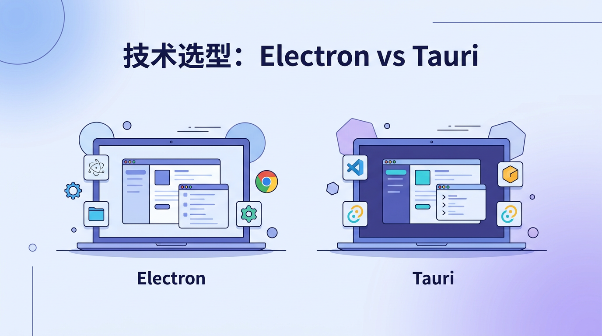
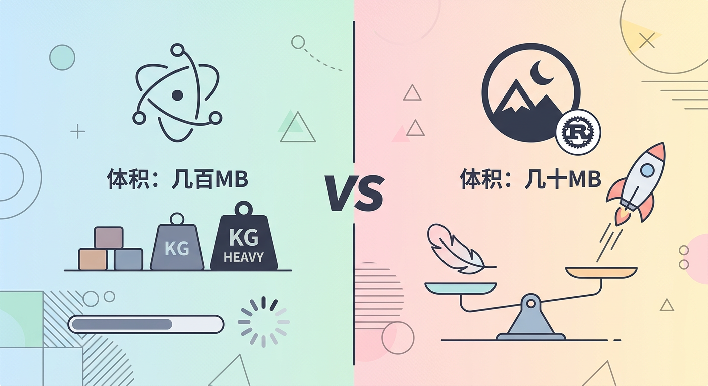
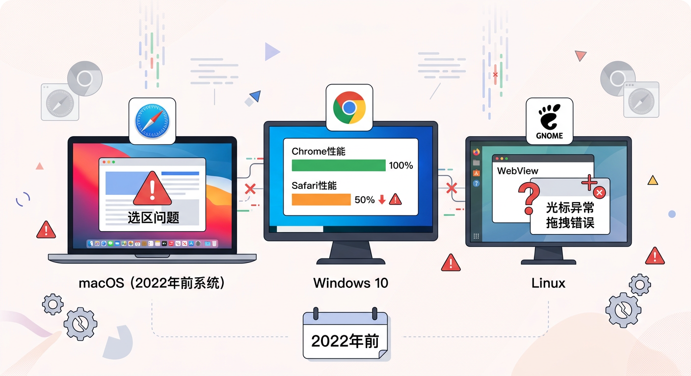
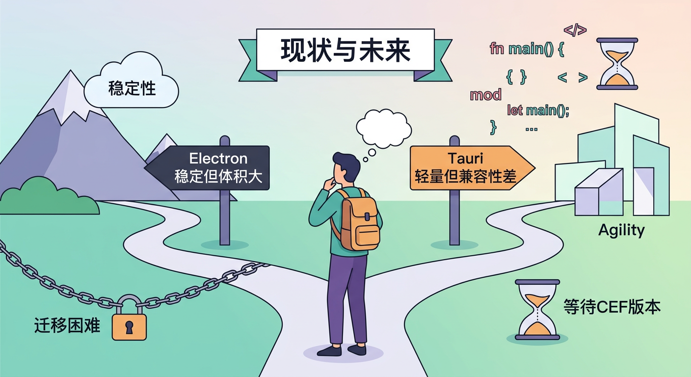

# 技术选型：Electron vs Tauri

---

## 初始选择：为什么选择 Tauri？

### 调研阶段的考量

- **体积优势**：Tauri 只需几十MB，而 Electron 动辄几百MB
- **技术亮点**：Rust 语言的性能和安全性噱头
- **轻量化**：更小的安装包，更快的下载速度

### 看似完美的选择

---

## 现实的挑战：兼容性噩梦

### WebView 的碎片化问题

- **跨平台差异**：不同操作系统的 WebView 实现差异巨大
- **版本碎片**：同一系统的不同版本表现不一致

### Safari 的特殊问题

- **编辑器噩梦**：
  - 选区逻辑与 Chrome 不同
  - 光标行为异常
  - 拖拽逻辑不一致
- **性能差距**：实际场景测试仅为 Chrome 的 50%
- **用户反馈**：越旧的电脑体验越差（2022年前的系统）

### 测试困境

- 没有对应设备难以复现问题
- 用户报告的兼容性问题难以修复

---

## 现状与未来

### 进退两难

- **迁移困难**：大量 Rust 代码已投入，回到 Electron 成本过高
- **等待官方**：Tauri 承诺的 CEF 版本遥遥无期
- **用户体验**：性能和兼容性问题持续影响用户满意度

### 经验教训

- 轻量化不是唯一标准
- 生态成熟度和兼容性同样重要
- 技术选型需要更全面的长期考量

